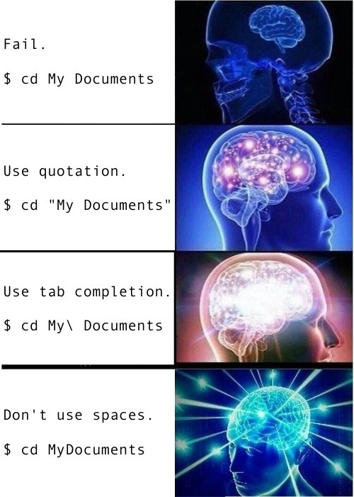

name: toc

```{css, echo=FALSE}
@media print {
  .has-continuation {
    display: block !important;
  }
}
```

```{r setup, include=FALSE}
options(htmltools.dir.version = FALSE)
library(knitr)
opts_chunk$set(
  prompt = T, ## See hook below. I basically want a "$" prompt for every bash command in this lecture.
  fig.align="center", #fig.width=6, fig.height=4.5, 
  # out.width="748px", #out.length="520.75px",
  dpi=300, #fig.path='Figs/',
  cache=F#, echo=F, warning=F, message=F
  )
## Next hook based on this SO answer: https://stackoverflow.com/a/39025054
knit_hooks$set(
  prompt = function(before, options, envir) {
    options(
      prompt = if (options$engine %in% c('sh','bash')) '$ ' else 'R> ',
      continue = if (options$engine %in% c('sh','bash')) '$ ' else '+ '
      )
})
```

# Table of contents

1. [Prologue](#prologue)

2. [Introduction](#intro)

3. [Bash shell basics](#basics)

4. [Files and directories](#files)

5. [Working with text files](#text)

6. [Redirecting and pipes](#pipes)

7. [Iteration (for loops)](#iteration)

8. [Scripting](#scripting)

9. [User roles and file permissions](#permissions)

10. [Next steps](#steps)

11. [Appendix (Windows users only)](#windows)


---
class: inverse, center, middle
name: prologue

# Prologue

<html><div style='float:left'></div><hr color='#EB811B' size=1px width=796px></html>

---

# Student presentation: Git GUI

As I said in our previous lecture, I think the Git + RStudio (and/or the shell) workflow will be optimal for most of you. 

But here are some nice standalone Git GUIs that you might want to consider:
- [Gitkraken](https://www.gitkraken.com/)
- [SourceTree](https://www.sourcetreeapp.com/)
- [GitHub Desktop](https://desktop.github.com/)
- [Atom](https://github.atom.io/)
- [VS Code](https://code.visualstudio.com/docs/introvideos/versioncontrol)

---

# Checklist

☑ Have you cloned the [course lecture repo](https://github.com/uo-ec607/lectures) to your local machine?

☑ Once that's done, pull to get the latest lecture slides.

☑ Do you have Bash-compatible shell? (**Windows** users: see [here](#windows) before continuing.)

--

</br>

I'm also going to recommend that you spruce up your GitHub profiles. 
- Add your full name, a profile picture, link to website, etc.
- No-one wants to work with (or hire) a barcode.

--

</br>

Today's lecture is the last detour before we get back to data analyis with R and RStudio.
- Laying proper foundations with Git and the shell will put us in a strong positon for advanced data science work as the course develops.

---
class: inverse, center, middle
name: intro

# Introduction
<html><div style='float:left'></div><hr color='#EB811B' size=1px width=796px></html>

---

# The Unix philosophy

The shell tools that we're going to be using today have their roots in the [Unix](https://en.wikipedia.org/wiki/Unix) family of operating systems originally developed at Bells Labs in the 1970s.

Besides paying homage, acknowledging the Unix lineage is important because these tools still embody the "[Unix philosophy](https://en.wikipedia.org/wiki/Unix_philosophy)":

> **Do One Thing And Do It Well** 

--

By pairing and chaining well-designed individual components, we can build powerful and much more complex larger systems.
- You can see why the Unix philosophy is also referred to as "minimalist and modular".
  
Again, this philosophy is very clearly expressed in the design and functionality of the Unix shell.

---

# Definitions

Don't be thrown off by terminology: *shell*, *terminal*, *tty*, *command prompt*, etc. 
- These are all basically just different names for the same thing.<sup>1</sup>
- They are all referring to a **command line interface** (CLI).

.footnote[
<sup>1</sup> [Truth be told](https://unix.stackexchange.com/questions/4126/what-is-the-exact-difference-between-a-terminal-a-shell-a-tty-and-a-con), there are some subtle and sometimes important differences, as well as some interesting history behind the names. But we can safely ignore these here.
]

--

There are many shell variants, but we're going to focus on [**Bash**](https://www.gnu.org/software/bash/) (i.e. **B**ourne **a**gain **sh**ell).
- Included by default on Linux and MacOS.
- Windows users need to install a Bash-compatible shell first (again, see [here](#windows)).

--

</br>

(For the record, I primarily use [zsh](https://ohmyz.sh/) (i.e. the "Z shell") &mdash; which is now also the [default shell](https://support.apple.com/en-us/HT208050) on MacOS. As a result, my shell might look slightly different to yours during live coding sessions. The commands will stay the same, though.)


---

# Why bother with the shell?

1. Power
  - Both for executing commands and for fixing problems. There are some things you just can't do in an IDE or GUI.
  - It also avoids memory complications associated with certain applications and/or IDEs. We'll get to this issue later in the course.
2. Reproducibility
 - Scripting is reproducible, while clicking is not.
3. Interacting with servers and super computers
  - The shell is often the only game in town for high performance computing. We'll get to this later in the course.
4. Automating workflow and analysis pipelines
  - Easily track and reproduce an entire project (e.g. use a Makefile to combine multiple programs, scripts, etc.)

--

We're going to focus on 1, 2 and 3 in this course. That's not to say that 4 is unimportant (far from it!), but we just won't have time to cover it. 
- [Here](https://stat545.com/automation-overview.html), [here](https://books.ropensci.org/drake/index.html), and [here](https://web.stanford.edu/~gentzkow/research/CodeAndData.pdf) are great places to start learning about automation on your own.

---

# Things that I use the shell for

- Git
- Renaming and moving files *en masse*
- Finding things on my computer
- Combining and manipulating PDFs
- Installing and updating software
- Scheduling tasks
- Monitoring system resources
- Connecting to cloud environments
- Running analyses ("jobs") on super computers
- etc.

--

<i>
Personal aside: One of the (many) nice things about being a Linux user is that it demystifies the shell. You end up using the shell for various day-to-day operations and so inevitably become very comfortable using it. Every year I manage to convince at least one student to switch...
- I recommend [Endeavour OS](https://endeavouros.com/), though [Ubuntu](https://ubuntu.com/) and [Elementary](https://elementary.io/) are good places to start too.
</i>

---
class: inverse, center, middle
name: basics

# Bash shell basics
<html><div style='float:left'></div><hr color='#EB811B' size=1px width=796px></html>

---

# First look

Let's open up our Bash shell. 

A convenient way to do this is through [RStudio's built-in Terminal](https://support.rstudio.com/hc/en-us/articles/115010737148-Using-the-RStudio-Terminal).
- Hitting `Shift`+`Alt`+`T` will cause a "Terminal" tab to open up in the bottom-left window pane (i.e. next to the "Console" tab).
- This should run Bash by default if it is installed on your system. (Windows users: Once again, see [here](#wsl-rstudio).)

--

</br>

P.S. Of course, it's always possible to open up the Bash shell directly if you prefer.
- [Linux](https://www.wikihow.com/Open-a-Terminal-Window-in-Ubuntu)
- [Mac](https://www.techwalla.com/articles/how-to-open-terminal-on-a-macbook)
- [Windows](https://www.howtogeek.com/265900/everything-you-can-do-with-windows-10s-new-bash-shell/)

---

# First look (cont.)

You should see something like:

```bash
 username@hostname:~$
```

--

This is shell-speak for: "Who am I and where am I?"
  <!-- - Type in `$ whoami` without the leading dollar sign to confirm. -->

---
count: false

# First look (cont.)

You should see something like:

```bash
 `username`@hostname:~$ 
```

This is shell-speak for: "Who am I and where am I?"

- `username` denotes a specific user (one of potentially many on this computer). 


---
count: false

# First look (cont.)

You should see something like:

```bash
 username`@hostname`:~$ 
```

This is shell-speak for: "Who am I and where am I?"

- `username` denotes a specific user (one of potentially many on this computer). 

- `@hostname` denotes the name of the computer or server.

---
count: false

# First look (cont.)

You should see something like:

```bash
 username@hostname`:~`$ 
```

This is shell-speak for: "Who am I and where am I?"

- `username` denotes a specific user (one of potentially many on this computer). 

- `@hostname` denotes the name of the computer or server.

- `:~` denotes the directory path (where `~` signifies the user's home directory).


---
count: false

# First look (cont.)

You should see something like:

```bash
 username@hostname:~`$`
```

This is shell-speak for: "Who am I and where am I?"

- `username` denotes a specific user (one of potentially many on this computer). 

- `@hostname` denotes the name of the computer or server.

- `:~` denotes the directory path (where `~` signifies the user's home directory).

- `$` denotes the start of the command prompt.
  - We'll get to this later, but for a special "superuser" called root, the dollar sign will change to a `#`.

---

# Useful keyboard shortcuts

- `Tab` completion.

- Use the `↑` (and `↓`) keys to scroll through previous commands.

- `Ctrl`+`→` (and `Ctrl`+`←`) to skip whole words at a time.

- `Ctrl`+`a` moves the cursor to the beginning of the line.

- `Ctrl`+`e` moves the cursor to the end of the line.

- `Ctrl`+`k` deletes everything to the right of the cursor.

- `Ctrl`+`u` deletes everything to the left of the cursor.

- `Ctrl`+`Shift`+`c` to copy and `Ctrl`+`Shift`+`v` to paste.

- `clear` to clear your terminal.

---

# Syntax

All Bash commands have the same basic syntax:

**<center>command option(s) argument(s)</center>**

Examples:

  ```bash
  $ ls -lh ~/Documents/
  ```
  ```bash
  $ sort -u myfile.txt
  ```

---
count: false

# Syntax

All Bash commands have the same basic syntax:

**<center><span style='background: #ffff88;'>command</span> option(s) argument(s)</center>**

Examples:

  ```bash
  $ `ls` -lh ~/Documents/
  ```
  ```bash
  $ `sort` -u myfile.txt
  ```

---
count: false

# Syntax

All Bash commands have the same basic syntax:

**<center>command <span style='background: #ffff88;'>option(s)</span> argument(s)</center>**

Examples:

  ```bash
  $ ls `-lh` ~/Documents/
  ```
  ```bash
  $ sort `-u` myfile.txt
  ```


---
count: false

# Syntax

All Bash commands have the same basic syntax:

**<center>command option(s) <span style='background: #ffff88;'>argument(s)</span></center>**

Examples:

  ```bash
  $ ls -lh `~/Documents/`
  ```
  ```bash
  $ sort -u `myfile.txt`
  ```

---

# Syntax

All Bash commands have the same basic syntax:

**<center>command option(s) argument(s)</center>**

Examples:

  ```bash
  $ ls -lh ~/Documents/
  ```
  ```bash
  $ sort -u myfile.txt
  ```

</br>

**commands**
- You don't always need options or arguments. (E.g. `$ ls ~/Documents/` and `$ ls -lh` are both valid commands that will yield output.)
- However, you always need a command.

---

# Syntax (cont.)

**options** (also called **flags**)
- Start with a dash.
- Usually one letter.
- Multiple options can be chained together under a single dash.
  ```bash
  $ ls -l -a -h /var/log ## This works
  $ ls -lah /var/log ## So does this
  ```
- An exception is with (rarer) options requiring two dashes.
  ```bash
  $ ls --group-directories-first --human-readable /var/log
  ```

**arguments**
- Tell the command *what* to operate on.
- Usually a file, path, or a set of files and folders.

---

# Help: man

The `man` command ("manual pages") is your friend if you ever need help.
- Tip: Hit spacebar to scroll down a page at a time, "h" to see the help notes of the `man` command itself and "q" to quit.

```{bash man}
man ls
```

---

# Help: man (cont.)

A useful feature of `man` is quick pattern searching with "/pattern".
- Try this now by running `$ man ls` again and then typing "/human" and hitting the return key. 
- To continue on to the next case, hit `n`. (It won't work here because the pattern "human" only occurs once in the manual file.)

--

</br>

Again, this and other `man` tricks tricks are detailed in the help pages (hit "h").

---

# Help: cheat

I also like the [cheat](https://github.com/chrisallenlane/cheat) utility, which provides a more readable summary / cheatsheet of various command. You'll need to install it first. (Linux and MacOS only.)

```
$ cheat ls

## # Displays everything in the target directory
## ls path/to/the/target/directory
## 
## # Displays everything including hidden files
## ls -a
## 
## # Displays all files, along with the size (with unit suffixes) and timestamp
## ls -lh 
## 
## # Display files, sorted by size
## ls -S
## 
## # Display directories only
## ls -d */
## 
## # Display directories only, include hidden
## ls -d .*/ */
```

---
class: inverse, center, middle
name: files

# Files and directories
<html><div style='float:left'></div><hr color='#EB811B' size=1px width=796px></html>

---

# Navigation

Key navigation commands:

- `pwd` to print (the current) working directory.

- `cd` to change directory.

```{bash nav1}
pwd
```

--

You can use absolute paths, but it's better to use relative paths and invoke special symbols for a user's home folder (`~`), current directory (`.`), and parent directory (`..`) as needed. 

```{bash nav2}
cd examples ## Move into the "examples" sub-directory of this lecture directory.
cd ../.. ## Now go back up two directories.
pwd
```

---

# Navigation (cont.)

Beware of directory names that contain spaces. Say you have a directory called "My Documents". (I'm looking at you, Windows.)

- Why won't `$ cd My Documents` work?

--

**Answer:** Bash syntax is super pedantic about spaces and ordering. Here it thinks that "My" and "Documents" are separate arguments.

--

  - Small brain: Use quotation marks: `$ cd "My Documents"`.

  - Big brain: Use Tab completion to automatically "escape" the space: `$ cd My\ Documents`. 
  
  - Galaxy brain: Don't use spaces in file and folder names.

---

# Navigation (cont.)

<div align="center">

</div>

---

# Listing files and their properties

We're about to go into more depth about the `ls` command.
- To do this effectively, it will be helpful if we're all working off the same group of files and folders.
- Navigate to the directory containing these lecture notes (i.e. `03-shell`). Now list the contents of the  `examples/` sub-directory with the `-lh` option ("long format", "human readable").

```{bash ls}
# cd PathWhereYouClonedThisRepo/lectures/03-shell ## change as needed
ls -lh examples
```

---

# Listing files and their properties (cont.)

What does this all mean? Let's focus on the top line.

```bash
drwxr-xr-x 2 grant users 4.0K Jan 12 22:12 ABC
```

---
count:false

# Listing files and their properties (cont.)

What does this all mean? Let's focus on the top line.

<p span style="font-family:Fira Code; font-size:80%; color: #333; background: #f8f8f8; padding: 0.5em;";>
<span style='background: #ffff88;'>d</span>rwxr-xr-x 2 grant users 4.0K Jan 12 22:12 ABC</span>

- The first column denotes the object type:
  - `d` (directory or folder), `l` (link), or `-` (file)

---

count:false

# Listing files and their properties (cont.)

What does this all mean? Let's focus on the top line.

<p span style="font-family:Fira Code; font-size:80%; color: #333; background: #f8f8f8; padding: 0.5em;";>d<span style='background: #ffff88;'><span style='color: #e41a1c;'>rwx</span><span style='color: #377eb8;'>r-x</span><span style='color: #4daf4a;'>r-x</span></span> 2 grant users 4.0K Jan 12 22:12 ABC</span>

- <span style='color: #A9A9A9;'>The first column denotes the object type:
  - `d` (directory or folder), `l` (link), or `-` (file)</span>
- Next, we see the permissions associated with the object's three possible user types: 1) <span style='color: #e41a1c;'>owner</span>, 2) <span style='color: #377eb8;'>the owner's group</span>, and 3) <span style='color: #4daf4a;'>all other users</span>.
  - Permissions reflect `r` (read), `w` (write), or `x` (execute) access.
  - <b>`-`</b> denotes missing permissions for a class of operations.

---
count:false

# Listing files and their properties (cont.)

What does this all mean? Let's focus on the top line.

<p span style="font-family:Fira Code; font-size:80%; color: #333; background: #f8f8f8; padding: 0.5em;";>drwxr-xr-x <span style='background: #ffff88;'>2</span> grant users 4.0K Jan 12 22:12 ABC</span>

- <span style='color: #A9A9A9;'>The first column denotes the object type:
  - `d` (directory or folder), `l` (link), or `-` (file)</span>
- <span style='color: #A9A9A9;'>Next, we see the permissions associated with the object's three possible user types: 1) owner, 2) the owner's group, and 3) all other users.
  - Permissions reflect `r` (read), `w` (write), or `x` (execute) access.
  - <b>`-`</b> denotes missing permissions for a class of operations.</span>
- The number of [hard links](http://www.giannistsakiris.com/2011/04/15/counting-and-listing-hard-links-on-linux/) to the object.

---
count:false

# Listing files and their properties (cont.)

What does this all mean? Let's focus on the top line.

<p span style="font-family:Fira Code; font-size:80%; color: #333; background: #f8f8f8; padding: 0.5em;";>drwxr-xr-x 2 <span style='background: #ffff88;'><span style='color: #e41a1c;'>grant</span> <span style='color: #377eb8;'>users</span></span> 4.0K Jan 12 22:12 ABC</span>

- <span style='color: #A9A9A9;'>The first column denotes the object type:
  - `d` (directory or folder), `l` (link), or `-` (file)</span>
- <span style='color: #A9A9A9;'>Next, we see the permissions associated with the object's three possible user types: 1) owner, 2) the owner's group, and 3) all other users.
  - Permissions reflect `r` (read), `w` (write), or `x` (execute) access.
  - <b>`-`</b> denotes missing permissions for a class of operations.</span>
- <span style='color: #A9A9A9;'>The number of hard links to the object.</span>
- We also see the identity of the object's <span style='color: #e41a1c;'>owner</span> and their <span style='color: #377eb8;'>group</span>.

---
count:false

# Listing files and their properties (cont.)

What does this all mean? Let's focus on the top line.

<p span style="font-family:Fira Code; font-size:80%; color: #333; background: #f8f8f8; padding: 0.5em;";>drwxr-xr-x 2 grant users <span style='background: #ffff88;'>4.0K Jan 12 22:12 ABC</span></span>

- <span style='color: #A9A9A9;'>The first column denotes the object type:
  - `d` (directory or folder), `l` (link), or `-` (file)</span>
- <span style='color: #A9A9A9;'>Next, we see the permissions associated with the object's three possible user types: 1) owner, 2) the owner's group, and 3) all other users.
  - Permissions reflect `r` (read), `w` (write), or `x` (execute) access.
  - <b>`-`</b> denotes missing permissions for a class of operations.</span>
- <span style='color: #A9A9A9;'>The number of hard links to the object.</span>
- <span style='color: #A9A9A9;'>We also see the identity of the object's owner and their group.</span>
- Finally, we see some descriptive elements about the object: 
  - Size, date and time of creation, and the object name.

---
count:false

# Listing files and their properties (cont.)

What does this all mean? Let's focus on the top line.

```bash
drwxr-xr-x 2 grant users 4.0K Jan 12 22:12 ABC
```

- The first column denotes the object type:
  - `d` (directory or folder), `l` (link), or `-` (file)
- Next, we see the permissions associated with the object's three possible user types: 1) owner, 2) the owner's group, and 3) all other users.
  - Permissions reflect `r` (read), `w` (write), or `x` (execute) access.
  - <b>`-`</b> denotes missing permissions for a class of operations.
- The number of hard links to the object.
- We also see the identity of the object's owner and their group.
- Finally, we see some descriptive elements about the object: 
  - Size, date and time of creation, and the object name.

</br>
Note: We'll return to file permissions and ownership at the end of the lecture.

---

# Create: touch and mkdir

One of the most common shell tasks is object creation (files, directories, etc.)

We use `mkdir` to create directories. E.g. To create a new "testing" directory:
```{bash mkdir}
mkdir testing
```

We use `touch` to create (empty) files. E.g. To add some files to our new directory:
```{bash touch}
touch testing/test1.txt testing/test2.txt testing/test3.txt
```

--

Check that it worked:
```{bash}
ls testing
```

---

# Remove: rm and rmdir

Let's delete the objects that we just created. Start with one of the .txt files, by using `rm`.
- We could delete all the files at the same time, but you'll see why I want to keep some.

```{bash rm1}
rm testing/test1.txt
```

The equivalent command for directories is `rmdir`.
```{bash rmdir, error=T}
rmdir testing
```

--

Uh oh... It won't let us delete the directory while it still has files inside of it. The solution is to use the `rm` command again with the "recursive" (`-r` or `-R`) and "force" (`-f`) options. 
- Excluding the `-f` option is safer, but will trigger a confirmation prompt for every file, which I'd rather avoid here.

```{bash rm2, error=T}
rm -rf testing ## Success
```

---

# Copy: cp

The syntax for copying is `$ cp object path/copyname`
- If you don't provide a new name for the copied object, it will just take the old name.
- However, if there is already an object with the same name in the target destination, then you'll have to use `-f` to force an overwrite.

```{bash cp}
## Create new "copies" sub-directory
mkdir examples/copies
## Now copy across a file (with a new name)
cp examples/reps.txt examples/copies/reps-copy.txt
## Show that we were successful
ls examples/copies
```

--

You can use `cp` to copy directories, although you'll need the `-r` (or `-R`) flag if you want to recursively copy over everything inside of it to. 
- Try this by copying over the `meals/` sub-directory to `copies/`.

---

# Move (and rename): mv 

The syntax for moving is `$ mv object path/newobjectname` 

```{bash mv1}
 ## Move the abc.txt file and show that it worked
mv examples/ABC/abc.txt examples
ls examples/ABC ## empty
```
```{bash mv2}
## Move it back again
mv examples/abc.txt examples/ABC
ls examples/ABC ## not empty
```

--

Note that "moving" an object within the same directory, but with the (newobjectname) option, is effectively the same as renaming it.

```{bash mv3}
 ## Rename reps-copy to reps2 by "moving" it with a new name
mv examples/copies/reps-copy.txt examples/copies/reps2.txt
ls examples/copies
```

---

# Rename _en masse_: rename

Speaking of renaming, a more convenient way to do this is with `rename`. 
- The syntax is `pattern replacement file(s)`

For example, say we want to change the file type (i.e. extension) of a particular file in the `examples/meals` directory.

```{bash rename1}
rename csv TXT examples/meals/monday.csv
ls examples/meals
```

---

# Rename _en masse_: rename (cont.)

Where `rename` really shines, however, is in conjunction with regular expressions and wildcards (more on the next slide).
- This works especially well for dealing with a whole list of files or folders.

For example, let's change _all_ of the file extensions in the `examples/meals` directory.

```{bash rename2}
rename csv TXT examples/meals/*
ls examples/meals
```

--

Better change them back before we continue. (Confirm that this worked for yourself.)

```{bash rename3}
rename TXT csv examples/meals/*
```

---

# Wildcards

[Wildcards](http://tldp.org/LDP/GNU-Linux-Tools-Summary/html/x11655.htm) are special characters that can be used as a replacement for other characters. The two most important ones are:

1. Replace any number of characters with `*`. 
 - Convenient when you want to copy, move, or delete a whole class of files.
  ```{bash asterisk}
  cp examples/*.sh examples/copies ## Copy any file with an .sh extension to "copies"
  rm examples/copies/* ## Delete everything in the "copies" directory
  ```

2. Replace a single character with `?`
 - Convenient when you want to discriminate between similarly named files.
  ```{bash qmark}
  ls examples/meals/??nday.csv
  ls examples/meals/?onday.csv
  ```  

```{bash, echo = F}
## Remove "copies" sub-dir to avoid "file alredy exists" problem when re-knitting this doc
rm -rf examples/copies
```


???

We've already seen one wildcard in the form of the backlash (`\`) that was used to escape spaces in file and folder names, e.g. `$ cd My\ Documents`.

---

# Find

The last command that I want to mention w.r.t. navigation is `find`.
- This can be used to locate files and directories based on a variety of criteria; from pattern matching to object properties.

```{bash find1}
find examples -iname "monday.csv" ## will automatically do recursive
```
```{bash find2}
find . -iname "*.txt" ## must use "." to indicate pwd
```
```{bash find3}
find . -size +100k ## find files larger than 100 KB
```
---
class: inverse, center, middle
name: text

# Working with text files
<html><div style='float:left'></div><hr color='#EB811B' size=1px width=796px></html>

---

# Motivation

Economists and other (data) scientists spend a lot of time working with text, including scripts, Markdown documents, and delimited text files like CSVs. 

It therefore makes sense to spend a few slides showing off some Bash shell capabilities for working with text files.
- We'll only scratch the surface, but hopefully you'll get an idea of how powerful the shell is in the text domain.

---

# Counting text: wc

You can use the `wc` command to count: 1) lines of text, 2) the number of words, and 3) the number of characters.

Let's demonstrate with a text file containing all of Shakespeare's Sonnets.<sup>1</sup>

```{bash wc}
wc examples/sonnets.txt
```

.footnote[
<sup>1</sup> Courtesy of [Project Gutenburg](http://www.gutenberg.org/cache/epub/1041/pg1041.txt).
]

--

</br> 

PS — You couldn't tell here, but the character count is actually higher than we'd get if we (bothered) counting by hand, because `wc` counts the invisible newline character "\n".

---

# Reading text

### Read everything: cat

The simplest way to read in text is with the `cat` ("concatenate") command. Note that `cat` will read in *all* of the text. You can scroll back up in your shell window, but this can still be a pain.

Again, let's demonstrate using Shakespeare's Sonnets. (This will overflow the slide.)
- I'm also going to use the `-n` flag because I want to show line numbers.

--

```{bash cat}
cat -n examples/sonnets.txt
```

---

# Reading text (cont.)

### Scroll: more and less

The `more` and `less` commands provide extra functionality over `cat`. For example, they allow you to move through long text one page at a time.
- Try this yourself with `$ more examples/sonnets.txt`
- You can move forward and back using the "f" and "b" keys, and quit by hitting "q".

### Preview: head and tail

The `head` and `tail` commands let you limit yourself to a preview of the text, down to a specified number of rows. (The default is 10 rows if you don't specify a number.)

```{bash head}
head -n 3 examples/sonnets.txt ## First 3 rows
# head examples/sonnets.txt ## First 10 rows (default)
```

---

# Reading text (cont.)

### Preview: head and tail (cont.)

`tail` works very similarly to `head`, but starting from the bottom. For example, we can see the very last row of a file as follows

```{bash tail1}
tail -n 1 examples/sonnets.txt ## Last row
```

--

However, there's one other neat option that I want to show you. By using the `-n +N` option, we can specify that we want to preview all lines starting from row N *and after*. E.g.

```{bash tail2}
tail -n +3024 examples/sonnets.txt ## Show everything from line 3024
```

---

# Find patterns: grep

To find patterns in text, we can use regular expression-type matching with `grep`. 

For example, say we want to find the famous opening line to Shakespeare's [Sonnet 18](https://en.wikipedia.org/wiki/Sonnet_18).
- I'm going to include the `-n` ("number") flag to get the line that it occurs on. 

```{bash grep1}
grep -n "Shall I compare thee" examples/sonnets.txt
```

--

By default, `grep` returns all matching patterns. 
- What happens if you run `$ grep -n "summer" examples/sonnets.txt`?
- Or, for that matter, `$ grep -n "the" examples/sonnets.txt`?


---

# Find patterns: grep (cont.)

Note that `grep` can be used to identify patterns in a group files (e.g. within a directory) too.
 - This is particularly useful if you are trying to identify a file that contain, say, a function name. 
 
Here's a simple example: Which days will I eat pasta this week? 
 - I'm using the `R` (recursive) and `l` (just list the files; don't print the output) flags.

```{bash grep2}
grep -Rl "pasta" examples/meals
```

--

What about muesli? And pizza?

--

Take a look at the `grep` man or cheat file for other useful examples and flags
(e.g. `-i` for ignore case).

PS &mdash; Another cool (and very fast) shell utility along these lines is [the silver searcher](https://github.com/ggreer/the_silver_searcher). Check it out.

---

# Manipulate text: sed and awk

There are two main commands for manipulating text in the shell, namely `sed` and `awk`.
- Both of these are very powerful and flexible (`awk` is particularly good with CSVs).

I'm going to show two basic examples without going into depth, but I strongly encourage you to explore more on your own. (Mac users: See [here](https://unix.stackexchange.com/questions/13711/differences-between-sed-on-mac-osx-and-other-standard-sed).)

--

**Example 1.** Replace one text pattern with another.

```{bash nursery}
cat examples/nursery.txt
```

Now, change "Jack" to "Bill".

```{bash sed1a}
sed -i 's/Jack/Bill/g' examples/nursery.txt
cat examples/nursery.txt
```

```{bash, echo=F}
## Change it back for when we want to re-knit the file.
sed -i 's/Bill/Jack/g' examples/nursery.txt
```

---

# Manipulate text: sed and awk (cont.)

**Example 2.** Find and count the 10 most commonly used words in Shakespeare's Sonnets.
- Note: We'll learn more about the pipe operator (`|`) in a few slides.

```{bash sed2}
sed -e 's/\s/\n/g' < examples/sonnets.txt | sort | uniq -c | sort -nr | head -10
```

--

</br>

PS &mdash; You can also use double quotes (") instead of single ones (') for `sed` and `awk` commands. This can sometimes run you into trouble with special symbols or patterns in the text, though. (Mostly, I want you to be mindful of accidental matching or closing quotation mark pairs.)

---

# Sorting and removing duplicates: sort

We can remove duplicate lines in various ways in Bash, but I'll demonstrate using `sort`.

```{bash reps}
cat examples/reps.txt
```

There's a fair bit of repetition in this file (and a double entendre). Let's fix that. 
- Note the use of the `-u` ("unique") flag to remove duplicates. I'll also add a `-r` ("reverse") flag, but only because `sort` orders alphabetically and this makes less sense for this simple example.

```{bash sort}
sort -ur examples/reps.txt
```

---
class: inverse, center, middle
name: pipes

# Redirecting and pipes
<html><div style='float:left'></div><hr color='#EB811B' size=1px width=796px></html>

---

# Redirect: >

You can send output from the shell to a file using the redirect operator `>`

For example, let's print a message to the shell using the `echo` command.

```{bash}
echo "At first, I was afraid, I was petrified"
```

--

If you wanted to save this output to a file, you need simply redirect it to the filename of choice.

```{bash}
echo "At first, I was afraid, I was petrified" > survive.txt
find survive.txt ## Show that it now exists
```

---

# Redirect: > (cont.)

If you want to *append* text to an existing file, then you should use `>>`.
- Using `>` will try to overwrite the existing file contents.

```{bash}
echo "'Kept thinking I could never live without you by my side" >> survive.txt
cat survive.txt
```

```{bash, echo = F}
## Remove file so that we do't keep adding to it when we re-knit these slides
rm survive.txt
```

--

</br>

(Don't be shy. You can hum the rest of the song to yourself now.)

--

</br>

Aside: I often use this sequence when adding files to my .gitignore. E.g. `$ echo "*.csv" >>  .gitignore`.

---

# Pipes: |

The pipe operator `|` is one of the coolest features in Bash.
- It lets you send (i.e. "pipe") intermediate output to another command.
- In other words, it allows us to chain together a sequence of simple operations and thereby implement a more complex operation. (Remember the Unix philosophy!)

Let me demonstrate using a very simple example.

```{bash pipe1}
cat -n examples/sonnets.txt | head -n100 | tail -n10
```

---

# Pipes: | (cont.)

An exercise: Say I want to pull out all of text from (but limited to) Sonnet 18. 
- How might you go about this task using the pipe and other Bash commands?
- Tip: Use your knowledge of the starting line (i.e. 336) and the fact that sonnets are 14 lines long.

--

```{bash pipe2}
tail -n +336 examples/sonnets.txt | head -n14
```

---

# Pipes: | (cont.)

A final aside about pipe the friends: You can use it to search through your Bash command history. 
- Every shell command you type is stored in a `~/.bash_history` file.<sup>1</sup>

What happens if you type `$ cat ~/.bash_history | grep head`?

.footnote[
<sup>1</sup> The file might change depending on your preferred shell. E.g. For Zsh it's `~/.zhistory`.
]

--

</br>

FWIW, I use this approach often to remind myself of certain shell commands that I tend to forget. A related and extremely useful command is [`Ctrl`+`R`](https://unix.stackexchange.com/questions/73498/how-to-cycle-through-reverse-i-search-in-bash), which lets you search and cycle through your shell history.

---
class: inverse, center, middle
name: iteration

# Iteration (_for_ loops)
<html><div style='float:left'></div><hr color='#EB811B' size=1px width=796px></html>

---

# _for_ loop syntax

_for_ loops in Bash work similarly to other programming languages that you are probably familiar with. 

The basic syntax is 

```bash
for i in LIST
do 
  OPERATION $i ## the $ sign indicates a variable in bash
done
```

--

We can also condense things into a single line by using ";" appropriately. 

```bash
for i in LIST; do OPERATION $i; done
```

--

I find the top approach more readable, but I may use single line approach in these slides to save vertical space.
- Note: Using ";" isn't limited to _for loops_. Semicolons are a standard way to denote line endings in Bash.

---

# Example 1: Print a sequence of numbers

To help make things concrete, here's a simple _for_ loop in action.

```{bash for1a}
for i in 1 2 3 4 5; do echo $i; done
```

--

FWIW, we can use bash's brace expansion (`{1..n}`) to save us from having to write out a long sequence of numbers.

```{bash for1b}
for i in {1..5}; do echo $i; done
```

---
name: combine_csvs

# Example 2: Combine CSVs

Here's a more realistic _for_ loop use-case that I use quite often: Combining (i.e. concatenating) multiple CSVs. 

--

Say we want to combine all the "daily" files in the `examples/meals` directory into a single CSV, which I'll call `mealplan.csv`. Here's one attempt that incorporates various bash commands and tricks that we've learned so far. The basic idea is:
1. Create a new (empty) CSV
2. Then, loop over the relevant input files, appending their contents to our new CSV

```{bash for2a, echo = FALSE}
touch examples/meals/mealplan.csv 
for i in $(ls examples/meals/*day.csv)
do 
  cat $i >> examples/meals/mealplan.csv
done
```
```bash
## create an empty CSV
$ touch examples/meals/mealplan.csv
## loop over the input files and append their contents to our new CSV
$ for i in $(ls examples/meals/*day.csv)
> do 
>   cat $i >> examples/meals/mealplan.csv
> done
```

--

Did it work? (See next slide.)

---

# Example 2: Combine CSVs (cont.)

```{bash for2b}
cat examples/meals/mealplan.csv
```

--

Hmmm. Sort of, but we need to get rid of the repeating header. 

--

Can you think of a way? 
 - Answer on the next slide. (_Hint:_ `tail` and `head`...) 

---

# Example 2: Combine CSVs (cont.)

Let's try again. First delete the old file so we can start afresh.
```{bash for2c}
rm -f examples/meals/mealplan.csv ## delete old file
```

--

Here's our adapted gameplan:
- First, create the new file by grabbing the header (i.e. top line) from any of the input files and redirecting it. No need for `touch` this time.
- Next, loop over all the input files as before, but this time only append everything _after_ the top line.

```{bash for2d, echo = FALSE}
head -1 examples/meals/monday.csv > examples/meals/mealplan.csv
for i in $(ls examples/meals/*day.csv)
do 
  tail -n +2 $i >> examples/meals/mealplan.csv
done
```
```bash
## create a new CSV by redirecting the top line of any file
$ head -1 examples/meals/monday.csv > examples/meals/mealplan.csv
## loop over the input files, appending everything after the top line
$ for i in $(ls examples/meals/*day.csv)
> do 
>   tail -n +2 $i >> examples/meals/mealplan.csv
> done
```

---

# Example 2: Combine CSVs (cont.)

It worked!

```{bash for2e}
cat examples/meals/mealplan.csv
```

--

We still have to sort the correct week order, but that's an easy job in R (or Stata, Python, etc.)
- The explicit benefit of doing the concatenating in the shell is it is _much_ more efficient, since all the files don't simultaneously have to be held in memory (i.e RAM). 
- This doesn't matter here, but can make a dramatic difference once we start working with lots of files (or even a few really big ones). We'll revisit this idea later in the big data section of the course.

```{bash for2f, echo = FALSE}
rm -f examples/meals/mealplan.csv ## Silently remove to avoid errors with later re-knits
```

---
class: inverse, center, middle
name: scripting

# Scripting
<html><div style='float:left'></div><hr color='#EB811B' size=1px width=796px></html>

---

# Hello World!

Writing code and commands interactively in the shell makes a lot of sense when you are exploring data, file structures, etc.

However, it's also possible (and often desirable) to write reproducible shell scripts that combine a sequence of commands.
- These scripts are demarcated by their `.sh` file extension.

--

Let's look at the contents of a short shell script that I've included in the examples folder.

```{bash hello}
cat examples/hello.sh
```

--

I'm sure that you already have a good idea of what this script is meant to do, but it will prove useful to quickly go through some things together.

---

# Hello World! (cont.)

```bash
*#!/bin/sh
echo -e "\nHello World!\n"

```

- `#!/bin/sh` is a [shebang](https://en.wikipedia.org/wiki/Shebang_(Unix), indicating which program to run the command with (here: any Bash-compatible shell). However, it is typically ignored (note that it begins with the hash comment character.)

---
count: false

# Hello World! (cont.)

```bash
#!/bin/sh
*echo -e "\nHello World!\n"

```

- `#!/bin/sh` is a [shebang](https://en.wikipedia.org/wiki/Shebang_(Unix), indicating which program to run the command with (here: any Bash-compatible shell). However, it is typically ignored (note that it begins with the hash comment character.)
- `echo -e "\nHello World!\n"` is the actual command that we want to run.

---
count: false

# Hello World! (cont.)

```bash
#!/bin/sh
echo -e "\nHello World!\n"

```

- `#!/bin/sh` is a [shebang](https://en.wikipedia.org/wiki/Shebang_(Unix), indicating which program to run the command with (here: any Bash-compatible shell). However, it is typically ignored (note that it begins with the hash comment character.)
- `echo -e "\nHello World!\n"` is the actual command that we want to run. The `-e` flag tells bash that we want to evaluate an expression rather than a file.

To run this simple script, you can just type in the file name and press enter.

```{bash hello_run}
examples/hello.sh
# bash examples/hello.sh ## Also works
```

---
name: rscript

# Rscript

It's important to realise that we aren't limited to running shell scripts in the shell. The exact same principles carry over to other programs and files.

The most relevant case for this class is the [`Rscript`](https://stat.ethz.ch/R-manual/R-devel/library/utils/html/Rscript.html) command for (you guessed it) executing R scripts and expressions. For example:

```{bash rscript_simple}
Rscript -e "cat('Hello World, from R!')"
```

--

Of course, the more typical `Rscript` use case is to execute full length R scripts. An optional, but very useful feature here is the ability to pass extra arguments from the shell to your R script. Consider the `hello.R` script that I've bundled in the examples folder.

```{bash rscript_hello_cat}
cat examples/hello.R
```

---

# Rscript (cont.)

The key step for using additional `Rscript` arguments is held within the top two lines.

```r
args = commandArgs(trailingOnly = TRUE)
i = args[1]; j = args[2]
```
These tell Rscript to capture any trailing arguments (i.e. after the file name) and then pass them on as objects that can be used within R. 

--

Let's run the script to see it in action.

```{bash rscript_hello}
Rscript examples/hello.R 12 9
```

--

Again, including trailing arguments is entirely optional. You could run `Rscript myfile.R` without any problems. But it often proves very useful for the type of work that you'd likely be using `Rscript` for (e.g. batching big jobs).

---

# Editing and writing scripts in the shell

Say you want to edit my (amazing) `hello.sh` script. 
- Maybe you want to add some additional lines of text, or maybe you're bothered by the fact that there should be a comma after "Hello". (It's a salutation!) 

We have already seen how to append text lines to a file. But when it comes to more complicated editing work, you're better off using a dedicated shell editor.
- I use [**vim**](https://missing.csail.mit.edu/2020/editors/). Extremely powerful, but a steep learning curve.
- An easier starting point is [**nano**](https://www.nano-editor.org/). (**Windows users**, see [here](https://stackoverflow.com/questions/36802996/bash-nano-command-not-found-at-windows-git-bash).)

Open up my script in nano by typing `$ nano examples/hello.sh`. 
- Note that the functionality is more limited than a normal text editor.
- Once you are finished editing, hit "Ctrl+X", then "y" and enter to exit.
- Finally, run the edited version of the script.

--

If you've been having trouble executing this script (or want to limit who else can execute it), then you need to alter its permissions. Which takes us neatly on to our final section...

---
class: inverse, center, middle
name: permissions

# User roles and file permissions
<html><div style='float:left'></div><hr color='#EB811B' size=1px width=796px></html>

---

# Disclaimer

*This next section is tailored towards Unix-based operating systems, like Linux or MacOS, which is why I have saved it for the end. <b>Windows users:</b> Don't be suprised if some commands don't work, especially if you haven't installed the [WSL](#windows)...* 

*Regardless, the things we learn here will become relevant to everyone (even Windows users) once we start interacting with Linux servers, spinning up Docker containers, etc. later in the course.*

---

# The superuser: root, sudo, etc.

There are two main user roles on a Linux system:   
1. Normal users 
2. A superuser (AKA "root")

Difference is one of priviledge. 
- Superusers can make system changes, install software, browse through different users' home folders, etc. Normal users are much more restricted in what they can do.
- Explains why Unix-based OS's are much more resilient to security threats like viruses. Need superuser priviledges to install (potentially malicious) software.

---

# The superuser: root, sudo, etc. (cont.)

You *can* log in as the superuser<sup>1</sup>... but this is generally considered very poor practice, since you needlessly risk messing up your system. 
- There are no safety checks and no "undo" options.

.footnote[
<sup>1</sup> Hit "p" on this slide if you really want to know how.
]

???
To switch over to the superuser, you can type `sudo -s`.
- Note the extra visual cue: root's command prompt is a `#` (not a `$`).
  ```
  root@laptop:~#
  ```

Remember to type `exit` to switch back!

(Close these presenter notes by hitting "p" again.)

--

**Question:** How, then, can normal users perform meaningful system operations (including installing new programs and updating software)?

--

**Answer:** Invoke temporary superuser status with `sudo`.

- Stands for "superuser do".
- Simply prepend `sudo` to whatever command you want to run.

```bash
grant@laptop:~$ ls /root ## fails
grant@laptop:~$ sudo ls /root ## works
```

???

Note that you have to be a "permitted" user to invoke `sudo`. 
- This should be enabled by default on your personal laptop, but if not see [here](https://www.thegeekstuff.com/2010/09/sudo-command-examples/embed/) or [here](https://www.digitalocean.com/community/tutorials/how-to-create-a-sudo-user-on-ubuntu-quickstart).

---

# Changing permissions and ownership

Let's think back to the `ABC/` directory that we saw previously while exploring the ls command.

```bash
drwxr-xr-x 2 grant users 4.0K Jan 12 22:12  ABC
```

We can change the permissions and ownership of this folder with the `chmod` and `chown` commands, respectively. We'll now review these in turn.
- Note that I'm going to use the "recursive" option (i.e. `-R`) in the examples that follow, but only because `ABC/` is a directory. You can drop that when modifying individual files.

--

PS — I'm going to skip writing out the full path for this next section to save on typing. Now is a a good time to move into the `examples/` directory if you want to follow along with my commands literally.

```{bash, eval = F}
cd examples
```

---

# chmod

Changing permissions using `chmod` depends on how those permissions are represented. 

There are two options: 1) Octal notation and 2) Symbolic notation. 
- We'll go into more detail on the next slide, but let's see some examples first.
- (Test the results yourself using the `ls -lh` command afterwards.)

--

**Example 1: rwxrwxrwx.** Read, write and execute permission for all users.
- Octal: `$ chmod -R 777 ABC`
- Symbolic: `$ chmod -R a=rwx ABC`

--

**Example 2: rwxr-xr-x.** Read, write and execute permission for the main user (i.e. owner) of the file. For all other users, read and execute permission only.
- Octal: `$ chmod -R 755 ABC`
- Symbolic: `$ chmod -R u=rwx,g=rx,o=rx ABC`

--

Now that we've seen some examples, let's get into the logic behind them.

---

# chmod (cont.)

### Octal notation

Takes advantage of the fact that `4` (for "read"), `2` (for "write"), and `1` (for "execute") can be combined in unambiguous ways.
- 7 (= 4 + 2 + 1) means read, write and execute permission.
- 5 (= 4 + 0 + 1) means read and execute permission, but not write permission.
- etc. 
- Note that Octal notation requires a number for each of the three user types: owner, owner's group, and all others. E.g. `$ chmod 777 myfile.txt`

### Symbolic notation

Links permissions to different symbols (i.e. abbreviations).
- Users: `u` ("User/owner"), `g` ("Group"), `o` ("Others""), `a` ("All")
- Permissions: `r` ("read"), `w` ("write"), `x` ("execute")
- Changes: `+` ("add permissions"), `-` ("remove permissions"), `=` ("set new permissions") 

---

# chmod (cont.)

Here's a quick comparison table with some common permission levels.

| Octal value | Symbolic value    | Permission level |
|:-----------:|:-----------------:|:----------------:|
| 777         | a+rwx             | rwxrwxrwx        |
| 770         | u+rwx,g+rwx,o-rwx | rwxrwx---        |
| 755         | a+rwx,g-w,o-w     | rwxr-xr-x        |
| 700         | u+rwx,g-rwx,o-rwx | rwx------        |
| 644         | u=rw,g=r,o=r      | rw-r--r--        |


--

</br> 

PS — Note the Symbolic method allows for relative changes, which means that you don't necessarily need to write out the whole entry in the table above. E.g. To go from the first line to the second line, you'd only need `$ chmod o-rwx myfile`.

---

# chown

Changing file ownership is somewhat easier than changing permissions, because you don't have to remember the different Octal and Symbolic notation mappings. 
- E.g. Say there is another user on your computer called "alice", then you could just assign her ownership of the ABC subfolder using:
 ```bash
 $ chown -R alice ABC
 ```

Things get a little more interesting when we want to add new users and groups, or change an existing users group.
- I'll save that for a later lecture on cloud servers, though.

---
class: inverse, center, middle
name: steps

# Next steps
<html><div style='float:left'></div><hr color='#EB811B' size=1px width=796px></html>

---

# Things we didn't cover today

I know we covered a _lot_ of ground today. I hope that I've given you a sense of how Bash works and how powerful it is.
- My main goal has been to "demystify" the shell, so that you aren't intimidated when we use shell commands later on.

At the same time, there's loads that we didn't cover.
- Environment variables, SSH, memory management (e.g. [top](https://ss64.com/bash/top.html) and [htop](https://hisham.hm/htop/)), GNU parallel, etc.
- We'll get to some of these topics in the later lectures, but please try to work some of the suggested exercises on the next slide and make use of the recommended readings.
 

---

# Next steps

### Exercises

Navigate to the `examples/` sub-directory associated with this lecture. I want you to play around with the contents using some of the different Bash commands we practiced today.
- Change the permissions on an indivdual file or a whole directory.
- Read in (or fix) some lines of text from one file and pipe them to another file.
- Count the number of times Shakespeare refers to "mistress" or "love" in his Sonnets.
- Write a new bash script and execute it.
- Etc.

### Further reading

- [The Unix Shell](http://swcarpentry.github.io/shell-novice/) (Software Carpentery)
- [The Unix Workbench](https://seankross.com/the-unix-workbench/) (Sean Kross)
- [Data Science at the Command Line](https://www.datascienceatthecommandline.com/) (Jeroen Janssens)
- [Using AWK and R to parse 25tb](https://livefreeordichotomize.com/2019/06/04/using_awk_and_r_to_parse_25tb/) (Nick Strayer)


---
class: inverse, center, middle

# Next class: *R* language basics
<html><div style='float:left'></div><hr color='#EB811B' size=1px width=796px></html>

---
class: inverse, center, middle
name: windows

# Appendix (Windows users only)
<html><div style='float:left'></div><hr color='#EB811B' size=1px width=796px></html>


---

# Bash on Windows

Windows users have two options:

### 1. [Git Bash](https://gitforwindows.org/)

- **Pros:** You should already have installed this as part of the previous lecture.
- **Cons:** Functionality is limited to Git-related commands, so various things that we're going to practice today won't work.

### 2. [Windows Subsystem for Linux (WSL)](https://docs.microsoft.com/en-us/windows/wsl/install-win10)

- **Pros:** A self-contained Linux image (terminal) that allows full Bash functionality. 
- **Cons:** Must be installed first and only available to Windows 10 users.

I'm going to go out on a limb and recommend option 2 (WSL) if available to you. It's more overhead, but I think worth it. See the next two slides for instructions and tips...

.footnote[(Back to [table of contents](#toc).)]

---
name:wsl

# WSL

The basic WSL installation guide is [**here**](https://docs.microsoft.com/en-us/windows/wsl/install-win10). 
- Follow the guide to install your preferred Linux distro. [Ubuntu](https://www.microsoft.com/en-us/p/ubuntu/9nblggh4msv6) is a good choice. 
- Then, once you've restarted your PC, come back to these slides.

After installing your chosen WSL, you need to navigate to today's lecture directory to run the examples. You have two options:

#### Option (i) Access WSL through RStudio (*recommended*)

If you access WSL through RStudio, then it will conveniently configure your path to the present working directory. So, here's how to make WSL your default [RStudio Terminal](https://support.rstudio.com/hc/en-us/articles/115010737148-Using-the-RStudio-Terminal):
- In RStudio, navigate to: *Tools > Terminal > Terminal Options...*. \[[Screenshot](pics/wsl-rstudio-1.png).\]
- Click on the dropdown menu for *New terminals open with* and select "Bash (Windows Subsystem for Linux)", Then click *OK*. \[[Screenshot](pics/wsl-rstudio-2.png).\]
- Refresh your RStudio terminal (`Alt+Shift+R`). \[[Screenshot](pics/wsl-rstudio-3.png).\]
- You should see the WSL Bash environment with the path automatically configured to the present working director, mount point and all. \[[Screenshot](pics/wsl-rstudio-4.png).\]

---
name: wsl-rstudio

# WSL (cont.)

#### Option (ii) Go directly through the WSL 

Presumably, you've cloned the course repo somewhere on your C drive. 
- The way this work is that Windows drives are mounted on the WSL's `mnt` directory. (More [here](https://www.howtogeek.com/261383/how-to-access-your-ubuntu-bash-files-in-windows-and-your-windows-system-drive-in-bash/).)
- Say you cloned the repo to "C:\\Users\\Grant\\ec607\\lectures".
- The WSL equivalent is "/mnt/c/Users/Grant/ec607/lectures".
- So, then you can navigate to today's lecture through the WSL with: `$ cd /mnt/c/Users/Grant/ec607/lectures/03-shell`. Adjust as needed.


.footnote[(Back to [table of contents](#toc).)]

--

### Which option to choose?

Both are fine, but I recommend option **(i)**. As a Windows user, being able to access a true Bash shell (i.e. terminal) conveniently from RStudio will make things *much* easier for you in my class. You can always revert back to a different shell later if you want. 

```{r gen_pdf, include = FALSE, cache = FALSE, eval = TRUE}
infile = list.files(pattern = '.html')
pagedown::chrome_print(input = infile, timeout = 100)
```
