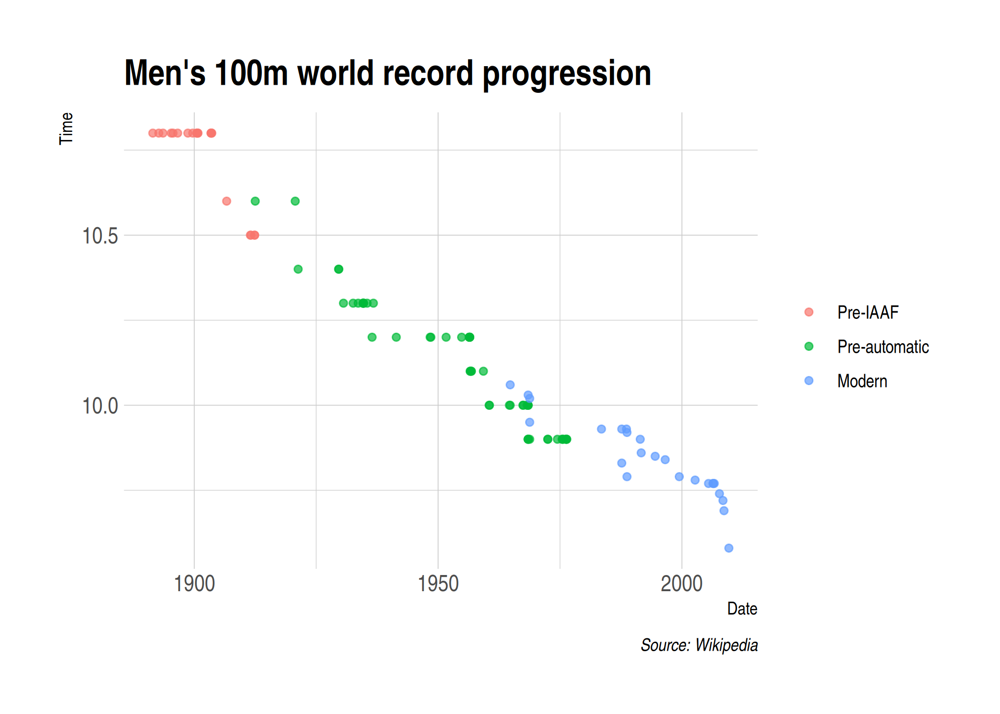

## Software requirements

### External software

Today we'll be using [SelectorGadget](https://selectorgadget.com/), which is a Chrome extension that makes it easy to discover CSS selectors.  (Install the extension directly [here](https://chrome.google.com/webstore/detail/selectorgadget/mhjhnkcfbdhnjickkkdbjoemdmbfginb).) Please note that SelectorGadget is only available for Chrome. If you prefer using Firefox, then you can try [ScrapeMate](https://addons.mozilla.org/en-US/firefox/addon/scrapemate/).

### R packages 

- New: **rvest**, **janitor**
- Already used: **tidyverse**, **lubridate**, **hrbrthemes**

Recall that **rvest** was automatically installed with the rest of the tidyverse. Still, here is a convenient way to install (if necessary) and load all of the above packages.


```r
## Load and install the packages that we'll be using today
if (!require("pacman")) install.packages("pacman")
pacman::p_load(tidyverse, rvest, lubridate, janitor, hrbrthemes)
## My preferred ggplot2 plotting theme (optional)
theme_set(hrbrthemes::theme_ipsum())
```

## Webscraping basics

The next two lectures are about getting data, or "content", off the web and onto our computers. We're all used to seeing this content in our browers (Chrome, Firefox, etc.). So we know that it must exist somewhere. However, it's important to realise that there are actually two ways that web content gets rendered in a browser: 

1. Server-side
2. Client side

You can read [here](https://www.codeconquest.com/website/client-side-vs-server-side/) for more details (including example scripts), but for our purposes the essential features are as follows: 

### 1. Server-side
- The scripts that "build" the website are not run on our computer, but rather on a host server that sends down all of the HTML code.
  - E.g. Wikipedia tables are already populated with all of the information --- numbers, dates, etc. --- that we see in our browser.
- In other words, the information that we see in our browser has already been processed by the host server. 
- You can think of this information being embeded directly in the webpage's HTML.
- **Webscraping challenges:** Finding the correct CSS (or Xpath) "selectors". Iterating through dynamic webpages (e.g. "Next page" and "Show More" tabs).
- **Key concepts:** CSS, Xpath, HTML
  
### 2. Client-side
- The website contains an empty template of HTML and CSS. 
  - E.g. It might contain a "skeleton" table without any values.
- However, when we actually visit the page URL, our browser sends a *request* to the host server.
- If everything is okay (e.g. our request is valid), then the server sends a *response* script, which our browser executes and uses to populate the HTML template with the specific information that we want.
- **Webscraping challenges:** Finding the "API endpoints" can be tricky, since these are sometimes hidden from view.
- **Key concepts:** APIs, API endpoints

Over the next week, we'll use these lecture notes --- plus some student presentations --- to go over the main differences between the two approaches and cover the implications for any webscraping activity. I want to forewarn you that webscraping typically involves a fair bit of detective work. You will often have to adjust your steps according to the type of data you want, and the steps that worked on one website may not work on another. (Or even work on the same website a few months later). All this is to say that *webscraping involves as much art as it does science*.

The good news is that both server-side and client-side websites allow for webscraping.^[As we'll see during the next lecture, scraping a website or application that is built on a client-side (i.e. API) framework is often easier; particularly when it comes to downloading information *en masse*.] If you can see it in your browser, you can scrape it. 

### Caveat: Ethical and legal limitations

The previous sentence elides some important ethical and legal considerations. Just because you *can* scrape it, doesn't mean you *should*. It is ultimately your responsibility to determine whether a website maintains legal restrictions on the content that it provides. Similarly, the tools that we'll be using are very powerful. It's fairly easy to write up a function or program that can overwhelm a host server or application through the sheer weight of requests. A computer can process commands much, much faster than we can ever type them up manually. We'll return to the "be nice" mantra at the end of this lecture, as well as in the next lecture. 

## Webscraping with **rvest** (server-side)

The primary R package that we'll be using today is **rvest** ([link](https://rvest.tidyverse.org/)), a simple webscraping library inspired by Python's **Beautiful Soup** ([link](https://www.crummy.com/software/BeautifulSoup/)), but with extra tidyverse functionality. **rvest** is designed to work with webpages that are built server-side and thus requires knowledge of the relevant CSS selectors... Which means that now is probably a good time for us to cover what these are.

### Student presentation: CSS and SelectorGadget

Time for a student presentation on [CSS](https://developer.mozilla.org/en-US/docs/Learn/CSS/Introduction_to_CSS/How_CSS_works) (i.e Cascading Style Sheets) and [SelectorGadget](http://selectorgadget.com/). Click on the links if you are reading this after the fact. In short, CSS is a language for specifying the appearance of HTML documents (including web pages). It does this by providing web browsers a set of display rules, which are formed by:

1. _Properties._ CSS properties are the "how" of the display rules. These are things like which font family, styles and colours to use, page width, etc.
2. _Selectors._ CSS selectors are the "what" of the display rules. They identify which rules should be applied to which elements. E.g. Text elements that are selected as ".h1" (i.e. top line headers) are usually larger and displayed more prominently than text elements selected as ".h2" (i.e. sub-headers).

The key point is that if you can identify the CSS selector(s) of the content you want, then you can isolate it from the rest of the webpage content that you don't want. This where SelectorGadget comes in. We'll work through an extended example (with a twist!) below, but I highly recommend looking over this [quick vignette](https://cran.r-project.org/web/packages/rvest/vignettes/selectorgadget.html) before proceding.

## Application: Mens 100 meters (Wikipedia)

Okay, let's get to an application. Say that we want to scrape the Wikipedia page on the [**Men's 100 metres world record progression**](http://en.wikipedia.org/wiki/Men%27s_100_metres_world_record_progression). 

First, open up this page in your browser. Take a look at its structure: What type of objects does it contain? How many tables does it have? Do these tables all share the same columns? What row- and columns-spans? Etc.

Once you've familised yourself with the structure, read the whole page into R using the `rvest::read_html()` function.


```r
# library(rvest) ## Already loaded

m100 <- read_html("http://en.wikipedia.org/wiki/Men%27s_100_metres_world_record_progression") 
m100
```

```
## {html_document}
## <html class="client-nojs" lang="en" dir="ltr">
## [1] <head>\n<meta http-equiv="Content-Type" content="text/html; charset=UTF-8 ...
## [2] <body class="mediawiki ltr sitedir-ltr mw-hide-empty-elt ns-0 ns-subject  ...
```

As you can see, this is an [XML](https://en.wikipedia.org/wiki/XML) document^[XML stands for Extensible Markup Language and is one of the primary languages used for encoding and formatting web pages.] that contains *everything* needed to render the Wikipedia page. It's kind of like viewing someone's entire LaTeX document (preamble, syntax, etc.) when all we want are the data from some tables in their paper.

### Table 1: Pre-IAAF (1881--1912)

Let's try to isolate the first table on the page, which documents the [unofficial progression before the IAAF](https://en.wikipedia.org/wiki/Men%27s_100_metres_world_record_progression#Unofficial_progression_before_the_IAAF). As per the rvest vignette, we can use `rvest::html_nodes()` to isolate and extract this table from the rest of the HTML document by providing the relevant CSS selector. We should then be able to convert it into a data frame using `rvest::html_table()`. I also recommend using the `fill=TRUE` option here, because otherwise we'll run into formatting problems due to row spans in the Wiki table.

I'll use [SelectorGadget](http://selectorgadget.com/) to identify the CSS selector. In this case, I get "div+ .wikitable :nth-child(1)", so let's check if that works.


```r
m100 %>%
  html_nodes("div+ .wikitable :nth-child(1)") %>%
  html_table(fill=TRUE) 
```

```
## Error in html_table.xml_node(X[[i]], ...): html_name(x) == "table" is not TRUE
```

Uh-oh! It seems that we immediately run into an error. I won't go into details here, but we have to be cautious with SelectorGadget sometimes. It's a great tool and usually works perfectly. However, occasionally what looks like the right selection (i.e. the highlighted stuff in yellow) is not exactly what we're looking for. I deliberately chose this Wikipedia 100m example because I wanted to showcase this potential pitfall.  Again: Webscraping is as much art as it is science.

Fortunately, there's a more precise way of determing the right selectors using the "inspect web element" feature that is [available in all modern browsers](https://www.lifewire.com/get-inspect-element-tool-for-browser-756549). In this case, I'm going to use Google Chrome (**Ctrl+Shift+I**, or right-click and choose "Inspect"). I proceed by scrolling over the source elements until Chrome highlights the table of interest. Then right-click again and choose **Copy -> Copy selector**. Here's a GIF animation of these steps:


Using this method, I get "#mw-content-text > div > table:nth-child(8)". Let's see whether it works this time. Again, I'll be using the `rvest::html_table(fill=TRUE)` function to coerce the resulting table into a data frame.


```r
m100 %>%
  html_nodes("#mw-content-text > div > table:nth-child(8)") %>%
  html_table(fill=TRUE) 
```

```
## [[1]]
##    Time               Athlete    Nationality           Location of races
## 1  10.8           Luther Cary  United States               Paris, France
## 2  10.8             Cecil Lee United Kingdom           Brussels, Belgium
## 3  10.8         Étienne De Ré        Belgium           Brussels, Belgium
## 4  10.8          L. Atcherley United Kingdom     Frankfurt/Main, Germany
## 5  10.8          Harry Beaton United Kingdom      Rotterdam, Netherlands
## 6  10.8 Harald Anderson-Arbin         Sweden         Helsingborg, Sweden
## 7  10.8      Isaac Westergren         Sweden               Gävle, Sweden
## 8  10.8                  10.8         Sweden               Gävle, Sweden
## 9  10.8          Frank Jarvis  United States               Paris, France
## 10 10.8      Walter Tewksbury  United States               Paris, France
## 11 10.8            Carl Ljung         Sweden           Stockholm, Sweden
## 12 10.8      Walter Tewksbury  United States Philadelphia, United States
## 13 10.8          André Passat         France            Bordeaux, France
## 14 10.8            Louis Kuhn    Switzerland            Bordeaux, France
## 15 10.8      Harald Grønfeldt        Denmark             Aarhus, Denmark
## 16 10.8            Eric Frick         Sweden           Jönköping, Sweden
## 17 10.6         Knut Lindberg         Sweden          Gothenburg, Sweden
## 18 10.5         Emil Ketterer        Germany          Karlsruhe, Germany
## 19 10.5           Richard Rau        Germany       Braunschweig, Germany
## 20 10.5           Richard Rau        Germany             Munich, Germany
## 21 10.5            Erwin Kern        Germany             Munich, Germany
##                  Date
## 1        July 4, 1891
## 2  September 25, 1892
## 3      August 4, 1893
## 4      April 13, 1895
## 5     August 28, 1895
## 6      August 9, 1896
## 7  September 11, 1898
## 8  September 10, 1899
## 9       July 14, 1900
## 10      July 14, 1900
## 11 September 23, 1900
## 12    October 6, 1900
## 13      June 14, 1903
## 14      June 14, 1903
## 15       July 5, 1903
## 16     August 9, 1903
## 17    August 26, 1906
## 18       July 9, 1911
## 19    August 13, 1911
## 20       May 12, 1912
## 21       May 26, 1912
```

Great, it worked! Let's assign it to an object that we'll call `pre_iaaf` and then check its class.


```r
pre_iaaf <-
  m100 %>%
  html_nodes("#mw-content-text > div > table:nth-child(8)") %>%
  html_table(fill=TRUE) 
class(pre_iaaf)
```

```
## [1] "list"
```

Hmmm... It turns out this is actually a list, so let's *really* convert it to a data frame. You can do this in multiple ways. I'm going to use the `dplyr::bind_rows()` function, which is great for coercing (multiple) lists into a data frame.^[We'll see more examples of this once we get to the programming section of the course.]


```r
## Convert list to data_frame
# pre_iaaf <- pre_iaaf[[1]] ## Would also work

# library(tidyverse) ## Already loaded

pre_iaaf <- 
  pre_iaaf %>%
  bind_rows() %>%
  as_tibble()
pre_iaaf
```

```
## # A tibble: 21 x 5
##     Time Athlete            Nationality    `Location of races`   Date           
##    <dbl> <chr>              <chr>          <chr>                 <chr>          
##  1  10.8 Luther Cary        United States  Paris, France         July 4, 1891   
##  2  10.8 Cecil Lee          United Kingdom Brussels, Belgium     September 25, …
##  3  10.8 Étienne De Ré      Belgium        Brussels, Belgium     August 4, 1893 
##  4  10.8 L. Atcherley       United Kingdom Frankfurt/Main, Germ… April 13, 1895 
##  5  10.8 Harry Beaton       United Kingdom Rotterdam, Netherlan… August 28, 1895
##  6  10.8 Harald Anderson-A… Sweden         Helsingborg, Sweden   August 9, 1896 
##  7  10.8 Isaac Westergren   Sweden         Gävle, Sweden         September 11, …
##  8  10.8 10.8               Sweden         Gävle, Sweden         September 10, …
##  9  10.8 Frank Jarvis       United States  Paris, France         July 14, 1900  
## 10  10.8 Walter Tewksbury   United States  Paris, France         July 14, 1900  
## # … with 11 more rows
```

Let's fix the column names to get rid of spaces, etc. I'm going to use the `janitor::clean_names()` function, which is expressly built for the purpose of cleaning object names. (Q: How else could we have done this?)


```r
# library(janitor) ## ALready loaded

pre_iaaf <-
  pre_iaaf %>%
  clean_names()
pre_iaaf
```

```
## # A tibble: 21 x 5
##     time athlete            nationality    location_of_races     date           
##    <dbl> <chr>              <chr>          <chr>                 <chr>          
##  1  10.8 Luther Cary        United States  Paris, France         July 4, 1891   
##  2  10.8 Cecil Lee          United Kingdom Brussels, Belgium     September 25, …
##  3  10.8 Étienne De Ré      Belgium        Brussels, Belgium     August 4, 1893 
##  4  10.8 L. Atcherley       United Kingdom Frankfurt/Main, Germ… April 13, 1895 
##  5  10.8 Harry Beaton       United Kingdom Rotterdam, Netherlan… August 28, 1895
##  6  10.8 Harald Anderson-A… Sweden         Helsingborg, Sweden   August 9, 1896 
##  7  10.8 Isaac Westergren   Sweden         Gävle, Sweden         September 11, …
##  8  10.8 10.8               Sweden         Gävle, Sweden         September 10, …
##  9  10.8 Frank Jarvis       United States  Paris, France         July 14, 1900  
## 10  10.8 Walter Tewksbury   United States  Paris, France         July 14, 1900  
## # … with 11 more rows
```

Hmmm. There are is a slight misread due to a rowspan associated with the back-to-back records of Isaac Westergren in Gävle, Sweden. We could ID and fix cases like this in several ways. The approach that I'm going to use here is to see if we can convert the "athlete" column into a numeric and, if so, replace these cells with the preceding value.


```r
pre_iaaf <-
  pre_iaaf %>%
  mutate(athlete = ifelse(is.na(as.numeric(athlete)), athlete, lag(athlete)))
```

```
## Warning in ifelse(is.na(as.numeric(athlete)), athlete, lag(athlete)): NAs
## introduced by coercion
```

Lastly, let's fix the date column so that R recognises that the character string for what it actually is.


```r
# library(lubridate) ## Already loaded

pre_iaaf <-
  pre_iaaf %>%
  mutate(date = mdy(date))
pre_iaaf
```

```
## # A tibble: 21 x 5
##     time athlete               nationality    location_of_races       date      
##    <dbl> <chr>                 <chr>          <chr>                   <date>    
##  1  10.8 Luther Cary           United States  Paris, France           1891-07-04
##  2  10.8 Cecil Lee             United Kingdom Brussels, Belgium       1892-09-25
##  3  10.8 Étienne De Ré         Belgium        Brussels, Belgium       1893-08-04
##  4  10.8 L. Atcherley          United Kingdom Frankfurt/Main, Germany 1895-04-13
##  5  10.8 Harry Beaton          United Kingdom Rotterdam, Netherlands  1895-08-28
##  6  10.8 Harald Anderson-Arbin Sweden         Helsingborg, Sweden     1896-08-09
##  7  10.8 Isaac Westergren      Sweden         Gävle, Sweden           1898-09-11
##  8  10.8 Isaac Westergren      Sweden         Gävle, Sweden           1899-09-10
##  9  10.8 Frank Jarvis          United States  Paris, France           1900-07-14
## 10  10.8 Walter Tewksbury      United States  Paris, France           1900-07-14
## # … with 11 more rows
```

Finally, we have our cleaned data frame. We could easily plot the pre-IAAF data if we so wished. However, I'm going to hold off doing that until we've scraped the rest of the WR data. Speaking of which...

### Challenge

Your turn: Download the next two tables from the same WR100m page. Combine these two new tables with the one above into a single data frame and then plot the record progression. Answer below. (No peeking until you have tried yourself first.)

.

.

.

.

.

.

.

.

.

.

.

.

.

.

.

### Table 2: Pre-automatic timing (1912--1976)

Let's start with the second table.

```r
iaaf_76 <-
  m100 %>%
  html_nodes("#mw-content-text > div > table:nth-child(14)") %>%
  html_table(fill=TRUE) 

## Convert list to data_frame and clean the column names
iaaf_76 <- 
  iaaf_76 %>%
  bind_rows() %>%
  as_tibble() %>%
  clean_names()
```

Fill in any missing athlete data (note that we need slightly different procedure than last time --- Why?) and correct the date. 


```r
iaaf_76 <-
  iaaf_76 %>%
  mutate(athlete = ifelse(athlete=="", lag(athlete), athlete)) %>%
  mutate(date = mdy(date)) 
```

```
## Warning: 3 failed to parse.
```

It looks like some dates failed to parse because a record was broken (equaled) on the same day. E.g.


```r
iaaf_76 %>% tail(20)
```

```
## # A tibble: 20 x 8
##     time wind    auto athlete   nationality  location_of_race   date       ref  
##    <dbl> <chr>  <dbl> <chr>     <chr>        <chr>              <date>     <chr>
##  1  10   "2.0"  10.2  Jim Hines "United Sta… Modesto, USA       1967-05-27 "[2]"
##  2  10   "1.8"  NA    Enrique … "Cuba"       Budapest, Hungary  1967-06-17 "[2]"
##  3  10   "0.0"  NA    Paul Nash "South Afri… Krugersdorp, Sout… 1968-04-02 "[2]"
##  4  10   "1.1"  NA    Oliver F… "United Sta… Albuquerque, USA   1968-05-31 "[2]"
##  5  10   "2.0"  10.2  Oliver F… "Charles Gr… Sacramento, USA    1968-06-20 "[2]"
##  6  10   "2.0"  10.3  Oliver F… "Charles Gr… Roger Bambuck      NA         ""   
##  7   9.9 "0.8"  10.0  Jim Hines "United Sta… Sacramento, USA    1968-06-20 "[2]"
##  8   9.9 "0.9"  10.1  Ronnie R… "United Sta… Sacramento, USA    1968-06-20 ""   
##  9   9.9 "0.9"  10.1  Charles … "United Sta… Sacramento, USA    1968-06-20 ""   
## 10   9.9 "0.3"   9.95 Jim Hines "United Sta… Mexico City, Mexi… 1968-10-14 "[2]"
## 11   9.9 "0.0"  NA    Eddie Ha… "United Sta… Eugene, USA        1972-07-01 "[2]"
## 12   9.9 "0.0"  NA    Eddie Ha… "United Sta… United States      NA         ""   
## 13   9.9 "1.3"  NA    Steve Wi… "United Sta… Los Angeles, USA   1974-06-21 "[2]"
## 14   9.9 "1.7"  NA    Silvio L… "Cuba"       Ostrava, Czechosl… 1975-06-05 "[2]"
## 15   9.9 "0.0"  NA    Steve Wi… "United Sta… Siena, Italy       1975-07-16 "[2]"
## 16   9.9 "−0.2" NA    Steve Wi… ""           Berlin, Germany    1975-08-22 "[2]"
## 17   9.9 "0.7"  NA    Steve Wi… ""           Gainesville, USA   1976-03-27 "[2]"
## 18   9.9 "0.7"  NA    Steve Wi… "Harvey Gla… Columbia, USA      1976-04-03 "[2]"
## 19   9.9 ""     NA    Steve Wi… ""           Baton Rouge, USA   1976-05-01 "[2]"
## 20   9.9 "1.7"  NA    Don Quar… "Jamaica"    Modesto, USA       1976-05-22 "[2]"
```

We can try to fix these cases by using the previous value. Let's test it first:


```r
iaaf_76 %>%
  mutate(date = ifelse(is.na(date), lag(date), date))
```

```
## # A tibble: 54 x 8
##     time wind   auto athlete      nationality   location_of_race      date ref  
##    <dbl> <chr> <dbl> <chr>        <chr>         <chr>                <dbl> <chr>
##  1  10.6 ""     NA   Donald Lipp… United States Stockholm, Sweden   -20998 [2]  
##  2  10.6 ""     NA   Jackson Sch… United States Stockholm, Sweden   -18004 [2]  
##  3  10.4 ""     NA   Charley Pad… United States Redlands, USA       -17785 [2]  
##  4  10.4 "0.0"  NA   Eddie Tolan  United States Stockholm, Sweden   -14756 [2]  
##  5  10.4 ""     NA   Eddie Tolan  United States Copenhagen, Denmark -14739 [2]  
##  6  10.3 ""     NA   Percy Willi… Canada        Toronto, Ontario, … -14390 [2]  
##  7  10.3 "0.4"  10.4 Eddie Tolan  United States Los Angeles, USA    -13667 [2]  
##  8  10.3 ""     NA   Eddie Tolan  Ralph Metcal… Budapest, Hungary   -13291 [2]  
##  9  10.3 ""     NA   Eddie Tolan  Eulace Peaco… Oslo, Norway        -12932 [2]  
## 10  10.3 ""     NA   Chris Berger Netherlands   Amsterdam, Netherl… -12912 [2]  
## # … with 44 more rows
```

Whoops! Looks like all of our dates are getting converted to numbers. The reason (if you did a bit of Googling) actually has to do with the base `ifelse()` function. In this case, it's better to use the tidyverse equivalent, i.e. `if_else()`.


```r
iaaf_76 <-
  iaaf_76 %>%
  mutate(date = if_else(is.na(date), lag(date), date))
iaaf_76
```

```
## # A tibble: 54 x 8
##     time wind   auto athlete    nationality  location_of_race   date       ref  
##    <dbl> <chr> <dbl> <chr>      <chr>        <chr>              <date>     <chr>
##  1  10.6 ""     NA   Donald Li… United Stat… Stockholm, Sweden  1912-07-06 [2]  
##  2  10.6 ""     NA   Jackson S… United Stat… Stockholm, Sweden  1920-09-16 [2]  
##  3  10.4 ""     NA   Charley P… United Stat… Redlands, USA      1921-04-23 [2]  
##  4  10.4 "0.0"  NA   Eddie Tol… United Stat… Stockholm, Sweden  1929-08-08 [2]  
##  5  10.4 ""     NA   Eddie Tol… United Stat… Copenhagen, Denma… 1929-08-25 [2]  
##  6  10.3 ""     NA   Percy Wil… Canada       Toronto, Ontario,… 1930-08-09 [2]  
##  7  10.3 "0.4"  10.4 Eddie Tol… United Stat… Los Angeles, USA   1932-08-01 [2]  
##  8  10.3 ""     NA   Eddie Tol… Ralph Metca… Budapest, Hungary  1933-08-12 [2]  
##  9  10.3 ""     NA   Eddie Tol… Eulace Peac… Oslo, Norway       1934-08-06 [2]  
## 10  10.3 ""     NA   Chris Ber… Netherlands  Amsterdam, Nether… 1934-08-26 [2]  
## # … with 44 more rows
```


### Table 3: Modern Era (1977 onwards)

The final table also has its share of unique complications due to row spans, etc. You can inspect the code to see what I'm doing, but I'm just going to run through it here in a single chunk.


```r
iaaf <-
  m100 %>%
  html_nodes("#mw-content-text > div > table:nth-child(19)") %>%
  html_table(fill=TRUE) 

## Convert list to data_frame and clean the column names
iaaf <- 
  iaaf %>%
  bind_rows() %>%
  as_tibble() %>%
  clean_names()

## Correct the date. 
iaaf <-
  iaaf %>%
  mutate(date = mdy(date))

## Usain Bolt's records basically all get attributed you to Asafa Powell because
## of Wikipedia row spans (same country, etc.). E.g.
iaaf %>% tail(8)
```

```
## # A tibble: 8 x 8
##    time wind   auto athlete nationality location_of_race date       notes_note_2
##   <dbl> <chr> <dbl> <chr>   <chr>       <chr>            <date>     <chr>       
## 1  9.77 1.6    9.77 Asafa … Jamaica     Athens, Greece   2005-06-14 [2]         
## 2  9.77 1.7    9.77 Justin… United Sta… Doha, Qatar      2006-05-12 [5][9][note…
## 3  9.77 1.5    9.76 Asafa … Jamaica     Gateshead, Engl… 2006-06-11 [2]         
## 4  9.77 1.0    9.76 Asafa … 9.762       Zürich, Switzer… 2006-08-18 [2]         
## 5  9.74 1.7    9.76 Asafa … 9.735       Rieti, Italy     2007-09-09 [1][10]     
## 6  9.72 1.7   NA    Asafa … Usain Bolt  New York, USA    2008-05-31 [2]         
## 7  9.69 0.0    9.68 Asafa … Asafa Powe… Beijing, China   2008-08-16 OR[2]       
## 8  9.58 0.9    9.57 Asafa … Asafa Powe… Berlin, Germany  2009-08-16 CR[1][11][1…
```

```r
## Let's fix this issue
iaaf <-
  iaaf %>%
  mutate(
    athlete = ifelse(athlete==nationality, NA, athlete),
    athlete = ifelse(!is.na(as.numeric(nationality)), NA, athlete),
    athlete = ifelse(nationality=="Usain Bolt", nationality, athlete),
    nationality = ifelse(is.na(athlete), NA, nationality),
    nationality = ifelse(athlete==nationality, NA, nationality)
    ) %>%
  fill(athlete, nationality)
```

```
## Warning in ifelse(!is.na(as.numeric(nationality)), NA, athlete): NAs introduced
## by coercion
```

### Combined eras

Let's bind all these separate eras into a single data frame. I'll use `dplyr:: bind_rows()` again and select in the common variables only. I'll also add a new column describing which era an observation falls under.


```r
wr100 <- 
  bind_rows(
    pre_iaaf %>% select(time, athlete, nationality:date) %>% mutate(era = "Pre-IAAF"),
    iaaf_76 %>% select(time, athlete, nationality:date) %>% mutate(era = "Pre-automatic"),
    iaaf %>% select(time, athlete, nationality:date) %>% mutate(era = "Modern")
  )
wr100
```

```
## # A tibble: 99 x 7
##     time athlete  nationality location_of_rac… date       era   location_of_race
##    <dbl> <chr>    <chr>       <chr>            <date>     <chr> <chr>           
##  1  10.8 Luther … United Sta… Paris, France    1891-07-04 Pre-… <NA>            
##  2  10.8 Cecil L… United Kin… Brussels, Belgi… 1892-09-25 Pre-… <NA>            
##  3  10.8 Étienne… Belgium     Brussels, Belgi… 1893-08-04 Pre-… <NA>            
##  4  10.8 L. Atch… United Kin… Frankfurt/Main,… 1895-04-13 Pre-… <NA>            
##  5  10.8 Harry B… United Kin… Rotterdam, Neth… 1895-08-28 Pre-… <NA>            
##  6  10.8 Harald … Sweden      Helsingborg, Sw… 1896-08-09 Pre-… <NA>            
##  7  10.8 Isaac W… Sweden      Gävle, Sweden    1898-09-11 Pre-… <NA>            
##  8  10.8 Isaac W… Sweden      Gävle, Sweden    1899-09-10 Pre-… <NA>            
##  9  10.8 Frank J… United Sta… Paris, France    1900-07-14 Pre-… <NA>            
## 10  10.8 Walter … United Sta… Paris, France    1900-07-14 Pre-… <NA>            
## # … with 89 more rows
```

All that hard works deserves a nice plot, don't you think?


```r
wr100 %>%
  ggplot(aes(x=date, y=time, col=fct_reorder2(era, date, time))) + 
  geom_point(alpha = 0.7) +
  labs(
    title = "Men's 100m world record progression",
    x = "Date", y = "Time",
    caption = "Source: Wikipedia"
    ) +
  theme(legend.title = element_blank()) ## Switch off legend title
```

<!-- -->


## Summary

- Web content can be rendered either 1) server-side or 2) client-side.
- To scrape web content that is rendered server-side, we need to know the relevant CSS selectors.
- We can find these CSS selectors using SelectorGadget or, more precisely, by inspecting the element in our browser.
- We use the `rvest` package to read into the HTML document into R and then parse the relevant nodes. 
  - A typical workflow is: `read_html(URL) %>% html_nodes(CSS_SELECTORS) %>% html_table()`.
  - You might need other functions depending on the content type (e.g. see `?html_text`).
- Just because you *can* scrape something doesn't mean you *should* (i.e. ethical and legal restrictions).
- Webscraping involves as much art as it does science. Be prepared to do a lot of experimenting and data cleaning.
- Next lecture: Webscraping: (2) Client-side and APIs.


## Further resources and exercises

In the next lecture, we're going to focus on client-side web content and interacting with APIs. For the moment, you can practice your `rvest`-based scraping skills by following along with any of the many (many) tutorials available online. I want to make two particular suggestions, though:

### More on web ettiquette

We spoke a bit about the "be nice" scraping motto at the beginning of the lecture. I also wanted to point you to the **polite** package ([link](https://github.com/dmi3kno/polite)). It provides some helpful tools to maintain web etiquette, such as checking for permission and not hammering the host website with requests. It also plays very nicely with the **rvest** workflow that we covered today, so please take a look.

### Modeling and prediction

We'll get to analysis section of the course (regression, etc.) next week. However, today's dataset provides a good platform to start thinking about these issues. How would you model the progression of the Men's 100 meter record over time? For example, imagine that you had to predict today's WR in 2005. How do your predictions stack up against the actual record (i.e. Usain Bolt's 9.58 time set in 2009)? How do you handle rescinded times? How do you intepret all of this?

*Hint: See the `?broom::tidy()` help function for extracting refression coefients in a convenient data frame. We've already seen the `geom_smooth()` function, but for some nice tips on (visualizing) model predictions, see [Chap. 23](http://r4ds.had.co.nz/model-basics.html#visualising-models) of the R4DS book, or [Chap. 6.4](http://socviz.co/modeling.html#generate-predictions-to-graph) of the SocViz book. The generic `base::predict()` function has you covered, although the tidyverse's `modelr` package has some nice wrapper functions that you will probably find useful for this suggested exercise.*
