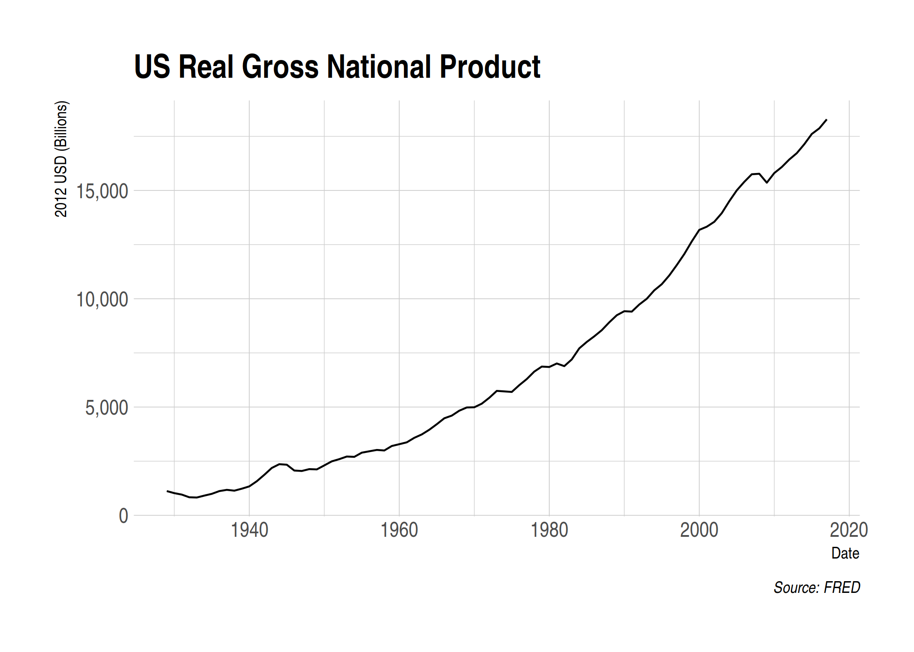

## Sign-up and software requirements

### Sign-up

We're going to be downloading economic data from the FRED API. This will require that you first [create a user account](https://research.stlouisfed.org/useraccount/apikey) and then [register a personal API key](https://research.stlouisfed.org/useraccount/apikey).

### External software

Today I'll be using [JSONView](https://jsonview.com/), a browser extension that renders JSON output nicely in Chrome and Firefox. (Not needed, but recommended.)

### R packages 

- **New:** `jsonlite`, `httr`, `listviewer`, `fredr`
- **Already used:** `tidyverse`, `lubridate`, `hrbrthemes`

The [httr package](https://httr.r-lib.org/index.html) already comes bundled with the tidyverse. So you only need to install the following:


```r
## Not run. (Run this manually yourself if you haven't installed these packages yet.)
install.packages(c("jsonlite", "listviewer", "fredr"))
```

We might as well load the tidyverse now, since we'll be using it a fair bit today. It's not necessary, but I'll also set my preferred ggplot2 theme for the rest of this document.


```r
library(tidyverse)
theme_set(hrbrthemes::theme_ipsum())
```

## Recap from last time

During the last lecture, we saw that websites and web applications fall into two categories: 1) Server-side and 2) Client-side. We then practised scraping data that falls into the first category --- i.e. rendered server-side --- using the `rvest` package. This technique focuses on CSS selectors (with help from [SelectorGadget](http://selectorgadget.com/)) and HTML tags. We also saw that webscraping often involves as much art as science. The plethora of CSS options and the flexibility of HTML itself means that steps which work perfectly well on one website can easily fail on another website.

Today we focus on the second category: Scraping web data that is rendered **client-side**. The good news is that, when available, this approach typically makes it much easier to scrape data from the web. The downside is that, again, it can involve as much art as it does science. Moreover, as I emphasised last time, just because because we *can* scrape data, doesn't mean that we *should* (i.e. ethical, legal and other considerations). These admonishments aside, let's proceed...

## Client-side, APIs, and API endpoints

Recall that websites or applications that are built using a **client-side** framework typically involve something like the following steps:

- You visit a URL that contains a template of static content (HTML tables, CSS, etc.). This template itself doesn't contain any data.
- However, in the process of opening the URL, your browser sends a *request* to the host server.
- If your request if valid, then the server issues a *response* that fetches the necessary data for you and renders the page dynamically in your browser.
- The page that you actually see in your browser is thus a mix of static content and dynamic information that is rendered by your browser (i.e. the "client").

All of this requesting, responding and rendering takes places through the host application's **API** (or **A**pplication **P**rogram **I**nterface). Time for a student presentation to go over APIs in more depth...

### Student presentation: APIs

If you're new to APIs or reading this after the fact, then I recommend this excellent resource from Zapier: [An Introduction to APIs](https://zapier.com/learn/apis/). It's fairly in-depth, but you don't need to work through the whole thing to get the gist. The summary version is that an API is really just a collection of rules and methods that allow different software applications to interact and share information. This includes not only web servers and browsers, but also software packages like the R libraries we've been using.^[Fun fact: A number of R packages that we'll be using later in this course (e.g. `leaflet`, `plotly`, etc.) are really just a set of wrapper functions that interact with the underlying APIs and convert your R code into some other language (e.g. JavaScript).] Key concepts include:

- **Server:** A powerful computer that runs an API.
- **Client:** A program that exchanges data with a server through an API.
- **Protocol:** The "etiquette" underlying how computers talk to each other (e.g. HTTP).
- **Methods:** The "verbs" that clients use to talk with a server. The main one that we'll be using is `GET` (i.e. ask a server to retrieve information), but other common methods are `POST`, `PUT` and `DELETE`.
- **Requests:** What the client asks of the server (see Methods above).
- **Response:** The server's response. This includes a *Status Code* (e.g. "404" if not found, or "200" if successful), a *Header* (i.e. meta-information about the reponse), and a *Body* (i.e the actual content that we're interested in).
- Etc.

### A bit more about API endpoints

A key point in all of this is that, in the case of web APIs, we can access information *directly* from the API database if we can specify the correct URL(s). These URLs are known as an **API endpoints**. 

API endpoints are in many ways similar to the normal website URLs that we're all used to visiting. For starters, you can navigate to them in your web browser. However, whereas normal websites display information in rich HTML content --- pictures, cat videos, nice formatting, etc. --- an API endpoint is much less visually appealing. Navigate your browser to an API endpoint and you'll just see a load of seemingly unformatted text. In truth, what you're really seeing is (probably) either [JSON](https://en.wikipedia.org/wiki/JSON) (**J**ava**S**cript **O**bject **No**tation) or [XML](https://en.wikipedia.org/wiki/XML) (E**x**tensible **M**arkup **L**anguage). 

You don't need to worry too much about the syntax of JSON and XML. The important thing is that the object in your browser --- that load of seemingly unformatted text --- is actually very precisely structured and formatted. Moreover, it contains valuable information that we can easily read into R (or Python, Julia, etc.) We just need to know the right API endpoint for the data that we want.

Let's practice doing this through a few example applications. I'll start with the simplest case (no API key required, explicit API endpoint) and then work through some more complicated examples. 

## Application 1: Trees of New York City

[NYC Open Data](https://opendata.cityofnewyork.us/) is a pretty amazing initiative. Its mission is to "make the wealth of public data generated by various New York City agencies and other City organizations available for public use". You can get data on everything from arrest data, to the location of wi-fi hotspots, to city job postings, to homeless population counts, to dog licenses, to a directory of toilets in public parks... The list goes on. I highly encourage you to explore in your own time, but we're going to do something "earthy" for this first application: Download a sample of tree data from the [**2015 NYC Street Tree Census**](https://data.cityofnewyork.us/Environment/2015-Street-Tree-Census-Tree-Data/uvpi-gqnh).

I wanted to begin with an example from NYC Open Data, because you don't need to set up an API key in advance.^[Truth be told: To avoid rate limits --- i.e. throttling the number of requests that you can make per hour --- it's best to [sign up](https://data.cityofnewyork.us/profile/app_tokens) for an NYC Open Data app token. We're only going to make one or two requests here, though so we should be fine.] All you need to do is complete the following steps:

- Open the [web page](https://data.cityofnewyork.us/Environment/2015-Street-Tree-Census-Tree-Data/uvpi-gqnh) in your browser (if you haven't already done so). 
- You should immediately see the **API** tab. Click on it. 
- Copy the [API endpoint](https://data.cityofnewyork.us/resource/nwxe-4ae8.json) that appears in the popup box. 
- *Optional:* Paste that endpoint into a new tab in your browser. You'll see a bunch of JSON text, which you can render nicely using the JSONView browser extension that we installed earlier.

Here's a GIF of me completing these steps:


Now that we've located the API endpoint, let's read the data into R. We'll do so using the `fromJSON()` function from the excellent [jsonlite package](https://cran.r-project.org/web/packages/jsonlite/index.html). This will automatically coerce the JSON array into a regular R data frame. However, I'll go that little bit further and convert it into a tibble, since the output is nicer to work with.


```r
library(jsonlite)
nyc_trees <- 
  fromJSON("https://data.cityofnewyork.us/resource/nwxe-4ae8.json") %>%
  as_tibble()
nyc_trees
```

```
## # A tibble: 1,000 x 45
##    address bbl   bin   block_id boro_ct borocode boroname brch_light
##    <chr>   <chr> <chr> <chr>    <chr>   <chr>    <chr>    <chr>     
##  1 108-00… 4022… 4052… 348711   4073900 4        Queens   No        
##  2 147-07… 4044… 4101… 315986   4097300 4        Queens   No        
##  3 390 MO… 3028… 3338… 218365   3044900 3        Brooklyn No        
##  4 1027 G… 3029… 3338… 217969   3044900 3        Brooklyn No        
##  5 603 6 … 3010… 3025… 223043   3016500 3        Brooklyn No        
##  6 8 COLU… 1011… 1076… 106099   1014500 1        Manhatt… No        
##  7 120 WE… 1011… 1076… 106099   1014500 1        Manhatt… No        
##  8 311 WE… 1010… 1086… 103940   1012700 1        Manhatt… No        
##  9 65 JER… <NA>  <NA>  407443   5006400 5        Staten … No        
## 10 638 AV… 3072… 3320… 207508   3037402 3        Brooklyn No        
## # … with 990 more rows, and 37 more variables: brch_other <chr>,
## #   brch_shoe <chr>, cb_num <chr>, census_tract <chr>, cncldist <chr>,
## #   council_district <chr>, created_at <chr>, curb_loc <chr>,
## #   guards <chr>, health <chr>, latitude <chr>, longitude <chr>,
## #   nta <chr>, nta_name <chr>, problems <chr>, root_grate <chr>,
## #   root_other <chr>, root_stone <chr>, sidewalk <chr>, spc_common <chr>,
## #   spc_latin <chr>, st_assem <chr>, st_senate <chr>, state <chr>,
## #   status <chr>, steward <chr>, stump_diam <chr>, tree_dbh <chr>,
## #   tree_id <chr>, trnk_light <chr>, trnk_other <chr>, trunk_wire <chr>,
## #   user_type <chr>, x_sp <chr>, y_sp <chr>, zip_city <chr>, zipcode <chr>
```

**Aside on limits:** Note that the full census dataset contains nearly 700,000 individual trees. However, we only downloaded a tiny sample of that, since the API defaults to a limit of 1,000 rows. I don't care to access the full dataset here, since I just want to illustrate some basic concepts. Nonetheless, if you were so inclined and [read the docs](https://dev.socrata.com/docs/queries/limit.html), you'd see that you can override this default by adding `?$limit=LIMIT` to the API endpoint. For example, to read in only the first five rows, you could use:


```r
## Not run
fromJSON("https://data.cityofnewyork.us/resource/nwxe-4ae8.json?$limit=5")
```

Getting back on track, let's plot our tree data just to show it worked. One minor thing I want to point out is that `fromJSON()` automatically coerces everything into a character, so we'll also need to convert some columns to numeric before we plot.


```r
nyc_trees %>% 
  select(longitude, latitude, stump_diam, spc_common, spc_latin, tree_id) %>% 
  mutate_at(vars(longitude:stump_diam), as.numeric) %>% 
  ggplot(aes(x=longitude, y=latitude, size=stump_diam)) + 
  geom_point(alpha=0.5) +
  scale_size_continuous(name = "Stump diameter") +
  labs(
    x = "Longitude", y = "Latitude",
    title = "Sample of New York City trees",
    caption = "Source: NYC Open Data"
    )
```

<!-- -->

Not too bad. This would probably be more fun / impressive with an actual map of New York behind it. We'll save that for the spatial lecture that's coming up later in the course, though.

Again, I want to remind you that our  first application didn't require prior registration on the Open Data NYC website, or creation of an API key. This is atypical. Most API interfaces will only let you access and download data after you have registered an API key with them. This is especially true if you want to access an API linked to a federal agency or institution (Census, BEA, etc.). So let's work through an application where an API key is required...

## Application 2: FRED data

Our second application will involve downloading data from the [**FRED API**](https://research.stlouisfed.org/docs/api/fred/). You will need to [register an API key](https://research.stlouisfed.org/useraccount/apikey) if you want to follow along with my steps, so please do so first before continuing. 

As nearly every economist could tell you, [FRED](https://fred.stlouisfed.org/) is a database maintained by the Federal Reserve Bank of St Louis. You know, the one that let's you plot cool interactive charts [like this one](https://fred.stlouisfed.org/series/GNPCA#0) of US GNP since 1929.

<iframe src="https://fred.stlouisfed.org/graph/graph-landing.php?g=mPCo&width=670&height=475" scrolling="no" frameborder="0"style="overflow:hidden; width:670px; height:525px;" allowTransparency="true"></iframe>

</br>

For this second example application, I'm going to show you how to download the data underlying the above chart using the FRED API. In fact, I'll go one better. First I'll show you how to download it yourself, so that you get an understanding of what's happening underneath the hood. Then I'll direct you to a package that does all of the API work for you.

### Do it yourself

As with all APIs, a good place to start is the [FRED API developer docs](https://research.stlouisfed.org/docs/api/fred/). If you read through these, you'd see that the endpoint path we're interested in is [**series/observations**](https://research.stlouisfed.org/docs/api/fred/series_observations.html). This endpoint "gets the observations or data values for an economic data series". The endpoint documentation gives a more in-depth discussion, including the various parameters that it accepts.^[Think of API *parameters* the same way that you think about function *arguments*. They are valid inputs (instructions) that modify the response to an API request.] However, the parameters that we'll be focused on here are simply:

- **file_type:** "json" (Not required, but our preferred type of output.)
- **series_id:** "GNPCA" (Required. The series data that we want.)
- **api_key:** "YOUR_API_KEY" (Required. Go and fetch/copy your key now.)

Let's combine these parameters with the endpoint path to view the data directly in our browser. Head over to [https://api.stlouisfed.org/fred/series/observations?series_id=GNPCA&api_key=<mark>YOUR_API_KEY</mark>&file_type=json](https://api.stlouisfed.org/fred/series/observations?series_id=GNPCA&api_key=YOUR_API_KEY&file_type=json), replacing "YOUR_API_KEY" with your actual key. You should see something like the following:


At this point you're probably tempted to read the JSON object directly into your R environment using the `jsonlite::readJSON()` function. And this will work. However, that's not what we're going to here. Rather, we're going to go through the [**httr package**](https://httr.r-lib.org/). Why? Well, basically because `httr` comes with a variety of features that allow us to interact more flexibly and securely with web APIs. 

Let's start by defining some convenience variables such as the endpoint path and the parameters (which we'll store in a list).


```r
endpoint = "series/observations"
params = list(
  api_key= "YOUR_FRED_KEY", ## Change to your own key
  file_type="json", 
  series_id="GNPCA"
  )
```

> **Protip:** If you want to safely use sensitive information like API keys or passwords --- even when sharing content (like these lecture notes) with others --- then save it as an R environment variable. You can read more [here](https://github.com/STAT545-UBC/Discussion/issues/81) and [here](https://happygitwithr.com/github-pat.html#a-note-about-security), but something like the below should work. Run this in your console, *never* in an R Markdown file or other shared document.

  
  ```r
  Sys.setenv(MY_API_KEY="abcdefghijklmnopqrstuvwxyz0123456789") ## Add your key as an environment variable. (Current session only.)
  # usethis::edit_r_environ() ## Open your .Renviron file and add the key. (Persists over sessions.)
  readRenviron("~/.Renviron") ## Refresh your .Renviron file
  ```

> Once that's done, you can safely assign your key to an object (including within a R Markdown file that you're going to share) using, say, `api_key <- Sys.getenv("MY_API_KEY")`. 

Okay, back to our FRED example. We'll use the `httr::GET()` function to request (i.e. download) the data. I'll assign this to an object called `fred`.


```r
library(httr)

fred <- 
  httr::GET(
    url = "https://api.stlouisfed.org/", ## Base URL
    path = paste0("fred/", endpoint), ## The API endpoint
    query = params ## Our parameter list
    )
```

Take a second to print the `fred` object in your console. What you'll see is pretty cool; i.e. it's the actual API response, including the *Status Code* and *Content*. Something like:

```
## Response [https://api.stlouisfed.org/fred/series/observations?api_key=YOUR_API_KEY&file_type=json&series_id=GNPCA]
##   Date: 2019-02-01 00:06
##   Status: 200
##   Content-Type: application/json; charset=UTF-8
##   Size: 9.09 kB
```

To extract the content (i.e. data) from of this response, I'll use the `httr::content()` function. Moreover, we know that this content is a JSON array, so we can convert it to an R object using `jsonlite::fromJSON()` as we did above. However, we don't yet know what format it will be in. Okay --- SPOILER --- it's going to be a list. I could use the base `str()` function to delve into the structure of this list. However, I want to introduce you to the `listviewer::jsonedit()` function, which allows for interactive inspection of list objects.^[Complex nested lists are the law of the land when it comes to JSON data. Don't worry too much about this now, but the good news is that R ideally suited to parse and handle these nested lists. We'll see more examples later in the course when we start working with programming and spatial data (e.g. geoJSON).]


```r
fred %>% 
  httr::content("text") %>%
  jsonlite::fromJSON() %>%
  listviewer::jsonedit(mode = "view")
```

<!--html_preserve--><div id="htmlwidget-1e64bec83b3e59ca9423" style="width:100%;height:10%;" class="jsonedit html-widget"></div>
<script type="application/json" data-for="htmlwidget-1e64bec83b3e59ca9423">{"x":{"data":{"realtime_start":"2019-02-17","realtime_end":"2019-02-17","observation_start":"1600-01-01","observation_end":"9999-12-31","units":"lin","output_type":1,"file_type":"json","order_by":"observation_date","sort_order":"asc","count":89,"offset":0,"limit":100000,"observations":{"realtime_start":["2019-02-17","2019-02-17","2019-02-17","2019-02-17","2019-02-17","2019-02-17","2019-02-17","2019-02-17","2019-02-17","2019-02-17","2019-02-17","2019-02-17","2019-02-17","2019-02-17","2019-02-17","2019-02-17","2019-02-17","2019-02-17","2019-02-17","2019-02-17","2019-02-17","2019-02-17","2019-02-17","2019-02-17","2019-02-17","2019-02-17","2019-02-17","2019-02-17","2019-02-17","2019-02-17","2019-02-17","2019-02-17","2019-02-17","2019-02-17","2019-02-17","2019-02-17","2019-02-17","2019-02-17","2019-02-17","2019-02-17","2019-02-17","2019-02-17","2019-02-17","2019-02-17","2019-02-17","2019-02-17","2019-02-17","2019-02-17","2019-02-17","2019-02-17","2019-02-17","2019-02-17","2019-02-17","2019-02-17","2019-02-17","2019-02-17","2019-02-17","2019-02-17","2019-02-17","2019-02-17","2019-02-17","2019-02-17","2019-02-17","2019-02-17","2019-02-17","2019-02-17","2019-02-17","2019-02-17","2019-02-17","2019-02-17","2019-02-17","2019-02-17","2019-02-17","2019-02-17","2019-02-17","2019-02-17","2019-02-17","2019-02-17","2019-02-17","2019-02-17","2019-02-17","2019-02-17","2019-02-17","2019-02-17","2019-02-17","2019-02-17","2019-02-17","2019-02-17","2019-02-17"],"realtime_end":["2019-02-17","2019-02-17","2019-02-17","2019-02-17","2019-02-17","2019-02-17","2019-02-17","2019-02-17","2019-02-17","2019-02-17","2019-02-17","2019-02-17","2019-02-17","2019-02-17","2019-02-17","2019-02-17","2019-02-17","2019-02-17","2019-02-17","2019-02-17","2019-02-17","2019-02-17","2019-02-17","2019-02-17","2019-02-17","2019-02-17","2019-02-17","2019-02-17","2019-02-17","2019-02-17","2019-02-17","2019-02-17","2019-02-17","2019-02-17","2019-02-17","2019-02-17","2019-02-17","2019-02-17","2019-02-17","2019-02-17","2019-02-17","2019-02-17","2019-02-17","2019-02-17","2019-02-17","2019-02-17","2019-02-17","2019-02-17","2019-02-17","2019-02-17","2019-02-17","2019-02-17","2019-02-17","2019-02-17","2019-02-17","2019-02-17","2019-02-17","2019-02-17","2019-02-17","2019-02-17","2019-02-17","2019-02-17","2019-02-17","2019-02-17","2019-02-17","2019-02-17","2019-02-17","2019-02-17","2019-02-17","2019-02-17","2019-02-17","2019-02-17","2019-02-17","2019-02-17","2019-02-17","2019-02-17","2019-02-17","2019-02-17","2019-02-17","2019-02-17","2019-02-17","2019-02-17","2019-02-17","2019-02-17","2019-02-17","2019-02-17","2019-02-17","2019-02-17","2019-02-17"],"date":["1929-01-01","1930-01-01","1931-01-01","1932-01-01","1933-01-01","1934-01-01","1935-01-01","1936-01-01","1937-01-01","1938-01-01","1939-01-01","1940-01-01","1941-01-01","1942-01-01","1943-01-01","1944-01-01","1945-01-01","1946-01-01","1947-01-01","1948-01-01","1949-01-01","1950-01-01","1951-01-01","1952-01-01","1953-01-01","1954-01-01","1955-01-01","1956-01-01","1957-01-01","1958-01-01","1959-01-01","1960-01-01","1961-01-01","1962-01-01","1963-01-01","1964-01-01","1965-01-01","1966-01-01","1967-01-01","1968-01-01","1969-01-01","1970-01-01","1971-01-01","1972-01-01","1973-01-01","1974-01-01","1975-01-01","1976-01-01","1977-01-01","1978-01-01","1979-01-01","1980-01-01","1981-01-01","1982-01-01","1983-01-01","1984-01-01","1985-01-01","1986-01-01","1987-01-01","1988-01-01","1989-01-01","1990-01-01","1991-01-01","1992-01-01","1993-01-01","1994-01-01","1995-01-01","1996-01-01","1997-01-01","1998-01-01","1999-01-01","2000-01-01","2001-01-01","2002-01-01","2003-01-01","2004-01-01","2005-01-01","2006-01-01","2007-01-01","2008-01-01","2009-01-01","2010-01-01","2011-01-01","2012-01-01","2013-01-01","2014-01-01","2015-01-01","2016-01-01","2017-01-01"],"value":["1120.076","1025.091","958.378","834.291","823.156","911.019","992.537","1118.944","1177.572","1138.989","1230.22","1337.075","1574.74","1870.911","2187.818","2361.622","2337.63","2068.966","2048.293","2134.291","2121.201","2305.668","2493.148","2594.934","2715.067","2700.542","2893.97","2957.097","3020.083","2994.683","3201.683","3285.454","3371.35","3579.446","3736.061","3951.902","4208.08","4481.593","4604.613","4831.761","4980.667","4989.534","5156.41","5428.368","5746.389","5723.068","5697.677","6011.215","6293.525","6637.838","6868.092","6849.819","7011.223","6889.371","7199.441","7711.063","8007.532","8266.358","8549.125","8912.281","9239.186","9425.052","9406.669","9734.705","10000.831","10389.663","10672.832","11076.879","11556.745","12064.59","12647.632","13179.965","13327.458","13553.208","13953.961","14503.006","15006.043","15398.622","15748.3","15771.553","15359.37","15803.886","16081.66","16429.308","16722.335","17135.107","17608.271","17867.773","18284.031"]}},"options":{"mode":"view","modes":["code","form","text","tree","view"]}},"evals":[],"jsHooks":[]}</script><!--/html_preserve-->

Luckily, this particular list object isn't too complicated. We can see that we're really interested in the `fred$observations` sub-element. I'll re-run most of the above code and then extract this element. I could do this in several ways, but will use the `purrr::pluck()` function here.


```r
fred <-
  fred %>% 
  httr::content("text") %>%
  jsonlite::fromJSON() %>%
  purrr::pluck("observations") %>% ## Extract the "$observations" list element
  # .$observations %>% ## I could also have used this
  # magrittr::extract("observations") %>% ## Or this
  as_tibble() ## Just for nice formatting
fred
```

```
## # A tibble: 89 x 4
##    realtime_start realtime_end date       value   
##    <chr>          <chr>        <chr>      <chr>   
##  1 2019-02-17     2019-02-17   1929-01-01 1120.076
##  2 2019-02-17     2019-02-17   1930-01-01 1025.091
##  3 2019-02-17     2019-02-17   1931-01-01 958.378 
##  4 2019-02-17     2019-02-17   1932-01-01 834.291 
##  5 2019-02-17     2019-02-17   1933-01-01 823.156 
##  6 2019-02-17     2019-02-17   1934-01-01 911.019 
##  7 2019-02-17     2019-02-17   1935-01-01 992.537 
##  8 2019-02-17     2019-02-17   1936-01-01 1118.944
##  9 2019-02-17     2019-02-17   1937-01-01 1177.572
## 10 2019-02-17     2019-02-17   1938-01-01 1138.989
## # … with 79 more rows
```

Okay! We've finally got our data and are nearly ready for some plotting. However, recall that `fromJSON()` automatically converts everything to characters so I'll quickly change some variables to dates (using `lubridate::ymd()`) and numeric.


```r
library(lubridate)

fred <-
  fred %>%
  mutate_at(vars(realtime_start:date), ymd) %>%
  mutate(value = as.numeric(value)) 
```

Let's plot this sucker.


```r
fred %>%
  ggplot(aes(date, value)) +
  geom_line() +
  scale_y_continuous(labels = scales::comma) +
  labs(
    x="Date", y="2012 USD (Billions)",
    title="US Real Gross National Product", caption="Source: FRED"
    )
```

<!-- -->


### Use a package

One of the great features about the R (and data science community in general) is that someone has probably written a package that does all the heavy API lifting for you. We'll come across many examples during the remainder of this course, but for the moment I want you to check out the [fredr package](http://sboysel.github.io/fredr/index.html). How would you access the same GDP data as above using this package? (Hint: See [here](https://cran.r-project.org/web/packages/fredr/vignettes/fredr.html).)

## Application 3: World rugby rankings

Our final application will involve a more challenging case where the API endpoint is *hidden from view*. In particular, I'm going to show you how to access data on [**World Rugby rankings**](https://www.world.rugby/rankings/mru). Because --- real talk --- what's more important than teaching Americans about rugby?

*<b>Disclaimer:</b> World Rugby's [Terms & Conditions](https://www.world.rugby/terms-and-conditions) permits data downloading for own non-commerical use. It seems reasonable to me that these lecture notes fall under this use category.^[If you're reading this from World Rugby and disagree, please [contact me](mailto:grantmcd@uoregon.edu). In my defence, I am still awaiting a reply to my initial email confirming my interpretation of your T&Cs...] None of the methods presented below should be construed as an endorsement of data aquisition and use that violates these terms. Again: Just because you can scrape something, doesn't mean you should.*

Start by taking a look at the complicated structure of the website in a [live session](http://www.worldrugby.org/rankings). Pay attention to the various tables and other interactive elements like calendars. Now take a minute or two for a quick challenge: Try to scrape the full country rankings using the `rvest` + CSS selectors approach that we practiced last time...

.

.

.

.

.

If you're anything like me, you would have struggled to scrape the desired information using the `rvest` + CSS selectors approach. Even if you managed to extract some kind of information, you're likely only getting a subset of what you wanted. (For example, just the column names, or the first ten rows before the "VIEW MORE RANKINGS" button). And we haven't even considered trying to get information from a different date.^[Note that the URL doesn't change even when we select a different date on the calendar.]

### Locating the hidden API endpoint

Fortunately, there's a better way: Access the full database of rankings through the API. First we have to find the endpoint, though. Here's a step-by-step guide of how to that that. It's fairly tedious, but pretty intuitive once you get the hang of it. You can just skip to the GIF below if you would rather see what I did instead of reading through all the steps. 

- Start by inspecting the page. (**Ctr+Shift+I** in Chrome. **Ctrl+Shift+Q** in Firefox.) 
- Head to the **Network** tab at the top of the inspect element panel. 
- Click on the **XHR** button.^[XHR stands for **X**ML**H**ttp**R**equest and is the type of request used to fetch XML or JSON data.]
- Refresh the page (**Ctrl+R**). This will allow us to see all the web traffic coming to and from the page in our inspect panel. 
- Our task now is to scroll these different traffic links and see which one contains the information that we're after.
- The top traffic link item references a URL called [https://cms<b>api</b>.pulselive.com/rugby/<b>rankings</b>/mru?language=en&client=pulse](https://cmsapi.pulselive.com/rugby/rankings/mru?language=en&client=pulse). *Hmmm. "API" you say? "Rankings" you say? Sounds promising...* 
- Click on this item and open up the **Preview** tab.
- In this case, we can see what looks to be the first row of the rankings table ("New Zealand", etc.) 
- To make sure, you can grab that [https://cmsapi.pulselive.com/rugby/rankings/mru?language=en&client=pulse](URL), and paste it into our browser (using the [JSONView](https://chrome.google.com/webstore/detail/jsonview/chklaanhfefbnpoihckbnefhakgolnmc?hl=en) plugin) from before.

Sweet. Looks like we've located our API endpoint. As promised, here's GIF of me walking through these steps in my browser:


### Pulling the data into R

Let's pull the data from the API endpoint into R. Again, I'll be using `jsonlite::readJSON()` function. 


```r
endpoint <- "https://cmsapi.pulselive.com/rugby/rankings/mru?language=en&client=pulse"
rugby <- fromJSON(endpoint)
str(rugby)
```

```
## List of 3
##  $ label    : chr "Mens Rugby Union"
##  $ entries  :'data.frame':	105 obs. of  6 variables:
##   ..$ team       :'data.frame':	105 obs. of  5 variables:
##   .. ..$ id          : int [1:105] 37 36 33 34 39 38 35 46 42 40 ...
##   .. ..$ altId       : logi [1:105] NA NA NA NA NA NA ...
##   .. ..$ name        : chr [1:105] "New Zealand" "Ireland" "Wales" "England" ...
##   .. ..$ abbreviation: chr [1:105] "NZL" "IRE" "WAL" "ENG" ...
##   .. ..$ annotations : logi [1:105] NA NA NA NA NA NA ...
##   ..$ matches    : int [1:105] 209 182 196 189 200 217 177 111 187 182 ...
##   ..$ pts        : num [1:105] 92.5 91.2 87.2 86.2 84.6 ...
##   ..$ pos        : int [1:105] 1 2 3 4 5 6 7 8 9 10 ...
##   ..$ previousPts: num [1:105] 92.5 91.2 87.2 86.2 84.6 ...
##   ..$ previousPos: int [1:105] 1 2 3 4 5 6 7 8 9 10 ...
##  $ effective:List of 3
##   ..$ millis   : num 1.55e+12
##   ..$ gmtOffset: num 0
##   ..$ label    : chr "2019-01-07"
```

We have a nested list, where what looks to be the main element of interest, `$entries`, is itself a list.^[I know that R says `rugby$entries` is a data.frame, but we can tell from the `str()` call that it follows a list structure. In particular, the `rugby$entries$team` sub-element is a itself data frame. Remember: R is very flexible and allows data frames within certain data frames (and lists).] Let's extract the `$entries` element and have a look at its structure. We could use the `str()` base function, but again the interactivity of `listviewer::jsonedit()` is hard to beat for complicated list structures. 


```r
# str(rugby$entries) ## Base option
listviewer::jsonedit(rugby, mode = "view")
```

<!--html_preserve--><div id="htmlwidget-94d07a80778fcca198fc" style="width:100%;height:10%;" class="jsonedit html-widget"></div>
<script type="application/json" data-for="htmlwidget-94d07a80778fcca198fc">{"x":{"data":{"label":"Mens Rugby Union","entries":{"team":{"id":[37,36,33,34,39,38,35,46,42,40,49,51,720,47,41,45,68,52,756,50,43,58,64,725,699,721,44,703,708,736,770,735,753,738,777,711,714,751,1030,57,775,776,766,681,769,745,741,713,1247,774,740,707,2537,712,759,743,737,723,760,734,781,729,710,732,739,726,784,761,722,3223,1031,702,700,701,692,772,752,696,2476,715,698,727,771,697,750,2340,709,768,2382,2861,704,2397,2857,749,2387,2585,1029,748,705,762,744,2576,2529,780,3674],"altId":[null,null,null,null,null,null,null,null,null,null,null,null,null,null,null,null,null,null,null,null,null,null,null,null,null,null,null,null,null,null,null,null,null,null,null,null,null,null,null,null,null,null,null,null,null,null,null,null,null,null,null,null,null,null,null,null,null,null,null,null,null,null,null,null,null,null,null,null,null,null,null,null,null,null,null,null,null,null,null,null,null,null,null,null,null,null,null,null,null,null,null,null,null,null,null,null,null,null,null,null,null,null,null,null,null],"name":["New Zealand","Ireland","Wales","England","South Africa","Australia","Scotland","Fiji","France","Argentina","Japan","USA","Georgia","Tonga","Italy","Samoa","Uruguay","Romania","Russia","Canada","Spain","Namibia","Netherlands","Hong Kong","Belgium","Germany","Portugal","Brazil","Chile","Korea","Switzerland","Kenya","Poland","Lithuania","Ukraine","Colombia","Czechia","Paraguay","Malta","Zimbabwe","Tunisia","Uganda","Sri Lanka","Cote D'Ivoire","Sweden","Morocco","Malaysia","Croatia","Mexico","Trinidad & Tobago","Madagascar","Cayman Islands","Philippines","Cook Islands","Senegal","Moldova","Latvia","Guyana","Singapore","Kazakhstan","Venezuela","Israel","Chinese Taipei","Jamaica","Luxembourg","Hungary","Zambia","Slovenia","Guam","United Arab Emirates","Nigeria","Botswana","Bermuda","Bosnia & Herzegovina","Andorra","Thailand","Peru","Austria","St Vincent and Grenadines","Denmark","Barbados","India","Tahiti","Bahamas","Papua New Guinea","Serbia","China","Swaziland","Ghana","Uzbekistan","Bulgaria","Pakistan","Mauritius","Norway","Rwanda","Costa Rica","Finland","Niue Island","Cameroon","Solomon Islands","Monaco","Indonesia","Greece","Vanuatu","American Samoa"],"abbreviation":["NZL","IRE","WAL","ENG","RSA","AUS","SCO","FJI","FRA","ARG","JPN","USA","GEO","TGA","ITA","SAM","URU","ROM","RUS","CAN","ESP","NAM","NED","HKG","BEL","GER","POR","BRA","CHL","KOR","SUI","KEN","POL","LTU","UKR","COL","CZE","PAR","MLT","ZIM","TUN","UGA","SRI","CIV","SWE","MAR","MAS","CRO","MEX","TTO","MAD","CAY","PHP","COK","SEN","MDA","LAT","GUY","SIN","KAZ","VEN","ISR","TPE","JAM","LUX","HUN","ZAM","SVN","GUM","UAE","NGA","BWA","BER","BIH","AND","THA","PER","AUT","SVG","DEN","BRB","IND","PYF","BHS","PNG","SRB","CHN","SWZ","GHA","UZB","BUL","PAK","MUS","NOR","RWA","CTR","FIN","NIU","CAM","SOL","MON","IDO","HEL","VAN","ASM"],"annotations":[null,null,null,null,null,null,null,null,null,null,null,null,null,null,null,null,null,null,null,null,null,null,null,null,null,null,null,null,null,null,null,null,null,null,null,null,null,null,null,null,null,null,null,null,null,null,null,null,null,null,null,null,null,null,null,null,null,null,null,null,null,null,null,null,null,null,null,null,null,null,null,null,null,null,null,null,null,null,null,null,null,null,null,null,null,null,null,null,null,null,null,null,null,null,null,null,null,null,null,null,null,null,null,null,null]},"matches":[209,182,196,189,200,217,177,111,187,182,165,119,151,99,179,111,128,153,138,129,116,102,85,102,90,102,131,92,83,67,69,94,82,72,86,56,87,59,75,72,58,75,54,47,78,50,47,74,30,36,48,34,31,27,47,79,71,37,46,55,49,67,46,27,66,70,42,68,22,26,23,38,37,55,65,47,49,70,14,74,38,35,19,27,31,63,36,18,12,5,56,13,22,66,13,11,55,19,25,21,12,3,17,16,13],"pts":[92.53533,91.16688,87.24036,86.22275,84.580025,82.39823,81.84417,77.94977,77.32973,77.04916,75.24273,73.65862,73.422676,73.01502,72.74671,68.77505,66.82086,65.45316,65.20222,62.954357,62.23807,60.338173,58.45077,58.114353,58.0919,57.827908,57.08341,56.814743,54.364967,53.586235,53.242306,52.789814,52.2899,51.528393,50.25155,49.842087,49.600685,49.59372,49.478283,49.2803,48.532963,48.34342,48.2654,46.588947,46.442528,46.333847,46.264854,45.861683,45.662365,45.509857,45.341393,45.195084,45.163864,45.106884,44.817486,43.625633,43.43337,43.14622,42.542458,42.1372,41.871857,41.788982,41.329926,40.522484,40.341747,40.12316,39.724476,39.07184,38.71173,37.92662,37.70883,37.639103,37.391884,37.349506,37.202675,37.089455,36.13399,35.299862,34.914616,34.901814,34.724777,34.362324,33.78896,33.756924,33.267494,33.074486,32.718918,32.041035,31.90417,31.290405,31.101856,30.73589,30.559095,30.456757,29.78472,29.570444,29.069761,28.446674,26.32657,24.404186,23.171558,22.733171,22.546452,21.453693,19.532106],"pos":[1,2,3,4,5,6,7,8,9,10,11,12,13,14,15,16,17,18,19,20,21,22,23,24,25,26,27,28,29,30,31,32,33,34,35,36,37,38,39,40,41,42,43,44,45,46,47,48,49,50,51,52,53,54,55,56,57,58,59,60,61,62,63,64,65,66,67,68,69,70,71,72,73,74,75,76,77,78,79,80,81,82,83,84,85,86,87,88,89,90,91,92,93,94,95,96,97,98,99,100,101,102,103,104,105],"previousPts":[92.53533,91.16688,87.24036,86.22275,84.580025,82.39823,81.84417,77.94977,77.32973,77.04916,75.24273,73.65862,73.422676,73.01502,72.74671,68.77505,66.82086,65.45316,65.20222,62.954357,62.23807,60.338173,58.45077,58.114353,58.0919,57.827908,57.08341,56.814743,54.364967,53.586235,53.242306,52.789814,52.2899,51.528393,50.25155,49.842087,49.600685,49.59372,49.478283,49.2803,48.532963,48.34342,48.2654,46.588947,46.442528,46.333847,46.264854,45.861683,45.662365,45.509857,45.341393,45.195084,45.163864,45.106884,44.817486,43.625633,43.43337,43.14622,42.542458,42.1372,41.871857,41.788982,41.329926,40.522484,40.341747,40.12316,39.724476,39.07184,38.71173,37.92662,37.70883,37.639103,37.391884,37.349506,37.202675,37.089455,36.13399,35.299862,34.914616,34.901814,34.724777,34.362324,33.78896,33.756924,39.267494,33.074486,32.718918,32.041035,31.90417,31.290405,31.101856,30.73589,30.559095,30.456757,29.78472,29.570444,29.069761,28.446674,26.32657,24.404186,23.171558,28.733171,22.546452,21.453693,19.532106],"previousPos":[1,2,3,4,5,6,7,8,9,10,11,12,13,14,15,16,17,18,19,20,21,22,23,24,25,26,27,28,29,30,31,32,33,34,35,36,37,38,39,40,41,42,43,44,45,46,47,48,49,50,51,52,53,54,55,56,57,58,59,60,61,62,63,64,65,66,67,69,70,71,72,73,74,75,76,77,78,79,80,81,82,83,84,85,68,86,87,88,89,90,91,92,93,94,95,96,97,99,100,101,102,98,103,104,105]},"effective":{"millis":1546819200000,"gmtOffset":0,"label":"2019-01-07"}},"options":{"mode":"view","modes":["code","form","text","tree","view"]}},"evals":[],"jsHooks":[]}</script><!--/html_preserve-->

For completeness, let's take peak at the `rugby$entries$team` data frame to confirm that it has information that is useful to us. 


```r
head(rugby$entries$team)
```

```
##   id altId         name abbreviation annotations
## 1 37    NA  New Zealand          NZL          NA
## 2 36    NA      Ireland          IRE          NA
## 3 33    NA        Wales          WAL          NA
## 4 34    NA      England          ENG          NA
## 5 39    NA South Africa          RSA          NA
## 6 38    NA    Australia          AUS          NA
```

Okay, a clearer picture is starting to emerge. It looks like we can just bind the columns of the `rugby$entries$team` data frame directly to the other elements of the parent `$team` "data frame" (actually: "list"). Let's do that using `dplyr::bind_cols()` and then clean things up a bit. I'm going to call the resulting data frame `rankings`.


```r
library(janitor)

rankings <-
  bind_cols(
    rugby$entries$team,
    rugby$entries %>% select(matches:previousPos)
  ) %>%
  clean_names() %>%
  select(-c(id, alt_id, annotations)) %>% ## These columns aren't adding much of interest
  select(pos, pts, everything()) %>% ## Reorder remaining columns
  as_tibble() ## "Enhanced" tidyverse version of a data frame
rankings
```

```
## # A tibble: 105 x 7
##      pos   pts name         abbreviation matches previous_pts previous_pos
##    <int> <dbl> <chr>        <chr>          <int>        <dbl>        <int>
##  1     1  92.5 New Zealand  NZL              209         92.5            1
##  2     2  91.2 Ireland      IRE              182         91.2            2
##  3     3  87.2 Wales        WAL              196         87.2            3
##  4     4  86.2 England      ENG              189         86.2            4
##  5     5  84.6 South Africa RSA              200         84.6            5
##  6     6  82.4 Australia    AUS              217         82.4            6
##  7     7  81.8 Scotland     SCO              177         81.8            7
##  8     8  77.9 Fiji         FJI              111         77.9            8
##  9     9  77.3 France       FRA              187         77.3            9
## 10    10  77.0 Argentina    ARG              182         77.0           10
## # … with 95 more rows
```

### BONUS: Get and plot the rankings history

The above looks great, except for the fact that it's just a single snapshot of the most recent rankings. We are probably more interested in looking back at changes in the ratings over time. For example, back to an era when South Africa wasn't so [*kak*](https://www.urbandictionary.com/define.php?term=kak)...

How do we do this? Well, in the spirit of art-vs-science, let's open up the Inspect window of the rankings page again and start exploring. What happens if we click on the calendar element, say, change the year to "2018" and month to "April"? (Do this yourself.)

This looks promising! Essentially, we get the same API endpoint that we saw previously, but now appended with a date, https://cmsapi.pulselive.com/rugby/rankings/mru?date=2018-05-01&client=pulse. If you were to continue along in this manner --- clicking on the website calendar and looking for XHR traffic --- you would soon realise that these date suffixes follow a predictable pattern: They are spaced out a week apart and always fall on a Monday. In other words, World Rugby updates its internatinoal rankings table weekly and publishes the results on Mondays.

We now have enough information to write a function that will loop over a set of dates and pull data from the relevant API endpoint. **NB:** I know we haven't gotten to the programming section of the course, so don't worry about the specifics of the next few code chunks. I'll try to comment my code quite explicitly, but I mostly want you to focus on the big picture.

To start, we need a vector of valid dates to loop over. I'm going to use various functions from the `lubridate` package to help with this. Note that I'm only to extract a few data points --- one observation a year for the last decade or so --- since I just want to demonstrate the principle. No need to hammer the host server. (More on that below.)


```r
## We'll look at rankings around Jan 1st each year. I'll use 2004 as an
## arbitrary start year and then proceed until the present year.
start_date <- ymd("2004-01-01")
end_date <- floor_date(today(), unit="years")
dates <- seq(start_date, end_date, by="years")
## Get the nearest Monday to Jan 1st to coincide with rankings release dates.
dates <- floor_date(dates, "week", week_start = getOption("lubridate.week.start", 1))
dates
```

```
##  [1] "2003-12-29" "2004-12-27" "2005-12-26" "2007-01-01" "2007-12-31"
##  [6] "2008-12-29" "2009-12-28" "2010-12-27" "2011-12-26" "2012-12-31"
## [11] "2013-12-30" "2014-12-29" "2015-12-28" "2016-12-26" "2018-01-01"
## [16] "2018-12-31"
```

Next, I'll write out a function that I'll call `rugby_scrape`. This function will take a single argument; namely a date that it will use to construct a new API endpoint during each iteration. Beyond that, it will do pretty much exactly the same things that we did in our previous, manual data scrape. The only other difference is that it will wait three seconds after running (i.e. `Sys.sleep(3)`). I'm adding this final line to avoid hammering the server with instantaneous requests when we put everything into a loop.


```r
## First remove our existing variables. This is not really necessary, since R is smart enough
## to distinguish named objects in functions from named objects in our global environment.
## But I want to emphasise that we're creating new data here and avoid any confusion.
rm(rugby, rankings, endpoint)

## Now, create the function. I'll call it "rugby_scrape".
rugby_scrape <- 
  function(x) {
    endpoint <- paste0("https://cmsapi.pulselive.com/rugby/rankings/mru?date=", x, "&client=pulse")
    rugby <- fromJSON(endpoint)
    rankings <-
      bind_cols(
        rugby$entries$team,
        rugby$entries %>% select(matches:previousPos)
        ) %>%
      clean_names() %>%
      mutate(date = x) %>% ## New column to keep track of the date 
      select(-c(id, alt_id, annotations)) %>% ## These columns aren't adding much of interest
      select(date, pos, pts, everything()) %>% ## Reorder remaining columns
      as_tibble() ## "Enhanced" tidyverse version of a data frame
    Sys.sleep(3) ## Be nice!
    return(rankings)
  }
```

Finally, we can now iterate (i.e. loop) over our `dates` vector, by plugging the values sequentially into our `rugby_scrape` function. There are a variety of ways to iterate in R, but I'm going to use an `lapply()` call below.^[Again, don't worry too much about this now. We'll cover iteration and programming in more depth in a later lecture.] We'll then bind everything into a single data frame using `dplyr::bind_rows()` and name the resulting object `rankings_history`.


```r
rankings_history <-
  lapply(dates, rugby_scrape) %>% ## Run the iteration
  bind_rows() ## Bind the resulting list of data frames into a single data frame
rankings_history
```

```
## # A tibble: 1,569 x 8
##    date         pos   pts name  abbreviation matches previous_pts
##    <date>     <int> <dbl> <chr> <chr>          <int>        <dbl>
##  1 2003-12-29     1  94.0 Engl… ENG               17         92.1
##  2 2003-12-29     2  90.1 New … NZL               17         88.2
##  3 2003-12-29     3  86.6 Aust… AUS               17         88.4
##  4 2003-12-29     4  82.7 Fran… FRA               17         84.7
##  5 2003-12-29     5  81.2 Sout… RSA               15         81.2
##  6 2003-12-29     6  80.5 Irel… IRE               15         80.5
##  7 2003-12-29     7  78.0 Arge… ARG               14         78.0
##  8 2003-12-29     8  76.9 Wales WAL               15         76.9
##  9 2003-12-29     9  76.4 Scot… SCO               15         76.4
## 10 2003-12-29    10  73.5 Samoa SAM               14         73.5
## # … with 1,559 more rows, and 1 more variable: previous_pos <int>
```

Let's review what we just did:

- We created a vector of dates --- creatively called `dates` --- with observations evenly spaced (about) a year apart, falling on the Monday closest to Jan 1st for that year.
- We then iterated (i.e. looped) over these dates using a function, `rugby_scrape`, which downloaded and cleaned data from the relevant API endpoint. 
- At the end of each iteration, we told R to wait a few seconds before executing the next step. The reason is that R can execute these steps much, much quicker than we could ever type them manually. It probably doesn't matter for this example, but you can easily "overwhelm" a host server by hammering it with a loop of automated requests. (Or, just as likely: They have safeguards against this type of behaviour and will start denying your requests as a suspected malicious attack.) The "be nice" motto is important to remember when scraping API data.
- Note that each run of our iteration will have produced a separate data frame, which `lapply()` by default appends into a list. We used `dplyr::bind_rows()` to bid these separate data frames into a single data frame.

Okay! Let's plot the data and highlight a select few countries in the process.


```r
teams <- c("NZL", "RSA", "ENG", "JPN")
team_cols <- c("NZL"="black", "RSA"="#4DAF4A", "ENG"="#377EB8", "JPN" = "red")

rankings_history %>%
  ggplot(aes(x=date, y=pts, group=abbreviation)) +
  geom_line(col = "grey") + 
  geom_line(
    data = rankings_history %>% filter(abbreviation %in% teams), 
    aes(col=fct_reorder2(abbreviation, date, pts)),
    lwd = 1
    ) +
  scale_color_manual(values = team_cols) +
  labs(
    x = "Date", y = "Points", 
    title = "International rugby rankings", caption = "Source: World Rugby"
    ) +
  theme(legend.title = element_blank())
```

<!-- -->

It was a good time to be a South African rugby supporter around 2007--2009. These days? Not so much. OTOH, New Zealand's extended dominance in the global game is extraordinary. (Especially given its tiny population size.) They truly do have a legimate claim to being the [greatest international team](https://www.dailytelegraph.com.au/sport/rugby/are-the-all-blacks-the-greatest-international-team-in-the-history-of-sport/news-story/f61ad2d65623a9586929bbfba386b157) in the history of professional sport. Which is a good reason to link to the [best ever haka](https://www.youtube.com/watch?v=BFNCpzGnTTs).

## Summary

- An API is a set of rules and methods that allow one computer or program (e.g. host server) to talk to another (e.g. client or browser).
- We can access information through an API directly by specifying a valid API endpoint.
  - The API endpoint for most web-based applications will be a URL with either JSON or XML content.
- Some APIs don't require an access key or token, but most do. You can add this key as a parameter to the API endpoint.
- Downloading content from an API endpoint to our local computer (i.e. R environment) can be done in a variety of ways.
   - E.g. `jsonlite::readJSON()` to read the the JSON array directly, or `httr::GET()` to download the entire response, or installing a package that does the job for us.
- Next lecture: Regression analysis in R. (The start of the analysis and programming section of the course.)


## Further resources and exercises

- [Tyler Clavelle](https://twitter.com/tclavl) has written several cool [blog posts](https://tclavelle.github.io/blog/) on interacting with APIs through R. I especially recommend going over --- and replicating --- his excellent [tutorial on the GitHub API](https://tclavelle.github.io/blog/r_and_apis/). 

- Jonathan Regenstein has a nice post on RStudio's *R Views* blog, "[GDP Data via API](https://rviews.rstudio.com/2018/09/12/gdp-via-api/)", which treads a similar path to my FRED example. Except he uses the Bureau of Economic Analysis (BEA) API.

- Greg Reda's "[Web Scraping 201: finding the API](http://www.gregreda.com/2015/02/15/web-scraping-finding-the-api/)" covers much of the same ground as we have here. While he focuses on Python tools, I've found it to be a handy reference over the years. (You can also take a look at the earlier posts in Greg's webscraping series --- [Part 1](http://www.gregreda.com/2013/03/03/web-scraping-101-with-python/) and [Part 2](http://www.gregreda.com/2013/04/29/more-web-scraping-with-python/) --- to see some Python equivalents of the `rvest` tools that we've been using.) 

- Ian London (another Python user) has a nice blog post on "[Discovering hidden APIs](https://ianlondon.github.io/blog/web-scraping-discovering-hidden-apis/)" from Airbnb.
