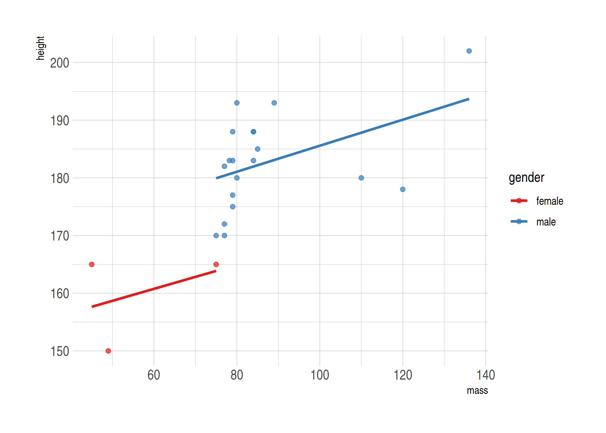

Today's lecture is about the bread-and-butter tool of applied econometrics and data science: regression analysis. My goal is to give you a whirlwind tour of the key functions and packages. I'm going to assume that you already know all of the necessary theoretical background on causal inference, asymptotics, etc. This lecture will *not* cover any of theoretical concepts or seek to justify a particular statistical model. Indeed, most of the models that we're going to run today are pretty silly. We also won't be able to cover some important topics. For example, I'll only provide the briefest example of a Bayesian regression model and I won't touch times series analysis at all. (Although, I will provide links for further reading at the bottom of this document.) These disclaimers aside, let's proceed...

## Software requirements

### R packages 

It's important to note that "base" R already provides all of the tools we need for basic regression analysis. However, we'll be using several additional packages today, because they will make our lives easier and offer increased power for some more sophisticated analyses.

- New: **broom**, **estimatr**, **fixest**, **sandwich**, **lmtest**, **AER**, **lfe**, **mfx**, **margins**, **modelsummary**, **vtable**
- Already used: **tidyverse**, **hrbrthemes**, **listviewer**

A convenient way to install (if necessary) and load everything is by running the below code chunk. Note that I'm opting for the development versions of **broom** and **modelsummary** because these contain a few features that aren't available in the respective CRAN releases at the time of writing.


```r
## Load and install the packages that we'll be using today
if (!require("pacman")) install.packages("pacman")
pacman::p_load(mfx, tidyverse, hrbrthemes, estimatr, fixest, sandwich, lmtest, AER, lfe, margins, vtable)

## Use dev versions of these two packages for some extra features
pacman::p_install_gh("tidymodels/broom") 
pacman::p_install_gh("vincentarelbundock/modelsummary")

## My preferred ggplot2 plotting theme (optional)
theme_set(hrbrthemes::theme_ipsum())
```


While we've already loaded all of the required packages for today, I'll try to be as explicit about where a particular function is coming from, whenever I use it below. 

Something else that I want to mention up front is that we'll mostly be working with the `starwars` data frame that we've already seen from previous lectures. Here's a quick reminder of what it looks like to refresh your memory.


```r
starwars
```

```
## # A tibble: 87 x 14
##    name  height  mass hair_color skin_color eye_color birth_year sex   gender
##    <chr>  <int> <dbl> <chr>      <chr>      <chr>          <dbl> <chr> <chr> 
##  1 Luke…    172    77 blond      fair       blue            19   male  mascu…
##  2 C-3PO    167    75 <NA>       gold       yellow         112   none  mascu…
##  3 R2-D2     96    32 <NA>       white, bl… red             33   none  mascu…
##  4 Dart…    202   136 none       white      yellow          41.9 male  mascu…
##  5 Leia…    150    49 brown      light      brown           19   fema… femin…
##  6 Owen…    178   120 brown, gr… light      blue            52   male  mascu…
##  7 Beru…    165    75 brown      light      blue            47   fema… femin…
##  8 R5-D4     97    32 <NA>       white, red red             NA   none  mascu…
##  9 Bigg…    183    84 black      light      brown           24   male  mascu…
## 10 Obi-…    182    77 auburn, w… fair       blue-gray       57   male  mascu…
## # … with 77 more rows, and 5 more variables: homeworld <chr>, species <chr>,
## #   films <list>, vehicles <list>, starships <list>
```


## Regression basics

### The `lm()` function

R's workhorse command for running regression models is the built-in `lm()` function. The "**lm**" stands for "**l**inear **m**odels" and the syntax is very intuitive.

```r
lm(y ~ x1 + x2 + x3 + ..., data = df)
```

You'll note that the `lm()` call includes a reference to the data source (in this case, a hypothetical data frame called `df`). We covered this in our earlier lecture on R language basics and object-orientated programming, but the reason is that many objects (e.g. data frames) can exist in your R environment at the same time. So we need to be specific about where our regression variables are coming from --- even if `df` is the only data frame in our global environment at the time. Another option would be to use indexing, but I find it a bit verbose:

```r
lm(df$y ~ df$x1 + df$x2 + df$x3 + ...)
```

Let's run a simple bivariate regression of mass on height using our dataset of starwars characters.


```r
ols1 = lm(mass ~ height, data = starwars)
# ols1 = lm(starwars$mass ~ starwars$height) ## Also works
ols1
```

```
## 
## Call:
## lm(formula = mass ~ height, data = starwars)
## 
## Coefficients:
## (Intercept)       height  
##    -13.8103       0.6386
```

The resulting object is pretty terse, but that's only because it buries most of its valuable information --- of which there is a lot --- within its internal list structure. If you're in RStudio, you can inspect this structure by typing `View(ols1)` or simply clicking on the "ols1" object in your environment pane. Doing so will prompt an interactive panel to pop up for you to play around with. That approach won't work for this knitted R Markdown document, however, so I'll use the `listviewer::jsonedit()` function that we saw in the previous lecture instead.


```r
# View(ols1) ## Run this instead if you're in a live session
listviewer::jsonedit(ols1, mode="view") ## Better for R Markdown
```

<!--html_preserve--><div id="htmlwidget-9b7f0b31c82a85e5023d" style="width:100%;height:10%;" class="jsonedit html-widget"></div>
<script type="application/json" data-for="htmlwidget-9b7f0b31c82a85e5023d">{"x":{"data":{"coefficients":{"(Intercept)":-13.8103136287302,"height":0.638571004587035},"residuals":{"1":-19.0238991602397,"2":-17.8310441373045,"3":-15.4925028116251,"4":20.8189707021492,"5":-32.9753370593249,"6":20.1446748122381,"7":-16.5539021281305,"8":-16.1310738162121,"9":-19.0481802106971,"10":-25.4096092061101,"11":-22.2410352336323,"13":-19.7838754171137,"14":-21.132467196936,"15":-22.6624701648267,"16":1260.060387826,"17":-17.7467571510656,"18":8.86753280306401,"19":-11.335372674014,"20":-19.7467571510656,"21":-24.8481802106971,"22":26.0961127113233,"23":5.48182275719367,"24":-20.2167541831749,"25":-18.9396121740008,"26":-18.132467196936,"29":-22.3839347749288,"30":-20.3610471051953,"31":-20.4338902565674,"32":-18.1567482473934,"34":-45.3496032703285,"35":-47.2295913987655,"39":-17.7096388850176,"42":-17.9396121740008,"44":-44.8553251877619,"45":-1.21536080245099,"47":-25.2767601189564,"48":-22.2410352336323,"49":-30.6267452795026,"50":-24.3496032703285,"52":-53.6867512152841,"55":-26.2410352336323,"57":-19.3253222198712,"60":-23.0481802106971,"61":-38.5467571510656,"62":-42.1924731327175,"64":-29.4338902565674,"66":-24.0481802106971,"67":-38.4696151418916,"68":-10.6267452795026,"69":-44.4224464217007,"72":-21.6367957336455,"74":-61.4338902565674,"76":-42.8553251877619,"77":34.8789766379308,"78":0.384698555364137,"79":-27.2410352336323,"80":-51.8553251877619,"81":-37.7353133161989,"87":-46.5539021281305},"effects":{"(Intercept)":-747.466613505302,"height":172.783889465672,"3":-8.91507473191358,"4":21.4194000157428,"5":-29.4427951434848,"6":22.0983868653301,"7":-13.8671619244768,"8":-9.61003251731305,"9":-17.3764020616673,"10":-23.6814442762678,"11":-20.8511909886646,"12":-20.6495024046433,"13":-19.2915287054689,"14":-20.4268242076726,"15":1262.18326022153,"16":-15.3419508514742,"17":10.7084712945311,"18":-3.06634116992954,"19":-17.3419508514742,"20":-23.1764020616673,"21":26.8093155865418,"22":6.75889344053646,"23":-18.2066553492705,"24":-16.8167397784715,"25":-16.2915287054689,"26":-15.3554124487178,"27":-17.3923729974795,"28":-19.3259799156619,"29":-16.936064344863,"30":-44.4108532718603,"31":-47.8696712630454,"32":-12.0343992983051,"33":-15.8167397784715,"34":-42.9016131346699,"35":5.47484083888535,"36":-22.4772463536779,"37":-20.8511909886646,"38":-29.8007688426593,"39":-23.4108532718603,"40":-52.0713598470667,"41":-24.8511909886646,"42":-17.7663176324662,"43":-21.3764020616673,"44":-36.1419508514742,"45":-39.5621197098763,"46":-28.3259799156619,"47":-22.3764020616673,"48":-35.9520352806753,"49":-9.80076884265928,"50":-45.3444601900428,"51":-14.1007923801226,"52":-60.3259799156619,"53":-40.9016131346699,"54":34.6899910201503,"55":-0.819249117040115,"56":-25.8511909886646,"57":-49.9016131346699,"58":-37.360431125855,"59":-43.8671619244768},"rank":2,"fitted.values":{"1":96.0238991602397,"2":92.8310441373045,"3":47.4925028116251,"4":115.181029297851,"5":81.9753370593249,"6":99.8553251877619,"7":91.5539021281305,"8":48.1310738162121,"9":103.048180210697,"10":102.40960920611,"11":106.241035233632,"13":131.783875417114,"14":101.132467196936,"15":96.6624701648267,"16":97.939612174001,"17":94.7467571510656,"18":101.132467196936,"19":28.335372674014,"20":94.7467571510656,"21":103.048180210697,"22":113.903887288677,"23":107.518177242806,"24":99.2167541831749,"25":97.9396121740008,"26":101.132467196936,"29":42.3839347749288,"30":88.3610471051953,"31":109.433890256567,"32":108.156748247393,"34":111.349603270329,"35":129.229591398766,"39":57.7096388850176,"42":97.9396121740008,"44":99.8553251877619,"45":46.215360802451,"47":90.2767601189564,"48":106.241035233632,"49":112.626745279503,"50":111.349603270329,"52":103.686751215284,"55":106.241035233632,"57":104.325322219871,"60":103.048180210697,"61":94.7467571510656,"62":92.1924731327175,"64":109.433890256567,"66":103.048180210697,"67":93.4696151418916,"68":112.626745279503,"69":132.422446421701,"72":36.6367957336455,"74":109.433890256567,"76":99.8553251877619,"77":124.121023362069,"78":135.615301444636,"79":106.241035233632,"80":99.8553251877619,"81":117.735313316199,"87":91.5539021281305},"assign":[0,1],"qr":{"qr":[[-7.68114574786861,-1336.64954904012],[0.130188910980824,270.578977473948],[0.130188910980824,0.287474707506683],[0.130188910980824,-0.104277826225195],[0.130188910980824,0.0879026620206323],[0.130188910980824,-0.0155791393425052],[0.130188910980824,0.0324659827189515],[0.130188910980824,0.283778928886571],[0.130188910980824,-0.0340580324430655],[0.130188910980824,-0.0303622538229534],[0.130188910980824,-0.0525369255436258],[0.130188910980824,-0.200368070348108],[0.130188910980824,-0.0229706965827293],[0.130188910980824,0.00289975375805507],[0.130188910980824,-0.00449180348216904],[0.130188910980824,0.0139870896183912],[0.130188910980824,-0.0229706965827293],[0.130188910980824,0.398348066110045],[0.130188910980824,0.0139870896183912],[0.130188910980824,-0.0340580324430655],[0.130188910980824,-0.0968862689849704],[0.130188910980824,-0.0599284827838499],[0.130188910980824,-0.0118833607223932],[0.130188910980824,-0.00449180348216904],[0.130188910980824,-0.0229706965827293],[0.130188910980824,0.31704093646758],[0.130188910980824,0.0509448758195118],[0.130188910980824,-0.071015818644186],[0.130188910980824,-0.0636242614039619],[0.130188910980824,-0.0821031545045222],[0.130188910980824,-0.18558495586766],[0.130188910980824,0.22834224958489],[0.130188910980824,-0.00449180348216904],[0.130188910980824,-0.0155791393425052],[0.130188910980824,0.294866264746907],[0.130188910980824,0.0398575399591756],[0.130188910980824,-0.0525369255436258],[0.130188910980824,-0.0894947117447463],[0.130188910980824,-0.0821031545045222],[0.130188910980824,-0.0377538110631775],[0.130188910980824,-0.0525369255436258],[0.130188910980824,-0.0414495896832896],[0.130188910980824,-0.0340580324430655],[0.130188910980824,0.0139870896183912],[0.130188910980824,0.0287702040988395],[0.130188910980824,-0.071015818644186],[0.130188910980824,-0.0340580324430655],[0.130188910980824,0.0213786468586153],[0.130188910980824,-0.0894947117447463],[0.130188910980824,-0.20406384896822],[0.130188910980824,0.350302944048588],[0.130188910980824,-0.071015818644186],[0.130188910980824,-0.0155791393425052],[0.130188910980824,-0.156018726906763],[0.130188910980824,-0.22254274206878],[0.130188910980824,-0.0525369255436258],[0.130188910980824,-0.0155791393425052],[0.130188910980824,-0.119060940705643],[0.130188910980824,0.0324659827189515]],"qraux":[1.13018891098082,1.02507442547873],"pivot":[1,2],"tol":1e-07,"rank":2},"df.residual":57,"na.action":{},"xlevels":{},"call":{},"terms":{},"model":{"mass":[77,75,32,136,49,120,75,32,84,77,84,112,80,74,1358,77,110,17,75,78.2,140,113,79,79,83,20,68,89,90,66,82,40,80,55,45,65,84,82,87,50,80,85,80,56.2,50,80,79,55,102,88,15,48,57,159,136,79,48,80,45],"height":[172,167,96,202,150,178,165,97,183,182,188,228,180,173,175,170,180,66,170,183,200,190,177,175,180,88,160,193,191,196,224,112,175,178,94,163,188,198,196,184,188,185,183,170,166,193,183,168,198,229,79,193,178,216,234,188,178,206,165]}},"options":{"mode":"view","modes":["code","form","text","tree","view"]}},"evals":[],"jsHooks":[]}</script><!--/html_preserve-->

As we can see, this `ols1` object has a bunch of important slots... containing everything from the regression coefficients, to vectors of the residuals and fitted (i.e. predicted) values, to the rank of the design matrix, to the input data, etc. etc. To summarise the key pieces of information, we can use the --- *wait for it* --- generic `summary()` function. This will look pretty similar to the default regression output from Stata that many of you will be used to.


```r
summary(ols1)
```

```
## 
## Call:
## lm(formula = mass ~ height, data = starwars)
## 
## Residuals:
##     Min      1Q  Median      3Q     Max 
##  -61.43  -30.03  -21.13  -17.73 1260.06 
## 
## Coefficients:
##             Estimate Std. Error t value Pr(>|t|)
## (Intercept) -13.8103   111.1545  -0.124    0.902
## height        0.6386     0.6261   1.020    0.312
## 
## Residual standard error: 169.4 on 57 degrees of freedom
##   (28 observations deleted due to missingness)
## Multiple R-squared:  0.01792,	Adjusted R-squared:  0.0006956 
## F-statistic:  1.04 on 1 and 57 DF,  p-value: 0.312
```

We can then dig down further by extracting a summary of the regression coefficients:


```r
summary(ols1)$coefficients
```

```
##               Estimate  Std. Error    t value  Pr(>|t|)
## (Intercept) -13.810314 111.1545260 -0.1242443 0.9015590
## height        0.638571   0.6260583  1.0199865 0.3120447
```

### Get "tidy" regression coefficients with the `broom` package

While it's easy to extract regression coefficients via the `summary()` function, in practice I always use the **broom** package ([link ](https://broom.tidyverse.org/)) to do so. **broom** has a bunch of neat features to convert regression (and other statistical) objects into "tidy" data frames. This is especially useful because regression output is so often used as an input to something else, e.g. a plot of coefficients or marginal effects. Here, I'll use `broom::tidy(..., conf.int = TRUE)` to coerce the `ols1` regression object into a tidy data frame of coefficient values and key statistics.


```r
# library(broom) ## Already loaded

tidy(ols1, conf.int = TRUE)
```

```
## # A tibble: 2 x 7
##   term        estimate std.error statistic p.value conf.low conf.high
##   <chr>          <dbl>     <dbl>     <dbl>   <dbl>    <dbl>     <dbl>
## 1 (Intercept)  -13.8     111.       -0.124   0.902 -236.       209.  
## 2 height         0.639     0.626     1.02    0.312   -0.615      1.89
```

Again, I could now pipe this tidied coefficients data frame to a **ggplot2** call, using saying `geom_pointrange()` to plot the error bars. Feel free to practice doing this yourself now, but we'll get to some explicit examples further below.

**broom** has a couple of other useful functions too. For example, `broom::glance()` summarises the model "meta" data (R<sup>2</sup>, AIC, etc.) in a data frame.


```r
glance(ols1)
```

```
## # A tibble: 1 x 12
##   r.squared adj.r.squared sigma statistic p.value    df logLik   AIC   BIC
##       <dbl>         <dbl> <dbl>     <dbl>   <dbl> <dbl>  <dbl> <dbl> <dbl>
## 1    0.0179      0.000696  169.      1.04   0.312     1  -386.  777.  783.
## # … with 3 more variables: deviance <dbl>, df.residual <int>, nobs <int>
```

By the way, if you're wondering how to export regression results to other formats (e.g. LaTeX tables), don't worry: We'll [get to that](#regression-tables) at the end of the lecture.

### Regressing on subsetted data

Our simple model isn't particularly good; the R<sup>2</sup> is only 0.018. Different species and homeworlds aside, we may have an extreme outlier in our midst...

<!-- -->

Maybe we should exclude Jabba from our regression? You can do this in two ways: 1) Create a new data frame and then regress, or 2) Subset the original data frame directly in the `lm()` call.

#### 1) Create a new data frame

Recall that we can keep multiple objects in memory in R. So we can easily create a new data frame that excludes Jabba using, say, **dplyr** ([lecture](https://raw.githack.com/uo-ec607/lectures/master/05-tidyverse/05-tidyverse.html)) or **data.table** ([lecture](https://raw.githack.com/uo-ec607/lectures/master/05-datatable/05-datatable.html)). For these lecture notes, I'll stick with **dplyr** commands since that's where our starwars dataset is coming from. But it would be trivial to switch to **data.table** if you prefer.


```r
starwars2 =
  starwars %>% 
  filter(name != "Jabba Desilijic Tiure")
  # filter(!(grepl("Jabba", name))) ## Regular expressions also work

ols2 = lm(mass ~ height, data = starwars2)
summary(ols2)
```

```
## 
## Call:
## lm(formula = mass ~ height, data = starwars2)
## 
## Residuals:
##     Min      1Q  Median      3Q     Max 
## -39.382  -8.212   0.211   3.846  57.327 
## 
## Coefficients:
##              Estimate Std. Error t value Pr(>|t|)    
## (Intercept) -32.54076   12.56053  -2.591   0.0122 *  
## height        0.62136    0.07073   8.785 4.02e-12 ***
## ---
## Signif. codes:  0 '***' 0.001 '**' 0.01 '*' 0.05 '.' 0.1 ' ' 1
## 
## Residual standard error: 19.14 on 56 degrees of freedom
##   (28 observations deleted due to missingness)
## Multiple R-squared:  0.5795,	Adjusted R-squared:  0.572 
## F-statistic: 77.18 on 1 and 56 DF,  p-value: 4.018e-12
```

#### 2) Subset directly in the `lm()` call

Running a regression directly on a subsetted data frame is equally easy.


```r
ols2a = lm(mass ~ height, data = starwars %>% filter(!(grepl("Jabba", name))))
summary(ols2a)
```

```
## 
## Call:
## lm(formula = mass ~ height, data = starwars %>% filter(!(grepl("Jabba", 
##     name))))
## 
## Residuals:
##     Min      1Q  Median      3Q     Max 
## -39.382  -8.212   0.211   3.846  57.327 
## 
## Coefficients:
##              Estimate Std. Error t value Pr(>|t|)    
## (Intercept) -32.54076   12.56053  -2.591   0.0122 *  
## height        0.62136    0.07073   8.785 4.02e-12 ***
## ---
## Signif. codes:  0 '***' 0.001 '**' 0.01 '*' 0.05 '.' 0.1 ' ' 1
## 
## Residual standard error: 19.14 on 56 degrees of freedom
##   (28 observations deleted due to missingness)
## Multiple R-squared:  0.5795,	Adjusted R-squared:  0.572 
## F-statistic: 77.18 on 1 and 56 DF,  p-value: 4.018e-12
```

The overall model fit is much improved by the exclusion of this outlier, with R<sup>2</sup> increasing to 0.58. Still, we should be cautious about throwing out data. Another approach is to handle or account for outliers with statistical methods. Which provides a nice segue to nonstandard errors.

## Nonstandard errors

Dealing with statistical irregularities (heteroskedasticity, clustering, etc.) is a fact of life for empirical researchers. However, it says something about the economics profession that a random stranger could walk uninvited into a live seminar and ask, "How did you cluster your standard errors?", and it would likely draw approving nods from audience members. 

The good news is that there are *lots* of ways to get nonstandard errors in R. For many years, these have been based on the excellent **sandwich** package ([link](https://cran.r-project.org/web/packages/sandwich/index.html)). However, my preferred way these days is to use the **estimatr** package ([link](https://declaredesign.org/r/estimatr/articles/getting-started.html)), which is both fast and provides convenient aliases for the standard regression functions. Some examples follow below. 

### Robust standard errors

You can obtain heteroskedasticity-consistent (HC) "robust" standard errors using `estimatr::lm_robust()`. Let's illustrate by implementing a robust version of the `ols1` regression that we ran earlier. Note that **estimatr** models automatically print in pleasing tidied/summary format, although you can certainly pipe them to `tidy()` too.


```r
# library(estimatr) ## Already loaded

ols1_robust = lm_robust(mass ~ height, data = starwars)
# tidy(ols1_robust, conf.int = TRUE) ## Could tidy too
ols1_robust
```

```
##               Estimate  Std. Error    t value     Pr(>|t|)    CI Lower
## (Intercept) -13.810314 23.45557632 -0.5887859 5.583311e-01 -60.7792950
## height        0.638571  0.08791977  7.2631109 1.159161e-09   0.4625147
##               CI Upper DF
## (Intercept) 33.1586678 57
## height       0.8146273 57
```

The package defaults to using Eicker-Huber-White robust standard errors, commonly referred to as "HC2" standard errors. You can easily specify alternate methods using the `se_type = ` argument.^[See the [package documentation](https://declaredesign.org/r/estimatr/articles/mathematical-notes.html#lm_robust-notes) for a full list of options.] For example, you can specify Stata robust standard errors if you want to replicate code or results from that language. (See [here](https://declaredesign.org/r/estimatr/articles/stata-wls-hat.html) for more details on why this isn't the default and why Stata's robust standard errors differ from those in R and Python.)


```r
lm_robust(mass ~ height, data = starwars, se_type = "stata")
```

```
##               Estimate  Std. Error    t value     Pr(>|t|)    CI Lower
## (Intercept) -13.810314 23.36219608 -0.5911394 5.567641e-01 -60.5923043
## height        0.638571  0.08616105  7.4113649 6.561046e-10   0.4660365
##               CI Upper DF
## (Intercept) 32.9716771 57
## height       0.8111055 57
```

**estimatr** also supports robust instrumental variable (IV) regression. However, I'm going to hold off discussing these until we get to the [IV section](#instrumental-variables) below. 

#### Aside on HAC (Newey-West) standard errors

On thing I want to flag is that **estimatr** does not yet offer support for HAC (i.e. heteroskedasticity *and* autocorrelation consistent) standard errors *a la* [Newey-West](https://en.wikipedia.org/wiki/Newey%E2%80%93West_estimator). I've submitted a [feature request](https://github.com/DeclareDesign/estimatr/issues/272) on GitHub --- vote up if you would like to see it added sooner! --- but you can still obtain these pretty easily using the aforementioned **sandwich** package. For example, we can use `sandwich::NeweyWest()` on our existing `ols1` object to obtain HAC SEs for it.


```r
# library(sandwich) ## Already loaded

# NeweyWest(ols1) ## Print the HAC VCOV
sqrt(diag(NeweyWest(ols1))) ## Print the HAC SEs
```

```
## (Intercept)      height 
##  21.2694130   0.0774265
```

If you plan to use HAC SEs for inference, then I recommend converting the model object with `lmtest::coeftest()`. This function builds on **sandwich** and provides a convenient way to do on-the-fly hypothesis testing with your model, swapping out a wide variety of alternate variance-covariance (VCOV) matrices. These alternate VCOV matrices could extended way beyond HAC --- including HC, clustered, bootsrapped, etc. --- but here's how it would work for the present case:


```r
# library(lmtest) ## Already loaded

ols1_hac = lmtest::coeftest(ols1, vcov = NeweyWest)
ols1_hac
```

```
## 
## t test of coefficients:
## 
##               Estimate Std. Error t value  Pr(>|t|)    
## (Intercept) -13.810314  21.269413 -0.6493    0.5187    
## height        0.638571   0.077427  8.2474 2.672e-11 ***
## ---
## Signif. codes:  0 '***' 0.001 '**' 0.01 '*' 0.05 '.' 0.1 ' ' 1
```

Note that its easy to convert `coeftest()`-adjusted models to tidied **broom** objects too. 


```r
tidy(ols1_hac, conf.int = TRUE)
```

```
## # A tibble: 2 x 7
##   term        estimate std.error statistic  p.value conf.low conf.high
##   <chr>          <dbl>     <dbl>     <dbl>    <dbl>    <dbl>     <dbl>
## 1 (Intercept)  -13.8     21.3       -0.649 5.19e- 1  -56.4      28.8  
## 2 height         0.639    0.0774     8.25  2.67e-11    0.484     0.794
```

### Clustered standard errors

Clustered standard errors is an issue that most commonly affects panel data. As such, I'm going to hold off discussing clustering until we get to the [panel data section](#high-dimensional-fes-and-multiway-clustering) below. But here's a quick example of clustering with `estimatr::lm_robust()` just to illustrate:


```r
lm_robust(mass ~ height, data = starwars, clusters = homeworld)
```

```
##               Estimate  Std. Error    t value     Pr(>|t|)    CI Lower
## (Intercept) -9.3014938 28.84436408 -0.3224718 0.7559158751 -76.6200628
## height       0.6134058  0.09911832  6.1886211 0.0002378887   0.3857824
##               CI Upper       DF
## (Intercept) 58.0170751 7.486034
## height       0.8410291 8.195141
```

## Dummy variables and interaction terms

For the next few sections, it will prove convenient to demonstrate using a subsample of the starwars data that comprises only the human characters. Let's quickly create this new dataset before continuing. Note that I'm creating a factored (i.e. ordered) version of the "gender" variable, since I want to demonstrate some general principles about factors in the paragraphs that follow.


```r
humans = 
  starwars %>% 
  filter(species=="Human") %>%
  mutate(gender_factored = as.factor(gender)) %>% ## create factored version of "gender"
  select(contains("gender"), everything())
humans
```

```
## # A tibble: 35 x 15
##    gender gender_factored name  height  mass hair_color skin_color eye_color
##    <chr>  <fct>           <chr>  <int> <dbl> <chr>      <chr>      <chr>    
##  1 mascu… masculine       Luke…    172    77 blond      fair       blue     
##  2 mascu… masculine       Dart…    202   136 none       white      yellow   
##  3 femin… feminine        Leia…    150    49 brown      light      brown    
##  4 mascu… masculine       Owen…    178   120 brown, gr… light      blue     
##  5 femin… feminine        Beru…    165    75 brown      light      blue     
##  6 mascu… masculine       Bigg…    183    84 black      light      brown    
##  7 mascu… masculine       Obi-…    182    77 auburn, w… fair       blue-gray
##  8 mascu… masculine       Anak…    188    84 blond      fair       blue     
##  9 mascu… masculine       Wilh…    180    NA auburn, g… fair       blue     
## 10 mascu… masculine       Han …    180    80 brown      fair       brown    
## # … with 25 more rows, and 7 more variables: birth_year <dbl>, sex <chr>,
## #   homeworld <chr>, species <chr>, films <list>, vehicles <list>,
## #   starships <list>
```

### Dummy variables as *factors*

Dummy variables are a core component of many regression models. However, these can be a pain to create in some statistical languages, since you first have to tabulate a whole new matrix of binary variables and then append it to the original data frame. In contrast, R has a very convenient framework for creating and evaluating dummy variables in a regression: Simply specify the variable of interest as a [factor](https://r4ds.had.co.nz/factors.html).^[Factors are variables that have distinct qualitative levels, e.g. "male", "female", "hermaphrodite", etc.]

Here's an example using the "gendered_factored" variable that we explicitly created earlier. Since I don't plan on reusing this model, I'm just going to print the results to screen rather than saving it to my global environment.


```r
summary(lm(mass ~ height + gender_factored, data = humans))
```

```
## 
## Call:
## lm(formula = mass ~ height + gender_factored, data = humans)
## 
## Residuals:
##     Min      1Q  Median      3Q     Max 
## -16.068  -8.130  -3.660   0.702  37.112 
## 
## Coefficients:
##                          Estimate Std. Error t value Pr(>|t|)  
## (Intercept)              -84.2520    65.7856  -1.281   0.2157  
## height                     0.8787     0.4075   2.156   0.0441 *
## gender_factoredmasculine  10.7391    13.1968   0.814   0.4259  
## ---
## Signif. codes:  0 '***' 0.001 '**' 0.01 '*' 0.05 '.' 0.1 ' ' 1
## 
## Residual standard error: 15.19 on 19 degrees of freedom
##   (13 observations deleted due to missingness)
## Multiple R-squared:  0.444,	Adjusted R-squared:  0.3855 
## F-statistic: 7.587 on 2 and 19 DF,  p-value: 0.003784
```

Okay, I should tell you that I'm actually making things more complicated than they need to be with the heavy-handed emphasis on factors. R is "friendly" and tries to help whenever it thinks you have misspecified a function or variable. While this is something to be [aware of](https://rawgit.com/grantmcdermott/R-intro/master/rIntro.html#r_tries_to_guess_what_you_meant), normally It Just Works<sup>TM</sup>. A case in point is that we don't actually *need* to specify a string (i.e. character) variable as a factor in a regression. R will automatically do this for you regardless, since it's the only sensible way to include string variables in a regression.


```r
## Use the non-factored version of "gender" instead; R knows it must be ordered
## for it to be included as a regression variable
summary(lm(mass ~ height + gender, data = humans))
```

```
## 
## Call:
## lm(formula = mass ~ height + gender, data = humans)
## 
## Residuals:
##     Min      1Q  Median      3Q     Max 
## -16.068  -8.130  -3.660   0.702  37.112 
## 
## Coefficients:
##                 Estimate Std. Error t value Pr(>|t|)  
## (Intercept)     -84.2520    65.7856  -1.281   0.2157  
## height            0.8787     0.4075   2.156   0.0441 *
## gendermasculine  10.7391    13.1968   0.814   0.4259  
## ---
## Signif. codes:  0 '***' 0.001 '**' 0.01 '*' 0.05 '.' 0.1 ' ' 1
## 
## Residual standard error: 15.19 on 19 degrees of freedom
##   (13 observations deleted due to missingness)
## Multiple R-squared:  0.444,	Adjusted R-squared:  0.3855 
## F-statistic: 7.587 on 2 and 19 DF,  p-value: 0.003784
```


### Interaction effects

Like dummy variables, R provides a convenient syntax for specifying interaction terms directly in the regression model without having to create them manually beforehand.^[Although there are very good reasons that you might want to modify your parent variables before doing so (e.g. centering them). As it happens, I'm [on record](https://twitter.com/grant_mcdermott/status/903691491414917122) as stating that interaction effects are most widely misunderstood and misapplied concept in econometrics. However, that's a topic for another day. (Read the paper in the link!)] You can use any of the following expansion operators:

- `x1:x2` "crosses" the variables (equivalent to including only the x1 × x2 interaction term)
- `x1/x2` "nests" the second variable within the first (equivalent to `x1 + x1:x2`; more on this [later](#nestedmarg))
- `x1*x2` includes all parent and interaction terms (equivalent to `x1 + x2 + x1:x2`) 

As a rule of thumb, albeit [not always](#nestedmarg), it is generally advisable to include all of the parent terms alongside their interactions. This makes the `*` option a good default. 

For example, we might wonder whether the relationship between a person's body mass and their height is modulated by their gender. That is, we want to run a regression of the form,

$$Mass = \beta_0 + \beta_1 D_{Male} + \beta_2 Height + \beta_3 D_{Male} \times Height$$

To implement this in R, we simply run the following,


```r
ols_ie = lm(mass ~ gender * height, data = humans)
summary(ols_ie)
```

```
## 
## Call:
## lm(formula = mass ~ gender * height, data = humans)
## 
## Residuals:
##     Min      1Q  Median      3Q     Max 
## -16.250  -8.158  -3.684  -0.107  37.193 
## 
## Coefficients:
##                        Estimate Std. Error t value Pr(>|t|)
## (Intercept)            -61.0000   204.0565  -0.299    0.768
## gendermasculine        -15.7224   219.5440  -0.072    0.944
## height                   0.7333     1.2741   0.576    0.572
## gendermasculine:height   0.1629     1.3489   0.121    0.905
## 
## Residual standard error: 15.6 on 18 degrees of freedom
##   (13 observations deleted due to missingness)
## Multiple R-squared:  0.4445,	Adjusted R-squared:  0.3519 
## F-statistic: 4.801 on 3 and 18 DF,  p-value: 0.01254
```


## Panel models

### Fixed effects with the **fixest** package

The simplest (and least efficient) way to include fixed effects in a regression model is, of course, to use dummy variables. However, it isn't very efficient or scalable. What's the point learning all that stuff about the [Frisch-Waugh-Lovell](https://en.wikipedia.org/wiki/Frisch%E2%80%93Waugh%E2%80%93Lovell_theorem), within-group transformations, etc. etc. if we can't use them in our software routines? Again, there are several options to choose from here. For example, many of you are probably familiar with the excellent **lfe** package ([link](https://cran.r-project.org/web/packages/lfe/index.html)), which offers near-identical functionality to the popular Stata library, **reghdfe** ([link](http://scorreia.com/software/reghdfe/)). However, for fixed effects models in R, I am going to advocate that you take a look at the **fixest** package ([link](https://github.com/lrberge/fixest)).

**fixest** is relatively new on the scene and has quickly become one of my packages in the entire R catalogue. It has a boatload of functionality built in to it: support for nonlinear models, high-dimensional fixed effects, multiway clustering, etc. It is also insanely fast... as in, up to [*orders of magnitude*](https://github.com/lrberge/fixest#benchmarking) faster than **lfe** or **reghdfe**. I won't be able to cover all of **fixest**'s features in depth here --- see the [introductory vignette](https://cran.r-project.org/web/packages/fixest/vignettes/fixest_walkthrough.html) for a thorough walkthrough --- but I hope to least give you a sense of why I am so enthusiastic about it. Let's start off with a simple example before moving on to something a little more demanding.

#### Simple FE model

The package's main function is `fixest::feols()`, which is used for estimating linear fixed effects models. The syntax is such that you first specify the regression model as per normal, and then list the fixed effect(s) after a `|`. An example may help to illustrate. Let's say that we again want to run our simple regression of mass on height, but this time control for species-level fixed effects.^[Since we specify "species" in the fixed effects slot below, `feols()` will automatically coerce it to a factor variable even though we didn't explicitly tell it to.]


```r
# library(fixest) ## Already loaded

ols_fe = feols(mass ~ height | species, data = starwars) ## Fixed effect(s) go after the "|"
ols_fe
```

```
## OLS estimation, Dep. Var.: mass
## Observations: 58 
## Fixed-effects: species: 31
## Standard-errors: Clustered (species) 
##        Estimate Std. Error t value  Pr(>|t|)    
## height 0.974876   0.044291   22.01 < 2.2e-16 ***
## ---
## Signif. codes:  0 '***' 0.001 '**' 0.01 '*' 0.05 '.' 0.1 ' ' 1
## Log-likelihood: -214.02   Adj. R2: 0.99282 
##                         R2-Within: 0.66249
```

Note that the resulting model object has automatically clustered the standard errors by the fixed effect variable (i.e. species). We'll explore some more options for adjusting standard errors in **fixest** objects shortly, but you can specify vanilla standard errors simply by calling the `se` argument in `summary.fixest()` as follows.


```r
summary(ols_fe, se = 'standard')
```

```
## OLS estimation, Dep. Var.: mass
## Observations: 58 
## Fixed-effects: species: 31
## Standard-errors: Standard 
##        Estimate Std. Error t value Pr(>|t|)    
## height 0.974876   0.136463  7.1439 1.38e-07 ***
## ---
## Signif. codes:  0 '***' 0.001 '**' 0.01 '*' 0.05 '.' 0.1 ' ' 1
## Log-likelihood: -214.02   Adj. R2: 0.99282 
##                         R2-Within: 0.66249
```

Before continuing, let's quickly save a "tidied" data frame of the coefficients for later use. I'll use vanilla standard errors again, if only to show you that the `broom::tidy()` method for `fixest` objects also accepts an `se` argument. This basically just provides another convenient way for you to adjust standard errors for your models on the fly.


```r
# coefs_fe = tidy(summary(ols_fe, se = 'standard'), conf.int = TRUE) ## same as below
coefs_fe = tidy(ols_fe, se = 'standard', conf.int = TRUE)
```

#### High dimensional FEs and multiway clustering

As I already mentioned above, **fixest** supports (arbitrarily) high-dimensional fixed effects and (up to fourway) multiway clustering. To see this in action, let's add "homeworld" as an additional fixed effect to the model.


```r
## We now have two fixed effects: species and homeworld
ols_hdfe = feols(mass ~ height |  species + homeworld, data = starwars)
ols_hdfe
```

```
## OLS estimation, Dep. Var.: mass
## Observations: 55 
## Fixed-effects: species: 30,  homeworld: 38
## Standard-errors: Clustered (species) 
##        Estimate Std. Error t value Pr(>|t|) 
## height 0.755844   0.332888  2.2706 0.264107 
## ---
## Signif. codes:  0 '***' 0.001 '**' 0.01 '*' 0.05 '.' 0.1 ' ' 1
## Log-likelihood: -188.55   Adj. R2: 1.00768 
##                         R2-Within: 0.48723
```

Easy enough, but the standard errors of the above model are automatically clustered by species, i.e. the first fixed effect variable. Let's go a step further and cluster by both "species" and "homeworld". ^[I most definitely am not claiming that this is a particularly good or sensible clustering strategy, but just go with it.] We can do this using either the `se` or `cluster` arguments of `summary.fixest()`. I'll (re)assign the model to the same `ols_hdfe` object, but you could, of course, create a new object if you so wished.


```r
## Cluster by both species and homeworld
# ols_hdfe = summary(ols_hdfe, se = 'twoway') ## Same effect as the next line
ols_hdfe = summary(ols_hdfe, cluster = c('species', 'homeworld'))
ols_hdfe
```

```
## OLS estimation, Dep. Var.: mass
## Observations: 55 
## Fixed-effects: species: 30,  homeworld: 38
## Standard-errors: Two-way (species & homeworld) 
##        Estimate Std. Error t value Pr(>|t|)    
## height 0.755844   0.117257   6.446  0.09798 .  
## ---
## Signif. codes:  0 '***' 0.001 '**' 0.01 '*' 0.05 '.' 0.1 ' ' 1
## Log-likelihood: -188.55   Adj. R2: 1.00768 
##                         R2-Within: 0.48723
```

#### Comparing our model coefficients

**fixest** provides an inbuilt `coefplot()` function for plotting estimation results. This is especially useful for tracing the evolution of treatment effects over time. (Take a look [here](https://cran.r-project.org/web/packages/fixest/vignettes/fixest_walkthrough.html#23_adding_interactions:_yearly_treatment_effect).) When it comes to comparing coefficients across models, however, I often like to do this "manually" with **ggplot2**. Consider the below example, which leverages the fact that we have saved (or can save) regression models as data frames with `broom::tidy()`. As I suggested earlier, this makes it very easy to construct our own bespoke coefficient plots.


```r
# library(ggplot2) ## Already loaded

## First get tidied output of the ols_hdfe object
coefs_hdfe = tidy(ols_hdfe, conf.int = TRUE)

bind_rows(
  coefs_fe %>% mutate(reg = "Model 1\nFE and no clustering"),
  coefs_hdfe %>% mutate(reg = "Model 2\nHDFE and twoway clustering")
  ) %>%
  ggplot(aes(x=reg, y=estimate, ymin=conf.low, ymax=conf.high)) +
  geom_pointrange() +
  labs(Title = "Marginal effect of height on mass") +
  geom_hline(yintercept = 0, col = "orange") +
  ylim(-0.5, NA) + ## Added a bit more bottom space to emphasize the zero line
  labs(
    title = "'Effect' of height on mass",
    caption = "Data: Characters from the Star Wars universe"
    ) +
  theme(axis.title.x = element_blank())
```

<!-- -->

FWIW, we'd normally expect our standard errors to blow up with clustering. Here that effect appears to be outweighed by the increased precision brought on by additional fixed effects. Still, I wouldn't put too much thought into it. Our clustering choice doesn't make much sense and I really just trying to demonstrate the package syntax.

#### Aside on standard errors

We've now seen some of the different options that **fixest** has for specifying different error structures. In short, run your model and then use either the `se` or `cluster` arguments in `summary.fixest()` (or `broom::tidy()`) if you aren't happy with the default clustering choice. There are two additional points that I want to draw your attention to.

First, if you're coming from another statistical language or package, adjusting the standard errors after the fact rather than in the original model call may seem slightly odd. But this behaviour is actually extremely powerful, because it allows us to analyse the effect of different error structures *on-the-fly* without having to rerun the entire model again. **fixest** is already the fastest game in town, but just think about the implied timesavings for really large models.^[To be clear, adjusting the standard errors via, say, `summary.fixest()` completes instantaneously. It's a testament to how well the package is put together and the [novel estimation method](https://wwwen.uni.lu/content/download/110162/1299525/file/2018_13) that Laurent (the package author) has derived.]

Second, reconciling standard errors across different software is a much more complicated process than you may realise. There are a number of unresolved theoretical issues to consider --- especially when it comes to multiway clustering --- and package maintainers have to make a number of arbitrary decisions about the best way to account for these. See [here](https://github.com/sgaure/lfe/issues/1#issuecomment-530643808) for a detailed discussion. Luckily, Laurent (the package author) has taken the time to write out a [detailed vignette](https://cran.r-project.org/web/packages/fixest/vignettes/standard_errors.html) about how to replicate standard errors from other methods and software packages.^[If you want a deep dive into the theory with even more simulations, then [this paper](https://cran.r-project.org/web/packages/sandwich/vignettes/sandwich-CL.pdf) by the authors of the **sandwich** paper is another excellent resource.]

### Random and mixed effects

Fixed effects models are more common than random or mixed effects models in economics (in my experience, anyway). I'd also advocate for [Bayesian hierachical models](http://www.stat.columbia.edu/~gelman/arm/) if we're going down the whole random effects path. However, it's still good to know that R has you covered for random effects models through the **plm** ([link](https://cran.r-project.org/web/packages/plm/)) and **nlme** ([link](https://cran.r-project.org/web/packages/nlme/index.html)) packages.^[As I mentioned above, **plm** also handles fixed effects (and pooling) models. However, I prefer **fixest** and **lfe** for the reasons already discussed.] I won't go into detail , but click on those links if you would like to see some examples.

## Instrumental variables

As you would have guessed by now, there are a number of ways to run instrumental variable (IV) regressions in R. I'll walk through three different options using the `AER::ivreg()`, `estimatr::iv_robust()`, and `lfe::felm()` functions, respectively. These are all going to follow a similar syntax, where the IV first-stage regression is specified after a **`|`** following the main regression. However, there are also some subtle and important differences, which is why I want to go through each of them. After that, I'll let you decide which of the three options is your favourite.

The dataset that we'll be using here is a panel of US cigarette consumption by state, which is taken from the **AER** package ([link](https://cran.r-project.org/web/packages/AER/vignettes/AER.pdf)). Let's load the data, add some modified variables, and then take a quick look at it. Note that I'm going to limit the dataset to 2005 only, given that I want to focus the IV syntax and don't want to deal with the panel structure of the data. (Though that's very easily done, as we've already seen.)


```r
## Get the data
data("CigarettesSW", package = "AER")
## Create a new data frame with some modified variables
cigs =
  CigarettesSW %>%
  mutate(
    rprice = price/cpi,
    rincome = income/population/cpi,
    rtax = tax/cpi,
    tdiff = (taxs - tax)/cpi
    ) %>%
  as_tibble()
## Create a subset of the data limited to 1995
cigs95 = cigs %>% filter(year==1995)
cigs95
```

```
## # A tibble: 48 x 13
##    state year    cpi population packs income   tax price  taxs rprice rincome
##    <fct> <fct> <dbl>      <dbl> <dbl>  <dbl> <dbl> <dbl> <dbl>  <dbl>   <dbl>
##  1 AL    1995   1.52    4262731 101.  8.39e7  40.5  158.  41.9   104.    12.9
##  2 AR    1995   1.52    2480121 111.  4.60e7  55.5  176.  63.9   115.    12.2
##  3 AZ    1995   1.52    4306908  72.0 8.89e7  65.3  199.  74.8   130.    13.5
##  4 CA    1995   1.52   31493524  56.9 7.71e8  61    211.  74.8   138.    16.1
##  5 CO    1995   1.52    3738061  82.6 9.29e7  44    167.  44     110.    16.3
##  6 CT    1995   1.52    3265293  79.5 1.04e8  74    218.  86.4   143.    21.0
##  7 DE    1995   1.52     718265 124.  1.82e7  48    166.  48     109.    16.7
##  8 FL    1995   1.52   14185403  93.1 3.34e8  57.9  188.  68.5   123.    15.4
##  9 GA    1995   1.52    7188538  97.5 1.60e8  36    157.  37.4   103.    14.6
## 10 IA    1995   1.52    2840860  92.4 6.02e7  60    191.  69.1   125.    13.9
## # … with 38 more rows, and 2 more variables: rtax <dbl>, tdiff <dbl>
```

Now, assume that we are interested in regressing the number of cigarettes packs consumed per capita on their average price and people's real incomes. The problem is that the price is endogenous, because it is simultaneously determined by demand and supply. So we need to instrument for it using different tax variables. That is, we want to run the following two-stage IV regression.

$$price_i = \pi_0 + \pi_1 tdiff_i + + \pi_2 rtax_i + v_i  \hspace{1cm} \text{(First stage)}$$
$$packs_i = \beta_0 + \beta_2\widehat{price_i} + \beta_1 rincome_i + u_i \hspace{1cm} \text{(Second stage)}$$

### Option 1: `AER::ivreg()`

Let's start with `AER::ivreg()` as our first IV regression option; if for no other reason than that's where our data are coming from. The key point from the below code chunk is that the first-stage regression is going to be specified after the **`|`** and will include *all* exogenous variables.


```r
# library(AER) ## Already loaded

## Run the IV regression 
iv_reg = 
  ivreg(
    log(packs) ~ log(rprice) + log(rincome) | ## The main regression. "rprice" is endogenous
      log(rincome) + tdiff + rtax, ## List all *exogenous* variables, including "rincome"
    data = cigs95
    )
summary(iv_reg, diagnostics = TRUE)
```

```
## 
## Call:
## ivreg(formula = log(packs) ~ log(rprice) + log(rincome) | log(rincome) + 
##     tdiff + rtax, data = cigs95)
## 
## Residuals:
##        Min         1Q     Median         3Q        Max 
## -0.6006931 -0.0862222 -0.0009999  0.1164699  0.3734227 
## 
## Coefficients:
##              Estimate Std. Error t value Pr(>|t|)    
## (Intercept)    9.8950     1.0586   9.348 4.12e-12 ***
## log(rprice)   -1.2774     0.2632  -4.853 1.50e-05 ***
## log(rincome)   0.2804     0.2386   1.175    0.246    
## 
## Diagnostic tests:
##                  df1 df2 statistic p-value    
## Weak instruments   2  44   244.734  <2e-16 ***
## Wu-Hausman         1  44     3.068  0.0868 .  
## Sargan             1  NA     0.333  0.5641    
## ---
## Signif. codes:  0 '***' 0.001 '**' 0.01 '*' 0.05 '.' 0.1 ' ' 1
## 
## Residual standard error: 0.1879 on 45 degrees of freedom
## Multiple R-Squared: 0.4294,	Adjusted R-squared: 0.4041 
## Wald test: 13.28 on 2 and 45 DF,  p-value: 2.931e-05
```

I want to emphasise that you might find the above syntax a little counterintuitive --- or, at least, unusual --- if you're coming from a language like Stata.^[Assuming that you have already created the logged variables and subsetted the data, the Stata equivalent would be something like `ivreg log_packs = log_rincome (log_rprice = tdiff rtax)`.] Note that we didn't specify the endogenous variable (i.e. "rprice") directly. Rather, we told R which are the *exogenous* variables. It then figured out which were the endogenous variables that needed to be instrumented and ran the necessary first-stage regression(s) in the background. This approach actually makes quite a lot of sense if you think about the underlying theory of IV. But different strokes for different folks. 

The good news for those who prefer the Stata-style syntax is that `AER::ivreg()` also accepts an alternate way of specifying the first-stage. This time, we'll denote our endogenous "rprice" variable with `. -price` and include only the instrumental variables after the `|` break. Feel free to check yourself, but the outcome will be exactly the same.


```r
## For those of you that prefer Stata-esque ivreg syntax, where we we specify
## the instruments explicitly
ivreg(
  log(packs) ~ log(rprice) + log(rincome) | 
    . -log(rprice) + tdiff + rtax, ## Alternative way of specifying the first-stage.
  data = cigs95
  )
```


### Option 2: `estimatr::iv_robust()`

Our second IV option comes from the **estimatr** package that we saw earlier. This will default to using HC2 robust standard errors although, as before, we could specify other options if we so wished (including clustering). More importantly, note that the syntax is effectively identical to the previous example. All we need to do is change the function call from `AER::ivreg()` to `estimatr::iv_robust()`.


```r
# library(estimatr) ## Already loaded

## Run the IV regression with robust SEs
iv_reg_robust = 
  iv_robust( ## We only need to change the function call. Everything else stays the same.
    log(packs) ~ log(rprice) + log(rincome) | 
      log(rincome) + tdiff + rtax,
    data = cigs95
    )
summary(iv_reg_robust, diagnostics = TRUE)
```

```
## 
## Call:
## iv_robust(formula = log(packs) ~ log(rprice) + log(rincome) | 
##     log(rincome) + tdiff + rtax, data = cigs95)
## 
## Standard error type:  HC2 
## 
## Coefficients:
##              Estimate Std. Error t value  Pr(>|t|) CI Lower CI Upper DF
## (Intercept)    9.8950     0.9777  10.120 3.569e-13   7.9257  11.8642 45
## log(rprice)   -1.2774     0.2547  -5.015 8.739e-06  -1.7904  -0.7644 45
## log(rincome)   0.2804     0.2547   1.101 2.768e-01  -0.2326   0.7934 45
## 
## Multiple R-squared:  0.4294 ,	Adjusted R-squared:  0.4041 
## F-statistic:  15.5 on 2 and 45 DF,  p-value: 7.55e-06
```

### Option 3: `felm::lfe()`

Finally, we get to my personal favourite IV option using the `felm()` function from the **lfe** package. This is actually my favourite option; not only because I work mostly with panel data, but also because I find it has the most natural syntax.^[The **fixest** package that I concentrated on earlier, doesn't yet support IV regression. However, even if it is a little slower, `lfe::felm()` includes basically all of same benefits: support for high-level fixed effects, multiway clustering, etc.] In fact, it very closely resembles Stata's approach to writing out the first-stage, where you specify the endogenous variable(s) and the instruments only.


```r
# library(lfe) ## Already loaded

iv_felm = 
  felm(
    log(packs) ~ log(rincome) |
      0 | ## No FEs
      (log(rprice) ~ tdiff + rtax), ## First-stage. Note the surrounding parentheses
    data = cigs95
  )
summary(iv_felm)
```

```
## 
## Call:
##    felm(formula = log(packs) ~ log(rincome) | 0 | (log(rprice) ~      tdiff + rtax), data = cigs95) 
## 
## Residuals:
##      Min       1Q   Median       3Q      Max 
## -0.60069 -0.08622 -0.00100  0.11647  0.37342 
## 
## Coefficients:
##                    Estimate Std. Error t value Pr(>|t|)    
## (Intercept)          9.8950     1.0586   9.348 4.12e-12 ***
## log(rincome)         0.2804     0.2386   1.175    0.246    
## `log(rprice)(fit)`  -1.2774     0.2632  -4.853 1.50e-05 ***
## ---
## Signif. codes:  0 '***' 0.001 '**' 0.01 '*' 0.05 '.' 0.1 ' ' 1
## 
## Residual standard error: 0.1879 on 45 degrees of freedom
## Multiple R-squared(full model): 0.4294   Adjusted R-squared: 0.4041 
## Multiple R-squared(proj model): 0.4294   Adjusted R-squared: 0.4041 
## F-statistic(full model):13.28 on 2 and 45 DF, p-value: 2.931e-05 
## F-statistic(proj model): 13.28 on 2 and 45 DF, p-value: 2.931e-05 
## F-statistic(endog. vars):23.56 on 1 and 45 DF, p-value: 1.496e-05
```
Note that in the above example, we inserted a "0" where the fixed effect slot goes, since we only used a subset of the data. Just for fun then, here's another IV regression with `felm()`. This time, I'll use the whole `cigs` data frame (i.e. not subsetting to 1995), and use both year and state fixed effects to control for the panel structure.


```r
iv_felm_all = 
  felm(
    log(packs) ~ log(rincome) |
      year + state | ## Now include FEs
      (log(rprice) ~ tdiff + rtax), 
    data = cigs ## Use whole panel data set
  )
summary(iv_felm_all)
```

```
## 
## Call:
##    felm(formula = log(packs) ~ log(rincome) | year + state | (log(rprice) ~      tdiff + rtax), data = cigs) 
## 
## Residuals:
##      Min       1Q   Median       3Q      Max 
## -0.08393 -0.03851  0.00000  0.03851  0.08393 
## 
## Coefficients:
##                    Estimate Std. Error t value Pr(>|t|)    
## log(rincome)         0.4620     0.3081   1.500    0.141    
## `log(rprice)(fit)`  -1.2024     0.1712  -7.024  9.4e-09 ***
## ---
## Signif. codes:  0 '***' 0.001 '**' 0.01 '*' 0.05 '.' 0.1 ' ' 1
## 
## Residual standard error: 0.06453 on 45 degrees of freedom
## Multiple R-squared(full model): 0.9668   Adjusted R-squared: 0.9299 
## Multiple R-squared(proj model): 0.5466   Adjusted R-squared: 0.04281 
## F-statistic(full model):26.21 on 50 and 45 DF, p-value: < 2.2e-16 
## F-statistic(proj model): 27.71 on 2 and 45 DF, p-value: 1.436e-08 
## F-statistic(endog. vars):49.33 on 1 and 45 DF, p-value: 9.399e-09
```

## Other models

### Generalised linear models (logit, etc.)

To run a generalised linear model (GLM), we use the in-built `glm()` function and simply assign an appropriate [family](https://stat.ethz.ch/R-manual/R-devel/library/stats/html/family.html) (which describes the error distribution and corresponding link function). For example, here's a simple logit model.


```r
glm_logit = glm(am ~ cyl + hp + wt, data = mtcars, family = binomial)
tidy(glm_logit, conf.int = TRUE)
```

```
## # A tibble: 4 x 7
##   term        estimate std.error statistic p.value  conf.low conf.high
##   <chr>          <dbl>     <dbl>     <dbl>   <dbl>     <dbl>     <dbl>
## 1 (Intercept)  19.7       8.12       2.43   0.0152   8.56      44.3   
## 2 cyl           0.488     1.07       0.455  0.649   -1.53       3.12  
## 3 hp            0.0326    0.0189     1.73   0.0840   0.00332    0.0884
## 4 wt           -9.15      4.15      -2.20   0.0276 -21.4       -3.48
```

Remember that the estimates above simply reflect the naive coefficient values, which enter multiplicatively via the link function. We'll get a dedicated section on extracting [marginal effects](#marginal-effects) from non-linear models in a moment. But I do want to quickly flag the **mfx** package ([link](https://cran.r-project.org/web/packages/mfx/vignettes/mfxarticle.pdf)), which provides convenient aliases for obtaining marginal effects from a variety of GLMs. For example,


```r
# library(mfx) ## Already loaded
## Be careful: mfx loads the MASS package, which produces a namespace conflict
## with dplyr for select(). You probably want to be explicit about which one you 
## want, e.g. `select = dplyr::select`

## Get marginal effects for the above logit model
glm_logitmfx = logitmfx(glm_logit, atmean = TRUE, data = mtcars)
## Could also plug in the original formula directly
# glm_logitmfx = logitmfx(am ~ cyl + hp + wt, atmean = TRUE, data = mtcars)
tidy(glm_logitmfx, conf.int = TRUE)
```

```
## # A tibble: 3 x 8
##   term  atmean estimate std.error statistic p.value conf.low conf.high
##   <chr> <lgl>     <dbl>     <dbl>     <dbl>   <dbl>    <dbl>     <dbl>
## 1 cyl   TRUE    0.0538    0.113       0.475   0.635 -0.178     0.286  
## 2 hp    TRUE    0.00359   0.00290     1.24    0.216 -0.00236   0.00954
## 3 wt    TRUE   -1.01      0.668      -1.51    0.131 -2.38      0.359
```


### Bayesian regression

We could spend a whole course on Bayesian models. The very, very short version is that R offers outstanding support for Bayesian models and data analysis. You will find convenient interfaces to all of the major MCMC and Bayesian software engines: [Stan](https://mc-stan.org/users/interfaces/rstan), [JAGS](http://mcmc-jags.sourceforge.net/), TensorFlow (via [Greta](https://greta-stats.org/)), etc. Here follows a *super* simple example using the **rstanarm** package ([link](http://mc-stan.org/rstanarm/)). Note that we did not install this package with the others above, as it can take fairly long and involve some minor troubleshooting.^[FWIW, on my machine (running Arch Linux) I had to install `stan` (and thus `rstanarm`) by running R through the shell. For some reason, RStudio kept closing midway through the installation process.]


```r
# install.packages("rstanarm") ## Run this first if you want to try yourself
library(rstanarm)
bayes_reg = 
  stan_glm(
    mass ~ gender * height,
    data = humans, 
    family = gaussian(), prior = cauchy(), prior_intercept = cauchy()
    )
```

```r
summary(bayes_reg)
```

```
## 
## Model Info:
##  function:     stan_glm
##  family:       gaussian [identity]
##  formula:      mass ~ gender * height
##  algorithm:    sampling
##  sample:       4000 (posterior sample size)
##  priors:       see help('prior_summary')
##  observations: 22
##  predictors:   4
## 
## Estimates:
##                          mean   sd     10%    50%    90% 
## (Intercept)             -67.7   76.7 -163.7  -68.7   30.1
## gendermasculine           0.2    9.6   -6.4    0.0    7.0
## height                    0.8    0.5    0.2    0.8    1.4
## gendermasculine:height    0.1    0.1   -0.1    0.1    0.2
## sigma                    15.8    2.6   12.7   15.5   19.2
## 
## Fit Diagnostics:
##            mean   sd   10%   50%   90%
## mean_PPD 82.5    4.9 76.5  82.5  88.6 
## 
## The mean_ppd is the sample average posterior predictive distribution of the outcome variable (for details see help('summary.stanreg')).
## 
## MCMC diagnostics
##                        mcse Rhat n_eff
## (Intercept)            1.8  1.0  1884 
## gendermasculine        0.4  1.0   702 
## height                 0.0  1.0  1826 
## gendermasculine:height 0.0  1.0  1093 
## sigma                  0.1  1.0  2001 
## mean_PPD               0.1  1.0  3341 
## log-posterior          0.0  1.0  1545 
## 
## For each parameter, mcse is Monte Carlo standard error, n_eff is a crude measure of effective sample size, and Rhat is the potential scale reduction factor on split chains (at convergence Rhat=1).
```

### Even more models

Of course, there are simply too many other models and other estimation procedures to cover in this lecture. A lot of these other models that you might be thinking of come bundled with the base R installation. But just to highlight a few, mostly new packages that I like a lot for specific estimation procedures:

- Difference-in-differences (with variable timing, etc.): **did** ([link](https://github.com/bcallaway11/did)) and **DRDID** ([link](https://pedrohcgs.github.io/DRDID/))
- Synthetic control: **gsynth** ([link](https://yiqingxu.org/software/gsynth/gsynth_examples.html)) and **scul** ([link](https://hollina.github.io/scul/))
- Count data (hurdle models, etc.): **pscl** ([link](https://cran.r-project.org/web/packages/pscl/vignettes/countreg.pdf))
- Lasso: **biglasso** ([link](https://github.com/YaohuiZeng/biglasso))
- Causal forests: **grf** ([link](https://grf-labs.github.io/grf/))
- etc.

Finally, just a reminder to take a look at the [Further Resources](#further-resources) links at the bottom of this document to get a sense of where to go for full-length econometrics courses and textbooks.

## Marginal effects

Calculating marginal effects in a regression is utterly straightforward in cases where there are no non-linearities... just look at the coefficient values. However, that quickly goes out the window when you have interaction effects or non-linear models like probit, logit, etc. Luckily, there are various ways to obtain these from R models. For example, we already saw the **mfx** package above for obtaining marginal effects from GLM models. I want to briefly focus on two of my favourite methods for obtaining marginal effects across different model classes: 1) The **margins** package and 2) a shortcut that works particularly well for models with interaction terms.

### The **margins** package

The **margins** package ([link](https://cran.r-project.org/web/packages/margins)), which is modeled on its namesake in Stata, is great for obtaining marginal effects across an entire range of models.^[I do, however, want to flag that it does [not yet support](https://github.com/leeper/margins/issues/128) **fixest** (or **lfe**) models. But there are [workarounds](https://github.com/leeper/margins/issues/128#issuecomment-636372023) in the meantime.] You can read more in the package [vignette](https://cran.r-project.org/web/packages/margins/vignettes/Introduction.html), but here's a very simple example to illustrate. 

Consider our interaction effects regression [from earlier](#interaction-effects), where we were interested in how people's mass varied by height and gender. To get the average marginal effect (AME) of these dependent variables, we can just use the `margins::margins()` function.


```r
# library(margins) ## Already loaded

ols_ie_marg = margins(ols_ie)
```

Like a normal regression object, we can get a nice print-out display of the above object by summarising or tidying it.


```r
# summary(ols_ie_marg) ## Same effect
tidy(ols_ie_marg, conf.int = TRUE)
```

```
## # A tibble: 2 x 7
##   term            estimate std.error statistic p.value conf.low conf.high
##   <chr>              <dbl>     <dbl>     <dbl>   <dbl>    <dbl>     <dbl>
## 1 gendermasculine   13.5      26.8       0.505  0.613  -38.9        66.0 
## 2 height             0.874     0.420     2.08   0.0376   0.0503      1.70
```

If we want to compare marginal effects at specific values --- e.g. how the AME of height on mass differs across genders --- then that's easily done too.


```r
ols_ie %>% 
  margins(
    variables = "height", ## The main variable we're interested in
    at = list(gender = c("masculine", "feminine")) ## How the main variable is modulated by at specific values of a second variable
    ) %>% 
  tidy(conf.int = TRUE) ## Tidy it (optional)
```

```
## # A tibble: 2 x 9
##   term  at.variable at.value estimate std.error statistic p.value conf.low
##   <chr> <chr>       <fct>       <dbl>     <dbl>     <dbl>   <dbl>    <dbl>
## 1 heig… gender      masculi…    0.896     0.443     2.02   0.0431   0.0278
## 2 heig… gender      feminine    0.733     1.27      0.576  0.565   -1.76  
## # … with 1 more variable: conf.high <dbl>
```

If you're the type of person who prefers visualizations (like me), then you should consider `margins::cplot()`, which is the package's in-built method for constructing *conditional* effect plots.


```r
cplot(ols_ie, x = "gender", dx = "height", what = "effect")
```

<!-- -->

In this case,it doesn't make much sense to read a lot into the larger standard errors on the female group; that's being driven by a very small sub-sample size.

Finally, you can also use `cplot()` to plot the predicted values of your outcome variable (here: "mass"), conditional on one of your dependent variables. For example:


```r
par(mfrow=c(1, 2)) ## Just to plot these next two (base) figures side-by-side
cplot(ols_ie, x = "gender", what = "prediction")
```

```
##       xvals    yvals     upper    lower
## 1 masculine 84.19201  91.70295 76.68107
## 2  feminine 70.66667 122.57168 18.76166
```

```r
cplot(ols_ie, x = "height", what = "prediction")
```

```
##       xvals    yvals     upper    lower
## 1  150.0000 57.71242  86.90520 28.51964
## 2  152.1667 59.65426  87.02441 32.28411
## 3  154.3333 61.59610  87.15216 36.04003
## 4  156.5000 63.53793  87.29040 39.78546
## 5  158.6667 65.47977  87.44173 43.51781
## 6  160.8333 67.42161  87.60961 47.23361
## 7  163.0000 69.36344  87.79883 50.92806
## 8  165.1667 71.30528  88.01610 54.59446
## 9  167.3333 73.24711  88.27110 58.22313
## 10 169.5000 75.18895  88.57808 61.79983
## 11 171.6667 77.13079  88.95862 65.30296
## 12 173.8333 79.07262  89.44599 68.69926
## 13 176.0000 81.01446  90.09168 71.93724
## 14 178.1667 82.95630  90.97287 74.93972
## 15 180.3333 84.89813  92.19300 77.60326
## 16 182.5000 86.83997  93.85745 79.82249
## 17 184.6667 88.78181  96.01749 81.54612
## 18 186.8333 90.72364  98.63222 82.81507
## 19 189.0000 92.66548 101.59946 83.73149
## 20 191.1667 94.60732 104.81353 84.40110
```

<!-- -->

```r
par(mfrow=c(1, 1)) ## Reset plot defaults
```

Note that `cplot()` uses the base R plotting method. If you'd prefer **ggplot2** equivalents, take a look at the **marginsplot** package ([link](https://github.com/vincentarelbundock/marginsplot)).

Finally, I also want to draw your attention to the **emmeans** package ([link](https://cran.r-project.org/web/packages/emmeans/index.html)), which provides very similar functionality to **margins**. I'm not as familiar with it myself, but I know that it has many fans.

### Special case: `/` shortcut for interaction terms {#nestedmarg}

I'll keep this one brief, but I wanted to mention one of my favourite R shortcuts: Obtaining the full marginal effects for interaction terms by using the `/` expansion operator. I've [tweeted](https://twitter.com/grant_mcdermott/status/1202084676439085056?s=20) about this and even wrote an [whole blog post](https://grantmcdermott.com/2019/12/16/interaction-effects/) about it too (which you should totally read). But the very short version is that you can switch out the normal `f1 * x2` interaction terms syntax for `f1 / x2` and it automatically returns the full marginal effects. (The formal way to describe it is that the model variables have been "nested".)

Here's a super simple example, using the same interaction effects model from before.


```r
# ols_ie = lm(mass ~ gender * height, data = humans) ## Original model
ols_ie_marg2 = lm(mass ~ gender / height, data = humans)
tidy(ols_ie_marg2, conf.int = TRUE)
```

```
## # A tibble: 4 x 7
##   term                   estimate std.error statistic p.value conf.low conf.high
##   <chr>                     <dbl>     <dbl>     <dbl>   <dbl>    <dbl>     <dbl>
## 1 (Intercept)             -61.      204.      -0.299   0.768  -4.90e+2    368.  
## 2 gendermasculine         -15.7     220.      -0.0716  0.944  -4.77e+2    446.  
## 3 genderfeminine:height     0.733     1.27     0.576   0.572  -1.94e+0      3.41
## 4 gendermasculine:height    0.896     0.443    2.02    0.0582 -3.46e-2      1.83
```

Note that the marginal effects on the two gender × height interactions (i.e. 0.733 and 0.896) are the same as we got with the `margins::margins()` function [above](#the-margins-package). 

Where this approach really shines is when you are estimating interaction terms in large models. The **margins** package relies on a numerical delta method which can be very computationally intensive, whereas using `/` adds no additional overhead beyond calculating the model itself. Still, that's about as much as say it here. Read my aforementioned [blog post](https://grantmcdermott.com/2019/12/16/interaction-effects/) if you'd like to learn more.

## Presentation

### Tables

#### Regression tables

There are loads of [different options](https://hughjonesd.github.io/huxtable/design-principles.html) here.^[FWIW, the **fixest** package also provides its own dedicated function for exporting regression models, namely `etable()`. This function is highly optimised and is capable of producing great looking tables with minimal effort, but is limited to `fixest` model objects only. More [here](https://cran.r-project.org/web/packages/fixest/vignettes/fixest_walkthrough.html#14_viewing_the_results_in_r) and [here](https://cran.r-project.org/web/packages/fixest/vignettes/exporting_tables.html).] These days, however, I find myself using the **modelsummary** package ([link](https://vincentarelbundock.github.io/modelsummary)) for creating and exporting regression tables. It is extremely flexible and handles all manner of models and output formats. **modelsummary** also supports automated coefficient plots and data summary tables, which I'll get back to in a moment. The [documentation](https://vincentarelbundock.github.io/modelsummary/articles/modelsummary.html) is outstanding and you should read it, but here is a bare-boned example just to demonstrate.


```r
# library(modelsummary) ## Already loaded

## Note: msummary() is an alias for modelsummary()
msummary(list(ols1, ols_ie, ols_fe, ols_hdfe))
```

<!--html_preserve--><style>html {
  font-family: -apple-system, BlinkMacSystemFont, 'Segoe UI', Roboto, Oxygen, Ubuntu, Cantarell, 'Helvetica Neue', 'Fira Sans', 'Droid Sans', Arial, sans-serif;
}

#xvgvcvafof .gt_table {
  display: table;
  border-collapse: collapse;
  margin-left: auto;
  margin-right: auto;
  color: #333333;
  font-size: 16px;
  font-weight: normal;
  font-style: normal;
  background-color: #FFFFFF;
  width: auto;
  border-top-style: solid;
  border-top-width: 2px;
  border-top-color: #A8A8A8;
  border-right-style: none;
  border-right-width: 2px;
  border-right-color: #D3D3D3;
  border-bottom-style: solid;
  border-bottom-width: 2px;
  border-bottom-color: #A8A8A8;
  border-left-style: none;
  border-left-width: 2px;
  border-left-color: #D3D3D3;
}

#xvgvcvafof .gt_heading {
  background-color: #FFFFFF;
  text-align: center;
  border-bottom-color: #FFFFFF;
  border-left-style: none;
  border-left-width: 1px;
  border-left-color: #D3D3D3;
  border-right-style: none;
  border-right-width: 1px;
  border-right-color: #D3D3D3;
}

#xvgvcvafof .gt_title {
  color: #333333;
  font-size: 125%;
  font-weight: initial;
  padding-top: 4px;
  padding-bottom: 4px;
  border-bottom-color: #FFFFFF;
  border-bottom-width: 0;
}

#xvgvcvafof .gt_subtitle {
  color: #333333;
  font-size: 85%;
  font-weight: initial;
  padding-top: 0;
  padding-bottom: 4px;
  border-top-color: #FFFFFF;
  border-top-width: 0;
}

#xvgvcvafof .gt_bottom_border {
  border-bottom-style: solid;
  border-bottom-width: 2px;
  border-bottom-color: #D3D3D3;
}

#xvgvcvafof .gt_col_headings {
  border-top-style: solid;
  border-top-width: 2px;
  border-top-color: #D3D3D3;
  border-bottom-style: solid;
  border-bottom-width: 2px;
  border-bottom-color: #D3D3D3;
  border-left-style: none;
  border-left-width: 1px;
  border-left-color: #D3D3D3;
  border-right-style: none;
  border-right-width: 1px;
  border-right-color: #D3D3D3;
}

#xvgvcvafof .gt_col_heading {
  color: #333333;
  background-color: #FFFFFF;
  font-size: 100%;
  font-weight: normal;
  text-transform: inherit;
  border-left-style: none;
  border-left-width: 1px;
  border-left-color: #D3D3D3;
  border-right-style: none;
  border-right-width: 1px;
  border-right-color: #D3D3D3;
  vertical-align: bottom;
  padding-top: 5px;
  padding-bottom: 6px;
  padding-left: 5px;
  padding-right: 5px;
  overflow-x: hidden;
}

#xvgvcvafof .gt_column_spanner_outer {
  color: #333333;
  background-color: #FFFFFF;
  font-size: 100%;
  font-weight: normal;
  text-transform: inherit;
  padding-top: 0;
  padding-bottom: 0;
  padding-left: 4px;
  padding-right: 4px;
}

#xvgvcvafof .gt_column_spanner_outer:first-child {
  padding-left: 0;
}

#xvgvcvafof .gt_column_spanner_outer:last-child {
  padding-right: 0;
}

#xvgvcvafof .gt_column_spanner {
  border-bottom-style: solid;
  border-bottom-width: 2px;
  border-bottom-color: #D3D3D3;
  vertical-align: bottom;
  padding-top: 5px;
  padding-bottom: 6px;
  overflow-x: hidden;
  display: inline-block;
  width: 100%;
}

#xvgvcvafof .gt_group_heading {
  padding: 8px;
  color: #333333;
  background-color: #FFFFFF;
  font-size: 100%;
  font-weight: initial;
  text-transform: inherit;
  border-top-style: solid;
  border-top-width: 2px;
  border-top-color: #D3D3D3;
  border-bottom-style: solid;
  border-bottom-width: 2px;
  border-bottom-color: #D3D3D3;
  border-left-style: none;
  border-left-width: 1px;
  border-left-color: #D3D3D3;
  border-right-style: none;
  border-right-width: 1px;
  border-right-color: #D3D3D3;
  vertical-align: middle;
}

#xvgvcvafof .gt_empty_group_heading {
  padding: 0.5px;
  color: #333333;
  background-color: #FFFFFF;
  font-size: 100%;
  font-weight: initial;
  border-top-style: solid;
  border-top-width: 2px;
  border-top-color: #D3D3D3;
  border-bottom-style: solid;
  border-bottom-width: 2px;
  border-bottom-color: #D3D3D3;
  vertical-align: middle;
}

#xvgvcvafof .gt_from_md > :first-child {
  margin-top: 0;
}

#xvgvcvafof .gt_from_md > :last-child {
  margin-bottom: 0;
}

#xvgvcvafof .gt_row {
  padding-top: 8px;
  padding-bottom: 8px;
  padding-left: 5px;
  padding-right: 5px;
  margin: 10px;
  border-top-style: solid;
  border-top-width: 1px;
  border-top-color: #D3D3D3;
  border-left-style: none;
  border-left-width: 1px;
  border-left-color: #D3D3D3;
  border-right-style: none;
  border-right-width: 1px;
  border-right-color: #D3D3D3;
  vertical-align: middle;
  overflow-x: hidden;
}

#xvgvcvafof .gt_stub {
  color: #333333;
  background-color: #FFFFFF;
  font-size: 100%;
  font-weight: initial;
  text-transform: inherit;
  border-right-style: solid;
  border-right-width: 2px;
  border-right-color: #D3D3D3;
  padding-left: 12px;
}

#xvgvcvafof .gt_summary_row {
  color: #333333;
  background-color: #FFFFFF;
  text-transform: inherit;
  padding-top: 8px;
  padding-bottom: 8px;
  padding-left: 5px;
  padding-right: 5px;
}

#xvgvcvafof .gt_first_summary_row {
  padding-top: 8px;
  padding-bottom: 8px;
  padding-left: 5px;
  padding-right: 5px;
  border-top-style: solid;
  border-top-width: 2px;
  border-top-color: #D3D3D3;
}

#xvgvcvafof .gt_grand_summary_row {
  color: #333333;
  background-color: #FFFFFF;
  text-transform: inherit;
  padding-top: 8px;
  padding-bottom: 8px;
  padding-left: 5px;
  padding-right: 5px;
}

#xvgvcvafof .gt_first_grand_summary_row {
  padding-top: 8px;
  padding-bottom: 8px;
  padding-left: 5px;
  padding-right: 5px;
  border-top-style: double;
  border-top-width: 6px;
  border-top-color: #D3D3D3;
}

#xvgvcvafof .gt_striped {
  background-color: rgba(128, 128, 128, 0.05);
}

#xvgvcvafof .gt_table_body {
  border-top-style: solid;
  border-top-width: 2px;
  border-top-color: #D3D3D3;
  border-bottom-style: solid;
  border-bottom-width: 2px;
  border-bottom-color: #D3D3D3;
}

#xvgvcvafof .gt_footnotes {
  color: #333333;
  background-color: #FFFFFF;
  border-bottom-style: none;
  border-bottom-width: 2px;
  border-bottom-color: #D3D3D3;
  border-left-style: none;
  border-left-width: 2px;
  border-left-color: #D3D3D3;
  border-right-style: none;
  border-right-width: 2px;
  border-right-color: #D3D3D3;
}

#xvgvcvafof .gt_footnote {
  margin: 0px;
  font-size: 90%;
  padding: 4px;
}

#xvgvcvafof .gt_sourcenotes {
  color: #333333;
  background-color: #FFFFFF;
  border-bottom-style: none;
  border-bottom-width: 2px;
  border-bottom-color: #D3D3D3;
  border-left-style: none;
  border-left-width: 2px;
  border-left-color: #D3D3D3;
  border-right-style: none;
  border-right-width: 2px;
  border-right-color: #D3D3D3;
}

#xvgvcvafof .gt_sourcenote {
  font-size: 90%;
  padding: 4px;
}

#xvgvcvafof .gt_left {
  text-align: left;
}

#xvgvcvafof .gt_center {
  text-align: center;
}

#xvgvcvafof .gt_right {
  text-align: right;
  font-variant-numeric: tabular-nums;
}

#xvgvcvafof .gt_font_normal {
  font-weight: normal;
}

#xvgvcvafof .gt_font_bold {
  font-weight: bold;
}

#xvgvcvafof .gt_font_italic {
  font-style: italic;
}

#xvgvcvafof .gt_super {
  font-size: 65%;
}

#xvgvcvafof .gt_footnote_marks {
  font-style: italic;
  font-size: 65%;
}
</style>
<div id="xvgvcvafof" style="overflow-x:auto;overflow-y:auto;width:auto;height:auto;"><table class="gt_table">
  
  <thead class="gt_col_headings">
    <tr>
      <th class="gt_col_heading gt_columns_bottom_border gt_left" rowspan="1" colspan="1"> </th>
      <th class="gt_col_heading gt_columns_bottom_border gt_left" rowspan="1" colspan="1">Model 1</th>
      <th class="gt_col_heading gt_columns_bottom_border gt_left" rowspan="1" colspan="1">Model 2</th>
      <th class="gt_col_heading gt_columns_bottom_border gt_left" rowspan="1" colspan="1">Model 3</th>
      <th class="gt_col_heading gt_columns_bottom_border gt_left" rowspan="1" colspan="1">Model 4</th>
    </tr>
  </thead>
  <tbody class="gt_table_body">
    <tr>
      <td class="gt_row gt_left">(Intercept)</td>
      <td class="gt_row gt_left">-13.810</td>
      <td class="gt_row gt_left">-61.000</td>
      <td class="gt_row gt_left"></td>
      <td class="gt_row gt_left"></td>
    </tr>
    <tr>
      <td class="gt_row gt_left"></td>
      <td class="gt_row gt_left">(111.155)</td>
      <td class="gt_row gt_left">(204.057)</td>
      <td class="gt_row gt_left"></td>
      <td class="gt_row gt_left"></td>
    </tr>
    <tr>
      <td class="gt_row gt_left">height</td>
      <td class="gt_row gt_left">0.639</td>
      <td class="gt_row gt_left">0.733</td>
      <td class="gt_row gt_left">0.975</td>
      <td class="gt_row gt_left">0.756</td>
    </tr>
    <tr>
      <td class="gt_row gt_left"></td>
      <td class="gt_row gt_left">(0.626)</td>
      <td class="gt_row gt_left">(1.274)</td>
      <td class="gt_row gt_left">(0.044)</td>
      <td class="gt_row gt_left">(0.117)</td>
    </tr>
    <tr>
      <td class="gt_row gt_left">gendermasculine</td>
      <td class="gt_row gt_left"></td>
      <td class="gt_row gt_left">-15.722</td>
      <td class="gt_row gt_left"></td>
      <td class="gt_row gt_left"></td>
    </tr>
    <tr>
      <td class="gt_row gt_left"></td>
      <td class="gt_row gt_left"></td>
      <td class="gt_row gt_left">(219.544)</td>
      <td class="gt_row gt_left"></td>
      <td class="gt_row gt_left"></td>
    </tr>
    <tr>
      <td class="gt_row gt_left">gendermasculine × height</td>
      <td class="gt_row gt_left"></td>
      <td class="gt_row gt_left">0.163</td>
      <td class="gt_row gt_left"></td>
      <td class="gt_row gt_left"></td>
    </tr>
    <tr>
      <td class="gt_row gt_left" style="border-bottom-width: 1px; border-bottom-style: solid; border-bottom-color: #000000;"></td>
      <td class="gt_row gt_left" style="border-bottom-width: 1px; border-bottom-style: solid; border-bottom-color: #000000;"></td>
      <td class="gt_row gt_left" style="border-bottom-width: 1px; border-bottom-style: solid; border-bottom-color: #000000;">(1.349)</td>
      <td class="gt_row gt_left" style="border-bottom-width: 1px; border-bottom-style: solid; border-bottom-color: #000000;"></td>
      <td class="gt_row gt_left" style="border-bottom-width: 1px; border-bottom-style: solid; border-bottom-color: #000000;"></td>
    </tr>
    <tr>
      <td class="gt_row gt_left">Num.Obs.</td>
      <td class="gt_row gt_left">59</td>
      <td class="gt_row gt_left">22</td>
      <td class="gt_row gt_left">58</td>
      <td class="gt_row gt_left">55</td>
    </tr>
    <tr>
      <td class="gt_row gt_left">R2</td>
      <td class="gt_row gt_left">0.018</td>
      <td class="gt_row gt_left">0.444</td>
      <td class="gt_row gt_left">0.997</td>
      <td class="gt_row gt_left">0.998</td>
    </tr>
    <tr>
      <td class="gt_row gt_left">R2 Adj.</td>
      <td class="gt_row gt_left">0.001</td>
      <td class="gt_row gt_left">0.352</td>
      <td class="gt_row gt_left">0.993</td>
      <td class="gt_row gt_left">1.008</td>
    </tr>
    <tr>
      <td class="gt_row gt_left">R2 Pseudo</td>
      <td class="gt_row gt_left"></td>
      <td class="gt_row gt_left"></td>
      <td class="gt_row gt_left"></td>
      <td class="gt_row gt_left"></td>
    </tr>
    <tr>
      <td class="gt_row gt_left">R2 Within</td>
      <td class="gt_row gt_left"></td>
      <td class="gt_row gt_left"></td>
      <td class="gt_row gt_left">0.662</td>
      <td class="gt_row gt_left">0.487</td>
    </tr>
    <tr>
      <td class="gt_row gt_left">AIC</td>
      <td class="gt_row gt_left">777.0</td>
      <td class="gt_row gt_left">188.9</td>
      <td class="gt_row gt_left">492.1</td>
      <td class="gt_row gt_left">513.1</td>
    </tr>
    <tr>
      <td class="gt_row gt_left">BIC</td>
      <td class="gt_row gt_left">783.2</td>
      <td class="gt_row gt_left">194.4</td>
      <td class="gt_row gt_left">558.0</td>
      <td class="gt_row gt_left">649.6</td>
    </tr>
    <tr>
      <td class="gt_row gt_left">Log.Lik.</td>
      <td class="gt_row gt_left">-385.503</td>
      <td class="gt_row gt_left">-89.456</td>
      <td class="gt_row gt_left">-214.026</td>
      <td class="gt_row gt_left">-188.552</td>
    </tr>
    <tr>
      <td class="gt_row gt_left">F</td>
      <td class="gt_row gt_left">1.040</td>
      <td class="gt_row gt_left">4.801</td>
      <td class="gt_row gt_left"></td>
      <td class="gt_row gt_left"></td>
    </tr>
    <tr>
      <td class="gt_row gt_left">FE:  homeworld</td>
      <td class="gt_row gt_left"></td>
      <td class="gt_row gt_left"></td>
      <td class="gt_row gt_left"></td>
      <td class="gt_row gt_left">X</td>
    </tr>
    <tr>
      <td class="gt_row gt_left">FE:  species</td>
      <td class="gt_row gt_left"></td>
      <td class="gt_row gt_left"></td>
      <td class="gt_row gt_left">X</td>
      <td class="gt_row gt_left">X</td>
    </tr>
    <tr>
      <td class="gt_row gt_left">Std. errors</td>
      <td class="gt_row gt_left"></td>
      <td class="gt_row gt_left"></td>
      <td class="gt_row gt_left">Clustered (species)</td>
      <td class="gt_row gt_left">Two-way (species &amp; homeworld)</td>
    </tr>
  </tbody>
  
  
</table></div><!--/html_preserve-->

</br>
One nice thing about **modelsummary** is that it plays very well with R Markdown and will automatically coerce your tables to the format that matches your document output: HTML, LaTeX/PDF, RTF, etc. Of course, you can also [specify the output type](https://vincentarelbundock.github.io/modelsummary/#saving-and-viewing-output-formats) if you aren't using R Markdown and want to export a table for later use. Finally, you can even specify special table formats like *threepartable* for LaTeX and, provided that you have called the necessary packages in your preamble, it will render correctly (see example [here](https://twitter.com/VincentAB/status/1265255622943150081)).

#### Summary tables

A variety of summary tables --- balance, correlation, etc. --- can be produced by the companion set of `modelsummary::datasummary*()` functions. Again, you should read the [documentation](https://vincentarelbundock.github.io/modelsummary/articles/datasummary.html) to see all of the options. But here's an example of a very simple balance table using a subset of our "humans" data frame.


```r
datasummary_balance(~ gender,
                    data = select(humans, gender, height, mass, birth_year, eye_color))
```

<!--html_preserve--><style>html {
  font-family: -apple-system, BlinkMacSystemFont, 'Segoe UI', Roboto, Oxygen, Ubuntu, Cantarell, 'Helvetica Neue', 'Fira Sans', 'Droid Sans', Arial, sans-serif;
}

#mpqiurobyt .gt_table {
  display: table;
  border-collapse: collapse;
  margin-left: auto;
  margin-right: auto;
  color: #333333;
  font-size: 16px;
  font-weight: normal;
  font-style: normal;
  background-color: #FFFFFF;
  width: auto;
  border-top-style: solid;
  border-top-width: 2px;
  border-top-color: #A8A8A8;
  border-right-style: none;
  border-right-width: 2px;
  border-right-color: #D3D3D3;
  border-bottom-style: solid;
  border-bottom-width: 2px;
  border-bottom-color: #A8A8A8;
  border-left-style: none;
  border-left-width: 2px;
  border-left-color: #D3D3D3;
}

#mpqiurobyt .gt_heading {
  background-color: #FFFFFF;
  text-align: center;
  border-bottom-color: #FFFFFF;
  border-left-style: none;
  border-left-width: 1px;
  border-left-color: #D3D3D3;
  border-right-style: none;
  border-right-width: 1px;
  border-right-color: #D3D3D3;
}

#mpqiurobyt .gt_title {
  color: #333333;
  font-size: 125%;
  font-weight: initial;
  padding-top: 4px;
  padding-bottom: 4px;
  border-bottom-color: #FFFFFF;
  border-bottom-width: 0;
}

#mpqiurobyt .gt_subtitle {
  color: #333333;
  font-size: 85%;
  font-weight: initial;
  padding-top: 0;
  padding-bottom: 4px;
  border-top-color: #FFFFFF;
  border-top-width: 0;
}

#mpqiurobyt .gt_bottom_border {
  border-bottom-style: solid;
  border-bottom-width: 2px;
  border-bottom-color: #D3D3D3;
}

#mpqiurobyt .gt_col_headings {
  border-top-style: solid;
  border-top-width: 2px;
  border-top-color: #D3D3D3;
  border-bottom-style: solid;
  border-bottom-width: 2px;
  border-bottom-color: #D3D3D3;
  border-left-style: none;
  border-left-width: 1px;
  border-left-color: #D3D3D3;
  border-right-style: none;
  border-right-width: 1px;
  border-right-color: #D3D3D3;
}

#mpqiurobyt .gt_col_heading {
  color: #333333;
  background-color: #FFFFFF;
  font-size: 100%;
  font-weight: normal;
  text-transform: inherit;
  border-left-style: none;
  border-left-width: 1px;
  border-left-color: #D3D3D3;
  border-right-style: none;
  border-right-width: 1px;
  border-right-color: #D3D3D3;
  vertical-align: bottom;
  padding-top: 5px;
  padding-bottom: 6px;
  padding-left: 5px;
  padding-right: 5px;
  overflow-x: hidden;
}

#mpqiurobyt .gt_column_spanner_outer {
  color: #333333;
  background-color: #FFFFFF;
  font-size: 100%;
  font-weight: normal;
  text-transform: inherit;
  padding-top: 0;
  padding-bottom: 0;
  padding-left: 4px;
  padding-right: 4px;
}

#mpqiurobyt .gt_column_spanner_outer:first-child {
  padding-left: 0;
}

#mpqiurobyt .gt_column_spanner_outer:last-child {
  padding-right: 0;
}

#mpqiurobyt .gt_column_spanner {
  border-bottom-style: solid;
  border-bottom-width: 2px;
  border-bottom-color: #D3D3D3;
  vertical-align: bottom;
  padding-top: 5px;
  padding-bottom: 6px;
  overflow-x: hidden;
  display: inline-block;
  width: 100%;
}

#mpqiurobyt .gt_group_heading {
  padding: 8px;
  color: #333333;
  background-color: #FFFFFF;
  font-size: 100%;
  font-weight: initial;
  text-transform: inherit;
  border-top-style: solid;
  border-top-width: 2px;
  border-top-color: #D3D3D3;
  border-bottom-style: solid;
  border-bottom-width: 2px;
  border-bottom-color: #D3D3D3;
  border-left-style: none;
  border-left-width: 1px;
  border-left-color: #D3D3D3;
  border-right-style: none;
  border-right-width: 1px;
  border-right-color: #D3D3D3;
  vertical-align: middle;
}

#mpqiurobyt .gt_empty_group_heading {
  padding: 0.5px;
  color: #333333;
  background-color: #FFFFFF;
  font-size: 100%;
  font-weight: initial;
  border-top-style: solid;
  border-top-width: 2px;
  border-top-color: #D3D3D3;
  border-bottom-style: solid;
  border-bottom-width: 2px;
  border-bottom-color: #D3D3D3;
  vertical-align: middle;
}

#mpqiurobyt .gt_from_md > :first-child {
  margin-top: 0;
}

#mpqiurobyt .gt_from_md > :last-child {
  margin-bottom: 0;
}

#mpqiurobyt .gt_row {
  padding-top: 8px;
  padding-bottom: 8px;
  padding-left: 5px;
  padding-right: 5px;
  margin: 10px;
  border-top-style: solid;
  border-top-width: 1px;
  border-top-color: #D3D3D3;
  border-left-style: none;
  border-left-width: 1px;
  border-left-color: #D3D3D3;
  border-right-style: none;
  border-right-width: 1px;
  border-right-color: #D3D3D3;
  vertical-align: middle;
  overflow-x: hidden;
}

#mpqiurobyt .gt_stub {
  color: #333333;
  background-color: #FFFFFF;
  font-size: 100%;
  font-weight: initial;
  text-transform: inherit;
  border-right-style: solid;
  border-right-width: 2px;
  border-right-color: #D3D3D3;
  padding-left: 12px;
}

#mpqiurobyt .gt_summary_row {
  color: #333333;
  background-color: #FFFFFF;
  text-transform: inherit;
  padding-top: 8px;
  padding-bottom: 8px;
  padding-left: 5px;
  padding-right: 5px;
}

#mpqiurobyt .gt_first_summary_row {
  padding-top: 8px;
  padding-bottom: 8px;
  padding-left: 5px;
  padding-right: 5px;
  border-top-style: solid;
  border-top-width: 2px;
  border-top-color: #D3D3D3;
}

#mpqiurobyt .gt_grand_summary_row {
  color: #333333;
  background-color: #FFFFFF;
  text-transform: inherit;
  padding-top: 8px;
  padding-bottom: 8px;
  padding-left: 5px;
  padding-right: 5px;
}

#mpqiurobyt .gt_first_grand_summary_row {
  padding-top: 8px;
  padding-bottom: 8px;
  padding-left: 5px;
  padding-right: 5px;
  border-top-style: double;
  border-top-width: 6px;
  border-top-color: #D3D3D3;
}

#mpqiurobyt .gt_striped {
  background-color: rgba(128, 128, 128, 0.05);
}

#mpqiurobyt .gt_table_body {
  border-top-style: solid;
  border-top-width: 2px;
  border-top-color: #D3D3D3;
  border-bottom-style: solid;
  border-bottom-width: 2px;
  border-bottom-color: #D3D3D3;
}

#mpqiurobyt .gt_footnotes {
  color: #333333;
  background-color: #FFFFFF;
  border-bottom-style: none;
  border-bottom-width: 2px;
  border-bottom-color: #D3D3D3;
  border-left-style: none;
  border-left-width: 2px;
  border-left-color: #D3D3D3;
  border-right-style: none;
  border-right-width: 2px;
  border-right-color: #D3D3D3;
}

#mpqiurobyt .gt_footnote {
  margin: 0px;
  font-size: 90%;
  padding: 4px;
}

#mpqiurobyt .gt_sourcenotes {
  color: #333333;
  background-color: #FFFFFF;
  border-bottom-style: none;
  border-bottom-width: 2px;
  border-bottom-color: #D3D3D3;
  border-left-style: none;
  border-left-width: 2px;
  border-left-color: #D3D3D3;
  border-right-style: none;
  border-right-width: 2px;
  border-right-color: #D3D3D3;
}

#mpqiurobyt .gt_sourcenote {
  font-size: 90%;
  padding: 4px;
}

#mpqiurobyt .gt_left {
  text-align: left;
}

#mpqiurobyt .gt_center {
  text-align: center;
}

#mpqiurobyt .gt_right {
  text-align: right;
  font-variant-numeric: tabular-nums;
}

#mpqiurobyt .gt_font_normal {
  font-weight: normal;
}

#mpqiurobyt .gt_font_bold {
  font-weight: bold;
}

#mpqiurobyt .gt_font_italic {
  font-style: italic;
}

#mpqiurobyt .gt_super {
  font-size: 65%;
}

#mpqiurobyt .gt_footnote_marks {
  font-style: italic;
  font-size: 65%;
}
</style>
<div id="mpqiurobyt" style="overflow-x:auto;overflow-y:auto;width:auto;height:auto;"><table class="gt_table">
  
  <thead class="gt_col_headings">
    <tr>
      <th class="gt_col_heading gt_center gt_columns_bottom_border" rowspan="2" colspan="1"> </th>
      <th class="gt_center gt_columns_top_border gt_column_spanner_outer" rowspan="1" colspan="2">
        <span class="gt_column_spanner">feminine (N=9)</span>
      </th>
      <th class="gt_center gt_columns_top_border gt_column_spanner_outer" rowspan="1" colspan="2">
        <span class="gt_column_spanner">masculine (N=26)</span>
      </th>
      <th class="gt_col_heading gt_center gt_columns_bottom_border" rowspan="2" colspan="1">Diff. in Means</th>
      <th class="gt_col_heading gt_center gt_columns_bottom_border" rowspan="2" colspan="1">Std. Error</th>
    </tr>
    <tr>
      <th class="gt_col_heading gt_columns_bottom_border gt_center" rowspan="1" colspan="1">Mean</th>
      <th class="gt_col_heading gt_columns_bottom_border gt_center" rowspan="1" colspan="1">Std. Dev.</th>
      <th class="gt_col_heading gt_columns_bottom_border gt_center" rowspan="1" colspan="1">Mean </th>
      <th class="gt_col_heading gt_columns_bottom_border gt_center" rowspan="1" colspan="1">Std. Dev. </th>
    </tr>
  </thead>
  <tbody class="gt_table_body">
    <tr>
      <td class="gt_row gt_left">height</td>
      <td class="gt_row gt_right">160.2</td>
      <td class="gt_row gt_right">7.0</td>
      <td class="gt_row gt_right">182.3</td>
      <td class="gt_row gt_right">8.2</td>
      <td class="gt_row gt_right">22.1</td>
      <td class="gt_row gt_right">3.0</td>
    </tr>
    <tr>
      <td class="gt_row gt_left">mass</td>
      <td class="gt_row gt_right">56.3</td>
      <td class="gt_row gt_right">16.3</td>
      <td class="gt_row gt_right">87.0</td>
      <td class="gt_row gt_right">16.5</td>
      <td class="gt_row gt_right">30.6</td>
      <td class="gt_row gt_right">10.1</td>
    </tr>
    <tr>
      <td class="gt_row gt_left" style="border-bottom-width: 1px; border-bottom-style: solid; border-bottom-color: #000000;">birth_year</td>
      <td class="gt_row gt_right" style="border-bottom-width: 1px; border-bottom-style: solid; border-bottom-color: #000000;">46.4</td>
      <td class="gt_row gt_right" style="border-bottom-width: 1px; border-bottom-style: solid; border-bottom-color: #000000;">18.8</td>
      <td class="gt_row gt_right" style="border-bottom-width: 1px; border-bottom-style: solid; border-bottom-color: #000000;">55.2</td>
      <td class="gt_row gt_right" style="border-bottom-width: 1px; border-bottom-style: solid; border-bottom-color: #000000;">26.0</td>
      <td class="gt_row gt_right" style="border-bottom-width: 1px; border-bottom-style: solid; border-bottom-color: #000000;">8.8</td>
      <td class="gt_row gt_right" style="border-bottom-width: 1px; border-bottom-style: solid; border-bottom-color: #000000;">10.2</td>
    </tr>
    <tr>
      <td class="gt_row gt_left"></td>
      <td class="gt_row gt_right">N</td>
      <td class="gt_row gt_right">%</td>
      <td class="gt_row gt_right">N</td>
      <td class="gt_row gt_right">%</td>
      <td class="gt_row gt_right"></td>
      <td class="gt_row gt_right"></td>
    </tr>
    <tr>
      <td class="gt_row gt_left">blue</td>
      <td class="gt_row gt_right">3</td>
      <td class="gt_row gt_right">33</td>
      <td class="gt_row gt_right">9</td>
      <td class="gt_row gt_right">35</td>
      <td class="gt_row gt_right"></td>
      <td class="gt_row gt_right"></td>
    </tr>
    <tr>
      <td class="gt_row gt_left">blue-gray</td>
      <td class="gt_row gt_right">0</td>
      <td class="gt_row gt_right">0</td>
      <td class="gt_row gt_right">1</td>
      <td class="gt_row gt_right">4</td>
      <td class="gt_row gt_right"></td>
      <td class="gt_row gt_right"></td>
    </tr>
    <tr>
      <td class="gt_row gt_left">brown</td>
      <td class="gt_row gt_right">5</td>
      <td class="gt_row gt_right">56</td>
      <td class="gt_row gt_right">12</td>
      <td class="gt_row gt_right">46</td>
      <td class="gt_row gt_right"></td>
      <td class="gt_row gt_right"></td>
    </tr>
    <tr>
      <td class="gt_row gt_left">dark</td>
      <td class="gt_row gt_right">0</td>
      <td class="gt_row gt_right">0</td>
      <td class="gt_row gt_right">1</td>
      <td class="gt_row gt_right">4</td>
      <td class="gt_row gt_right"></td>
      <td class="gt_row gt_right"></td>
    </tr>
    <tr>
      <td class="gt_row gt_left">hazel</td>
      <td class="gt_row gt_right">1</td>
      <td class="gt_row gt_right">11</td>
      <td class="gt_row gt_right">1</td>
      <td class="gt_row gt_right">4</td>
      <td class="gt_row gt_right"></td>
      <td class="gt_row gt_right"></td>
    </tr>
    <tr>
      <td class="gt_row gt_left">yellow</td>
      <td class="gt_row gt_right">0</td>
      <td class="gt_row gt_right">0</td>
      <td class="gt_row gt_right">2</td>
      <td class="gt_row gt_right">8</td>
      <td class="gt_row gt_right"></td>
      <td class="gt_row gt_right"></td>
    </tr>
  </tbody>
  
  
</table></div><!--/html_preserve-->

</br>
Another package that I like a lot in this regard is **vtable** ([link](https://nickch-k.github.io/vtable)). Not only can it be used to construct descriptive labels like you'd find in Stata's "Variables" pane, but it is also very good at producing the type of "out of the box" summary tables that economists like. For example, here's the equivalent version of the above balance table.


```r
# library(vtable) ## Already loaded

## st() is an alias for sumtable()
st(select(humans, gender, height, mass, birth_year, eye_color), 
   group = 'gender')
```

<table>
<caption>Summary Statistics</caption>
 <thead>
<tr>
<th style="border-bottom:hidden; padding-bottom:0; padding-left:3px;padding-right:3px;text-align: center; " colspan="1"><div style="border-bottom: 1px solid #ddd; padding-bottom: 5px; ">gender</div></th>
<th style="border-bottom:hidden; padding-bottom:0; padding-left:3px;padding-right:3px;text-align: center; " colspan="3"><div style="border-bottom: 1px solid #ddd; padding-bottom: 5px; ">feminine</div></th>
<th style="border-bottom:hidden; padding-bottom:0; padding-left:3px;padding-right:3px;text-align: center; " colspan="3"><div style="border-bottom: 1px solid #ddd; padding-bottom: 5px; ">masculine</div></th>
</tr>
  <tr>
   <th style="text-align:left;"> Variable </th>
   <th style="text-align:left;"> N </th>
   <th style="text-align:left;"> Mean </th>
   <th style="text-align:left;"> SD </th>
   <th style="text-align:left;"> N </th>
   <th style="text-align:left;"> Mean </th>
   <th style="text-align:left;"> SD </th>
  </tr>
 </thead>
<tbody>
  <tr>
   <td style="text-align:left;"> height </td>
   <td style="text-align:left;"> 8 </td>
   <td style="text-align:left;"> 160.25 </td>
   <td style="text-align:left;"> 6.985 </td>
   <td style="text-align:left;"> 23 </td>
   <td style="text-align:left;"> 182.348 </td>
   <td style="text-align:left;"> 8.189 </td>
  </tr>
  <tr>
   <td style="text-align:left;"> mass </td>
   <td style="text-align:left;"> 3 </td>
   <td style="text-align:left;"> 56.333 </td>
   <td style="text-align:left;"> 16.289 </td>
   <td style="text-align:left;"> 19 </td>
   <td style="text-align:left;"> 86.958 </td>
   <td style="text-align:left;"> 16.549 </td>
  </tr>
  <tr>
   <td style="text-align:left;"> birth_year </td>
   <td style="text-align:left;"> 5 </td>
   <td style="text-align:left;"> 46.4 </td>
   <td style="text-align:left;"> 18.77 </td>
   <td style="text-align:left;"> 20 </td>
   <td style="text-align:left;"> 55.165 </td>
   <td style="text-align:left;"> 26.02 </td>
  </tr>
  <tr>
   <td style="text-align:left;"> eye_color </td>
   <td style="text-align:left;"> 9 </td>
   <td style="text-align:left;">  </td>
   <td style="text-align:left;">  </td>
   <td style="text-align:left;"> 26 </td>
   <td style="text-align:left;">  </td>
   <td style="text-align:left;">  </td>
  </tr>
  <tr>
   <td style="text-align:left;"> ... blue </td>
   <td style="text-align:left;"> 3 </td>
   <td style="text-align:left;"> 33.3% </td>
   <td style="text-align:left;">  </td>
   <td style="text-align:left;"> 9 </td>
   <td style="text-align:left;"> 34.6% </td>
   <td style="text-align:left;">  </td>
  </tr>
  <tr>
   <td style="text-align:left;"> ... blue-gray </td>
   <td style="text-align:left;"> 0 </td>
   <td style="text-align:left;"> 0% </td>
   <td style="text-align:left;">  </td>
   <td style="text-align:left;"> 1 </td>
   <td style="text-align:left;"> 3.8% </td>
   <td style="text-align:left;">  </td>
  </tr>
  <tr>
   <td style="text-align:left;"> ... brown </td>
   <td style="text-align:left;"> 5 </td>
   <td style="text-align:left;"> 55.6% </td>
   <td style="text-align:left;">  </td>
   <td style="text-align:left;"> 12 </td>
   <td style="text-align:left;"> 46.2% </td>
   <td style="text-align:left;">  </td>
  </tr>
  <tr>
   <td style="text-align:left;"> ... dark </td>
   <td style="text-align:left;"> 0 </td>
   <td style="text-align:left;"> 0% </td>
   <td style="text-align:left;">  </td>
   <td style="text-align:left;"> 1 </td>
   <td style="text-align:left;"> 3.8% </td>
   <td style="text-align:left;">  </td>
  </tr>
  <tr>
   <td style="text-align:left;"> ... hazel </td>
   <td style="text-align:left;"> 1 </td>
   <td style="text-align:left;"> 11.1% </td>
   <td style="text-align:left;">  </td>
   <td style="text-align:left;"> 1 </td>
   <td style="text-align:left;"> 3.8% </td>
   <td style="text-align:left;">  </td>
  </tr>
  <tr>
   <td style="text-align:left;"> ... yellow </td>
   <td style="text-align:left;"> 0 </td>
   <td style="text-align:left;"> 0% </td>
   <td style="text-align:left;">  </td>
   <td style="text-align:left;"> 2 </td>
   <td style="text-align:left;"> 7.7% </td>
   <td style="text-align:left;">  </td>
  </tr>
</tbody>
</table>

</br>
In case you were wondering, `vtable::st()` does a clever job of automatically picking defaults and dropping "unreasonable" variables (e.g. list variables or factors with too many levels). Here's what we get if we just ask it to produce a summary table of the main "starwars" data frame.


```r
st(starwars)
```

<table>
<caption>Summary Statistics</caption>
 <thead>
  <tr>
   <th style="text-align:left;"> Variable </th>
   <th style="text-align:left;"> N </th>
   <th style="text-align:left;"> Mean </th>
   <th style="text-align:left;"> Std. Dev. </th>
   <th style="text-align:left;"> Min </th>
   <th style="text-align:left;"> Pctl. 25 </th>
   <th style="text-align:left;"> Pctl. 75 </th>
   <th style="text-align:left;"> Max </th>
  </tr>
 </thead>
<tbody>
  <tr>
   <td style="text-align:left;"> height </td>
   <td style="text-align:left;"> 81 </td>
   <td style="text-align:left;"> 174.358 </td>
   <td style="text-align:left;"> 34.77 </td>
   <td style="text-align:left;"> 66 </td>
   <td style="text-align:left;"> 167 </td>
   <td style="text-align:left;"> 191 </td>
   <td style="text-align:left;"> 264 </td>
  </tr>
  <tr>
   <td style="text-align:left;"> mass </td>
   <td style="text-align:left;"> 59 </td>
   <td style="text-align:left;"> 97.312 </td>
   <td style="text-align:left;"> 169.457 </td>
   <td style="text-align:left;"> 15 </td>
   <td style="text-align:left;"> 55.6 </td>
   <td style="text-align:left;"> 84.5 </td>
   <td style="text-align:left;"> 1358 </td>
  </tr>
  <tr>
   <td style="text-align:left;"> birth_year </td>
   <td style="text-align:left;"> 43 </td>
   <td style="text-align:left;"> 87.565 </td>
   <td style="text-align:left;"> 154.691 </td>
   <td style="text-align:left;"> 8 </td>
   <td style="text-align:left;"> 35 </td>
   <td style="text-align:left;"> 72 </td>
   <td style="text-align:left;"> 896 </td>
  </tr>
  <tr>
   <td style="text-align:left;"> sex </td>
   <td style="text-align:left;"> 83 </td>
   <td style="text-align:left;">  </td>
   <td style="text-align:left;">  </td>
   <td style="text-align:left;">  </td>
   <td style="text-align:left;">  </td>
   <td style="text-align:left;">  </td>
   <td style="text-align:left;">  </td>
  </tr>
  <tr>
   <td style="text-align:left;"> ... female </td>
   <td style="text-align:left;"> 16 </td>
   <td style="text-align:left;"> 19.3% </td>
   <td style="text-align:left;">  </td>
   <td style="text-align:left;">  </td>
   <td style="text-align:left;">  </td>
   <td style="text-align:left;">  </td>
   <td style="text-align:left;">  </td>
  </tr>
  <tr>
   <td style="text-align:left;"> ... hermaphroditic </td>
   <td style="text-align:left;"> 1 </td>
   <td style="text-align:left;"> 1.2% </td>
   <td style="text-align:left;">  </td>
   <td style="text-align:left;">  </td>
   <td style="text-align:left;">  </td>
   <td style="text-align:left;">  </td>
   <td style="text-align:left;">  </td>
  </tr>
  <tr>
   <td style="text-align:left;"> ... male </td>
   <td style="text-align:left;"> 60 </td>
   <td style="text-align:left;"> 72.3% </td>
   <td style="text-align:left;">  </td>
   <td style="text-align:left;">  </td>
   <td style="text-align:left;">  </td>
   <td style="text-align:left;">  </td>
   <td style="text-align:left;">  </td>
  </tr>
  <tr>
   <td style="text-align:left;"> ... none </td>
   <td style="text-align:left;"> 6 </td>
   <td style="text-align:left;"> 7.2% </td>
   <td style="text-align:left;">  </td>
   <td style="text-align:left;">  </td>
   <td style="text-align:left;">  </td>
   <td style="text-align:left;">  </td>
   <td style="text-align:left;">  </td>
  </tr>
  <tr>
   <td style="text-align:left;"> gender </td>
   <td style="text-align:left;"> 83 </td>
   <td style="text-align:left;">  </td>
   <td style="text-align:left;">  </td>
   <td style="text-align:left;">  </td>
   <td style="text-align:left;">  </td>
   <td style="text-align:left;">  </td>
   <td style="text-align:left;">  </td>
  </tr>
  <tr>
   <td style="text-align:left;"> ... feminine </td>
   <td style="text-align:left;"> 17 </td>
   <td style="text-align:left;"> 20.5% </td>
   <td style="text-align:left;">  </td>
   <td style="text-align:left;">  </td>
   <td style="text-align:left;">  </td>
   <td style="text-align:left;">  </td>
   <td style="text-align:left;">  </td>
  </tr>
  <tr>
   <td style="text-align:left;"> ... masculine </td>
   <td style="text-align:left;"> 66 </td>
   <td style="text-align:left;"> 79.5% </td>
   <td style="text-align:left;">  </td>
   <td style="text-align:left;">  </td>
   <td style="text-align:left;">  </td>
   <td style="text-align:left;">  </td>
   <td style="text-align:left;">  </td>
  </tr>
</tbody>
</table>


### Figures

#### Coefficient plots

We've already worked through an example of how to extract and compare model coefficients [here](#comparing-our-model-coefficients). I use this "manual" approach to visualizing coefficient estimates all the time. However, our focus on **modelsummary** in the preceding section provides a nice segue to another one of the package's features: [`modelplot()`](https://vincentarelbundock.github.io/modelsummary/articles/modelplot.html). Consider the following, which shows both the degree to which `modelplot()` automates everything and the fact that it readily accepts regular **ggplot2** syntax.


```r
# library(modelsummary) ## Already loaded
mods = list('FE, no clustering' = summary(ols_fe, se = 'standard'),  # Don't cluster SEs 
            'HDFE, twoway clustering' = ols_hdfe)

modelplot(mods) +
  ## You can further modify with normal ggplot2 commands...
  coord_flip() + 
  labs(
    title = "'Effect' of height on mass",
    subtitle = "Comparing fixed effect models"
    )
```

<!-- -->

Or, here's another example where we compare the (partial) Masculine × Height coefficient from our earlier interaction model, with the (full) marginal effect that we obtained later on.


```r
ie_mods = list('Partial effect' = ols_ie, 'Marginal effect' = ols_ie_marg2)

modelplot(ie_mods, coef_map = c("gendermasculine:height" = "Masculine × Height")) +
  coord_flip() + 
  labs(
    title = "'Effect' of height on mass",
    subtitle = "Comparing partial vs marginal effects"
    )
```

<!-- -->


#### Prediction and model validation

The easiest way to visually inspect model performance (i.e. validation and prediction) is with **ggplot2**. In particular, you should already be familiar with `geom_smooth()` from our earlier lectures, which allows you to feed a model type directly in the plot call. For instance, using our `starwars2` data frame that excludes that slimy outlier, Jabba the Hutt:


```r
ggplot(starwars2, aes(x = height, y = mass)) + 
    geom_point(alpha = 0.7) +
    geom_smooth(method = "lm") ## See ?geom_smooth for other methods/options
```

```
## `geom_smooth()` using formula 'y ~ x'
```

<!-- -->

Now, I should say that `geom_smooth()` isn't particularly helpful when you've already constructed a (potentially complicated) model outside of the plot call. Similarly, it's not useful when you want to use a model for making predictions on a *new* dataset (e.g. evaluating out-of-sample fit). 

The good news is that the generic `predict()` function in base R has you covered. For example, let's say that we want to re-estimate our simple bivariate regression of mass on height from earlier.^[I'm sticking to a bivariate regression model for these examples because we're going to be evaluating a 2D plot below.] This time, however, we'll estimate our model on a training dataset that only consists of the first 30 characters ranked by height. Here's how you would do it.


```r
## Estimate a model on a training sample of the data (shortest 30 characters)
ols1_train = lm(mass ~ height, data = starwars %>% filter(rank(height) <=30))

## Use our model to predict the mass for all starwars characters (excl. Jabba).
## Note that I'm including a 95% prediction interval. See ?predict.lm for other
## intervals and options.
predict(ols1_train, newdata = starwars2, interval = "prediction") %>%
  head(5) ## Just print the first few rows
```

```
##        fit       lwr       upr
## 1 68.00019 46.307267  89.69311
## 2 65.55178 43.966301  87.13725
## 3 30.78434  8.791601  52.77708
## 4 82.69065 60.001764 105.37954
## 5 57.22718 35.874679  78.57968
```

Hopefully, you can already see how the above data frame could easily be combined with the original data in a **ggplot2** call. (I encourage you to try it yourself before continuing.) At the same time, it is perhaps a minor annoyance to have to combine the original and predicted datasets before plotting. If this describes your thinking, then there's even more good news because the **broom** package does more than tidy statistical models. It also ships the `augment()` function, which provides a convenient way to append model predictions to your dataset. Note that `augment()` accepts exactly the same arguments as `predict()`, although the appended variable names are slightly different.^[Specifically, we' re adding ".fitted", ".resid", ".conf.low", and ".conf.high" columns to our data frame. The convention adopted by `augment()` is to always prefix added variables with a "." to avoid overwriting existing variables.]


```r
## Alternative to predict(): Use augment() to add .fitted and .resid, as well as 
## .conf.low and .conf.high prediction interval variables to the data.
starwars2 = augment(ols1_train, newdata = starwars2, interval = "prediction")

## Show the new variables (all have a "." prefix)
starwars2 %>% select(contains("."), everything()) %>% head()
```

```
## # A tibble: 6 x 18
##   .fitted .conf.low .conf.high .resid name  height  mass hair_color skin_color
##     <dbl>     <dbl>      <dbl>  <dbl> <chr>  <int> <dbl> <chr>      <chr>     
## 1    68.0     46.3        89.7   9.00 Luke…    172    77 blond      fair      
## 2    65.6     44.0        87.1   9.45 C-3PO    167    75 <NA>       gold      
## 3    30.8      8.79       52.8   1.22 R2-D2     96    32 <NA>       white, bl…
## 4    82.7     60.0       105.   53.3  Dart…    202   136 none       white     
## 5    57.2     35.9        78.6  -8.23 Leia…    150    49 brown      light     
## 6    70.9     49.1        92.8  49.1  Owen…    178   120 brown, gr… light     
## # … with 9 more variables: eye_color <chr>, birth_year <dbl>, sex <chr>,
## #   gender <chr>, homeworld <chr>, species <chr>, films <list>,
## #   vehicles <list>, starships <list>
```

We can now see how well our model --- again, only estimated on the shortest 30 characters --- performs against all of the data.


```r
starwars2 %>%
  ggplot(aes(x = height, y = mass, col = rank(height)<=30, fill = rank(height)<=30)) +
  geom_point(alpha = 0.7) +
  geom_line(aes(y = .fitted)) +
  geom_ribbon(aes(ymin = .conf.low, ymax = .conf.high), alpha = 0.3, col = NA) +
  scale_color_discrete(name = "Training sample?", aesthetics = c("colour", "fill")) +
  labs(
    title = "Predicting mass from height",
    caption = "Line of best fit, with shaded regions denoting 95% prediction interval."
    )
```

<!-- -->

## Further resources

- [Ed Rubin](https://twitter.com/edrubin) has outstanding [teaching notes](http://edrub.in/teaching.html) for econometrics with R on his website. This includes both [undergrad-](https://github.com/edrubin/EC421S19) and [graduate-](https://github.com/edrubin/EC525S19)level courses. Seriously, check them out.
- Several introductory texts are freely available, including [*Introduction to Econometrics with R*](https://www.econometrics-with-r.org/) (Christoph Hanck *et al.*), [*Using R for Introductory Econometrics*](http://www.urfie.net/) (Florian Heiss), and [*Modern Dive*](https://moderndive.com/) (Chester Ismay and Albert Kim).
- [Tyler Ransom](https://twitter.com/tyleransom) has a nice [cheat sheet](https://github.com/tyleransom/EconometricsLabs/blob/master/tidyRcheatsheet.pdf) for common regression tasks and specifications.
- [Itamar Caspi](https://twitter.com/itamarcaspi) has written a neat unofficial appendix to this lecture, [*recipes for Dummies*](https://itamarcaspi.rbind.io/post/recipes-for-dummies/). The title might be a little inscrutable if you haven't heard of the `recipes` package before, but basically it handles "tidy" data preprocessing, which is an especially important topic for machine learning methods. We'll get to that later in course, but check out Itamar's post for a good introduction.
- I promised to provide some links to time series analysis. The good news is that R's support for time series is very, very good. The [Time Series Analysis](https://cran.r-project.org/web/views/TimeSeries.html) task view on CRAN offers an excellent overview of available packages and their functionality.
- Lastly, for more on visualizing regression output, I highly encourage you to look over Chapter 6 of Kieran Healy's [*Data Visualization: A Practical Guide*](https://socviz.co/modeling.html). Not only will learn how to produce beautiful and effective model visualizations, but you'll also pick up a variety of technical tips.
