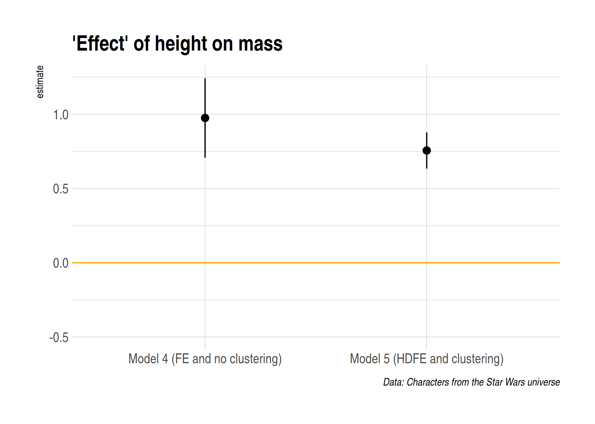
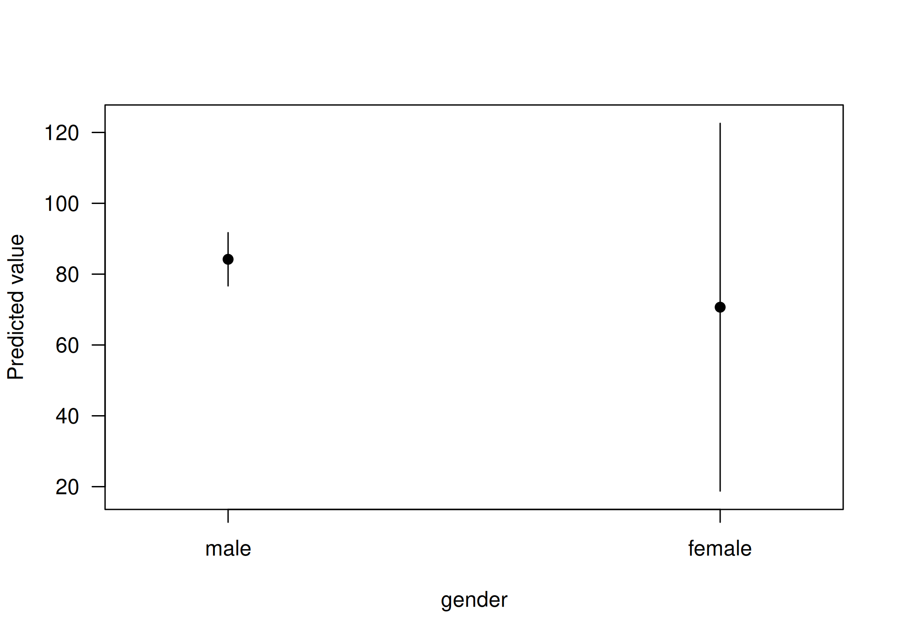

Today's lecture is about the bread-and-butter tool of applied econometrics and data science: regression analysis. My goal is to give you a whirlwind tour of the key functions and packages. I'm going to assume that you already know all of the necessary theoretical background on causal inference, asymptotics, etc. This lecture will *not* cover any of theoretical concepts or seek to justify a particular statistical model. Indeed, most of the models that we're going to run today are pretty silly. We also won't be able to cover some important topics. For example, I'll only provide the briefest example of a Bayesian regression model and I won't touch times series analysis at all. (Although, I will provide links for further reading at the bottom of this document.) These disclaimers aside, let's proceeed...

## Software requirements

### R packages 

It's important to note that "base" R already provides all of the tools we need for basic regression analysis. However, we'll be using several external packages today, because they will make our lives easier and offer increased power for some more sophisticated analyses.

- **New:** `broom`, `estimatr`, `sandwich`, `lmtest`, `AER`, `lfe`, `plm`, `huxtable`, `margins`
- **Already used:** `tidyverse`, `hrbrthemes`, `listviewer`

The `broom` package was bundled with the rest of tidyverse and `sandwich` should get installed as a dependency of several of the above packages. Still, a convenient way to install (if necessary) and load everything is by running the below code chunk. I'll also go ahead and set my preferred ggplot2 theme for the rest of this document.


```r
if (!require("pacman")) install.packages("pacman")
pacman::p_load(tidyverse, broom, hrbrthemes, plm, estimatr, sandwich, lmtest, AER, lfe, huxtable, margins)
theme_set(hrbrthemes::theme_ipsum())
```


While we've already loaded all of the required packages for today, I'll try to be as explicit about where a particular function is coming from, whenever I use it below. 

Something else that I want to mention up front is that we'll mostly be working with the `starwars` data frame that we've already seen from previous lectures. Here's a quick reminder of what it looks like to refresh your memory.


```r
starwars
```

```
## # A tibble: 87 x 13
##    name  height  mass hair_color skin_color eye_color birth_year gender
##    <chr>  <int> <dbl> <chr>      <chr>      <chr>          <dbl> <chr> 
##  1 Luke…    172    77 blond      fair       blue            19   male  
##  2 C-3PO    167    75 <NA>       gold       yellow         112   <NA>  
##  3 R2-D2     96    32 <NA>       white, bl… red             33   <NA>  
##  4 Dart…    202   136 none       white      yellow          41.9 male  
##  5 Leia…    150    49 brown      light      brown           19   female
##  6 Owen…    178   120 brown, gr… light      blue            52   male  
##  7 Beru…    165    75 brown      light      blue            47   female
##  8 R5-D4     97    32 <NA>       white, red red             NA   <NA>  
##  9 Bigg…    183    84 black      light      brown           24   male  
## 10 Obi-…    182    77 auburn, w… fair       blue-gray       57   male  
## # … with 77 more rows, and 5 more variables: homeworld <chr>,
## #   species <chr>, films <list>, vehicles <list>, starships <list>
```


## Regression basics

### The `lm()` function

R's workhorse command for running regression models is the built-in `lm()` function. The "**lm**" stands for "**l**inear **m**odels" and the syntax is very intuitive.^[Indeed, all other regression packages in R that I'm aware of --- including those that allow for much more advanced and flexible models --- closely follow the `lm()` syntax.] 

```r
lm(y ~ x1 + x2 + x3 + ..., data = df)
```

You'll note that the `lm()` call includes a reference to the data source (in this case, a hyopthetical data frame called `df`). We covered this in our earlier lecture on R language basics and object-orientated programming, but the reason is that many objects (e.g. data frames) can exist in your R environment at the same time. So we need to be specific about where our regression variables are coming from --- even if `df` is the only data frame in our global environment at the time. Another option would be to use indexing, but I find it a bit verbose:

```r
lm(df$y ~ df$x1 + df$x2 + df$x3 + ...)
```

Let's run a simple bivariate regression of starwars characters' mass on height.


```r
ols1 <- lm(mass ~ height, data = starwars)
# ols1 <- lm(starwars$mass ~ starwars$height) ## Also works
ols1
```

```
## 
## Call:
## lm(formula = mass ~ height, data = starwars)
## 
## Coefficients:
## (Intercept)       height  
##    -13.8103       0.6386
```

The resulting object is pretty terse, but that's only because it buries most of its valuable information --- of which there is a lot --- within its internal list structure. You can use the `str()` function to view this structure. Or, if you want to be fancy, the interactive `listviewer::jsonedit()` function that we saw in the previous lecture is nice option.


```r
# str(ols1) ## Static option
listviewer::jsonedit(ols1, mode="view") ## Interactive option
```

<!--html_preserve--><div id="htmlwidget-a195fab94b0cea6dad60" style="width:100%;height:10%;" class="jsonedit html-widget"></div>
<script type="application/json" data-for="htmlwidget-a195fab94b0cea6dad60">{"x":{"data":{"coefficients":{"(Intercept)":-13.8103136287302,"height":0.638571004587035},"residuals":{"1":-19.0238991602397,"2":-17.8310441373045,"3":-15.4925028116251,"4":20.8189707021492,"5":-32.9753370593249,"6":20.1446748122381,"7":-16.5539021281305,"8":-16.1310738162121,"9":-19.0481802106971,"10":-25.4096092061101,"11":-22.2410352336323,"13":-19.7838754171137,"14":-21.132467196936,"15":-22.6624701648267,"16":1260.060387826,"17":-17.7467571510656,"18":8.86753280306401,"19":-11.335372674014,"20":-19.7467571510656,"21":-24.8481802106971,"22":26.0961127113233,"23":5.48182275719367,"24":-20.2167541831749,"25":-18.9396121740008,"26":-18.132467196936,"29":-22.3839347749288,"30":-20.3610471051953,"31":-20.4338902565674,"32":-18.1567482473934,"34":-45.3496032703285,"35":-47.2295913987655,"39":-17.7096388850176,"42":-17.9396121740008,"44":-44.8553251877619,"45":-1.21536080245099,"47":-25.2767601189564,"48":-22.2410352336323,"49":-30.6267452795026,"50":-24.3496032703285,"52":-53.6867512152841,"55":-26.2410352336323,"57":-19.3253222198712,"60":-23.0481802106971,"61":-38.5467571510656,"62":-42.1924731327175,"64":-29.4338902565674,"66":-24.0481802106971,"67":-38.4696151418916,"68":-10.6267452795026,"69":-44.4224464217007,"72":-21.6367957336455,"74":-61.4338902565674,"76":-42.8553251877619,"77":34.8789766379308,"78":0.384698555364137,"79":-27.2410352336323,"80":-51.8553251877619,"81":-37.7353133161989,"87":-46.5539021281305},"effects":{"(Intercept)":-747.466613505302,"height":172.783889465672,"3":-8.91507473191358,"4":21.4194000157428,"5":-29.4427951434848,"6":22.0983868653301,"7":-13.8671619244768,"8":-9.61003251731305,"9":-17.3764020616673,"10":-23.6814442762678,"11":-20.8511909886646,"12":-20.6495024046433,"13":-19.2915287054689,"14":-20.4268242076726,"15":1262.18326022153,"16":-15.3419508514742,"17":10.7084712945311,"18":-3.06634116992954,"19":-17.3419508514742,"20":-23.1764020616673,"21":26.8093155865418,"22":6.75889344053646,"23":-18.2066553492705,"24":-16.8167397784715,"25":-16.2915287054689,"26":-15.3554124487178,"27":-17.3923729974795,"28":-19.3259799156619,"29":-16.936064344863,"30":-44.4108532718603,"31":-47.8696712630454,"32":-12.0343992983051,"33":-15.8167397784715,"34":-42.9016131346699,"35":5.47484083888535,"36":-22.4772463536779,"37":-20.8511909886646,"38":-29.8007688426593,"39":-23.4108532718603,"40":-52.0713598470667,"41":-24.8511909886646,"42":-17.7663176324662,"43":-21.3764020616673,"44":-36.1419508514742,"45":-39.5621197098763,"46":-28.3259799156619,"47":-22.3764020616673,"48":-35.9520352806753,"49":-9.80076884265928,"50":-45.3444601900428,"51":-14.1007923801226,"52":-60.3259799156619,"53":-40.9016131346699,"54":34.6899910201503,"55":-0.819249117040115,"56":-25.8511909886646,"57":-49.9016131346699,"58":-37.360431125855,"59":-43.8671619244768},"rank":2,"fitted.values":{"1":96.0238991602397,"2":92.8310441373045,"3":47.4925028116251,"4":115.181029297851,"5":81.9753370593249,"6":99.8553251877619,"7":91.5539021281305,"8":48.1310738162121,"9":103.048180210697,"10":102.40960920611,"11":106.241035233632,"13":131.783875417114,"14":101.132467196936,"15":96.6624701648267,"16":97.939612174001,"17":94.7467571510656,"18":101.132467196936,"19":28.335372674014,"20":94.7467571510656,"21":103.048180210697,"22":113.903887288677,"23":107.518177242806,"24":99.2167541831749,"25":97.9396121740008,"26":101.132467196936,"29":42.3839347749288,"30":88.3610471051953,"31":109.433890256567,"32":108.156748247393,"34":111.349603270329,"35":129.229591398766,"39":57.7096388850176,"42":97.9396121740008,"44":99.8553251877619,"45":46.215360802451,"47":90.2767601189564,"48":106.241035233632,"49":112.626745279503,"50":111.349603270329,"52":103.686751215284,"55":106.241035233632,"57":104.325322219871,"60":103.048180210697,"61":94.7467571510656,"62":92.1924731327175,"64":109.433890256567,"66":103.048180210697,"67":93.4696151418916,"68":112.626745279503,"69":132.422446421701,"72":36.6367957336455,"74":109.433890256567,"76":99.8553251877619,"77":124.121023362069,"78":135.615301444636,"79":106.241035233632,"80":99.8553251877619,"81":117.735313316199,"87":91.5539021281305},"assign":[0,1],"qr":{"qr":[[-7.68114574786861,-1336.64954904012],[0.130188910980824,270.578977473948],[0.130188910980824,0.287474707506683],[0.130188910980824,-0.104277826225195],[0.130188910980824,0.0879026620206323],[0.130188910980824,-0.0155791393425052],[0.130188910980824,0.0324659827189515],[0.130188910980824,0.283778928886571],[0.130188910980824,-0.0340580324430655],[0.130188910980824,-0.0303622538229534],[0.130188910980824,-0.0525369255436258],[0.130188910980824,-0.200368070348108],[0.130188910980824,-0.0229706965827293],[0.130188910980824,0.00289975375805507],[0.130188910980824,-0.00449180348216904],[0.130188910980824,0.0139870896183912],[0.130188910980824,-0.0229706965827293],[0.130188910980824,0.398348066110045],[0.130188910980824,0.0139870896183912],[0.130188910980824,-0.0340580324430655],[0.130188910980824,-0.0968862689849704],[0.130188910980824,-0.0599284827838499],[0.130188910980824,-0.0118833607223932],[0.130188910980824,-0.00449180348216904],[0.130188910980824,-0.0229706965827293],[0.130188910980824,0.31704093646758],[0.130188910980824,0.0509448758195118],[0.130188910980824,-0.071015818644186],[0.130188910980824,-0.0636242614039619],[0.130188910980824,-0.0821031545045222],[0.130188910980824,-0.18558495586766],[0.130188910980824,0.22834224958489],[0.130188910980824,-0.00449180348216904],[0.130188910980824,-0.0155791393425052],[0.130188910980824,0.294866264746907],[0.130188910980824,0.0398575399591756],[0.130188910980824,-0.0525369255436258],[0.130188910980824,-0.0894947117447463],[0.130188910980824,-0.0821031545045222],[0.130188910980824,-0.0377538110631775],[0.130188910980824,-0.0525369255436258],[0.130188910980824,-0.0414495896832896],[0.130188910980824,-0.0340580324430655],[0.130188910980824,0.0139870896183912],[0.130188910980824,0.0287702040988395],[0.130188910980824,-0.071015818644186],[0.130188910980824,-0.0340580324430655],[0.130188910980824,0.0213786468586153],[0.130188910980824,-0.0894947117447463],[0.130188910980824,-0.20406384896822],[0.130188910980824,0.350302944048588],[0.130188910980824,-0.071015818644186],[0.130188910980824,-0.0155791393425052],[0.130188910980824,-0.156018726906763],[0.130188910980824,-0.22254274206878],[0.130188910980824,-0.0525369255436258],[0.130188910980824,-0.0155791393425052],[0.130188910980824,-0.119060940705643],[0.130188910980824,0.0324659827189515]],"qraux":[1.13018891098082,1.02507442547873],"pivot":[1,2],"tol":1e-07,"rank":2},"df.residual":57,"na.action":{},"xlevels":{},"call":{},"terms":{},"model":{"mass":[77,75,32,136,49,120,75,32,84,77,84,112,80,74,1358,77,110,17,75,78.2,140,113,79,79,83,20,68,89,90,66,82,40,80,55,45,65,84,82,87,50,80,85,80,56.2,50,80,79,55,102,88,15,48,57,159,136,79,48,80,45],"height":[172,167,96,202,150,178,165,97,183,182,188,228,180,173,175,170,180,66,170,183,200,190,177,175,180,88,160,193,191,196,224,112,175,178,94,163,188,198,196,184,188,185,183,170,166,193,183,168,198,229,79,193,178,216,234,188,178,206,165]}},"options":{"mode":"view","modes":["code","form","text","tree","view"]}},"evals":[],"jsHooks":[]}</script><!--/html_preserve-->

As we can see, this `ols1` object has a bunch of important slots... containing everything from the regression coefficients, to vectors of the residuals and fitted (i.e. predicted) values, to the rank of the design matrix, to the input data, etc. etc. To summarise the key pieces of information, we can use the --- *wait for it* --- generic `summary()` function. This will look pretty similar to the default regression output from Stata that many of you will be used to.


```r
summary(ols1)
```

```
## 
## Call:
## lm(formula = mass ~ height, data = starwars)
## 
## Residuals:
##     Min      1Q  Median      3Q     Max 
##  -61.43  -30.03  -21.13  -17.73 1260.06 
## 
## Coefficients:
##             Estimate Std. Error t value Pr(>|t|)
## (Intercept) -13.8103   111.1545  -0.124    0.902
## height        0.6386     0.6261   1.020    0.312
## 
## Residual standard error: 169.4 on 57 degrees of freedom
##   (28 observations deleted due to missingness)
## Multiple R-squared:  0.01792,	Adjusted R-squared:  0.0006956 
## F-statistic:  1.04 on 1 and 57 DF,  p-value: 0.312
```

We can then dig down further by extracting a summary of the regression coefficients:


```r
summary(ols1)$coefficients
```

```
##               Estimate  Std. Error    t value  Pr(>|t|)
## (Intercept) -13.810314 111.1545260 -0.1242443 0.9015590
## height        0.638571   0.6260583  1.0199865 0.3120447
```

### Get "tidy" regression coefficients with the `broom` package

While it's easy to extract regression coefficients via the `summary()` function, in practice I always use the [broom package](https://broom.tidyverse.org/) to do so. This package has a bunch of neat features to convert regression (and other statistical) objects into "tidy" data frames. This is especially useful because regression output is so often used as an input to something else, e.g. a plot of coefficients or marginal effects. Here, I'll use `broom::tidy(..., conf.int=T)` to coerce the `ols1` regression object into a tidy data frame of coefficient values and key statistics.


```r
library(broom)

tidy(ols1, conf.int = T)
```

```
## # A tibble: 2 x 7
##   term        estimate std.error statistic p.value conf.low conf.high
##   <chr>          <dbl>     <dbl>     <dbl>   <dbl>    <dbl>     <dbl>
## 1 (Intercept)  -13.8     111.       -0.124   0.902 -236.       209.  
## 2 height         0.639     0.626     1.02    0.312   -0.615      1.89
```

Again, I could now pipe this tidied coeffients data frame to a ggplot2 call, using saying `geom_pointrange()` to plot the error bars. Feel free to practice doing this yourself now, but we'll get to some explicit examples further below.

A related and also useful function is `broom::glance()`, which summarises the model "meta" data (R<sup>2</sup>, AIC, etc.) in a data frame.


```r
glance(ols1)
```

```
## # A tibble: 1 x 11
##   r.squared adj.r.squared sigma statistic p.value    df logLik   AIC   BIC
##       <dbl>         <dbl> <dbl>     <dbl>   <dbl> <int>  <dbl> <dbl> <dbl>
## 1    0.0179      0.000696  169.      1.04   0.312     2  -386.  777.  783.
## # … with 2 more variables: deviance <dbl>, df.residual <int>
```

(BTW, If you're wondering how to export regression results to other formats (e.g. LaTeX tables), don't worry: We'll get to that at the very end of the lecture.)

### Regressing on subsetted or different data

Our simple model isn't particularly good; our R<sup>2</sup> is only 0.018. Different species and homeworlds aside, we may have an extreme outlier in our midst...


```r
starwars %>%
  ggplot(aes(x=height, y=mass)) +
  geom_point(alpha=0.5) +
  geom_point(
    data = starwars %>% filter(mass==max(mass, na.rm=T)), 
    col="red"
    ) +
  geom_text(
    aes(label=name),
    data = starwars %>% filter(mass==max(mass, na.rm=T)), 
    col="red", vjust = 0, nudge_y = 25
    ) +
  labs(
    title = "Spot the outlier...",
    caption = "Aside: Always plot your data!"
    )
```

```
## Warning: Removed 28 rows containing missing values (geom_point).
```

<!-- -->

Maybe we should exclude Jabba from our regression? You can do this in two ways: 1) Create a new data frame and then regress, or 2) Subset the original data frame directly in the `lm()` call.

#### 1) Create a new data frame

Recall that we can keep multiple objects in memory in R. So we can easily create a new data frame that excludes Jabba using `dplyr::filter()`.


```r
starwars2 <-
  starwars %>% 
  filter(name != "Jabba Desilijic Tiure")
  # filter(!(grepl("Jabba", name))) ## Regular expressions also work

ols2 <- lm(mass ~ height, data = starwars2)
summary(ols2)
```

```
## 
## Call:
## lm(formula = mass ~ height, data = starwars2)
## 
## Residuals:
##     Min      1Q  Median      3Q     Max 
## -39.382  -8.212   0.211   3.846  57.327 
## 
## Coefficients:
##              Estimate Std. Error t value Pr(>|t|)    
## (Intercept) -32.54076   12.56053  -2.591   0.0122 *  
## height        0.62136    0.07073   8.785 4.02e-12 ***
## ---
## Signif. codes:  0 '***' 0.001 '**' 0.01 '*' 0.05 '.' 0.1 ' ' 1
## 
## Residual standard error: 19.14 on 56 degrees of freedom
##   (28 observations deleted due to missingness)
## Multiple R-squared:  0.5795,	Adjusted R-squared:  0.572 
## F-statistic: 77.18 on 1 and 56 DF,  p-value: 4.018e-12
```

#### 2) Subset directly in the `lm()` call

Running a regression directly on a subsetted data frame is equally easy.


```r
ols2a <- lm(mass ~ height, data = starwars %>% filter(!(grepl("Jabba", name))))
summary(ols2a)
```

```
## 
## Call:
## lm(formula = mass ~ height, data = starwars %>% filter(!(grepl("Jabba", 
##     name))))
## 
## Residuals:
##     Min      1Q  Median      3Q     Max 
## -39.382  -8.212   0.211   3.846  57.327 
## 
## Coefficients:
##              Estimate Std. Error t value Pr(>|t|)    
## (Intercept) -32.54076   12.56053  -2.591   0.0122 *  
## height        0.62136    0.07073   8.785 4.02e-12 ***
## ---
## Signif. codes:  0 '***' 0.001 '**' 0.01 '*' 0.05 '.' 0.1 ' ' 1
## 
## Residual standard error: 19.14 on 56 degrees of freedom
##   (28 observations deleted due to missingness)
## Multiple R-squared:  0.5795,	Adjusted R-squared:  0.572 
## F-statistic: 77.18 on 1 and 56 DF,  p-value: 4.018e-12
```

The overall model fit is much improved by the exclusion of this outlier, with R<sup>2</sup> increasing to 0.58. Still, we should be cautious about throwing out data. Another approach is to handle or account for outliers with statistical methods. Which provides a nice segue to robust and clustered standard errors.

## Robust and clustered standard errors

Dealing with statistical irregularities (heteroskedasticity, clustering, etc.) is a fact of life for empirical researchers. However, it says something about the economics profession that a random stranger could walk uninvited into a live seminar and ask, "How did you cluster your standard errors?", and it would likely draw approving nods from audience members. 

The good news is that there are *lots* of ways to get robust and clustered standard errors in R. For many years, these have been based on the excellent [sandwich package](https://cran.r-project.org/web/packages/sandwich/index.html). However, my prefered way these days is to use the [`estimatr` package](https://declaredesign.org/r/estimatr/articles/getting-started.html), which is both fast and provides convenient aliases for the standard regression functions. For example, you can obtain robust standard errors using `estimatr::lm_robust()`. Let's illustrate by running a robust version of the `ols1` regression that ran earlier.


```r
# library(estimatr) ## Already loaded
ols1_robust <- lm_robust(mass ~ height, data = starwars)
tidy(ols1_robust, conf.int = T)
```

```
##          term   estimate   std.error  statistic      p.value    conf.low
## 1 (Intercept) -13.810314 23.45557632 -0.5887859 5.583311e-01 -60.7792950
## 2      height   0.638571  0.08791977  7.2631109 1.159161e-09   0.4625147
##    conf.high df outcome
## 1 33.1586678 57    mass
## 2  0.8146273 57    mass
```

The package defaults to using Eicker-Huber-White robust standard errors, commonly referred to as "HC2" standard errors. You can easily specify alternate methods using the `se_type = ` argument.^[See the [package documentation](https://declaredesign.org/r/estimatr/articles/mathematical-notes.html#lm_robust-notes) for a full list of options.] For example, you can specify Stata robust standard errors if you want to replicate code or results from that language. (See [here](https://declaredesign.org/r/estimatr/articles/stata-wls-hat.html) for more details on why this isn't the default and why Stata's robust standard errors differ from those in R and Python.)


```r
ols1_robust_stata <- lm_robust(mass ~ height, data = starwars, se_type = "stata")
tidy(ols1_robust_stata, conf.int = T)
```

```
##          term   estimate   std.error  statistic      p.value    conf.low
## 1 (Intercept) -13.810314 23.36219608 -0.5911394 5.567641e-01 -60.5923043
## 2      height   0.638571  0.08616105  7.4113649 6.561046e-10   0.4660365
##    conf.high df outcome
## 1 32.9716771 57    mass
## 2  0.8111055 57    mass
```

The `estimatr` package also supports (robust) instrumental variable regression and clustered standard errors. I'll return to these issues in the relevant sections below, but here's a quick example of the latter just to illustrate:


```r
ols1_robust_clustered <- lm_robust(mass ~ height, data = starwars, clusters = homeworld)
```

```
## Warning in eval(quote({: Some observations have missingness in the cluster
## variable but not in the outcome or covariates. These observations have been
## dropped.
```

```r
tidy(ols1_robust_clustered, conf.int = T)
```

```
##          term   estimate   std.error  statistic      p.value    conf.low
## 1 (Intercept) -9.3014938 28.84436408 -0.3224718 0.7559158751 -76.6200628
## 2      height  0.6134058  0.09911832  6.1886211 0.0002378887   0.3857824
##    conf.high       df outcome
## 1 58.0170751 7.486034    mass
## 2  0.8410291 8.195141    mass
```

### Aside on HAC (Newey-West) standard errors

On thing I want to flag is that the `estimatr` package does not yet offer support for HAC (i.e. heteroskedasticity and autocorrelation consistent) standard errors *a la* [Newey-West](https://en.wikipedia.org/wiki/Newey%E2%80%93West_estimator). I've submitted a [feature request](https://github.com/DeclareDesign/estimatr/issues/272) on GitHub --- vote up if you would like to see it added sooner! --- but you can still obtain these pretty easily using the aforementioned-mentioned `sandwich` package. For example, we can use `sandwich::NeweyWest()` on our existing `ols1` object to obtain HAC SEs for it.


```r
# library(sandwich) ## Already loaded
NeweyWest(ols1) ## Print the HAC VCOV
```

```
##             (Intercept)       height
## (Intercept) 452.3879311 -0.505227090
## height       -0.5052271  0.005994863
```

```r
sqrt(diag(NeweyWest(ols1))) ## Print the HAC SEs
```

```
## (Intercept)      height 
##  21.2694130   0.0774265
```

If you wanted to convert it to a tidy data frame of coefficient values, then, I would recommend first piping it to `lmtest::coeftest(..., vcov=NeweyWest)`, which is a convenient way to do hypothesis testing using alternate variance-covariance matrices. Note that in the below, I'm going to manually create my own upper and lower 95% confidence intervals, since `broom::tidy(conf.int=T)` doesn't work with coeftest objects.


```r
# library(lmtest) ## Already loaded
ols1 %>% 
  lmtest::coeftest(vcov=NeweyWest) %>%
  tidy() %>% ## "conf.int" doesn't work with coeftest object, so calculate manually...
  mutate(
    conf.low = estimate - qt(0.975, df=ols1$df.residual)*std.error,
    conf.high = estimate + qt(0.975, df=ols1$df.residual)*std.error
    )
```

```
## # A tibble: 2 x 7
##   term        estimate std.error statistic  p.value conf.low conf.high
##   <chr>          <dbl>     <dbl>     <dbl>    <dbl>    <dbl>     <dbl>
## 1 (Intercept)  -13.8     21.3       -0.649 5.19e- 1  -56.4      28.8  
## 2 height         0.639    0.0774     8.25  2.67e-11    0.484     0.794
```


## Dummy variables and interaction terms

### Dummy variables as *factors*

Dummy variables are a core component of many regression models. However, these can be a pain to create in many statistical languages, since you first have to tabulate a whole new matrix of binary variables and then append it to the original data frame. In contrast, R has a much more convenient framework for creating and evaluating dummy variables in a regression. You simply specify the variable of interest as a [factor](https://r4ds.had.co.nz/factors.html).^[Factors are variables that have distinct qualitative levels, e.g. "male", "female", "hermaphrodite", etc.]

For this next section, it will be convenient to demonstrate using a subsample of the data that comprises only humans. I'll first create this `humans` data frame and then demonstrate the dummy-variables-as-factors approach.
 

```r
humans <- 
  starwars %>% 
  filter(species=="Human") %>%
  mutate(gender_factored = as.factor(gender)) %>% ## create factored version of "gender"
  select(contains("gender"), everything())
humans
```

```
## # A tibble: 35 x 14
##    gender gender_factored name  height  mass hair_color skin_color
##    <chr>  <fct>           <chr>  <int> <dbl> <chr>      <chr>     
##  1 male   male            Luke…    172    77 blond      fair      
##  2 male   male            Dart…    202   136 none       white     
##  3 female female          Leia…    150    49 brown      light     
##  4 male   male            Owen…    178   120 brown, gr… light     
##  5 female female          Beru…    165    75 brown      light     
##  6 male   male            Bigg…    183    84 black      light     
##  7 male   male            Obi-…    182    77 auburn, w… fair      
##  8 male   male            Anak…    188    84 blond      fair      
##  9 male   male            Wilh…    180    NA auburn, g… fair      
## 10 male   male            Han …    180    80 brown      fair      
## # … with 25 more rows, and 7 more variables: eye_color <chr>,
## #   birth_year <dbl>, homeworld <chr>, species <chr>, films <list>,
## #   vehicles <list>, starships <list>
```

```r
ols_dv <- lm(mass ~ height + gender_factored, data = humans)
summary(ols_dv)
```

```
## 
## Call:
## lm(formula = mass ~ height + gender_factored, data = humans)
## 
## Residuals:
##     Min      1Q  Median      3Q     Max 
## -16.068  -8.130  -3.660   0.702  37.112 
## 
## Coefficients:
##                     Estimate Std. Error t value Pr(>|t|)  
## (Intercept)         -84.2520    65.7856  -1.281   0.2157  
## height                0.8787     0.4075   2.156   0.0441 *
## gender_factoredmale  10.7391    13.1968   0.814   0.4259  
## ---
## Signif. codes:  0 '***' 0.001 '**' 0.01 '*' 0.05 '.' 0.1 ' ' 1
## 
## Residual standard error: 15.19 on 19 degrees of freedom
##   (13 observations deleted due to missingness)
## Multiple R-squared:  0.444,	Adjusted R-squared:  0.3855 
## F-statistic: 7.587 on 2 and 19 DF,  p-value: 0.003784
```


In fact, I'm even making things more complicated than they need to be. R is "friendly" and tries to help whenever it thinks you have misspecified a function or variable. While this is something to be [aware of](https://rawgit.com/grantmcdermott/R-intro/master/rIntro.html#r_tries_to_guess_what_you_meant), it normally just works<sup>TM</sup>. A case in point is that we don't actually *need* to specify a qualitative or character variable as a factor in a regression. R will automatically do this for you regardless, since that's the only sensible way to include string variables in a regression.


```r
## Use the non-factored "gender" variable instead
ols_dv2 <- lm(mass ~ height + gender, data = humans)
summary(ols_dv2)
```

```
## 
## Call:
## lm(formula = mass ~ height + gender, data = humans)
## 
## Residuals:
##     Min      1Q  Median      3Q     Max 
## -16.068  -8.130  -3.660   0.702  37.112 
## 
## Coefficients:
##             Estimate Std. Error t value Pr(>|t|)  
## (Intercept) -84.2520    65.7856  -1.281   0.2157  
## height        0.8787     0.4075   2.156   0.0441 *
## gendermale   10.7391    13.1968   0.814   0.4259  
## ---
## Signif. codes:  0 '***' 0.001 '**' 0.01 '*' 0.05 '.' 0.1 ' ' 1
## 
## Residual standard error: 15.19 on 19 degrees of freedom
##   (13 observations deleted due to missingness)
## Multiple R-squared:  0.444,	Adjusted R-squared:  0.3855 
## F-statistic: 7.587 on 2 and 19 DF,  p-value: 0.003784
```


### Interaction effects

Like dummy variables, R provides a convenient syntax for specifying interaction terms directly in the regression model without having to create them manually beforehand.^[Although there are very good reasons that you might want to modify your parent variables before doing so (e.g. centering them). As it happens, I'm [on record](https://twitter.com/grant_mcdermott/status/903691491414917122) as stating that interaction effects are most widely misunderstood and misapplied concept in econometrics. However, that's a topic for another day. (Read the paper in the link!)] You can just use `x1:x2` (to include only the interaction term) or `x1*x2` (to include the parent terms and interaction terms). Generally speaking, you are best advised to include the parent terms alongside an interaction term. This makes the `*` option a good default.


```r
ols_ie <- lm(mass ~ gender*height, data = humans)
summary(ols_ie)
```

```
## 
## Call:
## lm(formula = mass ~ gender * height, data = humans)
## 
## Residuals:
##     Min      1Q  Median      3Q     Max 
## -16.250  -8.158  -3.684  -0.107  37.193 
## 
## Coefficients:
##                   Estimate Std. Error t value Pr(>|t|)
## (Intercept)       -61.0000   204.0565  -0.299    0.768
## gendermale        -15.7224   219.5440  -0.072    0.944
## height              0.7333     1.2741   0.576    0.572
## gendermale:height   0.1629     1.3489   0.121    0.905
## 
## Residual standard error: 15.6 on 18 degrees of freedom
##   (13 observations deleted due to missingness)
## Multiple R-squared:  0.4445,	Adjusted R-squared:  0.3519 
## F-statistic: 4.801 on 3 and 18 DF,  p-value: 0.01254
```


## Panel models

### Fixed effects with the `lfe` package

The simplest (and least efficient) way to include fixed effects in a regression model is, of course, to use dummy variables. However, it isn't very efficient or scaleable. What's the point learning all that stuff about the Frisch-Waugh-Lovell theorem, within-group transformations, etcetera, etcetera if we can't use them in our software routines? Again, there are several options to choose from here. For example, the venerable [plm package](https://cran.r-project.org/web//packages/plm/vignettes/plmPackage.html), which also handles random effects and pooling models. However, I am going to strongly advocate for the [lfe package](https://cran.r-project.org/web/packages/lfe/index.html).

`lfe` (i.e. "**l**inear **f**ixed **e**ffects") is one of my packages in the entire R catalogue. It has a boatload of functionality built in to it (instrumental variables support, multilevel clustering, etc.) It is also *fast* because it automatically uses all the available processing power on your machine. We'll return to the idea of multicore implementation when we get to the lecture on parallel processing. For the moment, simply enjoy the fact that `lfe` is optimised to solve big regression problems as quickly as possible.

Let's take a look, starting off with a simple example and then moving on to something more demanding.

#### Simple FE model

The package's main function is `lfe::felm()`, which is used for estimating fixed effects linear models. The syntax is such that you first specify the regression model as per normal, and then list the fixed effect(s) after a `|`. An example may help to illustrate. Let's say that we again want to run our simple regression of mass on height, but this time control for species-level fixed effects.


```r
library(lfe)

ols_fe <- felm(mass ~ height | species, data = starwars) ## Fixed effect(s) go after the "|"
coefs_fe <- tidy(ols_fe, conf.int = T)
summary(ols_fe)
```

```
## 
## Call:
##    felm(formula = mass ~ height | species, data = starwars) 
## 
## Residuals:
##     Min      1Q  Median      3Q     Max 
## -23.602  -2.862   0.000   0.000  38.725 
## 
## Coefficients:
##        Estimate Std. Error t value Pr(>|t|)    
## height   0.9749     0.1365   7.144 1.38e-07 ***
## ---
## Signif. codes:  0 '***' 0.001 '**' 0.01 '*' 0.05 '.' 0.1 ' ' 1
## 
## Residual standard error: 14.47 on 26 degrees of freedom
##   (29 observations deleted due to missingness)
## Multiple R-squared(full model): 0.9967   Adjusted R-squared: 0.9928 
## Multiple R-squared(proj model): 0.6625   Adjusted R-squared: 0.2601 
## F-statistic(full model):255.2 on 31 and 26 DF, p-value: < 2.2e-16 
## F-statistic(proj model): 51.04 on 1 and 26 DF, p-value: 1.38e-07
```

Note that the resulting `felm` object drops all of the species intercepts, since it has abstracted them away as fixed effects. 

#### High dimensional FEs and (multiway) clustering

One reason that I prefer the `lfe` package to other options --- e.g. the panel-focused `plm` package (see further below) --- is because it supports high dimensional fixed effects *and* (multiway) clustering.^[It is very similar to the excellent [reghdfe](http://scorreia.com/software/reghdfe/) package in Stata.] In the below example, I'm going to add "homeworld" as an additional fixed effect to the model and also cluster according to this variable. I'm not claiming that this is a particularly good or sensible model, but just go with it. Note that, since we specify "homeworld" in the fixed effects slot below, `felm()` automatically converts it to a factor even though we didn't explicitly tell it to.


```r
ols_hdfe <- 
  felm(
    mass ~ height |
      species + homeworld | ## Two fixed effects go here after the first "|"
      0 | ## This is where your IV equation goes, but we put 0 since we aren't instrumenting.
      homeworld, ## The final slot is where we specify our cluster variables
    data = starwars)
coefs_hdfe <- tidy(ols_hdfe, conf.int = T)
coefs_hdfe
```

```
## # A tibble: 1 x 7
##   term   estimate std.error statistic      p.value conf.low conf.high
##   <chr>     <dbl>     <dbl>     <dbl>        <dbl>    <dbl>     <dbl>
## 1 height    0.756    0.0622      12.2 0.0000000178    0.634     0.878
```

Visually, we can easily compare changes in the coefficients across models thanks to the fact that we saved the output in data frames with `broom::tidy()` above.


```r
bind_rows(
  coefs_fe %>% mutate(reg = "Model 4 (FE and no clustering)"),
  coefs_hdfe %>% mutate(reg = "Model 5 (HDFE and clustering)")
  ) %>%
  ggplot(aes(x=reg, y=estimate, ymin=conf.low, ymax=conf.high)) +
  geom_pointrange() +
  labs(Title = "Marginal effect of height on mass") +
  geom_hline(yintercept = 0, col = "orange") +
  ylim(-0.5, NA) +
  labs(
    title = "'Effect' of height on mass",
    caption = "Data: Characters from the Star Wars universe"
    ) +
  theme(axis.title.x = element_blank())
```

<!-- -->

Normally we expect our standard errors to blow up with clustering, but here that effect appears to be outweighted by the increased precision brought on by additional fixed effects. (As suggested earlier, our level of clustering probably doesn't make much sense either.)

#### Instrumental variables

(See further below.)

### Random effects

Fixed effects models are more common than random effects models in economics (in my experience, anyway). I'd also advocate for [Bayesian hierachical models](http://www.stat.columbia.edu/~gelman/arm/) if we're going down the whole random effects path. However, it's still good to know that R has you covered for random effects models through the the [plm](https://cran.r-project.org/web/packages/plm/) and [nlme](https://cran.r-project.org/web/packages/nlme/index.html) packages.^[As I mentioned above, `plm` also handles fixed effects (and pooling) models. However, I prefer `lfe` for the reasons already discussed.] I won't go into detail , but click on those links (especially the first one) if you would like to see some examples.

## Instrumental variables

Again, lots of options here. See: `?AER::ivreg`, `?lfe::felm`, and `?estimatr::ivreg_robust`. They all follow a similar syntax, where the IV first-stage regression is specified after a `|` following the main regression. Here's an example taken from the [AER package](https://cran.r-project.org/web/packages/AER/vignettes/AER.pdf), just because we haven't used it in this lecture yet. I'll follow their lead in using one of the package's own datasets on cigarette consumption.


```r
## Get the data
data("CigarettesSW", package = "AER")
## Create a new data frame with some modified variables
cigs <-
  CigarettesSW %>%
  mutate(
    rprice = price/cpi,
    rincome = income/population/cpi,
    tdiff = (taxs - tax)/cpi
    )

## Run the model 
iv_reg <- 
  ivreg(
    log(packs) ~ log(rprice) + log(rincome) | log(rincome) + tdiff + I(tax/cpi),
    data = cigs %>% filter(year == "1995")
    )
summary(iv_reg, diagnostics = TRUE)
```

```
## 
## Call:
## ivreg(formula = log(packs) ~ log(rprice) + log(rincome) | log(rincome) + 
##     tdiff + I(tax/cpi), data = cigs %>% filter(year == "1995"))
## 
## Residuals:
##        Min         1Q     Median         3Q        Max 
## -0.6006931 -0.0862222 -0.0009999  0.1164699  0.3734227 
## 
## Coefficients:
##              Estimate Std. Error t value Pr(>|t|)    
## (Intercept)    9.8950     1.0586   9.348 4.12e-12 ***
## log(rprice)   -1.2774     0.2632  -4.853 1.50e-05 ***
## log(rincome)   0.2804     0.2386   1.175    0.246    
## 
## Diagnostic tests:
##                  df1 df2 statistic p-value    
## Weak instruments   2  44   244.734  <2e-16 ***
## Wu-Hausman         1  44     3.068  0.0868 .  
## Sargan             1  NA     0.333  0.5641    
## ---
## Signif. codes:  0 '***' 0.001 '**' 0.01 '*' 0.05 '.' 0.1 ' ' 1
## 
## Residual standard error: 0.1879 on 45 degrees of freedom
## Multiple R-Squared: 0.4294,	Adjusted R-squared: 0.4041 
## Wald test: 13.28 on 2 and 45 DF,  p-value: 2.931e-05
```


**Challenge:** Try run an IV regression using `lfe:felm()`, but this time on the whole `cigs` data frame (i.e. not subsetting to 1995). Use year fixed effects too.

## Other topics

### Marginal effects

Caculating marginal effect in a regression is utterly straightforward in cases where there are no non-linearities; just look at the coefficient values! However, that quickly goes out the window when have interaction effects, probit or logit models, etc. Luckily, the `margins` package (which is modeled on its namesake in Stata) goes a long way towards automating the process. You can read more in the [package vignette](https://cran.r-project.org/web/packages/margins/vignettes/Introduction.html), but here's a very simple example to illustrate:


```r
library(margins)

# ols_ie %>% margins() %>% summary() ## Piping also works
summary(margins(ols_ie))
```

```
##      factor     AME      SE      z      p    lower   upper
##  gendermale 13.5253 26.7585 0.5055 0.6132 -38.9203 65.9710
##      height  0.8740  0.4203 2.0797 0.0376   0.0503  1.6977
```
If we want to compare marginal effects at specific values --- e.g. how the ME of height on mass differs across genders --- then that's easily done too.


```r
summary(margins(ols_ie, at = list(gender = c("male", "female"))))
```

```
##        factor gender      AME      SE       z      p    lower   upper
##  genderfemale 1.0000 -13.5253 26.7585 -0.5055 0.6132 -65.9710 38.9203
##  genderfemale 2.0000 -13.5253 26.7585 -0.5055 0.6132 -65.9710 38.9203
##        height 1.0000   0.8962  0.4431  2.0228 0.0431   0.0278  1.7646
##        height 2.0000   0.7333  1.2741  0.5756 0.5649  -1.7639  3.2306
```

You can also plot it using `margins::cplot()`:


```r
cplot(ols_ie, x="gender", dx="height")
```

```
##    xvals    yvals     upper    lower
## 1   male 84.19201  91.70295 76.68107
## 2 female 70.66667 122.57168 18.76166
```

<!-- -->

In this case,it doesn't make much sense to read a lot into the larger standard errors on the female group; that's being driven by a very small sub-sample size.

One downside that I want to highlight briefly is that the `margins` package does [not yet work](https://github.com/leeper/margins/issues/73) with `lfe::felm` objects. There are [potential ways](https://stackoverflow.com/questions/30491545/predict-method-for-felm-from-lfe-package) around this, or you can just calculate the marginal effects manually, but it's admittedly a pain.

### Probit, logit and other generalized linear models

See `?stats::glm`.

### Synthetic control

See the [gsynth package](https://yiqingxu.org/software/gsynth/gsynth_examples.html).

### Bayesian regression

We could spend a whole course on Bayesian models. The very, very short version is that R offers outstanding support for Bayesian models and data analysis. You will find convenient interfaces to all of the major MCMC and Bayesian software engines: [Stan](https://mc-stan.org/users/interfaces/rstan), [JAGS](http://mcmc-jags.sourceforge.net/), TensorFlow (via [Greta](https://greta-stats.org/)), etc. Here follows a *super* simple example using the [rstanarm package](http://mc-stan.org/rstanarm/). Note that we did not install this package with the others above, as it can take fairly long and involve some minor troubleshooting.^[FWIW, on my Linux machine (running Arch/Antergos) I had to install `stan` (and thus `rstanarm`) by running R through the shell. For some reason, RStudio kept closing midway through the installation process.]


```r
# install.packages("rstanarm") ## Run this first if you want to try yourself
library(rstanarm)
bayes_reg <- 
  stan_glm(
    mass ~ gender*height,
    data = humans, 
    family = gaussian(), prior = cauchy(), prior_intercept = cauchy()
    )
```

```r
summary(bayes_reg)
```

```
## 
## Model Info:
## 
##  function:     stan_glm
##  family:       gaussian [identity]
##  formula:      mass ~ gender * height
##  algorithm:    sampling
##  priors:       see help('prior_summary')
##  sample:       4000 (posterior sample size)
##  observations: 22
##  predictors:   4
## 
## Estimates:
##                     mean   sd     2.5%   25%    50%    75%    97.5%
## (Intercept)        -72.3   87.9 -238.7 -130.0  -73.0  -15.3  102.1 
## gendermale           0.2   54.6 -118.2  -29.7   -0.4   29.8  117.1 
## height               0.8    0.6   -0.3    0.4    0.8    1.2    1.9 
## gendermale:height    0.1    0.3   -0.6   -0.1    0.1    0.3    0.8 
## sigma               15.9    2.8   11.6   14.0   15.5   17.4   22.6 
## mean_PPD            82.8    4.9   73.5   79.7   82.8   86.0   92.7 
## log-posterior     -102.3    1.6 -106.1 -103.1 -101.9 -101.1 -100.3 
## 
## Diagnostics:
##                   mcse Rhat n_eff
## (Intercept)       2.2  1.0  1609 
## gendermale        1.7  1.0  1075 
## height            0.0  1.0  1596 
## gendermale:height 0.0  1.0  1035 
## sigma             0.1  1.0  1942 
## mean_PPD          0.1  1.0  2695 
## log-posterior     0.0  1.0  1014 
## 
## For each parameter, mcse is Monte Carlo standard error, n_eff is a crude measure of effective sample size, and Rhat is the potential scale reduction factor on split chains (at convergence Rhat=1).
```

```r
tidy(bayes_reg)
```

```
## # A tibble: 4 x 3
##   term              estimate std.error
##   <chr>                <dbl>     <dbl>
## 1 (Intercept)       -73.0       85.0  
## 2 gendermale         -0.366     44.2  
## 3 height              0.801      0.535
## 4 gendermale:height   0.0729     0.286
```


### Visualizing regression output and models

We've already worked through several visualization examples today and you should all be familiar with ggplot2's `geom_smooth()` from our earlier lectures. For instance:


```r
humans %>%
  ggplot(aes(x=mass, y=height, col=gender)) + 
  geom_point(alpha=0.7) +
  geom_smooth(method="lm", se=F) + ## See ?geom_smooth for other methods
  scale_color_brewer(palette = "Set1")
```

<!-- -->

For further reference, I highly encourage you to look over Chapter 6 of Kieran Healy's [*Data Visualization: A Practical Guide*](https://socviz.co/modeling.html#plot-marginal-effects). You will not only learn how to produce beautiful and effective model visualizations, but also pick up a variety of technical tips. You may want to pay particular attention attention to the section on [generating and plotting predictions](https://socviz.co/modeling.html#generate-predictions-to-graph), since that will form part of your next assignment.

### Exporting regression results and descriptive tables (LaTeX, etc.)

There are a loads of different options here. I've historically favoured the [stargazer package](https://www.jakeruss.com/cheatsheets/stargazer/), but I also like the [huxtable package](https://hughjonesd.github.io/huxtable). Then there's the new [gt package](https://gt.rstudio.com/index.html) from the RStudio team, which is drawing lots of attention. And this is just a small sample of the available options; see [here](https://hughjonesd.github.io/huxtable/design-principles.html) for a handy comparison of different table "engines" in R.

Here follows a bare-bones example using huxtable, since it works well with R Markdown documents.


```r
library(huxtable)

huxreg(ols_dv, ols_ie, ols_hdfe)
```

<!--html_preserve--><table class="huxtable" style="border-collapse: collapse; margin-bottom: 2em; margin-top: 2em; width: 50%; margin-left: auto; margin-right: auto; ">
<col><col><col><col><tr>
<td style="vertical-align: top; text-align: center; white-space: nowrap; border-style: solid solid solid solid; border-width: 0.8pt 0pt 0pt 0pt; padding: 4pt 4pt 4pt 4pt;"></td>
<td style="vertical-align: top; text-align: center; white-space: nowrap; border-style: solid solid solid solid; border-width: 0.8pt 0pt 0.4pt 0pt; padding: 4pt 4pt 4pt 4pt;">(1)</td>
<td style="vertical-align: top; text-align: center; white-space: nowrap; border-style: solid solid solid solid; border-width: 0.8pt 0pt 0.4pt 0pt; padding: 4pt 4pt 4pt 4pt;">(2)</td>
<td style="vertical-align: top; text-align: center; white-space: nowrap; border-style: solid solid solid solid; border-width: 0.8pt 0pt 0.4pt 0pt; padding: 4pt 4pt 4pt 4pt;">(3)</td>
</tr>
<tr>
<td style="vertical-align: top; text-align: left; white-space: nowrap; padding: 4pt 4pt 4pt 4pt;">(Intercept)</td>
<td style="vertical-align: top; text-align: right; white-space: nowrap; padding: 4pt 4pt 4pt 4pt;">-84.252&nbsp;&nbsp;</td>
<td style="vertical-align: top; text-align: right; white-space: nowrap; padding: 4pt 4pt 4pt 4pt;">-61.000&nbsp;</td>
<td style="vertical-align: top; text-align: right; white-space: nowrap; padding: 4pt 4pt 4pt 4pt;">&nbsp;&nbsp;&nbsp;&nbsp;&nbsp;&nbsp;&nbsp;&nbsp;</td>
</tr>
<tr>
<td style="vertical-align: top; text-align: left; white-space: nowrap; padding: 4pt 4pt 4pt 4pt;"></td>
<td style="vertical-align: top; text-align: right; white-space: nowrap; padding: 4pt 4pt 4pt 4pt;">(65.786)&nbsp;</td>
<td style="vertical-align: top; text-align: right; white-space: nowrap; padding: 4pt 4pt 4pt 4pt;">(204.057)</td>
<td style="vertical-align: top; text-align: right; white-space: nowrap; padding: 4pt 4pt 4pt 4pt;">&nbsp;&nbsp;&nbsp;&nbsp;&nbsp;&nbsp;&nbsp;&nbsp;</td>
</tr>
<tr>
<td style="vertical-align: top; text-align: left; white-space: nowrap; padding: 4pt 4pt 4pt 4pt;">height</td>
<td style="vertical-align: top; text-align: right; white-space: nowrap; padding: 4pt 4pt 4pt 4pt;">0.879 *</td>
<td style="vertical-align: top; text-align: right; white-space: nowrap; padding: 4pt 4pt 4pt 4pt;">0.733&nbsp;</td>
<td style="vertical-align: top; text-align: right; white-space: nowrap; padding: 4pt 4pt 4pt 4pt;">0.756 ***</td>
</tr>
<tr>
<td style="vertical-align: top; text-align: left; white-space: nowrap; padding: 4pt 4pt 4pt 4pt;"></td>
<td style="vertical-align: top; text-align: right; white-space: nowrap; padding: 4pt 4pt 4pt 4pt;">(0.407)&nbsp;</td>
<td style="vertical-align: top; text-align: right; white-space: nowrap; padding: 4pt 4pt 4pt 4pt;">(1.274)</td>
<td style="vertical-align: top; text-align: right; white-space: nowrap; padding: 4pt 4pt 4pt 4pt;">(0.062)&nbsp;&nbsp;&nbsp;</td>
</tr>
<tr>
<td style="vertical-align: top; text-align: left; white-space: nowrap; padding: 4pt 4pt 4pt 4pt;">gender_factoredmale</td>
<td style="vertical-align: top; text-align: right; white-space: nowrap; padding: 4pt 4pt 4pt 4pt;">10.739&nbsp;&nbsp;</td>
<td style="vertical-align: top; text-align: right; white-space: nowrap; padding: 4pt 4pt 4pt 4pt;">&nbsp;&nbsp;&nbsp;&nbsp;&nbsp;</td>
<td style="vertical-align: top; text-align: right; white-space: nowrap; padding: 4pt 4pt 4pt 4pt;">&nbsp;&nbsp;&nbsp;&nbsp;&nbsp;&nbsp;&nbsp;&nbsp;</td>
</tr>
<tr>
<td style="vertical-align: top; text-align: left; white-space: nowrap; padding: 4pt 4pt 4pt 4pt;"></td>
<td style="vertical-align: top; text-align: right; white-space: nowrap; padding: 4pt 4pt 4pt 4pt;">(13.197)&nbsp;</td>
<td style="vertical-align: top; text-align: right; white-space: nowrap; padding: 4pt 4pt 4pt 4pt;">&nbsp;&nbsp;&nbsp;&nbsp;&nbsp;</td>
<td style="vertical-align: top; text-align: right; white-space: nowrap; padding: 4pt 4pt 4pt 4pt;">&nbsp;&nbsp;&nbsp;&nbsp;&nbsp;&nbsp;&nbsp;&nbsp;</td>
</tr>
<tr>
<td style="vertical-align: top; text-align: left; white-space: nowrap; padding: 4pt 4pt 4pt 4pt;">gendermale</td>
<td style="vertical-align: top; text-align: right; white-space: nowrap; padding: 4pt 4pt 4pt 4pt;">&nbsp;&nbsp;&nbsp;&nbsp;&nbsp;&nbsp;</td>
<td style="vertical-align: top; text-align: right; white-space: nowrap; padding: 4pt 4pt 4pt 4pt;">-15.722&nbsp;</td>
<td style="vertical-align: top; text-align: right; white-space: nowrap; padding: 4pt 4pt 4pt 4pt;">&nbsp;&nbsp;&nbsp;&nbsp;&nbsp;&nbsp;&nbsp;&nbsp;</td>
</tr>
<tr>
<td style="vertical-align: top; text-align: left; white-space: nowrap; padding: 4pt 4pt 4pt 4pt;"></td>
<td style="vertical-align: top; text-align: right; white-space: nowrap; padding: 4pt 4pt 4pt 4pt;">&nbsp;&nbsp;&nbsp;&nbsp;&nbsp;&nbsp;</td>
<td style="vertical-align: top; text-align: right; white-space: nowrap; padding: 4pt 4pt 4pt 4pt;">(219.544)</td>
<td style="vertical-align: top; text-align: right; white-space: nowrap; padding: 4pt 4pt 4pt 4pt;">&nbsp;&nbsp;&nbsp;&nbsp;&nbsp;&nbsp;&nbsp;&nbsp;</td>
</tr>
<tr>
<td style="vertical-align: top; text-align: left; white-space: nowrap; padding: 4pt 4pt 4pt 4pt;">gendermale:height</td>
<td style="vertical-align: top; text-align: right; white-space: nowrap; padding: 4pt 4pt 4pt 4pt;">&nbsp;&nbsp;&nbsp;&nbsp;&nbsp;&nbsp;</td>
<td style="vertical-align: top; text-align: right; white-space: nowrap; padding: 4pt 4pt 4pt 4pt;">0.163&nbsp;</td>
<td style="vertical-align: top; text-align: right; white-space: nowrap; padding: 4pt 4pt 4pt 4pt;">&nbsp;&nbsp;&nbsp;&nbsp;&nbsp;&nbsp;&nbsp;&nbsp;</td>
</tr>
<tr>
<td style="vertical-align: top; text-align: left; white-space: nowrap; padding: 4pt 4pt 4pt 4pt;"></td>
<td style="vertical-align: top; text-align: right; white-space: nowrap; border-style: solid solid solid solid; border-width: 0pt 0pt 0.4pt 0pt; padding: 4pt 4pt 4pt 4pt;">&nbsp;&nbsp;&nbsp;&nbsp;&nbsp;&nbsp;</td>
<td style="vertical-align: top; text-align: right; white-space: nowrap; border-style: solid solid solid solid; border-width: 0pt 0pt 0.4pt 0pt; padding: 4pt 4pt 4pt 4pt;">(1.349)</td>
<td style="vertical-align: top; text-align: right; white-space: nowrap; border-style: solid solid solid solid; border-width: 0pt 0pt 0.4pt 0pt; padding: 4pt 4pt 4pt 4pt;">&nbsp;&nbsp;&nbsp;&nbsp;&nbsp;&nbsp;&nbsp;&nbsp;</td>
</tr>
<tr>
<td style="vertical-align: top; text-align: left; white-space: nowrap; padding: 4pt 4pt 4pt 4pt;">N</td>
<td style="vertical-align: top; text-align: right; white-space: nowrap; padding: 4pt 4pt 4pt 4pt;">22&nbsp;&nbsp;&nbsp;&nbsp;&nbsp;&nbsp;</td>
<td style="vertical-align: top; text-align: right; white-space: nowrap; padding: 4pt 4pt 4pt 4pt;">22&nbsp;&nbsp;&nbsp;&nbsp;&nbsp;</td>
<td style="vertical-align: top; text-align: right; white-space: nowrap; padding: 4pt 4pt 4pt 4pt;">55&nbsp;&nbsp;&nbsp;&nbsp;&nbsp;&nbsp;&nbsp;&nbsp;</td>
</tr>
<tr>
<td style="vertical-align: top; text-align: left; white-space: nowrap; padding: 4pt 4pt 4pt 4pt;">R2</td>
<td style="vertical-align: top; text-align: right; white-space: nowrap; padding: 4pt 4pt 4pt 4pt;">0.444&nbsp;&nbsp;</td>
<td style="vertical-align: top; text-align: right; white-space: nowrap; padding: 4pt 4pt 4pt 4pt;">0.444&nbsp;</td>
<td style="vertical-align: top; text-align: right; white-space: nowrap; padding: 4pt 4pt 4pt 4pt;">0.998&nbsp;&nbsp;&nbsp;&nbsp;</td>
</tr>
<tr>
<td style="vertical-align: top; text-align: left; white-space: nowrap; padding: 4pt 4pt 4pt 4pt;">logLik</td>
<td style="vertical-align: top; text-align: right; white-space: nowrap; padding: 4pt 4pt 4pt 4pt;">-89.465&nbsp;&nbsp;</td>
<td style="vertical-align: top; text-align: right; white-space: nowrap; padding: 4pt 4pt 4pt 4pt;">-89.456&nbsp;</td>
<td style="vertical-align: top; text-align: right; white-space: nowrap; padding: 4pt 4pt 4pt 4pt;">&nbsp;&nbsp;&nbsp;&nbsp;&nbsp;&nbsp;&nbsp;&nbsp;</td>
</tr>
<tr>
<td style="vertical-align: top; text-align: left; white-space: nowrap; border-style: solid solid solid solid; border-width: 0pt 0pt 0.8pt 0pt; padding: 4pt 4pt 4pt 4pt;">AIC</td>
<td style="vertical-align: top; text-align: right; white-space: nowrap; border-style: solid solid solid solid; border-width: 0pt 0pt 0.8pt 0pt; padding: 4pt 4pt 4pt 4pt;">186.929&nbsp;&nbsp;</td>
<td style="vertical-align: top; text-align: right; white-space: nowrap; border-style: solid solid solid solid; border-width: 0pt 0pt 0.8pt 0pt; padding: 4pt 4pt 4pt 4pt;">188.911&nbsp;</td>
<td style="vertical-align: top; text-align: right; white-space: nowrap; border-style: solid solid solid solid; border-width: 0pt 0pt 0.8pt 0pt; padding: 4pt 4pt 4pt 4pt;">&nbsp;&nbsp;&nbsp;&nbsp;&nbsp;&nbsp;&nbsp;&nbsp;</td>
</tr>
<tr>
<td colspan="4" style="vertical-align: top; text-align: left; white-space: normal; padding: 4pt 4pt 4pt 4pt;"> *** p &lt; 0.001;  ** p &lt; 0.01;  * p &lt; 0.05.</td>
</tr>
</table>
<!--/html_preserve-->


## Further resources

- [Ed Rubin](https://twitter.com/edrubin) has outstanding [teaching notes](http://edrub.in/teaching.html) for econometrics with R on his website. This includes both [undergrad-](https://github.com/edrubin/EC421W19) and [graduate-](http://edrub.in/ARE212/notes.html)level courses. I believe that he is turning these notes into a book with some coauthors, so stay tuned.
- Speaking of books, several introductory texts are freely available, including [*Introduction to Econometrics with R*](https://www.econometrics-with-r.org/) (Christoph Hanck *et al.*) and [*Using R for Introductory Econometrics*](http://www.urfie.net/) (Florian Heiss).
- [Tyler Ransom](https://twitter.com/tyleransom) has a nice [cheat sheet](https://github.com/tyleransom/EconometricsLabs/blob/master/tidyRcheatsheet.pdf) for common regression tasks and specifications.
- I promised to provide some links to time series analysis. The good news is that R's support for time series is very, very good. The [Time Series Analysis](https://cran.r-project.org/web/views/TimeSeries.html) task view on CRAN offers an excellent overview of available packages and their functionality. If you're looking for a more concise introduction, this [community tutorial](https://www.datacamp.com/community/tutorials/time-series-r) on DataCamp is a good place start.
