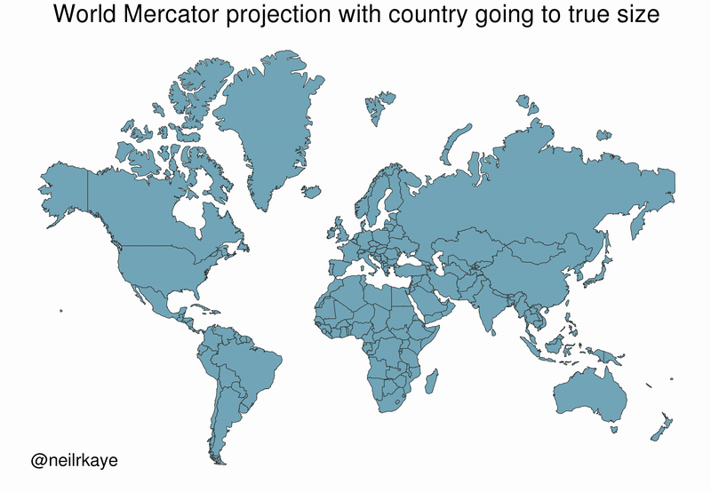

```{r setup, include=FALSE}
knitr::opts_chunk$set(echo = TRUE, cache = TRUE, dpi=300)
```

*Note: This lecture will focus only on **vector-based** spatial analysis. We will not cover **raster-based** spatial analysis, although this is an equally important subject. I'll provide some links to further resources at the bottom of this document for those of you who want to explore further on your own.*

## Requirements

### External libraries (requirements vary by OS)

We're going to be doing all our spatial analysis and plotting today in R. Behind the scenes, R provides bindings to powerful open-source GIS libraries. These include the [Geospatial Data Abstraction Library (GDAL)](http://www.gdal.org/) and [Interface to Geometry Engine Open Source (GEOS)](https://trac.osgeo.org/geos/) API suite, as well as access to projection and transformation operations from the [PROJ library](https://proj.org). You needn't worry about all this, but for the fact that you *may* need to install some of these external libraries first. The requirements vary by OS:

- **Linux:** Requirements vary by distribution. See [here](https://github.com/r-spatial/sf#linux).
- **Mac:** You should be fine to proceed directly to the R packages installation below. An unlikely exception is if you've configured R to install packages from source; in which case see [here](https://github.com/r-spatial/sf#macos).
- **Windows:** Same as Mac, you should be good to go unless you're installing from source. In which case, see [here](https://github.com/r-spatial/sf#windows).

### R packages 

- New: **sf**, **lwgeom**, **maps**, **mapdata**, **spData**, **tigris**, **tidycensus**, **leaflet**, **mapview**, **tmap**, **tmaptools**
- Already used: **tidyverse**, **data.table**, **hrbrthemes**

Truth be told, you only need a handful of the above libraries to do 95% of the spatial work that you're likely to encounter. But R's spatial ecosystem and support is extremely rich, so I'll try to walk through a number of specific use-cases in this lecture. Run the following code chunk to install (if necessary) and load everything.

```{r, cache=F, message=FALSE}
## Load and install the packages that we'll be using today
if (!require("pacman")) install.packages("pacman")
pacman::p_load(sf, tidyverse, data.table, hrbrthemes, lwgeom, rnaturalearth, maps, mapdata, spData, tigris, tidycensus, leaflet, mapview, tmap, tmaptools)
## My preferred ggplot2 plotting theme (optional)
theme_set(hrbrthemes::theme_ipsum())
```


### Census API key

Finally, we'll be accessing some data from the US Census Bureau through the [tidycensus package](https://walkerke.github.io/tidycensus/). This will require a Census API key, which you can request [here](https://api.census.gov/data/key_signup.html). Once that's done, you can set it using the `tidycensus::census_api_key()` function. I recommend using the "install = TRUE" option to save your key for future usage. See the function's help file for more information.

```{r, eval=FALSE}
tidycensus::census_api_key("PLACE_YOUR_API_KEY_HERE", install = TRUE)
```


## Introduction: CRS and map projections

Student presentation time. 

If you're reading this after the fact, I recommend [these](https://geocompr.robinlovelace.net/spatial-class.html#crs-intro) [two](https://proj.org/usage/quickstart.html) helpful resources. The very short version is that spatial data, like all coordinate-based systems, only make sense relative to some fixed point. That fixed point is what the Coordinate Reference Systems, or **CRS**, is trying to set. In R, we can define the CRS in one of two ways:

1. [EPSG code](https://epsg.org/home.html) (e.g. `3857`), or 

2. [PROJ string](https://proj.org/operations/index.html) (e.g. `"+proj=merc"`). 

We'll see examples of both implementations in in this lecture. For the moment, however, just know that they are equally valid ways of specifying CRS in R (albeit with with different strengths and weaknesses). You can search for many different CRS definitions [here](https://epsg.io/).

> **Aside:** There are some important updates happening in the world of CRS and geospatial software, which will percolate through to the R spatial ecosystem. Thanks to the hard work of various R package developers, these behind-the-scenes changes are unlikely to affect the way that you interact with spatial data in R. But they are worth understanding if you plan to make geospatial work a core component of your research. More [here](https://www.r-spatial.org/r/2020/03/17/wkt.html).

Similarly, whenever we try to plot (some part of) the earth on a map, we're effectively trying to **project** a 3-D object onto a 2-D surface. This will necessarily create some kind of distortion. Different types of map projections limit distortions for some parts of the world at the expense of others. For example, consider how badly the standard (but infamous) Mercator projection distorts the high latitudes in a global map ([source](https://twitter.com/neilrkaye/status/1050740679008296967)): 

```{r mercator_distortion, echo = FALSE, out.width='100%'}
if (knitr::is_html_output()){
  
} else {
  message("Sorry, this GIF is only available in the the HTML version of the notes.")
}
```

**Bottom line:** You should always aim to choose a projection that best represents your specific area of study. I'll also show you how you can "re-orient" your projection to a specific latitude and longitude using the PROJ syntax. But first I'm obliged to share this [XKCD summary](https://xkcd.com/977/). (Do yourself a favour and click on the link.)

## Simple Features and the **sf** package

R has long provided excellent support for spatial analysis and plotting (primarily through the **sp**, **rgdal**, **rgeos**, and **raster** packages). However, until recently, the complex structure of spatial data necessitated a set of equally complex spatial objects in R. I won't go into details, but a spatial object (say, a [SpatialPolygonsDataFrame](https://cran.r-project.org/web/packages/sp/vignettes/intro_sp.pdf)) was typically comprised of several "layers" --- much like a list --- with each layer containing a variety of "slots". While this approach did (and still does) work perfectly well, the convoluted structure provided some barriers to entry for newcomers. It also made it very difficult to incorporate spatial data into the tidyverse ecosystem that we're familiar with. Luckily, all this has changed thanks to the advent of the **sf** package ([link](https://r-spatial.github.io/sf/)).

The "sf" stands for [**s**imple **f**eatures](https://en.wikipedia.org/wiki/Simple_Features), which is a simple (ahem) standard for representing the spatial geometries of real-world objects on a computer.^[See the [first](https://r-spatial.github.io/sf/articles/sf1.html) of the excellent **sf** vignettes for more details.] These objects --- i.e. "features" --- could include a tree, a building, a country's border, or the entire globe. The point is that they are characterised by a common set of rules, defining everything from how they are stored on our computer to which geometrical operations can be applied them. Of greater importance for our purposes, however, is the fact that **sf** represents these features in R as *data frames*. This means that all of our data wrangling skills from previous lectures can be applied to spatial data; say nothing of the specialized spatial functions that we'll cover next.

### Reading in spatial data

Somewhat confusingly, most of the functions in the **sf** package start with the prefix `st_`. This stands for *<b>s</b>patial and <b>t</b>emporal* and a basic command of this package is easy enough once you remember that you're probably looking for `st_SOMETHING()`.^[I rather wish they'd gone with a `sf_` prefix myself --- or at least created aliases for it --- but the package developers are apparently following [standard naming conventions from PostGIS](https://github.com/r-spatial/sf/issues/140#issuecomment-270029715).]

Let's demonstrate by reading in the North Carolina counties shapefile that comes bundled with **sf**. As you might have guessed, we're going to use the `st_read()` command and **sf** package will handle all the heavy lifting behind the scenes.

```{r nc, message=FALSE}
# library(sf) ## Already loaded

## Location of our shapefile (here: bundled together with the sf package)
file_loc = system.file("shape/nc.shp", package="sf")

## Read the shapefile into R
nc = st_read(file_loc, quiet = TRUE)
```

### Simple Features as data frames

Let's print out the `nc` object that we just created and take a look at its structure.

```{r nc_print}
nc
```

Now we can see the explicit data frame structure that was I talking about earlier. The object has the familiar tibble-style output that we're used to (e.g. it only prints the first 10 rows of the data). However, it also has some additional information in the header, like a description of the geometry type ("MULTIPOLYGON") and CRS (e.g. EPSG ID 4267). One thing I want to note in particular is the `geometry` column right at the end of the data frame. This geometry column is how **sf** package achieves much of its magic: It stores the geometries of each row element in its own list column.^[For example, we could print out the coordinates needed to plot the first element in our data frame, Ashe county, by typing `nc$geometry[[1]]`. In contrast, I invite you to see how complicated the structure of a traditional spatial object is by running, say, `str(as(nc, "Spatial"))`.] Since all we really care about are the key feature attributes --- county name, FIPS code, population size, etc. --- we can focus on those instead of getting bogged down by hundreds (or thousands or even millions) of coordinate points. In turn, this all means that our favourite **tidyverse** operations and syntax (including the pipe operator `%>%`) can be applied to spatial data. Let's review some examples, starting with plotting.

### Plotting and projection with **ggplot2**

Plotting **sf** objects is incredibly easy thanks to the package's integration with both base R `plot()` and **ggplot2**. I'm going to focus on the latter here, but feel free to experiment.^[Plotting **sf** objects with the base `plot` function is generally faster. However, I feel that you give up a lot of control and intuition by moving away from the layered, "graphics of grammar" approach of **ggplot2**.] The key geom to remember is `geom_sf()`. For example:

```{r nc_plot}
# library(tidyverse) ## Already loaded

nc_plot = 
  ggplot(nc) +
  geom_sf(aes(fill = AREA), alpha=0.8, col="white") +
  scale_fill_viridis_c(name = "Area") +
  ggtitle("Counties of North Carolina")

nc_plot
```

To reproject an **sf** object to a different CRS, we can use `sf::st_transform()`. 

```{r nc_mollweide}
nc %>%
  st_transform(crs = "+proj=moll") %>% ## Reprojecting to a Mollweide CRS
  head(2) ## Saving vertical space
```

Or, we can specify a common projection directly in the ggplot call using `coord_sf()`. This is often the most convenient approach when you are combining multiple **sf** data frames in the same plot.

```{r nc_mollweide_plot}
nc_plot +
  coord_sf(crs = "+proj=moll") +
  labs(subtitle = "Mollweide projection") 
```

Note that we used a PROJ string to define the CRS reprojection above. But we could easily use an EPSG code instead. For example, here's the [NC state plane](https://epsg.io/32119) projection.

```{r nc_stateline_plot}
nc_plot +
  coord_sf(crs = 32119) +
  labs(subtitle = "NC state plane") 
```

### Data wrangling with **dplyr** and **tidyr**

As I keep saying, the tidyverse approach to data wrangling carries over very smoothly to **sf** objects. For example, the standard **dplyr** verbs like `filter()`, `mutate()` and `select()` all work:

```{r nc_dplyr}
nc %>%
  filter(NAME %in% c("Camden", "Durham", "Northampton")) %>%
  mutate(AREA_1000 = AREA*1000) %>%
  select(NAME, contains("AREA"), everything())
```

You can also perform `group_by()` and `summarise()` operations as per normal (see [here](http://strimas.com/r/tidy-sf/) for a nice example). Furthermore, the **dplyr** family of [join functions](https://dplyr.tidyverse.org/reference/join.html) also work, which can be especially handy when combining different datasets by (say) FIPS code or some other *attribute*. However, this presumes that only one of the objects has a specialized geometry column. In other words, it works when you are joining an **sf** object with a normal data frame. In cases where you want to join two **sf** objects based on their *geometries*, there's a specialized `st_join()` function. I provide an example of this latter operation in the section on [geometric operations](#geometric) below.

And, just to show that we've got the bases covered, you can also implement your favourite **tidyr** verbs. For example, we can `tidyr::gather()` the data to long format, which is useful for facetted plotting.^[In case you're wondering: the newer `tidyr::pivot_*` functions [do not](https://github.com/r-spatial/sf/pull/1151) yet work with **sf** objects.] Here I demonstrate using the "BIR74" and "BIR79" columns (i.e. the number of births in each county in 1974 and 1979, respectively).

```{r nc_tidyr}
nc %>% 
  select(county = NAME, BIR74, BIR79, -geometry) %>% 
  gather(year, births, BIR74, BIR79) %>% 
  mutate(year = gsub("BIR", "19", year)) %>%
  ggplot() +
  geom_sf(aes(fill = births), alpha=0.8, col="white") +
  scale_fill_viridis_c(name = "Births", labels = scales::comma) +
  facet_wrap(~year, ncol = 1) +
  labs(title = "Births by North Carolina county") 
```


### Specialized geometric operations {#geometric}

Alongside all the tidyverse functionality, the **sf** package comes with a full suite of geometrical operations. You should take a look at at the [third **sf** vignette](https://r-spatial.github.io/sf/articles/sf3.html#geometrical-operations) or the [*Geocomputation with R*](https://geocompr.robinlovelace.net/geometric-operations.html#geo-vec) book to get a complete overview. However, here are a few examples to get you started:

#### Unary operations

So-called *unary* operations are applied to a single object. For instance, you can "melt" sub-elements of an **sf** object (e.g. counties) into larger elements (e.g. states) using `sf::st_union()`:

```{r nc_union}
nc %>% 
  st_union() %>% 
  ggplot() +
  geom_sf(fill=NA, col="black") +
  labs(title = "Outline of North Carolina") 
```

Or, you can get the `st_area()`, `st_centroid()`, `st_boundary()`, `st_buffer()`, etc. of an object using the appropriate command. For example:

```{r nc_area}
nc %>% st_area() %>% head(5) ## Only show the area of the first five counties to save space.
```

And:

```{r nc_centroid, warning=F}
nc_centroid = st_centroid(nc)

ggplot(nc) +
  geom_sf(fill = "black", alpha = 0.8, col = "white") +
  geom_sf(data = nc_centroid, col = "red") + ## Notice how easy it is to combine different sf objects
  labs(
    title = "Counties of North Carolina",
    subtitle = "Centroids in red"
    )
```

#### Binary operations

Another set of so-called *binary* operations can be applied to multiple objects. So, we can get things like the distance between two spatial objects using `sf::st_distance()`. In the below example, I'm going to get the distance from Ashe county to Brunswich county, as well as itself. The latter is just a silly addition to show that we can easily make multiple pairwise comparisons, even when the distance from one element to another is zero.

```{r nc_distance}
ashe_brunswick = nc %>% filter(NAME %in% c("Ashe", "Brunswick"))
brunswick = nc %>% filter(NAME %in% c("Brunswick"))

## Use "by_element = TRUE" to give a vector instead of the default pairwise matrix
ab_dist = st_distance(ashe_brunswick, brunswick, by_element = TRUE)
# Units: [m]
# [1] 347930.7      0.0

## We can use the `units` package (already installed as sf dependency) to convert to kilometres 
ab_dist = ab_dist %>% units::set_units(km) %>% round()
# Units: [km]
# [1] 348   0

ggplot(nc) +
  geom_sf(fill = "black", alpha = 0.8, col = "white") +
  geom_sf(data = nc %>% filter(NAME %in% c("Ashe", "Brunswick")), aes(fill = NAME), col = "white") +  
  labs(
    title = "Calculating distances",
    subtitle = paste0("The distance between Ashe and Brunswick is ", ab_dist[1], " km")
    ) +
  theme(legend.title = element_blank())
```


#### Binary logical operations

A sub-genre of binary geometric operations falls into the category of logic rules --- typically characterising the way that geometries relate in space. (Do they overlap, etc.) 

For example, we can calculate the intersection of different spatial objects using `sf::st_intersection()`. For this next example, I'm going to use two new spatial objects: 1) A regional map of France from the **maps** package and 2) part of the Seine river network (including its Marne and Yonne tributaries) from the **spData** package. Don't worry too much about the process used for loading these datasets; I'll cover that in more depth shortly. For the moment, just focus on the idea that we want to see which adminstrative regions are intersected by the river network. Start by plotting all of the data to get a visual sense of the overlap:

```{r france}
## Get the data
france = st_as_sf(map('france', plot = FALSE, fill = TRUE))
data("seine", package = "spData")

## Make sure they have the same projection
seine = st_transform(seine, crs = st_crs(france))

ggplot() + 
  geom_sf(data = france, alpha = 0.8, fill = "black", col = "gray50") + 
  geom_sf(data = seine, col = "#05E9FF", lwd = 1) + 
  labs(
    title = "Administrative regions of France",
    subtitle = "Also showing the Seine, Marne and Yonne rivers"
    )
```

Now let's limit it to the intersected regions:

```{r france_intersected, warning=F, message=F, dependson=seine}
seine = st_transform(seine, crs = st_crs(france))
france_intersected = st_intersection(france, seine)
france_intersected
```

Note that `st_intersection()` only preserves *exact* points of overlap. As in, this is the exact path that the rivers follow within these regions. We can see this more explicitly in map form:

```{r france_intersected_plot}
france_intersected %>%
  ggplot() + 
  geom_sf(alpha = 0.8, aes(fill = ID, col = ID)) + 
  labs(
    title = "Seine, Marne and Yonne rivers",
    caption = "Colours depict French administrative regions"
    ) +
  theme(legend.title = element_blank())
```

If we instead wanted to plot the subsample of intersected provinces (i.e. keeping their full geometries), we have a couple options. We could filter the `france` object by matching its region IDs with the `france_intersected` object. However, a more direct option is to use the `sf::st_join()` function which matches objects based on overlapping (i.e. intersecting) geometries:

```{r france_join, message=F}
st_join(france, seine) %>% 
  filter(!is.na(name)) %>% ## Get rid of regions with no overlap
  distinct(ID, .keep_all = T) %>% ## Some regions are duplicated b/c two branches of the river network flow through them 
  ggplot() + 
  geom_sf(alpha = 0.8, fill = "black", col = "gray50") + 
  geom_sf(data = seine, col = "#05E9FF", lwd = 1) + 
  labs(title = "Intersected regions only") 
```

That's about as much **sf** functionality as I can show you for today. The remaining part of this lecture will cover some additional mapping considerations and some bonus spatial R "swag". However, I'll try to slip in a few more **sf**-specific operations along the way.


### Aside: **sf** and **data.table**

**sf** objects are designed to integrate with a **tidyverse** workflow. They can also be made to work a **data.table** workflow too, but the integration is not as slick. This is a [known issue](https://github.com/Rdatatable/data.table/issues/2273) and I'll only just highlight a few very brief considerations.

You can convert an **sf** object into a data.table. But note that the key geometry column appears to lose its attributes.

```{r nc_dt1}
# library(data.table) ## Already loaded

nc_dt = as.data.table(nc)
head(nc_dt)
```

The good news is that all of this information is still there. It's just hidden from display.

```{r nc_dt2}
nc_dt$geometry
```

What's the upshot? Well, basically it means that you have to refer to this "geometry" column explicitly whenever you implement a spatial operation. For example, here's a repeat of the `st_union()` operation that we saw earlier. Note that I explicitly refer to the "geometry" column both for the `st_union()` operation (which, moreover, takes place in the
"j" data.table slot) and when assigning the aesthetics for the `ggplot()` call.

```{r ncd_dt3}
nc_dt[, .(geometry = st_union(geometry))] %>% ## Explicitly refer to 'geometry' col
    ggplot(aes(geometry = geometry)) +        ## And here again for the aes()
    geom_sf(fill=NA, col="black") +
    labs(title = "Outline of North Carolina", 
         subtitle = "This time brought to you by data.table") 
```

Of course, it's also possible to efficiently convert between the two classes --- e.g. with `as.data.table()` and `st_as_sf()` --- depending on what a particular section of code does (data wrangling or spatial operation). I find that often use this approach in my own work.


## Where to get map data

As our first North Carolina examples demonstrate, you can easily import external shapefiles, KML files, etc., into R. Just use the generic `sf::st_read()` function on any of these formats and the **sf** package will take care of the rest. However, we've also seen with the France example that you might not even need an external shapefile. Indeed, R provides access to a large number of base maps --- e.g. countries of the world, US states and counties, etc. --- through the **maps**, (higher resolution) **mapdata** and **spData** packages, as well as a whole ecosystem of more specialized GIS libraries.^[The list of specialised maps packages is far too long for me to cover here. You can get [marine regions](https://github.com/ropensci/mregions), [protected areas](https://github.com/ropenscilabs/rwdpa), [nightlights](https://github.com/chrisvwn/Rnightlights), ..., etc., etc.] To convert these maps into "**sf**-friendly" data frame format, we can use the `sf::st_as_sf()` function as per the below examples.

### Example 1: The World

```{r world1}
# library(maps) ## Already loaded

world = st_as_sf(map("world", plot = FALSE, fill = TRUE))

world_map = 
  ggplot(world) + 
  geom_sf(fill = "grey80", col = "grey40", lwd = 0.3) +
  labs(
    title = "The world", 
    subtitle = paste("EPSG:", st_crs(world)$epsg)
    )
world_map
```

All of the usual **sf** functions and transformations can then be applied. For example, we can reproject the above world map onto the [Lambert Azimuthal Equal Area](https://proj.org/operations/projections/laea.html) projection (and further orientate it at the South Pole) as follows.

```{r world2}
world_map +
  coord_sf(crs = "+proj=laea +y_0=0 +lon_0=155 +lat_0=-90") +
  labs(subtitle = "Lambert Azimuthal Equal Area projection")
```

### Several digressions on projection considerations

#### Winkel tripel projection

As we've already seen, most map projections work great "out of the box" with **sf**. One niggling and notable exception is the [Winkel tripel projection](https://en.wikipedia.org/wiki/Winkel_tripel_projection). This is the preferred global map projection of *National Geographic* and requires a bit more work to get it to play nicely with **sf** and **ggplot2** (as detailed in [this thread](https://github.com/r-spatial/sf/issues/509)). Here's a quick example of how to do it:

```{r wintri}
# library(lwgeom) ## Already loaded

wintr_proj = "+proj=wintri +datum=WGS84 +no_defs +over"

world_wintri = lwgeom::st_transform_proj(world, crs = wintr_proj)

## Don't necessarily need a graticule, but if you do then define it manually:
gr = 
  st_graticule(lat = c(-89.9,seq(-80,80,20),89.9)) %>%
  lwgeom::st_transform_proj(crs = wintr_proj)

ggplot(world_wintri) + 
  geom_sf(data = gr, color = "#cccccc", size = 0.15) + ## Manual graticule
  geom_sf(fill = "grey80", col = "grey40", lwd = 0.3) +
  coord_sf(datum = NA) +
  theme_ipsum(grid = F) +
  labs(title = "The world", subtitle = "Winkel tripel projection")
```


#### Equal Earth projection

The latest and greatest projection, however, is the "[Equal Earth](http://equal-earth.com)" projection. This _does_ work well out of the box, in part due to the `ne_countries` dataset that comes bundled with the **rnaturalearth** package ([link](https://github.com/ropensci/rnaturalearth)). I'll explain that second part of the previous sentence in moment. But first let's see the Equal Earth projection in action.

```{r equal_earth} 
# library(rnaturalearth) ## Already loaded

countries = 
  ne_countries(returnclass = "sf") %>%
  st_transform(8857) ## Transform to equal earth projection
  # st_transform("+proj=eqearth +wktext") ## PROJ string alternative

ggplot(countries) +
  geom_sf(fill = "grey80", col = "grey40", lwd = 0.3) +
  labs(title = "The world", subtitle = "Equal Earth projection")
```

#### Pacfic-centered maps and other polygon mishaps

As noted, the `rnaturalearth::ne_countries` spatial data frame is important for correctly displaying the Equal Earth projection. On the face of it, this looks pretty similar to our `maps::world` spatial data frame from earlier. They both contain polygons of all the countries in the world and appear to have similar default projections. However, some underlying nuances in how those polygons are constructed allows us avoid some undesirable visual artefacts that arise when reprojecting to the Equal Earth projection. Consider: 

```{r equal_earth_bad}
world %>%
  st_transform(8857) %>% ## Transform to equal earth projection
  ggplot() +
  geom_sf(fill = "grey80", col = "grey40", lwd = 0.3) +
  labs(title = "The... uh, world", subtitle = "Projection fail")
```

These types of visual artefacts are particularly common for Pacific-centered maps and, in that case, arise from polygons extending over the Greenwich prime meridian. It's a suprisingly finicky problem to solve. Even the **rnaturalearth** doesn't do a good job. Luckily, Nate Miller has you covered with an [excellent guide](https://github.com/natemiller/mapping) to set you on the right track. 


### Example 2: A single country (i.e. Norway)

The **maps** and **mapdata** packages have detailed county- and province-level data for several individual nations. We've already seen this with France, but it includes the USA, New Zealand and several other nations. However, we can still use it to extract a specific country's border using some intuitive syntax. For example, we could plot a base map of Norway as follows.

```{r norway}
norway = st_as_sf(map("world", "norway", plot = FALSE, fill = TRUE))

## For a hi-resolution map (if you *really* want to see all the fjords):
# norway = st_as_sf(map("worldHires", "norway", plot = FALSE, fill = TRUE))

norway %>%
  ggplot() + 
  geom_sf(fill="black", col=NA)
```

Hmmm. Looks okay, but I don't really want to include non-mainland territories like Svalbaard (to the north) and the Faroe Islands (to the east). This gives me the chance to show off another handy function, `sf::st_crop()`, which I'll use to crop our **sf** object to a specific extent (i.e. rectangle). While I am at, we could also improve the projection. The Norwegian Mapping Authority recommends the ETRS89 / UTM projection, for which we can easily obtain the equivalent EPSG code (i.e. 25832) from [this website](https://epsg.io/25832).

```{r norway_fixed, message=F, warning=F}
norway %>%
  st_crop(c(xmin=0, xmax=35, ymin=0, ymax=72)) %>%
  st_transform(crs = 25832) %>%
  ggplot() + 
  geom_sf(fill="black", col=NA)
```

There you go. A nice-looking map of Norway. Fairly appropriate that it resembles a gnarly black metal guitar.

> **Aside:** I recommend detaching the **maps** package once you're finished using it, since it avoids potential namespace conflicts with `purrr::map`.

```{r eval=F}
detach(package:maps) ## To avoid potential purrr::map() conflicts
```


## BONUS 1: US Census data with **tidycensus** and **tigris** {#census}

> **Note:** Before continuing with this section, you will first need to [request an API key](https://api.census.gov/data/key_signup.html) from the Census. 

Working with Census data has traditionally quite a pain. You need to register on the website, then download data from various years or geographies separately, merge these individual files, etc. Thankfully, this too has recently become much easier thanks to the Census API and --- for R at least --- the **tidycensus** ([link](https://walker-data.com/tidycensus/)) and **tigris** ([link](https://github.com/walkerke/tigris)) packages from [Kyle Walker](http://walkerke.github.io/) (a UO alum). This next section will closely follow a [tutorial](http://walkerke.github.io/2017/06/comparing-metros/) on his website.

We start by loading the packages and setting our Census API key. Note that I'm not actually running the below chunk, since I expect you to fill in your own Census key. You only have to run this function once. 

```{r set_census_api_key, eval=FALSE}
# library(tidycensus) ## Already loaded
# library(tigris) ## Already loaded

## Replace the below with your own census API key. We'll use the "install = TRUE"
## option to save the key for future use, so we only ever have to run this once.
census_api_key("YOUR_CENSUS_API_KEY_HERE", install = TRUE)

## Also tell the tigris package to automatically cache its results to save on
## repeated downloading. I recommend adding this line to your ~/.Rprofile file
## so that caching is automatically enabled for future sessions. A quick way to
## do that is with the `usethis::edit_r_profile()` function.
options(tigris_use_cache=TRUE)
```

Let's say that our goal is to provide a snapshot of Census rental estimates across different cities in the Pacific Northwest. We start by downloading tract-level rental data for Oregon and Washington using the `tidycensus::get_acs()` function. Note that you'll need to look up the correct ID variable (in this case: "DP04_0134").

```{r rent1, include=F}
rent = 
  get_acs(
    geography = "tract", variables = "DP04_0134",
    state = c("WA", "OR"), geometry = TRUE
    )
```

```{r rent1a, eval=F}
rent = 
  tidycensus::get_acs(
    geography = "tract", variables = "DP04_0134",
    state = c("WA", "OR"), geometry = TRUE
    )
rent
```
```{r rent 1b, echo=F}
rent
```

This returns an **sf** object, which we can plot directly.

```{r rent_plot}
rent %>%
  ggplot() + 
  geom_sf(aes(fill = estimate, color = estimate)) + 
  coord_sf(crs = 26910) + 
  scale_fill_viridis_c(name = "Rent ($)", labels = scales::comma) + 
  scale_color_viridis_c(name = "Rent ($)", labels = scales::comma) +
  labs(
    title = "Rental rates across Oregon and Washington", 
    caption = "Data: US Census Bureau"
    ) 
```

Hmmm, looks like you want to avoid renting in Seattle if possible... 

The above map provides rental information for pretty much all of the Pacific Northwest. Perhaps we're not interested in such a broad swatch of geography. What if we'd rather get a sense of rents within some smaller and well-defined metropolitan areas? Well, we'd need some detailed geographic data for starters, say from the [TIGER/Line shapefiles](https://www.census.gov/geographies/mapping-files/time-series/geo/tiger-line-file.html) collection. The good news is that the **tigris** package has you covered here. For example, let's say we want to narrow down our focus and compare rents across three Oregon metros: Portland (and surrounds), Corvallis, and Eugene.

```{r or_metros, message=F, results = FALSE}
or_metros = 
  tigris::core_based_statistical_areas(cb = TRUE) %>%
  # filter(GEOID %in% c("21660", "18700", "38900")) %>% ## Could use GEOIDs directly if you know them 
  filter(grepl("Portland|Corvallis|Eugene", NAME)) %>%
  filter(grepl("OR", NAME)) %>% ## Filter out Portland, ME
  select(metro_name = NAME)
```

Now we do a spatial join on our two data sets using the `sf::st_join()` function.

```{r or_rent, warning=F, message=F}
or_rent = 
  st_join(
    rent, 
    or_metros, 
    join = st_within, left = FALSE
    ) 
or_rent
```

One useful way to summarize this data and compare across metros is with a histogram. Note that "regular" **ggplot2** geoms and functions play perfectly nicely with **sf** objects (i.e. we aren't limited to `geom_sf()`).

```{r or_rent_plot, warning=F, message=F}
or_rent %>%
  ggplot(aes(x = estimate)) + 
  geom_histogram() + 
  facet_wrap(~metro_name) 
```

That's a quick taste of working with **tidycensus** (and **tigris**). In truth, the package can do a lot more than I've shown you here. For example, you can also use it to download a variety of other Census microdata such as PUMS, which is much more detailed. See the **tidycensus** [website](https://walker-data.com/tidycensus/) for more information. 


## BONUS 2: Interactive maps

Now that you've grasped the basic properties of **sf** objects and how to plot them using **ggplot2**, its time to scale up with interactive maps.^[The ability to easily plot interactive maps from R is one of the main reasons that I switched all of my public presentations from PDFs to R Markdown-driven HMTL.] You have several package options here. But I think the best are **leaflet** ([link](https://rstudio.github.io/leaflet/)) and friends, or **plotly** ([link](https://github.com/ropensci/plotly)). We've already covered the latter in a previous lecture, so I'll simply redirect interested parties to [this link](https://plotly-r.com/maps.html) for some map-related examples. To expand on the former in more depth, [leaflet.js](https://leafletjs.com/) is a lightweight JavaScript library for interactive mapping that has become extremely popular in recent years. You would have seen it being used across all the major news media publications (*New York Times*, *Washington Post*, *The Economist*, etc.). The good people at RStudio have kindly packaged a version of **leaflet** for R, which basically acts as a wrapper to the underlying JavaScript library. 

The **leaflet** syntax is a little different to what you've seen thus far and I strongly encourage you to visit the package's [excellent website](https://rstudio.github.io/leaflet/) for the full set of options. However, a key basic principle that it shares with **ggplot2** is that you *build your plot in layers*. Here's an example adapted from [Julia Silge](https://juliasilge.com/blog/using-tidycensus/), which builds on the **tidycensus** package that we saw above. This time, our goal is to plot county-level population densities for Oregon as a whole and produce some helpful popup text if a user clicks on a particular county. First, we download the data using **tidycensus** and inspect the resulting data frame.

```{r oregon, include = F}
# library(tidycensus) ## Already loaded

oregon = 
  get_acs(
    geography = "county", variables = "B01003_001",
    state = "OR", geometry = TRUE
    )  
oregon
```

```{r oregon1a, eval = F}
# library(tidycensus) ## Already loaded

oregon = 
  get_acs(
    geography = "county", variables = "B01003_001",
    state = "OR", geometry = TRUE
    ) 
oregon
```
```{r oregon 1b, echo=F}
oregon
```

So, the popup text of interest is held within the "NAME" and "estimate" columns. I'll use a bit of regular expression work to extract the county name from the "NAME" column (i.e. without the state) and then build up the map layer by layer. Note that the **leaflet** syntax requires that I prepend variables names with a tilde (`~`) when I refer to them in the plot building process. This tilde operates in much the same way as the asthetics (`aes()`) function does in **ggplot2**. One other thing to note is that I need to define a colour palette --- which I'll call `col_pal` here --- separately from the main plot. This is a bit of an inconvenience if you're used to the fully-integrated **ggplot2** API, but only a small one. 

```{r oregon_leaflet, dependson=oregon, cache = FALSE}
# library(leaflet) ## Already loaded

col_pal = colorQuantile(palette = "viridis", domain = oregon$estimate, n = 10)

oregon %>%
  mutate(county = gsub(",.*", "", NAME)) %>% ## Get rid of everything after the first comma
  st_transform(crs = 4326) %>%
  leaflet(width = "100%") %>%
  addProviderTiles(provider = "CartoDB.Positron") %>%
  addPolygons(
    popup = ~paste0(county, "<br>", "Population: ", prettyNum(estimate, big.mark=",")),
    stroke = FALSE,
    smoothFactor = 0,
    fillOpacity = 0.7,
    color = ~col_pal(estimate)
    ) %>%
  addLegend(
    "bottomright", 
    pal = col_pal, 
    values = ~estimate,
    title = "Population percentiles",
    opacity = 1
    )
```

No suprises here. The bulk of Oregon's population is situated just west of the Cascades, in cities connected along the I-5.

A particularly useful feature of interactive maps is not being limited by scale or granularity, so you can really dig in to specific areas and neighbourhoods. Here's an example using home values from Lane County.

```{r lane, include=F, message=F}
lane = 
  get_acs(
    geography = "tract", variables = "B25077_001", 
    state = "OR", county = "Lane County", geometry = TRUE
    )
```
```{r lane1a, evaluate=F}
lane = 
  get_acs(
    geography = "tract", variables = "B25077_001", 
    state = "OR", county = "Lane County", geometry = TRUE
    )
```
```{r lane_leaflet, dependson=lane, cache = FALSE}
lane_pal = colorNumeric(palette = "plasma", domain = lane$estimate)

lane %>%
  mutate(tract = gsub(",.*", "", NAME)) %>% ## Get rid of everything after the first comma
  st_transform(crs = 4326) %>%
  leaflet(width = "100%") %>%
  addProviderTiles(provider = "CartoDB.Positron") %>%
  addPolygons(
    # popup = ~tract,
    popup = ~paste0(tract, "<br>", "Median value: $", prettyNum(estimate, big.mark=",")),
    stroke = FALSE,
    smoothFactor = 0,
    fillOpacity = 0.5,
    color = ~lane_pal(estimate)
    ) %>%
  addLegend(
    "bottomright", 
    pal = lane_pal, 
    values = ~estimate,
    title = "Median home values<br>Lane County, OR",
    labFormat = labelFormat(prefix = "$"),
    opacity = 1
    )
```

Having tried to convince you of the conceptual similarities between building maps with either **leaflet** or **ggplot2** --- layering etc. --- there's no denying that the syntax does take some getting used to. If you only plan to spin up the occasional interactive map, that cognitive overhead might be more effort than it's worth. The good news is that R spatial community has created the **mapview** package ([link](https://r-spatial.github.io/mapview/)) for very quickly generating interactive maps. Behind the scenes, it uses **leaflet** to power everything, alongside some sensible defaults. Here's a quick example that recreates our Lane county home value map from above.

```{r mapview, dependson=lane, cache = FALSE, out.width='100%'}
# library(mapview) ## Already loaded

mapview::mapview(lane, zcol = "estimate", 
                 layer.name = 'Median home values<br>Lane County, OR')
```

Super easy, no? While it doesn't offer quite the same flexibility as the native **leaflet** syntax, **mapview** is a great way to get decent interactive maps up and running with minimal effort.^[I also want to flag the companion **mapedit** package ([link](https://github.com/r-spatial/mapedit)), which lets you _edit_ maps interactively by hand (e.g. redrawing polygons). I've used it for some of my projects and it works very well.]


## BONUS 3: Other map plotting options (**plot**, **tmap**, etc.)

While I think that **ggplot2** (together with **sf**) and **leaflet** are the best value bet for map plotting in R --- especially for relative newcomers that have been inculcated into the tidyverse ecosystem --- it should be said that there are many other options available to you. The base R `plot()` function is *very* powerful and handles all manner of spatial objects. (It is also very fast.) The package that I'll highlight briefly in closing, however, is **tmap** ([link](https://mtennekes.github.io/tmap/index.html)). The focus of **tmap** is *thematic maps* that are "production ready". The package is extremely flexible and can accept various spatial objects and output various map types (including interactive). Moreover, the syntax should look very familar to us, since it is inspired by `ggplot2`'s layered graphics of grammar approach. Here's an example of a great looking map taken from the **tmap** [homepage](https://mtennekes.github.io/tmap/index.html).

```{r tmap, warning=F}
# library(tmap) ## Already loaded
# library(tmaptools) ## Already loaded

## Load elevation raster data, and country polygons
data(land, World)

## Convert to Eckert IV projection
land_eck4 = st_transform(land, "+proj=eck4")

## Plot
tm_shape(land_eck4) +
  tm_raster(
    "elevation", 
    breaks=c(-Inf, 250, 500, 1000, 1500, 2000, 2500, 3000, 4000, Inf),  
    palette = terrain.colors(9), 
    title="Elevation"
    ) +
  tm_shape(World) +
  tm_borders("grey20") +
  tm_graticules(labels.size = .5) +
  tm_text("name", size="AREA") +
  tm_compass(position = c(.65, .15), color.light = "grey90") +
  tm_credits("Eckert IV projection", position = c("RIGHT", "BOTTOM")) +
  tm_style("classic") +
  tm_layout(
    inner.margins=c(.04,.03, .02, .01),
    legend.position = c("left", "bottom"),
    legend.frame = TRUE,
    bg.color="lightblue",
    legend.bg.color="lightblue",
    earth.boundary = TRUE,
    space.color="grey90"
    ) 
```

## Further reading

You could easily spend a whole semester (or degree!) on spatial analysis and, more broadly, geocomputation. I've simply tried to give you as much useful information as can reasonably be contained in one lecture. Here are some resources for further reading and study:

- The package websites that I've linked to throughout this tutorial are an obvious next port of call for delving deeper into their functionality: [**sf**](https://github.com/r-spatial/sf), [**leaflet**](https://rstudio.github.io/leaflet/), etc.
- The best overall resource right now may be [*Geocomputation with R*](https://geocompr.robinlovelace.net/index.html), a superb new text by Robin Lovelace, Jakub Nowosad, and Jannes Muenchow. This is a "living", open-source document, which is constantly updated by its authors and features a very modern approach to working with geographic data. Highly recommended.
- Similarly, the rockstar team behind **sf**, Edzer Pebesma and Roger Bivand, are busy writing their own book, [*Spatial Data Science*](https://www.r-spatial.org/book/). This project is currently less developed, but I expect it to become the key reference point in years to come. Imporantly, both of the above books cover **raster-based** spatial data.
- On the subject of raster data... If you're in the market for shorter guides, Jamie Afflerbach has a great introduction to rasters [here](https://rawgit.com/jafflerbach/spatial-analysis-R/gh-pages/intro_spatial_data_R.html). At a slightly more advanced level, UO's very own Ed Rubin has typically excellent tutorial [here](http://edrub.in/ARE212/section13.html). Finally, the **sf** team is busy developing a [new package](https://github.com/r-spatial/stars) called **stars**, which will provide equivalent functionality (among other things) for raster data. **UPDATE:** I ended up caving and wrote up a short set of bonus notes on rasters [here](https://raw.githack.com/uo-ec607/lectures/master/09a-spatial-rasters/09a-spatial-rasters.html).
- If you want more advice on drawing maps, including a bunch that we didn't cover today (choropleths, state-bins, etc.), Kieran Healy's [*Data Vizualisation*](https://socviz.co/maps.html#maps) book has you covered.
- Something else we didn't really cover at all today was **spatial statistics**. This too could be subject to a degree-length treatment. However, for now I'll simply point you to [*Spatio-Temporal Statistics with R*](https://spacetimewithr.org/), by Christopher Wikle and coauthors. (Another free book!) Finally, since it is likely the most interesting thing for economists working with spatial data, I'll also add that Darin Christensen and Thiemo Fetzer have written a very fast R-implementation (via C++) of Conley standard errors. The GitHub repo is [here](https://github.com/darinchristensen/conley-se). See their original [blog post](https://darinchristensen.com/post/2015-08-30-conley/) (and [update](https://darinchristensen.com/post/2017-08-21-correction/)) for more details.
