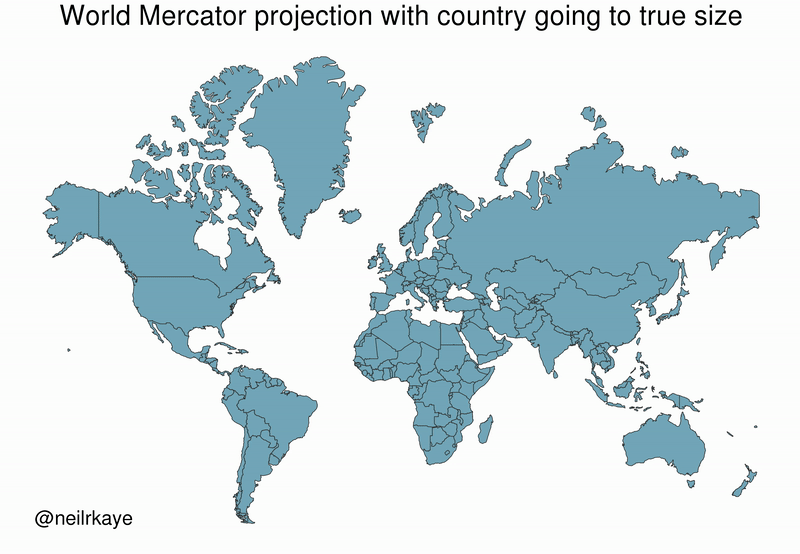
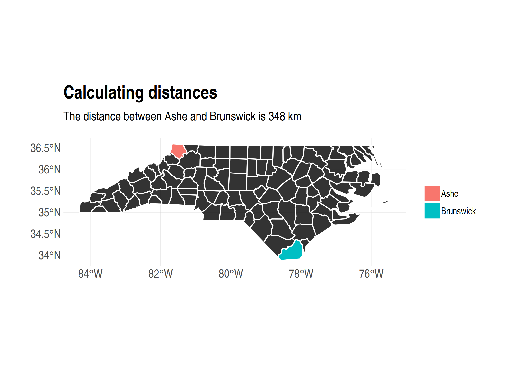
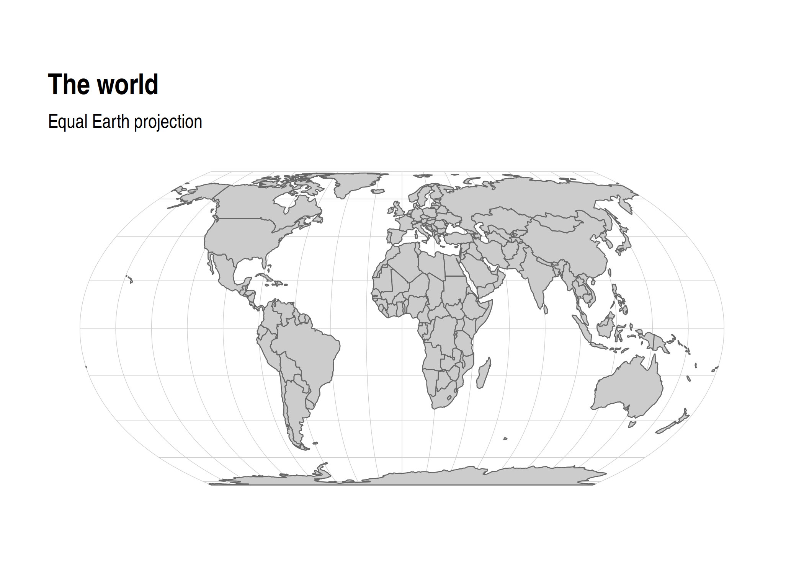
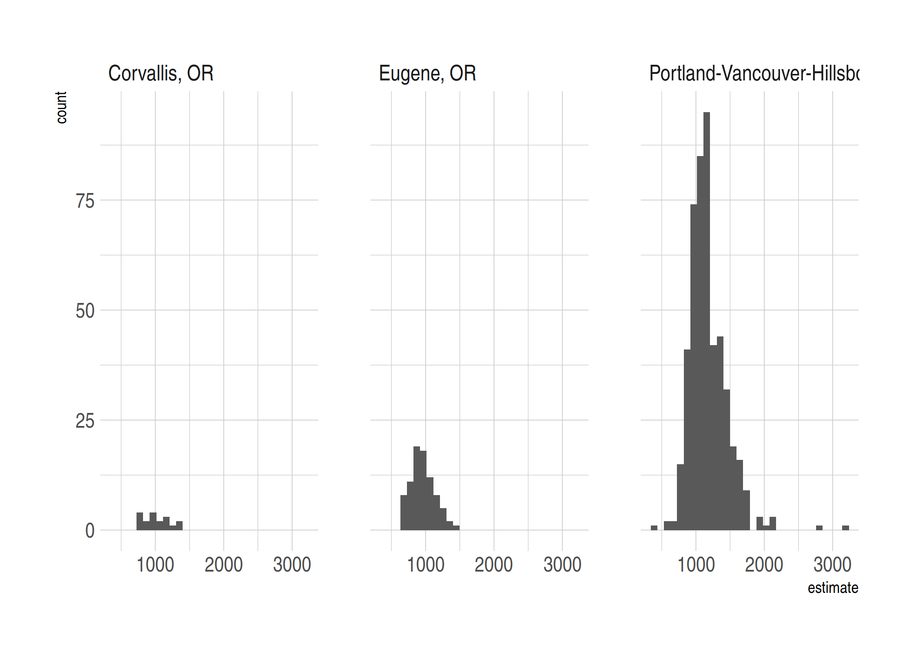

*Note: This lecture will focus only on **vector-based** spatial analysis. We will not cover **raster-based** spatial analysis, although this is an equally important subject. I'll provide some links to further resources at the bottom of this document for those of you who want to explore further on your own.*

## Requirements

### External libraries (requirements vary by OS)

We're going to be doing all our spatial analysis and plotting today in R. Behind the scenes, R provides bindings to powerful open-source GIS libraries. These include the [Geospatial Data Abstraction Library (GDAL)](http://www.gdal.org/) and [Interface to Geometry Engine Open Source (GEOS)](https://trac.osgeo.org/geos/) API suite, as well as access to projection and transformation operations from the [PROJ.4 library](https://proj4.org/about.html). You needn't worry about all this, but for the fact that you *may* need to install some of these external libraries first. The requirements vary by OS:

- **Linux:** Requirements vary by distribution. See [here](https://github.com/r-spatial/sf#linux).
- **Mac:** You should be fine to proceed directly to the R packages installation below. An unlikely exception is if you've configured R to install packages from source; in which case see [here](https://github.com/r-spatial/sf#macos).
- **Windows:** Same as Mac, you should be good to go unless you're installing from source. In which case, see [here](https://github.com/r-spatial/sf#windows).

### R packages 

- New: **sf**, **lwgeom**, **maps**, **mapdata**, **spData**, **tigris**, **tidycensus**, **leaflet**, **tmap**, **tmaptools**
- Already used: **tidyverse**, **hrbrthemes**

Note that you'll need **ggplot2** version 3.0.0 or above for the required [plotting support](https://www.tidyverse.org/articles/2018/07/ggplot2-3-0-0/) of **sf** objects. That's almost certainly the case, but now is a good time to upgrade you existing packages if you haven't done that for a while.

Okay, let's install (if necessary) and load everything.


```r
## Load and install the packages that we'll be using today
if (!require("pacman")) install.packages("pacman")
pacman::p_load(sf, tidyverse, hrbrthemes, lwgeom, rnaturalearth, maps, mapdata, spData, tigris, tidycensus, leaflet, tmap, tmaptools)
## My preferred ggplot2 plotting theme (optional)
theme_set(hrbrthemes::theme_ipsum())
```


### Census API key

Finally, we'll be accessing some data from the US Census Bureau through the [tidycensus package](https://walkerke.github.io/tidycensus/). This will require a Census API key, which you can request [here](https://api.census.gov/data/key_signup.html). Once that's done, you can set it using the `tidycensus::census_api_key()` function. I recommend using the "install = T" option to save your key for future useage. See the function's help file for more information.


```r
tidycensus::census_api_key("PLACE_YOUR_API_KEY_HERE", install = T)
```


## Introduction: CRS and map projections

Student presentation time. 

If you're reading this after the fact, I recommend [these](https://www.nceas.ucsb.edu/~frazier/RSpatialGuides/OverviewCoordinateReferenceSystems.pdf) [two](http://rspatial.org/spatial/rst/6-crs.html) helpful resources. The very short version is that spatial data (like all coordinate-based systems) only make sense relative to some fixed point. That fixed point is what the Coordinate Reference Systems, or **CRS**, is trying to set. In R, we define the CRS with a "proj4string", which is based on the syntax of the [PROJ.4 geospatial library](https://proj4.org/projections/index.html).

Similarly, whenever we try to plot (some part of) the earth on a map, we're effectively trying to **project** a 3-D object onto a 2-D surface. This will necessarily create some kind of distortion. Different types of map projections limit distortions for some parts of the world at the expense of others. Distortions are particularly acute in the extreme latitudes for some projections, so try to choose according to the specific needs of your research question. For example, take a look at how badly the (in)famous Mercator projection distorts parts of the global map ([source](https://twitter.com/neilrkaye/status/1050740679008296967)):



You can also "orient" your projection to a specific latitude and longitude using the PROJ.4 syntax. We'll see some examples below, but first I'm obliged to share this [XKCD summary](https://xkcd.com/977/). (Do yourself a favour and click on the link.)

## Simple Features and the **sf** package

R has long provided excellent support for spatial analysis and plotting (primarily through the **sp**, **rgdal**, **rgeos**, and **raster** packages). However, until recently, the complex structure of spatial data necessitated a set of equally complex spatial objects in R. I won't go into details, but a spatial object (say, a [SpatialPolygonsDataFrame](https://www.rdocumentation.org/packages/sp/versions/1.2-7/topics/SpatialPolygonsDataFrame-class)) was typically comprised of several "layers" --- much like a list --- with each layer containing a variety of "slots". While this approach did (and still does) work perfectly well, the convoluted structure provided some barriers to entry for newcomers. It also made it very difficult to incorporate spatial data into the tidyverse ecosystem that we're familiar with. Luckily, all this has changed thanks to the advent of the [**sf** package](https://r-spatial.github.io/sf/).

The "sf" stands for [**s**imple **f**eatures](https://en.wikipedia.org/wiki/Simple_Features), which is a simple (ahem) standard for representing the spatial geometries of real-world objects on a computer.^[See the [first](https://r-spatial.github.io/sf/articles/sf1.html) of the excellent **sf** vignettes for more details.] These objects --- i.e. "features" --- could include a tree, a building, a country's border, or the entire globe. The point is that they are characterised by a common set of rules, defining everything from how they are stored on our computer to which geometrical operations can be applied them. Of greater importance to us here, however, is the fact that **sf** represents these features in R as *data frames*. This means that all of our favourite tidyverse operations can be applied to spatial data, in addition to some specialized functions that we'll cover next.

### Reading in spatial data

Somewhat confusingly, most of the functions in the **sf** package start with the prefix `st_`. This stands for *<b>s</b>patial and <b>t</b>emporal* and a basic command of this package is easy enough once you remember that you're probably looking for `st_SOMETHING()`.^[I rather wish they'd gone with a `sf_` prefix myself --- or at least created aliases for it --- but the package developers are apparently following [standard naming conventions from PostGIS](https://github.com/r-spatial/sf/issues/140#issuecomment-270029715).]

Let's demonstrate by reading in the North Carolina counties shapefile that comes bundled with **sf**. As you might have guessed, we're going to use the `st_read()` command and **sf** package will handle all the heavy lifting behind the scenes.


```r
# library(sf) ## Already loaded
## Location of our shapefile (here: bundled together with the sf package)
loc <- system.file("shape/nc.shp", package="sf")
## Read the shapefile into R
nc <- st_read(loc, quiet = TRUE)
```

### Simple Features as data frames

Let's print out the `nc` object that we just created and take a look at its structure.


```r
nc
```

```
## Simple feature collection with 100 features and 14 fields
## geometry type:  MULTIPOLYGON
## dimension:      XY
## bbox:           xmin: -84.32385 ymin: 33.88199 xmax: -75.45698 ymax: 36.58965
## epsg (SRID):    4267
## proj4string:    +proj=longlat +datum=NAD27 +no_defs
## First 10 features:
##     AREA PERIMETER CNTY_ CNTY_ID        NAME  FIPS FIPSNO CRESS_ID BIR74
## 1  0.114     1.442  1825    1825        Ashe 37009  37009        5  1091
## 2  0.061     1.231  1827    1827   Alleghany 37005  37005        3   487
## 3  0.143     1.630  1828    1828       Surry 37171  37171       86  3188
## 4  0.070     2.968  1831    1831   Currituck 37053  37053       27   508
## 5  0.153     2.206  1832    1832 Northampton 37131  37131       66  1421
## 6  0.097     1.670  1833    1833    Hertford 37091  37091       46  1452
## 7  0.062     1.547  1834    1834      Camden 37029  37029       15   286
## 8  0.091     1.284  1835    1835       Gates 37073  37073       37   420
## 9  0.118     1.421  1836    1836      Warren 37185  37185       93   968
## 10 0.124     1.428  1837    1837      Stokes 37169  37169       85  1612
##    SID74 NWBIR74 BIR79 SID79 NWBIR79                       geometry
## 1      1      10  1364     0      19 MULTIPOLYGON (((-81.47276 3...
## 2      0      10   542     3      12 MULTIPOLYGON (((-81.23989 3...
## 3      5     208  3616     6     260 MULTIPOLYGON (((-80.45634 3...
## 4      1     123   830     2     145 MULTIPOLYGON (((-76.00897 3...
## 5      9    1066  1606     3    1197 MULTIPOLYGON (((-77.21767 3...
## 6      7     954  1838     5    1237 MULTIPOLYGON (((-76.74506 3...
## 7      0     115   350     2     139 MULTIPOLYGON (((-76.00897 3...
## 8      0     254   594     2     371 MULTIPOLYGON (((-76.56251 3...
## 9      4     748  1190     2     844 MULTIPOLYGON (((-78.30876 3...
## 10     1     160  2038     5     176 MULTIPOLYGON (((-80.02567 3...
```

Now we can see the explicit data frame structure that was I talking about earlier. The object has the familar tibble-style output that we're used to (e.g. it only prints the first 10 rows of the data). However, it also has some additional information in the header, like a description of the geometry type ("MULTIPOLYGON") and the proj4string CRS ("+proj=longlat +datum=NAD27 +no_defs"). One thing I want to note in particular is the "geometry" column right at the end of the data frame. This geometry column is how **sf** package achieves much of its magic: It stores the geometries of each row element in its own list column.^[For example, we could print out the coordinates needed to plot the first element in our data frame, Ashe county, by typing `nc$geometry[[1]]`. In contrast, I invite you to see how complicated the structure of a traditional spatial object is by running, say, `str(as(nc, "Spatial"))`.] Since all we really care about are the key feature attributes --- county name, FIPS code, population size, etc. --- we can focus on those instead of getting bogged down by hundreds (or thousands or even millions) of coordinate points. In turn, this all means that our favourite **tidyverse** operations and syntax (including the pipe operator `%>%`) can be applied to spatial data. Let's review some examples, starting with plotting.

### Plotting and projection with **ggplot2**

Plotting **sf** objects is incredibly easy thanks to the package's integration with **ggplot2**.^[Plotting **sf** maps using the base R `plot` function is also easy (and often faster). However, I feel that you give up a lot of control and intuition by moving away from the layered, "graphics of grammar" approach of **ggplot2**.] The key geom to remember is `geom_sf()`. For example:


```r
# library(tidyverse) ## Already loaded
ggplot(nc) +
  geom_sf(aes(fill = AREA), alpha=0.8, col="white") +
  scale_fill_viridis_c(name = "Area") +
  ggtitle("Counties of North Carolina")
```

<!-- -->

To reproject an **sf** object to a different CRS, we can use `sf::st_transform()`. 


```r
nc %>%
  st_transform(crs = "+proj=moll +ellps=WGS84") %>% ## Reprojecting to a Mollweide CRS
  head(2) ## Saving vertical space
```

```
## Simple feature collection with 2 features and 14 fields
## geometry type:  MULTIPOLYGON
## dimension:      XY
## bbox:           xmin: -7160507 ymin: 4364302 xmax: -7077238 ymax: 4404757
## epsg (SRID):    NA
## proj4string:    +proj=moll +lon_0=0 +x_0=0 +y_0=0 +ellps=WGS84 +units=m +no_defs
##    AREA PERIMETER CNTY_ CNTY_ID      NAME  FIPS FIPSNO CRESS_ID BIR74
## 1 0.114     1.442  1825    1825      Ashe 37009  37009        5  1091
## 2 0.061     1.231  1827    1827 Alleghany 37005  37005        3   487
##   SID74 NWBIR74 BIR79 SID79 NWBIR79                       geometry
## 1     1      10  1364     0      19 MULTIPOLYGON (((-7146002 43...
## 2     0      10   542     3      12 MULTIPOLYGON (((-7118113 43...
```

Or, we can specify a common projection directly in the ggplot call using `coord_sf()`. This is often the most convenient approach when you are combining multiple **sf** data frames in the same plot.


```r
ggplot(nc) +
  geom_sf(aes(fill = AREA), alpha=0.8, col="white") +
  scale_fill_viridis_c(name = "Area") +
  coord_sf(crs = "+proj=moll +ellps=WGS84") +
  labs(
    title = "Counties of North Carolina",
    subtitle = "Mollweide projection"
    ) 
```

<!-- -->

### Data wrangling with **dplyr** and **tidyr**

As I keep saying, the tidyverse approach to data wrangling carries over very smoothly to **sf** objects. For example, the standard **dplyr** verbs like `filter()`, `mutate()` and `select()` all work:


```r
nc %>%
  filter(NAME %in% c("Camden", "Durham", "Northampton")) %>%
  mutate(AREA_1000 = AREA*1000) %>%
  select(NAME, contains("AREA"), everything())
```

```
## Simple feature collection with 3 features and 15 fields
## geometry type:  MULTIPOLYGON
## dimension:      XY
## bbox:           xmin: -79.01814 ymin: 35.85786 xmax: -75.95718 ymax: 36.55629
## epsg (SRID):    4267
## proj4string:    +proj=longlat +datum=NAD27 +no_defs
##          NAME  AREA AREA_1000 PERIMETER CNTY_ CNTY_ID  FIPS FIPSNO
## 1 Northampton 0.153       153     2.206  1832    1832 37131  37131
## 2      Camden 0.062        62     1.547  1834    1834 37029  37029
## 3      Durham 0.077        77     1.271  1908    1908 37063  37063
##   CRESS_ID BIR74 SID74 NWBIR74 BIR79 SID79 NWBIR79
## 1       66  1421     9    1066  1606     3    1197
## 2       15   286     0     115   350     2     139
## 3       32  7970    16    3732 10432    22    4948
##                         geometry
## 1 MULTIPOLYGON (((-77.21767 3...
## 2 MULTIPOLYGON (((-76.00897 3...
## 3 MULTIPOLYGON (((-79.01814 3...
```

You can also perform `group_by()` and `summarise()` operations as per normal (see [here](http://strimas.com/r/tidy-sf/) for a nice example). Furthermore, the **dplyr** family of [join functions](https://dplyr.tidyverse.org/reference/join.html) also work, which can be especially handy when combining different datasets by (say) FIPS code or some other *attribute*. However, this presumes that only one of the objects has a specialized geometry column. In other words, it works when you are joining an **sf** object with a normal data frame. In cases where you want to join two **sf** objects based on their *geometries*, there's a specialized `st_join()` function. I provide an example of this latter operation in the section on [geometric operations](#geometric) below.

And, just to show that we've got the bases covered, you can also implement your favourite **tidyr** verbs. For example, we can `tidyr::gather()` the data to long format, which is useful for facetted plotting.^[In case you're wondering: the newer `tidyr::pivot_*` functions [do not](https://github.com/r-spatial/sf/pull/1151) yet work with **sf** objects.] Here I demonstrate using the "BIR74" and "BIR79" columns (i.e. the number of births in each county in 1974 and 1979, respectively).


```r
nc %>% 
  select(county = NAME, BIR74, BIR79, -geometry) %>% 
  gather(year, births, BIR74, BIR79) %>% 
  mutate(year = gsub("BIR", "19", year)) %>%
  ggplot() +
  geom_sf(aes(fill = births), alpha=0.8, col="white") +
  scale_fill_viridis_c(name = "Births", labels = scales::comma) +
  facet_wrap(~year, ncol = 1) +
  labs(title = "Births by North Carolina county") 
```

<!-- -->


### Specialized geometric operations {#geomtric}

Alongside all the tidyverse functionality, the **sf** package comes with a full suite of geometrical operations. You should take a look at at the [third **sf** vignette](https://r-spatial.github.io/sf/articles/sf3.html#geometrical-operations) or the [*Geocomputation with R*](https://geocompr.robinlovelace.net/geometric-operations.html#geo-vec) book to get a complete overview. However, here are a few examples to get you started:

So-called *unary* operations are applied to a single object. For instance, you can "melt" sub-elements of an **sf** object (e.g. counties) into larger elements (e.g. states) using `sf::st_union()`:


```r
nc %>% 
  st_union() %>% 
  ggplot() +
  geom_sf(fill=NA, col="black") +
  labs(title = "Outline of North Carolina") 
```

<!-- -->

Or, you can get the `st_area()`, `st_centroid()`, `st_boundary()`, `st_buffer()`, etc. of an object using the appropriate command. For example:


```r
nc %>% st_area() %>% head(5) ## Only show the area of the first five counties to save space.
```

```
## Units: [m^2]
## [1] 1137388604  611077263 1423489919  694546292 1520740530
```

And:


```r
nc_centroid = st_centroid(nc)

ggplot(nc) +
  geom_sf(fill = "black", alpha = 0.8, col = "white") +
  geom_sf(data = nc_centroid, col = "red") + ## Notice how easy it is to combine different sf objects
  labs(
    title = "Counties of North Carolina",
    subtitle = "Centroids in red"
    )
```

<!-- -->

Another set of so-called *binary* operations can be applied to multiple objects. So, we can get things like the distance between two spatial objects using `sf::st_distance()`. In the below example, I'm going to get the distance from Ashe county to Brunswich county, as well as itself. The latter is just a silly addition to show that we can easily make multiple pairwise comparisons, even when the distance from one element to another is zero.


```r
ashe_brunswick <- nc %>% filter(NAME %in% c("Ashe", "Brunswick"))
brunswick <- nc %>% filter(NAME %in% c("Brunswick"))

## Use "by_element = T" to give a vector instead of the default pairwise matrix
ab_dist <- st_distance(ashe_brunswick, brunswick, by_element = T)
# Units: [m]
# [1] 347930.7      0.0

## We can use the `units` package (already installed as sf dependency) to convert to kilometres 
ab_dist <- ab_dist %>% units::set_units(km) %>% round()
# Units: [km]
# [1] 348   0

ggplot(nc) +
  geom_sf(fill = "black", alpha = 0.8, col = "white") +
  geom_sf(data = nc %>% filter(NAME %in% c("Ashe", "Brunswick")), aes(fill = NAME), col = "white") +  
  labs(
    title = "Calculating distances",
    subtitle = paste0("The distance between Ashe and Brunswick is ", ab_dist[1], " km")
    ) +
  theme(legend.title = element_blank())
```

<!-- -->

Or, we can calculate the intersection of different spatial objects using `sf::st_intersection()`. For this next example, I'm going to use two new spatial objects: 1) A regional map of France from the **maps** package and 2) part of the Seine river network (including its Marne and Yonne tributaries) from the **spData** package. Don't worry too much about the process used for loading these datasets; I'll cover that in more depth shortly. For the moment, just focus on the idea that we want to see which adminstrative regions are intersected by the river network. Start by plotting all of the data to get a visual sense of the overlap:


```r
## Get the data
france <- st_as_sf(map('france', plot = FALSE, fill = TRUE))
data("seine", package = "spData")

## Make sure they have the same projection
seine <- st_transform(seine, crs = st_crs(france))

ggplot() + 
  geom_sf(data = france, alpha = 0.8, fill = "black", col = "gray50") + 
  geom_sf(data = seine, col = "#05E9FF", lwd = 1) + 
  labs(
    title = "Administrative regions of France",
    subtitle = "Also showing the Seine, Marne and Yonne rivers"
    )
```

<!-- -->

Now let's limit it to the intersected regions:


```r
france_intersected <- st_intersection(france, seine)
france_intersected
```

```
## Simple feature collection with 22 features and 2 fields
## geometry type:  GEOMETRY
## dimension:      XY
## bbox:           xmin: 0.4931747 ymin: 47.04007 xmax: 5.407725 ymax: 49.52717
## epsg (SRID):    4326
## proj4string:    +proj=longlat +datum=WGS84 +no_defs
## First 10 features:
##                   ID  name                       geometry
## 2              Aisne Marne LINESTRING (3.608053 49.089...
## 39       Haute-Marne Marne LINESTRING (5.407725 47.877...
## 62             Marne Marne LINESTRING (4.872966 48.637...
## 81    Seine-et-Marne Marne LINESTRING (3.254238 48.977...
## 83 Seine-Saint-Denis Marne LINESTRING (2.595133 48.876...
## 88      Val-de-Marne Marne LINESTRING (2.53346 48.8581...
## 9               Aube Seine MULTILINESTRING ((4.499758 ...
## 21          Cote-Dor Seine LINESTRING (4.712657 47.512...
## 28           Essonne Seine LINESTRING (2.514207 48.575...
## 29              Eure Seine LINESTRING (1.514229 49.077...
```

Note that `st_intersection()` only preserves *exact* points of overlap. As in, this is the exact path that the rivers follow within these regions. We can see this more explicitly in map form:


```r
france_intersected %>%
  ggplot() + 
  geom_sf(alpha = 0.8, aes(fill = ID, col = ID)) + 
  labs(
    title = "Seine, Marne and Yonne rivers",
    caption = "Colours depict French administrative regions"
    ) +
  theme(legend.title = element_blank())
```

<!-- -->

If we instead wanted to plot the subsample of intersected provinces (i.e. keeping their full geometries), we have a couple options. We could filter the `france` object by matching its region IDs with the `france_intersected` object. However, a more direct option is to use the `sf::st_join()` function which matches objects based on overlapping (i.e. intersecting) geometries:


```r
st_join(france, seine) %>% 
  filter(!is.na(name)) %>% ## Get rid of regions with no overlap
  distinct(ID, .keep_all = T) %>% ## Some regions are duplicated b/c two branches of the river network flow through them 
  ggplot() + 
  geom_sf(alpha = 0.8, fill = "black", col = "gray50") + 
  geom_sf(data = seine, col = "#05E9FF", lwd = 1) + 
  labs(title = "Intersected regions only") 
```

<!-- -->

That's about as much **sf** functionality as I can show you for today. The remaining part of this lecture will cover some additional mapping considerations and some bonus spatial R "swag". However, I'll try to slip in a few more **sf**-specific operations along the way.

## Where to get map data

As our first North Carolina examples demonstrate, you can easily import external shapefiles, KML files, etc., into R. Just use the generic `sf::st_read()` function on any of these formats and the **sf** package will take care of the rest. However, we've also seen with the France example that you might not even need an external shapefile. Indeed, R provides access to a large number of base maps --- e.g. countries of the world, US states and counties, etc. --- through the **maps**, (higher resolution) **mapdata** and **spData** packages, as well as a whole ecosystem of more specialized GIS libraries.^[The list of specialised maps packages is far too long for me to cover here. You can get [marine regions](https://github.com/ropensci/mregions), [protected areas](https://github.com/ropenscilabs/rwdpa), [nightlights](https://github.com/chrisvwn/Rnightlights), ..., etc., etc.] To convert these maps into "**sf**-friendly" data frame format, we can use the `sf::st_as_sf()` function as per the below examples.

### Example 1: The World


```r
# library(maps) ## Already loaded
world1 <- st_as_sf(map("world", plot = FALSE, fill = TRUE))
world1 %>%
  ggplot() + 
  geom_sf(fill = "grey80", col = "grey40", lwd = 0.3) +
  labs(title = "The world", subtitle = "Mercator projection")
```

<!-- -->

All of the usual **sf** functions and transformations can then be applied. For example, we can reproject the above world map onto the [Lambert Azimuthal Equal Area](https://proj4.org/projections/laea.html) projection (and further orientate it at the South Pole) as follows.


```r
world2 <- 
  st_transform(
  world1,
  "+proj=laea +y_0=0 +lon_0=155 +lat_0=-90 +ellps=WGS84 +no_defs"
  )

world2 %>%
  ggplot() + 
  geom_sf(fill = "grey80", col = "grey40", lwd = 0.3) +
  labs(title = "The world", subtitle = "Lambert Azimuthal Equal Area projection")
```

<!-- -->

### A digression on the Winkel tripel projection

As we've already seen, most map projections work great "out of the box" with **sf**. One niggling and notable exception is the [Winkel tripel projection](https://en.wikipedia.org/wiki/Winkel_tripel_projection). This is the preferred global map projection of *National Geographic* and requires a bit more work to get it to play nicely with **sf** and **ggplot2** (as detailed in [this thread](https://github.com/r-spatial/sf/issues/509)). Here's a quick example of how to do it:


```r
# library(lwgeom) ## Already loaded

world3 <- lwgeom::st_transform_proj(world1, crs = "+proj=wintri +datum=WGS84 +no_defs +over")
## Don't necessarily need a graticule, but if you do then define it manually:
gr <- 
  st_graticule(lat = c(-89.9,seq(-80,80,20),89.9)) %>%
  lwgeom::st_transform_proj(crs = "+proj=wintri +datum=WGS84 +no_defs +over")

world3 %>%
  ggplot() + 
  geom_sf(data = gr, color = "#cccccc", size = 0.15) + ## Manual graticule
  geom_sf(fill = "grey80", col = "grey40", lwd = 0.3) +
  coord_sf(datum = NA) +
  theme_ipsum(grid = F) +
  labs(title = "The world", subtitle = "Winkel tripel projection")
```

<!-- -->


### And another digression on the Equal Earth projection

The latest and greatest projection, however, is the "Equal Earth" projection. Matt Strimas-McKay has a nice [blog post](http://strimas.com/gis/equal-earth/) on it, which you should read. In the interest of brevity, though here's a bare-bones example. (**NB:** Note that you will need to [upgrade your PROJ.4](https://proj4.org/install.html#install) library to version 5.2.0 before trying the below code chunk.)


```r
# library(rnaturalearth) ## Already loaded
countries <- 
  ne_countries(returnclass = "sf") %>%
  st_transform("+proj=eqearth +wktext")

gr <- 
  st_graticule(lat = c(-89.9,seq(-80,80,20),89.9)) %>%
  st_transform(crs = "+proj=eqearth +wktext")

## NB: You will need to upgrade to PROJ4 version 5.2.0 for this plot to work
## See: https://proj4.org/install.html#install
countries %>% 
  ggplot() +
  geom_sf(data = gr, color = "#cccccc", size = 0.15) + ## Manual graticule
  geom_sf(fill = "grey80", col = "grey40", lwd = 0.3) +
  coord_sf(datum = NA) +
  theme_ipsum(grid = F) +
  labs(title = "The world", subtitle = "Equal Earth projection")
```

<!-- -->

Looks great. Note that we used the [rnaturalearth package](https://github.com/ropensci/rnaturalearth) to extract the `countries` spatial data frame. This looks very similar to our `world1` data frame, but avoids some of the weird polygon mappings that can happen under certain projections; particularly when polygons extend over the Greenwich prime meridian.^[To see for yourself, try running the above chunk with the `world1` object that we created earlier iinstead of `countries`. Remember to transform its CRS to the Equal Earth projection first.]


### Example 2: A single country (i.e. Norway)

The **maps** and **mapdata** packages have detailed county- and province-level data for several individual nations. We've already seen this with France, but it includes the USA, New Zealand and several other nations. However, we can still use it to extract a specific country's border using some intuitive syntax. For example, we could plot a base map of Norway as follows.


```r
norway <- st_as_sf(map("world", "norway", plot = FALSE, fill = TRUE))

## For a hi-resolution map (if you *really* want to see all the fjords):
# norway <- st_as_sf(map("worldHires", "norway", plot = FALSE, fill = TRUE))

norway %>%
  ggplot() + 
  geom_sf(fill="black", col=NA)
```

<!-- -->

Hmmm. Looks okay, but we^[The royal "we". [The Dude abides](https://youtu.be/VLR_TDO0FTg?t=39s).] don't really want to include Svalbaard (to the north) and some of the other smaller islands like the Faroes. We can use the `sf::st_crop()` function to take care of that. We could also improve the projection. The Norewgian Mapping Authority recommends the ETRS89 / UTM projection, for which we can easily obtain the PROJ.4 string using [this website](http://spatialreference.org/ref/epsg/etrs89-utm-zone-30n/).


```r
norway %>%
  st_crop(c(xmin=0, xmax=35, ymin=0, ymax=72)) %>%
  st_transform(crs = "+proj=utm +zone=30 +ellps=GRS80 +units=m +no_defs") %>%
  ggplot() + 
  geom_sf(fill="black", col=NA)
```

<!-- -->

**Aside:** I always like to dettach the **maps** package once I'm finished using it, since it avoids potential namespace conflicts with `purrr::map`.


```r
detach(package:maps) ## To avoid potential purrr::map() conflicts
```


## BONUS 1: US Census data with **tigris** and **tidycensus** {#census}

Working with Census data has traditionally quite a pain. You need to register on the website, then download data from various years or geographies separately, merge these individual files, etc. Thankfully, this too has recently become much easier thanks to the Census API and --- for R at least --- the **tigris** and **tidycensus** packages from [Kyle Walker](http://walkerke.github.io/) (a UO grad). This next section will closely follow a [tutorial](http://walkerke.github.io/2017/06/comparing-metros/) on his website.

> NOTE: Before continuing with this section, you will first need to [request an API key](https://api.census.gov/data/key_signup.html) from the Census. Once that's done, you can set it using the `tidycensus::census_api_key()` function. I recommend using the "install = T" option to save your key for future useage. 

We start by loading the packages and setting some options for optimized use with the **sf** package.


```r
# library(tidycensus) ## Already loaded
# library(tigris) ## Already loaded
options(tigris_class = "sf")
options(tigris_use_cache = TRUE)
# census_api_key("YOUR KEY HERE", install = T)
```

Let's say that our goal is to provide a snapshot of Census rental estimates across different cities in the Pacific Northwest. We start by downloading tract-level rental data for Oregon and Washington using the `tidycensus::get_acs()` function. Note that you'll need to look up the correct ID variable (in this case: "DP04_0134").


```r
rent <- 
  tidycensus::get_acs(
    geography = "tract", variables = "DP04_0134",
    state = c("WA", "OR"), geometry = TRUE
    )
rent
```

```
## Simple feature collection with 2292 features and 5 fields (with 4 geometries empty)
## geometry type:  MULTIPOLYGON
## dimension:      XY
## bbox:           xmin: -124.7631 ymin: 41.99179 xmax: -116.4635 ymax: 49.00249
## epsg (SRID):    4269
## proj4string:    +proj=longlat +ellps=GRS80 +towgs84=0,0,0,0,0,0,0 +no_defs
## # A tibble: 2,292 x 6
##    GEOID  NAME       variable estimate   moe                       geometry
##    <chr>  <chr>      <chr>       <dbl> <dbl>             <MULTIPOLYGON [°]>
##  1 53001… Census Tr… DP04_01…      675    54 (((-118.9798 47.26171, -118.5…
##  2 53001… Census Tr… DP04_01…      885    91 (((-118.9821 46.95662, -118.9…
##  3 53001… Census Tr… DP04_01…      658   172 (((-119.3694 46.79559, -119.3…
##  4 53001… Census Tr… DP04_01…      681   128 (((-119.1791 46.83331, -119.1…
##  5 53001… Census Tr… DP04_01…      766   247 (((-119.1905 46.79951, -119.1…
##  6 53003… Census Tr… DP04_01…      770    44 (((-117.48 46.12199, -117.419…
##  7 53003… Census Tr… DP04_01…     1060   248 (((-117.4208 46.33866, -117.4…
##  8 53003… Census Tr… DP04_01…      658    85 (((-117.0722 46.42472, -117.0…
##  9 53003… Census Tr… DP04_01…      687    46 (((-117.0796 46.41444, -117.0…
## 10 53003… Census Tr… DP04_01…      673   113 (((-117.0608 46.40103, -117.0…
## # … with 2,282 more rows
```

This returns an **sf** object, which we can plot directly.


```r
rent %>%
  ggplot() + 
  geom_sf(aes(fill = estimate, color = estimate)) + 
  coord_sf(crs = 26910) + 
  scale_fill_viridis_c(name = "Rent ($)", labels = scales::comma) + 
  scale_color_viridis_c(name = "Rent ($)", labels = scales::comma) +
  labs(
    title = "Rental rates across Oregon and Washington", 
    caption = "Data: US Census Bureau"
    ) 
```

<!-- -->

Hmmm, looks like you want to avoid renting in Seattle if possible... 

The above map is very detailed. Perhaps we're not interested in the entire set of tract level data, but would rather get a sense of rents within some well-defined metropolitan areas? The **tigris** package has you covered here. For example, let's say we want to compare average rents across three Oregon/Washington metros: Portland (and surrounds), Corvallis and Eugene.


```r
or_metros <- 
  tigris::core_based_statistical_areas(cb = TRUE) %>%
  # filter(GEOID %in% c("21660", "18700", "38900")) %>% ## Could use GEOIDs directly if you know them 
  filter(grepl("Portland|Corvallis|Eugene", NAME)) %>%
  filter(grepl("OR", NAME)) %>% ## Filter out Portland, ME
  select(metro_name = NAME)
```

Now we do a spatial join on our two data sets using the `sf::st_join()` function.


```r
or_rent <- 
  st_join(
    rent, 
    or_metros, 
    join = st_within, left = FALSE
    ) 
or_rent
```

```
## Simple feature collection with 589 features and 6 fields
## geometry type:  MULTIPOLYGON
## dimension:      XY
## bbox:           xmin: -124.1587 ymin: 43.44001 xmax: -121.5144 ymax: 46.18897
## epsg (SRID):    4269
## proj4string:    +proj=longlat +ellps=GRS80 +towgs84=0,0,0,0,0,0,0 +no_defs
## First 10 features:
##          GEOID                                          NAME  variable
## 85 53011040101 Census Tract 401.01, Clark County, Washington DP04_0134
## 86 53011040102 Census Tract 401.02, Clark County, Washington DP04_0134
## 87 53011040201 Census Tract 402.01, Clark County, Washington DP04_0134
## 88 53011040202 Census Tract 402.02, Clark County, Washington DP04_0134
## 89 53011040203 Census Tract 402.03, Clark County, Washington DP04_0134
## 90 53011040301 Census Tract 403.01, Clark County, Washington DP04_0134
## 91 53011040302 Census Tract 403.02, Clark County, Washington DP04_0134
## 92 53011040403 Census Tract 404.03, Clark County, Washington DP04_0134
## 93 53011040407 Census Tract 404.07, Clark County, Washington DP04_0134
## 94 53011040408 Census Tract 404.08, Clark County, Washington DP04_0134
##    estimate moe                          metro_name
## 85     1011 274 Portland-Vancouver-Hillsboro, OR-WA
## 86      681 572 Portland-Vancouver-Hillsboro, OR-WA
## 87      880 466 Portland-Vancouver-Hillsboro, OR-WA
## 88     1274 336 Portland-Vancouver-Hillsboro, OR-WA
## 89     1500 691 Portland-Vancouver-Hillsboro, OR-WA
## 90      973 142 Portland-Vancouver-Hillsboro, OR-WA
## 91     1422 123 Portland-Vancouver-Hillsboro, OR-WA
## 92     1338 332 Portland-Vancouver-Hillsboro, OR-WA
## 93     1046 115 Portland-Vancouver-Hillsboro, OR-WA
## 94     1101 314 Portland-Vancouver-Hillsboro, OR-WA
##                          geometry
## 85 MULTIPOLYGON (((-122.556 45...
## 86 MULTIPOLYGON (((-122.5217 4...
## 87 MULTIPOLYGON (((-122.7491 4...
## 88 MULTIPOLYGON (((-122.6462 4...
## 89 MULTIPOLYGON (((-122.6723 4...
## 90 MULTIPOLYGON (((-122.751 45...
## 91 MULTIPOLYGON (((-122.796 45...
## 92 MULTIPOLYGON (((-122.6755 4...
## 93 MULTIPOLYGON (((-122.5476 4...
## 94 MULTIPOLYGON (((-122.5996 4...
```

One useful way to summarize this data and compare across metros is with a histogram. Note that "regular" **ggplot2** geoms and functions play perfectly nicely with **sf** objects (i.e. we aren't limited to `geom_sf()`).


```r
or_rent %>%
  ggplot(aes(x = estimate)) + 
  geom_histogram() + 
  facet_wrap(~metro_name) 
```

<!-- -->


## BONUS 2: Interactive maps with **leaflet**

Now that you've grasped the basic properties of **sf** objects and how to plot them using **ggplot2**, its time to scale up with interactive maps.^[The ability to easily plot interactive maps from R is one of the main reasons that I switched all of my public presentations from PDFs to RMarkdown-driven HMTL.] You have several package options here, but I think the best are **leaflet** (and derivatives) and **plotly**. We've already covered the latter in a previous lecture, so I'll simply redirect interested parties to [this link](https://plot.ly/r/maps-sf/) for some **sf**-specific examples. To expand on the former in more depth, [leaflet](https://leafletjs.com/) is a lightweight JavaScript library for interactive mapping that has become extremely popular in recent years... and with good reason. The good people at RStudio have kindly [packaged a version](https://rstudio.github.io/leaflet/) of **leaflet** for R, which basically acts as a wrapper to the underlying JavaScript library. 

The **leaflet** syntax is a little different to what you've seen thus far and I strongly encourage you to visit the package's [excellent website](https://rstudio.github.io/leaflet/) for the full set of options. However, a key basic principle that it shares with **ggplot2** is that you *build your plot in layers*. Here's an example adapted from [Julia Silge](https://juliasilge.com/blog/using-tidycensus/), which builds on the **tidycensus** package that we saw above. This time, our goal is to plot county-level population densities for Oregon as a whole and produce some helpful popup text if a user clicks on a particular county. First, we download the data using **tidycensus** and inspect the resulting data frame.


```r
# library(tidycensus) ## Already loaded
oregon <- 
  get_acs(
    geography = "county", variables = "B01003_001",
    state = "OR", geometry = TRUE
    ) 
oregon
```

```
## Simple feature collection with 36 features and 5 fields
## geometry type:  MULTIPOLYGON
## dimension:      XY
## bbox:           xmin: -124.5662 ymin: 41.99179 xmax: -116.4635 ymax: 46.29204
## epsg (SRID):    4269
## proj4string:    +proj=longlat +ellps=GRS80 +towgs84=0,0,0,0,0,0,0 +no_defs
## First 10 features:
##    GEOID                     NAME   variable estimate moe
## 1  41001     Baker County, Oregon B01003_001    15980  NA
## 2  41003    Benton County, Oregon B01003_001    88249  NA
## 3  41005 Clackamas County, Oregon B01003_001   399962  NA
## 4  41007   Clatsop County, Oregon B01003_001    38021  NA
## 5  41009  Columbia County, Oregon B01003_001    50207  NA
## 6  41011      Coos County, Oregon B01003_001    62921  NA
## 7  41013     Crook County, Oregon B01003_001    21717  NA
## 8  41015     Curry County, Oregon B01003_001    22377  NA
## 9  41017 Deschutes County, Oregon B01003_001   175321  NA
## 10 41019   Douglas County, Oregon B01003_001   107576  NA
##                          geometry
## 1  MULTIPOLYGON (((-118.5194 4...
## 2  MULTIPOLYGON (((-123.8167 4...
## 3  MULTIPOLYGON (((-122.8679 4...
## 4  MULTIPOLYGON (((-123.5989 4...
## 5  MULTIPOLYGON (((-123.3665 4...
## 6  MULTIPOLYGON (((-124.4626 4...
## 7  MULTIPOLYGON (((-121.1083 4...
## 8  MULTIPOLYGON (((-124.3239 4...
## 9  MULTIPOLYGON (((-122.0019 4...
## 10 MULTIPOLYGON (((-124.2145 4...
```

So, the popup text of interest is held within the "NAME" and "estimate" columns. I'll use a bit of regular expression work to extract the county name from the "NAME" column (i.e. without the state) and then build up the map layer by layer. Note that the **leaflet** syntax requires that I prepend variables names with a tilde (`~`) when I refer to them in the plot building process. This tilde operates in much the same way as the asthetics (`aes()`) function does in **ggplot2**. One other thing to note is that I need to define a colour palette --- which I'll `col_pal` here --- separately from the main plot. This is a bit of an inconvience if you're used to the fully-integrated **ggplot2** API, but only a small one. 


```r
# library(leaflet) ## Already loaded

col_pal <- colorQuantile(palette = "viridis", domain = oregon$estimate, n = 10)

oregon %>%
  mutate(county = gsub(",.*", "", NAME)) %>% ## Get rid of everything after the first comma
  st_transform(crs = "+init=epsg:4326") %>%
  leaflet(width = "100%") %>%
  addProviderTiles(provider = "CartoDB.Positron") %>%
  addPolygons(
    popup = ~paste0(county, "<br>", "Population: ", prettyNum(estimate, big.mark=",")),
    stroke = FALSE,
    smoothFactor = 0,
    fillOpacity = 0.7,
    color = ~col_pal(estimate)
    ) %>%
  addLegend(
    "bottomright", 
    pal = col_pal, 
    values = ~estimate,
    title = "Population percentiles",
    opacity = 1
    )
```

<!--html_preserve--><div id="htmlwidget-9dc25d4c47b4e188be5c" style="width:100%;height:1500px;" class="leaflet html-widget"></div>
<script type="application/json" data-for="htmlwidget-9dc25d4c47b4e188be5c">{"x":{"options":{"crs":{"crsClass":"L.CRS.EPSG3857","code":null,"proj4def":null,"projectedBounds":null,"options":{}}},"calls":[{"method":"addProviderTiles","args":["CartoDB.Positron",null,null,{"errorTileUrl":"","noWrap":false,"detectRetina":false}]},{"method":"addPolygons","args":[[[[{"lng":[-118.51944,-118.518181,-118.516539,-118.513679,-118.509705,-118.507765,-118.505765,-118.501794,-118.499774,-118.498373,-118.498161,-118.497865,-118.497422,-118.496787,-118.496583,-118.496169,-118.495729,-118.495257,-118.492404,-118.491292,-118.488174,-118.483704,-118.480904,-118.476922,-118.473427,-118.470581,-118.468284,-118.464244,-118.461528,-118.460802,-118.461866,-118.460487,-118.459157,-118.45227,-118.445862,-118.443456,-118.440003,-118.437712,-118.435673,-118.433707,-118.432064,-118.43182,-118.425086,-118.422747,-118.419381,-118.419907,-118.418247,-118.418867,-118.417419,-118.413647,-118.403611,-118.40025,-118.395839,-118.393659,-118.394052,-118.391656,-118.391704,-118.387177,-118.387277,-118.385176,-118.383321,-118.383411,-118.381491,-118.379786,-118.376666,-118.372775,-118.367621,-118.365587,-118.361673,-118.358121,-118.35243,-118.350798,-118.346502,-118.343374,-118.339207,-118.336355,-118.332304,-118.329785,-118.325783,-118.321741,-118.319306,-118.316347,-118.311639,-118.306628,-118.305462,-118.302565,-118.300094,-118.29877,-118.296443,-118.294194,-118.292079,-118.290785,-118.289353,-118.285439,-118.286743,-118.286281,-118.286739,-118.288299,-118.289351,-118.28984,-118.287422,-118.286294,-118.28311,-118.283385,-118.284994,-118.290151,-118.292122,-118.294094,-118.294019,-118.293393,-118.294383,-118.299459,-118.298355,-118.296578,-118.2978,-118.298077,-118.296548,-118.294827,-118.295068,-118.296269,-118.300975,-118.303366,-118.304572,-118.307522,-118.307233,-118.308837,-118.311173,-118.310056,-118.30847,-118.308421,-118.313907,-118.317934,-118.3187,-118.314454,-118.312281,-118.309246,-118.306817,-118.306764,-118.302862,-118.29906,-118.293566,-118.294909,-118.294716,-118.296234,-118.295659,-118.289794,-118.2872,-118.283489,-118.279179,-118.2759,-118.267786,-118.264012,-118.261829,-118.258237,-118.253802,-118.246533,-118.242499,-118.24055,-118.236861,-118.23518,-118.228076,-118.227459,-118.22816,-118.228056,-118.224904,-118.226627,-118.229972,-118.230979,-118.232402,-118.231462,-118.235329,-118.236369,-118.235589,-118.235656,-118.234808,-118.236831,-118.237399,-118.235115,-118.232795,-118.229421,-118.227791,-118.231634,-118.232128,-118.231337,-118.22828,-118.226561,-118.226727,-118.225709,-118.223449,-118.226449,-118.227547,-118.229663,-118.233636,-118.23623,-118.237322,-118.24161,-118.244382,-118.245043,-118.24364,-118.244533,-118.243553,-118.244662,-118.245136,-118.232197,-118.232125,-118.232434,-118.231339,-118.232658,-118.231806,-118.229691,-118.228047,-118.227421,-118.225462,-118.223739,-118.223192,-118.220371,-118.220763,-118.219197,-118.217081,-118.213869,-118.213634,-118.214731,-118.212772,-118.213478,-118.213556,-118.212459,-118.21246,-118.214497,-118.214184,-118.211519,-118.209168,-118.206973,-118.203838,-118.201486,-118.200232,-118.197174,-118.194901,-118.192549,-118.184709,-118.178908,-118.17687,-118.175223,-118.172167,-118.169815,-118.166758,-118.164484,-118.161036,-118.156488,-118.155076,-118.15578,-118.154916,-118.148405,-118.142367,-118.140876,-118.140482,-118.141185,-118.139929,-118.138203,-118.137729,-118.136551,-118.130351,-118.128407,-118.126328,-118.11925,-118.115495,-118.113651,-118.109269,-118.10804,-118.102659,-118.100661,-118.099201,-118.09605,-118.094052,-118.09213,-118.091286,-118.089673,-118.08975,-118.088137,-118.086523,-118.080456,-118.077997,-118.074772,-118.0717,-118.06955,-118.064404,-118.063099,-118.06187,-118.060105,-118.057584,-118.053125,-118.051507,-118.046279,-118.04436,-118.041949,-118.037125,-118.032237,-118.028283,-118.022745,-118.016228,-118.009949,-118.007344,-118.006843,-118.00333,-118.000318,-117.998992,-117.993112,-117.990182,-117.985755,-117.982631,-117.977728,-117.975378,-117.97216,-117.968688,-117.965211,-117.958124,-117.956183,-117.952633,-117.950925,-117.9477,-117.946243,-117.944977,-117.942835,-117.940522,-117.937296,-117.93636,-117.933931,-117.931873,-117.928321,-117.92723,-117.925714,-117.921696,-117.922093,-117.920378,-117.918603,-117.917634,-117.917055,-117.915266,-117.914198,-117.913393,-117.912473,-117.911901,-117.906142,-117.903603,-117.901443,-117.900497,-117.896386,-117.896709,-117.894074,-117.894708,-117.890515,-117.890152,-117.886506,-117.885732,-117.887158,-117.888573,-117.887755,-117.885361,-117.88527,-117.884041,-117.881163,-117.873396,-117.872385,-117.87322,-117.874367,-117.873241,-117.871887,-117.870438,-117.868648,-117.862058,-117.859832,-117.858127,-117.853788,-117.850462,-117.850204,-117.84343,-117.842069,-117.84433,-117.844909,-117.841727,-117.83989,-117.83775,-117.837244,-117.840601,-117.840934,-117.838224,-117.834022,-117.828819,-117.827377,-117.827784,-117.818062,-117.814507,-117.81202,-117.810347,-117.810499,-117.812384,-117.810901,-117.813232,-117.812501,-117.809642,-117.807106,-117.805679,-117.80439,-117.803943,-117.805343,-117.803614,-117.802486,-117.804671,-117.803038,-117.801591,-117.799102,-117.798106,-117.799062,-117.797076,-117.796519,-117.795212,-117.793418,-117.794612,-117.797179,-117.795811,-117.793905,-117.793626,-117.795624,-117.794825,-117.795976,-117.793112,-117.794182,-117.791738,-117.790617,-117.786109,-117.784715,-117.781825,-117.77942,-117.778664,-117.778261,-117.780449,-117.784287,-117.784223,-117.784917,-117.78438,-117.779549,-117.777504,-117.747664,-117.564033,-117.563402,-117.563486,-117.381873,-117.379472,-117.368183,-117.313239,-117.266573,-117.091719,-117.022673,-117.022673,-116.783771926572,-116.78371,-116.797329,-116.808576,-116.825133,-116.830115,-116.841314,-116.847944,-116.845847,-116.844796,-116.844625,-116.846103,-116.856754,-116.858313,-116.856964,-116.85226,-116.848093,-116.844323,-116.841971,-116.839031,-116.834915,-116.830505,-116.826271,-116.829329,-116.836449,-116.847888,-116.850737,-116.846461,-116.835702,-116.832176,-116.833632,-116.838467,-116.842108,-116.846061,-116.850512,-116.852427,-116.857038,-116.865338,-116.871701,-116.876001,-116.878183,-116.879375,-116.883598,-116.887748,-116.889882,-116.892361,-116.895805,-116.898153,-116.898609,-116.896424,-116.896249,-116.898388,-116.899640878328,-116.900069,-116.900146,-116.901051,-116.905771,-116.920498,-116.928099,-116.931099,-116.933699,-116.933799,-116.933099,-116.9308,-116.9307,-116.9318,-116.9347,-116.9368,-116.949001,-116.966801,-116.970902,-116.972902,-116.977802,-116.986502,-116.992003,-116.998903,-117.006045,-117.013802,-117.016216,-117.018418,-117.021398,-117.02942,-117.031738,-117.03827,-117.039549,-117.044217,-117.046250547549,-117.04782,-117.048178,-117.050495,-117.05856,-117.062273,-117.060454,-117.061799,-117.063824,-117.072221,-117.074137,-117.07912,-117.07871,-117.079483004572,-117.080555,-117.080772,-117.079835603761,-117.078574,-117.079031,-117.081022,-117.081286739531,-117.086075,-117.091223,-117.095868,-117.096791,-117.094968,-117.098221,-117.108231,-117.114754,-117.117809,-117.120522,-117.125267,-117.124754,-117.126009,-117.133963,-117.138066,-117.14248,-117.146032,-117.148255,-117.147934,-117.14293,-117.144161,-117.149242,-117.152406,-117.161033,-117.167187,-117.181583,-117.185386,-117.189759,-117.19163,-117.191329,-117.192494,-117.194317,-117.200237,-117.208936,-117.211148,-117.216372,-117.221479026379,-117.224104,-117.225076,-117.225932,-117.225758,-117.224445,-117.221548,-117.217015,-117.215573,-117.214637,-117.215072,-117.218285,-117.225461,-117.22698,-117.234835,-117.242675,-117.243027,-117.235117,-117.227938,-117.216911,-117.210587,-117.206962,-117.197339,-117.196149,-117.189769,-117.189842,-117.191546,-117.192203,-117.203323,-117.2055,-117.21521,-117.216795,-117.217843,-117.220060563209,-117.30419,-117.405264,-117.487014,-117.486744,-117.509214,-117.509202,-117.529408,-117.52936,-117.569664,-117.56962,-117.590858,-117.590849,-117.608707,-117.631491,-117.749535,-117.87228,-117.971787,-117.971947,-118.011402,-118.011485,-118.031671,-118.031808,-118.051956,-118.051902,-118.071916,-118.071877,-118.087016,-118.087036,-118.092087,-118.092122,-118.112068,-118.112092,-118.132347,-118.132141,-118.152456,-118.152945,-118.193405,-118.193345,-118.232214,-118.23217,-118.354122,-118.354145,-118.447185,-118.497499,-118.49732,-118.500117,-118.498411,-118.497321,-118.496152,-118.49507,-118.490468,-118.488681,-118.486512,-118.484647,-118.482345,-118.481412,-118.48124,-118.478727,-118.478595,-118.474848,-118.47266,-118.467883,-118.469096,-118.46887,-118.461061,-118.458579,-118.457563,-118.456729,-118.452455,-118.447799,-118.440356,-118.436986,-118.43437,-118.435357,-118.433621,-118.432384,-118.433579,-118.433813,-118.432812,-118.430374,-118.420455,-118.413314,-118.410955,-118.407612,-118.40889,-118.409774,-118.413703,-118.417555,-118.421329,-118.422586,-118.424394,-118.428326,-118.428483,-118.427067,-118.425493,-118.431707,-118.43501,-118.434932,-118.435954,-118.434853,-118.434066,-118.431147,-118.430919,-118.428322,-118.429108,-118.42895,-118.422418,-118.422102,-118.423597,-118.420684,-118.418457,-118.420366,-118.420601,-118.421545,-118.422173,-118.421542,-118.420911,-118.419336,-118.418155,-118.41351,-118.411069,-118.408786,-118.405392,-118.402845,-118.398703,-118.394593,-118.39201,-118.388293,-118.386097,-118.383108,-118.380034,-118.378302,-118.376741,-118.375367,-118.372852,-118.36939,-118.367973,-118.36514,-118.360732,-118.36231,-118.36365,-118.367042,-118.362312,-118.357986,-118.360667,-118.363427,-118.365086,-118.364615,-118.366115,-118.367772,-118.370202,-118.372863,-118.373195,-118.374563,-118.373523,-118.374509,-118.374236,-118.371346,-118.368806,-118.371036,-118.370803,-118.372225,-118.37153,-118.369628,-118.365535,-118.364066,-118.359224,-118.358417,-118.356315,-118.354205,-118.354821,-118.352379,-118.351025,-118.349305,-118.346739,-118.347966,-118.347614,-118.346234,-118.346866,-118.345607,-118.343872,-118.343274,-118.337886,-118.337408,-118.334252,-118.332254,-118.328495,-118.327739,-118.32617,-118.323526,-118.322737,-118.31982,-118.317296,-118.31769,-118.315482,-118.316873,-118.314069,-118.315622,-118.310984,-118.311222,-118.308934,-118.306961,-118.305777,-118.305778,-118.309328,-118.311696,-118.311853,-118.309704,-118.312564,-118.314537,-118.316589,-118.319431,-118.329297,-118.333246,-118.336404,-118.337588,-118.338852,-118.338063,-118.341934,-118.342567,-118.341699,-118.341779,-118.344374,-118.342194,-118.342172,-118.343208,-118.343684,-118.353557,-118.354824,-118.355851,-118.360273,-118.362249,-118.36454,-118.368572,-118.3711,-118.372365,-118.375037,-118.377906,-118.379855,-118.386038,-118.38634,-118.388087,-118.391024,-118.393181,-118.399942,-118.402581,-118.403639,-118.404947,-118.410214,-118.41088,-118.412928,-118.414113,-118.417036,-118.41909,-118.422329,-118.425197,-118.429638,-118.432342,-118.433626,-118.436806,-118.438184,-118.441788,-118.446702,-118.451401,-118.453139,-118.456063,-118.460962,-118.463113,-118.472734,-118.473527,-118.47732,-118.48214,-118.485639,-118.488713,-118.493278,-118.497947,-118.500889,-118.504435,-118.504437,-118.507257,-118.507077,-118.50892,-118.510957,-118.511088,-118.512691,-118.513986,-118.517591,-118.518688,-118.51765,-118.51749,-118.516452,-118.519174,-118.51944],"lat":[44.705886,44.706081,44.704765,44.7061,44.706237,44.708903,44.709331,44.708664,44.709055,44.710678,44.710958,44.711163,44.711339,44.711606,44.711729,44.712027,44.712425,44.712865,44.713621,44.712393,44.710944,44.71003,44.710035,44.709199,44.705289,44.704,44.705666,44.706374,44.707521,44.708948,44.710861,44.712657,44.715774,44.719166,44.723436,44.724173,44.722886,44.721547,44.721555,44.720729,44.721091,44.719766,44.718554,44.719488,44.718693,44.721846,44.722776,44.724884,44.726986,44.727122,44.724808,44.72647,44.726005,44.727872,44.728998,44.731398,44.734328,44.735949,44.737389,44.739093,44.738868,44.740717,44.742041,44.744357,44.745249,44.745628,44.747213,44.747126,44.745474,44.745573,44.744738,44.743996,44.743912,44.744444,44.743944,44.742609,44.742467,44.74358,44.74162,44.74151,44.742082,44.743986,44.744241,44.74528,44.746949,44.747643,44.746025,44.746248,44.74698,44.746564,44.747389,44.749218,44.750072,44.750975,44.754323,44.757123,44.759278,44.762708,44.763371,44.765439,44.767165,44.767331,44.77072,44.772211,44.773003,44.77925,44.780412,44.784664,44.787259,44.787936,44.790167,44.796442,44.798705,44.799211,44.800259,44.802979,44.807807,44.809344,44.813191,44.816164,44.816426,44.81733,44.818712,44.819407,44.821148,44.821229,44.823236,44.824802,44.828794,44.830613,44.832422,44.834937,44.836274,44.838066,44.840039,44.841107,44.843855,44.846614,44.848153,44.850451,44.853018,44.856606,44.859376,44.862086,44.863043,44.866421,44.865367,44.865007,44.866271,44.866573,44.869386,44.866412,44.866013,44.863351,44.864851,44.864071,44.863165,44.862344,44.86166,44.862587,44.865544,44.867783,44.870332,44.872332,44.875568,44.878634,44.882349,44.887149,44.891028,44.894063,44.897046,44.898643,44.901367,44.902902,44.904173,44.906927,44.908385,44.91053,44.911514,44.913854,44.918361,44.921531,44.923482,44.924687,44.926032,44.930012,44.931409,44.933778,44.93691,44.939575,44.939778,44.941695,44.940104,44.941213,44.942695,44.943198,44.94431,44.945198,44.950096,44.951086,44.956525,44.958396,44.960686,44.960686,44.961198,44.96288,44.964449,44.966976,44.969921,44.97237,44.973481,44.976652,44.977488,44.979158,44.981549,44.983722,44.984888,44.987447,44.988505,44.989174,44.990567,44.991343,44.995073,44.996519,44.999353,45.00108,45.005306,45.006585,45.007421,45.008201,45.010094,45.010203,45.01232,45.013155,45.015104,45.015325,45.017329,45.017997,45.019389,45.017995,45.019389,45.019388,45.017105,45.017161,45.016103,45.016657,45.015711,45.017883,45.018775,45.020442,45.022278,45.026728,45.027725,45.02945,45.031677,45.033844,45.035513,45.036458,45.040018,45.040799,45.045024,45.045214,45.044444,45.044761,45.045162,45.046143,45.046964,45.046198,45.045602,45.044347,45.044838,45.04184,45.042327,45.041238,45.038568,45.036878,45.035626,45.03268,45.032029,45.025648,45.024723,45.021068,45.019598,45.016873,45.015179,45.013873,45.014037,45.012924,45.012569,45.013016,45.012688,45.00991,45.006966,45.006961,45.004007,45.003881,45.003403,45.001635,45.000595,44.997644,44.997415,44.996376,44.99484,44.994876,44.994348,44.994448,44.99525,44.99459,44.995409,44.994951,44.995873,44.99617,44.995908,44.997626,45.000621,45.000952,45.002967,45.004881,45.006582,45.006698,45.006667,45.008418,45.009324,45.012767,45.0125,45.014081,45.013626,45.015197,45.016787,45.016939,45.019079,45.020889,45.023006,45.024485,45.024736,45.025357,45.026033,45.026847,45.027236,45.028207,45.028008,45.030232,45.033156,45.034604,45.036321,45.037917,45.04067,45.043706,45.04524,45.047569,45.048706,45.049436,45.051089,45.054805,45.056374,45.057415,45.056709,45.058249,45.060095,45.059622,45.060713,45.061405,45.064018,45.064977,45.065521,45.064703,45.060146,45.05758,45.054525,45.055712,45.059753,45.060443,45.060351,45.059736,45.058477,45.057026,45.056057,45.054797,45.054096,45.055136,45.055138,45.052819,45.051643,45.050658,45.04804,45.042113,45.037596,45.035472,45.033314,45.025909,45.024491,45.024511,45.025607,45.026711,45.027532,45.028808,45.030655,45.032274,45.032445,45.031655,45.032832,45.032625,45.031851,45.029481,45.030495,45.029705,45.028184,45.02718,45.02915,45.029284,45.028164,45.026766,45.026679,45.025335,45.026273,45.025795,45.023959,45.023925,45.02278,45.023142,45.022058,45.021648,45.020454,45.018489,45.018583,45.016682,45.016317,45.014854,45.013987,45.014289,45.013583,45.01143,45.009631,45.007621,45.005572,45.003714,44.999668,44.998322,44.995675,44.995244,44.992161,44.992426,44.992866,45.036118,45.079446,45.079997,45.079993,45.080569,45.080581,45.08057,45.080158,45.079734,45.079167,45.078265731912,45.076972,45.060267,45.050652,45.03784,45.035317,45.030907,45.022602,45.01847,45.015312,45.001435,44.999878,44.984298,44.978761,44.975173,44.972527,44.971906,44.974879,44.980758,44.983992,44.985756,44.98458,44.982493,44.975173,44.969239,44.964768,44.958113,44.951521,44.940633,44.931373,44.928976,44.923601,44.914922,44.905249,44.893523,44.887577,44.880769,44.870599,44.867613,44.866684,44.864706,44.861793,44.858268,44.855799,44.855171,44.855218,44.855752,44.854319,44.851985,44.849733,44.84833,44.84228,44.8406075080495,44.840036,44.836672,44.83568,44.834794,44.81438,44.808381,44.804781,44.798781,44.796781,44.794481,44.790981,44.789881,44.787181,44.783881,44.782881,44.777981,44.775181,44.773881,44.772581,44.767981,44.762381,44.759182,44.756382,44.756024,44.756841,44.755572,44.751942,44.750785,44.751102,44.74986,44.748179,44.746483,44.74514,44.7431132252987,44.741549,44.735916,44.732477,44.730265,44.727143,44.721668,44.706654,44.703623,44.700517,44.696374,44.692175,44.690084,44.6886720621095,44.686714,44.684161,44.6825280578776,44.680328,44.677676,44.673685,44.6735859256969,44.671794,44.668807,44.664737,44.657385,44.652011,44.640689,44.62711,44.624883,44.620139,44.614658,44.593818,44.583834,44.581553,44.57524,44.572996,44.57143,44.568603,44.564371,44.562143,44.557236,44.545647,44.536151,44.531802,44.525166,44.523431,44.52296,44.519261,44.513385,44.509886,44.506784,44.503272,44.499884,44.492027,44.485661,44.485359,44.48616,44.4845576143306,44.483734,44.482346,44.479389,44.477223,44.473884,44.470146,44.459042,44.453746,44.44803,44.427162,44.420664,44.407729,44.405583,44.399669,44.396548,44.390974,44.373853,44.367975,44.360163,44.357703,44.355206,44.347406,44.346362,44.336585,44.335007,44.329621,44.32863,44.313024,44.311789,44.309116,44.308236,44.30718,44.3014039750731,44.301462,44.301044,44.300317,44.387246,44.387143,44.401461,44.401329,44.415722,44.415678,44.430062,44.43013,44.444573,44.444661,44.444427,44.444136,44.443511,44.443849,44.429296,44.429615,44.415169,44.415192,44.389953,44.390032,44.372004,44.372009,44.357562,44.357646,44.343184,44.343208,44.328734,44.328754,44.314271,44.31431,44.299483,44.299509,44.270684,44.270708,44.2562,44.256129,44.257343,44.256824,44.255384,44.255211,44.255248,44.277036,44.277057,44.278536,44.28383,44.287046,44.288546,44.289246,44.294188,44.297932,44.302617,44.304536,44.306626,44.309518,44.313051,44.315917,44.318331,44.319045,44.322048,44.325517,44.334584,44.336551,44.340343,44.344848,44.346428,44.349406,44.350716,44.350936,44.352126,44.353977,44.356125,44.359247,44.362848,44.364889,44.368133,44.36914,44.369882,44.371744,44.373543,44.373036,44.370845,44.372909,44.378619,44.380988,44.383807,44.385782,44.388993,44.391195,44.394126,44.394828,44.397454,44.398748,44.39858,44.397508,44.399426,44.401907,44.403825,44.407153,44.4088,44.40997,44.411717,44.414309,44.416737,44.421752,44.423503,44.426207,44.428179,44.432468,44.438442,44.443008,44.444531,44.448984,44.453439,44.455072,44.456766,44.455921,44.454282,44.452872,44.452648,44.454457,44.456458,44.457777,44.457882,44.456869,44.458337,44.458504,44.45974,44.462276,44.461433,44.45958,44.459231,44.462786,44.466172,44.466621,44.469162,44.471699,44.474066,44.474856,44.478912,44.480101,44.484385,44.485906,44.488219,44.491714,44.493629,44.496334,44.498025,44.502494,44.50479,44.506397,44.507891,44.509207,44.512089,44.514035,44.519056,44.521255,44.523791,44.526215,44.528638,44.531191,44.53281,44.538112,44.537216,44.536041,44.539108,44.541274,44.542545,44.545392,44.54759,44.548037,44.548608,44.550466,44.551086,44.553654,44.554977,44.556217,44.559716,44.560056,44.562544,44.567029,44.565182,44.564453,44.565112,44.563778,44.562207,44.56119,44.562368,44.564173,44.566543,44.567896,44.569192,44.570658,44.572539,44.575043,44.577082,44.581034,44.582581,44.585317,44.58605,44.587851,44.58881,44.589939,44.591181,44.592251,44.595679,44.597549,44.601609,44.603863,44.605442,44.608771,44.608374,44.610007,44.609502,44.61098,44.61249,44.616775,44.617901,44.618969,44.621341,44.625024,44.626656,44.628403,44.631204,44.631821,44.635601,44.639263,44.639377,44.637965,44.639769,44.639823,44.643038,44.643484,44.645121,44.646102,44.645905,44.64645,44.644419,44.642928,44.641555,44.643001,44.642871,44.643539,44.643381,44.641388,44.641444,44.643025,44.644169,44.644739,44.646543,44.647164,44.648687,44.652801,44.654828,44.653966,44.652595,44.652691,44.654376,44.653206,44.652451,44.650017,44.652859,44.653084,44.655396,44.656297,44.65559,44.656632,44.658729,44.66142,44.661871,44.663639,44.664484,44.663566,44.665698,44.665925,44.665556,44.669929,44.67433,44.675417,44.677878,44.679134,44.681049,44.684021,44.688532,44.690074,44.691562,44.692755,44.695931,44.702462,44.704031,44.705886]}]],[[{"lng":[-123.816709,-123.776615,-123.734996,-123.735153,-123.715538,-123.715675,-123.715866,-123.72014,-123.720065,-123.720071,-123.699976,-123.68952,-123.679097,-123.66875,-123.648669,-123.608115,-123.597677,-123.59763,-123.597233,-123.596134,-123.596674,-123.596919,-123.596929,-123.602817,-123.602794,-123.603143,-123.602609,-123.580966,-123.54132,-123.47056,-123.438419,-123.414116,-123.409764,-123.339138,-123.316612,-123.301882,-123.240276,-123.23521,-123.221593,-123.201917,-123.182025,-123.149025,-123.147507,-123.147489,-123.145982,-123.143316,-123.1366,-123.133244,-123.126206,-123.12453,-123.121299,-123.119339,-123.119212,-123.116892,-123.114522,-123.111736,-123.105532,-123.100643,-123.092509,-123.089254,-123.087313,-123.086173,-123.084184,-123.07836,-123.074838,-123.073643,-123.073132,-123.074291,-123.078206,-123.088313,-123.095339,-123.096822,-123.101193,-123.105311,-123.105836,-123.108685,-123.110063,-123.112528,-123.119519,-123.121978,-123.126206,-123.133623,-123.136988,-123.14252,-123.150434,-123.15707,-123.16132,-123.164428,-123.17088,-123.171739,-123.172124,-123.171855,-123.169674,-123.17011,-123.171626,-123.174226,-123.179922,-123.181816,-123.183175,-123.183449,-123.182812,-123.18291,-123.18392,-123.187849,-123.19519,-123.198028,-123.198645,-123.198355,-123.19701,-123.191431,-123.18719,-123.184161,-123.183202,-123.183011,-123.185375,-123.18564,-123.19195,-123.195441,-123.203044,-123.206301,-123.214573,-123.221793,-123.227875,-123.232606,-123.251209,-123.251831,-123.25212,-123.253373,-123.254317,-123.256178,-123.260251,-123.260791,-123.260739,-123.260151,-123.250991,-123.247404,-123.24292,-123.242113,-123.241754,-123.24579,-123.248391,-123.250254,-123.253376,-123.251728,-123.250029,-123.245055,-123.240081,-123.238067,-123.233093,-123.231079,-123.228001,-123.22581,-123.222672,-123.218023,-123.214683,-123.212619,-123.211967,-123.214343,-123.215082,-123.214409,-123.214778,-123.219354,-123.221019,-123.220156,-123.219144,-123.214276,-123.213426,-123.213992,-123.216169,-123.216462,-123.213822,-123.211785,-123.211866,-123.211306,-123.209831,-123.208492,-123.206962,-123.206317,-123.205287,-123.207587,-123.209194,-123.212903,-123.215459,-123.21886,-123.224857,-123.227466,-123.228054,-123.227685,-123.225841,-123.222195,-123.21938,-123.219345,-123.220377,-123.222904,-123.226797,-123.229311,-123.229065,-123.227035,-123.225099,-123.22345,-123.223614,-123.229297,-123.233258,-123.235868,-123.238668,-123.242821,-123.24461,-123.245088,-123.242288,-123.239283,-123.23416,-123.230813,-123.22595,-123.223754,-123.221167,-123.219011,-123.219661,-123.222699,-123.226797,-123.229529,-123.23319,-123.235048,-123.235102,-123.233245,-123.230581,-123.229399,-123.228599,-123.228518,-123.229898,-123.232316,-123.237425,-123.240744,-123.245334,-123.245678,-123.244844,-123.239365,-123.236564,-123.229862,-123.224557,-123.220295,-123.21691,-123.217585,-123.216802,-123.217302,-123.216178,-123.214125,-123.211304,-123.204394,-123.200105,-123.197359,-123.193766,-123.193097,-123.193752,-123.190897,-123.18975,-123.190365,-123.193657,-123.193575,-123.191102,-123.187851,-123.183671,-123.180388,-123.200385,-123.224885,-123.230044,-123.248679,-123.288655,-123.328667,-123.367696,-123.371408,-123.371411,-123.451272,-123.455686,-123.471685,-123.472186,-123.532858,-123.556039,-123.573614,-123.59329,-123.593513,-123.715377,-123.715386,-123.723588,-123.767931,-123.775598,-123.775836,-123.775789,-123.816525,-123.816709],"lat":[44.344622,44.344546,44.345778,44.36035,44.360458,44.379969,44.389495,44.389506,44.432329,44.433374,44.433788,44.433582,44.433928,44.432935,44.43342,44.433671,44.433109,44.46932,44.477454,44.477454,44.541804,44.545624,44.651139,44.651159,44.702125,44.709242,44.721154,44.719415,44.72127,44.720722,44.720622,44.720552,44.720531,44.720059,44.719994,44.719835,44.719914,44.720146,44.720125,44.720099,44.720085,44.720225,44.717047,44.714848,44.711407,44.70831,44.702178,44.700002,44.696014,44.693903,44.691353,44.684493,44.682083,44.676966,44.675549,44.674826,44.674763,44.675959,44.675887,44.674727,44.672546,44.66814,44.665294,44.662326,44.659373,44.657331,44.652359,44.649613,44.646585,44.643195,44.641107,44.640799,44.639818,44.639202,44.63915,44.639262,44.639801,44.640594,44.640896,44.640363,44.639291,44.638056,44.637775,44.63787,44.637507,44.637269,44.637619,44.637507,44.634245,44.632428,44.628866,44.62779,44.624542,44.622674,44.621011,44.620036,44.619901,44.619,44.61745,44.616087,44.613029,44.611036,44.609246,44.60723,44.604953,44.602857,44.60042,44.599046,44.59756,44.595896,44.595583,44.594289,44.593077,44.590002,44.587298,44.587179,44.585814,44.585615,44.586063,44.586028,44.585376,44.584597,44.583056,44.581496,44.574626,44.574095,44.573848,44.572781,44.571477,44.566167,44.559351,44.557491,44.556365,44.555148,44.551983,44.550583,44.548154,44.547324,44.544575,44.539654,44.536969,44.532434,44.52887,44.526486,44.525947,44.526172,44.528059,44.527969,44.524644,44.522623,44.516608,44.513286,44.510982,44.51022,44.507681,44.504978,44.501218,44.495079,44.494188,44.491014,44.488627,44.486962,44.484751,44.482585,44.481805,44.479649,44.476371,44.473803,44.471695,44.468473,44.460622,44.457143,44.452756,44.450269,44.448576,44.447397,44.446304,44.445745,44.443038,44.437074,44.435239,44.434572,44.434638,44.434205,44.434126,44.433293,44.431889,44.42996,44.426664,44.422371,44.419436,44.416461,44.415712,44.416941,44.417256,44.415073,44.412661,44.404712,44.39935,44.395505,44.393452,44.388135,44.386089,44.385229,44.384887,44.385352,44.384552,44.381779,44.377715,44.374888,44.37205,44.371131,44.370322,44.36901,44.366149,44.362497,44.35993,44.359588,44.360124,44.359847,44.358396,44.356979,44.354622,44.352618,44.348468,44.345995,44.344606,44.342591,44.340852,44.339869,44.338879,44.337789,44.33363,44.332099,44.330984,44.329186,44.328999,44.330779,44.331266,44.32943,44.324952,44.32066,44.317272,44.313726,44.310808,44.309747,44.309222,44.308716,44.308829,44.308573,44.306974,44.305646,44.303354,44.29984,44.295892,44.294963,44.292272,44.290742,44.287587,44.285562,44.28493,44.283725,44.283725,44.283725,44.283725,44.283726,44.283724,44.283725,44.283719,44.283725,44.281021,44.280496,44.280647,44.281185,44.281471,44.281523,44.281402,44.282597,44.281915,44.276699,44.280267,44.283946,44.283944,44.283606,44.283547,44.2872,44.316167,44.315303,44.344622]}]],[[{"lng":[-122.867891,-122.857175,-122.851912,-122.846503,-122.846485,-122.846509,-122.846433,-122.843407,-122.842499,-122.825967,-122.82066,-122.807188,-122.805556,-122.80547,-122.786266,-122.784896,-122.769123,-122.764942,-122.75407,-122.743741,-122.743758,-122.743765,-122.743868,-122.743866,-122.743811,-122.743798,-122.743856,-122.743923,-122.743923,-122.743933,-122.743915,-122.743919,-122.743921,-122.743926,-122.743933,-122.743942,-122.743939,-122.743933,-122.743836,-122.743892,-122.743941,-122.743942,-122.743956,-122.743974,-122.744029,-122.744057,-122.744006,-122.743991,-122.743721,-122.73853,-122.733422,-122.7303,-122.725541,-122.721663,-122.721355,-122.719286,-122.715938,-122.714925,-122.705021,-122.703304,-122.702001,-122.701808,-122.698595,-122.697382,-122.694762,-122.686595,-122.685634,-122.681893,-122.675572,-122.673311,-122.672677,-122.666298,-122.666145,-122.660451,-122.654959,-122.648725,-122.65101,-122.650834,-122.647972,-122.645205,-122.646605,-122.652605,-122.658112,-122.659105,-122.660979,-122.656972,-122.65332,-122.652988,-122.646966,-122.641414,-122.64158,-122.636587,-122.63656,-122.626278,-122.622256,-122.618882,-122.616816,-122.615374,-122.612978,-122.611903,-122.608603,-122.606614,-122.60573,-122.60175,-122.601454,-122.59762,-122.597395,-122.597198,-122.597025,-122.596603,-122.595452,-122.594935,-122.589372,-122.586836,-122.58613,-122.586035,-122.583961,-122.57905,-122.571309,-122.570028,-122.568617,-122.565204,-122.564761,-122.564076,-122.564012,-122.558403,-122.55301,-122.548002,-122.547638,-122.537618,-122.5323,-122.531076,-122.527468,-122.517067,-122.516394,-122.515588,-122.514243,-122.510439,-122.507261,-122.501787,-122.501043,-122.499336,-122.496748,-122.486584,-122.479942,-122.47253,-122.468001,-122.466639,-122.45466,-122.447789,-122.443966,-122.439145,-122.438075,-122.414457,-122.41397,-122.389346,-122.383141,-122.38269,-122.372796,-122.372108,-122.348315,-122.316084,-122.305836,-122.2727,-122.263944,-122.249828,-122.249969,-122.166674,-122.147212,-122.126545,-122.126544,-122.085981,-122.085981,-122.004194,-121.983147,-121.983148,-121.821956,-121.821959,-121.819587,-121.817728,-121.811743,-121.806845,-121.805977,-121.807559,-121.807583,-121.806131,-121.805735,-121.807356,-121.806659,-121.806916,-121.80456,-121.801193,-121.799884,-121.796434,-121.794543,-121.794132,-121.794585,-121.793651,-121.793187,-121.789326,-121.785633,-121.783928,-121.780393,-121.776204,-121.773181,-121.766483,-121.762165,-121.756938,-121.744622,-121.738405,-121.735074,-121.732298,-121.730946,-121.726508,-121.72419,-121.723201,-121.720904,-121.716979,-121.714579,-121.708575,-121.705532,-121.704123,-121.700473,-121.699988,-121.698113,-121.696925,-121.69756,-121.700209,-121.699231,-121.700709,-121.700918,-121.702141,-121.70123,-121.70241,-121.703546,-121.70326,-121.704223,-121.704709,-121.703595,-121.702846,-121.70331,-121.702206,-121.700947,-121.698691,-121.695193,-121.691752,-121.690562,-121.689223,-121.688772,-121.687282,-121.687945,-121.685272,-121.683577,-121.68159,-121.679081,-121.679232,-121.680864,-121.679859,-121.680103,-121.684873,-121.685027,-121.685022,-121.687532,-121.687515,-121.690429,-121.691857,-121.692012,-121.693728,-121.695389,-121.696602,-121.696922,-121.696479,-121.696411,-121.691878,-121.689261,-121.680898,-121.682463,-121.681537,-121.684793,-121.685304,-121.686262,-121.684475,-121.682607,-121.685082,-121.689772,-121.691112,-121.697685,-121.698375,-121.69945,-121.703592,-121.705971,-121.709251,-121.710517,-121.711275,-121.712953,-121.714469,-121.715592,-121.719697,-121.727341,-121.73048,-121.73492,-121.736292,-121.738512,-121.741175,-121.74687,-121.748245,-121.749061,-121.748649,-121.747973,-121.746454,-121.743454,-121.740329,-121.738794,-121.736506,-121.733403,-121.732018,-121.731438,-121.730168,-121.729226,-121.728533,-121.727194,-121.725283,-121.723999,-121.718675,-121.715716,-121.712219,-121.711596,-121.710503,-121.710201,-121.71065,-121.710291,-121.708402,-121.70805,-121.706179,-121.702383,-121.700208,-121.69865,-121.699675,-121.696085,-121.695074,-121.693387,-121.69088,-121.687776,-121.685005,-121.682723,-121.677722,-121.667021,-121.665717,-121.664694,-121.662881,-121.662382,-121.662415,-121.661656,-121.660444,-121.657245,-121.653866,-121.652638,-121.652581,-121.653315,-121.652732,-121.651394,-121.652018,-121.653593,-121.656909,-121.659639,-121.660828,-121.660419,-121.66043,-121.65871,-121.660852,-121.672405,-121.680346,-121.683277,-121.688164,-121.691214,-121.693396,-121.696035,-121.697656,-121.698143,-121.699939,-121.707639,-121.710813,-121.714462,-121.715266,-121.722584,-121.722407,-121.718977,-121.718681,-121.716996,-121.717652,-121.720814,-121.725175,-121.730625,-121.735545,-121.737791,-121.740994,-121.744103,-121.749443,-121.751454,-121.752152,-121.755915,-121.766495,-121.770738,-121.778672,-121.779906,-121.781727,-121.78183,-121.779672,-121.779132,-121.778803,-121.781121,-121.781588,-121.781098,-121.781958,-121.784556,-121.788805,-121.793219,-121.798154,-121.80044,-121.804426,-121.805269,-121.805667,-121.804406,-121.803163,-121.802547,-121.803471,-121.802935,-121.801623,-121.802626,-121.803345,-121.800131,-121.798684,-121.798502,-121.79603,-121.794783,-121.792475,-121.792162,-121.791112,-121.787787,-121.786147,-121.785593,-121.785612,-121.786735,-121.790661,-121.796127,-121.79511,-121.789703,-121.787028,-121.78285,-121.77977,-121.777156,-121.773775,-121.772236,-121.766527,-121.764083,-121.76256,-121.760379,-121.754124,-121.752417,-121.748452,-121.745436,-121.744453,-121.744585,-121.747324,-121.747297,-121.742614,-121.738297,-121.735372,-121.72867,-121.723005,-121.714405,-121.715592,-121.71822,-121.723013,-121.724519,-121.726138,-121.728208,-121.730737,-121.734396,-121.735253,-121.734223,-121.765322,-122.257482,-122.317709,-122.378871,-122.388999,-122.401021,-122.399655,-122.396057,-122.393936,-122.393227,-122.394475,-122.39354,-122.394498,-122.394349,-122.395774,-122.399554,-122.401663,-122.404145,-122.407737,-122.410428,-122.413982,-122.422733,-122.423551,-122.426441,-122.429684,-122.435193,-122.436643,-122.439655,-122.441487,-122.445521,-122.446968,-122.450045,-122.453594,-122.455185,-122.4585,-122.464204,-122.466492,-122.47126,-122.475125,-122.480324,-122.483507,-122.48619,-122.487974,-122.492889,-122.495627,-122.496329,-122.499167,-122.500908,-122.505316,-122.506406,-122.508106,-122.511494,-122.515898,-122.51585,-122.516997,-122.517542,-122.518934,-122.522276,-122.523985,-122.526335,-122.527397,-122.52966,-122.532858,-122.535472,-122.536946,-122.540368,-122.540574,-122.542187,-122.543205,-122.545409,-122.546099,-122.548613,-122.549216,-122.550897,-122.552009,-122.551783,-122.553144,-122.554761,-122.556847,-122.555943,-122.557935,-122.559757,-122.558937,-122.560126,-122.561605,-122.56115,-122.562859,-122.56507,-122.56476,-122.565592,-122.567212,-122.566342,-122.567385,-122.568801,-122.571483,-122.573,-122.576221,-122.579862,-122.58168,-122.586299,-122.588868,-122.592472,-122.594954,-122.595491,-122.593133,-122.594367,-122.593682,-122.593818,-122.594626,-122.593197,-122.593483,-122.593502,-122.594702,-122.593535,-122.595636,-122.594796,-122.595829,-122.59552,-122.599078,-122.602164,-122.609216,-122.61168,-122.616241,-122.618649,-122.623428,-122.626492,-122.629512,-122.631083,-122.633939,-122.635839,-122.63866,-122.639844,-122.643168,-122.644197,-122.646144,-122.647963,-122.649252,-122.650233,-122.653581,-122.657523,-122.658507,-122.660029,-122.662678,-122.664161,-122.664963,-122.667359,-122.669637,-122.671355,-122.673705,-122.677361,-122.678492,-122.681732,-122.681147,-122.685747,-122.689571,-122.69464,-122.699104,-122.700829,-122.705237,-122.704641,-122.70536,-122.707425,-122.707287,-122.711949,-122.714132,-122.717097,-122.718753,-122.717886,-122.720723,-122.721141,-122.719859,-122.722187,-122.722224,-122.723727,-122.725293,-122.725607,-122.729745,-122.729595,-122.732936,-122.736633,-122.737647,-122.739652,-122.740594,-122.743301,-122.744146,-122.745578,-122.746317,-122.749216,-122.75013,-122.748752,-122.750028,-122.752579,-122.752873,-122.753777,-122.755755,-122.757254,-122.760276,-122.760977,-122.76392,-122.764747,-122.764789,-122.765616,-122.766302,-122.767681,-122.766995,-122.769068,-122.7707,-122.773366,-122.773903,-122.775889,-122.774314,-122.776307,-122.776942,-122.775718,-122.776187,-122.777586,-122.777663,-122.778242,-122.779063,-122.778835,-122.778448,-122.77819,-122.778552,-122.77918,-122.779816,-122.780065,-122.780656,-122.781631,-122.781679,-122.782157,-122.78235,-122.782815,-122.785493,-122.786013,-122.788537,-122.786627,-122.78538,-122.786313,-122.784888,-122.780824,-122.779965,-122.781352,-122.780652,-122.782013,-122.782884,-122.78211,-122.779564,-122.780383,-122.779835,-122.778455,-122.778553,-122.776847,-122.776907,-122.775109,-122.774156,-122.772894,-122.772035,-122.770026,-122.772065,-122.773305,-122.774752,-122.773688,-122.771475,-122.769712,-122.768112,-122.766605,-122.763332,-122.762055,-122.760535,-122.759894,-122.7619,-122.756883,-122.756696,-122.759303,-122.757657,-122.756386,-122.754149,-122.756842,-122.75439,-122.752463,-122.751894,-122.752724,-122.756569,-122.757844,-122.760134,-122.760358,-122.754911,-122.756151,-122.757919,-122.758214,-122.756239,-122.7544,-122.753184,-122.753841,-122.756522,-122.753884,-122.753413,-122.755088,-122.756638,-122.759434,-122.760415,-122.759871,-122.757517,-122.755534,-122.75652,-122.753163,-122.751459,-122.751833,-122.754896,-122.754437,-122.751348,-122.751611,-122.749815,-122.750561,-122.750461,-122.752691,-122.754369,-122.753159,-122.753648,-122.75639,-122.757403,-122.759068,-122.759494,-122.758267,-122.75582,-122.757473,-122.754592,-122.752483,-122.752237,-122.753886,-122.753387,-122.748307,-122.747358,-122.748557,-122.745399,-122.747201,-122.748091,-122.746569,-122.747199,-122.746712,-122.748913,-122.749779,-122.752533,-122.752193,-122.748109,-122.747274,-122.746774,-122.74563,-122.745299,-122.747765,-122.749821,-122.750085,-122.750739,-122.749784,-122.747736,-122.749131,-122.75124,-122.750248,-122.751948,-122.749958,-122.749828,-122.751113,-122.750062,-122.747134,-122.747925,-122.745653,-122.745153,-122.743812,-122.744454,-122.743016,-122.742709,-122.74112,-122.74144,-122.738988,-122.764287,-122.784756,-122.784757,-122.784781,-122.833037,-122.834765,-122.837929,-122.84674,-122.849872,-122.849925,-122.868073,-122.867891],"lat":[45.317345,45.317273,45.317228,45.317192,45.328151,45.345909,45.346112,45.346154,45.346133,45.346249,45.346233,45.346276,45.34566,45.331772,45.33182,45.331825,45.331909,45.331928,45.331994,45.332067,45.335522,45.336212,45.346587,45.348463,45.353992,45.355871,45.359577,45.371751,45.372181,45.375538,45.381513,45.386122,45.386845,45.387483,45.388249,45.391704,45.393033,45.395332,45.395819,45.400764,45.402592,45.402702,45.404972,45.407918,45.415311,45.418585,45.421046,45.426023,45.433294,45.433238,45.433199,45.43324,45.433167,45.433137,45.433135,45.433113,45.433079,45.433068,45.433037,45.433038,45.433056,45.433041,45.433041,45.433041,45.433011,45.432918,45.432939,45.432841,45.432867,45.432795,45.432792,45.432743,45.432743,45.432702,45.432668,45.432718,45.436299,45.436781,45.438233,45.441641,45.443741,45.445741,45.453028,45.454341,45.457819,45.458066,45.458292,45.458314,45.45869,45.458675,45.461482,45.461476,45.461474,45.461451,45.461439,45.461452,45.461468,45.461481,45.461493,45.461497,45.461504,45.461493,45.461488,45.461486,45.461464,45.461453,45.461457,45.461457,45.461453,45.461458,45.46146,45.461458,45.46152,45.461522,45.461483,45.461484,45.461494,45.461518,45.461392,45.461379,45.461365,45.461298,45.461287,45.461271,45.461268,45.461062,45.461053,45.461045,45.461058,45.461353,45.461316,45.461305,45.461273,45.461262,45.461261,45.461261,45.46126,45.461256,45.461252,45.461107,45.46107,45.461028,45.460982,45.461132,45.461176,45.461173,45.461135,45.461127,45.460941,45.460974,45.461001,45.461134,45.461145,45.461579,45.461581,45.4613,45.461276,45.461273,45.46123,45.461216,45.461502,45.46149,45.461439,45.461394,45.461412,45.461422,45.460935,45.460837,45.460828,45.460039,45.461299,45.46058,45.461084,45.461398,45.461403,45.460237,45.460226,45.461674,45.461675,45.460859,45.455937,45.454649,45.451832,45.450143,45.448983,45.446053,45.443542,45.441918,45.436982,45.435494,45.432929,45.430781,45.428223,45.427171,45.424099,45.420943,45.41914,45.418572,45.415696,45.414649,45.412164,45.4101,45.40743,45.402672,45.402457,45.403421,45.402844,45.401105,45.397261,45.397131,45.395664,45.395593,45.394798,45.393784,45.393648,45.39177,45.3894,45.387131,45.386754,45.383619,45.383545,45.381733,45.378531,45.376309,45.373838,45.373564,45.371963,45.369899,45.368338,45.366277,45.364545,45.363389,45.356172,45.350216,45.349016,45.346629,45.344448,45.340458,45.338891,45.334258,45.331617,45.328947,45.327855,45.323929,45.322237,45.319453,45.317467,45.312902,45.309477,45.30623,45.30503,45.302987,45.300879,45.299775,45.297177,45.295895,45.293844,45.292069,45.290225,45.285683,45.283676,45.281807,45.279234,45.278161,45.2756,45.273754,45.27116,45.267449,45.265285,45.26258,45.25996,45.25792,45.255359,45.254141,45.251348,45.250581,45.247204,45.243495,45.240067,45.235873,45.233301,45.230368,45.228988,45.228409,45.22965,45.229558,45.227391,45.226448,45.224054,45.2233,45.221466,45.21998,45.21847,45.215347,45.212368,45.21133,45.210941,45.211691,45.212044,45.211543,45.208963,45.206919,45.206156,45.206788,45.205997,45.2051,45.197559,45.1918,45.188995,45.18635,45.183795,45.182227,45.180374,45.176313,45.174913,45.170913,45.170633,45.170314,45.168594,45.164721,45.161556,45.159339,45.158354,45.156838,45.154039,45.153424,45.152824,45.150597,45.148733,45.143283,45.14039,45.137271,45.134055,45.131594,45.129102,45.127066,45.123789,45.12179,45.118883,45.117392,45.116934,45.11806,45.122474,45.12369,45.123572,45.12236,45.120519,45.11972,45.115172,45.114456,45.11335,45.107592,45.105425,45.104415,45.103177,45.102852,45.101992,45.099886,45.098582,45.097111,45.088803,45.086706,45.084943,45.082515,45.079635,45.075258,45.073623,45.069473,45.066355,45.066362,45.067683,45.068111,45.068012,45.067109,45.065692,45.06365,45.062866,45.061626,45.059579,45.05852,45.057054,45.055912,45.053214,45.051756,45.045432,45.044095,45.042325,45.039285,45.038037,45.037566,45.036915,45.036784,45.036182,45.034668,45.033616,45.034428,45.03385,45.034098,45.034836,45.036162,45.037218,45.03958,45.039837,45.037277,45.035136,45.034399,45.033698,45.031646,45.030126,45.026237,45.021486,45.018144,45.016312,45.015214,45.015132,45.016028,45.017471,45.01615,45.015183,45.012877,45.011496,45.006124,45.002217,44.999614,44.995386,44.992173,44.987321,44.982743,44.981021,44.977103,44.976452,44.974963,44.973167,44.970487,44.964926,44.959666,44.95786,44.956569,44.95477,44.952248,44.950377,44.947412,44.945223,44.941371,44.937426,44.935668,44.934682,44.935457,44.935654,44.935153,44.936857,44.938213,44.93984,44.941721,44.941952,44.941233,44.938447,44.932036,44.93057,44.927539,44.923042,44.920925,44.91983,44.917166,44.914636,44.912122,44.910179,44.907761,44.904772,44.906315,44.905901,44.900018,44.89745,44.896167,44.895375,44.893142,44.891348,44.890799,44.88931,44.888473,44.88572,44.885719,44.88572,44.88572,44.885716,44.88572,44.88572,44.886262,44.889461,44.890411,44.891673,44.893745,44.895326,44.896804,44.899106,44.901513,44.904077,44.903796,44.904679,44.905012,44.903207,44.903949,44.904154,44.903461,44.903142,44.902029,44.903297,44.90295,44.90407,44.903958,44.906108,44.908139,44.910375,44.911579,44.913152,44.915212,44.916363,44.915471,44.917318,44.918395,44.921567,44.921549,44.922659,44.921358,44.920914,44.919965,44.919034,44.917781,44.918567,44.918332,44.91951,44.919599,44.922628,44.927857,44.929833,44.930043,44.932797,44.933534,44.934565,44.935681,44.936046,44.935156,44.935035,44.937446,44.936684,44.939975,44.943562,44.945139,44.945665,44.948872,44.949182,44.950115,44.950425,44.954172,44.954646,44.95626,44.957953,44.959177,44.959405,44.961426,44.962863,44.963588,44.965195,44.967159,44.969355,44.970562,44.971395,44.973208,44.973904,44.975131,44.977266,44.978628,44.980206,44.982564,44.983735,44.98521,44.985101,44.986044,44.985983,44.988407,44.988748,44.989629,44.988875,44.99089,44.992781,44.995429,44.996424,44.997588,45.00001,45.00081,45.003442,45.004531,45.006866,45.009501,45.012247,45.013907,45.016304,45.017789,45.01962,45.020549,45.021784,45.021866,45.024354,45.025,45.026964,45.028271,45.028355,45.030057,45.032175,45.033795,45.033418,45.031682,45.031442,45.032126,45.03377,45.033754,45.032445,45.032454,45.035844,45.035458,45.035768,45.035877,45.037081,45.038792,45.040547,45.042306,45.045051,45.046532,45.047036,45.047052,45.046514,45.046306,45.04826,45.050296,45.052439,45.053471,45.054055,45.055997,45.057489,45.05929,45.061008,45.061957,45.062479,45.064479,45.067162,45.069124,45.069888,45.072405,45.074183,45.0758,45.077761,45.079875,45.080895,45.081826,45.083141,45.082868,45.085653,45.087275,45.088244,45.092173,45.093478,45.094204,45.094286,45.095987,45.096291,45.098606,45.099676,45.102757,45.102244,45.104071,45.105482,45.107871,45.107061,45.109395,45.110229,45.110444,45.111851,45.111575,45.112905,45.113595,45.112541,45.114389,45.115813,45.114627,45.114868,45.115745,45.1167,45.118255,45.117758,45.119241,45.118832,45.120228,45.121021,45.121981,45.122449,45.123511,45.123531,45.122446,45.122912,45.123096,45.123351,45.123298,45.123537,45.124017,45.123929,45.123455,45.123433,45.123684,45.12443,45.124812,45.124859,45.124661,45.126177,45.127566,45.129346,45.130152,45.130538,45.132497,45.133732,45.135904,45.137743,45.139388,45.140148,45.141555,45.141717,45.143852,45.145019,45.146571,45.147702,45.148922,45.149192,45.151118,45.151644,45.153233,45.153446,45.155281,45.155645,45.157689,45.159421,45.159579,45.160965,45.16182,45.163454,45.163004,45.16167,45.163073,45.163304,45.167946,45.169203,45.169575,45.170901,45.171984,45.172802,45.174712,45.175159,45.177512,45.178058,45.177444,45.179577,45.180131,45.18098,45.182194,45.18265,45.182445,45.183093,45.182647,45.183565,45.184699,45.186249,45.185891,45.186873,45.187131,45.186135,45.187517,45.18822,45.188847,45.189178,45.190158,45.191576,45.191249,45.189771,45.19142,45.194733,45.195719,45.19542,45.193098,45.19176,45.192758,45.193742,45.195927,45.196745,45.195862,45.194701,45.194959,45.197682,45.199202,45.200024,45.199926,45.201089,45.201832,45.202085,45.200599,45.201026,45.203317,45.205555,45.20697,45.209145,45.208981,45.209758,45.210801,45.21165,45.212319,45.211034,45.212283,45.214153,45.215953,45.217883,45.22069,45.221977,45.222922,45.225199,45.227217,45.229017,45.228835,45.229976,45.231213,45.231025,45.229255,45.230095,45.232772,45.233478,45.231969,45.233603,45.235042,45.236119,45.235692,45.238205,45.238406,45.24053,45.242542,45.243364,45.244329,45.245342,45.247278,45.249281,45.251807,45.252059,45.251078,45.251728,45.253444,45.255002,45.256638,45.257031,45.259049,45.259532,45.259551,45.259562,45.26194,45.273888,45.273805,45.273822,45.26955,45.261388,45.259717,45.259697,45.259695,45.317345]}]],[[{"lng":[-123.598916,-123.598414,-123.595363,-123.591393,-123.588049,-123.581571,-123.576598,-123.573631,-123.572962,-123.573171,-123.574843,-123.576556,-123.578019,-123.579147,-123.580903,-123.582491,-123.583745,-123.585751,-123.58667,-123.588927,-123.590014,-123.591476,-123.592187,-123.594695,-123.595321,-123.596116,-123.597035,-123.597787,-123.598498,-123.599083,-123.598916],"lat":[46.251454,46.251628,46.252408,46.25235,46.251975,46.251454,46.250761,46.250212,46.249807,46.249345,46.249113,46.249084,46.249373,46.249778,46.249749,46.249431,46.248998,46.250414,46.250356,46.250905,46.251165,46.250847,46.250819,46.251512,46.251541,46.251079,46.250327,46.250096,46.250183,46.250963,46.251454]}],[{"lng":[-123.66614,-123.665291,-123.664611,-123.664654,-123.663847,-123.662955,-123.661596,-123.660321,-123.65875,-123.65824,-123.656881,-123.655225,-123.654375,-123.652804,-123.650298,-123.649406,-123.648004,-123.646942,-123.645711,-123.644819,-123.64329,-123.641506,-123.64134,-123.641389,-123.64295,-123.644182,-123.644946,-123.646645,-123.647579,-123.650637,-123.652039,-123.656117,-123.65773,-123.660704,-123.660958,-123.66304,-123.664993,-123.666449,-123.66614],"lat":[46.245012,46.245658,46.245717,46.245071,46.244483,46.244542,46.245041,46.245276,46.245453,46.245923,46.246187,46.246892,46.246833,46.247362,46.248302,46.248537,46.248595,46.248537,46.248713,46.249477,46.249418,46.24886,46.247981,46.247204,46.246304,46.24604,46.24604,46.245247,46.244983,46.244072,46.243866,46.243543,46.243367,46.24325,46.243044,46.242691,46.242691,46.244188,46.245012]}],[{"lng":[-123.994583,-123.990706,-123.987116,-123.985202,-123.981038,-123.977353,-123.972758,-123.96979,-123.967684,-123.965866,-123.964669,-123.965866,-123.970556,-123.975151,-123.97831,-123.985154,-123.990993,-123.994918,-123.994583],"lat":[46.263024,46.264678,46.264612,46.262891,46.262858,46.262726,46.263388,46.263288,46.265605,46.264976,46.263983,46.262924,46.262263,46.261865,46.261204,46.262229,46.262229,46.26256,46.263024]}],[{"lng":[-124.012634,-124.005028,-124.000212,-123.999324,-123.996234,-123.988866,-123.988429,-123.991718,-123.995997,-123.995521,-123.989817,-123.986252,-123.98031,-123.972942,-123.961739,-123.953971,-123.950506,-123.950413615329,-123.947417,-123.927038,-123.924050837444,-123.923582,-123.905277,-123.903064,-123.900449,-123.902501,-123.891762,-123.883336,-123.878821,-123.87478,-123.860943,-123.859272926153,-123.859049388323,-123.857591219399,-123.85574673717,-123.854801,-123.847572098271,-123.847209,-123.845341184316,-123.842849,-123.839603,-123.838415,-123.838415,-123.838415,-123.838415,-123.838415,-123.838415,-123.843644,-123.851904098175,-123.859911,-123.861859819695,-123.862896,-123.866643,-123.864209,-123.85776,-123.854941,-123.849652258608,-123.846209,-123.838801,-123.824412679777,-123.821834,-123.798702737971,-123.793936,-123.787774156994,-123.783204,-123.771769495121,-123.771027240351,-123.770201,-123.766873,-123.763308,-123.757589,-123.750569859726,-123.748097,-123.744294,-123.735733,-123.725279,-123.718149,-123.69343,-123.693131268615,-123.67865639816,-123.674178,-123.67538,-123.672039,-123.666751,-123.660868,-123.6535,-123.644231,-123.632347,-123.626436257279,-123.619512,-123.614521,-123.60196,-123.595982,-123.582434,-123.559617,-123.548156,-123.547659,-123.538092,-123.526391,-123.516188,-123.501245,-123.479644,-123.474844,-123.468743,-123.46455181596,-123.447592,-123.436254852847,-123.427629,-123.428054143685,-123.430987,-123.422645419531,-123.390404,-123.379541,-123.371433,-123.363743140809,-123.36375,-123.364023,-123.364329,-123.364652,-123.365152,-123.365677,-123.365373,-123.365968,-123.366516,-123.367438,-123.359614,-123.359489,-123.360303,-123.360564,-123.360427,-123.360365,-123.360627,-123.358826,-123.360794,-123.361003,-123.361622,-123.48513,-123.485086,-123.54582,-123.56717,-123.644355,-123.653642,-123.662297,-123.682896,-123.703567,-123.720001,-123.71984,-123.84338,-123.86475,-123.957356,-123.969393935284,-123.968018,-123.968984,-123.965982,-123.961544,-123.962232,-123.964606,-123.963968585885,-123.962515,-123.962736,-123.964284,-123.965946886424,-123.967231,-123.966477037815,-123.965629,-123.965756551586,-123.967625694786,-123.96763,-123.969864540348,-123.971516,-123.971831,-123.97413,-123.978446,-123.978286,-123.977933,-123.980423,-123.983825,-123.983734,-123.985063,-123.988716,-123.99304,-123.991272,-123.993703,-123.988391,-123.98571,-123.980835,-123.974998,-123.973854,-123.975067,-123.974074,-123.972927,-123.969991,-123.957438,-123.956212174103,-123.952063,-123.941831,-123.941829880107,-123.937471,-123.936976292365,-123.936393232753,-123.933810595383,-123.927891,-123.927931398902,-123.927973474601,-123.928360954341,-123.928753111522,-123.92892899277,-123.92933,-123.929984556436,-123.933366,-123.941611463287,-123.941929939178,-123.947531,-123.95919,-123.961625301618,-123.963419924031,-123.96377569977,-123.974124,-123.977403593384,-123.986469758432,-123.996766,-124.010344,-124.021428,-124.012634],"lat":[46.23685,46.23833,46.236416,46.233726,46.22978,46.22715,46.224132,46.220408,46.219092,46.216461,46.209224,46.208237,46.206921,46.212678,46.207916,46.207159,46.20577,46.2056637980039,46.202219,46.191617,46.1907284574343,46.190589,46.18069,46.176812,46.174343,46.168704,46.164978,46.168747,46.168089,46.162821,46.158597,46.1582557524132,46.1582100767413,46.1579121278649,46.1575352432675,46.157342,46.1586398125733,46.158705,46.1594863981209,46.160529,46.162163,46.166607,46.168457353916,46.168498,46.170013,46.1700320231959,46.171051,46.171545,46.1760307507397,46.180379,46.182348058694,46.183395,46.187674,46.189527,46.190757,46.188465,46.1910179139907,46.19268,46.192211,46.1905845016097,46.190293,46.1952595302013,46.196283,46.1975788702633,46.19854,46.2037406199995,46.2040782109177,46.204454,46.206263,46.211033,46.213001,46.2078971118656,46.206099,46.203961,46.201257,46.195077,46.188989,46.189812,46.1899422023193,46.1962510864866,46.198203,46.212401,46.215474,46.218228,46.216296,46.214652,46.213172,46.213172,46.2141565865164,46.21531,46.217612,46.224749,46.226328,46.230525,46.243426,46.249018,46.259109,46.26061,46.263404,46.266153,46.271004,46.269131,46.267831,46.264531,46.2616183143491,46.249832,46.2381989727856,46.229348,46.2232991346567,46.181571,46.1759919270221,46.154428,46.150998,46.146372,46.1463246103232,46.135489,46.127255,46.125069,46.120724,46.111274,46.099071,46.08312,46.069546,46.058442,46.039528,46.039372,46.011211,45.953538,45.953402,45.879307,45.874827,45.866592,45.836657,45.808172,45.786853,45.779579,45.780021,45.775657,45.775055,45.775411,45.774548,45.77503,45.774656,45.77367,45.773735,45.77308,45.783218,45.783518,45.782754,45.783121,45.783098,45.798472,45.802941,45.80642,45.837101,45.847203,45.856809,45.8589678554596,45.863891,45.869974,45.881946,45.8835462531041,45.884782,45.8883409650687,45.892344,45.8933296722536,45.9077737308722,45.907807,45.9091893558919,45.910211,45.915345,45.917156,45.918179,45.923825,45.928564,45.930863,45.931092,45.933217,45.935011,45.93575,45.938842,45.942494,45.946431,45.94906,45.951157,45.952828,45.956129,45.959261,45.961683,45.962858,45.966328,45.969139,45.974469,45.9747292171811,45.97561,45.97566,45.9756604227852,45.977306,45.9789717911148,45.9809350830732,45.9896314000151,46.009564,46.010474,46.0114217704711,46.0201498929949,46.0289833765702,46.0329451658359,46.041978,46.0467937578809,46.071672,46.0975516365884,46.0985512214542,46.116131,46.141675,46.1460979734688,46.1493573509761,46.1500035077577,46.168798,46.173895405281,46.1879867611841,46.20399,46.223514,46.230109,46.23685]}],[{"lng":[-124.035223,-124.032609,-124.031183,-124.027142,-124.025954,-124.026192,-124.023815,-124.020725,-124.019537,-124.016684,-124.013832,-124.008841,-124.006227,-124.002899,-124.00694,-124.011218,-124.018586,-124.025003,-124.028331,-124.036174,-124.035223],"lat":[46.285137,46.284973,46.28333,46.28448,46.288915,46.291871,46.292035,46.286944,46.283002,46.279388,46.27331,46.26723,46.268545,46.265916,46.264273,46.265752,46.271995,46.274131,46.273967,46.281523,46.285137]}]],[[{"lng":[-123.366516,-123.365968,-123.365373,-123.365677,-123.365152,-123.364652,-123.364329,-123.364023,-123.36375,-123.363743140809,-123.360561,-123.346252,-123.340655,-123.332335,-123.302588994244,-123.301034,-123.280166,-123.251233,-123.242026,-123.230813,-123.22243,-123.213054,-123.166414,-123.119730298412,-123.115904,-123.105021,-123.072955001104,-123.051064,-123.041297,-123.03382,-123.022885224802,-123.022147,-123.009436,-123.004233,-122.966694913215,-122.962681,-122.939676274918,-122.937415175285,-122.930461538264,-122.904119,-122.902954826569,-122.885933339972,-122.884478,-122.88346281138,-122.88307501286,-122.881327583221,-122.878092,-122.87766154657,-122.858606334717,-122.856158,-122.838578021636,-122.837638,-122.833420843631,-122.813998,-122.812215297032,-122.811841461838,-122.806193,-122.811204257205,-122.81151,-122.81006272961,-122.808350897773,-122.798928474411,-122.798091,-122.796820712691,-122.794675088814,-122.785026,-122.785121333263,-122.785299579417,-122.785515,-122.785696,-122.795963,-122.79572928967,-122.795605,-122.772227393874,-122.770744350651,-122.77064606136,-122.769532,-122.761451,-122.760974137953,-122.760108,-122.762189526428,-122.762437,-122.784663,-122.784735,-122.863423,-122.87539,-122.885463,-122.929146,-122.928901,-122.990368,-122.990344,-123.011137,-123.031837,-123.0317,-123.030873,-123.050674,-123.051181,-123.115179,-123.122083,-123.195899,-123.215543,-123.321033,-123.34041,-123.361622,-123.361003,-123.360794,-123.358826,-123.360627,-123.360365,-123.360427,-123.360564,-123.360303,-123.359489,-123.359614,-123.367438,-123.366516],"lat":[46.058442,46.069546,46.08312,46.099071,46.111274,46.120724,46.125069,46.127255,46.135489,46.1463246103232,46.146305,46.145065,46.146183,46.146132,46.1447065181102,46.144632,46.144843,46.156452,46.160968,46.164287,46.167682,46.172541,46.188973,46.1855486659199,46.185268,46.177676,46.1633673272527,46.153599,46.146351,46.144336,46.1394405031111,46.13911,46.136043,46.133823,46.1076189726297,46.104817,46.0965350318481,46.0957210097251,46.0932176196546,46.083734,46.0823438200884,46.0620178719878,46.06028,46.0556700008141,46.0539089971682,46.0459738715663,46.031281,46.0309510655119,46.0163456026836,46.014469,45.9825279259201,45.98082,45.9772814418892,45.960984,45.9544589188486,45.9530906006144,45.932416,45.9138572891451,45.912725,45.9096628567016,45.9060409527215,45.8861049333381,45.884333,45.8827157050054,45.8799839554795,45.867699,45.8643529779321,45.8580968659956,45.850536,45.844216,45.825024,45.815216,45.81,45.783624092379,45.781950841027,45.7818399456152,45.780583,45.759163,45.7503749615244,45.734413,45.7285767375573,45.728665,45.72865,45.720946,45.721416,45.721418,45.721378,45.721482,45.735688,45.736459,45.750835,45.751458,45.75142,45.765779,45.779159,45.779362,45.779371,45.780131,45.780154,45.779909,45.77994,45.780204,45.779849,45.779579,45.786853,45.808172,45.836657,45.866592,45.874827,45.879307,45.953402,45.953538,46.011211,46.039372,46.039528,46.058442]}]],[[{"lng":[-124.462619,-124.455669,-124.448625230642,-124.446875,-124.436198,-124.434655,-124.436655,-124.434312105988,-124.434213,-124.433542433297,-124.432236,-124.435157,-124.433357,-124.433641,-124.434527236125,-124.43785,-124.437373631068,-124.434451,-124.434419666916,-124.429253343926,-124.427595577081,-124.425016134545,-124.424113,-124.401726,-124.395302,-124.395338287504,-124.397382,-124.395607,-124.38246,-124.384117860812,-124.38708,-124.388891,-124.393988,-124.395536,-124.400404,-124.402814,-124.394143,-124.38972,-124.387642,-124.385296,-124.384603,-124.376997,-124.373037,-124.353332,-124.343247,-124.34296711905,-124.330671,-124.315012,-124.286896,-124.279473391428,-124.2782229273,-124.255609,-124.232025,-124.231975100174,-124.218966377223,-124.183435,-124.183193,-124.178793,-124.151485,-124.146347,-124.100765,-124.062969,-123.979004,-123.949565,-123.949573,-123.875698,-123.875628,-123.816657,-123.817154,-123.817614,-123.769016,-123.764884,-123.761528,-123.762801,-123.761983,-123.762289,-123.764496,-123.763917,-123.764339,-123.764356,-123.704752,-123.704456,-123.703862,-123.703568,-123.703417,-123.703655,-123.702167,-123.702131,-123.702139,-123.702144,-123.707059,-123.707057,-123.761333,-123.761384,-123.761594,-123.821118,-123.821121,-123.821513,-123.820515,-123.819496,-123.81915,-123.819144,-123.820439,-123.811789,-123.811553,-123.849858,-123.84989,-123.868282,-123.868491,-123.925717,-123.925942,-123.937268,-123.937288,-123.957026,-123.956985,-123.976631,-123.976677,-123.996296,-123.996291,-124.070314,-124.089872,-124.089872,-124.1192,-124.119228,-124.128073,-124.128049,-124.132918,-124.132926,-124.138748,-124.138686,-124.138655,-124.159966,-124.159895,-124.160163,-124.164887,-124.164225,-124.164889,-124.160149,-124.160658,-124.141185,-124.141475,-124.146344,-124.146377,-124.151235,-124.151209,-124.156491,-124.156629,-124.162074,-124.161288,-124.161043,-124.161308,-124.180704,-124.180706,-124.18531,-124.185291,-124.189907,-124.189984,-124.199692,-124.199717,-124.204529,-124.204851,-124.214201,-124.214393,-124.209522,-124.209708,-124.219416,-124.219623,-124.239394,-124.239129,-124.24387,-124.243779,-124.253317,-124.253467,-124.258274,-124.258388,-124.269254,-124.296347,-124.41539,-124.415423,-124.434245,-124.438676,-124.479636362958,-124.462619],"lat":[42.99143,43.008349,43.0271390597407,43.031808,43.071312,43.081469,43.085816,43.0895749921129,43.089734,43.0923284181646,43.097383,43.104678,43.108563,43.111397,43.111948449848,43.114016,43.114292094968,43.115986,43.1160189545965,43.1214526390494,43.123196196692,43.1259091274998,43.126859,43.184896,43.211101,43.2112497264283,43.219626,43.223908,43.270167,43.2727948170405,43.27749,43.290523,43.29926,43.30224,43.302121,43.305872,43.315651,43.323216,43.325968,43.32773,43.332848,43.334231,43.338953,43.342667,43.351517,43.3518517621858,43.366559,43.388389,43.436296,43.4519245921396,43.454557493182,43.502172,43.562393,43.5625784778939,43.6109319633736,43.610925,43.611464,43.611428,43.611138,43.611216,43.611244,43.609641,43.609363,43.609265,43.608472,43.608407,43.515947,43.516449,43.459594,43.431306,43.431695,43.431548,43.422294,43.387997,43.358748,43.351419,43.344799,43.287099,43.2636,43.258054,43.257741,43.243253,43.214139,43.186134,43.177696,43.170579,43.17059,43.113946,43.112458,43.087083,43.087067,43.083457,43.08316,43.054511,42.996318,42.996291,42.965284,42.924483,42.909675,42.909661,42.885135,42.884356,42.824112,42.824101,42.788837,42.788994,42.781821,42.781921,42.77484,42.774514,42.73971,42.739666,42.729097,42.729051,42.714569,42.714558,42.700118,42.7001,42.685651,42.685327,42.685454,42.678208,42.678339,42.671129,42.671123,42.666684,42.666697,42.671119,42.671115,42.729928,42.739956,42.739947,42.768326,42.790087,42.790006,42.804038,42.817825,42.817761,42.828288,42.828475,42.850586,42.850511,42.862081,42.862067,42.86581,42.8658,42.869642,42.86973,42.874824,42.878033,42.883499,42.88245,42.885998,42.885919,42.893047,42.893032,42.896696,42.896656,42.900275,42.900327,42.90391,42.904006,42.911141,42.911125,42.918227,42.918156,42.933782,42.933751,42.940948,42.940652,42.9443,42.943809,42.951314,42.951152,42.954946,42.954877,42.954621,42.955232,42.953769,42.95369,42.953817,42.9543325389089,42.99143]}]],[[{"lng":[-121.108335,-121.108065,-121.107534,-121.077844,-121.076748,-121.014525,-120.988375,-120.988824,-120.826899,-120.827552,-120.827555,-120.597275,-120.406743,-120.386561,-120.387186,-120.385775,-120.386074,-120.36646,-120.143544,-120.101166,-120.021621,-120.020708,-120.010547,-120.000617,-119.970532,-119.960375,-119.899283,-119.899002,-119.655517,-119.654993,-119.656838,-119.657183,-119.775402,-119.777528,-119.897434,-120.237934,-120.257777,-120.258386,-120.298364,-120.378107,-120.37874,-120.747848,-120.748249,-120.918109,-120.986587,-120.986955,-120.987084,-120.987271,-121.028358,-121.09243,-121.102773,-121.102791,-121.102883,-121.102938,-121.108537,-121.108335],"lat":[44.26204,44.32718,44.3906,44.390531,44.390427,44.390325,44.390265,44.476484,44.476499,44.562604,44.562793,44.563012,44.564036,44.564009,44.476624,44.476624,44.436083,44.437015,44.437751,44.43821,44.438793,44.389687,44.389727,44.389104,44.388968,44.389457,44.389575,44.30662,44.307045,44.220276,44.220277,43.95892,43.959086,43.697957,43.6982,43.697376,43.698762,43.785297,43.785545,43.785429,43.872362,43.871331,43.95731,43.959365,43.960852,44.047637,44.076292,44.134026,44.135452,44.137751,44.138125,44.17139,44.20241,44.218487,44.218519,44.26204]}]],[[{"lng":[-124.323889,-124.323214,-124.322417,-124.321769,-124.321536,-124.32138,-124.321173,-124.321095,-124.321432,-124.322087,-124.322719,-124.323287,-124.323765,-124.323739,-124.32405,-124.323889],"lat":[42.066648,42.067318,42.067459,42.067305,42.066766,42.066016,42.065612,42.065034,42.064573,42.064226,42.064104,42.064124,42.064438,42.065188,42.065785,42.066648]}],[{"lng":[-124.427244,-124.426878,-124.426074,-124.425349,-124.424934,-124.42496,-124.424856,-124.425038,-124.425556,-124.426126,-124.42693,-124.427251,-124.427244],"lat":[42.314462,42.315107,42.315529,42.315299,42.314781,42.314091,42.313325,42.312826,42.312673,42.312596,42.312846,42.313704,42.314462]}],[{"lng":[-124.47709,-124.476357,-124.476278,-124.475922,-124.475545,-124.474892,-124.475088,-124.474951,-124.474793,-124.475644,-124.475862,-124.476397,-124.476971,-124.477268,-124.47709],"lat":[42.66717,42.667622,42.667957,42.668452,42.668554,42.668029,42.667505,42.666748,42.666384,42.665743,42.665495,42.665888,42.666151,42.666602,42.66717]}],[{"lng":[-124.564595,-124.560403,-124.556645,-124.552441,-124.549492,-124.548023,-124.544561,-124.545058,-124.54051,-124.53648,-124.534433,-124.536195,-124.534589,-124.530438,-124.528298,-124.525653,-124.500141,-124.480938,-124.479636362958,-124.438676,-124.434245,-124.415423,-124.41539,-124.296347,-124.269254,-124.258388,-124.258274,-124.253467,-124.253317,-124.243779,-124.24387,-124.239129,-124.239394,-124.219623,-124.219416,-124.209708,-124.209522,-124.214393,-124.214201,-124.204851,-124.204529,-124.199717,-124.199692,-124.189984,-124.189907,-124.185291,-124.18531,-124.180706,-124.180704,-124.161308,-124.161043,-124.161288,-124.162074,-124.156629,-124.156491,-124.151209,-124.151235,-124.146377,-124.146344,-124.141475,-124.141185,-124.160658,-124.160149,-124.164889,-124.164225,-124.164887,-124.160163,-124.159895,-124.159966,-124.138655,-124.138686,-124.138748,-124.132926,-124.132918,-124.128049,-124.128073,-124.119228,-124.1192,-124.089872,-124.089872,-124.070314,-123.996291,-123.996296,-123.976677,-123.976631,-123.956985,-123.957026,-123.937288,-123.937268,-123.925942,-123.925717,-123.868491,-123.868282,-123.84989,-123.849858,-123.811553,-123.811546,-123.808536,-123.805828,-123.803732,-123.801551,-123.799136,-123.795111,-123.7917,-123.789263,-123.783304,-123.780349,-123.778041,-123.773571,-123.76995,-123.766112,-123.764019,-123.761476,-123.759427,-123.756486,-123.754526,-123.752421,-123.750436,-123.746879,-123.743493,-123.741725,-123.740093,-123.739229,-123.735741,-123.734082,-123.732315,-123.726832,-123.723188,-123.720137,-123.716495,-123.716492,-123.718719,-123.72034,-123.720119,-123.72218,-123.725276,-123.727794,-123.729321,-123.730022,-123.733021,-123.734322,-123.735421,-123.735183,-123.736506,-123.737944,-123.737502,-123.739398,-123.741852,-123.744373,-123.747579,-123.749533,-123.7545,-123.75543,-123.756231,-123.754795,-123.757263,-123.758186,-123.759135,-123.760665,-123.761074,-123.762886,-123.764535,-123.765268,-123.766875,-123.769127,-123.768483,-123.770488,-123.772341,-123.773833,-123.773716,-123.774581,-123.831264,-123.831689,-123.828568,-123.824264,-123.821526,-123.819214,-123.819403,-123.82086,-123.821583,-123.824234,-123.827067,-123.828567,-123.828393,-123.829275,-123.82926,-123.830469,-123.830315,-123.835668,-123.840861,-123.841223,-123.846549,-123.849558,-123.850178,-123.849517,-123.850134,-123.850036,-123.853456,-123.853474,-123.855639,-123.857235,-123.858754,-123.860305,-123.860937,-123.859311,-123.856672,-123.854785,-123.855858,-123.859596,-123.863521,-123.865156,-123.865843,-123.868406,-123.871196,-123.870714,-123.872161,-123.87338,-123.875128,-123.874554,-123.875902,-123.875677,-123.878488,-123.87914,-123.878426,-123.876055,-123.876929,-123.875164,-123.877937,-123.880309,-123.879821,-123.884731,-123.885552,-123.884898,-123.886257,-123.885746,-123.888662,-123.890393,-123.894213,-123.89549,-123.897998,-123.900611,-123.902759,-123.904993,-123.908023,-123.910798,-123.913158,-123.915768,-123.917355,-123.919321,-123.923228,-123.92617,-123.928109,-123.929368,-123.932984,-123.934826,-123.93669,-123.938896,-123.941841,-123.945943,-123.947539,-123.949711,-123.952541,-123.958133,-123.961176,-123.964007,-123.967916,-123.969199,-123.971991,-123.978035,-123.981442,-123.986202,-123.987687,-123.990256,-123.992775,-123.995531,-123.997368,-123.99878,-124.001195,-124.005475,-124.008397,-124.010456,-124.011544,-124.006863,-124.005541,-124.003272,-124.002248,-124.00144,-124.001629,-124.002819,-124.002893,-124.001127,-124.001225,-124.002827,-124.005121,-124.005753,-124.005436,-124.001334,-124.001159,-124.003935,-124.003591,-124.001851,-124.002003,-124.002891,-124.008608,-124.010703,-124.012236,-124.014778,-124.013664,-124.009174,-124.009457,-124.012825,-124.010968,-124.009216,-124.00863,-124.009651,-124.011666,-124.013057,-124.016143,-124.017488,-124.02036,-124.021521,-124.02306,-124.026168,-124.028557,-124.030212,-124.032309,-124.035392,-124.036828,-124.035796,-124.037047,-124.036177,-124.037333,-124.036998,-124.038842,-124.041983,-124.041579,-124.039586,-124.038584,-124.03726,-124.037266,-124.035489,-124.035001,-124.036171,-124.036289,-124.033565,-124.032262,-124.030141,-124.028712,-124.027073,-124.021961,-124.01908,-124.017452,-124.010986,-124.008637,-123.998549,-123.995141,-123.992913,-123.990456,-123.986317,-123.984686,-123.978917,-123.972898,-123.970015,-123.966661,-123.962628,-123.956029,-123.953011,-123.949785,-123.944632,-123.940407,-123.936842,-123.935313,-123.93467,-123.932801,-123.930195,-123.928303,-123.925893,-123.924437,-123.923302,-123.920408,-123.915017,-123.910437,-123.907007,-123.903527,-123.900219,-123.897208,-123.895094,-123.892651,-123.891321,-123.888411,-123.884354,-123.884467,-123.878816,-123.878164,-123.877718,-123.878522,-123.878927,-123.876337,-123.87675,-123.875264,-123.87318,-123.871837,-123.871462,-123.869582,-123.866394,-123.864168,-123.863558,-123.859863,-123.857646,-123.856118,-123.853846,-123.851287,-123.849054,-123.846565,-123.84557,-123.845982,-123.8417,-123.839496,-123.841454,-123.844167,-123.845404,-123.847483,-123.847595,-123.847315,-123.843557,-123.843007,-123.83972,-123.837879,-123.836606,-123.838419,-123.835287,-123.832956,-123.832684,-123.830947,-123.829732,-123.828031,-123.825321,-123.825742,-123.826159,-123.82382,-123.823743,-123.822177,-123.820847,-123.817359,-123.814997,-123.815251,-123.813816,-123.811992,-123.811604,-123.810017,-123.812203,-123.809421,-123.805938,-123.803515,-123.79962,-123.798159,-123.796383,-123.7922,-123.79252,-123.794003,-123.793075,-123.793288,-123.792834,-123.791154,-123.790462,-123.793144,-123.796702,-123.797063,-123.799931,-123.802202,-123.805991,-123.808307,-123.811361,-123.812417,-123.813891,-123.816794,-123.818915,-123.820471,-123.820407,-123.821531,-123.820857,-123.821288,-123.81719,-123.816316,-123.813505,-123.813199,-123.815092,-123.814536,-123.814793,-123.812603,-123.815726,-123.817915,-123.820841,-123.821199,-123.822386,-123.823911,-123.826311,-123.827684,-123.836854,-123.840232,-123.842871,-123.844724,-123.849528,-123.85081,-123.853382,-123.855572,-123.85591,-123.857192,-123.858549,-123.856075,-123.854857,-123.850176,-123.846258,-123.842828,-123.839241,-123.83883,-123.840149,-123.840156,-123.838249,-123.836688,-123.832155,-123.831124,-123.830979,-123.829967,-123.829528,-123.82572,-123.821992,-123.82251,-123.824877,-123.825624,-123.8271,-123.826921,-123.828112,-123.827264,-123.830081,-123.831891,-123.834173,-123.834383,-123.836476,-123.840227,-123.841559,-123.838574,-123.840118,-123.840681,-123.843151,-123.846851,-123.84904,-123.848952,-123.847758,-123.844738,-123.844471,-123.841723,-123.836151,-123.837574,-123.837496,-123.83653,-123.837541,-123.840103,-123.838592,-123.834613,-123.832066,-123.829727,-123.828813,-123.826618,-123.827502,-123.829295,-123.828843,-123.826539,-123.824441,-123.818161,-123.819443,-123.822044941707,-123.834208,-123.967045977566,-124.001188,-124.086661,-124.087827,-124.100216,-124.100921,-124.126194,-124.211605,-124.21894,-124.227079,-124.230459,-124.231537,-124.237242,-124.239121787196,-124.239716,-124.244725,-124.245485117115,-124.248523,-124.254028,-124.255035,-124.259821,-124.263887,-124.265820787596,-124.270094423003,-124.270464,-124.270791201675,-124.277703,-124.279883,-124.281677,-124.282347205885,-124.28264,-124.286679,-124.288800374659,-124.291269,-124.290870418472,-124.289753345806,-124.289478,-124.291670598908,-124.292595,-124.295473,-124.294998,-124.296801,-124.299649,-124.30084,-124.303991,-124.308571,-124.313319,-124.313628940036,-124.316250114133,-124.316276,-124.316823741191,-124.319738,-124.319924107201,-124.320203,-124.320698,-124.323806521608,-124.324785,-124.328858,-124.332127,-124.335162,-124.34101,-124.342669,-124.342058,-124.344673,-124.348476,-124.351083,-124.354027,-124.352136,-124.350766,-124.351193,-124.352704,-124.355319,-124.356229,-124.357122,-124.356177,-124.353486,-124.354239,-124.351535,-124.351784,-124.356493,-124.356243,-124.358499,-124.361563,-124.366028,-124.366832,-124.363389,-124.360318,-124.361972,-124.364606,-124.361748,-124.362442,-124.361009,-124.363555,-124.366106,-124.368606,-124.370319,-124.373264,-124.376215,-124.375337,-124.375697,-124.377867,-124.378158,-124.37662,-124.377762,-124.382256,-124.383633,-124.386301,-124.388426,-124.389162,-124.392505,-124.392458,-124.397747,-124.400795,-124.401549,-124.404214,-124.410982,-124.414149,-124.411534,-124.411461,-124.408514,-124.408226331137,-124.408215,-124.41051,-124.412919,-124.41131,-124.411815,-124.41978,-124.418591,-124.420557,-124.425264,-124.426435,-124.427782,-124.431686,-124.433063,-124.431438,-124.431495,-124.429288,-124.427222,-124.428752,-124.426885,-124.426354,-124.424759,-124.424765038491,-124.426155,-124.426131310332,-124.426017646233,-124.425647484431,-124.425499,-124.428734,-124.42983958176,-124.431134,-124.435892,-124.43512,-124.431748,-124.423836,-124.422038,-124.42492,-124.425631,-124.422012,-124.421981,-124.422394,-124.425816,-124.425039,-124.423084,-124.421356,-124.419964,-124.421381,-124.422195,-124.420076,-124.411362,-124.406126984569,-124.399829,-124.399133,-124.397684,-124.392657,-124.391571,-124.389977,-124.392305,-124.394426,-124.394815,-124.393663,-124.395052,-124.398319,-124.400031,-124.401954,-124.404933,-124.408289,-124.403855,-124.401716,-124.40433,-124.40112,-124.401498,-124.399421,-124.401385,-124.401177,-124.405547,-124.404841,-124.406282,-124.407266509123,-124.409431,-124.411308,-124.413764,-124.409836,-124.413119,-124.416774,-124.422747,-124.429195,-124.434688,-124.438875,-124.45074,-124.451484,-124.447873851781,-124.447487,-124.449417,-124.452248,-124.455263,-124.454984,-124.459643,-124.459797,-124.461619,-124.462569,-124.46445,-124.467766,-124.467559,-124.473864,-124.478516461253,-124.482158,-124.491225646384,-124.491679,-124.498473,-124.499122,-124.503681,-124.503784994074,-124.505236,-124.508394,-124.511286,-124.513663,-124.514669,-124.514311,-124.513602,-124.516177,-124.52046,-124.524439,-124.532333828514,-124.536073,-124.544179,-124.552845,-124.559298,-124.564487,-124.566244,-124.564595],"lat":[42.840876,42.838038,42.838429,42.840568,42.843616,42.847981,42.851377,42.854086,42.856855,42.862354,42.869664,42.87227,42.875403,42.876082,42.879534,42.879986,42.917502,42.951495,42.9543325389089,42.953817,42.95369,42.953769,42.955232,42.954621,42.954877,42.954946,42.951152,42.951314,42.943809,42.9443,42.940652,42.940948,42.933751,42.933782,42.918156,42.918227,42.911125,42.911141,42.904006,42.90391,42.900327,42.900275,42.896656,42.896696,42.893032,42.893047,42.885919,42.885998,42.88245,42.883499,42.878033,42.874824,42.86973,42.869642,42.8658,42.86581,42.862067,42.862081,42.850511,42.850586,42.828475,42.828288,42.817761,42.817825,42.804038,42.790006,42.790087,42.768326,42.739947,42.739956,42.729928,42.671115,42.671119,42.666697,42.666684,42.671123,42.671129,42.678339,42.678208,42.685454,42.685327,42.685651,42.7001,42.700118,42.714558,42.714569,42.729051,42.729097,42.739666,42.73971,42.774514,42.77484,42.781921,42.781821,42.788994,42.788837,42.788215,42.787868,42.787036,42.787536,42.788696,42.790954,42.793699,42.797302,42.798147,42.799426,42.798915,42.797665,42.797407,42.794568,42.793468,42.792059,42.792391,42.79107,42.789808,42.789804,42.788245,42.787735,42.788228,42.787971,42.786552,42.783343,42.782865,42.782516,42.781753,42.780131,42.781526,42.783945,42.784164,42.785376,42.784061,42.782694,42.780911,42.77747,42.775435,42.774115,42.773809,42.773041,42.771115,42.768945,42.765701,42.764575,42.762842,42.760655,42.757294,42.753118,42.751499,42.747987,42.746335,42.742576,42.742038,42.732339,42.731791,42.728067,42.72596,42.720584,42.720093,42.717906,42.717138,42.715876,42.715028,42.713543,42.711145,42.709109,42.708063,42.705989,42.704685,42.704493,42.702858,42.700834,42.700429,42.632313,42.625798,42.625339,42.622398,42.619743,42.61519,42.612446,42.611139,42.60913,42.607575,42.607046,42.60618,42.604497,42.601793,42.599452,42.598106,42.595067,42.591633,42.588961,42.587864,42.586258,42.583718,42.581966,42.579542,42.57809,42.574579,42.570941,42.569663,42.567228,42.566509,42.564143,42.563091,42.560389,42.556281,42.553775,42.550614,42.548699,42.546665,42.542232,42.542134,42.539031,42.536341,42.535158,42.534203,42.533372,42.531188,42.530067,42.528675,42.527805,42.526195,42.524647,42.522885,42.519959,42.516799,42.516203,42.513244,42.51279,42.511588,42.509885,42.508401,42.507625,42.506279,42.505436,42.504233,42.502978,42.500666,42.499925,42.498997,42.499058,42.498416,42.499584,42.499165,42.496903,42.497435,42.496146,42.495396,42.495798,42.494737,42.495021,42.494335,42.494563,42.496048,42.496023,42.497079,42.500293,42.501112,42.500867,42.501334,42.500474,42.500487,42.499311,42.498238,42.498816,42.49732,42.497228,42.496028,42.495392,42.49761,42.497167,42.498229,42.501544,42.501621,42.499595,42.500832,42.500722,42.499962,42.496875,42.496918,42.496352,42.494019,42.489628,42.488828,42.487376,42.485909,42.48466,42.480858,42.477902,42.473912,42.47166,42.467382,42.464829,42.462667,42.462041,42.461239,42.458572,42.455054,42.453976,42.451543,42.447785,42.44602,42.444308,42.443527,42.441928,42.439908,42.437069,42.433362,42.430707,42.427216,42.426465,42.423994,42.421801,42.421399,42.419622,42.418034,42.416175,42.413114,42.412218,42.410959,42.410041,42.408194,42.407621,42.407409,42.403308,42.402883,42.403283,42.402296,42.398726,42.396407,42.395766,42.394949,42.393818,42.392623,42.388837,42.387656,42.385912,42.384751,42.383094,42.382673,42.380525,42.377858,42.375876,42.374389,42.370303,42.367455,42.365481,42.363636,42.361049,42.359216,42.36166,42.361384,42.35977,42.358541,42.359016,42.358488,42.358487,42.357659,42.357941,42.359409,42.358449,42.358505,42.357979,42.357324,42.35774,42.356714,42.357866,42.356991,42.356568,42.358058,42.360604,42.361632,42.35983,42.355761,42.354101,42.353759,42.352612,42.352008,42.351045,42.348835,42.346469,42.346709,42.347884,42.347644,42.349314,42.349234,42.350937,42.351422,42.353293,42.353095,42.351627,42.347602,42.346072,42.345667,42.345236,42.343843,42.341049,42.335279,42.333167,42.330669,42.330071,42.327633,42.327455,42.324799,42.322796,42.322362,42.321478,42.32046,42.31854,42.318688,42.319933,42.320742,42.320577,42.319125,42.318848,42.318327,42.316923,42.313281,42.312202,42.310752,42.307854,42.305638,42.303538,42.301983,42.299219,42.298507,42.297656,42.296282,42.294693,42.290556,42.288537,42.286277,42.285622,42.282991,42.281652,42.279859,42.279255,42.276123,42.271824,42.270973,42.268693,42.266983,42.264365,42.264665,42.264096,42.262603,42.259439,42.254797,42.253495,42.251246,42.24779,42.24399,42.241494,42.241176,42.239436,42.240204,42.238232,42.237497,42.237623,42.233619,42.231155,42.230098,42.22781,42.224314,42.222173,42.220457,42.22111,42.219878,42.218962,42.216388,42.215738,42.216849,42.217284,42.214644,42.212667,42.20573,42.203769,42.2036,42.198974,42.195498,42.193959,42.190924,42.189849,42.188225,42.185435,42.183987,42.178235,42.174122,42.172501,42.170464,42.169651,42.166047,42.16438,42.163027,42.161167,42.159333,42.157656,42.157509,42.155855,42.154378,42.152913,42.149668,42.146369,42.145819,42.144503,42.143597,42.141392,42.138323,42.137426,42.135116,42.133224,42.130628,42.126945,42.125204,42.125599,42.124671,42.122593,42.119291,42.116779,42.113334,42.109619,42.107914,42.103609,42.101345,42.100377,42.097285,42.093188,42.087197,42.085321,42.084441,42.080498,42.077493,42.074796,42.073675,42.072475,42.068366,42.068085,42.066002,42.062408,42.062459,42.060507,42.059225,42.057618,42.055504,42.051825,42.048965,42.047798,42.045683,42.043009,42.040136,42.035578,42.03336,42.031385,42.029292,42.02734,42.025558,42.024006,42.020306,42.018736,42.015304,42.012811,42.011666,42.011343,42.010112,42.009148,42.006535,42.004951,42.002504,42.002017,42.000564,41.998791,41.998224,41.9955019259986,41.996116,41.9961398659679,41.996146,41.996869,41.996891,41.996842,41.996956,41.996992,41.99846,42.007916,42.0125,42.013206,42.015156,42.018688,42.0225828218138,42.023814,42.02522,42.0253761062006,42.026,42.029218,42.031573,42.034578,42.040923,42.042284325311,42.0452928294818,42.045553,42.0455717127357,42.045967,42.044316,42.04427,42.0450543427124,42.045397,42.045346,42.0447142093336,42.043979,42.044650646595,42.0465330169492,42.046997,42.0480183838992,42.048449,42.04764,42.048876,42.051343,42.051736,42.055806,42.060886,42.064801,42.065277,42.0655839003804,42.0681793680017,42.068205,42.0688524167975,42.072297,42.0730712835003,42.07423159375,42.076291,42.0803783978765,42.081665,42.085405,42.085958,42.087445,42.092929,42.094295,42.097922,42.100039,42.100215,42.100213,42.103539,42.104692,42.108014,42.110662,42.113293,42.113635,42.114952,42.118016,42.119711,42.121595,42.124095,42.129796,42.134965,42.139691,42.142132,42.143848,42.143767,42.152343,42.15845,42.158588,42.162272,42.166086,42.169219,42.171991,42.176704,42.180752,42.182839,42.183612,42.18862,42.191349,42.195752,42.196381,42.201109,42.206111,42.208971,42.21119,42.213643,42.218809,42.223888,42.22716,42.228076,42.229427,42.232105,42.233345,42.23515,42.239938,42.240081,42.242802,42.245129,42.250547,42.252164,42.254115,42.257678,42.260588,42.2796049322341,42.280354,42.298652,42.301818,42.305175,42.307393,42.315527,42.316757,42.320412,42.322026,42.319569,42.318857,42.321101,42.323976,42.329094,42.33072,42.331746,42.33488,42.338918,42.341532,42.352029,42.376993,42.3770733517197,42.395569,42.3960674941724,42.3984592917688,42.4062484892051,42.409373,42.417776,42.4206422207116,42.423998,42.43718,42.441926,42.447516,42.45735,42.461226,42.462132,42.46346,42.465439,42.470417,42.475608,42.476345,42.478611,42.478952,42.485061,42.48998,42.491737,42.496427,42.499678,42.513378,42.5246814209893,42.53828,42.543366,42.546728,42.561716,42.568218,42.574758,42.576755,42.577054,42.578512,42.582061,42.584732,42.589587,42.591926,42.592077,42.591139,42.594815,42.594702,42.597676,42.601175,42.601872,42.610005,42.618079,42.620088,42.627192,42.628966,42.631415,42.636517,42.6370463026186,42.63821,42.640715,42.645795,42.649485,42.657934,42.661594,42.663285,42.666605,42.669958,42.670837,42.675798,42.677787,42.6840670501793,42.68474,42.689819,42.691953,42.694369,42.697079,42.702166,42.707486,42.711488,42.714106,42.717283,42.719533,42.723821,42.732671,42.7351234428017,42.737043,42.7415630136265,42.741789,42.741077,42.738606,42.739758,42.7395367701631,42.73645,42.735337,42.733124,42.732949,42.736806,42.744038,42.745827,42.755653,42.770865,42.789793,42.8063386170557,42.814175,42.822958,42.830144,42.834298,42.834164,42.836392,42.840876]}]],[[{"lng":[-122.001944,-122.001623,-122.000095,-121.997755,-121.995526,-121.99214,-121.98666,-121.981146,-121.977014,-121.968364,-121.964918,-121.9657,-121.967951,-121.969516,-121.972147,-121.973742,-121.974541,-121.978135,-121.980509,-121.980619,-121.982442,-121.985633,-121.98691,-121.985717,-121.986267,-121.985716,-121.984519,-121.98475,-121.983119,-121.981099,-121.980832,-121.979319,-121.979573,-121.978224,-121.976117,-121.973488,-121.972889,-121.973084,-121.972422,-121.967826,-121.966917,-121.967179,-121.971795,-121.973498,-121.975179,-121.974629,-121.973125,-121.973588,-121.975842,-121.977,-121.978262,-121.977949,-121.975456,-121.973689,-121.975571,-121.975173,-121.978289,-121.979648,-121.981007,-121.981248,-121.975677,-121.97481,-121.974141,-121.970437,-121.971991,-121.970119,-121.968164,-121.967095,-121.962098,-121.960911,-121.965522,-121.969048,-121.969609,-121.968894,-121.96538,-121.962544,-121.960507,-121.964026,-121.966186,-121.96739,-121.967844,-121.967157,-121.967348,-121.968382,-121.966654,-121.964404,-121.964924,-121.964537,-121.963754,-121.967767,-121.97073,-121.974371,-121.97546,-121.975565,-121.974278,-121.974756,-121.973495,-121.973657,-121.975264,-121.976611,-121.977799,-121.976763,-121.976052,-121.975226,-121.974803,-121.975192,-121.9744,-121.974401,-121.976081,-121.976173,-121.974896,-121.97542,-121.975358,-121.975113,-121.972875,-121.972931,-121.968548,-121.965431,-121.962046,-121.961483,-121.959462,-121.9575,-121.956466,-121.95296,-121.95134,-121.951391,-121.952638,-121.952256,-121.947402,-121.94521,-121.943782,-121.94233,-121.937524,-121.932415,-121.931269,-121.931479,-121.93656,-121.939333,-121.936964,-121.934322,-121.931438,-121.929404,-121.928213,-121.923578,-121.920359,-121.916801,-121.916265,-121.913613,-121.911588,-121.907868,-121.905856,-121.904318,-121.901482,-121.899743,-121.898393,-121.893921,-121.892574,-121.891442,-121.888545,-121.884325,-121.876903,-121.871602,-121.869385,-121.868029,-121.86838,-121.866636,-121.865553,-121.865855,-121.869966,-121.868366,-121.86649,-121.864863,-121.865338,-121.861553,-121.862399,-121.861353,-121.861569,-121.860927,-121.858364,-121.858102,-121.859205,-121.858174,-121.858124,-121.859497,-121.859435,-121.858022,-121.85998,-121.859711,-121.857063,-121.853218,-121.851462,-121.848898,-121.84539,-121.841387,-121.836722,-121.841469,-121.84356,-121.84511,-121.845087,-121.843135,-121.837282,-121.835963,-121.83679,-121.835458,-121.832449,-121.828402,-121.830273,-121.831355,-121.833384,-121.829239,-121.829103,-121.827099,-121.825663,-121.824533,-121.824299,-121.822384,-121.822016,-121.823599,-121.825381,-121.825042,-121.825487,-121.827324,-121.828042,-121.82955,-121.832623,-121.832785,-121.835193,-121.834472,-121.832225,-121.830059,-121.825726,-121.821394,-121.820056,-121.817468,-121.815895,-121.814176,-121.81219,-121.805421,-121.802225,-121.801513,-121.799227,-121.796501,-121.793616,-121.790365,-121.789458,-121.789211,-121.787098,-121.784547,-121.779748,-121.779395,-121.777087,-121.776779,-121.773384,-121.772481,-121.771755,-121.772156,-121.771349,-121.769259,-121.769874,-121.769311,-121.770003,-121.769573,-121.768446,-121.76807,-121.769381,-121.771345,-121.770604,-121.771649,-121.771473,-121.773003,-121.772532,-121.773339,-121.772735,-121.779553,-121.782676,-121.78402,-121.783142,-121.78342,-121.781069,-121.781132,-121.782017,-121.77888,-121.776708,-121.772426,-121.772913,-121.771647,-121.773196,-121.777229,-121.778813,-121.779738,-121.777556,-121.776464,-121.77429,-121.773407,-121.774429,-121.774047,-121.774525,-121.777485,-121.7791,-121.781511,-121.78121,-121.782174,-121.781334,-121.780652,-121.782576,-121.78161,-121.78366,-121.785631,-121.785536,-121.783458,-121.785251,-121.78406,-121.779552,-121.777905,-121.778226,-121.780239,-121.783459,-121.785753,-121.785421,-121.786562,-121.78766,-121.787806,-121.789792,-121.790457,-121.78928,-121.789648,-121.793299,-121.794053,-121.797461,-121.798939,-121.80046,-121.806981,-121.814002,-121.819429,-121.818602,-121.820058,-121.820794,-121.822017,-121.824508,-121.825031,-121.824493,-121.824693,-121.825631,-121.829123,-121.832349,-121.837029,-121.841346,-121.840588,-121.841105,-121.840178,-121.839829,-121.838676,-121.838296,-121.838672,-121.83719,-121.838501,-121.840437,-121.840333,-121.838745,-121.838989,-121.840443,-121.840783,-121.839298,-121.838263,-121.83956,-121.838718,-121.838718,-121.837607,-121.838253,-121.840536,-121.841828,-121.843443,-121.8439,-121.84041,-121.839415,-121.837076,-121.836875,-121.83738,-121.839822,-121.842406,-121.843458,-121.845989,-121.844914,-121.843679,-121.841952,-121.843342,-121.844616,-121.845412,-121.843678,-121.846471,-121.845488,-121.843159,-121.843906,-121.843138,-121.776324,-121.665889,-121.660896,-121.659766,-121.636001,-121.596883,-121.59326,-121.533117,-121.405495,-121.291112,-121.2293,-121.229289,-121.199971,-121.191338,-121.149644,-121.130934,-121.107534,-121.108065,-121.108335,-121.108537,-121.102938,-121.102883,-121.102791,-121.102773,-121.09243,-121.028358,-120.987271,-120.987084,-120.986955,-120.986587,-120.918109,-120.748249,-120.747848,-120.37874,-120.378107,-120.298364,-120.258386,-120.257777,-120.237934,-119.897434,-119.896581,-120.225273,-120.37771,-120.377752,-120.87349,-120.974959,-120.974975,-121.332969,-121.39767,-121.398498,-121.464437,-121.547864,-121.600018,-121.642987,-122.002362,-122.001944],"lat":[43.616414,43.622528,43.626357,43.62704,43.626937,43.625893,43.625632,43.625894,43.625796,43.626385,43.627045,43.62779,43.627549,43.629837,43.631689,43.633715,43.635627,43.637181,43.639685,43.64254,43.644379,43.652527,43.653858,43.656292,43.661708,43.66425,43.665708,43.667019,43.670143,43.673038,43.676079,43.680825,43.683766,43.688021,43.690301,43.691409,43.692868,43.695848,43.69714,43.701406,43.702821,43.704254,43.705008,43.706227,43.710661,43.714027,43.715821,43.7176,43.721911,43.722386,43.724446,43.725444,43.729102,43.730635,43.733585,43.735841,43.737692,43.739082,43.741516,43.742964,43.746965,43.748039,43.750364,43.750748,43.752983,43.756832,43.757767,43.759699,43.763537,43.763776,43.765176,43.76734,43.769542,43.774753,43.777706,43.77872,43.78124,43.782628,43.784709,43.78699,43.791207,43.793313,43.795743,43.800984,43.801924,43.803954,43.805798,43.808235,43.809736,43.812761,43.813036,43.811555,43.811768,43.812541,43.817418,43.821219,43.827147,43.829345,43.827875,43.827615,43.828526,43.830226,43.834914,43.83585,43.838518,43.83999,43.84128,43.843043,43.846044,43.848478,43.851243,43.851773,43.855444,43.85757,43.859351,43.861156,43.864554,43.865763,43.865003,43.866226,43.868195,43.868549,43.870083,43.871681,43.873938,43.875554,43.876552,43.878063,43.881049,43.882058,43.884603,43.886262,43.890663,43.894213,43.897504,43.898992,43.900588,43.900866,43.903343,43.904908,43.905543,43.907347,43.909181,43.908566,43.911171,43.911488,43.912347,43.912917,43.912326,43.913876,43.913363,43.914863,43.9159,43.914537,43.912269,43.910784,43.9109,43.908658,43.90867,43.907985,43.907841,43.911681,43.911859,43.914504,43.915837,43.917106,43.919789,43.920959,43.923286,43.923898,43.925795,43.930281,43.932315,43.935837,43.937103,43.939036,43.941197,43.943048,43.944787,43.945593,43.947384,43.948783,43.951404,43.952781,43.953806,43.954542,43.958507,43.961526,43.965248,43.966596,43.966335,43.967269,43.967175,43.969574,43.971232,43.972587,43.973445,43.975021,43.976239,43.979073,43.982647,43.984745,43.985983,43.987284,43.987296,43.988727,43.989247,43.990573,43.991094,43.994496,43.995395,43.99759,44.002135,44.004224,44.008066,44.010777,44.012359,44.016406,44.019426,44.021567,44.023129,44.024752,44.029158,44.03106,44.033319,44.035576,44.037024,44.039744,44.041599,44.041365,44.044147,44.047911,44.050905,44.051832,44.051201,44.052956,44.053164,44.052251,44.052691,44.05684,44.060089,44.061662,44.067131,44.071873,44.072607,44.075019,44.076541,44.077214,44.080121,44.082353,44.085138,44.088537,44.089686,44.091034,44.094858,44.095897,44.099603,44.10134,44.10395,44.106409,44.108132,44.110428,44.11205,44.115245,44.118178,44.123916,44.125254,44.12676,44.131314,44.133307,44.134981,44.137039,44.139831,44.145276,44.14625,44.148462,44.151746,44.154322,44.155202,44.158315,44.159765,44.160744,44.159933,44.16353,44.164798,44.167583,44.169488,44.171595,44.173127,44.17565,44.178687,44.181082,44.183762,44.185623,44.187627,44.190156,44.190792,44.192042,44.194255,44.194809,44.196545,44.198499,44.199392,44.201958,44.203014,44.205326,44.20542,44.207811,44.208394,44.209599,44.212595,44.215751,44.216985,44.218877,44.221483,44.224606,44.225653,44.229239,44.230903,44.233215,44.234981,44.240762,44.243505,44.245463,44.247071,44.249326,44.25152,44.252707,44.254613,44.257737,44.259339,44.259953,44.260241,44.262394,44.263933,44.267804,44.26845,44.271389,44.273641,44.274814,44.280192,44.282624,44.283437,44.28498,44.285323,44.286844,44.285652,44.287955,44.289461,44.291095,44.293641,44.29663,44.299044,44.300168,44.303011,44.307229,44.308217,44.310141,44.312483,44.31418,44.318174,44.320984,44.322279,44.325139,44.327522,44.329789,44.331492,44.334022,44.336549,44.33971,44.340291,44.342144,44.346432,44.351721,44.35436,44.355981,44.357319,44.358276,44.359568,44.361769,44.365129,44.366867,44.370509,44.372037,44.372889,44.37563,44.376556,44.380153,44.383067,44.385609,44.387299,44.389094,44.390962,44.39263,44.393402,44.393343,44.393182,44.393205,44.392413,44.392578,44.392612,44.393184,44.393153,44.392893,44.393036,44.390646,44.390631,44.390623,44.390647,44.390635,44.3906,44.32718,44.26204,44.218519,44.218487,44.20241,44.17139,44.138125,44.137751,44.135452,44.134026,44.076292,44.047637,43.960852,43.959365,43.95731,43.871331,43.872362,43.785429,43.785545,43.785297,43.698762,43.697376,43.6982,43.611164,43.611656,43.611489,43.615946,43.615535,43.615384,43.617437,43.616629,43.616295,43.616218,43.616607,43.616497,43.616443,43.616648,43.615498,43.616414]}]],[[{"lng":[-124.214477,-124.210531,-124.210203396979,-124.208958,-124.206343,-124.206343,-124.206343,-124.200217,-124.193623,-124.193984,-124.177685,-124.16856,-124.164503939476,-124.158728145934,-124.138807,-124.104167,-124.102125,-124.101667,-124.082443,-124.064614,-124.064585,-124.025781,-124.005944,-123.98581,-123.96592,-123.946294,-123.946529,-123.934708,-123.925479,-123.926089,-123.925917,-123.916158,-123.907166,-123.902391,-123.902195,-123.897407,-123.897197,-123.882804,-123.882553,-123.877749,-123.877485,-123.872667,-123.872566,-123.872399,-123.862685,-123.862381,-123.852602,-123.852268,-123.847397,-123.847057,-123.842136,-123.842059,-123.837143,-123.837073,-123.832118,-123.831984,-123.827036,-123.827004,-123.81007,-123.75871,-123.734733,-123.7038,-123.703628,-123.658767,-123.658909,-123.619012,-123.619621,-123.619367,-123.619574,-123.57958,-123.579689,-123.529005,-123.529153,-123.470251,-123.470371,-123.411426,-123.397831,-123.3482,-123.348246,-123.313129,-123.312001,-123.185986,-123.153653,-123.147539,-123.140144,-123.137319,-123.138001,-123.137646,-123.137588,-123.13733,-123.137211,-123.107318,-123.107672,-123.107475,-122.987626,-122.987618,-122.970915,-122.935501,-122.932533,-122.9124,-122.892765,-122.833744,-122.781518,-122.776409,-122.771564,-122.741845,-122.741914,-122.741317,-122.741716,-122.622946,-122.622914,-122.508438,-122.508441,-122.447124,-122.27067,-122.270653,-122.132034,-122.131782,-122.133328,-122.132883,-122.129916,-122.128491,-122.126425,-122.123909,-122.120581,-122.118494,-122.117102,-122.113959,-122.111765,-122.108581,-122.106436,-122.101702,-122.101598,-122.099629,-122.096658,-122.095125,-122.093408,-122.091581,-122.091182,-122.088043,-122.084678,-122.084586,-122.085903,-122.085681,-122.083154,-122.081246,-122.077115,-122.074132,-122.073062,-122.067515,-122.064155,-122.063256,-122.062799,-122.060407,-122.0571,-122.05922,-122.062446,-122.062769,-122.062266,-122.06024,-122.05949,-122.057121,-122.056221,-122.053217,-122.051658,-122.048876,-122.047945,-122.044577,-122.042212,-122.039166,-122.033982,-122.032684,-122.029958,-122.029159,-122.030513,-122.031057,-122.033694,-122.030376,-122.028001,-122.025284,-122.021803,-122.021663,-122.020536,-122.017972,-122.015812,-122.013147,-122.01216,-122.010403,-122.010789,-122.010144,-122.008208,-122.009346,-122.009233,-122.012157,-122.012945,-122.015598,-122.015941,-122.01326,-122.013078,-122.012305,-122.008646,-122.001748,-122.000957,-121.999293,-122.001443,-122.003164,-122.005582,-122.008467,-122.009075,-122.008532,-122.009532,-122.008778,-122.00765,-122.006263,-122.001332,-121.999904,-121.994513,-121.992765,-121.987774,-121.986399,-121.984575,-121.9839,-121.982424,-121.980554,-121.976391,-121.974199,-121.97532,-121.979423,-121.98518,-121.988228,-121.98966,-121.992926,-121.992465,-121.996478,-121.996857,-121.999218,-122.001265,-122.002582,-122.006618,-122.010066,-122.011177,-122.013759,-122.015076,-122.016065,-122.018876,-122.023229,-122.024834,-122.02634,-122.028174,-122.034178,-122.037335,-122.039396,-122.040658,-122.040718,-122.03965,-122.038408,-122.037333,-122.034014,-122.033634,-122.034519,-122.03966,-122.040977,-122.039964,-122.039694,-122.038962,-122.040172,-122.042643,-122.044583,-122.045526,-122.047031,-122.048329,-122.051025,-122.052183,-122.05417,-122.054621,-122.053175,-122.052383,-122.054283,-122.053544,-122.055484,-122.057458,-122.06047,-122.065023,-122.066281,-122.065992,-122.067115,-122.066487,-122.065324,-122.064303,-122.064263,-122.065175,-122.068737,-122.071996,-122.075297,-122.076045,-122.077133,-122.077287,-122.079883,-122.081345,-122.08346,-122.082668,-122.083111,-122.084436,-122.08664,-122.08697,-122.086627,-122.08859,-122.086957,-122.089048,-122.092132,-122.091829,-122.092989,-122.093953,-122.093776,-122.09102,-122.087905,-122.086152,-122.083097,-122.08045,-122.076261,-122.282245,-122.282585,-122.282622,-122.28273,-122.385922,-122.401025,-122.401077,-122.420844,-122.420863,-122.440535,-122.440505,-122.46021,-122.460224,-122.520525,-122.520741,-122.560273,-122.560299,-122.580049,-122.580094,-122.600202,-122.600251,-122.621665,-122.637812,-122.637695,-122.677181,-122.677198,-122.697017,-122.69701,-122.716657,-122.716699,-122.736329,-122.736367,-122.756033,-122.756079,-122.775223,-122.775044,-122.784914,-122.785493,-122.794811,-122.794776,-122.814413,-122.833971,-122.853707,-122.852943,-122.868692,-122.911925,-122.93175,-122.9451,-122.951199,-122.95119,-122.970829,-122.970492,-122.990035,-122.990728,-123.009744,-123.009765,-123.112688,-123.112652,-123.152233,-123.152023,-123.180512,-123.180551,-123.190456,-123.190504,-123.200419,-123.200424,-123.209912,-123.210392,-123.229635,-123.229619,-123.249209,-123.249328,-123.27426,-123.274283,-123.309197,-123.309162,-123.328626,-123.328588,-123.347048,-123.366666,-123.36665,-123.371581,-123.371999,-123.400242,-123.401297,-123.4014,-123.403515,-123.406341,-123.406299,-123.425721,-123.425687,-123.431052,-123.444922,-123.445456,-123.455213,-123.455304,-123.465271,-123.465261,-123.484693,-123.494304,-123.494414,-123.523444,-123.542539,-123.542433,-123.562168,-123.562086,-123.567036,-123.566777,-123.571728,-123.571814,-123.581862,-123.581699,-123.677275,-123.677206,-123.687082,-123.687089,-123.697,-123.696843,-123.701384,-123.716505,-123.716492,-123.716495,-123.720137,-123.723188,-123.726832,-123.732315,-123.734082,-123.735741,-123.739229,-123.740093,-123.741725,-123.743493,-123.746879,-123.750436,-123.752421,-123.754526,-123.756486,-123.759427,-123.761476,-123.764019,-123.766112,-123.76995,-123.773571,-123.778041,-123.780349,-123.783304,-123.789263,-123.7917,-123.795111,-123.799136,-123.801551,-123.803732,-123.805828,-123.808536,-123.811546,-123.811553,-123.811789,-123.820439,-123.819144,-123.81915,-123.819496,-123.820515,-123.821513,-123.821121,-123.821118,-123.761594,-123.761384,-123.761333,-123.707057,-123.707059,-123.702144,-123.702139,-123.702131,-123.702167,-123.703655,-123.703417,-123.703568,-123.703862,-123.704456,-123.704752,-123.764356,-123.764339,-123.763917,-123.764496,-123.762289,-123.761983,-123.762801,-123.761528,-123.764884,-123.769016,-123.817614,-123.817154,-123.816657,-123.875628,-123.875698,-123.949573,-123.949565,-123.979004,-124.062969,-124.100765,-124.146347,-124.151485,-124.178793,-124.183193,-124.183435,-124.218966377223,-124.214477],"lat":[43.627619,43.653347,43.6547163514708,43.659922,43.666628,43.6691103603323,43.674021,43.689555,43.706137,43.706674,43.767228,43.808955,43.8315479200854,43.8637200341693,43.863611,43.863289,43.863417,43.86343,43.863936,43.86421,43.862277,43.862224,43.862996,43.862001,43.863042,43.862737,43.871689,43.866012,43.865947,43.878689,43.898476,43.897322,43.896252,43.896281,43.900512,43.900512,43.904714,43.904582,43.908714,43.908629,43.91275,43.912655,43.914097,43.916733,43.916562,43.920658,43.920553,43.924682,43.924661,43.928822,43.928878,43.932429,43.932458,43.935984,43.935987,43.94308,43.94305,43.944837,43.944581,43.943882,43.944062,43.944319,43.937399,43.936474,43.921672,43.921117,43.906509,43.899074,43.891672,43.891057,43.868291,43.86833,43.830061,43.831183,43.810056,43.809877,43.809076,43.809212,43.78017,43.77991,43.77991,43.779533,43.779631,43.779635,43.77966,43.77967,43.753648,43.736284,43.677086,43.649355,43.605906,43.605889,43.542099,43.540013,43.538988,43.540992,43.541679,43.54417,43.544357,43.543886,43.544882,43.544702,43.543912,43.544034,43.544317,43.544654,43.517582,43.452015,43.437395,43.438458,43.440262,43.440226,43.441275,43.44141,43.441628,43.440011,43.440221,43.439396,43.437293,43.436528,43.436162,43.435234,43.435349,43.434663,43.435399,43.432837,43.431977,43.431354,43.429089,43.429219,43.429801,43.428032,43.425083,43.425947,43.425298,43.427893,43.429284,43.42882,43.426736,43.423647,43.422579,43.421641,43.420242,43.419318,43.418402,43.414465,43.412149,43.410852,43.409675,43.407003,43.406547,43.405868,43.403898,43.400716,43.399646,43.398562,43.395276,43.394378,43.39268,43.390573,43.386782,43.383771,43.381459,43.380888,43.379996,43.377553,43.377492,43.37526,43.372241,43.370607,43.368514,43.366071,43.364558,43.363153,43.361626,43.360048,43.35665,43.358849,43.360013,43.361911,43.362042,43.359378,43.358409,43.352741,43.350868,43.347589,43.345646,43.344697,43.342685,43.340257,43.337374,43.33516,43.331929,43.329023,43.327747,43.325457,43.324152,43.32131,43.31895,43.317991,43.317236,43.312566,43.310469,43.308993,43.307618,43.304723,43.302549,43.30118,43.298773,43.296048,43.294341,43.291051,43.288227,43.285971,43.281696,43.281121,43.280439,43.279401,43.277653,43.27473,43.27353,43.27039,43.268887,43.26518,43.262296,43.261693,43.260981,43.259784,43.25735,43.254846,43.253139,43.250953,43.249245,43.24262,43.239893,43.238929,43.236587,43.23437,43.234065,43.234659,43.234453,43.232005,43.227898,43.226817,43.226832,43.224582,43.221998,43.221535,43.219886,43.218674,43.217497,43.218581,43.218136,43.216623,43.214102,43.213191,43.211156,43.207857,43.206901,43.205333,43.199921,43.197659,43.196262,43.193526,43.191598,43.189496,43.187293,43.186757,43.183103,43.181278,43.178552,43.176881,43.174665,43.172116,43.168662,43.167235,43.164577,43.162171,43.157965,43.156334,43.15582,43.154236,43.15248,43.152756,43.150872,43.149964,43.147204,43.146062,43.143377,43.140814,43.135701,43.131102,43.129445,43.126545,43.122069,43.120005,43.1177,43.115911,43.1135,43.10851,43.104749,43.103033,43.101539,43.100431,43.098894,43.096334,43.094927,43.091483,43.090462,43.086837,43.083706,43.082238,43.077449,43.076257,43.073641,43.072155,43.072046,43.069841,43.069772,43.067744,43.06772,43.067719,43.056265,42.996499,42.996644,42.996632,42.983458,42.983439,42.968927,42.968923,42.95442,42.954373,42.939873,42.93976,42.939077,42.939185,42.92469,42.924651,42.9108,42.911073,42.895693,42.896812,42.89699,42.881141,42.88108,42.866603,42.866572,42.852099,42.85211,42.837671,42.837661,42.823496,42.823195,42.828689,42.8288,42.806831,42.806845,42.792712,42.792721,42.778221,42.780511,42.780653,42.781766,42.774603,42.774541,42.774704,42.774874,42.774805,42.774773,42.767555,42.768116,42.760945,42.76095,42.759538,42.75941,42.752144,42.752218,42.75575,42.755835,42.737721,42.737765,42.731655,42.731703,42.724495,42.724474,42.717236,42.717161,42.709983,42.709956,42.70261,42.702421,42.724404,42.724712,42.73203,42.732055,42.728412,42.728247,42.73175,42.732226,42.732194,42.739471,42.739484,42.724955,42.724951,42.724958,42.710297,42.710295,42.710288,42.713966,42.714483,42.711039,42.710928,42.711122,42.703025,42.702982,42.699406,42.699297,42.702942,42.702168,42.702248,42.70918,42.709186,42.709832,42.717122,42.717574,42.724796,42.72483,42.735693,42.735716,42.732098,42.732149,42.73992,42.739682,42.750145,42.750274,42.753789,42.753907,42.739593,42.739703,42.739658,42.784061,42.785376,42.784164,42.783945,42.781526,42.780131,42.781753,42.782516,42.782865,42.783343,42.786552,42.787971,42.788228,42.787735,42.788245,42.789804,42.789808,42.79107,42.792391,42.792059,42.793468,42.794568,42.797407,42.797665,42.798915,42.799426,42.798147,42.797302,42.793699,42.790954,42.788696,42.787536,42.787036,42.787868,42.788215,42.788837,42.824101,42.824112,42.884356,42.885135,42.909661,42.909675,42.924483,42.965284,42.996291,42.996318,43.054511,43.08316,43.083457,43.087067,43.087083,43.112458,43.113946,43.17059,43.170579,43.177696,43.186134,43.214139,43.243253,43.257741,43.258054,43.2636,43.287099,43.344799,43.351419,43.358748,43.387997,43.422294,43.431548,43.431695,43.431306,43.459594,43.516449,43.515947,43.608407,43.608472,43.609265,43.609363,43.609641,43.611244,43.611216,43.611138,43.611428,43.611464,43.610925,43.6109319633736,43.627619]}]],[[{"lng":[-120.6535343441,-120.634968,-120.591166,-120.559465,-120.553317424253,-120.521964,-120.505863,-120.482362,-120.45309661514,-120.40396,-120.329057,-120.288656,-120.282156,-120.211474211014,-120.210754,-120.191102217433,-120.170453,-120.141352,-120.07015,-120.0550751063,-120.001148,-119.999501176112,-119.998161,-119.998172,-119.999242,-120.004762,-120.004783,-120.004859,-120.004752,-120.005124,-120.005565,-120.006555,-119.897751,-119.882346,-119.882356,-119.883914,-119.759759,-119.760731,-119.790831,-119.790699,-119.850941,-119.876525,-119.910536,-119.91054,-120.000045,-120.005372,-120.028785,-120.086479,-120.128661,-120.131926,-120.18846,-120.309328,-120.49516,-120.495748,-120.494548,-120.503733,-120.504449,-120.508549,-120.512249,-120.51485,-120.51005,-120.506864,-120.50345,-120.50115,-120.498149,-120.494749,-120.491949,-120.486949,-120.482849,-120.479249,-120.476849,-120.470649,-120.468849,-120.468449,-120.467448,-120.464548,-120.462548,-120.463648,-120.463448,-120.461249,-120.460549,-120.461049,-120.458449,-120.458449,-120.460249,-120.463787,-120.465706,-120.46215,-120.46045,-120.45865,-120.45505,-120.453041,-120.450097,-120.44886,-120.45225,-120.457069,-120.46295,-120.464991,-120.466995,-120.475351,-120.476251,-120.476751,-120.476251,-120.474951,-120.471551,-120.468951,-120.468551,-120.469549,-120.472951,-120.476852,-120.480252,-120.483552,-120.484052,-120.482552,-120.480152,-120.476752,-120.473652,-120.472652,-120.474752,-120.480152,-120.483352,-120.485552,-120.487653,-120.487153,-120.482353,-120.481153,-120.480953,-120.481653,-120.484853,-120.48849,-120.493553,-120.497954,-120.502854,-120.506254,-120.509454,-120.516054,-120.519354,-120.521254,-120.520455,-120.521555,-120.524155,-120.529055,-120.531655,-120.532555,-120.534055,-120.536755,-120.540955,-120.541755,-120.543008,-120.542856,-120.540256,-120.537556,-120.533055,-120.529355,-120.527555,-120.524455,-120.523855,-120.524455,-120.525956,-120.528456,-120.530056,-120.534156,-120.540056,-120.541956,-120.544856,-120.545356,-120.543656,-120.541656,-120.542956,-120.544157,-120.546457,-120.550357,-120.551139,-120.550663,-120.552057,-120.556057,-120.554457,-120.550957,-120.542857,-120.540657,-120.535757,-120.534457,-120.533657,-120.535957,-120.538157,-120.541657,-120.544657,-120.547057,-120.546358,-120.545158,-120.541857,-120.540289,-120.540257,-120.541758,-120.542858,-120.547858,-120.549158,-120.553158,-120.555558,-120.553358,-120.547358,-120.544858,-120.543158,-120.542758,-120.544258,-120.546658,-120.547758,-120.548158,-120.545458,-120.542258,-120.540358,-120.538558,-120.537758,-120.536858,-120.534658,-120.531558,-120.527757,-120.524457,-120.524057,-120.524658,-120.525558,-120.531858,-120.538858,-120.540758,-120.540458,-120.538758,-120.530358,-120.527458,-120.528058,-120.527358,-120.529458,-120.535158,-120.539358,-120.541258,-120.539658,-120.534358,-120.531958,-120.530958,-120.530758,-120.531258,-120.530458,-120.531258,-120.532458,-120.533958,-120.541459,-120.543359,-120.543059,-120.540159,-120.535559,-120.533659,-120.533659,-120.530659,-120.531859,-120.534659,-120.534459,-120.532059,-120.527059,-120.524459,-120.523459,-120.524059,-120.521859,-120.516659,-120.514958,-120.513158,-120.512558,-120.513358,-120.515159,-120.522659,-120.529759,-120.532559,-120.532059,-120.530159,-120.528159,-120.525259,-120.523059,-120.518459,-120.519359,-120.528659,-120.527559,-120.525059,-120.519859,-120.514759,-120.509659,-120.507959,-120.506259,-120.502659,-120.501159,-120.498759,-120.495759,-120.492258,-120.489258,-120.484258,-120.482958,-120.484158,-120.489058,-120.494059,-120.502959,-120.506059,-120.506459,-120.505859,-120.501859,-120.501159,-120.493959,-120.492259,-120.486758,-120.483658,-120.482941,-120.484435,-120.487859,-120.492159,-120.496059,-120.496859,-120.495159,-120.493659,-120.489859,-120.483459,-120.481559,-120.482359,-120.486359,-120.489859,-120.491759,-120.493459,-120.495859,-120.490359,-120.483859,-120.481228,-120.477559,-120.472759,-120.46966,-120.462291,-120.459937,-120.45441,-120.449907,-120.446592,-120.441284,-120.438779,-120.43323,-120.429082,-120.422903,-120.421449,-120.416409,-120.409948,-120.407022,-120.407256,-120.411057,-120.412857,-120.417857,-120.420557,-120.423257,-120.424257,-120.423357,-120.426057,-120.426856,-120.422581,-120.414957,-120.409557,-120.405557,-120.399056,-120.394456,-120.386686,-120.382056,-120.377756,-120.373427,-120.367855,-120.365655,-120.364955,-120.363246,-120.360827,-120.359976,-120.360771,-120.364122,-120.365217,-120.367013,-120.370994,-120.376304,-120.377837,-120.379469,-120.380493,-120.380486,-120.376156,-120.375793,-120.372139,-120.369313,-120.365401,-120.359512,-120.357804,-120.35798,-120.359875,-120.365267,-120.372265,-120.377466,-120.381856,-120.384579,-120.385845,-120.386122,-120.388305,-120.390763,-120.392574,-120.401323,-120.402107,-120.405673,-120.407038,-120.407663,-120.407117,-120.404832,-120.402578,-120.402654,-120.404938,-120.40536,-120.408536,-120.409128,-120.408982,-120.409413,-120.410742,-120.411699,-120.416052,-120.421999,-120.426305,-120.428135,-120.432693,-120.438889,-120.444248,-120.446592,-120.446258,-120.444612,-120.439925,-120.438299,-120.440538,-120.44422,-120.449588,-120.452159,-120.453915,-120.45746,-120.459735,-120.464725,-120.46795,-120.46897,-120.47018,-120.469915,-120.472696,-120.477475,-120.478087,-120.477833,-120.479303,-120.481042,-120.484741,-120.486421,-120.485326,-120.482367,-120.480276,-120.479181,-120.47836,-120.478341,-120.479474,-120.479903,-120.48231,-120.48244,-120.485156,-120.489585,-120.491732,-120.492223,-120.492223,-120.489739,-120.488689,-120.488779,-120.490833,-120.493853,-120.496624,-120.498461,-120.499805,-120.506384,-120.508107,-120.510188,-120.513313,-120.515688,-120.517573,-120.520924,-120.524742,-120.528516,-120.531013,-120.535308,-120.539245,-120.544783,-120.547364,-120.549064,-120.551164,-120.552064,-120.553064,-120.556464,-120.558264,-120.560065,-120.566965,-120.567465,-120.569465,-120.572265,-120.574265,-120.577565,-120.583366,-120.587066,-120.593766,-120.600466,-120.602466,-120.603766,-120.603466,-120.604867,-120.606167,-120.609967,-120.612267,-120.618567,-120.624467,-120.629067,-120.631668,-120.635868,-120.638568,-120.640368,-120.643668,-120.646068,-120.646168,-120.649368,-120.649368,-120.6535343441],"lat":[45.7372486812962,45.745847,45.746547,45.738348,45.7336759670199,45.709848,45.700048,45.694449,45.6962407125498,45.699249,45.71105,45.72015,45.72125,45.725903582393,45.725951,45.7435055066477,45.761951,45.773152,45.785152,45.7909960828741,45.811902,45.8124817188485,45.687968,45.68439,45.517539,45.517513,45.517157,45.502468,45.501959,45.385771,45.350553,45.257706,45.257017,45.256916,45.25596,45.169152,45.169211,45.081278,45.081253,45.067823,45.067783,45.067866,45.067928,45.066927,45.065591,45.065582,45.065224,45.065398,45.065453,45.067354,45.067219,45.06779,45.068279,45.07005,45.07465,45.083477,45.08565,45.08725,45.09095,45.09465,45.10135,45.102778,45.10265,45.1041,45.10455,45.10575,45.10585,45.10435,45.10505,45.11015,45.11165,45.10855,45.10695,45.10285,45.10155,45.10015,45.10115,45.10375,45.10515,45.10865,45.11165,45.11625,45.11945,45.12065,45.12315,45.125985,45.130127,45.13505,45.13795,45.13885,45.13945,45.139253,45.140883,45.143185,45.14545,45.145483,45.14405,45.144196,45.146686,45.15105,45.15185,45.15415,45.15645,45.15775,45.15955,45.16215,45.16355,45.16494,45.16595,45.16835,45.16895,45.17025,45.17155,45.17235,45.17235,45.17325,45.17565,45.17765,45.17975,45.18015,45.17945,45.17955,45.18075,45.18365,45.18665,45.18895,45.19125,45.19335,45.19485,45.197233,45.19765,45.19575,45.19555,45.19615,45.19785,45.19925,45.20105,45.20265,45.20445,45.20535,45.20445,45.20475,45.20605,45.21065,45.21125,45.21115,45.209949,45.210349,45.212507,45.213649,45.217049,45.21785,45.21665,45.21635,45.21675,45.21885,45.22035,45.22255,45.22385,45.22465,45.22465,45.22325,45.219849,45.220249,45.222449,45.223949,45.228449,45.231949,45.235149,45.236649,45.237249,45.240849,45.242426,45.244146,45.246649,45.250449,45.252749,45.253349,45.253849,45.253255,45.25495,45.25585,45.25905,45.26185,45.262449,45.261649,45.261649,45.262949,45.267249,45.269049,45.271849,45.274864,45.276049,45.279049,45.279649,45.281049,45.281049,45.279649,45.281249,45.283249,45.284449,45.284449,45.285649,45.288049,45.291449,45.295549,45.296449,45.298349,45.302549,45.304549,45.304349,45.302749,45.297849,45.296349,45.295049,45.294749,45.295949,45.29915,45.30015,45.304049,45.305749,45.309049,45.309749,45.311549,45.314749,45.315849,45.317549,45.319149,45.320949,45.324249,45.328149,45.328449,45.327749,45.329349,45.330649,45.331449,45.331449,45.332249,45.335149,45.336549,45.339249,45.342049,45.343649,45.344149,45.345249,45.346049,45.347649,45.349949,45.351749,45.352949,45.358149,45.363849,45.366149,45.368449,45.370249,45.371249,45.371849,45.372549,45.373549,45.376849,45.377849,45.375749,45.375649,45.376849,45.378649,45.380649,45.381149,45.381849,45.380449,45.381549,45.383249,45.385449,45.386549,45.387249,45.388849,45.394649,45.396349,45.400349,45.403449,45.405249,45.405449,45.404349,45.405049,45.405749,45.407749,45.417249,45.418749,45.419049,45.418649,45.417349,45.416849,45.419249,45.420549,45.422849,45.426949,45.428249,45.427949,45.428249,45.430649,45.431749,45.433249,45.433999,45.434549,45.434249,45.434349,45.435549,45.438548,45.440716,45.442549,45.443649,45.444049,45.446949,45.450549,45.451849,45.453649,45.455349,45.456549,45.459549,45.461749,45.462449,45.462049,45.462649,45.465349,45.468949,45.470249,45.471983,45.472649,45.476149,45.476929,45.478808,45.480212,45.485194,45.485275,45.48369,45.478877,45.475768,45.472994,45.471716,45.469243,45.468017,45.468636,45.470332,45.473147,45.47445,45.48185,45.48255,45.48305,45.48285,45.48365,45.48605,45.49195,45.49395,45.49795,45.50051,45.49875,45.49825,45.49745,45.49695,45.49705,45.496787,45.49445,45.49295,45.493714,45.49525,45.49655,45.49725,45.501064,45.505691,45.508034,45.509832,45.51263,45.51424,45.515253,45.516641,45.518095,45.518166,45.519428,45.521584,45.523731,45.527588,45.528385,45.530644,45.531392,45.53113,45.530316,45.531459,45.533713,45.535359,45.537249,45.537733,45.537535,45.538808,45.541528,45.54431,45.546732,45.548723,45.549859,45.551701,45.554154,45.555641,45.556725,45.557779,45.559754,45.563101,45.565666,45.567051,45.569936,45.574605,45.576728,45.581893,45.583655,45.589052,45.592508,45.595318,45.596067,45.597026,45.597602,45.597164,45.597302,45.598438,45.602365,45.607454,45.613944,45.615692,45.618006,45.621291,45.622848,45.626112,45.627031,45.626584,45.62586,45.624286,45.622016,45.621577,45.619673,45.619321,45.620066,45.622829,45.624827,45.626368,45.627752,45.628747,45.630668,45.633047,45.634178,45.635036,45.637158,45.638269,45.639391,45.639181,45.639518,45.640653,45.642019,45.644858,45.645151,45.645166,45.645177,45.645171,45.643312,45.643504,45.648871,45.648977,45.651677,45.654794,45.654991,45.655946,45.656147,45.655522,45.655788,45.656275,45.661515,45.663944,45.665119,45.66596,45.66608,45.666867,45.667379,45.668983,45.671177,45.671899,45.671852,45.671165,45.669195,45.669048,45.670148,45.672548,45.677548,45.678348,45.679448,45.681648,45.682348,45.686048,45.690648,45.693748,45.695448,45.696048,45.698648,45.700048,45.701648,45.701548,45.702247,45.702847,45.704747,45.706647,45.713047,45.714547,45.715847,45.717847,45.721447,45.722047,45.721346,45.720646,45.721546,45.720846,45.721046,45.722346,45.723946,45.726146,45.730246,45.732947,45.7372486812962]}]],[[{"lng":[-119.672228,-119.667065,-119.603647,-119.593374,-119.552894,-119.544983,-119.371755,-119.306611,-119.306043,-119.162966,-118.946612,-118.747736,-118.747566,-118.675353,-118.518689,-118.468871,-118.469598,-118.469023,-118.464283,-118.457035,-118.456019,-118.452852,-118.448093,-118.446315,-118.446726,-118.445887,-118.444209,-118.44167,-118.437351,-118.436403,-118.437612,-118.437462,-118.438524,-118.438268,-118.437099,-118.438286,-118.439339,-118.4361,-118.433878,-118.430751,-118.425078,-118.42272,-118.418766,-118.416289,-118.411093,-118.408772,-118.405273,-118.404535,-118.40065,-118.39872,-118.39477,-118.392626,-118.389864,-118.390399,-118.390619,-118.387479,-118.38708,-118.387501,-118.386538,-118.381016,-118.380085,-118.378083,-118.375376,-118.373475,-118.370856,-118.368541,-118.367815,-118.366738,-118.364214,-118.359455,-118.358389,-118.356759,-118.356323,-118.351765,-118.350693,-118.34662,-118.342078,-118.339081,-118.336217,-118.3346,-118.331747,-118.32962,-118.329464,-118.324554,-118.323544,-118.321271,-118.320187,-118.318969,-118.315687,-118.314562,-118.311985,-118.308527,-118.308807,-118.307603,-118.305238,-118.304524,-118.302714,-118.299819,-118.298941,-118.299031,-118.296386,-118.292543,-118.290194,-118.287892,-118.286304,-118.284328,-118.282246,-118.28229,-118.280496,-118.278403,-118.277008,-118.276006,-118.274333,-118.272668,-118.270121,-118.267939,-118.264747,-118.263148,-118.260454,-118.256409,-118.254562,-118.251326,-118.244662,-118.243553,-118.244533,-118.24364,-118.245043,-118.244382,-118.24161,-118.237322,-118.23623,-118.233636,-118.229663,-118.227547,-118.226449,-118.223449,-118.225709,-118.226727,-118.226561,-118.22828,-118.231337,-118.232128,-118.231634,-118.227791,-118.229421,-118.232795,-118.235115,-118.237399,-118.236831,-118.234808,-118.235656,-118.235589,-118.236369,-118.235329,-118.231462,-118.232402,-118.230979,-118.229972,-118.226627,-118.224904,-118.228056,-118.22816,-118.227459,-118.228076,-118.23518,-118.236861,-118.24055,-118.242499,-118.246533,-118.253802,-118.258237,-118.261829,-118.264012,-118.267786,-118.2759,-118.279179,-118.283489,-118.2872,-118.289794,-118.295659,-118.296234,-118.294716,-118.294909,-118.293566,-118.29906,-118.302862,-118.306764,-118.306817,-118.309246,-118.312281,-118.314454,-118.3187,-118.317934,-118.313907,-118.308421,-118.30847,-118.310056,-118.311173,-118.308837,-118.307233,-118.307522,-118.304572,-118.303366,-118.300975,-118.296269,-118.295068,-118.294827,-118.296548,-118.298077,-118.2978,-118.296578,-118.298355,-118.299459,-118.294383,-118.293393,-118.294019,-118.294094,-118.292122,-118.290151,-118.284994,-118.283385,-118.28311,-118.286294,-118.287422,-118.28984,-118.289351,-118.288299,-118.286739,-118.286281,-118.286743,-118.285439,-118.289353,-118.290785,-118.292079,-118.294194,-118.296443,-118.29877,-118.300094,-118.302565,-118.305462,-118.306628,-118.311639,-118.316347,-118.319306,-118.321741,-118.325783,-118.329785,-118.332304,-118.336355,-118.339207,-118.343374,-118.346502,-118.350798,-118.35243,-118.358121,-118.361673,-118.365587,-118.367621,-118.372775,-118.376666,-118.379786,-118.381491,-118.383411,-118.383321,-118.385176,-118.387277,-118.387177,-118.391704,-118.391656,-118.394052,-118.393659,-118.395839,-118.40025,-118.403611,-118.413647,-118.417419,-118.418867,-118.418247,-118.419907,-118.419381,-118.422747,-118.425086,-118.43182,-118.432064,-118.433707,-118.435673,-118.437712,-118.440003,-118.443456,-118.445862,-118.45227,-118.459157,-118.460487,-118.461866,-118.460802,-118.461528,-118.464244,-118.468284,-118.470581,-118.473427,-118.476922,-118.480904,-118.483704,-118.488174,-118.491292,-118.492404,-118.495257,-118.495729,-118.496169,-118.496583,-118.496787,-118.497422,-118.497865,-118.498161,-118.498373,-118.499774,-118.501794,-118.505765,-118.507765,-118.509705,-118.513679,-118.516539,-118.518181,-118.51944,-118.519174,-118.516452,-118.51749,-118.51765,-118.518688,-118.517591,-118.513986,-118.512691,-118.511088,-118.510957,-118.50892,-118.507077,-118.507257,-118.504437,-118.504435,-118.500889,-118.497947,-118.493278,-118.488713,-118.485639,-118.48214,-118.47732,-118.473527,-118.472734,-118.463113,-118.460962,-118.456063,-118.453139,-118.451401,-118.446702,-118.441788,-118.438184,-118.436806,-118.433626,-118.432342,-118.429638,-118.425197,-118.422329,-118.41909,-118.417036,-118.414113,-118.412928,-118.41088,-118.410214,-118.404947,-118.403639,-118.402581,-118.399942,-118.393181,-118.391024,-118.388087,-118.38634,-118.386038,-118.379855,-118.377906,-118.375037,-118.372365,-118.3711,-118.368572,-118.36454,-118.362249,-118.360273,-118.355851,-118.354824,-118.353557,-118.343684,-118.343208,-118.342172,-118.342194,-118.344374,-118.341779,-118.341699,-118.342567,-118.341934,-118.338063,-118.338852,-118.337588,-118.336404,-118.333246,-118.329297,-118.319431,-118.316589,-118.314537,-118.312564,-118.309704,-118.311853,-118.311696,-118.309328,-118.305778,-118.305777,-118.306961,-118.308934,-118.311222,-118.310984,-118.315622,-118.314069,-118.316873,-118.315482,-118.31769,-118.317296,-118.31982,-118.322737,-118.323526,-118.32617,-118.327739,-118.328495,-118.332254,-118.334252,-118.337408,-118.337886,-118.343274,-118.343872,-118.345607,-118.346866,-118.346234,-118.347614,-118.347966,-118.346739,-118.349305,-118.351025,-118.352379,-118.354821,-118.354205,-118.356315,-118.358417,-118.359224,-118.364066,-118.365535,-118.369628,-118.37153,-118.372225,-118.370803,-118.371036,-118.368806,-118.371346,-118.374236,-118.374509,-118.373523,-118.374563,-118.373195,-118.372863,-118.370202,-118.367772,-118.366115,-118.364615,-118.365086,-118.363427,-118.360667,-118.357986,-118.362312,-118.367042,-118.36365,-118.36231,-118.360732,-118.36514,-118.367973,-118.36939,-118.372852,-118.375367,-118.376741,-118.378302,-118.380034,-118.383108,-118.386097,-118.388293,-118.39201,-118.394593,-118.398703,-118.402845,-118.405392,-118.408786,-118.411069,-118.41351,-118.418155,-118.419336,-118.420911,-118.421542,-118.422173,-118.421545,-118.420601,-118.420366,-118.418457,-118.420684,-118.423597,-118.422102,-118.422418,-118.42895,-118.429108,-118.428322,-118.430919,-118.431147,-118.434066,-118.434853,-118.435954,-118.434932,-118.43501,-118.431707,-118.425493,-118.427067,-118.428483,-118.428326,-118.424394,-118.422586,-118.421329,-118.417555,-118.413703,-118.409774,-118.40889,-118.407612,-118.410955,-118.413314,-118.420455,-118.430374,-118.432812,-118.433813,-118.433579,-118.432384,-118.433621,-118.435357,-118.43437,-118.436986,-118.440356,-118.447799,-118.452455,-118.456729,-118.457563,-118.458579,-118.461061,-118.46887,-118.469096,-118.467883,-118.47266,-118.474848,-118.478595,-118.478727,-118.48124,-118.481412,-118.482345,-118.484647,-118.486512,-118.488681,-118.490468,-118.49507,-118.496152,-118.497321,-118.498411,-118.500117,-118.49732,-118.497499,-118.447185,-118.354145,-118.354122,-118.23217,-118.232214,-118.233908,-118.228843,-118.228541,-118.227645,-118.347856,-118.347859,-118.466299,-118.467308,-118.587125,-118.587172,-118.799711,-118.81689,-118.816931,-118.857192,-118.927159,-118.932025,-118.933174,-119.614325,-119.657183,-119.656838,-119.654993,-119.655517,-119.655248,-119.655108,-119.653696,-119.653832,-119.653673,-119.653885,-119.653538,-119.653476,-119.653347,-119.653184,-119.652431,-119.671532,-119.672228],"lat":[44.995117,44.994664,44.994539,44.99531,44.995311,44.995692,44.995637,44.995993,44.995696,44.996241,44.997439,44.997893,44.997932,44.997662,44.995877,44.995176,44.992707,44.991737,44.989822,44.990257,44.989514,44.989289,44.990623,44.990024,44.988471,44.986767,44.986752,44.985326,44.984781,44.98298,44.980277,44.978587,44.977115,44.975192,44.971665,44.968054,44.96625,44.96242,44.96256,44.963891,44.963809,44.965656,44.967006,44.968752,44.971192,44.973309,44.975031,44.976476,44.975912,44.97436,44.973976,44.972544,44.972402,44.974115,44.97756,44.979407,44.980483,44.983786,44.983712,44.98129,44.979488,44.980115,44.981894,44.981597,44.982434,44.984037,44.985957,44.986714,44.990763,44.992301,44.992174,44.990605,44.988214,44.987824,44.987332,44.986988,44.983748,44.979593,44.978879,44.976675,44.975827,44.973393,44.972329,44.971889,44.972832,44.973044,44.975415,44.975929,44.974252,44.972586,44.971568,44.972016,44.970771,44.969659,44.969209,44.968488,44.968559,44.963839,44.963426,44.96063,44.960768,44.962913,44.962755,44.964509,44.965046,44.964459,44.964726,44.963114,44.962104,44.961771,44.96023,44.957896,44.957348,44.957659,44.957313,44.958731,44.95929,44.958896,44.956655,44.956934,44.956457,44.956351,44.958396,44.956525,44.951086,44.950096,44.945198,44.94431,44.943198,44.942695,44.941213,44.940104,44.941695,44.939778,44.939575,44.93691,44.933778,44.931409,44.930012,44.926032,44.924687,44.923482,44.921531,44.918361,44.913854,44.911514,44.91053,44.908385,44.906927,44.904173,44.902902,44.901367,44.898643,44.897046,44.894063,44.891028,44.887149,44.882349,44.878634,44.875568,44.872332,44.870332,44.867783,44.865544,44.862587,44.86166,44.862344,44.863165,44.864071,44.864851,44.863351,44.866013,44.866412,44.869386,44.866573,44.866271,44.865007,44.865367,44.866421,44.863043,44.862086,44.859376,44.856606,44.853018,44.850451,44.848153,44.846614,44.843855,44.841107,44.840039,44.838066,44.836274,44.834937,44.832422,44.830613,44.828794,44.824802,44.823236,44.821229,44.821148,44.819407,44.818712,44.81733,44.816426,44.816164,44.813191,44.809344,44.807807,44.802979,44.800259,44.799211,44.798705,44.796442,44.790167,44.787936,44.787259,44.784664,44.780412,44.77925,44.773003,44.772211,44.77072,44.767331,44.767165,44.765439,44.763371,44.762708,44.759278,44.757123,44.754323,44.750975,44.750072,44.749218,44.747389,44.746564,44.74698,44.746248,44.746025,44.747643,44.746949,44.74528,44.744241,44.743986,44.742082,44.74151,44.74162,44.74358,44.742467,44.742609,44.743944,44.744444,44.743912,44.743996,44.744738,44.745573,44.745474,44.747126,44.747213,44.745628,44.745249,44.744357,44.742041,44.740717,44.738868,44.739093,44.737389,44.735949,44.734328,44.731398,44.728998,44.727872,44.726005,44.72647,44.724808,44.727122,44.726986,44.724884,44.722776,44.721846,44.718693,44.719488,44.718554,44.719766,44.721091,44.720729,44.721555,44.721547,44.722886,44.724173,44.723436,44.719166,44.715774,44.712657,44.710861,44.708948,44.707521,44.706374,44.705666,44.704,44.705289,44.709199,44.710035,44.71003,44.710944,44.712393,44.713621,44.712865,44.712425,44.712027,44.711729,44.711606,44.711339,44.711163,44.710958,44.710678,44.709055,44.708664,44.709331,44.708903,44.706237,44.7061,44.704765,44.706081,44.705886,44.704031,44.702462,44.695931,44.692755,44.691562,44.690074,44.688532,44.684021,44.681049,44.679134,44.677878,44.675417,44.67433,44.669929,44.665556,44.665925,44.665698,44.663566,44.664484,44.663639,44.661871,44.66142,44.658729,44.656632,44.65559,44.656297,44.655396,44.653084,44.652859,44.650017,44.652451,44.653206,44.654376,44.652691,44.652595,44.653966,44.654828,44.652801,44.648687,44.647164,44.646543,44.644739,44.644169,44.643025,44.641444,44.641388,44.643381,44.643539,44.642871,44.643001,44.641555,44.642928,44.644419,44.64645,44.645905,44.646102,44.645121,44.643484,44.643038,44.639823,44.639769,44.637965,44.639377,44.639263,44.635601,44.631821,44.631204,44.628403,44.626656,44.625024,44.621341,44.618969,44.617901,44.616775,44.61249,44.61098,44.609502,44.610007,44.608374,44.608771,44.605442,44.603863,44.601609,44.597549,44.595679,44.592251,44.591181,44.589939,44.58881,44.587851,44.58605,44.585317,44.582581,44.581034,44.577082,44.575043,44.572539,44.570658,44.569192,44.567896,44.566543,44.564173,44.562368,44.56119,44.562207,44.563778,44.565112,44.564453,44.565182,44.567029,44.562544,44.560056,44.559716,44.556217,44.554977,44.553654,44.551086,44.550466,44.548608,44.548037,44.54759,44.545392,44.542545,44.541274,44.539108,44.536041,44.537216,44.538112,44.53281,44.531191,44.528638,44.526215,44.523791,44.521255,44.519056,44.514035,44.512089,44.509207,44.507891,44.506397,44.50479,44.502494,44.498025,44.496334,44.493629,44.491714,44.488219,44.485906,44.484385,44.480101,44.478912,44.474856,44.474066,44.471699,44.469162,44.466621,44.466172,44.462786,44.459231,44.45958,44.461433,44.462276,44.45974,44.458504,44.458337,44.456869,44.457882,44.457777,44.456458,44.454457,44.452648,44.452872,44.454282,44.455921,44.456766,44.455072,44.453439,44.448984,44.444531,44.443008,44.438442,44.432468,44.428179,44.426207,44.423503,44.421752,44.416737,44.414309,44.411717,44.40997,44.4088,44.407153,44.403825,44.401907,44.399426,44.397508,44.39858,44.398748,44.397454,44.394828,44.394126,44.391195,44.388993,44.385782,44.383807,44.380988,44.378619,44.372909,44.370845,44.373036,44.373543,44.371744,44.369882,44.36914,44.368133,44.364889,44.362848,44.359247,44.356125,44.353977,44.352126,44.350936,44.350716,44.349406,44.346428,44.344848,44.340343,44.336551,44.334584,44.325517,44.322048,44.319045,44.318331,44.315917,44.313051,44.309518,44.306626,44.304536,44.302617,44.297932,44.294188,44.289246,44.288546,44.287046,44.28383,44.278536,44.277057,44.277036,44.255248,44.255211,44.255384,44.256824,44.257343,44.256129,44.212548,44.21255,44.183239,44.039862,44.039075,44.040388,44.040374,44.040375,44.040266,44.046995,44.047775,44.047828,43.960733,43.960227,43.960299,43.960522,43.96043,43.959593,43.95892,44.220277,44.220276,44.307045,44.34547,44.389206,44.38917,44.454961,44.461288,44.534131,44.621785,44.652251,44.652252,44.762701,44.823299,44.823343,44.995117]}]],[[{"lng":[-119.943441,-119.943569,-119.943504,-119.931595,-119.931944,-119.932611,-119.896969,-119.896465,-119.895056,-119.895163,-119.896581,-119.897434,-119.777528,-119.775402,-119.657183,-119.614325,-118.933174,-118.932025,-118.927159,-118.857192,-118.816931,-118.81689,-118.799711,-118.587172,-118.587125,-118.467308,-118.466299,-118.347859,-118.347856,-118.227645,-118.228107,-118.230291,-118.231731,-118.232392,-118.232171,-118.232178,-118.232011,-118.228069,-118.228618,-118.228683,-118.228673,-118.228793,-118.216832,-118.216384,-118.214698,-118.195281,-118.196857,-118.197369215928,-118.501002,-118.542011154297,-118.601806,-118.644698465629,-118.696409,-118.775869,-118.777228,-118.795612,-118.829630206433,-119.001022,-119.20828,-119.231876,-119.251033,-119.324182599298,-119.360121480893,-119.359446,-119.363579,-119.363648,-119.363896,-119.365156,-119.365337,-119.705858,-119.706005,-119.943779,-119.943441],"lat":[42.753671,42.907385,42.917079,42.917005,42.976439,43.178963,43.179017,43.353816,43.568127,43.592745,43.611164,43.6982,43.697957,43.959086,43.95892,43.959593,43.96043,43.960522,43.960299,43.960227,43.960733,44.047828,44.047775,44.046995,44.040266,44.040375,44.040374,44.040388,44.039075,44.039862,43.779195,43.779207,43.779216,43.612266,43.436775,43.43565,43.348959,43.348964,43.096791,43.086086,43.042817,42.914625,42.914703,42.805902,42.275891,42.275813,42.135279,41.9969940811635,41.995446,41.9948150210873,41.993895,41.9929424184721,41.991794,41.992692,41.992671,41.992394,41.9926256901358,41.993793,41.993177,41.994212,41.993843,41.9942055845967,41.9943837248054,42.13723,42.137231,42.220094,42.487079,42.661822,42.748958,42.748791,42.746605,42.746371,42.753671]}]],[[{"lng":[-121.922028852172,-121.908267,-121.904448014441,-121.900858,-121.900897392331,-121.901855,-121.877162410648,-121.875695401271,-121.867167,-121.858205244407,-121.838112759325,-121.811304,-121.735104,-121.711711588727,-121.707358,-121.675958711965,-121.668362,-121.638119011462,-121.631167,-121.609320387848,-121.562727136099,-121.5338188271,-121.533106,-121.531983021128,-121.523685853632,-121.522392,-121.509633761578,-121.499153,-121.494687797672,-121.494686798243,-121.483672986716,-121.481616021253,-121.467065281238,-121.462849,-121.441224595532,-121.440551,-121.440646,-121.482168,-121.481753,-121.481813,-121.482056,-121.481719,-121.481798,-121.481441,-121.480159,-121.480879,-121.480361,-121.480617,-121.481888,-121.614577,-121.635917,-121.696479,-121.696922,-121.696602,-121.695389,-121.693728,-121.692012,-121.691857,-121.690429,-121.687515,-121.687532,-121.685022,-121.685027,-121.684873,-121.680103,-121.679859,-121.680864,-121.679232,-121.679081,-121.68159,-121.683577,-121.685272,-121.687945,-121.687282,-121.688772,-121.689223,-121.690562,-121.691752,-121.695193,-121.698691,-121.700947,-121.702206,-121.70331,-121.702846,-121.703595,-121.704709,-121.704223,-121.70326,-121.703546,-121.70241,-121.70123,-121.702141,-121.700918,-121.700709,-121.699231,-121.700209,-121.69756,-121.696925,-121.698113,-121.699988,-121.700473,-121.704123,-121.705532,-121.708575,-121.714579,-121.716979,-121.720904,-121.723201,-121.72419,-121.726508,-121.730946,-121.732298,-121.735074,-121.738405,-121.744622,-121.756938,-121.762165,-121.766483,-121.773181,-121.776204,-121.780393,-121.783928,-121.785633,-121.789326,-121.793187,-121.793651,-121.794585,-121.794132,-121.794543,-121.796434,-121.799884,-121.801193,-121.80456,-121.806916,-121.806659,-121.807356,-121.805735,-121.806131,-121.807583,-121.807559,-121.805977,-121.806845,-121.811743,-121.817728,-121.819587,-121.821654,-121.828685,-121.831612,-121.834949,-121.836672,-121.8434,-121.845791,-121.846832,-121.846677,-121.849182,-121.850174,-121.855119,-121.856939,-121.859895,-121.863679,-121.862025,-121.860252,-121.859836,-121.860148,-121.866401,-121.868009,-121.868842,-121.869151,-121.871055,-121.874844,-121.878538,-121.882078,-121.88651,-121.890804,-121.893411,-121.897872,-121.899133,-121.903401,-121.905944,-121.907556,-121.907092,-121.909495,-121.913725,-121.913456,-121.916054,-121.916916,-121.912642,-121.908984,-121.903279,-121.901141,-121.902678,-121.903196,-121.902767,-121.907009,-121.908222,-121.907607,-121.910896,-121.912675,-121.913736,-121.913102,-121.911067,-121.911074,-121.910212,-121.912417,-121.915387,-121.916924,-121.918305,-121.918106,-121.915522,-121.915508,-121.914084,-121.914825,-121.914497,-121.911686,-121.915126,-121.916362,-121.918127,-121.922051,-121.922028852172],"lat":[45.6491618990508,45.654399,45.6583215914573,45.662009,45.662353021086,45.670716,45.6867760065839,45.6877301463022,45.693277,45.6954401547252,45.7002900029046,45.706761,45.694039,45.6946881803028,45.694809,45.7030807428963,45.705082,45.7047364355389,45.704657,45.709532447531,45.7199305336332,45.7263819203633,45.726541,45.7263456264124,45.7249021020319,45.724677,45.7225737764794,45.720846,45.7184501847691,45.718449648523,45.7125401610082,45.7114364911577,45.7036292560113,45.701367,45.6973034385521,45.53276,45.519394,45.519604,45.505055,45.490679,45.482753,45.435496,45.403625,45.34583,45.315542,45.294275,45.286679,45.272711,45.258128,45.257377,45.258059,45.25792,45.25996,45.26258,45.265285,45.267449,45.27116,45.273754,45.2756,45.278161,45.279234,45.281807,45.283676,45.285683,45.290225,45.292069,45.293844,45.295895,45.297177,45.299775,45.300879,45.302987,45.30503,45.30623,45.309477,45.312902,45.317467,45.319453,45.322237,45.323929,45.327855,45.328947,45.331617,45.334258,45.338891,45.340458,45.344448,45.346629,45.349016,45.350216,45.356172,45.363389,45.364545,45.366277,45.368338,45.369899,45.371963,45.373564,45.373838,45.376309,45.378531,45.381733,45.383545,45.383619,45.386754,45.387131,45.3894,45.39177,45.393648,45.393784,45.394798,45.395593,45.395664,45.397131,45.397261,45.401105,45.402844,45.403421,45.402457,45.402672,45.40743,45.4101,45.412164,45.414649,45.415696,45.418572,45.41914,45.420943,45.424099,45.427171,45.428223,45.430781,45.432929,45.435494,45.436982,45.441918,45.443542,45.446053,45.448983,45.450143,45.451832,45.454649,45.455937,45.460859,45.461675,45.463637,45.467397,45.470583,45.47223,45.474735,45.476037,45.477438,45.479999,45.481876,45.484984,45.48695,45.48703,45.488399,45.489469,45.492842,45.493812,45.496828,45.499752,45.501215,45.506377,45.508371,45.5109,45.514189,45.515022,45.515819,45.514295,45.513104,45.512349,45.512613,45.513208,45.51593,45.517078,45.518846,45.520522,45.524056,45.525012,45.526499,45.533659,45.53746,45.542749,45.546723,45.548823,45.549876,45.554879,45.556043,45.55686,45.559195,45.561124,45.562374,45.564734,45.566583,45.566932,45.568469,45.571703,45.575483,45.576662,45.579202,45.580718,45.582206,45.582754,45.583729,45.586114,45.587217,45.589658,45.592203,45.593556,45.596944,45.59915,45.601769,45.605034,45.607613,45.608139,45.610761,45.6491618990508]}]],[[{"lng":[-123.231001,-123.230969,-123.230951,-123.231093,-123.229167,-123.229864,-123.229851,-123.229901,-123.229898,-123.229761,-123.229402,-123.229284,-123.229271,-123.229545,-123.229676,-123.229526,-123.229581,-123.229619,-123.229635,-123.210392,-123.209912,-123.200424,-123.200419,-123.190504,-123.190456,-123.180551,-123.180512,-123.152023,-123.152233,-123.112652,-123.112688,-123.009765,-123.009744,-122.990728,-122.990035,-122.970492,-122.970829,-122.95119,-122.951199,-122.9451,-122.93175,-122.911925,-122.868692,-122.852943,-122.853707,-122.833971,-122.814413,-122.794776,-122.794811,-122.785493,-122.784914,-122.775044,-122.775223,-122.756079,-122.756033,-122.736367,-122.736329,-122.716699,-122.716657,-122.69701,-122.697017,-122.677198,-122.677181,-122.637695,-122.637812,-122.621665,-122.600251,-122.600202,-122.580094,-122.580049,-122.560299,-122.560273,-122.520741,-122.520525,-122.460224,-122.46021,-122.440505,-122.440535,-122.420863,-122.420844,-122.401077,-122.401025,-122.385922,-122.28273,-122.282708,-122.283792,-122.283778,-122.283449,-122.284689,-122.287818,-122.287686,-122.28769,-122.287177,-122.287458,-122.28747,-122.289972,-122.289754518188,-122.368057980998,-122.378193,-122.397984,-122.4034596694,-122.501135,-122.615337061058,-122.634739,-122.712942,-122.75363498405,-122.80008,-122.869933238117,-122.875508329884,-122.876148,-122.893561144221,-122.893961,-122.941597,-122.961660854145,-122.987700075979,-123.045254,-123.065655,-123.083956,-123.1030036848,-123.145959,-123.154908,-123.192361,-123.230762,-123.231108455602,-123.231001],"lat":[42.004931,42.082066,42.098876,42.128069,42.128331,42.251647,42.280466,42.290816,42.296345,42.312847,42.355665,42.420299,42.429362,42.495623,42.551766,42.626212,42.668065,42.70261,42.709956,42.709983,42.717161,42.717236,42.724474,42.724495,42.731703,42.731655,42.737765,42.737721,42.755835,42.75575,42.752218,42.752144,42.75941,42.759538,42.76095,42.760945,42.768116,42.767555,42.774773,42.774805,42.774874,42.774704,42.774541,42.774603,42.781766,42.780653,42.780511,42.778221,42.792721,42.792712,42.806845,42.806831,42.8288,42.828689,42.823195,42.823496,42.837661,42.837671,42.85211,42.852099,42.866572,42.866603,42.88108,42.881141,42.89699,42.896812,42.895693,42.911073,42.9108,42.924651,42.92469,42.939185,42.939077,42.93976,42.939873,42.954373,42.95442,42.968923,42.968927,42.983439,42.983458,42.996632,42.996644,42.996499,42.910928,42.910926,42.901702,42.707455,42.4745,42.4745,42.395348,42.392086,42.288838,42.202994,42.127168,42.127156,42.0077685007884,42.0093175080038,42.009518,42.008758,42.008742180963,42.00846,42.005381081525,42.004858,42.004157,42.0041168384559,42.004071,42.0033143208681,42.0032539291709,42.003247,42.0026194112395,42.002605,42.003085,42.0030780318382,42.0030689884356,42.003049,42.004948,42.005448,42.0066150750537,42.009247,42.008036,42.005446,42.003845,42.003830948971,42.004931]}]],[[{"lng":[-121.849512,-121.847093,-121.843955,-121.844453,-121.844256,-121.843049,-121.844366,-121.845971,-121.847034,-121.84938,-121.848875,-121.847359,-121.84688,-121.844861,-121.843914,-121.839796,-121.834668,-121.832405,-121.829007,-121.82561,-121.824155,-121.823104,-121.819453,-121.818283,-121.815638,-121.814698,-121.809865,-121.809382,-121.809419,-121.811212,-121.813074,-121.812509,-121.813482,-121.816073,-121.816317,-121.815832,-121.8138,-121.813604,-121.811331,-121.807657,-121.806817,-121.807092,-121.804825,-121.803286,-121.802801,-121.802093,-121.803133,-121.801798,-121.800708,-121.801265,-121.800617,-121.79921,-121.800051,-121.799081,-121.799965,-121.798363,-121.796859,-121.79518,-121.793895,-121.795273,-121.795192,-121.800216,-121.800926,-121.798646,-121.800331,-121.802162,-121.802325,-121.804756,-121.806559,-121.81069,-121.811566,-121.810189,-121.80941,-121.807491,-121.808206,-121.805763,-121.805488,-121.80419,-121.802244,-121.80273,-121.801352,-121.800054,-121.797945,-121.799432,-121.799566,-121.797991,-121.797622,-121.797993,-121.79865,-121.798969,-121.799036,-121.798805,-121.798435,-121.798296,-121.801092,-121.801611,-121.800563,-121.800936,-121.800345,-121.799241,-121.799675,-121.800929,-121.800015,-121.798746,-121.796601,-121.795071,-121.793604,-121.795481,-121.796635,-121.79626,-121.800965,-121.801811,-121.803037,-121.802109,-121.797653,-121.795892,-121.796162,-121.79528,-121.796093,-121.795792,-121.794385,-121.796778,-121.802907,-121.804694,-121.802779,-121.799463,-121.800219,-121.797222,-121.795075,-121.792298,-121.791661,-121.788524,-121.788191,-121.784565,-121.782569,-121.780168,-121.778437,-121.774175,-121.775586,-121.774503,-121.772321,-121.768218,-121.762002,-121.759958,-121.761385,-121.761058,-121.763225,-121.767329,-121.768778,-121.769125,-121.771623,-121.772259,-121.773204,-121.775475,-121.778305,-121.779924,-121.783621,-121.78388,-121.784961,-121.789999,-121.791301,-121.795963,-121.796831,-121.799934,-121.801536,-121.804413,-121.804304,-121.806653,-121.80762,-121.809166,-121.810407,-121.812542,-121.812391,-121.813655,-121.817413,-121.819137,-121.816245,-121.820254,-121.819663,-121.820278,-121.818769,-121.816683,-121.817017,-121.816308,-121.812075,-121.808847,-121.806303,-121.80683,-121.804048,-121.803218,-121.799598,-121.796902,-121.796233,-121.792777,-121.789963,-121.787271,-121.785185,-121.781753,-121.775926,-121.767978,-121.764831,-121.762235,-121.759281,-121.753589,-121.752994,-121.725068,-121.725068,-121.351973,-121.210841,-121.091897,-121.090568,-121.08948,-120.989505,-120.915695,-120.68959,-120.371441,-120.372635,-120.379053,-120.380711,-120.377062,-120.377797,-120.38353,-120.386035,-120.386498,-120.385489,-120.384813,-120.380814,-120.379005,-120.379794,-120.381376,-120.385877,-120.385062,-120.390987,-120.393173,-120.394109,-120.395872,-120.398292,-120.399226,-120.401654,-120.404676,-120.404685,-120.400743,-120.39737,-120.394668,-120.394254,-120.394825,-120.397984,-120.399248,-120.398603,-120.393046,-120.389667,-120.387782,-120.387452,-120.388118,-120.387642,-120.385687,-120.386378,-120.385768,-120.386561,-120.406743,-120.597275,-120.827555,-120.827552,-120.826899,-120.988824,-120.988375,-121.014525,-121.076748,-121.077844,-121.107534,-121.130934,-121.149644,-121.191338,-121.199971,-121.229289,-121.2293,-121.291112,-121.405495,-121.533117,-121.59326,-121.596883,-121.636001,-121.659766,-121.660896,-121.665889,-121.776324,-121.843138,-121.843218,-121.846123,-121.846756,-121.846519,-121.845128,-121.845745,-121.842528,-121.841332,-121.843244,-121.843146,-121.845531,-121.844403,-121.845334,-121.84552,-121.845745,-121.847561,-121.847578,-121.846191,-121.846615,-121.844711,-121.841535,-121.841128,-121.84291,-121.844408,-121.847502,-121.848677,-121.848139,-121.848791,-121.847291,-121.847634,-121.849462,-121.849512],"lat":[44.468364,44.470459,44.471833,44.473565,44.475957,44.479035,44.481512,44.483372,44.483275,44.484523,44.486706,44.488942,44.49109,44.491746,44.492775,44.495385,44.499335,44.502985,44.504256,44.50698,44.510048,44.511203,44.512045,44.512981,44.512108,44.513325,44.513812,44.514425,44.517546,44.519831,44.525157,44.527784,44.531585,44.534596,44.537376,44.539172,44.541745,44.54353,44.545235,44.546928,44.548444,44.551851,44.553353,44.555321,44.559782,44.562017,44.564929,44.566362,44.567833,44.570839,44.572228,44.573115,44.576399,44.579193,44.581321,44.582152,44.588985,44.592814,44.594056,44.596546,44.597702,44.600249,44.603152,44.605198,44.606225,44.608412,44.610439,44.611599,44.613731,44.61439,44.615767,44.617967,44.622239,44.623723,44.628211,44.631081,44.63302,44.633771,44.636033,44.63719,44.637365,44.639156,44.640313,44.643578,44.646223,44.64721,44.649507,44.650642,44.651538,44.652275,44.652762,44.653385,44.653849,44.654228,44.657456,44.660301,44.663489,44.665891,44.671413,44.672991,44.676467,44.67856,44.683425,44.684876,44.686077,44.688779,44.696291,44.69753,44.698304,44.699003,44.703863,44.707761,44.710123,44.711741,44.714009,44.71582,44.718252,44.72052,44.722525,44.724494,44.725896,44.727095,44.729036,44.729169,44.730793,44.732704,44.735456,44.738266,44.741882,44.744269,44.746261,44.747923,44.748316,44.748367,44.748893,44.750464,44.75058,44.752723,44.754777,44.755679,44.759964,44.76137,44.760886,44.762326,44.764176,44.765198,44.767292,44.766981,44.768469,44.769993,44.772326,44.774835,44.775728,44.774195,44.77555,44.775543,44.772641,44.772362,44.771856,44.773281,44.772309,44.772848,44.776675,44.778804,44.779277,44.777548,44.779078,44.780597,44.782159,44.781618,44.782222,44.781716,44.782844,44.784404,44.786906,44.7898,44.792502,44.79466,44.795847,44.800134,44.801234,44.804127,44.806305,44.808774,44.811477,44.810805,44.812099,44.814106,44.81398,44.814914,44.814828,44.8158,44.816774,44.817902,44.818026,44.817477,44.817686,44.818958,44.819846,44.819734,44.820267,44.825357,44.825719,44.828908,44.829919,44.829919,44.825519,44.8247,44.825067,44.825098,44.824093,44.823272,44.823135,44.822969,44.822491,44.821769,44.82037,44.819357,44.817938,44.814826,44.812034,44.8119,44.810985,44.809966,44.809674,44.807041,44.807352,44.806314,44.80298,44.800721,44.798474,44.796406,44.795784,44.797013,44.802712,44.803969,44.802357,44.799835,44.797861,44.794719,44.792695,44.789951,44.788414,44.786038,44.784272,44.782665,44.78073,44.778767,44.776973,44.773307,44.771638,44.769866,44.767886,44.763229,44.761979,44.761175,44.653068,44.578606,44.564009,44.564036,44.563012,44.562793,44.562604,44.476499,44.476484,44.390265,44.390325,44.390427,44.390531,44.3906,44.390635,44.390647,44.390623,44.390631,44.390646,44.393036,44.392893,44.393153,44.393184,44.392612,44.392578,44.392413,44.393205,44.393182,44.393343,44.393402,44.39263,44.395459,44.398504,44.4022,44.404103,44.407373,44.408824,44.409387,44.41103,44.4118,44.413395,44.414634,44.417873,44.420456,44.424733,44.426582,44.428753,44.430542,44.431791,44.433879,44.437707,44.441974,44.444912,44.447288,44.451388,44.454743,44.458411,44.459549,44.461925,44.462899,44.464364,44.466672,44.468364]}]],[[{"lng":[-124.041983,-124.038842,-124.036998,-124.037333,-124.036177,-124.037047,-124.035796,-124.036828,-124.035392,-124.032309,-124.030212,-124.028557,-124.026168,-124.02306,-124.021521,-124.02036,-124.017488,-124.016143,-124.013057,-124.011666,-124.009651,-124.00863,-124.009216,-124.010968,-124.012825,-124.009457,-124.009174,-124.013664,-124.014778,-124.012236,-124.010703,-124.008608,-124.002891,-124.002003,-124.001851,-124.003591,-124.003935,-124.001159,-124.001334,-124.005436,-124.005753,-124.005121,-124.002827,-124.001225,-124.001127,-124.002893,-124.002819,-124.001629,-124.00144,-124.002248,-124.003272,-124.005541,-124.006863,-124.011544,-124.010456,-124.008397,-124.005475,-124.001195,-123.99878,-123.997368,-123.995531,-123.992775,-123.990256,-123.987687,-123.986202,-123.981442,-123.978035,-123.971991,-123.969199,-123.967916,-123.964007,-123.961176,-123.958133,-123.952541,-123.949711,-123.947539,-123.945943,-123.941841,-123.938896,-123.93669,-123.934826,-123.932984,-123.929368,-123.928109,-123.92617,-123.923228,-123.919321,-123.917355,-123.915768,-123.913158,-123.910798,-123.908023,-123.904993,-123.902759,-123.900611,-123.897998,-123.89549,-123.894213,-123.890393,-123.888662,-123.885746,-123.886257,-123.884898,-123.885552,-123.884731,-123.879821,-123.880309,-123.877937,-123.875164,-123.876929,-123.876055,-123.878426,-123.87914,-123.878488,-123.875677,-123.875902,-123.874554,-123.875128,-123.87338,-123.872161,-123.870714,-123.871196,-123.868406,-123.865843,-123.865156,-123.863521,-123.859596,-123.855858,-123.854785,-123.856672,-123.859311,-123.860937,-123.860305,-123.858754,-123.857235,-123.855639,-123.853474,-123.853456,-123.850036,-123.850134,-123.849517,-123.850178,-123.849558,-123.846549,-123.841223,-123.840861,-123.835668,-123.830315,-123.830469,-123.82926,-123.829275,-123.828393,-123.828567,-123.827067,-123.824234,-123.821583,-123.82086,-123.819403,-123.819214,-123.821526,-123.824264,-123.828568,-123.831689,-123.831264,-123.774581,-123.773716,-123.773833,-123.772341,-123.770488,-123.768483,-123.769127,-123.766875,-123.765268,-123.764535,-123.762886,-123.761074,-123.760665,-123.759135,-123.758186,-123.757263,-123.754795,-123.756231,-123.75543,-123.7545,-123.749533,-123.747579,-123.744373,-123.741852,-123.739398,-123.737502,-123.737944,-123.736506,-123.735183,-123.735421,-123.734322,-123.733021,-123.730022,-123.729321,-123.727794,-123.725276,-123.72218,-123.720119,-123.72034,-123.718719,-123.716492,-123.716505,-123.701384,-123.696843,-123.697,-123.687089,-123.687082,-123.677206,-123.677275,-123.581699,-123.581862,-123.571814,-123.571728,-123.566777,-123.567036,-123.562086,-123.562168,-123.542433,-123.542539,-123.523444,-123.494414,-123.494304,-123.484693,-123.465261,-123.465271,-123.455304,-123.455213,-123.445456,-123.444922,-123.431052,-123.425687,-123.425721,-123.406299,-123.406341,-123.403515,-123.4014,-123.401297,-123.400242,-123.371999,-123.371581,-123.36665,-123.366666,-123.347048,-123.328588,-123.328626,-123.309162,-123.309197,-123.274283,-123.27426,-123.249328,-123.249209,-123.229619,-123.229581,-123.229526,-123.229676,-123.229545,-123.229271,-123.229284,-123.229402,-123.229761,-123.229898,-123.229901,-123.229851,-123.229864,-123.229167,-123.231093,-123.230951,-123.230969,-123.231001,-123.231108455602,-123.342399513969,-123.347562,-123.381776,-123.43477,-123.49883,-123.498896,-123.501997,-123.517908161715,-123.525245,-123.529957433504,-123.55256,-123.624554,-123.63161062145,-123.656998,-123.721429255526,-123.728156,-123.789295,-123.813992,-123.821472,-123.822044941707,-123.819443,-123.818161,-123.824441,-123.826539,-123.828843,-123.829295,-123.827502,-123.826618,-123.828813,-123.829727,-123.832066,-123.834613,-123.838592,-123.840103,-123.837541,-123.83653,-123.837496,-123.837574,-123.836151,-123.841723,-123.844471,-123.844738,-123.847758,-123.848952,-123.84904,-123.846851,-123.843151,-123.840681,-123.840118,-123.838574,-123.841559,-123.840227,-123.836476,-123.834383,-123.834173,-123.831891,-123.830081,-123.827264,-123.828112,-123.826921,-123.8271,-123.825624,-123.824877,-123.82251,-123.821992,-123.82572,-123.829528,-123.829967,-123.830979,-123.831124,-123.832155,-123.836688,-123.838249,-123.840156,-123.840149,-123.83883,-123.839241,-123.842828,-123.846258,-123.850176,-123.854857,-123.856075,-123.858549,-123.857192,-123.85591,-123.855572,-123.853382,-123.85081,-123.849528,-123.844724,-123.842871,-123.840232,-123.836854,-123.827684,-123.826311,-123.823911,-123.822386,-123.821199,-123.820841,-123.817915,-123.815726,-123.812603,-123.814793,-123.814536,-123.815092,-123.813199,-123.813505,-123.816316,-123.81719,-123.821288,-123.820857,-123.821531,-123.820407,-123.820471,-123.818915,-123.816794,-123.813891,-123.812417,-123.811361,-123.808307,-123.805991,-123.802202,-123.799931,-123.797063,-123.796702,-123.793144,-123.790462,-123.791154,-123.792834,-123.793288,-123.793075,-123.794003,-123.79252,-123.7922,-123.796383,-123.798159,-123.79962,-123.803515,-123.805938,-123.809421,-123.812203,-123.810017,-123.811604,-123.811992,-123.813816,-123.815251,-123.814997,-123.817359,-123.820847,-123.822177,-123.823743,-123.82382,-123.826159,-123.825742,-123.825321,-123.828031,-123.829732,-123.830947,-123.832684,-123.832956,-123.835287,-123.838419,-123.836606,-123.837879,-123.83972,-123.843007,-123.843557,-123.847315,-123.847595,-123.847483,-123.845404,-123.844167,-123.841454,-123.839496,-123.8417,-123.845982,-123.84557,-123.846565,-123.849054,-123.851287,-123.853846,-123.856118,-123.857646,-123.859863,-123.863558,-123.864168,-123.866394,-123.869582,-123.871462,-123.871837,-123.87318,-123.875264,-123.87675,-123.876337,-123.878927,-123.878522,-123.877718,-123.878164,-123.878816,-123.884467,-123.884354,-123.888411,-123.891321,-123.892651,-123.895094,-123.897208,-123.900219,-123.903527,-123.907007,-123.910437,-123.915017,-123.920408,-123.923302,-123.924437,-123.925893,-123.928303,-123.930195,-123.932801,-123.93467,-123.935313,-123.936842,-123.940407,-123.944632,-123.949785,-123.953011,-123.956029,-123.962628,-123.966661,-123.970015,-123.972898,-123.978917,-123.984686,-123.986317,-123.990456,-123.992913,-123.995141,-123.998549,-124.008637,-124.010986,-124.017452,-124.01908,-124.021961,-124.027073,-124.028712,-124.030141,-124.032262,-124.033565,-124.036289,-124.036171,-124.035001,-124.035489,-124.037266,-124.03726,-124.038584,-124.039586,-124.041579,-124.041983],"lat":[42.387656,42.388837,42.392623,42.393818,42.394949,42.395766,42.396407,42.398726,42.402296,42.403283,42.402883,42.403308,42.407409,42.407621,42.408194,42.410041,42.410959,42.412218,42.413114,42.416175,42.418034,42.419622,42.421399,42.421801,42.423994,42.426465,42.427216,42.430707,42.433362,42.437069,42.439908,42.441928,42.443527,42.444308,42.44602,42.447785,42.451543,42.453976,42.455054,42.458572,42.461239,42.462041,42.462667,42.464829,42.467382,42.47166,42.473912,42.477902,42.480858,42.48466,42.485909,42.487376,42.488828,42.489628,42.494019,42.496352,42.496918,42.496875,42.499962,42.500722,42.500832,42.499595,42.501621,42.501544,42.498229,42.497167,42.49761,42.495392,42.496028,42.497228,42.49732,42.498816,42.498238,42.499311,42.500487,42.500474,42.501334,42.500867,42.501112,42.500293,42.497079,42.496023,42.496048,42.494563,42.494335,42.495021,42.494737,42.495798,42.495396,42.496146,42.497435,42.496903,42.499165,42.499584,42.498416,42.499058,42.498997,42.499925,42.500666,42.502978,42.504233,42.505436,42.506279,42.507625,42.508401,42.509885,42.511588,42.51279,42.513244,42.516203,42.516799,42.519959,42.522885,42.524647,42.526195,42.527805,42.528675,42.530067,42.531188,42.533372,42.534203,42.535158,42.536341,42.539031,42.542134,42.542232,42.546665,42.548699,42.550614,42.553775,42.556281,42.560389,42.563091,42.564143,42.566509,42.567228,42.569663,42.570941,42.574579,42.57809,42.579542,42.581966,42.583718,42.586258,42.587864,42.588961,42.591633,42.595067,42.598106,42.599452,42.601793,42.604497,42.60618,42.607046,42.607575,42.60913,42.611139,42.612446,42.61519,42.619743,42.622398,42.625339,42.625798,42.632313,42.700429,42.700834,42.702858,42.704493,42.704685,42.705989,42.708063,42.709109,42.711145,42.713543,42.715028,42.715876,42.717138,42.717906,42.720093,42.720584,42.72596,42.728067,42.731791,42.732339,42.742038,42.742576,42.746335,42.747987,42.751499,42.753118,42.757294,42.760655,42.762842,42.764575,42.765701,42.768945,42.771115,42.773041,42.773809,42.774115,42.775435,42.77747,42.780911,42.782694,42.784061,42.739658,42.739703,42.739593,42.753907,42.753789,42.750274,42.750145,42.739682,42.73992,42.732149,42.732098,42.735716,42.735693,42.72483,42.724796,42.717574,42.717122,42.709832,42.709186,42.70918,42.702248,42.702168,42.702942,42.699297,42.699406,42.702982,42.703025,42.711122,42.710928,42.711039,42.714483,42.713966,42.710288,42.710295,42.710297,42.724958,42.724951,42.724955,42.739484,42.739471,42.732194,42.732226,42.73175,42.728247,42.728412,42.732055,42.73203,42.724712,42.724404,42.702421,42.70261,42.668065,42.626212,42.551766,42.495623,42.429362,42.420299,42.355665,42.312847,42.296345,42.290816,42.280466,42.251647,42.128331,42.128069,42.098876,42.082066,42.004931,42.003830948971,41.9993173724001,41.999108,41.999268,42.001641,42.000525,42.000474,42.000527,42.0008828931561,42.001047,42.0009088100225,42.000246,41.999837,41.9988147425467,41.995137,41.9968302242029,41.997007,41.996111,41.995096,41.995473,41.9955019259986,41.998224,41.998791,42.000564,42.002017,42.002504,42.004951,42.006535,42.009148,42.010112,42.011343,42.011666,42.012811,42.015304,42.018736,42.020306,42.024006,42.025558,42.02734,42.029292,42.031385,42.03336,42.035578,42.040136,42.043009,42.045683,42.047798,42.048965,42.051825,42.055504,42.057618,42.059225,42.060507,42.062459,42.062408,42.066002,42.068085,42.068366,42.072475,42.073675,42.074796,42.077493,42.080498,42.084441,42.085321,42.087197,42.093188,42.097285,42.100377,42.101345,42.103609,42.107914,42.109619,42.113334,42.116779,42.119291,42.122593,42.124671,42.125599,42.125204,42.126945,42.130628,42.133224,42.135116,42.137426,42.138323,42.141392,42.143597,42.144503,42.145819,42.146369,42.149668,42.152913,42.154378,42.155855,42.157509,42.157656,42.159333,42.161167,42.163027,42.16438,42.166047,42.169651,42.170464,42.172501,42.174122,42.178235,42.183987,42.185435,42.188225,42.189849,42.190924,42.193959,42.195498,42.198974,42.2036,42.203769,42.20573,42.212667,42.214644,42.217284,42.216849,42.215738,42.216388,42.218962,42.219878,42.22111,42.220457,42.222173,42.224314,42.22781,42.230098,42.231155,42.233619,42.237623,42.237497,42.238232,42.240204,42.239436,42.241176,42.241494,42.24399,42.24779,42.251246,42.253495,42.254797,42.259439,42.262603,42.264096,42.264665,42.264365,42.266983,42.268693,42.270973,42.271824,42.276123,42.279255,42.279859,42.281652,42.282991,42.285622,42.286277,42.288537,42.290556,42.294693,42.296282,42.297656,42.298507,42.299219,42.301983,42.303538,42.305638,42.307854,42.310752,42.312202,42.313281,42.316923,42.318327,42.318848,42.319125,42.320577,42.320742,42.319933,42.318688,42.31854,42.32046,42.321478,42.322362,42.322796,42.324799,42.327455,42.327633,42.330071,42.330669,42.333167,42.335279,42.341049,42.343843,42.345236,42.345667,42.346072,42.347602,42.351627,42.353095,42.353293,42.351422,42.350937,42.349234,42.349314,42.347644,42.347884,42.346709,42.346469,42.348835,42.351045,42.352008,42.352612,42.353759,42.354101,42.355761,42.35983,42.361632,42.360604,42.358058,42.356568,42.356991,42.357866,42.356714,42.35774,42.357324,42.357979,42.358505,42.358449,42.359409,42.357941,42.357659,42.358487,42.358488,42.359016,42.358541,42.35977,42.361384,42.36166,42.359216,42.361049,42.363636,42.365481,42.367455,42.370303,42.374389,42.375876,42.377858,42.380525,42.382673,42.383094,42.384751,42.385912,42.387656]}]],[[{"lng":[-122.289972,-122.28747,-122.287458,-122.287177,-122.28769,-122.287686,-122.287818,-122.284689,-122.283449,-122.283778,-122.283792,-122.282708,-122.28273,-122.282622,-122.282585,-122.282245,-122.076261,-122.08045,-122.083097,-122.086152,-122.087905,-122.09102,-122.093776,-122.093953,-122.092989,-122.091829,-122.092132,-122.089048,-122.086957,-122.08859,-122.086627,-122.08697,-122.08664,-122.084436,-122.083111,-122.082668,-122.08346,-122.081345,-122.079883,-122.077287,-122.077133,-122.076045,-122.075297,-122.071996,-122.068737,-122.065175,-122.064263,-122.064303,-122.065324,-122.066487,-122.067115,-122.065992,-122.066281,-122.065023,-122.06047,-122.057458,-122.055484,-122.053544,-122.054283,-122.052383,-122.053175,-122.054621,-122.05417,-122.052183,-122.051025,-122.048329,-122.047031,-122.045526,-122.044583,-122.042643,-122.040172,-122.038962,-122.039694,-122.039964,-122.040977,-122.03966,-122.034519,-122.033634,-122.034014,-122.037333,-122.038408,-122.03965,-122.040718,-122.040658,-122.039396,-122.037335,-122.034178,-122.028174,-122.02634,-122.024834,-122.023229,-122.018876,-122.016065,-122.015076,-122.013759,-122.011177,-122.010066,-122.006618,-122.002582,-122.001265,-121.999218,-121.996857,-121.996478,-121.992465,-121.992926,-121.98966,-121.988228,-121.98518,-121.979423,-121.97532,-121.974199,-121.976391,-121.980554,-121.982424,-121.9839,-121.984575,-121.986399,-121.987774,-121.992765,-121.994513,-121.999904,-122.001332,-122.006263,-122.00765,-122.008778,-122.009532,-122.008532,-122.009075,-122.008467,-122.005582,-122.003164,-122.001443,-121.999293,-122.000957,-122.001748,-122.008646,-122.012305,-122.013078,-122.01326,-122.015941,-122.015598,-122.012945,-122.012157,-122.009233,-122.009346,-122.008208,-122.010144,-122.010789,-122.010403,-122.01216,-122.013147,-122.015812,-122.017972,-122.020536,-122.021663,-122.021803,-122.025284,-122.028001,-122.030376,-122.033694,-122.031057,-122.030513,-122.029159,-122.029958,-122.032684,-122.033982,-122.039166,-122.042212,-122.044577,-122.047945,-122.048876,-122.051658,-122.053217,-122.056221,-122.057121,-122.05949,-122.06024,-122.062266,-122.062769,-122.062446,-122.05922,-122.0571,-122.060407,-122.062799,-122.063256,-122.064155,-122.067515,-122.073062,-122.074132,-122.077115,-122.081246,-122.083154,-122.085681,-122.085903,-122.084586,-122.084678,-122.088043,-122.091182,-122.091581,-122.093408,-122.095125,-122.096658,-122.099629,-122.101598,-122.101702,-122.106436,-122.108581,-122.111765,-122.113959,-122.117102,-122.118494,-122.120581,-122.123909,-122.126425,-122.128491,-122.129916,-122.132883,-122.133328,-122.131782,-122.132034,-122.132435,-122.13754,-122.138814,-122.140676,-122.14345,-122.14421,-122.147305,-122.149927,-122.15296,-122.151573,-122.148739,-122.146301,-122.147339,-122.145365,-122.138621,-122.136912,-122.138978,-122.138412,-122.136458,-122.137364,-122.13888,-122.140161,-122.140492,-122.138917,-122.136871,-122.135334,-122.13445,-122.134547,-122.132848,-122.132331,-122.133356,-122.133046,-122.131417,-122.130937,-122.133547,-122.133453,-122.130529,-122.128721,-122.130579,-122.129678,-122.129797,-122.131583,-122.132474,-122.138758,-122.142355,-122.145139,-122.147726,-122.148688,-122.149534,-122.147807,-122.146222,-122.146991,-122.144946,-122.143532,-122.140274,-122.140082,-122.141768,-122.142867,-122.142806,-122.140828,-122.139145,-122.138746,-122.136349,-122.135109,-122.133674,-122.133128,-122.131616,-122.131009,-122.129193,-122.12716,-122.125264,-122.124336,-122.116677,-122.112224,-122.110753,-122.109553,-122.106566,-122.105215,-122.103544,-122.099228,-122.096613,-122.094779,-122.094982,-122.093513,-122.092318,-122.086742,-122.0826,-122.080848,-122.078379,-122.076149,-122.071291,-122.070284,-122.072724,-122.071531,-122.067707,-122.064361,-122.061334,-122.059263,-122.056872,-122.049781,-122.047708,-122.046115,-122.042529,-122.04094,-122.038966,-122.035993,-122.034958,-122.02914,-122.026748,-122.020002,-122.016941,-122.013037,-122.010965,-122.003068,-122.002362,-121.642987,-121.600018,-121.547864,-121.464437,-121.398498,-121.39767,-121.332969,-121.332609,-121.332413,-121.348471,-121.349247,-121.349315,-121.3513,-121.35055,-121.35053,-121.350007,-121.349358,-121.349679,-121.131887,-120.996685,-120.996696,-120.899236,-120.883327,-120.882993,-120.882106,-120.882106,-120.880436,-120.880501,-120.881071,-120.881069,-120.879924974291,-121.035195,-121.094926,-121.111242694713,-121.126093,-121.247616,-121.250322269799,-121.251099,-121.309981,-121.31649408118,-121.334385,-121.335734,-121.340517,-121.360253,-121.376101,-121.434977,-121.43961,-121.447540152332,-121.519449202238,-121.52025,-121.580865,-121.599192863326,-121.600308068189,-121.675348,-121.683128426638,-121.689079094859,-121.689159,-121.705045,-121.708199,-121.825072107869,-121.846712,-121.954005848347,-122.000319,-122.101922,-122.155408,-122.156666,-122.160438,-122.161328,-122.186265308521,-122.188586802687,-122.190068411015,-122.261127,-122.284847047638,-122.289527,-122.289754518188,-122.289972],"lat":[42.127156,42.127168,42.202994,42.288838,42.392086,42.395348,42.4745,42.4745,42.707455,42.901702,42.910926,42.910928,42.996499,43.056265,43.067719,43.06772,43.067744,43.069772,43.069841,43.072046,43.072155,43.073641,43.076257,43.077449,43.082238,43.083706,43.086837,43.090462,43.091483,43.094927,43.096334,43.098894,43.100431,43.101539,43.103033,43.104749,43.10851,43.1135,43.115911,43.1177,43.120005,43.122069,43.126545,43.129445,43.131102,43.135701,43.140814,43.143377,43.146062,43.147204,43.149964,43.150872,43.152756,43.15248,43.154236,43.15582,43.156334,43.157965,43.162171,43.164577,43.167235,43.168662,43.172116,43.174665,43.176881,43.178552,43.181278,43.183103,43.186757,43.187293,43.189496,43.191598,43.193526,43.196262,43.197659,43.199921,43.205333,43.206901,43.207857,43.211156,43.213191,43.214102,43.216623,43.218136,43.218581,43.217497,43.218674,43.219886,43.221535,43.221998,43.224582,43.226832,43.226817,43.227898,43.232005,43.234453,43.234659,43.234065,43.23437,43.236587,43.238929,43.239893,43.24262,43.249245,43.250953,43.253139,43.254846,43.25735,43.259784,43.260981,43.261693,43.262296,43.26518,43.268887,43.27039,43.27353,43.27473,43.277653,43.279401,43.280439,43.281121,43.281696,43.285971,43.288227,43.291051,43.294341,43.296048,43.298773,43.30118,43.302549,43.304723,43.307618,43.308993,43.310469,43.312566,43.317236,43.317991,43.31895,43.32131,43.324152,43.325457,43.327747,43.329023,43.331929,43.33516,43.337374,43.340257,43.342685,43.344697,43.345646,43.347589,43.350868,43.352741,43.358409,43.359378,43.362042,43.361911,43.360013,43.358849,43.35665,43.360048,43.361626,43.363153,43.364558,43.366071,43.368514,43.370607,43.372241,43.37526,43.377492,43.377553,43.379996,43.380888,43.381459,43.383771,43.386782,43.390573,43.39268,43.394378,43.395276,43.398562,43.399646,43.400716,43.403898,43.405868,43.406547,43.407003,43.409675,43.410852,43.412149,43.414465,43.418402,43.419318,43.420242,43.421641,43.422579,43.423647,43.426736,43.42882,43.429284,43.427893,43.425298,43.425947,43.425083,43.428032,43.429801,43.429219,43.429089,43.431354,43.431977,43.432837,43.435399,43.434663,43.435349,43.435234,43.436162,43.436528,43.437293,43.439396,43.440221,43.441124,43.443167,43.444501,43.444947,43.444169,43.442832,43.442479,43.444354,43.447662,43.448708,43.449351,43.450923,43.452654,43.45489,43.45514,43.456339,43.456987,43.459132,43.460686,43.461777,43.461778,43.463835,43.466716,43.467514,43.467445,43.468423,43.472069,43.47356,43.476034,43.478185,43.479701,43.482811,43.483834,43.485057,43.489966,43.491401,43.491969,43.496887,43.499774,43.503594,43.505694,43.507323,43.510434,43.511821,43.513285,43.513576,43.515463,43.519057,43.520693,43.523017,43.523617,43.525509,43.52841,43.528421,43.529683,43.530775,43.534465,43.535952,43.53711,43.540482,43.541944,43.543161,43.544544,43.549437,43.551491,43.553278,43.55495,43.557284,43.557376,43.558293,43.55993,43.561938,43.562447,43.56549,43.565274,43.567709,43.569273,43.572977,43.574486,43.574987,43.574618,43.575654,43.576825,43.579215,43.579642,43.579584,43.577615,43.577326,43.577964,43.579643,43.579585,43.581616,43.584945,43.58775,43.58775,43.587403,43.589719,43.590297,43.59192,43.594581,43.597881,43.597823,43.599211,43.600817,43.601615,43.601758,43.602452,43.603609,43.604822,43.606611,43.609916,43.609162,43.609274,43.614657,43.615498,43.616648,43.616443,43.616497,43.616607,43.616218,43.616295,43.616629,43.473058,43.356663,43.356753,43.111683,43.089928,42.919989,42.919989,42.91669,42.833905,42.833905,42.746644,42.746775,42.746349,42.743688,42.743806,42.744214,42.736702,42.486559,42.483262,42.483263,42.428587,42.338788,42.336912,41.9937796941429,41.993323,41.994658,41.9953658054112,41.99601,41.997054,41.9974549288591,41.99757,41.997612,41.9973565902848,41.996655,41.996518,41.99622,41.99668,41.997026,41.997022,41.99708,41.9971688011849,41.9979740327334,41.997983,41.998668,41.9989944692482,41.9990143340893,42.000351,42.0004822605464,42.0005826519515,42.000584,42.000766,42.000815,42.00271770125,42.00307,42.0036965507559,42.003967,42.005766,42.007429,42.007384,42.007637,42.007637,42.0075687840336,42.0075624335901,42.007558380653,42.007364,42.007698085178,42.007764,42.0077685007884,42.127156]}]],[[{"lng":[-121.3513,-121.349315,-121.349247,-121.348471,-121.332413,-121.332609,-121.332969,-120.974975,-120.974959,-120.87349,-120.377752,-120.37771,-120.225273,-119.896581,-119.895163,-119.895056,-119.896465,-119.896969,-119.932611,-119.931944,-119.931595,-119.943504,-119.943569,-119.943441,-119.943779,-119.706005,-119.705858,-119.365337,-119.365156,-119.363896,-119.363648,-119.363579,-119.359446,-119.360121480893,-119.360177,-119.444598,-119.72573,-119.790087,-119.848907,-119.872929,-119.876054,-119.986678,-119.999168,-120.001058,-120.046875028608,-120.15874235564,-120.160711154615,-120.181563,-120.272099850888,-120.276916033877,-120.286424,-120.32575103462,-120.326005,-120.32853696405,-120.328540815297,-120.413980875758,-120.501069,-120.508470169529,-120.647173,-120.692219,-120.693941,-120.812279,-120.819300537349,-120.879481,-120.879924974291,-120.881069,-120.881071,-120.880501,-120.880436,-120.882106,-120.882106,-120.882993,-120.883327,-120.899236,-120.996696,-120.996685,-121.131887,-121.349679,-121.349358,-121.350007,-121.35053,-121.35055,-121.3513],"lat":[42.919989,43.089928,43.111683,43.356753,43.356663,43.473058,43.616629,43.617437,43.615384,43.615535,43.615946,43.611489,43.611656,43.611164,43.592745,43.568127,43.353816,43.179017,43.178963,42.976439,42.917005,42.917079,42.907385,42.753671,42.746371,42.746605,42.748791,42.748958,42.661822,42.487079,42.220094,42.137231,42.13723,41.9943837248054,41.994384,41.995478,41.996296,41.997544,41.997281,41.997641,41.997199,41.995842,41.99454,41.995139,41.9949991413658,41.9946576610899,41.9946516512385,41.994588,41.9932669999918,41.9931967282991,41.993058,41.9931215893539,41.993122,41.9931315890198,41.9931316036052,41.9934551810402,41.993785,41.9937494895428,41.993084,41.993677,41.993676,41.994183,41.9941409974106,41.993781,41.9937796941429,42.336912,42.338788,42.428587,42.483263,42.483262,42.486559,42.736702,42.744214,42.743806,42.743688,42.746349,42.746775,42.746644,42.833905,42.833905,42.91669,42.919989,42.919989]}]],[[{"lng":[-124.150267,-124.144075,-124.138326,-124.137178,-124.137081915707,-124.136941,-124.134251,-124.130608,-124.125752,-124.125748897347,-124.123975,-124.125438,-124.124083,-124.123643,-124.127073,-124.127758,-124.125824,-124.123876,-124.125868,-124.128882,-124.12741,-124.125272,-124.122668,-124.117006,-124.116717,-124.115864601151,-124.114424,-124.115671,-124.114719,-124.113212,-124.111054,-124.112945,-124.115309,-124.114293,-124.111681,-124.111766,-124.108945,-124.109744,-124.114869,-124.115953,-124.114690718599,-124.083717,-124.063303,-124.063259,-124.013824,-123.941072,-123.941075,-123.936319,-123.798955,-123.775598,-123.767931,-123.723588,-123.715386,-123.715377,-123.593513,-123.59329,-123.573614,-123.556039,-123.532858,-123.472186,-123.471685,-123.455686,-123.451272,-123.371411,-123.371408,-123.367696,-123.328667,-123.288655,-123.248679,-123.230044,-123.224885,-123.200385,-123.180388,-123.179931,-123.176185,-123.175256,-123.174082,-123.174958,-123.17501,-123.178083,-123.178903,-123.17878,-123.175342,-123.174204,-123.171308,-123.169341,-123.166868,-123.163604,-123.159533,-123.156542,-123.153386,-123.1512,-123.15034,-123.150627,-123.152389,-123.155708,-123.15911,-123.15787,-123.160434,-123.164226,-123.166002,-123.165428,-123.07167,-123.060853,-123.040799,-123.038427,-123.038121,-122.985827,-122.97952,-122.979199,-122.905755,-122.903999,-122.884125,-122.872923,-122.865545,-122.865465,-122.861992,-122.860134,-122.856452,-122.852796,-122.849343,-122.846854,-122.845096,-122.843403,-122.839919,-122.837442,-122.835135,-122.833148,-122.830451,-122.830352,-122.828717,-122.829074,-122.82527,-122.823015,-122.819352,-122.817065,-122.814416,-122.811705,-122.807156,-122.804727,-122.802825,-122.798259,-122.795605,-122.791085,-122.788615,-122.784205,-122.781625,-122.779134,-122.776804,-122.774074,-122.771265,-122.768734,-122.762735,-122.758905,-122.758014,-122.753255,-122.750524,-122.748964,-122.746347,-122.744584,-122.742034,-122.738128,-122.731121,-122.727574,-122.725697,-122.725098,-122.724937,-122.722692,-122.721184,-122.717134,-122.71472,-122.710473,-122.706473,-122.704483,-122.701933,-122.699404,-122.696076,-122.696412,-122.693973,-122.692063,-122.689353,-122.686703,-122.683333,-122.680863,-122.678543,-122.676247,-122.674283,-122.670787,-122.668915,-122.665931,-122.663697,-122.657909,-122.655773,-122.652553,-122.651583,-122.646853,-122.64679,-122.644542,-122.645763,-122.64493,-122.644082,-122.640716,-122.639699,-122.637437,-122.631432,-122.624857,-122.622312,-122.617391,-122.611738,-122.608342,-122.604621,-122.599071,-122.593471,-122.591986,-122.588363,-122.585624,-122.582028,-122.579831,-122.57677,-122.5754,-122.575169,-122.57778,-122.577232,-122.573085,-122.570153,-122.567339,-122.565493,-122.562413,-122.558723,-122.554953,-122.551917,-122.549707,-122.548543,-122.545794,-122.543711,-122.539632,-122.535382,-122.533745,-122.532614,-122.532942,-122.531171,-122.529542,-122.528191,-122.522442,-122.519391,-122.513425,-122.512251,-122.511964,-122.510561,-122.507203,-122.503685,-122.499506,-122.497,-122.492083,-122.488381,-122.484305,-122.479635,-122.478045,-122.47368,-122.470829,-122.468798,-122.465628,-122.463518,-122.457892,-122.456337,-122.451074,-122.448436,-122.445272,-122.442879,-122.438796,-122.434885,-122.429038,-122.425081,-122.425089,-122.404748,-122.404781,-122.384561,-122.38457,-122.379589,-122.373799,-122.371128,-122.367197,-122.364257,-122.363745,-122.361244,-122.358069,-122.35689,-122.355447,-122.354488,-122.352623,-122.347714,-122.340612,-122.339923,-122.336791,-122.334249,-122.331857,-122.330673,-122.327313,-122.328729,-122.325813,-122.328531,-122.331478,-122.332318,-122.32949,-122.32715,-122.264527,-122.264527,-122.228368,-122.029136,-122.02979,-121.908931,-121.908934,-121.819429,-121.814002,-121.806981,-121.80046,-121.798939,-121.797461,-121.794053,-121.793299,-121.789648,-121.78928,-121.790457,-121.789792,-121.787806,-121.78766,-121.786562,-121.785421,-121.785753,-121.783459,-121.780239,-121.778226,-121.777905,-121.779552,-121.78406,-121.785251,-121.783458,-121.785536,-121.785631,-121.78366,-121.78161,-121.782576,-121.780652,-121.781334,-121.782174,-121.78121,-121.781511,-121.7791,-121.777485,-121.774525,-121.774047,-121.774429,-121.773407,-121.77429,-121.776464,-121.777556,-121.779738,-121.778813,-121.777229,-121.773196,-121.771647,-121.772913,-121.772426,-121.776708,-121.77888,-121.782017,-121.781132,-121.781069,-121.78342,-121.783142,-121.78402,-121.782676,-121.779553,-121.772735,-121.773339,-121.772532,-121.773003,-121.771473,-121.771649,-121.770604,-121.771345,-121.769381,-121.76807,-121.768446,-121.769573,-121.770003,-121.769311,-121.769874,-121.769259,-121.771349,-121.772156,-121.771755,-121.772481,-121.773384,-121.776779,-121.777087,-121.779395,-121.779748,-121.784547,-121.787098,-121.789211,-121.789458,-121.790365,-121.793616,-121.796501,-121.799227,-121.801513,-121.802225,-121.805421,-121.81219,-121.814176,-121.815895,-121.817468,-121.820056,-121.821394,-121.825726,-121.830059,-121.832225,-121.834472,-121.835193,-121.832785,-121.832623,-121.82955,-121.828042,-121.827324,-121.825487,-121.825042,-121.825381,-121.823599,-121.822016,-121.822384,-121.824299,-121.824533,-121.825663,-121.827099,-121.829103,-121.829239,-121.833384,-121.831355,-121.830273,-121.828402,-121.832449,-121.835458,-121.83679,-121.835963,-121.837282,-121.843135,-121.845087,-121.84511,-121.84356,-121.841469,-121.836722,-121.841387,-121.84539,-121.848898,-121.851462,-121.853218,-121.857063,-121.859711,-121.85998,-121.858022,-121.859435,-121.859497,-121.858124,-121.858174,-121.859205,-121.858102,-121.858364,-121.860927,-121.861569,-121.861353,-121.862399,-121.861553,-121.865338,-121.864863,-121.86649,-121.868366,-121.869966,-121.865855,-121.865553,-121.866636,-121.86838,-121.868029,-121.869385,-121.871602,-121.876903,-121.884325,-121.888545,-121.891442,-121.892574,-121.893921,-121.898393,-121.899743,-121.901482,-121.904318,-121.905856,-121.907868,-121.911588,-121.913613,-121.916265,-121.916801,-121.920359,-121.923578,-121.928213,-121.929404,-121.931438,-121.934322,-121.936964,-121.939333,-121.93656,-121.931479,-121.931269,-121.932415,-121.937524,-121.94233,-121.943782,-121.94521,-121.947402,-121.952256,-121.952638,-121.951391,-121.95134,-121.95296,-121.956466,-121.9575,-121.959462,-121.961483,-121.962046,-121.965431,-121.968548,-121.972931,-121.972875,-121.975113,-121.975358,-121.97542,-121.974896,-121.976173,-121.976081,-121.974401,-121.9744,-121.975192,-121.974803,-121.975226,-121.976052,-121.976763,-121.977799,-121.976611,-121.975264,-121.973657,-121.973495,-121.974756,-121.974278,-121.975565,-121.97546,-121.974371,-121.97073,-121.967767,-121.963754,-121.964537,-121.964924,-121.964404,-121.966654,-121.968382,-121.967348,-121.967157,-121.967844,-121.96739,-121.966186,-121.964026,-121.960507,-121.962544,-121.96538,-121.968894,-121.969609,-121.969048,-121.965522,-121.960911,-121.962098,-121.967095,-121.968164,-121.970119,-121.971991,-121.970437,-121.974141,-121.97481,-121.975677,-121.981248,-121.981007,-121.979648,-121.978289,-121.975173,-121.975571,-121.973689,-121.975456,-121.977949,-121.978262,-121.977,-121.975842,-121.973588,-121.973125,-121.974629,-121.975179,-121.973498,-121.971795,-121.967179,-121.966917,-121.967826,-121.972422,-121.973084,-121.972889,-121.973488,-121.976117,-121.978224,-121.979573,-121.979319,-121.980832,-121.981099,-121.983119,-121.98475,-121.984519,-121.985716,-121.986267,-121.985717,-121.98691,-121.985633,-121.982442,-121.980619,-121.980509,-121.978135,-121.974541,-121.973742,-121.972147,-121.969516,-121.967951,-121.9657,-121.964918,-121.968364,-121.977014,-121.981146,-121.98666,-121.99214,-121.995526,-121.997755,-122.000095,-122.001623,-122.001944,-122.002362,-122.003068,-122.010965,-122.013037,-122.016941,-122.020002,-122.026748,-122.02914,-122.034958,-122.035993,-122.038966,-122.04094,-122.042529,-122.046115,-122.047708,-122.049781,-122.056872,-122.059263,-122.061334,-122.064361,-122.067707,-122.071531,-122.072724,-122.070284,-122.071291,-122.076149,-122.078379,-122.080848,-122.0826,-122.086742,-122.092318,-122.093513,-122.094982,-122.094779,-122.096613,-122.099228,-122.103544,-122.105215,-122.106566,-122.109553,-122.110753,-122.112224,-122.116677,-122.124336,-122.125264,-122.12716,-122.129193,-122.131009,-122.131616,-122.133128,-122.133674,-122.135109,-122.136349,-122.138746,-122.139145,-122.140828,-122.142806,-122.142867,-122.141768,-122.140082,-122.140274,-122.143532,-122.144946,-122.146991,-122.146222,-122.147807,-122.149534,-122.148688,-122.147726,-122.145139,-122.142355,-122.138758,-122.132474,-122.131583,-122.129797,-122.129678,-122.130579,-122.128721,-122.130529,-122.133453,-122.133547,-122.130937,-122.131417,-122.133046,-122.133356,-122.132331,-122.132848,-122.134547,-122.13445,-122.135334,-122.136871,-122.138917,-122.140492,-122.140161,-122.13888,-122.137364,-122.136458,-122.138412,-122.138978,-122.136912,-122.138621,-122.145365,-122.147339,-122.146301,-122.148739,-122.151573,-122.15296,-122.149927,-122.147305,-122.14421,-122.14345,-122.140676,-122.138814,-122.13754,-122.132435,-122.132034,-122.270653,-122.27067,-122.447124,-122.508441,-122.508438,-122.622914,-122.622946,-122.741716,-122.741317,-122.741914,-122.741845,-122.771564,-122.776409,-122.781518,-122.833744,-122.892765,-122.9124,-122.932533,-122.935501,-122.970915,-122.987618,-122.987626,-123.107475,-123.107672,-123.107318,-123.137211,-123.13733,-123.137588,-123.137646,-123.138001,-123.137319,-123.140144,-123.147539,-123.153653,-123.185986,-123.312001,-123.313129,-123.348246,-123.3482,-123.397831,-123.411426,-123.470371,-123.470251,-123.529153,-123.529005,-123.579689,-123.57958,-123.619574,-123.619367,-123.619621,-123.619012,-123.658909,-123.658767,-123.703628,-123.7038,-123.734733,-123.75871,-123.81007,-123.827004,-123.827036,-123.831984,-123.832118,-123.837073,-123.837143,-123.842059,-123.842136,-123.847057,-123.847397,-123.852268,-123.852602,-123.862381,-123.862685,-123.872399,-123.872566,-123.872667,-123.877485,-123.877749,-123.882553,-123.882804,-123.897197,-123.897407,-123.902195,-123.902391,-123.907166,-123.916158,-123.925917,-123.926089,-123.925479,-123.934708,-123.946529,-123.946294,-123.96592,-123.98581,-124.005944,-124.025781,-124.064585,-124.064614,-124.082443,-124.101667,-124.102125,-124.104167,-124.138807,-124.158728145934,-124.150267],"lat":[43.91085,43.958437,43.995325,44.013606,44.0174173436398,44.023007,44.042125,44.065967,44.092848,44.0928706736351,44.105834,44.11123,44.114417,44.117217,44.119776,44.122027,44.12613,44.1341,44.136034,44.137549,44.139211,44.141892,44.142519,44.171913,44.185962,44.1904979663121,44.198164,44.206554,44.2167,44.221742,44.235071,44.24275,44.245977,44.249408,44.255421,44.260489,44.265475,44.270597,44.272721,44.274641,44.276194,44.276117,44.275094,44.277178,44.277329,44.277375,44.282951,44.282853,44.283304,44.283547,44.283606,44.283944,44.283946,44.280267,44.276699,44.281915,44.282597,44.281402,44.281523,44.281471,44.281185,44.280647,44.280496,44.281021,44.283725,44.283719,44.283725,44.283724,44.283726,44.283725,44.283725,44.283725,44.283725,44.283431,44.278045,44.275654,44.265884,44.263301,44.259514,44.255105,44.253056,44.251601,44.248645,44.248114,44.247537,44.245854,44.240113,44.235315,44.233078,44.233269,44.231343,44.228779,44.226627,44.2252,44.222689,44.219947,44.214094,44.211612,44.207989,44.204725,44.201877,44.200071,44.200024,44.200077,44.200136,44.200745,44.200129,44.200572,44.200613,44.200616,44.200736,44.259129,44.258894,44.258952,44.25898,44.287317,44.286662,44.285586,44.285373,44.285539,44.284298,44.284282,44.283601,44.281187,44.281352,44.282129,44.283455,44.282285,44.282166,44.28097,44.278525,44.277106,44.276858,44.27432,44.275804,44.27639,44.276269,44.27983,44.284171,44.283952,44.284435,44.284724,44.285708,44.285866,44.28565,44.283459,44.2834,44.283909,44.283735,44.284609,44.286729,44.288119,44.290537,44.290066,44.289137,44.28724,44.284948,44.284899,44.285909,44.286051,44.287467,44.285828,44.28823,44.286529,44.286668,44.285595,44.283162,44.282775,44.281778,44.280931,44.281603,44.27937,44.279319,44.27822,44.279478,44.279967,44.278893,44.277019,44.275771,44.275387,44.273948,44.27373,44.274459,44.274128,44.27327,44.273535,44.271849,44.270633,44.268902,44.269093,44.270062,44.271093,44.269688,44.26881,44.267078,44.266384,44.264246,44.260088,44.25681,44.253458,44.252551,44.251096,44.249263,44.249458,44.249189,44.25002,44.249852,44.247801,44.246867,44.245298,44.244228,44.24447,44.244427,44.242953,44.24123,44.239178,44.238046,44.237819,44.236587,44.235358,44.234628,44.22979,44.228044,44.229146,44.228689,44.229347,44.230575,44.231617,44.230568,44.231089,44.232295,44.235344,44.235588,44.235022,44.235184,44.23431,44.23486,44.233706,44.231511,44.22987,44.228633,44.226715,44.226498,44.228581,44.230717,44.231535,44.22982,44.227819,44.2262,44.223448,44.221746,44.222611,44.222308,44.220018,44.221927,44.22148,44.219132,44.219196,44.222406,44.222878,44.222599,44.223039,44.222209,44.220805,44.219036,44.21805,44.216748,44.217388,44.218543,44.21871,44.221306,44.219658,44.218198,44.220657,44.22058,44.216938,44.217063,44.211013,44.20944,44.210413,44.209667,44.20938,44.21102,44.211945,44.211748,44.213326,44.216311,44.217265,44.219183,44.220742,44.221659,44.221577,44.224454,44.227001,44.226938,44.227653,44.229606,44.231189,44.234719,44.237689,44.238506,44.240603,44.243799,44.249537,44.252841,44.25263,44.253847,44.253847,44.253844,44.258569,44.258624,44.262396,44.262394,44.260241,44.259953,44.259339,44.257737,44.254613,44.252707,44.25152,44.249326,44.247071,44.245463,44.243505,44.240762,44.234981,44.233215,44.230903,44.229239,44.225653,44.224606,44.221483,44.218877,44.216985,44.215751,44.212595,44.209599,44.208394,44.207811,44.20542,44.205326,44.203014,44.201958,44.199392,44.198499,44.196545,44.194809,44.194255,44.192042,44.190792,44.190156,44.187627,44.185623,44.183762,44.181082,44.178687,44.17565,44.173127,44.171595,44.169488,44.167583,44.164798,44.16353,44.159933,44.160744,44.159765,44.158315,44.155202,44.154322,44.151746,44.148462,44.14625,44.145276,44.139831,44.137039,44.134981,44.133307,44.131314,44.12676,44.125254,44.123916,44.118178,44.115245,44.11205,44.110428,44.108132,44.106409,44.10395,44.10134,44.099603,44.095897,44.094858,44.091034,44.089686,44.088537,44.085138,44.082353,44.080121,44.077214,44.076541,44.075019,44.072607,44.071873,44.067131,44.061662,44.060089,44.05684,44.052691,44.052251,44.053164,44.052956,44.051201,44.051832,44.050905,44.047911,44.044147,44.041365,44.041599,44.039744,44.037024,44.035576,44.033319,44.03106,44.029158,44.024752,44.023129,44.021567,44.019426,44.016406,44.012359,44.010777,44.008066,44.004224,44.002135,43.99759,43.995395,43.994496,43.991094,43.990573,43.989247,43.988727,43.987296,43.987284,43.985983,43.984745,43.982647,43.979073,43.976239,43.975021,43.973445,43.972587,43.971232,43.969574,43.967175,43.967269,43.966335,43.966596,43.965248,43.961526,43.958507,43.954542,43.953806,43.952781,43.951404,43.948783,43.947384,43.945593,43.944787,43.943048,43.941197,43.939036,43.937103,43.935837,43.932315,43.930281,43.925795,43.923898,43.923286,43.920959,43.919789,43.917106,43.915837,43.914504,43.911859,43.911681,43.907841,43.907985,43.90867,43.908658,43.9109,43.910784,43.912269,43.914537,43.9159,43.914863,43.913363,43.913876,43.912326,43.912917,43.912347,43.911488,43.911171,43.908566,43.909181,43.907347,43.905543,43.904908,43.903343,43.900866,43.900588,43.898992,43.897504,43.894213,43.890663,43.886262,43.884603,43.882058,43.881049,43.878063,43.876552,43.875554,43.873938,43.871681,43.870083,43.868549,43.868195,43.866226,43.865003,43.865763,43.864554,43.861156,43.859351,43.85757,43.855444,43.851773,43.851243,43.848478,43.846044,43.843043,43.84128,43.83999,43.838518,43.83585,43.834914,43.830226,43.828526,43.827615,43.827875,43.829345,43.827147,43.821219,43.817418,43.812541,43.811768,43.811555,43.813036,43.812761,43.809736,43.808235,43.805798,43.803954,43.801924,43.800984,43.795743,43.793313,43.791207,43.78699,43.784709,43.782628,43.78124,43.77872,43.777706,43.774753,43.769542,43.76734,43.765176,43.763776,43.763537,43.759699,43.757767,43.756832,43.752983,43.750748,43.750364,43.748039,43.746965,43.742964,43.741516,43.739082,43.737692,43.735841,43.733585,43.730635,43.729102,43.725444,43.724446,43.722386,43.721911,43.7176,43.715821,43.714027,43.710661,43.706227,43.705008,43.704254,43.702821,43.701406,43.69714,43.695848,43.692868,43.691409,43.690301,43.688021,43.683766,43.680825,43.676079,43.673038,43.670143,43.667019,43.665708,43.66425,43.661708,43.656292,43.653858,43.652527,43.644379,43.64254,43.639685,43.637181,43.635627,43.633715,43.631689,43.629837,43.627549,43.62779,43.627045,43.626385,43.625796,43.625894,43.625632,43.625893,43.626937,43.62704,43.626357,43.622528,43.616414,43.615498,43.614657,43.609274,43.609162,43.609916,43.606611,43.604822,43.603609,43.602452,43.601758,43.601615,43.600817,43.599211,43.597823,43.597881,43.594581,43.59192,43.590297,43.589719,43.587403,43.58775,43.58775,43.584945,43.581616,43.579585,43.579643,43.577964,43.577326,43.577615,43.579584,43.579642,43.579215,43.576825,43.575654,43.574618,43.574987,43.574486,43.572977,43.569273,43.567709,43.565274,43.56549,43.562447,43.561938,43.55993,43.558293,43.557376,43.557284,43.55495,43.553278,43.551491,43.549437,43.544544,43.543161,43.541944,43.540482,43.53711,43.535952,43.534465,43.530775,43.529683,43.528421,43.52841,43.525509,43.523617,43.523017,43.520693,43.519057,43.515463,43.513576,43.513285,43.511821,43.510434,43.507323,43.505694,43.503594,43.499774,43.496887,43.491969,43.491401,43.489966,43.485057,43.483834,43.482811,43.479701,43.478185,43.476034,43.47356,43.472069,43.468423,43.467445,43.467514,43.466716,43.463835,43.461778,43.461777,43.460686,43.459132,43.456987,43.456339,43.45514,43.45489,43.452654,43.450923,43.449351,43.448708,43.447662,43.444354,43.442479,43.442832,43.444169,43.444947,43.444501,43.443167,43.441124,43.440221,43.440011,43.441628,43.44141,43.441275,43.440226,43.440262,43.438458,43.437395,43.452015,43.517582,43.544654,43.544317,43.544034,43.543912,43.544702,43.544882,43.543886,43.544357,43.54417,43.541679,43.540992,43.538988,43.540013,43.542099,43.605889,43.605906,43.649355,43.677086,43.736284,43.753648,43.77967,43.77966,43.779635,43.779631,43.779533,43.77991,43.77991,43.78017,43.809212,43.809076,43.809877,43.810056,43.831183,43.830061,43.86833,43.868291,43.891057,43.891672,43.899074,43.906509,43.921117,43.921672,43.936474,43.937399,43.944319,43.944062,43.943882,43.944581,43.944837,43.94305,43.94308,43.935987,43.935984,43.932458,43.932429,43.928878,43.928822,43.924661,43.924682,43.920553,43.920658,43.916562,43.916733,43.914097,43.912655,43.91275,43.908629,43.908714,43.904582,43.904714,43.900512,43.900512,43.896281,43.896252,43.897322,43.898476,43.878689,43.865947,43.866012,43.871689,43.862737,43.863042,43.862001,43.862996,43.862224,43.862277,43.86421,43.863936,43.86343,43.863417,43.863289,43.863611,43.8637200341693,43.91085]}]],[[{"lng":[-124.114005319223,-124.113506471527,-124.112852255343,-124.111817501806,-124.110793224148,-124.10907,-124.109042455264,-124.108102657969,-124.108088,-124.109556,-124.109059,-124.106518,-124.104548316903,-124.100587,-124.092633,-124.092463110466,-124.089964650669,-124.087194932056,-124.086872,-124.084933730483,-124.084686,-124.083984074373,-124.0837,-124.083714,-124.083686589522,-124.083475218554,-124.083324468937,-124.08331,-124.084429,-124.083691418481,-124.083601,-124.080444341879,-124.079867086478,-124.077996,-124.077958462366,-124.077599366608,-124.076387,-124.075399,-124.071415249344,-124.0704680459,-124.069586597894,-124.067212747746,-124.06635,-124.066455602734,-124.066490036124,-124.066648168608,-124.067251,-124.068681320061,-124.06914,-124.068732391746,-124.068435920287,-124.068382456744,-124.068251,-124.06635,-124.066673123779,-124.067045,-124.065008,-124.063292465528,-124.062121498473,-124.058312330843,-124.058281,-124.060043,-124.060318720942,-124.062823447794,-124.063498,-124.066467,-124.07409,-124.078026,-124.079249,-124.07747510217,-124.072012,-124.068445,-124.066548434437,-124.065434974603,-124.063406,-124.060704777338,-124.059857,-124.057901,-124.058539,-124.06017,-124.061029621405,-124.06452207599,-124.064816,-124.064279,-124.06429,-124.067315781523,-124.068112,-124.066325,-124.069158,-124.075473,-124.074800984593,-124.074586244664,-124.074232849262,-124.073235024702,-124.073012,-124.073077,-124.074049344185,-124.074066,-124.068124237279,-124.068048418171,-124.067437,-124.063735,-124.063592299854,-124.063589011661,-124.063498,-124.063770144253,-124.067883,-124.067772,-124.067730713109,-124.067712670147,-124.06756,-124.067345158107,-124.067318121178,-124.066707785383,-124.066622,-124.061048,-124.059095250869,-124.054151,-124.053756784081,-124.048814,-124.045903377286,-124.032296,-124.025447618374,-124.025136,-124.025416882061,-124.025678,-124.024981927707,-124.023943285941,-124.023834,-124.02050369952,-124.017168554748,-124.017091597529,-124.015243,-124.014452951513,-124.013078508689,-124.012053555073,-124.011979123524,-124.009462791521,-124.009179,-124.010183,-124.012184,-124.011795018115,-124.011662,-124.009449342592,-124.00627,-124.005504,-124.008880714497,-124.005424,-123.986688,-123.967191,-123.967184,-123.955007,-123.911026,-123.895988,-123.801472,-123.784759,-123.724663,-123.725771,-123.724599,-123.724659,-123.724782,-123.724231,-123.724858,-123.724842,-123.725394,-123.725188,-123.725079,-123.725001,-123.716062,-123.704578,-123.704467,-123.602609,-123.603143,-123.602794,-123.602817,-123.596929,-123.596919,-123.596674,-123.596134,-123.597233,-123.59763,-123.597677,-123.608115,-123.648669,-123.66875,-123.679097,-123.68952,-123.699976,-123.720071,-123.720065,-123.72014,-123.715866,-123.715675,-123.715538,-123.735153,-123.734996,-123.776615,-123.816709,-123.816525,-123.775789,-123.775836,-123.775598,-123.798955,-123.936319,-123.941075,-123.941072,-124.013824,-124.063259,-124.063303,-124.083717,-124.114690718599,-124.113261,-124.112570045432,-124.111811702929,-124.111747,-124.1152,-124.114005319223],"lat":[44.2898422149534,44.2912436270522,44.2930815156168,44.29598844721,44.2988659489304,44.303707,44.3038814406453,44.3098331711722,44.309926,44.314545,44.318391,44.321848,44.3251949003963,44.331926,44.37059,44.371610192405,44.3866135280492,44.4032457820755,44.405185,44.4185170313139,44.420221,44.4274701974254,44.430404,44.440011,44.4425852102844,44.4624357694129,44.4765931734051,44.477952,44.486927,44.4995727816967,44.501123,44.5128721885308,44.5150207527008,44.521985,44.5222003106453,44.5242600339205,44.531214,44.531606,44.5600262682425,44.5667836630425,44.5730719553915,44.5900071162031,44.596162,44.5975541745535,44.5980081144035,44.6000927954809,44.60804,44.6117797304286,44.612979,44.615277011887,44.6169484572779,44.6172498737895,44.617991,44.62222,44.624838,44.627851,44.632504,44.6392268957563,44.6438157219045,44.658743219609,44.658866,44.669361,44.6696068744493,44.6718404673386,44.672442,44.673061,44.673183,44.67565,44.6772,44.6773757475119,44.677917,44.683094,44.6906527867043,44.6950904953456,44.703177,44.712957420176,44.716027,44.735163,44.741044,44.745076,44.7452619490986,44.7460174197955,44.746081,44.748465,44.753678,44.7591722239063,44.760618,44.762671,44.767806,44.771403,44.7767687467513,44.778483350406,44.7813050568853,44.7892722460793,44.791053,44.794318,44.7980431891997,44.798107,44.8039609225119,44.8040356207465,44.804638,44.80531,44.8094729907543,44.8095689172014,44.812224,44.8123385053927,44.814069,44.817815,44.8191507867329,44.8197345446305,44.824674,44.8260228314602,44.8261925761021,44.8300244177806,44.830563,44.834438,44.8355124791867,44.838233,44.839102683012,44.850007,44.8589587771585,44.900809,44.9269839736841,44.928175,44.9325110520331,44.936542,44.9415560608817,44.9490377737798,44.949825,44.9626480717717,44.9754897961224,44.9757861141132,44.982904,44.9873098492237,44.9949746798604,45.0006905203016,45.0011056013857,45.0151383849174,45.016721,45.023823,45.026111,45.0316059280055,45.033485,45.0354255891847,45.038214,45.042931,45.0449987048377,45.044998,45.044634,45.044843,45.045727,45.04572,45.045679,45.045552,45.044913,45.04473,45.044432,45.000746,45.00076,44.984273,44.962958,44.955493,44.94753,44.911745,44.88599,44.764328,44.753939,44.739046,44.739018,44.73898,44.721154,44.721154,44.709242,44.702125,44.651159,44.651139,44.545624,44.541804,44.477454,44.477454,44.46932,44.433109,44.433671,44.43342,44.432935,44.433928,44.433582,44.433788,44.433374,44.432329,44.389506,44.389495,44.379969,44.360458,44.36035,44.345778,44.344546,44.344622,44.315303,44.316167,44.2872,44.283547,44.283304,44.282853,44.282951,44.277375,44.277329,44.277178,44.275094,44.276117,44.276194,44.277953,44.2803640389586,44.2830102235325,44.283236,44.286486,44.2898422149534]}]],[[{"lng":[-123.260791,-123.260251,-123.256178,-123.254317,-123.253373,-123.25212,-123.251831,-123.251209,-123.232606,-123.227875,-123.221793,-123.214573,-123.206301,-123.203044,-123.195441,-123.19195,-123.18564,-123.185375,-123.183011,-123.183202,-123.184161,-123.18719,-123.191431,-123.19701,-123.198355,-123.198645,-123.198028,-123.19519,-123.187849,-123.18392,-123.18291,-123.182812,-123.183449,-123.183175,-123.181816,-123.179922,-123.174226,-123.171626,-123.17011,-123.169674,-123.171855,-123.172124,-123.171739,-123.17088,-123.164428,-123.16132,-123.15707,-123.150434,-123.14252,-123.136988,-123.133623,-123.126206,-123.121978,-123.119519,-123.112528,-123.110063,-123.108685,-123.105836,-123.105311,-123.101193,-123.096822,-123.095339,-123.088313,-123.078206,-123.074291,-123.073132,-123.073643,-123.074838,-123.07836,-123.084184,-123.086173,-123.087313,-123.089254,-123.092509,-123.100643,-123.105532,-123.111736,-123.114522,-123.116892,-123.119212,-123.119339,-123.121299,-123.12453,-123.126206,-123.133244,-123.1366,-123.143316,-123.145982,-123.147489,-123.147507,-123.149025,-123.150297,-123.150763,-123.150429,-123.146582,-123.137819,-123.133529,-123.132445,-123.1327,-123.135106,-123.137757,-123.140884,-123.143843,-123.142191,-123.139759,-123.13696,-123.133831,-123.12769,-123.123007,-123.120155,-123.119733,-123.120253,-123.118721,-123.113025,-123.111578,-123.107712,-123.106032,-123.105377,-123.100881,-123.099242,-123.095772,-123.092658,-123.089503,-123.086457,-123.081389,-123.078903,-123.076375,-123.07173,-123.066818,-123.062154,-123.061117,-123.060721,-123.061431,-123.061853,-123.060106,-123.055342,-123.053026,-123.050816,-123.045789,-123.042009,-123.039861,-123.039451,-123.041897,-123.042756,-123.041567,-123.03941,-123.035804,-123.034095,-123.031884,-123.027127,-123.024002,-123.019999,-123.018153,-123.016667,-123.015927,-123.015825,-123.015614,-123.01509,-123.01474,-123.013866,-123.013824,-123.014433,-123.014476,-123.014867,-123.015765,-123.016551,-123.01875,-123.018756,-123.015982,-123.013229,-123.007595,-123.006847,-123.005477,-123.004903,-123.001831,-123.000013,-122.998717,-122.996297,-122.996025,-122.997623,-122.998293,-122.996175,-122.993648,-122.991695,-122.990027,-122.988675,-122.986746,-122.985042,-122.979769,-122.975862,-122.974427,-122.973649,-122.973949,-122.97385,-122.973577,-122.97265,-122.971694,-122.969086,-122.964661,-122.962703,-122.957256,-122.955481,-122.949349,-122.947659,-122.943228,-122.937846,-122.93708,-122.93408,-122.931922,-122.929381,-122.929887,-122.928097,-122.925638,-122.922578,-122.919177,-122.919518,-122.916886,-122.913298,-122.909888,-122.909232,-122.906842,-122.90538,-122.902456,-122.900612,-122.899397,-122.897648,-122.895184,-122.892398,-122.892184,-122.890572,-122.882731,-122.873669,-122.873276,-122.873423,-122.871689,-122.868847,-122.864965,-122.861237,-122.856157,-122.852323,-122.849696,-122.8471,-122.846935,-122.848492,-122.847178,-122.845145,-122.842851,-122.839763,-122.839136,-122.832797,-122.828925,-122.825239,-122.821487,-122.819465,-122.815899,-122.813769,-122.813769,-122.812962,-122.811391,-122.809123,-122.805408,-122.803195,-122.804523,-122.800709,-122.794418,-122.787691,-122.783465,-122.779831,-122.778248,-122.773998,-122.768613,-122.765303,-122.763398,-122.762124,-122.759186,-122.758284,-122.752217,-122.748364,-122.743816,-122.736741,-122.732218,-122.729799,-122.728675,-122.727051,-122.725652,-122.722975,-122.719631,-122.716583,-122.71571,-122.713967,-122.705411,-122.700531,-122.696463,-122.694844,-122.690864,-122.683555,-122.680574,-122.677492,-122.670774,-122.66985,-122.660327,-122.653472,-122.64456,-122.64073,-122.639144,-122.634129,-122.626228,-122.621327,-122.620463,-122.618014,-122.61524,-122.607766,-122.603458,-122.60087,-122.598681,-122.596756,-122.590285,-122.588354,-122.582836,-122.576929,-122.572269,-122.5701,-122.569953,-122.568601,-122.567198,-122.564402,-122.553888,-122.546669,-122.541561,-122.538944,-122.536666,-122.532911,-122.531042,-122.521912,-122.52029,-122.522561,-122.52245,-122.520625,-122.520605,-122.519439,-122.511612,-122.50559,-122.503151,-122.496357,-122.487637,-122.484798,-122.480122,-122.478058,-122.477499,-122.475677,-122.475968,-122.475835,-122.473551,-122.469302,-122.468096,-122.466864,-122.461944,-122.460182,-122.454774,-122.443897,-122.443103,-122.442151,-122.441817,-122.44036,-122.436918,-122.435041,-122.431319,-122.428316,-122.423287,-122.419433,-122.412346,-122.411213,-122.411102,-122.406298,-122.40626,-122.4027,-122.400882,-122.397991,-122.394416,-122.39138,-122.38863,-122.382079,-122.378629,-122.372462,-122.370076,-122.362732,-122.35614,-122.354329,-122.34955,-122.343213,-122.340708,-122.334685,-122.333374,-122.328534,-122.325742,-122.32137,-122.318858,-122.317447,-122.311568,-122.308786,-122.306909,-122.302935,-122.300164,-122.292897,-122.288446,-122.282872,-122.278591,-122.276675,-122.27376,-122.274,-122.273067,-122.271886,-122.269612,-122.264381,-122.261423,-122.259394,-122.255448,-122.255066,-122.253592,-122.250044,-122.247582,-122.246528,-122.245971,-122.242203,-122.23706,-122.237408,-122.23292,-122.230559,-122.227833,-122.224659,-122.222145,-122.219112,-122.217198,-122.210164,-122.207421,-122.204694,-122.202715,-122.199334,-122.198554,-122.198046,-122.196732,-122.192186,-122.188395,-122.182827,-122.179739,-122.178055,-122.174541,-122.172137,-122.169916,-122.166618,-122.162318,-122.157389,-122.155611,-122.154325,-122.152949,-122.15179,-122.149224,-122.14237,-122.138702,-122.132685,-122.130972,-122.12504,-122.122466,-122.121442,-122.119821,-122.119828,-122.118702,-122.11344,-122.110688,-122.108719,-122.107563,-122.103815,-122.100326,-122.096559,-122.09404,-122.088617,-122.086244,-122.08412,-122.081036,-122.077104,-122.075401,-122.074393,-122.071823,-122.070433,-122.065765,-122.063939,-122.060364,-122.057685,-122.056484,-122.054415,-122.050762,-122.047028,-122.046094,-122.045304,-122.040875,-122.03598,-122.034171,-122.033006,-122.030498,-122.028916,-122.026339,-122.024106,-122.020851,-122.01847,-122.016709,-122.015715,-122.011684,-122.008804,-122.005291,-122.003216,-122.001009,-121.999761,-121.996208,-121.992926,-121.984527,-121.981681,-121.980176,-121.977179,-121.974303,-121.973503,-121.972625,-121.965516,-121.962365,-121.958669,-121.800015,-121.800929,-121.799675,-121.799241,-121.800345,-121.800936,-121.800563,-121.801611,-121.801092,-121.798296,-121.798435,-121.798805,-121.799036,-121.798969,-121.79865,-121.797993,-121.797622,-121.797991,-121.799566,-121.799432,-121.797945,-121.800054,-121.801352,-121.80273,-121.802244,-121.80419,-121.805488,-121.805763,-121.808206,-121.807491,-121.80941,-121.810189,-121.811566,-121.81069,-121.806559,-121.804756,-121.802325,-121.802162,-121.800331,-121.798646,-121.800926,-121.800216,-121.795192,-121.795273,-121.793895,-121.79518,-121.796859,-121.798363,-121.799965,-121.799081,-121.800051,-121.79921,-121.800617,-121.801265,-121.800708,-121.801798,-121.803133,-121.802093,-121.802801,-121.803286,-121.804825,-121.807092,-121.806817,-121.807657,-121.811331,-121.813604,-121.8138,-121.815832,-121.816317,-121.816073,-121.813482,-121.812509,-121.813074,-121.811212,-121.809419,-121.809382,-121.809865,-121.814698,-121.815638,-121.818283,-121.819453,-121.823104,-121.824155,-121.82561,-121.829007,-121.832405,-121.834668,-121.839796,-121.843914,-121.844861,-121.84688,-121.847359,-121.848875,-121.84938,-121.847034,-121.845971,-121.844366,-121.843049,-121.844256,-121.844453,-121.843955,-121.847093,-121.849512,-121.849462,-121.847634,-121.847291,-121.848791,-121.848139,-121.848677,-121.847502,-121.844408,-121.84291,-121.841128,-121.841535,-121.844711,-121.846615,-121.846191,-121.847578,-121.847561,-121.845745,-121.84552,-121.845334,-121.844403,-121.845531,-121.843146,-121.843244,-121.841332,-121.842528,-121.845745,-121.845128,-121.846519,-121.846756,-121.846123,-121.843218,-121.843138,-121.843906,-121.843159,-121.845488,-121.846471,-121.843678,-121.845412,-121.844616,-121.843342,-121.841952,-121.843679,-121.844914,-121.845989,-121.843458,-121.842406,-121.839822,-121.83738,-121.836875,-121.837076,-121.839415,-121.84041,-121.8439,-121.843443,-121.841828,-121.840536,-121.838253,-121.837607,-121.838718,-121.838718,-121.83956,-121.838263,-121.839298,-121.840783,-121.840443,-121.838989,-121.838745,-121.840333,-121.840437,-121.838501,-121.83719,-121.838672,-121.838296,-121.838676,-121.839829,-121.840178,-121.841105,-121.840588,-121.841346,-121.837029,-121.832349,-121.829123,-121.825631,-121.824693,-121.824493,-121.825031,-121.824508,-121.822017,-121.820794,-121.820058,-121.818602,-121.819429,-121.908934,-121.908931,-122.02979,-122.029136,-122.228368,-122.264527,-122.264527,-122.32715,-122.32949,-122.332318,-122.331478,-122.328531,-122.325813,-122.328729,-122.327313,-122.330673,-122.331857,-122.334249,-122.336791,-122.339923,-122.340612,-122.347714,-122.352623,-122.354488,-122.355447,-122.35689,-122.358069,-122.361244,-122.363745,-122.364257,-122.367197,-122.371128,-122.373799,-122.379589,-122.38457,-122.384561,-122.404781,-122.404748,-122.425089,-122.425081,-122.429038,-122.434885,-122.438796,-122.442879,-122.445272,-122.448436,-122.451074,-122.456337,-122.457892,-122.463518,-122.465628,-122.468798,-122.470829,-122.47368,-122.478045,-122.479635,-122.484305,-122.488381,-122.492083,-122.497,-122.499506,-122.503685,-122.507203,-122.510561,-122.511964,-122.512251,-122.513425,-122.519391,-122.522442,-122.528191,-122.529542,-122.531171,-122.532942,-122.532614,-122.533745,-122.535382,-122.539632,-122.543711,-122.545794,-122.548543,-122.549707,-122.551917,-122.554953,-122.558723,-122.562413,-122.565493,-122.567339,-122.570153,-122.573085,-122.577232,-122.57778,-122.575169,-122.5754,-122.57677,-122.579831,-122.582028,-122.585624,-122.588363,-122.591986,-122.593471,-122.599071,-122.604621,-122.608342,-122.611738,-122.617391,-122.622312,-122.624857,-122.631432,-122.637437,-122.639699,-122.640716,-122.644082,-122.64493,-122.645763,-122.644542,-122.64679,-122.646853,-122.651583,-122.652553,-122.655773,-122.657909,-122.663697,-122.665931,-122.668915,-122.670787,-122.674283,-122.676247,-122.678543,-122.680863,-122.683333,-122.686703,-122.689353,-122.692063,-122.693973,-122.696412,-122.696076,-122.699404,-122.701933,-122.704483,-122.706473,-122.710473,-122.71472,-122.717134,-122.721184,-122.722692,-122.724937,-122.725098,-122.725697,-122.727574,-122.731121,-122.738128,-122.742034,-122.744584,-122.746347,-122.748964,-122.750524,-122.753255,-122.758014,-122.758905,-122.762735,-122.768734,-122.771265,-122.774074,-122.776804,-122.779134,-122.781625,-122.784205,-122.788615,-122.791085,-122.795605,-122.798259,-122.802825,-122.804727,-122.807156,-122.811705,-122.814416,-122.817065,-122.819352,-122.823015,-122.82527,-122.829074,-122.828717,-122.830352,-122.830451,-122.833148,-122.835135,-122.837442,-122.839919,-122.843403,-122.845096,-122.846854,-122.849343,-122.852796,-122.856452,-122.860134,-122.861992,-122.865465,-122.865545,-122.872923,-122.884125,-122.903999,-122.905755,-122.979199,-122.97952,-122.985827,-123.038121,-123.038427,-123.040799,-123.060853,-123.07167,-123.165428,-123.166002,-123.164226,-123.160434,-123.15787,-123.15911,-123.155708,-123.152389,-123.150627,-123.15034,-123.1512,-123.153386,-123.156542,-123.159533,-123.163604,-123.166868,-123.169341,-123.171308,-123.174204,-123.175342,-123.17878,-123.178903,-123.178083,-123.17501,-123.174958,-123.174082,-123.175256,-123.176185,-123.179931,-123.180388,-123.183671,-123.187851,-123.191102,-123.193575,-123.193657,-123.190365,-123.18975,-123.190897,-123.193752,-123.193097,-123.193766,-123.197359,-123.200105,-123.204394,-123.211304,-123.214125,-123.216178,-123.217302,-123.216802,-123.217585,-123.21691,-123.220295,-123.224557,-123.229862,-123.236564,-123.239365,-123.244844,-123.245678,-123.245334,-123.240744,-123.237425,-123.232316,-123.229898,-123.228518,-123.228599,-123.229399,-123.230581,-123.233245,-123.235102,-123.235048,-123.23319,-123.229529,-123.226797,-123.222699,-123.219661,-123.219011,-123.221167,-123.223754,-123.22595,-123.230813,-123.23416,-123.239283,-123.242288,-123.245088,-123.24461,-123.242821,-123.238668,-123.235868,-123.233258,-123.229297,-123.223614,-123.22345,-123.225099,-123.227035,-123.229065,-123.229311,-123.226797,-123.222904,-123.220377,-123.219345,-123.21938,-123.222195,-123.225841,-123.227685,-123.228054,-123.227466,-123.224857,-123.21886,-123.215459,-123.212903,-123.209194,-123.207587,-123.205287,-123.206317,-123.206962,-123.208492,-123.209831,-123.211306,-123.211866,-123.211785,-123.213822,-123.216462,-123.216169,-123.213992,-123.213426,-123.214276,-123.219144,-123.220156,-123.221019,-123.219354,-123.214778,-123.214409,-123.215082,-123.214343,-123.211967,-123.212619,-123.214683,-123.218023,-123.222672,-123.22581,-123.228001,-123.231079,-123.233093,-123.238067,-123.240081,-123.245055,-123.250029,-123.251728,-123.253376,-123.250254,-123.248391,-123.24579,-123.241754,-123.242113,-123.24292,-123.247404,-123.250991,-123.260151,-123.260739,-123.260791],"lat":[44.557491,44.559351,44.566167,44.571477,44.572781,44.573848,44.574095,44.574626,44.581496,44.583056,44.584597,44.585376,44.586028,44.586063,44.585615,44.585814,44.587179,44.587298,44.590002,44.593077,44.594289,44.595583,44.595896,44.59756,44.599046,44.60042,44.602857,44.604953,44.60723,44.609246,44.611036,44.613029,44.616087,44.61745,44.619,44.619901,44.620036,44.621011,44.622674,44.624542,44.62779,44.628866,44.632428,44.634245,44.637507,44.637619,44.637269,44.637507,44.63787,44.637775,44.638056,44.639291,44.640363,44.640896,44.640594,44.639801,44.639262,44.63915,44.639202,44.639818,44.640799,44.641107,44.643195,44.646585,44.649613,44.652359,44.657331,44.659373,44.662326,44.665294,44.66814,44.672546,44.674727,44.675887,44.675959,44.674763,44.674826,44.675549,44.676966,44.682083,44.684493,44.691353,44.693903,44.696014,44.700002,44.702178,44.70831,44.711407,44.714848,44.717047,44.720225,44.722689,44.72578,44.727611,44.731585,44.736145,44.738662,44.741157,44.743363,44.745741,44.747062,44.747632,44.748914,44.7488,44.749592,44.751258,44.752109,44.751372,44.751272,44.752475,44.753731,44.756922,44.758445,44.759483,44.759049,44.752966,44.751034,44.748844,44.746553,44.746215,44.746539,44.747551,44.747011,44.745997,44.743343,44.743073,44.743504,44.74615,44.748094,44.748042,44.747124,44.744883,44.743405,44.738869,44.737684,44.737034,44.737627,44.73836,44.738577,44.737719,44.735663,44.733589,44.731045,44.728972,44.725243,44.723498,44.721804,44.720551,44.72107,44.723951,44.725578,44.725376,44.723642,44.72213,44.721298,44.721154,44.72079,44.71976,44.717341,44.714894,44.712904,44.710897,44.710795,44.709641,44.707409,44.705776,44.700137,44.698855,44.694116,44.691432,44.68794,44.686898,44.687041,44.68809,44.688924,44.686916,44.687233,44.689016,44.690286,44.69212,44.694101,44.695699,44.696058,44.693872,44.693479,44.694026,44.695985,44.696526,44.696492,44.697578,44.698606,44.700518,44.70227,44.704875,44.705549,44.707984,44.709874,44.713103,44.714277,44.715557,44.721094,44.720937,44.718634,44.717986,44.715479,44.714889,44.715087,44.71578,44.716995,44.719301,44.720663,44.72222,44.721852,44.723703,44.725164,44.726906,44.728611,44.729806,44.732507,44.736472,44.737503,44.739187,44.739819,44.741044,44.743794,44.744958,44.743985,44.745129,44.746857,44.748465,44.751034,44.751454,44.752196,44.754535,44.757137,44.758216,44.7583,44.758055,44.759186,44.760755,44.76229,44.767536,44.769308,44.772644,44.774063,44.77468,44.774362,44.770896,44.770616,44.770298,44.77072,44.771623,44.775523,44.778194,44.777942,44.779591,44.783505,44.784772,44.785434,44.785127,44.786855,44.78903,44.789917,44.791578,44.791537,44.793666,44.794422,44.79278,44.792603,44.793463,44.792765,44.793174,44.792586,44.791419,44.790249,44.790441,44.789177,44.787621,44.787667,44.789446,44.78907,44.789434,44.790294,44.79284,44.793133,44.792173,44.789338,44.783753,44.781668,44.780242,44.778523,44.777245,44.777267,44.77602,44.775417,44.776088,44.777371,44.777923,44.777574,44.777719,44.780277,44.781136,44.782953,44.784738,44.787054,44.787861,44.788024,44.789107,44.789213,44.788863,44.788271,44.784075,44.782461,44.779439,44.778184,44.777793,44.777698,44.777305,44.777214,44.776476,44.775558,44.774732,44.774716,44.774131,44.769929,44.768072,44.768217,44.767362,44.765619,44.764863,44.766226,44.766867,44.766805,44.764031,44.762046,44.760641,44.758945,44.755686,44.754101,44.753486,44.752692,44.750074,44.749763,44.751097,44.754001,44.755009,44.755819,44.755385,44.75489,44.753934,44.752567,44.752096,44.752139,44.753742,44.754197,44.754465,44.755469,44.755651,44.755259,44.755009,44.754725,44.753858,44.753404,44.753528,44.755458,44.756134,44.754761,44.752751,44.751448,44.753528,44.752011,44.752512,44.75405,44.755006,44.755013,44.755047,44.753697,44.752316,44.753131,44.755029,44.754362,44.752082,44.752014,44.754975,44.756511,44.757428,44.757225,44.75766,44.75804,44.756864,44.755972,44.755412,44.756323,44.756705,44.758759,44.758822,44.759289,44.758914,44.75621,44.75611,44.75549,44.75525,44.754257,44.753979,44.753065,44.750634,44.747099,44.746135,44.741007,44.738496,44.735506,44.734203,44.732929,44.73179,44.729275,44.728796,44.725706,44.723565,44.722504,44.722005,44.720745,44.719361,44.717246,44.713068,44.706416,44.705106,44.70099,44.697867,44.697088,44.696937,44.695981,44.693453,44.693308,44.696459,44.695977,44.697063,44.697105,44.69617,44.697286,44.700798,44.703218,44.703261,44.70401,44.706178,44.707001,44.709,44.710057,44.71281,44.713459,44.713463,44.716837,44.717667,44.718333,44.719643,44.72373,44.725116,44.726127,44.7261,44.725179,44.721143,44.718005,44.717405,44.715879,44.714143,44.713165,44.71193,44.710977,44.710107,44.708855,44.707172,44.706996,44.707611,44.707154,44.705825,44.704358,44.702552,44.702147,44.699471,44.698728,44.700608,44.700734,44.700448,44.698365,44.697694,44.696426,44.696384,44.69753,44.695957,44.693644,44.692955,44.692841,44.692286,44.688731,44.688263,44.688084,44.687338,44.685799,44.685691,44.687201,44.688861,44.689948,44.690218,44.689988,44.690819,44.690836,44.690576,44.687317,44.686724,44.688618,44.68911,44.687445,44.687755,44.690406,44.689704,44.69226,44.693787,44.693635,44.691065,44.692141,44.691926,44.689416,44.684412,44.683744,44.68359,44.683425,44.67856,44.676467,44.672991,44.671413,44.665891,44.663489,44.660301,44.657456,44.654228,44.653849,44.653385,44.652762,44.652275,44.651538,44.650642,44.649507,44.64721,44.646223,44.643578,44.640313,44.639156,44.637365,44.63719,44.636033,44.633771,44.63302,44.631081,44.628211,44.623723,44.622239,44.617967,44.615767,44.61439,44.613731,44.611599,44.610439,44.608412,44.606225,44.605198,44.603152,44.600249,44.597702,44.596546,44.594056,44.592814,44.588985,44.582152,44.581321,44.579193,44.576399,44.573115,44.572228,44.570839,44.567833,44.566362,44.564929,44.562017,44.559782,44.555321,44.553353,44.551851,44.548444,44.546928,44.545235,44.54353,44.541745,44.539172,44.537376,44.534596,44.531585,44.527784,44.525157,44.519831,44.517546,44.514425,44.513812,44.513325,44.512108,44.512981,44.512045,44.511203,44.510048,44.50698,44.504256,44.502985,44.499335,44.495385,44.492775,44.491746,44.49109,44.488942,44.486706,44.484523,44.483275,44.483372,44.481512,44.479035,44.475957,44.473565,44.471833,44.470459,44.468364,44.466672,44.464364,44.462899,44.461925,44.459549,44.458411,44.454743,44.451388,44.447288,44.444912,44.441974,44.437707,44.433879,44.431791,44.430542,44.428753,44.426582,44.424733,44.420456,44.417873,44.414634,44.413395,44.4118,44.41103,44.409387,44.408824,44.407373,44.404103,44.4022,44.398504,44.395459,44.39263,44.390962,44.389094,44.387299,44.385609,44.383067,44.380153,44.376556,44.37563,44.372889,44.372037,44.370509,44.366867,44.365129,44.361769,44.359568,44.358276,44.357319,44.355981,44.35436,44.351721,44.346432,44.342144,44.340291,44.33971,44.336549,44.334022,44.331492,44.329789,44.327522,44.325139,44.322279,44.320984,44.318174,44.31418,44.312483,44.310141,44.308217,44.307229,44.303011,44.300168,44.299044,44.29663,44.293641,44.291095,44.289461,44.287955,44.285652,44.286844,44.285323,44.28498,44.283437,44.282624,44.280192,44.274814,44.273641,44.271389,44.26845,44.267804,44.263933,44.262394,44.262396,44.258624,44.258569,44.253844,44.253847,44.253847,44.25263,44.252841,44.249537,44.243799,44.240603,44.238506,44.237689,44.234719,44.231189,44.229606,44.227653,44.226938,44.227001,44.224454,44.221577,44.221659,44.220742,44.219183,44.217265,44.216311,44.213326,44.211748,44.211945,44.21102,44.20938,44.209667,44.210413,44.20944,44.211013,44.217063,44.216938,44.22058,44.220657,44.218198,44.219658,44.221306,44.21871,44.218543,44.217388,44.216748,44.21805,44.219036,44.220805,44.222209,44.223039,44.222599,44.222878,44.222406,44.219196,44.219132,44.22148,44.221927,44.220018,44.222308,44.222611,44.221746,44.223448,44.2262,44.227819,44.22982,44.231535,44.230717,44.228581,44.226498,44.226715,44.228633,44.22987,44.231511,44.233706,44.23486,44.23431,44.235184,44.235022,44.235588,44.235344,44.232295,44.231089,44.230568,44.231617,44.230575,44.229347,44.228689,44.229146,44.228044,44.22979,44.234628,44.235358,44.236587,44.237819,44.238046,44.239178,44.24123,44.242953,44.244427,44.24447,44.244228,44.245298,44.246867,44.247801,44.249852,44.25002,44.249189,44.249458,44.249263,44.251096,44.252551,44.253458,44.25681,44.260088,44.264246,44.266384,44.267078,44.26881,44.269688,44.271093,44.270062,44.269093,44.268902,44.270633,44.271849,44.273535,44.27327,44.274128,44.274459,44.27373,44.273948,44.275387,44.275771,44.277019,44.278893,44.279967,44.279478,44.27822,44.279319,44.27937,44.281603,44.280931,44.281778,44.282775,44.283162,44.285595,44.286668,44.286529,44.28823,44.285828,44.287467,44.286051,44.285909,44.284899,44.284948,44.28724,44.289137,44.290066,44.290537,44.288119,44.286729,44.284609,44.283735,44.283909,44.2834,44.283459,44.28565,44.285866,44.285708,44.284724,44.284435,44.283952,44.284171,44.27983,44.276269,44.27639,44.275804,44.27432,44.276858,44.277106,44.278525,44.28097,44.282166,44.282285,44.283455,44.282129,44.281352,44.281187,44.283601,44.284282,44.284298,44.285539,44.285373,44.285586,44.286662,44.287317,44.25898,44.258952,44.258894,44.259129,44.200736,44.200616,44.200613,44.200572,44.200129,44.200745,44.200136,44.200077,44.200024,44.200071,44.201877,44.204725,44.207989,44.211612,44.214094,44.219947,44.222689,44.2252,44.226627,44.228779,44.231343,44.233269,44.233078,44.235315,44.240113,44.245854,44.247537,44.248114,44.248645,44.251601,44.253056,44.255105,44.259514,44.263301,44.265884,44.275654,44.278045,44.283431,44.283725,44.28493,44.285562,44.287587,44.290742,44.292272,44.294963,44.295892,44.29984,44.303354,44.305646,44.306974,44.308573,44.308829,44.308716,44.309222,44.309747,44.310808,44.313726,44.317272,44.32066,44.324952,44.32943,44.331266,44.330779,44.328999,44.329186,44.330984,44.332099,44.33363,44.337789,44.338879,44.339869,44.340852,44.342591,44.344606,44.345995,44.348468,44.352618,44.354622,44.356979,44.358396,44.359847,44.360124,44.359588,44.35993,44.362497,44.366149,44.36901,44.370322,44.371131,44.37205,44.374888,44.377715,44.381779,44.384552,44.385352,44.384887,44.385229,44.386089,44.388135,44.393452,44.395505,44.39935,44.404712,44.412661,44.415073,44.417256,44.416941,44.415712,44.416461,44.419436,44.422371,44.426664,44.42996,44.431889,44.433293,44.434126,44.434205,44.434638,44.434572,44.435239,44.437074,44.443038,44.445745,44.446304,44.447397,44.448576,44.450269,44.452756,44.457143,44.460622,44.468473,44.471695,44.473803,44.476371,44.479649,44.481805,44.482585,44.484751,44.486962,44.488627,44.491014,44.494188,44.495079,44.501218,44.504978,44.507681,44.51022,44.510982,44.513286,44.516608,44.522623,44.524644,44.527969,44.528059,44.526172,44.525947,44.526486,44.52887,44.532434,44.536969,44.539654,44.544575,44.547324,44.548154,44.550583,44.551983,44.555148,44.556365,44.557491]}]],[[{"lng":[-118.232214,-118.193345,-118.193405,-118.152945,-118.152456,-118.132141,-118.132347,-118.112092,-118.112068,-118.092122,-118.092087,-118.087036,-118.087016,-118.071877,-118.071916,-118.051902,-118.051956,-118.031808,-118.031671,-118.011485,-118.011402,-117.971947,-117.971787,-117.87228,-117.749535,-117.631491,-117.608707,-117.590849,-117.590858,-117.56962,-117.569664,-117.52936,-117.529408,-117.509202,-117.509214,-117.486744,-117.487014,-117.405264,-117.30419,-117.220060563209,-117.220069,-117.222451,-117.222647,-117.216974,-117.198559149539,-117.198147,-117.193129,-117.170342,-117.15706,-117.143394,-117.138523,-117.133984,-117.133104,-117.13253,-117.130904,-117.121037,-117.118018,-117.111617,-117.107673,-117.104208,-117.102242,-117.098531,-117.09457,-117.093578,-117.090933,-117.089503,-117.07835,-117.074191882813,-117.067284,-117.059352,-117.05651,-117.05303,-117.050057,-117.047399154136,-117.047062,-117.045513,-117.042283,-117.03585,-117.031862,-117.027558,-117.025277,-117.020231,-117.016921,-117.01564677715,-117.008000996386,-117.003682330068,-117.001,-116.98687,-116.983658939347,-116.981825336926,-116.981589778363,-116.978570032446,-116.975905,-116.973542,-116.972828624351,-116.971958,-116.972110100178,-116.972537,-116.973991,-116.973945,-116.970365,-116.970219,-116.9726,-116.973701,-116.971675,-116.967259,-116.965498,-116.949516444006,-116.947591,-116.945256,-116.940534,-116.939296726739,-116.935443,-116.925392,-116.924028,-116.915738,-116.902752,-116.900103,-116.895757,-116.895028421445,-116.894083,-116.894309,-116.895931,-116.897846346997,-116.900834,-116.901737,-116.901922,-116.903327,-116.911218,-116.913239,-116.91376,-116.914236,-116.916410383599,-116.918991,-116.925642,-116.929069,-116.929442,-116.927688,-116.928306,-116.933704,-116.937750474425,-116.937835,-116.940005494001,-116.940274509534,-116.943132,-116.957009,-116.967203,-116.974253,-116.977351,-116.976979427494,-116.9745725227,-116.974016,-116.973185,-116.972504,-116.972045557891,-116.956246,-116.955741432932,-116.955694238564,-116.950573662942,-116.943361,-116.937342,-116.937261403083,-116.935696297006,-116.935592015008,-116.934719940664,-116.934485,-116.935911,-116.94145165873,-116.941458,-116.941734972941,-116.943742,-116.94321505163,-116.94242,-116.935847,-116.935584,-116.938195,-116.942757,-116.959871,-116.968743,-116.973435,-116.97618,-116.975525,-116.973807,-116.971556,-116.97088,-116.968634,-116.966314,-116.961683,-116.959206,-116.959808,-116.97049,-116.972331,-116.971574,-116.964915,-116.961264,-116.960415,-116.96177,-116.962251,-116.964292,-116.968214,-116.969028,-116.968955773782,-116.968931,-116.967641,-116.961806,-116.959993,-116.959363,-116.958752,-116.962615,-116.972362,-116.97958,-116.981919,-116.980250760831,-116.979961,-116.978564231043,-116.977332,-116.976429,-116.976694,-116.9765,-116.976114,-116.976173581244,-116.980875,-116.982360656301,-116.98384,-116.983834184849,-116.983811634743,-116.983809,-116.982214,-116.982347,-116.98294,-116.984152,-116.988104,-116.991415,-116.994163540114,-116.999061,-117.008691316809,-117.01077,-117.016181,-117.021075,-117.021986489634,-117.022707,-117.019444,-117.015854,-117.010701,-117.007697,-117.009002,-117.012831,-117.018465,-117.025156,-117.029559,-117.031887,-117.032881,-117.027931,-117.023577,-117.02155,-117.022110809539,-117.023049,-117.024020777413,-117.026634,-117.02664077043,-117.026651,-117.026841,-117.026725,-117.026825,-117.026696659314,-117.026586,-117.026624495654,-117.026717,-117.026661,-117.026705,-117.026905,-117.027001,-117.026937,-117.026789,-117.02676,-117.026824,-117.026889,-117.026922,-117.026774,-117.026746,-117.026745350468,-117.026743821013,-117.02674059016,-117.026719331236,-117.026701376309,-117.026652,-117.026683,-117.026253,-117.026303,-117.026331,-117.026665,-117.026631374451,-117.026575021601,-117.026551,-117.026129,-117.026195,-117.02659,-117.026098,-117.026197,-117.040906,-117.04891,-117.055402,-117.068613,-117.197798,-117.217551,-117.403613,-117.443062,-117.506681810353,-117.530197396566,-117.613207836252,-117.6171880341,-117.623731,-117.625973,-117.658229995888,-117.662083295809,-117.737792142868,-117.873467,-118.123944939374,-118.197189,-118.197369215928,-118.196857,-118.195281,-118.214698,-118.216384,-118.216832,-118.228793,-118.228673,-118.228683,-118.228618,-118.228069,-118.232011,-118.232178,-118.232171,-118.232392,-118.231731,-118.230291,-118.228107,-118.227645,-118.228541,-118.228843,-118.233908,-118.232214],"lat":[44.256129,44.2562,44.270708,44.270684,44.299509,44.299483,44.31431,44.314271,44.328754,44.328734,44.343208,44.343184,44.357646,44.357562,44.372009,44.372004,44.390032,44.389953,44.415192,44.415169,44.429615,44.429296,44.443849,44.443511,44.444136,44.444427,44.444661,44.444573,44.43013,44.430062,44.415678,44.415722,44.401329,44.401461,44.387143,44.387246,44.300317,44.301044,44.301462,44.3014039750731,44.301382,44.298963,44.297578,44.288357,44.2741460602673,44.273828,44.270963,44.25889,44.25749,44.258262,44.25937,44.262972,44.264236,44.267045,44.269453,44.277585,44.278945,44.280667,44.280763,44.27994,44.278799,44.275533,44.270978,44.269383,44.260311,44.258234,44.249885,44.2476774328148,44.24401,44.237244,44.230874,44.229076,44.22883,44.2296393340327,44.229742,44.232005,44.242775,44.246805,44.248635,44.248881,44.248505,44.246063,44.245391,44.2453905998295,44.2453881986673,44.2453868423874,44.245386,44.245477,44.2447059354583,44.2442656367649,44.244209072634,44.2434839480557,44.242844,44.23998,44.2380420862255,44.235677,44.2349306846191,44.232836,44.229821,44.225932,44.221221,44.217493,44.2132,44.208017,44.197256,44.194581,44.194126,44.191571735564,44.191264,44.191677,44.19371,44.1937712439328,44.193962,44.191544,44.18844,44.183152,44.179467,44.176851,44.171267,44.1664463691315,44.160191,44.158114,44.154295,44.1526558411174,44.150099,44.14862,44.145931,44.144422,44.139992,44.132929,44.128381,44.127304,44.125462976158,44.123278,44.118929,44.113972,44.112621,44.109438,44.107326,44.100039,44.0970063481431,44.096943,44.0957616644886,44.0956152473123,44.09406,44.091743,44.090936,44.088295,44.085364,44.081832,44.0589530528064,44.053663,44.049425,44.048771,44.0486051115188,44.042888,44.0426043694783,44.0425778402732,44.0396994290017,44.035645,44.029376,44.0291467346366,44.0246946460507,44.0243980062902,44.0219173103878,44.021249,44.012652,44.0074369685902,44.007431,44.0069165870337,44.003189,44.0016934551559,43.999437,43.990875,43.986874,43.98459,43.984043,43.982925,43.977477,43.977085,43.974719,43.973091,43.972187,43.970112,43.968302,43.968412,43.968884,43.968168,43.96636,43.963815,43.959764,43.958357,43.956964,43.956301,43.956,43.954564,43.952149,43.948097,43.944286,43.941881,43.939921,43.9377512350526,43.937007,43.934792,43.932797,43.93065,43.927739,43.923246,43.91748,43.916453,43.915253,43.912478,43.9094192775191,43.908888,43.9072537431298,43.905812,43.901293,43.900361,43.897128,43.894759,43.8946451186049,43.885659,43.8832473764664,43.880846,43.8800459477772,43.876943489642,43.876581,43.871228,43.86884,43.86771,43.866794,43.865432,43.863864,43.8641418735951,43.864637,43.8626893878893,43.862269,43.860596,43.858964,43.8564127226422,43.854396,43.852112,43.85146,43.849754,43.846239,43.842323,43.840001,43.841344,43.841334,43.83906,43.834156,43.830025,43.826286,43.823811,43.819402,43.8173218792265,43.813842,43.8122882404094,43.80811,43.7785690210326,43.733935,43.732905,43.714815,43.706193,43.6937391205206,43.683001,43.6808035152354,43.675523,43.664385,43.631659,43.62488,43.621032,43.617614,43.610669,43.601912,43.600357,43.596033,43.593632,43.578674,43.577526,43.5737089790098,43.5647210211312,43.5457346710279,43.420805024449,43.3152915591549,43.025128,43.024876,42.807447,42.80717,42.807015,42.624878,42.5522229216117,42.4304607260049,42.378557,42.357193,42.166404,42.133258,42.117647,41.99989,41.99989,41.998983,41.99989,42.000035,42.00038,41.999887,41.99929,41.999659,41.9992392555284,41.9990841067272,41.9985364286855,41.9985101685311,41.998467,41.998102,41.9981323679283,41.9981359955673,41.9982072706744,41.998335,41.9972981831054,41.996995,41.9969940811635,42.135279,42.275813,42.275891,42.805902,42.914703,42.914625,43.042817,43.086086,43.096791,43.348964,43.348959,43.43565,43.436775,43.612266,43.779216,43.779207,43.779195,44.039862,44.183239,44.21255,44.212548,44.256129]}]],[[{"lng":[-123.180908,-123.180532,-123.178468,-123.174215,-123.170891,-123.16781,-123.163394,-123.155436,-123.152597,-123.149402,-123.147924,-123.148326,-123.146888,-123.145417,-123.142354,-123.140605,-123.137597,-123.134966,-123.13396,-123.13017,-123.128245,-123.125287,-123.123769,-123.120462,-123.116542,-123.11321,-123.109095,-123.107434,-123.108394,-123.111127,-123.112971,-123.112769,-123.111472,-123.109725,-123.105091,-123.093008,-123.084108,-123.080203,-123.075667,-123.073051,-123.070856,-123.060074,-123.056631,-123.0496,-123.044433,-123.043879,-123.042906,-123.041887,-123.04148,-123.039822,-123.038095,-123.037897,-123.038923,-123.037566,-123.036985,-123.037316,-123.037807,-123.037779,-123.037594,-123.037374,-123.037677,-123.039515,-123.040164,-123.042938,-123.047081,-123.051845,-123.056408,-123.063048,-123.064261,-123.065415,-123.066938,-123.068685,-123.069219,-123.071977,-123.074723,-123.075577,-123.075174,-123.075113,-123.074284,-123.073539,-123.072732,-123.070654,-123.069222,-123.068762,-123.068849,-123.067835,-123.068712,-123.067012,-123.066104,-123.06603,-123.067282,-123.068678,-123.068667,-123.068612,-123.067619,-123.06195,-123.059397,-123.055398,-123.051936,-123.046115,-123.044916,-123.041478,-123.036121,-123.030905,-123.027643,-123.018118,-123.014574,-123.009998,-123.008255,-123.005564,-123.002309,-122.999042,-122.996841,-122.99643,-122.997637,-123.001054,-123.007494,-123.009878,-123.012235,-123.015037,-123.020187,-123.025416,-123.028136,-123.030249,-123.032638,-123.03318,-123.033304,-123.032706,-123.031407,-123.029257,-123.027677,-123.023019,-123.01801,-123.011513,-123.007346,-123.003569,-123.000726,-123.001883,-123.007746,-123.011713,-123.015207,-123.01624,-123.018862,-123.019124,-123.018647,-123.020521,-123.022219,-123.024949,-123.028675,-123.036649,-123.041321,-123.043892,-123.045896,-123.047009,-123.050474,-123.051088,-123.050724,-123.049012,-123.046867,-123.044146,-123.039311,-123.035667,-123.024275,-123.018972,-123.007632,-123.003867,-123.001211,-122.999145,-122.996221,-122.995366,-122.995372,-122.998537,-123.000051,-123.001142,-123.001562,-123.000788,-122.999811,-122.999265,-122.996046,-122.99097,-122.98831,-122.981086,-122.978412,-122.976136,-122.975065,-122.974568,-122.970216,-122.96705,-122.964021,-122.9623,-122.958711,-122.95564,-122.954429,-122.951557,-122.949691,-122.947317,-122.943419,-122.932081,-122.927207,-122.921199,-122.915073,-122.911711,-122.908708,-122.904219,-122.899416,-122.896061,-122.893198,-122.890193,-122.882506,-122.877702,-122.873461,-122.867179,-122.86352,-122.858823,-122.854691,-122.849925,-122.849872,-122.84674,-122.837929,-122.834765,-122.833037,-122.784781,-122.784757,-122.784756,-122.764287,-122.738988,-122.74144,-122.74112,-122.742709,-122.743016,-122.744454,-122.743812,-122.745153,-122.745653,-122.747925,-122.747134,-122.750062,-122.751113,-122.749828,-122.749958,-122.751948,-122.750248,-122.75124,-122.749131,-122.747736,-122.749784,-122.750739,-122.750085,-122.749821,-122.747765,-122.745299,-122.74563,-122.746774,-122.747274,-122.748109,-122.752193,-122.752533,-122.749779,-122.748913,-122.746712,-122.747199,-122.746569,-122.748091,-122.747201,-122.745399,-122.748557,-122.747358,-122.748307,-122.753387,-122.753886,-122.752237,-122.752483,-122.754592,-122.757473,-122.75582,-122.758267,-122.759494,-122.759068,-122.757403,-122.75639,-122.753648,-122.753159,-122.754369,-122.752691,-122.750461,-122.750561,-122.749815,-122.751611,-122.751348,-122.754437,-122.754896,-122.751833,-122.751459,-122.753163,-122.75652,-122.755534,-122.757517,-122.759871,-122.760415,-122.759434,-122.756638,-122.755088,-122.753413,-122.753884,-122.756522,-122.753841,-122.753184,-122.7544,-122.756239,-122.758214,-122.757919,-122.756151,-122.754911,-122.760358,-122.760134,-122.757844,-122.756569,-122.752724,-122.751894,-122.752463,-122.75439,-122.756842,-122.754149,-122.756386,-122.757657,-122.759303,-122.756696,-122.756883,-122.7619,-122.759894,-122.760535,-122.762055,-122.763332,-122.766605,-122.768112,-122.769712,-122.771475,-122.773688,-122.774752,-122.773305,-122.772065,-122.770026,-122.772035,-122.772894,-122.774156,-122.775109,-122.776907,-122.776847,-122.778553,-122.778455,-122.779835,-122.780383,-122.779564,-122.78211,-122.782884,-122.782013,-122.780652,-122.781352,-122.779965,-122.780824,-122.784888,-122.786313,-122.78538,-122.786627,-122.788537,-122.786013,-122.785493,-122.782815,-122.78235,-122.782157,-122.781679,-122.781631,-122.780656,-122.780065,-122.779816,-122.77918,-122.778552,-122.77819,-122.778448,-122.778835,-122.779063,-122.778242,-122.777663,-122.777586,-122.776187,-122.775718,-122.776942,-122.776307,-122.774314,-122.775889,-122.773903,-122.773366,-122.7707,-122.769068,-122.766995,-122.767681,-122.766302,-122.765616,-122.764789,-122.764747,-122.76392,-122.760977,-122.760276,-122.757254,-122.755755,-122.753777,-122.752873,-122.752579,-122.750028,-122.748752,-122.75013,-122.749216,-122.746317,-122.745578,-122.744146,-122.743301,-122.740594,-122.739652,-122.737647,-122.736633,-122.732936,-122.729595,-122.729745,-122.725607,-122.725293,-122.723727,-122.722224,-122.722187,-122.719859,-122.721141,-122.720723,-122.717886,-122.718753,-122.717097,-122.714132,-122.711949,-122.707287,-122.707425,-122.70536,-122.704641,-122.705237,-122.700829,-122.699104,-122.69464,-122.689571,-122.685747,-122.681147,-122.681732,-122.678492,-122.677361,-122.673705,-122.671355,-122.669637,-122.667359,-122.664963,-122.664161,-122.662678,-122.660029,-122.658507,-122.657523,-122.653581,-122.650233,-122.649252,-122.647963,-122.646144,-122.644197,-122.643168,-122.639844,-122.63866,-122.635839,-122.633939,-122.631083,-122.629512,-122.626492,-122.623428,-122.618649,-122.616241,-122.61168,-122.609216,-122.602164,-122.599078,-122.59552,-122.595829,-122.594796,-122.595636,-122.593535,-122.594702,-122.593502,-122.593483,-122.593197,-122.594626,-122.593818,-122.593682,-122.594367,-122.593133,-122.595491,-122.594954,-122.592472,-122.588868,-122.586299,-122.58168,-122.579862,-122.576221,-122.573,-122.571483,-122.568801,-122.567385,-122.566342,-122.567212,-122.565592,-122.56476,-122.56507,-122.562859,-122.56115,-122.561605,-122.560126,-122.558937,-122.559757,-122.557935,-122.555943,-122.556847,-122.554761,-122.553144,-122.551783,-122.552009,-122.550897,-122.549216,-122.548613,-122.546099,-122.545409,-122.543205,-122.542187,-122.540574,-122.540368,-122.536946,-122.535472,-122.532858,-122.52966,-122.527397,-122.526335,-122.523985,-122.522276,-122.518934,-122.517542,-122.516997,-122.51585,-122.515898,-122.511494,-122.508106,-122.506406,-122.505316,-122.500908,-122.499167,-122.496329,-122.495627,-122.492889,-122.487974,-122.48619,-122.483507,-122.480324,-122.475125,-122.47126,-122.466492,-122.464204,-122.4585,-122.455185,-122.453594,-122.450045,-122.446968,-122.445521,-122.441487,-122.439655,-122.436643,-122.435193,-122.429684,-122.426441,-122.423551,-122.422733,-122.413982,-122.410428,-122.407737,-122.404145,-122.401663,-122.399554,-122.395774,-122.394349,-122.394498,-122.39354,-122.394475,-122.393227,-122.393936,-122.396057,-122.399655,-122.401021,-122.388999,-122.378871,-122.317709,-122.257482,-121.765322,-121.734223,-121.733286,-121.737096,-121.739922,-121.746308,-121.747346,-121.747909,-121.750559,-121.753182,-121.751123,-121.748869,-121.745755,-121.74274,-121.742069,-121.742096,-121.743423,-121.745287,-121.746388,-121.749253,-121.751709,-121.752994,-121.753589,-121.759281,-121.762235,-121.764831,-121.767978,-121.775926,-121.781753,-121.785185,-121.787271,-121.789963,-121.792777,-121.796233,-121.796902,-121.799598,-121.803218,-121.804048,-121.80683,-121.806303,-121.808847,-121.812075,-121.816308,-121.817017,-121.816683,-121.818769,-121.820278,-121.819663,-121.820254,-121.816245,-121.819137,-121.817413,-121.813655,-121.812391,-121.812542,-121.810407,-121.809166,-121.80762,-121.806653,-121.804304,-121.804413,-121.801536,-121.799934,-121.796831,-121.795963,-121.791301,-121.789999,-121.784961,-121.78388,-121.783621,-121.779924,-121.778305,-121.775475,-121.773204,-121.772259,-121.771623,-121.769125,-121.768778,-121.767329,-121.763225,-121.761058,-121.761385,-121.759958,-121.762002,-121.768218,-121.772321,-121.774503,-121.775586,-121.774175,-121.778437,-121.780168,-121.782569,-121.784565,-121.788191,-121.788524,-121.791661,-121.792298,-121.795075,-121.797222,-121.800219,-121.799463,-121.802779,-121.804694,-121.802907,-121.796778,-121.794385,-121.795792,-121.796093,-121.79528,-121.796162,-121.795892,-121.797653,-121.802109,-121.803037,-121.801811,-121.800965,-121.79626,-121.796635,-121.795481,-121.793604,-121.795071,-121.796601,-121.798746,-121.800015,-121.958669,-121.962365,-121.965516,-121.972625,-121.973503,-121.974303,-121.977179,-121.980176,-121.981681,-121.984527,-121.992926,-121.996208,-121.999761,-122.001009,-122.003216,-122.005291,-122.008804,-122.011684,-122.015715,-122.016709,-122.01847,-122.020851,-122.024106,-122.026339,-122.028916,-122.030498,-122.033006,-122.034171,-122.03598,-122.040875,-122.045304,-122.046094,-122.047028,-122.050762,-122.054415,-122.056484,-122.057685,-122.060364,-122.063939,-122.065765,-122.070433,-122.071823,-122.074393,-122.075401,-122.077104,-122.081036,-122.08412,-122.086244,-122.088617,-122.09404,-122.096559,-122.100326,-122.103815,-122.107563,-122.108719,-122.110688,-122.11344,-122.118702,-122.119828,-122.119821,-122.121442,-122.122466,-122.12504,-122.130972,-122.132685,-122.138702,-122.14237,-122.149224,-122.15179,-122.152949,-122.154325,-122.155611,-122.157389,-122.162318,-122.166618,-122.169916,-122.172137,-122.174541,-122.178055,-122.179739,-122.182827,-122.188395,-122.192186,-122.196732,-122.198046,-122.198554,-122.199334,-122.202715,-122.204694,-122.207421,-122.210164,-122.217198,-122.219112,-122.222145,-122.224659,-122.227833,-122.230559,-122.23292,-122.237408,-122.23706,-122.242203,-122.245971,-122.246528,-122.247582,-122.250044,-122.253592,-122.255066,-122.255448,-122.259394,-122.261423,-122.264381,-122.269612,-122.271886,-122.273067,-122.274,-122.27376,-122.276675,-122.278591,-122.282872,-122.288446,-122.292897,-122.300164,-122.302935,-122.306909,-122.308786,-122.311568,-122.317447,-122.318858,-122.32137,-122.325742,-122.328534,-122.333374,-122.334685,-122.340708,-122.343213,-122.34955,-122.354329,-122.35614,-122.362732,-122.370076,-122.372462,-122.378629,-122.382079,-122.38863,-122.39138,-122.394416,-122.397991,-122.400882,-122.4027,-122.40626,-122.406298,-122.411102,-122.411213,-122.412346,-122.419433,-122.423287,-122.428316,-122.431319,-122.435041,-122.436918,-122.44036,-122.441817,-122.442151,-122.443103,-122.443897,-122.454774,-122.460182,-122.461944,-122.466864,-122.468096,-122.469302,-122.473551,-122.475835,-122.475968,-122.475677,-122.477499,-122.478058,-122.480122,-122.484798,-122.487637,-122.496357,-122.503151,-122.50559,-122.511612,-122.519439,-122.520605,-122.520625,-122.52245,-122.522561,-122.52029,-122.521912,-122.531042,-122.532911,-122.536666,-122.538944,-122.541561,-122.546669,-122.553888,-122.564402,-122.567198,-122.568601,-122.569953,-122.5701,-122.572269,-122.576929,-122.582836,-122.588354,-122.590285,-122.596756,-122.598681,-122.60087,-122.603458,-122.607766,-122.61524,-122.618014,-122.620463,-122.621327,-122.626228,-122.634129,-122.639144,-122.64073,-122.64456,-122.653472,-122.660327,-122.66985,-122.670774,-122.677492,-122.680574,-122.683555,-122.690864,-122.694844,-122.696463,-122.700531,-122.705411,-122.713967,-122.71571,-122.716583,-122.719631,-122.722975,-122.725652,-122.727051,-122.728675,-122.729799,-122.732218,-122.736741,-122.743816,-122.748364,-122.752217,-122.758284,-122.759186,-122.762124,-122.763398,-122.765303,-122.768613,-122.773998,-122.778248,-122.779831,-122.783465,-122.787691,-122.794418,-122.800709,-122.804523,-122.803195,-122.805408,-122.809123,-122.811391,-122.812962,-122.813769,-122.813769,-122.815899,-122.819465,-122.821487,-122.825239,-122.828925,-122.832797,-122.839136,-122.839763,-122.842851,-122.845145,-122.847178,-122.848492,-122.846935,-122.8471,-122.849696,-122.852323,-122.856157,-122.861237,-122.864965,-122.868847,-122.871689,-122.873423,-122.873276,-122.873669,-122.882731,-122.890572,-122.892184,-122.892398,-122.895184,-122.897648,-122.899397,-122.900612,-122.902456,-122.90538,-122.906842,-122.909232,-122.909888,-122.913298,-122.916886,-122.919518,-122.919177,-122.922578,-122.925638,-122.928097,-122.929887,-122.929381,-122.931922,-122.93408,-122.93708,-122.937846,-122.943228,-122.947659,-122.949349,-122.955481,-122.957256,-122.962703,-122.964661,-122.969086,-122.971694,-122.97265,-122.973577,-122.97385,-122.973949,-122.973649,-122.974427,-122.975862,-122.979769,-122.985042,-122.986746,-122.988675,-122.990027,-122.991695,-122.993648,-122.996175,-122.998293,-122.997623,-122.996025,-122.996297,-122.998717,-123.000013,-123.001831,-123.004903,-123.005477,-123.006847,-123.007595,-123.013229,-123.015982,-123.018756,-123.01875,-123.016551,-123.015765,-123.014867,-123.014476,-123.014433,-123.013824,-123.013866,-123.01474,-123.01509,-123.015614,-123.015825,-123.015927,-123.016667,-123.018153,-123.019999,-123.024002,-123.027127,-123.031884,-123.034095,-123.035804,-123.03941,-123.041567,-123.042756,-123.041897,-123.039451,-123.039861,-123.042009,-123.045789,-123.050816,-123.053026,-123.055342,-123.060106,-123.061853,-123.061431,-123.060721,-123.061117,-123.062154,-123.066818,-123.07173,-123.076375,-123.078903,-123.081389,-123.086457,-123.089503,-123.092658,-123.095772,-123.099242,-123.100881,-123.105377,-123.106032,-123.107712,-123.111578,-123.113025,-123.118721,-123.120253,-123.119733,-123.120155,-123.123007,-123.12769,-123.133831,-123.13696,-123.139759,-123.142191,-123.143843,-123.145463,-123.147833,-123.148411,-123.148333,-123.14752,-123.145812,-123.144012,-123.140101,-123.137656,-123.133628,-123.132924,-123.131328,-123.128741,-123.126207,-123.122064,-123.117983,-123.110229,-123.102131,-123.097713,-123.095698,-123.091819,-123.091479,-123.093335,-123.103974,-123.1114,-123.118528,-123.126252,-123.131732,-123.13573,-123.139954,-123.143542,-123.149254,-123.151364,-123.152849,-123.154541,-123.158928,-123.166472,-123.169856,-123.173047,-123.176101,-123.17778,-123.179387,-123.179959,-123.179881,-123.179857,-123.180122,-123.180944,-123.180908],"lat":[44.857553,44.858765,44.861006,44.863534,44.864462,44.864022,44.862118,44.860009,44.860059,44.861254,44.863181,44.865663,44.870282,44.876491,44.882808,44.884921,44.887263,44.889058,44.890271,44.90073,44.904764,44.909273,44.910536,44.912185,44.913242,44.914782,44.91743,44.919701,44.922335,44.924456,44.927736,44.928728,44.930161,44.930863,44.93044,44.930541,44.927441,44.927196,44.927366,44.928012,44.929658,44.937885,44.939862,44.942701,44.944231,44.944646,44.945975,44.947452,44.948114,44.95165,44.95657,44.958779,44.961154,44.965581,44.967428,44.972795,44.975841,44.977463,44.979621,44.981139,44.983664,44.987386,44.988153,44.990026,44.991041,44.990545,44.989441,44.98944,44.989778,44.990718,44.995005,44.998378,45.000505,45.008897,45.012533,45.014513,45.017489,45.021657,45.02584,45.031314,45.033397,45.036599,45.040479,45.044116,45.046709,45.054188,45.056564,45.060836,45.066611,45.069102,45.072424,45.074339,45.07486,45.077222,45.078925,45.082829,45.083942,45.085037,45.086332,45.089197,45.090273,45.094073,45.097729,45.099833,45.100555,45.100961,45.101967,45.105444,45.107235,45.111091,45.11311,45.114694,45.116846,45.118068,45.120374,45.123249,45.127319,45.129273,45.133769,45.136757,45.138747,45.140221,45.141313,45.143084,45.14692,45.149681,45.15281,45.155375,45.15794,45.160547,45.161618,45.162905,45.162765,45.160252,45.159498,45.161321,45.16452,45.167365,45.170955,45.173417,45.176693,45.181566,45.189247,45.191003,45.196001,45.199841,45.201121,45.202051,45.201943,45.199434,45.198918,45.199481,45.201105,45.204744,45.20834,45.210164,45.212321,45.214705,45.216583,45.21828,45.22194,45.222789,45.223317,45.222778,45.222137,45.22217,45.222707,45.224105,45.230698,45.233981,45.236617,45.241172,45.248442,45.252644,45.256605,45.259347,45.26085,45.261554,45.264811,45.267714,45.268761,45.271011,45.27233,45.274232,45.276008,45.279932,45.283969,45.285174,45.284894,45.28388,45.280404,45.276123,45.273639,45.26985,45.26826,45.267485,45.267586,45.268499,45.268548,45.268197,45.267163,45.265618,45.262835,45.259435,45.25672,45.256966,45.257798,45.257834,45.255313,45.254261,45.253951,45.252972,45.253084,45.254719,45.257252,45.259697,45.259717,45.261388,45.26955,45.273822,45.273805,45.273888,45.26194,45.259562,45.259551,45.259532,45.259049,45.257031,45.256638,45.255002,45.253444,45.251728,45.251078,45.252059,45.251807,45.249281,45.247278,45.245342,45.244329,45.243364,45.242542,45.24053,45.238406,45.238205,45.235692,45.236119,45.235042,45.233603,45.231969,45.233478,45.232772,45.230095,45.229255,45.231025,45.231213,45.229976,45.228835,45.229017,45.227217,45.225199,45.222922,45.221977,45.22069,45.217883,45.215953,45.214153,45.212283,45.211034,45.212319,45.21165,45.210801,45.209758,45.208981,45.209145,45.20697,45.205555,45.203317,45.201026,45.200599,45.202085,45.201832,45.201089,45.199926,45.200024,45.199202,45.197682,45.194959,45.194701,45.195862,45.196745,45.195927,45.193742,45.192758,45.19176,45.193098,45.19542,45.195719,45.194733,45.19142,45.189771,45.191249,45.191576,45.190158,45.189178,45.188847,45.18822,45.187517,45.186135,45.187131,45.186873,45.185891,45.186249,45.184699,45.183565,45.182647,45.183093,45.182445,45.18265,45.182194,45.18098,45.180131,45.179577,45.177444,45.178058,45.177512,45.175159,45.174712,45.172802,45.171984,45.170901,45.169575,45.169203,45.167946,45.163304,45.163073,45.16167,45.163004,45.163454,45.16182,45.160965,45.159579,45.159421,45.157689,45.155645,45.155281,45.153446,45.153233,45.151644,45.151118,45.149192,45.148922,45.147702,45.146571,45.145019,45.143852,45.141717,45.141555,45.140148,45.139388,45.137743,45.135904,45.133732,45.132497,45.130538,45.130152,45.129346,45.127566,45.126177,45.124661,45.124859,45.124812,45.12443,45.123684,45.123433,45.123455,45.123929,45.124017,45.123537,45.123298,45.123351,45.123096,45.122912,45.122446,45.123531,45.123511,45.122449,45.121981,45.121021,45.120228,45.118832,45.119241,45.117758,45.118255,45.1167,45.115745,45.114868,45.114627,45.115813,45.114389,45.112541,45.113595,45.112905,45.111575,45.111851,45.110444,45.110229,45.109395,45.107061,45.107871,45.105482,45.104071,45.102244,45.102757,45.099676,45.098606,45.096291,45.095987,45.094286,45.094204,45.093478,45.092173,45.088244,45.087275,45.085653,45.082868,45.083141,45.081826,45.080895,45.079875,45.077761,45.0758,45.074183,45.072405,45.069888,45.069124,45.067162,45.064479,45.062479,45.061957,45.061008,45.05929,45.057489,45.055997,45.054055,45.053471,45.052439,45.050296,45.04826,45.046306,45.046514,45.047052,45.047036,45.046532,45.045051,45.042306,45.040547,45.038792,45.037081,45.035877,45.035768,45.035458,45.035844,45.032454,45.032445,45.033754,45.03377,45.032126,45.031442,45.031682,45.033418,45.033795,45.032175,45.030057,45.028355,45.028271,45.026964,45.025,45.024354,45.021866,45.021784,45.020549,45.01962,45.017789,45.016304,45.013907,45.012247,45.009501,45.006866,45.004531,45.003442,45.00081,45.00001,44.997588,44.996424,44.995429,44.992781,44.99089,44.988875,44.989629,44.988748,44.988407,44.985983,44.986044,44.985101,44.98521,44.983735,44.982564,44.980206,44.978628,44.977266,44.975131,44.973904,44.973208,44.971395,44.970562,44.969355,44.967159,44.965195,44.963588,44.962863,44.961426,44.959405,44.959177,44.957953,44.95626,44.954646,44.954172,44.950425,44.950115,44.949182,44.948872,44.945665,44.945139,44.943562,44.939975,44.936684,44.937446,44.935035,44.935156,44.936046,44.935681,44.934565,44.933534,44.932797,44.930043,44.929833,44.927857,44.922628,44.919599,44.91951,44.918332,44.918567,44.917781,44.919034,44.919965,44.920914,44.921358,44.922659,44.921549,44.921567,44.918395,44.917318,44.915471,44.916363,44.915212,44.913152,44.911579,44.910375,44.908139,44.906108,44.903958,44.90407,44.90295,44.903297,44.902029,44.903142,44.903461,44.904154,44.903949,44.903207,44.905012,44.904679,44.903796,44.904077,44.901513,44.899106,44.896804,44.895326,44.893745,44.891673,44.890411,44.889461,44.886262,44.88572,44.88572,44.885716,44.88572,44.88572,44.885719,44.88572,44.882337,44.879627,44.876673,44.875416,44.873744,44.87021,44.864054,44.86124,44.85672,44.855252,44.854293,44.854345,44.850156,44.846434,44.843903,44.841448,44.837936,44.833781,44.83165,44.829919,44.828908,44.825719,44.825357,44.820267,44.819734,44.819846,44.818958,44.817686,44.817477,44.818026,44.817902,44.816774,44.8158,44.814828,44.814914,44.81398,44.814106,44.812099,44.810805,44.811477,44.808774,44.806305,44.804127,44.801234,44.800134,44.795847,44.79466,44.792502,44.7898,44.786906,44.784404,44.782844,44.781716,44.782222,44.781618,44.782159,44.780597,44.779078,44.777548,44.779277,44.778804,44.776675,44.772848,44.772309,44.773281,44.771856,44.772362,44.772641,44.775543,44.77555,44.774195,44.775728,44.774835,44.772326,44.769993,44.768469,44.766981,44.767292,44.765198,44.764176,44.762326,44.760886,44.76137,44.759964,44.755679,44.754777,44.752723,44.75058,44.750464,44.748893,44.748367,44.748316,44.747923,44.746261,44.744269,44.741882,44.738266,44.735456,44.732704,44.730793,44.729169,44.729036,44.727095,44.725896,44.724494,44.722525,44.72052,44.718252,44.71582,44.714009,44.711741,44.710123,44.707761,44.703863,44.699003,44.698304,44.69753,44.696291,44.688779,44.686077,44.684876,44.683425,44.68359,44.683744,44.684412,44.689416,44.691926,44.692141,44.691065,44.693635,44.693787,44.69226,44.689704,44.690406,44.687755,44.687445,44.68911,44.688618,44.686724,44.687317,44.690576,44.690836,44.690819,44.689988,44.690218,44.689948,44.688861,44.687201,44.685691,44.685799,44.687338,44.688084,44.688263,44.688731,44.692286,44.692841,44.692955,44.693644,44.695957,44.69753,44.696384,44.696426,44.697694,44.698365,44.700448,44.700734,44.700608,44.698728,44.699471,44.702147,44.702552,44.704358,44.705825,44.707154,44.707611,44.706996,44.707172,44.708855,44.710107,44.710977,44.71193,44.713165,44.714143,44.715879,44.717405,44.718005,44.721143,44.725179,44.7261,44.726127,44.725116,44.72373,44.719643,44.718333,44.717667,44.716837,44.713463,44.713459,44.71281,44.710057,44.709,44.707001,44.706178,44.70401,44.703261,44.703218,44.700798,44.697286,44.69617,44.697105,44.697063,44.695977,44.696459,44.693308,44.693453,44.695981,44.696937,44.697088,44.697867,44.70099,44.705106,44.706416,44.713068,44.717246,44.719361,44.720745,44.722005,44.722504,44.723565,44.725706,44.728796,44.729275,44.73179,44.732929,44.734203,44.735506,44.738496,44.741007,44.746135,44.747099,44.750634,44.753065,44.753979,44.754257,44.75525,44.75549,44.75611,44.75621,44.758914,44.759289,44.758822,44.758759,44.756705,44.756323,44.755412,44.755972,44.756864,44.75804,44.75766,44.757225,44.757428,44.756511,44.754975,44.752014,44.752082,44.754362,44.755029,44.753131,44.752316,44.753697,44.755047,44.755013,44.755006,44.75405,44.752512,44.752011,44.753528,44.751448,44.752751,44.754761,44.756134,44.755458,44.753528,44.753404,44.753858,44.754725,44.755009,44.755259,44.755651,44.755469,44.754465,44.754197,44.753742,44.752139,44.752096,44.752567,44.753934,44.75489,44.755385,44.755819,44.755009,44.754001,44.751097,44.749763,44.750074,44.752692,44.753486,44.754101,44.755686,44.758945,44.760641,44.762046,44.764031,44.766805,44.766867,44.766226,44.764863,44.765619,44.767362,44.768217,44.768072,44.769929,44.774131,44.774716,44.774732,44.775558,44.776476,44.777214,44.777305,44.777698,44.777793,44.778184,44.779439,44.782461,44.784075,44.788271,44.788863,44.789213,44.789107,44.788024,44.787861,44.787054,44.784738,44.782953,44.781136,44.780277,44.777719,44.777574,44.777923,44.777371,44.776088,44.775417,44.77602,44.777267,44.777245,44.778523,44.780242,44.781668,44.783753,44.789338,44.792173,44.793133,44.79284,44.790294,44.789434,44.78907,44.789446,44.787667,44.787621,44.789177,44.790441,44.790249,44.791419,44.792586,44.793174,44.792765,44.793463,44.792603,44.79278,44.794422,44.793666,44.791537,44.791578,44.789917,44.78903,44.786855,44.785127,44.785434,44.784772,44.783505,44.779591,44.777942,44.778194,44.775523,44.771623,44.77072,44.770298,44.770616,44.770896,44.774362,44.77468,44.774063,44.772644,44.769308,44.767536,44.76229,44.760755,44.759186,44.758055,44.7583,44.758216,44.757137,44.754535,44.752196,44.751454,44.751034,44.748465,44.746857,44.745129,44.743985,44.744958,44.743794,44.741044,44.739819,44.739187,44.737503,44.736472,44.732507,44.729806,44.728611,44.726906,44.725164,44.723703,44.721852,44.72222,44.720663,44.719301,44.716995,44.71578,44.715087,44.714889,44.715479,44.717986,44.718634,44.720937,44.721094,44.715557,44.714277,44.713103,44.709874,44.707984,44.705549,44.704875,44.70227,44.700518,44.698606,44.697578,44.696492,44.696526,44.695985,44.694026,44.693479,44.693872,44.696058,44.695699,44.694101,44.69212,44.690286,44.689016,44.687233,44.686916,44.688924,44.68809,44.687041,44.686898,44.68794,44.691432,44.694116,44.698855,44.700137,44.705776,44.707409,44.709641,44.710795,44.710897,44.712904,44.714894,44.717341,44.71976,44.72079,44.721154,44.721298,44.72213,44.723642,44.725376,44.725578,44.723951,44.72107,44.720551,44.721804,44.723498,44.725243,44.728972,44.731045,44.733589,44.735663,44.737719,44.738577,44.73836,44.737627,44.737034,44.737684,44.738869,44.743405,44.744883,44.747124,44.748042,44.748094,44.74615,44.743504,44.743073,44.743343,44.745997,44.747011,44.747551,44.746539,44.746215,44.746553,44.748844,44.751034,44.752966,44.759049,44.759483,44.758445,44.756922,44.753731,44.752475,44.751272,44.751372,44.752109,44.751258,44.749592,44.7488,44.748914,44.749516,44.751446,44.755137,44.760578,44.765404,44.770231,44.771832,44.773729,44.775272,44.778736,44.779867,44.785587,44.789406,44.791753,44.793774,44.794537,44.796516,44.797542,44.799099,44.800848,44.80705,44.811523,44.814044,44.819154,44.821691,44.822803,44.826079,44.826432,44.826106,44.825374,44.825388,44.826506,44.827607,44.829536,44.830219,44.830236,44.828733,44.829041,44.830065,44.831759,44.833332,44.835729,44.838643,44.844667,44.845611,44.851647,44.855601,44.857553]}]],[[{"lng":[-120.005565,-120.005124,-120.004752,-120.004859,-120.004783,-120.004762,-119.999242,-119.998172,-119.998161,-119.999501176112,-119.965744,-119.908917240841,-119.907461,-119.876144,-119.868272037091,-119.868135,-119.802655,-119.772927,-119.729909361077,-119.672199870904,-119.669877,-119.623393,-119.600549,-119.571584,-119.536946521092,-119.524632,-119.487829,-119.456238441501,-119.450256,-119.432149953782,-119.432128,-119.432181,-119.432054,-119.434665,-119.434772,-119.435024,-119.434716,-119.43478,-119.434788,-119.434603,-119.434622,-119.43455,-119.434644,-119.434606,-119.43464,-119.248547,-119.248444,-119.248214,-119.145144,-119.14561,-119.148243,-119.147264,-119.146789,-119.146424,-119.163037,-119.162966,-119.306043,-119.306611,-119.371755,-119.544983,-119.552894,-119.593374,-119.603647,-119.667065,-119.672228,-119.770244,-119.781719,-119.791162,-119.790961,-119.790699,-119.790831,-119.760731,-119.759759,-119.883914,-119.882356,-119.882346,-119.897751,-120.006555,-120.005565],"lat":[45.350553,45.385771,45.501959,45.502468,45.517157,45.517513,45.517539,45.68439,45.687968,45.8124817188485,45.824365,45.8280408039571,45.828135,45.834718,45.8359407146783,45.835962,45.84753,45.845578,45.8502905291199,45.8566125323665,45.856867,45.905639,45.919581,45.925456,45.913024662526,45.908605,45.906307,45.9155950765374,45.917354,45.918250445405,45.90729,45.879312,45.865421,45.864893,45.828536,45.826207,45.805409,45.80253,45.802167,45.756429,45.746143,45.704977,45.704411,45.621409,45.603056,45.601935,45.573187,45.516076,45.515909,45.428579,45.255939,45.255936,45.171034,45.08294,45.082943,44.996241,44.995696,44.995993,44.995637,44.995692,44.995311,44.99531,44.994539,44.994664,44.995117,44.995193,44.994816,44.994755,45.023517,45.067823,45.081253,45.081278,45.169211,45.169152,45.25596,45.256916,45.257017,45.257706,45.350553]}]],[[{"lng":[-122.929193,-122.928956,-122.929145,-122.929122,-122.929146,-122.885463,-122.87539,-122.863423,-122.784735,-122.784663,-122.762437,-122.762189526428,-122.772511,-122.773033185487,-122.774511,-122.76381,-122.762414110309,-122.743540245466,-122.738109,-122.713309,-122.69124965445,-122.6911850902,-122.691008,-122.675327484197,-122.675324886262,-122.675008,-122.643907,-122.634962906196,-122.607718206328,-122.602606,-122.588917822907,-122.586005557515,-122.582325993186,-122.581406,-122.55127899822,-122.549955276927,-122.549438939157,-122.548149,-122.545981397444,-122.523668,-122.505353096256,-122.49601900833,-122.492259,-122.479315,-122.475778139509,-122.474659,-122.470983433001,-122.470899622845,-122.453891,-122.441061761,-122.438674,-122.434680384941,-122.416934004748,-122.410706,-122.401222955157,-122.397100512625,-122.391802,-122.383435896741,-122.380302,-122.372189242991,-122.352802,-122.341811701881,-122.339070265255,-122.331502,-122.294901,-122.294819998052,-122.266701,-122.262625,-122.259530999909,-122.248993,-122.248911947664,-122.2017,-122.197527546048,-122.183695,-122.166829998749,-122.14075,-122.129548,-122.12949,-122.126197,-122.126197,-122.112356,-122.101675,-122.100176014643,-122.044374,-122.022571,-122.00369,-121.983038,-121.979797,-121.963547,-121.961258017759,-121.955734,-121.951838,-121.935149,-121.922028852172,-121.922051,-121.918127,-121.916362,-121.915126,-121.911686,-121.914497,-121.914825,-121.914084,-121.915508,-121.915522,-121.918106,-121.918305,-121.916924,-121.915387,-121.912417,-121.910212,-121.911074,-121.911067,-121.913102,-121.913736,-121.912675,-121.910896,-121.907607,-121.908222,-121.907009,-121.902767,-121.903196,-121.902678,-121.901141,-121.903279,-121.908984,-121.912642,-121.916916,-121.916054,-121.913456,-121.913725,-121.909495,-121.907092,-121.907556,-121.905944,-121.903401,-121.899133,-121.897872,-121.893411,-121.890804,-121.88651,-121.882078,-121.878538,-121.874844,-121.871055,-121.869151,-121.868842,-121.868009,-121.866401,-121.860148,-121.859836,-121.860252,-121.862025,-121.863679,-121.859895,-121.856939,-121.855119,-121.850174,-121.849182,-121.846677,-121.846832,-121.845791,-121.8434,-121.836672,-121.834949,-121.831612,-121.828685,-121.821654,-121.819587,-121.821959,-121.821956,-121.983148,-121.983147,-122.004194,-122.085981,-122.085981,-122.126544,-122.126545,-122.147212,-122.166674,-122.249969,-122.249828,-122.263944,-122.2727,-122.305836,-122.316084,-122.348315,-122.372108,-122.372796,-122.38269,-122.383141,-122.389346,-122.41397,-122.414457,-122.438075,-122.439145,-122.443966,-122.447789,-122.45466,-122.466639,-122.468001,-122.47253,-122.479942,-122.486584,-122.496748,-122.499336,-122.501043,-122.501787,-122.507261,-122.510439,-122.514243,-122.515588,-122.516394,-122.517067,-122.527468,-122.531076,-122.5323,-122.537618,-122.547638,-122.548002,-122.55301,-122.558403,-122.564012,-122.564076,-122.564761,-122.565204,-122.568617,-122.570028,-122.571309,-122.57905,-122.583961,-122.586035,-122.58613,-122.586836,-122.589372,-122.594935,-122.595452,-122.596603,-122.597025,-122.597198,-122.597395,-122.59762,-122.601454,-122.60175,-122.60573,-122.606614,-122.608603,-122.611903,-122.612978,-122.615374,-122.616816,-122.618882,-122.622256,-122.626278,-122.63656,-122.636587,-122.64158,-122.641414,-122.646966,-122.652988,-122.65332,-122.656972,-122.660979,-122.659105,-122.658112,-122.652605,-122.646605,-122.645205,-122.647972,-122.650834,-122.65101,-122.648725,-122.654959,-122.660451,-122.666145,-122.666298,-122.672677,-122.673311,-122.675572,-122.681893,-122.685634,-122.686595,-122.694762,-122.697382,-122.698595,-122.701808,-122.702001,-122.703304,-122.705021,-122.714925,-122.715938,-122.719286,-122.721355,-122.721663,-122.725541,-122.7303,-122.733422,-122.73853,-122.743721,-122.743718,-122.743713,-122.743703,-122.743685,-122.743673,-122.743667,-122.743649,-122.743659,-122.743665,-122.743672,-122.743663,-122.743654,-122.743626,-122.743671,-122.743684,-122.743711,-122.743745,-122.743753,-122.743768,-122.743786,-122.743791,-122.74357,-122.74323,-122.7438,-122.743809,-122.743795,-122.743793,-122.743785,-122.743786,-122.743801,-122.743805,-122.743812,-122.743812,-122.743813,-122.743815,-122.743828,-122.743847,-122.743856,-122.743859,-122.743859,-122.743862,-122.764464,-122.764486,-122.764477,-122.764459,-122.764458,-122.764442,-122.764439,-122.764412,-122.765076,-122.76609,-122.77215,-122.775114,-122.781146,-122.78234,-122.784232,-122.784864,-122.784768,-122.784769,-122.78477,-122.784771,-122.784802,-122.795111,-122.792699,-122.795914,-122.796057,-122.803132,-122.804585,-122.804762,-122.805432,-122.805481,-122.826187,-122.82621,-122.826222,-122.826342,-122.846978,-122.846905,-122.846849,-122.867592,-122.867495,-122.868303,-122.887963,-122.887837,-122.908992,-122.909078,-122.918725,-122.929128,-122.929115,-122.929193],"lat":[45.671015,45.67835,45.69381,45.698697,45.721482,45.721378,45.721418,45.721416,45.720946,45.72865,45.728665,45.7285767375573,45.699637,45.6946240193216,45.680437,45.657138,45.6564319354118,45.6468852157137,45.644138,45.637438,45.6248766068277,45.6248398415969,45.624739,45.6181727840074,45.6181716961221,45.618039,45.609739,45.6092842265807,45.6078989364008,45.607639,45.6052506713647,45.6047425360023,45.6041005214526,45.60394,45.5974429961583,45.5971575305686,45.597046180342,45.596768,45.5961361625816,45.589632,45.5859286680353,45.5840412856794,45.583281,45.579761,45.5786549714616,45.578305,45.5763596113033,45.5763152526152,45.567313,45.5641699755541,45.563585,45.5641630232322,45.5667315782601,45.567633,45.5710983445711,45.5726047893983,45.574541,45.5755594821359,45.575941,45.5740234392524,45.569441,45.558502299525,45.5557737334935,45.548241,45.543541,45.5435418617228,45.543841,45.544321,45.5450981314783,45.547745,45.5477731000169,45.564141,45.5672822170685,45.577696,45.5803711516712,45.584508,45.582945,45.582967,45.582573,45.582617,45.581409,45.583516,45.5841961560057,45.609516,45.615151,45.61593,45.622812,45.624839,45.632784,45.6359407622737,45.643559,45.644951,45.644169,45.6491618990508,45.610761,45.608139,45.607613,45.605034,45.601769,45.59915,45.596944,45.593556,45.592203,45.589658,45.587217,45.586114,45.583729,45.582754,45.582206,45.580718,45.579202,45.576662,45.575483,45.571703,45.568469,45.566932,45.566583,45.564734,45.562374,45.561124,45.559195,45.55686,45.556043,45.554879,45.549876,45.548823,45.546723,45.542749,45.53746,45.533659,45.526499,45.525012,45.524056,45.520522,45.518846,45.517078,45.51593,45.513208,45.512613,45.512349,45.513104,45.514295,45.515819,45.515022,45.514189,45.5109,45.508371,45.506377,45.501215,45.499752,45.496828,45.493812,45.492842,45.489469,45.488399,45.48703,45.48695,45.484984,45.481876,45.479999,45.477438,45.476037,45.474735,45.47223,45.470583,45.467397,45.463637,45.461675,45.461674,45.460226,45.460237,45.461403,45.461398,45.461084,45.46058,45.461299,45.460039,45.460828,45.460837,45.460935,45.461422,45.461412,45.461394,45.461439,45.46149,45.461502,45.461216,45.46123,45.461273,45.461276,45.4613,45.461581,45.461579,45.461145,45.461134,45.461001,45.460974,45.460941,45.461127,45.461135,45.461173,45.461176,45.461132,45.460982,45.461028,45.46107,45.461107,45.461252,45.461256,45.46126,45.461261,45.461261,45.461262,45.461273,45.461305,45.461316,45.461353,45.461058,45.461045,45.461053,45.461062,45.461268,45.461271,45.461287,45.461298,45.461365,45.461379,45.461392,45.461518,45.461494,45.461484,45.461483,45.461522,45.46152,45.461458,45.46146,45.461458,45.461453,45.461457,45.461457,45.461453,45.461464,45.461486,45.461488,45.461493,45.461504,45.461497,45.461493,45.461481,45.461468,45.461452,45.461439,45.461451,45.461474,45.461476,45.461482,45.458675,45.45869,45.458314,45.458292,45.458066,45.457819,45.454341,45.453028,45.445741,45.443741,45.441641,45.438233,45.436781,45.436299,45.432718,45.432668,45.432702,45.432743,45.432743,45.432792,45.432795,45.432867,45.432841,45.432939,45.432918,45.433011,45.433041,45.433041,45.433041,45.433056,45.433038,45.433037,45.433068,45.433079,45.433113,45.433135,45.433137,45.433167,45.43324,45.433199,45.433238,45.433294,45.435079,45.438377,45.442944,45.445318,45.447284,45.447903,45.454892,45.456685,45.45815,45.465652,45.467532,45.469466,45.476439,45.476442,45.478218,45.484201,45.487084,45.487847,45.489188,45.490804,45.492302,45.493035,45.494417,45.494911,45.497618,45.502734,45.503856,45.505017,45.505122,45.506638,45.507374,45.507528,45.507609,45.507886,45.508181,45.509582,45.512509,45.5144,45.515754,45.516665,45.519509,45.519562,45.526737,45.527824,45.529634,45.529727,45.530998,45.531184,45.533822,45.533858,45.533852,45.533815,45.533808,45.533923,45.533946,45.533982,45.533994,45.54232,45.543979,45.545158,45.5484,45.548399,45.548433,45.54935,45.552082,45.555695,45.555689,45.556182,45.555688,45.555687,45.562911,45.563041,45.566284,45.568063,45.577521,45.577516,45.581018,45.591836,45.591878,45.606226,45.606223,45.606352,45.620466,45.620763,45.635228,45.635399,45.635313,45.642652,45.671015]}]],[[{"lng":[-123.724663,-123.724368,-123.657202,-123.627081,-123.622159,-123.614264,-123.611839,-123.606725,-123.599208,-123.576563,-123.57142,-123.568496,-123.561352,-123.551215,-123.550602,-123.50222,-123.495414,-123.49442,-123.478264,-123.477905,-123.468746,-123.448934,-123.412698,-123.396679,-123.339945,-123.321413,-123.249322,-123.209454,-123.186276,-123.092128,-123.068667,-123.068678,-123.067282,-123.06603,-123.066104,-123.067012,-123.068712,-123.067835,-123.068849,-123.068762,-123.069222,-123.070654,-123.072732,-123.073539,-123.074284,-123.075113,-123.075174,-123.075577,-123.074723,-123.071977,-123.069219,-123.068685,-123.066938,-123.065415,-123.064261,-123.063048,-123.056408,-123.051845,-123.047081,-123.042938,-123.040164,-123.039515,-123.037677,-123.037374,-123.037594,-123.037779,-123.037807,-123.037316,-123.036985,-123.037566,-123.038923,-123.037897,-123.038095,-123.039822,-123.04148,-123.041887,-123.042906,-123.043879,-123.044433,-123.0496,-123.056631,-123.060074,-123.070856,-123.073051,-123.075667,-123.080203,-123.084108,-123.093008,-123.105091,-123.109725,-123.111472,-123.112769,-123.112971,-123.111127,-123.108394,-123.107434,-123.109095,-123.11321,-123.116542,-123.120462,-123.123769,-123.125287,-123.128245,-123.13017,-123.13396,-123.134966,-123.137597,-123.140605,-123.142354,-123.145417,-123.146888,-123.148326,-123.147924,-123.149402,-123.152597,-123.155436,-123.163394,-123.16781,-123.170891,-123.174215,-123.178468,-123.180532,-123.180908,-123.180944,-123.180122,-123.179857,-123.179881,-123.179959,-123.179387,-123.17778,-123.176101,-123.173047,-123.169856,-123.166472,-123.158928,-123.154541,-123.152849,-123.151364,-123.149254,-123.143542,-123.139954,-123.13573,-123.131732,-123.126252,-123.118528,-123.1114,-123.103974,-123.093335,-123.091479,-123.091819,-123.095698,-123.097713,-123.102131,-123.110229,-123.117983,-123.122064,-123.126207,-123.128741,-123.131328,-123.132924,-123.133628,-123.137656,-123.140101,-123.144012,-123.145812,-123.14752,-123.148333,-123.148411,-123.147833,-123.145463,-123.143843,-123.140884,-123.137757,-123.135106,-123.1327,-123.132445,-123.133529,-123.137819,-123.146582,-123.150429,-123.150763,-123.150297,-123.149025,-123.182025,-123.201917,-123.221593,-123.23521,-123.240276,-123.301882,-123.316612,-123.339138,-123.409764,-123.414116,-123.438419,-123.47056,-123.54132,-123.580966,-123.602609,-123.704467,-123.704578,-123.716062,-123.725001,-123.725079,-123.725188,-123.725394,-123.724842,-123.724858,-123.724231,-123.724782,-123.724659,-123.724599,-123.725771,-123.724663],"lat":[45.044432,45.076226,45.076118,45.076067,45.076056,45.076041,45.076039,45.07603,45.076016,45.075976,45.075899,45.075848,45.075733,45.075568,45.075553,45.075115,45.07513,45.075138,45.075175,45.075176,45.0752,45.075293,45.075365,45.075389,45.075495,45.075527,45.075073,45.074982,45.075013,45.074932,45.07486,45.074339,45.072424,45.069102,45.066611,45.060836,45.056564,45.054188,45.046709,45.044116,45.040479,45.036599,45.033397,45.031314,45.02584,45.021657,45.017489,45.014513,45.012533,45.008897,45.000505,44.998378,44.995005,44.990718,44.989778,44.98944,44.989441,44.990545,44.991041,44.990026,44.988153,44.987386,44.983664,44.981139,44.979621,44.977463,44.975841,44.972795,44.967428,44.965581,44.961154,44.958779,44.95657,44.95165,44.948114,44.947452,44.945975,44.944646,44.944231,44.942701,44.939862,44.937885,44.929658,44.928012,44.927366,44.927196,44.927441,44.930541,44.93044,44.930863,44.930161,44.928728,44.927736,44.924456,44.922335,44.919701,44.91743,44.914782,44.913242,44.912185,44.910536,44.909273,44.904764,44.90073,44.890271,44.889058,44.887263,44.884921,44.882808,44.876491,44.870282,44.865663,44.863181,44.861254,44.860059,44.860009,44.862118,44.864022,44.864462,44.863534,44.861006,44.858765,44.857553,44.855601,44.851647,44.845611,44.844667,44.838643,44.835729,44.833332,44.831759,44.830065,44.829041,44.828733,44.830236,44.830219,44.829536,44.827607,44.826506,44.825388,44.825374,44.826106,44.826432,44.826079,44.822803,44.821691,44.819154,44.814044,44.811523,44.80705,44.800848,44.799099,44.797542,44.796516,44.794537,44.793774,44.791753,44.789406,44.785587,44.779867,44.778736,44.775272,44.773729,44.771832,44.770231,44.765404,44.760578,44.755137,44.751446,44.749516,44.748914,44.747632,44.747062,44.745741,44.743363,44.741157,44.738662,44.736145,44.731585,44.727611,44.72578,44.722689,44.720225,44.720085,44.720099,44.720125,44.720146,44.719914,44.719835,44.719994,44.720059,44.720531,44.720552,44.720622,44.720722,44.72127,44.719415,44.721154,44.721154,44.73898,44.739018,44.739046,44.753939,44.764328,44.88599,44.911745,44.94753,44.955493,44.962958,44.984273,45.00076,45.000746,45.044432]}]],[[{"lng":[-121.031202,-121.026348,-121.024374,-121.022556,-121.019811,-121.018483,-121.018588,-121.017429,-121.01569,-121.01079,-121.007455,-121.005447,-121.000973,-120.997673,-120.992973,-120.990473,-120.988673,-120.986474,-120.985498,-120.982776,-120.979647,-120.973089,-120.972589,-120.97387,-120.974381,-120.973344,-120.97218,-120.969577,-120.966974,-120.963672,-120.959771,-120.956471,-120.955773,-120.954171,-120.947171,-120.946071,-120.945771,-120.946472,-120.953872,-120.955372,-120.955072,-120.953672,-120.949472,-120.946372,-120.940771,-120.938471,-120.935871,-120.93377,-120.93237,-120.932169,-120.933068,-120.935868,-120.939568,-120.939628,-120.938472,-120.934171,-120.930471,-120.923671,-120.921771,-120.920471,-120.919771,-120.920475,-120.920371,-120.918671,-120.914371,-120.909271,-120.904671,-120.901065,-120.899371,-120.899771,-120.898171,-120.89428,-120.889071,-120.883445,-120.883039,-120.881064,-120.879164,-120.877522,-120.872479,-120.868566,-120.866962,-120.865759,-120.866075,-120.868235,-120.868569,-120.86607,-120.86657,-120.86157,-120.86267,-120.86287,-120.86209,-120.85917,-120.854872,-120.852271,-120.84987,-120.84947,-120.851771,-120.856371,-120.859571,-120.863971,-120.865071,-120.865771,-120.865371,-120.862871,-120.861871,-120.861471,-120.860972,-120.858372,-120.856571,-120.847671,-120.845671,-120.837971,-120.836073,-120.835571,-120.837371,-120.837471,-120.839171,-120.839071,-120.838172,-120.833377,-120.833178,-120.83458,-120.838981,-120.837783,-120.836184,-120.834585,-120.828587,-120.82629,-120.825731,-120.827084,-120.833877,-120.838772,-120.841972,-120.853673,-120.854473,-120.864073,-120.865268,-120.869928,-120.874893,-120.877966,-120.882656,-120.884318,-120.884777,-120.884644,-120.884983,-120.890264,-120.896833,-120.898438,-120.899356,-120.903006,-120.908459,-120.909382,-120.908205,-120.906528,-120.905657,-120.905899,-120.904815,-120.903013,-120.896872,-120.895674,-120.895397,-120.896478,-120.898788,-120.901176,-120.906075,-120.909275,-120.911675,-120.911282,-120.906375,-120.904375,-120.903975,-120.904775,-120.907361,-120.909223,-120.912191,-120.914281,-120.914976,-120.915795173154,-120.913476,-120.895575,-120.885616086084,-120.870042,-120.855674,-120.836141479114,-120.788872,-120.724171,-120.68937,-120.668869,-120.6535343441,-120.649368,-120.649368,-120.646168,-120.646068,-120.643668,-120.640368,-120.638568,-120.635868,-120.631668,-120.629067,-120.624467,-120.618567,-120.612267,-120.609967,-120.606167,-120.604867,-120.603466,-120.603766,-120.602466,-120.600466,-120.593766,-120.587066,-120.583366,-120.577565,-120.574265,-120.572265,-120.569465,-120.567465,-120.566965,-120.560065,-120.558264,-120.556464,-120.553064,-120.552064,-120.551164,-120.549064,-120.547364,-120.544783,-120.539245,-120.535308,-120.531013,-120.528516,-120.524742,-120.520924,-120.517573,-120.515688,-120.513313,-120.510188,-120.508107,-120.506384,-120.499805,-120.498461,-120.496624,-120.493853,-120.490833,-120.488779,-120.488689,-120.489739,-120.492223,-120.492223,-120.491732,-120.489585,-120.485156,-120.48244,-120.48231,-120.479903,-120.479474,-120.478341,-120.47836,-120.479181,-120.480276,-120.482367,-120.485326,-120.486421,-120.484741,-120.481042,-120.479303,-120.477833,-120.478087,-120.477475,-120.472696,-120.469915,-120.47018,-120.46897,-120.46795,-120.464725,-120.459735,-120.45746,-120.453915,-120.452159,-120.449588,-120.44422,-120.440538,-120.438299,-120.439925,-120.444612,-120.446258,-120.446592,-120.444248,-120.438889,-120.432693,-120.428135,-120.426305,-120.421999,-120.416052,-120.411699,-120.410742,-120.409413,-120.408982,-120.409128,-120.408536,-120.40536,-120.404938,-120.402654,-120.402578,-120.404832,-120.407117,-120.407663,-120.407038,-120.405673,-120.402107,-120.401323,-120.392574,-120.390763,-120.388305,-120.386122,-120.385845,-120.384579,-120.381856,-120.377466,-120.372265,-120.365267,-120.359875,-120.35798,-120.357804,-120.359512,-120.365401,-120.369313,-120.372139,-120.375793,-120.376156,-120.380486,-120.380493,-120.379469,-120.377837,-120.376304,-120.370994,-120.367013,-120.365217,-120.364122,-120.360771,-120.359976,-120.360827,-120.363246,-120.364955,-120.365655,-120.367855,-120.373427,-120.377756,-120.382056,-120.386686,-120.394456,-120.399056,-120.405557,-120.409557,-120.414957,-120.422581,-120.426856,-120.426057,-120.423357,-120.424257,-120.423257,-120.420557,-120.417857,-120.412857,-120.411057,-120.407256,-120.407022,-120.409948,-120.416409,-120.421449,-120.422903,-120.429082,-120.43323,-120.438779,-120.441284,-120.446592,-120.449907,-120.45441,-120.459937,-120.462291,-120.46966,-120.472759,-120.477559,-120.481228,-120.483859,-120.490359,-120.495859,-120.493459,-120.491759,-120.489859,-120.486359,-120.482359,-120.481559,-120.483459,-120.489859,-120.493659,-120.495159,-120.496859,-120.496059,-120.492159,-120.487859,-120.484435,-120.482941,-120.483658,-120.486758,-120.492259,-120.493959,-120.501159,-120.501859,-120.505859,-120.506459,-120.506059,-120.502959,-120.494059,-120.489058,-120.484158,-120.482958,-120.484258,-120.489258,-120.492258,-120.495759,-120.498759,-120.501159,-120.502659,-120.506259,-120.507959,-120.509659,-120.514759,-120.519859,-120.525059,-120.527559,-120.528659,-120.519359,-120.518459,-120.523059,-120.525259,-120.528159,-120.530159,-120.532059,-120.532559,-120.529759,-120.522659,-120.515159,-120.513358,-120.512558,-120.513158,-120.514958,-120.516659,-120.521859,-120.524059,-120.523459,-120.524459,-120.527059,-120.532059,-120.534459,-120.534659,-120.531859,-120.530659,-120.533659,-120.533659,-120.535559,-120.540159,-120.543059,-120.543359,-120.541459,-120.533958,-120.532458,-120.531258,-120.530458,-120.531258,-120.530758,-120.530958,-120.531958,-120.534358,-120.539658,-120.541258,-120.539358,-120.535158,-120.529458,-120.527358,-120.528058,-120.527458,-120.530358,-120.538758,-120.540458,-120.540758,-120.538858,-120.531858,-120.525558,-120.524658,-120.524057,-120.524457,-120.527757,-120.531558,-120.534658,-120.536858,-120.537758,-120.538558,-120.540358,-120.542258,-120.545458,-120.548158,-120.547758,-120.546658,-120.544258,-120.542758,-120.543158,-120.544858,-120.547358,-120.553358,-120.555558,-120.553158,-120.549158,-120.547858,-120.542858,-120.541758,-120.540257,-120.540289,-120.541857,-120.545158,-120.546358,-120.547057,-120.544657,-120.541657,-120.538157,-120.535957,-120.533657,-120.534457,-120.535757,-120.540657,-120.542857,-120.550957,-120.554457,-120.556057,-120.552057,-120.550663,-120.551139,-120.550357,-120.546457,-120.544157,-120.542956,-120.541656,-120.543656,-120.545356,-120.544856,-120.541956,-120.540056,-120.534156,-120.530056,-120.528456,-120.525956,-120.524455,-120.523855,-120.524455,-120.527555,-120.529355,-120.533055,-120.537556,-120.540256,-120.542856,-120.543008,-120.541755,-120.540955,-120.536755,-120.534055,-120.532555,-120.531655,-120.529055,-120.524155,-120.521555,-120.520455,-120.521254,-120.519354,-120.516054,-120.509454,-120.506254,-120.502854,-120.497954,-120.493553,-120.48849,-120.484853,-120.481653,-120.480953,-120.481153,-120.482353,-120.487153,-120.487653,-120.485552,-120.483352,-120.480152,-120.474752,-120.472652,-120.473652,-120.476752,-120.480152,-120.482552,-120.484052,-120.483552,-120.480252,-120.476852,-120.472951,-120.469549,-120.468551,-120.468951,-120.471551,-120.474951,-120.476251,-120.476751,-120.476251,-120.475351,-120.466995,-120.464991,-120.46295,-120.457069,-120.45225,-120.44886,-120.450097,-120.453041,-120.45505,-120.45865,-120.46045,-120.46215,-120.465706,-120.463787,-120.460249,-120.458449,-120.458449,-120.461049,-120.460549,-120.461249,-120.463448,-120.463648,-120.462548,-120.464548,-120.467448,-120.468449,-120.468849,-120.470649,-120.476849,-120.479249,-120.482849,-120.486949,-120.491949,-120.494749,-120.498149,-120.50115,-120.50345,-120.506864,-120.51005,-120.51485,-120.512249,-120.508549,-120.504449,-120.503733,-120.504419,-120.626232,-120.688617,-120.729824,-120.730182,-120.729292,-120.729487,-120.728574,-120.726329,-120.727391,-120.727052,-120.728455,-120.727736,-120.726605,-120.725299,-120.722581,-120.721768,-120.720072,-120.718416,-120.717999,-120.719022,-120.718381,-120.718645,-120.722032,-120.722779,-120.72414,-120.72332,-120.724375,-120.723166,-120.726786,-120.727515,-120.731003,-120.733197,-120.734189,-120.737715,-120.739885,-120.742358,-120.744025,-120.745747,-120.74657,-120.747881,-120.74927,-120.75116,-120.753057,-120.75508,-120.757615,-120.761575,-120.761604,-120.76099,-120.764167,-120.765987,-120.76907,-120.769379,-120.767914,-120.767269,-120.769803,-120.771213,-120.776469,-120.779175,-120.781447,-120.785207,-120.789015,-120.790705,-120.791689,-120.793721,-120.79614,-120.797512,-120.799513,-120.801544,-120.802598,-120.804459,-120.807523,-120.808197,-120.810337,-120.814098,-120.816572,-120.818038,-120.82114,-120.824421,-120.826779,-120.828702,-120.830944,-120.8339,-120.83473,-120.837282,-120.838408,-120.841194,-120.846485,-120.848278,-120.850241,-120.852133,-120.855029,-120.857412,-120.858274,-120.862649,-120.866917,-120.86761,-120.870218,-120.874104,-120.880732,-120.883252,-120.885464,-120.889667,-120.891826,-120.893665,-120.89586,-120.896262,-120.900336,-120.903867,-120.906815,-120.907655,-120.908858,-120.913498,-120.915516,-120.919644,-120.921218,-120.920124,-120.918261,-120.919099,-120.919952,-120.92356,-120.925671,-120.928682,-120.930172,-120.930389,-120.931529,-120.934796,-120.937582,-120.939568,-120.939661,-120.942257,-120.943269,-120.944643,-120.945892,-120.948817,-120.949477,-120.950796,-120.95345,-120.955126,-120.952541,-120.953224,-120.954372,-120.960641,-120.96269,-120.965499,-120.969286,-120.971202,-120.976906,-120.978751,-120.979915,-120.981623,-120.982904,-120.983252,-120.984865,-120.987364,-120.987691,-120.990799,-120.992661,-120.994305,-120.996115,-120.996341,-120.998011,-121.002122,-121.004846,-121.005607,-121.00779,-121.009205,-121.012104,-121.013426,-121.012758,-121.01339,-121.015251,-121.017818,-121.019103,-121.019213,-121.017603,-121.017866,-121.022616,-121.024,-121.024294,-121.023358,-121.021783,-121.020802,-121.023205,-121.02369,-121.019103,-121.020535,-121.022339,-121.024289,-121.020562,-121.022387,-121.022886,-121.025146,-121.025194,-121.023648,-121.023799,-121.0217,-121.022667,-121.022588,-121.023321,-121.022639,-121.024033,-121.022217,-121.020367,-121.018924,-121.019468,-121.023617,-121.024876,-121.024135,-121.021053,-121.017426,-121.017771,-121.020739,-121.028421,-121.03044,-121.031202],"lat":[45.285857,45.288917,45.289725,45.291386,45.294684,45.297022,45.301504,45.30514,45.307148,45.309269,45.31006,45.309698,45.307644,45.306544,45.307444,45.309344,45.312644,45.318543,45.320256,45.321963,45.322652,45.320315,45.319027,45.316643,45.312945,45.309899,45.308635,45.307437,45.30694,45.306845,45.307945,45.310345,45.313445,45.316745,45.323445,45.325045,45.327145,45.331345,45.333445,45.334445,45.335645,45.337245,45.337645,45.336745,45.332645,45.331345,45.330844,45.331343,45.332443,45.336443,45.337843,45.340244,45.342046,45.345588,45.346845,45.347745,45.347745,45.347345,45.348045,45.349245,45.351645,45.356144,45.359344,45.361345,45.362645,45.362145,45.360745,45.361596,45.364245,45.370245,45.374445,45.378322,45.383145,45.387278,45.390457,45.392552,45.392414,45.391687,45.388216,45.38842,45.389224,45.391231,45.393451,45.397879,45.401146,45.409346,45.412746,45.422746,45.425346,45.427346,45.428414,45.428645,45.426945,45.427145,45.428545,45.431445,45.433645,45.434645,45.435846,45.439046,45.440546,45.445046,45.446046,45.448446,45.450346,45.454546,45.456246,45.460746,45.461546,45.461946,45.462746,45.467346,45.469146,45.471246,45.474546,45.475646,45.479546,45.483245,45.485645,45.493046,45.494646,45.497345,45.501841,45.504841,45.506742,45.507742,45.509945,45.511466,45.514077,45.515307,45.515968,45.515946,45.517546,45.521846,45.523446,45.528746,45.528848,45.528391,45.526944,45.526771,45.527564,45.529435,45.531695,45.538782,45.539326,45.541614,45.54268,45.543979,45.549261,45.553406,45.558241,45.561148,45.564497,45.565662,45.568928,45.571842,45.576068,45.579033,45.585914,45.586685,45.589342,45.592333,45.596399,45.598387,45.600345,45.602445,45.605245,45.608839,45.613245,45.615745,45.617145,45.621645,45.626731,45.627939,45.632496,45.634693,45.636345,45.641301218792,45.640045,45.642945,45.6500815780723,45.661242,45.671545,45.6758434879127,45.686246,45.706446,45.715847,45.730147,45.7372486812962,45.732947,45.730246,45.726146,45.723946,45.722346,45.721046,45.720846,45.721546,45.720646,45.721346,45.722047,45.721447,45.717847,45.715847,45.714547,45.713047,45.706647,45.704747,45.702847,45.702247,45.701548,45.701648,45.700048,45.698648,45.696048,45.695448,45.693748,45.690648,45.686048,45.682348,45.681648,45.679448,45.678348,45.677548,45.672548,45.670148,45.669048,45.669195,45.671165,45.671852,45.671899,45.671177,45.668983,45.667379,45.666867,45.66608,45.66596,45.665119,45.663944,45.661515,45.656275,45.655788,45.655522,45.656147,45.655946,45.654991,45.654794,45.651677,45.648977,45.648871,45.643504,45.643312,45.645171,45.645177,45.645166,45.645151,45.644858,45.642019,45.640653,45.639518,45.639181,45.639391,45.638269,45.637158,45.635036,45.634178,45.633047,45.630668,45.628747,45.627752,45.626368,45.624827,45.622829,45.620066,45.619321,45.619673,45.621577,45.622016,45.624286,45.62586,45.626584,45.627031,45.626112,45.622848,45.621291,45.618006,45.615692,45.613944,45.607454,45.602365,45.598438,45.597302,45.597164,45.597602,45.597026,45.596067,45.595318,45.592508,45.589052,45.583655,45.581893,45.576728,45.574605,45.569936,45.567051,45.565666,45.563101,45.559754,45.557779,45.556725,45.555641,45.554154,45.551701,45.549859,45.548723,45.546732,45.54431,45.541528,45.538808,45.537535,45.537733,45.537249,45.535359,45.533713,45.531459,45.530316,45.53113,45.531392,45.530644,45.528385,45.527588,45.523731,45.521584,45.519428,45.518166,45.518095,45.516641,45.515253,45.51424,45.51263,45.509832,45.508034,45.505691,45.501064,45.49725,45.49655,45.49525,45.493714,45.49295,45.49445,45.496787,45.49705,45.49695,45.49745,45.49825,45.49875,45.50051,45.49795,45.49395,45.49195,45.48605,45.48365,45.48285,45.48305,45.48255,45.48185,45.47445,45.473147,45.470332,45.468636,45.468017,45.469243,45.471716,45.472994,45.475768,45.478877,45.48369,45.485275,45.485194,45.480212,45.478808,45.476929,45.476149,45.472649,45.471983,45.470249,45.468949,45.465349,45.462649,45.462049,45.462449,45.461749,45.459549,45.456549,45.455349,45.453649,45.451849,45.450549,45.446949,45.444049,45.443649,45.442549,45.440716,45.438548,45.435549,45.434349,45.434249,45.434549,45.433999,45.433249,45.431749,45.430649,45.428249,45.427949,45.428249,45.426949,45.422849,45.420549,45.419249,45.416849,45.417349,45.418649,45.419049,45.418749,45.417249,45.407749,45.405749,45.405049,45.404349,45.405449,45.405249,45.403449,45.400349,45.396349,45.394649,45.388849,45.387249,45.386549,45.385449,45.383249,45.381549,45.380449,45.381849,45.381149,45.380649,45.378649,45.376849,45.375649,45.375749,45.377849,45.376849,45.373549,45.372549,45.371849,45.371249,45.370249,45.368449,45.366149,45.363849,45.358149,45.352949,45.351749,45.349949,45.347649,45.346049,45.345249,45.344149,45.343649,45.342049,45.339249,45.336549,45.335149,45.332249,45.331449,45.331449,45.330649,45.329349,45.327749,45.328449,45.328149,45.324249,45.320949,45.319149,45.317549,45.315849,45.314749,45.311549,45.309749,45.309049,45.305749,45.304049,45.30015,45.29915,45.295949,45.294749,45.295049,45.296349,45.297849,45.302749,45.304349,45.304549,45.302549,45.298349,45.296449,45.295549,45.291449,45.288049,45.285649,45.284449,45.284449,45.283249,45.281249,45.279649,45.281049,45.281049,45.279649,45.279049,45.276049,45.274864,45.271849,45.269049,45.267249,45.262949,45.261649,45.261649,45.262449,45.26185,45.25905,45.25585,45.25495,45.253255,45.253849,45.253349,45.252749,45.250449,45.246649,45.244146,45.242426,45.240849,45.237249,45.236649,45.235149,45.231949,45.228449,45.223949,45.222449,45.220249,45.219849,45.22325,45.22465,45.22465,45.22385,45.22255,45.22035,45.21885,45.21675,45.21635,45.21665,45.21785,45.217049,45.213649,45.212507,45.210349,45.209949,45.21115,45.21125,45.21065,45.20605,45.20475,45.20445,45.20535,45.20445,45.20265,45.20105,45.19925,45.19785,45.19615,45.19555,45.19575,45.19765,45.197233,45.19485,45.19335,45.19125,45.18895,45.18665,45.18365,45.18075,45.17955,45.17945,45.18015,45.17975,45.17765,45.17565,45.17325,45.17235,45.17235,45.17155,45.17025,45.16895,45.16835,45.16595,45.16494,45.16355,45.16215,45.15955,45.15775,45.15645,45.15415,45.15185,45.15105,45.146686,45.144196,45.14405,45.145483,45.14545,45.143185,45.140883,45.139253,45.13945,45.13885,45.13795,45.13505,45.130127,45.125985,45.12315,45.12065,45.11945,45.11625,45.11165,45.10865,45.10515,45.10375,45.10115,45.10015,45.10155,45.10285,45.10695,45.10855,45.11165,45.11015,45.10505,45.10435,45.10585,45.10575,45.10455,45.1041,45.10265,45.102778,45.10135,45.09465,45.09095,45.08725,45.08565,45.083477,45.083477,45.083589,45.083695,45.083872,45.085907,45.086873,45.088765,45.089885,45.091092,45.093143,45.095639,45.097334,45.099715,45.100225,45.103616,45.105245,45.106348,45.106596,45.109871,45.112323,45.114616,45.117583,45.119629,45.121757,45.124848,45.126089,45.127872,45.129578,45.130522,45.131673,45.132358,45.133054,45.135077,45.134533,45.1344,45.134805,45.136159,45.136322,45.137567,45.139557,45.140314,45.142267,45.142428,45.144024,45.144321,45.143845,45.144708,45.147363,45.149272,45.150189,45.153147,45.155435,45.156511,45.157141,45.158737,45.160367,45.162485,45.162405,45.163256,45.162708,45.164184,45.163077,45.163302,45.164828,45.165086,45.164483,45.165388,45.165421,45.166442,45.167929,45.168318,45.167265,45.168653,45.170973,45.172641,45.172219,45.172811,45.175916,45.17698,45.175965,45.176743,45.178981,45.179206,45.180176,45.181246,45.184218,45.185869,45.1877,45.189509,45.190206,45.189711,45.193073,45.193862,45.195112,45.19465,45.196764,45.197703,45.199029,45.198138,45.199481,45.200624,45.199802,45.20236,45.201016,45.200704,45.202121,45.203031,45.203406,45.202794,45.203058,45.2006,45.199953,45.199505,45.198189,45.197685,45.198744,45.200258,45.201338,45.202743,45.20288,45.201783,45.20033,45.199798,45.20095,45.202914,45.203534,45.200106,45.2006,45.199612,45.198433,45.198363,45.200084,45.200797,45.200171,45.200435,45.201916,45.20208,45.201454,45.200396,45.199129,45.196369,45.196205,45.197026,45.198343,45.198167,45.200064,45.199855,45.200423,45.19887,45.198832,45.200164,45.20007,45.198803,45.197842,45.198917,45.200376,45.204357,45.204362,45.203313,45.204881,45.206422,45.208369,45.20892,45.20822,45.209422,45.211071,45.211051,45.208977,45.210143,45.21213,45.212996,45.213307,45.212389,45.212771,45.215473,45.216733,45.217611,45.217972,45.218455,45.219531,45.220811,45.22145,45.222909,45.22377,45.225219,45.227813,45.229872,45.23038,45.232197,45.235346,45.236331,45.237762,45.23835,45.239548,45.241133,45.241928,45.245501,45.246643,45.249845,45.251226,45.261002,45.264107,45.264793,45.266282,45.268668,45.270476,45.271766,45.275176,45.27644,45.278573,45.281969,45.284738,45.28618,45.284328,45.28481,45.285857]}]],[[{"lng":[-124.015851,-124.012163,-124.006057,-124.004863,-123.996836,-123.989529,-123.987671142877,-123.97734943563,-123.976188590439,-123.975425,-123.972855462376,-123.970461,-123.968660474861,-123.968232789041,-123.968187,-123.968560618402,-123.972529,-123.976507,-123.971328,-123.970172926509,-123.963604238876,-123.962887,-123.962891779014,-123.963345527167,-123.964137943458,-123.964169,-123.964380552095,-123.969038677024,-123.972899,-123.978671,-124.007756,-124.007494,-123.979715,-123.978955013993,-123.973398,-123.965728,-123.960557,-123.961131916315,-123.962035,-123.962528536153,-123.964074,-123.974665,-123.974302867085,-123.971997014932,-123.971892,-123.970804752809,-123.970154,-123.970139420669,-123.970121,-123.973381,-123.97409492245,-123.976647761464,-123.97865,-123.978534795427,-123.976549417966,-123.976544,-123.970794,-123.96634,-123.962095,-123.957568,-123.951366331473,-123.94944,-123.949444789712,-123.949464471601,-123.949468,-123.951155,-123.951567534366,-123.952590233186,-123.953196286934,-123.956711,-123.952264,-123.950326209208,-123.948309587679,-123.948272178834,-123.945176219882,-123.942974681097,-123.941298811609,-123.940345,-123.939653,-123.940874071402,-123.941568,-123.942219645651,-123.942937192789,-123.943121,-123.943567208808,-123.946027,-123.952045022158,-123.954899774688,-123.957689,-123.962908,-123.969377,-123.968563,-123.966287,-123.96658460539,-123.968426,-123.971991,-123.976507,-123.982578,-123.983029,-123.979597,-123.978804,-123.974456,-123.973555,-123.96931,-123.969459,-123.969393935284,-123.957356,-123.86475,-123.84338,-123.71984,-123.720001,-123.703567,-123.682896,-123.662297,-123.653642,-123.644355,-123.56717,-123.54582,-123.485086,-123.48513,-123.361622,-123.361225,-123.361657,-123.361046,-123.36141,-123.361028,-123.484726,-123.484725,-123.485124,-123.464357,-123.464329,-123.464087,-123.443752,-123.443849,-123.423002,-123.423273,-123.400906,-123.380216,-123.380663,-123.376916,-123.360373,-123.340499,-123.340332,-123.299438,-123.299258,-123.320211,-123.319997,-123.361131,-123.361194,-123.361147,-123.40205,-123.402146,-123.421935,-123.421968,-123.442721,-123.440737,-123.441119,-123.461181,-123.461575,-123.461849,-123.461962,-123.463883,-123.485441,-123.48608,-123.46488,-123.465734,-123.464112,-123.463692,-123.462321,-123.463101,-123.463132,-123.463051,-123.463518,-123.483026,-123.507617,-123.606416,-123.613925,-123.644356,-123.65482,-123.741719,-123.761994,-123.78454,-123.784497,-123.784134,-123.784207,-123.785332,-123.785567,-123.784157,-123.784192,-123.784259,-123.784487,-123.784135,-123.784016,-123.724362,-123.724368,-123.724663,-123.784759,-123.801472,-123.895988,-123.911026,-123.955007,-123.967184,-123.967191,-123.986688,-124.005424,-124.008880714497,-124.009069,-124.00977,-124.015011,-124.017991,-124.015851],"lat":[45.064759,45.076921,45.084736,45.084232,45.090167,45.094045,45.1008197766356,45.1384584412288,45.1426915261005,45.145476,45.159582575209,45.172728,45.1952852386477,45.2006433482882,45.201217,45.2025015176212,45.216145,45.21933,45.226849,45.234152058539,45.2756831911447,45.280218,45.2803552121392,45.2933829515963,45.3161343235523,45.317026,45.3175073597733,45.3281063281103,45.33689,45.338854,45.336813,45.33974,45.347724,45.3485742170505,45.354791,45.386242,45.430778,45.4356126650042,45.443207,45.4446362942545,45.449112,45.467333,45.4678668620106,45.4712661853439,45.471421,45.4724857265356,45.473123,45.4768831419201,45.481634,45.482538,45.4831227958426,45.4852139048169,45.486854,45.4870114900121,45.4897255933886,45.489733,45.493507,45.493417,45.497175,45.510399,45.5370963894886,45.545389,45.5487144284488,45.5623792831736,45.564829,45.565544,45.5659716071654,45.5670316724115,45.5676598695919,45.571303,45.586296,45.5986475263064,45.611501521674,45.6117399665735,45.6314736853021,45.6455063478214,45.6561883812798,45.662268,45.688975,45.7035959750661,45.711905,45.7182519363268,45.7252407438024,45.727031,45.7279857578689,45.733249,45.737627056936,45.7397038636989,45.741733,45.74362,45.751391,45.757019,45.759019,45.7593881197285,45.761672,45.763994,45.762336,45.761815,45.768044,45.768968,45.772913,45.774836,45.777508,45.780641,45.782371,45.783098,45.783121,45.782754,45.783518,45.783218,45.77308,45.773735,45.77367,45.774656,45.77503,45.774548,45.775411,45.775055,45.775657,45.780021,45.779579,45.76493,45.757741,45.743418,45.737128,45.708696,45.708764,45.694472,45.67925,45.679274,45.669573,45.66514,45.665126,45.650678,45.65062,45.636176,45.635864,45.635752,45.621985,45.622077,45.622502,45.622201,45.607455,45.607247,45.593017,45.592984,45.578684,45.578779,45.558462,45.549902,45.550068,45.535646,45.535376,45.521408,45.521115,45.50533,45.491273,45.49156,45.47729,45.466555,45.462109,45.44726,45.447136,45.433199,45.433332,45.417388,45.374535,45.367548,45.338244,45.280192,45.274549,45.259918,45.216312,45.216134,45.216264,45.216555,45.217103,45.2171,45.216607,45.216266,45.216283,45.216294,45.202095,45.202101,45.173379,45.166922,45.159712,45.144694,45.130885,45.104049,45.08866,45.087581,45.076657,45.076777,45.076226,45.044432,45.04473,45.044913,45.045552,45.045679,45.04572,45.045727,45.044843,45.044634,45.044998,45.0449987048377,45.045114,45.047266,45.047969,45.049808,45.064759]}]],[[{"lng":[-119.434772,-119.434665,-119.432054,-119.432181,-119.432128,-119.432149953782,-119.364396,-119.356927874882,-119.328410022134,-119.322509,-119.312779611952,-119.265781460289,-119.25715,-119.225745,-119.204349373269,-119.19553,-119.169496,-119.141390171444,-119.12612,-119.093221,-119.061462,-119.027056,-119.008558,-118.987196090377,-118.987129,-118.977787096598,-118.941242,-118.86812798659,-118.788694725992,-118.785765634062,-118.725242193351,-118.67787,-118.658717,-118.639332,-118.637725,-118.606789334728,-118.590497392025,-118.579906,-118.575715907036,-118.57571,-118.569392,-118.554902302619,-118.537119,-118.497027,-118.470756,-118.424027212824,-118.403817114887,-118.403788052999,-118.387301768013,-118.387293095034,-118.37836,-118.36779,-118.36716827519,-118.340494051998,-118.314982,-118.283526,-118.256368,-118.25253,-118.23666752911,-118.236584,-118.228941,-118.146028,-118.131019,-118.126197,-117.99694971271,-117.996911,-117.977663335055,-117.977639,-117.97298,-117.972948,-118.045003,-118.045102,-118.054666,-118.066506,-118.066465,-118.066513,-118.066383,-118.117194,-118.117121,-118.116844,-118.11836,-118.116309,-118.116355,-118.116362,-118.116461,-118.117464,-118.197955,-118.197876,-118.241668,-118.241665,-118.267614,-118.366326,-118.366522,-118.384117,-118.38422,-118.392817,-118.404849,-118.404806,-118.428539,-118.428539,-118.428329,-118.469471,-118.506172,-118.506296,-118.536194,-118.572271,-118.577354,-118.613107,-118.613254,-118.613243,-118.633925,-118.656266,-118.656251,-118.697766,-118.697013,-118.696986,-118.656102,-118.655992,-118.546632,-118.547652,-118.518687,-118.519022,-118.518689,-118.675353,-118.747566,-118.747736,-118.946612,-119.162966,-119.163037,-119.146424,-119.146789,-119.147264,-119.148243,-119.14561,-119.145144,-119.248214,-119.248444,-119.248547,-119.43464,-119.434606,-119.434644,-119.43455,-119.434622,-119.434603,-119.434788,-119.43478,-119.434716,-119.435024,-119.434772],"lat":[45.828536,45.864893,45.865421,45.879312,45.90729,45.918250445405,45.921605,45.9236692670188,45.9315518964531,45.933183,45.9341867678607,45.9390355038675,45.939926,45.932725,45.9292871126004,45.92787,45.927603,45.9310086675325,45.932859,45.942745,45.958527,45.969134,45.97927,45.9997905520367,45.999855,46.0000013775916,46.000574,46.0006742162676,46.0007830942314,46.0007871090932,46.0008700676541,46.000935,46.000955,46.000994,46.00097,46.0008886734271,46.0008458436429,46.000818,46.0007181407778,46.000718,46.000773,46.0008030811739,46.00084,46.00062,46.000632,46.0006026668075,46.0005899802661,46.000589962023,46.0005796130411,46.0005796075968,46.000574,46.000622,46.0006200103111,46.0005346455232,46.000453,46.000787,46.000439,46.000459,46.0004182147682,46.000418,46.000421,46.000701,46.00028,46.000282,46.0007868487855,46.000787,46.0007234754428,45.860602,45.860595,45.816896,45.817073,45.773538,45.773563,45.77346,45.769522,45.737574,45.688395,45.688607,45.673797,45.600729,45.514664,45.514652,45.498842,45.49282,45.470732,45.470702,45.4704,45.427204,45.427391,45.428841,45.429103,45.428951,45.43531,45.435246,45.44258,45.442554,45.44255,45.429013,45.429076,45.428951,45.35519,45.355164,45.354867,45.354632,45.354518,45.354767,45.354773,45.354951,45.345788,45.339884,45.340006,45.340337,45.345146,45.345647,45.259928,45.257715,45.257729,45.196928,45.196898,45.080753,45.08069,45.010173,44.995877,44.997662,44.997932,44.997893,44.997439,44.996241,45.082943,45.08294,45.171034,45.255936,45.255939,45.428579,45.515909,45.516076,45.573187,45.601935,45.603056,45.621409,45.704411,45.704977,45.746143,45.756429,45.802167,45.80253,45.805409,45.826207,45.828536]}]],[[{"lng":[-118.697766,-118.656251,-118.656266,-118.633925,-118.613243,-118.613254,-118.613107,-118.577354,-118.572271,-118.536194,-118.506296,-118.506172,-118.469471,-118.428329,-118.428539,-118.428539,-118.404806,-118.404849,-118.392817,-118.38422,-118.384117,-118.366522,-118.366326,-118.267614,-118.241665,-118.241668,-118.197876,-118.197955,-118.117464,-118.116461,-118.116362,-118.116355,-118.116309,-118.11836,-118.116844,-118.117121,-118.117194,-118.066383,-118.066513,-118.066465,-118.066506,-118.054666,-118.045102,-118.045003,-117.972948,-117.97298,-117.747327,-117.747405,-117.747464,-117.74765,-117.788395,-117.787623,-117.766865,-117.767063,-117.746137,-117.745959,-117.730633,-117.727225,-117.727235,-117.683986,-117.683794,-117.683951,-117.68379,-117.664146,-117.663391,-117.643485,-117.643494,-117.622777,-117.622801,-117.582344,-117.582674,-117.582166,-117.562208,-117.561969,-117.542058,-117.542216,-117.522249,-117.522313,-117.520674,-117.520941,-117.501432,-117.496311,-117.476762,-117.476684,-117.373361,-117.320193,-117.266006,-117.266006,-117.266005,-117.266573,-117.313239,-117.368183,-117.379472,-117.381873,-117.563486,-117.563402,-117.564033,-117.747664,-117.777504,-117.779549,-117.78438,-117.784917,-117.784223,-117.784287,-117.780449,-117.778261,-117.778664,-117.77942,-117.781825,-117.784715,-117.786109,-117.790617,-117.791738,-117.794182,-117.793112,-117.795976,-117.794825,-117.795624,-117.793626,-117.793905,-117.795811,-117.797179,-117.794612,-117.793418,-117.795212,-117.796519,-117.797076,-117.799062,-117.798106,-117.799102,-117.801591,-117.803038,-117.804671,-117.802486,-117.803614,-117.805343,-117.803943,-117.80439,-117.805679,-117.807106,-117.809642,-117.812501,-117.813232,-117.810901,-117.812384,-117.810499,-117.810347,-117.81202,-117.814507,-117.818062,-117.827784,-117.827377,-117.828819,-117.834022,-117.838224,-117.840934,-117.840601,-117.837244,-117.83775,-117.83989,-117.841727,-117.844909,-117.84433,-117.842069,-117.84343,-117.850204,-117.850462,-117.853788,-117.858127,-117.859832,-117.862058,-117.868648,-117.870438,-117.871887,-117.873241,-117.874367,-117.87322,-117.872385,-117.873396,-117.881163,-117.884041,-117.88527,-117.885361,-117.887755,-117.888573,-117.887158,-117.885732,-117.886506,-117.890152,-117.890515,-117.894708,-117.894074,-117.896709,-117.896386,-117.900497,-117.901443,-117.903603,-117.906142,-117.911901,-117.912473,-117.913393,-117.914198,-117.915266,-117.917055,-117.917634,-117.918603,-117.920378,-117.922093,-117.921696,-117.925714,-117.92723,-117.928321,-117.931873,-117.933931,-117.93636,-117.937296,-117.940522,-117.942835,-117.944977,-117.946243,-117.9477,-117.950925,-117.952633,-117.956183,-117.958124,-117.965211,-117.968688,-117.97216,-117.975378,-117.977728,-117.982631,-117.985755,-117.990182,-117.993112,-117.998992,-118.000318,-118.00333,-118.006843,-118.007344,-118.009949,-118.016228,-118.022745,-118.028283,-118.032237,-118.037125,-118.041949,-118.04436,-118.046279,-118.051507,-118.053125,-118.057584,-118.060105,-118.06187,-118.063099,-118.064404,-118.06955,-118.0717,-118.074772,-118.077997,-118.080456,-118.086523,-118.088137,-118.08975,-118.089673,-118.091286,-118.09213,-118.094052,-118.09605,-118.099201,-118.100661,-118.102659,-118.10804,-118.109269,-118.113651,-118.115495,-118.11925,-118.126328,-118.128407,-118.130351,-118.136551,-118.137729,-118.138203,-118.139929,-118.141185,-118.140482,-118.140876,-118.142367,-118.148405,-118.154916,-118.15578,-118.155076,-118.156488,-118.161036,-118.164484,-118.166758,-118.169815,-118.172167,-118.175223,-118.17687,-118.178908,-118.184709,-118.192549,-118.194901,-118.197174,-118.200232,-118.201486,-118.203838,-118.206973,-118.209168,-118.211519,-118.214184,-118.214497,-118.21246,-118.212459,-118.213556,-118.213478,-118.212772,-118.214731,-118.213634,-118.213869,-118.217081,-118.219197,-118.220763,-118.220371,-118.223192,-118.223739,-118.225462,-118.227421,-118.228047,-118.229691,-118.231806,-118.232658,-118.231339,-118.232434,-118.232125,-118.232197,-118.245136,-118.244662,-118.251326,-118.254562,-118.256409,-118.260454,-118.263148,-118.264747,-118.267939,-118.270121,-118.272668,-118.274333,-118.276006,-118.277008,-118.278403,-118.280496,-118.28229,-118.282246,-118.284328,-118.286304,-118.287892,-118.290194,-118.292543,-118.296386,-118.299031,-118.298941,-118.299819,-118.302714,-118.304524,-118.305238,-118.307603,-118.308807,-118.308527,-118.311985,-118.314562,-118.315687,-118.318969,-118.320187,-118.321271,-118.323544,-118.324554,-118.329464,-118.32962,-118.331747,-118.3346,-118.336217,-118.339081,-118.342078,-118.34662,-118.350693,-118.351765,-118.356323,-118.356759,-118.358389,-118.359455,-118.364214,-118.366738,-118.367815,-118.368541,-118.370856,-118.373475,-118.375376,-118.378083,-118.380085,-118.381016,-118.386538,-118.387501,-118.38708,-118.387479,-118.390619,-118.390399,-118.389864,-118.392626,-118.39477,-118.39872,-118.40065,-118.404535,-118.405273,-118.408772,-118.411093,-118.416289,-118.418766,-118.42272,-118.425078,-118.430751,-118.433878,-118.4361,-118.439339,-118.438286,-118.437099,-118.438268,-118.438524,-118.437462,-118.437612,-118.436403,-118.437351,-118.44167,-118.444209,-118.445887,-118.446726,-118.446315,-118.448093,-118.452852,-118.456019,-118.457035,-118.464283,-118.469023,-118.469598,-118.468871,-118.518689,-118.519022,-118.518687,-118.547652,-118.546632,-118.655992,-118.656102,-118.696986,-118.697013,-118.697766],"lat":[45.345647,45.345146,45.340337,45.340006,45.339884,45.345788,45.354951,45.354773,45.354767,45.354518,45.354632,45.354867,45.355164,45.35519,45.428951,45.429076,45.429013,45.44255,45.442554,45.44258,45.435246,45.43531,45.428951,45.429103,45.428841,45.427391,45.427204,45.4704,45.470702,45.470732,45.49282,45.498842,45.514652,45.514664,45.600729,45.673797,45.688607,45.688395,45.737574,45.769522,45.77346,45.773563,45.773538,45.817073,45.816896,45.860595,45.861072,45.850523,45.833238,45.773625,45.773515,45.689567,45.689605,45.660227,45.660736,45.616635,45.61692,45.61699,45.51478,45.51523,45.506771,45.441917,45.428365,45.428344,45.365749,45.365322,45.33687,45.336789,45.338171,45.338096,45.324359,45.310184,45.310219,45.295879,45.295956,45.267424,45.267731,45.253458,45.223598,45.209768,45.210148,45.209977,45.209973,45.166539,45.16654,45.166537,45.166539,45.152442,45.082894,45.08057,45.080581,45.080569,45.079993,45.079997,45.079446,45.036118,44.992866,44.992426,44.992161,44.995244,44.995675,44.998322,44.999668,45.003714,45.005572,45.007621,45.009631,45.01143,45.013583,45.014289,45.013987,45.014854,45.016317,45.016682,45.018583,45.018489,45.020454,45.021648,45.022058,45.023142,45.02278,45.023925,45.023959,45.025795,45.026273,45.025335,45.026679,45.026766,45.028164,45.029284,45.02915,45.02718,45.028184,45.029705,45.030495,45.029481,45.031851,45.032625,45.032832,45.031655,45.032445,45.032274,45.030655,45.028808,45.027532,45.026711,45.025607,45.024511,45.024491,45.025909,45.033314,45.035472,45.037596,45.042113,45.04804,45.050658,45.051643,45.052819,45.055138,45.055136,45.054096,45.054797,45.056057,45.057026,45.058477,45.059736,45.060351,45.060443,45.059753,45.055712,45.054525,45.05758,45.060146,45.064703,45.065521,45.064977,45.064018,45.061405,45.060713,45.059622,45.060095,45.058249,45.056709,45.057415,45.056374,45.054805,45.051089,45.049436,45.048706,45.047569,45.04524,45.043706,45.04067,45.037917,45.036321,45.034604,45.033156,45.030232,45.028008,45.028207,45.027236,45.026847,45.026033,45.025357,45.024736,45.024485,45.023006,45.020889,45.019079,45.016939,45.016787,45.015197,45.013626,45.014081,45.0125,45.012767,45.009324,45.008418,45.006667,45.006698,45.006582,45.004881,45.002967,45.000952,45.000621,44.997626,44.995908,44.99617,44.995873,44.994951,44.995409,44.99459,44.99525,44.994448,44.994348,44.994876,44.99484,44.996376,44.997415,44.997644,45.000595,45.001635,45.003403,45.003881,45.004007,45.006961,45.006966,45.00991,45.012688,45.013016,45.012569,45.012924,45.014037,45.013873,45.015179,45.016873,45.019598,45.021068,45.024723,45.025648,45.032029,45.03268,45.035626,45.036878,45.038568,45.041238,45.042327,45.04184,45.044838,45.044347,45.045602,45.046198,45.046964,45.046143,45.045162,45.044761,45.044444,45.045214,45.045024,45.040799,45.040018,45.036458,45.035513,45.033844,45.031677,45.02945,45.027725,45.026728,45.022278,45.020442,45.018775,45.017883,45.015711,45.016657,45.016103,45.017161,45.017105,45.019388,45.019389,45.017995,45.019389,45.017997,45.017329,45.015325,45.015104,45.013155,45.01232,45.010203,45.010094,45.008201,45.007421,45.006585,45.005306,45.00108,44.999353,44.996519,44.995073,44.991343,44.990567,44.989174,44.988505,44.987447,44.984888,44.983722,44.981549,44.979158,44.977488,44.976652,44.973481,44.97237,44.969921,44.966976,44.964449,44.96288,44.961198,44.960686,44.960686,44.958396,44.956351,44.956457,44.956934,44.956655,44.958896,44.95929,44.958731,44.957313,44.957659,44.957348,44.957896,44.96023,44.961771,44.962104,44.963114,44.964726,44.964459,44.965046,44.964509,44.962755,44.962913,44.960768,44.96063,44.963426,44.963839,44.968559,44.968488,44.969209,44.969659,44.970771,44.972016,44.971568,44.972586,44.974252,44.975929,44.975415,44.973044,44.972832,44.971889,44.972329,44.973393,44.975827,44.976675,44.978879,44.979593,44.983748,44.986988,44.987332,44.987824,44.988214,44.990605,44.992174,44.992301,44.990763,44.986714,44.985957,44.984037,44.982434,44.981597,44.981894,44.980115,44.979488,44.98129,44.983712,44.983786,44.980483,44.979407,44.97756,44.974115,44.972402,44.972544,44.973976,44.97436,44.975912,44.976476,44.975031,44.973309,44.971192,44.968752,44.967006,44.965656,44.963809,44.963891,44.96256,44.96242,44.96625,44.968054,44.971665,44.975192,44.977115,44.978587,44.980277,44.98298,44.984781,44.985326,44.986752,44.986767,44.988471,44.990024,44.990623,44.989289,44.989514,44.990257,44.989822,44.991737,44.992707,44.995176,44.995877,45.010173,45.08069,45.080753,45.196898,45.196928,45.257729,45.257715,45.259928,45.345647]}]],[[{"lng":[-117.977663335055,-117.717852,-117.62359560026,-117.60342451872,-117.603163,-117.504833,-117.480103,-117.479935132756,-117.47536,-117.475148,-117.439943,-117.390738,-117.382131203034,-117.353928,-117.337668,-117.278416647952,-117.216731,-117.214534,-117.212616,-117.090186778506,-117.070047,-117.051304,-116.985882,-116.940681,-116.915989,-116.911409,-116.900497,-116.892861,-116.894652,-116.89091,-116.886843,-116.880506,-116.87598,-116.874869,-116.875706,-116.873933,-116.870484,-116.869655,-116.866544,-116.859795,-116.857254,-116.84355,-116.830003,-116.819182,-116.814142,-116.796555004061,-116.796051,-116.794454975327,-116.790151,-116.787792,-116.78752,-116.788923,-116.789066,-116.788329,-116.782676,-116.7634,-116.759787,-116.755288,-116.750978,-116.745219,-116.740486,-116.736268,-116.715527,-116.711822,-116.70845,-116.698079,-116.697192,-116.687007,-116.680139,-116.665344,-116.659629,-116.646342,-116.639641,-116.635814,-116.632032,-116.60504,-116.593004,-116.577422,-116.559444,-116.553548,-116.549085,-116.546643,-116.543862684798,-116.537173,-116.535698,-116.538014,-116.536395,-116.535396,-116.528272,-116.523961,-116.512326,-116.49451,-116.487894,-116.487274,-116.487835,-116.487447,-116.484219,-116.483286,-116.482495,-116.48282653917,-116.482899,-116.482806,-116.481018,-116.475803,-116.472346,-116.471241,-116.472882,-116.469813,-116.46517,-116.463504,-116.463635,-116.471646,-116.474702,-116.476521,-116.480788,-116.483105,-116.483412,-116.481208,-116.481943,-116.48297,-116.490279,-116.502756,-116.503728,-116.503156,-116.503957,-116.506967,-116.510342,-116.513931,-116.517468,-116.522233,-116.525888,-116.527723,-116.528558,-116.52828,-116.526201,-116.523947,-116.523638,-116.527492979455,-116.535482,-116.543837,-116.548676,-116.5525,-116.554634,-116.556587,-116.557587,-116.556575,-116.554549,-116.553473,-116.553171,-116.558804,-116.558803,-116.55498,-116.554829,-116.561744,-116.563985,-116.575949,-116.581382,-116.588195,-116.592416,-116.597447,-116.619057,-116.626633,-116.653252,-116.673793,-116.674648,-116.672594,-116.672163,-116.672733,-116.674493,-116.675587,-116.681013,-116.687027,-116.687213119705,-116.691388,-116.696047,-116.703607,-116.709373,-116.70975,-116.708546,-116.709536,-116.724205,-116.724192007616,-116.724188,-116.725137,-116.727452,-116.728757,-116.729607,-116.731216,-116.734021,-116.742962,-116.745535,-116.746607,-116.748564,-116.752839,-116.754643,-116.774847,-116.782492,-116.783537,-116.784244,-116.783771926572,-117.022673,-117.022673,-117.091719,-117.266573,-117.266005,-117.266006,-117.266006,-117.320193,-117.373361,-117.476684,-117.476762,-117.496311,-117.501432,-117.520941,-117.520674,-117.522313,-117.522249,-117.542216,-117.542058,-117.561969,-117.562208,-117.582166,-117.582674,-117.582344,-117.622801,-117.622777,-117.643494,-117.643485,-117.663391,-117.664146,-117.68379,-117.683951,-117.683794,-117.683986,-117.727235,-117.727225,-117.730633,-117.745959,-117.746137,-117.767063,-117.766865,-117.787623,-117.788395,-117.74765,-117.747464,-117.747405,-117.747327,-117.97298,-117.977639,-117.977663335055],"lat":[46.0007234754428,45.999866,45.999061415294,45.9988892323573,45.998887,45.998317,45.99787,45.9978694691105,45.997855,45.997893,45.998633,45.998598,45.9980721459827,45.996349,45.998662,45.9985120796801,45.998356,45.99832,45.998321,45.9976245645994,45.99751,45.996849,45.996974,45.996274,45.995413,45.988912,45.982801,45.976373,45.969686,45.96001,45.958617,45.958508,45.95441,45.950253,45.945008,45.939894,45.932408,45.923799,45.916958,45.907264,45.904159,45.892273,45.886405,45.880938,45.877551,45.8590045012698,45.858473,45.8561406398762,45.849851,45.844267,45.840204,45.836741,45.833471,45.831928,45.825376,45.81658,45.816167,45.817061,45.818537,45.821394,45.82446,45.826179,45.826773,45.826267,45.825117,45.820852,45.820135,45.806319,45.79359,45.781998,45.780016,45.779815,45.781274,45.783642,45.784979,45.781018,45.778541,45.76753,45.755189,45.753388,45.752735,45.750972,45.7469544885719,45.737288,45.734231,45.714929,45.69665,45.691734,45.681473,45.677639,45.670224,45.655679,45.649769,45.647675,45.644302,45.643682,45.642322,45.641529,45.639916,45.6367721223766,45.636085,45.633595,45.632152,45.6317,45.629409,45.627669,45.624884,45.620604,45.617986,45.615785,45.602785,45.593647,45.59179,45.589673,45.587942,45.58516,45.582615,45.580597,45.577898,45.577008,45.574499,45.566608,45.565102,45.562754,45.560953,45.558427,45.556809,45.556281,45.55679,45.555626,45.553734,45.551818,45.551078,45.54989,45.549482,45.548234,45.54661,45.539602100419,45.525079,45.514193,45.510385,45.508311,45.507856,45.506232,45.503217,45.501388,45.500154,45.499107,45.495932,45.481188,45.480076,45.472801,45.46293,45.461213,45.460169,45.452522,45.448984,45.44292,45.427356,45.41277,45.39821,45.388037,45.351084,45.321511,45.314342,45.298023,45.288938,45.283183,45.276349,45.274867,45.27072,45.267857,45.2676812511014,45.263739,45.254679,45.239757,45.219463,45.217243,45.207356,45.203015,45.171501,45.164945960344,45.162924,45.159072,45.156023,45.144381,45.142091,45.139934,45.138289,45.134898,45.133038,45.124878,45.122945,45.121768,45.113972,45.105536,45.09579,45.093605,45.088128,45.078265731912,45.079167,45.079734,45.080158,45.08057,45.082894,45.152442,45.166539,45.166537,45.16654,45.166539,45.209973,45.209977,45.210148,45.209768,45.223598,45.253458,45.267731,45.267424,45.295956,45.295879,45.310219,45.310184,45.324359,45.338096,45.338171,45.336789,45.33687,45.365322,45.365749,45.428344,45.428365,45.441917,45.506771,45.51523,45.51478,45.61699,45.61692,45.616635,45.660736,45.660227,45.689605,45.689567,45.773515,45.773625,45.833238,45.850523,45.861072,45.860595,45.860602,46.0007234754428]}]],[[{"lng":[-121.805269,-121.804426,-121.80044,-121.798154,-121.793219,-121.788805,-121.784556,-121.781958,-121.781098,-121.781588,-121.781121,-121.778803,-121.779132,-121.779672,-121.78183,-121.781727,-121.779906,-121.778672,-121.770738,-121.766495,-121.755915,-121.752152,-121.751454,-121.749443,-121.744103,-121.740994,-121.737791,-121.735545,-121.730625,-121.725175,-121.720814,-121.717652,-121.716996,-121.718681,-121.718977,-121.722407,-121.722584,-121.715266,-121.714462,-121.710813,-121.707639,-121.699939,-121.698143,-121.697656,-121.696035,-121.693396,-121.691214,-121.688164,-121.683277,-121.680346,-121.672405,-121.660852,-121.65871,-121.66043,-121.660419,-121.660828,-121.659639,-121.656909,-121.653593,-121.652018,-121.651394,-121.652732,-121.653315,-121.652581,-121.652638,-121.653866,-121.657245,-121.660444,-121.661656,-121.662415,-121.662382,-121.662881,-121.664694,-121.665717,-121.667021,-121.677722,-121.682723,-121.685005,-121.687776,-121.69088,-121.693387,-121.695074,-121.696085,-121.699675,-121.69865,-121.700208,-121.702383,-121.706179,-121.70805,-121.708402,-121.710291,-121.71065,-121.710201,-121.710503,-121.711596,-121.712219,-121.715716,-121.718675,-121.723999,-121.725283,-121.727194,-121.728533,-121.729226,-121.730168,-121.731438,-121.732018,-121.733403,-121.736506,-121.738794,-121.740329,-121.743454,-121.746454,-121.747973,-121.748649,-121.749061,-121.748245,-121.74687,-121.741175,-121.738512,-121.736292,-121.73492,-121.73048,-121.727341,-121.719697,-121.715592,-121.714469,-121.712953,-121.711275,-121.710517,-121.709251,-121.705971,-121.703592,-121.69945,-121.698375,-121.697685,-121.691112,-121.689772,-121.685082,-121.682607,-121.684475,-121.686262,-121.685304,-121.684793,-121.681537,-121.682463,-121.680898,-121.689261,-121.691878,-121.696411,-121.696479,-121.635917,-121.614577,-121.481888,-121.480617,-121.480361,-121.480879,-121.480159,-121.481441,-121.481798,-121.481719,-121.482056,-121.481813,-121.481753,-121.482168,-121.440646,-121.440551,-121.441224595532,-121.423592,-121.401739,-121.383451776795,-121.372574,-121.365470443381,-121.351267011354,-121.33777,-121.312198,-121.294453886635,-121.287323,-121.251183,-121.215779,-121.204808148559,-121.200367,-121.196631142901,-121.195233,-121.196149220098,-121.196556,-121.183841,-121.170474994227,-121.167852,-121.145534,-121.140560367303,-121.139483,-121.131953,-121.129228277698,-121.127724471392,-121.123793795051,-121.1222,-121.117052,-121.120064,-121.084933,-121.071453407883,-121.06437,-121.033582,-121.007449,-120.983478,-120.977978,-120.953077,-120.943977,-120.915876,-120.915795173154,-120.914976,-120.914281,-120.912191,-120.909223,-120.907361,-120.904775,-120.903975,-120.904375,-120.906375,-120.911282,-120.911675,-120.909275,-120.906075,-120.901176,-120.898788,-120.896478,-120.895397,-120.895674,-120.896872,-120.903013,-120.904815,-120.905899,-120.905657,-120.906528,-120.908205,-120.909382,-120.908459,-120.903006,-120.899356,-120.898438,-120.896833,-120.890264,-120.884983,-120.884644,-120.884777,-120.884318,-120.882656,-120.877966,-120.874893,-120.869928,-120.865268,-120.864073,-120.854473,-120.853673,-120.841972,-120.838772,-120.833877,-120.827084,-120.825731,-120.82629,-120.828587,-120.834585,-120.836184,-120.837783,-120.838981,-120.83458,-120.833178,-120.833377,-120.838172,-120.839071,-120.839171,-120.837471,-120.837371,-120.835571,-120.836073,-120.837971,-120.845671,-120.847671,-120.856571,-120.858372,-120.860972,-120.861471,-120.861871,-120.862871,-120.865371,-120.865771,-120.865071,-120.863971,-120.859571,-120.856371,-120.851771,-120.84947,-120.84987,-120.852271,-120.854872,-120.85917,-120.86209,-120.86287,-120.86267,-120.86157,-120.86657,-120.86607,-120.868569,-120.868235,-120.866075,-120.865759,-120.866962,-120.868566,-120.872479,-120.877522,-120.879164,-120.881064,-120.883039,-120.883445,-120.889071,-120.89428,-120.898171,-120.899771,-120.899371,-120.901065,-120.904671,-120.909271,-120.914371,-120.918671,-120.920371,-120.920475,-120.919771,-120.920471,-120.921771,-120.923671,-120.930471,-120.934171,-120.938472,-120.939628,-120.939568,-120.935868,-120.933068,-120.932169,-120.93237,-120.93377,-120.935871,-120.938471,-120.940771,-120.946372,-120.949472,-120.953672,-120.955072,-120.955372,-120.953872,-120.946472,-120.945771,-120.946071,-120.947171,-120.954171,-120.955773,-120.956471,-120.959771,-120.963672,-120.966974,-120.969577,-120.97218,-120.973344,-120.974381,-120.97387,-120.972589,-120.973089,-120.979647,-120.982776,-120.985498,-120.986474,-120.988673,-120.990473,-120.992973,-120.997673,-121.000973,-121.005447,-121.007455,-121.01079,-121.01569,-121.017429,-121.018588,-121.018483,-121.019811,-121.022556,-121.024374,-121.026348,-121.031202,-121.03044,-121.028421,-121.020739,-121.017771,-121.017426,-121.021053,-121.024135,-121.024876,-121.023617,-121.019468,-121.018924,-121.020367,-121.022217,-121.024033,-121.022639,-121.023321,-121.022588,-121.022667,-121.0217,-121.023799,-121.023648,-121.025194,-121.025146,-121.022886,-121.022387,-121.020562,-121.024289,-121.022339,-121.020535,-121.019103,-121.02369,-121.023205,-121.020802,-121.021783,-121.023358,-121.024294,-121.024,-121.022616,-121.017866,-121.017603,-121.019213,-121.019103,-121.017818,-121.015251,-121.01339,-121.012758,-121.013426,-121.012104,-121.009205,-121.00779,-121.005607,-121.004846,-121.002122,-120.998011,-120.996341,-120.996115,-120.994305,-120.992661,-120.990799,-120.987691,-120.987364,-120.984865,-120.983252,-120.982904,-120.981623,-120.979915,-120.978751,-120.976906,-120.971202,-120.969286,-120.965499,-120.96269,-120.960641,-120.954372,-120.953224,-120.952541,-120.955126,-120.95345,-120.950796,-120.949477,-120.948817,-120.945892,-120.944643,-120.943269,-120.942257,-120.939661,-120.939568,-120.937582,-120.934796,-120.931529,-120.930389,-120.930172,-120.928682,-120.925671,-120.92356,-120.919952,-120.919099,-120.918261,-120.920124,-120.921218,-120.919644,-120.915516,-120.913498,-120.908858,-120.907655,-120.906815,-120.903867,-120.900336,-120.896262,-120.89586,-120.893665,-120.891826,-120.889667,-120.885464,-120.883252,-120.880732,-120.874104,-120.870218,-120.86761,-120.866917,-120.862649,-120.858274,-120.857412,-120.855029,-120.852133,-120.850241,-120.848278,-120.846485,-120.841194,-120.838408,-120.837282,-120.83473,-120.8339,-120.830944,-120.828702,-120.826779,-120.824421,-120.82114,-120.818038,-120.816572,-120.814098,-120.810337,-120.808197,-120.807523,-120.804459,-120.802598,-120.801544,-120.799513,-120.797512,-120.79614,-120.793721,-120.791689,-120.790705,-120.789015,-120.785207,-120.781447,-120.779175,-120.776469,-120.771213,-120.769803,-120.767269,-120.767914,-120.769379,-120.76907,-120.765987,-120.764167,-120.76099,-120.761604,-120.761575,-120.757615,-120.75508,-120.753057,-120.75116,-120.74927,-120.747881,-120.74657,-120.745747,-120.744025,-120.742358,-120.739885,-120.737715,-120.734189,-120.733197,-120.731003,-120.727515,-120.726786,-120.723166,-120.724375,-120.72332,-120.72414,-120.722779,-120.722032,-120.718645,-120.718381,-120.719022,-120.717999,-120.718416,-120.720072,-120.721768,-120.722581,-120.725299,-120.726605,-120.727736,-120.728455,-120.727052,-120.727391,-120.726329,-120.728574,-120.729487,-120.729292,-120.730182,-120.729824,-120.688617,-120.626232,-120.504419,-120.503733,-120.494548,-120.495748,-120.49516,-120.495548,-120.494048,-120.490647,-120.489647,-120.489347,-120.488547,-120.483347,-120.482647,-120.483647,-120.484947,-120.489047,-120.489747,-120.488046,-120.481046,-120.481346,-120.483446,-120.485646,-120.488946,-120.488946,-120.480945,-120.479545,-120.479645,-120.481745,-120.480864,-120.482573,-120.486545,-120.487646,-120.487246,-120.483767,-120.482877,-120.481248,-120.480046,-120.478688,-120.479487,-120.477168,-120.47751,-120.480902,-120.483766,-120.48367,-120.47929,-120.477712,-120.476773,-120.476778,-120.477292,-120.479707,-120.482025,-120.485982,-120.485821,-120.484919,-120.485083,-120.486572,-120.487029,-120.489133,-120.488231,-120.482655,-120.479385,-120.481685,-120.480293,-120.478641,-120.476528,-120.472884,-120.474898,-120.47708,-120.476621,-120.472776,-120.470495,-120.470127,-120.471271,-120.471074,-120.468709,-120.468899,-120.474136,-120.473566,-120.469777,-120.467323,-120.462494,-120.460798,-120.458259,-120.455771,-120.454775,-120.453485,-120.450991,-120.444521,-120.43946,-120.436328,-120.436139,-120.438784,-120.440553,-120.446918,-120.451259,-120.455737,-120.458764,-120.460126,-120.460353,-120.459592,-120.456202,-120.454706,-120.454163,-120.455204,-120.452471,-120.445746,-120.443361,-120.439561,-120.43628,-120.435567,-120.433469,-120.427549,-120.424464,-120.41846,-120.412997,-120.412227,-120.411979,-120.410794,-120.410061,-120.40829,-120.405558,-120.405045,-120.405023,-120.401587,-120.400495,-120.397282,-120.394199,-120.390315,-120.387086,-120.380249,-120.378686,-120.376617,-120.372173,-120.371441,-120.68959,-120.915695,-120.989505,-121.08948,-121.090568,-121.091897,-121.210841,-121.351973,-121.725068,-121.725068,-121.752994,-121.751709,-121.749253,-121.746388,-121.745287,-121.743423,-121.742096,-121.742069,-121.74274,-121.745755,-121.748869,-121.751123,-121.753182,-121.750559,-121.747909,-121.747346,-121.746308,-121.739922,-121.737096,-121.733286,-121.734223,-121.735253,-121.734396,-121.730737,-121.728208,-121.726138,-121.724519,-121.723013,-121.71822,-121.715592,-121.714405,-121.723005,-121.72867,-121.735372,-121.738297,-121.742614,-121.747297,-121.747324,-121.744585,-121.744453,-121.745436,-121.748452,-121.752417,-121.754124,-121.760379,-121.76256,-121.764083,-121.766527,-121.772236,-121.773775,-121.777156,-121.77977,-121.78285,-121.787028,-121.789703,-121.79511,-121.796127,-121.790661,-121.786735,-121.785612,-121.785593,-121.786147,-121.787787,-121.791112,-121.792162,-121.792475,-121.794783,-121.79603,-121.798502,-121.798684,-121.800131,-121.803345,-121.802626,-121.801623,-121.802935,-121.803471,-121.802547,-121.803163,-121.804406,-121.805667,-121.805269],"lat":[45.011496,45.012877,45.015183,45.01615,45.017471,45.016028,45.015132,45.015214,45.016312,45.018144,45.021486,45.026237,45.030126,45.031646,45.033698,45.034399,45.035136,45.037277,45.039837,45.03958,45.037218,45.036162,45.034836,45.034098,45.03385,45.034428,45.033616,45.034668,45.036182,45.036784,45.036915,45.037566,45.038037,45.039285,45.042325,45.044095,45.045432,45.051756,45.053214,45.055912,45.057054,45.05852,45.059579,45.061626,45.062866,45.06365,45.065692,45.067109,45.068012,45.068111,45.067683,45.066362,45.066355,45.069473,45.073623,45.075258,45.079635,45.082515,45.084943,45.086706,45.088803,45.097111,45.098582,45.099886,45.101992,45.102852,45.103177,45.104415,45.105425,45.107592,45.11335,45.114456,45.115172,45.11972,45.120519,45.12236,45.123572,45.12369,45.122474,45.11806,45.116934,45.117392,45.118883,45.12179,45.123789,45.127066,45.129102,45.131594,45.134055,45.137271,45.14039,45.143283,45.148733,45.150597,45.152824,45.153424,45.154039,45.156838,45.158354,45.159339,45.161556,45.164721,45.168594,45.170314,45.170633,45.170913,45.174913,45.176313,45.180374,45.182227,45.183795,45.18635,45.188995,45.1918,45.197559,45.2051,45.205997,45.206788,45.206156,45.206919,45.208963,45.211543,45.212044,45.211691,45.210941,45.21133,45.212368,45.215347,45.21847,45.21998,45.221466,45.2233,45.224054,45.226448,45.227391,45.229558,45.22965,45.228409,45.228988,45.230368,45.233301,45.235873,45.240067,45.243495,45.247204,45.250581,45.251348,45.254141,45.255359,45.25792,45.258059,45.257377,45.258128,45.272711,45.286679,45.294275,45.315542,45.34583,45.403625,45.435496,45.482753,45.490679,45.505055,45.519604,45.519394,45.53276,45.6973034385521,45.69399,45.692887,45.6992977172998,45.703111,45.7034861389801,45.7042362225356,45.704949,45.699925,45.6907187476547,45.687019,45.67839,45.671238,45.6559982544447,45.649829,45.6350456589765,45.629513,45.6206319670926,45.616689,45.606441,45.6061542691238,45.606098,45.607886,45.6112362771232,45.611962,45.609762,45.6115234451053,45.6124956073897,45.6150366628937,45.616067,45.618117,45.623134,45.647893,45.6509451315419,45.652549,45.650998,45.653217,45.648344,45.649345,45.656745,45.656445,45.641345,45.641301218792,45.636345,45.634693,45.632496,45.627939,45.626731,45.621645,45.617145,45.615745,45.613245,45.608839,45.605245,45.602445,45.600345,45.598387,45.596399,45.592333,45.589342,45.586685,45.585914,45.579033,45.576068,45.571842,45.568928,45.565662,45.564497,45.561148,45.558241,45.553406,45.549261,45.543979,45.54268,45.541614,45.539326,45.538782,45.531695,45.529435,45.527564,45.526771,45.526944,45.528391,45.528848,45.528746,45.523446,45.521846,45.517546,45.515946,45.515968,45.515307,45.514077,45.511466,45.509945,45.507742,45.506742,45.504841,45.501841,45.497345,45.494646,45.493046,45.485645,45.483245,45.479546,45.475646,45.474546,45.471246,45.469146,45.467346,45.462746,45.461946,45.461546,45.460746,45.456246,45.454546,45.450346,45.448446,45.446046,45.445046,45.440546,45.439046,45.435846,45.434645,45.433645,45.431445,45.428545,45.427145,45.426945,45.428645,45.428414,45.427346,45.425346,45.422746,45.412746,45.409346,45.401146,45.397879,45.393451,45.391231,45.389224,45.38842,45.388216,45.391687,45.392414,45.392552,45.390457,45.387278,45.383145,45.378322,45.374445,45.370245,45.364245,45.361596,45.360745,45.362145,45.362645,45.361345,45.359344,45.356144,45.351645,45.349245,45.348045,45.347345,45.347745,45.347745,45.346845,45.345588,45.342046,45.340244,45.337843,45.336443,45.332443,45.331343,45.330844,45.331345,45.332645,45.336745,45.337645,45.337245,45.335645,45.334445,45.333445,45.331345,45.327145,45.325045,45.323445,45.316745,45.313445,45.310345,45.307945,45.306845,45.30694,45.307437,45.308635,45.309899,45.312945,45.316643,45.319027,45.320315,45.322652,45.321963,45.320256,45.318543,45.312644,45.309344,45.307444,45.306544,45.307644,45.309698,45.31006,45.309269,45.307148,45.30514,45.301504,45.297022,45.294684,45.291386,45.289725,45.288917,45.285857,45.28481,45.284328,45.28618,45.284738,45.281969,45.278573,45.27644,45.275176,45.271766,45.270476,45.268668,45.266282,45.264793,45.264107,45.261002,45.251226,45.249845,45.246643,45.245501,45.241928,45.241133,45.239548,45.23835,45.237762,45.236331,45.235346,45.232197,45.23038,45.229872,45.227813,45.225219,45.22377,45.222909,45.22145,45.220811,45.219531,45.218455,45.217972,45.217611,45.216733,45.215473,45.212771,45.212389,45.213307,45.212996,45.21213,45.210143,45.208977,45.211051,45.211071,45.209422,45.20822,45.20892,45.208369,45.206422,45.204881,45.203313,45.204362,45.204357,45.200376,45.198917,45.197842,45.198803,45.20007,45.200164,45.198832,45.19887,45.200423,45.199855,45.200064,45.198167,45.198343,45.197026,45.196205,45.196369,45.199129,45.200396,45.201454,45.20208,45.201916,45.200435,45.200171,45.200797,45.200084,45.198363,45.198433,45.199612,45.2006,45.200106,45.203534,45.202914,45.20095,45.199798,45.20033,45.201783,45.20288,45.202743,45.201338,45.200258,45.198744,45.197685,45.198189,45.199505,45.199953,45.2006,45.203058,45.202794,45.203406,45.203031,45.202121,45.200704,45.201016,45.20236,45.199802,45.200624,45.199481,45.198138,45.199029,45.197703,45.196764,45.19465,45.195112,45.193862,45.193073,45.189711,45.190206,45.189509,45.1877,45.185869,45.184218,45.181246,45.180176,45.179206,45.178981,45.176743,45.175965,45.17698,45.175916,45.172811,45.172219,45.172641,45.170973,45.168653,45.167265,45.168318,45.167929,45.166442,45.165421,45.165388,45.164483,45.165086,45.164828,45.163302,45.163077,45.164184,45.162708,45.163256,45.162405,45.162485,45.160367,45.158737,45.157141,45.156511,45.155435,45.153147,45.150189,45.149272,45.147363,45.144708,45.143845,45.144321,45.144024,45.142428,45.142267,45.140314,45.139557,45.137567,45.136322,45.136159,45.134805,45.1344,45.134533,45.135077,45.133054,45.132358,45.131673,45.130522,45.129578,45.127872,45.126089,45.124848,45.121757,45.119629,45.117583,45.114616,45.112323,45.109871,45.106596,45.106348,45.105245,45.103616,45.100225,45.099715,45.097334,45.095639,45.093143,45.091092,45.089885,45.088765,45.086873,45.085907,45.083872,45.083695,45.083589,45.083477,45.083477,45.07465,45.07005,45.068279,45.06355,45.06295,45.06315,45.06095,45.05855,45.05785,45.05695,45.05635,45.05345,45.05195,45.04855,45.04715,45.04315,45.03895,45.03705,45.03415,45.03255,45.02915,45.02705,45.02115,45.01895,45.01525,45.01105,45.009024,45.007686,45.00615,45.002949,45.00165,45.000113,44.998224,44.992758,44.989763,44.988537,44.984596,44.981876,44.980374,44.978676,44.975432,44.972849,44.972941,44.972278,44.970088,44.967456,44.966344,44.965188,44.965194,44.962749,44.960692,44.959686,44.956472,44.955769,44.954047,44.951299,44.950682,44.949244,44.947337,44.945507,44.943142,44.942458,44.940262,44.935458,44.933343,44.932197,44.929493,44.927367,44.924502,44.922126,44.919343,44.916909,44.913847,44.913388,44.909661,44.908162,44.907436,44.907439,44.905528,44.903973,44.903736,44.905132,44.907264,44.908317,44.908663,44.904258,44.899629,44.894791,44.894064,44.888013,44.886701,44.884591,44.884215,44.88281,44.881199,44.878216,44.876113,44.874285,44.873867,44.872612,44.869667,44.865607,44.8644,44.863058,44.863812,44.863607,44.862316,44.860148,44.85675,44.853686,44.853468,44.853762,44.852495,44.851669,44.848417,44.845693,44.840381,44.839552,44.839274,44.838678,44.833779,44.830843,44.830109,44.829377,44.829201,44.829733,44.829257,44.826872,44.826877,44.825007,44.822846,44.821769,44.822491,44.822969,44.823135,44.823272,44.824093,44.825098,44.825067,44.8247,44.825519,44.829919,44.829919,44.83165,44.833781,44.837936,44.841448,44.843903,44.846434,44.850156,44.854345,44.854293,44.855252,44.85672,44.86124,44.864054,44.87021,44.873744,44.875416,44.876673,44.879627,44.882337,44.88572,44.888473,44.88931,44.890799,44.891348,44.893142,44.895375,44.896167,44.89745,44.900018,44.905901,44.906315,44.904772,44.907761,44.910179,44.912122,44.914636,44.917166,44.91983,44.920925,44.923042,44.927539,44.93057,44.932036,44.938447,44.941233,44.941952,44.941721,44.93984,44.938213,44.936857,44.935153,44.935654,44.935457,44.934682,44.935668,44.937426,44.941371,44.945223,44.947412,44.950377,44.952248,44.95477,44.956569,44.95786,44.959666,44.964926,44.970487,44.973167,44.974963,44.976452,44.977103,44.981021,44.982743,44.987321,44.992173,44.995386,44.999614,45.002217,45.006124,45.011496]}]],[[{"lng":[-123.485441,-123.463883,-123.461962,-123.461849,-123.461575,-123.461181,-123.441119,-123.440737,-123.442721,-123.421968,-123.421935,-123.402146,-123.40205,-123.361147,-123.361194,-123.361131,-123.319997,-123.320211,-123.299258,-123.299438,-123.340332,-123.340499,-123.360373,-123.376916,-123.380663,-123.380216,-123.400906,-123.423273,-123.423002,-123.443849,-123.443752,-123.464087,-123.464329,-123.464357,-123.485124,-123.484725,-123.484726,-123.361028,-123.36141,-123.361046,-123.361657,-123.361225,-123.361622,-123.34041,-123.321033,-123.215543,-123.195899,-123.122083,-123.115179,-123.051181,-123.050674,-123.030873,-123.0317,-123.031837,-123.011137,-122.990344,-122.990368,-122.928901,-122.929146,-122.929122,-122.929145,-122.928956,-122.929193,-122.929115,-122.929128,-122.918725,-122.909078,-122.908992,-122.887837,-122.887963,-122.868303,-122.867495,-122.867592,-122.846849,-122.846905,-122.846978,-122.826342,-122.826222,-122.82621,-122.826187,-122.805481,-122.805432,-122.804762,-122.804585,-122.803132,-122.796057,-122.795914,-122.792699,-122.795111,-122.784802,-122.784771,-122.78477,-122.784769,-122.784768,-122.784864,-122.784232,-122.78234,-122.781146,-122.775114,-122.77215,-122.76609,-122.765076,-122.764412,-122.764439,-122.764442,-122.764458,-122.764459,-122.764477,-122.764486,-122.764464,-122.743862,-122.743859,-122.743859,-122.743856,-122.743847,-122.743828,-122.743815,-122.743813,-122.743812,-122.743812,-122.743805,-122.743801,-122.743786,-122.743785,-122.743793,-122.743795,-122.743809,-122.7438,-122.74323,-122.74357,-122.743791,-122.743786,-122.743768,-122.743753,-122.743745,-122.743711,-122.743684,-122.743671,-122.743626,-122.743654,-122.743663,-122.743672,-122.743665,-122.743659,-122.743649,-122.743667,-122.743673,-122.743685,-122.743703,-122.743713,-122.743718,-122.743721,-122.743991,-122.744006,-122.744057,-122.744029,-122.743974,-122.743956,-122.743942,-122.743941,-122.743892,-122.743836,-122.743933,-122.743939,-122.743942,-122.743933,-122.743926,-122.743921,-122.743919,-122.743915,-122.743933,-122.743923,-122.743923,-122.743856,-122.743798,-122.743811,-122.743866,-122.743868,-122.743765,-122.743758,-122.743741,-122.75407,-122.764942,-122.769123,-122.784896,-122.786266,-122.80547,-122.805556,-122.807188,-122.82066,-122.825967,-122.842499,-122.843407,-122.846433,-122.846509,-122.846485,-122.846503,-122.851912,-122.857175,-122.867891,-122.904945,-122.908867,-122.908861,-122.908796,-122.923297,-122.939204,-122.962566,-122.970229,-122.97024,-122.9703,-122.991396,-122.99139,-122.991393,-122.991388,-123.011653,-123.011645,-123.01129,-123.014476,-123.027879,-123.032294,-123.032161,-123.05267,-123.062894,-123.063593,-123.072998,-123.083758,-123.103125,-123.112032,-123.114641,-123.114696,-123.135114,-123.135427,-123.138987,-123.139236,-123.140244,-123.155786,-123.176888,-123.180951,-123.196977,-123.209265,-123.46488,-123.48608,-123.485441],"lat":[45.447136,45.44726,45.462109,45.466555,45.47729,45.49156,45.491273,45.50533,45.521115,45.521408,45.535376,45.535646,45.550068,45.549902,45.558462,45.578779,45.578684,45.592984,45.593017,45.607247,45.607455,45.622201,45.622502,45.622077,45.621985,45.635752,45.635864,45.636176,45.65062,45.650678,45.665126,45.66514,45.669573,45.679274,45.67925,45.694472,45.708764,45.708696,45.737128,45.743418,45.757741,45.76493,45.779579,45.779849,45.780204,45.77994,45.779909,45.780154,45.780131,45.779371,45.779362,45.779159,45.765779,45.75142,45.751458,45.750835,45.736459,45.735688,45.721482,45.698697,45.69381,45.67835,45.671015,45.642652,45.635313,45.635399,45.635228,45.620763,45.620466,45.606352,45.606223,45.606226,45.591878,45.591836,45.581018,45.577516,45.577521,45.568063,45.566284,45.563041,45.562911,45.555687,45.555688,45.556182,45.555689,45.555695,45.552082,45.54935,45.548433,45.548399,45.5484,45.545158,45.543979,45.54232,45.533994,45.533982,45.533946,45.533923,45.533808,45.533815,45.533852,45.533858,45.533822,45.531184,45.530998,45.529727,45.529634,45.527824,45.526737,45.519562,45.519509,45.516665,45.515754,45.5144,45.512509,45.509582,45.508181,45.507886,45.507609,45.507528,45.507374,45.506638,45.505122,45.505017,45.503856,45.502734,45.497618,45.494911,45.494417,45.493035,45.492302,45.490804,45.489188,45.487847,45.487084,45.484201,45.478218,45.476442,45.476439,45.469466,45.467532,45.465652,45.45815,45.456685,45.454892,45.447903,45.447284,45.445318,45.442944,45.438377,45.435079,45.433294,45.426023,45.421046,45.418585,45.415311,45.407918,45.404972,45.402702,45.402592,45.400764,45.395819,45.395332,45.393033,45.391704,45.388249,45.387483,45.386845,45.386122,45.381513,45.375538,45.372181,45.371751,45.359577,45.355871,45.353992,45.348463,45.346587,45.336212,45.335522,45.332067,45.331994,45.331928,45.331909,45.331825,45.33182,45.331772,45.34566,45.346276,45.346233,45.346249,45.346133,45.346154,45.346112,45.345909,45.328151,45.317192,45.317228,45.317273,45.317345,45.317457,45.317476,45.338071,45.346185,45.346252,45.346332,45.346415,45.346454,45.346919,45.36077,45.361096,45.364991,45.368009,45.375468,45.376348,45.382183,45.390905,45.390993,45.390902,45.390891,45.404962,45.404727,45.404898,45.404896,45.405082,45.404517,45.404421,45.404393,45.404383,45.418957,45.418937,45.433459,45.433473,45.433475,45.433479,45.433543,45.433584,45.433599,45.433667,45.433707,45.433332,45.433199,45.447136]}]],[[{"lng":[-120.49516,-120.309328,-120.18846,-120.131926,-120.128661,-120.086479,-120.028785,-120.005372,-120.000045,-119.91054,-119.910536,-119.876525,-119.850941,-119.790699,-119.790961,-119.791162,-119.781719,-119.770244,-119.672228,-119.671532,-119.652431,-119.653184,-119.653347,-119.653476,-119.653538,-119.653885,-119.653673,-119.653832,-119.653696,-119.655108,-119.655248,-119.655517,-119.899002,-119.899283,-119.960375,-119.970532,-120.000617,-120.010547,-120.020708,-120.021621,-120.101166,-120.143544,-120.36646,-120.386074,-120.385775,-120.387186,-120.386561,-120.385768,-120.386378,-120.385687,-120.387642,-120.388118,-120.387452,-120.387782,-120.389667,-120.393046,-120.398603,-120.399248,-120.397984,-120.394825,-120.394254,-120.394668,-120.39737,-120.400743,-120.404685,-120.404676,-120.401654,-120.399226,-120.398292,-120.395872,-120.394109,-120.393173,-120.390987,-120.385062,-120.385877,-120.381376,-120.379794,-120.379005,-120.380814,-120.384813,-120.385489,-120.386498,-120.386035,-120.38353,-120.377797,-120.377062,-120.380711,-120.379053,-120.372635,-120.371441,-120.372173,-120.376617,-120.378686,-120.380249,-120.387086,-120.390315,-120.394199,-120.397282,-120.400495,-120.401587,-120.405023,-120.405045,-120.405558,-120.40829,-120.410061,-120.410794,-120.411979,-120.412227,-120.412997,-120.41846,-120.424464,-120.427549,-120.433469,-120.435567,-120.43628,-120.439561,-120.443361,-120.445746,-120.452471,-120.455204,-120.454163,-120.454706,-120.456202,-120.459592,-120.460353,-120.460126,-120.458764,-120.455737,-120.451259,-120.446918,-120.440553,-120.438784,-120.436139,-120.436328,-120.43946,-120.444521,-120.450991,-120.453485,-120.454775,-120.455771,-120.458259,-120.460798,-120.462494,-120.467323,-120.469777,-120.473566,-120.474136,-120.468899,-120.468709,-120.471074,-120.471271,-120.470127,-120.470495,-120.472776,-120.476621,-120.47708,-120.474898,-120.472884,-120.476528,-120.478641,-120.480293,-120.481685,-120.479385,-120.482655,-120.488231,-120.489133,-120.487029,-120.486572,-120.485083,-120.484919,-120.485821,-120.485982,-120.482025,-120.479707,-120.477292,-120.476778,-120.476773,-120.477712,-120.47929,-120.48367,-120.483766,-120.480902,-120.47751,-120.477168,-120.479487,-120.478688,-120.480046,-120.481248,-120.482877,-120.483767,-120.487246,-120.487646,-120.486545,-120.482573,-120.480864,-120.481745,-120.479645,-120.479545,-120.480945,-120.488946,-120.488946,-120.485646,-120.483446,-120.481346,-120.481046,-120.488046,-120.489747,-120.489047,-120.484947,-120.483647,-120.482647,-120.483347,-120.488547,-120.489347,-120.489647,-120.490647,-120.494048,-120.495548,-120.49516],"lat":[45.068279,45.06779,45.067219,45.067354,45.065453,45.065398,45.065224,45.065582,45.065591,45.066927,45.067928,45.067866,45.067783,45.067823,45.023517,44.994755,44.994816,44.995193,44.995117,44.823343,44.823299,44.762701,44.652252,44.652251,44.621785,44.534131,44.461288,44.454961,44.38917,44.389206,44.34547,44.307045,44.30662,44.389575,44.389457,44.388968,44.389104,44.389727,44.389687,44.438793,44.43821,44.437751,44.437015,44.436083,44.476624,44.476624,44.564009,44.578606,44.653068,44.761175,44.761979,44.763229,44.767886,44.769866,44.771638,44.773307,44.776973,44.778767,44.78073,44.782665,44.784272,44.786038,44.788414,44.789951,44.792695,44.794719,44.797861,44.799835,44.802357,44.803969,44.802712,44.797013,44.795784,44.796406,44.798474,44.800721,44.80298,44.806314,44.807352,44.807041,44.809674,44.809966,44.810985,44.8119,44.812034,44.814826,44.817938,44.819357,44.82037,44.821769,44.822846,44.825007,44.826877,44.826872,44.829257,44.829733,44.829201,44.829377,44.830109,44.830843,44.833779,44.838678,44.839274,44.839552,44.840381,44.845693,44.848417,44.851669,44.852495,44.853762,44.853468,44.853686,44.85675,44.860148,44.862316,44.863607,44.863812,44.863058,44.8644,44.865607,44.869667,44.872612,44.873867,44.874285,44.876113,44.878216,44.881199,44.88281,44.884215,44.884591,44.886701,44.888013,44.894064,44.894791,44.899629,44.904258,44.908663,44.908317,44.907264,44.905132,44.903736,44.903973,44.905528,44.907439,44.907436,44.908162,44.909661,44.913388,44.913847,44.916909,44.919343,44.922126,44.924502,44.927367,44.929493,44.932197,44.933343,44.935458,44.940262,44.942458,44.943142,44.945507,44.947337,44.949244,44.950682,44.951299,44.954047,44.955769,44.956472,44.959686,44.960692,44.962749,44.965194,44.965188,44.966344,44.967456,44.970088,44.972278,44.972941,44.972849,44.975432,44.978676,44.980374,44.981876,44.984596,44.988537,44.989763,44.992758,44.998224,45.000113,45.00165,45.002949,45.00615,45.007686,45.009024,45.01105,45.01525,45.01895,45.02115,45.02705,45.02915,45.03255,45.03415,45.03705,45.03895,45.04315,45.04715,45.04855,45.05195,45.05345,45.05635,45.05695,45.05785,45.05855,45.06095,45.06315,45.06295,45.06355,45.068279]}]],[[{"lng":[-123.785332,-123.784207,-123.784134,-123.784497,-123.78454,-123.761994,-123.741719,-123.65482,-123.644356,-123.613925,-123.606416,-123.507617,-123.483026,-123.463518,-123.463051,-123.463132,-123.463101,-123.462321,-123.463692,-123.464112,-123.465734,-123.46488,-123.209265,-123.196977,-123.180951,-123.176888,-123.155786,-123.140244,-123.139236,-123.138987,-123.135427,-123.135114,-123.114696,-123.114641,-123.112032,-123.103125,-123.083758,-123.072998,-123.063593,-123.062894,-123.05267,-123.032161,-123.032294,-123.027879,-123.014476,-123.01129,-123.011645,-123.011653,-122.991388,-122.991393,-122.99139,-122.991396,-122.9703,-122.97024,-122.970229,-122.962566,-122.939204,-122.923297,-122.908796,-122.908861,-122.908867,-122.904945,-122.867891,-122.868073,-122.849925,-122.854691,-122.858823,-122.86352,-122.867179,-122.873461,-122.877702,-122.882506,-122.890193,-122.893198,-122.896061,-122.899416,-122.904219,-122.908708,-122.911711,-122.915073,-122.921199,-122.927207,-122.932081,-122.943419,-122.947317,-122.949691,-122.951557,-122.954429,-122.95564,-122.958711,-122.9623,-122.964021,-122.96705,-122.970216,-122.974568,-122.975065,-122.976136,-122.978412,-122.981086,-122.98831,-122.99097,-122.996046,-122.999265,-122.999811,-123.000788,-123.001562,-123.001142,-123.000051,-122.998537,-122.995372,-122.995366,-122.996221,-122.999145,-123.001211,-123.003867,-123.007632,-123.018972,-123.024275,-123.035667,-123.039311,-123.044146,-123.046867,-123.049012,-123.050724,-123.051088,-123.050474,-123.047009,-123.045896,-123.043892,-123.041321,-123.036649,-123.028675,-123.024949,-123.022219,-123.020521,-123.018647,-123.019124,-123.018862,-123.01624,-123.015207,-123.011713,-123.007746,-123.001883,-123.000726,-123.003569,-123.007346,-123.011513,-123.01801,-123.023019,-123.027677,-123.029257,-123.031407,-123.032706,-123.033304,-123.03318,-123.032638,-123.030249,-123.028136,-123.025416,-123.020187,-123.015037,-123.012235,-123.009878,-123.007494,-123.001054,-122.997637,-122.99643,-122.996841,-122.999042,-123.002309,-123.005564,-123.008255,-123.009998,-123.014574,-123.018118,-123.027643,-123.030905,-123.036121,-123.041478,-123.044916,-123.046115,-123.051936,-123.055398,-123.059397,-123.06195,-123.067619,-123.068612,-123.068667,-123.092128,-123.186276,-123.209454,-123.249322,-123.321413,-123.339945,-123.396679,-123.412698,-123.448934,-123.468746,-123.477905,-123.478264,-123.49442,-123.495414,-123.50222,-123.550602,-123.551215,-123.561352,-123.568496,-123.57142,-123.576563,-123.599208,-123.606725,-123.611839,-123.614264,-123.622159,-123.627081,-123.657202,-123.724368,-123.724362,-123.784016,-123.784135,-123.784487,-123.784259,-123.784192,-123.784157,-123.785567,-123.785332],"lat":[45.166922,45.173379,45.202101,45.202095,45.216294,45.216283,45.216266,45.216607,45.2171,45.217103,45.216555,45.216264,45.216134,45.216312,45.259918,45.274549,45.280192,45.338244,45.367548,45.374535,45.417388,45.433332,45.433707,45.433667,45.433599,45.433584,45.433543,45.433479,45.433475,45.433473,45.433459,45.418937,45.418957,45.404383,45.404393,45.404421,45.404517,45.405082,45.404896,45.404898,45.404727,45.404962,45.390891,45.390902,45.390993,45.390905,45.382183,45.376348,45.375468,45.368009,45.364991,45.361096,45.36077,45.346919,45.346454,45.346415,45.346332,45.346252,45.346185,45.338071,45.317476,45.317457,45.317345,45.259695,45.259697,45.257252,45.254719,45.253084,45.252972,45.253951,45.254261,45.255313,45.257834,45.257798,45.256966,45.25672,45.259435,45.262835,45.265618,45.267163,45.268197,45.268548,45.268499,45.267586,45.267485,45.26826,45.26985,45.273639,45.276123,45.280404,45.28388,45.284894,45.285174,45.283969,45.279932,45.276008,45.274232,45.27233,45.271011,45.268761,45.267714,45.264811,45.261554,45.26085,45.259347,45.256605,45.252644,45.248442,45.241172,45.236617,45.233981,45.230698,45.224105,45.222707,45.22217,45.222137,45.222778,45.223317,45.222789,45.22194,45.21828,45.216583,45.214705,45.212321,45.210164,45.20834,45.204744,45.201105,45.199481,45.198918,45.199434,45.201943,45.202051,45.201121,45.199841,45.196001,45.191003,45.189247,45.181566,45.176693,45.173417,45.170955,45.167365,45.16452,45.161321,45.159498,45.160252,45.162765,45.162905,45.161618,45.160547,45.15794,45.155375,45.15281,45.149681,45.14692,45.143084,45.141313,45.140221,45.138747,45.136757,45.133769,45.129273,45.127319,45.123249,45.120374,45.118068,45.116846,45.114694,45.11311,45.111091,45.107235,45.105444,45.101967,45.100961,45.100555,45.099833,45.097729,45.094073,45.090273,45.089197,45.086332,45.085037,45.083942,45.082829,45.078925,45.077222,45.07486,45.074932,45.075013,45.074982,45.075073,45.075527,45.075495,45.075389,45.075365,45.075293,45.0752,45.075176,45.075175,45.075138,45.07513,45.075115,45.075553,45.075568,45.075733,45.075848,45.075899,45.075976,45.076016,45.07603,45.076039,45.076041,45.076056,45.076067,45.076118,45.076226,45.076777,45.076657,45.087581,45.08866,45.104049,45.130885,45.144694,45.159712,45.166922]}]]],null,null,{"interactive":true,"className":"","stroke":false,"color":["#3E4A89","#6DCD59","#FDE725","#26828E","#1F9E89","#1F9E89","#3E4A89","#3E4A89","#B4DE2C","#6DCD59","#440154","#482878","#482878","#31688E","#B4DE2C","#31688E","#35B779","#1F9E89","#482878","#FDE725","#1F9E89","#B4DE2C","#26828E","#B4DE2C","#3E4A89","#FDE725","#35B779","#440154","#26828E","#35B779","#26828E","#440154","#31688E","#FDE725","#440154","#6DCD59"],"weight":5,"opacity":0.5,"fill":true,"fillColor":["#3E4A89","#6DCD59","#FDE725","#26828E","#1F9E89","#1F9E89","#3E4A89","#3E4A89","#B4DE2C","#6DCD59","#440154","#482878","#482878","#31688E","#B4DE2C","#31688E","#35B779","#1F9E89","#482878","#FDE725","#1F9E89","#B4DE2C","#26828E","#B4DE2C","#3E4A89","#FDE725","#35B779","#440154","#26828E","#35B779","#26828E","#440154","#31688E","#FDE725","#440154","#6DCD59"],"fillOpacity":0.7,"smoothFactor":0,"noClip":false},["Baker County<br>Population: 15,980","Benton County<br>Population: 88,249","Clackamas County<br>Population: 399,962","Clatsop County<br>Population: 38,021","Columbia County<br>Population: 50,207","Coos County<br>Population: 62,921","Crook County<br>Population: 21,717","Curry County<br>Population: 22,377","Deschutes County<br>Population: 175,321","Douglas County<br>Population: 107,576","Gilliam County<br>Population: 1,910","Grant County<br>Population: 7,209","Harney County<br>Population: 7,195","Hood River County<br>Population: 22,938","Jackson County<br>Population: 212,070","Jefferson County<br>Population: 22,707","Josephine County<br>Population: 84,514","Klamath County<br>Population: 66,018","Lake County<br>Population: 7,807","Lane County<br>Population: 363,471","Lincoln County<br>Population: 47,307","Linn County<br>Population: 121,074","Malheur County<br>Population: 30,421","Marion County<br>Population: 330,453","Morrow County<br>Population: 11,153","Multnomah County<br>Population: 788,459","Polk County<br>Population: 79,666","Sherman County<br>Population: 1,635","Tillamook County<br>Population: 25,840","Umatilla County<br>Population: 76,736","Union County<br>Population: 25,810","Wallowa County<br>Population: 6,864","Wasco County<br>Population: 25,687","Washington County<br>Population: 572,071","Wheeler County<br>Population: 1,415","Yamhill County<br>Population: 102,366"],null,null,{"interactive":false,"permanent":false,"direction":"auto","opacity":1,"offset":[0,0],"textsize":"10px","textOnly":false,"className":"","sticky":true},null]},{"method":"addLegend","args":[{"colors":["#440154","#482878","#3E4A89","#31688E","#26828E","#1F9E89","#35B779","#6DCD59","#B4DE2C","#FDE725"],"labels":["<span title=\"1,415.0 &ndash; 7,029.5\">0% &ndash; 10%<\/span>","<span title=\"7,029.5 &ndash; 11,153.0\">10% &ndash; 20%<\/span>","<span title=\"11,153.0 &ndash; 22,542.0\">20% &ndash; 30%<\/span>","<span title=\"22,542.0 &ndash; 25,810.0\">30% &ndash; 40%<\/span>","<span title=\"25,810.0 &ndash; 42,664.0\">40% &ndash; 50%<\/span>","<span title=\"42,664.0 &ndash; 66,018.0\">50% &ndash; 60%<\/span>","<span title=\"66,018.0 &ndash; 86,381.5\">60% &ndash; 70%<\/span>","<span title=\"86,381.5 &ndash; 121,074.0\">70% &ndash; 80%<\/span>","<span title=\"121,074.0 &ndash; 346,962.0\">80% &ndash; 90%<\/span>","<span title=\"346,962.0 &ndash; 788,459.0\">90% &ndash; 100%<\/span>"],"na_color":null,"na_label":"NA","opacity":1,"position":"bottomright","type":"quantile","title":"Population percentiles","extra":null,"layerId":null,"className":"info legend","group":null}]}],"limits":{"lat":[41.991794,46.292035],"lng":[-124.566244,-116.463504]}},"evals":[],"jsHooks":[]}</script><!--/html_preserve-->

No suprises here. The bulk of Oregon's population is situated just west of the Cascades, in cities connected along the I-5.

A particularly useful feature of interactive maps is not being limited by scale or granularity, so you can really dig in to specific areas and neighbourhoods. Here's an example using home values from Lane County.


```r
lane <- 
  get_acs(
    geography = "tract", variables = "B25077_001", 
    state = "OR", county = "Lane County", geometry = TRUE
    )
```

```
## Getting data from the 2013-2017 5-year ACS
```

```r
lane_pal <- colorNumeric(palette = "plasma", domain = lane$estimate)

lane %>%
  mutate(tract = gsub(",.*", "", NAME)) %>% ## Get rid of everything after the first comma
  st_transform(crs = "+init=epsg:4326") %>%
  leaflet(width = "100%") %>%
  addProviderTiles(provider = "CartoDB.Positron") %>%
  addPolygons(
    # popup = ~tract,
    popup = ~paste0(tract, "<br>", "Median value: $", prettyNum(estimate, big.mark=",")),
    stroke = FALSE,
    smoothFactor = 0,
    fillOpacity = 0.5,
    color = ~lane_pal(estimate)
    ) %>%
  addLegend(
    "bottomright", 
    pal = lane_pal, 
    values = ~estimate,
    title = "Median home values<br>Lane County, OR",
    labFormat = labelFormat(prefix = "$"),
    opacity = 1
    )
```

<!--html_preserve--><div id="htmlwidget-bdf0dda81b30e85acfac" style="width:100%;height:1500px;" class="leaflet html-widget"></div>
<script type="application/json" data-for="htmlwidget-bdf0dda81b30e85acfac">{"x":{"options":{"crs":{"crsClass":"L.CRS.EPSG3857","code":null,"proj4def":null,"projectedBounds":null,"options":{}}},"calls":[{"method":"addProviderTiles","args":["CartoDB.Positron",null,null,{"errorTileUrl":"","noWrap":false,"detectRetina":false}]},{"method":"addPolygons","args":[[[[{"lng":[-122.865159,-122.858774,-122.851707,-122.84903,-122.844748,-122.838486,-122.837055,-122.838324,-122.840133,-122.840235,-122.837797,-122.832443,-122.830305,-122.826296,-122.820039,-122.819131,-122.822727,-122.825189,-122.828357,-122.834157,-122.837831,-122.841539,-122.842079,-122.840856,-122.837589,-122.835365,-122.836481,-122.836252,-122.835161,-122.831146,-122.82721,-122.821269,-122.815493,-122.814149,-122.815125,-122.811973,-122.808197,-122.802277,-122.792725,-122.787045,-122.780964,-122.772676,-122.770964,-122.769236,-122.766772,-122.764628,-122.7621,-122.760692,-122.759396,-122.755844,-122.755908,-122.753044,-122.752452,-122.750332,-122.749635,-122.750744,-122.750095,-122.749232,-122.747321,-122.745189,-122.7449,-122.746895,-122.750676,-122.751549,-122.749705,-122.747189,-122.744229,-122.743692,-122.747374,-122.745499,-122.743278,-122.741626,-122.739529,-122.737846,-122.737844,-122.732763,-122.734511,-122.736926,-122.738103,-122.732578,-122.73099,-122.725846,-122.727521,-122.72458,-122.724517,-122.716483,-122.716452,-122.715881,-122.714133,-122.713625,-122.713784,-122.713213,-122.712451,-122.709886,-122.706682,-122.704589,-122.703421,-122.697442,-122.696654,-122.695041,-122.690212,-122.690053,-122.68802,-122.685098,-122.684335,-122.680015,-122.677697,-122.673152,-122.670388,-122.671119,-122.669657,-122.667084,-122.662317,-122.65965,-122.65231,-122.65269,-122.650815,-122.649067,-122.645603,-122.644777,-122.644711,-122.645345,-122.644645,-122.644789,-122.643612,-122.639954,-122.635912,-122.632479,-122.627463,-122.623227,-122.617784,-122.616831,-122.614235,-122.611013,-122.603071,-122.598507,-122.593743,-122.591471,-122.590622,-122.591008,-122.589783,-122.583259,-122.579228,-122.577232,-122.573085,-122.570153,-122.567339,-122.565493,-122.562413,-122.558723,-122.554953,-122.551917,-122.549707,-122.548543,-122.545794,-122.543711,-122.539632,-122.535382,-122.533745,-122.532614,-122.532942,-122.531171,-122.529542,-122.528191,-122.522442,-122.519391,-122.513425,-122.512251,-122.511964,-122.510561,-122.507203,-122.503685,-122.499506,-122.497,-122.492083,-122.488381,-122.484305,-122.479635,-122.478045,-122.47368,-122.470829,-122.468798,-122.465628,-122.463518,-122.457892,-122.456337,-122.451074,-122.448436,-122.445272,-122.442879,-122.438796,-122.434885,-122.429038,-122.425081,-122.425089,-122.404748,-122.404781,-122.384561,-122.38457,-122.379589,-122.373799,-122.371128,-122.367197,-122.364257,-122.363745,-122.361244,-122.358069,-122.35689,-122.355447,-122.354488,-122.352623,-122.347714,-122.340612,-122.339923,-122.336791,-122.334249,-122.331857,-122.330673,-122.327313,-122.328729,-122.325813,-122.328531,-122.331478,-122.332318,-122.32949,-122.32715,-122.264527,-122.264527,-122.228368,-122.029136,-122.02979,-121.908931,-121.908934,-121.819429,-121.814002,-121.806981,-121.80046,-121.798939,-121.797461,-121.794053,-121.793299,-121.789648,-121.78928,-121.790457,-121.789792,-121.787806,-121.78766,-121.786562,-121.785421,-121.785753,-121.783459,-121.780239,-121.778226,-121.777905,-121.779552,-121.78406,-121.785251,-121.783458,-121.785536,-121.785631,-121.78366,-121.78161,-121.782576,-121.780652,-121.781334,-121.782174,-121.78121,-121.781511,-121.7791,-121.777485,-121.774525,-121.774047,-121.774429,-121.773407,-121.77429,-121.776464,-121.777556,-121.779738,-121.778813,-121.777229,-121.773196,-121.771647,-121.772913,-121.772426,-121.776708,-121.77888,-121.782017,-121.781132,-121.781069,-121.78342,-121.783142,-121.78402,-121.782676,-121.779553,-121.772735,-121.773339,-121.772532,-121.773003,-121.771473,-121.771649,-121.770604,-121.771345,-121.769381,-121.76807,-121.768446,-121.769573,-121.770003,-121.769311,-121.769874,-121.769259,-121.771349,-121.772156,-121.771755,-121.772481,-121.773384,-121.776779,-121.777087,-121.779395,-121.779748,-121.784547,-121.787098,-121.789211,-121.789458,-121.790365,-121.793616,-121.796501,-121.799227,-121.801513,-121.802225,-121.805421,-121.81219,-121.814176,-121.815895,-121.817468,-121.820056,-121.821394,-121.825726,-121.830059,-121.832225,-121.834472,-121.835193,-121.832785,-121.832623,-121.82955,-121.828042,-121.827324,-121.825487,-121.825042,-121.825381,-121.823599,-121.822016,-121.822384,-121.824299,-121.824533,-121.825663,-121.827099,-121.829103,-121.829239,-121.833384,-121.831355,-121.830273,-121.828402,-121.832449,-121.835458,-121.83679,-121.835963,-121.837282,-121.843135,-121.845087,-121.84511,-121.84356,-121.841469,-121.836722,-121.841387,-121.84539,-121.848898,-121.851462,-121.853218,-121.857063,-121.859711,-121.85998,-121.858022,-121.859435,-121.859497,-121.858124,-121.858174,-121.859205,-121.858102,-121.858364,-121.860927,-121.861569,-121.861353,-121.862399,-121.861553,-121.865338,-121.864863,-121.86649,-121.868366,-121.869966,-121.865855,-121.865553,-121.866636,-121.86838,-121.868029,-121.869385,-121.871602,-121.876903,-121.884325,-121.888545,-121.891442,-121.892574,-121.893921,-121.898393,-121.899743,-121.901482,-121.904318,-121.905856,-121.907868,-121.911588,-121.913613,-121.916265,-121.916801,-121.920359,-121.923578,-121.928213,-121.929404,-121.931438,-121.934322,-121.936964,-121.939333,-121.93656,-121.931479,-121.931269,-121.932415,-121.937524,-121.94233,-121.943782,-121.94521,-121.947402,-121.952256,-121.952638,-121.951391,-121.95134,-121.95296,-121.956466,-121.9575,-121.959462,-121.961483,-121.962046,-121.965431,-121.968548,-121.972931,-121.972875,-121.975113,-121.975358,-121.977771,-121.977428,-121.978642,-121.981472,-121.981185,-121.982346,-121.984738,-121.986362,-121.989777,-121.990601,-121.990149,-121.992897,-121.99492,-121.997523,-122.002438,-122.003179,-122.004542,-122.007851,-122.009726,-122.010938,-122.013631,-122.016676,-122.018206,-122.023027,-122.024844,-122.029874,-122.032228,-122.036454,-122.036624,-122.039284,-122.042759,-122.049516,-122.050873,-122.053023,-122.057924,-122.059439,-122.065157,-122.071678,-122.073679,-122.075321,-122.077936,-122.081274,-122.082652,-122.088883,-122.086724,-122.086774,-122.089253,-122.090847,-122.099005,-122.097644,-122.10267,-122.104889,-122.106374,-122.107119,-122.108895,-122.111626,-122.113657,-122.117035,-122.116267,-122.118514,-122.120618,-122.120998,-122.12346,-122.126062,-122.130364,-122.138229,-122.138969,-122.141585,-122.142716,-122.149621,-122.152818,-122.156596,-122.161479,-122.163163,-122.170343,-122.173014,-122.176229,-122.180361,-122.183667,-122.186181,-122.186658,-122.190582,-122.193953,-122.194028,-122.191565,-122.193632,-122.193028,-122.190401,-122.190637,-122.189875,-122.190391,-122.191713,-122.19219,-122.194237,-122.195221,-122.197573,-122.199295,-122.198186,-122.199914,-122.202682,-122.205375,-122.210821,-122.212986,-122.217171,-122.220248,-122.2246,-122.227409,-122.227403,-122.226281,-122.229794,-122.235401,-122.238035,-122.245087,-122.246466,-122.247716,-122.248534,-122.247719,-122.249164,-122.248251,-122.248781,-122.252251,-122.256892,-122.260692,-122.261849,-122.265845,-122.270842,-122.272092,-122.27387,-122.275218,-122.281906,-122.284793,-122.287534,-122.292533,-122.293535,-122.286493,-122.285273,-122.28757,-122.287309,-122.281385,-122.279481,-122.278831,-122.28081,-122.281605,-122.285512,-122.288908,-122.290998,-122.290149,-122.291677,-122.292494,-122.296294,-122.299611,-122.301632,-122.304085,-122.312164,-122.312646,-122.313896,-122.315483,-122.314006,-122.315723,-122.319798,-122.316121,-122.315762,-122.316721,-122.31834,-122.321282,-122.319321,-122.321423,-122.321724,-122.319945,-122.319892,-122.318571,-122.318073,-122.319388,-122.319244,-122.31642,-122.314388,-122.313671,-122.312706,-122.316554,-122.318683,-122.31949,-122.322385,-122.325076,-122.325384,-122.328527,-122.330916,-122.330101,-122.334003,-122.336895,-122.33674,-122.341663,-122.343386,-122.345013,-122.34821,-122.347396,-122.3483,-122.347756,-122.351493,-122.353961,-122.356753,-122.358613,-122.360633,-122.363676,-122.368215,-122.371729,-122.37456,-122.381692,-122.386609,-122.388892,-122.394689,-122.397354,-122.402712,-122.403774,-122.405535,-122.407817,-122.409814,-122.412256,-122.415998,-122.416188,-122.418502,-122.42202,-122.422281,-122.422591,-122.423796,-122.425318,-122.428995,-122.429725,-122.430517,-122.431595,-122.433346,-122.435495,-122.437619,-122.43838,-122.440948,-122.443452,-122.445037,-122.446908,-122.447732,-122.448272,-122.448399,-122.449224,-122.450207,-122.452426,-122.454741,-122.454487,-122.456103,-122.456775,-122.460773,-122.461144,-122.463902,-122.464631,-122.465582,-122.467167,-122.467562,-122.467297,-122.468914,-122.46806,-122.465588,-122.466825,-122.467208,-122.468508,-122.470093,-122.472629,-122.477004,-122.47856,-122.480811,-122.484142,-122.486074,-122.489911,-122.492323,-122.494037,-122.497399,-122.495687,-122.499018,-122.506107,-122.509247,-122.510706,-122.513433,-122.51543,-122.514383,-122.515015,-122.517426,-122.518629,-122.521577,-122.522466,-122.523293,-122.525355,-122.5271,-122.527734,-122.532017,-122.532683,-122.537694,-122.538836,-122.53947,-122.538425,-122.539059,-122.541153,-122.543056,-122.544515,-122.548544,-122.556506,-122.557806,-122.56063,-122.562914,-122.566086,-122.567957,-122.568782,-122.570462,-122.574938,-122.577932,-122.579994,-122.58258,-122.580199,-122.58207,-122.585812,-122.587781,-122.590223,-122.593807,-122.599442,-122.600995,-122.609797,-122.614307,-122.616926,-122.62459,-122.626177,-122.630296,-122.630801,-122.63508,-122.638285,-122.646498,-122.648529,-122.655635,-122.660042,-122.661184,-122.66683,-122.669241,-122.673111,-122.676789,-122.678914,-122.680563,-122.68199,-122.683639,-122.685795,-122.689602,-122.690775,-122.692963,-122.694295,-122.69607,-122.698131,-122.70089,-122.700636,-122.704536,-122.707008,-122.710054,-122.715412,-122.716838,-122.719946,-122.721151,-122.721688,-122.723652,-122.724825,-122.725023,-122.727802,-122.730115,-122.736676,-122.737216,-122.740355,-122.743465,-122.744449,-122.748981,-122.756814,-122.756954,-122.756055,-122.753901,-122.755185,-122.759201,-122.762129,-122.766514,-122.768962,-122.773442,-122.774754,-122.77837,-122.784946,-122.787442,-122.786786,-122.790162,-122.794386,-122.804819,-122.809011,-122.811987,-122.811571,-122.860669,-122.859961,-122.859925,-122.865159,-122.865159],"lat":[44.036856,44.037803,44.04181,44.042153,44.041864,44.043232,44.044685,44.047791,44.05058,44.054582,44.055008,44.054559,44.056011,44.059294,44.066418,44.067003,44.067432,44.066844,44.066735,44.068404,44.068779,44.068235,44.07205,44.073824,44.075925,44.079617,44.081819,44.082728,44.083125,44.083197,44.086177,44.088818,44.090696,44.092104,44.095624,44.098072,44.099208,44.102248,44.103752,44.103689,44.104121,44.105353,44.106569,44.108905,44.108681,44.109737,44.109993,44.109257,44.110025,44.110153,44.113193,44.114857,44.116153,44.117212,44.119087,44.120932,44.126074,44.128841,44.130597,44.130885,44.132155,44.133059,44.133765,44.135471,44.137204,44.138251,44.137972,44.140455,44.141317,44.141524,44.143057,44.142852,44.141344,44.141002,44.138738,44.138694,44.141209,44.142854,44.145072,44.146446,44.146195,44.148072,44.150153,44.155162,44.155711,44.159532,44.161773,44.162322,44.162323,44.162483,44.163489,44.164129,44.164427,44.16531,44.165452,44.166299,44.167798,44.166035,44.164389,44.162645,44.161456,44.160199,44.158895,44.159741,44.162463,44.164383,44.164433,44.166098,44.165777,44.167286,44.168407,44.167309,44.167628,44.165112,44.168151,44.169981,44.171169,44.170803,44.172219,44.173134,44.177616,44.178668,44.17988,44.181744,44.186125,44.189201,44.193118,44.19533,44.197192,44.197329,44.196255,44.196482,44.199017,44.201404,44.205909,44.207386,44.208228,44.208942,44.210743,44.214374,44.215709,44.221298,44.22668,44.228044,44.229146,44.228689,44.229347,44.230575,44.231617,44.230568,44.231089,44.232295,44.235344,44.235588,44.235022,44.235184,44.23431,44.23486,44.233706,44.231511,44.22987,44.228633,44.226715,44.226498,44.228581,44.230717,44.231535,44.22982,44.227819,44.2262,44.223448,44.221746,44.222611,44.222308,44.220018,44.221927,44.22148,44.219132,44.219196,44.222406,44.222878,44.222599,44.223039,44.222209,44.220805,44.219036,44.21805,44.216748,44.217388,44.218543,44.21871,44.221306,44.219658,44.218198,44.220657,44.22058,44.216938,44.217063,44.211013,44.20944,44.210413,44.209667,44.20938,44.21102,44.211945,44.211748,44.213326,44.216311,44.217265,44.219183,44.220742,44.221659,44.221577,44.224454,44.227001,44.226938,44.227653,44.229606,44.231189,44.234719,44.237689,44.238506,44.240603,44.243799,44.249537,44.252841,44.25263,44.253847,44.253847,44.253844,44.258569,44.258624,44.262396,44.262394,44.260241,44.259953,44.259339,44.257737,44.254613,44.252707,44.25152,44.249326,44.247071,44.245463,44.243505,44.240762,44.234981,44.233215,44.230903,44.229239,44.225653,44.224606,44.221483,44.218877,44.216985,44.215751,44.212595,44.209599,44.208394,44.207811,44.20542,44.205326,44.203014,44.201958,44.199392,44.198499,44.196545,44.194809,44.194255,44.192042,44.190792,44.190156,44.187627,44.185623,44.183762,44.181082,44.178687,44.17565,44.173127,44.171595,44.169488,44.167583,44.164798,44.16353,44.159933,44.160744,44.159765,44.158315,44.155202,44.154322,44.151746,44.148462,44.14625,44.145276,44.139831,44.137039,44.134981,44.133307,44.131314,44.12676,44.125254,44.123916,44.118178,44.115245,44.11205,44.110428,44.108132,44.106409,44.10395,44.10134,44.099603,44.095897,44.094858,44.091034,44.089686,44.088537,44.085138,44.082353,44.080121,44.077214,44.076541,44.075019,44.072607,44.071873,44.067131,44.061662,44.060089,44.05684,44.052691,44.052251,44.053164,44.052956,44.051201,44.051832,44.050905,44.047911,44.044147,44.041365,44.041599,44.039744,44.037024,44.035576,44.033319,44.03106,44.029158,44.024752,44.023129,44.021567,44.019426,44.016406,44.012359,44.010777,44.008066,44.004224,44.002135,43.99759,43.995395,43.994496,43.991094,43.990573,43.989247,43.988727,43.987296,43.987284,43.985983,43.984745,43.982647,43.979073,43.976239,43.975021,43.973445,43.972587,43.971232,43.969574,43.967175,43.967269,43.966335,43.966596,43.965248,43.961526,43.958507,43.954542,43.953806,43.952781,43.951404,43.948783,43.947384,43.945593,43.944787,43.943048,43.941197,43.939036,43.937103,43.935837,43.932315,43.930281,43.925795,43.923898,43.923286,43.920959,43.919789,43.917106,43.915837,43.914504,43.911859,43.911681,43.907841,43.907985,43.90867,43.908658,43.9109,43.910784,43.912269,43.914537,43.9159,43.914863,43.913363,43.913876,43.912326,43.912917,43.912347,43.911488,43.911171,43.908566,43.909181,43.907347,43.905543,43.904908,43.903343,43.900866,43.900588,43.898992,43.897504,43.894213,43.890663,43.886262,43.884603,43.882058,43.881049,43.878063,43.876552,43.875554,43.873938,43.871681,43.870083,43.868549,43.868195,43.866226,43.865003,43.865763,43.864554,43.861156,43.859351,43.85757,43.855444,43.858104,43.858935,43.860746,43.863538,43.864835,43.867532,43.869012,43.869074,43.870383,43.871324,43.873186,43.876098,43.877878,43.878082,43.880621,43.881778,43.888349,43.895304,43.897571,43.900459,43.903463,43.905246,43.907703,43.908342,43.90793,43.907793,43.910351,43.907916,43.904815,43.903223,43.902224,43.901721,43.901631,43.903072,43.902509,43.902831,43.902046,43.902159,43.900145,43.897361,43.896601,43.900687,43.904829,43.905977,43.900925,43.899795,43.903889,43.905177,43.907223,43.906178,43.906613,43.906062,43.907477,43.906272,43.908697,43.908065,43.906221,43.906416,43.904308,43.9044,43.90162,43.899486,43.896643,43.895553,43.894537,43.894502,43.89375,43.893247,43.895139,43.900526,43.900212,43.898054,43.897727,43.898739,43.899196,43.900526,43.901202,43.899895,43.897747,43.898458,43.899316,43.902367,43.90776,43.908804,43.911584,43.914065,43.916614,43.919387,43.922952,43.930216,43.933275,43.935413,43.937572,43.941436,43.942484,43.950121,43.951904,43.951904,43.954194,43.954173,43.956794,43.959731,43.960462,43.960355,43.960773,43.960388,43.96187,43.965098,43.966801,43.967082,43.969069,43.969239,43.967823,43.968733,43.970317,43.972992,43.9749,43.976359,43.980215,43.981466,43.981691,43.980565,43.980567,43.978972,43.981901,43.982658,43.98349,43.98613,43.986166,43.984605,43.982242,43.982489,43.979699,43.978394,43.975828,43.97411,43.973242,43.972464,43.973649,43.975196,43.973097,43.970838,43.972068,43.969,43.967144,43.967541,43.965405,43.964737,43.963279,43.962929,43.964566,43.964565,43.963625,43.96498,43.963142,43.962514,43.965396,43.967764,43.9708,43.972256,43.974494,43.976094,43.978657,43.980629,43.981871,43.98393,43.987094,43.98896,43.98994,43.991407,43.991399,43.994376,43.995708,43.998309,44.000768,44.001638,44.003732,44.003987,44.009007,44.010298,44.011654,44.011257,44.01148,44.010671,44.011158,44.010578,44.012149,44.015566,44.01652,44.017806,44.019572,44.02078,44.019538,44.020384,44.021487,44.022618,44.024051,44.026469,44.028523,44.032093,44.033453,44.033895,44.033683,44.032213,44.03252,44.036447,44.044949,44.050296,44.050776,44.048337,44.046463,44.04555,44.044956,44.04363,44.044706,44.044843,44.044341,44.041346,44.040545,44.04082,44.043542,44.044921,44.045715,44.045486,44.045738,44.047248,44.047271,44.046882,44.045601,44.044919,44.044092,44.043795,44.042103,44.040433,44.041211,44.041165,44.04041,44.04057,44.044915,44.04567,44.046516,44.046447,44.048825,44.047933,44.04663,44.045783,44.044913,44.044912,44.043884,44.044204,44.043609,44.043655,44.044409,44.04491,44.047359,44.048639,44.05143,44.053946,44.05486,44.05852,44.058817,44.057193,44.055843,44.05527,44.058745,44.05751,44.059063,44.056593,44.056866,44.057665,44.059036,44.059995,44.060933,44.062098,44.066307,44.066057,44.067498,44.068048,44.069101,44.07029,44.072989,44.073881,44.07626,44.078457,44.078091,44.075302,44.074731,44.073313,44.075212,44.07487,44.074321,44.075374,44.076587,44.075832,44.074025,44.073088,44.072768,44.071694,44.073683,44.074279,44.072793,44.074211,44.075309,44.075377,44.077001,44.077115,44.078305,44.078601,44.080645,44.080928,44.080196,44.070711,44.068081,44.066137,44.066662,44.068949,44.069657,44.06833,44.067541,44.066385,44.061155,44.058749,44.058039,44.058475,44.058335,44.060132,44.062922,44.065028,44.064801,44.065239,44.063525,44.062338,44.063758,44.064513,44.061061,44.05914,44.057448,44.058409,44.060719,44.061337,44.059393,44.059485,44.057861,44.057541,44.055757,44.056283,44.05379,44.053447,44.051778,44.052463,44.05084,44.051205,44.049147,44.052462,44.051226,44.048344,44.049738,44.049441,44.046536,44.043677,44.043311,44.041,44.039285,44.036105,44.034822,44.035988,44.036696,44.040331,44.040235,44.039916,44.040908,44.03872,44.035459,44.033325,44.032073,44.032777,44.032441,44.032745,44.031209,44.030761,44.029561,44.027961,44.028441,44.026761,44.025657,44.021689,44.020857,44.022249,44.020649,44.020712,44.019298,44.019392,44.029312,44.033973,44.033874,44.036856]}]],[[{"lng":[-123.046793,-123.042907,-123.040478,-123.037352,-123.034243,-123.032634,-123.032828,-123.027756,-123.02382,-123.018252,-123.017324,-123.015756,-123.012172,-123.008107,-123.004043,-123.000523,-122.997787,-122.997022,-122.994038,-122.989559,-122.985645,-122.980103,-122.978062,-122.979762,-122.981932,-122.982924,-122.983727,-122.985711,-122.995708,-123.003349,-123.006229,-123.007187,-123.00776,-123.007263,-123.006008,-123.003942,-123.000735,-122.996974,-122.990246,-122.985809,-122.982371,-122.97952,-122.979199,-122.905755,-122.903999,-122.884125,-122.872923,-122.865545,-122.865465,-122.861992,-122.860134,-122.856452,-122.852796,-122.849343,-122.846854,-122.845096,-122.843403,-122.839919,-122.837442,-122.835135,-122.833148,-122.830451,-122.830352,-122.828717,-122.829074,-122.82527,-122.823015,-122.819352,-122.817065,-122.814416,-122.811705,-122.807156,-122.804727,-122.802825,-122.798259,-122.795605,-122.791085,-122.788615,-122.784205,-122.781625,-122.779134,-122.776804,-122.774074,-122.771265,-122.768734,-122.762735,-122.758905,-122.758014,-122.753255,-122.750524,-122.748964,-122.746347,-122.744584,-122.742034,-122.738128,-122.731121,-122.727574,-122.725697,-122.725098,-122.724937,-122.722692,-122.721184,-122.717134,-122.71472,-122.710473,-122.706473,-122.704483,-122.701933,-122.699404,-122.696076,-122.696412,-122.693973,-122.692063,-122.689353,-122.686703,-122.683333,-122.680863,-122.678543,-122.676247,-122.674283,-122.670787,-122.668915,-122.665931,-122.663697,-122.657909,-122.655773,-122.652553,-122.651583,-122.646853,-122.64679,-122.644542,-122.645763,-122.64493,-122.644082,-122.640716,-122.639699,-122.637437,-122.631432,-122.624857,-122.622312,-122.617391,-122.611738,-122.608342,-122.604621,-122.599071,-122.593471,-122.591986,-122.588363,-122.585624,-122.582028,-122.579831,-122.57677,-122.5754,-122.575169,-122.57778,-122.577232,-122.579228,-122.583259,-122.589783,-122.591008,-122.590622,-122.591471,-122.593743,-122.598507,-122.603071,-122.611013,-122.614235,-122.616831,-122.617784,-122.623227,-122.627463,-122.632479,-122.635912,-122.639954,-122.643612,-122.644789,-122.644645,-122.645345,-122.644711,-122.644777,-122.645603,-122.649067,-122.650815,-122.65269,-122.65231,-122.65965,-122.662317,-122.667084,-122.669657,-122.671119,-122.670388,-122.673152,-122.677697,-122.680015,-122.684335,-122.685098,-122.68802,-122.690053,-122.690212,-122.695041,-122.696654,-122.697442,-122.703421,-122.704589,-122.706682,-122.709886,-122.712451,-122.713213,-122.713784,-122.713625,-122.714133,-122.715881,-122.716452,-122.716483,-122.724517,-122.72458,-122.727521,-122.725846,-122.73099,-122.732578,-122.738103,-122.736926,-122.734511,-122.732763,-122.737844,-122.737846,-122.739529,-122.741626,-122.743278,-122.745499,-122.747374,-122.743692,-122.744229,-122.747189,-122.749705,-122.751549,-122.750676,-122.746895,-122.7449,-122.745189,-122.747321,-122.749232,-122.750095,-122.750744,-122.749635,-122.750332,-122.752452,-122.753044,-122.755908,-122.755844,-122.759396,-122.760692,-122.7621,-122.764628,-122.766772,-122.769236,-122.770964,-122.772676,-122.780964,-122.787045,-122.792725,-122.802277,-122.808197,-122.811973,-122.815125,-122.814149,-122.815493,-122.821269,-122.82721,-122.831146,-122.835161,-122.836252,-122.836481,-122.835365,-122.837589,-122.840856,-122.842079,-122.841539,-122.837831,-122.834157,-122.828357,-122.825189,-122.822727,-122.819131,-122.820039,-122.826296,-122.830305,-122.833641,-122.836837,-122.841642,-122.845711,-122.850249,-122.852962,-122.854396,-122.855002,-122.856955,-122.86059,-122.864923,-122.867488,-122.870296,-122.874633,-122.875605,-122.877409,-122.883195,-122.886092,-122.89418,-122.898444,-122.90067,-122.902814,-122.9037,-122.904149,-122.908082,-122.914413,-122.917811,-122.921819,-122.922733,-122.926563,-122.930147,-122.935034,-122.938935,-122.942798,-122.948377,-122.955509,-122.960388,-122.962872,-122.964597,-122.963067,-122.963493,-122.962886,-122.964103,-122.968516,-122.970151,-122.971723,-122.974159,-122.975801,-122.976393,-122.979923,-122.984014,-122.986417,-122.996581,-122.996608,-123.007609,-123.010233,-123.012727,-123.009491,-123.014751,-123.01598,-123.024232,-123.025303,-123.025721,-123.025378,-123.024258,-123.018648,-123.017726,-123.016714,-123.016889,-123.022921,-123.029498,-123.030741,-123.032473,-123.032079,-123.03352,-123.034813,-123.034784,-123.035518,-123.035835,-123.036491,-123.036182,-123.032549,-123.03272,-123.035392,-123.039028,-123.041898,-123.045587,-123.046793],"lat":[44.116346,44.120353,44.121601,44.122286,44.121279,44.119038,44.117496,44.11623,44.113895,44.111527,44.113015,44.113735,44.114391,44.114599,44.115367,44.117111,44.123687,44.124847,44.127399,44.129301,44.1303,44.131583,44.132783,44.139487,44.146373,44.151596,44.154255,44.156852,44.162398,44.166169,44.168105,44.169242,44.17244,44.176579,44.178895,44.181539,44.184945,44.188418,44.193375,44.196186,44.198224,44.200613,44.200616,44.200736,44.259129,44.258894,44.258952,44.25898,44.287317,44.286662,44.285586,44.285373,44.285539,44.284298,44.284282,44.283601,44.281187,44.281352,44.282129,44.283455,44.282285,44.282166,44.28097,44.278525,44.277106,44.276858,44.27432,44.275804,44.27639,44.276269,44.27983,44.284171,44.283952,44.284435,44.284724,44.285708,44.285866,44.28565,44.283459,44.2834,44.283909,44.283735,44.284609,44.286729,44.288119,44.290537,44.290066,44.289137,44.28724,44.284948,44.284899,44.285909,44.286051,44.287467,44.285828,44.28823,44.286529,44.286668,44.285595,44.283162,44.282775,44.281778,44.280931,44.281603,44.27937,44.279319,44.27822,44.279478,44.279967,44.278893,44.277019,44.275771,44.275387,44.273948,44.27373,44.274459,44.274128,44.27327,44.273535,44.271849,44.270633,44.268902,44.269093,44.270062,44.271093,44.269688,44.26881,44.267078,44.266384,44.264246,44.260088,44.25681,44.253458,44.252551,44.251096,44.249263,44.249458,44.249189,44.25002,44.249852,44.247801,44.246867,44.245298,44.244228,44.24447,44.244427,44.242953,44.24123,44.239178,44.238046,44.237819,44.236587,44.235358,44.234628,44.22979,44.228044,44.22668,44.221298,44.215709,44.214374,44.210743,44.208942,44.208228,44.207386,44.205909,44.201404,44.199017,44.196482,44.196255,44.197329,44.197192,44.19533,44.193118,44.189201,44.186125,44.181744,44.17988,44.178668,44.177616,44.173134,44.172219,44.170803,44.171169,44.169981,44.168151,44.165112,44.167628,44.167309,44.168407,44.167286,44.165777,44.166098,44.164433,44.164383,44.162463,44.159741,44.158895,44.160199,44.161456,44.162645,44.164389,44.166035,44.167798,44.166299,44.165452,44.16531,44.164427,44.164129,44.163489,44.162483,44.162323,44.162322,44.161773,44.159532,44.155711,44.155162,44.150153,44.148072,44.146195,44.146446,44.145072,44.142854,44.141209,44.138694,44.138738,44.141002,44.141344,44.142852,44.143057,44.141524,44.141317,44.140455,44.137972,44.138251,44.137204,44.135471,44.133765,44.133059,44.132155,44.130885,44.130597,44.128841,44.126074,44.120932,44.119087,44.117212,44.116153,44.114857,44.113193,44.110153,44.110025,44.109257,44.109993,44.109737,44.108681,44.108905,44.106569,44.105353,44.104121,44.103689,44.103752,44.102248,44.099208,44.098072,44.095624,44.092104,44.090696,44.088818,44.086177,44.083197,44.083125,44.082728,44.081819,44.079617,44.075925,44.073824,44.07205,44.068235,44.068779,44.068404,44.066735,44.066844,44.067432,44.067003,44.066418,44.059294,44.056011,44.057036,44.057424,44.057058,44.056258,44.057282,44.059773,44.059722,44.058036,44.056224,44.055979,44.057186,44.059229,44.060586,44.059649,44.060952,44.062329,44.063323,44.063188,44.060598,44.060712,44.062203,44.064477,44.065168,44.069833,44.069646,44.070094,44.068732,44.065521,44.06528,44.066635,44.068711,44.070421,44.071062,44.070832,44.068134,44.061529,44.060009,44.060808,44.063265,44.066887,44.069147,44.070147,44.071664,44.077596,44.082414,44.08498,44.086277,44.086248,44.084627,44.08126,44.080841,44.081184,44.079884,44.078976,44.077857,44.077024,44.0753,44.076097,44.074492,44.074224,44.075993,44.076533,44.077175,44.078869,44.079924,44.082981,44.083894,44.089338,44.089757,44.090966,44.09299,44.094109,44.093622,44.095585,44.095135,44.096833,44.099422,44.098769,44.101189,44.098924,44.10267,44.106736,44.10756,44.108027,44.109462,44.111081,44.111627,44.116346]}]],[[{"lng":[-123.165428,-123.07167,-123.060853,-123.040799,-123.038427,-123.038121,-122.985827,-122.97952,-122.982371,-122.985809,-122.990246,-122.996974,-123.000735,-123.003942,-123.006008,-123.007263,-123.00776,-123.007187,-123.006229,-123.003349,-122.995708,-122.985711,-122.983727,-122.982924,-122.981932,-122.979762,-122.978062,-122.980103,-122.985645,-122.989559,-122.994038,-122.997022,-122.997787,-123.000523,-123.004043,-123.008107,-123.012172,-123.015756,-123.017324,-123.018252,-123.02382,-123.027756,-123.032828,-123.032634,-123.034243,-123.037352,-123.040478,-123.042907,-123.046793,-123.045587,-123.046153,-123.046829,-123.047592,-123.05143,-123.052482,-123.05294,-123.059151,-123.064657,-123.066867,-123.070019,-123.073066,-123.076697,-123.077975,-123.08254,-123.088339,-123.091425,-123.09366,-123.09768,-123.099539,-123.104177,-123.107896,-123.111045,-123.112041,-123.117769,-123.120208,-123.121726,-123.119604,-123.11994,-123.116459,-123.116632,-123.122215,-123.127393,-123.130704,-123.130709,-123.13002,-123.127059,-123.127018,-123.128071,-123.132402,-123.134287,-123.133899,-123.132396,-123.13149,-123.128436,-123.128295,-123.128382,-123.128953,-123.129798,-123.134615,-123.136917,-123.139149,-123.140489,-123.143754,-123.145918,-123.146764,-123.147643,-123.156804,-123.161967,-123.163413,-123.165428],"lat":[44.200071,44.200024,44.200077,44.200136,44.200745,44.200129,44.200572,44.200613,44.198224,44.196186,44.193375,44.188418,44.184945,44.181539,44.178895,44.176579,44.17244,44.169242,44.168105,44.166169,44.162398,44.156852,44.154255,44.151596,44.146373,44.139487,44.132783,44.131583,44.1303,44.129301,44.127399,44.124847,44.123687,44.117111,44.115367,44.114599,44.114391,44.113735,44.113015,44.111527,44.113895,44.11623,44.117496,44.119038,44.121279,44.122286,44.121601,44.120353,44.116346,44.111627,44.11213,44.112337,44.112285,44.1136,44.113852,44.114319,44.116368,44.116534,44.116265,44.11835,44.118314,44.117803,44.117173,44.116965,44.118913,44.120259,44.12212,44.12295,44.124018,44.12568,44.125975,44.127018,44.12913,44.131679,44.134045,44.137875,44.141938,44.142436,44.144163,44.146977,44.148935,44.150296,44.15349,44.156083,44.158372,44.160612,44.162137,44.163,44.169217,44.170981,44.17233,44.173522,44.174429,44.17699,44.179245,44.179696,44.180796,44.181149,44.180984,44.181266,44.181853,44.182558,44.185284,44.187801,44.190195,44.196161,44.196771,44.198554,44.19893,44.200071]}]],[[{"lng":[-123.500916,-123.497318,-123.493346,-123.490038,-123.486374,-123.486982,-123.486444,-123.484487,-123.484036,-123.482065,-123.479491,-123.481937,-123.480495,-123.48656,-123.487973,-123.486252,-123.484416,-123.483004,-123.482332,-123.482843,-123.486473,-123.487404,-123.486904,-123.484644,-123.483463,-123.48603,-123.485606,-123.480579,-123.474446,-123.47091,-123.467136,-123.464676,-123.464764,-123.461212,-123.459419,-123.460348,-123.459526,-123.460149,-123.461976,-123.462677,-123.462229,-123.463584,-123.463327,-123.461368,-123.466054,-123.467845,-123.470157,-123.470874,-123.470932,-123.472265,-123.473762,-123.473987,-123.473803,-123.47256,-123.471207,-123.468579,-123.469883,-123.468007,-123.465079,-123.463744,-123.460917,-123.459079,-123.459821,-123.458443,-123.454725,-123.454707,-123.452532,-123.451877,-123.453807,-123.454972,-123.453362,-123.450705,-123.450992,-123.449072,-123.449817,-123.449334,-123.44993,-123.45184,-123.451922,-123.455686,-123.451272,-123.371411,-123.371408,-123.367696,-123.328667,-123.288655,-123.289566,-123.289008,-123.284195,-123.282967,-123.280506,-123.277642,-123.271132,-123.269255,-123.266756,-123.2668,-123.267727,-123.265927,-123.264938,-123.264158,-123.265416,-123.26579,-123.264787,-123.266048,-123.265711,-123.26713,-123.26714,-123.268667,-123.239866,-123.239787,-123.241846,-123.20866,-123.202709,-123.201154,-123.200771,-123.20072,-123.200073,-123.200497,-123.210997,-123.259814,-123.259805,-123.268536,-123.272923,-123.28468,-123.288655,-123.291743,-123.294908,-123.30201,-123.305349,-123.307701,-123.31535,-123.324281,-123.332924,-123.334988,-123.340439,-123.345732,-123.348474,-123.349308,-123.354637,-123.35902,-123.367704,-123.371316,-123.377003,-123.378883,-123.380884,-123.384475,-123.385499,-123.389686,-123.394421,-123.395966,-123.398258,-123.405344,-123.408102,-123.413836,-123.425058,-123.428266,-123.430046,-123.434895,-123.43787,-123.438738,-123.439873,-123.439935,-123.444057,-123.446586,-123.448229,-123.449508,-123.449999,-123.44895,-123.445956,-123.446542,-123.450293,-123.451891,-123.454146,-123.45283,-123.452921,-123.454734,-123.456853,-123.459062,-123.459961,-123.459548,-123.46274,-123.46514,-123.468768,-123.468906,-123.470262,-123.470939,-123.469924,-123.47213,-123.471968,-123.476651,-123.477212,-123.479339,-123.481132,-123.482112,-123.485735,-123.482018,-123.480077,-123.482368,-123.480128,-123.477041,-123.475711,-123.473791,-123.476149,-123.475969,-123.478304,-123.483729,-123.486868,-123.489526,-123.495435,-123.496649,-123.491523,-123.494484,-123.49648,-123.499605,-123.500761,-123.500916],"lat":[44.171903,44.174501,44.176003,44.176254,44.17707,44.179726,44.18107,44.182276,44.184429,44.18436,44.185338,44.187588,44.188674,44.191628,44.192851,44.193738,44.193317,44.194077,44.196045,44.198348,44.201319,44.203112,44.205934,44.207344,44.209699,44.211207,44.212331,44.212522,44.211188,44.211379,44.211165,44.208929,44.210302,44.211256,44.211141,44.211987,44.213853,44.215543,44.216021,44.218042,44.219314,44.220541,44.221735,44.223834,44.226502,44.226207,44.227208,44.228387,44.228792,44.229227,44.229085,44.230057,44.231661,44.232925,44.233781,44.235315,44.236752,44.237621,44.23753,44.2384,44.238526,44.239665,44.24076,44.241503,44.241715,44.243425,44.24491,44.247951,44.250326,44.253643,44.254631,44.260116,44.26363,44.266253,44.267119,44.269232,44.271544,44.27371,44.276172,44.280647,44.280496,44.281021,44.283725,44.283719,44.283725,44.283724,44.280692,44.279227,44.275991,44.266803,44.265384,44.265985,44.26501,44.264262,44.260346,44.25785,44.25559,44.247513,44.235988,44.234048,44.231946,44.229331,44.226837,44.225527,44.223904,44.221048,44.217194,44.215359,44.215238,44.195858,44.193402,44.193109,44.193031,44.171378,44.16385,44.162926,44.149617,44.149614,44.149882,44.149989,44.157255,44.157284,44.156986,44.156786,44.156067,44.154406,44.153419,44.153766,44.15616,44.156347,44.144863,44.144831,44.143179,44.143636,44.143171,44.14184,44.137876,44.13738,44.13675,44.133979,44.134253,44.13553,44.134424,44.131547,44.131734,44.131638,44.132136,44.131649,44.133107,44.132567,44.130649,44.130291,44.131716,44.131975,44.130622,44.13214,44.132179,44.130965,44.128881,44.12889,44.129138,44.130644,44.133226,44.133228,44.134498,44.134478,44.133639,44.131041,44.129514,44.129015,44.129102,44.128229,44.126693,44.124276,44.122218,44.122509,44.124588,44.123979,44.1227,44.119731,44.117875,44.117751,44.120947,44.122857,44.123641,44.125342,44.125751,44.128787,44.130289,44.133122,44.134254,44.13544,44.137451,44.140782,44.145183,44.14829,44.147759,44.146113,44.146005,44.148082,44.147927,44.151733,44.152104,44.152982,44.15422,44.154631,44.155253,44.1564,44.157735,44.159203,44.160834,44.161326,44.162544,44.168871,44.169574,44.171903]}]],[[{"lng":[-123.289566,-123.288655,-123.248679,-123.246167,-123.240895,-123.239198,-123.235776,-123.232217,-123.228522,-123.226223,-123.223968,-123.207869,-123.20621,-123.20593,-123.204835,-123.205141,-123.204852,-123.204458,-123.203635,-123.203004,-123.202709,-123.20866,-123.241846,-123.239787,-123.239866,-123.268667,-123.26714,-123.26713,-123.265711,-123.266048,-123.264787,-123.26579,-123.265416,-123.264158,-123.264938,-123.265927,-123.267727,-123.2668,-123.266756,-123.269255,-123.271132,-123.277642,-123.280506,-123.282967,-123.284195,-123.289008,-123.289566],"lat":[44.280692,44.283724,44.283726,44.281742,44.279403,44.2783,44.271496,44.267109,44.26155,44.25565,44.252171,44.232682,44.230747,44.230534,44.229547,44.228914,44.22257,44.214991,44.203526,44.198659,44.193031,44.193109,44.193402,44.195858,44.215238,44.215359,44.217194,44.221048,44.223904,44.225527,44.226837,44.229331,44.231946,44.234048,44.235988,44.247513,44.25559,44.25785,44.260346,44.264262,44.26501,44.265985,44.265384,44.266803,44.275991,44.279227,44.280692]}]],[[{"lng":[-123.248679,-123.230044,-123.224885,-123.200385,-123.180388,-123.179931,-123.176185,-123.175256,-123.174082,-123.174958,-123.17501,-123.178083,-123.178903,-123.17878,-123.175342,-123.174204,-123.171308,-123.169341,-123.166868,-123.163604,-123.159533,-123.156542,-123.153386,-123.1512,-123.15034,-123.150627,-123.152389,-123.155708,-123.15911,-123.15787,-123.160434,-123.164226,-123.166002,-123.165428,-123.163413,-123.161967,-123.156804,-123.147643,-123.146764,-123.145918,-123.143754,-123.140489,-123.139149,-123.136917,-123.134615,-123.129798,-123.128953,-123.128382,-123.128295,-123.128436,-123.13149,-123.132396,-123.133899,-123.134287,-123.132402,-123.128071,-123.127018,-123.127059,-123.13002,-123.130709,-123.130704,-123.127393,-123.122215,-123.116632,-123.116459,-123.11994,-123.12083,-123.126051,-123.126028,-123.126438,-123.130516,-123.132442,-123.133514,-123.137384,-123.138915,-123.140806,-123.144698,-123.152322,-123.15919,-123.168234,-123.168426,-123.168838,-123.188402,-123.194715,-123.197957,-123.198699,-123.199261,-123.200073,-123.20072,-123.200771,-123.201154,-123.202709,-123.203004,-123.203635,-123.204458,-123.204852,-123.205141,-123.204835,-123.20593,-123.20621,-123.207869,-123.223968,-123.226223,-123.228522,-123.232217,-123.235776,-123.239198,-123.240895,-123.246167,-123.248679],"lat":[44.283726,44.283725,44.283725,44.283725,44.283725,44.283431,44.278045,44.275654,44.265884,44.263301,44.259514,44.255105,44.253056,44.251601,44.248645,44.248114,44.247537,44.245854,44.240113,44.235315,44.233078,44.233269,44.231343,44.228779,44.226627,44.2252,44.222689,44.219947,44.214094,44.211612,44.207989,44.204725,44.201877,44.200071,44.19893,44.198554,44.196771,44.196161,44.190195,44.187801,44.185284,44.182558,44.181853,44.181266,44.180984,44.181149,44.180796,44.179696,44.179245,44.17699,44.174429,44.173522,44.17233,44.170981,44.169217,44.163,44.162137,44.160612,44.158372,44.156083,44.15349,44.150296,44.148935,44.146977,44.144163,44.142436,44.142458,44.142393,44.134573,44.13154,44.130889,44.1309,44.130905,44.130888,44.131249,44.132294,44.132366,44.132421,44.132469,44.132543,44.127474,44.127543,44.12777,44.127816,44.131201,44.132481,44.134453,44.149617,44.162926,44.16385,44.171378,44.193031,44.198659,44.203526,44.214991,44.22257,44.228914,44.229547,44.230534,44.230747,44.232682,44.252171,44.25565,44.26155,44.267109,44.271496,44.2783,44.279403,44.281742,44.283726]}]],[[{"lng":[-124.014219,-124.013152,-124.014294,-124.013945,-124.011024,-124.010177,-124.00708,-124.002428,-124.001506,-124.00184,-124.003821,-123.999414,-123.997581,-123.994659,-123.992953,-123.988627,-123.987406,-123.987773,-123.985188,-123.982526,-123.981115,-123.973181,-123.971202,-123.968206,-123.962123,-123.954214,-123.952836,-123.948623,-123.942206,-123.938417,-123.938228,-123.939166,-123.937442,-123.937111,-123.921633,-123.92322,-123.924332,-123.926122,-123.926111,-123.92845,-123.928227,-123.926897,-123.924478,-123.92392,-123.921884,-123.915976,-123.914155,-123.914272,-123.916129,-123.917348,-123.920785,-123.924185,-123.927677,-123.928844,-123.930636,-123.931348,-123.934394,-123.937754,-123.938359,-123.940355,-123.937882,-123.936182,-123.931731,-123.930885,-123.929834,-123.928886,-123.926786,-123.92396,-123.922954,-123.922552,-123.919743,-123.917652,-123.917537,-123.914541,-123.913172,-123.911755,-123.911098,-123.908652,-123.907772,-123.90837,-123.908041,-123.904481,-123.902185,-123.902054,-123.900454,-123.89481,-123.895479,-123.893427,-123.894181,-123.89245,-123.892493,-123.893048,-123.895954,-123.896512,-123.894265,-123.89068,-123.888675,-123.884594,-123.883409,-123.88237,-123.878561,-123.877303,-123.875241,-123.873577,-123.872117,-123.872721,-123.871203,-123.871015,-123.868712,-123.866451,-123.86712,-123.869673,-123.871768,-123.874666,-123.877623,-123.879173,-123.879711,-123.881063,-123.88105,-123.882422,-123.884948,-123.887062,-123.887138,-123.885787,-123.880326,-123.878306,-123.875931,-123.872446,-123.872297,-123.868362,-123.865597,-123.863094,-123.85975,-123.856832,-123.853833,-123.85017,-123.848449,-123.850425,-123.849034,-123.851097,-123.850676,-123.850929,-123.852804,-123.85198,-123.849237,-123.847854,-123.845631,-123.843772,-123.842316,-123.841731,-123.840724,-123.840578,-123.842337,-123.842872,-123.844721,-123.840233,-123.838356,-123.837584,-123.839494,-123.839085,-123.832049,-123.831433,-123.829334,-123.826414,-123.82627,-123.828509,-123.829493,-123.827201,-123.82628,-123.826688,-123.825948,-123.825683,-123.821223,-123.818971,-123.814968,-123.813318,-123.809626,-123.808638,-123.808796,-123.811012,-123.809452,-123.809478,-123.810006,-123.809354,-123.809899,-123.80947,-123.808698,-123.805118,-123.802802,-123.802487,-123.801027,-123.803799,-123.80623,-123.807432,-123.811346,-123.810413,-123.812238,-123.811747,-123.812726,-123.814497,-123.815831,-123.814821,-123.812149,-123.811437,-123.813116,-123.812515,-123.812991,-123.812023,-123.817482,-123.819655,-123.822723,-123.825808,-123.827027,-123.82801,-123.830743,-123.832891,-123.836267,-123.836358,-123.839413,-123.840317,-123.844748,-123.845722,-123.844164,-123.841894,-123.840604,-123.838844,-123.837311,-123.837324,-123.836511,-123.836696,-123.837706,-123.83931,-123.836539,-123.834152,-123.827433,-123.824847,-123.82409,-123.82543,-123.827969,-123.827818,-123.830345,-123.830298,-123.828754,-123.826053,-123.823522,-123.822699,-123.820859,-123.81854,-123.816342,-123.813373,-123.811717,-123.812947,-123.814055,-123.812133,-123.8123,-123.810424,-123.809262,-123.807444,-123.804747,-123.802122,-123.80095,-123.79983,-123.79938,-123.797468,-123.796937,-123.798631,-123.801469,-123.798955,-123.775598,-123.767931,-123.723588,-123.715386,-123.715377,-123.593513,-123.59329,-123.573614,-123.556039,-123.532858,-123.472186,-123.471685,-123.455686,-123.451922,-123.45184,-123.44993,-123.449334,-123.449817,-123.449072,-123.450992,-123.450705,-123.453362,-123.454972,-123.453807,-123.451877,-123.452532,-123.454707,-123.454725,-123.458443,-123.459821,-123.459079,-123.460917,-123.463744,-123.465079,-123.468007,-123.469883,-123.468579,-123.471207,-123.47256,-123.473803,-123.473987,-123.473762,-123.472265,-123.470932,-123.470874,-123.470157,-123.467845,-123.466054,-123.461368,-123.463327,-123.463584,-123.462229,-123.462677,-123.461976,-123.460149,-123.459526,-123.460348,-123.459419,-123.461212,-123.464764,-123.464676,-123.467136,-123.47091,-123.474446,-123.480579,-123.485606,-123.48603,-123.483463,-123.484644,-123.486904,-123.487404,-123.486473,-123.482843,-123.482332,-123.483004,-123.484416,-123.486252,-123.487973,-123.48656,-123.480495,-123.481937,-123.479491,-123.482065,-123.484036,-123.484487,-123.486444,-123.486982,-123.486374,-123.490038,-123.493346,-123.497318,-123.500916,-123.500761,-123.499605,-123.49648,-123.494484,-123.491523,-123.496649,-123.496943,-123.499168,-123.501769,-123.503963,-123.504473,-123.506351,-123.506608,-123.510264,-123.51417,-123.516022,-123.521261,-123.522886,-123.524026,-123.522975,-123.52398,-123.529027,-123.531792,-123.53413,-123.537989,-123.541633,-123.544969,-123.546923,-123.546427,-123.547562,-123.547265,-123.548331,-123.547352,-123.548616,-123.547199,-123.547336,-123.548767,-123.55145,-123.556994,-123.560832,-123.563512,-123.568144,-123.569877,-123.572145,-123.57864,-123.580815,-123.582671,-123.588943,-123.591179,-123.591786,-123.594428,-123.596116,-123.598788,-123.600941,-123.606491,-123.609644,-123.610344,-123.614219,-123.616158,-123.613944,-123.613583,-123.612408,-123.612249,-123.61247,-123.613136,-123.613881,-123.617066,-123.615096,-123.615443,-123.61782,-123.623053,-123.625588,-123.625078,-123.630709,-123.630882,-123.63169,-123.635971,-123.642188,-123.644631,-123.647391,-123.650341,-123.652304,-123.655854,-123.65762,-123.657794,-123.656471,-123.656869,-123.658748,-123.658032,-123.655475,-123.654538,-123.652154,-123.652094,-123.652001,-123.651763,-123.651542,-123.653476,-123.653712,-123.65455,-123.652579,-123.647814,-123.644156,-123.640784,-123.642495,-123.644067,-123.646832,-123.650876,-123.653912,-123.659468,-123.665449,-123.667839,-123.670272,-123.673897,-123.678953,-123.681729,-123.687875,-123.693023,-123.693414,-123.69561,-123.696448,-123.697739,-123.699944,-123.702515,-123.705061,-123.708202,-123.712202,-123.712994,-123.714515,-123.715306,-123.72101,-123.722468,-123.726439,-123.72862,-123.730226,-123.730439,-123.735105,-123.735378,-123.738014,-123.742939,-123.744635,-123.749923,-123.753211,-123.753969,-123.757666,-123.760287,-123.763776,-123.765381,-123.767553,-123.768285,-123.770175,-123.76964,-123.771505,-123.77208,-123.773894,-123.776297,-123.776932,-123.774362,-123.770946,-123.769529,-123.766865,-123.766074,-123.76449,-123.764396,-123.761165,-123.759264,-123.755494,-123.754418,-123.752804,-123.753787,-123.750814,-123.745925,-123.744925,-123.743015,-123.740737,-123.73816,-123.736426,-123.733804,-123.732839,-123.73114,-123.729074,-123.727485,-123.723985,-123.721308,-123.720696,-123.721931,-123.722594,-123.72234,-123.723447,-123.723825,-123.725787,-123.725343,-123.727052,-123.72825,-123.728012,-123.729848,-123.729617,-123.729065,-123.73055,-123.734733,-123.75871,-123.81007,-123.827004,-123.827036,-123.831984,-123.832118,-123.837073,-123.837143,-123.842059,-123.842136,-123.847057,-123.847397,-123.852268,-123.852602,-123.862381,-123.862685,-123.872399,-123.872566,-123.872667,-123.877485,-123.877749,-123.882553,-123.882804,-123.897197,-123.897407,-123.902195,-123.902391,-123.907166,-123.916158,-123.91659,-123.913502,-123.913502,-123.915369,-123.917169,-123.915555,-123.912809,-123.909258,-123.908527,-123.908487,-123.907682,-123.908413,-123.910044,-123.911444,-123.914204,-123.914428,-123.913728,-123.910948,-123.911958,-123.910724,-123.910296,-123.912079,-123.91273,-123.914895,-123.917026,-123.919995,-123.922373,-123.922694,-123.924554,-123.926147,-123.926494,-123.928614,-123.930756,-123.930633,-123.932399,-123.931932,-123.933923,-123.937218,-123.937019,-123.938247,-123.939853,-123.944302,-123.944298,-123.946108,-123.948215,-123.948786,-123.948294,-123.946196,-123.947304,-123.953169,-123.952577,-123.955471,-123.95488,-123.95744,-123.955035,-123.957049,-123.961769,-123.966109,-123.974078,-123.976432,-123.97972,-123.981532,-123.98384,-123.987651,-123.98936,-123.992158,-123.992275,-123.995118,-123.997321,-124.00145,-124.002961,-124.002161,-124.005194,-124.005416,-124.007123,-124.00585,-124.006829,-124.008963,-124.008863,-124.010733,-124.015069,-124.014219],"lat":[43.988805,43.990571,43.992286,43.993264,43.994503,43.996173,43.997018,43.999399,44.000264,44.001514,44.003729,44.003687,44.005768,44.006201,44.007734,44.009091,44.010228,44.012468,44.013254,44.014962,44.01532,44.014912,44.015939,44.015887,44.016533,44.015924,44.016472,44.015335,44.014537,44.014735,44.01579,44.017966,44.019628,44.021195,44.021284,44.024191,44.022858,44.023015,44.024847,44.025558,44.027531,44.026367,44.029056,44.030496,44.031107,44.037385,44.038295,44.039699,44.042241,44.042537,44.045157,44.045368,44.047744,44.050699,44.051987,44.05367,44.05703,44.058673,44.059681,44.060218,44.060518,44.059816,44.060815,44.060534,44.062267,44.06223,44.061562,44.06303,44.062728,44.063987,44.064131,44.063243,44.064036,44.066253,44.066714,44.065356,44.066419,44.066435,44.067293,44.067571,44.069702,44.071879,44.072387,44.074007,44.074814,44.07642,44.078972,44.080528,44.082309,44.083754,44.086288,44.087211,44.086999,44.088796,44.08934,44.091844,44.091637,44.092004,44.094768,44.095951,44.097587,44.099091,44.099314,44.09885,44.099464,44.100589,44.101911,44.103042,44.10369,44.105638,44.107672,44.108216,44.111202,44.111784,44.110226,44.112181,44.115675,44.117614,44.120648,44.122974,44.124521,44.125072,44.126881,44.128607,44.129175,44.128291,44.128624,44.127831,44.12885,44.129654,44.128189,44.128541,44.127036,44.128381,44.128282,44.127508,44.126449,44.126336,44.124806,44.125273,44.121067,44.119557,44.115865,44.113922,44.111945,44.119484,44.122967,44.12457,44.125107,44.127616,44.128248,44.130314,44.131283,44.133395,44.134742,44.139949,44.140691,44.142264,44.142964,44.144432,44.148651,44.150343,44.152005,44.152801,44.154058,44.153606,44.156907,44.15876,44.160703,44.162046,44.163564,44.161801,44.161815,44.161196,44.162882,44.162862,44.159975,44.161706,44.164159,44.166034,44.168836,44.171987,44.172991,44.174441,44.175356,44.178375,44.179173,44.180472,44.181987,44.183821,44.18683,44.189241,44.189598,44.190859,44.192879,44.194849,44.197078,44.198963,44.200536,44.201145,44.204326,44.205841,44.207531,44.20894,44.211187,44.212372,44.214988,44.217949,44.219157,44.221005,44.221825,44.221699,44.220137,44.220382,44.219264,44.220972,44.221303,44.222793,44.223977,44.227374,44.228991,44.230588,44.229876,44.230195,44.229141,44.230237,44.228084,44.226824,44.227715,44.230044,44.23203,44.232394,44.233284,44.235246,44.233502,44.233112,44.234145,44.235139,44.239667,44.243292,44.245489,44.246993,44.249408,44.247505,44.246479,44.248835,44.248686,44.249531,44.249542,44.251981,44.252695,44.256724,44.258107,44.259295,44.261338,44.262508,44.262354,44.263821,44.264335,44.266393,44.268553,44.26911,44.273425,44.274821,44.278007,44.278171,44.281271,44.283304,44.283547,44.283606,44.283944,44.283946,44.280267,44.276699,44.281915,44.282597,44.281402,44.281523,44.281471,44.281185,44.280647,44.276172,44.27371,44.271544,44.269232,44.267119,44.266253,44.26363,44.260116,44.254631,44.253643,44.250326,44.247951,44.24491,44.243425,44.241715,44.241503,44.24076,44.239665,44.238526,44.2384,44.23753,44.237621,44.236752,44.235315,44.233781,44.232925,44.231661,44.230057,44.229085,44.229227,44.228792,44.228387,44.227208,44.226207,44.226502,44.223834,44.221735,44.220541,44.219314,44.218042,44.216021,44.215543,44.213853,44.211987,44.211141,44.211256,44.210302,44.208929,44.211165,44.211379,44.211188,44.212522,44.212331,44.211207,44.209699,44.207344,44.205934,44.203112,44.201319,44.198348,44.196045,44.194077,44.193317,44.193738,44.192851,44.191628,44.188674,44.187588,44.185338,44.18436,44.184429,44.182276,44.18107,44.179726,44.17707,44.176254,44.176003,44.174501,44.171903,44.169574,44.168871,44.162544,44.161326,44.160834,44.159203,44.155525,44.154428,44.154302,44.151858,44.150001,44.148402,44.147214,44.145821,44.145388,44.139697,44.140328,44.139615,44.137582,44.136521,44.135671,44.132985,44.131927,44.132313,44.13214,44.131202,44.129134,44.127094,44.12602,44.123753,44.122873,44.120448,44.119252,44.117721,44.116824,44.115151,44.112729,44.112708,44.110514,44.107981,44.107422,44.108137,44.107718,44.108508,44.108622,44.108156,44.109108,44.110043,44.10944,44.106657,44.105296,44.102903,44.102636,44.100484,44.09849,44.093025,44.091104,44.090595,44.088098,44.084084,44.083594,44.082451,44.081948,44.080484,44.079432,44.079051,44.076274,44.072731,44.070329,44.068224,44.06781,44.066162,44.06319,44.064723,44.066961,44.067376,44.067927,44.067678,44.065507,44.064159,44.064274,44.063739,44.063077,44.063027,44.061944,44.060966,44.05978,44.057942,44.057601,44.057493,44.057111,44.055122,44.055076,44.054767,44.054535,44.049979,44.050621,44.051913,44.050162,44.046255,44.045329,44.043531,44.038599,44.036964,44.03398,44.033235,44.030204,44.028036,44.026599,44.023427,44.022791,44.022755,44.023395,44.025459,44.024734,44.024442,44.023834,44.025628,44.029608,44.033682,44.035386,44.035031,44.036374,44.036591,44.037509,44.035601,44.034,44.033314,44.031117,44.029126,44.02892,44.02487,44.023142,44.023961,44.02193,44.020415,44.019264,44.016779,44.016006,44.014582,44.013612,44.013491,44.014021,44.014127,44.015097,44.014425,44.012866,44.012757,44.010062,44.008898,44.007957,44.007371,44.006086,44.00592,44.003803,44.00208,44.00072,44.000432,43.998415,43.99795,43.996417,43.996668,43.995616,43.995043,43.995751,43.994949,43.994217,43.993324,43.98942,43.986129,43.985903,43.98542,43.982628,43.983215,43.982385,43.983189,43.982875,43.980694,43.979133,43.978923,43.977892,43.979066,43.977987,43.973737,43.972754,43.969963,43.9685,43.967539,43.964154,43.961844,43.960724,43.960106,43.958698,43.957189,43.955271,43.950448,43.949446,43.946414,43.944062,43.943882,43.944581,43.944837,43.94305,43.94308,43.935987,43.935984,43.932458,43.932429,43.928878,43.928822,43.924661,43.924682,43.920553,43.920658,43.916562,43.916733,43.914097,43.912655,43.91275,43.908629,43.908714,43.904582,43.904714,43.900512,43.900512,43.896281,43.896252,43.897322,43.898103,43.900216,43.902209,43.902721,43.905124,43.906551,43.907145,43.910117,43.911838,43.914111,43.917864,43.91938,43.919749,43.921134,43.921036,43.922578,43.924447,43.925266,43.928423,43.929302,43.931286,43.933523,43.93598,43.937926,43.938777,43.942576,43.942962,43.943666,43.942566,43.944786,43.947291,43.948185,43.951938,43.952727,43.954644,43.955796,43.956712,43.956856,43.957893,43.960246,43.96175,43.960435,43.961975,43.965723,43.966471,43.970086,43.971247,43.972141,43.973491,43.974183,43.972726,43.972447,43.971619,43.971155,43.970765,43.970053,43.970205,43.969572,43.970212,43.970939,43.97128,43.971057,43.968408,43.967502,43.968289,43.968553,43.969416,43.97108,43.970331,43.969741,43.970957,43.972774,43.973792,43.974894,43.975644,43.976334,43.978775,43.980039,43.980752,43.982235,43.983684,43.988805]}]],[[{"lng":[-124.150267,-124.144075,-124.138326,-124.137178,-124.137081915707,-124.13098,-124.130226,-124.128684,-124.129435,-124.128869,-124.124607,-124.122767,-124.122071,-124.121907,-124.123347,-124.124762,-124.125347,-124.124893,-124.123201,-124.122734,-124.11969,-124.111767,-124.108593,-124.105508,-124.103838,-124.10067,-124.096567,-124.08948,-124.087284,-124.080597,-124.076216,-124.069235,-124.066629,-124.06086,-124.058932,-124.054094,-124.051467,-124.045332,-124.040684,-124.038475,-124.034739,-124.030481,-124.02771,-124.024879,-124.021809,-124.017151,-124.015269,-124.012791,-124.00792,-124.005534,-124.001226,-123.998887,-123.992604,-123.982029,-123.972899,-123.969415,-123.96485,-123.961306,-123.952836,-123.954214,-123.962123,-123.968206,-123.971202,-123.973181,-123.981115,-123.982526,-123.985188,-123.987773,-123.987406,-123.988627,-123.992953,-123.994659,-123.997581,-123.999414,-124.003821,-124.00184,-124.001506,-124.002428,-124.00708,-124.010177,-124.011024,-124.013945,-124.014294,-124.013152,-124.014219,-124.015069,-124.010733,-124.008863,-124.008963,-124.006829,-124.00585,-124.007123,-124.005416,-124.005194,-124.002161,-124.002961,-124.00145,-123.997321,-123.995118,-123.992275,-123.992158,-123.98936,-123.987651,-123.98384,-123.981532,-123.97972,-123.976432,-123.974078,-123.966109,-123.961769,-123.957049,-123.955035,-123.95744,-123.95488,-123.955471,-123.952577,-123.953169,-123.947304,-123.946196,-123.948294,-123.948786,-123.948215,-123.946108,-123.944298,-123.944302,-123.939853,-123.938247,-123.937019,-123.937218,-123.933923,-123.931932,-123.932399,-123.930633,-123.930756,-123.928614,-123.926494,-123.926147,-123.924554,-123.922694,-123.922373,-123.919995,-123.917026,-123.914895,-123.91273,-123.912079,-123.910296,-123.910724,-123.911958,-123.910948,-123.913728,-123.914428,-123.914204,-123.911444,-123.910044,-123.908413,-123.907682,-123.908487,-123.908527,-123.909258,-123.912809,-123.915555,-123.917169,-123.915369,-123.913502,-123.913502,-123.91659,-123.916158,-123.925917,-123.926089,-123.925479,-123.934708,-123.946529,-123.946294,-123.96592,-123.98581,-124.005944,-124.025781,-124.064585,-124.064614,-124.082443,-124.101667,-124.102125,-124.104167,-124.138807,-124.158728145934,-124.150267],"lat":[43.91085,43.958437,43.995325,44.013606,44.0174173436398,44.014858,44.013709,44.012304,44.008032,44.006154,44.001472,43.995086,43.992258,43.989671,43.985524,43.984001,43.981035,43.976072,43.972919,43.972292,43.969615,43.965247,43.964145,43.96382,43.963909,43.964811,43.966866,43.968353,43.969611,43.97097,43.972146,43.975529,43.976035,43.976273,43.976908,43.980194,43.981456,43.983498,43.986179,43.986442,43.985701,43.985762,43.986516,43.987956,43.99049,43.996682,44.000381,44.002105,44.0042,44.005986,44.01067,44.011739,44.013194,44.016967,44.018702,44.019209,44.019171,44.018557,44.016472,44.015924,44.016533,44.015887,44.015939,44.014912,44.01532,44.014962,44.013254,44.012468,44.010228,44.009091,44.007734,44.006201,44.005768,44.003687,44.003729,44.001514,44.000264,43.999399,43.997018,43.996173,43.994503,43.993264,43.992286,43.990571,43.988805,43.983684,43.982235,43.980752,43.980039,43.978775,43.976334,43.975644,43.974894,43.973792,43.972774,43.970957,43.969741,43.970331,43.97108,43.969416,43.968553,43.968289,43.967502,43.968408,43.971057,43.97128,43.970939,43.970212,43.969572,43.970205,43.970053,43.970765,43.971155,43.971619,43.972447,43.972726,43.974183,43.973491,43.972141,43.971247,43.970086,43.966471,43.965723,43.961975,43.960435,43.96175,43.960246,43.957893,43.956856,43.956712,43.955796,43.954644,43.952727,43.951938,43.948185,43.947291,43.944786,43.942566,43.943666,43.942962,43.942576,43.938777,43.937926,43.93598,43.933523,43.931286,43.929302,43.928423,43.925266,43.924447,43.922578,43.921036,43.921134,43.919749,43.91938,43.917864,43.914111,43.911838,43.910117,43.907145,43.906551,43.905124,43.902721,43.902209,43.900216,43.898103,43.897322,43.898476,43.878689,43.865947,43.866012,43.871689,43.862737,43.863042,43.862001,43.862996,43.862224,43.862277,43.86421,43.863936,43.86343,43.863417,43.863289,43.863611,43.8637200341693,43.91085]}]],[[{"lng":[-124.125347,-124.124762,-124.123347,-124.121907,-124.122071,-124.122767,-124.11964,-124.119151,-124.117375,-124.111874,-124.108847,-124.106955,-124.101447,-124.101354,-124.101301,-124.101391,-124.102501,-124.108115,-124.108593,-124.111767,-124.11969,-124.122734,-124.123201,-124.124893,-124.125347],"lat":[43.981035,43.984001,43.985524,43.989671,43.992258,43.995086,43.995517,43.998381,43.997872,43.998162,43.997345,43.996899,43.996943,43.991865,43.98251,43.977361,43.97557,43.967688,43.964145,43.965247,43.969615,43.972292,43.972919,43.976072,43.981035]}]],[[{"lng":[-124.136941,-124.134251,-124.130608,-124.125752,-124.125748897347,-124.122818,-124.118528,-124.11768,-124.115926,-124.110526,-124.109714,-124.105163,-124.104086,-124.102249,-124.101224,-124.101791,-124.098171,-124.098903,-124.098853,-124.099938,-124.099598,-124.097756,-124.098524,-124.101674,-124.101671,-124.101655,-124.101654,-124.101645,-124.101593,-124.101447,-124.106955,-124.108847,-124.111874,-124.117375,-124.119151,-124.11964,-124.122767,-124.124607,-124.128869,-124.129435,-124.128684,-124.130226,-124.13098,-124.137081915707,-124.136941],"lat":[44.023007,44.042125,44.065967,44.092848,44.0928706736351,44.093263,44.098351,44.098721,44.097637,44.09152,44.090221,44.078844,44.077227,44.075773,44.074085,44.072076,44.065457,44.062176,44.059608,44.056952,44.05578,44.053668,44.047604,44.017875,44.01637,44.015157,44.015019,44.013636,44.010209,43.996943,43.996899,43.997345,43.998162,43.997872,43.998381,43.995517,43.995086,44.001472,44.006154,44.008032,44.012304,44.013709,44.014858,44.0174173436398,44.023007]}]],[[{"lng":[-124.108115,-124.102501,-124.101391,-124.101301,-124.101354,-124.101447,-124.101593,-124.094004,-124.089505,-124.0889,-124.085407,-124.08442,-124.084455,-124.084069,-124.083412,-124.082532,-124.081391,-124.081634,-124.082647,-124.082483,-124.08261,-124.082746,-124.083939,-124.081486,-124.080597,-124.087284,-124.08948,-124.096567,-124.10067,-124.103838,-124.105508,-124.108593,-124.108115],"lat":[43.967688,43.97557,43.977361,43.98251,43.991865,43.996943,44.010209,44.009139,44.008307,44.006059,44.002824,43.998701,43.997853,43.995495,43.991248,43.989755,43.989076,43.988458,43.984069,43.981436,43.978796,43.978378,43.976675,43.976536,43.97097,43.969611,43.968353,43.966866,43.964811,43.963909,43.96382,43.964145,43.967688]}]],[[{"lng":[-124.12741,-124.125272,-124.122668,-124.117006,-124.116717,-124.115864601151,-124.114424,-124.115671,-124.114719,-124.113212,-124.111054,-124.112945,-124.115309,-124.114293,-124.111681,-124.111766,-124.108945,-124.109744,-124.114869,-124.115953,-124.114690718599,-124.083717,-124.063303,-124.063259,-124.013824,-123.941072,-123.941075,-123.936319,-123.798955,-123.801469,-123.798631,-123.796937,-123.797468,-123.79938,-123.79983,-123.80095,-123.802122,-123.804747,-123.807444,-123.809262,-123.810424,-123.8123,-123.812133,-123.814055,-123.812947,-123.811717,-123.813373,-123.816342,-123.81854,-123.820859,-123.822699,-123.823522,-123.826053,-123.828754,-123.830298,-123.830345,-123.827818,-123.827969,-123.82543,-123.82409,-123.824847,-123.827433,-123.834152,-123.836539,-123.83931,-123.837706,-123.836696,-123.836511,-123.837324,-123.837311,-123.838844,-123.840604,-123.841894,-123.844164,-123.845722,-123.844748,-123.840317,-123.839413,-123.836358,-123.836267,-123.832891,-123.830743,-123.82801,-123.827027,-123.825808,-123.822723,-123.819655,-123.817482,-123.812023,-123.812991,-123.812515,-123.813116,-123.811437,-123.812149,-123.814821,-123.815831,-123.814497,-123.812726,-123.811747,-123.812238,-123.810413,-123.811346,-123.807432,-123.80623,-123.803799,-123.801027,-123.802487,-123.802802,-123.805118,-123.808698,-123.80947,-123.809899,-123.809354,-123.810006,-123.809478,-123.809452,-123.811012,-123.808796,-123.808638,-123.809626,-123.813318,-123.814968,-123.818971,-123.821223,-123.825683,-123.825948,-123.826688,-123.82628,-123.827201,-123.829493,-123.828509,-123.82627,-123.826414,-123.829334,-123.831433,-123.832049,-123.839085,-123.839494,-123.837584,-123.838356,-123.840233,-123.844721,-123.842872,-123.842337,-123.840578,-123.840724,-123.841731,-123.842316,-123.843772,-123.845631,-123.847854,-123.849237,-123.85198,-123.852804,-123.850929,-123.850676,-123.851097,-123.849034,-123.850425,-123.848449,-123.85017,-123.853833,-123.856832,-123.85975,-123.863094,-123.865597,-123.868362,-123.872297,-123.872446,-123.875931,-123.878306,-123.880326,-123.885787,-123.887138,-123.887062,-123.884948,-123.882422,-123.88105,-123.881063,-123.879711,-123.879173,-123.877623,-123.874666,-123.871768,-123.869673,-123.86712,-123.866451,-123.868712,-123.871015,-123.871203,-123.872721,-123.872117,-123.873577,-123.875241,-123.877303,-123.878561,-123.88237,-123.883409,-123.884594,-123.888675,-123.89068,-123.894265,-123.896512,-123.895954,-123.893048,-123.892493,-123.89245,-123.894181,-123.893427,-123.895479,-123.89481,-123.900454,-123.902054,-123.902185,-123.904481,-123.908041,-123.90837,-123.907772,-123.908652,-123.911098,-123.911755,-123.913172,-123.914541,-123.917537,-123.917652,-123.919743,-123.922552,-123.922954,-123.92396,-123.926786,-123.928886,-123.929834,-123.930885,-123.931731,-123.936182,-123.937882,-123.940355,-123.938359,-123.937754,-123.934394,-123.931348,-123.930636,-123.928844,-123.927677,-123.924185,-123.920785,-123.917348,-123.916129,-123.914272,-123.914155,-123.915976,-123.921884,-123.92392,-123.924478,-123.926897,-123.928227,-123.92845,-123.926111,-123.926122,-123.924332,-123.92322,-123.921633,-123.937111,-123.937442,-123.939166,-123.938228,-123.938417,-123.942206,-123.948623,-123.952836,-123.961306,-123.96485,-123.969415,-123.972899,-123.982029,-123.992604,-123.998887,-124.001226,-124.005534,-124.00792,-124.012791,-124.015269,-124.017151,-124.021809,-124.024879,-124.02771,-124.030481,-124.034739,-124.038475,-124.040684,-124.045332,-124.051467,-124.054094,-124.058932,-124.06086,-124.066629,-124.069235,-124.076216,-124.080597,-124.081486,-124.083939,-124.082746,-124.08261,-124.082483,-124.082647,-124.081634,-124.081391,-124.082532,-124.083412,-124.084069,-124.084455,-124.08442,-124.085407,-124.0889,-124.089505,-124.094004,-124.101593,-124.101645,-124.101654,-124.101655,-124.101671,-124.101674,-124.098524,-124.097756,-124.099598,-124.099938,-124.098853,-124.098903,-124.098171,-124.101791,-124.101224,-124.102249,-124.104086,-124.105163,-124.109714,-124.110526,-124.115926,-124.11768,-124.118528,-124.122818,-124.125748897347,-124.123975,-124.125438,-124.124083,-124.123643,-124.127073,-124.127758,-124.125824,-124.123876,-124.125868,-124.128882,-124.12741],"lat":[44.139211,44.141892,44.142519,44.171913,44.185962,44.1904979663121,44.198164,44.206554,44.2167,44.221742,44.235071,44.24275,44.245977,44.249408,44.255421,44.260489,44.265475,44.270597,44.272721,44.274641,44.276194,44.276117,44.275094,44.277178,44.277329,44.277375,44.282951,44.282853,44.283304,44.281271,44.278171,44.278007,44.274821,44.273425,44.26911,44.268553,44.266393,44.264335,44.263821,44.262354,44.262508,44.261338,44.259295,44.258107,44.256724,44.252695,44.251981,44.249542,44.249531,44.248686,44.248835,44.246479,44.247505,44.249408,44.246993,44.245489,44.243292,44.239667,44.235139,44.234145,44.233112,44.233502,44.235246,44.233284,44.232394,44.23203,44.230044,44.227715,44.226824,44.228084,44.230237,44.229141,44.230195,44.229876,44.230588,44.228991,44.227374,44.223977,44.222793,44.221303,44.220972,44.219264,44.220382,44.220137,44.221699,44.221825,44.221005,44.219157,44.217949,44.214988,44.212372,44.211187,44.20894,44.207531,44.205841,44.204326,44.201145,44.200536,44.198963,44.197078,44.194849,44.192879,44.190859,44.189598,44.189241,44.18683,44.183821,44.181987,44.180472,44.179173,44.178375,44.175356,44.174441,44.172991,44.171987,44.168836,44.166034,44.164159,44.161706,44.159975,44.162862,44.162882,44.161196,44.161815,44.161801,44.163564,44.162046,44.160703,44.15876,44.156907,44.153606,44.154058,44.152801,44.152005,44.150343,44.148651,44.144432,44.142964,44.142264,44.140691,44.139949,44.134742,44.133395,44.131283,44.130314,44.128248,44.127616,44.125107,44.12457,44.122967,44.119484,44.111945,44.113922,44.115865,44.119557,44.121067,44.125273,44.124806,44.126336,44.126449,44.127508,44.128282,44.128381,44.127036,44.128541,44.128189,44.129654,44.12885,44.127831,44.128624,44.128291,44.129175,44.128607,44.126881,44.125072,44.124521,44.122974,44.120648,44.117614,44.115675,44.112181,44.110226,44.111784,44.111202,44.108216,44.107672,44.105638,44.10369,44.103042,44.101911,44.100589,44.099464,44.09885,44.099314,44.099091,44.097587,44.095951,44.094768,44.092004,44.091637,44.091844,44.08934,44.088796,44.086999,44.087211,44.086288,44.083754,44.082309,44.080528,44.078972,44.07642,44.074814,44.074007,44.072387,44.071879,44.069702,44.067571,44.067293,44.066435,44.066419,44.065356,44.066714,44.066253,44.064036,44.063243,44.064131,44.063987,44.062728,44.06303,44.061562,44.06223,44.062267,44.060534,44.060815,44.059816,44.060518,44.060218,44.059681,44.058673,44.05703,44.05367,44.051987,44.050699,44.047744,44.045368,44.045157,44.042537,44.042241,44.039699,44.038295,44.037385,44.031107,44.030496,44.029056,44.026367,44.027531,44.025558,44.024847,44.023015,44.022858,44.024191,44.021284,44.021195,44.019628,44.017966,44.01579,44.014735,44.014537,44.015335,44.016472,44.018557,44.019171,44.019209,44.018702,44.016967,44.013194,44.011739,44.01067,44.005986,44.0042,44.002105,44.000381,43.996682,43.99049,43.987956,43.986516,43.985762,43.985701,43.986442,43.986179,43.983498,43.981456,43.980194,43.976908,43.976273,43.976035,43.975529,43.972146,43.97097,43.976536,43.976675,43.978378,43.978796,43.981436,43.984069,43.988458,43.989076,43.989755,43.991248,43.995495,43.997853,43.998701,44.002824,44.006059,44.008307,44.009139,44.010209,44.013636,44.015019,44.015157,44.01637,44.017875,44.047604,44.053668,44.05578,44.056952,44.059608,44.062176,44.065457,44.072076,44.074085,44.075773,44.077227,44.078844,44.090221,44.09152,44.097637,44.098721,44.098351,44.093263,44.0928706736351,44.105834,44.11123,44.114417,44.117217,44.119776,44.122027,44.12613,44.1341,44.136034,44.137549,44.139211]}]],[[{"lng":[-123.776297,-123.773894,-123.77208,-123.771505,-123.76964,-123.770175,-123.768285,-123.767553,-123.765381,-123.763776,-123.760287,-123.757666,-123.753969,-123.753211,-123.749923,-123.744635,-123.742939,-123.738014,-123.735378,-123.735105,-123.730439,-123.730226,-123.72862,-123.726439,-123.722468,-123.72101,-123.715306,-123.714515,-123.712994,-123.712202,-123.708202,-123.705061,-123.702515,-123.699944,-123.697739,-123.696448,-123.69561,-123.693414,-123.693023,-123.687875,-123.681729,-123.678953,-123.673897,-123.670272,-123.667839,-123.665449,-123.659468,-123.653912,-123.650876,-123.646832,-123.644067,-123.642495,-123.640784,-123.644156,-123.647814,-123.652579,-123.65455,-123.653712,-123.653476,-123.651542,-123.651763,-123.652001,-123.652094,-123.652154,-123.654538,-123.655475,-123.658032,-123.658748,-123.656869,-123.656471,-123.657794,-123.65762,-123.655854,-123.652304,-123.650341,-123.647391,-123.644631,-123.642188,-123.635971,-123.63169,-123.630882,-123.630709,-123.625078,-123.620477,-123.620095,-123.61759,-123.613655,-123.613655,-123.61528,-123.614271,-123.614675,-123.611677,-123.610109,-123.610095,-123.6078,-123.609653,-123.608926,-123.611027,-123.609913,-123.610223,-123.612512,-123.612042,-123.610834,-123.605384,-123.6021,-123.593521,-123.589271,-123.588418,-123.583114,-123.580819,-123.57923,-123.577039,-123.574472,-123.574166,-123.572909,-123.571024,-123.56592,-123.563778,-123.563266,-123.561066,-123.557453,-123.553196,-123.552471,-123.545711,-123.546589,-123.544055,-123.543722,-123.538054,-123.537695,-123.538644,-123.537797,-123.537874,-123.538669,-123.533269,-123.522973,-123.520996,-123.520417,-123.518297,-123.512966,-123.512184,-123.509144,-123.506742,-123.50718,-123.504848,-123.504059,-123.499238,-123.495919,-123.491688,-123.489567,-123.489154,-123.485368,-123.481598,-123.479075,-123.474085,-123.472304,-123.470175,-123.466716,-123.463314,-123.461094,-123.459042,-123.45226,-123.450035,-123.450308,-123.449154,-123.446297,-123.4446,-123.443733,-123.442289,-123.441005,-123.43979,-123.438392,-123.435053,-123.430478,-123.42943,-123.427126,-123.424718,-123.424551,-123.425249,-123.424672,-123.42256,-123.422534,-123.418606,-123.414218,-123.413148,-123.409693,-123.40837,-123.406979,-123.402736,-123.401945,-123.402095,-123.399422,-123.397973,-123.3953,-123.393493,-123.392702,-123.390349,-123.388251,-123.386999,-123.379431,-123.375306,-123.372489,-123.370853,-123.369616,-123.366146,-123.360534,-123.360222,-123.357768,-123.354695,-123.352585,-123.349666,-123.348548,-123.345348,-123.343183,-123.338703,-123.33495,-123.334449,-123.332929,-123.326959,-123.323816,-123.323888,-123.324794,-123.322494,-123.31639,-123.31466,-123.310627,-123.306375,-123.304387,-123.29887,-123.29626,-123.293595,-123.292794,-123.289915,-123.288678,-123.283121,-123.278138,-123.275835,-123.273762,-123.271489,-123.26955,-123.264092,-123.256667,-123.253555,-123.250859,-123.242783,-123.242768,-123.240848,-123.240165,-123.23557,-123.23117,-123.229249,-123.22744,-123.222705,-123.222401,-123.223761,-123.219633,-123.213969,-123.210577,-123.205799,-123.204375,-123.203242,-123.198963,-123.197575,-123.193998,-123.187084,-123.185747,-123.183192,-123.182043,-123.180482,-123.176383,-123.174842,-123.173677,-123.171103,-123.167663,-123.163999,-123.160687,-123.157503,-123.155279,-123.155087,-123.15179,-123.145182,-123.14451,-123.139854,-123.136864,-123.134846,-123.130705,-123.133055,-123.132984,-123.135006,-123.139278,-123.151534,-123.154094,-123.155742,-123.156766,-123.157663,-123.159262,-123.163246,-123.16363,-123.164814,-123.166558,-123.169438,-123.168558,-123.170046,-123.17123,-123.16987,-123.167969,-123.164398,-123.163783,-123.165138,-123.16444,-123.167141,-123.171029,-123.173745,-123.175005,-123.176613,-123.178979,-123.18091,-123.182552,-123.185039,-123.184416,-123.182485,-123.182091,-123.183717,-123.182658,-123.183551,-123.178751,-123.17693,-123.173878,-123.170959,-123.166849,-123.159031,-123.158106,-123.159407,-123.162192,-123.163541,-123.162814,-123.164362,-123.166638,-123.169293,-123.174227,-123.175621,-123.174291,-123.174429,-123.170401,-123.169436,-123.167865,-123.166515,-123.167229,-123.166683,-123.163605,-123.163013,-123.160539,-123.162146,-123.161502,-123.162182,-123.156723,-123.154012,-123.159162,-123.16289,-123.16463,-123.163935,-123.160622,-123.162097,-123.16756,-123.168739,-123.173114,-123.173717,-123.172949,-123.174322,-123.174841,-123.176216,-123.179601,-123.181952,-123.18349,-123.179687,-123.17573,-123.173939,-123.172455,-123.167641,-123.163976,-123.160307,-123.158239,-123.155392,-123.153653,-123.185986,-123.312001,-123.313129,-123.348246,-123.3482,-123.397831,-123.411426,-123.470371,-123.470251,-123.529153,-123.529005,-123.579689,-123.57958,-123.619574,-123.619367,-123.619621,-123.619012,-123.658909,-123.658767,-123.703628,-123.7038,-123.734733,-123.73055,-123.729065,-123.729617,-123.729848,-123.728012,-123.72825,-123.727052,-123.725343,-123.725787,-123.723825,-123.723447,-123.72234,-123.722594,-123.721931,-123.720696,-123.721308,-123.723985,-123.727485,-123.729074,-123.73114,-123.732839,-123.733804,-123.736426,-123.73816,-123.740737,-123.743015,-123.744925,-123.745925,-123.750814,-123.753787,-123.752804,-123.754418,-123.755494,-123.759264,-123.761165,-123.764396,-123.76449,-123.766074,-123.766865,-123.769529,-123.770946,-123.774362,-123.776932,-123.776297],"lat":[44.003803,44.00592,44.006086,44.007371,44.007957,44.008898,44.010062,44.012757,44.012866,44.014425,44.015097,44.014127,44.014021,44.013491,44.013612,44.014582,44.016006,44.016779,44.019264,44.020415,44.02193,44.023961,44.023142,44.02487,44.02892,44.029126,44.031117,44.033314,44.034,44.035601,44.037509,44.036591,44.036374,44.035031,44.035386,44.033682,44.029608,44.025628,44.023834,44.024442,44.024734,44.025459,44.023395,44.022755,44.022791,44.023427,44.026599,44.028036,44.030204,44.033235,44.03398,44.036964,44.038599,44.043531,44.045329,44.046255,44.050162,44.051913,44.050621,44.049979,44.054535,44.054767,44.055076,44.055122,44.057111,44.057493,44.057601,44.057942,44.05978,44.060966,44.061944,44.063027,44.063077,44.063739,44.064274,44.064159,44.065507,44.067678,44.067927,44.067376,44.066961,44.064723,44.06319,44.060699,44.05919,44.059031,44.056403,44.056197,44.055466,44.051894,44.051076,44.049065,44.047283,44.045416,44.043221,44.042694,44.041739,44.041154,44.040368,44.03693,44.034856,44.032787,44.03125,44.028524,44.028653,44.029707,44.029423,44.028027,44.027577,44.024298,44.024387,44.023205,44.020971,44.019729,44.020768,44.020922,44.02046,44.020691,44.019755,44.019909,44.022107,44.022327,44.020242,44.01774,44.017213,44.015677,44.014805,44.01283,44.011009,44.008957,44.007906,44.004213,44.002263,43.997672,43.995895,43.994393,43.992815,43.994268,43.993885,43.992671,43.992184,43.989624,43.988309,43.988976,43.988222,43.988257,43.986851,43.986104,43.986515,43.984901,43.983339,43.984081,43.981745,43.9821,43.980332,43.979853,43.97886,43.979209,43.978889,43.977793,43.976742,43.978435,43.980498,43.981824,43.981835,43.983264,43.982228,43.982908,43.982278,43.983562,43.983644,43.985612,43.985596,43.98471,43.984789,43.980242,43.978384,43.975649,43.97419,43.972048,43.970259,43.973053,43.974738,43.974162,43.974543,43.976148,43.976078,43.973776,43.974434,43.976637,43.977823,43.977371,43.978425,43.978369,43.977107,43.976938,43.9779,43.977296,43.979686,43.976982,43.976356,43.974621,43.974663,43.97185,43.972039,43.968354,43.969339,43.968381,43.970398,43.970313,43.971553,43.970633,43.971499,43.972462,43.9728,43.971316,43.97071,43.972334,43.975034,43.978553,43.981888,43.976832,43.969956,43.968414,43.967142,43.967009,43.966151,43.960721,43.959506,43.95698,43.953763,43.950131,43.949558,43.948422,43.949031,43.951145,43.955596,43.957273,43.960912,43.961093,43.960995,43.962116,43.962449,43.961552,43.962427,43.963533,43.96524,43.960741,43.957957,43.954613,43.952979,43.949013,43.948101,43.944277,43.942885,43.942341,43.942469,43.94171,43.942393,43.943352,43.94455,43.945557,43.9453,43.946993,43.944687,43.944302,43.945037,43.947468,43.951497,43.955239,43.955591,43.955062,43.95647,43.95671,43.958182,43.959078,43.958934,43.957462,43.956422,43.955734,43.956742,43.956902,43.955203,43.954642,43.9548,43.951422,43.948956,43.947921,43.94367,43.942534,43.94215,43.941222,43.937013,43.935876,43.933605,43.931781,43.927077,43.925077,43.924501,43.921157,43.920325,43.915973,43.914517,43.911157,43.909283,43.906734,43.904348,43.903171,43.896513,43.890417,43.887589,43.887317,43.88596,43.884387,43.8833,43.883539,43.881618,43.877412,43.87533,43.87344,43.87208,43.869443,43.865491,43.864445,43.861945,43.862281,43.86166,43.861939,43.861746,43.859408,43.856703,43.854054,43.853173,43.854966,43.855903,43.85707,43.85611,43.852908,43.853504,43.850197,43.848178,43.846318,43.847812,43.847601,43.844465,43.8419,43.838773,43.838594,43.839579,43.837893,43.836949,43.831085,43.830511,43.828076,43.828392,43.826261,43.825142,43.822513,43.816498,43.8154,43.815683,43.813375,43.810081,43.809881,43.805733,43.802414,43.799826,43.798658,43.796654,43.795072,43.789047,43.786275,43.785736,43.782591,43.780873,43.781164,43.782557,43.784613,43.785352,43.782967,43.782717,43.781276,43.779631,43.779533,43.77991,43.77991,43.78017,43.809212,43.809076,43.809877,43.810056,43.831183,43.830061,43.86833,43.868291,43.891057,43.891672,43.899074,43.906509,43.921117,43.921672,43.936474,43.937399,43.944319,43.944062,43.946414,43.949446,43.950448,43.955271,43.957189,43.958698,43.960106,43.960724,43.961844,43.964154,43.967539,43.9685,43.969963,43.972754,43.973737,43.977987,43.979066,43.977892,43.978923,43.979133,43.980694,43.982875,43.983189,43.982385,43.983215,43.982628,43.98542,43.985903,43.986129,43.98942,43.993324,43.994217,43.994949,43.995751,43.995043,43.995616,43.996668,43.996417,43.99795,43.998415,44.000432,44.00072,44.00208,44.003803]}]],[[{"lng":[-123.625588,-123.623053,-123.61782,-123.615443,-123.615096,-123.617066,-123.613881,-123.613136,-123.61247,-123.612249,-123.612408,-123.613583,-123.613944,-123.616158,-123.614219,-123.610344,-123.609644,-123.606491,-123.600941,-123.598788,-123.596116,-123.594428,-123.591786,-123.591179,-123.588943,-123.582671,-123.580815,-123.57864,-123.572145,-123.569877,-123.568144,-123.563512,-123.560832,-123.556994,-123.55145,-123.548767,-123.547336,-123.547199,-123.548616,-123.547352,-123.548331,-123.547265,-123.547562,-123.546427,-123.546923,-123.544969,-123.541633,-123.537989,-123.53413,-123.531792,-123.529027,-123.52398,-123.522975,-123.524026,-123.522886,-123.521261,-123.516022,-123.51417,-123.510264,-123.506608,-123.506351,-123.504473,-123.503963,-123.501769,-123.499168,-123.496943,-123.496649,-123.495435,-123.489526,-123.486868,-123.483729,-123.478304,-123.475969,-123.476149,-123.473791,-123.475711,-123.477041,-123.480128,-123.482368,-123.480077,-123.482018,-123.485735,-123.482112,-123.481132,-123.479339,-123.477212,-123.476651,-123.471968,-123.47213,-123.469924,-123.470939,-123.470262,-123.468906,-123.468768,-123.46514,-123.46274,-123.459548,-123.459961,-123.459062,-123.456853,-123.454734,-123.452921,-123.45283,-123.454146,-123.451891,-123.450293,-123.446542,-123.445956,-123.44895,-123.449999,-123.449508,-123.448229,-123.446586,-123.444057,-123.439935,-123.439873,-123.438738,-123.43787,-123.434895,-123.430046,-123.428266,-123.425058,-123.413836,-123.408102,-123.405344,-123.398258,-123.395966,-123.394421,-123.389686,-123.385499,-123.384475,-123.380884,-123.378883,-123.377003,-123.371316,-123.367704,-123.35902,-123.354637,-123.349308,-123.348474,-123.345732,-123.340439,-123.334988,-123.332924,-123.324281,-123.31535,-123.307701,-123.305349,-123.30201,-123.294908,-123.291743,-123.29048,-123.295461,-123.295289,-123.296868,-123.301199,-123.302733,-123.303124,-123.303548,-123.300304,-123.30034,-123.301218,-123.301818,-123.303183,-123.301933,-123.304831,-123.307898,-123.308378,-123.310063,-123.311976,-123.327299,-123.332534,-123.334369,-123.335878,-123.336928,-123.339445,-123.338457,-123.340549,-123.341849,-123.340762,-123.342002,-123.344765,-123.346394,-123.345001,-123.344726,-123.346231,-123.348401,-123.349718,-123.349054,-123.351003,-123.351517,-123.353934,-123.353398,-123.355579,-123.358558,-123.359166,-123.362122,-123.361344,-123.362932,-123.364859,-123.365125,-123.367764,-123.368085,-123.366379,-123.368732,-123.370702,-123.369425,-123.37204,-123.371989,-123.374843,-123.377138,-123.380982,-123.383692,-123.385396,-123.386142,-123.38844,-123.389978,-123.39354,-123.397004,-123.395871,-123.389595,-123.385775,-123.383402,-123.378045,-123.373834,-123.372103,-123.371483,-123.374124,-123.380528,-123.382126,-123.384412,-123.386983,-123.391451,-123.394276,-123.39649,-123.396378,-123.391915,-123.392134,-123.395341,-123.400081,-123.400253,-123.401555,-123.40302,-123.40722,-123.409496,-123.408334,-123.409197,-123.408545,-123.405673,-123.40837,-123.409693,-123.413148,-123.414218,-123.418606,-123.422534,-123.42256,-123.424672,-123.425249,-123.424551,-123.424718,-123.427126,-123.42943,-123.430478,-123.435053,-123.438392,-123.43979,-123.441005,-123.442289,-123.443733,-123.4446,-123.446297,-123.449154,-123.450308,-123.450035,-123.45226,-123.459042,-123.461094,-123.463314,-123.466716,-123.470175,-123.472304,-123.474085,-123.479075,-123.481598,-123.485368,-123.489154,-123.489567,-123.491688,-123.495919,-123.499238,-123.504059,-123.504848,-123.50718,-123.506742,-123.509144,-123.512184,-123.512966,-123.518297,-123.520417,-123.520996,-123.522973,-123.533269,-123.538669,-123.537874,-123.537797,-123.538644,-123.537695,-123.538054,-123.543722,-123.544055,-123.546589,-123.545711,-123.552471,-123.553196,-123.557453,-123.561066,-123.563266,-123.563778,-123.56592,-123.571024,-123.572909,-123.574166,-123.574472,-123.577039,-123.57923,-123.580819,-123.583114,-123.588418,-123.589271,-123.593521,-123.6021,-123.605384,-123.610834,-123.612042,-123.612512,-123.610223,-123.609913,-123.611027,-123.608926,-123.609653,-123.6078,-123.610095,-123.610109,-123.611677,-123.614675,-123.614271,-123.61528,-123.613655,-123.613655,-123.61759,-123.620095,-123.620477,-123.625078,-123.625588],"lat":[44.066162,44.06781,44.068224,44.070329,44.072731,44.076274,44.079051,44.079432,44.080484,44.081948,44.082451,44.083594,44.084084,44.088098,44.090595,44.091104,44.093025,44.09849,44.100484,44.102636,44.102903,44.105296,44.106657,44.10944,44.110043,44.109108,44.108156,44.108622,44.108508,44.107718,44.108137,44.107422,44.107981,44.110514,44.112708,44.112729,44.115151,44.116824,44.117721,44.119252,44.120448,44.122873,44.123753,44.12602,44.127094,44.129134,44.131202,44.13214,44.132313,44.131927,44.132985,44.135671,44.136521,44.137582,44.139615,44.140328,44.139697,44.145388,44.145821,44.147214,44.148402,44.150001,44.151858,44.154302,44.154428,44.155525,44.159203,44.157735,44.1564,44.155253,44.154631,44.15422,44.152982,44.152104,44.151733,44.147927,44.148082,44.146005,44.146113,44.147759,44.14829,44.145183,44.140782,44.137451,44.13544,44.134254,44.133122,44.130289,44.128787,44.125751,44.125342,44.123641,44.122857,44.120947,44.117751,44.117875,44.119731,44.1227,44.123979,44.124588,44.122509,44.122218,44.124276,44.126693,44.128229,44.129102,44.129015,44.129514,44.131041,44.133639,44.134478,44.134498,44.133228,44.133226,44.130644,44.129138,44.12889,44.128881,44.130965,44.132179,44.13214,44.130622,44.131975,44.131716,44.130291,44.130649,44.132567,44.133107,44.131649,44.132136,44.131638,44.131734,44.131547,44.134424,44.13553,44.134253,44.133979,44.13675,44.13738,44.137876,44.14184,44.143171,44.143636,44.143179,44.144831,44.144863,44.156347,44.15616,44.153766,44.153419,44.154406,44.15226,44.147253,44.145632,44.14234,44.139477,44.137314,44.136988,44.136222,44.125315,44.121969,44.121037,44.120579,44.118634,44.110635,44.107577,44.105311,44.102338,44.098808,44.096584,44.084102,44.080818,44.07932,44.079055,44.077018,44.076354,44.075934,44.075172,44.07326,44.073215,44.071261,44.071453,44.070162,44.070091,44.068763,44.065431,44.065798,44.065167,44.06385,44.064283,44.06244,44.062393,44.064574,44.064923,44.063845,44.064476,44.062645,44.061182,44.060305,44.061052,44.059585,44.059933,44.058545,44.058076,44.056682,44.05658,44.053193,44.051818,44.050463,44.049971,44.050326,44.049379,44.049183,44.049974,44.04925,44.049508,44.048283,44.047293,44.045033,44.043463,44.042462,44.042466,44.041949,44.035259,44.032874,44.030748,44.029043,44.027766,44.026898,44.025081,44.024009,44.021754,44.017854,44.017248,44.015533,44.014418,44.012599,44.011534,44.006784,44.004602,44.001837,44.001393,43.999154,43.997375,43.995564,43.990769,43.986876,43.982262,43.97939,43.976148,43.974543,43.974162,43.974738,43.973053,43.970259,43.972048,43.97419,43.975649,43.978384,43.980242,43.984789,43.98471,43.985596,43.985612,43.983644,43.983562,43.982278,43.982908,43.982228,43.983264,43.981835,43.981824,43.980498,43.978435,43.976742,43.977793,43.978889,43.979209,43.97886,43.979853,43.980332,43.9821,43.981745,43.984081,43.983339,43.984901,43.986515,43.986104,43.986851,43.988257,43.988222,43.988976,43.988309,43.989624,43.992184,43.992671,43.993885,43.994268,43.992815,43.994393,43.995895,43.997672,44.002263,44.004213,44.007906,44.008957,44.011009,44.01283,44.014805,44.015677,44.017213,44.01774,44.020242,44.022327,44.022107,44.019909,44.019755,44.020691,44.02046,44.020922,44.020768,44.019729,44.020971,44.023205,44.024387,44.024298,44.027577,44.028027,44.029423,44.029707,44.028653,44.028524,44.03125,44.032787,44.034856,44.03693,44.040368,44.041154,44.041739,44.042694,44.043221,44.045416,44.047283,44.049065,44.051076,44.051894,44.055466,44.056197,44.056403,44.059031,44.05919,44.060699,44.06319,44.066162]}]],[[{"lng":[-123.355579,-123.353398,-123.353934,-123.351517,-123.351003,-123.349054,-123.349718,-123.348401,-123.346231,-123.344726,-123.345001,-123.346394,-123.344765,-123.342002,-123.340762,-123.341849,-123.340549,-123.338457,-123.339445,-123.336928,-123.335878,-123.334369,-123.332534,-123.327299,-123.311976,-123.310063,-123.308378,-123.307898,-123.304831,-123.301933,-123.303183,-123.301249,-123.300356,-123.298548,-123.291828,-123.287135,-123.285488,-123.284107,-123.268851,-123.268747,-123.267463,-123.267618,-123.268772,-123.270688,-123.269416,-123.269736,-123.264944,-123.263025,-123.260547,-123.259605,-123.256417,-123.255092,-123.252456,-123.251574,-123.251792,-123.251845,-123.251514,-123.250901,-123.250269,-123.248724,-123.24917,-123.24837,-123.249807,-123.250504,-123.252512,-123.254765,-123.25777,-123.257558,-123.260238,-123.258709,-123.258185,-123.26148,-123.26271,-123.264182,-123.262906,-123.264724,-123.266597,-123.270166,-123.273225,-123.274752,-123.28295,-123.285968,-123.287896,-123.29814,-123.301234,-123.304319,-123.306642,-123.308218,-123.311103,-123.309076,-123.308125,-123.3043,-123.302634,-123.315151,-123.316967,-123.328699,-123.352914,-123.352783,-123.352496,-123.352381,-123.352028,-123.351614,-123.351591,-123.352472,-123.35271,-123.352819,-123.355641,-123.355579],"lat":[44.064923,44.064574,44.062393,44.06244,44.064283,44.06385,44.065167,44.065798,44.065431,44.068763,44.070091,44.070162,44.071453,44.071261,44.073215,44.07326,44.075172,44.075934,44.076354,44.077018,44.079055,44.07932,44.080818,44.084102,44.096584,44.098808,44.102338,44.105311,44.107577,44.110635,44.118634,44.113979,44.102352,44.098099,44.087974,44.077094,44.072667,44.070181,44.052671,44.052608,44.050625,44.048366,44.048443,44.047052,44.045272,44.042934,44.039974,44.040612,44.039192,44.037173,44.036547,44.034807,44.034773,44.033903,44.033586,44.03315,44.032715,44.032577,44.032575,44.031398,44.028554,44.027468,44.026348,44.023707,44.023362,44.021557,44.020527,44.019511,44.017449,44.017311,44.016076,44.014404,44.01189,44.011424,44.00958,44.009054,44.00659,44.004525,44.006395,44.006246,44.0036,44.002902,44.002965,44.00579,44.00535,44.005666,44.006754,44.009004,44.00995,44.012378,44.014243,44.023604,44.026264,44.026313,44.026087,44.026103,44.026203,44.029118,44.035502,44.036951,44.041589,44.045535,44.052736,44.055375,44.05604,44.056339,44.063694,44.064923]}]],[[{"lng":[-123.409496,-123.40722,-123.40302,-123.401555,-123.400253,-123.400081,-123.395341,-123.392134,-123.391915,-123.396378,-123.39649,-123.394276,-123.391451,-123.386983,-123.384412,-123.382126,-123.380528,-123.374124,-123.371483,-123.372103,-123.373834,-123.378045,-123.383402,-123.385775,-123.389595,-123.395871,-123.397004,-123.39354,-123.389978,-123.38844,-123.386142,-123.385396,-123.383692,-123.380982,-123.377138,-123.374843,-123.371989,-123.37204,-123.369425,-123.370702,-123.368732,-123.366379,-123.368085,-123.367764,-123.365125,-123.364859,-123.362932,-123.361344,-123.362122,-123.359166,-123.358558,-123.355579,-123.355641,-123.352819,-123.35271,-123.352472,-123.351591,-123.351614,-123.352028,-123.352381,-123.352496,-123.352783,-123.352914,-123.328699,-123.316967,-123.315151,-123.302634,-123.3043,-123.308125,-123.309076,-123.311103,-123.308218,-123.306642,-123.304319,-123.301234,-123.29814,-123.287896,-123.285968,-123.28295,-123.274752,-123.273225,-123.270166,-123.272309,-123.273442,-123.27865,-123.281651,-123.28378,-123.291407,-123.293772,-123.29593,-123.294638,-123.298948,-123.301267,-123.30294,-123.301823,-123.304317,-123.304484,-123.30678,-123.307571,-123.30865,-123.309289,-123.311235,-123.312322,-123.311075,-123.313904,-123.313843,-123.316655,-123.316807,-123.318631,-123.316571,-123.317712,-123.319619,-123.322494,-123.324794,-123.323888,-123.323816,-123.326959,-123.332929,-123.334449,-123.33495,-123.338703,-123.343183,-123.345348,-123.348548,-123.349666,-123.352585,-123.354695,-123.357768,-123.360222,-123.360534,-123.366146,-123.369616,-123.370853,-123.372489,-123.375306,-123.379431,-123.386999,-123.388251,-123.390349,-123.392702,-123.393493,-123.3953,-123.397973,-123.399422,-123.402095,-123.401945,-123.402736,-123.406979,-123.40837,-123.405673,-123.408545,-123.409197,-123.408334,-123.409496],"lat":[43.995564,43.997375,43.999154,44.001393,44.001837,44.004602,44.006784,44.011534,44.012599,44.014418,44.015533,44.017248,44.017854,44.021754,44.024009,44.025081,44.026898,44.027766,44.029043,44.030748,44.032874,44.035259,44.041949,44.042466,44.042462,44.043463,44.045033,44.047293,44.048283,44.049508,44.04925,44.049974,44.049183,44.049379,44.050326,44.049971,44.050463,44.051818,44.053193,44.05658,44.056682,44.058076,44.058545,44.059933,44.059585,44.061052,44.060305,44.061182,44.062645,44.064476,44.063845,44.064923,44.063694,44.056339,44.05604,44.055375,44.052736,44.045535,44.041589,44.036951,44.035502,44.029118,44.026203,44.026103,44.026087,44.026313,44.026264,44.023604,44.014243,44.012378,44.00995,44.009004,44.006754,44.005666,44.00535,44.00579,44.002965,44.002902,44.0036,44.006246,44.006395,44.004525,44.003118,44.002801,44.000985,43.997942,43.996713,43.994196,43.994015,43.995206,43.995996,43.996903,43.996733,43.994921,43.993955,43.993687,43.992183,43.992831,43.99041,43.990822,43.989455,43.989872,43.988511,43.98732,43.987331,43.985915,43.985904,43.98462,43.983659,43.98232,43.982002,43.979065,43.976832,43.981888,43.978553,43.975034,43.972334,43.97071,43.971316,43.9728,43.972462,43.971499,43.970633,43.971553,43.970313,43.970398,43.968381,43.969339,43.968354,43.972039,43.97185,43.974663,43.974621,43.976356,43.976982,43.979686,43.977296,43.9779,43.976938,43.977107,43.978369,43.978425,43.977371,43.977823,43.976637,43.974434,43.973776,43.976078,43.976148,43.97939,43.982262,43.986876,43.990769,43.995564]}]],[[{"lng":[-123.303124,-123.302733,-123.301199,-123.296868,-123.295289,-123.295461,-123.29048,-123.291743,-123.288655,-123.28468,-123.272923,-123.268536,-123.259805,-123.259814,-123.210997,-123.200497,-123.200073,-123.199261,-123.198699,-123.197957,-123.194715,-123.184644,-123.18143,-123.18177,-123.182022,-123.188204,-123.190427,-123.193843,-123.194486,-123.208356,-123.20835,-123.208377,-123.208433,-123.208457,-123.208458,-123.208463,-123.221314,-123.223514,-123.225915,-123.236391,-123.250815,-123.268747,-123.268851,-123.284107,-123.285488,-123.287135,-123.291828,-123.298548,-123.300356,-123.301249,-123.303183,-123.301818,-123.301218,-123.30034,-123.300304,-123.303548,-123.303124],"lat":[44.136988,44.137314,44.139477,44.14234,44.145632,44.147253,44.15226,44.154406,44.156067,44.156786,44.156986,44.157284,44.157255,44.149989,44.149882,44.149614,44.149617,44.134453,44.132481,44.131201,44.127816,44.117093,44.11352,44.113448,44.113428,44.113418,44.113442,44.113481,44.113489,44.113633,44.106505,44.084897,44.070265,44.05913,44.05791,44.056531,44.055226,44.055748,44.055664,44.053961,44.052621,44.052608,44.052671,44.070181,44.072667,44.077094,44.087974,44.098099,44.102352,44.113979,44.118634,44.120579,44.121037,44.121969,44.125315,44.136222,44.136988]}]],[[{"lng":[-123.319619,-123.317712,-123.316571,-123.318631,-123.316807,-123.316655,-123.313843,-123.313904,-123.311075,-123.312322,-123.311235,-123.309289,-123.30865,-123.307571,-123.30678,-123.304484,-123.304317,-123.301823,-123.30294,-123.301267,-123.298948,-123.294638,-123.29593,-123.293772,-123.291407,-123.28378,-123.281651,-123.27865,-123.273442,-123.272309,-123.270166,-123.266597,-123.264724,-123.262906,-123.264182,-123.26271,-123.26148,-123.258185,-123.258709,-123.260238,-123.257558,-123.25777,-123.254765,-123.252512,-123.250504,-123.249807,-123.24837,-123.24917,-123.248724,-123.250269,-123.250901,-123.251514,-123.251845,-123.251792,-123.251574,-123.252456,-123.255092,-123.256417,-123.259605,-123.260547,-123.263025,-123.264944,-123.269736,-123.269416,-123.270688,-123.268772,-123.267618,-123.267463,-123.268747,-123.250815,-123.236391,-123.225915,-123.223514,-123.221314,-123.208463,-123.208513,-123.196499,-123.195506,-123.194887,-123.193518,-123.190841,-123.18827,-123.182534,-123.172926,-123.167955,-123.162438,-123.162471,-123.164468,-123.164582,-123.164738,-123.16501,-123.165517,-123.165737,-123.1642,-123.1625,-123.16271,-123.163,-123.15644,-123.140268,-123.142569,-123.144615,-123.147262,-123.147454,-123.150452,-123.152658,-123.152987,-123.146702,-123.144146,-123.142998,-123.140332,-123.135758,-123.133185,-123.127813,-123.121971,-123.121496,-123.118606,-123.116583,-123.115119,-123.111757,-123.110173,-123.107565,-123.110919,-123.112466,-123.112886,-123.114721,-123.125996,-123.127194,-123.127845,-123.130705,-123.134846,-123.136864,-123.139854,-123.14451,-123.145182,-123.15179,-123.155087,-123.155279,-123.157503,-123.160687,-123.163999,-123.167663,-123.171103,-123.173677,-123.174842,-123.176383,-123.180482,-123.182043,-123.183192,-123.185747,-123.187084,-123.193998,-123.197575,-123.198963,-123.203242,-123.204375,-123.205799,-123.210577,-123.213969,-123.219633,-123.223761,-123.222401,-123.222705,-123.22744,-123.229249,-123.23117,-123.23557,-123.240165,-123.240848,-123.242768,-123.242783,-123.250859,-123.253555,-123.256667,-123.264092,-123.26955,-123.271489,-123.273762,-123.275835,-123.278138,-123.283121,-123.288678,-123.289915,-123.292794,-123.293595,-123.29626,-123.29887,-123.304387,-123.306375,-123.310627,-123.31466,-123.31639,-123.322494,-123.319619],"lat":[43.979065,43.982002,43.98232,43.983659,43.98462,43.985904,43.985915,43.987331,43.98732,43.988511,43.989872,43.989455,43.990822,43.99041,43.992831,43.992183,43.993687,43.993955,43.994921,43.996733,43.996903,43.995996,43.995206,43.994015,43.994196,43.996713,43.997942,44.000985,44.002801,44.003118,44.004525,44.00659,44.009054,44.00958,44.011424,44.01189,44.014404,44.016076,44.017311,44.017449,44.019511,44.020527,44.021557,44.023362,44.023707,44.026348,44.027468,44.028554,44.031398,44.032575,44.032577,44.032715,44.03315,44.033586,44.033903,44.034773,44.034807,44.036547,44.037173,44.039192,44.040612,44.039974,44.042934,44.045272,44.047052,44.048443,44.048366,44.050625,44.052608,44.052621,44.053961,44.055664,44.055748,44.055226,44.056531,44.051763,44.048622,44.048483,44.04844,44.048383,44.048359,44.048334,44.048194,44.048125,44.04806,44.048013,44.038355,44.030246,44.030135,44.029855,44.02947,44.028886,44.028647,44.028176,44.028646,44.026541,44.023646,44.019477,44.009163,44.007426,44.004393,44.002756,44.000208,43.998289,43.996117,43.988878,43.986771,43.98552,43.98326,43.983254,43.982274,43.982352,43.979802,43.975366,43.974414,43.97278,43.971145,43.968461,43.964822,43.964422,43.964598,43.961321,43.960675,43.959107,43.957809,43.957277,43.956712,43.955303,43.9548,43.954642,43.955203,43.956902,43.956742,43.955734,43.956422,43.957462,43.958934,43.959078,43.958182,43.95671,43.95647,43.955062,43.955591,43.955239,43.951497,43.947468,43.945037,43.944302,43.944687,43.946993,43.9453,43.945557,43.94455,43.943352,43.942393,43.94171,43.942469,43.942341,43.942885,43.944277,43.948101,43.949013,43.952979,43.954613,43.957957,43.960741,43.96524,43.963533,43.962427,43.961552,43.962449,43.962116,43.960995,43.961093,43.960912,43.957273,43.955596,43.951145,43.949031,43.948422,43.949558,43.950131,43.953763,43.95698,43.959506,43.960721,43.966151,43.967009,43.967142,43.968414,43.969956,43.976832,43.979065]}]],[[{"lng":[-123.170046,-123.168558,-123.169438,-123.166558,-123.164814,-123.16363,-123.163246,-123.159262,-123.157663,-123.156766,-123.155742,-123.154094,-123.151534,-123.139278,-123.135006,-123.132984,-123.133055,-123.130705,-123.127845,-123.127194,-123.125996,-123.114721,-123.112886,-123.112466,-123.110919,-123.107565,-123.110173,-123.111757,-123.115119,-123.116583,-123.118606,-123.121496,-123.121971,-123.127813,-123.133185,-123.135758,-123.140332,-123.142998,-123.144146,-123.146702,-123.152987,-123.152658,-123.150452,-123.147454,-123.147262,-123.144615,-123.142569,-123.140268,-123.133276,-123.122273,-123.107732,-123.10668,-123.100478,-123.098431,-123.097511,-123.096796,-123.090962,-123.085952,-123.082373,-123.08163,-123.077243,-123.075184,-123.067694,-123.065686,-123.065725,-123.065614,-123.064895,-123.064989,-123.065633,-123.064412,-123.049739,-123.021694,-123.019963,-123.018394,-123.014835,-123.013245,-123.012237,-123.011653,-123.015905,-123.015661,-123.016746,-123.02417,-123.02421,-123.024391,-123.024174,-123.022669,-123.021027,-123.015078,-123.014918,-123.009735,-123.002486,-123.000197,-122.996496,-122.991618,-122.988894,-122.985513,-122.982804,-122.98126,-122.97759,-122.976731,-122.975796,-122.976432,-122.977943,-122.97842,-122.977097,-122.975493,-122.975393,-122.974677,-122.975086,-122.974133,-122.973471,-122.974847,-122.971295,-122.969933,-122.967417,-122.965826,-122.96603,-122.963987,-122.964875,-122.964809,-122.963143,-122.960056,-122.956915,-122.95751,-122.96083,-122.965859,-122.970463,-122.976044,-122.978366,-122.978999,-122.989732,-122.997718,-122.998959,-123.001438,-123.007241,-123.012415,-123.01279,-123.013644,-123.024177,-123.031983,-123.034076,-123.034334,-123.061844,-123.062665,-123.06523,-123.066513,-123.067246,-123.068712,-123.070569,-123.077844,-123.082955,-123.089014,-123.094175,-123.103426,-123.107213,-123.109363,-123.113015,-123.117088,-123.118842,-123.123882,-123.129851,-123.134198,-123.138724,-123.140812,-123.142342,-123.153902,-123.155849,-123.162242,-123.162741,-123.165027,-123.167156,-123.167969,-123.16987,-123.17123,-123.170046],"lat":[43.915973,43.920325,43.921157,43.924501,43.925077,43.927077,43.931781,43.933605,43.935876,43.937013,43.941222,43.94215,43.942534,43.94367,43.947921,43.948956,43.951422,43.9548,43.955303,43.956712,43.957277,43.957809,43.959107,43.960675,43.961321,43.964598,43.964422,43.964822,43.968461,43.971145,43.97278,43.974414,43.975366,43.979802,43.982352,43.982274,43.983254,43.98326,43.98552,43.986771,43.988878,43.996117,43.998289,44.000208,44.002756,44.004393,44.007426,44.009163,44.004562,43.999717,43.996928,43.996188,43.995114,43.993776,43.989935,43.989076,43.987119,43.986711,43.987836,43.988227,43.991483,43.99205,43.991027,43.990633,43.991819,43.992429,43.993877,43.99439,43.995833,43.995883,43.996287,43.996147,43.998036,43.999747,43.999848,43.998027,43.996241,43.98841,43.988381,43.983867,43.981589,43.970691,43.96888,43.953415,43.951055,43.951704,43.953356,43.953392,43.954396,43.955843,43.955861,43.956613,43.956516,43.95597,43.954601,43.954018,43.955189,43.953554,43.953176,43.952469,43.951048,43.948561,43.946842,43.944449,43.943742,43.941267,43.938714,43.936119,43.933648,43.930886,43.929194,43.926242,43.922536,43.9217,43.917345,43.915828,43.913411,43.911376,43.910638,43.907609,43.90679,43.903822,43.902366,43.902028,43.90407,43.907924,43.909848,43.91434,43.915239,43.915665,43.915675,43.915699,43.915711,43.915714,43.915933,43.917835,43.917867,43.917961,43.917915,43.917775,43.91776,43.91776,43.917451,43.917618,43.920669,43.921153,43.921512,43.923071,43.924245,43.924368,43.923569,43.921859,43.92125,43.918649,43.918464,43.918976,43.919131,43.920723,43.921031,43.92106,43.921581,43.919908,43.917251,43.915676,43.915209,43.915226,43.914479,43.914976,43.914068,43.913865,43.91186,43.909283,43.911157,43.914517,43.915973]}]],[[{"lng":[-123.167156,-123.165027,-123.162741,-123.162242,-123.155849,-123.153902,-123.142342,-123.140812,-123.138724,-123.134198,-123.129851,-123.123882,-123.118842,-123.117088,-123.113015,-123.109363,-123.107213,-123.103426,-123.094175,-123.089014,-123.082955,-123.077844,-123.070569,-123.068712,-123.067246,-123.066513,-123.06523,-123.062665,-123.061844,-123.034334,-123.034076,-123.031983,-123.024177,-123.013644,-123.01279,-123.012415,-123.007241,-123.001438,-122.998959,-122.997718,-122.989732,-122.978999,-122.978366,-122.976044,-122.970463,-122.965859,-122.96083,-122.95751,-122.956915,-122.955331,-122.952038,-122.951927,-122.950337,-122.950598,-122.947411,-122.944979,-122.93683,-122.935789,-122.933504,-122.931884,-122.926904,-122.925049,-122.923813,-122.921833,-122.918584,-122.918493,-122.917269,-122.914369,-122.911931,-122.910233,-122.910428,-122.899978,-122.894655,-122.896359,-122.896566,-122.896192,-122.892132,-122.893641,-122.900098,-122.90379,-122.906433,-122.911617,-122.914638,-122.919033,-122.923212,-122.928409,-122.931965,-122.933743,-122.949572,-122.953045,-122.953989,-122.957635,-122.966192,-122.97072,-122.982115,-122.982495,-122.985369,-122.984418,-122.985491,-122.982644,-122.984941,-122.988875,-122.991727,-122.993437,-123.00101,-123.001218,-123.006805,-123.025611,-123.028119,-123.02861,-123.028009,-123.019592,-123.018638,-123.013051,-123.012841,-123.013269,-123.01401,-123.022357,-123.02899,-123.029846,-123.031104,-123.04203,-123.04353,-123.046541,-123.050089,-123.053927,-123.059796,-123.064957,-123.068167,-123.072771,-123.074548,-123.075738,-123.095142,-123.095207,-123.097443,-123.099417,-123.101096,-123.101519,-123.102931,-123.103974,-123.106428,-123.108915,-123.110747,-123.111169,-123.110886,-123.111386,-123.113179,-123.114699,-123.114636,-123.113867,-123.114428,-123.114284,-123.11471,-123.12094,-123.121244,-123.12374,-123.124572,-123.12374,-123.125916,-123.126092,-123.130268,-123.134588,-123.137339,-123.141061,-123.141631,-123.145837,-123.147533,-123.147573,-123.148954,-123.150421,-123.152426,-123.158333,-123.15824,-123.162984,-123.16347,-123.164078,-123.164718,-123.164796,-123.165764,-123.167141,-123.16444,-123.165138,-123.163783,-123.164398,-123.167969,-123.167156],"lat":[43.91186,43.913865,43.914068,43.914976,43.914479,43.915226,43.915209,43.915676,43.917251,43.919908,43.921581,43.92106,43.921031,43.920723,43.919131,43.918976,43.918464,43.918649,43.92125,43.921859,43.923569,43.924368,43.924245,43.923071,43.921512,43.921153,43.920669,43.917618,43.917451,43.91776,43.91776,43.917775,43.917915,43.917961,43.917867,43.917835,43.915933,43.915714,43.915711,43.915699,43.915675,43.915665,43.915239,43.91434,43.909848,43.907924,43.90407,43.902028,43.902366,43.901173,43.900293,43.898924,43.89766,43.894562,43.892609,43.891949,43.888084,43.888051,43.885958,43.882721,43.880249,43.88024,43.878665,43.87807,43.874465,43.87275,43.870695,43.868042,43.866568,43.861537,43.856972,43.860989,43.863354,43.858997,43.853853,43.851045,43.843009,43.843359,43.845754,43.847663,43.84855,43.848649,43.847759,43.845881,43.845681,43.84735,43.847988,43.848855,43.858301,43.858518,43.859123,43.863376,43.862778,43.862128,43.862401,43.860519,43.85727,43.853771,43.851484,43.848969,43.84301,43.841367,43.842373,43.841028,43.840793,43.837296,43.836458,43.836637,43.833113,43.833709,43.836316,43.854116,43.855909,43.867992,43.869033,43.875755,43.884843,43.88608,43.886346,43.889406,43.890126,43.890281,43.892824,43.897905,43.897894,43.895982,43.893684,43.892032,43.890576,43.889441,43.888033,43.885477,43.885346,43.891018,43.890837,43.891125,43.892681,43.893478,43.894695,43.895228,43.895352,43.894819,43.893412,43.892223,43.891348,43.890629,43.891029,43.890821,43.891605,43.892325,43.893093,43.894069,43.894602,43.893413,43.892453,43.892453,43.893733,43.894917,43.896069,43.897205,43.896485,43.893205,43.89287,43.893568,43.892364,43.894439,43.896677,43.892287,43.890065,43.890746,43.890022,43.889642,43.888513,43.886033,43.885669,43.885365,43.885749,43.886021,43.888874,43.890417,43.896513,43.903171,43.904348,43.906734,43.909283,43.91186]}]],[[{"lng":[-123.185039,-123.182552,-123.18091,-123.178979,-123.176613,-123.175005,-123.173745,-123.171029,-123.167141,-123.165764,-123.164796,-123.164718,-123.164078,-123.16347,-123.162984,-123.15824,-123.158333,-123.152426,-123.150421,-123.148954,-123.147573,-123.147533,-123.145837,-123.141631,-123.141061,-123.137339,-123.134588,-123.130268,-123.126092,-123.125916,-123.12374,-123.124572,-123.12374,-123.121244,-123.12094,-123.11471,-123.114284,-123.114428,-123.113867,-123.114636,-123.114699,-123.113179,-123.111386,-123.110886,-123.111169,-123.110747,-123.108915,-123.106428,-123.103974,-123.102931,-123.101519,-123.101096,-123.099417,-123.097443,-123.095207,-123.095142,-123.075738,-123.074548,-123.072771,-123.068167,-123.064957,-123.059796,-123.053927,-123.050089,-123.046541,-123.04353,-123.04203,-123.031104,-123.029846,-123.02899,-123.022357,-123.01401,-123.013269,-123.012841,-123.013051,-123.018638,-123.019592,-123.028009,-123.038824,-123.03891,-123.043168,-123.04897,-123.052012,-123.058345,-123.064439,-123.065078,-123.065915,-123.075844,-123.076904,-123.079703,-123.079716,-123.081386,-123.082089,-123.08424,-123.088713,-123.09905,-123.1003,-123.102641,-123.104006,-123.106286,-123.106361,-123.10697,-123.10781,-123.109057,-123.112997,-123.116951,-123.11978,-123.125961,-123.129177,-123.130021,-123.130023,-123.132044,-123.134207,-123.137108,-123.140015,-123.144021,-123.148286,-123.154812,-123.156415,-123.159069,-123.160122,-123.159211,-123.160539,-123.163013,-123.163605,-123.166683,-123.167229,-123.166515,-123.167865,-123.169436,-123.170401,-123.174429,-123.174291,-123.175621,-123.174227,-123.169293,-123.166638,-123.164362,-123.162814,-123.163541,-123.162192,-123.159407,-123.158106,-123.159031,-123.166849,-123.170959,-123.173878,-123.17693,-123.178751,-123.183551,-123.182658,-123.183717,-123.182091,-123.182485,-123.184416,-123.185039],"lat":[43.877412,43.881618,43.883539,43.8833,43.884387,43.88596,43.887317,43.887589,43.890417,43.888874,43.886021,43.885749,43.885365,43.885669,43.886033,43.888513,43.889642,43.890022,43.890746,43.890065,43.892287,43.896677,43.894439,43.892364,43.893568,43.89287,43.893205,43.896485,43.897205,43.896069,43.894917,43.893733,43.892453,43.892453,43.893413,43.894602,43.894069,43.893093,43.892325,43.891605,43.890821,43.891029,43.890629,43.891348,43.892223,43.893412,43.894819,43.895352,43.895228,43.894695,43.893478,43.892681,43.891125,43.890837,43.891018,43.885346,43.885477,43.888033,43.889441,43.890576,43.892032,43.893684,43.895982,43.897894,43.897905,43.892824,43.890281,43.890126,43.889406,43.886346,43.88608,43.884843,43.875755,43.869033,43.867992,43.855909,43.854116,43.836316,43.813426,43.813267,43.804312,43.805749,43.805618,43.797238,43.797298,43.797457,43.797612,43.797572,43.797574,43.797602,43.79691,43.796394,43.796443,43.797651,43.798937,43.804224,43.805732,43.806062,43.808571,43.810179,43.812682,43.814813,43.815397,43.816052,43.818361,43.821314,43.822355,43.822392,43.823925,43.825185,43.830141,43.831831,43.831982,43.832933,43.835838,43.836304,43.838415,43.840722,43.840311,43.840636,43.840273,43.838699,43.836949,43.837893,43.839579,43.838594,43.838773,43.8419,43.844465,43.847601,43.847812,43.846318,43.848178,43.850197,43.853504,43.852908,43.85611,43.85707,43.855903,43.854966,43.853173,43.854054,43.856703,43.859408,43.861746,43.861939,43.86166,43.862281,43.861945,43.864445,43.865491,43.869443,43.87208,43.87344,43.87533,43.877412]}]],[[{"lng":[-123.181952,-123.179601,-123.176216,-123.174841,-123.174322,-123.172949,-123.173717,-123.173114,-123.168739,-123.16756,-123.162097,-123.160622,-123.163935,-123.16463,-123.16289,-123.159162,-123.154012,-123.156723,-123.162182,-123.161502,-123.162146,-123.160539,-123.159211,-123.160122,-123.159069,-123.156415,-123.154812,-123.148286,-123.144021,-123.140015,-123.137108,-123.134207,-123.132044,-123.130023,-123.130021,-123.129177,-123.125961,-123.11978,-123.116951,-123.112997,-123.109057,-123.10781,-123.10697,-123.106361,-123.106286,-123.104006,-123.102641,-123.1003,-123.09905,-123.088713,-123.08424,-123.082089,-123.081386,-123.079716,-123.079703,-123.076904,-123.075844,-123.065915,-123.065078,-123.064439,-123.058345,-123.061979,-123.068131,-123.07168,-123.083028,-123.084599,-123.086908,-123.114931,-123.118077,-123.12442,-123.125409,-123.133339,-123.138001,-123.137319,-123.140144,-123.147539,-123.153653,-123.155392,-123.158239,-123.160307,-123.163976,-123.167641,-123.172455,-123.173939,-123.17573,-123.179687,-123.18349,-123.181952],"lat":[43.786275,43.789047,43.795072,43.796654,43.798658,43.799826,43.802414,43.805733,43.809881,43.810081,43.813375,43.815683,43.8154,43.816498,43.822513,43.825142,43.826261,43.828392,43.828076,43.830511,43.831085,43.836949,43.838699,43.840273,43.840636,43.840311,43.840722,43.838415,43.836304,43.835838,43.832933,43.831982,43.831831,43.830141,43.825185,43.823925,43.822392,43.822355,43.821314,43.818361,43.816052,43.815397,43.814813,43.812682,43.810179,43.808571,43.806062,43.805732,43.804224,43.798937,43.797651,43.796443,43.796394,43.79691,43.797602,43.797574,43.797572,43.797612,43.797457,43.797298,43.797238,43.792502,43.784372,43.779658,43.764799,43.762962,43.761833,43.751804,43.750954,43.751028,43.750482,43.752678,43.753648,43.77967,43.77966,43.779635,43.779631,43.781276,43.782717,43.782967,43.785352,43.784613,43.782557,43.781164,43.780873,43.782591,43.785736,43.786275]}]],[[{"lng":[-123.052012,-123.04897,-123.043168,-123.03891,-123.038824,-123.028009,-123.02861,-123.028119,-123.025611,-123.006805,-123.001218,-123.00101,-122.993437,-122.991727,-122.988875,-122.984941,-122.982644,-122.985491,-122.984418,-122.985369,-122.982495,-122.982115,-122.97072,-122.966192,-122.957635,-122.953989,-122.953045,-122.949572,-122.933743,-122.931965,-122.928409,-122.923212,-122.919033,-122.914638,-122.911617,-122.906433,-122.90379,-122.900098,-122.893641,-122.894261,-122.892715,-122.890536,-122.890789,-122.8876,-122.891426,-122.894049,-122.895219,-122.892314,-122.890166,-122.888714,-122.890924,-122.894115,-122.898316,-122.898506,-122.900749,-122.903276,-122.905333,-122.90536,-122.903213,-122.906738,-122.907651,-122.909717,-122.910547,-122.910132,-122.914148,-122.9155,-122.916675,-122.917316,-122.916963,-122.918435,-122.918079,-122.931541,-122.921898,-122.914008,-122.907276,-122.903559,-122.898923,-122.89668,-122.891941,-122.889176,-122.887666,-122.891003,-122.899805,-122.903684,-122.906515,-122.906067,-122.909061,-122.911622,-122.916952,-122.917746,-122.920159,-122.919952,-122.920587,-122.921942,-122.923653,-122.925221,-122.925663,-122.927523,-122.927933,-122.929446,-122.930486,-122.933764,-122.93638,-122.937767,-122.938776,-122.940446,-122.94596,-122.946204,-122.94559,-122.946171,-122.945733,-122.944046,-122.942862,-122.943223,-122.945806,-122.950082,-122.951652,-122.956393,-122.956547,-122.958157,-122.95822,-122.961953,-122.963341,-122.96358,-122.965003,-122.966484,-122.967766,-122.971522,-122.972752,-122.976135,-122.977782,-122.978545,-122.976469,-122.975855,-122.973832,-122.972336,-122.975425,-122.975681,-122.978053,-122.979491,-122.980563,-122.980461,-122.982517,-122.982067,-122.979991,-122.980849,-122.982672,-122.982663,-122.98351,-122.987019,-122.987904,-122.988033,-122.988902,-122.993114,-122.994417,-122.995239,-122.999375,-123.005011,-123.01319,-123.019536,-123.026827,-123.028619,-123.032599,-123.03624,-123.040326,-123.040534,-123.046413,-123.047183,-123.058345,-123.052012],"lat":[43.805618,43.805749,43.804312,43.813267,43.813426,43.836316,43.833709,43.833113,43.836637,43.836458,43.837296,43.840793,43.841028,43.842373,43.841367,43.84301,43.848969,43.851484,43.853771,43.85727,43.860519,43.862401,43.862128,43.862778,43.863376,43.859123,43.858518,43.858301,43.848855,43.847988,43.84735,43.845681,43.845881,43.847759,43.848649,43.84855,43.847663,43.845754,43.843359,43.84005,43.837259,43.835863,43.834949,43.832477,43.827173,43.826328,43.824636,43.823469,43.823491,43.822552,43.822805,43.822006,43.823242,43.821115,43.822351,43.8221,43.823117,43.822094,43.820032,43.818891,43.816313,43.813577,43.811402,43.807879,43.805489,43.802903,43.80218,43.799465,43.794694,43.792568,43.78783,43.778586,43.77295,43.766816,43.760606,43.753557,43.75167,43.74959,43.744274,43.74383,43.742081,43.739966,43.730172,43.728554,43.725271,43.720426,43.71691,43.715005,43.709678,43.707459,43.705193,43.701928,43.698452,43.697858,43.694336,43.695045,43.693353,43.693856,43.695045,43.694428,43.69253,43.690494,43.690129,43.688024,43.688322,43.686881,43.68623,43.685538,43.683091,43.680385,43.679097,43.67864,43.679672,43.6772,43.677014,43.67849,43.67863,43.684275,43.685269,43.686222,43.688995,43.69029,43.692585,43.695871,43.696847,43.696638,43.697925,43.698907,43.698523,43.701249,43.705637,43.706818,43.710572,43.71476,43.716381,43.720674,43.722005,43.723907,43.728636,43.729923,43.732945,43.734358,43.737456,43.73883,43.74137,43.743932,43.745373,43.750064,43.750641,43.750569,43.751329,43.757665,43.759614,43.763187,43.764993,43.770017,43.775037,43.775257,43.778437,43.780522,43.783403,43.784941,43.790376,43.795241,43.79794,43.797739,43.797497,43.797229,43.797238,43.805618]}]],[[{"lng":[-123.083028,-123.07168,-123.068131,-123.061979,-123.058345,-123.047183,-123.046413,-123.040534,-123.040326,-123.03624,-123.032599,-123.028619,-123.026827,-123.019536,-123.01319,-123.005011,-122.999375,-122.995239,-122.994417,-122.993114,-122.988902,-122.988033,-122.987904,-122.987019,-122.98351,-122.982663,-122.982672,-122.980849,-122.979991,-122.982067,-122.982517,-122.980461,-122.980563,-122.979491,-122.978053,-122.975681,-122.975425,-122.972336,-122.973832,-122.975855,-122.976469,-122.978545,-122.983812,-122.989122,-122.993101,-122.998788,-123.0021,-123.0032,-123.005938,-123.00913,-123.010324,-123.010425,-123.013533,-123.026639,-123.03005,-123.033533,-123.037084,-123.041759,-123.044978,-123.047937,-123.049904,-123.050373,-123.051833,-123.053578,-123.053855,-123.055381,-123.055349,-123.05156,-123.051216,-123.051747,-123.053336,-123.056481,-123.05706,-123.055498,-123.058192,-123.05791,-123.059213,-123.059353,-123.061769,-123.063518,-123.067441,-123.071748,-123.075879,-123.079608,-123.083028],"lat":[43.764799,43.779658,43.784372,43.792502,43.797238,43.797229,43.797497,43.797739,43.79794,43.795241,43.790376,43.784941,43.783403,43.780522,43.778437,43.775257,43.775037,43.770017,43.764993,43.763187,43.759614,43.757665,43.751329,43.750569,43.750641,43.750064,43.745373,43.743932,43.74137,43.73883,43.737456,43.734358,43.732945,43.729923,43.728636,43.723907,43.722005,43.720674,43.716381,43.71476,43.710572,43.706818,43.706181,43.704064,43.703471,43.70431,43.705453,43.706232,43.706115,43.706956,43.708024,43.709689,43.711797,43.713237,43.713804,43.716888,43.717473,43.719407,43.72104,43.720988,43.720494,43.721825,43.722767,43.722899,43.724969,43.728224,43.729138,43.732008,43.73561,43.737224,43.739271,43.741586,43.743292,43.746845,43.747572,43.74971,43.752319,43.754106,43.756962,43.761129,43.764162,43.76602,43.765663,43.763779,43.764799]}]],[[{"lng":[-123.138001,-123.133339,-123.125409,-123.12442,-123.118077,-123.114931,-123.086908,-123.084599,-123.083028,-123.079608,-123.075879,-123.071748,-123.067441,-123.063518,-123.061769,-123.059353,-123.059213,-123.05791,-123.058192,-123.055498,-123.05706,-123.056481,-123.053336,-123.051747,-123.051216,-123.05156,-123.055349,-123.055381,-123.053855,-123.053578,-123.051833,-123.050373,-123.049904,-123.047937,-123.044978,-123.041759,-123.037084,-123.033533,-123.03005,-123.026639,-123.013533,-123.010425,-123.010324,-123.00913,-123.005938,-123.0032,-123.0021,-122.998788,-122.993101,-122.989122,-122.983812,-122.978545,-122.977782,-122.976135,-122.972752,-122.971522,-122.967766,-122.966484,-122.965003,-122.96358,-122.963341,-122.961953,-122.95822,-122.958157,-122.956547,-122.956393,-122.951652,-122.950082,-122.945806,-122.943223,-122.942862,-122.944046,-122.945733,-122.946171,-122.94559,-122.946204,-122.94596,-122.940446,-122.938776,-122.937767,-122.93638,-122.933764,-122.930486,-122.929446,-122.927933,-122.927523,-122.925663,-122.925221,-122.923653,-122.921942,-122.920587,-122.919952,-122.920159,-122.917746,-122.916952,-122.911622,-122.909061,-122.906067,-122.906515,-122.903684,-122.899805,-122.891003,-122.887666,-122.889176,-122.891941,-122.89668,-122.898923,-122.903559,-122.907276,-122.914008,-122.921898,-122.931541,-122.918079,-122.918435,-122.916963,-122.917316,-122.916675,-122.9155,-122.914148,-122.910132,-122.910547,-122.909717,-122.907651,-122.906738,-122.903213,-122.90536,-122.905333,-122.903276,-122.900749,-122.898506,-122.898316,-122.894115,-122.890924,-122.888714,-122.890166,-122.892314,-122.895219,-122.894049,-122.891426,-122.8876,-122.890789,-122.890536,-122.892715,-122.894261,-122.893641,-122.892132,-122.8908,-122.889223,-122.887664,-122.883797,-122.878854,-122.876183,-122.874564,-122.871869,-122.87052,-122.866213,-122.861748,-122.855898,-122.850579,-122.848739,-122.847464,-122.846755,-122.84314,-122.838585,-122.836003,-122.833923,-122.83154,-122.830656,-122.830332,-122.830396,-122.830148,-122.829911,-122.828937,-122.827762,-122.826256,-122.821524,-122.818381,-122.815019,-122.808312,-122.807071,-122.800969,-122.798211,-122.797322,-122.797629,-122.79732,-122.796404,-122.794575,-122.790583,-122.786694,-122.779259,-122.770979,-122.769014,-122.765218,-122.762823,-122.756557,-122.75438,-122.750629,-122.748969,-122.746007,-122.743781,-122.741756,-122.737108,-122.722884,-122.718743,-122.70977,-122.706248,-122.701311,-122.699066,-122.695204,-122.692449,-122.686841,-122.685901,-122.683308,-122.680652,-122.672001,-122.670414,-122.667926,-122.664338,-122.661183,-122.657075,-122.654806,-122.651863,-122.651493,-122.648542,-122.64575,-122.646137,-122.645625,-122.643442,-122.641425,-122.641331,-122.643574,-122.642913,-122.639128,-122.639162,-122.639921,-122.638281,-122.631559,-122.629511,-122.626181,-122.624172,-122.620678,-122.616146,-122.614887,-122.611371,-122.609098,-122.605086,-122.602539,-122.599311,-122.595999,-122.5936,-122.593915,-122.598865,-122.59877,-122.596907,-122.596843,-122.598104,-122.597441,-122.592767,-122.592204,-122.594094,-122.597469,-122.601757,-122.60195,-122.60036,-122.595543,-122.59229,-122.588086,-122.585272,-122.578648,-122.577091,-122.576758,-122.577817,-122.574699,-122.574114,-122.577223,-122.57464,-122.571786,-122.571594,-122.572864,-122.569073,-122.568233,-122.570298,-122.571599,-122.571096,-122.572819,-122.574543,-122.570433,-122.570973,-122.573592,-122.573335,-122.570862,-122.570857,-122.569089,-122.568976,-122.567426,-122.565907,-122.564079,-122.562787,-122.563491,-122.562583,-122.562623,-122.561657,-122.562152,-122.56477,-122.56592,-122.565409,-122.567818,-122.570135,-122.567759,-122.56276,-122.559484,-122.555587,-122.552861,-122.551343,-122.549332,-122.547166,-122.543378,-122.541859,-122.540131,-122.537813,-122.538928,-122.537017,-122.537367,-122.531001,-122.530364,-122.530926,-122.530211,-122.530751,-122.536119,-122.538859,-122.542258,-122.545375,-122.545313,-122.543519,-122.542576,-122.543427,-122.541917,-122.541005,-122.539715,-122.540219,-122.539653,-122.540252,-122.543241,-122.547489,-122.549409,-122.551485,-122.554097,-122.557464,-122.560705,-122.563443,-122.563751,-122.567271,-122.565976,-122.563871,-122.562859,-122.560961,-122.560586,-122.556197,-122.556005,-122.553185,-122.553732,-122.546997,-122.545201,-122.545195,-122.543791,-122.542843,-122.543533,-122.541029,-122.539415,-122.536571,-122.534592,-122.531417,-122.526834,-122.526376,-122.523173,-122.523968,-122.521884,-122.523785,-122.523424,-122.518134,-122.516186,-122.516026,-122.513127,-122.511733,-122.510196,-122.509029,-122.507305,-122.504259,-122.50426,-122.502031,-122.498575,-122.49838,-122.501158,-122.503986,-122.504208,-122.501824,-122.502267,-122.503683,-122.505066,-122.506573,-122.508773,-122.508805,-122.507455,-122.506953,-122.506859,-122.5073,-122.508243,-122.508821,-122.511104,-122.511231,-122.513556,-122.513589,-122.51249,-122.514784,-122.514944,-122.512024,-122.510706,-122.508725,-122.505334,-122.502508,-122.50213,-122.499462,-122.498173,-122.49673,-122.495979,-122.487873,-122.486084,-122.480523,-122.479328,-122.473045,-122.469873,-122.469651,-122.472036,-122.476871,-122.476744,-122.478062,-122.476678,-122.474933,-122.474093,-122.470333,-122.467149,-122.463339,-122.460112,-122.460048,-122.457962,-122.454437,-122.449898,-122.445509,-122.447124,-122.508441,-122.508438,-122.622914,-122.622946,-122.741716,-122.741317,-122.741914,-122.741845,-122.771564,-122.776409,-122.781518,-122.833744,-122.892765,-122.9124,-122.932533,-122.935501,-122.970915,-122.987618,-122.987626,-123.107475,-123.107672,-123.107318,-123.137211,-123.13733,-123.137588,-123.137646,-123.138001],"lat":[43.753648,43.752678,43.750482,43.751028,43.750954,43.751804,43.761833,43.762962,43.764799,43.763779,43.765663,43.76602,43.764162,43.761129,43.756962,43.754106,43.752319,43.74971,43.747572,43.746845,43.743292,43.741586,43.739271,43.737224,43.73561,43.732008,43.729138,43.728224,43.724969,43.722899,43.722767,43.721825,43.720494,43.720988,43.72104,43.719407,43.717473,43.716888,43.713804,43.713237,43.711797,43.709689,43.708024,43.706956,43.706115,43.706232,43.705453,43.70431,43.703471,43.704064,43.706181,43.706818,43.705637,43.701249,43.698523,43.698907,43.697925,43.696638,43.696847,43.695871,43.692585,43.69029,43.688995,43.686222,43.685269,43.684275,43.67863,43.67849,43.677014,43.6772,43.679672,43.67864,43.679097,43.680385,43.683091,43.685538,43.68623,43.686881,43.688322,43.688024,43.690129,43.690494,43.69253,43.694428,43.695045,43.693856,43.693353,43.695045,43.694336,43.697858,43.698452,43.701928,43.705193,43.707459,43.709678,43.715005,43.71691,43.720426,43.725271,43.728554,43.730172,43.739966,43.742081,43.74383,43.744274,43.74959,43.75167,43.753557,43.760606,43.766816,43.77295,43.778586,43.78783,43.792568,43.794694,43.799465,43.80218,43.802903,43.805489,43.807879,43.811402,43.813577,43.816313,43.818891,43.820032,43.822094,43.823117,43.8221,43.822351,43.821115,43.823242,43.822006,43.822805,43.822552,43.823491,43.823469,43.824636,43.826328,43.827173,43.832477,43.834949,43.835863,43.837259,43.84005,43.843359,43.843009,43.839894,43.837518,43.836755,43.836181,43.834782,43.833622,43.832153,43.828197,43.826697,43.824632,43.823358,43.820593,43.817609,43.816093,43.813372,43.813018,43.813037,43.811602,43.810152,43.80715,43.804868,43.802971,43.801115,43.79845,43.795947,43.794705,43.793163,43.792485,43.79227,43.792204,43.79167,43.791644,43.793493,43.793323,43.791139,43.791159,43.789612,43.781442,43.778812,43.777179,43.776225,43.775966,43.776208,43.777897,43.780391,43.780227,43.780954,43.781046,43.780335,43.78048,43.78153,43.782243,43.783903,43.785267,43.789827,43.791692,43.792164,43.795411,43.798058,43.797989,43.796792,43.795772,43.790467,43.791634,43.791517,43.79307,43.795444,43.796945,43.797559,43.797271,43.794815,43.792398,43.790924,43.790834,43.788033,43.786764,43.784394,43.782143,43.780865,43.778309,43.777434,43.775031,43.77224,43.770456,43.767232,43.765608,43.761763,43.758996,43.757235,43.756549,43.758123,43.759654,43.758596,43.758458,43.7561,43.754863,43.754085,43.75392,43.752412,43.751766,43.749845,43.746799,43.744693,43.741721,43.739685,43.737557,43.736413,43.732778,43.730445,43.728958,43.728341,43.727118,43.72546,43.722693,43.720954,43.720243,43.719483,43.717589,43.714945,43.714101,43.712371,43.709703,43.709836,43.70646,43.704124,43.700633,43.698875,43.696677,43.694306,43.692091,43.690809,43.689176,43.686888,43.684724,43.682101,43.681198,43.678424,43.676396,43.675579,43.676178,43.671404,43.668011,43.666986,43.666107,43.665855,43.664873,43.664583,43.661989,43.665094,43.664075,43.661777,43.656725,43.655872,43.654226,43.651781,43.650319,43.648164,43.646666,43.644442,43.642724,43.639947,43.639069,43.638272,43.63751,43.637839,43.63529,43.635256,43.634161,43.635877,43.636391,43.634665,43.634497,43.63114,43.62883,43.626417,43.62541,43.623786,43.622861,43.621783,43.618651,43.616547,43.615365,43.613496,43.609906,43.609152,43.607163,43.60467,43.603915,43.601056,43.597763,43.597031,43.595338,43.594972,43.593234,43.591586,43.589985,43.588065,43.58651,43.586602,43.585139,43.58411,43.584727,43.583447,43.583984,43.582479,43.582069,43.577887,43.576186,43.57385,43.5726,43.571401,43.570348,43.569546,43.568342,43.563982,43.56183,43.561895,43.563381,43.563528,43.56112,43.55988,43.557079,43.554362,43.552343,43.552127,43.549656,43.548377,43.546754,43.544823,43.54126,43.538784,43.53628,43.534883,43.530926,43.530395,43.529413,43.529527,43.528564,43.525594,43.524994,43.524838,43.522504,43.521086,43.518134,43.515322,43.514307,43.511513,43.511709,43.509879,43.505624,43.502239,43.499843,43.498708,43.499368,43.498847,43.498183,43.497314,43.496719,43.495781,43.495027,43.494478,43.493516,43.491552,43.490134,43.489083,43.487574,43.486544,43.485493,43.482154,43.481444,43.480094,43.480481,43.48144,43.480615,43.481827,43.481737,43.479771,43.482196,43.484872,43.48236,43.483024,43.482843,43.480465,43.476442,43.476374,43.472189,43.470152,43.467864,43.466286,43.464753,43.461186,43.459579,43.457694,43.454642,43.454887,43.456153,43.453983,43.452294,43.450948,43.450097,43.444854,43.442399,43.44141,43.441275,43.440226,43.440262,43.438458,43.437395,43.452015,43.517582,43.544654,43.544317,43.544034,43.543912,43.544702,43.544882,43.543886,43.544357,43.54417,43.541679,43.540992,43.538988,43.540013,43.542099,43.605889,43.605906,43.649355,43.677086,43.736284,43.753648]}]],[[{"lng":[-122.670414,-122.66786,-122.660844,-122.651018,-122.647624,-122.644372,-122.640902,-122.637803,-122.633644,-122.63221,-122.625994,-122.624213,-122.623081,-122.622481,-122.620827,-122.621864,-122.620266,-122.619434,-122.613875,-122.610074,-122.608308,-122.60412,-122.601608,-122.60062,-122.598502,-122.595268,-122.592023,-122.591495,-122.589389,-122.589691,-122.589091,-122.591132,-122.590983,-122.58728,-122.587005,-122.589553,-122.58939,-122.586601,-122.584962,-122.580271,-122.578204,-122.574584,-122.572312,-122.569577,-122.569228,-122.567374,-122.565783,-122.562528,-122.565088,-122.56572,-122.562371,-122.563855,-122.561265,-122.558326,-122.556589,-122.554484,-122.553275,-122.550362,-122.548068,-122.544083,-122.538467,-122.528743,-122.526638,-122.525337,-122.521409,-122.517053,-122.513297,-122.511103,-122.508046,-122.505544,-122.500055,-122.497759,-122.49574,-122.492857,-122.484927,-122.482228,-122.479889,-122.475409,-122.473827,-122.47703,-122.477084,-122.474658,-122.474261,-122.471381,-122.469511,-122.469416,-122.470986,-122.474881,-122.477771,-122.479089,-122.482335,-122.488142,-122.489338,-122.489621,-122.485724,-122.485348,-122.486212,-122.485186,-122.484482,-122.482806,-122.472834,-122.465298,-122.461552,-122.455785,-122.451414,-122.45031,-122.451656,-122.449541,-122.444689,-122.440462,-122.439356,-122.439165,-122.436859,-122.434217,-122.433159,-122.430036,-122.427922,-122.424703,-122.425328,-122.426817,-122.426727,-122.426672,-122.42528,-122.426096,-122.425423,-122.421945,-122.422702,-122.422203,-122.420041,-122.418819,-122.415571,-122.415817,-122.417444,-122.413165,-122.410959,-122.411194,-122.405138,-122.40216,-122.401583,-122.398508,-122.395772,-122.394536,-122.390742,-122.390654,-122.38908,-122.386928,-122.38362,-122.381591,-122.380485,-122.377987,-122.3777,-122.378663,-122.37799,-122.37548,-122.374531,-122.370627,-122.370421,-122.369062,-122.366436,-122.363844,-122.36125,-122.360144,-122.358467,-122.354702,-122.350083,-122.347046,-122.346888,-122.343945,-122.34382,-122.339896,-122.336604,-122.332078,-122.328405,-122.32676,-122.324956,-122.320619,-122.319954,-122.321101,-122.320523,-122.31912,-122.319177,-122.316503,-122.317587,-122.321087,-122.32396,-122.32269,-122.319798,-122.315723,-122.314006,-122.315483,-122.313896,-122.312646,-122.312164,-122.304085,-122.301632,-122.299611,-122.296294,-122.292494,-122.291677,-122.290149,-122.290998,-122.288908,-122.285512,-122.281605,-122.28081,-122.278831,-122.279481,-122.281385,-122.287309,-122.28757,-122.285273,-122.286493,-122.293535,-122.292533,-122.287534,-122.284793,-122.281906,-122.275218,-122.27387,-122.272092,-122.270842,-122.265845,-122.261849,-122.260692,-122.256892,-122.252251,-122.248781,-122.248251,-122.249164,-122.247719,-122.248534,-122.247716,-122.246466,-122.245087,-122.238035,-122.235401,-122.229794,-122.226281,-122.227403,-122.227409,-122.2246,-122.220248,-122.217171,-122.212986,-122.210821,-122.205375,-122.202682,-122.199914,-122.198186,-122.199295,-122.197573,-122.195221,-122.194237,-122.19219,-122.191713,-122.190391,-122.189875,-122.190637,-122.190401,-122.193028,-122.193632,-122.191565,-122.194028,-122.193953,-122.190582,-122.186658,-122.186181,-122.183667,-122.180361,-122.176229,-122.173014,-122.170343,-122.163163,-122.161479,-122.156596,-122.152818,-122.149621,-122.142716,-122.141585,-122.138969,-122.138229,-122.130364,-122.126062,-122.12346,-122.120998,-122.120618,-122.118514,-122.116267,-122.117035,-122.113657,-122.111626,-122.108895,-122.107119,-122.106374,-122.104889,-122.10267,-122.097644,-122.099005,-122.090847,-122.089253,-122.086774,-122.086724,-122.088883,-122.082652,-122.081274,-122.077936,-122.075321,-122.073679,-122.071678,-122.065157,-122.059439,-122.057924,-122.053023,-122.050873,-122.049516,-122.042759,-122.039284,-122.036624,-122.036454,-122.032228,-122.029874,-122.024844,-122.023027,-122.018206,-122.016676,-122.013631,-122.010938,-122.009726,-122.007851,-122.004542,-122.003179,-122.002438,-121.997523,-121.99492,-121.992897,-121.990149,-121.990601,-121.989777,-121.986362,-121.984738,-121.982346,-121.981185,-121.981472,-121.978642,-121.977428,-121.977771,-121.975358,-121.97542,-121.974896,-121.976173,-121.976081,-121.974401,-121.9744,-121.975192,-121.974803,-121.975226,-121.976052,-121.976763,-121.977799,-121.976611,-121.975264,-121.973657,-121.973495,-121.974756,-121.974278,-121.975565,-121.97546,-121.974371,-121.97073,-121.967767,-121.963754,-121.964537,-121.964924,-121.964404,-121.966654,-121.968382,-121.967348,-121.967157,-121.967844,-121.96739,-121.966186,-121.964026,-121.960507,-121.962544,-121.96538,-121.968894,-121.969609,-121.969048,-121.965522,-121.960911,-121.962098,-121.967095,-121.968164,-121.970119,-121.971991,-121.970437,-121.974141,-121.97481,-121.975677,-121.981248,-121.981007,-121.979648,-121.978289,-121.975173,-121.975571,-121.973689,-121.975456,-121.977949,-121.978262,-121.977,-121.975842,-121.973588,-121.973125,-121.974629,-121.975179,-121.973498,-121.971795,-121.967179,-121.966917,-121.967826,-121.972422,-121.973084,-121.972889,-121.973488,-121.976117,-121.978224,-121.979573,-121.979319,-121.980832,-121.981099,-121.983119,-121.98475,-121.984519,-121.985716,-121.986267,-121.985717,-121.98691,-121.985633,-121.982442,-121.980619,-121.980509,-121.978135,-121.974541,-121.973742,-121.972147,-121.969516,-121.967951,-121.9657,-121.964918,-121.968364,-121.977014,-121.981146,-121.98666,-121.99214,-121.995526,-121.997755,-122.000095,-122.001623,-122.001944,-122.002362,-122.003068,-122.010965,-122.013037,-122.016941,-122.020002,-122.026748,-122.02914,-122.034958,-122.035993,-122.038966,-122.04094,-122.042529,-122.046115,-122.047708,-122.049781,-122.056872,-122.059263,-122.061334,-122.064361,-122.067707,-122.071531,-122.072724,-122.070284,-122.071291,-122.076149,-122.078379,-122.080848,-122.0826,-122.086742,-122.092318,-122.093513,-122.094982,-122.094779,-122.096613,-122.099228,-122.103544,-122.105215,-122.106566,-122.109553,-122.110753,-122.112224,-122.116677,-122.124336,-122.125264,-122.12716,-122.129193,-122.131009,-122.131616,-122.133128,-122.133674,-122.135109,-122.136349,-122.138746,-122.139145,-122.140828,-122.142806,-122.142867,-122.141768,-122.140082,-122.140274,-122.143532,-122.144946,-122.146991,-122.146222,-122.147807,-122.149534,-122.148688,-122.147726,-122.145139,-122.142355,-122.138758,-122.132474,-122.131583,-122.129797,-122.129678,-122.130579,-122.128721,-122.130529,-122.133453,-122.133547,-122.130937,-122.131417,-122.133046,-122.133356,-122.132331,-122.132848,-122.134547,-122.13445,-122.135334,-122.136871,-122.138917,-122.140492,-122.140161,-122.13888,-122.137364,-122.136458,-122.138412,-122.138978,-122.136912,-122.138621,-122.145365,-122.147339,-122.146301,-122.148739,-122.151573,-122.15296,-122.149927,-122.147305,-122.14421,-122.14345,-122.140676,-122.138814,-122.13754,-122.132435,-122.132034,-122.270653,-122.27067,-122.447124,-122.445509,-122.449898,-122.454437,-122.457962,-122.460048,-122.460112,-122.463339,-122.467149,-122.470333,-122.474093,-122.474933,-122.476678,-122.478062,-122.476744,-122.476871,-122.472036,-122.469651,-122.469873,-122.473045,-122.479328,-122.480523,-122.486084,-122.487873,-122.495979,-122.49673,-122.498173,-122.499462,-122.50213,-122.502508,-122.505334,-122.508725,-122.510706,-122.512024,-122.514944,-122.514784,-122.51249,-122.513589,-122.513556,-122.511231,-122.511104,-122.508821,-122.508243,-122.5073,-122.506859,-122.506953,-122.507455,-122.508805,-122.508773,-122.506573,-122.505066,-122.503683,-122.502267,-122.501824,-122.504208,-122.503986,-122.501158,-122.49838,-122.498575,-122.502031,-122.50426,-122.504259,-122.507305,-122.509029,-122.510196,-122.511733,-122.513127,-122.516026,-122.516186,-122.518134,-122.523424,-122.523785,-122.521884,-122.523968,-122.523173,-122.526376,-122.526834,-122.531417,-122.534592,-122.536571,-122.539415,-122.541029,-122.543533,-122.542843,-122.543791,-122.545195,-122.545201,-122.546997,-122.553732,-122.553185,-122.556005,-122.556197,-122.560586,-122.560961,-122.562859,-122.563871,-122.565976,-122.567271,-122.563751,-122.563443,-122.560705,-122.557464,-122.554097,-122.551485,-122.549409,-122.547489,-122.543241,-122.540252,-122.539653,-122.540219,-122.539715,-122.541005,-122.541917,-122.543427,-122.542576,-122.543519,-122.545313,-122.545375,-122.542258,-122.538859,-122.536119,-122.530751,-122.530211,-122.530926,-122.530364,-122.531001,-122.537367,-122.537017,-122.538928,-122.537813,-122.540131,-122.541859,-122.543378,-122.547166,-122.549332,-122.551343,-122.552861,-122.555587,-122.559484,-122.56276,-122.567759,-122.570135,-122.567818,-122.565409,-122.56592,-122.56477,-122.562152,-122.561657,-122.562623,-122.562583,-122.563491,-122.562787,-122.564079,-122.565907,-122.567426,-122.568976,-122.569089,-122.570857,-122.570862,-122.573335,-122.573592,-122.570973,-122.570433,-122.574543,-122.572819,-122.571096,-122.571599,-122.570298,-122.568233,-122.569073,-122.572864,-122.571594,-122.571786,-122.57464,-122.577223,-122.574114,-122.574699,-122.577817,-122.576758,-122.577091,-122.578648,-122.585272,-122.588086,-122.59229,-122.595543,-122.60036,-122.60195,-122.601757,-122.597469,-122.594094,-122.592204,-122.592767,-122.597441,-122.598104,-122.596843,-122.596907,-122.59877,-122.598865,-122.593915,-122.5936,-122.595999,-122.599311,-122.602539,-122.605086,-122.609098,-122.611371,-122.614887,-122.616146,-122.620678,-122.624172,-122.626181,-122.629511,-122.631559,-122.638281,-122.639921,-122.639162,-122.639128,-122.642913,-122.643574,-122.641331,-122.641425,-122.643442,-122.645625,-122.646137,-122.64575,-122.648542,-122.651493,-122.651863,-122.654806,-122.657075,-122.661183,-122.664338,-122.667926,-122.670414],"lat":[43.797271,43.800273,43.802764,43.807507,43.808559,43.811016,43.811239,43.810743,43.812215,43.813804,43.817097,43.818613,43.820149,43.822938,43.82499,43.825615,43.826506,43.825967,43.824539,43.824054,43.824318,43.826252,43.82592,43.822207,43.819781,43.817753,43.817206,43.818843,43.820051,43.821033,43.826559,43.829403,43.831753,43.83318,43.835655,43.835144,43.838064,43.841388,43.841958,43.84229,43.844118,43.844995,43.84648,43.844671,43.846602,43.845038,43.843283,43.841819,43.841019,43.840035,43.834684,43.834021,43.832122,43.832831,43.831253,43.830414,43.833209,43.835096,43.83448,43.837408,43.837634,43.835756,43.836089,43.837861,43.838205,43.837607,43.835439,43.835562,43.837063,43.837154,43.835626,43.833705,43.833675,43.834788,43.837137,43.837191,43.8363,43.83631,43.838308,43.840614,43.841452,43.842737,43.844777,43.846684,43.847346,43.849844,43.849491,43.851675,43.854704,43.857339,43.861238,43.864621,43.866821,43.868707,43.875503,43.878165,43.884774,43.894076,43.895521,43.897077,43.899389,43.9013,43.902169,43.898279,43.898312,43.899148,43.902621,43.904358,43.904429,43.904152,43.905713,43.908354,43.909815,43.909568,43.908181,43.907242,43.907173,43.908179,43.909641,43.91044,43.912873,43.913042,43.914678,43.915231,43.917627,43.918159,43.920094,43.923049,43.92298,43.922145,43.925581,43.927409,43.930516,43.933155,43.932576,43.935206,43.93517,43.936316,43.935444,43.933988,43.934482,43.933444,43.933284,43.934855,43.93626,43.936658,43.938752,43.938219,43.935161,43.933805,43.932935,43.930086,43.929565,43.930294,43.929627,43.929062,43.928506,43.929391,43.929506,43.932481,43.934014,43.935661,43.936005,43.939299,43.940696,43.942823,43.943875,43.945843,43.947421,43.949365,43.949984,43.948978,43.950351,43.952043,43.954536,43.955039,43.955657,43.958544,43.961186,43.962602,43.964312,43.967968,43.969204,43.968881,43.969756,43.971258,43.972256,43.9708,43.967764,43.965396,43.962514,43.963142,43.96498,43.963625,43.964565,43.964566,43.962929,43.963279,43.964737,43.965405,43.967541,43.967144,43.969,43.972068,43.970838,43.973097,43.975196,43.973649,43.972464,43.973242,43.97411,43.975828,43.978394,43.979699,43.982489,43.982242,43.984605,43.986166,43.98613,43.98349,43.982658,43.981901,43.978972,43.980567,43.980565,43.981691,43.981466,43.980215,43.976359,43.9749,43.972992,43.970317,43.968733,43.967823,43.969239,43.969069,43.967082,43.966801,43.965098,43.96187,43.960388,43.960773,43.960355,43.960462,43.959731,43.956794,43.954173,43.954194,43.951904,43.951904,43.950121,43.942484,43.941436,43.937572,43.935413,43.933275,43.930216,43.922952,43.919387,43.916614,43.914065,43.911584,43.908804,43.90776,43.902367,43.899316,43.898458,43.897747,43.899895,43.901202,43.900526,43.899196,43.898739,43.897727,43.898054,43.900212,43.900526,43.895139,43.893247,43.89375,43.894502,43.894537,43.895553,43.896643,43.899486,43.90162,43.9044,43.904308,43.906416,43.906221,43.908065,43.908697,43.906272,43.907477,43.906062,43.906613,43.906178,43.907223,43.905177,43.903889,43.899795,43.900925,43.905977,43.904829,43.900687,43.896601,43.897361,43.900145,43.902159,43.902046,43.902831,43.902509,43.903072,43.901631,43.901721,43.902224,43.903223,43.904815,43.907916,43.910351,43.907793,43.90793,43.908342,43.907703,43.905246,43.903463,43.900459,43.897571,43.895304,43.888349,43.881778,43.880621,43.878082,43.877878,43.876098,43.873186,43.871324,43.870383,43.869074,43.869012,43.867532,43.864835,43.863538,43.860746,43.858935,43.858104,43.855444,43.851773,43.851243,43.848478,43.846044,43.843043,43.84128,43.83999,43.838518,43.83585,43.834914,43.830226,43.828526,43.827615,43.827875,43.829345,43.827147,43.821219,43.817418,43.812541,43.811768,43.811555,43.813036,43.812761,43.809736,43.808235,43.805798,43.803954,43.801924,43.800984,43.795743,43.793313,43.791207,43.78699,43.784709,43.782628,43.78124,43.77872,43.777706,43.774753,43.769542,43.76734,43.765176,43.763776,43.763537,43.759699,43.757767,43.756832,43.752983,43.750748,43.750364,43.748039,43.746965,43.742964,43.741516,43.739082,43.737692,43.735841,43.733585,43.730635,43.729102,43.725444,43.724446,43.722386,43.721911,43.7176,43.715821,43.714027,43.710661,43.706227,43.705008,43.704254,43.702821,43.701406,43.69714,43.695848,43.692868,43.691409,43.690301,43.688021,43.683766,43.680825,43.676079,43.673038,43.670143,43.667019,43.665708,43.66425,43.661708,43.656292,43.653858,43.652527,43.644379,43.64254,43.639685,43.637181,43.635627,43.633715,43.631689,43.629837,43.627549,43.62779,43.627045,43.626385,43.625796,43.625894,43.625632,43.625893,43.626937,43.62704,43.626357,43.622528,43.616414,43.615498,43.614657,43.609274,43.609162,43.609916,43.606611,43.604822,43.603609,43.602452,43.601758,43.601615,43.600817,43.599211,43.597823,43.597881,43.594581,43.59192,43.590297,43.589719,43.587403,43.58775,43.58775,43.584945,43.581616,43.579585,43.579643,43.577964,43.577326,43.577615,43.579584,43.579642,43.579215,43.576825,43.575654,43.574618,43.574987,43.574486,43.572977,43.569273,43.567709,43.565274,43.56549,43.562447,43.561938,43.55993,43.558293,43.557376,43.557284,43.55495,43.553278,43.551491,43.549437,43.544544,43.543161,43.541944,43.540482,43.53711,43.535952,43.534465,43.530775,43.529683,43.528421,43.52841,43.525509,43.523617,43.523017,43.520693,43.519057,43.515463,43.513576,43.513285,43.511821,43.510434,43.507323,43.505694,43.503594,43.499774,43.496887,43.491969,43.491401,43.489966,43.485057,43.483834,43.482811,43.479701,43.478185,43.476034,43.47356,43.472069,43.468423,43.467445,43.467514,43.466716,43.463835,43.461778,43.461777,43.460686,43.459132,43.456987,43.456339,43.45514,43.45489,43.452654,43.450923,43.449351,43.448708,43.447662,43.444354,43.442479,43.442832,43.444169,43.444947,43.444501,43.443167,43.441124,43.440221,43.440011,43.441628,43.44141,43.442399,43.444854,43.450097,43.450948,43.452294,43.453983,43.456153,43.454887,43.454642,43.457694,43.459579,43.461186,43.464753,43.466286,43.467864,43.470152,43.472189,43.476374,43.476442,43.480465,43.482843,43.483024,43.48236,43.484872,43.482196,43.479771,43.481737,43.481827,43.480615,43.48144,43.480481,43.480094,43.481444,43.482154,43.485493,43.486544,43.487574,43.489083,43.490134,43.491552,43.493516,43.494478,43.495027,43.495781,43.496719,43.497314,43.498183,43.498847,43.499368,43.498708,43.499843,43.502239,43.505624,43.509879,43.511709,43.511513,43.514307,43.515322,43.518134,43.521086,43.522504,43.524838,43.524994,43.525594,43.528564,43.529527,43.529413,43.530395,43.530926,43.534883,43.53628,43.538784,43.54126,43.544823,43.546754,43.548377,43.549656,43.552127,43.552343,43.554362,43.557079,43.55988,43.56112,43.563528,43.563381,43.561895,43.56183,43.563982,43.568342,43.569546,43.570348,43.571401,43.5726,43.57385,43.576186,43.577887,43.582069,43.582479,43.583984,43.583447,43.584727,43.58411,43.585139,43.586602,43.58651,43.588065,43.589985,43.591586,43.593234,43.594972,43.595338,43.597031,43.597763,43.601056,43.603915,43.60467,43.607163,43.609152,43.609906,43.613496,43.615365,43.616547,43.618651,43.621783,43.622861,43.623786,43.62541,43.626417,43.62883,43.63114,43.634497,43.634665,43.636391,43.635877,43.634161,43.635256,43.63529,43.637839,43.63751,43.638272,43.639069,43.639947,43.642724,43.644442,43.646666,43.648164,43.650319,43.651781,43.654226,43.655872,43.656725,43.661777,43.664075,43.665094,43.661989,43.664583,43.664873,43.665855,43.666107,43.666986,43.668011,43.671404,43.676178,43.675579,43.676396,43.678424,43.681198,43.682101,43.684724,43.686888,43.689176,43.690809,43.692091,43.694306,43.696677,43.698875,43.700633,43.704124,43.70646,43.709836,43.709703,43.712371,43.714101,43.714945,43.717589,43.719483,43.720243,43.720954,43.722693,43.72546,43.727118,43.728341,43.728958,43.730445,43.732778,43.736413,43.737557,43.739685,43.741721,43.744693,43.746799,43.749845,43.751766,43.752412,43.75392,43.754085,43.754863,43.7561,43.758458,43.758596,43.759654,43.758123,43.756549,43.757235,43.758996,43.761763,43.765608,43.767232,43.770456,43.77224,43.775031,43.777434,43.778309,43.780865,43.782143,43.784394,43.786764,43.788033,43.790834,43.790924,43.792398,43.794815,43.797271]}]],[[{"lng":[-122.906012,-122.903133,-122.900341,-122.898292,-122.893838,-122.890629,-122.888142,-122.884758,-122.881542,-122.880114,-122.874603,-122.873021,-122.87104,-122.866161,-122.86616,-122.863904,-122.863032,-122.862501,-122.861638,-122.861391,-122.859961,-122.860669,-122.811571,-122.811987,-122.809011,-122.804819,-122.794386,-122.790162,-122.786786,-122.787442,-122.784946,-122.77837,-122.774754,-122.773442,-122.768962,-122.766514,-122.762129,-122.759201,-122.755185,-122.753901,-122.756055,-122.756954,-122.756814,-122.748981,-122.744449,-122.743465,-122.740355,-122.737216,-122.736676,-122.730115,-122.727802,-122.725023,-122.724825,-122.723652,-122.721688,-122.721151,-122.719946,-122.716838,-122.715412,-122.710054,-122.707008,-122.704536,-122.700636,-122.70089,-122.698131,-122.69607,-122.694295,-122.692963,-122.690775,-122.689602,-122.685795,-122.683639,-122.68199,-122.680563,-122.678914,-122.676789,-122.673111,-122.669241,-122.66683,-122.661184,-122.660042,-122.655635,-122.648529,-122.646498,-122.638285,-122.63508,-122.630801,-122.630296,-122.626177,-122.62459,-122.616926,-122.614307,-122.609797,-122.600995,-122.599442,-122.593807,-122.590223,-122.587781,-122.585812,-122.58207,-122.580199,-122.58258,-122.579994,-122.577932,-122.574938,-122.570462,-122.568782,-122.567957,-122.566086,-122.562914,-122.56063,-122.557806,-122.556506,-122.548544,-122.544515,-122.543056,-122.541153,-122.539059,-122.538425,-122.53947,-122.538836,-122.537694,-122.532683,-122.532017,-122.527734,-122.5271,-122.525355,-122.523293,-122.522466,-122.521577,-122.518629,-122.517426,-122.515015,-122.514383,-122.51543,-122.513433,-122.510706,-122.509247,-122.506107,-122.499018,-122.495687,-122.497399,-122.494037,-122.492323,-122.489911,-122.486074,-122.484142,-122.480811,-122.47856,-122.477004,-122.472629,-122.470093,-122.468508,-122.467208,-122.466825,-122.465588,-122.46806,-122.468914,-122.467297,-122.467562,-122.467167,-122.465582,-122.464631,-122.463902,-122.461144,-122.460773,-122.456775,-122.456103,-122.454487,-122.454741,-122.452426,-122.450207,-122.449224,-122.448399,-122.448272,-122.447732,-122.446908,-122.445037,-122.443452,-122.440948,-122.43838,-122.437619,-122.435495,-122.433346,-122.431595,-122.430517,-122.429725,-122.428995,-122.425318,-122.423796,-122.422591,-122.422281,-122.42202,-122.418502,-122.416188,-122.415998,-122.412256,-122.409814,-122.407817,-122.405535,-122.403774,-122.402712,-122.397354,-122.394689,-122.388892,-122.386609,-122.381692,-122.37456,-122.371729,-122.368215,-122.363676,-122.360633,-122.358613,-122.356753,-122.353961,-122.351493,-122.347756,-122.3483,-122.347396,-122.34821,-122.345013,-122.343386,-122.341663,-122.33674,-122.336895,-122.334003,-122.330101,-122.330916,-122.328527,-122.325384,-122.325076,-122.322385,-122.31949,-122.318683,-122.316554,-122.312706,-122.313671,-122.314388,-122.31642,-122.319244,-122.319388,-122.318073,-122.318571,-122.319892,-122.319945,-122.321724,-122.321423,-122.319321,-122.321282,-122.31834,-122.316721,-122.315762,-122.316121,-122.319798,-122.32269,-122.32396,-122.321087,-122.317587,-122.316503,-122.319177,-122.31912,-122.320523,-122.321101,-122.319954,-122.320619,-122.324956,-122.32676,-122.328405,-122.332078,-122.336604,-122.339896,-122.34382,-122.343945,-122.346888,-122.347046,-122.350083,-122.354702,-122.358467,-122.360144,-122.36125,-122.363844,-122.366436,-122.369062,-122.370421,-122.370627,-122.374531,-122.37548,-122.37799,-122.378663,-122.3777,-122.377987,-122.380485,-122.381591,-122.38362,-122.386928,-122.38908,-122.390654,-122.390742,-122.394536,-122.395772,-122.398508,-122.401583,-122.40216,-122.405138,-122.411194,-122.410959,-122.413165,-122.417444,-122.415817,-122.415571,-122.418819,-122.420041,-122.422203,-122.422702,-122.421945,-122.425423,-122.426096,-122.42528,-122.426672,-122.426727,-122.426817,-122.425328,-122.424703,-122.427922,-122.430036,-122.433159,-122.434217,-122.436859,-122.439165,-122.439356,-122.440462,-122.444689,-122.449541,-122.451656,-122.45031,-122.451414,-122.455785,-122.461552,-122.465298,-122.472834,-122.482806,-122.484482,-122.485186,-122.486212,-122.485348,-122.485724,-122.489621,-122.489338,-122.488142,-122.482335,-122.479089,-122.477771,-122.474881,-122.470986,-122.469416,-122.469511,-122.471381,-122.474261,-122.474658,-122.477084,-122.47703,-122.473827,-122.475409,-122.479889,-122.482228,-122.484927,-122.492857,-122.49574,-122.497759,-122.500055,-122.505544,-122.508046,-122.511103,-122.513297,-122.517053,-122.521409,-122.525337,-122.526638,-122.528743,-122.538467,-122.544083,-122.548068,-122.550362,-122.553275,-122.554484,-122.556589,-122.558326,-122.561265,-122.563855,-122.562371,-122.56572,-122.565088,-122.562528,-122.565783,-122.567374,-122.569228,-122.569577,-122.572312,-122.574584,-122.578204,-122.580271,-122.584962,-122.586601,-122.58939,-122.589553,-122.587005,-122.58728,-122.590983,-122.591132,-122.589091,-122.589691,-122.589389,-122.591495,-122.592023,-122.595268,-122.598502,-122.60062,-122.601608,-122.60412,-122.608308,-122.610074,-122.613875,-122.619434,-122.620266,-122.621864,-122.620827,-122.622481,-122.623081,-122.624213,-122.625994,-122.63221,-122.633644,-122.637803,-122.640902,-122.644372,-122.647624,-122.651018,-122.660844,-122.66786,-122.670414,-122.672001,-122.680652,-122.683308,-122.685901,-122.686841,-122.692449,-122.695204,-122.699066,-122.701311,-122.706248,-122.70977,-122.718743,-122.722884,-122.737108,-122.741756,-122.743781,-122.746007,-122.748969,-122.750629,-122.75438,-122.756557,-122.762823,-122.765218,-122.769014,-122.770979,-122.779259,-122.786694,-122.790583,-122.794575,-122.796404,-122.79732,-122.797629,-122.797322,-122.798211,-122.800969,-122.807071,-122.808312,-122.815019,-122.818381,-122.821524,-122.826256,-122.827762,-122.828937,-122.829911,-122.830148,-122.830396,-122.830332,-122.830656,-122.83154,-122.833923,-122.836003,-122.838585,-122.84314,-122.846755,-122.847464,-122.848739,-122.850579,-122.855898,-122.861748,-122.866213,-122.87052,-122.871869,-122.874564,-122.876183,-122.878854,-122.883797,-122.887664,-122.889223,-122.8908,-122.892132,-122.896192,-122.896566,-122.896359,-122.894655,-122.893327,-122.893386,-122.895031,-122.891878,-122.892301,-122.890748,-122.88926,-122.885109,-122.883141,-122.875994,-122.871928,-122.866603,-122.858953,-122.853847,-122.850747,-122.849275,-122.840862,-122.83697,-122.835448,-122.832776,-122.831635,-122.827675,-122.826038,-122.823075,-122.823204,-122.824308,-122.824419,-122.823372,-122.823216,-122.82529,-122.827724,-122.82948,-122.829869,-122.832398,-122.836082,-122.83881,-122.843707,-122.845297,-122.848306,-122.857467,-122.8594,-122.86226,-122.867086,-122.875889,-122.877153,-122.885629,-122.885856,-122.887635,-122.888722,-122.888855,-122.891922,-122.894174,-122.90046,-122.903019,-122.904186,-122.904623,-122.905909,-122.905237,-122.906012],"lat":[44.000439,44.001307,44.007379,44.008238,44.011403,44.013377,44.014195,44.014049,44.014815,44.014473,44.015211,44.01661,44.017112,44.019214,44.019932,44.021633,44.023035,44.025957,44.026972,44.02895,44.029312,44.019392,44.019298,44.020712,44.020649,44.022249,44.020857,44.021689,44.025657,44.026761,44.028441,44.027961,44.029561,44.030761,44.031209,44.032745,44.032441,44.032777,44.032073,44.033325,44.035459,44.03872,44.040908,44.039916,44.040235,44.040331,44.036696,44.035988,44.034822,44.036105,44.039285,44.041,44.043311,44.043677,44.046536,44.049441,44.049738,44.048344,44.051226,44.052462,44.049147,44.051205,44.05084,44.052463,44.051778,44.053447,44.05379,44.056283,44.055757,44.057541,44.057861,44.059485,44.059393,44.061337,44.060719,44.058409,44.057448,44.05914,44.061061,44.064513,44.063758,44.062338,44.063525,44.065239,44.064801,44.065028,44.062922,44.060132,44.058335,44.058475,44.058039,44.058749,44.061155,44.066385,44.067541,44.06833,44.069657,44.068949,44.066662,44.066137,44.068081,44.070711,44.080196,44.080928,44.080645,44.078601,44.078305,44.077115,44.077001,44.075377,44.075309,44.074211,44.072793,44.074279,44.073683,44.071694,44.072768,44.073088,44.074025,44.075832,44.076587,44.075374,44.074321,44.07487,44.075212,44.073313,44.074731,44.075302,44.078091,44.078457,44.07626,44.073881,44.072989,44.07029,44.069101,44.068048,44.067498,44.066057,44.066307,44.062098,44.060933,44.059995,44.059036,44.057665,44.056866,44.056593,44.059063,44.05751,44.058745,44.05527,44.055843,44.057193,44.058817,44.05852,44.05486,44.053946,44.05143,44.048639,44.047359,44.04491,44.044409,44.043655,44.043609,44.044204,44.043884,44.044912,44.044913,44.045783,44.04663,44.047933,44.048825,44.046447,44.046516,44.04567,44.044915,44.04057,44.04041,44.041165,44.041211,44.040433,44.042103,44.043795,44.044092,44.044919,44.045601,44.046882,44.047271,44.047248,44.045738,44.045486,44.045715,44.044921,44.043542,44.04082,44.040545,44.041346,44.044341,44.044843,44.044706,44.04363,44.044956,44.04555,44.046463,44.048337,44.050776,44.050296,44.044949,44.036447,44.03252,44.032213,44.033683,44.033895,44.033453,44.032093,44.028523,44.026469,44.024051,44.022618,44.021487,44.020384,44.019538,44.02078,44.019572,44.017806,44.01652,44.015566,44.012149,44.010578,44.011158,44.010671,44.01148,44.011257,44.011654,44.010298,44.009007,44.003987,44.003732,44.001638,44.000768,43.998309,43.995708,43.994376,43.991399,43.991407,43.98994,43.98896,43.987094,43.98393,43.981871,43.980629,43.978657,43.976094,43.974494,43.972256,43.971258,43.969756,43.968881,43.969204,43.967968,43.964312,43.962602,43.961186,43.958544,43.955657,43.955039,43.954536,43.952043,43.950351,43.948978,43.949984,43.949365,43.947421,43.945843,43.943875,43.942823,43.940696,43.939299,43.936005,43.935661,43.934014,43.932481,43.929506,43.929391,43.928506,43.929062,43.929627,43.930294,43.929565,43.930086,43.932935,43.933805,43.935161,43.938219,43.938752,43.936658,43.93626,43.934855,43.933284,43.933444,43.934482,43.933988,43.935444,43.936316,43.93517,43.935206,43.932576,43.933155,43.930516,43.927409,43.925581,43.922145,43.92298,43.923049,43.920094,43.918159,43.917627,43.915231,43.914678,43.913042,43.912873,43.91044,43.909641,43.908179,43.907173,43.907242,43.908181,43.909568,43.909815,43.908354,43.905713,43.904152,43.904429,43.904358,43.902621,43.899148,43.898312,43.898279,43.902169,43.9013,43.899389,43.897077,43.895521,43.894076,43.884774,43.878165,43.875503,43.868707,43.866821,43.864621,43.861238,43.857339,43.854704,43.851675,43.849491,43.849844,43.847346,43.846684,43.844777,43.842737,43.841452,43.840614,43.838308,43.83631,43.8363,43.837191,43.837137,43.834788,43.833675,43.833705,43.835626,43.837154,43.837063,43.835562,43.835439,43.837607,43.838205,43.837861,43.836089,43.835756,43.837634,43.837408,43.83448,43.835096,43.833209,43.830414,43.831253,43.832831,43.832122,43.834021,43.834684,43.840035,43.841019,43.841819,43.843283,43.845038,43.846602,43.844671,43.84648,43.844995,43.844118,43.84229,43.841958,43.841388,43.838064,43.835144,43.835655,43.83318,43.831753,43.829403,43.826559,43.821033,43.820051,43.818843,43.817206,43.817753,43.819781,43.822207,43.82592,43.826252,43.824318,43.824054,43.824539,43.825967,43.826506,43.825615,43.82499,43.822938,43.820149,43.818613,43.817097,43.813804,43.812215,43.810743,43.811239,43.811016,43.808559,43.807507,43.802764,43.800273,43.797271,43.797559,43.796945,43.795444,43.79307,43.791517,43.791634,43.790467,43.795772,43.796792,43.797989,43.798058,43.795411,43.792164,43.791692,43.789827,43.785267,43.783903,43.782243,43.78153,43.78048,43.780335,43.781046,43.780954,43.780227,43.780391,43.777897,43.776208,43.775966,43.776225,43.777179,43.778812,43.781442,43.789612,43.791159,43.791139,43.793323,43.793493,43.791644,43.79167,43.792204,43.79227,43.792485,43.793163,43.794705,43.795947,43.79845,43.801115,43.802971,43.804868,43.80715,43.810152,43.811602,43.813037,43.813018,43.813372,43.816093,43.817609,43.820593,43.823358,43.824632,43.826697,43.828197,43.832153,43.833622,43.834782,43.836181,43.836755,43.837518,43.839894,43.843009,43.851045,43.853853,43.858997,43.863354,43.865829,43.867149,43.869966,43.875236,43.876515,43.880034,43.881379,43.883158,43.883052,43.884328,43.884296,43.883604,43.882683,43.881483,43.880056,43.880077,43.885508,43.888384,43.888179,43.889567,43.890722,43.893228,43.89716,43.899249,43.900496,43.900827,43.903681,43.904341,43.906766,43.907117,43.908238,43.91007,43.916141,43.918736,43.920228,43.922621,43.93129,43.933183,43.934603,43.935753,43.936219,43.937939,43.9426,43.950819,43.953059,43.976502,43.976141,43.977043,43.979573,43.982241,43.984999,43.986337,43.988697,43.990782,43.992718,43.99575,43.998291,43.998637,44.000439]}]],[[{"lng":[-123.026671,-123.026334,-123.026623,-123.026482,-123.026741,-123.02427,-123.023845,-123.025357,-123.026137,-123.025131,-123.01947,-123.015649,-123.011032,-123.004285,-123.000073,-122.997526,-122.995637,-122.992585,-122.988448,-122.983537,-122.982015,-122.981339,-122.979735,-122.975792,-122.974704,-122.972056,-122.970077,-122.967072,-122.964089,-122.957396,-122.954476,-122.953802,-122.951594,-122.947792,-122.945272,-122.941079,-122.937486,-122.935503,-122.934569,-122.934796,-122.937118,-122.937458,-122.936224,-122.931804,-122.930551,-122.927537,-122.924766,-122.919333,-122.913453,-122.90701,-122.905909,-122.904623,-122.904186,-122.903019,-122.90046,-122.894174,-122.891922,-122.888855,-122.888722,-122.887635,-122.885856,-122.885629,-122.877153,-122.875889,-122.867086,-122.86226,-122.8594,-122.857467,-122.848306,-122.845297,-122.843707,-122.83881,-122.836082,-122.832398,-122.829869,-122.82948,-122.827724,-122.82529,-122.823216,-122.823372,-122.824419,-122.824308,-122.823204,-122.823075,-122.826038,-122.827675,-122.831635,-122.832776,-122.835448,-122.83697,-122.840862,-122.849275,-122.850747,-122.853847,-122.858953,-122.866603,-122.871928,-122.875994,-122.883141,-122.885109,-122.88926,-122.890748,-122.892301,-122.891878,-122.895031,-122.893386,-122.893327,-122.894655,-122.899978,-122.910428,-122.910233,-122.911931,-122.914369,-122.917269,-122.918493,-122.918584,-122.921833,-122.923813,-122.925049,-122.926904,-122.931884,-122.933504,-122.935789,-122.93683,-122.944979,-122.947411,-122.950598,-122.950337,-122.951927,-122.952038,-122.955331,-122.956915,-122.960056,-122.963143,-122.964809,-122.964875,-122.963987,-122.96603,-122.965826,-122.967417,-122.969933,-122.971295,-122.974847,-122.973471,-122.974133,-122.975086,-122.974677,-122.975393,-122.975493,-122.977097,-122.97842,-122.977943,-122.976432,-122.975796,-122.976731,-122.97759,-122.98126,-122.982804,-122.985513,-122.988894,-122.991618,-122.996496,-123.000197,-123.002486,-123.009735,-123.014918,-123.015078,-123.021027,-123.022669,-123.024174,-123.024391,-123.02421,-123.02417,-123.016746,-123.015661,-123.015905,-123.011653,-123.012237,-123.013245,-123.014835,-123.015708,-123.015857,-123.022571,-123.026321,-123.026197,-123.02701,-123.026671],"lat":[44.027985,44.029127,44.030084,44.030565,44.033369,44.033378,44.033378,44.02845,44.027356,44.023651,44.022338,44.022039,44.022474,44.025478,44.026425,44.029006,44.029178,44.028041,44.028846,44.029058,44.028237,44.02584,44.024323,44.02499,44.026453,44.02692,44.025807,44.023954,44.022696,44.024166,44.024084,44.023786,44.023029,44.019129,44.018867,44.019702,44.019538,44.01851,44.016943,44.014972,44.012812,44.010543,44.009381,44.009446,44.010148,44.01332,44.013966,44.010762,44.004099,43.99988,43.998291,43.99575,43.992718,43.990782,43.988697,43.986337,43.984999,43.982241,43.979573,43.977043,43.976141,43.976502,43.953059,43.950819,43.9426,43.937939,43.936219,43.935753,43.934603,43.933183,43.93129,43.922621,43.920228,43.918736,43.916141,43.91007,43.908238,43.907117,43.906766,43.904341,43.903681,43.900827,43.900496,43.899249,43.89716,43.893228,43.890722,43.889567,43.888179,43.888384,43.885508,43.880077,43.880056,43.881483,43.882683,43.883604,43.884296,43.884328,43.883052,43.883158,43.881379,43.880034,43.876515,43.875236,43.869966,43.867149,43.865829,43.863354,43.860989,43.856972,43.861537,43.866568,43.868042,43.870695,43.87275,43.874465,43.87807,43.878665,43.88024,43.880249,43.882721,43.885958,43.888051,43.888084,43.891949,43.892609,43.894562,43.89766,43.898924,43.900293,43.901173,43.902366,43.903822,43.90679,43.907609,43.910638,43.911376,43.913411,43.915828,43.917345,43.9217,43.922536,43.926242,43.929194,43.930886,43.933648,43.936119,43.938714,43.941267,43.943742,43.944449,43.946842,43.948561,43.951048,43.952469,43.953176,43.953554,43.955189,43.954018,43.954601,43.95597,43.956516,43.956613,43.955861,43.955843,43.954396,43.953392,43.953356,43.951704,43.951055,43.953415,43.96888,43.970691,43.981589,43.983867,43.988381,43.98841,43.996241,43.998027,43.999848,44.001085,44.001393,44.01545,44.021835,44.023669,44.027357,44.027985]}]],[[{"lng":[-122.935855,-122.934319,-122.933084,-122.930877,-122.929485,-122.929056,-122.929057,-122.929058,-122.929057,-122.928487,-122.928921,-122.926802,-122.918684,-122.910727,-122.908861,-122.903771,-122.903753,-122.899086,-122.897059,-122.892193,-122.884653,-122.879051,-122.857172,-122.850303,-122.847999,-122.843702,-122.840235,-122.840133,-122.838324,-122.837055,-122.838486,-122.844748,-122.84903,-122.851707,-122.858774,-122.865159,-122.865159,-122.859925,-122.859961,-122.861391,-122.861638,-122.862501,-122.863032,-122.863904,-122.86616,-122.866161,-122.87104,-122.873021,-122.874603,-122.880114,-122.881542,-122.884758,-122.888142,-122.890629,-122.893838,-122.898292,-122.900341,-122.903133,-122.906012,-122.908772,-122.910597,-122.911834,-122.915305,-122.920306,-122.922649,-122.924438,-122.930316,-122.935059,-122.935855],"lat":[44.033587,44.03395,44.03401,44.034006,44.033999,44.035335,44.035473,44.03613,44.039795,44.041567,44.045677,44.045689,44.045656,44.045619,44.045615,44.045602,44.045113,44.045626,44.04582,44.046524,44.04765,44.048498,44.051727,44.050837,44.051512,44.053541,44.054582,44.05058,44.047791,44.044685,44.043232,44.041864,44.042153,44.04181,44.037803,44.036856,44.033874,44.033973,44.029312,44.02895,44.026972,44.025957,44.023035,44.021633,44.019932,44.019214,44.017112,44.01661,44.015211,44.014473,44.014815,44.014049,44.014195,44.013377,44.011403,44.008238,44.007379,44.001307,44.000439,44.00316,44.005636,44.005865,44.008035,44.012821,44.017347,44.019701,44.026462,44.032897,44.033587]}]],[[{"lng":[-122.970228,-122.968194,-122.966603,-122.963493,-122.963067,-122.964597,-122.962872,-122.960388,-122.955509,-122.948377,-122.942798,-122.938935,-122.935034,-122.930147,-122.926563,-122.922733,-122.921819,-122.917811,-122.914413,-122.908082,-122.904149,-122.9037,-122.902814,-122.902234,-122.910887,-122.907084,-122.91073,-122.910713,-122.910716,-122.91072,-122.910681,-122.910727,-122.918684,-122.926802,-122.928921,-122.930852,-122.932009,-122.932976,-122.933717,-122.935316,-122.940272,-122.942144,-122.952759,-122.95481,-122.961305,-122.968808,-122.969205,-122.970228],"lat":[44.067324,44.068647,44.068559,44.069147,44.066887,44.063265,44.060808,44.060009,44.061529,44.068134,44.070832,44.071062,44.070421,44.068711,44.066635,44.06528,44.065521,44.068732,44.070094,44.069646,44.069833,44.065168,44.064477,44.062694,44.064407,44.062735,44.062909,44.056017,44.055459,44.054484,44.05359,44.045619,44.045656,44.045689,44.045677,44.045674,44.049138,44.051675,44.052657,44.05387,44.055993,44.056742,44.059846,44.059908,44.058394,44.059559,44.063836,44.067324]}]],[[{"lng":[-122.910887,-122.902234,-122.902814,-122.90067,-122.898444,-122.89418,-122.886092,-122.883195,-122.877409,-122.875605,-122.874633,-122.870296,-122.867488,-122.864923,-122.86059,-122.856955,-122.855002,-122.854396,-122.852962,-122.850249,-122.845711,-122.841642,-122.836837,-122.833641,-122.830305,-122.832443,-122.837797,-122.840235,-122.843702,-122.847999,-122.850303,-122.857172,-122.879051,-122.884653,-122.892193,-122.897059,-122.899086,-122.903753,-122.903771,-122.908861,-122.910727,-122.910681,-122.91072,-122.910716,-122.910713,-122.91073,-122.907084,-122.910887],"lat":[44.064407,44.062694,44.064477,44.062203,44.060712,44.060598,44.063188,44.063323,44.062329,44.060952,44.059649,44.060586,44.059229,44.057186,44.055979,44.056224,44.058036,44.059722,44.059773,44.057282,44.056258,44.057058,44.057424,44.057036,44.056011,44.054559,44.055008,44.054582,44.053541,44.051512,44.050837,44.051727,44.048498,44.04765,44.046524,44.04582,44.045626,44.045113,44.045602,44.045615,44.045619,44.05359,44.054484,44.055459,44.056017,44.062909,44.062735,44.064407]}]],[[{"lng":[-122.985486,-122.985218,-122.985197,-122.985151,-122.982908,-122.969536,-122.967616,-122.96339,-122.963244,-122.963267,-122.963305,-122.962072,-122.964188,-122.966503,-122.97182,-122.980766,-122.987174,-122.985486],"lat":[44.041867,44.04584,44.05364,44.062018,44.061917,44.05968,44.057242,44.053671,44.053039,44.045781,44.041725,44.039131,44.039274,44.039445,44.039845,44.040457,44.040975,44.041867]}]],[[{"lng":[-122.968808,-122.961305,-122.95481,-122.952759,-122.942144,-122.940272,-122.935316,-122.933717,-122.932976,-122.932009,-122.930852,-122.937624,-122.942615,-122.949863,-122.963267,-122.963244,-122.96339,-122.967616,-122.969536,-122.968808],"lat":[44.059559,44.058394,44.059908,44.059846,44.056742,44.055993,44.05387,44.052657,44.051675,44.049138,44.045674,44.045701,44.045715,44.045744,44.045781,44.053039,44.053671,44.057242,44.05968,44.059559]}]],[[{"lng":[-122.963267,-122.949863,-122.942615,-122.937624,-122.930852,-122.928921,-122.928487,-122.929057,-122.929058,-122.929057,-122.929056,-122.929485,-122.930877,-122.933084,-122.934319,-122.935855,-122.937363,-122.940679,-122.944792,-122.9472,-122.949187,-122.951337,-122.962072,-122.963305,-122.963267],"lat":[44.045781,44.045744,44.045715,44.045701,44.045674,44.045677,44.041567,44.039795,44.03613,44.035473,44.035335,44.033999,44.034006,44.03401,44.03395,44.033587,44.034443,44.035732,44.03695,44.037681,44.038884,44.039551,44.039131,44.041725,44.045781]}]],[[{"lng":[-122.996694,-122.996605,-122.996608,-122.996614,-122.996572,-122.996582,-122.996416,-122.996476,-122.996492,-122.996608,-122.996581,-122.986417,-122.984014,-122.979923,-122.976393,-122.975801,-122.974159,-122.971723,-122.970151,-122.968516,-122.964103,-122.962886,-122.963493,-122.966603,-122.968194,-122.970228,-122.969205,-122.968808,-122.969536,-122.982908,-122.985151,-122.997657,-122.996694],"lat":[44.063398,44.066569,44.066754,44.067213,44.067899,44.068979,44.07284,44.073496,44.076552,44.078976,44.079884,44.081184,44.080841,44.08126,44.084627,44.086248,44.086277,44.08498,44.082414,44.077596,44.071664,44.070147,44.069147,44.068559,44.068647,44.067324,44.063836,44.059559,44.05968,44.061917,44.062018,44.062093,44.063398]}]],[[{"lng":[-123.01933,-123.019305,-123.017086,-123.018437,-123.018437,-123.01929,-123.018959,-123.018955,-123.017586,-123.01719,-123.01598,-123.014751,-123.009491,-123.012727,-123.010233,-123.007609,-122.996608,-122.996492,-122.996476,-122.996416,-122.996582,-122.996572,-122.996614,-122.996608,-122.996605,-122.996694,-122.997657,-123.008143,-123.012939,-123.019355,-123.01933],"lat":[44.06594,44.068796,44.070837,44.070842,44.071124,44.071111,44.071774,44.073951,44.073943,44.073844,44.074224,44.074492,44.076097,44.0753,44.077024,44.077857,44.078976,44.076552,44.073496,44.07284,44.068979,44.067899,44.067213,44.066754,44.066569,44.063398,44.062093,44.061984,44.062095,44.061118,44.06594]}]],[[{"lng":[-123.045615,-123.044423,-123.045587,-123.041898,-123.039028,-123.035392,-123.03272,-123.032549,-123.036182,-123.036491,-123.035835,-123.035518,-123.034784,-123.034813,-123.03352,-123.032079,-123.032473,-123.030741,-123.029498,-123.022921,-123.016889,-123.016714,-123.017726,-123.018648,-123.024258,-123.025378,-123.025721,-123.025303,-123.024232,-123.01598,-123.01719,-123.017586,-123.018955,-123.018959,-123.01929,-123.018437,-123.018437,-123.017086,-123.019305,-123.01933,-123.019355,-123.021106,-123.025821,-123.027785,-123.028176,-123.028937,-123.029116,-123.028623,-123.028468,-123.030161,-123.0322,-123.032621,-123.032714,-123.03306,-123.037251,-123.039289,-123.041593,-123.042225,-123.046313,-123.045615],"lat":[44.094934,44.105732,44.111627,44.111081,44.109462,44.108027,44.10756,44.106736,44.10267,44.098924,44.101189,44.098769,44.099422,44.096833,44.095135,44.095585,44.093622,44.094109,44.09299,44.090966,44.089757,44.089338,44.083894,44.082981,44.079924,44.078869,44.077175,44.076533,44.075993,44.074224,44.073844,44.073943,44.073951,44.071774,44.071111,44.071124,44.070842,44.070837,44.068796,44.06594,44.061118,44.060924,44.061134,44.06685,44.068006,44.070289,44.071132,44.071172,44.073657,44.076966,44.076843,44.081535,44.083103,44.084043,44.084054,44.084072,44.084061,44.085724,44.089063,44.094934]}]],[[{"lng":[-123.048616,-123.04688,-123.04669,-123.046313,-123.042225,-123.041593,-123.039289,-123.037251,-123.03306,-123.032714,-123.032621,-123.0322,-123.030161,-123.028468,-123.028623,-123.029116,-123.028937,-123.028176,-123.027785,-123.025821,-123.034141,-123.039132,-123.042442,-123.049349,-123.048616],"lat":[44.069581,44.0841,44.085748,44.089063,44.085724,44.084061,44.084072,44.084054,44.084043,44.083103,44.081535,44.076843,44.076966,44.073657,44.071172,44.071132,44.070289,44.068006,44.06685,44.061134,44.06295,44.063057,44.063216,44.063741,44.069581]}]],[[{"lng":[-123.114779,-123.111045,-123.107896,-123.104177,-123.099539,-123.09768,-123.09366,-123.091425,-123.088339,-123.08254,-123.077975,-123.078673,-123.080392,-123.080828,-123.080145,-123.080883,-123.080889,-123.080899,-123.080901,-123.080906,-123.080956,-123.080957,-123.081266,-123.081281,-123.084163,-123.088222,-123.096461,-123.099277,-123.106722,-123.105392,-123.104283,-123.104664,-123.103786,-123.101442,-123.100259,-123.100391,-123.101197,-123.10526,-123.107255,-123.106157,-123.106974,-123.109906,-123.114478,-123.114779],"lat":[44.123023,44.127018,44.125975,44.12568,44.124018,44.12295,44.12212,44.120259,44.118913,44.116965,44.117173,44.114041,44.113381,44.110575,44.110439,44.107825,44.107655,44.106607,44.105758,44.103599,44.09333,44.092928,44.091443,44.088003,44.088254,44.088928,44.090482,44.091449,44.095185,44.096182,44.098023,44.101031,44.104393,44.105962,44.105279,44.108583,44.10903,44.107495,44.108748,44.111396,44.114401,44.118635,44.120031,44.123023]}]],[[{"lng":[-123.081266,-123.080957,-123.080956,-123.080906,-123.080901,-123.080899,-123.080889,-123.080883,-123.080145,-123.080828,-123.080392,-123.078673,-123.077975,-123.076697,-123.073066,-123.070019,-123.066867,-123.064657,-123.059151,-123.05294,-123.052482,-123.05143,-123.047592,-123.046829,-123.046153,-123.045587,-123.044423,-123.045615,-123.046313,-123.04669,-123.04688,-123.052424,-123.05547,-123.063772,-123.067652,-123.081281,-123.081266],"lat":[44.091443,44.092928,44.09333,44.103599,44.105758,44.106607,44.107655,44.107825,44.110439,44.110575,44.113381,44.114041,44.117173,44.117803,44.118314,44.11835,44.116265,44.116534,44.116368,44.114319,44.113852,44.1136,44.112285,44.112337,44.11213,44.111627,44.105732,44.094934,44.089063,44.085748,44.0841,44.084118,44.0842,44.087311,44.087551,44.088003,44.091443]}]],[[{"lng":[-123.135758,-123.131556,-123.1305,-123.12791,-123.126239,-123.125815,-123.124694,-123.123872,-123.118945,-123.118089,-123.1161,-123.111533,-123.110072,-123.106974,-123.106157,-123.107255,-123.10526,-123.101197,-123.100391,-123.100259,-123.101442,-123.103786,-123.104664,-123.104283,-123.105392,-123.106722,-123.108118,-123.109781,-123.11301,-123.122825,-123.128509,-123.13055,-123.130742,-123.131322,-123.131738,-123.13193,-123.132873,-123.134318,-123.13443,-123.136784,-123.135758],"lat":[44.115647,44.115373,44.115339,44.11535,44.115353,44.115355,44.115364,44.11536,44.115412,44.114457,44.11395,44.111619,44.113597,44.114401,44.111396,44.108748,44.107495,44.10903,44.108583,44.105279,44.105962,44.104393,44.101031,44.098023,44.096182,44.095185,44.096074,44.097005,44.097461,44.097572,44.096969,44.101583,44.102044,44.10345,44.104373,44.104802,44.10691,44.110132,44.110385,44.115639,44.115647]}]],[[{"lng":[-123.144698,-123.140806,-123.138915,-123.137384,-123.133514,-123.132442,-123.130516,-123.126438,-123.126028,-123.126051,-123.12083,-123.11994,-123.119604,-123.121726,-123.120208,-123.117769,-123.112041,-123.111045,-123.114779,-123.114478,-123.109906,-123.106974,-123.110072,-123.111533,-123.1161,-123.118089,-123.118945,-123.123872,-123.124694,-123.125815,-123.126239,-123.12791,-123.1305,-123.131556,-123.135758,-123.136784,-123.136806,-123.138244,-123.138373,-123.139108,-123.139374,-123.13966,-123.139699,-123.140405,-123.140507,-123.14054,-123.140994,-123.141453,-123.141968,-123.142789,-123.143243,-123.143982,-123.144698],"lat":[44.132366,44.132294,44.131249,44.130888,44.130905,44.1309,44.130889,44.13154,44.134573,44.142393,44.142458,44.142436,44.141938,44.137875,44.134045,44.131679,44.12913,44.127018,44.123023,44.120031,44.118635,44.114401,44.113597,44.111619,44.11395,44.114457,44.115412,44.11536,44.115364,44.115355,44.115353,44.11535,44.115339,44.115373,44.115647,44.115639,44.115687,44.118665,44.11893,44.120444,44.120989,44.121587,44.121667,44.123111,44.123296,44.124021,44.123959,44.124482,44.125169,44.127237,44.12847,44.130487,44.132366]}]],[[{"lng":[-123.188402,-123.168838,-123.168426,-123.168234,-123.15919,-123.152322,-123.144698,-123.143982,-123.143243,-123.142789,-123.141968,-123.141453,-123.140994,-123.14054,-123.140507,-123.140405,-123.139699,-123.13966,-123.139374,-123.139108,-123.138373,-123.138244,-123.136806,-123.139155,-123.141245,-123.142685,-123.143517,-123.146056,-123.148061,-123.148773,-123.149065,-123.150087,-123.15027,-123.151858,-123.153225,-123.154667,-123.157218,-123.159242,-123.160562,-123.162976,-123.166463,-123.166842,-123.171088,-123.172689,-123.174818,-123.177719,-123.184644,-123.194715,-123.188402],"lat":[44.12777,44.127543,44.127474,44.132543,44.132469,44.132421,44.132366,44.130487,44.12847,44.127237,44.125169,44.124482,44.123959,44.124021,44.123296,44.123111,44.121667,44.121587,44.120989,44.120444,44.11893,44.118665,44.115687,44.115693,44.115698,44.115699,44.115706,44.115698,44.115702,44.115703,44.115704,44.115707,44.115707,44.115707,44.11571,44.115712,44.115716,44.115918,44.115702,44.115712,44.115706,44.116992,44.11702,44.117032,44.117043,44.117061,44.117093,44.127816,44.12777]}]],[[{"lng":[-123.184644,-123.177719,-123.174818,-123.172689,-123.171088,-123.166842,-123.166463,-123.162976,-123.160562,-123.159242,-123.157218,-123.154667,-123.153225,-123.151858,-123.15027,-123.150087,-123.149065,-123.148773,-123.148061,-123.146056,-123.145569,-123.145115,-123.145075,-123.147259,-123.147183,-123.156316,-123.162116,-123.165424,-123.18143,-123.184644],"lat":[44.117093,44.117061,44.117043,44.117032,44.11702,44.116992,44.115706,44.115712,44.115702,44.115918,44.115716,44.115712,44.11571,44.115707,44.115707,44.115707,44.115704,44.115703,44.115702,44.115698,44.11366,44.113082,44.103446,44.103452,44.097802,44.097802,44.097645,44.09668,44.11352,44.117093]}]],[[{"lng":[-123.147259,-123.145075,-123.145115,-123.145569,-123.146056,-123.143517,-123.142685,-123.141245,-123.139155,-123.136806,-123.136784,-123.13443,-123.134318,-123.132873,-123.13193,-123.131738,-123.131322,-123.130742,-123.13055,-123.128509,-123.130723,-123.137844,-123.147183,-123.147259],"lat":[44.103452,44.103446,44.113082,44.11366,44.115698,44.115706,44.115699,44.115698,44.115693,44.115687,44.115639,44.110385,44.110132,44.10691,44.104802,44.104373,44.10345,44.102044,44.101583,44.096969,44.097012,44.097807,44.097802,44.103452]}]],[[{"lng":[-123.20835,-123.208356,-123.194486,-123.193843,-123.190427,-123.188204,-123.182022,-123.18177,-123.18143,-123.165424,-123.169549,-123.170228,-123.17062,-123.170822,-123.170852,-123.171855,-123.178784,-123.18175,-123.183023,-123.188206,-123.194066,-123.199529,-123.208377,-123.20835],"lat":[44.106505,44.113633,44.113489,44.113481,44.113442,44.113418,44.113428,44.113448,44.11352,44.09668,44.094832,44.094039,44.093101,44.092015,44.091778,44.084582,44.084589,44.084603,44.084608,44.084632,44.084669,44.084703,44.084897,44.106505]}]],[[{"lng":[-123.208377,-123.199529,-123.194066,-123.188206,-123.183023,-123.18175,-123.178784,-123.171855,-123.173398,-123.173579,-123.182599,-123.188235,-123.188851,-123.191963,-123.192706,-123.193599,-123.194386,-123.195807,-123.196087,-123.197568,-123.198196,-123.198335,-123.20101,-123.208433,-123.208377],"lat":[44.084897,44.084703,44.084669,44.084632,44.084608,44.084603,44.084589,44.084582,44.077167,44.07001,44.070063,44.070099,44.070104,44.070129,44.070134,44.070141,44.070148,44.070159,44.070162,44.070174,44.07018,44.070181,44.070204,44.070265,44.084897]}]],[[{"lng":[-123.208463,-123.208458,-123.208457,-123.208433,-123.20101,-123.198335,-123.198196,-123.197568,-123.196087,-123.195807,-123.194386,-123.193599,-123.192706,-123.191963,-123.188851,-123.188235,-123.182599,-123.173579,-123.173559,-123.172968,-123.172926,-123.182534,-123.18827,-123.190841,-123.193518,-123.194887,-123.195506,-123.196499,-123.208513,-123.208463],"lat":[44.056531,44.05791,44.05913,44.070265,44.070204,44.070181,44.07018,44.070174,44.070162,44.070159,44.070148,44.070141,44.070134,44.070129,44.070104,44.070099,44.070063,44.07001,44.060027,44.056668,44.048125,44.048194,44.048334,44.048359,44.048383,44.04844,44.048483,44.048622,44.051763,44.056531]}]],[[{"lng":[-123.173398,-123.171855,-123.170852,-123.170822,-123.17062,-123.170228,-123.169549,-123.165424,-123.162116,-123.156316,-123.15242,-123.152271,-123.149614,-123.150209,-123.149617,-123.151626,-123.150313,-123.150544,-123.153831,-123.15387,-123.160551,-123.168103,-123.168105,-123.173579,-123.173398],"lat":[44.077167,44.084582,44.091778,44.092015,44.093101,44.094039,44.094832,44.09668,44.097645,44.097802,44.090459,44.090182,44.084976,44.084285,44.079939,44.080395,44.078574,44.076271,44.076327,44.074182,44.074247,44.074319,44.069971,44.07001,44.077167]}]],[[{"lng":[-123.156316,-123.147183,-123.137844,-123.130723,-123.128509,-123.128022,-123.137837,-123.138315,-123.138316,-123.138303,-123.137881,-123.137367,-123.137108,-123.137186,-123.137622,-123.137728,-123.137772,-123.137825,-123.137855,-123.137879,-123.137894,-123.1379,-123.137898,-123.140004,-123.140379,-123.14413,-123.144928,-123.14731,-123.148192,-123.149243,-123.149614,-123.152271,-123.15242,-123.156316],"lat":[44.097802,44.097802,44.097807,44.097012,44.096969,44.09559,44.095599,44.095664,44.09038,44.088022,44.088016,44.088011,44.086484,44.081805,44.081913,44.081881,44.081855,44.081806,44.081754,44.08168,44.081589,44.081469,44.079813,44.079827,44.079827,44.079826,44.079987,44.082087,44.083091,44.084412,44.084976,44.090182,44.090459,44.097802]}]],[[{"lng":[-123.138315,-123.137837,-123.128022,-123.128509,-123.122825,-123.11301,-123.109781,-123.108118,-123.106722,-123.114481,-123.116983,-123.118669,-123.118105,-123.116119,-123.117907,-123.118906,-123.121428,-123.122154,-123.122258,-123.122396,-123.122535,-123.122598,-123.12271,-123.128479,-123.12874,-123.128768,-123.128853,-123.128882,-123.13036,-123.136443,-123.137186,-123.137108,-123.137367,-123.137881,-123.138303,-123.138316,-123.138315],"lat":[44.095664,44.095599,44.09559,44.096969,44.097572,44.097461,44.097005,44.096074,44.095185,44.093401,44.09097,44.08839,44.083794,44.081745,44.081748,44.081766,44.081759,44.081612,44.081589,44.081575,44.081568,44.081565,44.08156,44.08164,44.08164,44.08164,44.08164,44.08164,44.081639,44.081633,44.081805,44.086484,44.088011,44.088016,44.088022,44.09038,44.095664]}]],[[{"lng":[-123.088422,-123.088036,-123.088042,-123.088222,-123.084163,-123.081281,-123.067652,-123.06752,-123.069368,-123.08101,-123.082435,-123.088925,-123.088422],"lat":[44.082331,44.084077,44.087747,44.088928,44.088254,44.088003,44.087551,44.080842,44.077389,44.077589,44.077597,44.077631,44.082331]}]],[[{"lng":[-123.10429,-123.102166,-123.099277,-123.096461,-123.088222,-123.088042,-123.088036,-123.088422,-123.088925,-123.091495,-123.092215,-123.100313,-123.10174,-123.103059,-123.10429],"lat":[44.080274,44.08506,44.091449,44.090482,44.088928,44.087747,44.084077,44.082331,44.077631,44.077591,44.077648,44.077643,44.078357,44.080368,44.080274]}]],[[{"lng":[-123.118669,-123.116983,-123.114481,-123.106722,-123.099277,-123.102166,-123.10429,-123.103059,-123.103013,-123.104247,-123.105583,-123.100984,-123.100514,-123.100778,-123.107835,-123.109733,-123.113169,-123.114384,-123.115126,-123.114762,-123.114552,-123.116119,-123.118105,-123.118669],"lat":[44.08839,44.09097,44.093401,44.095185,44.091449,44.08506,44.080274,44.080368,44.079696,44.07773,44.075852,44.06806,44.064239,44.063849,44.065784,44.065711,44.068109,44.068767,44.071153,44.075445,44.078275,44.081745,44.083794,44.08839]}]],[[{"lng":[-123.104247,-123.103013,-123.103059,-123.10174,-123.100313,-123.092215,-123.091495,-123.088925,-123.082435,-123.08101,-123.069368,-123.069456,-123.069552,-123.069789,-123.072822,-123.073627,-123.078736,-123.080023,-123.08042,-123.082107,-123.083547,-123.083953,-123.087599,-123.096342,-123.100778,-123.100514,-123.100984,-123.105583,-123.104247],"lat":[44.07773,44.079696,44.080368,44.078357,44.077643,44.077648,44.077591,44.077631,44.077597,44.077589,44.077389,44.076103,44.070406,44.069729,44.066747,44.06612,44.063287,44.062327,44.06198,44.060091,44.058453,44.05798,44.06022,44.062373,44.063849,44.064239,44.06806,44.075852,44.07773]}]],[[{"lng":[-123.069552,-123.069456,-123.069368,-123.06752,-123.067652,-123.063772,-123.05547,-123.052424,-123.04688,-123.048616,-123.051913,-123.054115,-123.063896,-123.065199,-123.069789,-123.069552],"lat":[44.070406,44.076103,44.077389,44.080842,44.087551,44.087311,44.0842,44.084118,44.0841,44.069581,44.069792,44.069762,44.069573,44.06928,44.069729,44.070406]}]],[[{"lng":[-123.083953,-123.083547,-123.082107,-123.08042,-123.080023,-123.078736,-123.073627,-123.072822,-123.069789,-123.065199,-123.063896,-123.054115,-123.051913,-123.048616,-123.049349,-123.050197,-123.050171,-123.055572,-123.060458,-123.063546,-123.067411,-123.070608,-123.071631,-123.075951,-123.080046,-123.082595,-123.083696,-123.083953],"lat":[44.05798,44.058453,44.060091,44.06198,44.062327,44.063287,44.06612,44.066747,44.069729,44.06928,44.069573,44.069762,44.069792,44.069581,44.063741,44.055748,44.04455,44.04569,44.048081,44.048754,44.050653,44.051336,44.050968,44.0518,44.05187,44.0532,44.054892,44.05798]}]],[[{"lng":[-123.049349,-123.042442,-123.039132,-123.034141,-123.025821,-123.024229,-123.026261,-123.03108,-123.033258,-123.034758,-123.037929,-123.040108,-123.041063,-123.042664,-123.047894,-123.050197,-123.049349],"lat":[44.063741,44.063216,44.063057,44.06295,44.061134,44.056751,44.057196,44.057214,44.057204,44.057135,44.056218,44.055694,44.055709,44.055737,44.055838,44.055748,44.063741]}]],[[{"lng":[-123.050197,-123.047894,-123.042664,-123.041063,-123.040108,-123.037929,-123.034758,-123.033258,-123.03108,-123.026261,-123.024229,-123.02327,-123.023246,-123.023282,-123.023325,-123.025336,-123.027357,-123.027679,-123.032643,-123.034445,-123.038847,-123.042774,-123.043839,-123.044462,-123.044588,-123.046634,-123.047084,-123.047183,-123.047532,-123.048431,-123.049424,-123.050171,-123.050197],"lat":[44.055748,44.055838,44.055737,44.055709,44.055694,44.056218,44.057135,44.057204,44.057214,44.057196,44.056751,44.053468,44.051445,44.048829,44.04569,44.045681,44.045089,44.04539,44.048138,44.047491,44.047786,44.047012,44.046667,44.046312,44.046235,44.045442,44.045117,44.044901,44.044649,44.044469,44.044432,44.04455,44.055748]}]],[[{"lng":[-123.025821,-123.021106,-123.019355,-123.012939,-123.008143,-122.997657,-122.997798,-122.998744,-123.00122,-123.003772,-123.005262,-123.006109,-123.012566,-123.012523,-123.022002,-123.024229,-123.025821],"lat":[44.061134,44.060924,44.061118,44.062095,44.061984,44.062093,44.060999,44.060681,44.057611,44.054217,44.052408,44.052312,44.052309,44.056239,44.056291,44.056751,44.061134]}]],[[{"lng":[-123.024229,-123.022002,-123.012523,-123.012566,-123.006109,-123.005262,-123.005256,-123.005264,-123.00531,-123.005571,-123.00543,-123.019564,-123.01956,-123.023325,-123.023282,-123.023246,-123.02327,-123.024229],"lat":[44.056751,44.056291,44.056239,44.052309,44.052312,44.052408,44.050539,44.049647,44.046107,44.044431,44.042817,44.044795,44.045684,44.04569,44.048829,44.051445,44.053468,44.056751]}]],[[{"lng":[-123.005571,-123.00531,-123.005264,-123.005256,-123.005262,-123.003772,-123.00122,-122.998744,-122.997798,-122.997657,-122.985151,-122.985197,-122.985218,-122.985486,-122.987174,-122.995281,-123.00543,-123.005571],"lat":[44.044431,44.046107,44.049647,44.050539,44.052408,44.054217,44.057611,44.060681,44.060999,44.062093,44.062018,44.05364,44.04584,44.041867,44.040975,44.041481,44.042817,44.044431]}]],[[{"lng":[-123.027357,-123.025336,-123.023325,-123.01956,-123.019564,-123.00543,-122.995281,-122.987174,-122.980766,-122.97182,-122.966503,-122.964188,-122.962072,-122.951337,-122.949187,-122.9472,-122.944792,-122.940679,-122.937363,-122.935855,-122.935059,-122.930316,-122.924438,-122.922649,-122.920306,-122.915305,-122.911834,-122.910597,-122.908772,-122.906012,-122.905237,-122.905909,-122.90701,-122.913453,-122.919333,-122.924766,-122.927537,-122.930551,-122.931804,-122.936224,-122.937458,-122.937118,-122.934796,-122.934569,-122.935503,-122.937486,-122.941079,-122.945272,-122.947792,-122.951594,-122.953802,-122.954476,-122.957396,-122.964089,-122.967072,-122.970077,-122.972056,-122.974704,-122.975792,-122.979735,-122.981339,-122.982015,-122.983537,-122.988448,-122.992585,-122.995637,-122.997526,-123.000073,-123.004285,-123.011032,-123.015649,-123.01947,-123.025131,-123.026137,-123.025357,-123.023845,-123.023014,-123.025123,-123.026262,-123.026269,-123.027061,-123.027264,-123.027357],"lat":[44.045089,44.045681,44.04569,44.045684,44.044795,44.042817,44.041481,44.040975,44.040457,44.039845,44.039445,44.039274,44.039131,44.039551,44.038884,44.037681,44.03695,44.035732,44.034443,44.033587,44.032897,44.026462,44.019701,44.017347,44.012821,44.008035,44.005865,44.005636,44.00316,44.000439,43.998637,43.998291,43.99988,44.004099,44.010762,44.013966,44.01332,44.010148,44.009446,44.009381,44.010543,44.012812,44.014972,44.016943,44.01851,44.019538,44.019702,44.018867,44.019129,44.023029,44.023786,44.024084,44.024166,44.022696,44.023954,44.025807,44.02692,44.026453,44.02499,44.024323,44.02584,44.028237,44.029058,44.028846,44.028041,44.029178,44.029006,44.026425,44.025478,44.022474,44.022039,44.022338,44.023651,44.027356,44.02845,44.033378,44.036265,44.040592,44.042963,44.043014,44.044439,44.044947,44.045089]}]],[[{"lng":[-123.072357,-123.067321,-123.067302,-123.062658,-123.061869,-123.061862,-123.060074,-123.060178,-123.060927,-123.060419,-123.064078,-123.069835,-123.069481,-123.068002,-123.066169,-123.063482,-123.06049,-123.059574,-123.059388,-123.058727,-123.058798,-123.059857,-123.059996,-123.059387,-123.056402,-123.055279,-123.056096,-123.053291,-123.052826,-123.055768,-123.054746,-123.051535,-123.050156,-123.050171,-123.049424,-123.048431,-123.047532,-123.047183,-123.047084,-123.046634,-123.044588,-123.044462,-123.043839,-123.042774,-123.038847,-123.034445,-123.032643,-123.027679,-123.027357,-123.027264,-123.027061,-123.026269,-123.026262,-123.025123,-123.023014,-123.023845,-123.02427,-123.026741,-123.026482,-123.026623,-123.026334,-123.026671,-123.02701,-123.026197,-123.026321,-123.022571,-123.015857,-123.015708,-123.014835,-123.018394,-123.019963,-123.021694,-123.049739,-123.064412,-123.065633,-123.065743,-123.066342,-123.066456,-123.066658,-123.067138,-123.067222,-123.067146,-123.067724,-123.067918,-123.06807,-123.069229,-123.071884,-123.072357],"lat":[44.00261,44.002508,44.004038,44.003251,44.004867,44.007127,44.007503,44.009597,44.010503,44.011723,44.013229,44.018273,44.02356,44.022696,44.021472,44.02175,44.024436,44.025147,44.025918,44.026921,44.028016,44.028955,44.029229,44.032176,44.032124,44.034039,44.037282,44.037166,44.043299,44.044199,44.044202,44.043904,44.043906,44.04455,44.044432,44.044469,44.044649,44.044901,44.045117,44.045442,44.046235,44.046312,44.046667,44.047012,44.047786,44.047491,44.048138,44.04539,44.045089,44.044947,44.044439,44.043014,44.042963,44.040592,44.036265,44.033378,44.033378,44.033369,44.030565,44.030084,44.029127,44.027985,44.027357,44.023669,44.021835,44.01545,44.001393,44.001085,43.999848,43.999747,43.998036,43.996147,43.996287,43.995883,43.995833,43.998549,43.998548,43.998247,43.997048,43.996623,43.996219,43.99563,43.995526,43.995957,43.998036,44.000695,44.001621,44.00261]}]],[[{"lng":[-123.086498,-123.085828,-123.083953,-123.083696,-123.082595,-123.080046,-123.075951,-123.071631,-123.070608,-123.067411,-123.063546,-123.060458,-123.055572,-123.050171,-123.050156,-123.051535,-123.054746,-123.055768,-123.058257,-123.05954,-123.060416,-123.062043,-123.069692,-123.06969,-123.074648,-123.080211,-123.080195,-123.07866,-123.078649,-123.078654,-123.078554,-123.082128,-123.082759,-123.085897,-123.086302,-123.086562,-123.086498],"lat":[44.053527,44.055451,44.05798,44.054892,44.0532,44.05187,44.0518,44.050968,44.051336,44.050653,44.048754,44.048081,44.04569,44.04455,44.043906,44.043904,44.044202,44.044199,44.044278,44.043346,44.040617,44.03891,44.038918,44.040017,44.040022,44.040027,44.042221,44.043316,44.045511,44.047718,44.048886,44.049967,44.05102,44.051014,44.052997,44.053349,44.053527]}]],[[{"lng":[-123.092747,-123.088183,-123.088171,-123.088165,-123.086381,-123.086695,-123.086543,-123.086562,-123.086302,-123.085897,-123.082759,-123.082128,-123.078554,-123.078654,-123.078649,-123.07866,-123.080195,-123.080211,-123.080958,-123.082143,-123.086708,-123.089699,-123.092755,-123.092747],"lat":[44.04552,44.045516,44.047715,44.048812,44.049951,44.051011,44.052973,44.053349,44.052997,44.051014,44.05102,44.049967,44.048886,44.047718,44.045511,44.043316,44.042221,44.040027,44.040028,44.040029,44.040033,44.040044,44.04005,44.04552]}]],[[{"lng":[-123.101873,-123.101873,-123.101872,-123.101848,-123.100961,-123.089385,-123.086498,-123.086562,-123.086543,-123.086695,-123.086381,-123.088165,-123.088171,-123.088183,-123.092747,-123.097026,-123.101276,-123.101873,-123.101873],"lat":[44.047713,44.048818,44.052145,44.056564,44.056453,44.054854,44.053527,44.053349,44.052973,44.051011,44.049951,44.048812,44.047715,44.045516,44.04552,44.045517,44.045518,44.045518,44.047713]}]],[[{"lng":[-123.11729,-123.116319,-123.115195,-123.114865,-123.113835,-123.113169,-123.109733,-123.107835,-123.100778,-123.096342,-123.087599,-123.083953,-123.085828,-123.086498,-123.089385,-123.100961,-123.101848,-123.106705,-123.109472,-123.110341,-123.116318,-123.117278,-123.11729],"lat":[44.064703,44.064707,44.064712,44.064713,44.064718,44.068109,44.065711,44.065784,44.063849,44.062373,44.06022,44.05798,44.055451,44.053527,44.054854,44.056453,44.056564,44.057379,44.058266,44.058802,44.062151,44.064003,44.064703]}]],[[{"lng":[-123.14413,-123.140379,-123.140004,-123.137898,-123.1379,-123.137894,-123.137879,-123.137855,-123.137825,-123.137772,-123.137728,-123.137622,-123.137186,-123.136443,-123.13036,-123.128882,-123.128853,-123.128768,-123.12874,-123.128479,-123.12271,-123.122598,-123.122535,-123.122396,-123.122258,-123.122154,-123.121428,-123.118906,-123.117907,-123.116119,-123.114552,-123.114762,-123.115126,-123.114384,-123.113169,-123.113835,-123.114865,-123.115195,-123.116319,-123.11729,-123.117278,-123.11732,-123.118294,-123.118518,-123.118899,-123.120143,-123.134835,-123.144928,-123.14413],"lat":[44.079826,44.079827,44.079827,44.079813,44.081469,44.081589,44.08168,44.081754,44.081806,44.081855,44.081881,44.081913,44.081805,44.081633,44.081639,44.08164,44.08164,44.08164,44.08164,44.08164,44.08156,44.081565,44.081568,44.081575,44.081589,44.081612,44.081759,44.081766,44.081748,44.081745,44.078275,44.075445,44.071153,44.068767,44.068109,44.064718,44.064713,44.064712,44.064707,44.064703,44.064003,44.062585,44.063223,44.063375,44.063846,44.064409,44.073739,44.079987,44.079826]}]],[[{"lng":[-123.150209,-123.149614,-123.149243,-123.148192,-123.14731,-123.144928,-123.134835,-123.120143,-123.118899,-123.118518,-123.118294,-123.11732,-123.117278,-123.116318,-123.110341,-123.109472,-123.106705,-123.101848,-123.101872,-123.105931,-123.109479,-123.118377,-123.125331,-123.126628,-123.128378,-123.128944,-123.133732,-123.131398,-123.137812,-123.149617,-123.150209],"lat":[44.084285,44.084976,44.084412,44.083091,44.082087,44.079987,44.073739,44.064409,44.063846,44.063375,44.063223,44.062585,44.064003,44.062151,44.058802,44.058266,44.057379,44.056564,44.052145,44.052151,44.052154,44.052165,44.052203,44.052602,44.054295,44.054932,44.060421,44.060403,44.067236,44.079939,44.084285]}]],[[{"lng":[-123.173579,-123.168105,-123.168103,-123.160551,-123.15387,-123.153831,-123.150544,-123.150313,-123.151626,-123.149617,-123.137812,-123.131398,-123.133732,-123.128944,-123.129823,-123.129896,-123.129914,-123.135397,-123.147956,-123.160153,-123.162438,-123.167955,-123.172926,-123.172968,-123.173559,-123.173579],"lat":[44.07001,44.069971,44.074319,44.074247,44.074182,44.076327,44.076271,44.078574,44.080395,44.079939,44.067236,44.060403,44.060421,44.054932,44.054546,44.049235,44.047852,44.047907,44.04803,44.048244,44.048013,44.04806,44.048125,44.056668,44.060027,44.07001]}]],[[{"lng":[-123.162471,-123.162438,-123.160153,-123.147956,-123.135397,-123.135419,-123.133943,-123.13163,-123.133485,-123.13455,-123.136698,-123.136704,-123.142325,-123.14443,-123.148773,-123.15201,-123.152361,-123.153609,-123.15376,-123.153825,-123.160277,-123.164468,-123.162471],"lat":[44.038355,44.048013,44.048244,44.04803,44.047907,44.041149,44.040539,44.040574,44.038275,44.037191,44.036325,44.038374,44.038081,44.035325,44.035285,44.035706,44.03591,44.035067,44.035013,44.034993,44.033225,44.030246,44.038355]}]],[[{"lng":[-123.135397,-123.129914,-123.129896,-123.129823,-123.128944,-123.128378,-123.126628,-123.125331,-123.118377,-123.118099,-123.118095,-123.118087,-123.118087,-123.118054,-123.117738,-123.117777,-123.125895,-123.125892,-123.127906,-123.127907,-123.12791,-123.13163,-123.133943,-123.135419,-123.135397],"lat":[44.047907,44.047852,44.049235,44.054546,44.054932,44.054295,44.052602,44.052203,44.052165,44.050983,44.049947,44.045541,44.044445,44.042422,44.040423,44.033154,44.03314,44.035847,44.03587,44.036819,44.040541,44.040574,44.040539,44.041149,44.047907]}]],[[{"lng":[-123.144996,-123.14443,-123.142325,-123.136704,-123.136698,-123.13455,-123.133485,-123.13163,-123.12791,-123.127907,-123.127906,-123.125892,-123.125895,-123.117777,-123.117807,-123.117805,-123.119997,-123.124283,-123.127928,-123.129888,-123.132098,-123.136301,-123.136778,-123.13789,-123.137869,-123.142894,-123.144978,-123.144996],"lat":[44.034348,44.035325,44.038081,44.038374,44.036325,44.037191,44.038275,44.040574,44.040541,44.036819,44.03587,44.035847,44.03314,44.033154,44.027055,44.025747,44.026097,44.026284,44.027942,44.02712,44.028803,44.028455,44.028213,44.03009,44.031924,44.031914,44.032069,44.034348]}]],[[{"lng":[-123.165517,-123.16501,-123.164738,-123.164582,-123.164468,-123.160277,-123.153825,-123.15376,-123.153609,-123.152361,-123.15201,-123.148773,-123.14443,-123.144996,-123.144978,-123.142894,-123.137869,-123.13789,-123.136778,-123.136301,-123.132098,-123.129888,-123.127928,-123.124283,-123.119997,-123.117805,-123.117131,-123.117836,-123.117855,-123.120723,-123.129058,-123.13397,-123.140268,-123.15644,-123.163,-123.16271,-123.1625,-123.1642,-123.165737,-123.165517],"lat":[44.028886,44.02947,44.029855,44.030135,44.030246,44.033225,44.034993,44.035013,44.035067,44.03591,44.035706,44.035285,44.035325,44.034348,44.032069,44.031914,44.031924,44.03009,44.028213,44.028455,44.028803,44.02712,44.027942,44.026284,44.026097,44.025747,44.021261,44.017893,44.01496,44.015672,44.015061,44.010893,44.009163,44.019477,44.023646,44.026541,44.028646,44.028176,44.028647,44.028886]}]],[[{"lng":[-123.118087,-123.109489,-123.101873,-123.101276,-123.097026,-123.092747,-123.092755,-123.094198,-123.097022,-123.099427,-123.10127,-123.108319,-123.117738,-123.118054,-123.118087,-123.118087],"lat":[44.045541,44.045529,44.045518,44.045518,44.045517,44.04552,44.04005,44.04005,44.040115,44.040269,44.040281,44.040286,44.040423,44.042422,44.044445,44.045541]}]],[[{"lng":[-123.118377,-123.109479,-123.105931,-123.101872,-123.101873,-123.101873,-123.101873,-123.109489,-123.118087,-123.118095,-123.118099,-123.118377],"lat":[44.052165,44.052154,44.052151,44.052145,44.048818,44.047713,44.045518,44.045529,44.045541,44.049947,44.050983,44.052165]}]],[[{"lng":[-123.117738,-123.108319,-123.10127,-123.101263,-123.101261,-123.101259,-123.105548,-123.111139,-123.111109,-123.117777,-123.117738],"lat":[44.040423,44.040286,44.040281,44.034357,44.033205,44.027236,44.027647,44.027689,44.033048,44.033154,44.040423]}]],[[{"lng":[-123.10127,-123.099427,-123.097022,-123.094198,-123.092755,-123.089699,-123.089685,-123.088589,-123.08779,-123.085123,-123.084624,-123.090712,-123.092068,-123.100622,-123.100767,-123.099857,-123.101259,-123.101261,-123.101263,-123.10127],"lat":[44.040281,44.040269,44.040115,44.04005,44.04005,44.040044,44.037851,44.033459,44.029329,44.028565,44.02621,44.026192,44.026188,44.026175,44.026338,44.02658,44.027236,44.033205,44.034357,44.040281]}]],[[{"lng":[-123.089699,-123.086708,-123.082143,-123.080958,-123.080211,-123.074648,-123.074661,-123.076439,-123.075097,-123.075101,-123.081535,-123.084432,-123.084624,-123.085123,-123.08779,-123.088589,-123.089685,-123.089699],"lat":[44.040044,44.040033,44.040029,44.040028,44.040027,44.040022,44.033438,44.03223,44.029955,44.024185,44.024183,44.025181,44.02621,44.028565,44.029329,44.033459,44.037851,44.040044]}]],[[{"lng":[-123.076439,-123.074661,-123.074648,-123.06969,-123.069692,-123.062043,-123.060416,-123.05954,-123.058257,-123.055768,-123.052826,-123.053291,-123.056096,-123.055279,-123.056402,-123.059387,-123.059996,-123.059857,-123.058798,-123.058727,-123.059388,-123.059574,-123.06049,-123.063482,-123.066169,-123.068002,-123.070119,-123.075101,-123.075097,-123.076439],"lat":[44.03223,44.033438,44.040022,44.040017,44.038918,44.03891,44.040617,44.043346,44.044278,44.044199,44.043299,44.037166,44.037282,44.034039,44.032124,44.032176,44.029229,44.028955,44.028016,44.026921,44.025918,44.025147,44.024436,44.02175,44.021472,44.022696,44.024131,44.024185,44.029955,44.03223]}]],[[{"lng":[-123.088268,-123.085056,-123.083618,-123.082471,-123.079383,-123.078053,-123.076635,-123.076241,-123.077067,-123.080468,-123.081551,-123.081535,-123.075101,-123.070119,-123.068002,-123.069481,-123.069835,-123.064078,-123.060419,-123.060927,-123.060178,-123.060074,-123.061862,-123.061869,-123.062658,-123.067302,-123.067321,-123.072357,-123.071884,-123.069229,-123.06807,-123.067918,-123.067724,-123.067146,-123.067222,-123.067138,-123.066658,-123.066456,-123.066342,-123.065743,-123.065633,-123.064989,-123.064895,-123.065614,-123.065725,-123.065686,-123.067694,-123.075184,-123.077243,-123.08163,-123.082373,-123.082885,-123.083889,-123.087302,-123.088957,-123.088268],"lat":[43.995829,43.998375,44.000371,44.004202,44.006488,44.010283,44.010322,44.010308,44.012703,44.019547,44.020805,44.024183,44.024185,44.024131,44.022696,44.02356,44.018273,44.013229,44.011723,44.010503,44.009597,44.007503,44.007127,44.004867,44.003251,44.004038,44.002508,44.00261,44.001621,44.000695,43.998036,43.995957,43.995526,43.99563,43.996219,43.996623,43.997048,43.998247,43.998548,43.998549,43.995833,43.99439,43.993877,43.992429,43.991819,43.990633,43.991027,43.99205,43.991483,43.988227,43.987836,43.988416,43.990811,43.991943,43.994228,43.995829]}]],[[{"lng":[-123.092557,-123.092323,-123.091878,-123.090721,-123.092109,-123.092068,-123.090712,-123.084624,-123.084432,-123.081535,-123.081551,-123.080468,-123.077067,-123.076241,-123.076635,-123.078053,-123.080352,-123.081925,-123.081937,-123.092622,-123.092557],"lat":[44.013442,44.018342,44.021167,44.022069,44.023033,44.026188,44.026192,44.02621,44.025181,44.024183,44.020805,44.019547,44.012703,44.010308,44.010322,44.010283,44.013547,44.013723,44.011321,44.011484,44.013442]}]],[[{"lng":[-123.106906,-123.103525,-123.104535,-123.102327,-123.100767,-123.100622,-123.092068,-123.092109,-123.090721,-123.091878,-123.092323,-123.092557,-123.099185,-123.099772,-123.103959,-123.103091,-123.105988,-123.107786,-123.106906],"lat":[44.020001,44.021387,44.023647,44.026152,44.026338,44.026175,44.026188,44.023033,44.022069,44.021167,44.018342,44.013442,44.013372,44.013137,44.012801,44.016592,44.01518,44.015922,44.020001]}]],[[{"lng":[-123.117836,-123.117131,-123.117805,-123.117807,-123.117777,-123.111109,-123.111139,-123.105548,-123.101259,-123.099857,-123.100767,-123.102327,-123.104535,-123.103525,-123.106906,-123.107786,-123.108179,-123.112665,-123.114489,-123.117855,-123.117836],"lat":[44.017893,44.021261,44.025747,44.027055,44.033154,44.033048,44.027689,44.027647,44.027236,44.02658,44.026338,44.026152,44.023647,44.021387,44.020001,44.015922,44.015874,44.015272,44.014955,44.01496,44.017893]}]],[[{"lng":[-123.13397,-123.129058,-123.120723,-123.117855,-123.114489,-123.112665,-123.108179,-123.107786,-123.105988,-123.103091,-123.103959,-123.099772,-123.099185,-123.092557,-123.092622,-123.081937,-123.081925,-123.080352,-123.078053,-123.079383,-123.082471,-123.083618,-123.085056,-123.088268,-123.088957,-123.087302,-123.083889,-123.082885,-123.082373,-123.085952,-123.090962,-123.096796,-123.097511,-123.098431,-123.100478,-123.10668,-123.107732,-123.122273,-123.133276,-123.140268,-123.13397],"lat":[44.010893,44.015061,44.015672,44.01496,44.014955,44.015272,44.015874,44.015922,44.01518,44.016592,44.012801,44.013137,44.013372,44.013442,44.011484,44.011321,44.013723,44.013547,44.010283,44.006488,44.004202,44.000371,43.998375,43.995829,43.994228,43.991943,43.990811,43.988416,43.987836,43.986711,43.987119,43.989076,43.989935,43.993776,43.995114,43.996188,43.996928,43.999717,44.004562,44.009163,44.010893]}]],[]],null,null,{"interactive":true,"className":"","stroke":false,"color":["#F2844B","#ED7A52","#DE6164","#DC5D67","#6E00A8","#CE4B75","#A21D9A","#D7566C","#48039F","#BD3786","#8808A6","#BB3488","#EA7457","#CA457A","#7E03A8","#8505A7","#D24F71","#F0F921","#AE2892","#9612A1","#A51F99","#7D03A8","#99159F","#5601A4","#B02991","#1E068E","#AD2793","#D9586A","#A31E9A","#8305A7","#900EA3","#5B01A5","#4B03A1","#0D0887","#AF2892","#A41F99","#8E0CA4","#18068C","#9A169F","#F1834C","#9814A0","#9F199D","#BE3885","#AA2395","#9410A2","#7301A8","#7E03A8","#6300A7","#5801A4","#7A02A8","#8B0AA5","#B93388","#D14E72","#EB7556","#E56A5D","#C23C81","#CE4B75","#47039F","#B42D8D","#5502A4","#44039E","#43039E","#8004A8","#CA457A","#FDAB33","#808080","#CC4778","#BD3786","#A11C9B","#6E00A8","#48039F","#7E03A8","#6F00A8","#E56A5D","#F48948","#D5536F","#B6308B","#BD3686","#FA9B3D","#FEB72D","#FCD125","#CA457A","#B32C8E","#E06363","#CD4A76","#D04D73","#808080"],"weight":5,"opacity":0.5,"fill":true,"fillColor":["#F2844B","#ED7A52","#DE6164","#DC5D67","#6E00A8","#CE4B75","#A21D9A","#D7566C","#48039F","#BD3786","#8808A6","#BB3488","#EA7457","#CA457A","#7E03A8","#8505A7","#D24F71","#F0F921","#AE2892","#9612A1","#A51F99","#7D03A8","#99159F","#5601A4","#B02991","#1E068E","#AD2793","#D9586A","#A31E9A","#8305A7","#900EA3","#5B01A5","#4B03A1","#0D0887","#AF2892","#A41F99","#8E0CA4","#18068C","#9A169F","#F1834C","#9814A0","#9F199D","#BE3885","#AA2395","#9410A2","#7301A8","#7E03A8","#6300A7","#5801A4","#7A02A8","#8B0AA5","#B93388","#D14E72","#EB7556","#E56A5D","#C23C81","#CE4B75","#47039F","#B42D8D","#5502A4","#44039E","#43039E","#8004A8","#CA457A","#FDAB33","#808080","#CC4778","#BD3786","#A11C9B","#6E00A8","#48039F","#7E03A8","#6F00A8","#E56A5D","#F48948","#D5536F","#B6308B","#BD3686","#FA9B3D","#FEB72D","#FCD125","#CA457A","#B32C8E","#E06363","#CD4A76","#D04D73","#808080"],"fillOpacity":0.5,"smoothFactor":0,"noClip":false},["Census Tract 1<br>Median value: $345,900","Census Tract 2<br>Median value: $335,500","Census Tract 3<br>Median value: $308,000","Census Tract 4.02<br>Median value: $304,100","Census Tract 4.03<br>Median value: $183,100","Census Tract 4.04<br>Median value: $283,700","Census Tract 5<br>Median value: $230,300","Census Tract 7.02<br>Median value: $296,300","Census Tract 7.05<br>Median value: $152,100","Census Tract 7.06<br>Median value: $260,400","Census Tract 7.07<br>Median value: $205,500","Census Tract 7.08<br>Median value: $257,500","Census Tract 8<br>Median value: $328,900","Census Tract 9.02<br>Median value: $276,900","Census Tract 9.03<br>Median value: $196,900","Census Tract 9.04<br>Median value: $202,500","Census Tract 10.01<br>Median value: $288,000","Census Tract 10.02<br>Median value: $443,800","Census Tract 11.01<br>Median value: $243,600","Census Tract 11.02<br>Median value: $218,400","Census Tract 12.01<br>Median value: $233,400","Census Tract 12.02<br>Median value: $195,600","Census Tract 13.01<br>Median value: $221,400","Census Tract 13.02<br>Median value: $163,200","Census Tract 14<br>Median value: $244,400","Census Tract 15<br>Median value: $122,000","Census Tract 16<br>Median value: $241,400","Census Tract 17<br>Median value: $298,600","Census Tract 18.01<br>Median value: $231,100","Census Tract 18.03<br>Median value: $200,700","Census Tract 18.04<br>Median value: $213,200","Census Tract 19.02<br>Median value: $167,600","Census Tract 19.03<br>Median value: $154,300","Census Tract 19.04<br>Median value: $114,000","Census Tract 20.01<br>Median value: $243,700","Census Tract 20.02<br>Median value: $232,400","Census Tract 21.01<br>Median value: $211,600","Census Tract 21.02<br>Median value: $118,900","Census Tract 22.01<br>Median value: $222,600","Census Tract 22.02<br>Median value: $344,400","Census Tract 23.01<br>Median value: $220,500","Census Tract 23.02<br>Median value: $226,900","Census Tract 24.01<br>Median value: $262,000","Census Tract 24.03<br>Median value: $238,300","Census Tract 24.04<br>Median value: $216,300","Census Tract 25.01<br>Median value: $187,100","Census Tract 25.03<br>Median value: $196,700","Census Tract 25.04<br>Median value: $173,800","Census Tract 26<br>Median value: $164,900","Census Tract 27<br>Median value: $192,900","Census Tract 28<br>Median value: $208,600","Census Tract 29.02<br>Median value: $255,700","Census Tract 29.03<br>Median value: $287,500","Census Tract 29.04<br>Median value: $330,300","Census Tract 30<br>Median value: $318,800","Census Tract 31.01<br>Median value: $266,000","Census Tract 31.02<br>Median value: $283,400","Census Tract 32.01<br>Median value: $150,700","Census Tract 32.02<br>Median value: $249,200","Census Tract 33.01<br>Median value: $162,400","Census Tract 33.02<br>Median value: $148,500","Census Tract 34<br>Median value: $147,700","Census Tract 35<br>Median value: $198,700","Census Tract 36<br>Median value: $276,900","Census Tract 37<br>Median value: $382,300","Census Tract 38<br>Median value: $NA","Census Tract 39<br>Median value: $279,800","Census Tract 40<br>Median value: $260,000","Census Tract 41<br>Median value: $229,700","Census Tract 42<br>Median value: $182,700","Census Tract 43<br>Median value: $151,200","Census Tract 44.01<br>Median value: $196,500","Census Tract 44.03<br>Median value: $184,000","Census Tract 44.04<br>Median value: $318,900","Census Tract 44.05<br>Median value: $350,500","Census Tract 45.01<br>Median value: $292,900","Census Tract 45.02<br>Median value: $252,700","Census Tract 46<br>Median value: $259,800","Census Tract 47<br>Median value: $367,200","Census Tract 48<br>Median value: $392,400","Census Tract 49<br>Median value: $413,600","Census Tract 50<br>Median value: $276,600","Census Tract 51<br>Median value: $248,800","Census Tract 52<br>Median value: $311,100","Census Tract 53<br>Median value: $282,500","Census Tract 54<br>Median value: $286,500","Census Tract 9900<br>Median value: $NA"],null,null,{"interactive":false,"permanent":false,"direction":"auto","opacity":1,"offset":[0,0],"textsize":"10px","textOnly":false,"className":"","sticky":true},null]},{"method":"addLegend","args":[{"colors":["#0D0887 , #46039F 10.9157064887811%, #8204A7 26.0764099454215%, #B42E8D 41.2371134020619%, #DA5A6A 56.3978168587022%, #F48849 71.5585203153426%, #FEC029 86.719223771983%, #F0F921 "],"labels":["$150,000","$200,000","$250,000","$300,000","$350,000","$400,000"],"na_color":"#808080","na_label":"NA","opacity":1,"position":"bottomright","type":"numeric","title":"Median home values<br>Lane County, OR","extra":{"p_1":0.109157064887811,"p_n":0.86719223771983},"layerId":null,"className":"info legend","group":null}]}],"limits":{"lat":[43.437395,44.290537],"lng":[-124.158728145934,-121.76807]}},"evals":[],"jsHooks":[]}</script><!--/html_preserve-->


## BONUS 3: Other map plotting options (**plot**, **tmap**, etc.)

While I think that **ggplot2** (together with **sf**) and **leaflet** are the best value bet for map plotting in R --- especially for relative newcomers that have been inculcated into the tidyverse ecosystem --- it should be said that there are many other options available to you. The base R `plot()` function is *very* powerful and handles all manner of spatial objects. (It is also very fast.) The package that I'll highlight briefly in closing, however, is **tmap**. The focus of **tmap** is *thematic maps* that are "production ready". The package is extremely flexible and can accept various spatial objects and output various map types (including interactive). Moreover, the syntax should look very familar to us, since it is inspired by `ggplot2`'s layered graphics of grammar approach. Here's an example of a great looking map taken from the `tmap` [homepage](https://github.com/mtennekes/tmap).


```r
# library(tmap) ## Already loaded
# library(tmaptools) ## Already loaded

## Load elevation raster data, and country polygons
data(land, World)

## Convert to Eckert IV projection
land_eck4 <- set_projection(land, "eck4")

## Plot
tm_shape(land_eck4) +
  tm_raster(
    "elevation", 
    breaks=c(-Inf, 250, 500, 1000, 1500, 2000, 2500, 3000, 4000, Inf),  
    palette = terrain.colors(9), 
    title="Elevation"
    ) +
  tm_shape(World) +
  tm_borders("grey20") +
  tm_grid(projection="longlat", labels.size = .5) +
  tm_text("name", size="AREA") +
  tm_compass(position = c(.65, .15), color.light = "grey90") +
  tm_credits("Eckert IV projection", position = c("RIGHT", "BOTTOM")) +
  tm_style("classic") +
  tm_layout(
    inner.margins=c(.04,.03, .02, .01),
    legend.position = c("left", "bottom"),
    legend.frame = TRUE,
    bg.color="lightblue",
    legend.bg.color="lightblue",
    earth.boundary = TRUE,
    space.color="grey90"
    ) 
```

<!-- -->

## Further reading

You could easily spend a whole semester (or degree!) on spatial analysis and, more broadly, geocomputation. I've simply tried to give you as much useful information as can reasonably be contained in one lecture. Here are some resources for further reading and study:

- The package websites that I've linked to throughout this tutorial are an obvious next port of call for delving deeper into their functionality: [**sf**](https://github.com/r-spatial/sf), [**leaflet**](https://rstudio.github.io/leaflet/), etc.
- The best overall resource right now may be [*Geocomputation with R*](https://geocompr.robinlovelace.net/index.html), a superb new text by Robin Lovelace, Jakub Nowosad, and Jannes Muenchow. This is a "living", open-source document, which is constantly updated by its authors and features a very modern approach to working with geographic data. Highly recommended.
- Similarly, the rockstar team behind **sf**, Edzer Pebesma and Roger Bivand, are busy writing their own book, [*Spatial Data Science*](https://www.r-spatial.org/book/). This project is currently less developed, but I expect it to become the key reference point in years to come. Imporantly, both of the above books cover **raster-based** spatial data.
- On the subject of raster data... If you're in the market for shorter guides, Jamie Afflerbach has a great introduction to rasters [here](https://rawgit.com/jafflerbach/spatial-analysis-R/gh-pages/intro_spatial_data_R.html). At a slightly more advanced level, UO's very own Ed Rubin has typically excellent tutorial [here](http://edrub.in/ARE212/section13.html). Finally, the **sf** team is busy developing a [new package](https://github.com/r-spatial/stars) called **stars**, which will provide equivalent functionality (among other things) for raster data.
- If you want more advice on drawing maps, including a bunch that we didn't cover today (choropleths, state-bins, etc.), Kieran Healy's [*Data Vizualisation*](https://socviz.co/maps.html#maps) book has you covered.
- Something else we didn't really cover at all today was **spatial statistics**. This too could be subject to a degree-length treatment. However, for now I'll simply point you to [*Spatio-Temporal Statistics with R*](https://spacetimewithr.org/), by Christopher Wikle and coauthors. (Another free book!) Finally, since it is likely the most interesting thing for economists working with spatial data, I'll also add that Darin Christensen and Thiemo Fetzer have written a very fast R-implementation (via C++) of Conley standard errors. The GitHub repo is [here](https://github.com/darinchristensen/conley-se). See their original [blog post](https://darinchristensen.com/post/2015-08-30-conley/) (and [update](https://darinchristensen.com/post/2017-08-21-correction/)) for more details.
