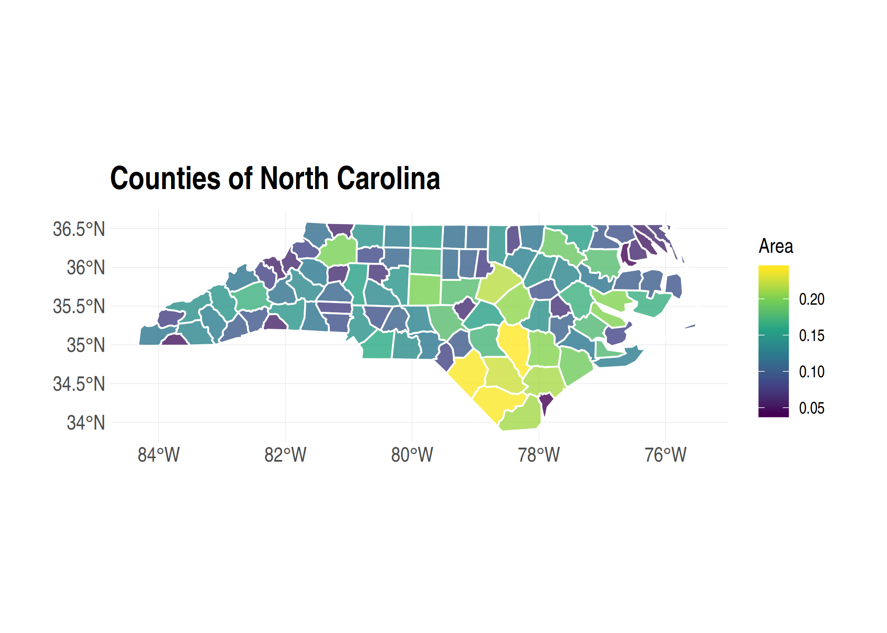
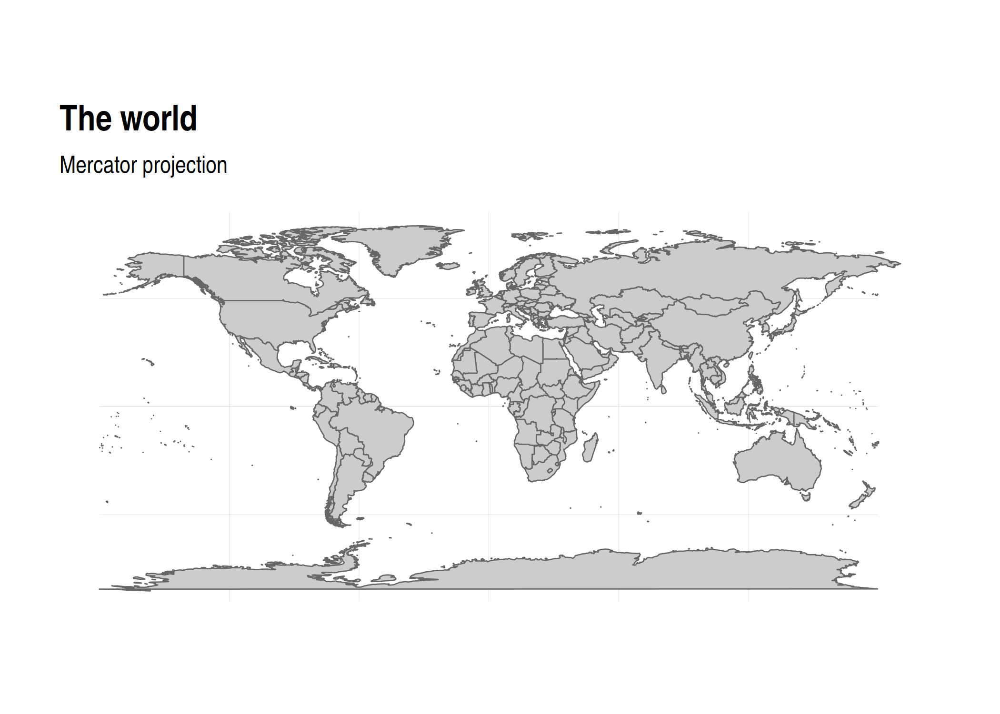
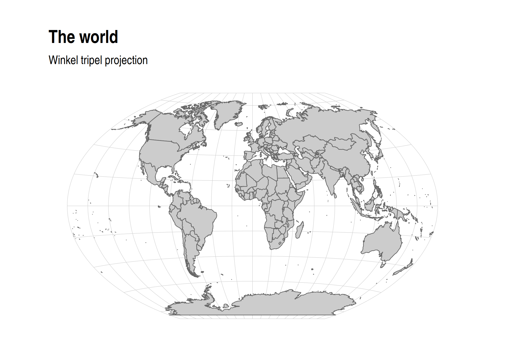
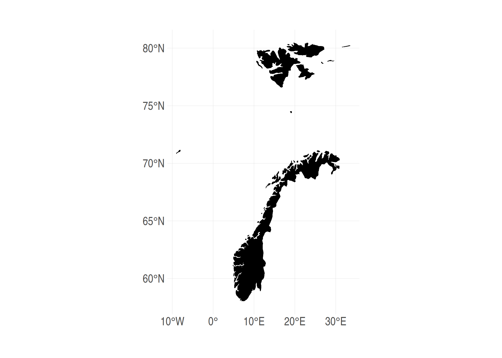
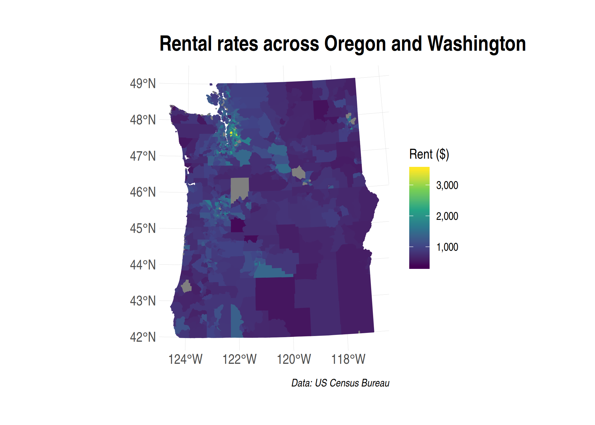

*Note: This lecture will focus only on **vector-based** spatial analysis. We will not cover **raster-based** spatial analysis, although this is an equally important subject. I'll provide some links to further resources at the bottom of this document for those of you who want to explore further on your own.*

## Requirements

### External libraries (requirements vary by OS)

We're going to be doing all our spatial analysis and plotting today in R. Behind the scenes, R provides bindings to powerful open-source GIS libraries. These include the [Geospatial Data Abstraction Library (GDAL)](http://www.gdal.org/) and [Interface to Geometry Engine Open Source (GEOS)](https://trac.osgeo.org/geos/) API suite, as well as access to projection and transformation operations from the [PROJ library](https://proj.org). You needn't worry about all this, but for the fact that you *may* need to install some of these external libraries first. The requirements vary by OS:

- **Linux:** Requirements vary by distribution. See [here](https://github.com/r-spatial/sf#linux).
- **Mac:** You should be fine to proceed directly to the R packages installation below. An unlikely exception is if you've configured R to install packages from source; in which case see [here](https://github.com/r-spatial/sf#macos).
- **Windows:** Same as Mac, you should be good to go unless you're installing from source. In which case, see [here](https://github.com/r-spatial/sf#windows).

### R packages 

- New: **sf**, **lwgeom**, **maps**, **mapdata**, **spData**, **tigris**, **tidycensus**, **leaflet**, **tmap**, **tmaptools**
- Already used: **tidyverse**, **data.table**, **hrbrthemes**

Truth be told, you only need a handful of the above libraries to do 95% of the spatial work that you're likely to encounter. But R's spatial ecosystem and support is extremely rich, so I'll try to walk through a number of specific use-cases in this lecture. Run the following code chunk to install (if necessary) and load everything.


```r
## Load and install the packages that we'll be using today
if (!require("pacman")) install.packages("pacman")
pacman::p_load(sf, tidyverse, data.table, hrbrthemes, lwgeom, rnaturalearth, maps, mapdata, spData, tigris, tidycensus, leaflet, tmap, tmaptools)
## My preferred ggplot2 plotting theme (optional)
theme_set(hrbrthemes::theme_ipsum())
```


### Census API key

Finally, we'll be accessing some data from the US Census Bureau through the [tidycensus package](https://walkerke.github.io/tidycensus/). This will require a Census API key, which you can request [here](https://api.census.gov/data/key_signup.html). Once that's done, you can set it using the `tidycensus::census_api_key()` function. I recommend using the "install = TRUE" option to save your key for future usage. See the function's help file for more information.


```r
tidycensus::census_api_key("PLACE_YOUR_API_KEY_HERE", install = TRUE)
```


## Introduction: CRS and map projections

Student presentation time. 

If you're reading this after the fact, I recommend [these](https://geocompr.robinlovelace.net/spatial-class.html#crs-intro) [two](https://proj.org/usage/quickstart.html) helpful resources. The very short version is that spatial data, like all coordinate-based systems, only make sense relative to some fixed point. That fixed point is what the Coordinate Reference Systems, or **CRS**, is trying to set. In R, we can define the CRS in one of two ways:

1. [EPSG code](https://epsg.org/home.html) (e.g. `3857`), or 

2. [PROJ string](https://proj.org/operations/index.html) (e.g. `"+proj=merc"`). 

We'll see examples of both implementations in in this lecture. For the moment, however, just know that they are equally valid ways of specifying CRS in R (albeit with with different strengths and weaknesses). You can search for many different CRS definitions [here](https://epsg.io/).

> **Aside:** There are some important updates happening in the world of CRS and geospatial software, which will percolate through to the R spatial ecosystem. Thanks to the hard work of various R package developers, these behind-the-scenes changes are unlikely to affect the way that you interact with spatial data in R. But they are worth understanding if you plan to make geospatial work a core component of your research. More [here](https://www.r-spatial.org/r/2020/03/17/wkt.html).

Similarly, whenever we try to plot (some part of) the earth on a map, we're effectively trying to **project** a 3-D object onto a 2-D surface. This will necessarily create some kind of distortion. Different types of map projections limit distortions for some parts of the world at the expense of others. For example, consider how badly the standard (but infamous) Mercator projection distorts the high latitudes in a global map ([source](https://twitter.com/neilrkaye/status/1050740679008296967)): 


**Bottom line:** You should always aim to choose a projection that best represents your specific area of study. I'll also show you how you can "re-orient" your projection to a specific latitude and longitude using the PROJ syntax. But first I'm obliged to share this [XKCD summary](https://xkcd.com/977/). (Do yourself a favour and click on the link.)

## Simple Features and the **sf** package

R has long provided excellent support for spatial analysis and plotting (primarily through the **sp**, **rgdal**, **rgeos**, and **raster** packages). However, until recently, the complex structure of spatial data necessitated a set of equally complex spatial objects in R. I won't go into details, but a spatial object (say, a [SpatialPolygonsDataFrame](https://cran.r-project.org/web/packages/sp/vignettes/intro_sp.pdf)) was typically comprised of several "layers" --- much like a list --- with each layer containing a variety of "slots". While this approach did (and still does) work perfectly well, the convoluted structure provided some barriers to entry for newcomers. It also made it very difficult to incorporate spatial data into the tidyverse ecosystem that we're familiar with. Luckily, all this has changed thanks to the advent of the **sf** package ([link](https://r-spatial.github.io/sf/)).

The "sf" stands for [**s**imple **f**eatures](https://en.wikipedia.org/wiki/Simple_Features), which is a simple (ahem) standard for representing the spatial geometries of real-world objects on a computer.^[See the [first](https://r-spatial.github.io/sf/articles/sf1.html) of the excellent **sf** vignettes for more details.] These objects --- i.e. "features" --- could include a tree, a building, a country's border, or the entire globe. The point is that they are characterised by a common set of rules, defining everything from how they are stored on our computer to which geometrical operations can be applied them. Of greater importance for our purposes, however, is the fact that **sf** represents these features in R as *data frames*. This means that all of our data wrangling skills from previous lectures can be applied to spatial data; say nothing of the specialized spatial functions that we'll cover next.

### Reading in spatial data

Somewhat confusingly, most of the functions in the **sf** package start with the prefix `st_`. This stands for *<b>s</b>patial and <b>t</b>emporal* and a basic command of this package is easy enough once you remember that you're probably looking for `st_SOMETHING()`.^[I rather wish they'd gone with a `sf_` prefix myself --- or at least created aliases for it --- but the package developers are apparently following [standard naming conventions from PostGIS](https://github.com/r-spatial/sf/issues/140#issuecomment-270029715).]

Let's demonstrate by reading in the North Carolina counties shapefile that comes bundled with **sf**. As you might have guessed, we're going to use the `st_read()` command and **sf** package will handle all the heavy lifting behind the scenes.


```r
# library(sf) ## Already loaded

## Location of our shapefile (here: bundled together with the sf package)
file_loc = system.file("shape/nc.shp", package="sf")

## Read the shapefile into R
nc = st_read(file_loc, quiet = TRUE)
```

### Simple Features as data frames

Let's print out the `nc` object that we just created and take a look at its structure.


```r
nc
```

```
## Simple feature collection with 100 features and 14 fields
## geometry type:  MULTIPOLYGON
## dimension:      XY
## bbox:           xmin: -84.32385 ymin: 33.88199 xmax: -75.45698 ymax: 36.58965
## epsg (SRID):    4267
## proj4string:    +proj=longlat +datum=NAD27 +no_defs
## First 10 features:
##     AREA PERIMETER CNTY_ CNTY_ID        NAME  FIPS FIPSNO CRESS_ID BIR74
## 1  0.114     1.442  1825    1825        Ashe 37009  37009        5  1091
## 2  0.061     1.231  1827    1827   Alleghany 37005  37005        3   487
## 3  0.143     1.630  1828    1828       Surry 37171  37171       86  3188
## 4  0.070     2.968  1831    1831   Currituck 37053  37053       27   508
## 5  0.153     2.206  1832    1832 Northampton 37131  37131       66  1421
## 6  0.097     1.670  1833    1833    Hertford 37091  37091       46  1452
## 7  0.062     1.547  1834    1834      Camden 37029  37029       15   286
## 8  0.091     1.284  1835    1835       Gates 37073  37073       37   420
## 9  0.118     1.421  1836    1836      Warren 37185  37185       93   968
## 10 0.124     1.428  1837    1837      Stokes 37169  37169       85  1612
##    SID74 NWBIR74 BIR79 SID79 NWBIR79                       geometry
## 1      1      10  1364     0      19 MULTIPOLYGON (((-81.47276 3...
## 2      0      10   542     3      12 MULTIPOLYGON (((-81.23989 3...
## 3      5     208  3616     6     260 MULTIPOLYGON (((-80.45634 3...
## 4      1     123   830     2     145 MULTIPOLYGON (((-76.00897 3...
## 5      9    1066  1606     3    1197 MULTIPOLYGON (((-77.21767 3...
## 6      7     954  1838     5    1237 MULTIPOLYGON (((-76.74506 3...
## 7      0     115   350     2     139 MULTIPOLYGON (((-76.00897 3...
## 8      0     254   594     2     371 MULTIPOLYGON (((-76.56251 3...
## 9      4     748  1190     2     844 MULTIPOLYGON (((-78.30876 3...
## 10     1     160  2038     5     176 MULTIPOLYGON (((-80.02567 3...
```

Now we can see the explicit data frame structure that was I talking about earlier. The object has the familiar tibble-style output that we're used to (e.g. it only prints the first 10 rows of the data). However, it also has some additional information in the header, like a description of the geometry type ("MULTIPOLYGON") and CRS (e.g. EPSG ID 4267). One thing I want to note in particular is the `geometry` column right at the end of the data frame. This geometry column is how **sf** package achieves much of its magic: It stores the geometries of each row element in its own list column.^[For example, we could print out the coordinates needed to plot the first element in our data frame, Ashe county, by typing `nc$geometry[[1]]`. In contrast, I invite you to see how complicated the structure of a traditional spatial object is by running, say, `str(as(nc, "Spatial"))`.] Since all we really care about are the key feature attributes --- county name, FIPS code, population size, etc. --- we can focus on those instead of getting bogged down by hundreds (or thousands or even millions) of coordinate points. In turn, this all means that our favourite **tidyverse** operations and syntax (including the pipe operator `%>%`) can be applied to spatial data. Let's review some examples, starting with plotting.

### Plotting and projection with **ggplot2**

Plotting **sf** objects is incredibly easy thanks to the package's integration with both base R `plot()` and **ggplot2**. I'm going to focus on the latter here, but feel free to experiment.^[Plotting **sf** objects with the base `plot` function is generally faster. However, I feel that you give up a lot of control and intuition by moving away from the layered, "graphics of grammar" approach of **ggplot2**.] The key geom to remember is `geom_sf()`. For example:


```r
# library(tidyverse) ## Already loaded

nc_plot = 
  ggplot(nc) +
  geom_sf(aes(fill = AREA), alpha=0.8, col="white") +
  scale_fill_viridis_c(name = "Area") +
  ggtitle("Counties of North Carolina")

nc_plot
```

<!-- -->

To reproject an **sf** object to a different CRS, we can use `sf::st_transform()`. 


```r
nc %>%
  st_transform(crs = "+proj=moll") %>% ## Reprojecting to a Mollweide CRS
  head(2) ## Saving vertical space
```

```
## Simple feature collection with 2 features and 14 fields
## geometry type:  MULTIPOLYGON
## dimension:      XY
## bbox:           xmin: -7160486 ymin: 4364317 xmax: -7077213 ymax: 4404770
## CRS:            +proj=moll
##    AREA PERIMETER CNTY_ CNTY_ID      NAME  FIPS FIPSNO CRESS_ID BIR74 SID74
## 1 0.114     1.442  1825    1825      Ashe 37009  37009        5  1091     1
## 2 0.061     1.231  1827    1827 Alleghany 37005  37005        3   487     0
##   NWBIR74 BIR79 SID79 NWBIR79                       geometry
## 1      10  1364     0      19 MULTIPOLYGON (((-7145980 43...
## 2      10   542     3      12 MULTIPOLYGON (((-7118089 43...
```

Or, we can specify a common projection directly in the ggplot call using `coord_sf()`. This is often the most convenient approach when you are combining multiple **sf** data frames in the same plot.


```r
nc_plot +
  coord_sf(crs = "+proj=moll") +
  labs(subtitle = "Mollweide projection") 
```

<!-- -->

Note that we used a PROJ string to define the CRS reprojection above. But we could easily use an EPSG code instead. For example, here's the [NC state plane](https://epsg.io/32119) projection.


```r
nc_plot +
  coord_sf(crs = 32119) +
  labs(subtitle = "NC state plane") 
```

<!-- -->

### Data wrangling with **dplyr** and **tidyr**

As I keep saying, the tidyverse approach to data wrangling carries over very smoothly to **sf** objects. For example, the standard **dplyr** verbs like `filter()`, `mutate()` and `select()` all work:


```r
nc %>%
  filter(NAME %in% c("Camden", "Durham", "Northampton")) %>%
  mutate(AREA_1000 = AREA*1000) %>%
  select(NAME, contains("AREA"), everything())
```

```
## Simple feature collection with 3 features and 15 fields
## geometry type:  MULTIPOLYGON
## dimension:      XY
## bbox:           xmin: -79.01814 ymin: 35.85786 xmax: -75.95718 ymax: 36.55629
## epsg (SRID):    4267
## proj4string:    +proj=longlat +datum=NAD27 +no_defs
##          NAME  AREA AREA_1000 PERIMETER CNTY_ CNTY_ID  FIPS FIPSNO
## 1 Northampton 0.153       153     2.206  1832    1832 37131  37131
## 2      Camden 0.062        62     1.547  1834    1834 37029  37029
## 3      Durham 0.077        77     1.271  1908    1908 37063  37063
##   CRESS_ID BIR74 SID74 NWBIR74 BIR79 SID79 NWBIR79
## 1       66  1421     9    1066  1606     3    1197
## 2       15   286     0     115   350     2     139
## 3       32  7970    16    3732 10432    22    4948
##                         geometry
## 1 MULTIPOLYGON (((-77.21767 3...
## 2 MULTIPOLYGON (((-76.00897 3...
## 3 MULTIPOLYGON (((-79.01814 3...
```

You can also perform `group_by()` and `summarise()` operations as per normal (see [here](http://strimas.com/r/tidy-sf/) for a nice example). Furthermore, the **dplyr** family of [join functions](https://dplyr.tidyverse.org/reference/join.html) also work, which can be especially handy when combining different datasets by (say) FIPS code or some other *attribute*. However, this presumes that only one of the objects has a specialized geometry column. In other words, it works when you are joining an **sf** object with a normal data frame. In cases where you want to join two **sf** objects based on their *geometries*, there's a specialized `st_join()` function. I provide an example of this latter operation in the section on [geometric operations](#geometric) below.

And, just to show that we've got the bases covered, you can also implement your favourite **tidyr** verbs. For example, we can `tidyr::gather()` the data to long format, which is useful for facetted plotting.^[In case you're wondering: the newer `tidyr::pivot_*` functions [do not](https://github.com/r-spatial/sf/pull/1151) yet work with **sf** objects.] Here I demonstrate using the "BIR74" and "BIR79" columns (i.e. the number of births in each county in 1974 and 1979, respectively).


```r
nc %>% 
  select(county = NAME, BIR74, BIR79, -geometry) %>% 
  gather(year, births, BIR74, BIR79) %>% 
  mutate(year = gsub("BIR", "19", year)) %>%
  ggplot() +
  geom_sf(aes(fill = births), alpha=0.8, col="white") +
  scale_fill_viridis_c(name = "Births", labels = scales::comma) +
  facet_wrap(~year, ncol = 1) +
  labs(title = "Births by North Carolina county") 
```

<!-- -->


### Specialized geometric operations {#geometric}

Alongside all the tidyverse functionality, the **sf** package comes with a full suite of geometrical operations. You should take a look at at the [third **sf** vignette](https://r-spatial.github.io/sf/articles/sf3.html#geometrical-operations) or the [*Geocomputation with R*](https://geocompr.robinlovelace.net/geometric-operations.html#geo-vec) book to get a complete overview. However, here are a few examples to get you started:

#### Unary operations

So-called *unary* operations are applied to a single object. For instance, you can "melt" sub-elements of an **sf** object (e.g. counties) into larger elements (e.g. states) using `sf::st_union()`:


```r
nc %>% 
  st_union() %>% 
  ggplot() +
  geom_sf(fill=NA, col="black") +
  labs(title = "Outline of North Carolina") 
```

<!-- -->

Or, you can get the `st_area()`, `st_centroid()`, `st_boundary()`, `st_buffer()`, etc. of an object using the appropriate command. For example:


```r
nc %>% st_area() %>% head(5) ## Only show the area of the first five counties to save space.
```

```
## Units: [m^2]
## [1] 1137388604  611077263 1423489919  694546292 1520740530
```

And:


```r
nc_centroid = st_centroid(nc)

ggplot(nc) +
  geom_sf(fill = "black", alpha = 0.8, col = "white") +
  geom_sf(data = nc_centroid, col = "red") + ## Notice how easy it is to combine different sf objects
  labs(
    title = "Counties of North Carolina",
    subtitle = "Centroids in red"
    )
```

<!-- -->

#### Binary operations

Another set of so-called *binary* operations can be applied to multiple objects. So, we can get things like the distance between two spatial objects using `sf::st_distance()`. In the below example, I'm going to get the distance from Ashe county to Brunswich county, as well as itself. The latter is just a silly addition to show that we can easily make multiple pairwise comparisons, even when the distance from one element to another is zero.


```r
ashe_brunswick = nc %>% filter(NAME %in% c("Ashe", "Brunswick"))
brunswick = nc %>% filter(NAME %in% c("Brunswick"))

## Use "by_element = TRUE" to give a vector instead of the default pairwise matrix
ab_dist = st_distance(ashe_brunswick, brunswick, by_element = TRUE)
# Units: [m]
# [1] 347930.7      0.0

## We can use the `units` package (already installed as sf dependency) to convert to kilometres 
ab_dist = ab_dist %>% units::set_units(km) %>% round()
# Units: [km]
# [1] 348   0

ggplot(nc) +
  geom_sf(fill = "black", alpha = 0.8, col = "white") +
  geom_sf(data = nc %>% filter(NAME %in% c("Ashe", "Brunswick")), aes(fill = NAME), col = "white") +  
  labs(
    title = "Calculating distances",
    subtitle = paste0("The distance between Ashe and Brunswick is ", ab_dist[1], " km")
    ) +
  theme(legend.title = element_blank())
```

<!-- -->


#### Binary logical operations

A sub-genre of binary geometric operations falls into the category of logic rules --- typically characterising the way that geometries relate in space. (Do they overlap, etc.) 

For example, we can calculate the intersection of different spatial objects using `sf::st_intersection()`. For this next example, I'm going to use two new spatial objects: 1) A regional map of France from the **maps** package and 2) part of the Seine river network (including its Marne and Yonne tributaries) from the **spData** package. Don't worry too much about the process used for loading these datasets; I'll cover that in more depth shortly. For the moment, just focus on the idea that we want to see which adminstrative regions are intersected by the river network. Start by plotting all of the data to get a visual sense of the overlap:


```r
## Get the data
france = st_as_sf(map('france', plot = FALSE, fill = TRUE))
data("seine", package = "spData")

## Make sure they have the same projection
seine = st_transform(seine, crs = st_crs(france))

ggplot() + 
  geom_sf(data = france, alpha = 0.8, fill = "black", col = "gray50") + 
  geom_sf(data = seine, col = "#05E9FF", lwd = 1) + 
  labs(
    title = "Administrative regions of France",
    subtitle = "Also showing the Seine, Marne and Yonne rivers"
    )
```

<!-- -->

Now let's limit it to the intersected regions:


```r
france_intersected = st_intersection(france, seine)
france_intersected
```

```
## Simple feature collection with 22 features and 2 fields
## geometry type:  GEOMETRY
## dimension:      XY
## bbox:           xmin: 0.4931747 ymin: 47.04007 xmax: 5.407725 ymax: 49.52717
## geographic CRS: WGS 84
## First 10 features:
##                     ID  name                           geom
## 6                Aisne Marne LINESTRING (3.608053 49.089...
## 14               Marne Marne LINESTRING (4.872966 48.637...
## 17      Seine-et-Marne Marne LINESTRING (3.254238 48.977...
## 19   Seine-Saint-Denis Marne LINESTRING (2.595133 48.876...
## 25        Val-de-Marne Marne LINESTRING (2.53346 48.8581...
## 30         Haute-Marne Marne LINESTRING (5.407725 47.877...
## 5       Seine-Maritime Seine LINESTRING (1.071621 49.309...
## 12                Eure Seine LINESTRING (1.514229 49.077...
## 14.1             Marne Seine LINESTRING (3.868337 48.522...
## 15           Val-Doise Seine LINESTRING (2.286567 48.954...
```

Note that `st_intersection()` only preserves *exact* points of overlap. As in, this is the exact path that the rivers follow within these regions. We can see this more explicitly in map form:


```r
france_intersected %>%
  ggplot() + 
  geom_sf(alpha = 0.8, aes(fill = ID, col = ID)) + 
  labs(
    title = "Seine, Marne and Yonne rivers",
    caption = "Colours depict French administrative regions"
    ) +
  theme(legend.title = element_blank())
```

<!-- -->

If we instead wanted to plot the subsample of intersected provinces (i.e. keeping their full geometries), we have a couple options. We could filter the `france` object by matching its region IDs with the `france_intersected` object. However, a more direct option is to use the `sf::st_join()` function which matches objects based on overlapping (i.e. intersecting) geometries:


```r
st_join(france, seine) %>% 
  filter(!is.na(name)) %>% ## Get rid of regions with no overlap
  distinct(ID, .keep_all = T) %>% ## Some regions are duplicated b/c two branches of the river network flow through them 
  ggplot() + 
  geom_sf(alpha = 0.8, fill = "black", col = "gray50") + 
  geom_sf(data = seine, col = "#05E9FF", lwd = 1) + 
  labs(title = "Intersected regions only") 
```

<!-- -->

That's about as much **sf** functionality as I can show you for today. The remaining part of this lecture will cover some additional mapping considerations and some bonus spatial R "swag". However, I'll try to slip in a few more **sf**-specific operations along the way.


### Aside: **sf** and **data.table**

**sf** objects are designed to integrate with a **tidyverse** workflow. They can also be made to work a **data.table** workflow too, but the integration is not as slick. This is a [known issue](https://github.com/Rdatatable/data.table/issues/2273) and I'll only just highlight a few very brief considerations.

You can convert an **sf** object into a data.table. But note that the key geometry column appears to lose its attributes.


```r
# library(data.table) ## Already loaded

nc_dt = as.data.table(nc)
head(nc_dt)
```

```
##     AREA PERIMETER CNTY_ CNTY_ID        NAME  FIPS FIPSNO CRESS_ID BIR74 SID74
## 1: 0.114     1.442  1825    1825        Ashe 37009  37009        5  1091     1
## 2: 0.061     1.231  1827    1827   Alleghany 37005  37005        3   487     0
## 3: 0.143     1.630  1828    1828       Surry 37171  37171       86  3188     5
## 4: 0.070     2.968  1831    1831   Currituck 37053  37053       27   508     1
## 5: 0.153     2.206  1832    1832 Northampton 37131  37131       66  1421     9
## 6: 0.097     1.670  1833    1833    Hertford 37091  37091       46  1452     7
##    NWBIR74 BIR79 SID79 NWBIR79 geometry
## 1:      10  1364     0      19  <XY[1]>
## 2:      10   542     3      12  <XY[1]>
## 3:     208  3616     6     260  <XY[1]>
## 4:     123   830     2     145  <XY[3]>
## 5:    1066  1606     3    1197  <XY[1]>
## 6:     954  1838     5    1237  <XY[1]>
```

The good news is that all of this information is still there. It's just hidden from display.


```r
nc_dt$geometry
```

```
## Geometry set for 100 features 
## geometry type:  MULTIPOLYGON
## dimension:      XY
## bbox:           xmin: -84.32385 ymin: 33.88199 xmax: -75.45698 ymax: 36.58965
## geographic CRS: NAD27
## First 5 geometries:
```

```
## MULTIPOLYGON (((-81.47276 36.23436, -81.54084 3...
```

```
## MULTIPOLYGON (((-81.23989 36.36536, -81.24069 3...
```

```
## MULTIPOLYGON (((-80.45634 36.24256, -80.47639 3...
```

```
## MULTIPOLYGON (((-76.00897 36.3196, -76.01735 36...
```

```
## MULTIPOLYGON (((-77.21767 36.24098, -77.23461 3...
```

What's the upshot? Well, basically it means that you have to refer to this "geometry" column explicitly whenever you implement a spatial operation. For example, here's a repeat of the `st_union()` operation that we saw earlier. Note that I explicitly refer to the "geometry" column both for the `st_union()` operation (which, moreover, takes place in the
"j" data.table slot) and when assigning the aesthetics for the `ggplot()` call.


```r
nc_dt[, .(geometry = st_union(geometry))] %>% ## Explicitly refer to 'geometry' col
    ggplot(aes(geometry = geometry)) +        ## And here again for the aes()
    geom_sf(fill=NA, col="black") +
    labs(title = "Outline of North Carolina", 
         subtitle = "This time brought to by data.table") 
```

```
## although coordinates are longitude/latitude, st_union assumes that they are planar
```

<!-- -->

Of course, it's also possible to efficiently convert between the two classes --- e.g. with `as.data.table()` and `st_as_sf()` --- depending on what a particular section of code does (data wrangling or spatial operation). I find that often use this approach in my own work.


## Where to get map data

As our first North Carolina examples demonstrate, you can easily import external shapefiles, KML files, etc., into R. Just use the generic `sf::st_read()` function on any of these formats and the **sf** package will take care of the rest. However, we've also seen with the France example that you might not even need an external shapefile. Indeed, R provides access to a large number of base maps --- e.g. countries of the world, US states and counties, etc. --- through the **maps**, (higher resolution) **mapdata** and **spData** packages, as well as a whole ecosystem of more specialized GIS libraries.^[The list of specialised maps packages is far too long for me to cover here. You can get [marine regions](https://github.com/ropensci/mregions), [protected areas](https://github.com/ropenscilabs/rwdpa), [nightlights](https://github.com/chrisvwn/Rnightlights), ..., etc., etc.] To convert these maps into "**sf**-friendly" data frame format, we can use the `sf::st_as_sf()` function as per the below examples.

### Example 1: The World


```r
# library(maps) ## Already loaded

world = st_as_sf(map("world", plot = FALSE, fill = TRUE))

world_map = 
  ggplot(world) + 
  geom_sf(fill = "grey80", col = "grey40", lwd = 0.3) +
  labs(
    title = "The world", 
    subtitle = paste("EPSG:", st_crs(world)$epsg)
    )
world_map
```

<!-- -->

All of the usual **sf** functions and transformations can then be applied. For example, we can reproject the above world map onto the [Lambert Azimuthal Equal Area](https://proj.org/operations/projections/laea.html) projection (and further orientate it at the South Pole) as follows.


```r
world_map +
  coord_sf(crs = "+proj=laea +y_0=0 +lon_0=155 +lat_0=-90") +
  labs(subtitle = "Lambert Azimuthal Equal Area projection")
```

<!-- -->

### Several digressions on projection considerations

#### Winkel tripel projection

As we've already seen, most map projections work great "out of the box" with **sf**. One niggling and notable exception is the [Winkel tripel projection](https://en.wikipedia.org/wiki/Winkel_tripel_projection). This is the preferred global map projection of *National Geographic* and requires a bit more work to get it to play nicely with **sf** and **ggplot2** (as detailed in [this thread](https://github.com/r-spatial/sf/issues/509)). Here's a quick example of how to do it:


```r
# library(lwgeom) ## Already loaded

wintr_proj = "+proj=wintri +datum=WGS84 +no_defs +over"

world_wintri = lwgeom::st_transform_proj(world, crs = wintr_proj)

## Don't necessarily need a graticule, but if you do then define it manually:
gr = 
  st_graticule(lat = c(-89.9,seq(-80,80,20),89.9)) %>%
  lwgeom::st_transform_proj(crs = wintr_proj)

ggplot(world_wintri) + 
  geom_sf(data = gr, color = "#cccccc", size = 0.15) + ## Manual graticule
  geom_sf(fill = "grey80", col = "grey40", lwd = 0.3) +
  coord_sf(datum = NA) +
  theme_ipsum(grid = F) +
  labs(title = "The world", subtitle = "Winkel tripel projection")
```

<!-- -->


#### Equal Earth projection

The latest and greatest projection, however, is the "[Equal Earth](http://equal-earth.com)" projection. This _does_ work well out of the box, in part due to the `ne_countries` dataset that comes bundled with the **rnaturalearth** package ([link](https://github.com/ropensci/rnaturalearth)). I'll explain that second part of the previous sentence in moment. But first let's see the Equal Earth projection in action.


```r
# library(rnaturalearth) ## Already loaded

countries = 
  ne_countries(returnclass = "sf") %>%
  st_transform(8857) ## Transform to equal earth projection
  # st_transform("+proj=eqearth +wktext") ## PROJ string alternative

ggplot(countries) +
  geom_sf(fill = "grey80", col = "grey40", lwd = 0.3) +
  labs(title = "The world", subtitle = "Equal Earth projection")
```

<!-- -->

#### Pacfic-centered maps and other polygon mishaps

As noted, the `rnaturalearth::ne_countries` spatial data frame is important for correctly displaying the Equal Earth projection. On the face of it, this looks pretty similar to our `maps::world` spatial data frame from earlier. They both contain polygons of all the countries in the world and appear to have similar default projections. However, some underlying nuances in how those polygons are constructed allows us avoid some undesirable visual artefacts that arise when reprojecting to the Equal Earth projection. Consider: 


```r
world %>%
  st_transform(8857) %>% ## Transform to equal earth projection
  ggplot() +
  geom_sf(fill = "grey80", col = "grey40", lwd = 0.3) +
  labs(title = "The... uh, world", subtitle = "Projection fail")
```

<!-- -->

These types of visual artefacts are particularly common for Pacific-centered maps and, in that case, arise from polygons extending over the Greenwich prime meridian. It's a suprisingly finicky problem to solve. Even the **rnaturalearth** doesn't do a good job. Luckily, Nate Miller has you covered with an [excellent guide](https://github.com/natemiller/mapping) to set you on the right track. 


### Example 2: A single country (i.e. Norway)

The **maps** and **mapdata** packages have detailed county- and province-level data for several individual nations. We've already seen this with France, but it includes the USA, New Zealand and several other nations. However, we can still use it to extract a specific country's border using some intuitive syntax. For example, we could plot a base map of Norway as follows.


```r
norway = st_as_sf(map("world", "norway", plot = FALSE, fill = TRUE))

## For a hi-resolution map (if you *really* want to see all the fjords):
# norway = st_as_sf(map("worldHires", "norway", plot = FALSE, fill = TRUE))

norway %>%
  ggplot() + 
  geom_sf(fill="black", col=NA)
```

<!-- -->

Hmmm. Looks okay, but I don't really want to include non-mainland territories like Svalbaard (to the north) and the Faroe Islands (to the east). This gives me the chance to show off another handy function, `sf::st_crop()`, which I'll use to crop our **sf** object to a specific extent (i.e. rectangle). While I am at, we could also improve the projection. The Norwegian Mapping Authority recommends the ETRS89 / UTM projection, for which we can easily obtain the equivalent EPSG code (i.e. 25832) from [this website](https://epsg.io/25832).


```r
norway %>%
  st_crop(c(xmin=0, xmax=35, ymin=0, ymax=72)) %>%
  st_transform(crs = 25832) %>%
  ggplot() + 
  geom_sf(fill="black", col=NA)
```

<!-- -->

There you go. A nice-looking map of Norway. Fairly appropriate that it resembles a gnarly black metal guitar.

> **Aside:** I recommend detaching the **maps** package once you're finished using it, since it avoids potential namespace conflicts with `purrr::map`.


```r
detach(package:maps) ## To avoid potential purrr::map() conflicts
```


## BONUS 1: US Census data with **tidycensus** and **tigris** {#census}

Working with Census data has traditionally quite a pain. You need to register on the website, then download data from various years or geographies separately, merge these individual files, etc. Thankfully, this too has recently become much easier thanks to the Census API and --- for R at least --- the **tigris** and **tidycensus** packages from [Kyle Walker](http://walkerke.github.io/) (a UO grad). This next section will closely follow a [tutorial](http://walkerke.github.io/2017/06/comparing-metros/) on his website.

> NOTE: Before continuing with this section, you will first need to [request an API key](https://api.census.gov/data/key_signup.html) from the Census. Once that's done, you can set it using the `tidycensus::census_api_key()` function. I recommend using the "install = TRUE" option to save your key for future useage. 

We start by loading the packages and setting some options for optimized use with the **sf** package.


```r
# library(tidycensus) ## Already loaded
# library(tigris) ## Already loaded
options(tigris_class = "sf")
options(tigris_use_cache = TRUE)
# census_api_key("YOUR KEY HERE", install = TRUE)
```

Let's say that our goal is to provide a snapshot of Census rental estimates across different cities in the Pacific Northwest. We start by downloading tract-level rental data for Oregon and Washington using the `tidycensus::get_acs()` function. Note that you'll need to look up the correct ID variable (in this case: "DP04_0134").


```r
rent = 
  tidycensus::get_acs(
    geography = "tract", variables = "DP04_0134",
    state = c("WA", "OR"), geometry = TRUE
    )
rent
```

```
## Simple feature collection with 2292 features and 5 fields (with 4 geometries empty)
## geometry type:  MULTIPOLYGON
## dimension:      XY
## bbox:           xmin: -124.7631 ymin: 41.99179 xmax: -116.4635 ymax: 49.00249
## epsg (SRID):    4269
## proj4string:    +proj=longlat +ellps=GRS80 +towgs84=0,0,0,0,0,0,0 +no_defs
## # A tibble: 2,292 x 6
##    GEOID  NAME       variable estimate   moe                       geometry
##    <chr>  <chr>      <chr>       <dbl> <dbl>             <MULTIPOLYGON [°]>
##  1 53001… Census Tr… DP04_01…      675    54 (((-118.9798 47.26171, -118.5…
##  2 53001… Census Tr… DP04_01…      885    91 (((-118.9821 46.95662, -118.9…
##  3 53001… Census Tr… DP04_01…      658   172 (((-119.3694 46.79559, -119.3…
##  4 53001… Census Tr… DP04_01…      681   128 (((-119.1791 46.83331, -119.1…
##  5 53001… Census Tr… DP04_01…      766   247 (((-119.1905 46.79951, -119.1…
##  6 53003… Census Tr… DP04_01…      770    44 (((-117.48 46.12199, -117.419…
##  7 53003… Census Tr… DP04_01…     1060   248 (((-117.4208 46.33866, -117.4…
##  8 53003… Census Tr… DP04_01…      658    85 (((-117.0722 46.42472, -117.0…
##  9 53003… Census Tr… DP04_01…      687    46 (((-117.0796 46.41444, -117.0…
## 10 53003… Census Tr… DP04_01…      673   113 (((-117.0608 46.40103, -117.0…
## # … with 2,282 more rows
```

This returns an **sf** object, which we can plot directly.


```r
rent %>%
  ggplot() + 
  geom_sf(aes(fill = estimate, color = estimate)) + 
  coord_sf(crs = 26910) + 
  scale_fill_viridis_c(name = "Rent ($)", labels = scales::comma) + 
  scale_color_viridis_c(name = "Rent ($)", labels = scales::comma) +
  labs(
    title = "Rental rates across Oregon and Washington", 
    caption = "Data: US Census Bureau"
    ) 
```

<!-- -->

Hmmm, looks like you want to avoid renting in Seattle if possible... 

The above map is very detailed. Perhaps we're not interested in the entire set of tract level data, but would rather get a sense of rents within some well-defined metropolitan areas? The **tigris** package has you covered here. For example, let's say we want to compare average rents across three Oregon/Washington metros: Portland (and surrounds), Corvallis and Eugene.


```r
or_metros = 
  tigris::core_based_statistical_areas(cb = TRUE) %>%
  # filter(GEOID %in% c("21660", "18700", "38900")) %>% ## Could use GEOIDs directly if you know them 
  filter(grepl("Portland|Corvallis|Eugene", NAME)) %>%
  filter(grepl("OR", NAME)) %>% ## Filter out Portland, ME
  select(metro_name = NAME)
```

Now we do a spatial join on our two data sets using the `sf::st_join()` function.


```r
or_rent = 
  st_join(
    rent, 
    or_metros, 
    join = st_within, left = FALSE
    ) 
or_rent
```

```
## Simple feature collection with 595 features and 6 fields
## geometry type:  MULTIPOLYGON
## dimension:      XY
## bbox:           xmin: -124.1587 ymin: 43.43739 xmax: -121.5144 ymax: 46.38863
## geographic CRS: NAD83
## # A tibble: 595 x 7
##    GEOID  NAME   variable estimate   moe                    geometry metro_name 
##  * <chr>  <chr>  <chr>       <dbl> <dbl>          <MULTIPOLYGON [°]> <chr>      
##  1 53011… Censu… DP04_01…     1272    62 (((-122.5589 45.62102, -12… Portland-V…
##  2 53011… Censu… DP04_01…     1185   112 (((-122.5528 45.69343, -12… Portland-V…
##  3 53011… Censu… DP04_01…      866    64 (((-122.6143 45.63259, -12… Portland-V…
##  4 53011… Censu… DP04_01…     1268    62 (((-122.5282 45.60814, -12… Portland-V…
##  5 53011… Censu… DP04_01…     1268   267 (((-122.6002 45.78026, -12… Portland-V…
##  6 53011… Censu… DP04_01…     1274   107 (((-122.5603 45.66535, -12… Portland-V…
##  7 53011… Censu… DP04_01…     1092    77 (((-122.3562 45.57666, -12… Portland-V…
##  8 53011… Censu… DP04_01…     1427   106 (((-122.6576 45.69122, -12… Portland-V…
##  9 53011… Censu… DP04_01…     1148   132 (((-122.667 45.6664, -122.… Portland-V…
## 10 53011… Censu… DP04_01…     1074    76 (((-122.6716 45.62722, -12… Portland-V…
## # … with 585 more rows
```

One useful way to summarize this data and compare across metros is with a histogram. Note that "regular" **ggplot2** geoms and functions play perfectly nicely with **sf** objects (i.e. we aren't limited to `geom_sf()`).


```r
or_rent %>%
  ggplot(aes(x = estimate)) + 
  geom_histogram() + 
  facet_wrap(~metro_name) 
```

<!-- -->


## BONUS 2: Interactive maps with **leaflet**

Now that you've grasped the basic properties of **sf** objects and how to plot them using **ggplot2**, its time to scale up with interactive maps.^[The ability to easily plot interactive maps from R is one of the main reasons that I switched all of my public presentations from PDFs to RMarkdown-driven HMTL.] You have several package options here, but I think the best are **leaflet** (and derivatives) and **plotly**. We've already covered the latter in a previous lecture, so I'll simply redirect interested parties to [this link](https://plot.ly/r/maps-sf/) for some **sf**-specific examples. To expand on the former in more depth, [leaflet](https://leafletjs.com/) is a lightweight JavaScript library for interactive mapping that has become extremely popular in recent years... and with good reason. The good people at RStudio have kindly [packaged a version](https://rstudio.github.io/leaflet/) of **leaflet** for R, which basically acts as a wrapper to the underlying JavaScript library. 

The **leaflet** syntax is a little different to what you've seen thus far and I strongly encourage you to visit the package's [excellent website](https://rstudio.github.io/leaflet/) for the full set of options. However, a key basic principle that it shares with **ggplot2** is that you *build your plot in layers*. Here's an example adapted from [Julia Silge](https://juliasilge.com/blog/using-tidycensus/), which builds on the **tidycensus** package that we saw above. This time, our goal is to plot county-level population densities for Oregon as a whole and produce some helpful popup text if a user clicks on a particular county. First, we download the data using **tidycensus** and inspect the resulting data frame.


```r
# library(tidycensus) ## Already loaded

oregon = 
  get_acs(
    geography = "county", variables = "B01003_001",
    state = "OR", geometry = TRUE
    ) 
oregon
```

```
## Simple feature collection with 36 features and 5 fields
## geometry type:  MULTIPOLYGON
## dimension:      XY
## bbox:           xmin: -124.5662 ymin: 41.99179 xmax: -116.4635 ymax: 46.29204
## epsg (SRID):    4269
## proj4string:    +proj=longlat +ellps=GRS80 +towgs84=0,0,0,0,0,0,0 +no_defs
## First 10 features:
##    GEOID                     NAME   variable estimate moe
## 1  41001     Baker County, Oregon B01003_001    15980  NA
## 2  41003    Benton County, Oregon B01003_001    88249  NA
## 3  41005 Clackamas County, Oregon B01003_001   399962  NA
## 4  41007   Clatsop County, Oregon B01003_001    38021  NA
## 5  41009  Columbia County, Oregon B01003_001    50207  NA
## 6  41011      Coos County, Oregon B01003_001    62921  NA
## 7  41013     Crook County, Oregon B01003_001    21717  NA
## 8  41015     Curry County, Oregon B01003_001    22377  NA
## 9  41017 Deschutes County, Oregon B01003_001   175321  NA
## 10 41019   Douglas County, Oregon B01003_001   107576  NA
##                          geometry
## 1  MULTIPOLYGON (((-118.5194 4...
## 2  MULTIPOLYGON (((-123.8167 4...
## 3  MULTIPOLYGON (((-122.8679 4...
## 4  MULTIPOLYGON (((-123.5989 4...
## 5  MULTIPOLYGON (((-123.3665 4...
## 6  MULTIPOLYGON (((-124.4626 4...
## 7  MULTIPOLYGON (((-121.1083 4...
## 8  MULTIPOLYGON (((-124.3239 4...
## 9  MULTIPOLYGON (((-122.0019 4...
## 10 MULTIPOLYGON (((-124.2145 4...
```

So, the popup text of interest is held within the "NAME" and "estimate" columns. I'll use a bit of regular expression work to extract the county name from the "NAME" column (i.e. without the state) and then build up the map layer by layer. Note that the **leaflet** syntax requires that I prepend variables names with a tilde (`~`) when I refer to them in the plot building process. This tilde operates in much the same way as the asthetics (`aes()`) function does in **ggplot2**. One other thing to note is that I need to define a colour palette --- which I'll call `col_pal` here --- separately from the main plot. This is a bit of an inconvenience if you're used to the fully-integrated **ggplot2** API, but only a small one. 


```r
# library(leaflet) ## Already loaded

col_pal = colorQuantile(palette = "viridis", domain = oregon$estimate, n = 10)

oregon %>%
  mutate(county = gsub(",.*", "", NAME)) %>% ## Get rid of everything after the first comma
  st_transform(crs = 4326) %>%
  leaflet(width = "100%") %>%
  addProviderTiles(provider = "CartoDB.Positron") %>%
  addPolygons(
    popup = ~paste0(county, "<br>", "Population: ", prettyNum(estimate, big.mark=",")),
    stroke = FALSE,
    smoothFactor = 0,
    fillOpacity = 0.7,
    color = ~col_pal(estimate)
    ) %>%
  addLegend(
    "bottomright", 
    pal = col_pal, 
    values = ~estimate,
    title = "Population percentiles",
    opacity = 1
    )
```

```{=html}
<div id="htmlwidget-9dc25d4c47b4e188be5c" style="width:100%;height:1500px;" class="leaflet html-widget"></div>
<script type="application/json" data-for="htmlwidget-9dc25d4c47b4e188be5c">{"x":{"options":{"crs":{"crsClass":"L.CRS.EPSG3857","code":null,"proj4def":null,"projectedBounds":null,"options":{}}},"calls":[{"method":"addProviderTiles","args":["CartoDB.Positron",null,null,{"errorTileUrl":"","noWrap":false,"detectRetina":false}]},{"method":"addPolygons","args":[[[[{"lng":[-122.001940817236,-122.001619800356,-122.000091792915,-121.997751791451,-121.995522792037,-121.9921367954,-121.986656796747,-121.981142796672,-121.977010797405,-121.968360796937,-121.964914795754,-121.965696793831,-121.967947794109,-121.969512788185,-121.972143783055,-121.973738777576,-121.9745377725,-121.978131767555,-121.980505760301,-121.980615752719,-121.98243874719,-121.985629723929,-121.98690671969,-121.985713713675,-121.986263698653,-121.985712692087,-121.984515688913,-121.984746685223,-121.983115677951,-121.981095671717,-121.980828663869,-121.979315652602,-121.97956964465,-121.978220634746,-121.976113630866,-121.973484630632,-121.972885627525,-121.973080619749,-121.972418617177,-121.967822611583,-121.966913609135,-121.967175605303,-121.971791597985,-121.973494592864,-121.975175579449,-121.974625571514,-121.973121568914,-121.973584563763,-121.975838549593,-121.976996546726,-121.978258539555,-121.977945537405,-121.975452531624,-121.973685530379,-121.975567519902,-121.975169514727,-121.978285504909,-121.979644499044,-121.981003490363,-121.981244486119,-121.97567348525,-121.97480648401,-121.974137480915,-121.970433488329,-121.971987490086,-121.97011550128,-121.968160506708,-121.967091512578,-121.962094529468,-121.96090753211,-121.965518526609,-121.969044524614,-121.969605528077,-121.968890539997,-121.965376552468,-121.962540559755,-121.96050356867,-121.964022565024,-121.966182565287,-121.967386567713,-121.967840575471,-121.967153581045,-121.967344585646,-121.968378594397,-121.966650599558,-121.964400607935,-121.964920610726,-121.964533616438,-121.963750620988,-121.967763619566,-121.970726614506,-121.974367604596,-121.975456602964,-121.975561604331,-121.974274616663,-121.974752623458,-121.973491637898,-121.973653642047,-121.975260635975,-121.97660763286,-121.977795632419,-121.976759637852,-121.976048648715,-121.97522265221,-121.974799658437,-121.975188660666,-121.97439666482,-121.974397668393,-121.976077671198,-121.976169675947,-121.974892684051,-121.975416684097,-121.975354691657,-121.975109696448,-121.972871704479,-121.972927708034,-121.968544723631,-121.965427732287,-121.962042737454,-121.961479741079,-121.959458749138,-121.957496753772,-121.956462758988,-121.952956769277,-121.951336777177,-121.951387780416,-121.952634779978,-121.952252783865,-121.947398799801,-121.945206806309,-121.943778814479,-121.942326820864,-121.937520839779,-121.932411857596,-121.931265866843,-121.931475869541,-121.936556862499,-121.939329857407,-121.936960867435,-121.934318876132,-121.931434883387,-121.929400891361,-121.928209897674,-121.923574905923,-121.920355918073,-121.91679792609,-121.916261929023,-121.913609935716,-121.911584938639,-121.907864949641,-121.905852952703,-121.904314959103,-121.901478967204,-121.89973996787,-121.898389965772,-121.893917971794,-121.892570974824,-121.891438972298,-121.88854197829,-121.884321985486,-121.876900000447,-121.871599019813,-121.869382024783,-121.868026033424,-121.868377035641,-121.86663304206,-121.865550050242,-121.865852052203,-121.869963048782,-121.868363053468,-121.866487061575,-121.864860074904,-121.86533507841,-121.861550094174,-121.8623960952,-121.861350101696,-121.861566106036,-121.860924111504,-121.858361120801,-121.85809912315,-121.859202124792,-121.858171130096,-121.858121136035,-121.859494136169,-121.85943213858,-121.858019143236,-121.859977147862,-121.859708155149,-121.857060169129,-121.853215180428,-121.851459183633,-121.848895191257,-121.845387198619,-121.841384212668,-121.836719226507,-121.84146621928,-121.843557216678,-121.845107216857,-121.845084219645,-121.843132230267,-121.8372792511,-121.83596025873,-121.836787259719,-121.835455265583,-121.832446272208,-121.828399284339,-121.830270281414,-121.831352282048,-121.833381278769,-121.829236295623,-121.829100297967,-121.82709630739,-121.825660333165,-121.824530352503,-121.824296383931,-121.822381410389,-121.822013424078,-121.823596452768,-121.82537847244,-121.825039490506,-121.825484501845,-121.827321509858,-121.828039542993,-121.829547553844,-121.832620562869,-121.832782580156,-121.835190584395,-121.83446960784,-121.832222629253,-121.830056634035,-121.825723669575,-121.821391713558,-121.82005374216,-121.817465758163,-121.815892758129,-121.814173778205,-121.812187786473,-121.805418801117,-121.802222815339,-121.801510852969,-121.799224888469,-121.796498911388,-121.793613968805,-121.790363021869,-121.789456031632,-121.789209053665,-121.787096074972,-121.784545090564,-121.779746134772,-121.779393156122,-121.777085190188,-121.77677722203,-121.773382246117,-121.772479262033,-121.771753299836,-121.772154307631,-121.7713473448,-121.769257369595,-121.769872390845,-121.769309415817,-121.770001428544,-121.76957145147,-121.768444471396,-121.768068502444,-121.769379523326,-121.771343566575,-121.770602582314,-121.771647591055,-121.771471633425,-121.773001644046,-121.772530661599,-121.773337676275,-121.772733704689,-121.779551718881,-121.782674711362,-121.784018723976,-121.783140757744,-121.783418779128,-121.781067799592,-121.781130827024,-121.782015835114,-121.77887886107,-121.776706865699,-121.772424921889,-121.77291193071,-121.771645963157,-121.773194971731,-121.777227967812,-121.778811972495,-121.779736989758,-121.777555029729,-121.776463057725,-121.774289094858,-121.773406117021,-121.774428129038,-121.774046154274,-121.77452415712,-121.777484150281,-121.779099160208,-121.781510150247,-121.781209167594,-121.782173178982,-121.781333192209,-121.780651219412,-121.782575216609,-121.781609243355,-121.783659231057,-121.785630239538,-121.7855352453,-121.783457269434,-121.785250284268,-121.784059320041,-121.779551360926,-121.777904388872,-121.77822541013,-121.780238424489,-121.783458411885,-121.785752427891,-121.785420444879,-121.786561457344,-121.787659465205,-121.787805514967,-121.789791524794,-121.790456537111,-121.789279559693,-121.789647576747,-121.793298553268,-121.794052545678,-121.797460517432,-121.79893850119,-121.800870483925,-121.806980438605,-121.812667395865,-121.81446338325,-121.819428343526,-121.818554346111,-121.819546337228,-121.822016309295,-121.824893283544,-121.825005278147,-121.824492276275,-121.824692270683,-121.825376264585,-121.829122234488,-121.83234821047,-121.836766175819,-121.841345144557,-121.8405871462,-121.84110413992,-121.840177143907,-121.839828142165,-121.838675145504,-121.8382951442,-121.838671139587,-121.837189145537,-121.838500128958,-121.840436113299,-121.840332110822,-121.838744118364,-121.838988113751,-121.840442096549,-121.840782089382,-121.839297097916,-121.83826210057,-121.839559087223,-121.838717089477,-121.838717086616,-121.837606090354,-121.83825208146,-121.840535059746,-121.841827049492,-121.843442034791,-121.843899024337,-121.840409040498,-121.839414043196,-121.83683905809,-121.837379051181,-121.839821031538,-121.842405009366,-121.843456996221,-121.845878976631,-121.844912976827,-121.843677983085,-121.841950993979,-121.843340979476,-121.844614968845,-121.845410957163,-121.843676964639,-121.846469940515,-121.845486944685,-121.843157958245,-121.84390494981,-121.843136952476,-121.776323425763,-121.665888620638,-121.660895621254,-121.659765621335,-121.636000624075,-121.596882627291,-121.593259627589,-121.533116632889,-121.405494765713,-121.291111922852,-121.229300087148,-121.22928908868,-121.199971243016,-121.191338288472,-121.149644507893,-121.130934606408,-121.107534729701,-121.108065944488,-121.108336165745,-121.108538034141,-121.102939081859,-121.102883995018,-121.102791827345,-121.102773646847,-121.092430733968,-121.028359273896,-120.987272671562,-120.987085336737,-120.986956170586,-120.986587585462,-120.918110059892,-120.748251224596,-120.74784934155,-120.378740371039,-120.378107035301,-120.258385865383,-120.257776706392,-120.237933714213,-119.897434056711,-119.896580947244,-120.225272600562,-120.377709570784,-120.377751581337,-120.873488685465,-120.974957171231,-120.974973183436,-121.3329659985,-121.397667048492,-121.398495048851,-121.464434102703,-121.547861070904,-121.600015005804,-121.642983952677,-122.002358818847,-122.001940817236],"lat":[43.6164119501586,43.6225259505927,43.6263549474165,43.627037951447,43.6269349554892,43.6258909613788,43.625629971298,43.6258919814316,43.6257939889378,43.6263830049056,43.6270430114141,43.6277880102332,43.6275470060404,43.629835003923,43.6316869996955,43.6337129974091,43.6356249965414,43.6371789903969,43.6396829867742,43.6425379874355,43.6443769846026,43.6525249810581,43.6538559790504,43.6562899820042,43.6617059825505,43.6642479843386,43.6657059870411,43.6670169869888,43.6701409910243,43.6730359957554,43.6760769971867,43.6808230015424,43.6837640019491,43.6880190058689,43.6902990106749,43.6914070161476,43.6928660177796,43.6958460183448,43.6971380200534,43.7014040304655,43.7028190327219,43.7042520326764,43.7050060238006,43.7062250208206,43.7106590188838,43.7140250210355,43.7158190246038,43.717598024242,43.7219090210778,43.7223840188985,43.7244440169952,43.725442017933,43.7291000241034,43.730633028163,43.7335830252725,43.7358390267882,43.7376900210131,43.7390800186649,43.741514016625,43.7429620165686,43.746963029238,43.7480370313592,43.7503620329079,43.7507460400669,43.7529810340964,43.7568300331389,43.7577650359459,43.7596970356864,43.7635350408926,43.76377404297,43.7651740319419,43.7673380221764,43.7695400183091,43.774751013207,43.7777040163685,43.7787180206074,43.7812380213349,43.7826260127544,43.7847070059558,43.7869880007723,43.7912049946086,43.7933109932615,43.7957409898448,43.8009819813334,43.8019219833577,43.8039519849506,43.805795981654,43.8082329792727,43.8097339787943,43.8127589676845,43.8130339619809,43.811552957217,43.8117659549803,43.8125389538434,43.8174159501767,43.8212169446545,43.8271449395853,43.8293429365935,43.827872935595,43.8276129335572,43.8285239303717,43.8302239301071,43.8349119256128,43.8358479258861,43.8385159233371,43.8399879208693,43.8412779206296,43.8430409184611,43.8460419119587,43.8484759088305,43.8512409075639,43.851770906048,43.8554419016526,43.8575678994467,43.8593489008908,43.8611538985708,43.8645519013871,43.8657609048445,43.8650009112161,43.8662239105489,43.8681929112298,43.8685469138809,43.8700809135219,43.8716789169505,43.8739359165113,43.8755519142951,43.8765499110408,43.878060909641,43.8810469131462,43.882055915148,43.8846009138885,43.8862599138398,43.8906609150419,43.8942109177109,43.897501914788,43.8989899123928,43.9005859027649,43.900863898351,43.9033408983741,43.9049059000096,43.9055409032626,43.9073449036343,43.909178902737,43.9085639101989,43.9111689110052,43.9114859155638,43.9123449150619,43.9129149179519,43.9123239216724,43.9138739245835,43.9133609281742,43.9148609280626,43.9158979304428,43.914534934951,43.9122669403229,43.9107819489237,43.9108979506462,43.908655955753,43.9086679598527,43.9079829669433,43.9078389777487,43.9116789789862,43.9118569818165,43.9145019793378,43.9158349766372,43.9171039769531,43.919786973977,43.9209569716095,43.9232839621267,43.923895963292,43.9257929626839,43.9302789573831,43.9323129533522,43.9358349524346,43.9371009491954,43.9390339473025,43.9411949433797,43.9430459410834,43.9447849414171,43.9455909403815,43.9473819359425,43.9487809348696,43.9514019304785,43.9527789264316,43.9538039247723,43.954539925272,43.9585049161435,43.9615239113607,43.965245908218,43.9665939104868,43.9663329130223,43.9672669144472,43.9671729187674,43.9695719192717,43.9712299217933,43.9725849138522,43.9734429099116,43.975018905353,43.9762369032455,43.9790709004992,43.9826449007784,43.9847428985056,43.9859808953737,43.9872818945207,43.9872938978199,43.9887248996824,43.9892448966861,43.9905708931037,43.9910918899538,43.9944938882859,43.9953928867988,43.9975878849393,44.0021328741923,44.0042218677424,44.0080638539118,44.0107748462104,44.0123568408792,44.0164038241926,44.0194238108911,44.0215648034516,44.0231267971316,44.024749788733,44.0291557714498,44.0310577623031,44.033316749546,44.0355737408332,44.0370217318886,44.0397417226632,44.0415967190358,44.0413627231658,44.0441447194273,44.0479087123792,44.0509027036429,44.0518297044661,44.0511987092627,44.0529537057849,44.0531617082812,44.0522487224716,44.0526887261398,44.0568377131096,44.060086705897,44.0616597052509,44.0671286919868,44.0718706821368,44.0726046813853,44.0750166739147,44.0765386728932,44.0772116755202,44.0801186753402,44.0823506689228,44.0851356646309,44.0885346545303,44.0896836577884,44.0910316554336,44.0948556450752,44.0958946410187,44.0996006312499,44.1013376303783,44.1039476210267,44.1064066147062,44.1081296078765,44.1104256017793,44.1120475993527,44.1152425904412,44.1181755784157,44.1239135560885,44.1252515537392,44.1267575465573,44.1313115328985,44.1333045229094,44.1349785188895,44.1370365104503,44.1398285033102,44.1452734684648,44.1462474571213,44.1484594464296,44.1517434381947,44.1543194291421,44.1551994327415,44.1583124226136,44.1597624155101,44.1607414211457,44.1599304297766,44.1635274305547,44.1647954252356,44.1675804202133,44.1694854098368,44.1715923915225,44.1731243820438,44.1756473713012,44.1786843681642,44.1810793638939,44.1837593620843,44.1856203589797,44.1876243495816,44.1901533428685,44.1907893393903,44.1920393261958,44.1942523141006,44.1948063047044,44.1965423001046,44.198496290762,44.1993892905985,44.2019552845998,44.2030112749627,44.2053232707027,44.2054172636722,44.2078082494388,44.2083912478608,44.2095962508652,44.2125922351828,44.2157482289919,44.2169822403705,44.2188742399994,44.2214802306469,44.2246032137308,44.2256501991151,44.2292361794328,44.2309001752095,44.2332121636182,44.2349781539096,44.2407591344768,44.2435021181653,44.2454601092474,44.2470681083381,44.2493230995436,44.2515170696308,44.2527040559279,44.2546100258215,44.2577339919031,44.2595469683531,44.2599499424391,44.2606529154459,44.2603619115122,44.2623908755027,44.2646088590131,44.2655718469393,44.2713857868679,44.2742017520785,44.2768947280533,44.28018870088,44.2826206788462,44.2832826707408,44.2849766434054,44.2853196296833,44.2868376018886,44.2856485969401,44.2879515796918,44.2894575650733,44.2910915540759,44.2936375333355,44.2966265113252,44.2990404917475,44.3001644808874,44.3030074610203,44.3072254206374,44.3082134062462,44.310137390043,44.3124793746778,44.3141763593501,44.3181703207511,44.3209802956489,44.3222752887913,44.3251352671264,44.3275182429739,44.3297852258207,44.3314882111645,44.3340181924107,44.3365451688925,44.3397061356268,44.3402871272292,44.342140107128,44.3464280693063,44.3517170328457,44.3543560126418,44.3564630008048,44.3582719838896,44.3595639668899,44.3617649418494,44.3651249106364,44.3664928933426,44.3705048613592,44.3720328510981,44.3728848476748,44.3756258211397,44.3765518104373,44.3801487780405,44.3830627568574,44.3856047293446,44.387294716982,44.3890897064153,44.390957688943,44.3926256762217,44.3933978017123,44.3933394810269,44.3931785193412,44.3932015275968,44.3924097094134,44.3925749989233,44.392609025668,44.3931814707503,44.3931507462451,44.3928907813998,44.3930338147482,44.3906438172882,44.3906288481705,44.3906208572731,44.3906449011169,44.3906329208427,44.3905979455866,44.3271781429994,44.2620383454654,44.2185174412903,44.2184854607972,44.2024084911917,44.1713885497914,44.1381236123519,44.1377496496839,44.1354508810557,44.1340249865526,44.0762911100899,44.047636171561,43.9608513462211,43.9593644893065,43.9573098343044,43.8713310295962,43.872361288888,43.7854286678121,43.7852964401405,43.6987616547015,43.6973756256774,43.6981989598407,43.6111633218268,43.6116556988838,43.6114888697159,43.6159458682347,43.615534894786,43.6153835600702,43.617436563097,43.6166439453322,43.6162938608975,43.6162168597677,43.6166057743093,43.6164956645567,43.6164415952744,43.6166465381935,43.6154959511831,43.6164119501586]}]],[[{"lng":[-123.816698346253,-123.776604775647,-123.734986162859,-123.735143282582,-123.715528401349,-123.715665559847,-123.715856636519,-123.720130611664,-123.720055962902,-123.720061971429,-123.699967086808,-123.689511143428,-123.679088204278,-123.668741254101,-123.64866036988,-123.608106597862,-123.597668651845,-123.597621922358,-123.597224985173,-123.596125991012,-123.59666647558,-123.596911503499,-123.596922309397,-123.602810279887,-123.602787669572,-123.603136722234,-123.602602815945,-123.580959910307,-123.541314121583,-123.470554345379,-123.438413369122,-123.414110387093,-123.409758390241,-123.339132440036,-123.316606456574,-123.301876466356,-123.240270509982,-123.235204513908,-123.221587518699,-123.201911525675,-123.182019532842,-123.149019545977,-123.147501522736,-123.147483506279,-123.145976481275,-123.143310459633,-123.136594418483,-123.133238404857,-123.126200381144,-123.124524367353,-123.121293351832,-123.119333305123,-123.119206288272,-123.11688625467,-123.114516247277,-123.111730245249,-123.105526251518,-123.100637264873,-123.092503273035,-123.089248268876,-123.087307256716,-123.086167229261,-123.084178213152,-123.078354201331,-123.074832187102,-123.073637175774,-123.073126145072,-123.07428512602,-123.078200100874,-123.088307063242,-123.095333038235,-123.096744034002,-123.101187020091,-123.105305009169,-123.105830007952,-123.108679004043,-123.110057005499,-123.112522006976,-123.119512997781,-123.121971990033,-123.126199975504,-123.133616954362,-123.13698194672,-123.142513938218,-123.150427922326,-123.157063909437,-123.161313905027,-123.164421898979,-123.17087386259,-123.171732846814,-123.172117818089,-123.171848810105,-123.169667788624,-123.170103773156,-123.171619757189,-123.174219744464,-123.179915732312,-123.181809721393,-123.183168706252,-123.183442694731,-123.182805671411,-123.182903655175,-123.183913638639,-123.187842613956,-123.195183579444,-123.19802155589,-123.198638534312,-123.198348523576,-123.19700351435,-123.191424513561,-123.18718352088,-123.184154517499,-123.183195509996,-123.183004485704,-123.185368458129,-123.185633456515,-123.191943429803,-123.195434419493,-123.203037404334,-123.206294395964,-123.214566369877,-123.221786345152,-123.22786831644,-123.232599290711,-123.251202183966,-123.251824179228,-123.252113177026,-123.253366167524,-123.254310155837,-123.256171108009,-123.260244047204,-123.260784030526,-123.260732020338,-123.260144009184,-123.250983977947,-123.247396972807,-123.242912964594,-123.242105959624,-123.241746936066,-123.245782878948,-123.24838384622,-123.250246799805,-123.25336876871,-123.251720746324,-123.250021740661,-123.245047759628,-123.240073793542,-123.238059799575,-123.233085787083,-123.231071776233,-123.227993734274,-123.225802713132,-123.222664704533,-123.218015715012,-123.214675705589,-123.212611690245,-123.211959660721,-123.214335641834,-123.215074639159,-123.214401642073,-123.214770640997,-123.2193466244,-123.221011618735,-123.220148622297,-123.219136626098,-123.214268643913,-123.213418647308,-123.2139846456,-123.216161638266,-123.216454637717,-123.21381464768,-123.211777654785,-123.211858654904,-123.21129865692,-123.209823661759,-123.208484666081,-123.206954670965,-123.206309673013,-123.205279676273,-123.207579669303,-123.209186664513,-123.212895653379,-123.215451645674,-123.218852635505,-123.224849617493,-123.227458609888,-123.228046608537,-123.22767761019,-123.225833616507,-123.222187628059,-123.219372636639,-123.21933763728,-123.220369634555,-123.222896627267,-123.226789616322,-123.229303609973,-123.229057611388,-123.22702761916,-123.225091625627,-123.22344263076,-123.223606630832,-123.229289618302,-123.233250609426,-123.235860603498,-123.238660596954,-123.242813586828,-123.244602582952,-123.24508058322,-123.242280591704,-123.239275599824,-123.234152612443,-123.230805620183,-123.225942631151,-123.223746636296,-123.221159642534,-123.219003647816,-123.219653646928,-123.222691640716,-123.226789632103,-123.229521626528,-123.233182619471,-123.2350406162,-123.235094616988,-123.233237621424,-123.230573628037,-123.229391631077,-123.228591633008,-123.22851063376,-123.229890631754,-123.232308627671,-123.237417618795,-123.240736613299,-123.245326607201,-123.24567060739,-123.244836609386,-123.239357619508,-123.236556624294,-123.229854634992,-123.224549643901,-123.220287651539,-123.216902657922,-123.217577657509,-123.216794659251,-123.21729465904,-123.216170661127,-123.214117664228,-123.211296668324,-123.204386678204,-123.200097684318,-123.197351688208,-123.193758693093,-123.193089693833,-123.193744692604,-123.190889695855,-123.189742696606,-123.190357695659,-123.193649691161,-123.193567691042,-123.191094693454,-123.187843696782,-123.183663701344,-123.180380704661,-123.20037768249,-123.224877655326,-123.230036649606,-123.248671628945,-123.288647401891,-123.328659168384,-123.367687940594,-123.371399918949,-123.371402910685,-123.451263435333,-123.455677409988,-123.471676318399,-123.472177317169,-123.532848940448,-123.556029789383,-123.573604684249,-123.59328055182,-123.593503511575,-123.715366747641,-123.715375777618,-123.723577724578,-123.767920369878,-123.775587291953,-123.77582531916,-123.775778554454,-123.816514122764,-123.816698346253],"lat":[44.3446146722261,44.3445387159827,44.3457707983028,44.360342680462,44.360450765426,44.3799616112118,44.3894875353278,44.3894985154694,44.4323211770414,44.4333661687444,44.4337802660943,44.4335743200279,44.4339203695872,44.4329274288288,44.4334125256977,44.4336637268985,44.4331017830096,44.4693125349648,44.4774464813315,44.4774464872481,44.5417962889638,44.5456162838722,44.6511311804369,44.6511511491181,44.7021170998236,44.7092340911029,44.721146082334,44.7194071965093,44.7212624005714,44.7207146728117,44.7206147351331,44.720544782246,44.7205237906911,44.720051927841,44.7199869714883,44.7198280001364,44.7199071142363,44.7201391211889,44.7201181405009,44.7200921684096,44.7200781966158,44.7202182431261,44.717040251043,44.7148412550603,44.7114002635616,44.7083032732919,44.7021712952787,44.6999953048207,44.6960073241105,44.693896331133,44.6913463417305,44.6844863592506,44.6820763644725,44.676959379296,44.6755423865943,44.6748193932318,44.6747564047412,44.6759524110192,44.6758804260098,44.6747204346699,44.6725394433936,44.6681334559859,44.6652874665743,44.6623194850307,44.6593664992211,44.6573245066726,44.6523525201122,44.6496065245794,44.6465785239204,44.6431885107699,44.6411005006411,44.6408074982863,44.6398114909862,44.639195483471,44.6391434824513,44.6392554760526,44.6397944719131,44.640587464908,44.6408894492705,44.6403564450895,44.639284438157,44.6380494245407,44.6377684177737,44.6378634055748,44.6375003890321,44.6372623750054,44.6376123651588,44.6375003585859,44.6342383497684,44.6324213507669,44.6288593555705,44.6277833578892,44.6245353680624,44.6226673700642,44.6210043692091,44.6200293646886,44.6198943515866,44.6189933485108,44.6174433476282,44.6160803490053,44.6130223550747,44.6110293578083,44.6092393580152,44.6072233513587,44.6049463364804,44.6028503322884,44.6004133340276,44.5990393366092,44.5975533420319,44.5958893585658,44.5955763698679,44.5942823795374,44.5930703838068,44.5899953888782,44.5872913866701,44.5871723861456,44.5858073714198,44.5856083624403,44.5860563416898,44.586021333109,44.5853693119816,44.5845902936978,44.5830492791682,44.5814892681203,44.5746192251802,44.5740882245408,44.5738412242442,44.5727742229567,44.5714702224278,44.5661602238039,44.5593442226404,44.5574842233372,44.5563582244252,44.5551412265337,44.5519762453667,44.5505762560451,44.5481472716607,44.5473172748639,44.5445682785514,44.5396472708128,44.5369622652003,44.532427263735,44.528863261463,44.5264792663924,44.5259402697895,44.5261652854593,44.5280522995485,44.5279623060438,44.524637325291,44.5226163338773,44.5166013502912,44.513279361131,44.5109753741298,44.5102133905375,44.507674404751,44.504971414992,44.5012114218018,44.4950724508364,44.4941814548067,44.491007480119,44.4886204962201,44.4869554931983,44.4847445039004,44.4825785225828,44.4817985315793,44.479642563042,44.4763645895446,44.4737966063666,44.4716886148151,44.4684666373503,44.4606157024995,44.4571367338248,44.4527497653095,44.4502627849308,44.4485698014455,44.4473908138167,44.446297826087,44.4457388319541,44.4430318543043,44.4370678906276,44.4352328993763,44.434565893959,44.4346318864346,44.4341988802218,44.4341198642984,44.4332868632798,44.431882872058,44.4299538873338,44.4266579166448,44.4223649579026,44.4194299867589,44.4164550085974,44.4157060114314,44.4169349959343,44.4172499835939,44.4150669933043,44.4126550118088,44.4047060756855,44.3993441199367,44.3954991521475,44.3934461668615,44.3881291930571,44.3860831993131,44.3852231998752,44.3848811961689,44.3853461833629,44.3845461854101,44.3817732053581,44.3777092422139,44.3748822699668,44.3720443020804,44.3711253159494,44.3703163321024,44.3690043463337,44.3661433726624,44.3624914037489,44.3599244212198,44.3595824177251,44.3601184056774,44.3598414023245,44.3583904059058,44.3569734128526,44.3546164303649,44.3526124488738,44.3484624847613,44.3459895052943,44.3446005170475,44.3425855321175,44.3408465425424,44.3398635455619,44.3388735439538,44.3377835463321,44.333624569848,44.3320935808748,44.330978590729,44.3291806134261,44.3289936194661,44.3307736173466,44.3312606226352,44.3294246432266,44.3249466814628,44.3206547116707,44.3172667375747,44.3137207626547,44.3108027855695,44.3097417962745,44.3092168041686,44.3087108177943,44.3088238231788,44.3085678289565,44.3069688453969,44.305640855694,44.3033488709126,44.2998348995163,44.2958869287058,44.294957934411,44.2922669490841,44.2907369599613,44.2875819851988,44.2855570033097,44.2849250127151,44.2837200249555,44.2837200013202,44.2837199723627,44.2837199662651,44.283720944232,44.2837188232421,44.2837196995981,44.2837135790401,44.2837195675288,44.281015586031,44.2804903411902,44.2806413265074,44.2811792734179,44.2814652700898,44.2815170619852,44.2813959770954,44.2825909042109,44.2819088359578,44.2766928707112,44.2802603972875,44.2839393682979,44.2839373378283,44.2835992258061,44.2835402191876,44.2871931888955,44.3161599504851,44.3152959166955,44.3446146722261]}]],[[{"lng":[-124.323887598451,-124.323212592164,-124.322415588461,-124.321767586989,-124.321534589235,-124.321378592973,-124.321171594541,-124.321093597576,-124.321430601441,-124.322085605799,-124.322717608783,-124.323285610721,-124.323763610651,-124.323737606264,-124.324048603973,-124.323887598451],"lat":[42.0666510461811,42.0673210520854,42.0674620519029,42.0673080487974,42.0667690423566,42.0660190337602,42.0656150288616,42.0650370223282,42.0645760179877,42.0642290155963,42.064107015632,42.0641270170911,42.0644410215895,42.0651910297867,42.0657880370345,42.0666510461811]}],[{"lng":[-124.427241124112,-124.426875113491,-124.426071104271,-124.425346104609,-124.42493111027,-124.424957120142,-124.424853130564,-124.425035138366,-124.425553142633,-124.426123146036,-124.426927145754,-124.427248134889,-124.427241124112],"lat":[42.3144675899199,42.3151125922781,42.3155345923542,42.3153045893,42.3147865855829,42.3140965821307,42.3133305779564,42.3128315758785,42.3126785764255,42.3126015774925,42.3128515808326,42.3137095860532,42.3144675899199]}],[{"lng":[-124.477082093457,-124.476349086648,-124.476270081634,-124.475914074213,-124.475537072669,-124.474884080477,-124.475080088316,-124.474943099615,-124.47478510504,-124.475636114685,-124.475854118411,-124.476389112581,-124.476963108694,-124.477260101969,-124.477082093457],"lat":[42.6671766018968,42.6676285971839,42.6679635963887,42.6684585938202,42.6685605915227,42.6680355882524,42.6675115899226,42.6667545898922,42.6663905893433,42.6657495949297,42.6655015964437,42.6658945991529,42.6661576022212,42.6666086034964,42.6671766018968]}],[{"lng":[-124.56458413776,-124.560392194722,-124.556634196871,-124.55243017079,-124.549481126519,-124.548012056735,-124.544550007573,-124.545046961031,-124.54049892461,-124.536468840994,-124.534421722402,-124.536183674814,-124.53457762548,-124.530426622739,-124.528286568995,-124.525641566848,-124.500128980885,-124.480925546682,-124.479623873093,-124.438663831914,-124.434232867698,-124.415411010484,-124.415377989919,-124.296335912463,-124.269243118042,-124.258377200925,-124.258263236066,-124.253456270979,-124.253306338665,-124.243768391373,-124.243859422633,-124.239118444853,-124.239383505778,-124.219612607578,-124.219405740999,-124.209697789095,-124.20951184952,-124.214382825277,-124.214190886311,-124.204840932761,-124.204518964179,-124.199706987937,-124.19968201804,-124.189974064439,-124.189897094826,-124.185281116764,-124.185300174761,-124.180696195815,-124.180694224584,-124.161298307037,-124.160966362902,-124.161278375863,-124.162064412639,-124.156619438161,-124.156481469058,-124.151199492869,-124.151225522054,-124.146367543746,-124.146334633938,-124.141465654679,-124.141175826954,-124.1606487472,-124.160139832616,-124.16487981281,-124.164215925131,-124.164878034173,-124.16015405153,-124.15988622468,-124.159957492675,-124.138646565677,-124.138677688488,-124.138740409176,-124.132918428995,-124.132910483218,-124.128041499988,-124.128065445508,-124.119220475619,-124.119192387375,-124.089864489121,-124.089864400396,-124.070306464117,-123.996283733205,-123.996288557328,-123.976669710099,-123.976623538674,-123.956977695688,-123.957018527021,-123.937280688351,-123.937260568562,-123.925934662614,-123.925709393448,-123.868483878158,-123.868274835151,-123.849882992311,-123.849850947296,-123.811546274452,-123.811539278424,-123.808529306235,-123.805821334522,-123.803725349224,-123.801544360504,-123.799129366882,-123.795104383922,-123.791693390357,-123.789256405817,-123.783297448569,-123.780342476954,-123.778034504458,-123.773564544161,-123.769943592797,-123.766105632379,-123.764012659028,-123.761469678609,-123.759420704327,-123.756479737269,-123.754519753984,-123.752414781659,-123.750429801749,-123.746872811689,-123.743486823376,-123.741718837371,-123.740086861874,-123.739222867324,-123.735734879617,-123.734075889069,-123.732308903983,-123.726825911468,-123.723181907715,-123.720130915367,-123.716488918973,-123.716485926657,-123.718712928145,-123.720333933913,-123.720112954791,-123.722173960938,-123.725269960042,-123.727787954801,-123.729314955123,-123.730015964729,-123.733014969529,-123.734315985611,-123.735414989476,-123.735177000633,-123.73650001041,-123.737938027123,-123.737496053734,-123.739392058813,-123.741846079434,-123.744367087559,-123.747573112399,-123.749527112209,-123.754494158778,-123.755424155944,-123.756225182245,-123.754789212572,-123.757257240011,-123.758180236902,-123.759129248647,-123.76065924317,-123.761068251118,-123.762880244161,-123.764529244251,-123.765262259884,-123.766869265394,-123.769121256979,-123.768477280748,-123.770482276727,-123.772335263899,-123.773827267018,-123.773710286307,-123.774575283234,-123.774657282867,-123.831258513739,-123.831683575211,-123.828562600842,-123.824258658695,-123.821520702954,-123.819844752675,-123.818966768131,-123.819397788007,-123.82085479114,-123.821577805968,-123.824228803853,-123.827061790598,-123.828612789748,-123.828387807046,-123.829269827972,-123.829254851125,-123.830463856668,-123.830309887626,-123.835662887822,-123.840855881901,-123.841217890624,-123.846543873601,-123.849657883678,-123.850172894561,-123.849511923187,-123.850128934131,-123.850030970322,-123.853450986671,-123.85346899958,-123.855634011496,-123.857230009357,-123.858749024604,-123.860300026254,-123.859666037161,-123.86083905499,-123.859306102028,-123.856667142969,-123.855214171601,-123.854793194986,-123.861703210755,-123.863516222666,-123.865351214897,-123.865838242806,-123.868401256512,-123.871191253445,-123.870709266055,-123.872156266786,-123.873375282953,-123.87512328518,-123.874549302885,-123.875897304717,-123.875672322828,-123.878483324005,-123.879219347472,-123.878421373711,-123.876050419443,-123.876924421118,-123.875208461105,-123.877932451756,-123.880304452123,-123.87981647262,-123.884726463068,-123.885547467102,-123.88489348475,-123.886252486782,-123.885741502177,-123.88865750077,-123.89065251679,-123.894208505273,-123.895485505906,-123.897993492861,-123.900606484626,-123.902754464982,-123.904988456956,-123.908018458943,-123.910793440983,-123.913153438949,-123.915763431567,-123.917350420552,-123.91931641877,-123.923223397023,-123.9261653875,-123.928104376044,-123.929363358418,-123.932979340478,-123.934821323191,-123.936685288241,-123.938916267519,-123.941836255823,-123.945938229834,-123.947534231679,-123.949706220617,-123.952536217293,-123.958128197444,-123.961171177758,-123.964002175006,-123.967911156106,-123.969194158862,-123.972753146213,-123.97803010243,-123.98143708874,-123.986410054697,-123.988477007815,-123.990251003191,-123.993414009992,-123.995525986197,-123.997487978011,-123.998774980303,-124.001189993961,-124.005469979457,-124.00839197422,-124.010450985809,-124.011539016955,-124.006858038081,-124.005536053574,-124.0031340731,-124.002243084898,-124.001435116725,-124.001624138972,-124.002814166331,-124.002888183552,-124.001122221563,-124.001220240979,-124.002822253352,-124.005116252067,-124.005748256629,-124.005431278244,-124.00132931608,-124.001154324837,-124.003930336711,-124.004470338403,-124.003586366707,-124.001846384532,-124.001998397397,-124.002886401359,-124.008603400568,-124.01069841167,-124.012231430661,-124.014512448519,-124.014606463012,-124.013659478008,-124.009169514857,-124.009452520186,-124.012820532961,-124.010963553931,-124.00921156048,-124.008625575554,-124.00964658611,-124.011661597041,-124.01332062176,-124.016138620436,-124.017483628154,-124.020355630568,-124.021516643502,-124.023055645556,-124.026163642082,-124.028552671767,-124.030207672629,-124.032304665986,-124.035713673238,-124.03682369689,-124.035791717802,-124.037042721327,-124.036172729419,-124.037328737221,-124.036993747696,-124.038837776919,-124.041978782728,-124.041574797995,-124.039581810309,-124.03857982548,-124.037255830627,-124.037261848602,-124.035484872937,-124.034996889999,-124.036166901139,-124.036260936031,-124.033560961496,-124.032257979065,-124.030136996185,-124.028708018679,-124.026943035267,-124.021957019281,-124.019076023899,-124.017448038173,-124.01098205303,-124.008633051125,-123.998545069039,-123.995137085676,-123.992909102908,-123.990452112729,-123.986313121655,-123.984682136982,-123.978913164701,-123.972894198101,-123.970011217184,-123.966657230361,-123.962624257888,-123.956025281267,-123.953007302679,-123.949586322781,-123.944628335405,-123.940403336591,-123.936534347691,-123.93530936736,-123.934666401524,-123.933209419478,-123.930191438604,-123.928299456566,-123.925889472912,-123.92443348734,-123.923298509697,-123.920404541798,-123.916602559369,-123.915013566215,-123.910433579578,-123.907003598102,-123.903523602363,-123.900215619081,-123.897204620823,-123.895090627443,-123.892647625157,-123.891317633141,-123.88802266164,-123.884350708713,-123.884463719754,-123.878812750325,-123.877848761194,-123.877854779505,-123.878518786715,-123.878923828428,-123.87633385699,-123.876746873891,-123.875260885626,-123.87317691418,-123.871833922039,-123.871458943945,-123.869578968202,-123.866390986927,-123.864165004389,-123.863555015035,-123.859860047427,-123.85764305704,-123.856115055039,-123.853843059935,-123.851284073572,-123.849051095334,-123.845567118215,-123.845979126805,-123.841697174964,-123.839493193748,-123.841451195207,-123.844164203936,-123.845401214665,-123.847480220462,-123.847592231646,-123.847312253836,-123.843554277321,-123.843004286385,-123.839717312577,-123.837876333414,-123.836603370694,-123.838416377173,-123.835284409254,-123.832953425392,-123.832681446499,-123.830944464921,-123.829729484245,-123.828028496957,-123.825318533517,-123.825739563819,-123.826156568218,-123.823817596569,-123.823740609791,-123.822174636966,-123.820844641079,-123.817356662052,-123.814994684569,-123.815248707109,-123.813813748819,-123.811989767306,-123.811601786037,-123.810014817156,-123.81220083135,-123.809418860348,-123.805935878489,-123.803512900672,-123.799617913766,-123.798156932762,-123.796380945432,-123.792197963737,-123.792517986796,-123.794000995283,-123.793073005897,-123.793286018994,-123.792832042417,-123.791152062762,-123.790460076185,-123.793142060728,-123.796700053129,-123.797061057272,-123.799929061187,-123.802200055736,-123.805989032805,-123.808305020278,-123.811359024418,-123.812415032792,-123.813889071702,-123.816792072857,-123.818913065515,-123.820469089852,-123.820405113041,-123.821529118906,-123.820855141531,-123.821286147018,-123.817188173005,-123.816314194473,-123.813503214182,-123.813197252551,-123.815090272601,-123.814534285071,-123.814791297431,-123.812601310172,-123.815724323039,-123.817913326654,-123.820839325897,-123.821197337019,-123.822384345315,-123.82390935156,-123.826309344868,-123.827682351599,-123.836852332707,-123.840230332253,-123.842869346682,-123.844722364145,-123.849526353604,-123.850808359129,-123.853380357966,-123.855570367359,-123.855908388482,-123.857190391285,-123.858547404159,-123.856073424759,-123.854855446804,-123.850174485796,-123.846256508534,-123.842826514851,-123.839239530788,-123.838828546237,-123.840147565708,-123.840154583114,-123.838247611668,-123.836686641029,-123.832153663411,-123.831122695031,-123.83097771071,-123.829965719522,-123.829526741383,-123.825718777053,-123.82199082458,-123.822508835992,-123.824875837214,-123.825622862128,-123.827098879522,-123.826919897947,-123.828110903365,-123.827262912923,-123.830079935796,-123.831889934671,-123.834171945091,-123.834381969321,-123.836474965674,-123.840225973304,-123.841557980172,-123.838572995814,-123.840117008169,-123.840680032899,-123.843150049437,-123.846850052685,-123.849039064772,-123.848951083833,-123.847757105618,-123.844737141199,-123.844470157044,-123.841722173763,-123.836150193966,-123.837573205981,-123.837495218337,-123.83652922992,-123.837540254487,-123.840102263179,-123.838591288147,-123.834612308274,-123.832065317916,-123.82972632176,-123.828812330704,-123.826617338668,-123.827501355638,-123.829294365215,-123.828842381985,-123.826538386525,-123.824440397358,-123.818160410053,-123.819442412112,-123.822037315314,-123.834207415313,-123.967045338057,-123.99924733898,-124.084955138946,-124.102531097477,-124.121364052807,-124.21160383716,-124.218938759946,-124.227077712548,-124.230457700885,-124.231535686096,-124.237240651882,-124.239120410669,-124.239714614535,-124.244723596006,-124.245483710683,-124.248521583858,-124.254026574888,-124.255033563862,-124.259819561863,-124.263885537229,-124.265819323276,-124.270092955373,-124.270462532091,-124.270789734799,-124.277701554957,-124.279881572483,-124.281675579027,-124.282345782568,-124.282638575662,-124.286677590105,-124.28879897594,-124.291267614265,-124.290869027368,-124.289751939636,-124.289476590113,-124.291669190675,-124.292593592472,-124.295471607369,-124.294996598411,-124.29679959024,-124.299647598006,-124.300838578364,-124.303989559911,-124.308569553605,-124.313317568028,-124.31362750741,-124.316248676029,-124.316274561842,-124.316822301293,-124.319736550917,-124.319922654349,-124.320201541505,-124.320696531498,-124.323805041172,-124.324783515839,-124.328856509695,-124.332125518789,-124.335160521746,-124.341008512879,-124.342667511498,-124.342056488818,-124.344671486948,-124.348474500532,-124.35108151053,-124.354025503376,-124.352134489691,-124.350764465931,-124.351191452867,-124.352702444149,-124.35531745248,-124.356227448759,-124.357120435336,-124.356175422243,-124.353484401172,-124.354237390302,-124.351533347876,-124.351782320159,-124.356491313063,-124.356241298551,-124.358497298299,-124.361561311286,-124.366026282654,-124.366830252613,-124.36338723746,-124.360316204341,-124.361970190341,-124.364604184312,-124.361746156944,-124.362440134023,-124.36100710561,-124.363553105152,-124.366104111965,-124.368604095483,-124.370317088101,-124.373262077107,-124.376213086706,-124.37533505724,-124.37569503177,-124.377865026026,-124.378156015357,-124.376617995177,-124.377759972441,-124.38225396558,-124.38363095433,-124.386298961691,-124.388423964259,-124.389159953376,-124.392502962251,-124.392455952448,-124.39774495173,-124.400792965217,-124.401546954439,-124.404211954742,-124.410979953586,-124.414146945853,-124.411531906204,-124.411458855943,-124.408511801564,-124.408223865605,-124.40821252395,-124.410507277888,-124.412916243619,-124.411307189877,-124.411812160883,-124.41977707896,-124.418588056846,-124.42055401317,-124.42526100902,-124.426432048472,-124.427779063936,-124.431683047586,-124.433060012098,-124.431434932898,-124.431491909987,-124.429284886892,-124.427218834495,-124.42874878301,-124.426881738907,-124.426350588168,-124.424755229046,-124.42476126642,-124.426150970546,-124.42612727374,-124.426013575397,-124.425643302117,-124.425494772986,-124.428729663446,-124.429835207714,-124.431129581973,-124.435887407412,-124.435115337614,-124.431743249093,-124.423831089407,-124.422033030171,-124.424915024423,-124.425626007354,-124.422006970603,-124.421975900221,-124.422388827856,-124.425810825289,-124.425033791429,-124.423078782174,-124.421350692021,-124.419958619594,-124.42137559783,-124.422189533311,-124.420070483063,-124.411356270959,-124.406121086011,-124.399822899353,-124.399126826822,-124.397677777451,-124.39265056063,-124.391564468474,-124.389970375366,-124.392298350175,-124.394419348396,-124.394808328434,-124.393656277539,-124.395045241644,-124.398312176904,-124.400024145713,-124.401947145423,-124.404926161499,-124.408282112712,-124.403848110223,-124.401709066395,-124.40432301936,-124.40111300684,-124.401490892712,-124.399413777754,-124.401377750757,-124.401169650689,-124.405539627998,-124.404833593074,-124.406274521698,-124.40725902376,-124.409423499068,-124.411300464298,-124.413756393013,-124.409828339469,-124.413111220328,-124.416766168814,-124.422739145395,-124.429187098328,-124.434680050246,-124.438867037637,-124.450731965246,-124.451475936061,-124.447865696245,-124.447478834681,-124.449408760075,-124.452239728208,-124.455254692005,-124.454975652234,-124.459634575842,-124.459788497273,-124.461610437382,-124.462560398228,-124.464441350254,-124.467757315104,-124.467550251541,-124.473855115682,-124.478507536926,-124.48214904417,-124.491216615324,-124.491669965154,-124.498463970476,-124.499113007568,-124.503671979073,-124.503775976229,-124.505227025161,-124.508385033349,-124.511277059073,-124.513654055148,-124.514659993481,-124.51430188409,-124.513592858771,-124.516167692104,-124.520450422947,-124.524429092569,-124.532323621991,-124.536062652341,-124.544168485173,-124.552834344216,-124.559287259693,-124.564476249829,-124.566233208636,-124.56458413776],"lat":[42.8408822738876,42.8380442817318,42.8384352732531,42.8405742546859,42.8436222333524,42.8479872074768,42.8513831832342,42.8540921695898,42.8568611466575,42.8623601098261,42.8696700666494,42.872276055817,42.8754090359366,42.8760880245601,42.8795400018525,42.8799919944457,42.9175077388048,42.9515004701871,42.9543379885524,42.9538222815918,42.953695263727,42.953774184855,42.9552371779828,42.9546256854839,42.9548815719922,42.9549505266145,42.9511565369979,42.9513185163572,42.9438135367924,42.9443044986909,42.9406565091549,42.9409524911737,42.9337555121686,42.933786440712,42.9181604838754,42.9182314488294,42.9111294682112,42.9111454856051,42.9040105050165,42.903914471901,42.9003314808898,42.9002794638778,42.8966604740519,42.8967004393661,42.8930364495299,42.8930514330706,42.8859234534873,42.8860024369305,42.8824544470737,42.8835033753348,42.8766463939524,42.8748284003026,42.8697344177768,42.869646398833,42.8658044094598,42.8658143908344,42.8620714017788,42.8620853846582,42.8505154181635,42.8505904009003,42.8284794642871,42.8282925324329,42.8177655610658,42.8178295772711,42.8040426147156,42.7900106574272,42.7900916410308,42.7683307029626,42.7399517762833,42.7399607028469,42.7299327214381,42.6711198300927,42.6711238069875,42.6667018149132,42.6666887954558,42.671127787727,42.671133752626,42.6783437402908,42.6782126257362,42.6854586150633,42.6857115392621,42.6856552574005,42.7001042459808,42.7001221891978,42.71456217762,42.7145731207467,42.7290551093698,42.7291010521845,42.7396700437241,42.7397140108888,42.7745179177256,42.7748437442944,42.7819247174351,42.7818246618353,42.7889976345587,42.788840517347,42.788218519792,42.7878715119243,42.7870395069291,42.7875394984995,42.7886994871516,42.7909574706427,42.7937024471316,42.7973054219478,42.7981504109203,42.7994293870998,42.7989183799675,42.7976683779118,42.7974103650509,42.7945713655735,42.7934713582607,42.7920623576748,42.792394348423,42.7910733476432,42.7898113438924,42.7898073378726,42.7882483379959,42.7877383340624,42.7882313241355,42.7879743181866,42.7865553205655,42.7833463308845,42.7828683311395,42.78251932542,42.7817563252602,42.7801343285683,42.7815293112612,42.7839482933081,42.7841672860449,42.7853792732581,42.784064278941,42.7826972894601,42.7809143005099,42.7774733149119,42.7754383279261,42.7741183399599,42.7738123464326,42.7730443528586,42.7711183625647,42.768948377991,42.7657043945408,42.7645784015923,42.7628454085328,42.7606584205683,42.7572974378427,42.7531214548186,42.7515024655282,42.7479904784261,42.7463384847758,42.7425794941984,42.7420414985432,42.7323425203321,42.7317945234669,42.7280705287888,42.7259635263301,42.7205875378096,42.7200965408774,42.7179095453875,42.7171415504353,42.7158795526364,42.7150315585647,42.7135465645342,42.7111485685879,42.7091125748792,42.7080665822393,42.7059925820462,42.7046885888987,42.7044965944156,42.7028616000497,42.7008376013409,42.7004326041699,42.7004026044313,42.6323168227893,42.6258018292396,42.6253428205912,42.6224018105161,42.6197468047367,42.6157828030759,42.6147898013367,42.612449804459,42.6111428097155,42.6091338134152,42.6075788223182,42.6070498309236,42.6061108361554,42.6045008367965,42.6017968415113,42.5994558433448,42.5981098479146,42.5950708499063,42.5916368681123,42.5889648852438,42.5878678871675,42.5862619038272,42.5833569151411,42.5819699177377,42.5795459177703,42.5780939207132,42.5745829232407,42.5709449360213,42.5696669370959,42.5672319452911,42.5665129504712,42.5641469567465,42.5630949620627,42.5623969607919,42.5599929660986,42.556284964642,42.5537789590344,42.5517949564307,42.5497399568607,42.5443789810779,42.5422359880199,42.5419929935058,42.539034997275,42.5363450068156,42.5351620158056,42.534207015179,42.5333760200151,42.5311920252747,42.5300710312098,42.5286790306671,42.5278090352482,42.5261990358857,42.5246510452254,42.5220510494235,42.5199630487909,42.5168030444811,42.5162070474762,42.5132520448911,42.5127940531073,42.5115920609031,42.5098890608568,42.5084050761907,42.5076290791759,42.5062830783659,42.5054400829547,42.5042370824425,42.5029820918462,42.5005420995413,42.4999291100854,42.4990011121455,42.4990621194667,42.4984201258483,42.499588134098,42.4991691397806,42.4969071444204,42.4974391533413,42.4961501577575,42.4954001638508,42.4958021691312,42.4947411727879,42.4950251844804,42.494339191593,42.4945671975606,42.4960522039815,42.4960272142847,42.4970832215937,42.5002972323638,42.5011342381262,42.5008712467483,42.5013382581958,42.5004782634774,42.5004912697249,42.4993152768795,42.4982422907865,42.4988203007145,42.4973243057662,42.4972323167878,42.4960323179606,42.4953543267205,42.4976143466243,42.4971713554513,42.4983573722864,42.5019833802482,42.501625385643,42.4996033951561,42.5008364014658,42.5006984072278,42.4999664114003,42.4968794142982,42.4969224368785,42.4963564509456,42.49402345645,42.4896324521445,42.4888324258813,42.4873804157042,42.4858323997005,42.4846643924402,42.4808623797221,42.477906374082,42.4739163712875,42.471664366614,42.467386347941,42.4648333427301,42.4626713460883,42.4620453564157,42.4612433578384,42.4585763502041,42.455058321406,42.4539803181034,42.4515473267399,42.4511573286012,42.4477893165484,42.4460243037933,42.4443123007238,42.4435313034495,42.4419323286411,42.4399123345905,42.437073335817,42.4341933406576,42.4323463368955,42.4307113284237,42.4272202980962,42.4264692977988,42.4239983089022,42.4218052946926,42.4214032851004,42.4196262781685,42.4180382796103,42.4161792853245,42.4126802855062,42.4122222983123,42.4109633020248,42.4100453140045,42.4081983154187,42.4076253216274,42.4074133363538,42.4033123384271,42.4028873455041,42.4032873566797,42.4017663697038,42.3987303678887,42.3964113573612,42.3957703619062,42.3949533557439,42.3938223586533,42.3926273541861,42.3888413540662,42.3876603663799,42.3859163602496,42.3847553478849,42.3830983391135,42.3826773317556,42.3805293266684,42.3778623118237,42.3758803047888,42.374393306836,42.3702042973236,42.3674592780048,42.3654852671693,42.3636402527953,42.3610532399734,42.3592032273261,42.3616642095792,42.3613881953589,42.3597741839685,42.3585451507336,42.3590201407653,42.358492095737,42.358491088173,42.3576630814077,42.3579450765828,42.3594130705941,42.358453064893,42.3585090522131,42.3579830377494,42.3573280299885,42.3577440234289,42.3567180123825,42.357870000131,42.3569949916816,42.356547983222,42.3580619752551,42.360607970865,42.3616289642191,42.3598339580176,42.3557649487435,42.354341942796,42.3537629350542,42.3526159287212,42.3520119223007,42.3510489173041,42.3488389106828,42.3464728999895,42.346595891994,42.3467128887715,42.3478878809934,42.3476478731215,42.3493178685522,42.349237861213,42.3509408576466,42.3514258538757,42.3532968517745,42.3530988485143,42.3514578384814,42.3476058239367,42.346075821592,42.3456708087069,42.3448548052699,42.3424318012565,42.3410528003841,42.3352827916327,42.3331707826728,42.3306727794022,42.3300747753121,42.3276367669673,42.3274587638906,42.324802758779,42.3227997516531,42.3223657444141,42.321481738439,42.3204637355677,42.3185437249979,42.3186917207252,42.3199367195616,42.3207457161837,42.3205807107041,42.3191287039286,42.3183306956345,42.3169266943476,42.3132846802439,42.3122056742206,42.3107556759785,42.3078576770334,42.3056416761392,42.3035416770469,42.3019866749029,42.2992226701578,42.298510661793,42.2976596594517,42.2962856510562,42.2946966451641,42.2905596366438,42.2885406371079,42.2862806278786,42.2856256225434,42.282994618217,42.2816556130455,42.2798626082109,42.2792586041998,42.2761265947573,42.271827589434,42.2709765889819,42.2686965815379,42.266986578991,42.2643685725188,42.264668570572,42.2640995635799,42.2626065573407,42.2594425534597,42.2548005446185,42.2534985396943,42.2512495359842,42.2477935189001,42.2439935009323,42.2414974817047,42.2411794736796,42.2394394592929,42.2402074567786,42.2382354426676,42.23750043517,42.2376264283469,42.2336224054001,42.2311583936777,42.2301013857482,42.2278133727163,42.2243173513293,42.2221763355176,42.2204603240744,42.2211133331123,42.2198813328,42.2189653281526,42.2163913187761,42.2157413194845,42.2168523333873,42.2172873404488,42.2146473313255,42.212670322112,42.2057332854548,42.203772280268,42.2036032837003,42.1989772607477,42.1955012409425,42.1939622346459,42.1909272160352,42.1898522108944,42.1882281927378,42.1854381749461,42.1839901604553,42.1782381269031,42.1741251077523,42.1725040972264,42.1704670862049,42.1696540764552,42.1660500632217,42.1643830589286,42.1630300582286,42.1611700485688,42.1593360410684,42.1576590353071,42.1575120403095,42.1558580343785,42.154381048603,42.1529160488263,42.1496710375342,42.1463720241027,42.1458220332003,42.1445060292945,42.1436000309073,42.1413950245881,42.1383260089304,42.1374290074159,42.1351189985361,42.1332269819133,42.1306309647287,42.12694793239,42.1252069124398,42.1256019054136,42.1246738906954,42.1225958781302,42.1192938635125,42.1167818497017,42.1133368254484,42.1096218005678,42.1079167783776,42.1036117514727,42.1013477384339,42.1003797301283,42.0972877115888,42.0931906775421,42.0871996327954,42.0853236237511,42.0844436258786,42.0805006059638,42.0774955935831,42.0747985779115,42.0736775752931,42.0724775659543,42.0683685517137,42.0680875557983,42.0660045513615,42.0624105320729,42.062461538985,42.0605095401197,42.0592275373145,42.0576205189181,42.0555065122271,42.0518274938008,42.0489674861485,42.0478004918907,42.0456854875747,42.0430114727453,42.0401384531354,42.0355804181148,42.0333624050764,42.0313873849025,42.0292943543219,42.0273423484094,42.0255603382934,42.0240083263688,42.0203083094271,42.0187383097358,42.0153062855004,42.0128132576084,42.0116682421838,42.0113452320487,42.0101142219053,42.0091502086523,42.0065371971754,42.0049531947785,42.002506179458,42.0020191683554,42.0005661525491,41.9987931222247,41.9982261249347,41.9956194213719,41.9961181716257,41.9961363652562,41.9961407756769,41.9966645542488,41.996812508324,41.9970174595085,41.9984622315169,42.0079183057577,42.0125023345734,42.0132083344652,42.0151583527651,42.0186903784257,42.0225852384912,42.0238164288525,42.0252224346038,42.0253785410813,42.0260024360525,42.0292204780761,42.0315755064966,42.0345805505486,42.0409256300242,42.0422869747278,42.0452955217266,42.0455556959467,42.045574409613,42.0459697165325,42.0443187030671,42.0442727065265,42.0450570594039,42.0453997211319,42.0453487294958,42.0447169365315,42.0439817245291,42.0446533776682,42.0465357663673,42.046999753941,42.048021153973,42.0484517768734,42.0476427742826,42.0488787868921,42.0513458181213,42.0517388287303,42.0558088762877,42.0608889392649,42.0648039924568,42.0652800080551,42.0655869124934,42.0681824144206,42.0682080467576,42.0688554718784,42.0723000993466,42.0730743917763,42.0742347154065,42.0762941454026,42.0803815949836,42.0816682133742,42.0854082632777,42.0859612763791,42.0874482992349,42.0929323719851,42.0942983905226,42.0979254290313,42.1000424578274,42.1002184678408,42.1002164733593,42.1035425160629,42.1046955246921,42.10801755821,42.1106655881412,42.1132966201642,42.1136386294155,42.1149556457579,42.1180196811963,42.1197146977826,42.1215987127921,42.1240987417619,42.1297997986105,42.1349688557891,42.1396949173124,42.142135943537,42.1438519669767,42.1437709723937,42.1523470753976,42.158454143841,42.158592138346,42.1622761724322,42.166090217535,42.1692232571434,42.171995281719,42.1767083347007,42.1807563761405,42.1828434040711,42.1836164176208,42.1886244773746,42.1913535106152,42.1957565645736,42.1963855772776,42.2011136271965,42.2061156825493,42.2089757180379,42.21119474284,42.2136477666311,42.2188138252759,42.2238928894311,42.2271649277971,42.2280809429321,42.2294319617577,42.2321099923736,42.2333500123063,42.2351550318877,42.23994309416,42.2400861015318,42.2428071325863,42.2451341629769,42.2505522314887,42.2521692455605,42.2541202502228,42.2576832677403,42.2605932762525,42.2796103015027,42.28035937293,42.2986574685196,42.3018234900724,42.3051805027683,42.3073985150231,42.3155325760223,42.3167625791288,42.3204176027234,42.3220316234132,42.3195746139604,42.3188626138586,42.3211066357288,42.3239816542951,42.3290996763936,42.3307256849569,42.3317516841557,42.3348856945006,42.338923719545,42.341537727623,42.3520347797955,42.3769989023135,42.3770792544624,42.3955750018372,42.3960734984767,42.398465307907,42.4062545438417,42.4093790700622,42.4177821248984,42.4206483644553,42.424004165894,42.4371862525311,42.4419322742476,42.4475222898618,42.4573563082134,42.4612323204715,42.4621383370579,42.4634663467999,42.4654453417194,42.4704233668213,42.4756143949112,42.4763514134113,42.4786174216194,42.4789584148714,42.4850674382931,42.4899864569856,42.4917434721991,42.4964334996274,42.4996845064437,42.5133844483981,42.5246878277237,42.5382863554426,42.5433723440456,42.5467343316226,42.5617222825586,42.5682242664806,42.5747642476324,42.5767612563093,42.5770602667259,42.5785182663796,42.582067254704,42.5847382576031,42.5895932668991,42.591932272187,42.5920832820505,42.5911452991364,42.5948213111945,42.5947082879885,42.597682272079,42.601181280536,42.6018782623691,42.6100112517004,42.6180852277989,42.620094235361,42.627198223131,42.6289722445149,42.6314212368549,42.6365232370724,42.6370525443855,42.6382162521152,42.6407212588963,42.6458012652293,42.649491237501,42.657940243706,42.6616002594065,42.6632912915037,42.6666113243004,42.6699643518027,42.6708433750982,42.6758044384645,42.6777934404755,42.6840734617645,42.6847464084694,42.6898254138323,42.6919594282426,42.6943754435224,42.6970854386984,42.7021724610851,42.7074924560352,42.7114944627236,42.7141124656672,42.717289473793,42.7195394919053,42.7238274860453,42.7326775163208,42.735129986015,42.737049564381,42.7415696314003,42.7417956204593,42.7410836643175,42.7386126705029,42.7397646799394,42.7395434504181,42.7364566846395,42.7353436896161,42.7331306950842,42.7329556982704,42.7368126965923,42.7440446905516,42.7458336882279,42.7556596575151,42.7708715803515,42.7897994830363,42.8063450224819,42.8141813690367,42.8229643349634,42.8301503109133,42.8343042996772,42.8341703091457,42.8363983003618,42.8408822738876]}]],[[{"lng":[-118.697768414113,-118.656253460573,-118.656268467909,-118.633927493256,-118.613245516449,-118.613256506905,-118.61310949227,-118.57735653126,-118.572273536773,-118.536196576266,-118.506298608438,-118.506174608142,-118.469473669481,-118.428331743829,-118.428541605972,-118.428541605739,-118.404808648188,-118.404851622774,-118.392819644173,-118.384222659419,-118.384119673381,-118.366524704607,-118.36632871694,-118.26761689272,-118.241667941253,-118.241670944,-118.197879031428,-118.197957954865,-118.117467124768,-118.116464126846,-118.116365093336,-118.116358084159,-118.116312055342,-118.118363050834,-118.116846894724,-118.11712375882,-118.117196731246,-118.066385832375,-118.066515738103,-118.06646765869,-118.066508647366,-118.054668669585,-118.045104687842,-118.045005563363,-117.972950648426,-117.972982513373,-117.747329426953,-117.747581475063,-117.747407477892,-117.74746656122,-117.747652848647,-117.788397842817,-117.787626331161,-117.766868367021,-117.767066564406,-117.746140586698,-117.745962896489,-117.730636832601,-117.72722881836,-117.727239519596,-117.683990299876,-117.683798353436,-117.683955007049,-117.683793914683,-117.664149771066,-117.663394305749,-117.643488119593,-117.643496893697,-117.622779684846,-117.622803696922,-117.582346291271,-117.582676160408,-117.582168016452,-117.56220980031,-117.561970648755,-117.542059425061,-117.542217113551,-117.522249874892,-117.522313710424,-117.520674848857,-117.520941956208,-117.501432733668,-117.496311687034,-117.476762517901,-117.476684889565,-117.373361054113,-117.320192624241,-117.266005186078,-117.266005345746,-117.266005159785,-117.313239488512,-117.368183871161,-117.379472955425,-117.381873972084,-117.563488222976,-117.563404484615,-117.564035654899,-117.747667447108,-117.777507497861,-117.779552492608,-117.784383498713,-117.784920492685,-117.784226488126,-117.784290488485,-117.780452483134,-117.778264480443,-117.778667481722,-117.779423483457,-117.781828487766,-117.784718492315,-117.786112494313,-117.790620501303,-117.791741503365,-117.794185507092,-117.793115505993,-117.795979510197,-117.794828508988,-117.795627510452,-117.793629507639,-117.793908508321,-117.795814511002,-117.797182513265,-117.794615509553,-117.793421508293,-117.795215510995,-117.796522512648,-117.797079513772,-117.799065516643,-117.798109515597,-117.799105517275,-117.801594520788,-117.803041522437,-117.804674524979,-117.80248952218,-117.803617523945,-117.805346526195,-117.803946524688,-117.804393525475,-117.805682527328,-117.807109529112,-117.80964553283,-117.812504536825,-117.813235537598,-117.810904533984,-117.81238753589,-117.81050253305,-117.810350532642,-117.812023534872,-117.814510538467,-117.8180655438,-117.827787558436,-117.827380558055,-117.828822560235,-117.834025567676,-117.838227573594,-117.840937577254,-117.840604576838,-117.837247572479,-117.837753573226,-117.839893575997,-117.841730578358,-117.844912582497,-117.844333581751,-117.842072578849,-117.843433580612,-117.850207589241,-117.850465589554,-117.853791593771,-117.858130599321,-117.859835601781,-117.862061604757,-117.868651612957,-117.870441614934,-117.871890616174,-117.873737618346,-117.873399618612,-117.88116662865,-117.884044632223,-117.88527363415,-117.885364634572,-117.888411638411,-117.885735636175,-117.88650963753,-117.890155642517,-117.890518643253,-117.89471164941,-117.894077648929,-117.897255654286,-117.896389653519,-117.900500659629,-117.901446661419,-117.903606664854,-117.906145669299,-117.9119046782,-117.912476678951,-117.913396680593,-117.914201681879,-117.915269683694,-117.917058686508,-117.917637687566,-117.918606689057,-117.920381692175,-117.922096695473,-117.921699695577,-117.925717702349,-117.92723370466,-117.928324706933,-117.931876712908,-117.933934715796,-117.936363720148,-117.937299721436,-117.940525727913,-117.94283873187,-117.944980736003,-117.94624673793,-117.947703740225,-117.950928746065,-117.952636749719,-117.956186756338,-117.958127759557,-117.965214770571,-117.968691775482,-117.972163780784,-117.975381785538,-117.977731788724,-117.982634796239,-117.985758800505,-117.990185807454,-117.99311581134,-117.999125820357,-118.003333816707,-118.006846812499,-118.007347812553,-118.009952808788,-118.016231800868,-118.022748790343,-118.028286780727,-118.03224077446,-118.037128767067,-118.041952757619,-118.044363754017,-118.046282748916,-118.051510739007,-118.053128736344,-118.057587730031,-118.060108726002,-118.061873722525,-118.063102720816,-118.06440771788,-118.069553708923,-118.071703703655,-118.074775697963,-118.078000690393,-118.08045968603,-118.086526672173,-118.088140669278,-118.089753664653,-118.089676663823,-118.091289660147,-118.092133656878,-118.094055653196,-118.09605365059,-118.099204643643,-118.100664641841,-118.102662637923,-118.10804362947,-118.109272627066,-118.113654621164,-118.115498619158,-118.119253613873,-118.12633160358,-118.12841059991,-118.13035459716,-118.136554591099,-118.13773258993,-118.138206591889,-118.139932590026,-118.141188589405,-118.140485592072,-118.140879593151,-118.14237059222,-118.148408583969,-118.154919577589,-118.155783577671,-118.155079579965,-118.156491578525,-118.161039573362,-118.164487567515,-118.166761564537,-118.16981855919,-118.172170555725,-118.175226549469,-118.176873547013,-118.178911545011,-118.184712535326,-118.192552524669,-118.194904521657,-118.197177519753,-118.200235515356,-118.201489514929,-118.203841512038,-118.206976508928,-118.209171505733,-118.211522503625,-118.214187500224,-118.214500500375,-118.21246350436,-118.212462507485,-118.213559504929,-118.213481497531,-118.212775494782,-118.214734481835,-118.2136374815,-118.21387247743,-118.217084470523,-118.219200464283,-118.220766454812,-118.220374452286,-118.223195441704,-118.223742434234,-118.225465426726,-118.227424421079,-118.228050411185,-118.229694405227,-118.231809394639,-118.232661384815,-118.231342380069,-118.232437373652,-118.232128369473,-118.232200367895,-118.245139343972,-118.24466533813,-118.251329319527,-118.254565313683,-118.256412311589,-118.260457303057,-118.263151304611,-118.264750302741,-118.267942294998,-118.270124286617,-118.2726712828,-118.274336278703,-118.276009277152,-118.277011282202,-118.27840628414,-118.280499281148,-118.282293280743,-118.282249285631,-118.284331280871,-118.286307278859,-118.287895274235,-118.290197264624,-118.292546260623,-118.296389246914,-118.299034241467,-118.29894424997,-118.299822249529,-118.302717258082,-118.304527254424,-118.305241255213,-118.307606252051,-118.308810253071,-118.308530257314,-118.311988249394,-118.31456524752,-118.315690250341,-118.318972249087,-118.320190245236,-118.321274236108,-118.323547231148,-118.324557226415,-118.329467218376,-118.329623221248,-118.331750224447,-118.33460322154,-118.336220225024,-118.339084221696,-118.342081228362,-118.346623229359,-118.350696222624,-118.351768222047,-118.356326214525,-118.356762220814,-118.35839222238,-118.359458220727,-118.364217207081,-118.366741190219,-118.367818185913,-118.368544178815,-118.370859169633,-118.373478162153,-118.375379159416,-118.378086148965,-118.380088143285,-118.381019146876,-118.386541143566,-118.387504141952,-118.387083132924,-118.387482128961,-118.390622117484,-118.390402107651,-118.389867103572,-118.392629098735,-118.394773098913,-118.398723092533,-118.400653093476,-118.404538087755,-118.40527608205,-118.408775070263,-118.411096059545,-118.416292042392,-118.418769032481,-118.422723020937,-118.425081010953,-118.430754000396,-118.433880990484,-118.436102985837,-118.43934199106,-118.43828899843,-118.437102011429,-118.438271019692,-118.438527024923,-118.437465031323,-118.437615036063,-118.436406046405,-118.437354049955,-118.441673043348,-118.444212042752,-118.4458900396,-118.446729043069,-118.44631804847,-118.448096046863,-118.452855033831,-118.456022028466,-118.457038028739,-118.464286013638,-118.4690260103,-118.469601012088,-118.468874020812,-118.518691879539,-118.519024885353,-118.518689856489,-118.547654755575,-118.546634751197,-118.655994534831,-118.656104594414,-118.696988542277,-118.697015539039,-118.697768414113],"lat":[45.3456460969506,45.3451451181901,45.3403361075347,45.3400051188382,45.339883129711,45.3457871427575,45.3549501630939,45.3547721819226,45.3547661846422,45.3545172034896,45.3546312198156,45.3548662203999,45.3551632870492,45.3551893715581,45.4289504937864,45.4290754939942,45.4290125293873,45.4425495494139,45.4425535661867,45.4425795782014,45.4352455686076,45.4353095941736,45.4289505868684,45.4291027346278,45.42884075512,45.4273907547764,45.4272037251395,45.4703997180009,45.4707016311302,45.4707316300207,45.4928196095436,45.4988416039806,45.5146515700705,45.5146635728106,45.6007283782147,45.6737962151128,45.6886061820763,45.6883941145514,45.7375730048526,45.7695209638886,45.7734589612953,45.7735619447393,45.7735369314399,45.8170718997018,45.8168948345262,45.8605937904106,45.8610707413749,45.8511887656152,45.8505217669985,45.8332368089068,45.773623953506,45.7735139442838,45.689566015428,45.6896040146733,45.6602260186043,45.6607350116902,45.6166340136779,45.6169190176406,45.6169890184997,45.5147790550056,45.5152291389349,45.5067701484182,45.4419165708198,45.4283646683686,45.4283437435073,45.3657492232251,45.3653223308407,45.3368705603391,45.3367896829771,45.3381716710393,45.3380969086999,45.324360036491,45.3101851736485,45.3102203028268,45.295880446512,45.2959575813763,45.2674258758488,45.2677330214244,45.2534601752197,45.2235999653052,45.2097698272782,45.2101499590899,45.209978944993,45.2099748299655,45.1665403776008,45.1665407923328,45.166537491131,45.1665391842055,45.1524420523971,45.0805693803814,45.0805806277247,45.0805689152038,45.0799929685813,45.0799969811817,45.0794464444457,45.0361180774598,44.9928657658252,44.9924258054774,44.9921604993548,44.9952434756061,44.9956744209974,44.9983214135664,44.9996674207988,45.0037134338582,45.0055714839401,45.0076205157398,45.0096305183676,45.0114295164209,45.0135824978377,45.0142884689297,45.0139864525825,45.0148534068703,45.0163164005906,45.0166813756544,45.0185823949997,45.018488363862,45.0204533843937,45.0216473808763,45.0220574037763,45.0231414052888,45.0227793836414,45.0239243740406,45.0239584012139,45.0257944213235,45.0262724045544,45.0253343869461,45.0266783868155,45.0267653664859,45.0281633824388,45.0292833769519,45.0291493506575,45.027179326898,45.0281833144563,45.029704343881,45.0304943358011,45.0294803134028,45.0318503385297,45.0326243374586,45.0328313252585,45.0316543052696,45.0324442830425,45.0322732530372,45.0306542377029,45.028807252839,45.0275312313373,45.0267102470236,45.0256062433636,45.0245102205767,45.0244901943444,45.0259081641377,45.0333131025909,45.035471118383,45.0375951154172,45.0421120888691,45.0480390819829,45.0506570714228,45.0516420804049,45.0528181190026,45.0551371276688,45.0551351076666,45.0540950843225,45.0547960587252,45.0560560717584,45.0570250985744,45.0584760946807,45.0597350401571,45.0603500416538,45.0604420118344,45.0597519676454,45.0557109252023,45.0545238964797,45.0575788560653,45.0601448575757,45.0647018766498,45.0656378667765,45.0607118345641,45.0596207555332,45.0600937327156,45.058247707428,45.0567076948714,45.0570986696111,45.0510876485878,45.049434628589,45.0487045880507,45.0475675756965,45.045238516769,45.0437045107496,45.0395794464238,45.0379154416669,45.0363193875033,45.034602363872,45.0331543299809,45.0302302795737,45.0280062011411,45.0282051969263,45.0272341789631,45.0268451672003,45.0260311489515,45.0253551242961,45.0247341127419,45.0244831003399,45.0230040684594,45.0208870312689,45.019077019218,45.0169369565911,45.0167849388242,45.0151949123381,45.0136238590147,45.0140788408391,45.0124977992477,45.0127647915434,45.0093217227671,45.0084156882455,45.0066646471231,45.0066956332666,45.006579615809,45.004878562525,45.0029645238303,45.0009494628429,45.0006184372678,44.9976233674285,44.9959053409991,44.996167299795,44.9958702657783,44.9949482465797,44.9954061877094,44.9945871592686,44.9952471039808,44.9944450778302,44.994595009032,44.9948370232525,44.9963730377645,44.9974120328642,44.9976410516686,45.0005920890979,45.0016321530298,45.0034002166615,45.0038782531794,45.0040042931894,45.0069583622406,45.0069633810984,45.0099074264117,45.0126854947448,45.013013510331,45.0125665397125,45.0129215623486,45.0140345865826,45.0138705942642,45.0151766167259,45.0168706713789,45.01959571297,45.021065749173,45.0247208061802,45.0256458321795,45.032026931924,45.0326779487815,45.0356239856138,45.0368759960384,45.0385660215559,45.0412360502828,45.0423250722469,45.0418380811373,45.0448361269311,45.0443451322267,45.0456001555011,45.0461961947896,45.046962208792,45.0461412301821,45.0451602342968,45.0447592553344,45.0444422985413,45.0452123176031,45.045022328702,45.0407973387574,45.0400163410339,45.036456319274,45.0355113243519,45.033842321365,45.0316753015893,45.0294482889545,45.0277232875726,45.0267263235432,45.0222763412548,45.0204403358431,45.0187733200527,45.017881324816,45.0157093451008,45.0166553766252,45.0161013902642,45.0171594192924,45.0171034364499,45.0193864720836,45.0193874841977,45.0179934914802,45.0193875418286,45.0179955924622,45.017327606567,45.0153236136965,45.0151026355758,45.0131536358095,45.0123186497679,45.0102016640636,45.0100926804449,45.0081996902866,45.0074197076382,45.0065837065294,45.0053046850955,45.0010786668568,44.9993516719113,44.9965176751542,44.9950716715653,44.9913416919313,44.9905656844849,44.9891726881826,44.9885037136623,44.987445731086,44.9848867458551,44.9837207442174,44.981547767564,44.9791567740274,44.9774867882335,44.9766508032068,44.97347981046,44.972368823069,44.9699198398455,44.9669748478685,44.9644478406442,44.9628788492129,44.9611968483292,44.9606848491772,44.9606849356506,44.9583949331244,44.9563499685166,44.9564559683866,44.95693296829,44.9566539681597,44.9588949680179,44.9592889679762,44.9587299679043,44.9573119678229,44.957657967752,44.9573469676877,44.9578949676629,44.9602289677713,44.9617699678522,44.9621029678635,44.9631129679439,44.9647249680869,44.9644579680801,44.9650449681618,44.9645079681151,44.9627539678997,44.9629119679193,44.9607669675542,44.9606289674949,44.9634249680093,44.9638379680891,44.9685579690699,44.9684869691115,44.9692079692918,44.9696579694795,44.9707699697913,44.9720149700753,44.9715669701364,44.9725849705385,44.9742509710639,44.9759279717717,44.9754139717046,44.9730429710449,44.9728309711057,44.9718879708517,44.9723279712558,44.9733919716448,44.9758259726703,44.9766739732051,44.9788779742016,44.9795919747533,44.9837469768159,44.9869869788226,44.9873309795411,44.987822979927,44.9882129807677,44.9906039820541,44.9921729831272,44.9922999833706,44.9907619833094,44.9867129814047,44.9859559811145,44.9840359800976,44.9824329794249,44.9815959792056,44.9818929795895,44.9801139787534,44.9794869785436,44.9812889798015,44.9837109820238,44.9837849821878,44.9804819798783,44.9794059791793,44.9775589781706,44.9741139757305,44.9724009744978,44.9725429747465,44.9739749759046,44.9743589764384,44.975910977744,44.9764749784701,44.9750299773886,44.9733079762368,44.9711909746352,44.968750972802,44.9670049713737,44.9656549702661,44.963807968639,44.9638899687406,44.9625589674915,44.9624189673508,44.9662489710969,44.9680529728366,44.9716639762991,44.975190979795,44.9771139816902,44.9785859830336,44.9802759846882,44.9829789871763,44.9847799890302,44.9853249901057,44.9867509918656,44.986765992107,44.9884699939632,44.9900229954889,44.9906219963789,44.9892879957138,44.9895129964282,44.9902559973846,44.9898209980172,44.9917360009401,44.9927060021522,44.9951750048659,44.99587593957,45.0101719449598,45.080688956905,45.0807518759672,45.196896939564,45.1969268027896,45.2577279247276,45.2577139024159,45.2599269073077,45.3456460969506]}]],[[{"lng":[-121.031203069955,-121.026349081563,-121.024375085665,-121.022557090617,-121.019812099042,-121.018484104027,-121.018589109587,-121.017430115906,-121.015691120956,-121.010791130617,-121.007456136334,-121.005448138756,-121.000974142713,-120.997674142882,-120.992974144057,-120.99047414635,-120.988674150269,-120.986475157254,-120.985499159294,-120.98277716138,-120.979648162284,-120.97309015973,-120.972590158227,-120.973871155382,-120.974382151013,-120.973345147454,-120.972181145995,-120.969578144651,-120.966975144132,-120.963673144104,-120.959772145504,-120.956472148428,-120.955774152114,-120.954172156063,-120.947172164205,-120.946072166136,-120.945772168636,-120.946473173593,-120.953873175836,-120.95537317697,-120.955073178399,-120.953673180341,-120.94947318096,-120.94637318,-120.940772175324,-120.938472173855,-120.935872173345,-120.933771174007,-120.932371175362,-120.932170180128,-120.933069181763,-120.93586918452,-120.939569186529,-120.939629190734,-120.93847319227,-120.934172193501,-120.93047219364,-120.923672193418,-120.921772194325,-120.920472195806,-120.919772198697,-120.920476204038,-120.920372207861,-120.91867221032,-120.914372212052,-120.909272211667,-120.904672210183,-120.901066211352,-120.8993722146,-120.89977222178,-120.89817222689,-120.894281231723,-120.889072237765,-120.883446243011,-120.88304024686,-120.881065249483,-120.879165249413,-120.87752324862,-120.872480244683,-120.868567245123,-120.866963246174,-120.865760248662,-120.86607625133,-120.868236256572,-120.868570260503,-120.866071270552,-120.866571274635,-120.861571287025,-120.862671290106,-120.862871292514,-120.862091293854,-120.859171294313,-120.854873292515,-120.852272292916,-120.849871294762,-120.849471298307,-120.851772300834,-120.856372301757,-120.85957230301,-120.863972306603,-120.865072308347,-120.865772313743,-120.865372314979,-120.86287231805,-120.861872320417,-120.861472325529,-120.860973327621,-120.858373333254,-120.856572334351,-120.847672335468,-120.845672336582,-120.837972342732,-120.836074345062,-120.835572347657,-120.837372351543,-120.837472352875,-120.839172357494,-120.839072362004,-120.838173364996,-120.833378374391,-120.833179376357,-120.834581379533,-120.838982384225,-120.837784387299,-120.836185389335,-120.834586390486,-120.828588393301,-120.826291395081,-120.825732397792,-120.827085398886,-120.83387839877,-120.838773398181,-120.841973399382,-120.853674402104,-120.85447440353,-120.864074407225,-120.865269407149,-120.869929406062,-120.874894404038,-120.877967403455,-120.882657403517,-120.884319404954,-120.884778406903,-120.884645413245,-120.884984413674,-120.890265414818,-120.896834414628,-120.898439415474,-120.899357419862,-120.903007422722,-120.908460425734,-120.909383427988,-120.908206431057,-120.906529432408,-120.905658435369,-120.905900437783,-120.904816441626,-120.903014444592,-120.896873452077,-120.895675453061,-120.895398455444,-120.896479457747,-120.898789460615,-120.90117746164,-120.906076461885,-120.909276462713,-120.911676464339,-120.911283467463,-120.906376472716,-120.904376475482,-120.903976476804,-120.904776480365,-120.907362483787,-120.909224484154,-120.912192486915,-120.914282487986,-120.9149774891,-120.91579666605,-120.913477492729,-120.895576501981,-120.885617598221,-120.870043528618,-120.855675544475,-120.836143036496,-120.788873590074,-120.724172656945,-120.689371700669,-120.668870735502,-120.65353610139,-120.649369756597,-120.64936975375,-120.64616975242,-120.646069750203,-120.643669750778,-120.640369752523,-120.638569754009,-120.635869757278,-120.631669760299,-120.62906876347,-120.624468768516,-120.618568773452,-120.612268775744,-120.609968775904,-120.606168778201,-120.604868777933,-120.60346777287,-120.603767770683,-120.602467770036,-120.600467771365,-120.593767777131,-120.587067783692,-120.5833677857,-120.577566789951,-120.574266790638,-120.572266792003,-120.569466793095,-120.567466792079,-120.566966788171,-120.56006679145,-120.558265792567,-120.556465792271,-120.553065794608,-120.55206579485,-120.55116579106,-120.549065790916,-120.547365791595,-120.544784794321,-120.539246801695,-120.535309806266,-120.531014810604,-120.528517812444,-120.524743814236,-120.520925816623,-120.517574819533,-120.515689820726,-120.51331482301,-120.510189825411,-120.508108826469,-120.506385826063,-120.499806828247,-120.498462829953,-120.496625832637,-120.493854837567,-120.490834842184,-120.488780844647,-120.488690844626,-120.489740840355,-120.492224834095,-120.492224834005,-120.491733830275,-120.489586833626,-120.485157842388,-120.482441846816,-120.482311847018,-120.479904850926,-120.479475851392,-120.478342850998,-120.478361849889,-120.479182847638,-120.480277845562,-120.482368842276,-120.485327836472,-120.486422833747,-120.484742834807,-120.481043840294,-120.479304842305,-120.477834842898,-120.478088840955,-120.47747684121,-120.472697848264,-120.469916851837,-120.470181849872,-120.46827785063,-120.464726856922,-120.459736866917,-120.457461871146,-120.453916878816,-120.452160882899,-120.449589887772,-120.444221897203,-120.440539902879,-120.438300904641,-120.439926900859,-120.44461389063,-120.446259886241,-120.446620884664,-120.444249884371,-120.43889089069,-120.432694899455,-120.428136907058,-120.426306910307,-120.422000918391,-120.416053928893,-120.411700936316,-120.410258938298,-120.409414938657,-120.408983937679,-120.409129934641,-120.408537934851,-120.405361938253,-120.404939938002,-120.402655940091,-120.402579938833,-120.404833933773,-120.407118928033,-120.407664925268,-120.407039925502,-120.405674927675,-120.402108934215,-120.401324935055,-120.392575951384,-120.390764954199,-120.388306958648,-120.386123962205,-120.385846961748,-120.384580963165,-120.381738967842,-120.377467976147,-120.372266986922,-120.365269001155,-120.35987701166,-120.35813701491,-120.357806014739,-120.359514010822,-120.365402998809,-120.369314990751,-120.372140984592,-120.375794976114,-120.37615797505,-120.38048796443,-120.380494963559,-120.379470964881,-120.377838967868,-120.376305971114,-120.37099598193,-120.367014989976,-120.36521899349,-120.364123995309,-120.360526002057,-120.359978002797,-120.360829000196,-120.363247993384,-120.364956986139,-120.365656983798,-120.36785697746,-120.373428963395,-120.377757952952,-120.382057945158,-120.386687937601,-120.394457920737,-120.399057910459,-120.405558896674,-120.409558888764,-120.414958877417,-120.422582862324,-120.426857850206,-120.426058847307,-120.423358850948,-120.424258842084,-120.423258841504,-120.420558846557,-120.417858852774,-120.412858863276,-120.411058866455,-120.407257866325,-120.407023865338,-120.409949855579,-120.416410839248,-120.421450827321,-120.422904825515,-120.429083814664,-120.433231806941,-120.438780797866,-120.441285795953,-120.446593789839,-120.44990878436,-120.454411774289,-120.459938756151,-120.462292749268,-120.469661730688,-120.472760722882,-120.477560708054,-120.481229699108,-120.48386069119,-120.490360675183,-120.495860658629,-120.49346066073,-120.491760663796,-120.489860668507,-120.486360675463,-120.482360681744,-120.481560679945,-120.483460674274,-120.489860657963,-120.493660647324,-120.495160642414,-120.496860634292,-120.496060632596,-120.492160640837,-120.487860649136,-120.484436654604,-120.482942655357,-120.483659650168,-120.486759641787,-120.492260629339,-120.493960625889,-120.50116061028,-120.501860608526,-120.505860601855,-120.5064605998,-120.506060597397,-120.502960600808,-120.494060618103,-120.489059627769,-120.484159633868,-120.482959633816,-120.48425962934,-120.489259615221,-120.492259609071,-120.495760602757,-120.498760596491,-120.501160591927,-120.502660588293,-120.506260572464,-120.507960567981,-120.509660565062,-120.514760557992,-120.519860553093,-120.525060546504,-120.527560541278,-120.528660536191,-120.519360542725,-120.518460541774,-120.52306052915,-120.525260524527,-120.528160520133,-120.530160516357,-120.532060511373,-120.532560508706,-120.529760510806,-120.522660521191,-120.51516052953,-120.513359531133,-120.512559529702,-120.513159526797,-120.514959523145,-120.516660521181,-120.521860517343,-120.524060513441,-120.523460510193,-120.52446050776,-120.527060503727,-120.532060496871,-120.53446049272,-120.534660490299,-120.531860490954,-120.530660489647,-120.533660479075,-120.53366047279,-120.535560469004,-120.540160461172,-120.543060454822,-120.543360452517,-120.541460453886,-120.533959461785,-120.532459463027,-120.53125946257,-120.530459460172,-120.531259455924,-120.530759454849,-120.530959451098,-120.531959448899,-120.534359445941,-120.539659438441,-120.541259434896,-120.539359435303,-120.535159441328,-120.529459447994,-120.527359445873,-120.528059441024,-120.52745943959,-120.530359434077,-120.538759421649,-120.540459418219,-120.540759413977,-120.538859414147,-120.531859421953,-120.525559425756,-120.524659424817,-120.524058420854,-120.524458419151,-120.527758411201,-120.531559405044,-120.534659401568,-120.536859400416,-120.537759401115,-120.538559406052,-120.540359405761,-120.542259403653,-120.545459397273,-120.548159388847,-120.547759387041,-120.546659387313,-120.544259385322,-120.542759383066,-120.543159379666,-120.544859376106,-120.547359373005,-120.553359364111,-120.555559358958,-120.553159359996,-120.549159366655,-120.547859368268,-120.542859372777,-120.541759373416,-120.540258371649,-120.540290370176,-120.54185836458,-120.545159357091,-120.546359353421,-120.547058347345,-120.544658348756,-120.541658352487,-120.538158357807,-120.535958359819,-120.533658359295,-120.534458354431,-120.535758351725,-120.540658343575,-120.542858341555,-120.550958330865,-120.55445832578,-120.556058321,-120.552058320279,-120.550664318178,-120.551140314935,-120.550358313499,-120.546458312929,-120.54415831494,-120.542957314188,-120.541657310989,-120.543657303096,-120.545357294037,-120.544857292399,-120.541957292835,-120.540057294712,-120.534157307538,-120.530057314963,-120.52845731704,-120.525957319096,-120.524456319119,-120.523856316641,-120.524456313633,-120.527556306446,-120.529356303483,-120.533056299068,-120.537557294964,-120.540257290208,-120.542857281623,-120.543009279685,-120.541756278066,-120.540956278521,-120.536756285911,-120.53405628964,-120.532556290729,-120.531656285035,-120.529056286569,-120.524156292685,-120.521556297496,-120.520456297641,-120.521255293914,-120.51935529411,-120.516055295916,-120.509455302795,-120.506255304668,-120.502855308418,-120.497955316647,-120.493554328194,-120.488491337691,-120.484854341312,-120.48165434533,-120.480954343447,-120.481154339484,-120.482354333598,-120.487154319793,-120.487654314455,-120.4855533166,-120.483353320592,-120.480153327711,-120.474753337268,-120.472653337853,-120.47365333278,-120.476753323222,-120.48015331555,-120.482553311138,-120.484053307154,-120.483553306072,-120.480253310067,-120.476853315295,-120.472952318514,-120.469550322985,-120.468552322502,-120.468952319506,-120.4715523107,-120.474952301862,-120.476252297535,-120.476752293031,-120.476252290248,-120.475352290513,-120.466996297565,-120.464992296796,-120.462951299937,-120.457070312129,-120.452251320103,-120.448861321767,-120.450098315692,-120.453042308049,-120.45505130512,-120.458651298242,-120.460451293802,-120.462151286196,-120.465707272377,-120.463788268496,-120.46025026917,-120.458450267669,-120.458450265631,-120.461050256351,-120.460550249343,-120.461250243288,-120.463449234311,-120.463649231699,-120.462549228892,-120.464549224467,-120.467449222771,-120.468450223508,-120.468850229639,-120.470650229674,-120.476850225704,-120.479250219876,-120.482850206827,-120.486950199993,-120.4919501952,-120.494750191097,-120.498150184561,-120.501151179538,-120.503451173894,-120.50686516879,-120.510051161779,-120.514851144528,-120.512250143208,-120.508550143666,-120.504450147843,-120.503734145848,-120.504420144758,-120.626232951391,-120.688617852471,-120.729792787133,-120.730182790663,-120.729292793913,-120.72948779721,-120.728574800782,-120.726329806612,-120.727391808841,-120.727052814116,-120.728455815148,-120.727736820798,-120.726605823526,-120.725299831989,-120.722581839275,-120.721768842615,-120.720072845697,-120.718099857132,-120.719022862425,-120.718381868988,-120.718645872439,-120.722032871332,-120.722779876051,-120.724140876356,-120.723320880962,-120.724375882615,-120.723166886207,-120.726786882993,-120.72751588321,-120.731003879347,-120.733197879956,-120.734189877443,-120.737715871956,-120.739885869516,-120.742358868465,-120.744025866312,-120.745747866178,-120.746570868824,-120.747881868364,-120.74927087012,-120.751160868858,-120.75305787116,-120.755080870876,-120.75761586885,-120.761281868502,-120.761838870825,-120.760990878207,-120.764167878748,-120.76598788396,-120.769070887379,-120.769379889438,-120.767914891266,-120.767269894727,-120.769803897091,-120.770957900671,-120.771887901066,-120.776469898846,-120.779175899638,-120.781447897701,-120.785207899448,-120.789015895791,-120.790705895668,-120.791689898546,-120.793721898389,-120.796140896268,-120.797512897724,-120.799513897106,-120.801544898604,-120.802598901452,-120.804459901671,-120.807057898363,-120.81001990366,-120.810337905522,-120.814098907983,-120.816572906269,-120.818038907117,-120.821140913063,-120.824421914457,-120.826779911467,-120.828702912644,-120.83094491705,-120.833900916705,-120.83473091868,-120.837282920405,-120.838408926919,-120.84119492998,-120.846485932854,-120.848278936624,-120.85024193777,-120.85213393614,-120.855029943371,-120.857412944685,-120.858274947456,-120.862649945359,-120.866917949482,-120.869892954224,-120.874104951254,-120.880732953144,-120.883252955447,-120.885464952952,-120.889357958401,-120.890777957751,-120.891826954676,-120.893665953518,-120.895860956649,-120.896262958869,-120.900336959028,-120.903867956779,-120.906598957019,-120.907903949664,-120.911030947151,-120.913498946353,-120.915516942504,-120.920404940465,-120.92121894274,-120.918168951387,-120.919952953851,-120.923560950254,-120.925671945989,-120.928255944,-120.929924945713,-120.930986953406,-120.932135952628,-120.933105947702,-120.934796943511,-120.937582944265,-120.939568941191,-120.940399937058,-120.941741936727,-120.9432699417,-120.944643943355,-120.945892941394,-120.948817941513,-120.949477945433,-120.953450943368,-120.955009940512,-120.952541937156,-120.952936930082,-120.953770928914,-120.960641929598,-120.962690932825,-120.965499931732,-120.969286936264,-120.971202935277,-120.97690693571,-120.978751930897,-120.979915930542,-120.981623933998,-120.982904933464,-120.984454926578,-120.987364929211,-120.987691933358,-120.990604944041,-120.992661943935,-120.994305940564,-120.996115944796,-120.99634194926,-120.998011954664,-121.00212295221,-121.004846945369,-121.005607947564,-121.007790948574,-121.009205946029,-121.012104934845,-121.013426935947,-121.012758942956,-121.013390944389,-121.015251942032,-121.017818934826,-121.018916933746,-121.019213941429,-121.017603947958,-121.017866950073,-121.022616942783,-121.024000941767,-121.024294944408,-121.023358949811,-121.021783954456,-121.020802960464,-121.023205958764,-121.023690962164,-121.019103977848,-121.020535981373,-121.022339979689,-121.024289981589,-121.020562997393,-121.022387997071,-121.022887000392,-121.025146998137,-121.025195001569,-121.023649008944,-121.023800011011,-121.021701025197,-121.022668026844,-121.022589036382,-121.023322037141,-121.022640051034,-121.024034052719,-121.022218056665,-121.020368061686,-121.018925067146,-121.019469068559,-121.023618063408,-121.024877065815,-121.024136068668,-121.02105407639,-121.017427086507,-121.01777208948,-121.020740086689,-121.028422072256,-121.030441069737,-121.031203069955],"lat":[45.2858530149782,45.2889130219366,45.2897210240877,45.2913820274496,45.2946800336929,45.2970180378169,45.301500044511,45.3051360504861,45.3071440542539,45.3092650595299,45.31005606213,45.3096940624516,45.3076400613469,45.3065400665603,45.3074400807824,45.309340090329,45.3126400998682,45.3185391140103,45.3202521189886,45.3219591285827,45.3226481378313,45.320311152201,45.3190231518606,45.316639145311,45.312941139085,45.309895137924,45.3086311394642,45.3074331450616,45.3069361515847,45.3068411605497,45.3079411726286,45.310341184574,45.3134411901964,45.3167411984648,45.3234412249895,45.32504122973,45.327141232913,45.3313412358695,45.3334412190998,45.3344412164106,45.3356412186196,45.3372412241255,45.3376412353731,45.3367412422968,45.3326412521506,45.3313412566972,45.3308402629251,45.3313392689325,45.3324392737399,45.3364392784861,45.3378392776597,45.3402402730704,45.3420422656218,45.34558426937,45.346841273655,45.3477412854089,45.3477412946733,45.3473413112977,45.3480413167549,45.3492413211899,45.3516413252907,45.3561403279773,45.3593403313833,45.3613413374702,45.3626413491157,45.3621413609667,45.3607413708381,45.3615923803218,45.3642413866929,45.370241390891,45.3744413982503,45.3783184105692,45.3831414264828,45.3872744425097,45.3904534458409,45.3925484518398,45.3924104559804,45.3916834591205,45.3882124679946,45.3884164769706,45.3892204811235,45.3912274851463,45.3934474858946,45.3978754840464,45.4011424855038,45.4093424963319,45.4127424975069,45.422742514346,45.4253425137431,45.4273425146094,45.4284105168614,45.4286415228887,45.4269415305456,45.4271415359257,45.4285415415645,45.4314415439813,45.4336415406383,45.4346415321097,45.4358425265211,45.439042519909,45.4405425187375,45.4450425203216,45.4460425217393,45.4484425280392,45.4503425311314,45.4545425345226,45.4562425365121,45.4607425440565,45.4615425478128,45.4619425641841,45.4627425682352,45.4673425843897,45.4691425886218,45.4712425904996,45.4745425889296,45.4756425892871,45.4795425882698,45.4832415902622,45.4856415929448,45.4930426043382,45.4946426053924,45.4973416043846,45.501837599404,45.5048376025367,45.506738605882,45.5077386088686,45.5099416194848,45.5114626238775,45.5140736259589,45.5153036243027,45.5159646134867,45.5159426054716,45.5175426008714,45.521842583206,45.5234425824485,45.5287425682139,45.5288445662408,45.5283875582801,45.5269405495395,45.5267675443529,45.5275605367188,45.5294315344121,45.5316915342122,45.538778536232,45.5393225357889,45.5416105272757,45.5426765161951,45.5439755136958,45.5492575131867,45.5534025076063,45.5582374988451,45.5611444977011,45.5644935003886,45.5656585036134,45.5689245057807,45.5718385058732,45.5760645086342,45.5790295125126,45.5859105253131,45.5866815277195,45.5893385288156,45.5923295274218,45.5963955238918,45.5983835197378,45.6003415107314,45.6024415049542,45.6052415007914,45.6088355021419,45.613241512487,45.6157415168769,45.6171415179287,45.6216415171869,45.6267275129462,45.6279355094182,45.6324925041879,45.6346895002944,45.6363414991329,45.641297716995,45.6400415027706,45.6429415401014,45.6500781404735,45.6612385982268,45.6715416323107,45.6758401641127,45.6862427847365,45.7064428986661,45.7158439201774,45.7301439318877,45.7372456191588,45.7329439392321,45.7302429392362,45.7261429405381,45.7239429406328,45.7223429417078,45.7210429432156,45.7208429440241,45.7215429451502,45.7206429470989,45.7213429481515,45.7220439500452,45.7214439527336,45.7178439564327,45.7158439580526,45.7145439602606,45.7130439613624,45.7066439641257,45.7047439645731,45.7028439659214,45.7022439672639,45.7015449713714,45.7016449751946,45.7000449780696,45.6986449821849,45.6960449855283,45.6954449870846,45.6937449897744,45.6906449928211,45.68604499581,45.6823450028616,45.6816450045911,45.6794450073159,45.6783450105482,45.6775450118344,45.6725450159521,45.6701450192806,45.6690450214233,45.6691920233925,45.6711620263212,45.6718490288815,45.6718960322147,45.6711740347867,45.6689800396863,45.6673760442063,45.6668640474159,45.6660770496998,45.6659570517752,45.6651160551789,45.6639410580754,45.6615120619601,45.6562720731203,45.6557850749758,45.6555190770931,45.6561440792114,45.6559430824447,45.654988085502,45.6547910857987,45.6516740880162,45.6489740883599,45.648868088471,45.6435010945897,45.643309096942,45.6451680994292,45.6451741021436,45.6451631022854,45.6451481047122,45.6448551054495,45.642016109564,45.6406501109786,45.639515111347,45.6391781106033,45.6393881082873,45.6382661064988,45.6371551065666,45.6350331104765,45.6341751150852,45.6330441180156,45.6306651219865,45.6287441237479,45.6277491254061,45.6263651316531,45.6248241360614,45.6228261378937,45.6194711433282,45.6196701466836,45.6215741496912,45.622013151513,45.6242831526838,45.6258571527905,45.6265811546084,45.6270281595233,45.6261091641842,45.6228451698666,45.6212881698737,45.6180031686262,45.6156891694083,45.6142591705503,45.6074511800949,45.6023621908363,45.5984352011999,45.5972992069796,45.5971612089652,45.5975992128334,45.5970232194207,45.5960642248095,45.5948092275837,45.5925052308633,45.5890492349431,45.5836522404903,45.5818902429453,45.5767252515937,45.5746022542594,45.5699332614886,45.5670482646105,45.5656632638003,45.5630982642034,45.5597512671846,45.5577762698989,45.5567222723881,45.5556382771298,45.5541512794905,45.5516982909096,45.5498562946833,45.5487202983647,45.5467293026726,45.5443073055121,45.5415253097311,45.5387353155512,45.5375323211382,45.5377303261835,45.537246333766,45.5353563412153,45.5342363441598,45.5314563474388,45.5303133469227,45.5311273401079,45.5313893358762,45.530641333811,45.5283823325066,45.5275853329826,45.5237283326825,45.5215813349456,45.5194253382612,45.5181633412471,45.5180923428734,45.516638349785,45.5152503552829,45.5142373581729,45.5126273609857,45.5094473679955,45.5080313700499,45.5056883716691,45.5010613741176,45.4972473753482,45.4965473750952,45.4952473736825,45.4937113688833,45.4929473648396,45.4944473594598,45.4967843533212,45.4970473451944,45.4969473405231,45.4974473336038,45.4982473291314,45.4987473233959,45.5005073145805,45.4979473115815,45.4939473139652,45.4919473175827,45.4860473189968,45.4836473210435,45.4828473243121,45.4830473271714,45.4825473328464,45.4818473351338,45.4744473428236,45.4731443437101,45.4703293416976,45.468633335023,45.4680143294574,45.4692403272764,45.471713319222,45.4729913140297,45.4757653068029,45.4788743029865,45.4836872956626,45.4852722916092,45.4851912867681,45.480209281987,45.4788052797114,45.476926271905,45.4761462685829,45.4726462637588,45.4719802596826,45.4702462569103,45.4689462495821,45.4653462435129,45.4626462465562,45.4620462486226,45.4624462508321,45.4617462550558,45.4595462601024,45.4565462614823,45.4553462593431,45.4536462517435,45.451846247253,45.4505462455104,45.4469462436672,45.4440462448887,45.4436462498633,45.4425462554386,45.4407132600313,45.4385452622374,45.4355462617065,45.434346257804,45.4342462506082,45.4345462483552,45.4339962381715,45.4332462368205,45.4317462289394,45.4306462278075,45.4282462287423,45.427946234935,45.4282462487574,45.4269462555847,45.4228462626965,45.4205462646405,45.4192462630243,45.4168462563895,45.4173462521767,45.4186462472224,45.419046243055,45.4187462390519,45.4172462361496,45.4077462295226,45.4057462262494,45.4050462229013,45.4043462127764,45.4054462025488,45.4052461921961,45.4034461873151,45.4003461852978,45.3963462040633,45.3946462059543,45.388846197113,45.3872461928172,45.3865461870745,45.3854461831487,45.3832461794841,45.3815461785828,45.3804461842286,45.3818461983079,45.381146213304,45.380646216924,45.3786462186338,45.3768462175402,45.3756462140189,45.3757462106207,45.3778462001305,45.3768461957997,45.3735461971835,45.3725461952457,45.3718461900995,45.3712461801603,45.3702461754295,45.3684461751318,45.3661461808467,45.3638461833703,45.3581461777063,45.3529461779989,45.351746174275,45.3499461651966,45.347646159538,45.3460461590287,45.3452461628653,45.3441461778974,45.3436461809193,45.3420461834046,45.3392461851593,45.3365461837147,45.3351461847918,45.3322461845561,45.3314461826048,45.3314461778135,45.3306461672775,45.329346164156,45.3277461680389,45.328446176385,45.3281461877821,45.3242461921954,45.3209461909843,45.3191461922842,45.3175461865834,45.3158461699039,45.3147461665704,45.3115461661504,45.3097461700461,45.3090461840669,45.3057461968373,45.3040461987314,45.3001472001531,45.2991471994107,45.2959461929989,45.2947461854723,45.2950461792616,45.296346174793,45.2978461729107,45.3027461710377,45.3043461673524,45.3045461635458,45.3025461572651,45.298346152105,45.2964461530099,45.2955461552578,45.2914461602818,45.288046163469,45.2856461628037,45.2844461594733,45.2844461544772,45.2832461425528,45.2812461382667,45.279646143152,45.2810461510689,45.2810461536671,45.2796461637385,45.2790461659706,45.2760461691386,45.274861169141,45.2718461661753,45.2690461597327,45.267246157434,45.262946156276,45.2616461611471,45.2616461671455,45.2624461740989,45.2618471785313,45.2590471832877,45.255847181868,45.2549471793189,45.2532521696148,45.253846165182,45.2533461490111,45.2527461420449,45.2504461389722,45.246646147769,45.2441431511048,45.2424231505533,45.2408461524503,45.2372461608825,45.2366461655005,45.2351461681433,45.2319461712949,45.2284461681248,45.2239461657844,45.2224461670459,45.2202461729923,45.219846176668,45.2232471872716,45.2246471948708,45.2246471979276,45.2238472028146,45.2225472058509,45.2203472072807,45.2188472063429,45.2167472007859,45.2163471974572,45.2166471904476,45.2178471817602,45.2170461768177,45.2136461725929,45.212504172535,45.210346175294,45.2099461768585,45.2111471844531,45.2112471894662,45.210647192358,45.2060471947616,45.2047471997523,45.2044472088094,45.205347213481,45.2044472156147,45.2026472143641,45.2010472180306,45.1992472242465,45.1978472363765,45.1961472423045,45.1955472484924,45.1957472576439,45.1976472662039,45.1972302761412,45.1948472832593,45.1933472894827,45.1912472908062,45.1889472903764,45.1866472880255,45.1836472787963,45.1807472778514,45.1795472818481,45.1794472860268,45.1801472921204,45.1797473023748,45.1776473062664,45.1756473042851,45.1732472983572,45.1723472919518,45.1723472874516,45.1715472846324,45.1702472855556,45.168947291692,45.1683472980078,45.1659473051576,45.1649373114032,45.1635473131636,45.1621473123415,45.1595473074243,45.1577473011275,45.1564472987097,45.1541472977228,45.1518472985485,45.1510473001421,45.1466833149065,45.1441933183036,45.1440473219212,45.1454803325209,45.1454473411078,45.143182346858,45.1408803443748,45.1392503389859,45.1394473354688,45.1388473290686,45.1379473258203,45.1350473225916,45.1301243160289,45.1259823190259,45.1231473248403,45.1206473276702,45.1194473275547,45.1162473228731,45.1116473233046,45.1086473218782,45.10514731796,45.1037473175215,45.1011473191109,45.1001473157752,45.1015473111491,45.1028473095963,45.10694730919,45.1085473063066,45.1116472961439,45.1101472921077,45.1050472860647,45.1043472793272,45.1058472710928,45.1057472664859,45.1045472609379,45.1040972562118,45.1026472528813,45.1027752478195,45.10134724322,45.0946472368017,45.0909472409104,45.087247246518,45.0856472524631,45.0834742536098,45.0834742526409,45.0835860805422,45.083691992332,45.0837279341156,45.0859039316954,45.0868699321333,45.088761930235,45.0898819305859,45.091088932787,45.0931399295171,45.095635927891,45.0973309244037,45.0997119234297,45.1002219246603,45.1036129237277,45.1052419264041,45.1063449267002,45.1065929290282,45.111052928335,45.1146129240239,45.1175799225747,45.119625920496,45.1217539135135,45.1248449097833,45.1260859066229,45.127868906416,45.1295749033303,45.130518904447,45.1316698977584,45.1323548960229,45.1330508898951,45.1350738846534,45.1345298835466,45.1343968780491,45.1348018742326,45.1361558690707,45.1363188662584,45.1375638623674,45.1395538592236,45.140310856415,45.1422638523656,45.1424248483068,45.1440208423312,45.1443178372671,45.1438418317422,45.1444578224683,45.1457418198532,45.1492688183215,45.150185809761,45.1531438023099,45.1554317924065,45.1565077905084,45.1571377934317,45.1587337933402,45.1603637853598,45.162333780388,45.162690777688,45.1624017665956,45.1632527588979,45.1627047538579,45.1641807427604,45.1630737345627,45.163298730076,45.1648247257627,45.1650827203532,45.1644797150401,45.1653847104671,45.1654177054033,45.1664386989929,45.1679256944172,45.1683146892059,45.1671906841212,45.1700706727785,45.1709696707594,45.1726376588854,45.1722156531387,45.1728076485614,45.1759126362033,45.1769766261932,45.1759616215686,45.176739615455,45.1789776063188,45.1792025982823,45.1801725946497,45.1812425863432,45.1842145788136,45.1858655688823,45.1876965519292,45.1895055442409,45.1902025378553,45.1897075335918,45.193069520268,45.1938585125109,45.1951085080794,45.1946464969886,45.1967604817375,45.1989874697074,45.198134459682,45.1994774390816,45.200620430046,45.1997984254895,45.2023014100514,45.2021544064045,45.2010124056871,45.2007004012183,45.2021173924254,45.2030273895474,45.2034023775224,45.2027903689517,45.2030923607824,45.2003333627461,45.1996103556194,45.1995013490653,45.1981853462547,45.1978073336744,45.198740329476,45.2018003314292,45.2028763242364,45.2017793165822,45.2003263138695,45.1997773079469,45.2005513016775,45.2035192922771,45.2033112895456,45.2015392907492,45.2001022892557,45.2005962804934,45.1996082772396,45.1981432782495,45.1981272746132,45.2000802660042,45.2007932606026,45.2001672585924,45.2004312499384,45.2019122447005,45.2014502348047,45.2005292326658,45.1991252427335,45.1965852475785,45.1962282461406,45.1970222255335,45.1983392167794,45.1981632095148,45.2000601945086,45.1998511897543,45.2004191726578,45.1988661714823,45.198828168387,45.2001601603313,45.2000661570469,45.1977841586092,45.1989131477488,45.2003721430956,45.2042601249901,45.2043581190183,45.2033091171977,45.2048771080512,45.2064181033622,45.2083650935444,45.208916085252,45.2082160855153,45.209418081878,45.2110670762258,45.2110470754528,45.2089730792541,45.2101390753927,45.2121260705212,45.2129920678601,45.2133030659541,45.2123850668877,45.2126740654843,45.2154690579263,45.2167290555286,45.2176070530554,45.2179680493585,45.2184510472854,45.2195270442778,45.2208070414397,45.2214460406581,45.2229050373684,45.2237660337202,45.2252150296201,45.2278090253836,45.229868019132,45.2303760167694,45.2321930108735,45.2353420046599,45.2363270010358,45.2377579969799,45.238345994166,45.2395439909804,45.2411289876608,45.2419239854796,45.2454969772125,45.246638973665,45.2498409652581,45.2512219663033,45.2609979814599,45.2641029854318,45.2647889874118,45.266277990615,45.2686639949486,45.2704719973939,45.2717619972461,45.2751720017842,45.2764360040679,45.2785690088107,45.2819650156886,45.2847340196824,45.2861760204399,45.2843240139702,45.2848060137406,45.2858530149782]}]],[[{"lng":[-122.929193068799,-122.92895611561,-122.929145215177,-122.92912224654,-122.92914639295,-122.885463325588,-122.875390310455,-122.86342329217,-122.784735169326,-122.784663213311,-122.762437178678,-122.762189704224,-122.772511029979,-122.772681227061,-122.774510923873,-122.763809778661,-122.762413883308,-122.743539938199,-122.738108667222,-122.713308583175,-122.691249126091,-122.691184561515,-122.691007470419,-122.675326888437,-122.675324290491,-122.675007402891,-122.643906297856,-122.634962184598,-122.607717425465,-122.602605208015,-122.588916991699,-122.586004717961,-122.582325143086,-122.581405147264,-122.551278052183,-122.54995432679,-122.54943798742,-122.548148044267,-122.545980434077,-122.523666958029,-122.505351998878,-122.49601787501,-122.492257848185,-122.479313781083,-122.475776901951,-122.474657756587,-122.47188202825,-122.455260418394,-122.453889631821,-122.441060336486,-122.438672565232,-122.416932509091,-122.410704486246,-122.401221419637,-122.397098967111,-122.391800441169,-122.383434310558,-122.380300403457,-122.372187612716,-122.352800292381,-122.341809940006,-122.339068490817,-122.331500192891,-122.294899085402,-122.294818083229,-122.26669900689,-122.262622995262,-122.259528986013,-122.248990961048,-122.248909909021,-122.201698121002,-122.197525675333,-122.183693151778,-122.166828198582,-122.140748269438,-122.129546311195,-122.129488311291,-122.126195323469,-122.126195323286,-122.112354373176,-122.101673397648,-122.100174413763,-122.044372415495,-122.02256943098,-122.003688469521,-121.983036459954,-121.979795450883,-121.963545421323,-121.961256418994,-121.955732352382,-121.951836348704,-121.935147385565,-121.922027221985,-121.922049676866,-121.918125705951,-121.916360713826,-121.915124737123,-121.911684770627,-121.914495785769,-121.914823802814,-121.914082831661,-121.915506839461,-121.915520859887,-121.918104873825,-121.918303882234,-121.91692290443,-121.915385915682,-121.912415926712,-121.910210943641,-121.911072953938,-121.911065974441,-121.913100979325,-121.91373500831,-121.912674036798,-121.910895053319,-121.907606063793,-121.908221077307,-121.907008099241,-121.902766119378,-121.903195134019,-121.902677154205,-121.901140164518,-121.903278168844,-121.90898319556,-121.912641195142,-121.916915201575,-121.916053235619,-121.913455284638,-121.913724314557,-121.909494383101,-121.907091401331,-121.907555407861,-121.905943440662,-121.903400460916,-121.899132486523,-121.897871499205,-121.893410533264,-121.89080354508,-121.8865095587,-121.882077564299,-121.878537563879,-121.874843561053,-121.871054577708,-121.869150589694,-121.868841617913,-121.868008641224,-121.866400662195,-121.860147722395,-121.859567728435,-121.860251713245,-121.86202469023,-121.863678679822,-121.859894670037,-121.856938671831,-121.85511866869,-121.850173681982,-121.849181673002,-121.846676661452,-121.84683164982,-121.845790637471,-121.843399635854,-121.836671647084,-121.83494863709,-121.831611636781,-121.828684626243,-121.82165362409,-121.819586618447,-121.821958611656,-121.821955603134,-121.983147141352,-121.983146148789,-122.004193081082,-122.085979679852,-122.126542487184,-122.126543481372,-122.147210385082,-122.166672291018,-122.249966888546,-122.24982589061,-122.263941909775,-122.272697922297,-122.305833970026,-122.316081984909,-122.348313031255,-122.372094064437,-122.37279406547,-122.383139080481,-122.389344089475,-122.403756110612,-122.413968125879,-122.414455126571,-122.438073158828,-122.439143160321,-122.443964166717,-122.447787172092,-122.454658181812,-122.466637199737,-122.467999201724,-122.472528208376,-122.474556211331,-122.47554821275,-122.479940219024,-122.485864227367,-122.486582228372,-122.496746242322,-122.499334246227,-122.501041249027,-122.501785250375,-122.507259259763,-122.510437264873,-122.514241270987,-122.515586273147,-122.516392274439,-122.517065275522,-122.527466292241,-122.530083296538,-122.532486300488,-122.537616308871,-122.547636323579,-122.548000324102,-122.553008332157,-122.558253340596,-122.565481353332,-122.568615358632,-122.570124361123,-122.571307363078,-122.579048376103,-122.583959383867,-122.585498386302,-122.586128387293,-122.586834388617,-122.589368392526,-122.596243403397,-122.596601403972,-122.597182404899,-122.597196404921,-122.597393405237,-122.597618405578,-122.59766340565,-122.601452411784,-122.601748412369,-122.605728418765,-122.606612420209,-122.608720423652,-122.610830427018,-122.613125430659,-122.615372434203,-122.61681443645,-122.622357445218,-122.626276451541,-122.632972462805,-122.636558468157,-122.636585468211,-122.641578476254,-122.641243460705,-122.645040466729,-122.646956469734,-122.652919477262,-122.652986477346,-122.656970482284,-122.660977487248,-122.659103465233,-122.65827245793,-122.652603408475,-122.650925402957,-122.647664391686,-122.646158375713,-122.646265365969,-122.651181353908,-122.648785333006,-122.648723332418,-122.651485335894,-122.654957340736,-122.660449348488,-122.66614335656,-122.666296356771,-122.672675365835,-122.673309366726,-122.675570370247,-122.681891378817,-122.685632384533,-122.686593385739,-122.694760397541,-122.69738040133,-122.698695403146,-122.70180640744,-122.701999407794,-122.703302409488,-122.705019411852,-122.714923425707,-122.715936427171,-122.719284431996,-122.721353434985,-122.721661435422,-122.725539440959,-122.730298447974,-122.73342045204,-122.738528459336,-122.743719466854,-122.743716477822,-122.743711498089,-122.743701526148,-122.743685539427,-122.743671552782,-122.743665556578,-122.74364759951,-122.743657610546,-122.743665621629,-122.743670665685,-122.743661677226,-122.743652689099,-122.743624731912,-122.743669732008,-122.743679741362,-122.743709779772,-122.743743797556,-122.743756804796,-122.743766810532,-122.743784820499,-122.743789829718,-122.743796842635,-122.74379784426,-122.743807862433,-122.743793892242,-122.743791898473,-122.743783904909,-122.743784905494,-122.743801915039,-122.743803918044,-122.743810918913,-122.743810919363,-122.743811920904,-122.743813922547,-122.743826930356,-122.743845946656,-122.74385495718,-122.74385796471,-122.743857969772,-122.74386098558,-122.764463005496,-122.764485045873,-122.764471053904,-122.764458062155,-122.764457062677,-122.764438070862,-122.764435071761,-122.764411085686,-122.765075086298,-122.766089086891,-122.772149090423,-122.774658091938,-122.779837095636,-122.782339097462,-122.784231098837,-122.784863099296,-122.784767146896,-122.784768156393,-122.784769163142,-122.784770181701,-122.795110189006,-122.79269819263,-122.795913210643,-122.796056231623,-122.803131236706,-122.804584240626,-122.804761237879,-122.80548028047,-122.826186296944,-122.826209316176,-122.826221326726,-122.826341382866,-122.846977399947,-122.846904420988,-122.846848486121,-122.867591505019,-122.867494592817,-122.868302593581,-122.887962613423,-122.887836701145,-122.908991724971,-122.909077816579,-122.918724828368,-122.929127839361,-122.929114886493,-122.929193068799],"lat":[45.6710093388903,45.678344356981,45.6938043947642,45.6986914067418,45.7214764625582,45.7213724579486,45.7214124570131,45.7214104558104,45.7209404477019,45.7286444513471,45.7286594469237,45.7285711844169,45.6996314399956,45.6979974609235,45.6804314331644,45.6571324336888,45.6564263700679,45.6468796866474,45.6441324930726,45.6374325934924,45.6248712869295,45.6248345219489,45.6247336810381,45.6181675259399,45.6181664380646,45.6180337431645,45.6097338634699,45.6092791251635,45.6078939417375,45.6076340253338,45.60524574908,45.6047376248279,45.6040956242985,45.6039351063483,45.5974382155355,45.5971527548755,45.597041406571,45.5967632310289,45.5961314015331,45.5896273198597,45.5859240550496,45.5840367067321,45.5832764347827,45.5797564813541,45.5786504654636,45.5783004980099,45.5768313907396,45.5680340843293,45.567308569063,45.5641655922647,45.5635806256105,45.5667272914581,45.5676287381996,45.5710941221502,45.572600584023,45.5745368164679,45.5755553317212,45.5759368619753,45.5740193316367,45.5694369655045,45.558498303003,45.5557697465778,45.548237039882,45.5435371842109,45.5435380462576,45.5438372969651,45.5443173133306,45.5450944572867,45.547741363046,45.5477694629766,45.5641373299562,45.5672785479524,45.5776923381367,45.5803674875395,45.5845043363186,45.5829413286167,45.5829633286592,45.5825693264363,45.5826133265631,45.5814053180301,45.583512321351,45.5841924792333,45.6095124254133,45.6151474603486,45.6159264720196,45.622808509659,45.6248355201413,45.6327805587044,45.6359373368457,45.643555612171,45.6449476176745,45.6441656065276,45.649158523848,45.6107574411435,45.6081354285748,45.6076094260813,45.6050304139534,45.6017653988323,45.5991463863482,45.5969403759512,45.5935523601534,45.5921993535535,45.5896543415726,45.5872133294715,45.5861103241971,45.5837253132777,45.5827503091169,45.5822023074158,45.5807143011558,45.5791982938296,45.576658282009,45.5754792757605,45.5716992578111,45.5684652431407,45.5669282368001,45.5665792367473,45.5647302279084,45.5623702176407,45.5611202141778,45.5591912051439,45.5568561947958,45.556039191996,45.5548751853997,45.54987215873,45.5488191513491,45.5467191385039,45.5427451203865,45.5374560975839,45.5336550795537,45.5264950500028,45.5250080454218,45.5240520405644,45.5205180258958,45.5188420208257,45.5170740172579,45.5159260134217,45.5132040060794,45.5126090063191,45.5123450099207,45.5131000181008,45.514291027092,45.5158150375595,45.5150180382756,45.5141850368604,45.5108960235079,45.5083670139457,45.5063730075635,45.5012109939814,45.4990399864268,45.4968239777784,45.4938079648185,45.4928379591586,45.4894649524337,45.4883949528416,45.4870259506884,45.486945957467,45.4849799522653,45.4818719455459,45.4799949390552,45.4774339321307,45.476032931233,45.4747309376316,45.4722259324062,45.4705789326526,45.4673929275979,45.4636329281508,45.4616709258971,45.4616699217198,45.4602219173715,45.4602326306786,45.4613986366645,45.4615296157558,45.4605757682504,45.461294850858,45.4600348430958,45.4608238878219,45.4608329254196,45.4609310867719,45.461418089884,45.4614080394369,45.4613900074744,45.4614348872563,45.4614858502933,45.4614977331133,45.4612176451114,45.4612256426099,45.4612716052514,45.4612955828192,45.4614165310212,45.4615764946436,45.461574492862,45.4611404049922,45.4611294010561,45.4609963829618,45.4609693689635,45.4609363438769,45.4611223011428,45.4611302962271,45.4611682799244,45.4611792725991,45.4611782689906,45.4611712530046,45.4611332313352,45.4611272287039,45.4609771912306,45.4610231820002,45.4610651764758,45.4611021742799,45.461247157657,45.461251147718,45.4612551358181,45.4612561316091,45.4612561290847,45.4612571269804,45.4612680944416,45.4612910863214,45.4613130788671,45.461348062911,45.4610530305898,45.4610400294095,45.4610480137599,45.4610569973707,45.4613019754773,45.4613599658316,45.4613749611481,45.4613869574767,45.4615129335819,45.4614889181215,45.4614819132784,45.4614779112928,45.4615169091884,45.4614849011576,45.4614528795243,45.4614528784024,45.461451876579,45.4614518765351,45.4614518759177,45.4614478752019,45.4614478750609,45.461458863216,45.4614808623463,45.4614828498777,45.4614878471201,45.461499840544,45.4614958339205,45.4614878267072,45.4614758196346,45.4614628150829,45.461438797653,45.4614457853888,45.4615447646362,45.4614687532202,45.4614707531402,45.4614767375056,45.4586657322141,45.458668720423,45.4586637144587,45.4583126951784,45.4583086949619,45.4580606820747,45.4578136691372,45.454335667694,45.4532366679416,45.4457356691561,45.4451756729505,45.4439776800322,45.4414186788471,45.43957867447,45.4360536524786,45.4328056523115,45.4327126522856,45.4326516442593,45.4326626343606,45.4326966187358,45.432737602544,45.4327376021067,45.4327865839677,45.4327895821609,45.4328615758353,45.4328355577103,45.4329335471923,45.4329125444051,45.4330055212076,45.433035513763,45.4330355100002,45.4330355010983,45.4330505005712,45.4330324968127,45.433031491898,45.4330624636069,45.433073460725,45.433107451195,45.433129445306,45.4331314444274,45.4331614333707,45.4332344198498,45.4331934108542,45.433232396282,45.4332883814898,45.4350733837717,45.4383713879865,45.4429383938326,45.4451023966365,45.4472783994504,45.447897400257,45.4548864092166,45.4566794114704,45.4584804137403,45.4656464228542,45.4675264252781,45.469460427771,45.4764334367476,45.4764364366039,45.4779554385062,45.4841954463549,45.4870784499118,45.4882524513626,45.4891824525127,45.4907984545085,45.4922964563982,45.4943954590457,45.4946594593783,45.497612463102,45.5027284662516,45.5038504662869,45.5050114663444,45.5051164663436,45.5068284663268,45.5073684663333,45.5075224663125,45.5076034663145,45.507880466318,45.5081754663183,45.5095764663075,45.5125034663134,45.5143944663287,45.5157484663518,45.5166594663746,45.5195034664349,45.5195564059665,45.5267314073293,45.528160407648,45.5296284079714,45.5297214079923,45.5311784083279,45.531338408367,45.5338164089153,45.5338524072858,45.5338464047853,45.5338093898372,45.5338033836496,45.5338913709171,45.5339403647733,45.5339763601291,45.5339883585782,45.5423143627734,45.5439733635599,45.5451523641182,45.5483943656575,45.5484273422486,45.5493443482483,45.5520763427207,45.5556893446795,45.5556833293499,45.5561763265704,45.5556823258182,45.5629053297411,45.5630352870682,45.5662782904006,45.5680572922307,45.5775153018654,45.5775102633183,45.5810122680956,45.5918302825255,45.5918722479135,45.6062202711301,45.6062172699334,45.6063462411759,45.6204602679664,45.6207572415266,45.6352222728852,45.6353932628759,45.6353072514703,45.6426462694612,45.6710093388903]}]],[[{"lng":[-123.598918938643,-123.598416934775,-123.595365911587,-123.591395882765,-123.588051858924,-123.58157381251,-123.57660077733,-123.57363375656,-123.572964752491,-123.573173755167,-123.574845767888,-123.576558780399,-123.578021790297,-123.579149797473,-123.580905810296,-123.582493822623,-123.583747832812,-123.585753844311,-123.586672851065,-123.588929866731,-123.590016874289,-123.591478885333,-123.592189890536,-123.594697907874,-123.595323912389,-123.596118918759,-123.597037926391,-123.597789932144,-123.598500937198,-123.599085940471,-123.598918938643],"lat":[46.2514507468433,46.2516247475006,46.2524047478142,46.2523467336889,46.2519717172795,46.2514506881769,46.2507576615847,46.2502086437125,46.2498036372577,46.2493416351915,46.2491096394965,46.2490806451619,46.2493696519054,46.2497746582203,46.2497456640442,46.2494276675228,46.2489946691449,46.2504106878968,46.2503526902272,46.2509017054913,46.2511617127592,46.2508437133536,46.2508157153861,46.2515087333572,46.2515377358684,46.2510757322746,46.2503237251863,46.2500927246213,46.2501797282286,46.2509597407707,46.2514507468433]}],[{"lng":[-123.666143440919,-123.665294433158,-123.664614428076,-123.664657429986,-123.663850425582,-123.662958418961,-123.661599407861,-123.660324398024,-123.658753386181,-123.658243381315,-123.656884370795,-123.655228357027,-123.654378351002,-123.652807338286,-123.650301317762,-123.649409310703,-123.64800730038,-123.646945292813,-123.645714283438,-123.644822275067,-123.643293264111,-123.641509252542,-123.641343253519,-123.641392255803,-123.642953269369,-123.644185278968,-123.644949284515,-123.646648298816,-123.647582306251,-123.650640330708,-123.652042341395,-123.656120371797,-123.657733383942,-123.660707405819,-123.660961408172,-123.663043424158,-123.664996438334,-123.6664524452,-123.666143440919],"lat":[46.2450089217602,46.2456549234741,46.2457139215991,46.2450679171797,46.2444799103163,46.2445389077376,46.245037906683,46.2452729040436,46.2454498999943,46.2459199015629,46.2461838988204,46.2468888981342,46.2468298948475,46.2473588931975,46.2482988911898,46.2485338897759,46.2485918854032,46.2485338813902,46.2487098784062,46.2494738805933,46.2494148749708,46.2488568650867,46.2479778585451,46.2472008534286,46.2463008525818,46.2460368549398,46.246036857518,46.2452438578121,46.2449798591419,46.2440688631341,46.2438628664081,46.243539877818,46.2433638819857,46.2432468911096,46.2430408905119,46.242687894979,46.2426879014949,46.2441849169604,46.2450089217602]}],[{"lng":[-123.994592126669,-123.990715020897,-123.987124947532,-123.985210933385,-123.981046847162,-123.977361772315,-123.972766667296,-123.969798606973,-123.967692531379,-123.965874502392,-123.964677491064,-123.965874530318,-123.970564637154,-123.975159738659,-123.978318814149,-123.985162942192,-123.991002064015,-123.994927140799,-123.994592126669],"lat":[46.2630218742388,46.2646758799841,46.2646098720503,46.2628888537512,46.2628558448708,46.2627238361486,46.2633858322183,46.2632858252505,46.2656028404566,46.2649738314121,46.2639808205561,46.2629218140752,46.2622608181975,46.261862824365,46.2612018253695,46.2622268481275,46.2622268602136,46.2625578710829,46.2630218742388]}],[{"lng":[-124.012643303041,-124.005037342772,-124.000221347995,-123.999333315672,-123.996243223534,-123.988875052427,-123.988438023433,-123.991727066292,-123.996006144969,-123.995530117157,-123.989825952896,-123.986260874874,-123.980318747493,-123.9729506348,-123.961747381752,-123.953979222141,-123.950514145661,-123.950421758599,-123.947425066119,-123.927045617008,-123.924058392767,-123.923589545659,-123.905284156896,-123.903071101811,-123.900456044456,-123.902508064104,-123.891768854028,-123.883342708822,-123.878827623481,-123.874786536575,-123.860949275615,-123.859279170858,-123.859055628894,-123.857597433022,-123.855752916753,-123.85480716215,-123.847578131117,-123.847215026332,-123.845347177637,-123.842854949102,-123.839608891476,-123.838420873787,-123.838420875472,-123.838420875509,-123.838420876888,-123.838420876906,-123.838420877834,-123.843649975813,-123.851910234433,-123.859917294468,-123.861866154709,-123.862902356691,-123.866649436741,-123.864215393354,-123.857766270692,-123.854947212535,-123.849658372517,-123.846215049148,-123.838806904603,-123.824418304116,-123.821839574298,-123.798707861422,-123.79394102946,-123.787779064433,-123.783208816547,-123.771774078273,-123.771031808197,-123.770205550785,-123.766877481296,-123.763312400861,-123.757593281383,-123.750574011512,-123.748101130977,-123.74429810865,-123.735737053248,-123.725282992676,-123.718152955988,-123.693433775009,-123.69313504114,-123.678660050316,-123.674181614902,-123.67538358854,-123.672042556732,-123.66675451159,-123.660871473721,-123.653503424383,-123.644234360868,-123.632350274732,-123.626439486721,-123.619515176381,-123.614524134467,-123.601963025591,-123.595984978293,-123.582436869529,-123.559619671615,-123.548158574358,-123.547661553386,-123.538094480704,-123.526393389797,-123.516190309544,-123.501247189614,-123.479646113834,-123.47484609949,-123.46874508377,-123.464553889705,-123.447594030614,-123.436256872458,-123.427631011497,-123.428056172679,-123.43098914949,-123.422647554042,-123.390406077893,-123.379543048887,-123.371435032927,-123.363745146848,-123.363752035653,-123.364025059091,-123.364331066125,-123.36465407911,-123.365154106635,-123.365679141743,-123.365375184218,-123.365970223278,-123.36651825542,-123.367440310091,-123.359616284248,-123.359491360906,-123.360305262452,-123.360566262923,-123.360429052241,-123.360367039328,-123.360629016817,-123.358827926024,-123.360795851598,-123.361004791783,-123.361623773145,-123.485132173886,-123.485088161199,-123.545822418405,-123.567172517889,-123.644357869256,-123.653644914147,-123.662299952176,-123.682899041912,-123.703570136986,-123.720004208781,-123.719843262728,-123.843384022868,-123.864754157419,-123.95736077145,-123.969398785877,-123.968023015495,-123.968989072929,-123.965987090793,-123.961549400987,-123.962237519297,-123.964611646714,-123.9639742514,-123.962520708125,-123.962741778054,-123.964289926039,-123.96595284566,-123.967236984965,-123.966483055979,-123.965635055343,-123.965762619223,-123.967631943331,-123.967636248963,-123.969870826886,-123.97152231441,-123.971837376111,-123.974136419829,-123.978452474947,-123.978292538713,-123.977939589944,-123.980429642379,-123.983831680362,-123.983740704318,-123.985069739271,-123.988722786316,-123.99304686869,-123.991278893485,-123.993709966571,-123.98839794046,-123.985716936073,-123.980841902418,-123.975004876519,-123.97386089982,-123.975073941132,-123.974080943525,-123.972933970388,-123.969997969213,-123.957444885547,-123.95621904843,-123.952069836228,-123.941837718882,-123.937477685988,-123.936983001258,-123.93639994441,-123.933817367734,-123.927897849891,-123.927938253217,-123.927980333526,-123.928367855867,-123.928760056424,-123.928935957212,-123.929337009189,-123.92999159573,-123.933373198621,-123.941618909334,-123.941937395107,-123.947538633662,-123.9591979669,-123.961633335881,-123.963428008458,-123.963783794194,-123.974132392847,-123.977412078576,-123.986478505502,-123.996775056234,-124.010353219553,-124.021437223217,-124.012643303041],"lat":[46.236847448894,46.238327505375,46.2364134788469,46.2337234196236,46.2297773300096,46.2271472664506,46.2241292017515,46.22040512399,46.2190890974786,46.2164580401689,46.2092208838366,46.2082338633981,46.2069178370677,46.2126749567336,46.2079128616636,46.2071558485878,46.2057668227787,46.205660618774,46.2022157562107,46.1916135771549,46.1907250221632,46.1905855628055,46.1806864190822,46.1768083586679,46.1743393232048,46.168700225733,46.1649741920266,46.168743272187,46.1680852729538,46.1628172037943,46.1585931813315,46.1582519338545,46.1582062582021,46.1579083094808,46.1575314251489,46.1573381820477,46.1586360339489,46.1587012233235,46.1594826373771,46.1605252602619,46.1621592907841,46.1666033516634,46.1684537295659,46.1684943761768,46.1700093958161,46.1700284192586,46.1710474092719,46.1715414040094,46.1760271978377,46.1803754928026,46.1823445762016,46.1833915308171,46.1876705871209,46.1895236170473,46.1907536422502,46.1884616137054,46.1910145692058,46.1926766814324,46.1922076831561,46.1905811805004,46.1902896784015,46.1952562894783,46.1962797743541,46.197575663027,46.1985368058438,46.2037374823003,46.2040750766545,46.2044508695288,46.2062598871054,46.2110299300649,46.2129979469135,46.2078940170352,46.2060958852751,46.2039578571249,46.2012538110523,46.1950737331787,46.1889856665339,46.1898086053406,46.1899388078064,46.1962476980049,46.198199612961,46.2123977184179,46.2154707304012,46.2182247339302,46.2162927023826,46.2146486686203,46.213168630559,46.2131685949245,46.2141531702433,46.2153065704399,46.2176085702961,46.224745577299,46.2263245684972,46.230521551538,46.243422554233,46.2490145479533,46.2591056871572,46.2606066793591,46.2634006855909,46.2661496973064,46.2710007303301,46.2691276748506,46.267827650142,46.2645275950735,46.2616148630947,46.2498283729302,46.238195281646,46.2293442599857,46.2232953631178,46.18156701109,46.1759879060841,46.1544238546389,46.1509938326966,46.1463678053893,46.1463204126756,46.1354847451514,46.1272507017851,46.1250646903608,46.1207196675474,46.1112696178588,46.0990665536571,46.0831154693465,46.0695413979509,46.0584373395815,46.0395232401732,46.039367235912,46.0112060871028,45.953532874556,45.953396874161,45.8793016289565,45.8748216141463,45.8665865868295,45.8366514885262,45.8081663933581,45.7868473226233,45.7795732980667,45.7800152072119,45.7756511897992,45.7750490622308,45.7754050110718,45.7745418148691,45.7750237947465,45.7746497709388,45.7736637132967,45.7737286621029,45.7730736164452,45.7832116883146,45.7835110416342,45.7827469060503,45.7831133359701,45.7830902616096,45.7984642981166,45.802933299801,45.8064123263946,45.8370934175038,45.847195432214,45.856801431976,45.8589602967444,45.8638834627789,45.8699664728675,45.8819384828054,45.8835387243976,45.8847744623097,45.8883334406407,45.8923364906548,45.8933221636145,45.9077662318347,45.907799500983,45.9091818383316,45.9102034686324,45.9153374745018,45.9171484554658,45.9181714154572,45.9238174257929,45.9285564366765,45.9308554153962,45.9310843817268,45.9332093856455,45.9350033747638,45.9357423388223,45.9388342987049,45.942486321195,45.9464233007337,45.949052359355,45.9511493902668,45.9528204440263,45.9561215110829,45.9592535284953,45.9616755194566,45.9628505321267,45.9663205504186,45.969131587425,45.9744617364426,45.9747219678072,45.975602798757,45.9756529129539,45.9772989658658,45.9789647295182,45.9809280705806,45.9896244402043,46.009557309584,46.01046732546,46.0114151124705,46.0201433875155,46.0289770258366,46.0329388846307,46.0419718776084,46.0467877162801,46.0716663813537,46.0975464378392,46.0985460393998,46.1161261173489,46.1416705582185,46.1460936098722,46.1493530457629,46.149999214196,46.16879405654,46.1738915595137,46.1879831951631,46.2039867689267,46.2235111668502,46.2301062765916,46.236847448894]}],[{"lng":[-124.035231776594,-124.032617787574,-124.031191816986,-124.027150812872,-124.025962749415,-124.02620070379,-124.02382370869,-124.02073379617,-124.019545860394,-124.016692925413,-124.013841028927,-124.008850141009,-124.006236130003,-124.002908183252,-124.00694919404,-124.011227155263,-124.018595032411,-124.025011977222,-124.028339968077,-124.036182827578,-124.035231776594],"lat":[46.2851349547472,46.2849709617676,46.2833279523596,46.2844779751994,46.2889130166403,46.2918690409531,46.2920330498653,46.2869420166919,46.2829999872824,46.2793859661532,46.2733079245432,46.2672278904087,46.2685429101518,46.2659138995344,46.2642708722024,46.2657498700475,46.271992897695,46.2741288944251,46.2739648820091,46.2815209207333,46.2851349547472]}]],[[{"lng":[-124.041978782728,-124.038837776919,-124.036993747696,-124.037328737221,-124.036172729419,-124.037042721327,-124.035791717802,-124.03682369689,-124.035713673238,-124.032304665986,-124.030207672629,-124.028552671767,-124.026163642082,-124.023055645556,-124.021516643502,-124.020355630568,-124.017483628154,-124.016138620436,-124.01332062176,-124.011661597041,-124.00964658611,-124.008625575554,-124.00921156048,-124.010963553931,-124.012820532961,-124.009452520186,-124.009169514857,-124.013659478008,-124.014606463012,-124.014512448519,-124.012231430661,-124.01069841167,-124.008603400568,-124.002886401359,-124.001998397397,-124.001846384532,-124.003586366707,-124.004470338403,-124.003930336711,-124.001154324837,-124.00132931608,-124.005431278244,-124.005748256629,-124.005116252067,-124.002822253352,-124.001220240979,-124.001122221563,-124.002888183552,-124.002814166331,-124.001624138972,-124.001435116725,-124.002243084898,-124.0031340731,-124.005536053574,-124.006858038081,-124.011539016955,-124.010450985809,-124.00839197422,-124.005469979457,-124.001189993961,-123.998774980303,-123.997487978011,-123.995525986197,-123.993414009992,-123.990251003191,-123.988477007815,-123.986410054697,-123.98143708874,-123.97803010243,-123.972753146213,-123.969194158862,-123.967911156106,-123.964002175006,-123.961171177758,-123.958128197444,-123.952536217293,-123.949706220617,-123.947534231679,-123.945938229834,-123.941836255823,-123.938916267519,-123.936685288241,-123.934821323191,-123.932979340478,-123.929363358418,-123.928104376044,-123.9261653875,-123.923223397023,-123.91931641877,-123.917350420552,-123.915763431567,-123.913153438949,-123.910793440983,-123.908018458943,-123.904988456956,-123.902754464982,-123.900606484626,-123.897993492861,-123.895485505906,-123.894208505273,-123.89065251679,-123.88865750077,-123.885741502177,-123.886252486782,-123.88489348475,-123.885547467102,-123.884726463068,-123.87981647262,-123.880304452123,-123.877932451756,-123.875208461105,-123.876924421118,-123.876050419443,-123.878421373711,-123.879219347472,-123.878483324005,-123.875672322828,-123.875897304717,-123.874549302885,-123.87512328518,-123.873375282953,-123.872156266786,-123.870709266055,-123.871191253445,-123.868401256512,-123.865838242806,-123.865351214897,-123.863516222666,-123.861703210755,-123.854793194986,-123.855214171601,-123.856667142969,-123.859306102028,-123.86083905499,-123.859666037161,-123.860300026254,-123.858749024604,-123.857230009357,-123.855634011496,-123.85346899958,-123.853450986671,-123.850030970322,-123.850128934131,-123.849511923187,-123.850172894561,-123.849657883678,-123.846543873601,-123.841217890624,-123.840855881901,-123.835662887822,-123.830309887626,-123.830463856668,-123.829254851125,-123.829269827972,-123.828387807046,-123.828612789748,-123.827061790598,-123.824228803853,-123.821577805968,-123.82085479114,-123.819397788007,-123.818966768131,-123.819844752675,-123.821520702954,-123.824258658695,-123.828562600842,-123.831683575211,-123.831258513739,-123.774657282867,-123.774575283234,-123.773710286307,-123.773827267018,-123.772335263899,-123.770482276727,-123.768477280748,-123.769121256979,-123.766869265394,-123.765262259884,-123.764529244251,-123.762880244161,-123.761068251118,-123.76065924317,-123.759129248647,-123.758180236902,-123.757257240011,-123.754789212572,-123.756225182245,-123.755424155944,-123.754494158778,-123.749527112209,-123.747573112399,-123.744367087559,-123.741846079434,-123.739392058813,-123.737496053734,-123.737938027123,-123.73650001041,-123.735177000633,-123.735414989476,-123.734315985611,-123.733014969529,-123.730015964729,-123.729314955123,-123.727787954801,-123.725269960042,-123.722173960938,-123.720112954791,-123.720333933913,-123.718712928145,-123.716485926657,-123.716499215754,-123.701378253235,-123.696837265568,-123.696994152501,-123.687083178493,-123.687076197744,-123.677200223245,-123.677269313804,-123.581693551129,-123.581856618171,-123.57180864375,-123.571722612577,-123.566771625169,-123.567030718744,-123.562080731408,-123.562162793831,-123.542427847001,-123.542533909896,-123.523438963085,-123.494409021879,-123.494299081673,-123.484688082641,-123.465256076613,-123.465266107648,-123.455299106903,-123.455208076594,-123.445451076544,-123.444917008248,-123.431047010748,-123.425682010154,-123.425715981347,-123.406293987106,-123.406336017593,-123.403510017704,-123.401395017815,-123.401291896564,-123.400236896744,-123.371993899979,-123.371575781506,-123.366644782456,-123.366660841679,-123.347042844232,-123.328582850685,-123.328620878682,-123.309156879872,-123.309191851015,-123.274277856194,-123.274254913181,-123.249322920034,-123.249204089213,-123.229614130661,-123.229576385648,-123.229521694533,-123.229672243821,-123.229541647678,-123.22926797934,-123.229281024755,-123.229399348681,-123.229758563682,-123.229895646561,-123.22989867427,-123.229848726059,-123.229861870482,-123.229165253337,-123.231091251525,-123.230949340618,-123.230967391765,-123.23099962649,-123.231111213528,-123.245559568264,-123.342397826333,-123.346953838969,-123.444669114989,-123.474990201852,-123.517910280064,-123.518733285427,-123.530013165939,-123.569304318671,-123.624021357619,-123.631514164648,-123.657211395448,-123.721427664071,-123.728168435993,-123.787500438096,-123.811707429988,-123.822037315314,-123.819442412112,-123.818160410053,-123.824440397358,-123.826538386525,-123.828842381985,-123.829294365215,-123.827501355638,-123.826617338668,-123.828812330704,-123.82972632176,-123.832065317916,-123.834612308274,-123.838591288147,-123.840102263179,-123.837540254487,-123.83652922992,-123.837495218337,-123.837573205981,-123.836150193966,-123.841722173763,-123.844470157044,-123.844737141199,-123.847757105618,-123.848951083833,-123.849039064772,-123.846850052685,-123.843150049437,-123.840680032899,-123.840117008169,-123.838572995814,-123.841557980172,-123.840225973304,-123.836474965674,-123.834381969321,-123.834171945091,-123.831889934671,-123.830079935796,-123.827262912923,-123.828110903365,-123.826919897947,-123.827098879522,-123.825622862128,-123.824875837214,-123.822508835992,-123.82199082458,-123.825718777053,-123.829526741383,-123.829965719522,-123.83097771071,-123.831122695031,-123.832153663411,-123.836686641029,-123.838247611668,-123.840154583114,-123.840147565708,-123.838828546237,-123.839239530788,-123.842826514851,-123.846256508534,-123.850174485796,-123.854855446804,-123.856073424759,-123.858547404159,-123.857190391285,-123.855908388482,-123.855570367359,-123.853380357966,-123.850808359129,-123.849526353604,-123.844722364145,-123.842869346682,-123.840230332253,-123.836852332707,-123.827682351599,-123.826309344868,-123.82390935156,-123.822384345315,-123.821197337019,-123.820839325897,-123.817913326654,-123.815724323039,-123.812601310172,-123.814791297431,-123.814534285071,-123.815090272601,-123.813197252551,-123.813503214182,-123.816314194473,-123.817188173005,-123.821286147018,-123.820855141531,-123.821529118906,-123.820405113041,-123.820469089852,-123.818913065515,-123.816792072857,-123.813889071702,-123.812415032792,-123.811359024418,-123.808305020278,-123.805989032805,-123.802200055736,-123.799929061187,-123.797061057272,-123.796700053129,-123.793142060728,-123.790460076185,-123.791152062762,-123.792832042417,-123.793286018994,-123.793073005897,-123.794000995283,-123.792517986796,-123.792197963737,-123.796380945432,-123.798156932762,-123.799617913766,-123.803512900672,-123.805935878489,-123.809418860348,-123.81220083135,-123.810014817156,-123.811601786037,-123.811989767306,-123.813813748819,-123.815248707109,-123.814994684569,-123.817356662052,-123.820844641079,-123.822174636966,-123.823740609791,-123.823817596569,-123.826156568218,-123.825739563819,-123.825318533517,-123.828028496957,-123.829729484245,-123.830944464921,-123.832681446499,-123.832953425392,-123.835284409254,-123.838416377173,-123.836603370694,-123.837876333414,-123.839717312577,-123.843004286385,-123.843554277321,-123.847312253836,-123.847592231646,-123.847480220462,-123.845401214665,-123.844164203936,-123.841451195207,-123.839493193748,-123.841697174964,-123.845979126805,-123.845567118215,-123.849051095334,-123.851284073572,-123.853843059935,-123.856115055039,-123.85764305704,-123.859860047427,-123.863555015035,-123.864165004389,-123.866390986927,-123.869578968202,-123.871458943945,-123.871833922039,-123.87317691418,-123.875260885626,-123.876746873891,-123.87633385699,-123.878923828428,-123.878518786715,-123.877854779505,-123.877848761194,-123.878812750325,-123.884463719754,-123.884350708713,-123.88802266164,-123.891317633141,-123.892647625157,-123.895090627443,-123.897204620823,-123.900215619081,-123.903523602363,-123.907003598102,-123.910433579578,-123.915013566215,-123.916602559369,-123.920404541798,-123.923298509697,-123.92443348734,-123.925889472912,-123.928299456566,-123.930191438604,-123.933209419478,-123.934666401524,-123.93530936736,-123.936534347691,-123.940403336591,-123.944628335405,-123.949586322781,-123.953007302679,-123.956025281267,-123.962624257888,-123.966657230361,-123.970011217184,-123.972894198101,-123.978913164701,-123.984682136982,-123.986313121655,-123.990452112729,-123.992909102908,-123.995137085676,-123.998545069039,-124.008633051125,-124.01098205303,-124.017448038173,-124.019076023899,-124.021957019281,-124.026943035267,-124.028708018679,-124.030136996185,-124.032257979065,-124.033560961496,-124.036260936031,-124.036166901139,-124.034996889999,-124.035484872937,-124.037261848602,-124.037255830627,-124.03857982548,-124.039581810309,-124.041574797995,-124.041978782728],"lat":[42.3876603663799,42.3888413540662,42.3926273541861,42.3938223586533,42.3949533557439,42.3957703619062,42.3964113573612,42.3987303678887,42.4017663697038,42.4032873566797,42.4028873455041,42.4033123384271,42.4074133363538,42.4076253216274,42.4081983154187,42.4100453140045,42.4109633020248,42.4122222983123,42.4126802855062,42.4161792853245,42.4180382796103,42.4196262781685,42.4214032851004,42.4218052946926,42.4239983089022,42.4264692977988,42.4272202980962,42.4307113284237,42.4323463368955,42.4341933406576,42.437073335817,42.4399123345905,42.4419323286411,42.4435313034495,42.4443123007238,42.4460243037933,42.4477893165484,42.4511573286012,42.4515473267399,42.4539803181034,42.455058321406,42.4585763502041,42.4612433578384,42.4620453564157,42.4626713460883,42.4648333427301,42.467386347941,42.471664366614,42.4739163712875,42.477906374082,42.4808623797221,42.4846643924402,42.4858323997005,42.4873804157042,42.4888324258813,42.4896324521445,42.49402345645,42.4963564509456,42.4969224368785,42.4968794142982,42.4999664114003,42.5006984072278,42.5008364014658,42.4996033951561,42.501625385643,42.5019833802482,42.4983573722864,42.4971713554513,42.4976143466243,42.4953543267205,42.4960323179606,42.4972323167878,42.4973243057662,42.4988203007145,42.4982422907865,42.4993152768795,42.5004912697249,42.5004782634774,42.5013382581958,42.5008712467483,42.5011342381262,42.5002972323638,42.4970832215937,42.4960272142847,42.4960522039815,42.4945671975606,42.494339191593,42.4950251844804,42.4947411727879,42.4958021691312,42.4954001638508,42.4961501577575,42.4974391533413,42.4969071444204,42.4991691397806,42.499588134098,42.4984201258483,42.4990621194667,42.4990011121455,42.4999291100854,42.5005420995413,42.5029820918462,42.5042370824425,42.5054400829547,42.5062830783659,42.5076290791759,42.5084050761907,42.5098890608568,42.5115920609031,42.5127940531073,42.5132520448911,42.5162070474762,42.5168030444811,42.5199630487909,42.5220510494235,42.5246510452254,42.5261990358857,42.5278090352482,42.5286790306671,42.5300710312098,42.5311920252747,42.5333760200151,42.534207015179,42.5351620158056,42.5363450068156,42.539034997275,42.5419929935058,42.5422359880199,42.5443789810779,42.5497399568607,42.5517949564307,42.5537789590344,42.556284964642,42.5599929660986,42.5623969607919,42.5630949620627,42.5641469567465,42.5665129504712,42.5672319452911,42.5696669370959,42.5709449360213,42.5745829232407,42.5780939207132,42.5795459177703,42.5819699177377,42.5833569151411,42.5862619038272,42.5878678871675,42.5889648852438,42.5916368681123,42.5950708499063,42.5981098479146,42.5994558433448,42.6017968415113,42.6045008367965,42.6061108361554,42.6070498309236,42.6075788223182,42.6091338134152,42.6111428097155,42.612449804459,42.6147898013367,42.6157828030759,42.6197468047367,42.6224018105161,42.6253428205912,42.6258018292396,42.6323168227893,42.7004026044313,42.7004326041699,42.7008376013409,42.7028616000497,42.7044965944156,42.7046885888987,42.7059925820462,42.7080665822393,42.7091125748792,42.7111485685879,42.7135465645342,42.7150315585647,42.7158795526364,42.7171415504353,42.7179095453875,42.7200965408774,42.7205875378096,42.7259635263301,42.7280705287888,42.7317945234669,42.7323425203321,42.7420414985432,42.7425794941984,42.7463384847758,42.7479904784261,42.7515024655282,42.7531214548186,42.7572974378427,42.7606584205683,42.7628454085328,42.7645784015923,42.7657043945408,42.768948377991,42.7711183625647,42.7730443528586,42.7738123464326,42.7741183399599,42.7754383279261,42.7774733149119,42.7809143005099,42.7826972894601,42.784064278941,42.7396614342329,42.7397064038783,42.7395963948541,42.7539103703888,42.7537923510729,42.7502773665049,42.7501483473932,42.7396853555505,42.73992316376,42.732152168712,42.7321011484982,42.7357191462177,42.7356961362785,42.7248331430621,42.7247991330633,42.7175771373488,42.717125097474,42.7098351016679,42.7091890629987,42.7091830240049,42.7022510271464,42.7021710417535,42.7029450711405,42.6993000714893,42.69940908628,42.7029850864644,42.7030281013537,42.7111251032215,42.7109311255996,42.711042134304,42.7144861354439,42.7139691673024,42.7102911651516,42.7102981697001,42.7103001731024,42.7249611824004,42.7249541842673,42.7249582343648,42.7394872490341,42.7394742585765,42.7321972511655,42.7322292876062,42.7317533211778,42.7282503160494,42.7284153515715,42.7320583575679,42.7320334222444,42.7247154072256,42.7244074478074,42.7024243964851,42.7026133543563,42.668068283504,42.6262151977018,42.5517690452585,42.4956259297415,42.4293647864131,42.4203017667729,42.3556676266558,42.3128495334573,42.2963474975141,42.2908184855244,42.2804684631547,42.2516494006664,42.1283327543259,42.1280707502005,42.0988775959449,42.0820675069793,42.0049320988203,42.0039335318054,42.0033650701212,41.999460867921,41.9992771852254,42.0006093345201,42.0006623792103,42.0007595870756,42.0007614512592,42.0007315833928,42.0006275447757,41.999771642276,41.9987160230894,41.9950956860232,41.9968714268731,41.9970578260874,41.9958359996968,41.9951960860592,41.9956194213719,41.9982261249347,41.9987931222247,42.0005661525491,42.0020191683554,42.002506179458,42.0049531947785,42.0065371971754,42.0091502086523,42.0101142219053,42.0113452320487,42.0116682421838,42.0128132576084,42.0153062855004,42.0187383097358,42.0203083094271,42.0240083263688,42.0255603382934,42.0273423484094,42.0292943543219,42.0313873849025,42.0333624050764,42.0355804181148,42.0401384531354,42.0430114727453,42.0456854875747,42.0478004918907,42.0489674861485,42.0518274938008,42.0555065122271,42.0576205189181,42.0592275373145,42.0605095401197,42.062461538985,42.0624105320729,42.0660045513615,42.0680875557983,42.0683685517137,42.0724775659543,42.0736775752931,42.0747985779115,42.0774955935831,42.0805006059638,42.0844436258786,42.0853236237511,42.0871996327954,42.0931906775421,42.0972877115888,42.1003797301283,42.1013477384339,42.1036117514727,42.1079167783776,42.1096218005678,42.1133368254484,42.1167818497017,42.1192938635125,42.1225958781302,42.1246738906954,42.1256019054136,42.1252069124398,42.12694793239,42.1306309647287,42.1332269819133,42.1351189985361,42.1374290074159,42.1383260089304,42.1413950245881,42.1436000309073,42.1445060292945,42.1458220332003,42.1463720241027,42.1496710375342,42.1529160488263,42.154381048603,42.1558580343785,42.1575120403095,42.1576590353071,42.1593360410684,42.1611700485688,42.1630300582286,42.1643830589286,42.1660500632217,42.1696540764552,42.1704670862049,42.1725040972264,42.1741251077523,42.1782381269031,42.1839901604553,42.1854381749461,42.1882281927378,42.1898522108944,42.1909272160352,42.1939622346459,42.1955012409425,42.1989772607477,42.2036032837003,42.203772280268,42.2057332854548,42.212670322112,42.2146473313255,42.2172873404488,42.2168523333873,42.2157413194845,42.2163913187761,42.2189653281526,42.2198813328,42.2211133331123,42.2204603240744,42.2221763355176,42.2243173513293,42.2278133727163,42.2301013857482,42.2311583936777,42.2336224054001,42.2376264283469,42.23750043517,42.2382354426676,42.2402074567786,42.2394394592929,42.2411794736796,42.2414974817047,42.2439935009323,42.2477935189001,42.2512495359842,42.2534985396943,42.2548005446185,42.2594425534597,42.2626065573407,42.2640995635799,42.264668570572,42.2643685725188,42.266986578991,42.2686965815379,42.2709765889819,42.271827589434,42.2761265947573,42.2792586041998,42.2798626082109,42.2816556130455,42.282994618217,42.2856256225434,42.2862806278786,42.2885406371079,42.2905596366438,42.2946966451641,42.2962856510562,42.2976596594517,42.298510661793,42.2992226701578,42.3019866749029,42.3035416770469,42.3056416761392,42.3078576770334,42.3107556759785,42.3122056742206,42.3132846802439,42.3169266943476,42.3183306956345,42.3191287039286,42.3205807107041,42.3207457161837,42.3199367195616,42.3186917207252,42.3185437249979,42.3204637355677,42.321481738439,42.3223657444141,42.3227997516531,42.324802758779,42.3274587638906,42.3276367669673,42.3300747753121,42.3306727794022,42.3331707826728,42.3352827916327,42.3410528003841,42.3424318012565,42.3448548052699,42.3456708087069,42.346075821592,42.3476058239367,42.3514578384814,42.3530988485143,42.3532968517745,42.3514258538757,42.3509408576466,42.349237861213,42.3493178685522,42.3476478731215,42.3478878809934,42.3467128887715,42.346595891994,42.3464728999895,42.3488389106828,42.3510489173041,42.3520119223007,42.3526159287212,42.3537629350542,42.354341942796,42.3557649487435,42.3598339580176,42.3616289642191,42.360607970865,42.3580619752551,42.356547983222,42.3569949916816,42.357870000131,42.3567180123825,42.3577440234289,42.3573280299885,42.3579830377494,42.3585090522131,42.358453064893,42.3594130705941,42.3579450765828,42.3576630814077,42.358491088173,42.358492095737,42.3590201407653,42.3585451507336,42.3597741839685,42.3613881953589,42.3616642095792,42.3592032273261,42.3610532399734,42.3636402527953,42.3654852671693,42.3674592780048,42.3702042973236,42.374393306836,42.3758803047888,42.3778623118237,42.3805293266684,42.3826773317556,42.3830983391135,42.3847553478849,42.3859163602496,42.3876603663799]}]],[[{"lng":[-121.849510781151,-121.847091794567,-121.843953814196,-121.844451807821,-121.844254805197,-121.843047808469,-121.844364795142,-121.845969780848,-121.847032773602,-121.849378755177,-121.84887375506,-121.847357761888,-121.846878761638,-121.844859774587,-121.843912779453,-121.839794803709,-121.834666832688,-121.832403836489,-121.829005855665,-121.825608869808,-121.824153869254,-121.823102872636,-121.819451895575,-121.818281900649,-121.81563692241,-121.81469692494,-121.809863957657,-121.809380959048,-121.809417948379,-121.811210927877,-121.813072896503,-121.812507891742,-121.813480871795,-121.816071842523,-121.816315831223,-121.815830828683,-121.813798835047,-121.813602830466,-121.811329841731,-121.807655863661,-121.806815864968,-121.807090851634,-121.804823863885,-121.803284869159,-121.802799858341,-121.802091856522,-121.803131839028,-121.801796844711,-121.800706848414,-121.801263834362,-121.80061583494,-121.799208843103,-121.800049825939,-121.799079824616,-121.799963810774,-121.798361820829,-121.796857811045,-121.795178812426,-121.793893818898,-121.795271799876,-121.795190796881,-121.800214747801,-121.800924732625,-121.798644744773,-121.8003297276,-121.802160705415,-121.802323697485,-121.804754673528,-121.80655765152,-121.810688614895,-121.811564602963,-121.810187607114,-121.809408599402,-121.807489610676,-121.808204589735,-121.80576160108,-121.805486597057,-121.804188605721,-121.802242615066,-121.802728607122,-121.801350618431,-121.800052623853,-121.797943638382,-121.799430615023,-121.799564605358,-121.797989615951,-121.797620611848,-121.79799160497,-121.79864859633,-121.798967591162,-121.799034589011,-121.798803589049,-121.798433590826,-121.79829459084,-121.801090555729,-121.801609541914,-121.800561540956,-121.800934529862,-121.800343517363,-121.799239522273,-121.799673507167,-121.800927488998,-121.800013481675,-121.798744488678,-121.796599504595,-121.795069510157,-121.793602500127,-121.795479478678,-121.796633465423,-121.796258466716,-121.800963406919,-121.801809386306,-121.803035366993,-121.802107370566,-121.797651405785,-121.795890416873,-121.796160406572,-121.795278407875,-121.796091393683,-121.795790390353,-121.79438339956,-121.796776372535,-121.802905306675,-121.804692288837,-121.802777302206,-121.799461328431,-121.800217312169,-121.79722033264,-121.795073342367,-121.792296362387,-121.791659362499,-121.788522388591,-121.788189390703,-121.784563426713,-121.782567445041,-121.780166467019,-121.778435484673,-121.774173533716,-121.775584525555,-121.774501539193,-121.772319574294,-121.768216620778,-121.762000683159,-121.759956708994,-121.761383700401,-121.761056707185,-121.763223691501,-121.767327647644,-121.76877663716,-121.769123638264,-121.771621619094,-121.772257619964,-121.773202612587,-121.775473583847,-121.778303557659,-121.779922540375,-121.783619493028,-121.783878489526,-121.784959476725,-121.789997427143,-121.791299410878,-121.795961362859,-121.796829362791,-121.799932334516,-121.801534318367,-121.804411283627,-121.804302288145,-121.806651266112,-121.807618258956,-121.809164241088,-121.810405228883,-121.812540204745,-121.81238920861,-121.813653197924,-121.817411161598,-121.819135147914,-121.816243184902,-121.820252144197,-121.819661152916,-121.820276153624,-121.818767172678,-121.81668120172,-121.817015201952,-121.816306214713,-121.812073268901,-121.808845304968,-121.806301337209,-121.806828335346,-121.804046367543,-121.803216379301,-121.799596421434,-121.796900455272,-121.796231465449,-121.792775508841,-121.789961542287,-121.78726957254,-121.785183597636,-121.781751641554,-121.775924712916,-121.767976806535,-121.764829845451,-121.762233892923,-121.759279929494,-121.753588008883,-121.75299301963,-121.725067079631,-121.72506706544,-121.35197259351,-121.21084086787,-121.091897077876,-121.090568079614,-121.089480081038,-120.989505258828,-120.915695398464,-120.689591056375,-120.37144238317,-120.372636392275,-120.379054432146,-120.380712444587,-120.377063427704,-120.377798436895,-120.383531472983,-120.386036490465,-120.386499495413,-120.385490489601,-120.38481449041,-120.380815464116,-120.379006454278,-120.379795465206,-120.381377479709,-120.385878514172,-120.385063512688,-120.390988554511,-120.393174566736,-120.394110560113,-120.395873568795,-120.398293588574,-120.399227600979,-120.401655622312,-120.404677651192,-120.404686656665,-120.400744636125,-120.397371615964,-120.39466960217,-120.394255603219,-120.394826611085,-120.39798563897,-120.399249653193,-120.398604652755,-120.393047618992,-120.389668596537,-120.387783585548,-120.387453586993,-120.388119601831,-120.387643600542,-120.385688586266,-120.38637947809,-120.385769349702,-120.386562360702,-120.406745202521,-120.597279499584,-120.827556524394,-120.827553525358,-120.826901148282,-120.988824873751,-120.988376430015,-121.014526220898,-121.076748892497,-121.077844886293,-121.107534729701,-121.130934606408,-121.149644507893,-121.191338288472,-121.199971243016,-121.22928908868,-121.229300087148,-121.291111922852,-121.405494765713,-121.533116632889,-121.593259627589,-121.596882627291,-121.636000624075,-121.659765621335,-121.660895621254,-121.665888620638,-121.776323425763,-121.843136952476,-121.843216947172,-121.846121921464,-121.846754910806,-121.846517909311,-121.845126913705,-121.845743906912,-121.842526928746,-121.841330934458,-121.843242919638,-121.843144917662,-121.845529898723,-121.844401901284,-121.84533289039,-121.845518881933,-121.845743877258,-121.84755986083,-121.847576857727,-121.846189865417,-121.846613858945,-121.844709865956,-121.841533881152,-121.841126879086,-121.842908862588,-121.844406845214,-121.847500817912,-121.848675803565,-121.848137805438,-121.848789796914,-121.847289805791,-121.847632800948,-121.849460784316,-121.849510781151],"lat":[44.468359021984,44.4704540066925,44.4718279981436,44.4735599828646,44.4759519626365,44.4790299374559,44.4815069151168,44.4833668978696,44.4832698977863,44.4845178852051,44.4867008671188,44.4889368493485,44.4910848314571,44.4917408273919,44.4927698193129,44.4953797999203,44.4993297693379,44.5029797708052,44.5042507756375,44.5069747835064,44.5100427908148,44.5111977939917,44.5120397986301,44.5129758015371,44.5121028018109,44.5133198051821,44.5138068101967,44.5144198119538,44.5175408188498,44.5198258223137,44.5251518322197,44.5277788384921,44.5315798457637,44.5345908494875,44.5373708551517,44.5391668595346,44.5417398674196,44.5435248715169,44.545229877976,44.5469228862401,44.548438890694,44.5518458980096,44.5533479043766,44.5553159109257,44.5597769218498,44.5620119280072,44.5649239332156,44.5663569384886,44.5678279435307,44.5708339496747,44.5722229539086,44.5731099581812,44.5763939645387,44.5791879726641,44.5813159761869,44.5821469808237,44.5889799995985,44.5928090117508,44.5940510170832,44.5965410205295,44.5976970234531,44.6002440199697,44.6031470253674,44.6051930346225,44.606220033697,44.6084070351169,44.6104340394686,44.6115940371576,44.6137260382657,44.6143850311287,44.6157620323189,44.6179620400785,44.6222340512213,44.6237180587465,44.6282060671989,44.6310760792256,44.6330150842569,44.6337660889872,44.6360280987491,44.6371851002674,44.6373601039458,44.6391511112171,44.6403081190125,44.6435731230798,44.6462181289493,44.6472051352012,44.6495021415632,44.6506371433069,44.6515331437456,44.6522701446631,44.6527571456358,44.6533801476956,44.6538441497436,44.6542231509971,44.6574511512602,44.6602961564892,44.6634841667138,44.6658861712921,44.6714081857956,44.6729861925976,44.6764621995124,44.6785552007831,44.6834202148033,44.6848712219711,44.6860722312124,44.6887742422728,44.6962862648779,44.6975252619907,44.6982992602157,44.6989982630621,44.7038582595298,44.707756265835,44.7101182672659,44.711736274062,44.7140042941973,44.7158153044108,44.7182473093058,44.7205153177382,44.7225203197406,44.7244893254868,44.7258913337522,44.7270903282479,44.7290313112201,44.7291643052124,44.7307883157185,44.7326993319832,44.7354513357051,44.7382613531994,44.7418773697097,44.7442643857784,44.7462563930167,44.7479184089016,44.7483114111341,44.748362424949,44.7488884338292,44.7504594464056,44.7505754531281,44.7527184721384,44.7547724695498,44.7556744748316,44.7599594886931,44.7613655058586,44.7608815284459,44.7623215378781,44.764171534886,44.765193537384,44.7672875319974,44.7669765164166,44.7684645129867,44.7699885136874,44.7723215075523,44.7748305085247,44.775723506251,44.7741904959104,44.7755454873842,44.7755384814613,44.7726364639485,44.7723574626124,44.7718514579419,44.7732764414562,44.7723044352994,44.7728434189689,44.776670421356,44.7787994131778,44.7792724080567,44.7775433950184,44.7790733977064,44.7805923914678,44.7821543903311,44.7816133839168,44.7822173803513,44.781711371852,44.7828393741385,44.7843993719911,44.7869013623817,44.7897953607684,44.7924973753274,44.7946553644894,44.7958423684643,44.8001293730909,44.8012293801311,44.8041223919827,44.8063003942327,44.8087694005633,44.8114724194019,44.8108004295193,44.8120944402611,44.8141014414778,44.8139754508499,44.8149094550957,44.8148234673932,44.8157954780625,44.8167694817697,44.8178974952111,44.8180215049975,44.8174725134199,44.8176815208398,44.8189535343093,44.8198415553645,44.8197295822779,44.8202625936739,44.8253526089284,44.8257146193447,44.8289036424051,44.8299146456239,44.8299147549427,44.8255147516208,44.8246968802061,44.8250640253142,44.8250950256785,44.8240900282924,44.8232690304189,44.8231320293179,44.8229660223597,44.8224880704898,44.8217665470911,44.8203675454741,44.819354532384,44.8179355297169,44.8148235395694,44.8120315397641,44.8118975273514,44.8109825224399,44.8099635220383,44.8096715244235,44.8070385275013,44.8073495361177,44.8063115407591,44.8029775411199,44.8007185390107,44.7984715303094,44.7964035333901,44.7957815203938,44.7970105147637,44.8027095094531,44.8039665048362,44.8023545003428,44.7998324996201,44.7978584952255,44.7947164900425,44.7926924910577,44.7899485014685,44.7884115100154,44.7860355175382,44.7842695194833,44.782662519061,44.7807275127852,44.7787645108968,44.7769705133749,44.7733045284954,44.771635537458,44.7698635429793,44.7678835449409,44.7632265461,44.7619765479895,44.7611725532017,44.6530663861527,44.5786050292416,44.5640081445703,44.564034894345,44.5630095580069,44.5627903209201,44.5626013211717,44.4764965092629,44.4764816248065,44.3902630492526,44.3903230448532,44.390424978647,44.3905289771112,44.3905979455866,44.3906329208427,44.3906449011169,44.3906208572731,44.3906288481705,44.3906438172882,44.3930338147482,44.3928907813998,44.3931507462451,44.3931814707503,44.392609025668,44.3925749989233,44.3924097094134,44.3932015275968,44.3931785193412,44.3933394810269,44.3933978017123,44.3926256762217,44.3954546518749,44.398499620282,44.4021955876334,44.4040985718837,44.4073685465675,44.408819533095,44.4093825340174,44.411025522057,44.4117955121144,44.413390498647,44.4146294839692,44.417868458255,44.4204514346823,44.424728397932,44.4265773818246,44.428748360542,44.4305373453173,44.431786336784,44.433874318385,44.4377022885295,44.44196925648,44.4449072318415,44.4472832091402,44.451383172192,44.4547381398084,44.4584061072735,44.4595440982406,44.4619200773404,44.462894070745,44.4643590579194,44.4666670363708,44.468359021984]}]],[[{"lng":[-124.150252542484,-124.144060027819,-124.138310626222,-124.137162591412,-124.137066511705,-124.136925602755,-124.134235648377,-124.130592711508,-124.12573679566,-124.12573369307,-124.123959831844,-124.125422821639,-124.124067841348,-124.123627850016,-124.127057812806,-124.127742807365,-124.125808835242,-124.123860868495,-124.125852846726,-124.128866811847,-124.127394831737,-124.125256861146,-124.122652893921,-124.116991004899,-124.116702028508,-124.115849647453,-124.114409076762,-124.115656071964,-124.114704099806,-124.113197128315,-124.111039179124,-124.112930163522,-124.115294133905,-124.114278153746,-124.11166623328,-124.111751269788,-124.108930347646,-124.109729374111,-124.114854316432,-124.115938315317,-124.114676063601,-124.08370278671,-124.063289071314,-124.063245085987,-124.013810792028,-123.941059580944,-123.941062616694,-123.936306664071,-123.798944054119,-123.775587291953,-123.767920369878,-123.723577724578,-123.715375777618,-123.715366747641,-123.593503511575,-123.59328055182,-123.573604684249,-123.556029789383,-123.532848940448,-123.472177317169,-123.471676318399,-123.455677409988,-123.451263435333,-123.371402910685,-123.371399918949,-123.367687940594,-123.328659168384,-123.288647401891,-123.248671628945,-123.230036649606,-123.224877655326,-123.20037768249,-123.180380704661,-123.179923705075,-123.176177707264,-123.175248707333,-123.174074704718,-123.174950702968,-123.175002701497,-123.177693698044,-123.178895696252,-123.178772695861,-123.175334697377,-123.174196698036,-123.171300699892,-123.169333700869,-123.166860701315,-123.163596702542,-123.159525704905,-123.156534707035,-123.153378708843,-123.151192709851,-123.150332710018,-123.150619709526,-123.152381707767,-123.155700704845,-123.15910270119,-123.157862701557,-123.160426698945,-123.164218695503,-123.165994693597,-123.165420693622,-123.07166276197,-123.060845769863,-123.040791784489,-123.03841978628,-123.038113786441,-122.985819826671,-122.979512832193,-122.979191832474,-122.905747896739,-122.903991907228,-122.884117920322,-122.872915928187,-122.865537933341,-122.865458005242,-122.861985005939,-122.860127004475,-122.856445006436,-122.85278900934,-122.849336008546,-122.846847010198,-122.845089009671,-122.843396004721,-122.83991200751,-122.837435011159,-122.835128016076,-122.833141014474,-122.830444016009,-122.83034501306,-122.828710008007,-122.829067004184,-122.825263006155,-122.823008001298,-122.819345007539,-122.817058010576,-122.81440901208,-122.811698022889,-122.807149036903,-122.804720038003,-122.80281804051,-122.798252044339,-122.795598048612,-122.791078052079,-122.788608053215,-122.78419805072,-122.781618052326,-122.779127055295,-122.776797056444,-122.774067060487,-122.771258067698,-122.768727072891,-122.762728083001,-122.758898084419,-122.758007082704,-122.753248081198,-122.750517077337,-122.748957079779,-122.746340087899,-122.744577092027,-122.74202710108,-122.738121105263,-122.731114126505,-122.727567129666,-122.725690134053,-122.725091132499,-122.724930126407,-122.72268513014,-122.721177130675,-122.717127136951,-122.714713143859,-122.710466146725,-122.706466154977,-122.704476156108,-122.701926164945,-122.699397171623,-122.696069175589,-122.696405169602,-122.693966171149,-122.692056174023,-122.689346175526,-122.686696180372,-122.68332618944,-122.680856193585,-122.678536195868,-122.67624020138,-122.674276200453,-122.670780204012,-122.668908202673,-122.665924209318,-122.66369021679,-122.657902231755,-122.655766231823,-122.652546235682,-122.651576232302,-122.646846239709,-122.646783233165,-122.644535224647,-122.64575621198,-122.644923203118,-122.644075201919,-122.640709203841,-122.639692205287,-122.637430208883,-122.631425221647,-122.624850230895,-122.622305236383,-122.617384255375,-122.61173127107,-122.608335285584,-122.604614298585,-122.599064308904,-122.593464320768,-122.591979331766,-122.588356348876,-122.585617366206,-122.582021380617,-122.579824386881,-122.576763400969,-122.575393411301,-122.575162416109,-122.577773437878,-122.577225449352,-122.573078453402,-122.570146463512,-122.56733246663,-122.565486463743,-122.562406464891,-122.558716480535,-122.554946486516,-122.551910486131,-122.549700471449,-122.548536472558,-122.545787482749,-122.543704486546,-122.539625502096,-122.535375508318,-122.533738520278,-122.532607538472,-122.532935549239,-122.53116456244,-122.52953558027,-122.52818458532,-122.5224355849,-122.519384576735,-122.513418585247,-122.512244601223,-122.511957617245,-122.510554633274,-122.507196663423,-122.503678686261,-122.499499691725,-122.496993705963,-122.492076747275,-122.488374749614,-122.484298772327,-122.479628812614,-122.478038819566,-122.473673815188,-122.470822824999,-122.468791836734,-122.465621848324,-122.463511864629,-122.457885901805,-122.456330922506,-122.451067954575,-122.448429976663,-122.44526598664,-122.44287298922,-122.438790007093,-122.434879006291,-122.42903204585,-122.425075075021,-122.425083057113,-122.404742153267,-122.404775178867,-122.384555272323,-122.384564313885,-122.379583347576,-122.373793367574,-122.371122384899,-122.367191404884,-122.364251407427,-122.363739403611,-122.361238416467,-122.358063420669,-122.356884406397,-122.355441406827,-122.35448239867,-122.352617397169,-122.347708414267,-122.340606448247,-122.339917432946,-122.336785431441,-122.334243443947,-122.331851450782,-122.330667444012,-122.327307450083,-122.32872342091,-122.325807416271,-122.328525397872,-122.331472370166,-122.332312345689,-122.329484323202,-122.327144345577,-122.264521657391,-122.26452166359,-122.228363021917,-122.029133653023,-122.029787641303,-121.908929696171,-121.908932690207,-121.819428343526,-121.81446338325,-121.812667395865,-121.806980438605,-121.800870483925,-121.79893850119,-121.797460517432,-121.794052545678,-121.793298553268,-121.789647576747,-121.789279559693,-121.790456537111,-121.789791524794,-121.787805514967,-121.787659465205,-121.786561457344,-121.785420444879,-121.785752427891,-121.783458411885,-121.780238424489,-121.77822541013,-121.777904388872,-121.779551360926,-121.784059320041,-121.785250284268,-121.783457269434,-121.7855352453,-121.785630239538,-121.783659231057,-121.781609243355,-121.782575216609,-121.780651219412,-121.781333192209,-121.782173178982,-121.781209167594,-121.781510150247,-121.779099160208,-121.777484150281,-121.77452415712,-121.774046154274,-121.774428129038,-121.773406117021,-121.774289094858,-121.776463057725,-121.777555029729,-121.779736989758,-121.778811972495,-121.777227967812,-121.773194971731,-121.771645963157,-121.77291193071,-121.772424921889,-121.776706865699,-121.77887886107,-121.782015835114,-121.781130827024,-121.781067799592,-121.783418779128,-121.783140757744,-121.784018723976,-121.782674711362,-121.779551718881,-121.772733704689,-121.773337676275,-121.772530661599,-121.773001644046,-121.771471633425,-121.771647591055,-121.770602582314,-121.771343566575,-121.769379523326,-121.768068502444,-121.768444471396,-121.76957145147,-121.770001428544,-121.769309415817,-121.769872390845,-121.769257369595,-121.7713473448,-121.772154307631,-121.771753299836,-121.772479262033,-121.773382246117,-121.77677722203,-121.777085190188,-121.779393156122,-121.779746134772,-121.784545090564,-121.787096074972,-121.789209053665,-121.789456031632,-121.790363021869,-121.793613968805,-121.796498911388,-121.799224888469,-121.801510852969,-121.802222815339,-121.805418801117,-121.812187786473,-121.814173778205,-121.815892758129,-121.817465758163,-121.82005374216,-121.821391713558,-121.825723669575,-121.830056634035,-121.832222629253,-121.83446960784,-121.835190584395,-121.832782580156,-121.832620562869,-121.829547553844,-121.828039542993,-121.827321509858,-121.825484501845,-121.825039490506,-121.82537847244,-121.823596452768,-121.822013424078,-121.822381410389,-121.824296383931,-121.824530352503,-121.825660333165,-121.82709630739,-121.829100297967,-121.829236295623,-121.833381278769,-121.831352282048,-121.830270281414,-121.828399284339,-121.832446272208,-121.835455265583,-121.836787259719,-121.83596025873,-121.8372792511,-121.843132230267,-121.845084219645,-121.845107216857,-121.843557216678,-121.84146621928,-121.836719226507,-121.841384212668,-121.845387198619,-121.848895191257,-121.851459183633,-121.853215180428,-121.857060169129,-121.859708155149,-121.859977147862,-121.858019143236,-121.85943213858,-121.859494136169,-121.858121136035,-121.858171130096,-121.859202124792,-121.85809912315,-121.858361120801,-121.860924111504,-121.861566106036,-121.861350101696,-121.8623960952,-121.861550094174,-121.86533507841,-121.864860074904,-121.866487061575,-121.868363053468,-121.869963048782,-121.865852052203,-121.865550050242,-121.86663304206,-121.868377035641,-121.868026033424,-121.869382024783,-121.871599019813,-121.876900000447,-121.884321985486,-121.88854197829,-121.891438972298,-121.892570974824,-121.893917971794,-121.898389965772,-121.89973996787,-121.901478967204,-121.904314959103,-121.905852952703,-121.907864949641,-121.911584938639,-121.913609935716,-121.916261929023,-121.91679792609,-121.920355918073,-121.923574905923,-121.928209897674,-121.929400891361,-121.931434883387,-121.934318876132,-121.936960867435,-121.939329857407,-121.936556862499,-121.931475869541,-121.931265866843,-121.932411857596,-121.937520839779,-121.942326820864,-121.943778814479,-121.945206806309,-121.947398799801,-121.952252783865,-121.952634779978,-121.951387780416,-121.951336777177,-121.952956769277,-121.956462758988,-121.957496753772,-121.959458749138,-121.961479741079,-121.962042737454,-121.965427732287,-121.968544723631,-121.972927708034,-121.972871704479,-121.975109696448,-121.975354691657,-121.975416684097,-121.974892684051,-121.976169675947,-121.976077671198,-121.974397668393,-121.97439666482,-121.975188660666,-121.974799658437,-121.97522265221,-121.976048648715,-121.976759637852,-121.977795632419,-121.97660763286,-121.975260635975,-121.973653642047,-121.973491637898,-121.974752623458,-121.974274616663,-121.975561604331,-121.975456602964,-121.974367604596,-121.970726614506,-121.967763619566,-121.963750620988,-121.964533616438,-121.964920610726,-121.964400607935,-121.966650599558,-121.968378594397,-121.967344585646,-121.967153581045,-121.967840575471,-121.967386567713,-121.966182565287,-121.964022565024,-121.96050356867,-121.962540559755,-121.965376552468,-121.968890539997,-121.969605528077,-121.969044524614,-121.965518526609,-121.96090753211,-121.962094529468,-121.967091512578,-121.968160506708,-121.97011550128,-121.971987490086,-121.970433488329,-121.974137480915,-121.97480648401,-121.97567348525,-121.981244486119,-121.981003490363,-121.979644499044,-121.978285504909,-121.975169514727,-121.975567519902,-121.973685530379,-121.975452531624,-121.977945537405,-121.978258539555,-121.976996546726,-121.975838549593,-121.973584563763,-121.973121568914,-121.974625571514,-121.975175579449,-121.973494592864,-121.971791597985,-121.967175605303,-121.966913609135,-121.967822611583,-121.972418617177,-121.973080619749,-121.972885627525,-121.973484630632,-121.976113630866,-121.978220634746,-121.97956964465,-121.979315652602,-121.980828663869,-121.981095671717,-121.983115677951,-121.984746685223,-121.984515688913,-121.985712692087,-121.986263698653,-121.985713713675,-121.98690671969,-121.985629723929,-121.98243874719,-121.980615752719,-121.980505760301,-121.978131767555,-121.9745377725,-121.973738777576,-121.972143783055,-121.969512788185,-121.967947794109,-121.965696793831,-121.964914795754,-121.968360796937,-121.977010797405,-121.981142796672,-121.986656796747,-121.9921367954,-121.995522792037,-121.997751791451,-122.000091792915,-122.001619800356,-122.001940817236,-122.002358818847,-122.003064819519,-122.010961815004,-122.013033810068,-122.016937798104,-122.019998799355,-122.026744786853,-122.02913678389,-122.034954771831,-122.035989770927,-122.038962763552,-122.040936760425,-122.042525760304,-122.046111754321,-122.047704749973,-122.049777752558,-122.056868739946,-122.059259737321,-122.061330733057,-122.064357730177,-122.067703720231,-122.071527709777,-122.072720712763,-122.070280726987,-122.071287728727,-122.07614571495,-122.078375712336,-122.080844706734,-122.082596701157,-122.086738685315,-122.092314669529,-122.09350966704,-122.094978667734,-122.094775670677,-122.096609667533,-122.099224659333,-122.103540647993,-122.105211646122,-122.106562649322,-122.109549643588,-122.110749644643,-122.112220639912,-122.116673632343,-122.124332610487,-122.125260611215,-122.127156608354,-122.129189603797,-122.131005598474,-122.131612600558,-122.133124598743,-122.133670600039,-122.13510559901,-122.13634560317,-122.13874259788,-122.139141598579,-122.140824595587,-122.142802594613,-122.142863596238,-122.141764602128,-122.140078613474,-122.140270614591,-122.143528605897,-122.144942601266,-122.146987598995,-122.14621860446,-122.147803600095,-122.149530597842,-122.148684603168,-122.147722611903,-122.145135623648,-122.142351633644,-122.138754648334,-122.132470672279,-122.131579680578,-122.12979368956,-122.129674693538,-122.130575696077,-122.128717698135,-122.130525683991,-122.133449672738,-122.133543670155,-122.130933671687,-122.131413668069,-122.133042660706,-122.133352654733,-122.132327655973,-122.132844650774,-122.134543640906,-122.134446638911,-122.135330630087,-122.136867623149,-122.13891361606,-122.140488609275,-122.140157605942,-122.138876607229,-122.13736061255,-122.136454614024,-122.138408604737,-122.1389745994,-122.13690860563,-122.138617597765,-122.145361573744,-122.147335563355,-122.146297564298,-122.148735553327,-122.151569542418,-122.152956535949,-122.149923541423,-122.147301547669,-122.144206559021,-122.143446563757,-122.140672574659,-122.138810580467,-122.13753658283,-122.132431597448,-122.132030597429,-122.270649142851,-122.270666144857,-122.447119776863,-122.508436643042,-122.50843364381,-122.622909321668,-122.622941322403,-122.741710987896,-122.74131198637,-122.74190892174,-122.741839838273,-122.771558757821,-122.77640374536,-122.781512731679,-122.833738585736,-122.892759423008,-122.912394371774,-122.93252731513,-122.935495307472,-122.970909216589,-122.987612172334,-122.987620177466,-123.107468643733,-123.107665637242,-123.107311468294,-123.137204327645,-123.137323209318,-123.137581132919,-123.137638972164,-123.137993929486,-123.137311905634,-123.140136893193,-123.147531860624,-123.153645833678,-123.185978691188,-123.311993124443,-123.313121119262,-123.348237957893,-123.348191949355,-123.397822706028,-123.411417638584,-123.470362348755,-123.470242315521,-123.529143943815,-123.528995854831,-123.579679441562,-123.579570371511,-123.619564029337,-123.619357003598,-123.619610973758,-123.619001924882,-123.658898565368,-123.658756502867,-123.703617086328,-123.70378905024,-123.73472176395,-123.758698557919,-123.810058168141,-123.826992038722,-123.827024054539,-123.831972017445,-123.83210608173,-123.837061046389,-123.837131079102,-123.842047045034,-123.842124078704,-123.847045045629,-123.84738508433,-123.852256051714,-123.852590091122,-123.862369026687,-123.862673067785,-123.872387004668,-123.872554032447,-123.8726550476,-123.87747301697,-123.877737061342,-123.88254103172,-123.882792077234,-123.897184992295,-123.897395041517,-123.902183014624,-123.902379065215,-123.907154039621,-123.916145977053,-123.92590490831,-123.926077169214,-123.92546734036,-123.934696301318,-123.946517172307,-123.946282299561,-123.965908216561,-123.985798153245,-124.00593200327,-124.025768757111,-124.064572250299,-124.064601221742,-124.082429994092,-124.10165375117,-124.102111745389,-124.104079721527,-124.104153720551,-124.138793265837,-124.158714151462,-124.150252542484],"lat":[43.9108483125287,43.9584351715653,43.9953230587157,44.0136038615967,44.0174151540642,44.0230047353423,44.0421224671595,44.0659641274526,44.0928447344728,44.0928674077799,44.1058305460377,44.1112264822841,44.1144134296305,44.1172133883797,44.1197723773685,44.1220233516407,44.126126282225,44.1340961595186,44.1360301478361,44.1375451496163,44.1392071161435,44.1418880636702,44.1425150354661,44.1719085863468,44.1859573896273,44.1904932857293,44.1981592003147,44.2065490952136,44.2166949456368,44.2217368612488,44.2350656543687,44.2427445661215,44.2459715452044,44.2494024872122,44.2554153961261,44.2604833445852,44.2654692646799,44.2705912198878,44.2727152489632,44.2746352397794,44.2761882111345,44.2761109053023,44.2750877130954,44.2771716925207,44.2773222025048,44.2773681191857,44.2829440710288,44.2828460762732,44.2832971995627,44.2835402191876,44.2835992258061,44.2839373378283,44.2839393682979,44.2802603972875,44.2766928707112,44.2819088359578,44.2825909042109,44.2813959770954,44.2815170619852,44.2814652700898,44.2811792734179,44.2806413265074,44.2804903411902,44.281015586031,44.2837195675288,44.2837135790401,44.2837196995981,44.2837188232421,44.283720944232,44.2837199662651,44.2837199723627,44.2837200013202,44.2837200249555,44.2834260275239,44.2780400688862,44.2756490863076,44.2658791544011,44.2632961712144,44.2595091970953,44.2557462204672,44.2530512379607,44.251596248087,44.2486402656985,44.2481092680925,44.2475322720376,44.245849278214,44.2401082957178,44.2353103110982,44.2330733200539,44.2332643217213,44.2313383290613,44.2287743373069,44.2266223435054,44.2251953470222,44.2226843523904,44.2199423574146,44.2140893707571,44.2116073780826,44.2079843862068,44.2047203928061,44.2018723995074,44.2000664046785,44.2000194538231,44.2000724593697,44.200131469747,44.2007404698238,44.2001244711623,44.2005674671248,44.2006084567039,44.2006114561717,44.2007313353859,44.2591241819308,44.258889145515,44.2589471243191,44.2589751104005,44.2873120222717,44.2866570191653,44.2855810196744,44.2853680148026,44.2855340088392,44.2842930072416,44.2842770035195,44.2835960027748,44.2811820069315,44.2813470010513,44.2821239950958,44.2834499879885,44.2822799880509,44.2821609842013,44.2809649871635,44.2785199909224,44.2771009951622,44.2768529896425,44.2743149923353,44.2757989826375,44.2763849774837,44.2762639734633,44.2798249607206,44.2841659436733,44.2839469404827,44.2844299365257,44.2847189290026,44.2857029229256,44.2858609158515,44.285644912602,44.2834539102781,44.2833949064547,44.2839039016979,44.2837298984786,44.2846038927487,44.2867238847719,44.2881138786281,44.2905318659052,44.2900608611957,44.2891318613826,44.2872348573646,44.2849428567087,44.2848938540099,44.2859038475939,44.2860458440588,44.287461837365,44.2858228321178,44.288224816125,44.2865238113553,44.2866628076755,44.2855898076409,44.2831568098054,44.2827698058187,44.2817728038228,44.280925796593,44.2815977912441,44.2793647845651,44.2793137765551,44.2782147732681,44.2794727673233,44.2799617619665,44.2788877558491,44.2770137574824,44.2757657530571,44.2753817492597,44.2739427441706,44.2737247386594,44.274453731342,44.2741227262364,44.2732647215197,44.2735297166132,44.271843712657,44.270627705226,44.2688967012085,44.2690876946587,44.270056689827,44.271087677409,44.2696826725024,44.2688046652374,44.2670726626099,44.2663786518089,44.2642406508751,44.2600826440434,44.2568046456419,44.2534526422799,44.2525456398048,44.2510906307375,44.24925763245,44.2494526254825,44.2491836121831,44.2500145900698,44.249846584647,44.2477955868515,44.2468615796917,44.2452925829767,44.2442225820489,44.2444645670234,44.2444215540268,44.2429475620449,44.2412245672445,44.2391725774062,44.2380405785472,44.2378135755582,44.2365815789977,44.2353525862224,44.2346225917875,44.2297846370979,44.228038650403,44.22914063319,44.228683631296,44.2293416202126,44.2305696060676,44.2316115908974,44.2305625925896,44.2310835804389,44.2322895635489,44.2353385315974,44.2355825269147,44.2350165261915,44.235178520288,44.2343045197187,44.2348545056207,44.2337005130403,44.2315055314549,44.229864547635,44.2286275558833,44.2267095710256,44.2264925705466,44.2285755393974,44.2307115124733,44.231529492347,44.2298145071561,44.2278135266579,44.2261945402587,44.223442561907,44.2217405730156,44.2226055588611,44.2223025685077,44.2200126049926,44.221921594837,44.2214746100506,44.2191266464872,44.2191906499528,44.2224006280566,44.2228726305751,44.2225936387378,44.2230336424167,44.2222036564869,44.2207996856268,44.21903070797,44.2180447318363,44.2167427521554,44.2173827537474,44.2185377480113,44.2187047568841,44.2213007401875,44.2196527724143,44.218192797786,44.2206517723372,44.2205748259523,44.216932863511,44.2170579147074,44.2110079771903,44.2094350063633,44.2104080113331,44.2096620259678,44.2093750391296,44.21101502982,44.211940021596,44.2117430301197,44.2133210220639,44.2163059943023,44.2172599881978,44.2191779708844,44.2207369596309,44.2216539629116,44.2215719822013,44.2244489542956,44.226995936144,44.2269329433986,44.2276479422347,44.2296009251573,44.2311839175546,44.2347138774484,44.2376838543843,44.2385008388854,44.2405978095809,44.2437937744139,44.249531722561,44.2528357234448,44.2526248835268,44.2538418819642,44.253842036525,44.2538401210529,44.2585650891808,44.258620581364,44.2623925521961,44.2623908755027,44.2603619115122,44.2606529154459,44.2599499424391,44.2595469683531,44.2577339919031,44.2546100258215,44.2527040559279,44.2515170696308,44.2493230995436,44.2470681083381,44.2454601092474,44.2435021181653,44.2407591344768,44.2349781539096,44.2332121636182,44.2309001752095,44.2292361794328,44.2256501991151,44.2246032137308,44.2214802306469,44.2188742399994,44.2169822403705,44.2157482289919,44.2125922351828,44.2095962508652,44.2083912478608,44.2078082494388,44.2054172636722,44.2053232707027,44.2030112749627,44.2019552845998,44.1993892905985,44.198496290762,44.1965423001046,44.1948063047044,44.1942523141006,44.1920393261958,44.1907893393903,44.1901533428685,44.1876243495816,44.1856203589797,44.1837593620843,44.1810793638939,44.1786843681642,44.1756473713012,44.1731243820438,44.1715923915225,44.1694854098368,44.1675804202133,44.1647954252356,44.1635274305547,44.1599304297766,44.1607414211457,44.1597624155101,44.1583124226136,44.1551994327415,44.1543194291421,44.1517434381947,44.1484594464296,44.1462474571213,44.1452734684648,44.1398285033102,44.1370365104503,44.1349785188895,44.1333045229094,44.1313115328985,44.1267575465573,44.1252515537392,44.1239135560885,44.1181755784157,44.1152425904412,44.1120475993527,44.1104256017793,44.1081296078765,44.1064066147062,44.1039476210267,44.1013376303783,44.0996006312499,44.0958946410187,44.0948556450752,44.0910316554336,44.0896836577884,44.0885346545303,44.0851356646309,44.0823506689228,44.0801186753402,44.0772116755202,44.0765386728932,44.0750166739147,44.0726046813853,44.0718706821368,44.0671286919868,44.0616597052509,44.060086705897,44.0568377131096,44.0526887261398,44.0522487224716,44.0531617082812,44.0529537057849,44.0511987092627,44.0518297044661,44.0509027036429,44.0479087123792,44.0441447194273,44.0413627231658,44.0415967190358,44.0397417226632,44.0370217318886,44.0355737408332,44.033316749546,44.0310577623031,44.0291557714498,44.024749788733,44.0231267971316,44.0215648034516,44.0194238108911,44.0164038241926,44.0123568408792,44.0107748462104,44.0080638539118,44.0042218677424,44.0021328741923,43.9975878849393,43.9953928867988,43.9944938882859,43.9910918899538,43.9905708931037,43.9892448966861,43.9887248996824,43.9872938978199,43.9872818945207,43.9859808953737,43.9847428985056,43.9826449007784,43.9790709004992,43.9762369032455,43.975018905353,43.9734429099116,43.9725849138522,43.9712299217933,43.9695719192717,43.9671729187674,43.9672669144472,43.9663329130223,43.9665939104868,43.965245908218,43.9615239113607,43.9585049161435,43.954539925272,43.9538039247723,43.9527789264316,43.9514019304785,43.9487809348696,43.9473819359425,43.9455909403815,43.9447849414171,43.9430459410834,43.9411949433797,43.9390339473025,43.9371009491954,43.9358349524346,43.9323129533522,43.9302789573831,43.9257929626839,43.923895963292,43.9232839621267,43.9209569716095,43.919786973977,43.9171039769531,43.9158349766372,43.9145019793378,43.9118569818165,43.9116789789862,43.9078389777487,43.9079829669433,43.9086679598527,43.908655955753,43.9108979506462,43.9107819489237,43.9122669403229,43.914534934951,43.9158979304428,43.9148609280626,43.9133609281742,43.9138739245835,43.9123239216724,43.9129149179519,43.9123449150619,43.9114859155638,43.9111689110052,43.9085639101989,43.909178902737,43.9073449036343,43.9055409032626,43.9049059000096,43.9033408983741,43.900863898351,43.9005859027649,43.8989899123928,43.897501914788,43.8942109177109,43.8906609150419,43.8862599138398,43.8846009138885,43.882055915148,43.8810469131462,43.878060909641,43.8765499110408,43.8755519142951,43.8739359165113,43.8716789169505,43.8700809135219,43.8685469138809,43.8681929112298,43.8662239105489,43.8650009112161,43.8657609048445,43.8645519013871,43.8611538985708,43.8593489008908,43.8575678994467,43.8554419016526,43.851770906048,43.8512409075639,43.8484759088305,43.8460419119587,43.8430409184611,43.8412779206296,43.8399879208693,43.8385159233371,43.8358479258861,43.8349119256128,43.8302239301071,43.8285239303717,43.8276129335572,43.827872935595,43.8293429365935,43.8271449395853,43.8212169446545,43.8174159501767,43.8125389538434,43.8117659549803,43.811552957217,43.8130339619809,43.8127589676845,43.8097339787943,43.8082329792727,43.805795981654,43.8039519849506,43.8019219833577,43.8009819813334,43.7957409898448,43.7933109932615,43.7912049946086,43.7869880007723,43.7847070059558,43.7826260127544,43.7812380213349,43.7787180206074,43.7777040163685,43.774751013207,43.7695400183091,43.7673380221764,43.7651740319419,43.76377404297,43.7635350408926,43.7596970356864,43.7577650359459,43.7568300331389,43.7529810340964,43.7507460400669,43.7503620329079,43.7480370313592,43.746963029238,43.7429620165686,43.741514016625,43.7390800186649,43.7376900210131,43.7358390267882,43.7335830252725,43.730633028163,43.7291000241034,43.725442017933,43.7244440169952,43.7223840188985,43.7219090210778,43.717598024242,43.7158190246038,43.7140250210355,43.7106590188838,43.7062250208206,43.7050060238006,43.7042520326764,43.7028190327219,43.7014040304655,43.6971380200534,43.6958460183448,43.6928660177796,43.6914070161476,43.6902990106749,43.6880190058689,43.6837640019491,43.6808230015424,43.6760769971867,43.6730359957554,43.6701409910243,43.6670169869888,43.6657059870411,43.6642479843386,43.6617059825505,43.6562899820042,43.6538559790504,43.6525249810581,43.6443769846026,43.6425379874355,43.6396829867742,43.6371789903969,43.6356249965414,43.6337129974091,43.6316869996955,43.629835003923,43.6275470060404,43.6277880102332,43.6270430114141,43.6263830049056,43.6257939889378,43.6258919814316,43.625629971298,43.6258909613788,43.6269349554892,43.627037951447,43.6263549474165,43.6225259505927,43.6164119501586,43.6154959511831,43.6146549530899,43.6092719764488,43.6091599828479,43.6099139947669,43.6066090050065,43.6048200270582,43.6036070353157,43.6024500548713,43.6017560587166,43.6016130685778,43.6008150757032,43.5992090823138,43.5978210956213,43.5978791009544,43.5945791113822,43.591918139224,43.5902951497656,43.5897171579532,43.5874011721167,43.5877481838275,43.5877481977728,43.5849432067095,43.581614202863,43.5795832099413,43.579641228594,43.5779622401921,43.577324251006,43.5776132573254,43.5795822695869,43.5796402909869,43.5792132965281,43.5768233075107,43.5756523093019,43.5746163189105,43.5749853284854,43.5744843468872,43.5729753573087,43.5692713720888,43.5677073884865,43.5652723998923,43.5654884055446,43.5624454328448,43.5619364673589,43.5599284774092,43.5582914907072,43.5573745025387,43.5572825108933,43.5549485209983,43.5532765331813,43.5514895414324,43.5494355547323,43.5445425766315,43.5431595927267,43.5419425987489,43.5404806118935,43.5371086332391,43.5359506375583,43.534463637177,43.5307736412092,43.5296816459084,43.5284196671322,43.5284086745199,43.5255076955223,43.5236156981945,43.5230157087894,43.5206917264736,43.5190557278285,43.5154617355138,43.5135747278486,43.5132837133047,43.5118196981073,43.5104326671551,43.5073216719772,43.5056926668031,43.5035926726731,43.4997726896636,43.4968856840099,43.4919677036471,43.4913997216059,43.4899647246981,43.4850557186081,43.4838327235495,43.4828097345813,43.4796997418607,43.4781837388686,43.4760327455847,43.4735587592988,43.472067761392,43.4684217725602,43.4674437825021,43.4675127933503,43.4667148031104,43.4638338061167,43.4617768027915,43.4617757948226,43.4606847919399,43.4591308047997,43.4569858113498,43.456337801776,43.4551388126158,43.4548888476651,43.4526528612208,43.4509218586122,43.4493498733228,43.448706888529,43.4476608969926,43.4443528867174,43.4424778766165,43.442830860851,43.4441678549745,43.4449458399795,43.4444998314993,43.4431658274679,43.4411228059924,43.4402198056598,43.440010371728,43.4416273718965,43.4414092953327,43.4412742769786,43.4402252791235,43.4402613373637,43.4384573409501,43.4373944033552,43.4520143752351,43.5175811399699,43.5446529183105,43.5443159069528,43.5440329062947,43.5439109041273,43.5447008647171,43.5448808261046,43.5438848226029,43.5443558058205,43.5441688056347,43.54167780607,43.5409908020355,43.538986820319,43.5400119377575,43.5420979175308,43.6058872911648,43.6059043165575,43.6493528825056,43.6770836055208,43.7362810139117,43.7536448629278,43.7796667637175,43.7796567639703,43.7796317646269,43.7796277651062,43.779529767921,43.7799069774415,43.7799069811892,43.7801670967319,43.8092089702398,43.8090731230467,43.8098741608135,43.8100533402103,43.8311802253477,43.8300583861081,43.8683271620954,43.8682882711387,43.8910541313194,43.8916692081102,43.8990711606391,43.9065061138655,43.9211140198572,43.9216690899085,43.9364709922438,43.9373960648888,43.9443160178871,43.944059072763,43.9438791188357,43.9445782242159,43.944834259114,43.9430472692681,43.9430772795778,43.9359843192118,43.9359813290586,43.9324553484244,43.9324263580055,43.9288753771816,43.9288193865792,43.9246584090919,43.9246794176058,43.9205504395074,43.9206554555369,43.9165594764124,43.9167304913041,43.9140945041861,43.9126525112409,43.9127475182319,43.9086265379528,43.9087115446122,43.9045795639511,43.9047115834038,43.9005096018297,43.9005096081227,43.8962786262407,43.8962496322551,43.8973196391118,43.8984736469918,43.8786867218874,43.8659447695719,43.8660097754458,43.8716867640499,43.8627347942396,43.8630398051191,43.8619988199488,43.862993849794,43.8622219313234,43.8622750870827,43.8642080825459,43.8639341548163,43.8634282332565,43.8634152351277,43.8632862433455,43.8632872436403,43.8636093819973,43.8637184959164,43.9108483125287]}]],[[{"lng":[-119.672229399695,-119.667066389623,-119.603648276629,-119.593375259154,-119.552895186814,-119.54498417285,-119.371756048025,-119.306612025377,-119.306044025327,-119.16296710591,-118.946613410303,-118.747737851641,-118.747567852449,-118.675355177903,-118.518691879539,-118.468874020812,-118.469601012088,-118.4690260103,-118.464286013638,-118.457038028739,-118.456022028466,-118.452855033831,-118.448096046863,-118.44631804847,-118.446729043069,-118.4458900396,-118.444212042752,-118.441673043348,-118.437354049955,-118.436406046405,-118.437615036063,-118.437465031323,-118.438527024923,-118.438271019692,-118.437102011429,-118.43828899843,-118.43934199106,-118.436102985837,-118.433880990484,-118.430754000396,-118.425081010953,-118.422723020937,-118.418769032481,-118.416292042392,-118.411096059545,-118.408775070263,-118.40527608205,-118.404538087755,-118.400653093476,-118.398723092533,-118.394773098913,-118.392629098735,-118.389867103572,-118.390402107651,-118.390622117484,-118.387482128961,-118.387083132924,-118.387504141952,-118.386541143566,-118.381019146876,-118.380088143285,-118.378086148965,-118.375379159416,-118.373478162153,-118.370859169633,-118.368544178815,-118.367818185913,-118.366741190219,-118.364217207081,-118.359458220727,-118.35839222238,-118.356762220814,-118.356326214525,-118.351768222047,-118.350696222624,-118.346623229359,-118.342081228362,-118.339084221696,-118.336220225024,-118.33460322154,-118.331750224447,-118.329623221248,-118.329467218376,-118.324557226415,-118.323547231148,-118.321274236108,-118.320190245236,-118.318972249087,-118.315690250341,-118.31456524752,-118.311988249394,-118.308530257314,-118.308810253071,-118.307606252051,-118.305241255213,-118.304527254424,-118.302717258082,-118.299822249529,-118.29894424997,-118.299034241467,-118.296389246914,-118.292546260623,-118.290197264624,-118.287895274235,-118.286307278859,-118.284331280871,-118.282249285631,-118.282293280743,-118.280499281148,-118.27840628414,-118.277011282202,-118.276009277152,-118.274336278703,-118.2726712828,-118.270124286617,-118.267942294998,-118.264750302741,-118.263151304611,-118.260457303057,-118.256412311589,-118.254565313683,-118.251329319527,-118.24466533813,-118.243556334733,-118.244536316933,-118.243643315766,-118.24504629865,-118.244385297362,-118.241613299665,-118.237325306829,-118.236233304791,-118.233639306901,-118.229666319438,-118.227550318386,-118.226452320062,-118.223452318874,-118.225712305557,-118.226730296861,-118.226564293342,-118.228283278599,-118.231340268205,-118.232131263086,-118.231637258671,-118.227794258321,-118.229424242081,-118.232798227799,-118.235118219676,-118.237402208265,-118.236834205409,-118.234811202299,-118.235659196672,-118.235592192453,-118.236372182805,-118.23533218076,-118.23146518174,-118.232405170868,-118.230982163494,-118.229975152581,-118.226630150842,-118.224907146859,-118.228059129596,-118.228163123751,-118.227462118538,-118.228079110646,-118.235183082976,-118.236864075722,-118.240553067579,-118.242502064635,-118.246536056292,-118.253805041956,-118.258240029059,-118.261832030173,-118.264015027216,-118.267789028913,-118.275903005113,-118.279181997984,-118.283491986029,-118.287202980053,-118.289796978267,-118.295661957058,-118.296236953114,-118.294718947921,-118.294911939299,-118.293568931156,-118.299062913073,-118.302864899006,-118.306766887011,-118.30681987869,-118.30924886589,-118.312283856946,-118.314456846942,-118.318702833543,-118.317936831014,-118.313909831165,-118.308423836188,-118.308472830675,-118.31005881577,-118.311175808985,-118.308839807438,-118.30723581024,-118.307524804504,-118.304574808031,-118.303368806201,-118.300977808044,-118.296271816192,-118.295070809611,-118.294829798603,-118.296550790758,-118.298079773469,-118.297802765889,-118.296580765084,-118.298357760205,-118.299461751368,-118.294385742293,-118.293395737521,-118.294021734317,-118.294096726441,-118.292124717507,-118.290153717781,-118.284996708937,-118.283387709626,-118.283112705703,-118.286296689567,-118.287424686934,-118.289842677207,-118.28935367197,-118.288301671988,-118.286741664721,-118.286283659165,-118.286745649944,-118.285441642436,-118.289864630988,-118.292081623739,-118.294196618707,-118.29644561495,-118.298772609624,-118.300096606832,-118.302567604151,-118.305464597786,-118.306630593484,-118.311641582649,-118.316349573368,-118.31930856532,-118.321743559951,-118.325785552385,-118.329787547272,-118.332306541043,-118.336357533508,-118.339209529807,-118.343376522529,-118.346504515882,-118.350800507816,-118.352432505687,-118.358123495969,-118.361675489086,-118.365589483853,-118.367623480108,-118.372777468188,-118.37666846028,-118.379788453137,-118.381493446745,-118.383413441282,-118.383323438935,-118.385178435698,-118.387279429354,-118.387179427576,-118.39170641668,-118.391658412746,-118.394054404836,-118.393661404042,-118.395841397265,-118.4002523894,-118.403613380606,-118.41364936448,-118.417421357017,-118.418869351255,-118.418249349474,-118.419909344948,-118.419383341506,-118.422749336105,-118.425088330242,-118.431822318914,-118.432066320339,-118.433709316638,-118.435675314018,-118.43771431006,-118.440005307559,-118.443458302747,-118.445864297028,-118.452272278399,-118.459159260052,-118.460489252872,-118.461868247535,-118.46080424679,-118.461530243266,-118.464246236257,-118.468286227297,-118.470583220318,-118.473429216661,-118.476924215669,-118.480906209147,-118.483706203673,-118.488176196329,-118.491294192446,-118.492406192146,-118.495259185438,-118.495731183848,-118.496171182383,-118.496585181121,-118.496789180536,-118.49742417889,-118.497867177757,-118.498163176866,-118.498375176024,-118.499776170806,-118.501796165561,-118.505767157253,-118.507767151923,-118.50970714345,-118.513681133997,-118.51654112543,-118.51818312349,-118.519442120284,-118.519176118279,-118.516454122337,-118.51749211064,-118.517652105757,-118.518690101734,-118.517593102072,-118.513988107882,-118.5126931042,-118.511090103366,-118.510959100847,-118.508922103399,-118.50707910371,-118.507259101709,-118.504439101108,-118.504437094535,-118.500891102476,-118.49794910812,-118.493280114292,-118.488715124902,-118.48564112983,-118.482142134236,-118.477322143307,-118.473529146962,-118.472736145441,-118.463115163429,-118.460964168841,-118.456065177465,-118.453141180022,-118.45140318323,-118.446704188662,-118.441790202204,-118.438186210629,-118.436808215118,-118.433628219165,-118.432344221641,-118.429640229104,-118.425199239362,-118.422331242315,-118.41909224309,-118.417038245134,-118.414115250234,-118.412930250122,-118.410882253515,-118.410216253276,-118.404949261867,-118.403641264473,-118.402583269414,-118.39994427504,-118.393183287972,-118.391026292572,-118.388089296611,-118.386342302072,-118.386040304727,-118.379857320143,-118.377908323389,-118.375039329523,-118.372367333667,-118.371102334055,-118.368574338636,-118.364542342608,-118.362251347242,-118.360275348904,-118.355853359866,-118.354826361826,-118.353559359599,-118.343686375008,-118.343210375187,-118.34217437368,-118.342196371359,-118.344376364708,-118.3417813653,-118.341701362378,-118.342569359178,-118.341936359032,-118.338065361557,-118.338854357946,-118.33759035868,-118.336406361817,-118.333248366335,-118.329299375136,-118.319433391619,-118.3165913956,-118.314539397077,-118.312566396125,-118.309706399827,-118.311855390961,-118.311698389948,-118.309330393421,-118.305780399558,-118.305779398362,-118.306963393587,-118.308936388461,-118.31122438014,-118.310986378704,-118.315624363787,-118.314071364545,-118.316875355353,-118.315484355969,-118.317692349354,-118.317298348563,-118.319822341397,-118.322739332075,-118.323528328066,-118.326172320831,-118.327741318733,-118.32849731911,-118.332256312693,-118.334254307522,-118.337410301639,-118.337888303,-118.343276285516,-118.343874280974,-118.345609276765,-118.346868269452,-118.346236269204,-118.347616264466,-118.347968260333,-118.346741262199,-118.349307254157,-118.351027249646,-118.352381246096,-118.35482323785,-118.354207235442,-118.356317229129,-118.35841922164,-118.359226215794,-118.364068206688,-118.365537204649,-118.369630188522,-118.371532182143,-118.37222717717,-118.370805177063,-118.371038173288,-118.368808174842,-118.371348166232,-118.374238153017,-118.374511149781,-118.373525148104,-118.374565143995,-118.373197145054,-118.372865143635,-118.370204146538,-118.367774146882,-118.36611714904,-118.364617149862,-118.365088147046,-118.363429147392,-118.360669151135,-118.357988155387,-118.362314142093,-118.367044131083,-118.363652134359,-118.362312136365,-118.360734137322,-118.365142126015,-118.367975118018,-118.369392114795,-118.372854104982,-118.375369097044,-118.37674309468,-118.378304093184,-118.380036090488,-118.383110082485,-118.386099075757,-118.388295071402,-118.392012063198,-118.394595058958,-118.398705050991,-118.402847042207,-118.405394036127,-118.408788028648,-118.411071024482,-118.413512020654,-118.41815701269,-118.419338010858,-118.420913007026,-118.421544005046,-118.422175001746,-118.421547000777,-118.420603001751,-118.420367999946,-118.418459000313,-118.420685994402,-118.423598988581,-118.422103989795,-118.422419988449,-118.42895197567,-118.429109974402,-118.428323974539,-118.430920969796,-118.431148968975,-118.434067963881,-118.434854961446,-118.435955959106,-118.434933959691,-118.435011958865,-118.431708964052,-118.425494973136,-118.42706897029,-118.428484967138,-118.428327967063,-118.424395971288,-118.422587972767,-118.421330972951,-118.417556977031,-118.413704980638,-118.409775984428,-118.408891982262,-118.407613982637,-118.410956979761,-118.413315977096,-118.420456967289,-118.430375954266,-118.432813950999,-118.433814949399,-118.433580948439,-118.432385949051,-118.433622946231,-118.435358943106,-118.434371943395,-118.436987939872,-118.44035793584,-118.447800927811,-118.452456922529,-118.456730917413,-118.457564916246,-118.458580914379,-118.461062911308,-118.468871903639,-118.469097902517,-118.467884903189,-118.472661898955,-118.474849897129,-118.478596894029,-118.478728893856,-118.48124189191,-118.481413891776,-118.482346891116,-118.484648889546,-118.486513888445,-118.488682887245,-118.490469886483,-118.495071883888,-118.496153883439,-118.497322883181,-118.498412883299,-118.500118882513,-118.497321884025,-118.497500886677,-118.44718690224,-118.354146931187,-118.354123932656,-118.232171960731,-118.232215958277,-118.233909943935,-118.228844942055,-118.228542940183,-118.227646931517,-118.347857798853,-118.347860799649,-118.466300638377,-118.467309637005,-118.587126564854,-118.587173569751,-118.799712505961,-118.816891504695,-118.816932507035,-118.857193521816,-118.867265525743,-118.932025550112,-119.614325873872,-119.657183870529,-119.656839277667,-119.654994277588,-119.655518181428,-119.655249088839,-119.655108983472,-119.653696985586,-119.653832827541,-119.653673812707,-119.653885749653,-119.653538828134,-119.653476855229,-119.653347855446,-119.653184964065,-119.652432068962,-119.671533064544,-119.672229399695],"lat":[44.995114897725,44.9946619009201,44.9945369374039,44.9953079430401,44.9953089663524,44.995689970816,44.9956350367568,44.9959910571989,44.9956940572693,44.9962391109984,44.9974371516408,44.9978910585086,44.997930059169,44.9976603376177,44.99587593957,44.9951750048659,44.9927060021522,44.9917360009401,44.9898209980172,44.9902559973846,44.9895129964282,44.9892879957138,44.9906219963789,44.9900229954889,44.9884699939632,44.986765992107,44.9867509918656,44.9853249901057,44.9847799890302,44.9829789871763,44.9802759846882,44.9785859830336,44.9771139816902,44.975190979795,44.9716639762991,44.9680529728366,44.9662489710969,44.9624189673508,44.9625589674915,44.9638899687406,44.963807968639,44.9656549702661,44.9670049713737,44.968750972802,44.9711909746352,44.9733079762368,44.9750299773886,44.9764749784701,44.975910977744,44.9743589764384,44.9739749759046,44.9725429747465,44.9724009744978,44.9741139757305,44.9775589781706,44.9794059791793,44.9804819798783,44.9837849821878,44.9837109820238,44.9812889798015,44.9794869785436,44.9801139787534,44.9818929795895,44.9815959792056,44.9824329794249,44.9840359800976,44.9859559811145,44.9867129814047,44.9907619833094,44.9922999833706,44.9921729831272,44.9906039820541,44.9882129807677,44.987822979927,44.9873309795411,44.9869869788226,44.9837469768159,44.9795919747533,44.9788779742016,44.9766739732051,44.9758259726703,44.9733919716448,44.9723279712558,44.9718879708517,44.9728309711057,44.9730429710449,44.9754139717046,44.9759279717717,44.9742509710639,44.9725849705385,44.9715669701364,44.9720149700753,44.9707699697913,44.9696579694795,44.9692079692918,44.9684869691115,44.9685579690699,44.9638379680891,44.9634249680093,44.9606289674949,44.9607669675542,44.9629119679193,44.9627539678997,44.9645079681151,44.9650449681618,44.9644579680801,44.9647249680869,44.9631129679439,44.9621029678635,44.9617699678522,44.9602289677713,44.9578949676629,44.9573469676877,44.957657967752,44.9573119678229,44.9587299679043,44.9592889679762,44.9588949680179,44.9566539681597,44.95693296829,44.9564559683866,44.9563499685166,44.9583949331244,44.9565239263976,44.9510849343535,44.9500949289963,44.9451969391632,44.9443089353593,44.9431969188428,44.942693893064,44.9412118872997,44.9401028724574,44.9416938474744,44.9397768364098,44.939573830056,44.936908814924,44.9337768311013,44.9314078390938,44.9300108394248,44.9260308524622,44.924685870207,44.9234808753657,44.9215298741347,44.9183598564362,44.9138528685822,44.9115128872549,44.910528899393,44.9083839118143,44.9069259098578,44.9041719018378,44.902900906592,44.9013659071937,44.8986419123458,44.8970449086066,44.8940618935317,44.8910268997799,44.8871478966525,44.8823478962976,44.8786328864323,44.8755668828034,44.8723308973098,44.8703308993939,44.8677818991528,44.8655429032013,44.8625859289647,44.8616589349725,44.8623429466261,44.8631639526905,44.864069965767,44.8648499750884,44.8633499726867,44.8660119705805,44.8664109693716,44.8693849673201,44.8665719628562,44.8662699610382,44.8650059585485,44.8653659565244,44.8664199552242,44.8630419514488,44.8620849509613,44.8593749513993,44.8566049508407,44.8530169511035,44.8504499471977,44.8481519442936,44.8466129413967,44.8438539407319,44.8411059384225,44.8400379360437,44.8380649339897,44.836272930446,44.8349359306078,44.8324209328623,44.8306119365026,44.8287929360335,44.8248009338395,44.8232349325663,44.8212279339399,44.8211469352132,44.8194059345759,44.8187109368326,44.8173289375328,44.8164249393351,44.8161629432097,44.8131899437313,44.8093429433202,44.8078059415567,44.8029779393462,44.8002579391164,44.7992099400679,44.7987039383232,44.7964409368708,44.7901659406845,44.7879349413174,44.7872579405895,44.7846629401098,44.7804109414919,44.7792489433811,44.7730019481125,44.7722099497738,44.7707189499323,44.7673299460758,44.7671639448024,44.7654379418848,44.7633699421667,44.7627069432781,44.7592769446612,44.7571219449507,44.7543219440905,44.7509739452786,44.7498669396804,44.7473879343386,44.7465629309084,44.7469789286449,44.746246925067,44.7460239232388,44.747641921971,44.7469479177522,44.7452789146047,44.7442399075118,44.7439849016061,44.7420808961178,44.741508892628,44.7416188879145,44.7435788850968,44.7424658809727,44.7426078762703,44.7439428741706,44.7444428696642,44.7439108653983,44.7439948603314,44.744736859085,44.745571853046,44.7454728486856,44.7471248455211,44.7472118431519,44.7456268354907,44.7452478304711,44.7443558259192,44.7420398217912,44.7407158183114,44.7388668167618,44.7390918147581,44.7373878107464,44.7359478095853,44.7343268028046,44.731396800283,44.7289967953695,44.7278707948426,44.7260037906705,44.7264687859398,44.7248067806022,44.7271207708862,44.7269847663764,44.7248827629501,44.7227747619238,44.7218447592353,44.718691757238,44.719486754021,44.7185527505677,44.7197647438021,44.7210897445833,44.7207277423983,44.7215537407873,44.7215457384262,44.7228847368332,44.7241717338398,44.7234347304779,44.7191647197982,44.7157727093353,44.7126557054872,44.7108597025824,44.7089467023621,44.7075197004789,44.7063726965681,44.7056646915034,44.7039986877102,44.7052876854502,44.7091976843186,44.7100336804063,44.7100286772316,44.7109426728024,44.7123916702609,44.7136196698373,44.7128636660728,44.7124236652372,44.7120256644672,44.7117276637951,44.7116046634802,44.7113376625789,44.7111616619574,44.7109566614835,44.7106766610545,44.7090536583779,44.7086626535925,44.7093296445672,44.7089016395354,44.7062356332998,44.706098623829,44.7047636163226,44.7060796131836,44.7058846101038,44.7040296097211,44.7024606152318,44.6959296091744,44.6927536070451,44.6915606040298,44.690072605691,44.6885306129374,44.6840196131995,44.681047614979,44.679132614121,44.6778766178059,44.6754156202848,44.6743286192189,44.6699276224744,44.6655546196753,44.6659236273584,44.6656966312219,44.6635646346525,44.6644826400467,44.6636376426672,44.6618696450697,44.6614186497567,44.6587276517542,44.6566306510577,44.6555886601858,44.6562956629221,44.65539466728,44.653082668523,44.6528576701277,44.6500156727313,44.6524496796305,44.6532046839064,44.6543746862425,44.6526896881553,44.65259368939,44.6539646932569,44.6548266985066,44.6527996997848,44.6486856996925,44.6471627005093,44.6465417029443,44.6447377026275,44.6441677042075,44.6430237039113,44.641442707842,44.6413867091016,44.6433797118707,44.6435377146551,44.6428697208553,44.6429997231321,44.6415537247945,44.6429267277635,44.6444177293945,44.6464487374446,44.6459037389177,44.6461007419902,44.6451197437854,44.6434827435533,44.643036745678,44.639821746723,44.6397677489554,44.6379637492272,44.6393757549582,44.6392617558723,44.6355997536408,44.6318197597209,44.631202759587,44.6284017578687,44.6266547561426,44.6250227524402,44.6213397513549,44.6189677491149,44.6178997472437,44.6167737467483,44.6124887462173,44.6109787439896,44.6095007437231,44.6100057453318,44.6083727466745,44.6087697507664,44.605440756609,44.6038617576326,44.6016077572141,44.5975477548393,44.5956777555126,44.5922497500083,44.591179749043,44.5899377498885,44.5888087519015,44.587849750899,44.586048747958,44.585315745435,44.5825797405627,44.5810327391703,44.5770807310171,44.5750417302751,44.5725377252666,44.5706567245386,44.5691907211341,44.5678947201456,44.5665417166034,44.5641717117088,44.5623667092116,44.5611887057876,44.5622057054841,44.5637767064191,44.5651107045546,44.5644517021996,44.5651807002337,44.5670277016442,44.5625426926681,44.560054689742,44.5597146879517,44.55621568351,44.5549756828371,44.5536526804117,44.5510846776426,44.5504646780548,44.5486066741547,44.5480356721973,44.5475886706615,44.5453906665735,44.5425436643628,44.5412726614525,44.5391066577138,44.5360396541755,44.537214651421,44.538110651083,44.5328086429192,44.5311896399305,44.5286366370416,44.5262136359222,44.5237896335115,44.5212536328885,44.5190546289194,44.5140336221281,44.5120876201456,44.5092056182468,44.5078896162721,44.5063956159175,44.5047886146899,44.5024926145295,44.4980236154283,44.4963326178803,44.4936276209833,44.4917126220398,44.4882176258856,44.4859046297442,44.4843836329839,44.4800996327963,44.4789106298912,44.4748546356157,44.4740646372988,44.4716976403702,44.4691606385879,44.4666196380602,44.4661706371848,44.4627846366467,44.459229636968,44.4595786355268,44.4614316328915,44.462274630819,44.4597386298711,44.4585026280838,44.4583356262706,44.4568676239523,44.4578806210386,44.4577756174964,44.4564566146508,44.4544556135838,44.4526466116091,44.4528706094349,44.4542806064576,44.455919601429,44.4567645999279,44.4550705994446,44.4534375997532,44.4489826015495,44.4445296044898,44.4430066061792,44.4384406088467,44.4324666139008,44.4281776140374,44.4262056122033,44.4235016151193,44.4217506157289,44.4167356116791,44.4143076127424,44.4117156148714,44.4099686130301,44.4087986133725,44.4071516110957,44.4038236118717,44.4019056116114,44.3994246139148,44.3975066147571,44.3985786178444,44.3987466245404,44.3974526234859,44.3948266232658,44.3941246237956,44.3911936296801,44.3889916328651,44.3857806359915,44.3838056413646,44.3809866473542,44.3786176532534,44.3729076575807,44.370843660296,44.3730346550629,44.3735416519856,44.3717426445097,44.3698806336531,44.3691386311039,44.3681316303961,44.3648876322622,44.3628466347179,44.359245634967,44.356123634331,44.353975636603,44.352124634208,44.3509346305167,44.3507146212086,44.3494046158728,44.3464266116552,44.3448466112231,44.3403416117117,44.3365496099575,44.3345826003959,44.3255156033649,44.3220466062743,44.3190436007842,44.3183295980103,44.3159155936223,44.3130495943722,44.309516591972,44.3066245926427,44.304534591968,44.3026155892579,44.2979305879703,44.2941865858996,44.2892445846758,44.2885445780232,44.2870445768066,44.2838285758916,44.2785345755983,44.2770555734294,44.2770345776497,44.2552465829953,44.2552096639586,44.2553828135233,44.2568228124438,44.257342014277,44.2561280153049,44.2125470448425,44.2125490539134,44.1832380752385,44.0398611780794,44.0390739180089,44.0403869174411,44.0403726379203,44.0403736355389,44.0402644795304,44.0469934800055,44.0477733320745,44.047826331987,43.9607313435636,43.9602253504431,43.9604603519937,43.9603723627987,43.9595912192913,43.9589181649213,44.2202748282522,44.2202738340976,44.3070428318243,44.3454678588546,44.3892038890269,44.3891678915482,44.4549589352202,44.4612859395961,44.534128973096,44.6217829933269,44.6522490003197,44.652250000351,44.7626990168093,44.8232969887851,44.8233409845236,44.995114897725]}]],[[{"lng":[-124.214463732927,-124.210517729402,-124.210190127962,-124.208944737197,-124.206329759955,-124.206329754869,-124.206329744806,-124.200203803023,-124.193609871247,-124.193970864856,-124.177671857573,-124.168546515285,-124.164490248151,-124.158714151462,-124.138793265837,-124.104153720551,-124.104079721527,-124.102111745389,-124.10165375117,-124.082429994092,-124.064601221742,-124.064572250299,-124.025768757111,-124.00593200327,-123.985798153245,-123.965908216561,-123.946282299561,-123.946517172307,-123.934696301318,-123.92546734036,-123.926077169214,-123.92590490831,-123.916145977053,-123.907154039621,-123.902379065215,-123.902183014624,-123.897395041517,-123.897184992295,-123.882792077234,-123.88254103172,-123.877737061342,-123.87747301697,-123.8726550476,-123.872554032447,-123.872387004668,-123.862673067785,-123.862369026687,-123.852590091122,-123.852256051714,-123.84738508433,-123.847045045629,-123.842124078704,-123.842047045034,-123.837131079102,-123.837061046389,-123.83210608173,-123.831972017445,-123.827024054539,-123.826992038722,-123.810058168141,-123.758698557919,-123.73472176395,-123.70378905024,-123.703617086328,-123.658756502867,-123.658898565368,-123.619001924882,-123.619610973758,-123.619357003598,-123.619564029337,-123.579570371511,-123.579679441562,-123.528995854831,-123.529143943815,-123.470242315521,-123.470362348755,-123.411417638584,-123.397822706028,-123.348191949355,-123.348237957893,-123.313121119262,-123.311993124443,-123.185978691188,-123.153645833678,-123.147531860624,-123.140136893193,-123.137311905634,-123.137993929486,-123.137638972164,-123.137581132919,-123.137323209318,-123.137204327645,-123.107311468294,-123.107665637242,-123.107468643733,-122.987620177466,-122.987612172334,-122.970909216589,-122.935495307472,-122.93252731513,-122.912394371774,-122.892759423008,-122.833738585736,-122.781512731679,-122.77640374536,-122.771558757821,-122.741839838273,-122.74190892174,-122.74131198637,-122.741710987896,-122.622941322403,-122.622909321668,-122.50843364381,-122.508436643042,-122.447119776863,-122.270666144857,-122.270649142851,-122.132030597429,-122.131778597013,-122.133324588324,-122.132879588674,-122.129912598437,-122.128487601941,-122.126421609318,-122.123905616998,-122.120577629751,-122.118490632962,-122.117098636443,-122.113955646388,-122.111761650416,-122.108577661692,-122.106432670078,-122.101698683704,-122.10159467934,-122.099625687563,-122.096654696838,-122.095121706336,-122.093404714544,-122.091577720147,-122.091178718172,-122.088039724081,-122.084674734029,-122.084582732828,-122.085899725995,-122.085677725268,-122.083150732541,-122.081242732758,-122.077111743282,-122.074128751481,-122.073058753258,-122.067511768047,-122.064151778898,-122.063252780886,-122.062795779225,-122.060403782237,-122.057096791867,-122.059216782778,-122.062442766266,-122.062765763679,-122.062262762616,-122.060236766111,-122.059486762442,-122.057117765602,-122.05621776487,-122.053213774215,-122.051654778077,-122.048872783549,-122.047941786633,-122.044573794442,-122.042208797498,-122.039162805174,-122.033978819365,-122.032680819698,-122.02995482645,-122.029155826812,-122.030509819638,-122.031053815139,-122.033690800475,-122.030372815443,-122.027997825477,-122.025280837918,-122.021799849989,-122.021659845969,-122.020532848166,-122.017968847296,-122.015808851454,-122.013143854931,-122.012156854976,-122.010399859314,-122.010785854587,-122.010140852642,-122.00820485428,-122.009342846669,-122.009229841554,-122.012153826759,-122.012941821939,-122.015594809124,-122.015937805759,-122.013256809955,-122.013074806561,-122.012301807529,-122.008642818528,-122.001744833699,-122.000953832764,-121.999289833097,-122.001439826262,-122.00316081556,-122.005578803769,-122.008463791801,-122.009071785676,-122.00852878285,-122.009528776612,-122.008774773526,-122.007646772471,-122.006259773239,-122.001328782315,-121.99990078572,-121.994509782794,-121.99276178049,-121.987770776022,-121.986395770822,-121.984571768338,-121.983896763061,-121.982420760244,-121.980550753826,-121.976387748286,-121.974195746855,-121.975316745983,-121.979419744958,-121.985176742198,-121.988224738674,-121.989656736112,-121.992922733015,-121.992461731813,-121.996474736455,-121.996853738171,-121.999214739112,-122.001261736585,-122.002578733727,-122.006614720993,-122.01006270956,-122.011173706136,-122.013755699524,-122.015072698136,-122.016061695747,-122.01887268684,-122.023225674701,-122.024830671541,-122.026336667157,-122.028170662645,-122.034174644808,-122.037331635892,-122.039392628589,-122.040654625012,-122.040714626062,-122.039646631434,-122.038404636018,-122.037329640973,-122.034010653793,-122.033630655706,-122.034515654228,-122.039656642924,-122.040973640792,-122.039960644983,-122.039690648018,-122.038958651768,-122.040168649872,-122.042639644351,-122.044579639056,-122.045522639346,-122.047027636474,-122.048325635008,-122.051021628603,-122.05217962718,-122.054166623688,-122.05461762546,-122.053171630862,-122.052379635459,-122.054279632192,-122.053540638003,-122.05548063401,-122.057454628946,-122.060466621974,-122.065019610926,-122.066277607165,-122.065988609756,-122.067111607508,-122.066483611871,-122.065320616153,-122.064299621481,-122.064259623998,-122.065171626344,-122.068733621172,-122.07199261409,-122.075293608191,-122.076041610687,-122.077129609908,-122.077283611826,-122.079879606896,-122.081341605583,-122.083456605308,-122.082664611221,-122.083107611877,-122.084432610089,-122.086636605707,-122.086966606502,-122.086623610061,-122.088586606669,-122.086953614364,-122.089044610296,-122.092128606632,-122.091825610759,-122.092985609541,-122.093949612442,-122.093772614167,-122.091016623566,-122.08790163254,-122.086148636803,-122.083093646318,-122.080446652622,-122.076257664515,-122.282241190188,-122.282581189482,-122.282618207712,-122.282726307522,-122.385918026328,-122.401020985262,-122.401073015236,-122.420839960131,-122.420858991751,-122.440530935384,-122.440500965634,-122.460205907764,-122.460219936386,-122.520520783979,-122.560268721816,-122.560294745181,-122.580044713133,-122.580089734726,-122.600197700907,-122.600246724091,-122.621660686058,-122.637807658404,-122.637690681061,-122.67717661255,-122.677193631573,-122.697012596449,-122.697005614776,-122.716652579176,-122.716694596644,-122.736324560376,-122.736362576806,-122.75602854425,-122.756074537775,-122.775218514097,-122.775039542641,-122.784909531861,-122.78548855039,-122.794806541054,-122.794771561603,-122.81440854024,-122.833966521953,-122.853702501728,-122.852938515223,-122.868687501396,-122.911920462784,-122.931745444831,-122.945095433152,-122.951194427821,-122.951185445221,-122.970824427292,-122.970487445736,-122.990030430118,-122.990723433322,-123.009739397474,-123.009760417486,-123.112683115519,-123.112647104277,-123.15222798733,-123.152018083588,-123.180507005452,-123.180546045801,-123.190451019339,-123.190499068047,-123.200414043126,-123.200419093261,-123.209907070869,-123.210387120547,-123.229630076414,-123.229614130661,-123.249204089213,-123.249322920034,-123.274254913181,-123.274277856194,-123.309191851015,-123.309156879872,-123.328620878682,-123.328582850685,-123.347042844232,-123.366660841679,-123.366644782456,-123.371575781506,-123.371993899979,-123.400236896744,-123.401291896564,-123.401395017815,-123.403510017704,-123.406336017593,-123.406293987106,-123.425715981347,-123.425682010154,-123.431047010748,-123.444917008248,-123.445451076544,-123.455208076594,-123.455299106903,-123.465266107648,-123.465256076613,-123.484688082641,-123.494299081673,-123.494409021879,-123.523438963085,-123.542533909896,-123.542427847001,-123.562162793831,-123.562080731408,-123.567030718744,-123.566771625169,-123.571722612577,-123.57180864375,-123.581856618171,-123.581693551129,-123.677269313804,-123.677200223245,-123.687076197744,-123.687083178493,-123.696994152501,-123.696837265568,-123.701378253235,-123.716499215754,-123.716485926657,-123.716488918973,-123.720130915367,-123.723181907715,-123.726825911468,-123.732308903983,-123.734075889069,-123.735734879617,-123.739222867324,-123.740086861874,-123.741718837371,-123.743486823376,-123.746872811689,-123.750429801749,-123.752414781659,-123.754519753984,-123.756479737269,-123.759420704327,-123.761469678609,-123.764012659028,-123.766105632379,-123.769943592797,-123.773564544161,-123.778034504458,-123.780342476954,-123.783297448569,-123.789256405817,-123.791693390357,-123.795104383922,-123.799129366882,-123.801544360504,-123.803725349224,-123.805821334522,-123.808529306235,-123.811539278424,-123.811546274452,-123.811782050628,-123.820431976717,-123.819136608558,-123.819142603603,-123.819488446249,-123.820507437409,-123.821505335605,-123.821113082099,-123.821109886909,-123.761586401157,-123.761376289302,-123.761325242136,-123.707049611196,-123.70705160651,-123.702136637161,-123.702131605244,-123.702123603422,-123.702159531862,-123.70364752169,-123.703409514293,-123.703560502541,-123.703854464886,-123.704448423489,-123.704744355088,-123.764347876798,-123.764330836953,-123.763908671238,-123.764487249946,-123.762280218895,-123.761974167937,-123.762791949843,-123.761518708745,-123.764874622206,-123.769006597548,-123.817604322314,-123.817144155262,-123.816646906105,-123.875617681021,-123.875687739723,-123.949562593524,-123.949554595212,-123.978993537664,-124.062957697615,-124.100753218545,-124.146334637829,-124.151472572425,-124.17878022419,-124.183180168059,-124.18342216577,-124.218953090578,-124.214463732927],"lat":[43.6276185542693,43.6533464161821,43.6547157598459,43.6599213786657,43.6666273365288,43.6691096848716,43.6740203008214,43.6895542022752,43.7061360960766,43.7066730948664,43.7672267749774,43.8089536355796,43.8315464838943,43.8637184959164,43.8636093819973,43.8632872436403,43.8632862433455,43.8634152351277,43.8634282332565,43.8639341548163,43.8642080825459,43.8622750870827,43.8622219313234,43.862993849794,43.8619988199488,43.8630398051191,43.8627347942396,43.8716867640499,43.8660097754458,43.8659447695719,43.8786867218874,43.8984736469918,43.8973196391118,43.8962496322551,43.8962786262407,43.9005096081227,43.9005096018297,43.9047115834038,43.9045795639511,43.9087115446122,43.9086265379528,43.9127475182319,43.9126525112409,43.9140945041861,43.9167304913041,43.9165594764124,43.9206554555369,43.9205504395074,43.9246794176058,43.9246584090919,43.9288193865792,43.9288753771816,43.9324263580055,43.9324553484244,43.9359813290586,43.9359843192118,43.9430772795778,43.9430472692681,43.944834259114,43.9445782242159,43.9438791188357,43.944059072763,43.9443160178871,43.9373960648888,43.9364709922438,43.9216690899085,43.9211140198572,43.9065061138655,43.8990711606391,43.8916692081102,43.8910541313194,43.8682882711387,43.8683271620954,43.8300583861081,43.8311802253477,43.8100533402103,43.8098741608135,43.8090731230467,43.8092089702398,43.7801670967319,43.7799069811892,43.7799069774415,43.779529767921,43.7796277651062,43.7796317646269,43.7796567639703,43.7796667637175,43.7536448629278,43.7362810139117,43.6770836055208,43.6493528825056,43.6059043165575,43.6058872911648,43.5420979175308,43.5400119377575,43.538986820319,43.5409908020355,43.54167780607,43.5441688056347,43.5443558058205,43.5438848226029,43.5448808261046,43.5447008647171,43.5439109041273,43.5440329062947,43.5443159069528,43.5446529183105,43.5175811399699,43.4520143752351,43.4373944033552,43.4384573409501,43.4402613373637,43.4402252791235,43.4412742769786,43.4414092953327,43.4416273718965,43.440010371728,43.4402198056598,43.4393948059229,43.437291817176,43.4365268163984,43.4361608028102,43.4352327977015,43.4353477875995,43.4346617768947,43.4353977595311,43.4328357547793,43.4319757499596,43.4313527364313,43.4290877309907,43.4292177158199,43.429799704474,43.4280306864341,43.4250816928688,43.425945681749,43.4252966696091,43.4278916561595,43.4292826447041,43.4288186373299,43.4267346407438,43.4236456341987,43.4225776216259,43.4216396236922,43.4202406333469,43.4193166347748,43.4184006258551,43.4144636279684,43.4121476161846,43.4108506068232,43.4096736055314,43.4070015894221,43.406545576417,43.4058665746347,43.4038965786747,43.4007145783757,43.3996445679543,43.3985605801122,43.3952746034386,43.3943766074827,43.3926786106195,43.390571608966,43.3867806177203,43.3837696178921,43.381457621711,43.3808866120576,43.3799946090005,43.3775516064669,43.3774906031735,43.3752585980428,43.3722395995455,43.3706055940548,43.3685125826745,43.3660695867487,43.3645565825592,43.3631515848586,43.3616245951137,43.3600466026907,43.3566486238573,43.3588476046847,43.3600115923019,43.3619095759144,43.3620405633252,43.3593765728904,43.3584075727012,43.3527395857127,43.350866585824,43.3475875899605,43.3456445944444,43.3446955926213,43.3426836018262,43.3402556094672,43.3373726150596,43.335158627356,43.3319276399257,43.3290216599787,43.3277456672673,43.325455683756,43.324150689782,43.3213086934237,43.3189487021898,43.3179897038756,43.3172346970552,43.3125646978703,43.3104677045064,43.3089917083854,43.3076167175355,43.3047217337268,43.3025477484869,43.3011787609418,43.2987717720184,43.2960467816646,43.294339790774,43.2910498022345,43.2882258111043,43.2859698172422,43.2816948244764,43.2811198241544,43.2804378273398,43.2793998317191,43.2776518391301,43.2747288510777,43.2735288559879,43.2703888687126,43.2688858747757,43.2651788896707,43.2622949010283,43.2616919032965,43.2609799062097,43.2597829113051,43.2573489216303,43.2548449321323,43.253137939272,43.2509519486636,43.2492439540916,43.2426189686984,43.2398919745416,43.2389279770866,43.2365859841247,43.2343689908059,43.2340639974222,43.2346580012492,43.2344520033312,43.2320040123777,43.2278970231001,43.2268160268722,43.2268310309962,43.2245810422414,43.2219970501381,43.2215340533551,43.2198850595927,43.2186730710647,43.2174960782515,43.2185800789819,43.2181350818004,43.2166220851252,43.214101088937,43.2131900890477,43.2111550918091,43.2078560939519,43.2069000954336,43.2053321000964,43.1999201192811,43.1976581260692,43.1962611275569,43.1935251330086,43.1915971360478,43.1894951423359,43.1872921507088,43.1867561547299,43.1831021639438,43.1812771700785,43.1785511778344,43.1768801854062,43.1746641918646,43.1721152002653,43.1686612083254,43.1672342092342,43.1645762137469,43.1621702217142,43.1579642296179,43.1563332359872,43.155819240017,43.1542352478778,43.1524792583951,43.1527552596717,43.150871263276,43.1499632668872,43.1472032718636,43.1460612725815,43.1433762768131,43.1408132822403,43.1357002945407,43.1311013096799,43.1294443180715,43.1265443291884,43.1220683398863,43.1200043459246,43.1176993510903,43.1159103587831,43.1134993661222,43.1085093799582,43.1047483868364,43.1030323911717,43.1015383963445,43.1004304019991,43.0988934057834,43.0963334107575,43.0949264166951,43.0914824216422,43.0904614269441,43.0868364393056,43.0837054455637,43.082237450438,43.0774484621376,43.0762564644283,43.0736404659259,43.0721544644661,43.0720454620861,43.0698404622549,43.0697714584558,43.0677434565529,43.0677197574551,43.0677187578976,43.0562647824841,42.996498914266,42.9966440464499,42.9966320659089,42.9834581159534,42.9834391428054,42.9689271993931,42.96892322756,42.9544202855405,42.9543733154333,42.9398733749678,42.9397604692579,42.9391855315761,42.9246905984101,42.9246516296968,42.9108006949353,42.9110737266566,42.8956938006141,42.8968128318814,42.8969908586235,42.8811419374546,42.8810810083618,42.8666040833778,42.8665731203815,42.8521001967352,42.8521112345897,42.8376723122479,42.837662351568,42.823497429111,42.8231964790869,42.828690448637,42.8288015111719,42.8068326353343,42.806846669052,42.7927137521335,42.7927227847405,42.7782228685914,42.7805129255245,42.7806549945831,42.7817680582958,42.7746050994327,42.7745431566463,42.7747063116096,42.7748763820167,42.7748074306267,42.7747754528411,42.7675575010579,42.7681185689003,42.7609476163974,42.7609526884058,42.7595407007179,42.7594127632395,42.7521468140571,42.752221104402,42.7557530787916,42.7558381897052,42.7377242198546,42.7377682957117,42.7316582874591,42.7317063130498,42.7244983023191,42.7244773268428,42.7172393149583,42.7171643373692,42.7099863257172,42.7099593694458,42.7026133543563,42.7024243964851,42.7244074478074,42.7247154072256,42.7320334222444,42.7320583575679,42.7284153515715,42.7282503160494,42.7317533211778,42.7322292876062,42.7321972511655,42.7394742585765,42.7394872490341,42.7249582343648,42.7249541842673,42.7249611824004,42.7103001731024,42.7102981697001,42.7102911651516,42.7139691673024,42.7144861354439,42.711042134304,42.7109311255996,42.7111251032215,42.7030281013537,42.7029850864644,42.69940908628,42.6993000714893,42.7029450711405,42.7021710417535,42.7022510271464,42.7091830240049,42.7091890629987,42.7098351016679,42.717125097474,42.7175771373488,42.7247991330633,42.7248331430621,42.7356961362785,42.7357191462177,42.7321011484982,42.732152168712,42.73992316376,42.7396853555505,42.7501483473932,42.7502773665049,42.7537923510729,42.7539103703888,42.7395963948541,42.7397064038783,42.7396614342329,42.784064278941,42.7853792732581,42.7841672860449,42.7839482933081,42.7815293112612,42.7801343285683,42.7817563252602,42.78251932542,42.7828683311395,42.7833463308845,42.7865553205655,42.7879743181866,42.7882313241355,42.7877383340624,42.7882483379959,42.7898073378726,42.7898113438924,42.7910733476432,42.792394348423,42.7920623576748,42.7934713582607,42.7945713655735,42.7974103650509,42.7976683779118,42.7989183799675,42.7994293870998,42.7981504109203,42.7973054219478,42.7937024471316,42.7909574706427,42.7886994871516,42.7875394984995,42.7870395069291,42.7878715119243,42.788218519792,42.788840517347,42.8241043782728,42.8241154062371,42.8843591652538,42.885138162213,42.9096640670704,42.9096780707163,42.9244860162993,42.9652868548512,42.9962937332477,42.9963204932111,43.0545131676689,43.0831620049626,43.0834588591446,43.0870688391945,43.0870848271841,43.1124596871134,43.1139476788813,43.1705913663152,43.1705803697793,43.1776973299373,43.186135283687,43.2141401296969,43.2432539702048,43.2577419057027,43.2580550345493,43.2636010129683,43.2870999209794,43.3447996976469,43.3514196710122,43.3587486427614,43.3879975302545,43.422294399349,43.4315483599542,43.431695354488,43.4313062988542,43.4595941598864,43.5164488574417,43.5159467147157,43.6084061496163,43.608470994104,43.6092639895128,43.6093619272365,43.6096401044711,43.611243229825,43.6112153915241,43.6111374101271,43.611427505474,43.6114635208951,43.6109245244028,43.6109316136353,43.6276185542693]}]],[[{"lng":[-118.232215958277,-118.193346943957,-118.193406979565,-118.152946970761,-118.152458054068,-118.132143055902,-118.132349102,-118.112094107008,-118.112070155223,-118.092124163314,-118.092089214623,-118.08703821739,-118.087018269442,-118.071879280032,-118.07191833434,-118.051904351833,-118.051958423466,-118.031810444675,-118.031673550686,-118.011487577635,-118.011404641493,-117.97194968278,-117.971789752533,-117.872282854424,-117.749537980607,-117.631492656833,-117.608708401704,-117.590850200796,-117.590859160771,-117.569620929634,-117.569664897716,-117.529360473882,-117.52940845635,-117.509202251131,-117.509214240486,-117.486744121916,-117.4870140833,-117.40526394879,-117.304189781842,-117.220060262426,-117.220068708794,-117.222450708851,-117.222646709531,-117.216973717014,-117.198558878118,-117.198146728771,-117.193128730632,-117.170341735038,-117.157059735725,-117.143393736718,-117.138522737446,-117.133983739343,-117.133103740003,-117.132529741337,-117.130903742723,-117.121036749279,-117.118017750956,-117.111616754022,-117.107672755334,-117.104207755797,-117.1022417555,-117.098530753878,-117.094569750911,-117.093577749702,-117.090932741892,-117.089502740079,-117.078349732256,-117.074191618407,-117.06728374087,-117.059351750271,-117.056509759196,-117.053029761219,-117.050056761063,-117.047398913619,-117.047061759284,-117.045512755908,-117.042282740801,-117.035849734999,-117.031861732437,-117.027557731959,-117.025276732341,-117.020230735098,-117.016920735711,-117.015868492362,-117.008000731559,-117.00368206498,-117.000999734751,-116.986869748771,-116.983658692413,-116.981589534195,-116.978619450632,-116.97590476343,-116.973541769044,-116.972828396237,-116.971957775353,-116.972109876165,-116.972536777767,-116.973990779427,-116.973944783637,-116.970364792519,-116.97021879666,-116.972599798697,-116.973700803062,-116.971674816734,-116.967258824303,-116.965497826666,-116.949516290428,-116.9475908488,-116.94525585085,-116.940533853725,-116.939296581718,-116.935442858885,-116.925391872156,-116.924027876889,-116.91573789129,-116.90275190897,-116.90010291453,-116.895756925001,-116.895028352274,-116.894082938388,-116.894308940327,-116.895930942619,-116.897846289314,-116.90083394185,-116.901736942451,-116.901921945081,-116.903326945187,-116.911217941543,-116.913238946858,-116.913759951103,-116.914235951739,-116.916410335,-116.918990951002,-116.925641948632,-116.92906895029,-116.92944195133,-116.927687956527,-116.928305958116,-116.933703960202,-116.937750433629,-116.937834959184,-116.94000545218,-116.943131956733,-116.957008944776,-116.967202935047,-116.97425293055,-116.977350930472,-116.976979362133,-116.974572484311,-116.974015967843,-116.97318497323,-116.97250397463,-116.972045533169,-116.956245997599,-116.955741431351,-116.95569423706,-116.950573669751,-116.943361018507,-116.937342031315,-116.937261434723,-116.935592053386,-116.93471998256,-116.934485042843,-116.935911050498,-116.941458050392,-116.941735023597,-116.943742052574,-116.943215106326,-116.942420057491,-116.935847066629,-116.935584068038,-116.938195066331,-116.94275706238,-116.959871047436,-116.96874304233,-116.973435038524,-116.976180037534,-116.975525039008,-116.973807040931,-116.971556043899,-116.970880045414,-116.968634047139,-116.966314048743,-116.961683052774,-116.959206055559,-116.959808056256,-116.970490050275,-116.972331049692,-116.971574050994,-116.964915056078,-116.96126405881,-116.960415060076,-116.961770060271,-116.962251061871,-116.964292062406,-116.968214061195,-116.969028061724,-116.968955836683,-116.968931063304,-116.967641065183,-116.961806069391,-116.959993071368,-116.959363073029,-116.958752075368,-116.962615076274,-116.972362072556,-116.979580070155,-116.981919070865,-116.980250834209,-116.979961073807,-116.978564306343,-116.97733207659,-116.97642907951,-116.97669407996,-116.976500081881,-116.976114083352,-116.976173664644,-116.980875087526,-116.98236074499,-116.983840089897,-116.983834275248,-116.983811727088,-116.983809092572,-116.982214096109,-116.982347097564,-116.982940098205,-116.984152098669,-116.988104099224,-116.991415100037,-116.994163639778,-116.999061098973,-117.008691433189,-117.01077012053,-117.016181131781,-117.021075142065,-117.021986635332,-117.022707148573,-117.01944414426,-117.015854138089,-117.010701129799,-117.007697126841,-117.009002132205,-117.012831141104,-117.01846515062,-117.02515616313,-117.029559173112,-117.031887181265,-117.032881186333,-117.027931179901,-117.023577173586,-117.021550173122,-117.022110985311,-117.023049180211,-117.024020960658,-117.026634191424,-117.026640984568,-117.026651231804,-117.026841231931,-117.026725226844,-117.026825224773,-117.026696880447,-117.026586217972,-117.026624713135,-117.026717216308,-117.026661213173,-117.02670520453,-117.026905203333,-117.02700120261,-117.026937201502,-117.026789199179,-117.026760196745,-117.026824196542,-117.026889195606,-117.026922195079,-117.026774190583,-117.026746190178,-117.026745539623,-117.026744007758,-117.026740771815,-117.026719639691,-117.026701870026,-117.026652625457,-117.026683625528,-117.026253723939,-117.026303724041,-117.026331724098,-117.026665086106,-117.026631073673,-117.026574634215,-117.026550755565,-117.026128814131,-117.026194734232,-117.026589586154,-117.026097515103,-117.026195987366,-117.040905042458,-117.048909074446,-117.055401096752,-117.068612146172,-117.197797630994,-117.217550704068,-117.403612704034,-117.443061673001,-117.506681416364,-117.530196923397,-117.613207084276,-117.617187268783,-117.623730212758,-117.625972206142,-117.662082380419,-117.737790972579,-117.873466239619,-118.123944925012,-118.197189152293,-118.197369368631,-118.196857047995,-118.196212046785,-118.195280952717,-118.214697981184,-118.216384097043,-118.216832194349,-118.228793198575,-118.22867336562,-118.228683456797,-118.228618479332,-118.228070139788,-118.232012141116,-118.232179437453,-118.232172441295,-118.232393382725,-118.231732149966,-118.230292152309,-118.228108155868,-118.227646931517,-118.228542940183,-118.228844942055,-118.233909943935,-118.232215958277],"lat":[44.2561280153049,44.2561990920647,44.2707070859673,44.2706831735991,44.2995081781919,44.2994822298232,44.3143092350107,44.3142702903888,44.3287532998681,44.3287333581701,44.3432073714565,44.3431833871551,44.3576454013481,44.3575614512259,44.3720084680619,44.372003537878,44.390031563558,44.3899526384563,44.4151916818671,44.4151687636276,44.4296147923424,44.4292958864029,44.4438489168553,44.4435110787123,44.4441362791662,44.4444271748539,44.4446611547977,44.4445731388543,44.4301301298181,44.4300621131041,44.4156781063183,44.4157220788473,44.4013290762116,44.4014610645203,44.3871430639468,44.3872460564102,44.3003170599298,44.3010440482536,44.3014620337529,44.3014040178112,44.3013820178213,44.2989630193301,44.2975780198721,44.2883570217199,44.2741460831123,44.2738280228821,44.2709630229604,44.258890023606,44.2574900217609,44.2582620188097,44.2593700173143,44.2629720145413,44.2642360136957,44.2670450120855,44.269453010461,44.2775850038663,44.2789450024178,44.2806669999592,44.2807629989839,44.2799399986597,44.2787989988801,44.2755329999877,44.2709780018725,44.2693830026327,44.2603110076538,44.2582340086612,44.2498850118579,44.2476774445183,44.2440100113104,44.2372440111731,44.2308740118082,44.2290760113157,44.2288300106372,44.2296393438893,44.2297420097586,44.2320050090272,44.2427750066834,44.2468050049106,44.2486350039746,44.2488810031894,44.248505002822,44.2460630021074,44.2453910015355,44.2453906708803,44.2453881985284,44.2453868414377,44.2453859985467,44.2454770127823,44.2447059517188,44.2442090911246,44.2434958940846,44.2428440245726,44.2399800268356,44.2380421136149,44.2356770280493,44.2349307124233,44.2328360271213,44.2298210252854,44.2259320249235,44.221221027991,44.2174930276849,44.2132000248762,44.2080170232669,44.197256023933,44.1945810275208,44.1941260290099,44.1915717781054,44.1912640441482,44.1916770462688,44.1937100508785,44.1937712959135,44.193962055418,44.1915440635033,44.188440063703,44.183152068933,44.1794670782524,44.1768510793217,44.1712670803826,44.166446447959,44.160191076765,44.1581140756765,44.1542950728282,44.1526559118812,44.150099067597,44.1486200663615,44.1459310651276,44.144422063567,44.1399920566419,44.1329290527613,44.1283810507954,44.1273040501227,44.1254630243406,44.1232780459243,44.1189290407235,44.1139720373354,44.1126210367364,44.1094380367107,44.1073260357571,44.1000390309848,44.0970063763997,44.0969430282007,44.0957616913813,44.0940600250469,44.0917430183288,44.0909360136879,44.0882950103027,44.0853640087045,44.0818320085335,44.0589530599614,44.0536630067695,44.0494250065446,44.048771006652,44.0486051182721,44.0428880098476,44.0426043793936,44.0425778501948,44.0396994395402,44.0356450111949,44.0293760107993,44.0291467453904,44.0243980160673,44.0219173196279,44.0212490090923,44.0126520065901,44.0074310047185,44.0069165916038,44.0031890035305,44.0016934583693,43.9994370028605,43.9908750032476,43.9868740032749,43.9845900031552,43.9840430029355,43.9829250021157,43.9774770017712,43.9770850015605,43.9747190014765,43.9730910015352,43.9721870016277,43.9701120017618,43.9683020018206,43.9684120019156,43.9688840020087,43.9681680022181,43.9663600023463,43.9638150023518,43.9597640019744,43.9583570019243,43.9569640019771,43.9563010022458,43.9560000023909,43.9545640024415,43.9521490024211,43.9480970024562,43.9442860024358,43.9418810023376,43.9399210023407,43.9377512374293,43.937007002389,43.9347920024632,43.9327970026697,43.9306500027509,43.9277390028045,43.923246002875,43.9174800028476,43.9164530026236,43.9152530024709,43.9124780024709,43.909419280088,43.9088880025856,43.9072537457766,43.9058120026994,43.9012930028001,43.9003610028122,43.8971280028746,43.8947590029241,43.8946451215301,43.8856590030253,43.883247379521,43.8808460030863,43.8800459508802,43.8769434928099,43.8765810031755,43.8712280033,43.8688400033474,43.8677100033663,43.8667940033772,43.8654320033821,43.8638640033992,43.8641418769725,43.8646370033373,43.8626893949778,43.8622690079664,43.8605960101921,43.8589640121308,43.8564127349752,43.8543960124788,43.8521120110746,43.8514600096799,43.8497540076983,43.846239006562,43.8423230069802,43.8400010082134,43.8413440101387,43.8413340123793,43.8390600136273,43.8341560138466,43.8300250136784,43.826286011913,43.8238110105513,43.8194020097355,43.8173218889561,43.8138420096974,43.8122882501999,43.8081100099769,43.7785690284337,43.7339349969929,43.7329049964407,43.7148149875408,43.7061929832343,43.6937390976791,43.6830009719467,43.6808034860707,43.6755229681574,43.6643849627154,43.6316589465303,43.6248799429119,43.6210319408701,43.6176139392661,43.6106689360486,43.601911931768,43.6003569308957,43.5960329286484,43.5936319274033,43.5786739202658,43.577525919751,43.5737088968776,43.5647209345647,43.5457345750952,43.420804845944,43.3152913006237,43.0251276791778,43.0248756791608,42.8074466657266,42.807169665667,42.8070146656336,42.6248774086069,42.5522221833012,42.4304597463396,42.378555919033,42.3571918783745,42.1664026232585,42.1332566037347,42.1176455967486,41.9998885318285,41.9998884872513,41.9989814641062,41.9998884433196,42.0000334031542,42.0003780116595,41.999884951916,41.99928773085,41.9996566984952,41.9992369069244,41.9990817523312,41.9985340540127,41.9985077928927,41.9984646227755,41.9980996227626,41.9981336092052,41.9982048651583,41.9983328157553,41.9972962694186,41.9969931100376,41.99699219126,42.1352772194191,42.1352742192753,42.2758113316495,42.2758893349534,42.8059006113696,42.9147016046486,42.914623604378,43.0428155696445,43.0860845407867,43.0967895336803,43.348962418012,43.348957410816,43.4356483956286,43.4367733954526,43.6122646519732,43.7792150085426,43.7792060130661,43.7791940199286,44.0398611780794,44.1832380752385,44.2125490539134,44.2125470448425,44.2561280153049]}]],[[{"lng":[-123.260784030526,-123.260244047204,-123.256171108009,-123.254310155837,-123.253366167524,-123.252113177026,-123.251824179228,-123.251202183966,-123.232599290711,-123.22786831644,-123.221786345152,-123.214566369877,-123.206294395964,-123.203037404334,-123.195434419493,-123.191943429803,-123.185633456515,-123.185368458129,-123.183004485704,-123.183195509996,-123.184154517499,-123.18718352088,-123.191424513561,-123.19700351435,-123.198348523576,-123.198638534312,-123.19802155589,-123.195183579444,-123.187842613956,-123.183913638639,-123.182903655175,-123.182805671411,-123.183442694731,-123.183168706252,-123.181809721393,-123.179915732312,-123.174219744464,-123.171619757189,-123.170103773156,-123.169667788624,-123.171848810105,-123.172117818089,-123.171732846814,-123.17087386259,-123.164421898979,-123.161313905027,-123.157063909437,-123.150427922326,-123.142513938218,-123.13698194672,-123.133616954362,-123.126199975504,-123.121971990033,-123.119512997781,-123.112522006976,-123.110057005499,-123.108679004043,-123.105830007952,-123.105305009169,-123.101187020091,-123.096744034002,-123.095333038235,-123.088307063242,-123.078200100874,-123.07428512602,-123.073126145072,-123.073637175774,-123.074832187102,-123.078354201331,-123.084178213152,-123.086167229261,-123.087307256716,-123.089248268876,-123.092503273035,-123.100637264873,-123.105526251518,-123.111730245249,-123.114516247277,-123.11688625467,-123.119206288272,-123.119333305123,-123.121293351832,-123.124524367353,-123.126200381144,-123.133238404857,-123.136594418483,-123.143310459633,-123.145976481275,-123.147483506279,-123.147501522736,-123.149019545977,-123.150291564071,-123.150757587221,-123.150423601106,-123.146576631754,-123.137813666819,-123.133523685594,-123.132439703761,-123.132694719754,-123.135100737095,-123.137751746884,-123.140878751278,-123.143837761004,-123.142185760014,-123.139753765636,-123.136954774934,-123.13382577907,-123.12768477457,-123.123001773559,-123.120149779592,-123.119727786157,-123.120247802996,-123.118715810864,-123.113019815801,-123.111572813379,-123.107706780913,-123.106026770541,-123.105371757125,-123.100875741264,-123.099236738906,-123.095766740909,-123.092652747452,-123.089497743691,-123.086451736898,-123.081383719579,-123.078897717848,-123.076369720601,-123.071724737235,-123.066812749097,-123.062148748425,-123.061111742725,-123.06071572899,-123.061425719947,-123.061847692113,-123.060100684996,-123.055336681496,-123.053020685282,-123.05081068985,-123.045783691519,-123.042003686804,-123.03985567509,-123.039445663145,-123.04189164796,-123.042750635697,-123.041561614276,-123.039404604799,-123.035798596226,-123.034089589665,-123.031878593398,-123.027121611168,-123.023996621135,-123.019993621147,-123.018147612224,-123.016661604483,-123.015921600227,-123.015819599484,-123.015608597589,-123.015084592214,-123.014734579297,-123.013860566491,-123.013818555805,-123.014427544698,-123.015043534833,-123.015759525148,-123.016545515849,-123.018744483777,-123.018750476777,-123.015976453069,-123.013223440792,-123.00758942696,-123.006841422122,-123.005471424091,-123.004897430096,-123.001825437099,-123.000007428294,-122.998711429766,-122.99629143861,-122.996019445106,-122.997617454792,-122.998287465108,-122.996169472984,-122.993642474397,-122.991689462851,-122.990021460566,-122.988669463146,-122.986740472838,-122.985036475306,-122.979763474218,-122.975856479042,-122.974421483989,-122.973643493517,-122.973943502436,-122.973844515593,-122.973571518945,-122.972644531055,-122.97168854039,-122.969080556071,-122.96465556091,-122.962697566851,-122.95725059314,-122.955475591877,-122.949343578796,-122.947653575145,-122.943222561623,-122.93707455817,-122.934074560826,-122.931916566232,-122.929375576845,-122.929881583632,-122.928091590745,-122.925632588278,-122.922572596429,-122.919458601522,-122.919512611085,-122.916880618554,-122.913292623236,-122.909882635177,-122.909226654015,-122.906836658166,-122.905374665739,-122.902450667759,-122.900606672966,-122.899391685644,-122.897642690552,-122.894686684715,-122.892828687556,-122.891823700462,-122.890252705188,-122.882725714178,-122.874524711536,-122.873270716538,-122.873417728704,-122.871683741483,-122.868841745926,-122.864959744804,-122.861231742047,-122.856151745828,-122.852317752341,-122.849690759148,-122.84709478497,-122.846929793981,-122.848486811743,-122.847172818451,-122.845139820731,-122.84284581811,-122.839757799062,-122.839130797364,-122.832791793047,-122.828919793549,-122.825233796568,-122.82148181475,-122.819459827411,-122.815893824564,-122.813763831967,-122.813763851765,-122.812956857807,-122.81138586044,-122.809117857858,-122.805402864881,-122.803189874824,-122.804517879908,-122.800703886496,-122.794412883351,-122.787685890867,-122.783459892653,-122.77982588274,-122.778242881114,-122.773992883401,-122.768607877397,-122.765297877872,-122.763392874061,-122.76211886768,-122.759180860518,-122.758278861049,-122.752211851989,-122.748358843209,-122.743810843213,-122.736735852172,-122.732212850126,-122.729793852045,-122.728669856692,-122.72704587059,-122.725646872292,-122.722969867169,-122.719625851412,-122.7165778196,-122.715704807575,-122.713961799054,-122.705405786973,-122.700525777982,-122.696457776954,-122.694838768781,-122.69085876375,-122.683549765677,-122.680568773096,-122.677486775854,-122.670768771688,-122.669844772409,-122.66032178761,-122.65346679224,-122.644554803789,-122.64072481642,-122.639138833485,-122.63412383927,-122.626222840177,-122.621321848479,-122.620457849299,-122.61800884649,-122.615234841698,-122.607760807192,-122.6034527933,-122.600864767733,-122.598675756717,-122.596750752919,-122.590279750336,-122.588348746424,-122.58283074406,-122.576923735828,-122.572263726183,-122.570094718033,-122.569947717839,-122.568595712081,-122.567192673421,-122.564396655176,-122.553882651341,-122.546663639634,-122.541555620185,-122.538938611396,-122.536660623426,-122.532905627733,-122.531036626145,-122.521906593327,-122.520284572237,-122.522555559487,-122.522444542289,-122.520619507968,-122.520599491883,-122.519433484685,-122.511606470013,-122.505584437498,-122.503145434543,-122.496559460812,-122.487631537854,-122.484792562627,-122.480116594572,-122.478052600822,-122.477493598831,-122.475671598874,-122.47596258407,-122.475829580182,-122.473545592532,-122.469296629941,-122.468090640468,-122.466858649331,-122.461938683876,-122.460176694534,-122.454768718583,-122.443891772031,-122.443097773672,-122.442145771187,-122.441811769058,-122.440354777648,-122.436912811493,-122.435035826642,-122.431313834417,-122.428310833748,-122.423281849729,-122.419427885919,-122.412340911338,-122.411207920956,-122.410982923903,-122.410938926864,-122.411192931326,-122.410984934063,-122.409994941318,-122.40820295279,-122.406292964508,-122.402694983219,-122.400876983079,-122.397985988501,-122.394411012666,-122.391375041039,-122.388625050748,-122.382074070051,-122.378624087662,-122.37245713756,-122.370071158802,-122.362727201141,-122.356135233221,-122.354324244653,-122.349545270607,-122.343208296593,-122.340703304963,-122.334680333021,-122.333369343847,-122.328529370061,-122.325737392933,-122.321365414978,-122.318853429362,-122.317442434882,-122.311563454023,-122.30878146778,-122.306904475099,-122.302930494552,-122.30015950541,-122.292892541963,-122.288441562266,-122.282867584638,-122.278586608242,-122.276670619295,-122.273755639495,-122.273995640518,-122.273062648252,-122.271881655774,-122.269607669138,-122.264376698251,-122.261418716525,-122.259389727885,-122.255443752109,-122.255061756264,-122.253587765253,-122.250039784887,-122.247577792645,-122.246523796846,-122.24596680057,-122.242198815352,-122.237055837651,-122.237403838269,-122.232915856622,-122.230554867855,-122.22782887718,-122.224654887027,-122.222140896108,-122.219107909344,-122.217193915512,-122.210159931856,-122.20741694107,-122.204689947396,-122.20271095332,-122.199329965387,-122.198549965583,-122.198041960217,-122.196727959295,-122.192181972472,-122.188390981924,-122.182822993213,-122.179735000155,-122.178051000276,-122.17453700761,-122.172133007576,-122.169912012044,-122.166614021028,-122.162314023873,-122.157385034744,-122.155607037617,-122.154321037363,-122.152945029485,-122.151786028503,-122.149220032035,-122.142366049189,-122.138698061157,-122.132681089106,-122.130968103627,-122.125036121298,-122.122462133279,-122.121438141919,-122.119817149668,-122.119824153879,-122.118698160266,-122.113436177943,-122.110684190121,-122.108715201773,-122.107559205704,-122.103811214087,-122.100322225714,-122.096555241559,-122.094036254517,-122.088613277464,-122.086240286059,-122.084116303247,-122.081087315446,-122.077100319411,-122.075397323928,-122.074389328138,-122.07181934477,-122.069792354734,-122.068140360983,-122.065761371593,-122.06393537734,-122.060617382332,-122.058809389946,-122.056480412667,-122.054411422275,-122.050758434172,-122.047024448446,-122.046090468426,-122.045300473199,-122.040871488235,-122.035976507624,-122.034167521168,-122.033002525491,-122.030494525942,-122.028912522531,-122.026335525123,-122.024102530786,-122.020847542286,-122.018466545405,-122.01670555086,-122.015711555386,-122.011680585835,-122.008800598353,-122.005287599152,-122.003212603017,-122.001005619431,-121.999757623125,-121.996204641054,-121.992922675382,-121.98452373916,-121.981677757297,-121.98017277213,-121.977175813852,-121.974299834775,-121.973499843353,-121.972621864874,-121.965512956884,-121.962361989329,-121.958666024073,-121.800013481675,-121.800927488998,-121.799673507167,-121.799239522273,-121.800343517363,-121.800934529862,-121.800561540956,-121.801609541914,-121.801090555729,-121.79829459084,-121.798433590826,-121.798803589049,-121.799034589011,-121.798967591162,-121.79864859633,-121.79799160497,-121.797620611848,-121.797989615951,-121.799564605358,-121.799430615023,-121.797943638382,-121.800052623853,-121.801350618431,-121.802728607122,-121.802242615066,-121.804188605721,-121.805486597057,-121.80576160108,-121.808204589735,-121.807489610676,-121.809408599402,-121.810187607114,-121.811564602963,-121.810688614895,-121.80655765152,-121.804754673528,-121.802323697485,-121.802160705415,-121.8003297276,-121.798644744773,-121.800924732625,-121.800214747801,-121.795190796881,-121.795271799876,-121.793893818898,-121.795178812426,-121.796857811045,-121.798361820829,-121.799963810774,-121.799079824616,-121.800049825939,-121.799208843103,-121.80061583494,-121.801263834362,-121.800706848414,-121.801796844711,-121.803131839028,-121.802091856522,-121.802799858341,-121.803284869159,-121.804823863885,-121.807090851634,-121.806815864968,-121.807655863661,-121.811329841731,-121.813602830466,-121.813798835047,-121.815830828683,-121.816315831223,-121.816071842523,-121.813480871795,-121.812507891742,-121.813072896503,-121.811210927877,-121.809417948379,-121.809380959048,-121.809863957657,-121.81469692494,-121.81563692241,-121.818281900649,-121.819451895575,-121.823102872636,-121.824153869254,-121.825608869808,-121.829005855665,-121.832403836489,-121.834666832688,-121.839794803709,-121.843912779453,-121.844859774587,-121.846878761638,-121.847357761888,-121.84887375506,-121.849378755177,-121.847032773602,-121.845969780848,-121.844364795142,-121.843047808469,-121.844254805197,-121.844451807821,-121.843953814196,-121.847091794567,-121.849510781151,-121.849460784316,-121.847632800948,-121.847289805791,-121.848789796914,-121.848137805438,-121.848675803565,-121.847500817912,-121.844406845214,-121.842908862588,-121.841126879086,-121.841533881152,-121.844709865956,-121.846613858945,-121.846189865417,-121.847576857727,-121.84755986083,-121.845743877258,-121.845518881933,-121.84533289039,-121.844401901284,-121.845529898723,-121.843144917662,-121.843242919638,-121.841330934458,-121.842526928746,-121.845743906912,-121.845126913705,-121.846517909311,-121.846754910806,-121.846121921464,-121.843216947172,-121.843136952476,-121.84390494981,-121.843157958245,-121.845486944685,-121.846469940515,-121.843676964639,-121.845410957163,-121.844614968845,-121.843340979476,-121.841950993979,-121.843677983085,-121.844912976827,-121.845878976631,-121.843456996221,-121.842405009366,-121.839821031538,-121.837379051181,-121.83683905809,-121.839414043196,-121.840409040498,-121.843899024337,-121.843442034791,-121.841827049492,-121.840535059746,-121.83825208146,-121.837606090354,-121.838717086616,-121.838717089477,-121.839559087223,-121.83826210057,-121.839297097916,-121.840782089382,-121.840442096549,-121.838988113751,-121.838744118364,-121.840332110822,-121.840436113299,-121.838500128958,-121.837189145537,-121.838671139587,-121.8382951442,-121.838675145504,-121.839828142165,-121.840177143907,-121.84110413992,-121.8405871462,-121.841345144557,-121.836766175819,-121.83234821047,-121.829122234488,-121.825376264585,-121.824692270683,-121.824492276275,-121.825005278147,-121.824893283544,-121.822016309295,-121.819546337228,-121.818554346111,-121.819428343526,-121.908932690207,-121.908929696171,-122.029787641303,-122.029133653023,-122.228363021917,-122.26452166359,-122.264521657391,-122.327144345577,-122.329484323202,-122.332312345689,-122.331472370166,-122.328525397872,-122.325807416271,-122.32872342091,-122.327307450083,-122.330667444012,-122.331851450782,-122.334243443947,-122.336785431441,-122.339917432946,-122.340606448247,-122.347708414267,-122.352617397169,-122.35448239867,-122.355441406827,-122.356884406397,-122.358063420669,-122.361238416467,-122.363739403611,-122.364251407427,-122.367191404884,-122.371122384899,-122.373793367574,-122.379583347576,-122.384564313885,-122.384555272323,-122.404775178867,-122.404742153267,-122.425083057113,-122.425075075021,-122.42903204585,-122.434879006291,-122.438790007093,-122.44287298922,-122.44526598664,-122.448429976663,-122.451067954575,-122.456330922506,-122.457885901805,-122.463511864629,-122.465621848324,-122.468791836734,-122.470822824999,-122.473673815188,-122.478038819566,-122.479628812614,-122.484298772327,-122.488374749614,-122.492076747275,-122.496993705963,-122.499499691725,-122.503678686261,-122.507196663423,-122.510554633274,-122.511957617245,-122.512244601223,-122.513418585247,-122.519384576735,-122.5224355849,-122.52818458532,-122.52953558027,-122.53116456244,-122.532935549239,-122.532607538472,-122.533738520278,-122.535375508318,-122.539625502096,-122.543704486546,-122.545787482749,-122.548536472558,-122.549700471449,-122.551910486131,-122.554946486516,-122.558716480535,-122.562406464891,-122.565486463743,-122.56733246663,-122.570146463512,-122.573078453402,-122.577225449352,-122.577773437878,-122.575162416109,-122.575393411301,-122.576763400969,-122.579824386881,-122.582021380617,-122.585617366206,-122.588356348876,-122.591979331766,-122.593464320768,-122.599064308904,-122.604614298585,-122.608335285584,-122.61173127107,-122.617384255375,-122.622305236383,-122.624850230895,-122.631425221647,-122.637430208883,-122.639692205287,-122.640709203841,-122.644075201919,-122.644923203118,-122.64575621198,-122.644535224647,-122.646783233165,-122.646846239709,-122.651576232302,-122.652546235682,-122.655766231823,-122.657902231755,-122.66369021679,-122.665924209318,-122.668908202673,-122.670780204012,-122.674276200453,-122.67624020138,-122.678536195868,-122.680856193585,-122.68332618944,-122.686696180372,-122.689346175526,-122.692056174023,-122.693966171149,-122.696405169602,-122.696069175589,-122.699397171623,-122.701926164945,-122.704476156108,-122.706466154977,-122.710466146725,-122.714713143859,-122.717127136951,-122.721177130675,-122.72268513014,-122.724930126407,-122.725091132499,-122.725690134053,-122.727567129666,-122.731114126505,-122.738121105263,-122.74202710108,-122.744577092027,-122.746340087899,-122.748957079779,-122.750517077337,-122.753248081198,-122.758007082704,-122.758898084419,-122.762728083001,-122.768727072891,-122.771258067698,-122.774067060487,-122.776797056444,-122.779127055295,-122.781618052326,-122.78419805072,-122.788608053215,-122.791078052079,-122.795598048612,-122.798252044339,-122.80281804051,-122.804720038003,-122.807149036903,-122.811698022889,-122.81440901208,-122.817058010576,-122.819345007539,-122.823008001298,-122.825263006155,-122.829067004184,-122.828710008007,-122.83034501306,-122.830444016009,-122.833141014474,-122.835128016076,-122.837435011159,-122.83991200751,-122.843396004721,-122.845089009671,-122.846847010198,-122.849336008546,-122.85278900934,-122.856445006436,-122.860127004475,-122.861985005939,-122.865458005242,-122.865537933341,-122.872915928187,-122.884117920322,-122.903991907228,-122.905747896739,-122.979191832474,-122.979512832193,-122.985819826671,-123.038113786441,-123.03841978628,-123.040791784489,-123.060845769863,-123.07166276197,-123.165420693622,-123.165994693597,-123.164218695503,-123.160426698945,-123.157862701557,-123.15910270119,-123.155700704845,-123.152381707767,-123.150619709526,-123.150332710018,-123.151192709851,-123.153378708843,-123.156534707035,-123.159525704905,-123.163596702542,-123.166860701315,-123.169333700869,-123.171300699892,-123.174196698036,-123.175334697377,-123.178772695861,-123.178895696252,-123.177693698044,-123.175002701497,-123.174950702968,-123.174074704718,-123.175248707333,-123.176177707264,-123.179923705075,-123.180380704661,-123.183663701344,-123.187843696782,-123.191094693454,-123.193567691042,-123.193649691161,-123.190357695659,-123.189742696606,-123.190889695855,-123.193744692604,-123.193089693833,-123.193758693093,-123.197351688208,-123.200097684318,-123.204386678204,-123.211296668324,-123.214117664228,-123.216170661127,-123.21729465904,-123.216794659251,-123.217577657509,-123.216902657922,-123.220287651539,-123.224549643901,-123.229854634992,-123.236556624294,-123.239357619508,-123.244836609386,-123.24567060739,-123.245326607201,-123.240736613299,-123.237417618795,-123.232308627671,-123.229890631754,-123.22851063376,-123.228591633008,-123.229391631077,-123.230573628037,-123.233237621424,-123.235094616988,-123.2350406162,-123.233182619471,-123.229521626528,-123.226789632103,-123.222691640716,-123.219653646928,-123.219003647816,-123.221159642534,-123.223746636296,-123.225942631151,-123.230805620183,-123.234152612443,-123.239275599824,-123.242280591704,-123.24508058322,-123.244602582952,-123.242813586828,-123.238660596954,-123.235860603498,-123.233250609426,-123.229289618302,-123.223606630832,-123.22344263076,-123.225091625627,-123.22702761916,-123.229057611388,-123.229303609973,-123.226789616322,-123.222896627267,-123.220369634555,-123.21933763728,-123.219372636639,-123.222187628059,-123.225833616507,-123.22767761019,-123.228046608537,-123.227458609888,-123.224849617493,-123.218852635505,-123.215451645674,-123.212895653379,-123.209186664513,-123.207579669303,-123.205279676273,-123.206309673013,-123.206954670965,-123.208484666081,-123.209823661759,-123.21129865692,-123.211858654904,-123.211777654785,-123.21381464768,-123.216454637717,-123.216161638266,-123.2139846456,-123.213418647308,-123.214268643913,-123.219136626098,-123.220148622297,-123.221011618735,-123.2193466244,-123.214770640997,-123.214401642073,-123.215074639159,-123.214335641834,-123.211959660721,-123.212611690245,-123.214675705589,-123.218015715012,-123.222664704533,-123.225802713132,-123.227993734274,-123.231071776233,-123.233085787083,-123.238059799575,-123.240073793542,-123.245047759628,-123.250021740661,-123.251720746324,-123.25336876871,-123.250246799805,-123.24838384622,-123.245782878948,-123.241746936066,-123.242105959624,-123.242912964594,-123.247396972807,-123.250983977947,-123.260144009184,-123.260732020338,-123.260784030526],"lat":[44.5574842233372,44.5593442226404,44.5661602238039,44.5714702224278,44.5727742229567,44.5738412242442,44.5740882245408,44.5746192251802,44.5814892681203,44.5830492791682,44.5845902936978,44.5853693119816,44.586021333109,44.5860563416898,44.5856083624403,44.5858073714198,44.5871723861456,44.5872913866701,44.5899953888782,44.5930703838068,44.5942823795374,44.5955763698679,44.5958893585658,44.5975533420319,44.5990393366092,44.6004133340276,44.6028503322884,44.6049463364804,44.6072233513587,44.6092393580152,44.6110293578083,44.6130223550747,44.6160803490053,44.6174433476282,44.6189933485108,44.6198943515866,44.6200293646886,44.6210043692091,44.6226673700642,44.6245353680624,44.6277833578892,44.6288593555705,44.6324213507669,44.6342383497684,44.6375003585859,44.6376123651588,44.6372623750054,44.6375003890321,44.6378634055748,44.6377684177737,44.6380494245407,44.639284438157,44.6403564450895,44.6408894492705,44.640587464908,44.6397944719131,44.6392554760526,44.6391434824513,44.639195483471,44.6398114909862,44.6408074982863,44.6411005006411,44.6431885107699,44.6465785239204,44.6496065245794,44.6523525201122,44.6573245066726,44.6593664992211,44.6623194850307,44.6652874665743,44.6681334559859,44.6725394433936,44.6747204346699,44.6758804260098,44.6759524110192,44.6747564047412,44.6748193932318,44.6755423865943,44.676959379296,44.6820763644725,44.6844863592506,44.6913463417305,44.693896331133,44.6960073241105,44.6999953048207,44.7021712952787,44.7083032732919,44.7114002635616,44.7148412550603,44.717040251043,44.7202182431261,44.7226822369165,44.7257732307499,44.7276042279318,44.7315782258709,44.7361382286809,44.7386552292358,44.7411502257134,44.7433562210977,44.7457342136161,44.7470552079685,44.7476252032432,44.7489071974291,44.748793199545,44.749585200856,44.7512512025703,44.7521022056841,44.7513652131369,44.7512652185596,44.7524682212155,44.7537242210618,44.7569152188318,44.7584382198475,44.7594762260108,44.7590422279188,44.7529592353019,44.7510272381317,44.7488372419038,44.7465462522262,44.7462082549135,44.7465322582557,44.747544259565,44.7470042645075,44.7459902704793,44.7433362828833,44.7430662865351,44.7434972885196,44.7461432874582,44.7480872882734,44.7480352938175,44.7471172974153,44.744876303732,44.7433983067388,44.7388623180329,44.7376773233091,44.7370273310197,44.73762033235,44.7383533331441,44.738570338827,44.73771234593,44.7356563543905,44.7335823607357,44.7310383646584,44.7289653692848,44.7252363812695,44.7234913891238,44.7217973989333,44.7205444049076,44.721063406538,44.723944404821,44.7255714043395,44.7253694104131,44.7236354181469,44.7221234247656,44.721291428316,44.7211474288949,44.7207834302935,44.719753434155,44.7173344419926,44.7148874506984,44.7128974568155,44.7108904620085,44.7091214664467,44.7074024705603,44.7057694742833,44.7001304877825,44.6988484916159,44.6941095104147,44.6914255231547,44.6879335434473,44.6868915479657,44.6870345498786,44.6880835475882,44.6889175502145,44.6869095596763,44.687226561171,44.6890095602047,44.690279556715,44.6921135478147,44.6940945402415,44.6956925393064,44.6960515430947,44.6938655537934,44.6934725582741,44.6940195591798,44.695978556772,44.6965195583929,44.6964855687781,44.6975715730033,44.698599572597,44.7005115681558,44.7022635621055,44.7048685541771,44.7055425526126,44.7079775468496,44.7098675428499,44.7130965379652,44.7142705430976,44.7155505430206,44.7210875367624,44.7209305407929,44.7186275601123,44.7179795654676,44.7154725819584,44.715080595368,44.7157735992205,44.7169885998225,44.7192945978925,44.7206565927554,44.7222135916173,44.7218455976484,44.7236965981843,44.7249286007143,44.7268995946731,44.7286045948392,44.7297995984798,44.7325005972738,44.7364655867454,44.7374965885165,44.7391805864637,44.7398125905303,44.7410375906421,44.7437875849501,44.7449515850705,44.7439485940868,44.7446895956925,44.7474925894646,44.7486165893681,44.7510276008015,44.7511296176721,44.7521896202893,44.7545286200701,44.757130623741,44.7582096296495,44.7582936376686,44.7580486453541,44.7591796559041,44.7607486639172,44.762283669444,44.7675296751569,44.7693016756148,44.7726376725925,44.7740566754188,44.7746736796938,44.7743556844502,44.770889690628,44.7706096919108,44.770291705061,44.7707137131437,44.7716167208864,44.7755167290544,44.7781877335243,44.7779357409414,44.7795847455546,44.7834987459546,44.7847657477742,44.7854277511339,44.7851207558526,44.7868487638272,44.7890237687151,44.7899107660273,44.791571774231,44.7915307874492,44.7936598018681,44.7944158108636,44.7927738182836,44.792596821588,44.7934568306521,44.7927588418759,44.7931678489016,44.792579852816,44.7914128553088,44.790242861293,44.7904348632191,44.7891708757479,44.7876148859614,44.787660902172,44.7894399275199,44.7890639435592,44.7894279521646,44.7902879561745,44.7928339619586,44.793126966892,44.7921669763429,44.7893319882672,44.7837469994411,44.7816620027193,44.780236009119,44.7785170402941,44.7772390582207,44.7772610730089,44.7760140791658,44.7754110938204,44.7760821202942,44.7773651307515,44.7779171417689,44.7775681663006,44.7777131696015,44.780271203021,44.7811302273643,44.7829472584876,44.7847322711914,44.7870482754618,44.7878552928296,44.7880183208534,44.7891013375049,44.7892073404956,44.7888573494597,44.7882653597804,44.7840693898663,44.7824554067155,44.7794334186919,44.7781784277424,44.7777874350853,44.7776924586818,44.7772994660783,44.7772084862331,44.776470508489,44.7755525264536,44.7747265352736,44.7747105358284,44.7741255414174,44.7699235512499,44.7680665636754,44.7682116024138,44.7673566302055,44.765613651402,44.7648576621299,44.7662206687943,44.7668616818689,44.7667996888876,44.7640257267514,44.7620407356792,44.7606357291918,44.7589397320417,44.7556807436317,44.7540957460021,44.7534807513282,44.7526867823041,44.750068809315,44.7497578189514,44.7510378274811,44.7539958185328,44.7550038156324,44.7558138121909,44.755379811868,44.7548848123439,44.7539288128999,44.7525618150751,44.7520908157116,44.7521338145344,44.7537368101228,44.7541918088814,44.7544598079035,44.7554638041212,44.7556458030293,44.7552538010236,44.7550037962069,44.7547197962123,44.7538527969228,44.7533987973713,44.7535227965037,44.7554527922998,44.7561287905254,44.7547557905544,44.7527457917025,44.7514427909073,44.7535227864302,44.752005784859,44.7525067837009,44.7527477833006,44.7531187828315,44.7539027820071,44.7541287816344,44.7544227808068,44.7547337795795,44.7550007783533,44.7550417765964,44.7536917773038,44.7523107775036,44.7531257748386,44.7550237712421,44.7543567706768,44.7520767700136,44.7520087684038,44.754969762315,44.7565057595998,44.7574227552446,44.7572197523797,44.7576547511188,44.7580347485465,44.7568587466941,44.7559667463295,44.7554067439848,44.7563177425713,44.7566997399757,44.7587537369501,44.7588167348932,44.7592837333646,44.7589087330212,44.7562047324268,44.7561047311964,44.7554847307824,44.7552447290806,44.7542517284888,44.7539737252069,44.7530597236906,44.7506287225801,44.7470937193818,44.7461297178946,44.7410017136168,44.7384907123973,44.7355007102484,44.7341977088478,44.732923706797,44.7317847030162,44.729269699708,44.7287906981637,44.7257006937399,44.7235596921151,44.7224986904676,44.7219996878144,44.7207396862563,44.7193556850432,44.717240683492,44.713062679772,44.7064106742701,44.7051006735238,44.7009846699675,44.6978616675651,44.6970826665463,44.6969316658226,44.6959756647674,44.6934476627344,44.6933026622938,44.6964536626734,44.6959716618758,44.6970576619047,44.6970996615305,44.6961646603855,44.6972806607881,44.7007926624304,44.7032126633419,44.7032556623576,44.7040046618665,44.7061726615846,44.706995661228,44.7089946616901,44.7100516612838,44.7128046618194,44.7134536615155,44.7134576606725,44.7168316608346,44.7176616598122,44.7183276595654,44.7196376596692,44.7237246606868,44.7251106608183,44.726121660392,44.7260946583316,44.7251736569633,44.7211376540796,44.7179996527577,44.7173996509984,44.7158736499414,44.7141376492636,44.7131596486208,44.7119246483399,44.7109716478429,44.71010164636,44.7088496454394,44.7071666446449,44.7069906443408,44.7076056435711,44.7071486426734,44.7058196415917,44.704352640806,44.7025466393657,44.7021416388005,44.6994656380531,44.6987066373493,44.7006026366865,44.7007286363351,44.7004426360998,44.6983596354215,44.6974726349559,44.6971876346084,44.696420634098,44.6963786337352,44.6975076331093,44.6970376327355,44.6936386322285,44.6929496318355,44.6928356311573,44.6922806304759,44.6887256303874,44.6882576302642,44.6880786295194,44.6873326287343,44.6857936285316,44.6856856283509,44.6871956278311,44.6888556274318,44.68994262689,44.6902126264713,44.6899826259219,44.6908136254055,44.6908306250889,44.6905706249445,44.6873116246879,44.6867186242976,44.6886126234108,44.6891046229722,44.6874396228868,44.6877496233818,44.6904006337284,44.6896986437864,44.6922546693218,44.6937816781299,44.6936296827662,44.6910596917405,44.692135700675,44.6919207030956,44.689410705375,44.6844067256656,44.6837387348267,44.6835847457183,44.6834202148033,44.6785552007831,44.6764621995124,44.6729861925976,44.6714081857956,44.6658861712921,44.6634841667138,44.6602961564892,44.6574511512602,44.6542231509971,44.6538441497436,44.6533801476956,44.6527571456358,44.6522701446631,44.6515331437456,44.6506371433069,44.6495021415632,44.6472051352012,44.6462181289493,44.6435731230798,44.6403081190125,44.6391511112171,44.6373601039458,44.6371851002674,44.6360280987491,44.6337660889872,44.6330150842569,44.6310760792256,44.6282060671989,44.6237180587465,44.6222340512213,44.6179620400785,44.6157620323189,44.6143850311287,44.6137260382657,44.6115940371576,44.6104340394686,44.6084070351169,44.606220033697,44.6051930346225,44.6031470253674,44.6002440199697,44.5976970234531,44.5965410205295,44.5940510170832,44.5928090117508,44.5889799995985,44.5821469808237,44.5813159761869,44.5791879726641,44.5763939645387,44.5731099581812,44.5722229539086,44.5708339496747,44.5678279435307,44.5663569384886,44.5649239332156,44.5620119280072,44.5597769218498,44.5553159109257,44.5533479043766,44.5518458980096,44.548438890694,44.5469228862401,44.545229877976,44.5435248715169,44.5417398674196,44.5391668595346,44.5373708551517,44.5345908494875,44.5315798457637,44.5277788384921,44.5251518322197,44.5198258223137,44.5175408188498,44.5144198119538,44.5138068101967,44.5133198051821,44.5121028018109,44.5129758015371,44.5120397986301,44.5111977939917,44.5100427908148,44.5069747835064,44.5042507756375,44.5029797708052,44.4993297693379,44.4953797999203,44.4927698193129,44.4917408273919,44.4910848314571,44.4889368493485,44.4867008671188,44.4845178852051,44.4832698977863,44.4833668978696,44.4815069151168,44.4790299374559,44.4759519626365,44.4735599828646,44.4718279981436,44.4704540066925,44.468359021984,44.4666670363708,44.4643590579194,44.462894070745,44.4619200773404,44.4595440982406,44.4584061072735,44.4547381398084,44.451383172192,44.4472832091402,44.4449072318415,44.44196925648,44.4377022885295,44.433874318385,44.431786336784,44.4305373453173,44.428748360542,44.4265773818246,44.424728397932,44.4204514346823,44.417868458255,44.4146294839692,44.413390498647,44.4117955121144,44.411025522057,44.4093825340174,44.408819533095,44.4073685465675,44.4040985718837,44.4021955876334,44.398499620282,44.3954546518749,44.3926256762217,44.390957688943,44.3890897064153,44.387294716982,44.3856047293446,44.3830627568574,44.3801487780405,44.3765518104373,44.3756258211397,44.3728848476748,44.3720328510981,44.3705048613592,44.3664928933426,44.3651249106364,44.3617649418494,44.3595639668899,44.3582719838896,44.3564630008048,44.3543560126418,44.3517170328457,44.3464280693063,44.342140107128,44.3402871272292,44.3397061356268,44.3365451688925,44.3340181924107,44.3314882111645,44.3297852258207,44.3275182429739,44.3251352671264,44.3222752887913,44.3209802956489,44.3181703207511,44.3141763593501,44.3124793746778,44.310137390043,44.3082134062462,44.3072254206374,44.3030074610203,44.3001644808874,44.2990404917475,44.2966265113252,44.2936375333355,44.2910915540759,44.2894575650733,44.2879515796918,44.2856485969401,44.2868376018886,44.2853196296833,44.2849766434054,44.2832826707408,44.2826206788462,44.28018870088,44.2768947280533,44.2742017520785,44.2713857868679,44.2655718469393,44.2646088590131,44.2623908755027,44.2623925521961,44.258620581364,44.2585650891808,44.2538401210529,44.253842036525,44.2538418819642,44.2526248835268,44.2528357234448,44.249531722561,44.2437937744139,44.2405978095809,44.2385008388854,44.2376838543843,44.2347138774484,44.2311839175546,44.2296009251573,44.2276479422347,44.2269329433986,44.226995936144,44.2244489542956,44.2215719822013,44.2216539629116,44.2207369596309,44.2191779708844,44.2172599881978,44.2163059943023,44.2133210220639,44.2117430301197,44.211940021596,44.21101502982,44.2093750391296,44.2096620259678,44.2104080113331,44.2094350063633,44.2110079771903,44.2170579147074,44.216932863511,44.2205748259523,44.2206517723372,44.218192797786,44.2196527724143,44.2213007401875,44.2187047568841,44.2185377480113,44.2173827537474,44.2167427521554,44.2180447318363,44.21903070797,44.2207996856268,44.2222036564869,44.2230336424167,44.2225936387378,44.2228726305751,44.2224006280566,44.2191906499528,44.2191266464872,44.2214746100506,44.221921594837,44.2200126049926,44.2223025685077,44.2226055588611,44.2217405730156,44.223442561907,44.2261945402587,44.2278135266579,44.2298145071561,44.231529492347,44.2307115124733,44.2285755393974,44.2264925705466,44.2267095710256,44.2286275558833,44.229864547635,44.2315055314549,44.2337005130403,44.2348545056207,44.2343045197187,44.235178520288,44.2350165261915,44.2355825269147,44.2353385315974,44.2322895635489,44.2310835804389,44.2305625925896,44.2316115908974,44.2305696060676,44.2293416202126,44.228683631296,44.22914063319,44.228038650403,44.2297846370979,44.2346225917875,44.2353525862224,44.2365815789977,44.2378135755582,44.2380405785472,44.2391725774062,44.2412245672445,44.2429475620449,44.2444215540268,44.2444645670234,44.2442225820489,44.2452925829767,44.2468615796917,44.2477955868515,44.249846584647,44.2500145900698,44.2491836121831,44.2494526254825,44.24925763245,44.2510906307375,44.2525456398048,44.2534526422799,44.2568046456419,44.2600826440434,44.2642406508751,44.2663786518089,44.2670726626099,44.2688046652374,44.2696826725024,44.271087677409,44.270056689827,44.2690876946587,44.2688967012085,44.270627705226,44.271843712657,44.2735297166132,44.2732647215197,44.2741227262364,44.274453731342,44.2737247386594,44.2739427441706,44.2753817492597,44.2757657530571,44.2770137574824,44.2788877558491,44.2799617619665,44.2794727673233,44.2782147732681,44.2793137765551,44.2793647845651,44.2815977912441,44.280925796593,44.2817728038228,44.2827698058187,44.2831568098054,44.2855898076409,44.2866628076755,44.2865238113553,44.288224816125,44.2858228321178,44.287461837365,44.2860458440588,44.2859038475939,44.2848938540099,44.2849428567087,44.2872348573646,44.2891318613826,44.2900608611957,44.2905318659052,44.2881138786281,44.2867238847719,44.2846038927487,44.2837298984786,44.2839039016979,44.2833949064547,44.2834539102781,44.285644912602,44.2858609158515,44.2857029229256,44.2847189290026,44.2844299365257,44.2839469404827,44.2841659436733,44.2798249607206,44.2762639734633,44.2763849774837,44.2757989826375,44.2743149923353,44.2768529896425,44.2771009951622,44.2785199909224,44.2809649871635,44.2821609842013,44.2822799880509,44.2834499879885,44.2821239950958,44.2813470010513,44.2811820069315,44.2835960027748,44.2842770035195,44.2842930072416,44.2855340088392,44.2853680148026,44.2855810196744,44.2866570191653,44.2873120222717,44.2589751104005,44.2589471243191,44.258889145515,44.2591241819308,44.2007313353859,44.2006114561717,44.2006084567039,44.2005674671248,44.2001244711623,44.2007404698238,44.200131469747,44.2000724593697,44.2000194538231,44.2000664046785,44.2018723995074,44.2047203928061,44.2079843862068,44.2116073780826,44.2140893707571,44.2199423574146,44.2226843523904,44.2251953470222,44.2266223435054,44.2287743373069,44.2313383290613,44.2332643217213,44.2330733200539,44.2353103110982,44.2401082957178,44.245849278214,44.2475322720376,44.2481092680925,44.2486402656985,44.251596248087,44.2530512379607,44.2557462204672,44.2595091970953,44.2632961712144,44.2658791544011,44.2756490863076,44.2780400688862,44.2834260275239,44.2837200249555,44.2849250127151,44.2855570033097,44.2875819851988,44.2907369599613,44.2922669490841,44.294957934411,44.2958869287058,44.2998348995163,44.3033488709126,44.305640855694,44.3069688453969,44.3085678289565,44.3088238231788,44.3087108177943,44.3092168041686,44.3097417962745,44.3108027855695,44.3137207626547,44.3172667375747,44.3206547116707,44.3249466814628,44.3294246432266,44.3312606226352,44.3307736173466,44.3289936194661,44.3291806134261,44.330978590729,44.3320935808748,44.333624569848,44.3377835463321,44.3388735439538,44.3398635455619,44.3408465425424,44.3425855321175,44.3446005170475,44.3459895052943,44.3484624847613,44.3526124488738,44.3546164303649,44.3569734128526,44.3583904059058,44.3598414023245,44.3601184056774,44.3595824177251,44.3599244212198,44.3624914037489,44.3661433726624,44.3690043463337,44.3703163321024,44.3711253159494,44.3720443020804,44.3748822699668,44.3777092422139,44.3817732053581,44.3845461854101,44.3853461833629,44.3848811961689,44.3852231998752,44.3860831993131,44.3881291930571,44.3934461668615,44.3954991521475,44.3993441199367,44.4047060756855,44.4126550118088,44.4150669933043,44.4172499835939,44.4169349959343,44.4157060114314,44.4164550085974,44.4194299867589,44.4223649579026,44.4266579166448,44.4299538873338,44.431882872058,44.4332868632798,44.4341198642984,44.4341988802218,44.4346318864346,44.434565893959,44.4352328993763,44.4370678906276,44.4430318543043,44.4457388319541,44.446297826087,44.4473908138167,44.4485698014455,44.4502627849308,44.4527497653095,44.4571367338248,44.4606157024995,44.4684666373503,44.4716886148151,44.4737966063666,44.4763645895446,44.479642563042,44.4817985315793,44.4825785225828,44.4847445039004,44.4869554931983,44.4886204962201,44.491007480119,44.4941814548067,44.4950724508364,44.5012114218018,44.504971414992,44.507674404751,44.5102133905375,44.5109753741298,44.513279361131,44.5166013502912,44.5226163338773,44.524637325291,44.5279623060438,44.5280522995485,44.5261652854593,44.5259402697895,44.5264792663924,44.528863261463,44.532427263735,44.5369622652003,44.5396472708128,44.5445682785514,44.5473172748639,44.5481472716607,44.5505762560451,44.5519762453667,44.5551412265337,44.5563582244252,44.5574842233372]}]],[[{"lng":[-123.180903329638,-123.180527335928,-123.178463347631,-123.174210360951,-123.170886365944,-123.167805363827,-123.163389354165,-123.155431343584,-123.152592343982,-123.149397350374,-123.147919360511,-123.148321373449,-123.146883397656,-123.145412430192,-123.142349463447,-123.140600474643,-123.137592487157,-123.13496149679,-123.133955503238,-123.130165558457,-123.128240579836,-123.125282603852,-123.123764610668,-123.120457619737,-123.116537625779,-123.113205634305,-123.109090648791,-123.107429660993,-123.108389674766,-123.11112268558,-123.112966702612,-123.11276470787,-123.111467715613,-123.109720719573,-123.105086718023,-123.093003720335,-123.084103705181,-123.080198704436,-123.075662705987,-123.073046709802,-123.07085171889,-123.060069764435,-123.056626775553,-123.049595791896,-123.044428800955,-123.043874803275,-123.042901810573,-123.041882818676,-123.041475822301,-123.039817841586,-123.038090868339,-123.03789288025,-123.038918892823,-123.037561916882,-123.036980926927,-123.037311955718,-123.037802971992,-123.037774980717,-123.037589992359,-123.037370000568,-123.037673014077,-123.03951103367,-123.040160037643,-123.042934047067,-123.047077051556,-123.051841047794,-123.056404040833,-123.063044039302,-123.064257040828,-123.06541104558,-123.066934068099,-123.068681085672,-123.069215096851,-123.071973140302,-123.074719158641,-123.075573168787,-123.075170184523,-123.075109206418,-123.074280228643,-123.073535257645,-123.072728268872,-123.070650286453,-123.069218307408,-123.068758326743,-123.068845340371,-123.067831380198,-123.068708392351,-123.067008415607,-123.066100446482,-123.066026459663,-123.067278476599,-123.068674486024,-123.068663488775,-123.068608501248,-123.067615510715,-123.061946534187,-123.059393541385,-123.055394549253,-123.051932557934,-123.046111576268,-123.044912582655,-123.041474604842,-123.036117627409,-123.030901641656,-123.027639647394,-123.018114654993,-123.014570662479,-123.009994684064,-123.008251694862,-123.005560717539,-123.002305730559,-122.999038739944,-122.99676175067,-122.996530758882,-122.997633770096,-123.001050786938,-123.007490805066,-123.009874814175,-123.012231837126,-123.015033851499,-123.020183858781,-123.025412863151,-123.028132867162,-123.030245875239,-123.032634894216,-123.033288914767,-123.03321692953,-123.031403954476,-123.029253970153,-123.027673977135,-123.023015987652,-123.018006990727,-123.011509981998,-123.007342981033,-123.003565993869,-123.000763012883,-123.001029023704,-123.00188002829,-123.007743043333,-123.011710053615,-123.015204068644,-123.016237094301,-123.018859133833,-123.019121143142,-123.018644170685,-123.020518189877,-123.022216195311,-123.024946197917,-123.028672194014,-123.036646173435,-123.041318166547,-123.043889167293,-123.045893174199,-123.047006192638,-123.050471208678,-123.051085217832,-123.050721229655,-123.049009243948,-123.046864255973,-123.044143267599,-123.039308291787,-123.035664299829,-123.024272313592,-123.018969315752,-123.007629323106,-123.003864326883,-123.001208332366,-122.99914234068,-122.996218375126,-122.995363392653,-122.995369407141,-122.998534434021,-123.000048474729,-123.001139498255,-123.001559522005,-123.000785539423,-122.999808549145,-122.999262553112,-122.996043571075,-122.990967585846,-122.988307590708,-122.981083600314,-122.978409606833,-122.976133617128,-122.975062627337,-122.974565650946,-122.970213673095,-122.967225678615,-122.963711674445,-122.962297668135,-122.958708644944,-122.955637617124,-122.954426601297,-122.951554576571,-122.949688565818,-122.947314559747,-122.943416558157,-122.932078557318,-122.927204554861,-122.921196549318,-122.915070539528,-122.911708528172,-122.908705509438,-122.904216486073,-122.899413466709,-122.896058466299,-122.893195469762,-122.890190468268,-122.882503448421,-122.87769943922,-122.87345843489,-122.867176425283,-122.863517423874,-122.858820431228,-122.854688444432,-122.849922456743,-122.849869456836,-122.846737465328,-122.837926510545,-122.834762535054,-122.833034533976,-122.784778507325,-122.784754433475,-122.784753418779,-122.764284407048,-122.738985398635,-122.741437395709,-122.741117383342,-122.74270638092,-122.74301337087,-122.744451361252,-122.743433346545,-122.744630344851,-122.745650352676,-122.747828352066,-122.747131335768,-122.750059323979,-122.751110313367,-122.749825306878,-122.749955301263,-122.751945297628,-122.750245284973,-122.751237273246,-122.749128271597,-122.747733257532,-122.749781259328,-122.750736253454,-122.750082244725,-122.749818235274,-122.747762244782,-122.74529624167,-122.745627226245,-122.746771220928,-122.747271230872,-122.748106231605,-122.752190224964,-122.752530218557,-122.749776218192,-122.74891020819,-122.746709197696,-122.74719618436,-122.746566179303,-122.748088170993,-122.747198155415,-122.745396145596,-122.748554132992,-122.747355123128,-122.748304115196,-122.753384123401,-122.753883119836,-122.752234113892,-122.752480108002,-122.754589104818,-122.757470107568,-122.755817093943,-122.758264087291,-122.759491075116,-122.759065061592,-122.757400058064,-122.756387066023,-122.75364506282,-122.753156058206,-122.754366052239,-122.752688051739,-122.750458045557,-122.750558036811,-122.749812020871,-122.751608020207,-122.751345026766,-122.75443403386,-122.754893029417,-122.751830014793,-122.75145600885,-122.753160004168,-122.756517014082,-122.755531026891,-122.757514029894,-122.7598680257,-122.760412006887,-122.759430996714,-122.756635003456,-122.755085004346,-122.75340999505,-122.753880989679,-122.756518989476,-122.753837984103,-122.753180979603,-122.754396972392,-122.756235979358,-122.758210979153,-122.757915973278,-122.756147974195,-122.75490796441,-122.760354961418,-122.760130955961,-122.757840957037,-122.756565952448,-122.752720951107,-122.75189094792,-122.75245994126,-122.754386937614,-122.756838936027,-122.754145921893,-122.756382926932,-122.757653924615,-122.759299912095,-122.75669290777,-122.756879896839,-122.761896895468,-122.759890887859,-122.76053188062,-122.762051879493,-122.763328873088,-122.766601848485,-122.768108848178,-122.76970884117,-122.771471850072,-122.773684854175,-122.774748845478,-122.773301839558,-122.772061830713,-122.770022828403,-122.772031819788,-122.772890808588,-122.774152807361,-122.775105797439,-122.776903797458,-122.776843788258,-122.778549786414,-122.778451775249,-122.779831774658,-122.780379768015,-122.779560760926,-122.782106753778,-122.782880747605,-122.782009734699,-122.780648732803,-122.781348725197,-122.779961719835,-122.780820710972,-122.784884703288,-122.786309691813,-122.785376684038,-122.786623673668,-122.788501673976,-122.786545666744,-122.785489655752,-122.782811645814,-122.782823636331,-122.781782637489,-122.779812627956,-122.777001620601,-122.777582626765,-122.775849623384,-122.776938617362,-122.776303611363,-122.774310605329,-122.775376596818,-122.773899599335,-122.773362590386,-122.770696591289,-122.769844584837,-122.766991574062,-122.767677569505,-122.766298567092,-122.765612573435,-122.764785564595,-122.765160556905,-122.763980552422,-122.763242560434,-122.76212255226,-122.760973553187,-122.760272544973,-122.757250544319,-122.755751535057,-122.75334953118,-122.752575513088,-122.749836515411,-122.748748505474,-122.749964489529,-122.748303487003,-122.746313496646,-122.745574481138,-122.744142479197,-122.743297468531,-122.740590474828,-122.73964846809,-122.737643473638,-122.736629472651,-122.732932476634,-122.729591465507,-122.729741459794,-122.725603464076,-122.72528945022,-122.723723456694,-122.722651451067,-122.719673451385,-122.721137436721,-122.720719427817,-122.717882428906,-122.718749416722,-122.717093409334,-122.714128415664,-122.71194541327,-122.70728341622,-122.70742140574,-122.705356410575,-122.704637408476,-122.705233397808,-122.700825405144,-122.699100404288,-122.694636411645,-122.689567427947,-122.685743437606,-122.681143445367,-122.681728433946,-122.678488437765,-122.677357443095,-122.67370145968,-122.669633473256,-122.666034475053,-122.662533468151,-122.660025471909,-122.658503473204,-122.657519476791,-122.653577491709,-122.650229506958,-122.64924849776,-122.647959503087,-122.64614051568,-122.644193523792,-122.643164521826,-122.639840533128,-122.638656538963,-122.635835557068,-122.633935566298,-122.631079572345,-122.629508571418,-122.626488578211,-122.623424590907,-122.618645606821,-122.616237610651,-122.611676628202,-122.609212631005,-122.602160661499,-122.599074671308,-122.595516684225,-122.59582567757,-122.594792677886,-122.595632667213,-122.593531671957,-122.594698658775,-122.593498656781,-122.593479650219,-122.593193648464,-122.594622634186,-122.593814635746,-122.593678615913,-122.594363602829,-122.593129600167,-122.595487566815,-122.594950553309,-122.592468547495,-122.588864570256,-122.58629557429,-122.581676592163,-122.579858579043,-122.576217595797,-122.572996601705,-122.571479609409,-122.568797607964,-122.567381603568,-122.566338586672,-122.567208568582,-122.565588563107,-122.564756547141,-122.565066534635,-122.562855537485,-122.561146527887,-122.561601518341,-122.560122513254,-122.558933497746,-122.559753476278,-122.5579314686,-122.555939469688,-122.55684345275,-122.554757441952,-122.553140446034,-122.551779439722,-122.552005422902,-122.550893411849,-122.54921241364,-122.548609380282,-122.546095386483,-122.54540538006,-122.543201385049,-122.54218335778,-122.540570358391,-122.540364343836,-122.536942320741,-122.535468293509,-122.532854309737,-122.529656296504,-122.527393305172,-122.526331317583,-122.523981321711,-122.522272316096,-122.518930316584,-122.517538313602,-122.516993287222,-122.515846288721,-122.515894268323,-122.511490228025,-122.508102206668,-122.506402210745,-122.505312201601,-122.500904216947,-122.49916321059,-122.496325221418,-122.495623230544,-122.492885237932,-122.487970237911,-122.486186249381,-122.483503235628,-122.480320232795,-122.475121197103,-122.471256183595,-122.466488162483,-122.464200169123,-122.458496154336,-122.455181133478,-122.453590118434,-122.450041105786,-122.446964084729,-122.445517066555,-122.441483046786,-122.439651047168,-122.436639036941,-122.435189039413,-122.429680027663,-122.426437035724,-122.423547037423,-122.422729042588,-122.413978038322,-122.410424031789,-122.40773304412,-122.404141040516,-122.40165903349,-122.399550034812,-122.395770016179,-122.394344999603,-122.394493984051,-122.393535974063,-122.394470963362,-122.393222949526,-122.393931940914,-122.396052934036,-122.399650910995,-122.401016906737,-122.388994911053,-122.378866914664,-122.317704936646,-122.257477958267,-121.765321049738,-121.734222258762,-121.733285247507,-121.737095237715,-121.739921226984,-121.746307221039,-121.74734521481,-121.747908202007,-121.750558171828,-121.753181127852,-121.751122138238,-121.748868147936,-121.745754146288,-121.742739148212,-121.742068133987,-121.742095120984,-121.743422111174,-121.745286101111,-121.74638708777,-121.749252070433,-121.751708041335,-121.75299301963,-121.753588008883,-121.759279929494,-121.762233892923,-121.764829845451,-121.767976806535,-121.775924712916,-121.781751641554,-121.785183597636,-121.78726957254,-121.789961542287,-121.792775508841,-121.796231465449,-121.796900455272,-121.799596421434,-121.803216379301,-121.804046367543,-121.806828335346,-121.806301337209,-121.808845304968,-121.812073268901,-121.816306214713,-121.817015201952,-121.81668120172,-121.818767172678,-121.820276153624,-121.819661152916,-121.820252144197,-121.816243184902,-121.819135147914,-121.817411161598,-121.813653197924,-121.81238920861,-121.812540204745,-121.810405228883,-121.809164241088,-121.807618258956,-121.806651266112,-121.804302288145,-121.804411283627,-121.801534318367,-121.799932334516,-121.796829362791,-121.795961362859,-121.791299410878,-121.789997427143,-121.784959476725,-121.783878489526,-121.783619493028,-121.779922540375,-121.778303557659,-121.775473583847,-121.773202612587,-121.772257619964,-121.771621619094,-121.769123638264,-121.76877663716,-121.767327647644,-121.763223691501,-121.761056707185,-121.761383700401,-121.759956708994,-121.762000683159,-121.768216620778,-121.772319574294,-121.774501539193,-121.775584525555,-121.774173533716,-121.778435484673,-121.780166467019,-121.782567445041,-121.784563426713,-121.788189390703,-121.788522388591,-121.791659362499,-121.792296362387,-121.795073342367,-121.79722033264,-121.800217312169,-121.799461328431,-121.802777302206,-121.804692288837,-121.802905306675,-121.796776372535,-121.79438339956,-121.795790390353,-121.796091393683,-121.795278407875,-121.796160406572,-121.795890416873,-121.797651405785,-121.802107370566,-121.803035366993,-121.801809386306,-121.800963406919,-121.796258466716,-121.796633465423,-121.795479478678,-121.793602500127,-121.795069510157,-121.796599504595,-121.798744488678,-121.800013481675,-121.958666024073,-121.962361989329,-121.965512956884,-121.972621864874,-121.973499843353,-121.974299834775,-121.977175813852,-121.98017277213,-121.981677757297,-121.98452373916,-121.992922675382,-121.996204641054,-121.999757623125,-122.001005619431,-122.003212603017,-122.005287599152,-122.008800598353,-122.011680585835,-122.015711555386,-122.01670555086,-122.018466545405,-122.020847542286,-122.024102530786,-122.026335525123,-122.028912522531,-122.030494525942,-122.033002525491,-122.034167521168,-122.035976507624,-122.040871488235,-122.045300473199,-122.046090468426,-122.047024448446,-122.050758434172,-122.054411422275,-122.056480412667,-122.058809389946,-122.060617382332,-122.06393537734,-122.065761371593,-122.068140360983,-122.069792354734,-122.07181934477,-122.074389328138,-122.075397323928,-122.077100319411,-122.081087315446,-122.084116303247,-122.086240286059,-122.088613277464,-122.094036254517,-122.096555241559,-122.100322225714,-122.103811214087,-122.107559205704,-122.108715201773,-122.110684190121,-122.113436177943,-122.118698160266,-122.119824153879,-122.119817149668,-122.121438141919,-122.122462133279,-122.125036121298,-122.130968103627,-122.132681089106,-122.138698061157,-122.142366049189,-122.149220032035,-122.151786028503,-122.152945029485,-122.154321037363,-122.155607037617,-122.157385034744,-122.162314023873,-122.166614021028,-122.169912012044,-122.172133007576,-122.17453700761,-122.178051000276,-122.179735000155,-122.182822993213,-122.188390981924,-122.192181972472,-122.196727959295,-122.198041960217,-122.198549965583,-122.199329965387,-122.20271095332,-122.204689947396,-122.20741694107,-122.210159931856,-122.217193915512,-122.219107909344,-122.222140896108,-122.224654887027,-122.22782887718,-122.230554867855,-122.232915856622,-122.237403838269,-122.237055837651,-122.242198815352,-122.24596680057,-122.246523796846,-122.247577792645,-122.250039784887,-122.253587765253,-122.255061756264,-122.255443752109,-122.259389727885,-122.261418716525,-122.264376698251,-122.269607669138,-122.271881655774,-122.273062648252,-122.273995640518,-122.273755639495,-122.276670619295,-122.278586608242,-122.282867584638,-122.288441562266,-122.292892541963,-122.30015950541,-122.302930494552,-122.306904475099,-122.30878146778,-122.311563454023,-122.317442434882,-122.318853429362,-122.321365414978,-122.325737392933,-122.328529370061,-122.333369343847,-122.334680333021,-122.340703304963,-122.343208296593,-122.349545270607,-122.354324244653,-122.356135233221,-122.362727201141,-122.370071158802,-122.37245713756,-122.378624087662,-122.382074070051,-122.388625050748,-122.391375041039,-122.394411012666,-122.397985988501,-122.400876983079,-122.402694983219,-122.406292964508,-122.40820295279,-122.409994941318,-122.410984934063,-122.411192931326,-122.410938926864,-122.410982923903,-122.411207920956,-122.412340911338,-122.419427885919,-122.423281849729,-122.428310833748,-122.431313834417,-122.435035826642,-122.436912811493,-122.440354777648,-122.441811769058,-122.442145771187,-122.443097773672,-122.443891772031,-122.454768718583,-122.460176694534,-122.461938683876,-122.466858649331,-122.468090640468,-122.469296629941,-122.473545592532,-122.475829580182,-122.47596258407,-122.475671598874,-122.477493598831,-122.478052600822,-122.480116594572,-122.484792562627,-122.487631537854,-122.496559460812,-122.503145434543,-122.505584437498,-122.511606470013,-122.519433484685,-122.520599491883,-122.520619507968,-122.522444542289,-122.522555559487,-122.520284572237,-122.521906593327,-122.531036626145,-122.532905627733,-122.536660623426,-122.538938611396,-122.541555620185,-122.546663639634,-122.553882651341,-122.564396655176,-122.567192673421,-122.568595712081,-122.569947717839,-122.570094718033,-122.572263726183,-122.576923735828,-122.58283074406,-122.588348746424,-122.590279750336,-122.596750752919,-122.598675756717,-122.600864767733,-122.6034527933,-122.607760807192,-122.615234841698,-122.61800884649,-122.620457849299,-122.621321848479,-122.626222840177,-122.63412383927,-122.639138833485,-122.64072481642,-122.644554803789,-122.65346679224,-122.66032178761,-122.669844772409,-122.670768771688,-122.677486775854,-122.680568773096,-122.683549765677,-122.69085876375,-122.694838768781,-122.696457776954,-122.700525777982,-122.705405786973,-122.713961799054,-122.715704807575,-122.7165778196,-122.719625851412,-122.722969867169,-122.725646872292,-122.72704587059,-122.728669856692,-122.729793852045,-122.732212850126,-122.736735852172,-122.743810843213,-122.748358843209,-122.752211851989,-122.758278861049,-122.759180860518,-122.76211886768,-122.763392874061,-122.765297877872,-122.768607877397,-122.773992883401,-122.778242881114,-122.77982588274,-122.783459892653,-122.787685890867,-122.794412883351,-122.800703886496,-122.804517879908,-122.803189874824,-122.805402864881,-122.809117857858,-122.81138586044,-122.812956857807,-122.813763851765,-122.813763831967,-122.815893824564,-122.819459827411,-122.82148181475,-122.825233796568,-122.828919793549,-122.832791793047,-122.839130797364,-122.839757799062,-122.84284581811,-122.845139820731,-122.847172818451,-122.848486811743,-122.846929793981,-122.84709478497,-122.849690759148,-122.852317752341,-122.856151745828,-122.861231742047,-122.864959744804,-122.868841745926,-122.871683741483,-122.873417728704,-122.873270716538,-122.874524711536,-122.882725714178,-122.890252705188,-122.891823700462,-122.892828687556,-122.894686684715,-122.897642690552,-122.899391685644,-122.900606672966,-122.902450667759,-122.905374665739,-122.906836658166,-122.909226654015,-122.909882635177,-122.913292623236,-122.916880618554,-122.919512611085,-122.919458601522,-122.922572596429,-122.925632588278,-122.928091590745,-122.929881583632,-122.929375576845,-122.931916566232,-122.934074560826,-122.93707455817,-122.943222561623,-122.947653575145,-122.949343578796,-122.955475591877,-122.95725059314,-122.962697566851,-122.96465556091,-122.969080556071,-122.97168854039,-122.972644531055,-122.973571518945,-122.973844515593,-122.973943502436,-122.973643493517,-122.974421483989,-122.975856479042,-122.979763474218,-122.985036475306,-122.986740472838,-122.988669463146,-122.990021460566,-122.991689462851,-122.993642474397,-122.996169472984,-122.998287465108,-122.997617454792,-122.996019445106,-122.99629143861,-122.998711429766,-123.000007428294,-123.001825437099,-123.004897430096,-123.005471424091,-123.006841422122,-123.00758942696,-123.013223440792,-123.015976453069,-123.018750476777,-123.018744483777,-123.016545515849,-123.015759525148,-123.015043534833,-123.014427544698,-123.013818555805,-123.013860566491,-123.014734579297,-123.015084592214,-123.015608597589,-123.015819599484,-123.015921600227,-123.016661604483,-123.018147612224,-123.019993621147,-123.023996621135,-123.027121611168,-123.031878593398,-123.034089589665,-123.035798596226,-123.039404604799,-123.041561614276,-123.042750635697,-123.04189164796,-123.039445663145,-123.03985567509,-123.042003686804,-123.045783691519,-123.05081068985,-123.053020685282,-123.055336681496,-123.060100684996,-123.061847692113,-123.061425719947,-123.06071572899,-123.061111742725,-123.062148748425,-123.066812749097,-123.071724737235,-123.076369720601,-123.078897717848,-123.081383719579,-123.086451736898,-123.089497743691,-123.092652747452,-123.095766740909,-123.099236738906,-123.100875741264,-123.105371757125,-123.106026770541,-123.107706780913,-123.111572813379,-123.113019815801,-123.118715810864,-123.120247802996,-123.119727786157,-123.120149779592,-123.123001773559,-123.12768477457,-123.13382577907,-123.136954774934,-123.139753765636,-123.142185760014,-123.143837761004,-123.145457765635,-123.147827777044,-123.148405796375,-123.148327824776,-123.147514849906,-123.145806874982,-123.144006883212,-123.140095892845,-123.137650900748,-123.133622918623,-123.132918924506,-123.131322954406,-123.128735974307,-123.125137990286,-123.122058996937,-123.117978000773,-123.110224010876,-123.102126015972,-123.097708024039,-123.095693033226,-123.091814065965,-123.091474089667,-123.09333010306,-123.103969130227,-123.111395143669,-123.118523149559,-123.126247166793,-123.131727168639,-123.135725166925,-123.13994916309,-123.143537163164,-123.149249169,-123.15135917474,-123.152844184795,-123.154536188346,-123.158923188404,-123.166467180544,-123.169851182127,-123.173042187422,-123.176096196181,-123.177775204314,-123.179382216707,-123.179954231785,-123.179876262973,-123.17985226786,-123.1801172991,-123.180939319534,-123.180903329638],"lat":[44.8575460761832,44.8587580758838,44.8609990774137,44.8635270821115,44.8644550865475,44.8640150915499,44.8621110995393,44.8600021129619,44.8600521172259,44.8612471213323,44.8631741224108,44.8656561202961,44.8702751197257,44.8764841183048,44.8828011194124,44.8849141209688,44.887256124439,44.8890511276552,44.8902641286001,44.9007231290295,44.9047571300371,44.9092661325789,44.9105291344674,44.91217813919,44.9132351452828,44.9147751501712,44.9174231559031,44.9196941576755,44.9223281547903,44.9244491490639,44.9277291442793,44.9287211441495,44.9301541457225,44.9308561484446,44.9304331567557,44.9305341778599,44.9274341946444,44.9271892015312,44.9273592093588,44.9280052136828,44.9296512169397,44.9378782332475,44.9398552387736,44.9426942505277,44.9442242593934,44.9446392602836,44.9459682617006,44.947445263173,44.9481072637462,44.951643265899,44.956563267894,44.9587722677428,44.9611472652871,44.9655742667749,44.9674212674354,44.9727882655736,44.9758342639348,44.9774562636104,44.9796142634624,44.9811322635325,44.9836572623634,44.9873792579288,44.9881462564838,44.990019250621,44.9910342422705,44.9905382330994,44.989434224516,44.9894332115758,44.989771209103,44.9907112065463,44.9949982021524,44.9983711975784,45.0004981961913,45.0088901942685,45.0125261902319,45.0145061893098,45.0174821913567,45.0216501931991,45.0258331966473,45.0313072004846,45.0333902030567,45.0365922088105,45.0404722135306,45.0441092160969,45.0467022170388,45.0541812225107,45.0565572216293,45.0608292272489,45.0666042318287,45.0690952331043,45.0724172317638,45.0743322294526,45.0748532297046,45.0772152308593,45.0789182338639,45.0828222485756,45.0839352549512,45.0850302646656,45.0863252732747,45.0891902881825,45.0902662915233,45.0940663015395,45.0977223160787,45.0998263295361,45.1005483376441,45.1009543603579,45.101960369361,45.1054373824494,45.107228387774,45.1110843967715,45.1131034059525,45.1146874149264,45.1169474220246,45.118473423645,45.1203674222753,45.1232424159378,45.1273124029084,45.1292663983284,45.1337623954218,45.1367503903668,45.1387403787561,45.1402143665633,45.141306360389,45.1430773561113,45.1469133522863,45.1508183528472,45.1535513545819,45.1579333617312,45.1605403687778,45.1616113734858,45.1628983863058,45.1627583991904,45.1602454143832,45.159491424633,45.1613144356023,45.1643914449626,45.1664014456537,45.1673584440934,45.1709484311905,45.1734104223927,45.1766864152867,45.1815594156324,45.1892404134304,45.1909964138151,45.1959944182081,45.1998344154855,45.2011144116341,45.202044404733,45.2019363944786,45.1994273712792,45.1989113582685,45.1994743515636,45.2010983469468,45.2047373457858,45.2083333380846,45.2101573373052,45.212314339396,45.2146983453574,45.2165763522961,45.2182733607799,45.2219333762909,45.2227823870014,45.2233104193556,45.2227714339447,45.2221304654101,45.2221634760114,45.2227004838433,45.2240984903682,45.2306915023099,45.2339745067494,45.236610508566,45.2411655037153,45.2484355048859,45.2526375049861,45.2565985070794,45.259340511579,45.2608435155515,45.2615475175295,45.2648045284723,45.2677075439192,45.268754551632,45.2710045721147,45.2723235801269,45.2742255876274,45.2760015919228,45.2799255965995,45.283962611375,45.285142620156,45.2847796289531,45.28387363182,45.2803976380324,45.2761166421488,45.2736326430476,45.269843647035,45.2682536503954,45.2674786557895,45.2675796658883,45.2684926958461,45.2685417084118,45.2681907235123,45.2671567382555,45.2656117453974,45.2628287504061,45.2594287585855,45.2567137681905,45.2569597769899,45.2577917851175,45.2578277928224,45.2553068099002,45.2542548210739,45.2539448315573,45.2529658465421,45.253077855969,45.2547128696297,45.2572458828173,45.2596908975641,45.2597108977207,45.2613819075,45.2695439388256,45.2738159515798,45.2737989560143,45.2738820804626,45.2619340666716,45.2595560639171,45.2595451161988,45.2595261658693,45.259043162306,45.2570251600676,45.2566321576977,45.2549961552439,45.2534381516103,45.2510391497088,45.2507741480369,45.2520531485057,45.2519701459499,45.2492751436458,45.2472721385128,45.2453361341115,45.24432313622,45.2433581352082,45.2425361294876,45.2405241319915,45.2384001275772,45.2381991315356,45.2356861309107,45.2361131289148,45.2350361258306,45.2335971261935,45.2319631251536,45.2334721289107,45.2327661311752,45.2300891284314,45.2292491263355,45.2310191273112,45.2312071264938,45.229970117622,45.2288291157432,45.2290111225585,45.2272111219798,45.2251931228231,45.2229161202207,45.2219711201481,45.2206841171561,45.2178771157539,45.2159471162727,45.2141471107628,45.2122771105961,45.2110281082972,45.2123130988256,45.2116440969759,45.2107951003526,45.2097520988026,45.2089750928218,45.2091390857473,45.2069640879505,45.2055490805625,45.2033110755015,45.20102007453,45.2005930783118,45.2020790821683,45.2018260887989,45.2010830893573,45.1999200852939,45.2000180895746,45.1991960944104,45.1976760927984,45.1949530920012,45.1946950875075,45.1958560892033,45.1967390822833,45.1959210804074,45.1937360860953,45.1927520861468,45.1917540810066,45.1930920738331,45.1954140783629,45.1957130736813,45.1947270669311,45.1914140626318,45.1897650636105,45.1912430718911,45.191570076045,45.1901520789516,45.1891720769028,45.1888410700392,45.1882140761539,45.1875110771608,45.1861290729004,45.1871250692139,45.1868670640699,45.1858850639298,45.1862430686465,45.1846930703475,45.1835590557974,45.1826410555387,45.1830870616255,45.1824390642163,45.1826440739524,45.1821880756065,45.1809740731068,45.1801250675634,45.1795710609825,45.1774380657615,45.1780520607603,45.177506057121,45.1751530509464,45.1747060570094,45.1727960548442,45.171978041694,45.1708950456983,45.1695690429344,45.1691970388442,45.1679400345721,45.1632980223806,45.1630670184565,45.1616640132716,45.1629980100942,45.1634480050262,45.1618140009675,45.1609590037877,45.1595730056289,45.1594150105173,45.1576830040424,45.1556390001314,45.1552749967047,45.1534399927508,45.1532269881404,45.1516379868983,45.1511119822437,45.1491859808027,45.1489159771764,45.1476959747666,45.1465649757913,45.1450129681904,45.1438459652763,45.1417109655545,45.1415489687491,45.1401419658082,45.1393819685431,45.1377369650061,45.1358979534624,45.1337259480939,45.132490949303,45.1305319445586,45.1303499398155,45.1293379437143,45.1275599447494,45.1261709500739,45.1245219486106,45.1248549514372,45.1234489550121,45.122528961055,45.1235249605107,45.123157964411,45.121974960724,45.12101496143,45.1202219655856,45.11860996158,45.1192349657201,45.1177519657251,45.1182489726441,45.1172399738276,45.1157389794379,45.1148619769975,45.1146209801341,45.1158069828484,45.1143829835982,45.1130039814682,45.1123799837801,45.113860986883,45.1125909884763,45.1128989915384,45.1115689920586,45.1118449996363,45.1104380020186,45.1100780075222,45.1070550066949,45.1077140137975,45.1054760135971,45.1033090096369,45.1020570112918,45.1027510152319,45.099670013755,45.0986000152271,45.0962850146347,45.0959810189592,45.0942800190982,45.0941980224408,45.0934720235529,45.092167028771,45.0882380312672,45.0872690302146,45.0856470360646,45.0828620343751,45.0831350373259,45.0814190378366,45.0796350416582,45.0777550376064,45.0757940368053,45.0741770405824,45.0723990376584,45.0698820386748,45.0691180434169,45.0671560458681,45.0644730523176,45.0624730505992,45.0619510539856,45.0610020546116,45.059284052275,45.0574830590899,45.0559910612206,45.0540490681405,45.0534650771579,45.0524330835904,45.050290090797,45.0482540884087,45.0463000932747,45.0465080955356,45.0470461027506,45.0465261101016,45.0436271152144,45.0386311190408,45.0370751229823,45.0358711252468,45.0357621270818,45.0354521345085,45.035838141158,45.0324481413123,45.0324391438061,45.0337481479858,45.0337641517576,45.032120152944,45.0314361590654,45.0316761614778,45.0334121677528,45.0337891715992,45.0321691764037,45.0300511785265,45.0283491836848,45.0282651896367,45.0269581984599,45.0249942024206,45.0243482111529,45.0218602151127,45.021778229039,45.0205432347511,45.0196142415245,45.0177832403477,45.0162982419571,45.0139012395421,45.0122412432674,45.0094952400832,45.0068602417278,45.0045252410696,45.0034362413307,45.0008042376056,45.0000042390296,44.9975822415534,44.9964182412075,44.995423244714,44.9927752422074,44.9908842450863,44.9888692522584,44.9896232592461,44.9887422655987,44.9884012758378,44.9859772822301,44.986038290035,44.9850952980111,44.9852043011806,44.9837293086249,44.9825583130159,44.9802003179469,44.9786223177959,44.9772603229202,44.9751253271943,44.9738983278913,44.9732023336584,44.9713893396116,44.9705563395459,44.9693493443139,44.9671533496078,44.9651893500264,44.9635823561345,44.9628573616235,44.9614203612344,44.9593993685428,44.959171372619,44.9579473773206,44.9562543788627,44.9546403834907,44.9541663880865,44.9504193942083,44.9501094006664,44.9491764035198,44.9488664092557,44.9456594158765,44.9451334205095,44.943556423077,44.9399694362775,44.9366784443612,44.9374404498842,44.9350294612291,44.9351504667654,44.9360404681897,44.9356754746177,44.9345594805213,44.9335284904634,44.9327914950707,44.9300375005107,44.9298275037542,44.9278515065579,44.9226225257919,44.9195935392838,44.9195045438933,44.9183265485938,44.9185615598551,44.917775563695,44.9190285623744,44.9199595610748,44.9209085602507,44.9213525607693,44.9226535592143,44.9215435615804,44.9215615623409,44.9183895683397,44.9173125708251,44.915465574592,44.9163575738151,44.9152065767251,44.9131465803362,44.9115735828616,44.9103695852439,44.9081335889046,44.9061025919346,44.9039525955427,44.9040645957071,44.9029445977009,44.9032915974874,44.9020236000481,44.9031365991578,44.9034555992398,44.9041485985062,44.9039436002616,44.9032016017638,44.9050066000621,44.9046736010854,44.9037906025483,44.9040716025825,44.9015076061576,44.8991006091184,44.8967986117104,44.8953206135171,44.8937396151874,44.8916676176875,44.890405619034,44.889455619881,44.886256623196,44.8857146236979,44.8857146248046,44.8857106257412,44.8857146313673,44.8857146369115,44.8857146757255,44.8857157695921,44.8823327693616,44.8796227550801,44.8766687432934,44.8754117216915,44.8737397164706,44.8702057105749,44.8640496946176,44.861235682929,44.8567156840392,44.8552476898792,44.8542886998212,44.8543407105922,44.8501517085616,44.8464297045394,44.8438986969121,44.8414436872206,44.8379316790909,44.8337766631808,44.8316456520084,44.8299146456239,44.8289036424051,44.8257146193447,44.8253526089284,44.8202625936739,44.8197295822779,44.8198415553645,44.8189535343093,44.8176815208398,44.8174725134199,44.8180215049975,44.8178974952111,44.8167694817697,44.8157954780625,44.8148234673932,44.8149094550957,44.8139754508499,44.8141014414778,44.8120944402611,44.8108004295193,44.8114724194019,44.8087694005633,44.8063003942327,44.8041223919827,44.8012293801311,44.8001293730909,44.7958423684643,44.7946553644894,44.7924973753274,44.7897953607684,44.7869013623817,44.7843993719911,44.7828393741385,44.781711371852,44.7822173803513,44.7816133839168,44.7821543903311,44.7805923914678,44.7790733977064,44.7775433950184,44.7792724080567,44.7787994131778,44.776670421356,44.7728434189689,44.7723044352994,44.7732764414562,44.7718514579419,44.7723574626124,44.7726364639485,44.7755384814613,44.7755454873842,44.7741904959104,44.775723506251,44.7748305085247,44.7723215075523,44.7699885136874,44.7684645129867,44.7669765164166,44.7672875319974,44.765193537384,44.764171534886,44.7623215378781,44.7608815284459,44.7613655058586,44.7599594886931,44.7556744748316,44.7547724695498,44.7527184721384,44.7505754531281,44.7504594464056,44.7488884338292,44.748362424949,44.7483114111341,44.7479184089016,44.7462563930167,44.7442643857784,44.7418773697097,44.7382613531994,44.7354513357051,44.7326993319832,44.7307883157185,44.7291643052124,44.7290313112201,44.7270903282479,44.7258913337522,44.7244893254868,44.7225203197406,44.7205153177382,44.7182473093058,44.7158153044108,44.7140042941973,44.711736274062,44.7101182672659,44.707756265835,44.7038582595298,44.6989982630621,44.6982992602157,44.6975252619907,44.6962862648779,44.6887742422728,44.6860722312124,44.6848712219711,44.6834202148033,44.6835847457183,44.6837387348267,44.6844067256656,44.689410705375,44.6919207030956,44.692135700675,44.6910596917405,44.6936296827662,44.6937816781299,44.6922546693218,44.6896986437864,44.6904006337284,44.6877496233818,44.6874396228868,44.6891046229722,44.6886126234108,44.6867186242976,44.6873116246879,44.6905706249445,44.6908306250889,44.6908136254055,44.6899826259219,44.6902126264713,44.68994262689,44.6888556274318,44.6871956278311,44.6856856283509,44.6857936285316,44.6873326287343,44.6880786295194,44.6882576302642,44.6887256303874,44.6922806304759,44.6928356311573,44.6929496318355,44.6936386322285,44.6970376327355,44.6975076331093,44.6963786337352,44.696420634098,44.6971876346084,44.6974726349559,44.6983596354215,44.7004426360998,44.7007286363351,44.7006026366865,44.6987066373493,44.6994656380531,44.7021416388005,44.7025466393657,44.704352640806,44.7058196415917,44.7071486426734,44.7076056435711,44.7069906443408,44.7071666446449,44.7088496454394,44.71010164636,44.7109716478429,44.7119246483399,44.7131596486208,44.7141376492636,44.7158736499414,44.7173996509984,44.7179996527577,44.7211376540796,44.7251736569633,44.7260946583316,44.726121660392,44.7251106608183,44.7237246606868,44.7196376596692,44.7183276595654,44.7176616598122,44.7168316608346,44.7134576606725,44.7134536615155,44.7128046618194,44.7100516612838,44.7089946616901,44.706995661228,44.7061726615846,44.7040046618665,44.7032556623576,44.7032126633419,44.7007926624304,44.6972806607881,44.6961646603855,44.6970996615305,44.6970576619047,44.6959716618758,44.6964536626734,44.6933026622938,44.6934476627344,44.6959756647674,44.6969316658226,44.6970826665463,44.6978616675651,44.7009846699675,44.7051006735238,44.7064106742701,44.713062679772,44.717240683492,44.7193556850432,44.7207396862563,44.7219996878144,44.7224986904676,44.7235596921151,44.7257006937399,44.7287906981637,44.729269699708,44.7317847030162,44.732923706797,44.7341977088478,44.7355007102484,44.7384907123973,44.7410017136168,44.7461297178946,44.7470937193818,44.7506287225801,44.7530597236906,44.7539737252069,44.7542517284888,44.7552447290806,44.7554847307824,44.7561047311964,44.7562047324268,44.7589087330212,44.7592837333646,44.7588167348932,44.7587537369501,44.7566997399757,44.7563177425713,44.7554067439848,44.7559667463295,44.7568587466941,44.7580347485465,44.7576547511188,44.7572197523797,44.7574227552446,44.7565057595998,44.754969762315,44.7520087684038,44.7520767700136,44.7543567706768,44.7550237712421,44.7531257748386,44.7523107775036,44.7536917773038,44.7550417765964,44.7550007783533,44.7547337795795,44.7544227808068,44.7541287816344,44.7539027820071,44.7531187828315,44.7527477833006,44.7525067837009,44.752005784859,44.7535227864302,44.7514427909073,44.7527457917025,44.7547557905544,44.7561287905254,44.7554527922998,44.7535227965037,44.7533987973713,44.7538527969228,44.7547197962123,44.7550037962069,44.7552538010236,44.7556458030293,44.7554638041212,44.7544598079035,44.7541918088814,44.7537368101228,44.7521338145344,44.7520908157116,44.7525618150751,44.7539288128999,44.7548848123439,44.755379811868,44.7558138121909,44.7550038156324,44.7539958185328,44.7510378274811,44.7497578189514,44.750068809315,44.7526867823041,44.7534807513282,44.7540957460021,44.7556807436317,44.7589397320417,44.7606357291918,44.7620407356792,44.7640257267514,44.7667996888876,44.7668616818689,44.7662206687943,44.7648576621299,44.765613651402,44.7673566302055,44.7682116024138,44.7680665636754,44.7699235512499,44.7741255414174,44.7747105358284,44.7747265352736,44.7755525264536,44.776470508489,44.7772084862331,44.7772994660783,44.7776924586818,44.7777874350853,44.7781784277424,44.7794334186919,44.7824554067155,44.7840693898663,44.7882653597804,44.7888573494597,44.7892073404956,44.7891013375049,44.7880183208534,44.7878552928296,44.7870482754618,44.7847322711914,44.7829472584876,44.7811302273643,44.780271203021,44.7777131696015,44.7775681663006,44.7779171417689,44.7773651307515,44.7760821202942,44.7754110938204,44.7760140791658,44.7772610730089,44.7772390582207,44.7785170402941,44.780236009119,44.7816620027193,44.7837469994411,44.7893319882672,44.7921669763429,44.793126966892,44.7928339619586,44.7902879561745,44.7894279521646,44.7890639435592,44.7894399275199,44.787660902172,44.7876148859614,44.7891708757479,44.7904348632191,44.790242861293,44.7914128553088,44.792579852816,44.7931678489016,44.7927588418759,44.7934568306521,44.792596821588,44.7927738182836,44.7944158108636,44.7936598018681,44.7915307874492,44.791571774231,44.7899107660273,44.7890237687151,44.7868487638272,44.7851207558526,44.7854277511339,44.7847657477742,44.7834987459546,44.7795847455546,44.7779357409414,44.7781877335243,44.7755167290544,44.7716167208864,44.7707137131437,44.770291705061,44.7706096919108,44.770889690628,44.7743556844502,44.7746736796938,44.7740566754188,44.7726376725925,44.7693016756148,44.7675296751569,44.762283669444,44.7607486639172,44.7591796559041,44.7580486453541,44.7582936376686,44.7582096296495,44.757130623741,44.7545286200701,44.7521896202893,44.7511296176721,44.7510276008015,44.7486165893681,44.7474925894646,44.7446895956925,44.7439485940868,44.7449515850705,44.7437875849501,44.7410375906421,44.7398125905303,44.7391805864637,44.7374965885165,44.7364655867454,44.7325005972738,44.7297995984798,44.7286045948392,44.7268995946731,44.7249286007143,44.7236965981843,44.7218455976484,44.7222135916173,44.7206565927554,44.7192945978925,44.7169885998225,44.7157735992205,44.715080595368,44.7154725819584,44.7179795654676,44.7186275601123,44.7209305407929,44.7210875367624,44.7155505430206,44.7142705430976,44.7130965379652,44.7098675428499,44.7079775468496,44.7055425526126,44.7048685541771,44.7022635621055,44.7005115681558,44.698599572597,44.6975715730033,44.6964855687781,44.6965195583929,44.695978556772,44.6940195591798,44.6934725582741,44.6938655537934,44.6960515430947,44.6956925393064,44.6940945402415,44.6921135478147,44.690279556715,44.6890095602047,44.687226561171,44.6869095596763,44.6889175502145,44.6880835475882,44.6870345498786,44.6868915479657,44.6879335434473,44.6914255231547,44.6941095104147,44.6988484916159,44.7001304877825,44.7057694742833,44.7074024705603,44.7091214664467,44.7108904620085,44.7128974568155,44.7148874506984,44.7173344419926,44.719753434155,44.7207834302935,44.7211474288949,44.721291428316,44.7221234247656,44.7236354181469,44.7253694104131,44.7255714043395,44.723944404821,44.721063406538,44.7205444049076,44.7217973989333,44.7234913891238,44.7252363812695,44.7289653692848,44.7310383646584,44.7335823607357,44.7356563543905,44.73771234593,44.738570338827,44.7383533331441,44.73762033235,44.7370273310197,44.7376773233091,44.7388623180329,44.7433983067388,44.744876303732,44.7471172974153,44.7480352938175,44.7480872882734,44.7461432874582,44.7434972885196,44.7430662865351,44.7433362828833,44.7459902704793,44.7470042645075,44.747544259565,44.7465322582557,44.7462082549135,44.7465462522262,44.7488372419038,44.7510272381317,44.7529592353019,44.7590422279188,44.7594762260108,44.7584382198475,44.7569152188318,44.7537242210618,44.7524682212155,44.7512652185596,44.7513652131369,44.7521022056841,44.7512512025703,44.749585200856,44.748793199545,44.7489071974291,44.7495091944587,44.7514391899913,44.7551301870933,44.7605711838904,44.7653971819402,44.7702241810991,44.7718251823321,44.7737221859913,44.7752651881011,44.7787291911199,44.7798601913663,44.7855801902154,44.789399191421,44.7924751943869,44.7937671976768,44.7945302025562,44.7965092116326,44.79753522169,44.7990922267671,44.8008412286535,44.8070432311755,44.8115162297786,44.8140372262151,44.8191472094383,44.8216841980062,44.8227961875814,44.8260721751253,44.8264251672675,44.8260991618549,44.8253671563695,44.8253811513519,44.8264991426967,44.8276001390651,44.8295291357837,44.83021213297,44.8302291267626,44.8287261171081,44.8290341121364,44.8300581069369,44.8317521014409,44.8333250979526,44.8357220939643,44.8386360910715,44.8446600868975,44.8456040862609,44.851640081573,44.855594077525,44.8575460761832]}]],[[{"lng":[-121.805267740548,-121.804424752087,-121.800438811687,-121.798152846041,-121.793217920919,-121.788803993063,-121.78455506195,-121.781957102661,-121.781097113357,-121.781587100967,-121.781120099591,-121.778802122448,-121.779131106977,-121.779671094841,-121.78182905747,-121.781726057199,-121.779905082094,-121.778671094422,-121.770737202201,-121.766494264425,-121.755914426797,-121.752151486063,-121.751453501779,-121.749442525929,-121.744102523417,-121.740993519068,-121.737790520117,-121.735544514628,-121.730624505971,-121.725174500635,-121.720813497678,-121.71765149375,-121.716995491866,-121.718680488685,-121.718976478843,-121.722406474257,-121.722583469782,-121.715265447364,-121.714461442665,-121.710812434141,-121.707638430757,-121.699938426993,-121.698142424302,-121.697655418931,-121.696034415974,-121.693395414531,-121.691213410008,-121.688163407531,-121.683276407136,-121.680345407969,-121.672404411632,-121.66085141768,-121.658709418347,-121.660429413031,-121.660418406664,-121.660827403919,-121.659638397982,-121.656908395784,-121.653592395172,-121.652017394266,-121.651393392184,-121.652731380029,-121.653314377368,-121.652580376604,-121.652637373786,-121.653865370949,-121.657244365756,-121.660443359351,-121.661655356011,-121.662414351435,-121.662381342307,-121.662880339673,-121.664693335318,-121.665716325808,-121.667020321942,-121.677721297547,-121.682722284967,-121.685004280095,-121.687775277355,-121.690879281992,-121.693386280186,-121.695073275939,-121.696084270206,-121.699674255589,-121.698649252248,-121.700207240163,-121.702382229866,-121.706178214342,-121.708049202833,-121.70840119246,-121.710290178433,-121.710649168741,-121.710200153429,-121.710502146939,-121.711595137022,-121.712218133369,-121.71571512123,-121.718674103389,-121.723998082139,-121.725282074789,-121.727193061057,-121.728532045528,-121.72922502936,-121.730167019962,-121.731437014457,-121.732017011441,-121.733401991813,-121.736504975452,-121.738792951472,-121.740327938494,-121.743452920405,-121.746452898451,-121.747971881547,-121.748647867152,-121.749059841371,-121.748243813438,-121.746868815869,-121.741173838274,-121.738510852721,-121.736290859781,-121.734918858277,-121.730478869208,-121.727339882028,-121.719695918846,-121.715590940336,-121.71446794431,-121.712951948124,-121.711273946861,-121.710515940997,-121.709249942621,-121.705969954391,-121.703590960972,-121.699448979646,-121.698373978652,-121.697683979669,-121.691111008024,-121.689771014754,-121.685081041917,-121.682606053398,-121.684474040628,-121.686261024544,-121.685303023758,-121.684792017009,-121.681536027494,-121.682462014165,-121.68089702,-121.689259975439,-121.691876974526,-121.696409954687,-121.69647796746,-121.635916314492,-121.614576433575,-121.481888132869,-121.480617181418,-121.48036122573,-121.480879248391,-121.480159316547,-121.48144140875,-121.481798589203,-121.481719689264,-121.482056836821,-121.48181386209,-121.481753866486,-121.482168793797,-121.440646889326,-121.440551840233,-121.441224823588,-121.423592373269,-121.401739540784,-121.383452442211,-121.372574742903,-121.365471241251,-121.351267919612,-121.337771013751,-121.312199214068,-121.294455231061,-121.28732439404,-121.251184641464,-121.215780613962,-121.204809728293,-121.200368566413,-121.196632681513,-121.195234528367,-121.196150733258,-121.196557506379,-121.183842485164,-121.170476475527,-121.167853480547,-121.145535477531,-121.140561848351,-121.139484481785,-121.131954476573,-121.12922975595,-121.127725950547,-121.123795276491,-121.122201482334,-121.117053483425,-121.120065491035,-121.084934506702,-121.071454911222,-121.064371501387,-121.033583484272,-121.007450472612,-120.98347947209,-120.977979474951,-120.953078490338,-120.943978493848,-120.915877492901,-120.91579666605,-120.9149774891,-120.914282487986,-120.912192486915,-120.909224484154,-120.907362483787,-120.904776480365,-120.903976476804,-120.904376475482,-120.906376472716,-120.911283467463,-120.911676464339,-120.909276462713,-120.906076461885,-120.90117746164,-120.898789460615,-120.896479457747,-120.895398455444,-120.895675453061,-120.896873452077,-120.903014444592,-120.904816441626,-120.905900437783,-120.905658435369,-120.906529432408,-120.908206431057,-120.909383427988,-120.908460425734,-120.903007422722,-120.899357419862,-120.898439415474,-120.896834414628,-120.890265414818,-120.884984413674,-120.884645413245,-120.884778406903,-120.884319404954,-120.882657403517,-120.877967403455,-120.874894404038,-120.869929406062,-120.865269407149,-120.864074407225,-120.85447440353,-120.853674402104,-120.841973399382,-120.838773398181,-120.83387839877,-120.827085398886,-120.825732397792,-120.826291395081,-120.828588393301,-120.834586390486,-120.836185389335,-120.837784387299,-120.838982384225,-120.834581379533,-120.833179376357,-120.833378374391,-120.838173364996,-120.839072362004,-120.839172357494,-120.837472352875,-120.837372351543,-120.835572347657,-120.836074345062,-120.837972342732,-120.845672336582,-120.847672335468,-120.856572334351,-120.858373333254,-120.860973327621,-120.861472325529,-120.861872320417,-120.86287231805,-120.865372314979,-120.865772313743,-120.865072308347,-120.863972306603,-120.85957230301,-120.856372301757,-120.851772300834,-120.849471298307,-120.849871294762,-120.852272292916,-120.854873292515,-120.859171294313,-120.862091293854,-120.862871292514,-120.862671290106,-120.861571287025,-120.866571274635,-120.866071270552,-120.868570260503,-120.868236256572,-120.86607625133,-120.865760248662,-120.866963246174,-120.868567245123,-120.872480244683,-120.87752324862,-120.879165249413,-120.881065249483,-120.88304024686,-120.883446243011,-120.889072237765,-120.894281231723,-120.89817222689,-120.89977222178,-120.8993722146,-120.901066211352,-120.904672210183,-120.909272211667,-120.914372212052,-120.91867221032,-120.920372207861,-120.920476204038,-120.919772198697,-120.920472195806,-120.921772194325,-120.923672193418,-120.93047219364,-120.934172193501,-120.93847319227,-120.939629190734,-120.939569186529,-120.93586918452,-120.933069181763,-120.932170180128,-120.932371175362,-120.933771174007,-120.935872173345,-120.938472173855,-120.940772175324,-120.94637318,-120.94947318096,-120.953673180341,-120.955073178399,-120.95537317697,-120.953873175836,-120.946473173593,-120.945772168636,-120.946072166136,-120.947172164205,-120.954172156063,-120.955774152114,-120.956472148428,-120.959772145504,-120.963673144104,-120.966975144132,-120.969578144651,-120.972181145995,-120.973345147454,-120.974382151013,-120.973871155382,-120.972590158227,-120.97309015973,-120.979648162284,-120.98277716138,-120.985499159294,-120.986475157254,-120.988674150269,-120.99047414635,-120.992974144057,-120.997674142882,-121.000974142713,-121.005448138756,-121.007456136334,-121.010791130617,-121.015691120956,-121.017430115906,-121.018589109587,-121.018484104027,-121.019812099042,-121.022557090617,-121.024375085665,-121.026349081563,-121.031203069955,-121.030441069737,-121.028422072256,-121.020740086689,-121.01777208948,-121.017427086507,-121.02105407639,-121.024136068668,-121.024877065815,-121.023618063408,-121.019469068559,-121.018925067146,-121.020368061686,-121.022218056665,-121.024034052719,-121.022640051034,-121.023322037141,-121.022589036382,-121.022668026844,-121.021701025197,-121.023800011011,-121.023649008944,-121.025195001569,-121.025146998137,-121.022887000392,-121.022387997071,-121.020562997393,-121.024289981589,-121.022339979689,-121.020535981373,-121.019103977848,-121.023690962164,-121.023205958764,-121.020802960464,-121.021783954456,-121.023358949811,-121.024294944408,-121.024000941767,-121.022616942783,-121.017866950073,-121.017603947958,-121.019213941429,-121.018916933746,-121.017818934826,-121.015251942032,-121.013390944389,-121.012758942956,-121.013426935947,-121.012104934845,-121.009205946029,-121.007790948574,-121.005607947564,-121.004846945369,-121.00212295221,-120.998011954664,-120.99634194926,-120.996115944796,-120.994305940564,-120.992661943935,-120.990604944041,-120.987691933358,-120.987364929211,-120.984454926578,-120.982904933464,-120.981623933998,-120.979915930542,-120.978751930897,-120.97690693571,-120.971202935277,-120.969286936264,-120.965499931732,-120.962690932825,-120.960641929598,-120.953770928914,-120.952936930082,-120.952541937156,-120.955009940512,-120.953450943368,-120.949477945433,-120.948817941513,-120.945892941394,-120.944643943355,-120.9432699417,-120.941741936727,-120.940399937058,-120.939568941191,-120.937582944265,-120.934796943511,-120.933105947702,-120.932135952628,-120.930986953406,-120.929924945713,-120.928255944,-120.925671945989,-120.923560950254,-120.919952953851,-120.918168951387,-120.92121894274,-120.920404940465,-120.915516942504,-120.913498946353,-120.911030947151,-120.907903949664,-120.906598957019,-120.903867956779,-120.900336959028,-120.896262958869,-120.895860956649,-120.893665953518,-120.891826954676,-120.890777957751,-120.889357958401,-120.885464952952,-120.883252955447,-120.880732953144,-120.874104951254,-120.869892954224,-120.866917949482,-120.862649945359,-120.858274947456,-120.857412944685,-120.855029943371,-120.85213393614,-120.85024193777,-120.848278936624,-120.846485932854,-120.84119492998,-120.838408926919,-120.837282920405,-120.83473091868,-120.833900916705,-120.83094491705,-120.828702912644,-120.826779911467,-120.824421914457,-120.821140913063,-120.818038907117,-120.816572906269,-120.814098907983,-120.810337905522,-120.81001990366,-120.807057898363,-120.804459901671,-120.802598901452,-120.801544898604,-120.799513897106,-120.797512897724,-120.796140896268,-120.793721898389,-120.791689898546,-120.790705895668,-120.789015895791,-120.785207899448,-120.781447897701,-120.779175899638,-120.776469898846,-120.771887901066,-120.770957900671,-120.769803897091,-120.767269894727,-120.767914891266,-120.769379889438,-120.769070887379,-120.76598788396,-120.764167878748,-120.760990878207,-120.761838870825,-120.761281868502,-120.75761586885,-120.755080870876,-120.75305787116,-120.751160868858,-120.74927087012,-120.747881868364,-120.746570868824,-120.745747866178,-120.744025866312,-120.742358868465,-120.739885869516,-120.737715871956,-120.734189877443,-120.733197879956,-120.731003879347,-120.72751588321,-120.726786882993,-120.723166886207,-120.724375882615,-120.723320880962,-120.724140876356,-120.722779876051,-120.722032871332,-120.718645872439,-120.718381868988,-120.719022862425,-120.718099857132,-120.720072845697,-120.721768842615,-120.722581839275,-120.725299831989,-120.726605823526,-120.727736820798,-120.728455815148,-120.727052814116,-120.727391808841,-120.726329806612,-120.728574800782,-120.72948779721,-120.729292793913,-120.730182790663,-120.729792787133,-120.688617852471,-120.626232951391,-120.504420144758,-120.503734145848,-120.494549145755,-120.495749137585,-120.49516113569,-120.495549128328,-120.49404912916,-120.490648133332,-120.489648131176,-120.489348127913,-120.488548127748,-120.483348132116,-120.482648131961,-120.483648126407,-120.484948122713,-120.489048113224,-120.489748110394,-120.488047106125,-120.481047106688,-120.481347103445,-120.48344709694,-120.485647092401,-120.488947084174,-120.488947081018,-120.480946079127,-120.479546076909,-120.479646071042,-120.481746062785,-120.480865060347,-120.482574056924,-120.486546051471,-120.487647045779,-120.487247044115,-120.483768044354,-120.482878054746,-120.481249086009,-120.480047102968,-120.478689110102,-120.479488131349,-120.47716914633,-120.47751115439,-120.480903163717,-120.483767182086,-120.483671196559,-120.479291194864,-120.477713198011,-120.476774209459,-120.476779223551,-120.477293229768,-120.479708237325,-120.482026238584,-120.485983254714,-120.485822266314,-120.48492027135,-120.485084289673,-120.486573295005,-120.487030305295,-120.489134323312,-120.488232325909,-120.482656327807,-120.47938633444,-120.481686347379,-120.480294358554,-120.478642359989,-120.476529368761,-120.472885388376,-120.474899402899,-120.477081412846,-120.476622426487,-120.472777430307,-120.470496440497,-120.470128451868,-120.471272468666,-120.471075480734,-120.468710490645,-120.468900493437,-120.474137526026,-120.473567532378,-120.469778525931,-120.46732451928,-120.462495515437,-120.460799518132,-120.458260512044,-120.455772498591,-120.454776486142,-120.45348647792,-120.450992469737,-120.444522470835,-120.439461474911,-120.436329484157,-120.436140486351,-120.438785518666,-120.440554529984,-120.446919561056,-120.451260578138,-120.455738600536,-120.458765619038,-120.460127638172,-120.460354649007,-120.459593654681,-120.456203643254,-120.454707643031,-120.454164654149,-120.455205676905,-120.452472670636,-120.445747647327,-120.443362633843,-120.439562618219,-120.436281608968,-120.435568614129,-120.433470617488,-120.42755060112,-120.424465587357,-120.418461558139,-120.413865539118,-120.412581535217,-120.411980543421,-120.410795545517,-120.410062557116,-120.40829155024,-120.40555953671,-120.405046535624,-120.405024548667,-120.401588537479,-120.400496533265,-120.397283517096,-120.394200500214,-120.390316477277,-120.38708746018,-120.380250426031,-120.378687417115,-120.376618408372,-120.372174385903,-120.37144238317,-120.689591056375,-120.915695398464,-120.989505258828,-121.089480081038,-121.090568079614,-121.091897077876,-121.21084086787,-121.35197259351,-121.72506706544,-121.725067079631,-121.75299301963,-121.751708041335,-121.749252070433,-121.74638708777,-121.745286101111,-121.743422111174,-121.742095120984,-121.742068133987,-121.742739148212,-121.745754146288,-121.748868147936,-121.751122138238,-121.753181127852,-121.750558171828,-121.747908202007,-121.74734521481,-121.746307221039,-121.739921226984,-121.737095237715,-121.733285247507,-121.734222258762,-121.735252267981,-121.734395270843,-121.730736275907,-121.728207277736,-121.72613728356,-121.724518290705,-121.723012293146,-121.718219296811,-121.715591304479,-121.714404322327,-121.723004325551,-121.728669321777,-121.735371333259,-121.738296342284,-121.742613350318,-121.747296360778,-121.747323369819,-121.744584378132,-121.744452381935,-121.745435389876,-121.748451407474,-121.752416383697,-121.754123363702,-121.760378292783,-121.762559269369,-121.764082248853,-121.76652621141,-121.772235119997,-121.773774092103,-121.777155037718,-121.779768993979,-121.782848949644,-121.787026887058,-121.789701845341,-121.795108767552,-121.796125756669,-121.790659848167,-121.786733917282,-121.78561094011,-121.785591948341,-121.786145944884,-121.787785926421,-121.791110879923,-121.792160866986,-121.792473866668,-121.794781843758,-121.796028837657,-121.798500804955,-121.798682806269,-121.800129786706,-121.80334373697,-121.802624757181,-121.801621777163,-121.802933766242,-121.803469768283,-121.802545790559,-121.803161789827,-121.804404767074,-121.805665741243,-121.805267740548],"lat":[45.0114917094285,45.0128727095255,45.0151787162463,45.0161457206694,45.0174667313874,45.0160237445281,45.015127756442,45.0152097629014,45.0163077637003,45.0181397601571,45.0214817571658,45.0262327572964,45.0301217516328,45.0316417483154,45.033693739976,45.0343947393716,45.0351317433593,45.0372727440546,45.039832762636,45.039575774547,45.0372138059457,45.0361578172257,45.0348318204359,45.0340938254645,45.0338458293933,45.0344238309231,45.0336118340031,45.0346638343869,45.0361778359941,45.0367798389146,45.0369108416457,45.0375618429121,45.0380328427408,45.0392808400651,45.0423208360434,45.0440908317602,45.0454278300121,45.0517518261223,45.0532098246517,45.0559078229401,45.057049822949,45.0585158245674,45.0595748238785,45.0616218211325,45.0628618200313,45.0636458200004,45.0656878178444,45.0671048169046,45.0680078173976,45.0681068183661,45.0676788221311,45.0663578289599,45.066350829828,45.06946882358,45.0736188161822,45.0752538131352,45.0796308056783,45.0825108012179,45.0849387975851,45.0867017946759,45.0887987909025,45.0971067752478,45.0985777724581,45.0998817701228,45.1019877662145,45.1028477645307,45.1031727636937,45.1044107612604,45.1054207593981,45.1075877555334,45.1133457453655,45.1144517434273,45.1151677422324,45.1197157343734,45.1205147330962,45.1223557310005,45.1235677295847,45.123685729655,45.1224697318391,45.118055738827,45.1169297406602,45.1173877400735,45.1188787379463,45.1217857340314,45.1237847310506,45.1270617265476,45.1290977239903,45.1315897211758,45.1340507181766,45.1372667138913,45.14038571016,45.1432787063923,45.1487286989663,45.1505926965772,45.1528196940093,45.1534196934492,45.1540346939792,45.1568336915794,45.1583496919133,45.1593346912696,45.1615516894619,45.1647166863466,45.1685896821516,45.1703096806396,45.1706286809451,45.1709086809335,45.1749086771475,45.1763086773718,45.1803696743055,45.1822226732736,45.1837906736265,45.1863456729822,45.1889906713549,45.1917956690334,45.1975546636192,45.2050956554552,45.205992653393,45.2067836477234,45.2061516461327,45.2069146434032,45.2089586399431,45.2115386330734,45.2120396296619,45.2116866232094,45.2109366204875,45.2113256189796,45.2123636162575,45.2153426107791,45.2184656059005,45.2199756026514,45.2214615974144,45.2232955925045,45.2240495872698,45.2264435827266,45.2273865806474,45.2295535705463,45.229645568988,45.2284045659598,45.2289835624475,45.2303635622505,45.2332965596008,45.2358685545391,45.2400625474022,45.2434905381826,45.2471995333931,45.2505765283756,45.2513435405055,45.2541365501558,45.2553545584799,45.2579155643981,45.2580544915637,45.2573724640034,45.2581233659093,45.2727064123786,45.2866744548223,45.2942704766068,45.3155375418178,45.3458256304788,45.4036208036825,45.4354918996391,45.4827490413739,45.4906750654817,45.5050510887429,45.5196000743886,45.5193901186374,45.5327561067363,45.6972993966544,45.6939859841506,45.6928830136721,45.6992937496323,45.7031070435899,45.703482191659,45.7042322934105,45.7049450881938,45.6999211256458,45.6907149030253,45.6870151671858,45.6783862195446,45.6712342386547,45.6559945055007,45.6498252558877,45.6350419238523,45.6295092681833,45.6206282396283,45.6166852744784,45.60643728306,45.6061505557179,45.6060942872858,45.6078822921944,45.6112325692203,45.6119582920848,45.6097582949485,45.6115197400806,45.612491902388,45.6150329579793,45.6160632951323,45.618113295793,45.6231302930999,45.647889295755,45.6509414309968,45.6525453014646,45.6509943124169,45.6532133210451,45.6483403586076,45.649341369978,45.6567414219882,45.6564414411372,45.6413414980435,45.641297716995,45.6363414991329,45.6346895002944,45.6324925041879,45.6279355094182,45.6267275129462,45.6216415171869,45.6171415179287,45.6157415168769,45.613241512487,45.6088355021419,45.6052415007914,45.6024415049542,45.6003415107314,45.5983835197378,45.5963955238918,45.5923295274218,45.5893385288156,45.5866815277195,45.5859105253131,45.5790295125126,45.5760645086342,45.5718385058732,45.5689245057807,45.5656585036134,45.5644935003886,45.5611444977011,45.5582374988451,45.5534025076063,45.5492575131867,45.5439755136958,45.5426765161951,45.5416105272757,45.5393225357889,45.538778536232,45.5316915342122,45.5294315344121,45.5275605367188,45.5267675443529,45.5269405495395,45.5283875582801,45.5288445662408,45.5287425682139,45.5234425824485,45.521842583206,45.5175426008714,45.5159426054716,45.5159646134867,45.5153036243027,45.5140736259589,45.5114626238775,45.5099416194848,45.5077386088686,45.506738605882,45.5048376025367,45.501837599404,45.4973416043846,45.4946426053924,45.4930426043382,45.4856415929448,45.4832415902622,45.4795425882698,45.4756425892871,45.4745425889296,45.4712425904996,45.4691425886218,45.4673425843897,45.4627425682352,45.4619425641841,45.4615425478128,45.4607425440565,45.4562425365121,45.4545425345226,45.4503425311314,45.4484425280392,45.4460425217393,45.4450425203216,45.4405425187375,45.439042519909,45.4358425265211,45.4346415321097,45.4336415406383,45.4314415439813,45.4285415415645,45.4271415359257,45.4269415305456,45.4286415228887,45.4284105168614,45.4273425146094,45.4253425137431,45.422742514346,45.4127424975069,45.4093424963319,45.4011424855038,45.3978754840464,45.3934474858946,45.3912274851463,45.3892204811235,45.3884164769706,45.3882124679946,45.3916834591205,45.3924104559804,45.3925484518398,45.3904534458409,45.3872744425097,45.3831414264828,45.3783184105692,45.3744413982503,45.370241390891,45.3642413866929,45.3615923803218,45.3607413708381,45.3621413609667,45.3626413491157,45.3613413374702,45.3593403313833,45.3561403279773,45.3516413252907,45.3492413211899,45.3480413167549,45.3473413112977,45.3477412946733,45.3477412854089,45.346841273655,45.34558426937,45.3420422656218,45.3402402730704,45.3378392776597,45.3364392784861,45.3324392737399,45.3313392689325,45.3308402629251,45.3313412566972,45.3326412521506,45.3367412422968,45.3376412353731,45.3372412241255,45.3356412186196,45.3344412164106,45.3334412190998,45.3313412358695,45.327141232913,45.32504122973,45.3234412249895,45.3167411984648,45.3134411901964,45.310341184574,45.3079411726286,45.3068411605497,45.3069361515847,45.3074331450616,45.3086311394642,45.309895137924,45.312941139085,45.316639145311,45.3190231518606,45.320311152201,45.3226481378313,45.3219591285827,45.3202521189886,45.3185391140103,45.3126400998682,45.309340090329,45.3074400807824,45.3065400665603,45.3076400613469,45.3096940624516,45.31005606213,45.3092650595299,45.3071440542539,45.3051360504861,45.301500044511,45.2970180378169,45.2946800336929,45.2913820274496,45.2897210240877,45.2889130219366,45.2858530149782,45.2848060137406,45.2843240139702,45.2861760204399,45.2847340196824,45.2819650156886,45.2785690088107,45.2764360040679,45.2751720017842,45.2717619972461,45.2704719973939,45.2686639949486,45.266277990615,45.2647889874118,45.2641029854318,45.2609979814599,45.2512219663033,45.2498409652581,45.246638973665,45.2454969772125,45.2419239854796,45.2411289876608,45.2395439909804,45.238345994166,45.2377579969799,45.2363270010358,45.2353420046599,45.2321930108735,45.2303760167694,45.229868019132,45.2278090253836,45.2252150296201,45.2237660337202,45.2229050373684,45.2214460406581,45.2208070414397,45.2195270442778,45.2184510472854,45.2179680493585,45.2176070530554,45.2167290555286,45.2154690579263,45.2126740654843,45.2123850668877,45.2133030659541,45.2129920678601,45.2121260705212,45.2101390753927,45.2089730792541,45.2110470754528,45.2110670762258,45.209418081878,45.2082160855153,45.208916085252,45.2083650935444,45.2064181033622,45.2048771080512,45.2033091171977,45.2043581190183,45.2042601249901,45.2003721430956,45.1989131477488,45.1977841586092,45.2000661570469,45.2001601603313,45.198828168387,45.1988661714823,45.2004191726578,45.1998511897543,45.2000601945086,45.1981632095148,45.1983392167794,45.1970222255335,45.1962282461406,45.1965852475785,45.1991252427335,45.2005292326658,45.2014502348047,45.2019122447005,45.2004312499384,45.2001672585924,45.2007932606026,45.2000802660042,45.1981272746132,45.1981432782495,45.1996082772396,45.2005962804934,45.2001022892557,45.2015392907492,45.2033112895456,45.2035192922771,45.2005513016775,45.1997773079469,45.2003263138695,45.2017793165822,45.2028763242364,45.2018003314292,45.198740329476,45.1978073336744,45.1981853462547,45.1995013490653,45.1996103556194,45.2003333627461,45.2030923607824,45.2027903689517,45.2034023775224,45.2030273895474,45.2021173924254,45.2007004012183,45.2010124056871,45.2021544064045,45.2023014100514,45.1997984254895,45.200620430046,45.1994774390816,45.198134459682,45.1989874697074,45.1967604817375,45.1946464969886,45.1951085080794,45.1938585125109,45.193069520268,45.1897075335918,45.1902025378553,45.1895055442409,45.1876965519292,45.1858655688823,45.1842145788136,45.1812425863432,45.1801725946497,45.1792025982823,45.1789776063188,45.176739615455,45.1759616215686,45.1769766261932,45.1759126362033,45.1728076485614,45.1722156531387,45.1726376588854,45.1709696707594,45.1700706727785,45.1671906841212,45.1683146892059,45.1679256944172,45.1664386989929,45.1654177054033,45.1653847104671,45.1644797150401,45.1650827203532,45.1648247257627,45.163298730076,45.1630737345627,45.1641807427604,45.1627047538579,45.1632527588979,45.1624017665956,45.162690777688,45.162333780388,45.1603637853598,45.1587337933402,45.1571377934317,45.1565077905084,45.1554317924065,45.1531438023099,45.150185809761,45.1492688183215,45.1457418198532,45.1444578224683,45.1438418317422,45.1443178372671,45.1440208423312,45.1424248483068,45.1422638523656,45.140310856415,45.1395538592236,45.1375638623674,45.1363188662584,45.1361558690707,45.1348018742326,45.1343968780491,45.1345298835466,45.1350738846534,45.1330508898951,45.1323548960229,45.1316698977584,45.130518904447,45.1295749033303,45.127868906416,45.1260859066229,45.1248449097833,45.1217539135135,45.119625920496,45.1175799225747,45.1146129240239,45.111052928335,45.1065929290282,45.1063449267002,45.1052419264041,45.1036129237277,45.1002219246603,45.0997119234297,45.0973309244037,45.095635927891,45.0931399295171,45.091088932787,45.0898819305859,45.088761930235,45.0868699321333,45.0859039316954,45.0837279341156,45.083691992332,45.0835860805422,45.0834742526409,45.0834742536098,45.0746472676848,45.0700472659854,45.0682762669342,45.0635472664938,45.0629472687608,45.0631472738552,45.060947275379,45.0585472758506,45.0578472770426,45.0569472847354,45.0563472857623,45.0534472842584,45.0519472823448,45.0485472763856,45.0471472753871,45.0431472778662,45.038947287803,45.0370472873448,45.0341472843547,45.032547281271,45.0291472766996,45.0270472767177,45.0211472876099,45.0189472894547,45.0152472892336,45.011047286363,45.0090212874873,45.0076832852252,45.0061472800277,45.0029462786061,45.0016472791267,45.0001102835932,44.9982212849791,44.9927552878806,44.9897602899184,44.9885342919202,44.9845932914612,44.9818732950558,44.980371294834,44.978673290418,44.9754292868894,44.9728462873714,44.9729382935409,44.9722752958762,44.9700852975713,44.9674532980051,44.9663412974497,44.9651852941427,44.9651912907845,44.9627462853554,44.9606892858463,44.9596832873015,44.9564692874706,44.9557662853369,44.9540442848587,44.9512962819976,44.9506792834335,44.9492412920964,44.9473342973772,44.9455042941136,44.943139296617,44.9424552992921,44.9402593029523,44.9354553095578,44.9333403067282,44.9321943034265,44.9294903046185,44.9273643112395,44.9244993155209,44.9221233165988,44.9193403152461,44.9169063160485,44.9138443206498,44.9133853204222,44.9096583122134,44.9081593134642,44.9074333201294,44.9074363243596,44.9055253331354,44.903970336454,44.903733340934,44.9051293448936,44.9072613460406,44.9083143479723,44.908660352161,44.904255364694,44.8996263750962,44.8947883823572,44.8940613829573,44.8880103803393,44.8866983775721,44.8845883666227,44.8842123587739,44.8828073509337,44.8811963457675,44.8782133439856,44.8761103440797,44.8742823459617,44.8738643524538,44.8726093556151,44.8696643574528,44.8656043565686,44.8643973621683,44.8630553755677,44.8638093799382,44.8636043873517,44.8623133941606,44.8601453963331,44.8567474016954,44.8536834145674,44.8534654207686,44.8537594325354,44.8529044420367,44.852171444932,44.8484144479181,44.8456904516092,44.8403784556705,44.8395494597005,44.839271465437,44.8386754667923,44.833776469336,44.8308404780135,44.8301064806857,44.8293744878114,44.8291984943743,44.8297305022123,44.8292545092605,44.8268695250977,44.8268745283903,44.8250045339603,44.8228435448116,44.8217665470911,44.8224880704898,44.8229660223597,44.8231320293179,44.8232690304189,44.8240900282924,44.8250950256785,44.8250640253142,44.8246968802061,44.8255147516208,44.8299147549427,44.8299146456239,44.8316456520084,44.8337766631808,44.8379316790909,44.8414436872206,44.8438986969121,44.8464297045394,44.8501517085616,44.8543407105922,44.8542886998212,44.8552476898792,44.8567156840392,44.861235682929,44.8640496946176,44.8702057105749,44.8737397164706,44.8754117216915,44.8766687432934,44.8796227550801,44.8823327693616,44.8857157695921,44.8884687690719,44.8893057723719,44.8907947843961,44.8913437922059,44.8931377996024,44.8953708059149,44.8961628107488,44.8974458250689,44.9000138339258,44.9058968405288,44.9063108180647,44.9047678018498,44.9077567867768,44.9101747815188,44.9121177724841,44.9146317634824,44.9171617663152,44.9198257759474,44.9209207774643,44.9230377774787,44.9275347756493,44.9305657690283,44.9320317660587,44.9384427567169,44.941228754261,44.9419477510261,44.9417167440798,44.9398357260615,44.9382087196981,44.9368527086045,44.9351486991007,44.9356496912939,44.9354526795038,44.9346776710317,44.9356636575269,44.9374216572762,44.9413666778917,44.9452186939747,44.9474077000582,44.9503727042385,44.9522437053689,44.9547657045449,44.9565646982985,44.9578556973732,44.9596616991342,44.96492170068,44.9704827055174,44.9731627031131,44.9749587052826,44.9764477038083,44.9770986966565,44.9810167043012,44.9827387093633,44.9873167129137,44.9921687188345,44.9953817258682,44.9996097306807,45.0022127250585,45.0061197162965,45.0114917094285]}]],[[{"lng":[-120.65353610139,-120.634969783323,-120.591167823943,-120.559466845055,-120.553319270579,-120.521965853876,-120.505864860598,-120.482363886614,-120.453098544887,-120.403962001226,-120.329059109312,-120.288658164769,-120.282158173415,-120.211476438118,-120.210756227309,-120.191104444805,-120.170455244829,-120.14135426395,-120.070152288699,-120.055077403205,-120.001150323306,-119.999503499643,-119.99816332733,-119.998174330937,-119.999244502129,-120.004785500127,-120.004861514853,-120.004769515199,-120.005126275457,-120.005567200759,-120.006557004476,-119.897752697763,-119.882347651504,-119.88235764983,-119.883915585957,-119.759760362676,-119.760732458511,-119.790832474297,-119.790700482763,-119.850942502563,-119.876526511012,-119.910537522285,-119.910541521184,-120.000046546211,-120.005373543395,-120.028786530232,-120.086480500378,-120.128662478386,-120.131927481866,-120.188461452082,-120.309329352384,-120.49516113569,-120.495749137585,-120.494549145755,-120.503734145848,-120.504450147843,-120.508550143666,-120.512250143208,-120.514851144528,-120.510051161779,-120.50686516879,-120.503451173894,-120.501151179538,-120.498150184561,-120.494750191097,-120.4919501952,-120.486950199993,-120.482850206827,-120.479250219876,-120.476850225704,-120.470650229674,-120.468850229639,-120.468450223508,-120.467449222771,-120.464549224467,-120.462549228892,-120.463649231699,-120.463449234311,-120.461250243288,-120.460550249343,-120.461050256351,-120.458450265631,-120.458450267669,-120.46025026917,-120.463788268496,-120.465707272377,-120.462151286196,-120.460451293802,-120.458651298242,-120.45505130512,-120.453042308049,-120.450098315692,-120.448861321767,-120.452251320103,-120.457070312129,-120.462951299937,-120.464992296796,-120.466996297565,-120.475352290513,-120.476252290248,-120.476752293031,-120.476252297535,-120.474952301862,-120.4715523107,-120.468952319506,-120.468552322502,-120.469550322985,-120.472952318514,-120.476853315295,-120.480253310067,-120.483553306072,-120.484053307154,-120.482553311138,-120.48015331555,-120.476753323222,-120.47365333278,-120.472653337853,-120.474753337268,-120.480153327711,-120.483353320592,-120.4855533166,-120.487654314455,-120.487154319793,-120.482354333598,-120.481154339484,-120.480954343447,-120.48165434533,-120.484854341312,-120.488491337691,-120.493554328194,-120.497955316647,-120.502855308418,-120.506255304668,-120.509455302795,-120.516055295916,-120.51935529411,-120.521255293914,-120.520456297641,-120.521556297496,-120.524156292685,-120.529056286569,-120.531656285035,-120.532556290729,-120.53405628964,-120.536756285911,-120.540956278521,-120.541756278066,-120.543009279685,-120.542857281623,-120.540257290208,-120.537557294964,-120.533056299068,-120.529356303483,-120.527556306446,-120.524456313633,-120.523856316641,-120.524456319119,-120.525957319096,-120.52845731704,-120.530057314963,-120.534157307538,-120.540057294712,-120.541957292835,-120.544857292399,-120.545357294037,-120.543657303096,-120.541657310989,-120.542957314188,-120.54415831494,-120.546458312929,-120.550358313499,-120.551140314935,-120.550664318178,-120.552058320279,-120.556058321,-120.55445832578,-120.550958330865,-120.542858341555,-120.540658343575,-120.535758351725,-120.534458354431,-120.533658359295,-120.535958359819,-120.538158357807,-120.541658352487,-120.544658348756,-120.547058347345,-120.546359353421,-120.545159357091,-120.54185836458,-120.540290370176,-120.540258371649,-120.541759373416,-120.542859372777,-120.547859368268,-120.549159366655,-120.553159359996,-120.555559358958,-120.553359364111,-120.547359373005,-120.544859376106,-120.543159379666,-120.542759383066,-120.544259385322,-120.546659387313,-120.547759387041,-120.548159388847,-120.545459397273,-120.542259403653,-120.540359405761,-120.538559406052,-120.537759401115,-120.536859400416,-120.534659401568,-120.531559405044,-120.527758411201,-120.524458419151,-120.524058420854,-120.524659424817,-120.525559425756,-120.531859421953,-120.538859414147,-120.540759413977,-120.540459418219,-120.538759421649,-120.530359434077,-120.52745943959,-120.528059441024,-120.527359445873,-120.529459447994,-120.535159441328,-120.539359435303,-120.541259434896,-120.539659438441,-120.534359445941,-120.531959448899,-120.530959451098,-120.530759454849,-120.531259455924,-120.530459460172,-120.53125946257,-120.532459463027,-120.533959461785,-120.541460453886,-120.543360452517,-120.543060454822,-120.540160461172,-120.535560469004,-120.53366047279,-120.533660479075,-120.530660489647,-120.531860490954,-120.534660490299,-120.53446049272,-120.532060496871,-120.527060503727,-120.52446050776,-120.523460510193,-120.524060513441,-120.521860517343,-120.516660521181,-120.514959523145,-120.513159526797,-120.512559529702,-120.513359531133,-120.51516052953,-120.522660521191,-120.529760510806,-120.532560508706,-120.532060511373,-120.530160516357,-120.528160520133,-120.525260524527,-120.52306052915,-120.518460541774,-120.519360542725,-120.528660536191,-120.527560541278,-120.525060546504,-120.519860553093,-120.514760557992,-120.509660565062,-120.507960567981,-120.506260572464,-120.502660588293,-120.501160591927,-120.498760596491,-120.495760602757,-120.492259609071,-120.489259615221,-120.48425962934,-120.482959633816,-120.484159633868,-120.489059627769,-120.494060618103,-120.502960600808,-120.506060597397,-120.5064605998,-120.505860601855,-120.501860608526,-120.50116061028,-120.493960625889,-120.492260629339,-120.486759641787,-120.483659650168,-120.482942655357,-120.484436654604,-120.487860649136,-120.492160640837,-120.496060632596,-120.496860634292,-120.495160642414,-120.493660647324,-120.489860657963,-120.483460674274,-120.481560679945,-120.482360681744,-120.486360675463,-120.489860668507,-120.491760663796,-120.49346066073,-120.495860658629,-120.490360675183,-120.48386069119,-120.481229699108,-120.477560708054,-120.472760722882,-120.469661730688,-120.462292749268,-120.459938756151,-120.454411774289,-120.44990878436,-120.446593789839,-120.441285795953,-120.438780797866,-120.433231806941,-120.429083814664,-120.422904825515,-120.421450827321,-120.416410839248,-120.409949855579,-120.407023865338,-120.407257866325,-120.411058866455,-120.412858863276,-120.417858852774,-120.420558846557,-120.423258841504,-120.424258842084,-120.423358850948,-120.426058847307,-120.426857850206,-120.422582862324,-120.414958877417,-120.409558888764,-120.405558896674,-120.399057910459,-120.394457920737,-120.386687937601,-120.382057945158,-120.377757952952,-120.373428963395,-120.36785697746,-120.365656983798,-120.364956986139,-120.363247993384,-120.360829000196,-120.359978002797,-120.360526002057,-120.364123995309,-120.36521899349,-120.367014989976,-120.37099598193,-120.376305971114,-120.377838967868,-120.379470964881,-120.380494963559,-120.38048796443,-120.37615797505,-120.375794976114,-120.372140984592,-120.369314990751,-120.365402998809,-120.359514010822,-120.357806014739,-120.35813701491,-120.35987701166,-120.365269001155,-120.372266986922,-120.377467976147,-120.381738967842,-120.384580963165,-120.385846961748,-120.386123962205,-120.388306958648,-120.390764954199,-120.392575951384,-120.401324935055,-120.402108934215,-120.405674927675,-120.407039925502,-120.407664925268,-120.407118928033,-120.404833933773,-120.402579938833,-120.402655940091,-120.404939938002,-120.405361938253,-120.408537934851,-120.409129934641,-120.408983937679,-120.409414938657,-120.410258938298,-120.411700936316,-120.416053928893,-120.422000918391,-120.426306910307,-120.428136907058,-120.432694899455,-120.43889089069,-120.444249884371,-120.446620884664,-120.446259886241,-120.44461389063,-120.439926900859,-120.438300904641,-120.440539902879,-120.444221897203,-120.449589887772,-120.452160882899,-120.453916878816,-120.457461871146,-120.459736866917,-120.464726856922,-120.46827785063,-120.470181849872,-120.469916851837,-120.472697848264,-120.47747684121,-120.478088840955,-120.477834842898,-120.479304842305,-120.481043840294,-120.484742834807,-120.486422833747,-120.485327836472,-120.482368842276,-120.480277845562,-120.479182847638,-120.478361849889,-120.478342850998,-120.479475851392,-120.479904850926,-120.482311847018,-120.482441846816,-120.485157842388,-120.489586833626,-120.491733830275,-120.492224834005,-120.492224834095,-120.489740840355,-120.488690844626,-120.488780844647,-120.490834842184,-120.493854837567,-120.496625832637,-120.498462829953,-120.499806828247,-120.506385826063,-120.508108826469,-120.510189825411,-120.51331482301,-120.515689820726,-120.517574819533,-120.520925816623,-120.524743814236,-120.528517812444,-120.531014810604,-120.535309806266,-120.539246801695,-120.544784794321,-120.547365791595,-120.549065790916,-120.55116579106,-120.55206579485,-120.553065794608,-120.556465792271,-120.558265792567,-120.56006679145,-120.566966788171,-120.567466792079,-120.569466793095,-120.572266792003,-120.574266790638,-120.577566789951,-120.5833677857,-120.587067783692,-120.593767777131,-120.600467771365,-120.602467770036,-120.603767770683,-120.60346777287,-120.604868777933,-120.606168778201,-120.609968775904,-120.612268775744,-120.618568773452,-120.624468768516,-120.62906876347,-120.631669760299,-120.635869757278,-120.638569754009,-120.640369752523,-120.643669750778,-120.646069750203,-120.64616975242,-120.64936975375,-120.649369756597,-120.65353610139],"lat":[45.7372456191588,45.7458439430551,45.7465439544579,45.7383449679381,45.733672940072,45.7098450053928,45.7000450236153,45.6944460505261,45.6962377903922,45.6992461236876,45.7110471858692,45.7201472164381,45.7212472217386,45.7259008627157,45.7259482808748,45.7435027921782,45.7619482987574,45.7731493221905,45.7851493787519,45.7909934704934,45.8118994138393,45.8124791335443,45.6879654297121,45.6843874272515,45.5175363100809,45.5171543106866,45.5024653009749,45.5022233007439,45.3857686052863,45.3505506994928,45.2577039470686,45.2570151815963,45.2569142161906,45.2559582183345,45.1691500934793,45.1692092903712,45.0812760590366,45.0812510315586,45.067820999668,45.0677809509304,45.0678639304159,45.067925903023,45.0669249015535,45.0655888288312,45.0655798247291,45.0652218064503,45.0653957622333,45.065450729849,45.0673517288542,45.0672166852993,45.0677875485624,45.0682762669342,45.0700472659854,45.0746472676848,45.0834742536098,45.0856472524631,45.087247246518,45.0909472409104,45.0946472368017,45.10134724322,45.1027752478195,45.1026472528813,45.1040972562118,45.1045472609379,45.1057472664859,45.1058472710928,45.1043472793272,45.1050472860647,45.1101472921077,45.1116472961439,45.1085473063066,45.10694730919,45.1028473095963,45.1015473111491,45.1001473157752,45.1011473191109,45.1037473175215,45.10514731796,45.1086473218782,45.1116473233046,45.1162473228731,45.1194473275547,45.1206473276702,45.1231473248403,45.1259823190259,45.1301243160289,45.1350473225916,45.1379473258203,45.1388473290686,45.1394473354688,45.1392503389859,45.1408803443748,45.143182346858,45.1454473411078,45.1454803325209,45.1440473219212,45.1441933183036,45.1466833149065,45.1510473001421,45.1518472985485,45.1541472977228,45.1564472987097,45.1577473011275,45.1595473074243,45.1621473123415,45.1635473131636,45.1649373114032,45.1659473051576,45.1683472980078,45.168947291692,45.1702472855556,45.1715472846324,45.1723472874516,45.1723472919518,45.1732472983572,45.1756473042851,45.1776473062664,45.1797473023748,45.1801472921204,45.1794472860268,45.1795472818481,45.1807472778514,45.1836472787963,45.1866472880255,45.1889472903764,45.1912472908062,45.1933472894827,45.1948472832593,45.1972302761412,45.1976472662039,45.1957472576439,45.1955472484924,45.1961472423045,45.1978472363765,45.1992472242465,45.2010472180306,45.2026472143641,45.2044472156147,45.205347213481,45.2044472088094,45.2047471997523,45.2060471947616,45.210647192358,45.2112471894662,45.2111471844531,45.2099461768585,45.210346175294,45.212504172535,45.2136461725929,45.2170461768177,45.2178471817602,45.2166471904476,45.2163471974572,45.2167472007859,45.2188472063429,45.2203472072807,45.2225472058509,45.2238472028146,45.2246471979276,45.2246471948708,45.2232471872716,45.219846176668,45.2202461729923,45.2224461670459,45.2239461657844,45.2284461681248,45.2319461712949,45.2351461681433,45.2366461655005,45.2372461608825,45.2408461524503,45.2424231505533,45.2441431511048,45.246646147769,45.2504461389722,45.2527461420449,45.2533461490111,45.253846165182,45.2532521696148,45.2549471793189,45.255847181868,45.2590471832877,45.2618471785313,45.2624461740989,45.2616461671455,45.2616461611471,45.262946156276,45.267246157434,45.2690461597327,45.2718461661753,45.274861169141,45.2760461691386,45.2790461659706,45.2796461637385,45.2810461536671,45.2810461510689,45.279646143152,45.2812461382667,45.2832461425528,45.2844461544772,45.2844461594733,45.2856461628037,45.288046163469,45.2914461602818,45.2955461552578,45.2964461530099,45.298346152105,45.3025461572651,45.3045461635458,45.3043461673524,45.3027461710377,45.2978461729107,45.296346174793,45.2950461792616,45.2947461854723,45.2959461929989,45.2991471994107,45.3001472001531,45.3040461987314,45.3057461968373,45.3090461840669,45.3097461700461,45.3115461661504,45.3147461665704,45.3158461699039,45.3175461865834,45.3191461922842,45.3209461909843,45.3242461921954,45.3281461877821,45.328446176385,45.3277461680389,45.329346164156,45.3306461672775,45.3314461778135,45.3314461826048,45.3322461845561,45.3351461847918,45.3365461837147,45.3392461851593,45.3420461834046,45.3436461809193,45.3441461778974,45.3452461628653,45.3460461590287,45.347646159538,45.3499461651966,45.351746174275,45.3529461779989,45.3581461777063,45.3638461833703,45.3661461808467,45.3684461751318,45.3702461754295,45.3712461801603,45.3718461900995,45.3725461952457,45.3735461971835,45.3768461957997,45.3778462001305,45.3757462106207,45.3756462140189,45.3768462175402,45.3786462186338,45.380646216924,45.381146213304,45.3818461983079,45.3804461842286,45.3815461785828,45.3832461794841,45.3854461831487,45.3865461870745,45.3872461928172,45.388846197113,45.3946462059543,45.3963462040633,45.4003461852978,45.4034461873151,45.4052461921961,45.4054462025488,45.4043462127764,45.4050462229013,45.4057462262494,45.4077462295226,45.4172462361496,45.4187462390519,45.419046243055,45.4186462472224,45.4173462521767,45.4168462563895,45.4192462630243,45.4205462646405,45.4228462626965,45.4269462555847,45.4282462487574,45.427946234935,45.4282462287423,45.4306462278075,45.4317462289394,45.4332462368205,45.4339962381715,45.4345462483552,45.4342462506082,45.434346257804,45.4355462617065,45.4385452622374,45.4407132600313,45.4425462554386,45.4436462498633,45.4440462448887,45.4469462436672,45.4505462455104,45.451846247253,45.4536462517435,45.4553462593431,45.4565462614823,45.4595462601024,45.4617462550558,45.4624462508321,45.4620462486226,45.4626462465562,45.4653462435129,45.4689462495821,45.4702462569103,45.4719802596826,45.4726462637588,45.4761462685829,45.476926271905,45.4788052797114,45.480209281987,45.4851912867681,45.4852722916092,45.4836872956626,45.4788743029865,45.4757653068029,45.4729913140297,45.471713319222,45.4692403272764,45.4680143294574,45.468633335023,45.4703293416976,45.4731443437101,45.4744473428236,45.4818473351338,45.4825473328464,45.4830473271714,45.4828473243121,45.4836473210435,45.4860473189968,45.4919473175827,45.4939473139652,45.4979473115815,45.5005073145805,45.4987473233959,45.4982473291314,45.4974473336038,45.4969473405231,45.4970473451944,45.4967843533212,45.4944473594598,45.4929473648396,45.4937113688833,45.4952473736825,45.4965473750952,45.4972473753482,45.5010613741176,45.5056883716691,45.5080313700499,45.5094473679955,45.5126273609857,45.5142373581729,45.5152503552829,45.516638349785,45.5180923428734,45.5181633412471,45.5194253382612,45.5215813349456,45.5237283326825,45.5275853329826,45.5283823325066,45.530641333811,45.5313893358762,45.5311273401079,45.5303133469227,45.5314563474388,45.5342363441598,45.5353563412153,45.537246333766,45.5377303261835,45.5375323211382,45.5387353155512,45.5415253097311,45.5443073055121,45.5467293026726,45.5487202983647,45.5498562946833,45.5516982909096,45.5541512794905,45.5556382771298,45.5567222723881,45.5577762698989,45.5597512671846,45.5630982642034,45.5656632638003,45.5670482646105,45.5699332614886,45.5746022542594,45.5767252515937,45.5818902429453,45.5836522404903,45.5890492349431,45.5925052308633,45.5948092275837,45.5960642248095,45.5970232194207,45.5975992128334,45.5971612089652,45.5972992069796,45.5984352011999,45.6023621908363,45.6074511800949,45.6142591705503,45.6156891694083,45.6180031686262,45.6212881698737,45.6228451698666,45.6261091641842,45.6270281595233,45.6265811546084,45.6258571527905,45.6242831526838,45.622013151513,45.6215741496912,45.6196701466836,45.6194711433282,45.6228261378937,45.6248241360614,45.6263651316531,45.6277491254061,45.6287441237479,45.6306651219865,45.6330441180156,45.6341751150852,45.6350331104765,45.6371551065666,45.6382661064988,45.6393881082873,45.6391781106033,45.639515111347,45.6406501109786,45.642016109564,45.6448551054495,45.6451481047122,45.6451631022854,45.6451741021436,45.6451680994292,45.643309096942,45.6435010945897,45.648868088471,45.6489740883599,45.6516740880162,45.6547910857987,45.654988085502,45.6559430824447,45.6561440792114,45.6555190770931,45.6557850749758,45.6562720731203,45.6615120619601,45.6639410580754,45.6651160551789,45.6659570517752,45.6660770496998,45.6668640474159,45.6673760442063,45.6689800396863,45.6711740347867,45.6718960322147,45.6718490288815,45.6711620263212,45.6691920233925,45.6690450214233,45.6701450192806,45.6725450159521,45.6775450118344,45.6783450105482,45.6794450073159,45.6816450045911,45.6823450028616,45.68604499581,45.6906449928211,45.6937449897744,45.6954449870846,45.6960449855283,45.6986449821849,45.7000449780696,45.7016449751946,45.7015449713714,45.7022439672639,45.7028439659214,45.7047439645731,45.7066439641257,45.7130439613624,45.7145439602606,45.7158439580526,45.7178439564327,45.7214439527336,45.7220439500452,45.7213429481515,45.7206429470989,45.7215429451502,45.7208429440241,45.7210429432156,45.7223429417078,45.7239429406328,45.7261429405381,45.7302429392362,45.7329439392321,45.7372456191588]}]],[[{"lng":[-118.519442120284,-118.51818312349,-118.51654112543,-118.513681133997,-118.50970714345,-118.507767151923,-118.505767157253,-118.501796165561,-118.499776170806,-118.498375176024,-118.498163176866,-118.497867177757,-118.49742417889,-118.496789180536,-118.496585181121,-118.496171182383,-118.495731183848,-118.495259185438,-118.492406192146,-118.491294192446,-118.488176196329,-118.483706203673,-118.480906209147,-118.476924215669,-118.473429216661,-118.470583220318,-118.468286227297,-118.464246236257,-118.461530243266,-118.46080424679,-118.461868247535,-118.460489252872,-118.459159260052,-118.452272278399,-118.445864297028,-118.443458302747,-118.440005307559,-118.43771431006,-118.435675314018,-118.433709316638,-118.432066320339,-118.431822318914,-118.425088330242,-118.422749336105,-118.419383341506,-118.419909344948,-118.418249349474,-118.418869351255,-118.417421357017,-118.41364936448,-118.403613380606,-118.4002523894,-118.395841397265,-118.393661404042,-118.394054404836,-118.391658412746,-118.39170641668,-118.387179427576,-118.387279429354,-118.385178435698,-118.383323438935,-118.383413441282,-118.381493446745,-118.379788453137,-118.37666846028,-118.372777468188,-118.367623480108,-118.365589483853,-118.361675489086,-118.358123495969,-118.352432505687,-118.350800507816,-118.346504515882,-118.343376522529,-118.339209529807,-118.336357533508,-118.332306541043,-118.329787547272,-118.325785552385,-118.321743559951,-118.31930856532,-118.316349573368,-118.311641582649,-118.306630593484,-118.305464597786,-118.302567604151,-118.300096606832,-118.298772609624,-118.29644561495,-118.294196618707,-118.292081623739,-118.289864630988,-118.285441642436,-118.286745649944,-118.286283659165,-118.286741664721,-118.288301671988,-118.28935367197,-118.289842677207,-118.287424686934,-118.286296689567,-118.283112705703,-118.283387709626,-118.284996708937,-118.290153717781,-118.292124717507,-118.294096726441,-118.294021734317,-118.293395737521,-118.294385742293,-118.299461751368,-118.298357760205,-118.296580765084,-118.297802765889,-118.298079773469,-118.296550790758,-118.294829798603,-118.295070809611,-118.296271816192,-118.300977808044,-118.303368806201,-118.304574808031,-118.307524804504,-118.30723581024,-118.308839807438,-118.311175808985,-118.31005881577,-118.308472830675,-118.308423836188,-118.313909831165,-118.317936831014,-118.318702833543,-118.314456846942,-118.312283856946,-118.30924886589,-118.30681987869,-118.306766887011,-118.302864899006,-118.299062913073,-118.293568931156,-118.294911939299,-118.294718947921,-118.296236953114,-118.295661957058,-118.289796978267,-118.287202980053,-118.283491986029,-118.279181997984,-118.275903005113,-118.267789028913,-118.264015027216,-118.261832030173,-118.258240029059,-118.253805041956,-118.246536056292,-118.242502064635,-118.240553067579,-118.236864075722,-118.235183082976,-118.228079110646,-118.227462118538,-118.228163123751,-118.228059129596,-118.224907146859,-118.226630150842,-118.229975152581,-118.230982163494,-118.232405170868,-118.23146518174,-118.23533218076,-118.236372182805,-118.235592192453,-118.235659196672,-118.234811202299,-118.236834205409,-118.237402208265,-118.235118219676,-118.232798227799,-118.229424242081,-118.227794258321,-118.231637258671,-118.232131263086,-118.231340268205,-118.228283278599,-118.226564293342,-118.226730296861,-118.225712305557,-118.223452318874,-118.226452320062,-118.227550318386,-118.229666319438,-118.233639306901,-118.236233304791,-118.237325306829,-118.241613299665,-118.244385297362,-118.24504629865,-118.243643315766,-118.244536316933,-118.243556334733,-118.24466533813,-118.245139343972,-118.232200367895,-118.232128369473,-118.232437373652,-118.231342380069,-118.232661384815,-118.231809394639,-118.229694405227,-118.228050411185,-118.227424421079,-118.225465426726,-118.223742434234,-118.223195441704,-118.220374452286,-118.220766454812,-118.219200464283,-118.217084470523,-118.21387247743,-118.2136374815,-118.214734481835,-118.212775494782,-118.213481497531,-118.213559504929,-118.212462507485,-118.21246350436,-118.214500500375,-118.214187500224,-118.211522503625,-118.209171505733,-118.206976508928,-118.203841512038,-118.201489514929,-118.200235515356,-118.197177519753,-118.194904521657,-118.192552524669,-118.184712535326,-118.178911545011,-118.176873547013,-118.175226549469,-118.172170555725,-118.16981855919,-118.166761564537,-118.164487567515,-118.161039573362,-118.156491578525,-118.155079579965,-118.155783577671,-118.154919577589,-118.148408583969,-118.14237059222,-118.140879593151,-118.140485592072,-118.141188589405,-118.139932590026,-118.138206591889,-118.13773258993,-118.136554591099,-118.13035459716,-118.12841059991,-118.12633160358,-118.119253613873,-118.115498619158,-118.113654621164,-118.109272627066,-118.10804362947,-118.102662637923,-118.100664641841,-118.099204643643,-118.09605365059,-118.094055653196,-118.092133656878,-118.091289660147,-118.089676663823,-118.089753664653,-118.088140669278,-118.086526672173,-118.08045968603,-118.078000690393,-118.074775697963,-118.071703703655,-118.069553708923,-118.06440771788,-118.063102720816,-118.061873722525,-118.060108726002,-118.057587730031,-118.053128736344,-118.051510739007,-118.046282748916,-118.044363754017,-118.041952757619,-118.037128767067,-118.03224077446,-118.028286780727,-118.022748790343,-118.016231800868,-118.009952808788,-118.007347812553,-118.006846812499,-118.003333816707,-117.999125820357,-117.99311581134,-117.990185807454,-117.985758800505,-117.982634796239,-117.977731788724,-117.975381785538,-117.972163780784,-117.968691775482,-117.965214770571,-117.958127759557,-117.956186756338,-117.952636749719,-117.950928746065,-117.947703740225,-117.94624673793,-117.944980736003,-117.94283873187,-117.940525727913,-117.937299721436,-117.936363720148,-117.933934715796,-117.931876712908,-117.928324706933,-117.92723370466,-117.925717702349,-117.921699695577,-117.922096695473,-117.920381692175,-117.918606689057,-117.917637687566,-117.917058686508,-117.915269683694,-117.914201681879,-117.913396680593,-117.912476678951,-117.9119046782,-117.906145669299,-117.903606664854,-117.901446661419,-117.900500659629,-117.896389653519,-117.897255654286,-117.894077648929,-117.89471164941,-117.890518643253,-117.890155642517,-117.88650963753,-117.885735636175,-117.888411638411,-117.885364634572,-117.88527363415,-117.884044632223,-117.88116662865,-117.873399618612,-117.873737618346,-117.871890616174,-117.870441614934,-117.868651612957,-117.862061604757,-117.859835601781,-117.858130599321,-117.853791593771,-117.850465589554,-117.850207589241,-117.843433580612,-117.842072578849,-117.844333581751,-117.844912582497,-117.841730578358,-117.839893575997,-117.837753573226,-117.837247572479,-117.840604576838,-117.840937577254,-117.838227573594,-117.834025567676,-117.828822560235,-117.827380558055,-117.827787558436,-117.8180655438,-117.814510538467,-117.812023534872,-117.810350532642,-117.81050253305,-117.81238753589,-117.810904533984,-117.813235537598,-117.812504536825,-117.80964553283,-117.807109529112,-117.805682527328,-117.804393525475,-117.803946524688,-117.805346526195,-117.803617523945,-117.80248952218,-117.804674524979,-117.803041522437,-117.801594520788,-117.799105517275,-117.798109515597,-117.799065516643,-117.797079513772,-117.796522512648,-117.795215510995,-117.793421508293,-117.794615509553,-117.797182513265,-117.795814511002,-117.793908508321,-117.793629507639,-117.795627510452,-117.794828508988,-117.795979510197,-117.793115505993,-117.794185507092,-117.791741503365,-117.790620501303,-117.786112494313,-117.784718492315,-117.781828487766,-117.779423483457,-117.778667481722,-117.778264480443,-117.780452483134,-117.784290488485,-117.784226488126,-117.784920492685,-117.784383498713,-117.779552492608,-117.777507497861,-117.747667447108,-117.564035654899,-117.563404484615,-117.563488222976,-117.381873972084,-117.379472955425,-117.368183871161,-117.313239488512,-117.266005159785,-117.091719196786,-117.022673259695,-117.022673260009,-116.783772066179,-116.783710137788,-116.797329124536,-116.808576120265,-116.825133117128,-116.830115118099,-116.841314122089,-116.847944118209,-116.845847111713,-116.844796107194,-116.844625091215,-116.846103090942,-116.85675409602,-116.858313095615,-116.856964093273,-116.852260088375,-116.848093084608,-116.84432308221,-116.841971081783,-116.839031080036,-116.834915076791,-116.830505072533,-116.82627106826,-116.829329069268,-116.836449073927,-116.847888082339,-116.850737082711,-116.846461077323,-116.835702066002,-116.832176061064,-116.833632061533,-116.838467063615,-116.842108063801,-116.846061063706,-116.850512063061,-116.852427062405,-116.85703806295,-116.865338064159,-116.871701066496,-116.876001068424,-116.878183068807,-116.879375068287,-116.883598069022,-116.887748070069,-116.889882070855,-116.892361072094,-116.895805074025,-116.898153074537,-116.898609073704,-116.896424071648,-116.89624907094,-116.898388069212,-116.899640947343,-116.900069068945,-116.900146067441,-116.901051067376,-116.905771068987,-116.920498064641,-116.928099064133,-116.93109906317,-116.93369906066,-116.933799059565,-116.933099058059,-116.93080005543,-116.930700054792,-116.931800053604,-116.934700052542,-116.936800052532,-116.949001052765,-116.966801055331,-116.970902055432,-116.972902055013,-116.977802052924,-116.986502050736,-116.99200304945,-116.998903048611,-117.006045046318,-117.013802044258,-117.01621604214,-117.018418037607,-117.021398035118,-117.029420031975,-117.031738029696,-117.0382700273,-117.039549027234,-117.044217025347,-117.046250572397,-117.047820024411,-117.048178025528,-117.050495024907,-117.058560020268,-117.062273018231,-117.060454020078,-117.061799020694,-117.063824019227,-117.07222101185,-117.074137010064,-117.079120005098,-117.078710005392,-117.079483009101,-117.080555003297,-117.080772002888,-117.079835607541,-117.078574005026,-117.079031004376,-117.081022001843,-117.081286741059,-117.086074995749,-117.091222989178,-117.09586798271,-117.096790979934,-117.094967981229,-117.098220974138,-117.108230954987,-117.114753943718,-117.117808936803,-117.120521929873,-117.125266911608,-117.124753907771,-117.126008904137,-117.133962884487,-117.138065874599,-117.142479864319,-117.146031854886,-117.14825484716,-117.147933846304,-117.142929854118,-117.144160843668,-117.149241824959,-117.152405814011,-117.161032787142,-117.167186769955,-117.181582732603,-117.18538571897,-117.189758701203,-117.191629692367,-117.191328689754,-117.192493682678,-117.194316673994,-117.200236660002,-117.208935639213,-117.211147633552,-117.216371619493,-117.221478633353,-117.224103600611,-117.225075598908,-117.225931598477,-117.22575760022,-117.224444605487,-117.221547614755,-117.217014631404,-117.215572637319,-117.214636642148,-117.215071651202,-117.218284648252,-117.225460642416,-117.226979641085,-117.234834631734,-117.242674621246,-117.243026625101,-117.235116649467,-117.227937662915,-117.216910681115,-117.210586689812,-117.206961695061,-117.197338708338,-117.196148709884,-117.189768718512,-117.189841718752,-117.191545718334,-117.192202717987,-117.203322713916,-117.205499712899,-117.215209707733,-117.216794707166,-117.217842707051,-117.220060262426,-117.304189781842,-117.40526394879,-117.4870140833,-117.486744121916,-117.509214240486,-117.509202251131,-117.52940845635,-117.529360473882,-117.569664897716,-117.569620929634,-117.590859160771,-117.590850200796,-117.608708401704,-117.631492656833,-117.749537980607,-117.872282854424,-117.971789752533,-117.97194968278,-118.011404641493,-118.011487577635,-118.031673550686,-118.031810444675,-118.051958423466,-118.051904351833,-118.07191833434,-118.071879280032,-118.087018269442,-118.08703821739,-118.092089214623,-118.092124163314,-118.112070155223,-118.112094107008,-118.132349102,-118.132143055902,-118.152458054068,-118.152946970761,-118.193406979565,-118.193346943957,-118.232215958277,-118.232171960731,-118.354123932656,-118.354146931187,-118.44718690224,-118.497500886677,-118.497321884025,-118.500118882513,-118.498412883299,-118.497322883181,-118.496153883439,-118.495071883888,-118.490469886483,-118.488682887245,-118.486513888445,-118.484648889546,-118.482346891116,-118.481413891776,-118.48124189191,-118.478728893856,-118.478596894029,-118.474849897129,-118.472661898955,-118.467884903189,-118.469097902517,-118.468871903639,-118.461062911308,-118.458580914379,-118.457564916246,-118.456730917413,-118.452456922529,-118.447800927811,-118.44035793584,-118.436987939872,-118.434371943395,-118.435358943106,-118.433622946231,-118.432385949051,-118.433580948439,-118.433814949399,-118.432813950999,-118.430375954266,-118.420456967289,-118.413315977096,-118.410956979761,-118.407613982637,-118.408891982262,-118.409775984428,-118.413704980638,-118.417556977031,-118.421330972951,-118.422587972767,-118.424395971288,-118.428327967063,-118.428484967138,-118.42706897029,-118.425494973136,-118.431708964052,-118.435011958865,-118.434933959691,-118.435955959106,-118.434854961446,-118.434067963881,-118.431148968975,-118.430920969796,-118.428323974539,-118.429109974402,-118.42895197567,-118.422419988449,-118.422103989795,-118.423598988581,-118.420685994402,-118.418459000313,-118.420367999946,-118.420603001751,-118.421547000777,-118.422175001746,-118.421544005046,-118.420913007026,-118.419338010858,-118.41815701269,-118.413512020654,-118.411071024482,-118.408788028648,-118.405394036127,-118.402847042207,-118.398705050991,-118.394595058958,-118.392012063198,-118.388295071402,-118.386099075757,-118.383110082485,-118.380036090488,-118.378304093184,-118.37674309468,-118.375369097044,-118.372854104982,-118.369392114795,-118.367975118018,-118.365142126015,-118.360734137322,-118.362312136365,-118.363652134359,-118.367044131083,-118.362314142093,-118.357988155387,-118.360669151135,-118.363429147392,-118.365088147046,-118.364617149862,-118.36611714904,-118.367774146882,-118.370204146538,-118.372865143635,-118.373197145054,-118.374565143995,-118.373525148104,-118.374511149781,-118.374238153017,-118.371348166232,-118.368808174842,-118.371038173288,-118.370805177063,-118.37222717717,-118.371532182143,-118.369630188522,-118.365537204649,-118.364068206688,-118.359226215794,-118.35841922164,-118.356317229129,-118.354207235442,-118.35482323785,-118.352381246096,-118.351027249646,-118.349307254157,-118.346741262199,-118.347968260333,-118.347616264466,-118.346236269204,-118.346868269452,-118.345609276765,-118.343874280974,-118.343276285516,-118.337888303,-118.337410301639,-118.334254307522,-118.332256312693,-118.32849731911,-118.327741318733,-118.326172320831,-118.323528328066,-118.322739332075,-118.319822341397,-118.317298348563,-118.317692349354,-118.315484355969,-118.316875355353,-118.314071364545,-118.315624363787,-118.310986378704,-118.31122438014,-118.308936388461,-118.306963393587,-118.305779398362,-118.305780399558,-118.309330393421,-118.311698389948,-118.311855390961,-118.309706399827,-118.312566396125,-118.314539397077,-118.3165913956,-118.319433391619,-118.329299375136,-118.333248366335,-118.336406361817,-118.33759035868,-118.338854357946,-118.338065361557,-118.341936359032,-118.342569359178,-118.341701362378,-118.3417813653,-118.344376364708,-118.342196371359,-118.34217437368,-118.343210375187,-118.343686375008,-118.353559359599,-118.354826361826,-118.355853359866,-118.360275348904,-118.362251347242,-118.364542342608,-118.368574338636,-118.371102334055,-118.372367333667,-118.375039329523,-118.377908323389,-118.379857320143,-118.386040304727,-118.386342302072,-118.388089296611,-118.391026292572,-118.393183287972,-118.39994427504,-118.402583269414,-118.403641264473,-118.404949261867,-118.410216253276,-118.410882253515,-118.412930250122,-118.414115250234,-118.417038245134,-118.41909224309,-118.422331242315,-118.425199239362,-118.429640229104,-118.432344221641,-118.433628219165,-118.436808215118,-118.438186210629,-118.441790202204,-118.446704188662,-118.45140318323,-118.453141180022,-118.456065177465,-118.460964168841,-118.463115163429,-118.472736145441,-118.473529146962,-118.477322143307,-118.482142134236,-118.48564112983,-118.488715124902,-118.493280114292,-118.49794910812,-118.500891102476,-118.504437094535,-118.504439101108,-118.507259101709,-118.50707910371,-118.508922103399,-118.510959100847,-118.511090103366,-118.5126931042,-118.513988107882,-118.517593102072,-118.518690101734,-118.517652105757,-118.51749211064,-118.516454122337,-118.519176118279,-118.519442120284],"lat":[44.7058846101038,44.7060796131836,44.7047636163226,44.706098623829,44.7062356332998,44.7089016395354,44.7093296445672,44.7086626535925,44.7090536583779,44.7106766610545,44.7109566614835,44.7111616619574,44.7113376625789,44.7116046634802,44.7117276637951,44.7120256644672,44.7124236652372,44.7128636660728,44.7136196698373,44.7123916702609,44.7109426728024,44.7100286772316,44.7100336804063,44.7091976843186,44.7052876854502,44.7039986877102,44.7056646915034,44.7063726965681,44.7075197004789,44.7089467023621,44.7108597025824,44.7126557054872,44.7157727093353,44.7191647197982,44.7234347304779,44.7241717338398,44.7228847368332,44.7215457384262,44.7215537407873,44.7207277423983,44.7210897445833,44.7197647438021,44.7185527505677,44.719486754021,44.718691757238,44.7218447592353,44.7227747619238,44.7248827629501,44.7269847663764,44.7271207708862,44.7248067806022,44.7264687859398,44.7260037906705,44.7278707948426,44.7289967953695,44.731396800283,44.7343268028046,44.7359478095853,44.7373878107464,44.7390918147581,44.7388668167618,44.7407158183114,44.7420398217912,44.7443558259192,44.7452478304711,44.7456268354907,44.7472118431519,44.7471248455211,44.7454728486856,44.745571853046,44.744736859085,44.7439948603314,44.7439108653983,44.7444428696642,44.7439428741706,44.7426078762703,44.7424658809727,44.7435788850968,44.7416188879145,44.741508892628,44.7420808961178,44.7439849016061,44.7442399075118,44.7452789146047,44.7469479177522,44.747641921971,44.7460239232388,44.746246925067,44.7469789286449,44.7465629309084,44.7473879343386,44.7498669396804,44.7509739452786,44.7543219440905,44.7571219449507,44.7592769446612,44.7627069432781,44.7633699421667,44.7654379418848,44.7671639448024,44.7673299460758,44.7707189499323,44.7722099497738,44.7730019481125,44.7792489433811,44.7804109414919,44.7846629401098,44.7872579405895,44.7879349413174,44.7901659406845,44.7964409368708,44.7987039383232,44.7992099400679,44.8002579391164,44.8029779393462,44.8078059415567,44.8093429433202,44.8131899437313,44.8161629432097,44.8164249393351,44.8173289375328,44.8187109368326,44.8194059345759,44.8211469352132,44.8212279339399,44.8232349325663,44.8248009338395,44.8287929360335,44.8306119365026,44.8324209328623,44.8349359306078,44.836272930446,44.8380649339897,44.8400379360437,44.8411059384225,44.8438539407319,44.8466129413967,44.8481519442936,44.8504499471977,44.8530169511035,44.8566049508407,44.8593749513993,44.8620849509613,44.8630419514488,44.8664199552242,44.8653659565244,44.8650059585485,44.8662699610382,44.8665719628562,44.8693849673201,44.8664109693716,44.8660119705805,44.8633499726867,44.8648499750884,44.864069965767,44.8631639526905,44.8623429466261,44.8616589349725,44.8625859289647,44.8655429032013,44.8677818991528,44.8703308993939,44.8723308973098,44.8755668828034,44.8786328864323,44.8823478962976,44.8871478966525,44.8910268997799,44.8940618935317,44.8970449086066,44.8986419123458,44.9013659071937,44.902900906592,44.9041719018378,44.9069259098578,44.9083839118143,44.910528899393,44.9115128872549,44.9138528685822,44.9183598564362,44.9215298741347,44.9234808753657,44.924685870207,44.9260308524622,44.9300108394248,44.9314078390938,44.9337768311013,44.936908814924,44.939573830056,44.9397768364098,44.9416938474744,44.9401028724574,44.9412118872997,44.942693893064,44.9431969188428,44.9443089353593,44.9451969391632,44.9500949289963,44.9510849343535,44.9565239263976,44.9583949331244,44.9606849356506,44.9606848491772,44.9611968483292,44.9628788492129,44.9644478406442,44.9669748478685,44.9699198398455,44.972368823069,44.97347981046,44.9766508032068,44.9774867882335,44.9791567740274,44.981547767564,44.9837207442174,44.9848867458551,44.987445731086,44.9885037136623,44.9891726881826,44.9905656844849,44.9913416919313,44.9950716715653,44.9965176751542,44.9993516719113,45.0010786668568,45.0053046850955,45.0065837065294,45.0074197076382,45.0081996902866,45.0100926804449,45.0102016640636,45.0123186497679,45.0131536358095,45.0151026355758,45.0153236136965,45.017327606567,45.0179955924622,45.0193875418286,45.0179934914802,45.0193874841977,45.0193864720836,45.0171034364499,45.0171594192924,45.0161013902642,45.0166553766252,45.0157093451008,45.017881324816,45.0187733200527,45.0204403358431,45.0222763412548,45.0267263235432,45.0277232875726,45.0294482889545,45.0316753015893,45.033842321365,45.0355113243519,45.036456319274,45.0400163410339,45.0407973387574,45.045022328702,45.0452123176031,45.0444422985413,45.0447592553344,45.0451602342968,45.0461412301821,45.046962208792,45.0461961947896,45.0456001555011,45.0443451322267,45.0448361269311,45.0418380811373,45.0423250722469,45.0412360502828,45.0385660215559,45.0368759960384,45.0356239856138,45.0326779487815,45.032026931924,45.0256458321795,45.0247208061802,45.021065749173,45.01959571297,45.0168706713789,45.0151766167259,45.0138705942642,45.0140345865826,45.0129215623486,45.0125665397125,45.013013510331,45.0126854947448,45.0099074264117,45.0069633810984,45.0069583622406,45.0040042931894,45.0038782531794,45.0034002166615,45.0016321530298,45.0005920890979,44.9976410516686,44.9974120328642,44.9963730377645,44.9948370232525,44.994595009032,44.9944450778302,44.9952471039808,44.9945871592686,44.9954061877094,44.9949482465797,44.9958702657783,44.996167299795,44.9959053409991,44.9976233674285,45.0006184372678,45.0009494628429,45.0029645238303,45.004878562525,45.006579615809,45.0066956332666,45.0066646471231,45.0084156882455,45.0093217227671,45.0127647915434,45.0124977992477,45.0140788408391,45.0136238590147,45.0151949123381,45.0167849388242,45.0169369565911,45.019077019218,45.0208870312689,45.0230040684594,45.0244831003399,45.0247341127419,45.0253551242961,45.0260311489515,45.0268451672003,45.0272341789631,45.0282051969263,45.0280062011411,45.0302302795737,45.0331543299809,45.034602363872,45.0363193875033,45.0379154416669,45.0395794464238,45.0437045107496,45.045238516769,45.0475675756965,45.0487045880507,45.049434628589,45.0510876485878,45.0570986696111,45.0567076948714,45.058247707428,45.0600937327156,45.0596207555332,45.0607118345641,45.0656378667765,45.0647018766498,45.0601448575757,45.0575788560653,45.0545238964797,45.0557109252023,45.0597519676454,45.0604420118344,45.0603500416538,45.0597350401571,45.0584760946807,45.0570250985744,45.0560560717584,45.0547960587252,45.0540950843225,45.0551351076666,45.0551371276688,45.0528181190026,45.0516420804049,45.0506570714228,45.0480390819829,45.0421120888691,45.0375951154172,45.035471118383,45.0333131025909,45.0259081641377,45.0244901943444,45.0245102205767,45.0256062433636,45.0267102470236,45.0275312313373,45.028807252839,45.0306542377029,45.0322732530372,45.0324442830425,45.0316543052696,45.0328313252585,45.0326243374586,45.0318503385297,45.0294803134028,45.0304943358011,45.029704343881,45.0281833144563,45.027179326898,45.0291493506575,45.0292833769519,45.0281633824388,45.0267653664859,45.0266783868155,45.0253343869461,45.0262724045544,45.0257944213235,45.0239584012139,45.0239243740406,45.0227793836414,45.0231414052888,45.0220574037763,45.0216473808763,45.0204533843937,45.018488363862,45.0185823949997,45.0166813756544,45.0163164005906,45.0148534068703,45.0139864525825,45.0142884689297,45.0135824978377,45.0114295164209,45.0096305183676,45.0076205157398,45.0055714839401,45.0037134338582,44.9996674207988,44.9983214135664,44.9956744209974,44.9952434756061,44.9921604993548,44.9924258054774,44.9928657658252,45.0361180774598,45.0794464444457,45.0799969811817,45.0799929685813,45.0805689152038,45.0805806277247,45.0805693803814,45.0801574589566,45.0797335305664,45.0791665293931,45.0782654289009,45.076971696833,45.0602666838404,45.0506516724226,45.0378396539458,45.0353166484715,45.0309066362523,45.0226016258655,45.0184696258592,45.0153116253585,45.0014346187327,44.999877616578,44.9842976277836,44.9787606343106,44.9751726409969,44.972526649703,44.9719056548628,44.9748786544414,44.9807576484583,44.9839916469381,44.9857556487959,44.9845796551149,44.9824926624801,44.9751726694654,44.9692386705197,44.9647676653965,44.9581126722263,44.9515206859307,44.9406327116563,44.9313727279186,44.9289757299703,44.9236007332575,44.9149217424533,44.9052487530024,44.8935227663551,44.8875767735066,44.880768779936,44.870598788842,44.8676127887109,44.8666837870213,44.8647057884822,44.8617927921061,44.8582677945823,44.855798795546,44.8551707950594,44.8552177932818,44.8557517900691,44.8543187907301,44.8519847941321,44.8497327991834,44.8483298015242,44.8422798097199,44.8406073196211,44.840035812207,44.8366718175255,44.835679818537,44.8347938169843,44.8143798414841,44.8083808471987,44.8047808516014,44.7987808603388,44.7967808636701,44.7944808679211,44.7909808749941,44.7898808768958,44.7871808808979,44.7838808850603,44.7828808857454,44.7779808883845,44.77518088508,44.7738808855365,44.7725808869714,44.7679808931219,44.762380899629,44.7591819032519,44.7563819056612,44.7560238967218,44.756840883324,44.7555718822078,44.7519418862727,44.7507848842429,44.7511018717572,44.7498598706804,44.7481788608725,44.7464828587916,44.7451398519649,44.7431130742132,44.7415488466083,44.7359158457728,44.7324768425181,44.7302648319689,44.7271428273419,44.7216678298994,44.7066538291021,44.7036228271074,44.7005168185779,44.6963738172499,44.6921748130868,44.6900838139053,44.6886718755703,44.6867138128753,44.6841608132323,44.6825278722997,44.6803278159837,44.6776758161258,44.6736848153179,44.6735857408214,44.6717938117036,44.6688068085154,44.6647368063417,44.6573848082729,44.6520108113286,44.6406888134433,44.6271098142656,44.6248828126825,44.6201388140053,44.614657816095,44.5938178270943,44.5838338330927,44.5815528344133,44.5752398384417,44.5729958401385,44.5714298415073,44.5686028439098,44.5643708474577,44.5621428491838,44.5572358521679,44.545646861194,44.5361508702385,44.5318018749884,44.5251658844138,44.523430888867,44.5229598961248,44.5192609020351,44.5133849109926,44.5098859161066,44.5067839195365,44.5032719243656,44.4998839294684,44.492026936552,44.485660944655,44.4853589461851,44.4861599492345,44.4845575674104,44.4837339550437,44.482345956146,44.4793889577138,44.4772229583562,44.4738839587049,44.470145958246,44.4590419595292,44.4537459606272,44.4480299621971,44.4271619701284,44.4206639741642,44.4077289823299,44.405582983807,44.3996689895335,44.3965479941932,44.3909739960995,44.3738529981454,44.3679749971571,44.360162995522,44.3577029939767,44.3552059935365,44.3474059930153,44.3463619930038,44.3365849947758,44.3350069954612,44.3296209982777,44.3286299989048,44.3130240086686,44.3117890097944,44.3091160136423,44.3082360144225,44.3071800151073,44.3014040178112,44.3014620337529,44.3010440482536,44.3003170599298,44.3872460564102,44.3871430639468,44.4014610645203,44.4013290762116,44.4157220788473,44.4156781063183,44.4300621131041,44.4301301298181,44.4445731388543,44.4446611547977,44.4444271748539,44.4441362791662,44.4435110787123,44.4438489168553,44.4292958864029,44.4296147923424,44.4151687636276,44.4151916818671,44.3899526384563,44.390031563558,44.372003537878,44.3720084680619,44.3575614512259,44.3576454013481,44.3431833871551,44.3432073714565,44.3287333581701,44.3287532998681,44.3142702903888,44.3143092350107,44.2994822298232,44.2995081781919,44.2706831735991,44.2707070859673,44.2561990920647,44.2561280153049,44.257342014277,44.2568228124438,44.2553828135233,44.2552096639586,44.2552465829953,44.2770345776497,44.2770555734294,44.2785345755983,44.2838285758916,44.2870445768066,44.2885445780232,44.2892445846758,44.2941865858996,44.2979305879703,44.3026155892579,44.304534591968,44.3066245926427,44.309516591972,44.3130495943722,44.3159155936223,44.3183295980103,44.3190436007842,44.3220466062743,44.3255156033649,44.3345826003959,44.3365496099575,44.3403416117117,44.3448466112231,44.3464266116552,44.3494046158728,44.3507146212086,44.3509346305167,44.352124634208,44.353975636603,44.356123634331,44.359245634967,44.3628466347179,44.3648876322622,44.3681316303961,44.3691386311039,44.3698806336531,44.3717426445097,44.3735416519856,44.3730346550629,44.370843660296,44.3729076575807,44.3786176532534,44.3809866473542,44.3838056413646,44.3857806359915,44.3889916328651,44.3911936296801,44.3941246237956,44.3948266232658,44.3974526234859,44.3987466245404,44.3985786178444,44.3975066147571,44.3994246139148,44.4019056116114,44.4038236118717,44.4071516110957,44.4087986133725,44.4099686130301,44.4117156148714,44.4143076127424,44.4167356116791,44.4217506157289,44.4235016151193,44.4262056122033,44.4281776140374,44.4324666139008,44.4384406088467,44.4430066061792,44.4445296044898,44.4489826015495,44.4534375997532,44.4550705994446,44.4567645999279,44.455919601429,44.4542806064576,44.4528706094349,44.4526466116091,44.4544556135838,44.4564566146508,44.4577756174964,44.4578806210386,44.4568676239523,44.4583356262706,44.4585026280838,44.4597386298711,44.462274630819,44.4614316328915,44.4595786355268,44.459229636968,44.4627846366467,44.4661706371848,44.4666196380602,44.4691606385879,44.4716976403702,44.4740646372988,44.4748546356157,44.4789106298912,44.4800996327963,44.4843836329839,44.4859046297442,44.4882176258856,44.4917126220398,44.4936276209833,44.4963326178803,44.4980236154283,44.5024926145295,44.5047886146899,44.5063956159175,44.5078896162721,44.5092056182468,44.5120876201456,44.5140336221281,44.5190546289194,44.5212536328885,44.5237896335115,44.5262136359222,44.5286366370416,44.5311896399305,44.5328086429192,44.538110651083,44.537214651421,44.5360396541755,44.5391066577138,44.5412726614525,44.5425436643628,44.5453906665735,44.5475886706615,44.5480356721973,44.5486066741547,44.5504646780548,44.5510846776426,44.5536526804117,44.5549756828371,44.55621568351,44.5597146879517,44.560054689742,44.5625426926681,44.5670277016442,44.5651807002337,44.5644517021996,44.5651107045546,44.5637767064191,44.5622057054841,44.5611887057876,44.5623667092116,44.5641717117088,44.5665417166034,44.5678947201456,44.5691907211341,44.5706567245386,44.5725377252666,44.5750417302751,44.5770807310171,44.5810327391703,44.5825797405627,44.585315745435,44.586048747958,44.587849750899,44.5888087519015,44.5899377498885,44.591179749043,44.5922497500083,44.5956777555126,44.5975477548393,44.6016077572141,44.6038617576326,44.605440756609,44.6087697507664,44.6083727466745,44.6100057453318,44.6095007437231,44.6109787439896,44.6124887462173,44.6167737467483,44.6178997472437,44.6189677491149,44.6213397513549,44.6250227524402,44.6266547561426,44.6284017578687,44.631202759587,44.6318197597209,44.6355997536408,44.6392617558723,44.6393757549582,44.6379637492272,44.6397677489554,44.639821746723,44.643036745678,44.6434827435533,44.6451197437854,44.6461007419902,44.6459037389177,44.6464487374446,44.6444177293945,44.6429267277635,44.6415537247945,44.6429997231321,44.6428697208553,44.6435377146551,44.6433797118707,44.6413867091016,44.641442707842,44.6430237039113,44.6441677042075,44.6447377026275,44.6465417029443,44.6471627005093,44.6486856996925,44.6527996997848,44.6548266985066,44.6539646932569,44.65259368939,44.6526896881553,44.6543746862425,44.6532046839064,44.6524496796305,44.6500156727313,44.6528576701277,44.653082668523,44.65539466728,44.6562956629221,44.6555886601858,44.6566306510577,44.6587276517542,44.6614186497567,44.6618696450697,44.6636376426672,44.6644826400467,44.6635646346525,44.6656966312219,44.6659236273584,44.6655546196753,44.6699276224744,44.6743286192189,44.6754156202848,44.6778766178059,44.679132614121,44.681047614979,44.6840196131995,44.6885306129374,44.690072605691,44.6915606040298,44.6927536070451,44.6959296091744,44.7024606152318,44.7040296097211,44.7058846101038]}]],[[{"lng":[-123.23099962649,-123.230967391765,-123.230949340618,-123.231091251525,-123.229165253337,-123.229861870482,-123.229848726059,-123.22989867427,-123.229895646561,-123.229758563682,-123.229399348681,-123.229281024755,-123.22926797934,-123.229541647678,-123.229672243821,-123.229521694533,-123.229576385648,-123.229614130661,-123.229630076414,-123.210387120547,-123.209907070869,-123.200419093261,-123.200414043126,-123.190499068047,-123.190451019339,-123.180546045801,-123.180507005452,-123.152018083588,-123.15222798733,-123.112647104277,-123.112683115519,-123.009760417486,-123.009739397474,-122.990723433322,-122.990030430118,-122.970487445736,-122.970824427292,-122.951185445221,-122.951194427821,-122.945095433152,-122.931745444831,-122.911920462784,-122.868687501396,-122.852938515223,-122.853702501728,-122.833966521953,-122.81440854024,-122.794771561603,-122.794806541054,-122.78548855039,-122.784909531861,-122.775039542641,-122.775218514097,-122.756074537775,-122.75602854425,-122.736362576806,-122.736324560376,-122.716694596644,-122.716652579176,-122.697005614776,-122.697012596449,-122.677193631573,-122.67717661255,-122.637690681061,-122.637807658404,-122.621660686058,-122.600246724091,-122.600197700907,-122.580089734726,-122.580044713133,-122.560294745181,-122.560268721816,-122.520520783979,-122.460219936386,-122.460205907764,-122.440500965634,-122.440530935384,-122.420858991751,-122.420839960131,-122.401073015236,-122.401020985262,-122.385918026328,-122.282726307522,-122.282704556131,-122.283788552702,-122.283774579487,-122.283446123365,-122.284686639477,-122.287815628154,-122.287683687856,-122.287687690281,-122.287174769727,-122.287455838078,-122.28746790328,-122.289969889411,-122.2897459967,-122.320290787423,-122.368048992533,-122.378508400921,-122.403456571403,-122.416635147758,-122.493318638259,-122.54890769563,-122.615409710074,-122.634692876447,-122.672517957069,-122.713055043962,-122.75363238274,-122.813842761633,-122.867296297401,-122.87082912236,-122.875513849279,-122.884015799781,-122.889933524895,-122.893589532452,-122.961670001913,-122.963800266723,-122.987705986839,-123.043996442461,-123.062881348401,-123.08093726929,-123.10300599774,-123.125164062506,-123.145733972804,-123.183921824853,-123.231111213528,-123.23099962649],"lat":[42.0049320988203,42.0820675069793,42.0988775959449,42.1280707502005,42.1283327543259,42.2516494006664,42.2804684631547,42.2908184855244,42.2963474975141,42.3128495334573,42.3556676266558,42.4203017667729,42.4293647864131,42.4956259297415,42.5517690452585,42.6262151977018,42.668068283504,42.7026133543563,42.7099593694458,42.7099863257172,42.7171643373692,42.7172393149583,42.7244773268428,42.7244983023191,42.7317063130498,42.7316582874591,42.7377682957117,42.7377242198546,42.7558381897052,42.7557530787916,42.752221104402,42.7521468140571,42.7594127632395,42.7595407007179,42.7609526884058,42.7609476163974,42.7681185689003,42.7675575010579,42.7747754528411,42.7748074306267,42.7748763820167,42.7747063116096,42.7745431566463,42.7746050994327,42.7817680582958,42.7806549945831,42.7805129255245,42.7782228685914,42.7927227847405,42.7927137521335,42.806846669052,42.8068326353343,42.8288015111719,42.828690448637,42.8231964790869,42.823497429111,42.837662351568,42.8376723122479,42.8521112345897,42.8521001967352,42.8665731203815,42.8666040833778,42.8810810083618,42.8811419374546,42.8969908586235,42.8968128318814,42.8956938006141,42.9110737266566,42.9108006949353,42.9246516296968,42.9246905984101,42.9391855315761,42.9397604692579,42.9398733749678,42.9543733154333,42.9544202855405,42.96892322756,42.9689271993931,42.9834391428054,42.9834581159534,42.9966320659089,42.9966440464499,42.996498914266,42.910928185654,42.9109261875419,42.9017022168264,42.7074557881931,42.4745012871762,42.474501302626,42.3953494713007,42.3920874783032,42.2888396953517,42.2029956736866,42.1271695016233,42.1271575224685,42.0081024147751,42.0086105171695,42.009329550292,42.0094870239611,42.0087641840882,42.0083823525008,42.0081240173257,42.0075209027113,42.0055965793452,42.0050385951912,42.0046894607953,42.0042133162121,42.0041849922215,42.0041429896032,42.0039468247443,42.0039218437716,42.0038887175784,42.0038285993931,42.0037867545328,42.0037729837346,42.003516550215,42.0035085263048,42.0033823608912,42.0030853511562,42.0048213339196,42.0050653099038,42.0066101603311,42.0081612643346,42.0087622386744,42.0057901693662,42.0039335318054,42.0049320988203]}]],[[{"lng":[-122.289969889411,-122.28746790328,-122.287455838078,-122.287174769727,-122.287687690281,-122.287683687856,-122.287815628154,-122.284686639477,-122.283446123365,-122.283774579487,-122.283788552702,-122.282704556131,-122.282726307522,-122.282618207712,-122.282581189482,-122.282241190188,-122.076257664515,-122.080446652622,-122.083093646318,-122.086148636803,-122.08790163254,-122.091016623566,-122.093772614167,-122.093949612442,-122.092985609541,-122.091825610759,-122.092128606632,-122.089044610296,-122.086953614364,-122.088586606669,-122.086623610061,-122.086966606502,-122.086636605707,-122.084432610089,-122.083107611877,-122.082664611221,-122.083456605308,-122.081341605583,-122.079879606896,-122.077283611826,-122.077129609908,-122.076041610687,-122.075293608191,-122.07199261409,-122.068733621172,-122.065171626344,-122.064259623998,-122.064299621481,-122.065320616153,-122.066483611871,-122.067111607508,-122.065988609756,-122.066277607165,-122.065019610926,-122.060466621974,-122.057454628946,-122.05548063401,-122.053540638003,-122.054279632192,-122.052379635459,-122.053171630862,-122.05461762546,-122.054166623688,-122.05217962718,-122.051021628603,-122.048325635008,-122.047027636474,-122.045522639346,-122.044579639056,-122.042639644351,-122.040168649872,-122.038958651768,-122.039690648018,-122.039960644983,-122.040973640792,-122.039656642924,-122.034515654228,-122.033630655706,-122.034010653793,-122.037329640973,-122.038404636018,-122.039646631434,-122.040714626062,-122.040654625012,-122.039392628589,-122.037331635892,-122.034174644808,-122.028170662645,-122.026336667157,-122.024830671541,-122.023225674701,-122.01887268684,-122.016061695747,-122.015072698136,-122.013755699524,-122.011173706136,-122.01006270956,-122.006614720993,-122.002578733727,-122.001261736585,-121.999214739112,-121.996853738171,-121.996474736455,-121.992461731813,-121.992922733015,-121.989656736112,-121.988224738674,-121.985176742198,-121.979419744958,-121.975316745983,-121.974195746855,-121.976387748286,-121.980550753826,-121.982420760244,-121.983896763061,-121.984571768338,-121.986395770822,-121.987770776022,-121.99276178049,-121.994509782794,-121.99990078572,-122.001328782315,-122.006259773239,-122.007646772471,-122.008774773526,-122.009528776612,-122.00852878285,-122.009071785676,-122.008463791801,-122.005578803769,-122.00316081556,-122.001439826262,-121.999289833097,-122.000953832764,-122.001744833699,-122.008642818528,-122.012301807529,-122.013074806561,-122.013256809955,-122.015937805759,-122.015594809124,-122.012941821939,-122.012153826759,-122.009229841554,-122.009342846669,-122.00820485428,-122.010140852642,-122.010785854587,-122.010399859314,-122.012156854976,-122.013143854931,-122.015808851454,-122.017968847296,-122.020532848166,-122.021659845969,-122.021799849989,-122.025280837918,-122.027997825477,-122.030372815443,-122.033690800475,-122.031053815139,-122.030509819638,-122.029155826812,-122.02995482645,-122.032680819698,-122.033978819365,-122.039162805174,-122.042208797498,-122.044573794442,-122.047941786633,-122.048872783549,-122.051654778077,-122.053213774215,-122.05621776487,-122.057117765602,-122.059486762442,-122.060236766111,-122.062262762616,-122.062765763679,-122.062442766266,-122.059216782778,-122.057096791867,-122.060403782237,-122.062795779225,-122.063252780886,-122.064151778898,-122.067511768047,-122.073058753258,-122.074128751481,-122.077111743282,-122.081242732758,-122.083150732541,-122.085677725268,-122.085899725995,-122.084582732828,-122.084674734029,-122.088039724081,-122.091178718172,-122.091577720147,-122.093404714544,-122.095121706336,-122.096654696838,-122.099625687563,-122.10159467934,-122.101698683704,-122.106432670078,-122.108577661692,-122.111761650416,-122.113955646388,-122.117098636443,-122.118490632962,-122.120577629751,-122.123905616998,-122.126421609318,-122.128487601941,-122.129912598437,-122.132879588674,-122.133324588324,-122.131778597013,-122.132030597429,-122.132431597448,-122.13753658283,-122.138810580467,-122.140672574659,-122.143446563757,-122.144206559021,-122.147301547669,-122.149923541423,-122.152956535949,-122.151569542418,-122.148735553327,-122.146297564298,-122.147335563355,-122.145361573744,-122.138617597765,-122.13690860563,-122.1389745994,-122.138408604737,-122.136454614024,-122.13736061255,-122.138876607229,-122.140157605942,-122.140488609275,-122.13891361606,-122.136867623149,-122.135330630087,-122.134446638911,-122.134543640906,-122.132844650774,-122.132327655973,-122.133352654733,-122.133042660706,-122.131413668069,-122.130933671687,-122.133543670155,-122.133449672738,-122.130525683991,-122.128717698135,-122.130575696077,-122.129674693538,-122.12979368956,-122.131579680578,-122.132470672279,-122.138754648334,-122.142351633644,-122.145135623648,-122.147722611903,-122.148684603168,-122.149530597842,-122.147803600095,-122.14621860446,-122.146987598995,-122.144942601266,-122.143528605897,-122.140270614591,-122.140078613474,-122.141764602128,-122.142863596238,-122.142802594613,-122.140824595587,-122.139141598579,-122.13874259788,-122.13634560317,-122.13510559901,-122.133670600039,-122.133124598743,-122.131612600558,-122.131005598474,-122.129189603797,-122.127156608354,-122.125260611215,-122.124332610487,-122.116673632343,-122.112220639912,-122.110749644643,-122.109549643588,-122.106562649322,-122.105211646122,-122.103540647993,-122.099224659333,-122.096609667533,-122.094775670677,-122.094978667734,-122.09350966704,-122.092314669529,-122.086738685315,-122.082596701157,-122.080844706734,-122.078375712336,-122.07614571495,-122.071287728727,-122.070280726987,-122.072720712763,-122.071527709777,-122.067703720231,-122.064357730177,-122.061330733057,-122.059259737321,-122.056868739946,-122.049777752558,-122.047704749973,-122.046111754321,-122.042525760304,-122.040936760425,-122.038962763552,-122.035989770927,-122.034954771831,-122.02913678389,-122.026744786853,-122.019998799355,-122.016937798104,-122.013033810068,-122.010961815004,-122.003064819519,-122.002358818847,-121.642983952677,-121.600015005804,-121.547861070904,-121.464434102703,-121.398495048851,-121.397667048492,-121.3329659985,-121.332605532029,-121.332409557545,-121.348467577748,-121.349243796518,-121.349311826717,-121.351297215884,-121.350547216676,-121.350527227672,-121.350004503773,-121.349676792976,-121.131885108051,-120.996683288357,-120.99669429771,-120.899234361185,-120.883325370196,-120.882991396532,-120.882105257738,-120.882105266997,-120.880435267954,-120.880500421494,-120.881070673365,-120.881068678636,-120.879926314452,-120.940201416758,-120.980416470212,-121.02211446558,-121.080956382938,-121.111238667802,-121.1250073218,-121.174152253261,-121.250332106618,-121.297303967108,-121.316486210056,-121.328987846204,-121.344910786299,-121.356648740502,-121.435530434402,-121.447537336766,-121.51898413926,-121.519525524309,-121.591104973295,-121.600213597679,-121.600301827268,-121.683127953482,-121.694678735346,-121.800979725176,-121.825078415692,-121.939828038655,-121.954083573917,-121.957429079197,-122.034562047195,-122.047232999699,-122.144056643722,-122.163509571605,-122.18858416535,-122.190061983751,-122.260685184217,-122.28483374912,-122.2897459967,-122.289969889411],"lat":[42.1271575224685,42.1271695016233,42.2029956736866,42.2888396953517,42.3920874783032,42.3953494713007,42.474501302626,42.4745012871762,42.7074557881931,42.9017022168264,42.9109261875419,42.910928185654,42.996498914266,43.0562647824841,43.0677187578976,43.0677197574551,43.0677434565529,43.0697714584558,43.0698404622549,43.0720454620861,43.0721544644661,43.0736404659259,43.0762564644283,43.0774484621376,43.082237450438,43.0837054455637,43.0868364393056,43.0904614269441,43.0914824216422,43.0949264166951,43.0963334107575,43.0988934057834,43.1004304019991,43.1015383963445,43.1030323911717,43.1047483868364,43.1085093799582,43.1134993661222,43.1159103587831,43.1176993510903,43.1200043459246,43.1220683398863,43.1265443291884,43.1294443180715,43.1311013096799,43.1357002945407,43.1408132822403,43.1433762768131,43.1460612725815,43.1472032718636,43.1499632668872,43.150871263276,43.1527552596717,43.1524792583951,43.1542352478778,43.155819240017,43.1563332359872,43.1579642296179,43.1621702217142,43.1645762137469,43.1672342092342,43.1686612083254,43.1721152002653,43.1746641918646,43.1768801854062,43.1785511778344,43.1812771700785,43.1831021639438,43.1867561547299,43.1872921507088,43.1894951423359,43.1915971360478,43.1935251330086,43.1962611275569,43.1976581260692,43.1999201192811,43.2053321000964,43.2069000954336,43.2078560939519,43.2111550918091,43.2131900890477,43.214101088937,43.2166220851252,43.2181350818004,43.2185800789819,43.2174960782515,43.2186730710647,43.2198850595927,43.2215340533551,43.2219970501381,43.2245810422414,43.2268310309962,43.2268160268722,43.2278970231001,43.2320040123777,43.2344520033312,43.2346580012492,43.2340639974222,43.2343689908059,43.2365859841247,43.2389279770866,43.2398919745416,43.2426189686984,43.2492439540916,43.2509519486636,43.253137939272,43.2548449321323,43.2573489216303,43.2597829113051,43.2609799062097,43.2616919032965,43.2622949010283,43.2651788896707,43.2688858747757,43.2703888687126,43.2735288559879,43.2747288510777,43.2776518391301,43.2793998317191,43.2804378273398,43.2811198241544,43.2816948244764,43.2859698172422,43.2882258111043,43.2910498022345,43.294339790774,43.2960467816646,43.2987717720184,43.3011787609418,43.3025477484869,43.3047217337268,43.3076167175355,43.3089917083854,43.3104677045064,43.3125646978703,43.3172346970552,43.3179897038756,43.3189487021898,43.3213086934237,43.324150689782,43.325455683756,43.3277456672673,43.3290216599787,43.3319276399257,43.335158627356,43.3373726150596,43.3402556094672,43.3426836018262,43.3446955926213,43.3456445944444,43.3475875899605,43.350866585824,43.3527395857127,43.3584075727012,43.3593765728904,43.3620405633252,43.3619095759144,43.3600115923019,43.3588476046847,43.3566486238573,43.3600466026907,43.3616245951137,43.3631515848586,43.3645565825592,43.3660695867487,43.3685125826745,43.3706055940548,43.3722395995455,43.3752585980428,43.3774906031735,43.3775516064669,43.3799946090005,43.3808866120576,43.381457621711,43.3837696178921,43.3867806177203,43.390571608966,43.3926786106195,43.3943766074827,43.3952746034386,43.3985605801122,43.3996445679543,43.4007145783757,43.4038965786747,43.4058665746347,43.406545576417,43.4070015894221,43.4096736055314,43.4108506068232,43.4121476161846,43.4144636279684,43.4184006258551,43.4193166347748,43.4202406333469,43.4216396236922,43.4225776216259,43.4236456341987,43.4267346407438,43.4288186373299,43.4292826447041,43.4278916561595,43.4252966696091,43.425945681749,43.4250816928688,43.4280306864341,43.429799704474,43.4292177158199,43.4290877309907,43.4313527364313,43.4319757499596,43.4328357547793,43.4353977595311,43.4346617768947,43.4353477875995,43.4352327977015,43.4361608028102,43.4365268163984,43.437291817176,43.4393948059229,43.4402198056598,43.4411228059924,43.4431658274679,43.4444998314993,43.4449458399795,43.4441678549745,43.442830860851,43.4424778766165,43.4443528867174,43.4476608969926,43.448706888529,43.4493498733228,43.4509218586122,43.4526528612208,43.4548888476651,43.4551388126158,43.456337801776,43.4569858113498,43.4591308047997,43.4606847919399,43.4617757948226,43.4617768027915,43.4638338061167,43.4667148031104,43.4675127933503,43.4674437825021,43.4684217725602,43.472067761392,43.4735587592988,43.4760327455847,43.4781837388686,43.4796997418607,43.4828097345813,43.4838327235495,43.4850557186081,43.4899647246981,43.4913997216059,43.4919677036471,43.4968856840099,43.4997726896636,43.5035926726731,43.5056926668031,43.5073216719772,43.5104326671551,43.5118196981073,43.5132837133047,43.5135747278486,43.5154617355138,43.5190557278285,43.5206917264736,43.5230157087894,43.5236156981945,43.5255076955223,43.5284086745199,43.5284196671322,43.5296816459084,43.5307736412092,43.534463637177,43.5359506375583,43.5371086332391,43.5404806118935,43.5419425987489,43.5431595927267,43.5445425766315,43.5494355547323,43.5514895414324,43.5532765331813,43.5549485209983,43.5572825108933,43.5573745025387,43.5582914907072,43.5599284774092,43.5619364673589,43.5624454328448,43.5654884055446,43.5652723998923,43.5677073884865,43.5692713720888,43.5729753573087,43.5744843468872,43.5749853284854,43.5746163189105,43.5756523093019,43.5768233075107,43.5792132965281,43.5796402909869,43.5795822695869,43.5776132573254,43.577324251006,43.5779622401921,43.579641228594,43.5795832099413,43.581614202863,43.5849432067095,43.5877481977728,43.5877481838275,43.5874011721167,43.5897171579532,43.5902951497656,43.591918139224,43.5945791113822,43.5978791009544,43.5978210956213,43.5992090823138,43.6008150757032,43.6016130685778,43.6017560587166,43.6024500548713,43.6036070353157,43.6048200270582,43.6066090050065,43.6099139947669,43.6091599828479,43.6092719764488,43.6146549530899,43.6154959511831,43.6166465381935,43.6164415952744,43.6164956645567,43.6166057743093,43.6162168597677,43.6162938608975,43.6166439453322,43.4730567062766,43.3566615339934,43.356751559899,43.1116815379516,43.0899265569174,42.9199876641542,42.9199876632379,42.9166886643265,42.8339036915758,42.7466427221615,42.7467734077171,42.7463472032162,42.7436862078878,42.7438040278482,42.7442119975448,42.736700014397,42.4865575840264,42.4832605888625,42.4832615879456,42.4285856684876,42.3387868007343,42.3369108034928,41.9937640582195,41.9934916179473,41.9930225521145,41.9933075637594,41.9953136807568,41.9958712532834,41.9961247686601,41.997227867314,41.9973071973849,41.9973560100787,41.9970181785989,41.9967980038462,41.9962140005296,41.9964929986757,41.9973269850262,41.9974692753334,41.9983159545004,41.9983223195898,41.9991638822542,41.999290863295,41.9992920932814,42.000446750804,42.0006077772527,42.0021217894132,42.0024144457965,42.0038079746214,42.0035463876602,42.0034849981315,42.0046961717515,42.0053392148469,42.0065525435861,42.0072646106383,42.0073560398539,42.0073614284081,42.0076189977781,42.0080207011683,42.0081024147751,42.1271575224685]}]],[[{"lng":[-123.485440915333,-123.463882855925,-123.46196200663,-123.461849053053,-123.461575165134,-123.461181314029,-123.441119253612,-123.440737378201,-123.442721484998,-123.421968426682,-123.421935515625,-123.402146459549,-123.402050550794,-123.361147429446,-123.361194483411,-123.361131610979,-123.319997487724,-123.320211577449,-123.299258514748,-123.299438603519,-123.340332728424,-123.340499821219,-123.360373883604,-123.376916931283,-123.380663942106,-123.380217027687,-123.400907091773,-123.423274162277,-123.423003253543,-123.443850318211,-123.443753410459,-123.464088473686,-123.464330502963,-123.464358565475,-123.485125630216,-123.484726727362,-123.484727819746,-123.361029427578,-123.361411607581,-123.361047645965,-123.361658711289,-123.361226730294,-123.361623773145,-123.340411705303,-123.321034643632,-123.215544327752,-123.195900278987,-123.122084096829,-123.115180079654,-123.051181918656,-123.05067491737,-123.030873867621,-123.031700826085,-123.031837779658,-123.011137727266,-122.990344680776,-122.990368587114,-122.928901483821,-122.92914639295,-122.92912224654,-122.929145215177,-122.92895611561,-122.929193068799,-122.929114886493,-122.929127839361,-122.918724828368,-122.909077816579,-122.908991724971,-122.887836701145,-122.887962613423,-122.868302593581,-122.867494592817,-122.867591505019,-122.846848486121,-122.846904420988,-122.846977399947,-122.826341382866,-122.826221326726,-122.826209316176,-122.826186296944,-122.80548028047,-122.804761237879,-122.804584240626,-122.803131236706,-122.796056231623,-122.795913210643,-122.79269819263,-122.795110189006,-122.784770181701,-122.784769163142,-122.784768156393,-122.784767146896,-122.784863099296,-122.784231098837,-122.782339097462,-122.779837095636,-122.774658091938,-122.772149090423,-122.766089086891,-122.765075086298,-122.764411085686,-122.764435071761,-122.764438070862,-122.764457062677,-122.764458062155,-122.764471053904,-122.764485045873,-122.764463005496,-122.74386098558,-122.743857969772,-122.74385796471,-122.74385495718,-122.743845946656,-122.743826930356,-122.743813922547,-122.743811920904,-122.743810919363,-122.743810918913,-122.743803918044,-122.743801915039,-122.743784905494,-122.743783904909,-122.743791898473,-122.743793892242,-122.743807862433,-122.74379784426,-122.743796842635,-122.743789829718,-122.743784820499,-122.743766810532,-122.743756804796,-122.743743797556,-122.743709779772,-122.743679741362,-122.743669732008,-122.743624731912,-122.743652689099,-122.743661677226,-122.743670665685,-122.743665621629,-122.743657610546,-122.74364759951,-122.743665556578,-122.743671552782,-122.743685539427,-122.743701526148,-122.743711498089,-122.743716477822,-122.743719466854,-122.743989422515,-122.744004391929,-122.74405537686,-122.74402735669,-122.743972311161,-122.743954293025,-122.74394027905,-122.743939278373,-122.743890267077,-122.743834236612,-122.743931233723,-122.743937219593,-122.743940211424,-122.74393119017,-122.743924185453,-122.743919181525,-122.743917177077,-122.743913148734,-122.743931112012,-122.743921091361,-122.743921088717,-122.743854013808,-122.743795990977,-122.743808979435,-122.743863945483,-122.74386593395,-122.743762870097,-122.743755865851,-122.743738844601,-122.754067849988,-122.764939855393,-122.769120857511,-122.784893865427,-122.786263866129,-122.805467876103,-122.805553961835,-122.807185966497,-122.820657973342,-122.825964976242,-122.842496984254,-122.843404984863,-122.846491985238,-122.84648287577,-122.846500808383,-122.851909811535,-122.857172814664,-122.867888820912,-122.904942841675,-122.908864843916,-122.908858969948,-122.908794019569,-122.923295027633,-122.939202036517,-122.962564049353,-122.970227053634,-122.970238056472,-122.970298140855,-122.991394153824,-122.991388177501,-122.991391195851,-122.991386241197,-123.011651263663,-123.011643300252,-123.011288354485,-123.014474359295,-123.027877376616,-123.032292382438,-123.032159475393,-123.05266850601,-123.06289252327,-123.063591524354,-123.072996540494,-123.083756553206,-123.103123582768,-123.112030596472,-123.11463960047,-123.114694717332,-123.135112754102,-123.135425876112,-123.137605880666,-123.138985883542,-123.139234884071,-123.140242886175,-123.14268189127,-123.151952910655,-123.15578491866,-123.176886962405,-123.180949970896,-123.19697600449,-123.209264030157,-123.46487971226,-123.486079770264,-123.485440915333],"lat":[45.4471292645511,45.447253264153,45.4621022988205,45.4665483092161,45.4772833343184,45.4915533676904,45.4912663667645,45.5053234030381,45.5211084496556,45.5214014519757,45.5353694943193,45.535639497564,45.5500615423512,45.5498955490018,45.5584555768596,45.5787726430168,45.5786776542813,45.5929777029348,45.5930107100506,45.6072407595561,45.6074487444342,45.6221947934989,45.6224957856974,45.6220707770099,45.6219787750629,45.6357458191108,45.6358578092818,45.6361697992148,45.6506138430759,45.6506718318493,45.6651198745359,45.6651338623702,45.6695668749694,45.6792679028408,45.6792438892245,45.6944659321016,45.7087579721138,45.7086900660537,45.7371221582971,45.743412179092,45.7577352256315,45.7649242498273,45.7795732980667,45.7798433148377,45.7801983304376,45.7799344208251,45.779903442446,45.7801485247182,45.7801255322828,45.7793656007472,45.7793566012801,45.7791536225307,45.7657735812228,45.7514145377264,45.7514525598504,45.7508295650457,45.7364535179803,45.7356824972894,45.7214764625582,45.6986914067418,45.6938043947642,45.678344356981,45.6710093388903,45.6426462694612,45.6353072514703,45.6353932628759,45.6352222728852,45.6207572415266,45.6204602679664,45.6063462411759,45.6062172699334,45.6062202711301,45.5918722479135,45.5918302825255,45.5810122680956,45.5775102633183,45.5775153018654,45.5680572922307,45.5662782904006,45.5630352870682,45.5629053297411,45.5556823258182,45.5561763265704,45.5556833293499,45.5556893446795,45.5520763427207,45.5493443482483,45.5484273422486,45.5483943656575,45.5451523641182,45.5439733635599,45.5423143627734,45.5339883585782,45.5339763601291,45.5339403647733,45.5338913709171,45.5338033836496,45.5338093898372,45.5338464047853,45.5338524072858,45.5338164089153,45.531338408367,45.5311784083279,45.5297214079923,45.5296284079714,45.528160407648,45.5267314073293,45.5195564059665,45.5195034664349,45.5166594663746,45.5157484663518,45.5143944663287,45.5125034663134,45.5095764663075,45.5081754663183,45.507880466318,45.5076034663145,45.5075224663125,45.5073684663333,45.5068284663268,45.5051164663436,45.5050114663444,45.5038504662869,45.5027284662516,45.497612463102,45.4946594593783,45.4943954590457,45.4922964563982,45.4907984545085,45.4891824525127,45.4882524513626,45.4870784499118,45.4841954463549,45.4779554385062,45.4764364366039,45.4764334367476,45.469460427771,45.4675264252781,45.4656464228542,45.4584804137403,45.4566794114704,45.4548864092166,45.447897400257,45.4472783994504,45.4451023966365,45.4429383938326,45.4383713879865,45.4350733837717,45.4332883814898,45.4260173714756,45.4210403651089,45.4185793618426,45.415305357759,45.4079123485098,45.4049663448118,45.402696341962,45.4025863418247,45.4007583396256,45.3958133334763,45.3953263326142,45.3930273296761,45.391698327979,45.3882433236082,45.3874773226512,45.386839321852,45.3861163209375,45.381507315086,45.3755323074462,45.3721753032005,45.3717453026537,45.3595712873179,45.3558652827261,45.3539862803072,45.3484572731578,45.3465812707672,45.3362062577681,45.3355162569031,45.3320612525365,45.3319882297416,45.3319222006654,45.3319031894919,45.3318191473271,45.3318141436677,45.3317660923982,45.3456541078229,45.3462701041282,45.34622706785,45.3462430535956,45.3461270090121,45.3461480065928,45.3459439980744,45.3281449791663,45.3171859674619,45.3172219531973,45.3172669393276,45.3173389110649,45.3174508131861,45.3174698028322,45.3380648227619,45.3461788307823,45.3462457918496,45.3463257491445,45.3464086863876,45.3464476658116,45.3469126661873,45.3607636780988,45.3610896211638,45.3649846244476,45.3680026269713,45.3754616332423,45.3763415859249,45.3821765911952,45.390898599761,45.390986593443,45.3908955664405,45.3908845575619,45.4049555723517,45.4047205327392,45.4048915133231,45.4048895119795,45.4050754941763,45.4045104727751,45.4044144354284,45.4043864182694,45.4043764132398,45.4189504359011,45.4189303985379,45.4334524225847,45.4334614188176,45.4334664164318,45.4334684160032,45.4334724142612,45.433482410047,45.4335213940327,45.4335363874129,45.4335773508902,45.4335923438735,45.433660316223,45.4337002950051,45.4333252316278,45.4331922321222,45.4471292645511]}]],[[{"lng":[-121.922027221985,-121.908265352409,-121.904446341842,-121.90085630372,-121.900895693186,-121.901853231263,-121.877160550361,-121.875693535389,-121.867165101242,-121.858203341244,-121.838110845402,-121.811302069821,-121.735102364939,-121.71171009062,-121.70735652743,-121.675957364744,-121.668360684227,-121.638117887286,-121.631165919824,-121.609319409695,-121.562726385763,-121.533818225112,-121.533105401738,-121.531982431391,-121.523685326692,-121.522391482821,-121.50963333955,-121.499152657145,-121.49468750484,-121.494686505422,-121.483672814524,-121.481489302645,-121.467065283523,-121.462849045161,-121.441224823588,-121.440551840233,-121.440646889326,-121.482168793797,-121.481753866486,-121.48181386209,-121.482056836821,-121.481719689264,-121.481798589203,-121.48144140875,-121.480159316547,-121.480879248391,-121.48036122573,-121.480617181418,-121.481888132869,-121.614576433575,-121.635916314492,-121.69647796746,-121.69692097542,-121.696600990714,-121.69538801147,-121.693727031912,-121.692011060472,-121.691856074552,-121.69042809187,-121.687514120958,-121.687531126283,-121.685021153036,-121.685026162402,-121.684872173326,-121.68010222189,-121.679858232379,-121.68086323582,-121.679231254758,-121.679080261931,-121.681589261531,-121.683576256528,-121.685271258159,-121.6879442544,-121.687281263938,-121.688771272574,-121.689222287583,-121.690561303853,-121.691751307869,-121.695192304575,-121.698690295548,-121.700946304486,-121.70220530384,-121.703309312214,-121.702845328269,-121.703594348699,-121.704708351411,-121.704222374607,-121.703259390641,-121.703545401696,-121.702409413399,-121.701229449957,-121.702140483143,-121.700917494843,-121.700708504792,-121.699230522296,-121.700208525862,-121.697559548683,-121.696924559828,-121.698112555818,-121.699987560051,-121.70047256936,-121.704122569582,-121.705531572742,-121.708574559544,-121.714578549419,-121.716978540795,-121.720903535625,-121.723200538317,-121.724189544155,-121.726507534778,-121.730945520976,-121.732297519462,-121.735073507793,-121.738404501477,-121.744621475291,-121.756937452713,-121.762164446738,-121.766482436923,-121.773180411049,-121.776203403099,-121.780392417806,-121.783927422539,-121.78563242933,-121.789325432609,-121.792758425587,-121.7936504424,-121.794584442906,-121.794131454731,-121.794542471836,-121.796433484073,-121.799883479973,-121.801192491005,-121.804559493601,-121.804880498775,-121.806951501025,-121.806658511104,-121.807355537919,-121.805734552141,-121.806130565659,-121.80758257857,-121.807558585423,-121.805976599873,-121.80684461383,-121.811742607262,-121.817727618969,-121.819586618447,-121.82165362409,-121.828684626243,-121.831611636781,-121.83494863709,-121.836671647084,-121.843399635854,-121.845790637471,-121.84683164982,-121.846676661452,-121.849181673002,-121.850173681982,-121.85511866869,-121.856938671831,-121.859894670037,-121.863678679822,-121.86202469023,-121.860251713245,-121.859567728435,-121.860147722395,-121.866400662195,-121.868008641224,-121.868841617913,-121.869150589694,-121.871054577708,-121.874843561053,-121.878537563879,-121.882077564299,-121.8865095587,-121.89080354508,-121.893410533264,-121.897871499205,-121.899132486523,-121.903400460916,-121.905943440662,-121.907555407861,-121.907091401331,-121.909494383101,-121.913724314557,-121.913455284638,-121.916053235619,-121.916915201575,-121.912641195142,-121.90898319556,-121.903278168844,-121.901140164518,-121.902677154205,-121.903195134019,-121.902766119378,-121.907008099241,-121.908221077307,-121.907606063793,-121.910895053319,-121.912674036798,-121.91373500831,-121.913100979325,-121.911065974441,-121.911072953938,-121.910210943641,-121.912415926712,-121.915385915682,-121.91692290443,-121.918303882234,-121.918104873825,-121.915520859887,-121.915506839461,-121.914082831661,-121.914823802814,-121.914495785769,-121.911684770627,-121.915124737123,-121.916360713826,-121.918125705951,-121.922049676866,-121.922027221985],"lat":[45.649158523848,45.6543956423179,45.6583182496421,45.6620056727817,45.6623496954532,45.6707127130079,45.6867727697888,45.6877269121982,45.6932737808934,45.6954369353875,45.7002867814048,45.7067577720746,45.694035619214,45.6946847278058,45.6948055341064,45.7030771922185,45.7050784276365,45.704732763219,45.7046533047474,45.7095286837081,45.7199266128707,45.7263778949077,45.7265369718921,45.7263415943427,45.7248980408949,45.7246729343627,45.7225696668377,45.7208418589427,45.7184460520591,45.7184455158149,45.7125360487598,45.711364471573,45.703625174265,45.7013629259307,45.6972993966544,45.5327561067363,45.5193901186374,45.5196000743886,45.5050510887429,45.4906750654817,45.4827490413739,45.4354918996391,45.4036208036825,45.3458256304788,45.3155375418178,45.2942704766068,45.2866744548223,45.2727064123786,45.2581233659093,45.2573724640034,45.2580544915637,45.2579155643981,45.2599555695779,45.2625755751623,45.2652805798953,45.2674445828938,45.2711555894115,45.2737495951926,45.2755955978125,45.2781566004335,45.2792296029371,45.2818026061088,45.2836716104612,45.2856786149605,45.2902206203982,45.2920646244639,45.2938396296955,45.2958906327843,45.2971726356385,45.2997706443434,45.3008746489758,45.3029826556243,45.3050256630846,45.306225665192,45.3094726741972,45.3128976825528,45.3174626943801,45.3194487000898,45.3222327097329,45.323924716872,45.3278507278571,45.3289427314778,45.3316127384969,45.3342537440255,45.3388867551152,45.3404537596066,45.3444437681486,45.346624772237,45.3490117778473,45.3502117796061,45.3561677920835,45.3633848090908,45.3645408107577,45.3662728145132,45.3683338180603,45.3698948223296,45.3719588250455,45.3735598282218,45.3738338297133,45.3763048366771,45.3785268420527,45.3817288518427,45.3835408568869,45.3836148591524,45.3867498702044,45.3871268726565,45.3893958802493,45.3917658869184,45.3936438916319,45.3937798934285,45.394793898471,45.3955889010355,45.3956599029644,45.3971269081862,45.3972569123999,45.4011009059671,45.4028398964511,45.4034168868151,45.4024528676042,45.4026678604403,45.407425861507,45.4100958594462,45.4121598605032,45.4146448579953,45.4152108513088,45.4185678580329,45.4191358573611,45.4209388631718,45.4240948705759,45.4271668745136,45.4282188697293,45.4307768738388,45.4329248725074,45.4339728747358,45.4354008743457,45.4369778793862,45.4419138918231,45.4435378996335,45.4460489058676,45.4489789112673,45.450138914581,45.451827922328,45.4546449285962,45.4559329232218,45.4608549267607,45.4616709258971,45.4636329281508,45.4673929275979,45.4705789326526,45.4722259324062,45.4747309376316,45.476032931233,45.4774339321307,45.4799949390552,45.4818719455459,45.4849799522653,45.486945957467,45.4870259506884,45.4883949528416,45.4894649524337,45.4928379591586,45.4938079648185,45.4968239777784,45.4990399864268,45.5012109939814,45.5063730075635,45.5083670139457,45.5108960235079,45.5141850368604,45.5150180382756,45.5158150375595,45.514291027092,45.5131000181008,45.5123450099207,45.5126090063191,45.5132040060794,45.5159260134217,45.5170740172579,45.5188420208257,45.5205180258958,45.5240520405644,45.5250080454218,45.5264950500028,45.5336550795537,45.5374560975839,45.5427451203865,45.5467191385039,45.5488191513491,45.54987215873,45.5548751853997,45.556039191996,45.5568561947958,45.5591912051439,45.5611202141778,45.5623702176407,45.5647302279084,45.5665792367473,45.5669282368001,45.5684652431407,45.5716992578111,45.5754792757605,45.576658282009,45.5791982938296,45.5807143011558,45.5822023074158,45.5827503091169,45.5837253132777,45.5861103241971,45.5872133294715,45.5896543415726,45.5921993535535,45.5935523601534,45.5969403759512,45.5991463863482,45.6017653988323,45.6050304139534,45.6076094260813,45.6081354285748,45.6107574411435,45.649158523848]}]],[[{"lng":[-123.36651825542,-123.365970223278,-123.365375184218,-123.365679141743,-123.365154106635,-123.36465407911,-123.364331066125,-123.364025059091,-123.363752035653,-123.363745146848,-123.360562994913,-123.346253948059,-123.340656925315,-123.332336896227,-123.302590789993,-123.301035790499,-123.280167716633,-123.251234581439,-123.242027534559,-123.230814482873,-123.222431440819,-123.2130553896,-123.166415149887,-123.119731276868,-123.115904964552,-123.105021955038,-123.072955899916,-123.051064865902,-123.041297867287,-123.03382085117,-123.022886063208,-123.022147837584,-123.009436810075,-123.004233804305,-122.966695717582,-122.962681803814,-122.939677032958,-122.937415928758,-122.930462277616,-122.90411968482,-122.902955513965,-122.885934063815,-122.884478726854,-122.883463557685,-122.883075766587,-122.881328370336,-122.878092848697,-122.877662395165,-122.864285386429,-122.85860717787,-122.856158842321,-122.850301228283,-122.84587591115,-122.838578833018,-122.837638804745,-122.833421625637,-122.813998681245,-122.812215962372,-122.811842123873,-122.80619361338,-122.811204862769,-122.811510605025,-122.810063325614,-122.808351483224,-122.798929004065,-122.798091524882,-122.79682123171,-122.794675598025,-122.785026466599,-122.785121796424,-122.785300036132,-122.785515448893,-122.785696442332,-122.795963445958,-122.795729723104,-122.795605426792,-122.772227741516,-122.7707446937,-122.770646404107,-122.769532339333,-122.761451304783,-122.760974434332,-122.760108207255,-122.762189704224,-122.762437178678,-122.784663213311,-122.784735169326,-122.86342329217,-122.875390310455,-122.885463325588,-122.92914639295,-122.928901483821,-122.990368587114,-122.990344680776,-123.011137727266,-123.031837779658,-123.031700826085,-123.030873867621,-123.05067491737,-123.051181918656,-123.115180079654,-123.122084096829,-123.195900278987,-123.215544327752,-123.321034643632,-123.340411705303,-123.361623773145,-123.361004791783,-123.360795851598,-123.358827926024,-123.360629016817,-123.360367039328,-123.360429052241,-123.360566262923,-123.360305262452,-123.359491360906,-123.359616284248,-123.367440310091,-123.36651825542],"lat":[46.0584373395815,46.0695413979509,46.0831154693465,46.0990665536571,46.1112696178588,46.1207196675474,46.1250646903608,46.1272507017851,46.1354847451514,46.1463204126756,46.1463008010956,46.1450607893476,46.1461787932348,46.1461277899482,46.1447022896854,46.1446277706131,46.1448387641512,46.1564478158612,46.1609638216,46.1642828125745,46.1676778090334,46.1725368083208,46.1889687470815,46.1855442693221,46.1852635919508,46.1776715458024,46.1633627696072,46.1535943838124,46.1463463591862,46.1443313439625,46.1394358257499,46.1391053212876,46.1360382993764,46.1338182911851,46.1076141785044,46.1048121985675,46.0965301849025,46.0957161587525,46.093212756798,46.0837290989763,46.0823389200315,46.0620129940888,46.0602751246924,46.0556651372258,46.0539041381101,46.0459690332898,46.031276201792,46.0309462678769,46.0206930649989,46.0163408365898,46.0144642388345,46.0038215188923,45.9957811690394,45.9825231542192,45.9808152225587,45.9772766518107,45.9609791514363,45.9544540487835,45.9530857260384,45.9324110571737,45.9138522886473,45.912719995988,45.9096578423378,45.9060359261053,45.8860998391181,45.884327899758,45.8827105990658,45.8799788399093,45.8676938410139,45.8643478081999,45.8580916761725,45.8505307858982,45.8442107656062,45.8250187082332,45.8152106765951,45.8099946597683,45.7836186564324,45.7819453989779,45.7818345031615,45.7805775529595,45.7591574797608,45.7503694125735,45.7344074472539,45.7285711844169,45.7286594469237,45.7286444513471,45.7209404477019,45.7214104558104,45.7214124570131,45.7213724579486,45.7214764625582,45.7356824972894,45.7364535179803,45.7508295650457,45.7514525598504,45.7514145377264,45.7657735812228,45.7791536225307,45.7793566012801,45.7793656007472,45.7801255322828,45.7801485247182,45.779903442446,45.7799344208251,45.7801983304376,45.7798433148377,45.7795732980667,45.7868473226233,45.8081663933581,45.8366514885262,45.8665865868295,45.8748216141463,45.8793016289565,45.953396874161,45.953532874556,46.0112060871028,46.039367235912,46.0395232401732,46.0584373395815]}]],[[{"lng":[-124.462606054794,-124.455655942238,-124.448612144647,-124.446861906865,-124.436184807446,-124.434641770734,-124.436641731269,-124.434298839442,-124.434199733545,-124.433529159896,-124.432222713035,-124.435143650802,-124.433343647404,-124.433627630781,-124.434513856327,-124.437836580566,-124.43736021447,-124.434437600783,-124.434406267812,-124.429239963294,-124.427582202341,-124.425002768937,-124.424099637579,-124.401712539857,-124.395288461697,-124.395324748134,-124.397368400556,-124.395593393852,-124.382446293102,-124.384103916805,-124.387066225099,-124.388877158482,-124.393974080122,-124.395522054951,-124.400390013259,-124.402799977426,-124.39412901407,-124.389706022943,-124.387628030361,-124.385282044055,-124.384589030159,-124.376983091767,-124.373023108472,-124.353318268536,-124.343233324919,-124.342953445215,-124.330657381747,-124.314998443848,-124.286882533221,-124.279459940134,-124.278209478721,-124.255595606065,-124.232011677727,-124.231961777977,-124.218953090578,-124.18342216577,-124.183180168059,-124.17878022419,-124.151472572425,-124.146334637829,-124.100753218545,-124.062957697615,-123.978993537664,-123.949554595212,-123.949562593524,-123.875687739723,-123.875617681021,-123.816646906105,-123.817144155262,-123.817604322314,-123.769006597548,-123.764874622206,-123.761518708745,-123.762791949843,-123.761974167937,-123.762280218895,-123.764487249946,-123.763908671238,-123.764330836953,-123.764347876798,-123.704744355088,-123.704448423489,-123.703854464886,-123.703560502541,-123.703409514293,-123.70364752169,-123.702159531862,-123.702123603422,-123.702131605244,-123.702136637161,-123.70705160651,-123.707049611196,-123.761325242136,-123.761376289302,-123.761586401157,-123.821109886909,-123.821113082099,-123.821505335605,-123.820507437409,-123.819488446249,-123.819142603603,-123.819136608558,-123.820431976717,-123.811782050628,-123.811546274452,-123.849850947296,-123.849882992311,-123.868274835151,-123.868483878158,-123.925709393448,-123.925934662614,-123.937260568562,-123.937280688351,-123.957018527021,-123.956977695688,-123.976623538674,-123.976669710099,-123.996288557328,-123.996283733205,-124.070306464117,-124.089864400396,-124.089864489121,-124.119192387375,-124.119220475619,-124.128065445508,-124.128041499988,-124.132910483218,-124.132918428995,-124.138740409176,-124.138677688488,-124.138646565677,-124.159957492675,-124.15988622468,-124.16015405153,-124.164878034173,-124.164215925131,-124.16487981281,-124.160139832616,-124.1606487472,-124.141175826954,-124.141465654679,-124.146334633938,-124.146367543746,-124.151225522054,-124.151199492869,-124.156481469058,-124.156619438161,-124.162064412639,-124.161278375863,-124.160966362902,-124.161298307037,-124.180694224584,-124.180696195815,-124.185300174761,-124.185281116764,-124.189897094826,-124.189974064439,-124.19968201804,-124.199706987937,-124.204518964179,-124.204840932761,-124.214190886311,-124.214382825277,-124.20951184952,-124.209697789095,-124.219405740999,-124.219612607578,-124.239383505778,-124.239118444853,-124.243859422633,-124.243768391373,-124.253306338665,-124.253456270979,-124.258263236066,-124.258377200925,-124.269243118042,-124.296335912463,-124.415377989919,-124.415411010484,-124.434232867698,-124.438663831914,-124.479623873093,-124.462606054794],"lat":[42.9914351885937,43.0083540466492,43.0271439181421,43.0318128118144,43.071316434406,43.0814733419431,43.0858203110967,43.0895792632518,43.0897382694505,43.0923326631466,43.0973871973572,43.1046821439989,43.1085671049028,43.1114010814478,43.111952529343,43.1140200721334,43.1142961632314,43.1159900445464,43.1160229987617,43.1214566204908,43.1232001580613,43.1259130576902,43.126862919289,43.1848993602643,43.2111041216674,43.2112528469414,43.2196290554244,43.2239110146773,43.2701696065741,43.2727970705564,43.2774925625706,43.2905254675436,43.2992624150583,43.3022423967494,43.3021234115904,43.3058743900886,43.3156532904328,43.3232182194175,43.3259701920526,43.3277321714079,43.3328501299216,43.3342330958519,43.3389550469488,43.3426689562567,43.3515188540344,43.3518536126548,43.3665606925756,43.3883904626276,43.4362969653138,43.451925398049,43.4545582720822,43.5021722912145,43.562392926276,43.5625784031243,43.6109316136353,43.6109245244028,43.6114635208951,43.611427505474,43.6111374101271,43.6112153915241,43.611243229825,43.6096401044711,43.6093619272365,43.6092639895128,43.608470994104,43.6084061496163,43.5159467147157,43.5164488574417,43.4595941598864,43.4313062988542,43.431695354488,43.4315483599542,43.422294399349,43.3879975302545,43.3587486427614,43.3514196710122,43.3447996976469,43.2870999209794,43.2636010129683,43.2580550345493,43.2577419057027,43.2432539702048,43.2141401296969,43.186135283687,43.1776973299373,43.1705803697793,43.1705913663152,43.1139476788813,43.1124596871134,43.0870848271841,43.0870688391945,43.0834588591446,43.0831620049626,43.0545131676689,42.9963204932111,42.9962937332477,42.9652868548512,42.9244860162993,42.9096780707163,42.9096640670704,42.885138162213,42.8843591652538,42.8241154062371,42.8241043782728,42.788840517347,42.7889976345587,42.7818246618353,42.7819247174351,42.7748437442944,42.7745179177256,42.7397140108888,42.7396700437241,42.7291010521845,42.7290551093698,42.7145731207467,42.71456217762,42.7001221891978,42.7001042459808,42.6856552574005,42.6857115392621,42.6854586150633,42.6782126257362,42.6783437402908,42.671133752626,42.671127787727,42.6666887954558,42.6667018149132,42.6711238069875,42.6711198300927,42.7299327214381,42.7399607028469,42.7399517762833,42.7683307029626,42.7900916410308,42.7900106574272,42.8040426147156,42.8178295772711,42.8177655610658,42.8282925324329,42.8284794642871,42.8505904009003,42.8505154181635,42.8620853846582,42.8620714017788,42.8658143908344,42.8658044094598,42.869646398833,42.8697344177768,42.8748284003026,42.8766463939524,42.8835033753348,42.8824544470737,42.8860024369305,42.8859234534873,42.8930514330706,42.8930364495299,42.8967004393661,42.8966604740519,42.9002794638778,42.9003314808898,42.903914471901,42.9040105050165,42.9111454856051,42.9111294682112,42.9182314488294,42.9181604838754,42.933786440712,42.9337555121686,42.9409524911737,42.9406565091549,42.9443044986909,42.9438135367924,42.9513185163572,42.9511565369979,42.9549505266145,42.9548815719922,42.9546256854839,42.9552371779828,42.953774184855,42.953695263727,42.9538222815918,42.9543379885524,42.9914351885937]}]],[[{"lng":[-121.108336165745,-121.108065944488,-121.107534729701,-121.077844886293,-121.076748892497,-121.014526220898,-120.988376430015,-120.988824873751,-120.826901148282,-120.827553525358,-120.827556524394,-120.597279499584,-120.406745202521,-120.386562360702,-120.387187351331,-120.385776281849,-120.386075382439,-120.366460543639,-120.143541198701,-120.101163844081,-120.021620064238,-120.02070778402,-120.010546918148,-120.000617058176,-119.970532160087,-119.960375185979,-119.89928337664,-119.899003155225,-119.655518181428,-119.654994277588,-119.656839277667,-119.657183870529,-119.775402903851,-119.777528122847,-119.897434056711,-120.237933714213,-120.257776706392,-120.258385865383,-120.378107035301,-120.378740371039,-120.74784934155,-120.748251224596,-120.918110059892,-120.986587585462,-120.986956170586,-120.987085336737,-120.987272671562,-121.028359273896,-121.092430733968,-121.102773646847,-121.102791827345,-121.102883995018,-121.102939081859,-121.108538034141,-121.108336165745],"lat":[44.2620383454654,44.3271781429994,44.3905979455866,44.3905289771112,44.390424978647,44.3903230448532,44.3902630492526,44.4764816248065,44.4764965092629,44.5626013211717,44.5627903209201,44.5630095580069,44.564034894345,44.5640081445703,44.4766233325807,44.4766233513561,44.436081738661,44.4370139307758,44.437750602849,44.4382094496188,44.43879215095,44.3896854649975,44.3897254599512,44.3891024466723,44.3889663589544,44.3894553346896,44.3895731566943,44.3066174785155,44.3070428318243,44.2202738340976,44.2202748282522,43.9589181649213,43.9590841043698,43.6979556062657,43.6981989598407,43.6973756256774,43.6987616547015,43.7852964401405,43.7854286678121,43.872361288888,43.8713310295962,43.9573098343044,43.9593644893065,43.9608513462211,44.047636171561,44.0762911100899,44.1340249865526,44.1354508810557,44.1377496496839,44.1381236123519,44.1713885497914,44.2024084911917,44.2184854607972,44.2185174412903,44.2620383454654]}]],[[{"lng":[-117.97766542304,-117.717853719381,-117.623597196257,-117.6034260882,-117.603164569136,-117.504834438379,-117.480104417269,-117.479936549891,-117.475361413488,-117.475149413177,-117.439944381662,-117.390739341594,-117.382132540098,-117.353929322948,-117.337669297888,-117.278417898268,-117.216732152243,-117.214535147448,-117.212617143068,-117.090187645758,-117.070047821735,-117.051304781838,-116.98588263812,-116.940681558526,-116.915989515925,-116.911409524753,-116.900497518751,-116.892861518361,-116.894652538129,-116.890910552232,-116.886843545638,-116.880506530552,-116.875980528157,-116.874869534003,-116.875706547065,-116.873933552906,-116.870484558519,-116.86965557328,-116.866544577298,-116.859795574269,-116.857254571615,-116.843550545341,-116.830003506298,-116.819182474225,-116.814142459575,-116.796555413843,-116.796051408203,-116.794455378987,-116.790151390822,-116.787792384893,-116.787520386521,-116.788923394996,-116.789066397936,-116.788329395766,-116.782676374715,-116.763400290012,-116.759787273235,-116.755288252034,-116.750978231779,-116.745219226016,-116.740486224667,-116.736268223513,-116.715527218775,-116.711822218065,-116.708450217607,-116.698079216605,-116.697192216641,-116.687007219302,-116.680139222975,-116.665344226523,-116.659629227141,-116.646342226723,-116.639641225699,-116.635814224249,-116.632032223303,-116.605040224347,-116.593004225592,-116.577422233588,-116.559444244197,-116.55354824611,-116.549085246985,-116.546643248732,-116.543862936196,-116.537173256033,-116.53569825727,-116.538014266256,-116.536395273796,-116.535396275416,-116.528272275227,-116.523961273635,-116.512326267057,-116.494510252356,-116.487894245259,-116.487274244661,-116.487835245443,-116.487447245036,-116.484219241472,-116.483286240458,-116.482495239637,-116.482826779312,-116.482899240253,-116.482806240253,-116.481018238292,-116.475803232414,-116.472346228584,-116.471241227391,-116.472882229349,-116.469813,-116.46517,-116.463504,-116.463635,-116.471646229008,-116.474702232615,-116.476521234803,-116.480788239828,-116.483105242638,-116.483412243104,-116.481208240616,-116.481943241586,-116.482970242825,-116.490279251496,-116.502756268426,-116.503728270369,-116.503156269505,-116.503957271196,-116.506967277277,-116.510342284087,-116.513931291216,-116.517468298035,-116.522233307696,-116.525888315512,-116.527723319826,-116.528558321767,-116.528280321625,-116.526201317541,-116.523947313339,-116.5236383132,-116.527493303025,-116.535482346874,-116.54383737164,-116.548676385444,-116.552500396059,-116.554634401612,-116.556587407499,-116.557587411983,-116.556575410622,-116.55454940625,-116.553473403106,-116.553171400595,-116.55880440606,-116.558803405398,-116.554980392141,-116.554829386244,-116.561744400813,-116.563985405184,-116.575949426377,-116.581382435468,-116.588195445089,-116.59241644055,-116.597447437345,-116.619057461907,-116.626633463581,-116.653252458092,-116.673793441536,-116.674648431629,-116.672594404933,-116.672163390924,-116.672733382779,-116.674493373875,-116.675587372461,-116.681013370086,-116.687027369835,-116.687213489387,-116.691388366111,-116.696047353952,-116.703607337624,-116.709373314724,-116.709750312042,-116.70854629907,-116.70953629386,-116.724205255374,-116.724192254095,-116.724188243735,-116.725137238545,-116.727452234439,-116.728757218364,-116.729607215146,-116.731216212036,-116.734021209508,-116.742962203809,-116.745535200796,-116.74660718855,-116.748564185345,-116.752839184682,-116.754643173945,-116.774847172296,-116.782492162969,-116.783537160565,-116.784244153457,-116.783772066179,-117.022673260009,-117.022673259695,-117.091719196786,-117.266005159785,-117.266005345746,-117.266005186078,-117.320192624241,-117.373361054113,-117.476684889565,-117.476762517901,-117.496311687034,-117.501432733668,-117.520941956208,-117.520674848857,-117.522313710424,-117.522249874892,-117.542217113551,-117.542059425061,-117.561970648755,-117.56220980031,-117.582168016452,-117.582676160408,-117.582346291271,-117.622803696922,-117.622779684846,-117.643496893697,-117.643488119593,-117.663394305749,-117.664149771066,-117.683793914683,-117.683955007049,-117.683798353436,-117.683990299876,-117.727239519596,-117.72722881836,-117.730636832601,-117.745962896489,-117.746140586698,-117.767066564406,-117.766868367021,-117.787626331161,-117.788397842817,-117.747652848647,-117.74746656122,-117.747407477892,-117.747581475063,-117.747329426953,-117.972982513373,-117.97764151499,-117.97766542304],"lat":[46.0007221291118,45.999864393401,45.9990597709946,45.9988875798691,45.9988853474054,45.9983153066233,45.9978683263546,45.9978677956461,45.9978533314719,45.9978913316438,45.9986313677602,45.9985964198805,45.9980705768588,45.9963474683583,45.9986604757133,45.9985106188678,45.9983546121748,45.9983186151687,45.9983196175742,45.9976233400622,45.9975088013359,45.9968478283873,45.9969729322327,45.9962730644917,45.9954121379803,45.9889111737709,45.9828002236837,45.9763722640234,45.9696852810045,45.9600093202787,45.9586163335055,45.9585073476204,45.9544093692367,45.9502523834319,45.9450073967793,45.9398934147117,45.9324074418332,45.9237984670077,45.9169574903377,45.9072635250331,45.9041585361062,45.8922725798125,45.8864046052277,45.8809376249301,45.8775506348675,45.8590041757826,45.8584726754767,45.8561403192593,45.849850689253,45.8442666970152,45.8402037022861,45.8367407067577,45.8334707110632,45.8319277130262,45.8253757203779,45.8165797238665,45.8161667228659,45.8170607205434,45.8185367180606,45.8213937178806,45.824459718038,45.826178718861,45.8267727274251,45.8262667292183,45.8251167311001,45.8208517368624,45.8201347374477,45.8063187451786,45.7935897503138,45.7819977557127,45.7800157569937,45.7798147592826,45.7812737604096,45.7836417611177,45.7849787618838,45.7810177665387,45.778540768061,45.7675297669593,45.7551887635023,45.7533877628767,45.7527347626714,45.7509717618421,45.7469542521174,45.7372877708553,45.7342307732365,45.7149287873178,45.6966498012093,45.6917338051376,45.6814728150259,45.6776388194203,45.6702238295082,45.6556788507949,45.6497688603907,45.6476748626077,45.6443018651632,45.6436818659475,45.6423218691672,45.6415288704328,45.6399158723002,45.6367719971403,45.636084875303,45.6335948774752,45.6321518797737,45.6316998832764,45.6294088872134,45.6276688892789,45.6248838905939,45.620604,45.617986,45.615785,45.602785,45.5936469167037,45.5917899167824,45.5896729176854,45.5879419171755,45.5851599184854,45.5826149205152,45.5805969231851,45.5778979251529,45.5770079254749,45.5744989245969,45.5666079255005,45.5651019260504,45.5627539286124,45.560952929548,45.5584269292394,45.5568089277695,45.5562809251468,45.5567899216926,45.5556259185586,45.5537339169129,45.551817916821,45.5510779166661,45.5498899178391,45.5494819200023,45.5482339230009,45.5466099245787,45.5396020270291,45.5250789300647,45.5141929295195,45.5103849271111,45.5083109244621,45.507855922486,45.5062319214635,45.5032169223542,45.5013879246595,45.5001539277066,45.4991069289755,45.4959319292301,45.4811879226597,45.4800759226342,45.4728009266658,45.4629299265895,45.461212918953,45.4601689164678,45.4525219031684,45.4489838971374,45.4429198895519,45.4273558846399,45.4127698788831,45.3982098551097,45.3880368467329,45.3510838174848,45.3215107951244,45.3143417941659,45.2980227962801,45.2889377966896,45.2831827960465,45.2763487941268,45.2748667929499,45.2707197871345,45.2678567807032,45.2676810316054,45.2637387760376,45.2546787710503,45.2397567617817,45.2194627538223,45.2172427532411,45.2073557533836,45.2030147520399,45.1715007371037,45.1649456971268,45.1629237366837,45.159071735763,45.1560227338706,45.144380732472,45.1420907317879,45.1399337305879,45.138288728589,45.1348977223994,45.1330377206726,45.1248777201344,45.1229447189151,45.1217677168179,45.1139717161168,45.1055357057609,45.0957897003951,45.0936046994684,45.0881276982059,45.0782654289009,45.0791665293931,45.0797335305664,45.0801574589566,45.0805693803814,45.1524420523971,45.1665391842055,45.166537491131,45.1665407923328,45.1665403776008,45.2099748299655,45.209978944993,45.2101499590899,45.2097698272782,45.2235999653052,45.2534601752197,45.2677330214244,45.2674258758488,45.2959575813763,45.295880446512,45.3102203028268,45.3101851736485,45.324360036491,45.3380969086999,45.3381716710393,45.3367896829771,45.3368705603391,45.3653223308407,45.3657492232251,45.4283437435073,45.4283646683686,45.4419165708198,45.5067701484182,45.5152291389349,45.5147790550056,45.6169890184997,45.6169190176406,45.6166340136779,45.6607350116902,45.6602260186043,45.6896040146733,45.689566015428,45.7735139442838,45.773623953506,45.8332368089068,45.8505217669985,45.8511887656152,45.8610707413749,45.8605937904106,45.8606007913334,46.0007221291118]}]],[[{"lng":[-123.785329265058,-123.784204335916,-123.784131646434,-123.784494646319,-123.784537799922,-123.761991795714,-123.741716786494,-123.654817717598,-123.644353713541,-123.613922688163,-123.606413676845,-123.507614592154,-123.48302354932,-123.463515510073,-123.463048883753,-123.463130037806,-123.463099097059,-123.462319705346,-123.463691017194,-123.464111091816,-123.465733546964,-123.46487971226,-123.209264030157,-123.19697600449,-123.180949970896,-123.176886962405,-123.15578491866,-123.151952910655,-123.14268189127,-123.140242886175,-123.139234884071,-123.138985883542,-123.137605880666,-123.135425876112,-123.135112754102,-123.114694717332,-123.11463960047,-123.112030596472,-123.103123582768,-123.083756553206,-123.072996540494,-123.063591524354,-123.06289252327,-123.05266850601,-123.032159475393,-123.032292382438,-123.027877376616,-123.014474359295,-123.011288354485,-123.011643300252,-123.011651263663,-122.991386241197,-122.991391195851,-122.991388177501,-122.991394153824,-122.970298140855,-122.970238056472,-122.970227053634,-122.962564049353,-122.939202036517,-122.923295027633,-122.908794019569,-122.908858969948,-122.908864843916,-122.904942841675,-122.867888820912,-122.868070467071,-122.849922456743,-122.854688444432,-122.858820431228,-122.863517423874,-122.867176425283,-122.87345843489,-122.87769943922,-122.882503448421,-122.890190468268,-122.893195469762,-122.896058466299,-122.899413466709,-122.904216486073,-122.908705509438,-122.911708528172,-122.915070539528,-122.921196549318,-122.927204554861,-122.932078557318,-122.943416558157,-122.947314559747,-122.949688565818,-122.951554576571,-122.954426601297,-122.955637617124,-122.958708644944,-122.962297668135,-122.963711674445,-122.967225678615,-122.970213673095,-122.974565650946,-122.975062627337,-122.976133617128,-122.978409606833,-122.981083600314,-122.988307590708,-122.990967585846,-122.996043571075,-122.999262553112,-122.999808549145,-123.000785539423,-123.001559522005,-123.001139498255,-123.000048474729,-122.998534434021,-122.995369407141,-122.995363392653,-122.996218375126,-122.99914234068,-123.001208332366,-123.003864326883,-123.007629323106,-123.018969315752,-123.024272313592,-123.035664299829,-123.039308291787,-123.044143267599,-123.046864255973,-123.049009243948,-123.050721229655,-123.051085217832,-123.050471208678,-123.047006192638,-123.045893174199,-123.043889167293,-123.041318166547,-123.036646173435,-123.028672194014,-123.024946197917,-123.022216195311,-123.020518189877,-123.018644170685,-123.019121143142,-123.018859133833,-123.016237094301,-123.015204068644,-123.011710053615,-123.007743043333,-123.00188002829,-123.001029023704,-123.000763012883,-123.003565993869,-123.007342981033,-123.011509981998,-123.018006990727,-123.023015987652,-123.027673977135,-123.029253970153,-123.031403954476,-123.03321692953,-123.033288914767,-123.032634894216,-123.030245875239,-123.028132867162,-123.025412863151,-123.020183858781,-123.015033851499,-123.012231837126,-123.009874814175,-123.007490805066,-123.001050786938,-122.997633770096,-122.996530758882,-122.99676175067,-122.999038739944,-123.002305730559,-123.005560717539,-123.008251694862,-123.009994684064,-123.014570662479,-123.018114654993,-123.027639647394,-123.030901641656,-123.036117627409,-123.041474604842,-123.044912582655,-123.046111576268,-123.051932557934,-123.055394549253,-123.059393541385,-123.061946534187,-123.067615510715,-123.068608501248,-123.068663488775,-123.092124477794,-123.186272432601,-123.209450421222,-123.249318402337,-123.321409395777,-123.339941393412,-123.396675386,-123.412694383917,-123.44893037902,-123.468742375873,-123.477901374556,-123.478260374504,-123.494416372208,-123.495410372017,-123.50221637137,-123.550598376303,-123.551211376451,-123.561348378173,-123.568492379386,-123.57141637992,-123.57655938075,-123.599204381714,-123.601653381816,-123.622155382697,-123.627077382932,-123.657198384226,-123.72436438712,-123.724358392569,-123.784012290842,-123.784131408567,-123.784483419277,-123.78425558628,-123.784188876548,-123.78415402588,-123.78556418667,-123.785329265058],"lat":[45.1669134951074,45.1733705218915,45.2020926059544,45.202086603669,45.2162856448469,45.2162747779141,45.2162578789281,45.2165991969097,45.2170922359887,45.2170953470575,45.216547373553,45.2162567338978,45.21612676319,45.2163047652842,45.2599108260619,45.2745418602825,45.2801848734741,45.3382370091548,45.3675410777774,45.37452809414,45.4173811943967,45.4333252316278,45.4337002950051,45.433660316223,45.4335923438735,45.4335773508902,45.4335363874129,45.4335213940327,45.433482410047,45.4334724142612,45.4334684160032,45.4334664164318,45.4334614188176,45.4334524225847,45.4189303985379,45.4189504359011,45.4043764132398,45.4043864182694,45.4044144354284,45.4045104727751,45.4050754941763,45.4048895119795,45.4048915133231,45.4047205327392,45.4049555723517,45.3908845575619,45.3908955664405,45.390986593443,45.390898599761,45.3821765911952,45.3763415859249,45.3754616332423,45.3680026269713,45.3649846244476,45.3610896211638,45.3607636780988,45.3469126661873,45.3464476658116,45.3464086863876,45.3463257491445,45.3462457918496,45.3461788307823,45.3380648227619,45.3174698028322,45.3174508131861,45.3173389110649,45.2596888511932,45.2596908975641,45.2572458828173,45.2547128696297,45.253077855969,45.2529658465421,45.2539448315573,45.2542548210739,45.2553068099002,45.2578277928224,45.2577917851175,45.2569597769899,45.2567137681905,45.2594287585855,45.2628287504061,45.2656117453974,45.2671567382555,45.2681907235123,45.2685417084118,45.2684926958461,45.2675796658883,45.2674786557895,45.2682536503954,45.269843647035,45.2736326430476,45.2761166421488,45.2803976380324,45.28387363182,45.2847796289531,45.285142620156,45.283962611375,45.2799255965995,45.2760015919228,45.2742255876274,45.2723235801269,45.2710045721147,45.268754551632,45.2677075439192,45.2648045284723,45.2615475175295,45.2608435155515,45.259340511579,45.2565985070794,45.2526375049861,45.2484355048859,45.2411655037153,45.236610508566,45.2339745067494,45.2306915023099,45.2240984903682,45.2227004838433,45.2221634760114,45.2221304654101,45.2227714339447,45.2233104193556,45.2227823870014,45.2219333762909,45.2182733607799,45.2165763522961,45.2146983453574,45.212314339396,45.2101573373052,45.2083333380846,45.2047373457858,45.2010983469468,45.1994743515636,45.1989113582685,45.1994273712792,45.2019363944786,45.202044404733,45.2011144116341,45.1998344154855,45.1959944182081,45.1909964138151,45.1892404134304,45.1815594156324,45.1766864152867,45.1734104223927,45.1709484311905,45.1673584440934,45.1664014456537,45.1643914449626,45.1613144356023,45.159491424633,45.1602454143832,45.1627583991904,45.1628983863058,45.1616113734858,45.1605403687778,45.1579333617312,45.1535513545819,45.1508183528472,45.1469133522863,45.1430773561113,45.141306360389,45.1402143665633,45.1387403787561,45.1367503903668,45.1337623954218,45.1292663983284,45.1273124029084,45.1232424159378,45.1203674222753,45.118473423645,45.1169474220246,45.1146874149264,45.1131034059525,45.1110843967715,45.107228387774,45.1054373824494,45.101960369361,45.1009543603579,45.1005483376441,45.0998263295361,45.0977223160787,45.0940663015395,45.0902662915233,45.0891902881825,45.0863252732747,45.0850302646656,45.0839352549512,45.0828222485756,45.0789182338639,45.0772152308593,45.0748532297046,45.0749251766471,45.0750059636034,45.0749749111506,45.0750658209061,45.0755197485973,45.0754877302484,45.0753816740226,45.075357658138,45.0752856221698,45.0751926024286,45.0751685933173,45.0751675929601,45.0751305768883,45.0751225758917,45.0751075622963,45.0755453662525,45.0755603637836,45.0757253228367,45.0758402939835,45.0758912821816,45.0759682614054,45.0760081694636,45.0760121595202,45.076048076284,45.0760590563058,45.0761099340236,45.0762176613706,45.0767686625003,45.0766482421181,45.0875722727921,45.0886512727633,45.1040403196304,45.1308763983154,45.1446854387744,45.1597034722132,45.1669134951074]}]],[[{"lng":[-119.943442736277,-119.943571022262,-119.9435060403,-119.931597038902,-119.93194614454,-119.932612160961,-119.896970169715,-119.896465374088,-119.895055895464,-119.895162926073,-119.896580947244,-119.897434056711,-119.777528122847,-119.775402903851,-119.657183870529,-119.614325873872,-118.932025550112,-118.867265525743,-118.857193521816,-118.816932507035,-118.816891504695,-118.799712505961,-118.587173569751,-118.587126564854,-118.467309637005,-118.466300638377,-118.347860799649,-118.347857798853,-118.227646931517,-118.228108155868,-118.230292152309,-118.231732149966,-118.232393382725,-118.232172441295,-118.232179437453,-118.232012141116,-118.228070139788,-118.228618479332,-118.228683456797,-118.22867336562,-118.228793198575,-118.216832194349,-118.216384097043,-118.214697981184,-118.195280952717,-118.196212046785,-118.196857047995,-118.197369368631,-118.501002269385,-118.542011385055,-118.601806174735,-118.644698600642,-118.696409087474,-118.775869035884,-118.777228035895,-118.795612036035,-118.829630241862,-119.001022032443,-119.208280023797,-119.231876021761,-119.251033021306,-119.324182620641,-119.360121502326,-119.359446072627,-119.363579073562,-119.363648106783,-119.36445851951,-119.363896519568,-119.365054745149,-119.36533785491,-119.705859745522,-119.706006738528,-119.943780717307,-119.943442736277],"lat":[42.7536686936735,42.9073824135916,42.9170763960975,42.9170024291214,42.9764363368886,43.1789621678109,43.1790162721963,43.3538159048152,43.5681265001092,43.5927443966954,43.6111633218268,43.6981989598407,43.6979556062657,43.9590841043698,43.9589181649213,43.9595912192913,43.9603723627987,43.9604603519937,43.9602253504431,43.9607313435636,44.047826331987,44.0477733320745,44.0469934800055,44.0402644795304,44.0403736355389,44.0403726379203,44.0403869174411,44.0390739180089,44.0398611780794,43.7791940199286,43.7792060130661,43.7792150085426,43.6122646519732,43.4367733954526,43.4356483956286,43.348957410816,43.348962418012,43.0967895336803,43.0860845407867,43.0428155696445,42.914623604378,42.9147016046486,42.8059006113696,42.2758893349534,42.2758113316495,42.1352742192753,42.1352772194191,41.99699219126,41.9954445691076,41.9948136379547,41.993893686045,41.9929411543201,41.9917927953503,41.9926908920631,41.9926698941008,41.9923929216707,41.9926246618132,41.9937922215601,41.9931762369268,41.9942112373763,41.9938422399454,41.9942048859319,41.9943830563687,42.1372292607912,42.1372302648877,42.220093225233,42.4870767047859,42.4870777053381,42.6618203042237,42.748956102853,42.748788480705,42.746602489133,42.7463687118112,42.7536686936735]}]],[[{"lng":[-120.49516113569,-120.309329352384,-120.188461452082,-120.131927481866,-120.128662478386,-120.086480500378,-120.028786530232,-120.005373543395,-120.000046546211,-119.910541521184,-119.910537522285,-119.876526511012,-119.850942502563,-119.790700482763,-119.790962510837,-119.791163510977,-119.781720517224,-119.770245525675,-119.672229399695,-119.671533064544,-119.652432068962,-119.653184964065,-119.653347855446,-119.653476855229,-119.653538828134,-119.653885749653,-119.653673812707,-119.653832827541,-119.653696985586,-119.655108983472,-119.655249088839,-119.655518181428,-119.899003155225,-119.89928337664,-119.960375185979,-119.970532160087,-120.000617058176,-120.010546918148,-120.02070778402,-120.021620064238,-120.101163844081,-120.143541198701,-120.366460543639,-120.386075382439,-120.385776281849,-120.387187351331,-120.386562360702,-120.385769349702,-120.38637947809,-120.385688586266,-120.387643600542,-120.388119601831,-120.387453586993,-120.387783585548,-120.389668596537,-120.393047618992,-120.398604652755,-120.399249653193,-120.39798563897,-120.394826611085,-120.394255603219,-120.39466960217,-120.397371615964,-120.400744636125,-120.404686656665,-120.404677651192,-120.401655622312,-120.399227600979,-120.398293588574,-120.395873568795,-120.394110560113,-120.393174566736,-120.390988554511,-120.385063512688,-120.385878514172,-120.381377479709,-120.379795465206,-120.379006454278,-120.380815464116,-120.38481449041,-120.385490489601,-120.386499495413,-120.386036490465,-120.383531472983,-120.377798436895,-120.377063427704,-120.380712444587,-120.379054432146,-120.372636392275,-120.37144238317,-120.372174385903,-120.376618408372,-120.378687417115,-120.380250426031,-120.38708746018,-120.390316477277,-120.394200500214,-120.397283517096,-120.400496533265,-120.401588537479,-120.405024548667,-120.405046535624,-120.40555953671,-120.40829155024,-120.410062557116,-120.410795545517,-120.411980543421,-120.412581535217,-120.413865539118,-120.418461558139,-120.424465587357,-120.42755060112,-120.433470617488,-120.435568614129,-120.436281608968,-120.439562618219,-120.443362633843,-120.445747647327,-120.452472670636,-120.455205676905,-120.454164654149,-120.454707643031,-120.456203643254,-120.459593654681,-120.460354649007,-120.460127638172,-120.458765619038,-120.455738600536,-120.451260578138,-120.446919561056,-120.440554529984,-120.438785518666,-120.436140486351,-120.436329484157,-120.439461474911,-120.444522470835,-120.450992469737,-120.45348647792,-120.454776486142,-120.455772498591,-120.458260512044,-120.460799518132,-120.462495515437,-120.46732451928,-120.469778525931,-120.473567532378,-120.474137526026,-120.468900493437,-120.468710490645,-120.471075480734,-120.471272468666,-120.470128451868,-120.470496440497,-120.472777430307,-120.476622426487,-120.477081412846,-120.474899402899,-120.472885388376,-120.476529368761,-120.478642359989,-120.480294358554,-120.481686347379,-120.47938633444,-120.482656327807,-120.488232325909,-120.489134323312,-120.487030305295,-120.486573295005,-120.485084289673,-120.48492027135,-120.485822266314,-120.485983254714,-120.482026238584,-120.479708237325,-120.477293229768,-120.476779223551,-120.476774209459,-120.477713198011,-120.479291194864,-120.483671196559,-120.483767182086,-120.480903163717,-120.47751115439,-120.47716914633,-120.479488131349,-120.478689110102,-120.480047102968,-120.481249086009,-120.482878054746,-120.483768044354,-120.487247044115,-120.487647045779,-120.486546051471,-120.482574056924,-120.480865060347,-120.481746062785,-120.479646071042,-120.479546076909,-120.480946079127,-120.488947081018,-120.488947084174,-120.485647092401,-120.48344709694,-120.481347103445,-120.481047106688,-120.488047106125,-120.489748110394,-120.489048113224,-120.484948122713,-120.483648126407,-120.482648131961,-120.483348132116,-120.488548127748,-120.489348127913,-120.489648131176,-120.490648133332,-120.49404912916,-120.495549128328,-120.49516113569],"lat":[45.0682762669342,45.0677875485624,45.0672166852993,45.0673517288542,45.065450729849,45.0653957622333,45.0652218064503,45.0655798247291,45.0655888288312,45.0669249015535,45.067925903023,45.0678639304159,45.0677809509304,45.067820999668,45.0235148939407,44.9947528411141,44.9948138438501,44.9951908469788,44.995114897725,44.8233409845236,44.8232969887851,44.7626990168093,44.652250000351,44.6522490003197,44.6217829933269,44.534128973096,44.4612859395961,44.4549589352202,44.3891678915482,44.3892038890269,44.3454678588546,44.3070428318243,44.3066174785155,44.3895731566943,44.3894553346896,44.3889663589544,44.3891024466723,44.3897254599512,44.3896854649975,44.43879215095,44.4382094496188,44.437750602849,44.4370139307758,44.436081738661,44.4766233513561,44.4766233325807,44.5640081445703,44.5786050292416,44.6530663861527,44.7611725532017,44.7619765479895,44.7632265461,44.7678835449409,44.7698635429793,44.771635537458,44.7733045284954,44.7769705133749,44.7787645108968,44.7807275127852,44.782662519061,44.7842695194833,44.7860355175382,44.7884115100154,44.7899485014685,44.7926924910577,44.7947164900425,44.7978584952255,44.7998324996201,44.8023545003428,44.8039665048362,44.8027095094531,44.7970105147637,44.7957815203938,44.7964035333901,44.7984715303094,44.8007185390107,44.8029775411199,44.8063115407591,44.8073495361177,44.8070385275013,44.8096715244235,44.8099635220383,44.8109825224399,44.8118975273514,44.8120315397641,44.8148235395694,44.8179355297169,44.819354532384,44.8203675454741,44.8217665470911,44.8228435448116,44.8250045339603,44.8268745283903,44.8268695250977,44.8292545092605,44.8297305022123,44.8291984943743,44.8293744878114,44.8301064806857,44.8308404780135,44.833776469336,44.8386754667923,44.839271465437,44.8395494597005,44.8403784556705,44.8456904516092,44.8484144479181,44.852171444932,44.8529044420367,44.8537594325354,44.8534654207686,44.8536834145674,44.8567474016954,44.8601453963331,44.8623133941606,44.8636043873517,44.8638093799382,44.8630553755677,44.8643973621683,44.8656043565686,44.8696643574528,44.8726093556151,44.8738643524538,44.8742823459617,44.8761103440797,44.8782133439856,44.8811963457675,44.8828073509337,44.8842123587739,44.8845883666227,44.8866983775721,44.8880103803393,44.8940613829573,44.8947883823572,44.8996263750962,44.904255364694,44.908660352161,44.9083143479723,44.9072613460406,44.9051293448936,44.903733340934,44.903970336454,44.9055253331354,44.9074363243596,44.9074333201294,44.9081593134642,44.9096583122134,44.9133853204222,44.9138443206498,44.9169063160485,44.9193403152461,44.9221233165988,44.9244993155209,44.9273643112395,44.9294903046185,44.9321943034265,44.9333403067282,44.9354553095578,44.9402593029523,44.9424552992921,44.943139296617,44.9455042941136,44.9473342973772,44.9492412920964,44.9506792834335,44.9512962819976,44.9540442848587,44.9557662853369,44.9564692874706,44.9596832873015,44.9606892858463,44.9627462853554,44.9651912907845,44.9651852941427,44.9663412974497,44.9674532980051,44.9700852975713,44.9722752958762,44.9729382935409,44.9728462873714,44.9754292868894,44.978673290418,44.980371294834,44.9818732950558,44.9845932914612,44.9885342919202,44.9897602899184,44.9927552878806,44.9982212849791,45.0001102835932,45.0016472791267,45.0029462786061,45.0061472800277,45.0076832852252,45.0090212874873,45.011047286363,45.0152472892336,45.0189472894547,45.0211472876099,45.0270472767177,45.0291472766996,45.032547281271,45.0341472843547,45.0370472873448,45.038947287803,45.0431472778662,45.0471472753871,45.0485472763856,45.0519472823448,45.0534472842584,45.0563472857623,45.0569472847354,45.0578472770426,45.0585472758506,45.060947275379,45.0631472738552,45.0629472687608,45.0635472664938,45.0682762669342]}]],[[{"lng":[-119.434773206919,-119.434666346584,-119.432055347428,-119.432182400783,-119.4321295081,-119.432151503946,-119.364397523436,-119.356929401513,-119.328411560303,-119.322510540427,-119.312781150003,-119.265782986226,-119.257151523597,-119.225746509951,-119.20435088672,-119.19553151534,-119.169497532517,-119.141391731095,-119.126121573557,-119.093222612012,-119.06146365174,-119.027057675915,-119.008559689745,-118.987197810046,-118.987130719781,-118.977788825283,-118.941243764164,-118.868129819616,-118.788696633786,-118.785767544612,-118.725244142285,-118.677871957996,-118.658718961653,-118.63933396538,-118.63772696565,-118.606791306121,-118.590499366441,-118.579907976381,-118.575711977029,-118.569393978305,-118.554904283712,-118.537120984515,-118.497028987362,-118.47075795336,-118.424029105629,-118.403818981503,-118.403789919577,-118.387303613228,-118.387294940238,-118.378361833628,-118.367791820008,-118.36717009439,-118.340495836539,-118.314983751395,-118.283527711108,-118.256369675482,-118.252531670539,-118.236669220503,-118.236585691544,-118.22894270541,-118.14602985581,-118.131020883041,-118.126198891795,-117.996951828353,-117.996913115587,-117.97766542304,-117.97764151499,-117.972982513373,-117.972950648426,-118.045005563363,-118.045104687842,-118.054668669585,-118.066508647366,-118.06646765869,-118.066515738103,-118.066385832375,-118.117196731246,-118.11712375882,-118.116846894724,-118.118363050834,-118.116312055342,-118.116358084159,-118.116365093336,-118.116464126846,-118.117467124768,-118.197957954865,-118.197879031428,-118.241670944,-118.241667941253,-118.26761689272,-118.36632871694,-118.366524704607,-118.384119673381,-118.384222659419,-118.392819644173,-118.404851622774,-118.404808648188,-118.428541605739,-118.428541605972,-118.428331743829,-118.469473669481,-118.506174608142,-118.506298608438,-118.536196576266,-118.572273536773,-118.57735653126,-118.61310949227,-118.613256506905,-118.613245516449,-118.633927493256,-118.656268467909,-118.656253460573,-118.697768414113,-118.697015539039,-118.696988542277,-118.656104594414,-118.655994534831,-118.546634751197,-118.547654755575,-118.518689856489,-118.519024885353,-118.518691879539,-118.675355177903,-118.747567852449,-118.747737851641,-118.946613410303,-119.16296710591,-119.163037328074,-119.146424509468,-119.146788849774,-119.147263271691,-119.14824224212,-119.145610008502,-119.145144353165,-119.248212837535,-119.248443332359,-119.248546582087,-119.434639490668,-119.434605667938,-119.434644466484,-119.434550471931,-119.434622867983,-119.43460392979,-119.434789105592,-119.434781106985,-119.434717118028,-119.43502519806,-119.434773206919],"lat":[45.8285341600868,45.8648910927074,45.8654190949924,45.8793100688624,45.9072880166091,45.9182484414974,45.9216030559368,45.9236673256237,45.9315499638583,45.9331810689514,45.934184843292,45.9390336092543,45.9399241106459,45.9327231587732,45.9292852991571,45.927868197727,45.9276012210047,45.9310069060095,45.9328572484989,45.9427432611633,45.9585252679831,45.9691322912109,45.9792683005018,45.9997888523886,45.9998533003428,45.9999996867649,46.0005723431696,46.0006726297034,46.0007815840216,46.0007856016993,46.0008686114064,46.0009335758225,46.0009535888004,46.0009926018981,46.0009686030378,46.0008872976519,46.0008444790263,46.0008166426379,46.0007166456902,46.0007716498745,46.0008017408367,46.0008386716757,46.0006187029072,46.0006307519716,46.0006015061673,46.000588857426,46.0005888392372,46.0005785210928,46.0005785156647,46.000572924778,46.000620944398,46.0006189558764,46.0005336411851,46.0004520436005,46.0007861013135,46.0004381532333,46.0004581603399,46.0004173540223,46.0004171390922,46.0004201242016,46.0006999620135,46.0002789339223,46.0002809245241,46.0007855233304,46.0007856745026,46.0007221291118,45.8606007913334,45.8605937904106,45.8168948345262,45.8170718997018,45.7735369314399,45.7735619447393,45.7734589612953,45.7695209638886,45.7375730048526,45.6883941145514,45.6886061820763,45.6737962151128,45.6007283782147,45.5146635728106,45.5146515700705,45.4988416039806,45.4928196095436,45.4707316300207,45.4707016311302,45.4703997180009,45.4272037251395,45.4273907547764,45.42884075512,45.4291027346278,45.4289505868684,45.4353095941736,45.4352455686076,45.4425795782014,45.4425535661867,45.4425495494139,45.4290125293873,45.4290754939942,45.4289504937864,45.3551893715581,45.3551632870492,45.3548662203999,45.3546312198156,45.3545172034896,45.3547661846422,45.3547721819226,45.3549501630939,45.3457871427575,45.339883129711,45.3400051188382,45.3403361075347,45.3451451181901,45.3456460969506,45.2599269073077,45.2577139024159,45.2577279247276,45.1969268027896,45.196896939564,45.0807518759672,45.080688956905,45.0101719449598,44.99587593957,44.9976603376177,44.997930059169,44.9978910585086,44.9974371516408,44.9962391109984,45.0829435225655,45.0829405807864,45.1710371917798,45.2559414285121,45.2559444191793,45.4285815164214,45.5159101332371,45.5160772358756,45.5731876025106,45.6019352836534,45.6029844283892,45.6214082878952,45.7044096541531,45.7049756500827,45.7461413356406,45.7564272942881,45.802165209028,45.8025282083664,45.8054072031192,45.8262051640481,45.8285341600868]}]],[[{"lng":[-123.724659072638,-123.72436438712,-123.657198384226,-123.627077382932,-123.622155382697,-123.601653381816,-123.599204381714,-123.57655938075,-123.57141637992,-123.568492379386,-123.561348378173,-123.551211376451,-123.550598376303,-123.50221637137,-123.495410372017,-123.494416372208,-123.478260374504,-123.477901374556,-123.468742375873,-123.44893037902,-123.412694383917,-123.396675386,-123.339941393412,-123.321409395777,-123.249318402337,-123.209450421222,-123.186272432601,-123.092124477794,-123.068663488775,-123.068674486024,-123.067278476599,-123.066026459663,-123.066100446482,-123.067008415607,-123.068708392351,-123.067831380198,-123.068845340371,-123.068758326743,-123.069218307408,-123.070650286453,-123.072728268872,-123.073535257645,-123.074280228643,-123.075109206418,-123.075170184523,-123.075573168787,-123.074719158641,-123.071973140302,-123.069215096851,-123.068681085672,-123.066934068099,-123.06541104558,-123.064257040828,-123.063044039302,-123.056404040833,-123.051841047794,-123.047077051556,-123.042934047067,-123.040160037643,-123.03951103367,-123.037673014077,-123.037370000568,-123.037589992359,-123.037774980717,-123.037802971992,-123.037311955718,-123.036980926927,-123.037561916882,-123.038918892823,-123.03789288025,-123.038090868339,-123.039817841586,-123.041475822301,-123.041882818676,-123.042901810573,-123.043874803275,-123.044428800955,-123.049595791896,-123.056626775553,-123.060069764435,-123.07085171889,-123.073046709802,-123.075662705987,-123.080198704436,-123.084103705181,-123.093003720335,-123.105086718023,-123.109720719573,-123.111467715613,-123.11276470787,-123.112966702612,-123.11112268558,-123.108389674766,-123.107429660993,-123.109090648791,-123.113205634305,-123.116537625779,-123.120457619737,-123.123764610668,-123.125282603852,-123.128240579836,-123.130165558457,-123.133955503238,-123.13496149679,-123.137592487157,-123.140600474643,-123.142349463447,-123.145412430192,-123.146883397656,-123.148321373449,-123.147919360511,-123.149397350374,-123.152592343982,-123.155431343584,-123.163389354165,-123.167805363827,-123.170886365944,-123.174210360951,-123.178463347631,-123.180527335928,-123.180903329638,-123.180939319534,-123.1801172991,-123.17985226786,-123.179876262973,-123.179954231785,-123.179382216707,-123.177775204314,-123.176096196181,-123.173042187422,-123.169851182127,-123.166467180544,-123.158923188404,-123.154536188346,-123.152844184795,-123.15135917474,-123.149249169,-123.143537163164,-123.13994916309,-123.135725166925,-123.131727168639,-123.126247166793,-123.118523149559,-123.111395143669,-123.103969130227,-123.09333010306,-123.091474089667,-123.091814065965,-123.095693033226,-123.097708024039,-123.102126015972,-123.110224010876,-123.117978000773,-123.122058996937,-123.125137990286,-123.128735974307,-123.131322954406,-123.132918924506,-123.133622918623,-123.137650900748,-123.140095892845,-123.144006883212,-123.145806874982,-123.147514849906,-123.148327824776,-123.148405796375,-123.147827777044,-123.145457765635,-123.143837761004,-123.140878751278,-123.137751746884,-123.135100737095,-123.132694719754,-123.132439703761,-123.133523685594,-123.137813666819,-123.146576631754,-123.150423601106,-123.150757587221,-123.150291564071,-123.149019545977,-123.182019532842,-123.201911525675,-123.221587518699,-123.235204513908,-123.240270509982,-123.301876466356,-123.316606456574,-123.339132440036,-123.409758390241,-123.414110387093,-123.438413369122,-123.470554345379,-123.541314121583,-123.580959910307,-123.602602815945,-123.704460309458,-123.704571446856,-123.716055390238,-123.724994346155,-123.725072465446,-123.725181556451,-123.725388627887,-123.724836856017,-123.724853171067,-123.724226241943,-123.72477730699,-123.724654494722,-123.724594640681,-123.725766640069,-123.724659072638],"lat":[45.0444235963648,45.0762176613706,45.0761099340236,45.0760590563058,45.076048076284,45.0760121595202,45.0760081694636,45.0759682614054,45.0758912821816,45.0758402939835,45.0757253228367,45.0755603637836,45.0755453662525,45.0751075622963,45.0751225758917,45.0751305768883,45.0751675929601,45.0751685933173,45.0751926024286,45.0752856221698,45.075357658138,45.0753816740226,45.0754877302484,45.0755197485973,45.0750658209061,45.0749749111506,45.0750059636034,45.0749251766471,45.0748532297046,45.0743322294526,45.0724172317638,45.0690952331043,45.0666042318287,45.0608292272489,45.0565572216293,45.0541812225107,45.0467022170388,45.0441092160969,45.0404722135306,45.0365922088105,45.0333902030567,45.0313072004846,45.0258331966473,45.0216501931991,45.0174821913567,45.0145061893098,45.0125261902319,45.0088901942685,45.0004981961913,44.9983711975784,44.9949982021524,44.9907112065463,44.989771209103,44.9894332115758,44.989434224516,44.9905382330994,44.9910342422705,44.990019250621,44.9881462564838,44.9873792579288,44.9836572623634,44.9811322635325,44.9796142634624,44.9774562636104,44.9758342639348,44.9727882655736,44.9674212674354,44.9655742667749,44.9611472652871,44.9587722677428,44.956563267894,44.951643265899,44.9481072637462,44.947445263173,44.9459682617006,44.9446392602836,44.9442242593934,44.9426942505277,44.9398552387736,44.9378782332475,44.9296512169397,44.9280052136828,44.9273592093588,44.9271892015312,44.9274341946444,44.9305341778599,44.9304331567557,44.9308561484446,44.9301541457225,44.9287211441495,44.9277291442793,44.9244491490639,44.9223281547903,44.9196941576755,44.9174231559031,44.9147751501712,44.9132351452828,44.91217813919,44.9105291344674,44.9092661325789,44.9047571300371,44.9007231290295,44.8902641286001,44.8890511276552,44.887256124439,44.8849141209688,44.8828011194124,44.8764841183048,44.8702751197257,44.8656561202961,44.8631741224108,44.8612471213323,44.8600521172259,44.8600021129619,44.8621110995393,44.8640150915499,44.8644550865475,44.8635270821115,44.8609990774137,44.8587580758838,44.8575460761832,44.855594077525,44.851640081573,44.8456040862609,44.8446600868975,44.8386360910715,44.8357220939643,44.8333250979526,44.8317521014409,44.8300581069369,44.8290341121364,44.8287261171081,44.8302291267626,44.83021213297,44.8295291357837,44.8276001390651,44.8264991426967,44.8253811513519,44.8253671563695,44.8260991618549,44.8264251672675,44.8260721751253,44.8227961875814,44.8216841980062,44.8191472094383,44.8140372262151,44.8115162297786,44.8070432311755,44.8008412286535,44.7990922267671,44.79753522169,44.7965092116326,44.7945302025562,44.7937671976768,44.7924751943869,44.789399191421,44.7855801902154,44.7798601913663,44.7787291911199,44.7752651881011,44.7737221859913,44.7718251823321,44.7702241810991,44.7653971819402,44.7605711838904,44.7551301870933,44.7514391899913,44.7495091944587,44.7489071974291,44.7476252032432,44.7470552079685,44.7457342136161,44.7433562210977,44.7411502257134,44.7386552292358,44.7361382286809,44.7315782258709,44.7276042279318,44.7257732307499,44.7226822369165,44.7202182431261,44.7200781966158,44.7200921684096,44.7201181405009,44.7201391211889,44.7199071142363,44.7198280001364,44.7199869714883,44.720051927841,44.7205237906911,44.720544782246,44.7206147351331,44.7207146728117,44.7212624005714,44.7194071965093,44.721146082334,44.7211455532384,44.7389715385227,44.7390094791951,44.7390374330176,44.7539304255934,44.764319428408,44.8859814669551,44.9117364778704,44.9475214893779,44.9554844947378,44.9629494947061,44.9842645021323,45.0007515089934,45.0007375039452,45.0444235963648]}]],[[{"lng":[-120.005567200759,-120.005126275457,-120.004769515199,-120.004861514853,-120.004785500127,-119.999244502129,-119.998174330937,-119.99816332733,-119.999503499643,-119.965746305936,-119.908919501512,-119.907463259501,-119.876146237359,-119.868274268471,-119.868137231276,-119.802657180925,-119.772929153546,-119.729911430784,-119.672201761724,-119.669878883836,-119.623394845773,-119.60055082481,-119.571585776009,-119.536948177525,-119.524633610983,-119.487830534901,-119.456239995219,-119.450257557128,-119.432151503946,-119.4321295081,-119.432182400783,-119.432055347428,-119.434666346584,-119.434773206919,-119.43502519806,-119.434717118028,-119.434781106985,-119.434789105592,-119.43460392979,-119.434622867983,-119.434550471931,-119.434644466484,-119.434605667938,-119.434639490668,-119.248546582087,-119.248443332359,-119.248212837535,-119.145144353165,-119.145610008502,-119.14824224212,-119.147263271691,-119.146788849774,-119.146424509468,-119.163037328074,-119.16296710591,-119.306044025327,-119.306612025377,-119.371756048025,-119.54498417285,-119.552895186814,-119.593375259154,-119.603648276629,-119.667066389623,-119.672229399695,-119.770245525675,-119.781720517224,-119.791163510977,-119.790962510837,-119.790700482763,-119.790832474297,-119.760732458511,-119.759760362676,-119.883915585957,-119.88235764983,-119.882347651504,-119.897752697763,-120.006557004476,-120.005567200759],"lat":[45.3505506994928,45.3857686052863,45.5022233007439,45.5024653009749,45.5171543106866,45.5175363100809,45.6843874272515,45.6879654297121,45.8124791335443,45.8243624390401,45.8280382988917,45.8281324963712,45.8347155236688,45.8359382456029,45.835959531051,45.8475275909518,45.8455756237259,45.8502882049307,45.8566102918211,45.8568647627703,45.9056367791356,45.9195787936734,45.9254538243717,45.9130225496322,45.9086029101035,45.9063049599226,45.91559305338,45.9173519797234,45.9182484414974,45.9072880166091,45.8793100688624,45.8654190949924,45.8648910927074,45.8285341600868,45.8262051640481,45.8054072031192,45.8025282083664,45.802165209028,45.7564272942881,45.7461413356406,45.7049756500827,45.7044096541531,45.6214082878952,45.6029844283892,45.6019352836534,45.5731876025106,45.5160772358756,45.5159101332371,45.4285815164214,45.2559444191793,45.2559414285121,45.1710371917798,45.0829405807864,45.0829435225655,44.9962391109984,44.9956940572693,44.9959910571989,44.9956350367568,44.995689970816,44.9953089663524,44.9953079430401,44.9945369374039,44.9946619009201,44.995114897725,44.9951908469788,44.9948138438501,44.9947528411141,45.0235148939407,45.067820999668,45.0812510315586,45.0812760590366,45.1692092903712,45.1691500934793,45.2559582183345,45.2569142161906,45.2570151815963,45.2577039470686,45.3505506994928]}]],[[{"lng":[-124.01584637715,-124.012158588302,-124.00605274303,-124.004858741276,-123.996831868022,-123.989524947496,-123.987667199612,-123.977346088888,-123.976185309685,-123.975421762532,-123.972852441288,-123.970458179073,-123.968657993407,-123.968230387953,-123.96818460751,-123.968558245098,-123.972526831823,-123.976504880826,-123.971325992657,-123.970171028368,-123.963602911353,-123.962885731486,-123.962890512315,-123.963344432814,-123.964137150262,-123.964168218612,-123.964379777347,-123.968981690536,-123.972898493655,-123.978670528303,-124.007755505142,-124.007493545522,-123.979714647755,-123.978954671867,-123.973397731619,-123.965728134693,-123.960557712097,-123.9611326933,-123.962035878981,-123.962529435035,-123.964074961258,-123.974666225923,-123.974304099257,-123.971998286834,-123.971893273709,-123.970806038094,-123.970155292206,-123.970140762594,-123.970122404744,-123.973382424478,-123.974096356382,-123.976649229245,-123.978651494375,-123.978536291617,-123.976545527507,-123.970795563494,-123.966341551384,-123.962096590515,-123.957569732543,-123.951368343551,-123.949442098028,-123.94944692452,-123.949466757551,-123.949470313046,-123.951157326596,-123.951569867082,-123.952592581093,-123.953198643857,-123.956713409403,-123.952266560501,-123.9503288994,-123.948312412176,-123.948275005816,-123.945179251718,-123.942977857636,-123.941302097761,-123.940348348329,-123.939656637004,-123.94087787447,-123.941571897649,-123.942223616297,-123.942941243938,-123.943125071792,-123.943571293514,-123.946031156097,-123.952049260091,-123.954904051681,-123.957693315305,-123.96291236594,-123.969381490574,-123.968567549632,-123.966291558683,-123.966589170016,-123.968430601523,-123.971995649595,-123.976511658051,-123.982582688779,-123.983033764389,-123.979601753804,-123.978808794592,-123.974460789125,-123.973559813988,-123.969314822155,-123.969463842769,-123.969398785877,-123.95736077145,-123.864754157419,-123.843384022868,-123.719843262728,-123.720004208781,-123.703570136986,-123.682899041912,-123.662299952176,-123.653644914147,-123.644357869256,-123.567172517889,-123.545822418405,-123.485088161199,-123.485132173886,-123.361623773145,-123.361226730294,-123.361658711289,-123.361047645965,-123.361411607581,-123.361029427578,-123.484727819746,-123.484726727362,-123.485125630216,-123.464358565475,-123.464330502963,-123.464088473686,-123.443753410459,-123.443850318211,-123.423003253543,-123.423274162277,-123.400907091773,-123.380217027687,-123.380663942106,-123.376916931283,-123.360373883604,-123.340499821219,-123.340332728424,-123.299438603519,-123.299258514748,-123.320211577449,-123.319997487724,-123.361131610979,-123.361194483411,-123.361147429446,-123.402050550794,-123.402146459549,-123.421935515625,-123.421968426682,-123.442721484998,-123.440737378201,-123.441119253612,-123.461181314029,-123.461575165134,-123.461849053053,-123.46196200663,-123.463882855925,-123.485440915333,-123.486079770264,-123.46487971226,-123.465733546964,-123.464111091816,-123.463691017194,-123.462319705346,-123.463099097059,-123.463130037806,-123.463048883753,-123.463515510073,-123.48302354932,-123.507614592154,-123.606413676845,-123.613922688163,-123.644353713541,-123.654817717598,-123.741716786494,-123.761991795714,-123.784537799922,-123.784494646319,-123.784131646434,-123.784204335916,-123.785329265058,-123.78556418667,-123.78415402588,-123.784188876548,-123.78425558628,-123.784483419277,-123.784131408567,-123.784012290842,-123.724358392569,-123.72436438712,-123.724659072638,-123.784754943073,-123.801467883268,-123.895983542376,-123.911021488737,-123.955002327507,-123.967179282817,-123.967186269574,-123.986683194248,-124.00541912145,-124.00887581734,-124.009064103644,-124.009765133759,-124.015006116688,-124.017986129731,-124.01584637715],"lat":[45.0647481640124,45.0769102540473,45.0847253084873,45.0842213030233,45.0901563739297,45.094034470024,45.1008093162945,45.1384483566384,45.1426814825904,45.145465983382,45.1595726837908,45.1727182236683,45.1952756414402,45.2006337933392,45.2012074495687,45.2024919743312,45.2161355339981,45.2193205346293,45.2268396208373,45.2341427401026,45.2756740695839,45.2802088901868,45.2803461025466,45.2933738629492,45.3161252714777,45.3170169493584,45.3174983089117,45.3279690404788,45.3368809402424,45.3388449142717,45.3368037856304,45.3397307914326,45.3477149247415,45.3485651471889,45.3547819696088,45.3862330649278,45.4307691709196,45.435603841609,45.4431981855326,45.4446274798069,45.4491031856124,45.4673241637432,45.4678580285653,45.4712573698027,45.4714121852742,45.4724769192936,45.4731141972375,45.476874345939,45.481625212587,45.4825291974452,45.4831139906613,45.4852050902419,45.4868451780557,45.4870026689405,45.4897241940117,45.4934982303029,45.493408253044,45.4971662815807,45.5103903496516,45.5370878732309,45.5453805254399,45.548705966592,45.5623708735169,45.5648205997012,45.5655355936839,45.5659632003447,45.5670232643387,45.5676514607764,45.5712945868668,45.5862876673167,45.5986392509743,45.6114933060617,45.6117317520694,45.6314655625525,45.6454982903703,45.6561803735646,45.6622600206029,45.6889671266439,45.7035881513178,45.7118972044325,45.7182441616362,45.7252329920933,45.7270232541767,45.7279780133382,45.7332412625841,45.737619304337,45.7396961038846,45.7417252331281,45.7436122126095,45.751383205054,45.7570112195875,45.7590112358374,45.7593803546002,45.7616642287702,45.7639862127294,45.7623281844237,45.7618071494507,45.768036155848,45.7689601771062,45.7729051878005,45.7748282166809,45.7775002265369,45.7806332577328,45.7823632599103,45.7830902616096,45.7831133359701,45.7827469060503,45.7835110416342,45.7832116883146,45.7730736164452,45.7737286621029,45.7736637132967,45.7746497709388,45.7750237947465,45.7745418148691,45.7754050110718,45.7750490622308,45.7756511897992,45.7800152072119,45.7795732980667,45.7649242498273,45.7577352256315,45.743412179092,45.7371221582971,45.7086900660537,45.7087579721138,45.6944659321016,45.6792438892245,45.6792679028408,45.6695668749694,45.6651338623702,45.6651198745359,45.6506718318493,45.6506138430759,45.6361697992148,45.6358578092818,45.6357458191108,45.6219787750629,45.6220707770099,45.6224957856974,45.6221947934989,45.6074487444342,45.6072407595561,45.5930107100506,45.5929777029348,45.5786776542813,45.5787726430168,45.5584555768596,45.5498955490018,45.5500615423512,45.535639497564,45.5353694943193,45.5214014519757,45.5211084496556,45.5053234030381,45.4912663667645,45.4915533676904,45.4772833343184,45.4665483092161,45.4621022988205,45.447253264153,45.4471292645511,45.4331922321222,45.4333252316278,45.4173811943967,45.37452809414,45.3675410777774,45.3382370091548,45.2801848734741,45.2745418602825,45.2599108260619,45.2163047652842,45.21612676319,45.2162567338978,45.216547373553,45.2170953470575,45.2170922359887,45.2165991969097,45.2162578789281,45.2162747779141,45.2162856448469,45.202086603669,45.2020926059544,45.1733705218915,45.1669134951074,45.1597034722132,45.1446854387744,45.1308763983154,45.1040403196304,45.0886512727633,45.0875722727921,45.0766482421181,45.0767686625003,45.0762176613706,45.0444235963648,45.0447211418515,45.0449039742454,45.0455420269591,45.0456688766626,45.0457094352978,45.0457163130808,45.0448323065134,45.0446231086956,45.0449869885989,45.0449877004232,45.0451029968828,45.0472550153824,45.0479580312197,45.0497970513328,45.0647481640124]}]],[[{"lng":[-124.113990776113,-124.113327571362,-124.112837752645,-124.111803035281,-124.110778793343,-124.109055629095,-124.109028086033,-124.108088345788,-124.108073688707,-124.109541702725,-124.109044738036,-124.106503798233,-124.10453416652,-124.100572952375,-124.092619336628,-124.092449456596,-124.089951135955,-124.087181570325,-124.086858656018,-124.084920504592,-124.084672789148,-124.083970923115,-124.083686872817,-124.083700940265,-124.083673548229,-124.083462319407,-124.083311671094,-124.083297211876,-124.084416262461,-124.0836787782,-124.083588377587,-124.080431898868,-124.079854676191,-124.077983695605,-124.077946161022,-124.077587094439,-124.076374826217,-124.075386841579,-124.071457769721,-124.070456369718,-124.069575007538,-124.067212138429,-124.0663387238,-124.066499476222,-124.066554138771,-124.067239859437,-124.069128901008,-124.068721324784,-124.068371417265,-124.068239970841,-124.066382934235,-124.066339040902,-124.067034102698,-124.064997178976,-124.063282837627,-124.062110842412,-124.058301891438,-124.058270562372,-124.060032672909,-124.06348767835,-124.066456658513,-124.074079589783,-124.078015583848,-124.079238591684,-124.07200166681,-124.068434762602,-124.065305370725,-124.063396052277,-124.060694972102,-124.05984723937,-124.057891487709,-124.058529553333,-124.060160588265,-124.061020204645,-124.064512638851,-124.064806561148,-124.064269594648,-124.064280664239,-124.06730649685,-124.068102728832,-124.066315772192,-124.069148820286,-124.075463818761,-124.074791883932,-124.074577169735,-124.074223816662,-124.073226111498,-124.073003113459,-124.073068158567,-124.074040547145,-124.074057203722,-124.068115569298,-124.068039751822,-124.067428346808,-124.063726385029,-124.063583743731,-124.063580456893,-124.063489482757,-124.063761626497,-124.067874474571,-124.067763527551,-124.067722259564,-124.067704224862,-124.067551624602,-124.067336803101,-124.067309768738,-124.066699490836,-124.066613713586,-124.061039809124,-124.059087089437,-124.054142912912,-124.053748711889,-124.048806113934,-124.04589563486,-124.03228892141,-124.025440937821,-124.025129337464,-124.025410276012,-124.025671446487,-124.024975445991,-124.023936911211,-124.023827636517,-124.020497528348,-124.017162575214,-124.017085622405,-124.015237130674,-124.014447145482,-124.013072812588,-124.012047942499,-124.011973517911,-124.009457421035,-124.009173656007,-124.010177762303,-124.012178787355,-124.011789894201,-124.011656906424,-124.00944429163,-124.006265010188,-124.005499088516,-124.00887581734,-124.00541912145,-123.986683194248,-123.967186269574,-123.967179282817,-123.955002327507,-123.911021488737,-123.895983542376,-123.801467883268,-123.784754943073,-123.724659072638,-123.725766640069,-123.724594640681,-123.724654494722,-123.72477730699,-123.724226241943,-123.724853171067,-123.724836856017,-123.725388627887,-123.725181556451,-123.725072465446,-123.724994346155,-123.716055390238,-123.704571446856,-123.704460309458,-123.602602815945,-123.603136722234,-123.602787669572,-123.602810279887,-123.596922309397,-123.596911503499,-123.59666647558,-123.596125991012,-123.597224985173,-123.597621922358,-123.597668651845,-123.608106597862,-123.64866036988,-123.668741254101,-123.679088204278,-123.689511143428,-123.699967086808,-123.720061971429,-123.720055962902,-123.720130611664,-123.715856636519,-123.715665559847,-123.715528401349,-123.735143282582,-123.734986162859,-123.776604775647,-123.816698346253,-123.816514122764,-123.775778554454,-123.77582531916,-123.775587291953,-123.798944054119,-123.936306664071,-123.941062616694,-123.941059580944,-124.013810792028,-124.063245085987,-124.063289071314,-124.08370278671,-124.114676063601,-124.113246378556,-124.112555451822,-124.111797139812,-124.111732439482,-124.115185414905,-124.113990776113],"lat":[44.2898362777438,44.2916994574691,44.2930755336672,44.2959824251998,44.298859887348,44.3037008720277,44.3038753106137,44.3098269709603,44.3099197986948,44.3145387649131,44.3183847206345,44.3218416614847,44.3251885093674,44.3319195039161,44.370583041888,44.3716032225607,44.3866063862244,44.4032384508219,44.4051776467439,44.4185095294952,44.4202134792455,44.4274625989847,44.4303963701596,44.4400032746878,44.4425774591536,44.4624278192536,44.4765850813703,44.4779438943512,44.486918812893,44.49956446365,44.5011146713641,44.51286377934,44.5150123289249,44.5219765292588,44.522191838589,44.5242515492985,44.5312054731531,44.5315974650815,44.5596302346913,44.5667749265796,44.5730631835655,44.5899215487382,44.5961531000536,44.5982719920048,44.5989925038904,44.608031047543,44.6129700327396,44.6152680316064,44.6172408823581,44.6179820043861,44.6221133265,44.6222109753511,44.627841951495,44.6324949202805,44.6392134854137,44.6438065763265,44.6587339889387,44.6588567686383,44.6693517264613,44.6724327246369,44.6730517324721,44.6731737595115,44.6756407614446,44.6771907580403,44.6779077288391,44.6830846912483,44.6955575710293,44.7031675788633,44.7129479449235,44.7160175079615,44.7351534137613,44.7410343880455,44.7450663731006,44.7452523233184,44.7460077985026,44.7460713790803,44.7484553665273,44.753668336353,44.7591625328549,44.7606083017537,44.7626612849423,44.7677962594446,44.7713932515531,44.7767589635089,44.7784735560403,44.7812952442093,44.7892623816717,44.7910431240233,44.794308103923,44.798033272319,44.7980970827631,44.8039509547979,44.804025652387,44.8046280264343,44.8053000134036,44.8094629778763,44.8095589037178,44.8122139697525,44.812328475088,44.8140589688535,44.8178049452896,44.8191407236151,44.8197244778384,44.8246639021158,44.8260127246602,44.82618246818,44.8300142845198,44.8305528631767,44.8344278252569,44.8355022928963,44.8382227844168,44.8390924610032,44.8499966972523,44.8589484108151,44.90079833429,44.926973123593,44.9281641414938,44.9325001667907,44.9365310899091,44.941545117037,44.9490267795309,44.9498140004449,44.9626369812819,44.9754786143114,44.975774930192,44.9828927653487,44.9872985841705,44.9949633618678,45.0006791726476,45.001094256788,45.015127144411,45.0167097713264,45.023811830277,45.0260998532609,45.0315948237176,45.0334739102497,45.0354145098487,45.0382029359454,45.0429199721637,45.0449877004232,45.0449869885989,45.0446231086956,45.0448323065134,45.0457163130808,45.0457094352978,45.0456688766626,45.0455420269591,45.0449039742454,45.0447211418515,45.0444235963648,45.0007375039452,45.0007515089934,44.9842645021323,44.9629494947061,44.9554844947378,44.9475214893779,44.9117364778704,44.8859814669551,44.764319428408,44.7539304255934,44.7390374330176,44.7390094791951,44.7389715385227,44.7211455532384,44.721146082334,44.7092340911029,44.7021170998236,44.6511511491181,44.6511311804369,44.5456162838722,44.5417962889638,44.4774464872481,44.4774464813315,44.4693125349648,44.4331017830096,44.4336637268985,44.4334125256977,44.4329274288288,44.4339203695872,44.4335743200279,44.4337802660943,44.4333661687444,44.4323211770414,44.3894985154694,44.3894875353278,44.3799616112118,44.360450765426,44.360342680462,44.3457707983028,44.3445387159827,44.3446146722261,44.3152959166955,44.3161599504851,44.2871931888955,44.2835402191876,44.2832971995627,44.2828460762732,44.2829440710288,44.2773681191857,44.2773222025048,44.2771716925207,44.2750877130954,44.2761109053023,44.2761882111345,44.2779471787561,44.2803581859332,44.2830043356794,44.283230109178,44.2864801092552,44.2898362777438]}]],[[{"lng":[-122.867888820912,-122.857172814664,-122.851909811535,-122.846500808383,-122.84648287577,-122.846491985238,-122.843404984863,-122.842496984254,-122.825964976242,-122.820657973342,-122.807185966497,-122.805553961835,-122.805467876103,-122.786263866129,-122.784893865427,-122.769120857511,-122.764939855393,-122.754067849988,-122.743738844601,-122.743755865851,-122.743762870097,-122.74386593395,-122.743863945483,-122.743808979435,-122.743795990977,-122.743854013808,-122.743921088717,-122.743921091361,-122.743931112012,-122.743913148734,-122.743917177077,-122.743919181525,-122.743924185453,-122.74393119017,-122.743940211424,-122.743937219593,-122.743931233723,-122.743834236612,-122.743890267077,-122.743939278373,-122.74394027905,-122.743954293025,-122.743972311161,-122.74402735669,-122.74405537686,-122.744004391929,-122.743989422515,-122.743719466854,-122.738528459336,-122.73342045204,-122.730298447974,-122.725539440959,-122.721661435422,-122.721353434985,-122.719284431996,-122.715936427171,-122.714923425707,-122.705019411852,-122.703302409488,-122.701999407794,-122.70180640744,-122.698695403146,-122.69738040133,-122.694760397541,-122.686593385739,-122.685632384533,-122.681891378817,-122.675570370247,-122.673309366726,-122.672675365835,-122.666296356771,-122.66614335656,-122.660449348488,-122.654957340736,-122.651485335894,-122.648723332418,-122.648785333006,-122.651181353908,-122.646265365969,-122.646158375713,-122.647664391686,-122.650925402957,-122.652603408475,-122.65827245793,-122.659103465233,-122.660977487248,-122.656970482284,-122.652986477346,-122.652919477262,-122.646956469734,-122.645040466729,-122.641243460705,-122.641578476254,-122.636585468211,-122.636558468157,-122.632972462805,-122.626276451541,-122.622357445218,-122.61681443645,-122.615372434203,-122.613125430659,-122.610830427018,-122.608720423652,-122.606612420209,-122.605728418765,-122.601748412369,-122.601452411784,-122.59766340565,-122.597618405578,-122.597393405237,-122.597196404921,-122.597182404899,-122.596601403972,-122.596243403397,-122.589368392526,-122.586834388617,-122.586128387293,-122.585498386302,-122.583959383867,-122.579048376103,-122.571307363078,-122.570124361123,-122.568615358632,-122.565481353332,-122.558253340596,-122.553008332157,-122.548000324102,-122.547636323579,-122.537616308871,-122.532486300488,-122.530083296538,-122.527466292241,-122.517065275522,-122.516392274439,-122.515586273147,-122.514241270987,-122.510437264873,-122.507259259763,-122.501785250375,-122.501041249027,-122.499334246227,-122.496746242322,-122.486582228372,-122.485864227367,-122.479940219024,-122.47554821275,-122.474556211331,-122.472528208376,-122.467999201724,-122.466637199737,-122.454658181812,-122.447787172092,-122.443964166717,-122.439143160321,-122.438073158828,-122.414455126571,-122.413968125879,-122.403756110612,-122.389344089475,-122.383139080481,-122.37279406547,-122.372094064437,-122.348313031255,-122.316081984909,-122.305833970026,-122.272697922297,-122.263941909775,-122.24982589061,-122.249966888546,-122.166672291018,-122.147210385082,-122.126543481372,-122.126542487184,-122.085979679852,-122.004193081082,-121.983146148789,-121.983147141352,-121.821955603134,-121.821958611656,-121.819586618447,-121.817727618969,-121.811742607262,-121.80684461383,-121.805976599873,-121.807558585423,-121.80758257857,-121.806130565659,-121.805734552141,-121.807355537919,-121.806658511104,-121.806951501025,-121.804880498775,-121.804559493601,-121.801192491005,-121.799883479973,-121.796433484073,-121.794542471836,-121.794131454731,-121.794584442906,-121.7936504424,-121.792758425587,-121.789325432609,-121.78563242933,-121.783927422539,-121.780392417806,-121.776203403099,-121.773180411049,-121.766482436923,-121.762164446738,-121.756937452713,-121.744621475291,-121.738404501477,-121.735073507793,-121.732297519462,-121.730945520976,-121.726507534778,-121.724189544155,-121.723200538317,-121.720903535625,-121.716978540795,-121.714578549419,-121.708574559544,-121.705531572742,-121.704122569582,-121.70047256936,-121.699987560051,-121.698112555818,-121.696924559828,-121.697559548683,-121.700208525862,-121.699230522296,-121.700708504792,-121.700917494843,-121.702140483143,-121.701229449957,-121.702409413399,-121.703545401696,-121.703259390641,-121.704222374607,-121.704708351411,-121.703594348699,-121.702845328269,-121.703309312214,-121.70220530384,-121.700946304486,-121.698690295548,-121.695192304575,-121.691751307869,-121.690561303853,-121.689222287583,-121.688771272574,-121.687281263938,-121.6879442544,-121.685271258159,-121.683576256528,-121.681589261531,-121.679080261931,-121.679231254758,-121.68086323582,-121.679858232379,-121.68010222189,-121.684872173326,-121.685026162402,-121.685021153036,-121.687531126283,-121.687514120958,-121.69042809187,-121.691856074552,-121.692011060472,-121.693727031912,-121.69538801147,-121.696600990714,-121.69692097542,-121.69647796746,-121.696409954687,-121.691876974526,-121.689259975439,-121.68089702,-121.682462014165,-121.681536027494,-121.684792017009,-121.685303023758,-121.686261024544,-121.684474040628,-121.682606053398,-121.685081041917,-121.689771014754,-121.691111008024,-121.697683979669,-121.698373978652,-121.699448979646,-121.703590960972,-121.705969954391,-121.709249942621,-121.710515940997,-121.711273946861,-121.712951948124,-121.71446794431,-121.715590940336,-121.719695918846,-121.727339882028,-121.730478869208,-121.734918858277,-121.736290859781,-121.738510852721,-121.741173838274,-121.746868815869,-121.748243813438,-121.749059841371,-121.748647867152,-121.747971881547,-121.746452898451,-121.743452920405,-121.740327938494,-121.738792951472,-121.736504975452,-121.733401991813,-121.732017011441,-121.731437014457,-121.730167019962,-121.72922502936,-121.728532045528,-121.727193061057,-121.725282074789,-121.723998082139,-121.718674103389,-121.71571512123,-121.712218133369,-121.711595137022,-121.710502146939,-121.710200153429,-121.710649168741,-121.710290178433,-121.70840119246,-121.708049202833,-121.706178214342,-121.702382229866,-121.700207240163,-121.698649252248,-121.699674255589,-121.696084270206,-121.695073275939,-121.693386280186,-121.690879281992,-121.687775277355,-121.685004280095,-121.682722284967,-121.677721297547,-121.667020321942,-121.665716325808,-121.664693335318,-121.662880339673,-121.662381342307,-121.662414351435,-121.661655356011,-121.660443359351,-121.657244365756,-121.653865370949,-121.652637373786,-121.652580376604,-121.653314377368,-121.652731380029,-121.651393392184,-121.652017394266,-121.653592395172,-121.656908395784,-121.659638397982,-121.660827403919,-121.660418406664,-121.660429413031,-121.658709418347,-121.66085141768,-121.672404411632,-121.680345407969,-121.683276407136,-121.688163407531,-121.691213410008,-121.693395414531,-121.696034415974,-121.697655418931,-121.698142424302,-121.699938426993,-121.707638430757,-121.710812434141,-121.714461442665,-121.715265447364,-121.722583469782,-121.722406474257,-121.718976478843,-121.718680488685,-121.716995491866,-121.71765149375,-121.720813497678,-121.725174500635,-121.730624505971,-121.735544514628,-121.737790520117,-121.740993519068,-121.744102523417,-121.749442525929,-121.751453501779,-121.752151486063,-121.755914426797,-121.766494264425,-121.770737202201,-121.778671094422,-121.779905082094,-121.781726057199,-121.78182905747,-121.779671094841,-121.779131106977,-121.778802122448,-121.781120099591,-121.781587100967,-121.781097113357,-121.781957102661,-121.78455506195,-121.788803993063,-121.793217920919,-121.798152846041,-121.800438811687,-121.804424752087,-121.805267740548,-121.805665741243,-121.804404767074,-121.803161789827,-121.802545790559,-121.803469768283,-121.802933766242,-121.801621777163,-121.802624757181,-121.80334373697,-121.800129786706,-121.798682806269,-121.798500804955,-121.796028837657,-121.794781843758,-121.792473866668,-121.792160866986,-121.791110879923,-121.787785926421,-121.786145944884,-121.785591948341,-121.78561094011,-121.786733917282,-121.790659848167,-121.796125756669,-121.795108767552,-121.789701845341,-121.787026887058,-121.782848949644,-121.779768993979,-121.777155037718,-121.773774092103,-121.772235119997,-121.76652621141,-121.764082248853,-121.762559269369,-121.760378292783,-121.754123363702,-121.752416383697,-121.748451407474,-121.745435389876,-121.744452381935,-121.744584378132,-121.747323369819,-121.747296360778,-121.742613350318,-121.738296342284,-121.735371333259,-121.728669321777,-121.723004325551,-121.714404322327,-121.715591304479,-121.718219296811,-121.723012293146,-121.724518290705,-121.72613728356,-121.728207277736,-121.730736275907,-121.734395270843,-121.735252267981,-121.734222258762,-121.765321049738,-122.257477958267,-122.317704936646,-122.378866914664,-122.388994911053,-122.401016906737,-122.399650910995,-122.396052934036,-122.393931940914,-122.393222949526,-122.394470963362,-122.393535974063,-122.394493984051,-122.394344999603,-122.395770016179,-122.399550034812,-122.40165903349,-122.404141040516,-122.40773304412,-122.410424031789,-122.413978038322,-122.422729042588,-122.423547037423,-122.426437035724,-122.429680027663,-122.435189039413,-122.436639036941,-122.439651047168,-122.441483046786,-122.445517066555,-122.446964084729,-122.450041105786,-122.453590118434,-122.455181133478,-122.458496154336,-122.464200169123,-122.466488162483,-122.471256183595,-122.475121197103,-122.480320232795,-122.483503235628,-122.486186249381,-122.487970237911,-122.492885237932,-122.495623230544,-122.496325221418,-122.49916321059,-122.500904216947,-122.505312201601,-122.506402210745,-122.508102206668,-122.511490228025,-122.515894268323,-122.515846288721,-122.516993287222,-122.517538313602,-122.518930316584,-122.522272316096,-122.523981321711,-122.526331317583,-122.527393305172,-122.529656296504,-122.532854309737,-122.535468293509,-122.536942320741,-122.540364343836,-122.540570358391,-122.54218335778,-122.543201385049,-122.54540538006,-122.546095386483,-122.548609380282,-122.54921241364,-122.550893411849,-122.552005422902,-122.551779439722,-122.553140446034,-122.554757441952,-122.55684345275,-122.555939469688,-122.5579314686,-122.559753476278,-122.558933497746,-122.560122513254,-122.561601518341,-122.561146527887,-122.562855537485,-122.565066534635,-122.564756547141,-122.565588563107,-122.567208568582,-122.566338586672,-122.567381603568,-122.568797607964,-122.571479609409,-122.572996601705,-122.576217595797,-122.579858579043,-122.581676592163,-122.58629557429,-122.588864570256,-122.592468547495,-122.594950553309,-122.595487566815,-122.593129600167,-122.594363602829,-122.593678615913,-122.593814635746,-122.594622634186,-122.593193648464,-122.593479650219,-122.593498656781,-122.594698658775,-122.593531671957,-122.595632667213,-122.594792677886,-122.59582567757,-122.595516684225,-122.599074671308,-122.602160661499,-122.609212631005,-122.611676628202,-122.616237610651,-122.618645606821,-122.623424590907,-122.626488578211,-122.629508571418,-122.631079572345,-122.633935566298,-122.635835557068,-122.638656538963,-122.639840533128,-122.643164521826,-122.644193523792,-122.64614051568,-122.647959503087,-122.64924849776,-122.650229506958,-122.653577491709,-122.657519476791,-122.658503473204,-122.660025471909,-122.662533468151,-122.666034475053,-122.669633473256,-122.67370145968,-122.677357443095,-122.678488437765,-122.681728433946,-122.681143445367,-122.685743437606,-122.689567427947,-122.694636411645,-122.699100404288,-122.700825405144,-122.705233397808,-122.704637408476,-122.705356410575,-122.70742140574,-122.70728341622,-122.71194541327,-122.714128415664,-122.717093409334,-122.718749416722,-122.717882428906,-122.720719427817,-122.721137436721,-122.719673451385,-122.722651451067,-122.723723456694,-122.72528945022,-122.725603464076,-122.729741459794,-122.729591465507,-122.732932476634,-122.736629472651,-122.737643473638,-122.73964846809,-122.740590474828,-122.743297468531,-122.744142479197,-122.745574481138,-122.746313496646,-122.748303487003,-122.749964489529,-122.748748505474,-122.749836515411,-122.752575513088,-122.75334953118,-122.755751535057,-122.757250544319,-122.760272544973,-122.760973553187,-122.76212255226,-122.763242560434,-122.763980552422,-122.765160556905,-122.764785564595,-122.765612573435,-122.766298567092,-122.767677569505,-122.766991574062,-122.769844584837,-122.770696591289,-122.773362590386,-122.773899599335,-122.775376596818,-122.774310605329,-122.776303611363,-122.776938617362,-122.775849623384,-122.777582626765,-122.777001620601,-122.779812627956,-122.781782637489,-122.782823636331,-122.782811645814,-122.785489655752,-122.786545666744,-122.788501673976,-122.786623673668,-122.785376684038,-122.786309691813,-122.784884703288,-122.780820710972,-122.779961719835,-122.781348725197,-122.780648732803,-122.782009734699,-122.782880747605,-122.782106753778,-122.779560760926,-122.780379768015,-122.779831774658,-122.778451775249,-122.778549786414,-122.776843788258,-122.776903797458,-122.775105797439,-122.774152807361,-122.772890808588,-122.772031819788,-122.770022828403,-122.772061830713,-122.773301839558,-122.774748845478,-122.773684854175,-122.771471850072,-122.76970884117,-122.768108848178,-122.766601848485,-122.763328873088,-122.762051879493,-122.76053188062,-122.759890887859,-122.761896895468,-122.756879896839,-122.75669290777,-122.759299912095,-122.757653924615,-122.756382926932,-122.754145921893,-122.756838936027,-122.754386937614,-122.75245994126,-122.75189094792,-122.752720951107,-122.756565952448,-122.757840957037,-122.760130955961,-122.760354961418,-122.75490796441,-122.756147974195,-122.757915973278,-122.758210979153,-122.756235979358,-122.754396972392,-122.753180979603,-122.753837984103,-122.756518989476,-122.753880989679,-122.75340999505,-122.755085004346,-122.756635003456,-122.759430996714,-122.760412006887,-122.7598680257,-122.757514029894,-122.755531026891,-122.756517014082,-122.753160004168,-122.75145600885,-122.751830014793,-122.754893029417,-122.75443403386,-122.751345026766,-122.751608020207,-122.749812020871,-122.750558036811,-122.750458045557,-122.752688051739,-122.754366052239,-122.753156058206,-122.75364506282,-122.756387066023,-122.757400058064,-122.759065061592,-122.759491075116,-122.758264087291,-122.755817093943,-122.757470107568,-122.754589104818,-122.752480108002,-122.752234113892,-122.753883119836,-122.753384123401,-122.748304115196,-122.747355123128,-122.748554132992,-122.745396145596,-122.747198155415,-122.748088170993,-122.746566179303,-122.74719618436,-122.746709197696,-122.74891020819,-122.749776218192,-122.752530218557,-122.752190224964,-122.748106231605,-122.747271230872,-122.746771220928,-122.745627226245,-122.74529624167,-122.747762244782,-122.749818235274,-122.750082244725,-122.750736253454,-122.749781259328,-122.747733257532,-122.749128271597,-122.751237273246,-122.750245284973,-122.751945297628,-122.749955301263,-122.749825306878,-122.751110313367,-122.750059323979,-122.747131335768,-122.747828352066,-122.745650352676,-122.744630344851,-122.743433346545,-122.744451361252,-122.74301337087,-122.74270638092,-122.741117383342,-122.741437395709,-122.738985398635,-122.764284407048,-122.784753418779,-122.784754433475,-122.784778507325,-122.833034533976,-122.834762535054,-122.837926510545,-122.846737465328,-122.849869456836,-122.849922456743,-122.868070467071,-122.867888820912],"lat":[45.3173389110649,45.3172669393276,45.3172219531973,45.3171859674619,45.3281449791663,45.3459439980744,45.3461480065928,45.3461270090121,45.3462430535956,45.34622706785,45.3462701041282,45.3456541078229,45.3317660923982,45.3318141436677,45.3318191473271,45.3319031894919,45.3319222006654,45.3319882297416,45.3320612525365,45.3355162569031,45.3362062577681,45.3465812707672,45.3484572731578,45.3539862803072,45.3558652827261,45.3595712873179,45.3717453026537,45.3721753032005,45.3755323074462,45.381507315086,45.3861163209375,45.386839321852,45.3874773226512,45.3882433236082,45.391698327979,45.3930273296761,45.3953263326142,45.3958133334763,45.4007583396256,45.4025863418247,45.402696341962,45.4049663448118,45.4079123485098,45.415305357759,45.4185793618426,45.4210403651089,45.4260173714756,45.4332883814898,45.433232396282,45.4331934108542,45.4332344198498,45.4331614333707,45.4331314444274,45.433129445306,45.433107451195,45.433073460725,45.4330624636069,45.433031491898,45.4330324968127,45.4330505005712,45.4330355010983,45.4330355100002,45.433035513763,45.4330055212076,45.4329125444051,45.4329335471923,45.4328355577103,45.4328615758353,45.4327895821609,45.4327865839677,45.4327376021067,45.432737602544,45.4326966187358,45.4326626343606,45.4326516442593,45.4327126522856,45.4328056523115,45.4360536524786,45.43957867447,45.4414186788471,45.4439776800322,45.4451756729505,45.4457356691561,45.4532366679416,45.454335667694,45.4578136691372,45.4580606820747,45.4583086949619,45.4583126951784,45.4586637144587,45.458668720423,45.4586657322141,45.4614767375056,45.4614707531402,45.4614687532202,45.4615447646362,45.4614457853888,45.461438797653,45.4614628150829,45.4614758196346,45.4614878267072,45.4614958339205,45.461499840544,45.4614878471201,45.4614828498777,45.4614808623463,45.461458863216,45.4614478750609,45.4614478752019,45.4614518759177,45.4614518765351,45.461451876579,45.4614528784024,45.4614528795243,45.4614849011576,45.4615169091884,45.4614779112928,45.4614819132784,45.4614889181215,45.4615129335819,45.4613869574767,45.4613749611481,45.4613599658316,45.4613019754773,45.4610569973707,45.4610480137599,45.4610400294095,45.4610530305898,45.461348062911,45.4613130788671,45.4612910863214,45.4612680944416,45.4612571269804,45.4612561290847,45.4612561316091,45.4612551358181,45.461251147718,45.461247157657,45.4611021742799,45.4610651764758,45.4610231820002,45.4609771912306,45.4611272287039,45.4611332313352,45.4611712530046,45.4611782689906,45.4611792725991,45.4611682799244,45.4611302962271,45.4611223011428,45.4609363438769,45.4609693689635,45.4609963829618,45.4611294010561,45.4611404049922,45.461574492862,45.4615764946436,45.4614165310212,45.4612955828192,45.4612716052514,45.4612256426099,45.4612176451114,45.4614977331133,45.4614858502933,45.4614348872563,45.4613900074744,45.4614080394369,45.461418089884,45.4609310867719,45.4608329254196,45.4608238878219,45.4600348430958,45.461294850858,45.4605757682504,45.4615296157558,45.4613986366645,45.4602326306786,45.4602219173715,45.4616699217198,45.4616709258971,45.4608549267607,45.4559329232218,45.4546449285962,45.451827922328,45.450138914581,45.4489789112673,45.4460489058676,45.4435378996335,45.4419138918231,45.4369778793862,45.4354008743457,45.4339728747358,45.4329248725074,45.4307768738388,45.4282188697293,45.4271668745136,45.4240948705759,45.4209388631718,45.4191358573611,45.4185678580329,45.4152108513088,45.4146448579953,45.4121598605032,45.4100958594462,45.407425861507,45.4026678604403,45.4024528676042,45.4034168868151,45.4028398964511,45.4011009059671,45.3972569123999,45.3971269081862,45.3956599029644,45.3955889010355,45.394793898471,45.3937798934285,45.3936438916319,45.3917658869184,45.3893958802493,45.3871268726565,45.3867498702044,45.3836148591524,45.3835408568869,45.3817288518427,45.3785268420527,45.3763048366771,45.3738338297133,45.3735598282218,45.3719588250455,45.3698948223296,45.3683338180603,45.3662728145132,45.3645408107577,45.3633848090908,45.3561677920835,45.3502117796061,45.3490117778473,45.346624772237,45.3444437681486,45.3404537596066,45.3388867551152,45.3342537440255,45.3316127384969,45.3289427314778,45.3278507278571,45.323924716872,45.3222327097329,45.3194487000898,45.3174626943801,45.3128976825528,45.3094726741972,45.306225665192,45.3050256630846,45.3029826556243,45.3008746489758,45.2997706443434,45.2971726356385,45.2958906327843,45.2938396296955,45.2920646244639,45.2902206203982,45.2856786149605,45.2836716104612,45.2818026061088,45.2792296029371,45.2781566004335,45.2755955978125,45.2737495951926,45.2711555894115,45.2674445828938,45.2652805798953,45.2625755751623,45.2599555695779,45.2579155643981,45.2553545584799,45.2541365501558,45.2513435405055,45.2505765283756,45.2471995333931,45.2434905381826,45.2400625474022,45.2358685545391,45.2332965596008,45.2303635622505,45.2289835624475,45.2284045659598,45.229645568988,45.2295535705463,45.2273865806474,45.2264435827266,45.2240495872698,45.2232955925045,45.2214615974144,45.2199756026514,45.2184656059005,45.2153426107791,45.2123636162575,45.2113256189796,45.2109366204875,45.2116866232094,45.2120396296619,45.2115386330734,45.2089586399431,45.2069146434032,45.2061516461327,45.2067836477234,45.205992653393,45.2050956554552,45.1975546636192,45.1917956690334,45.1889906713549,45.1863456729822,45.1837906736265,45.1822226732736,45.1803696743055,45.1763086773718,45.1749086771475,45.1709086809335,45.1706286809451,45.1703096806396,45.1685896821516,45.1647166863466,45.1615516894619,45.1593346912696,45.1583496919133,45.1568336915794,45.1540346939792,45.1534196934492,45.1528196940093,45.1505926965772,45.1487286989663,45.1432787063923,45.14038571016,45.1372667138913,45.1340507181766,45.1315897211758,45.1290977239903,45.1270617265476,45.1237847310506,45.1217857340314,45.1188787379463,45.1173877400735,45.1169297406602,45.118055738827,45.1224697318391,45.123685729655,45.1235677295847,45.1223557310005,45.1205147330962,45.1197157343734,45.1151677422324,45.1144517434273,45.1133457453655,45.1075877555334,45.1054207593981,45.1044107612604,45.1031727636937,45.1028477645307,45.1019877662145,45.0998817701228,45.0985777724581,45.0971067752478,45.0887987909025,45.0867017946759,45.0849387975851,45.0825108012179,45.0796308056783,45.0752538131352,45.0736188161822,45.06946882358,45.066350829828,45.0663578289599,45.0676788221311,45.0681068183661,45.0680078173976,45.0671048169046,45.0656878178444,45.0636458200004,45.0628618200313,45.0616218211325,45.0595748238785,45.0585158245674,45.057049822949,45.0559078229401,45.0532098246517,45.0517518261223,45.0454278300121,45.0440908317602,45.0423208360434,45.0392808400651,45.0380328427408,45.0375618429121,45.0369108416457,45.0367798389146,45.0361778359941,45.0346638343869,45.0336118340031,45.0344238309231,45.0338458293933,45.0340938254645,45.0348318204359,45.0361578172257,45.0372138059457,45.039575774547,45.039832762636,45.0372727440546,45.0351317433593,45.0343947393716,45.033693739976,45.0316417483154,45.0301217516328,45.0262327572964,45.0214817571658,45.0181397601571,45.0163077637003,45.0152097629014,45.015127756442,45.0160237445281,45.0174667313874,45.0161457206694,45.0151787162463,45.0128727095255,45.0114917094285,45.0061197162965,45.0022127250585,44.9996097306807,44.9953817258682,44.9921687188345,44.9873167129137,44.9827387093633,44.9810167043012,44.9770986966565,44.9764477038083,44.9749587052826,44.9731627031131,44.9704827055174,44.96492170068,44.9596616991342,44.9578556973732,44.9565646982985,44.9547657045449,44.9522437053689,44.9503727042385,44.9474077000582,44.9452186939747,44.9413666778917,44.9374216572762,44.9356636575269,44.9346776710317,44.9354526795038,44.9356496912939,44.9351486991007,44.9368527086045,44.9382087196981,44.9398357260615,44.9417167440798,44.9419477510261,44.941228754261,44.9384427567169,44.9320317660587,44.9305657690283,44.9275347756493,44.9230377774787,44.9209207774643,44.9198257759474,44.9171617663152,44.9146317634824,44.9121177724841,44.9101747815188,44.9077567867768,44.9047678018498,44.9063108180647,44.9058968405288,44.9000138339258,44.8974458250689,44.8961628107488,44.8953708059149,44.8931377996024,44.8913437922059,44.8907947843961,44.8893057723719,44.8884687690719,44.8857157695921,44.8857146757255,44.8857146369115,44.8857146313673,44.8857106257412,44.8857146248046,44.8857146236979,44.886256623196,44.889455619881,44.890405619034,44.8916676176875,44.8937396151874,44.8953206135171,44.8967986117104,44.8991006091184,44.9015076061576,44.9040716025825,44.9037906025483,44.9046736010854,44.9050066000621,44.9032016017638,44.9039436002616,44.9041485985062,44.9034555992398,44.9031365991578,44.9020236000481,44.9032915974874,44.9029445977009,44.9040645957071,44.9039525955427,44.9061025919346,44.9081335889046,44.9103695852439,44.9115735828616,44.9131465803362,44.9152065767251,44.9163575738151,44.915465574592,44.9173125708251,44.9183895683397,44.9215615623409,44.9215435615804,44.9226535592143,44.9213525607693,44.9209085602507,44.9199595610748,44.9190285623744,44.917775563695,44.9185615598551,44.9183265485938,44.9195045438933,44.9195935392838,44.9226225257919,44.9278515065579,44.9298275037542,44.9300375005107,44.9327914950707,44.9335284904634,44.9345594805213,44.9356754746177,44.9360404681897,44.9351504667654,44.9350294612291,44.9374404498842,44.9366784443612,44.9399694362775,44.943556423077,44.9451334205095,44.9456594158765,44.9488664092557,44.9491764035198,44.9501094006664,44.9504193942083,44.9541663880865,44.9546403834907,44.9562543788627,44.9579473773206,44.959171372619,44.9593993685428,44.9614203612344,44.9628573616235,44.9635823561345,44.9651893500264,44.9671533496078,44.9693493443139,44.9705563395459,44.9713893396116,44.9732023336584,44.9738983278913,44.9751253271943,44.9772603229202,44.9786223177959,44.9802003179469,44.9825583130159,44.9837293086249,44.9852043011806,44.9850952980111,44.986038290035,44.9859772822301,44.9884012758378,44.9887422655987,44.9896232592461,44.9888692522584,44.9908842450863,44.9927752422074,44.995423244714,44.9964182412075,44.9975822415534,45.0000042390296,45.0008042376056,45.0034362413307,45.0045252410696,45.0068602417278,45.0094952400832,45.0122412432674,45.0139012395421,45.0162982419571,45.0177832403477,45.0196142415245,45.0205432347511,45.021778229039,45.0218602151127,45.0243482111529,45.0249942024206,45.0269581984599,45.0282651896367,45.0283491836848,45.0300511785265,45.0321691764037,45.0337891715992,45.0334121677528,45.0316761614778,45.0314361590654,45.032120152944,45.0337641517576,45.0337481479858,45.0324391438061,45.0324481413123,45.035838141158,45.0354521345085,45.0357621270818,45.0358711252468,45.0370751229823,45.0386311190408,45.0436271152144,45.0465261101016,45.0470461027506,45.0465080955356,45.0463000932747,45.0482540884087,45.050290090797,45.0524330835904,45.0534650771579,45.0540490681405,45.0559910612206,45.0574830590899,45.059284052275,45.0610020546116,45.0619510539856,45.0624730505992,45.0644730523176,45.0671560458681,45.0691180434169,45.0698820386748,45.0723990376584,45.0741770405824,45.0757940368053,45.0777550376064,45.0796350416582,45.0814190378366,45.0831350373259,45.0828620343751,45.0856470360646,45.0872690302146,45.0882380312672,45.092167028771,45.0934720235529,45.0941980224408,45.0942800190982,45.0959810189592,45.0962850146347,45.0986000152271,45.099670013755,45.1027510152319,45.1020570112918,45.1033090096369,45.1054760135971,45.1077140137975,45.1070550066949,45.1100780075222,45.1104380020186,45.1118449996363,45.1115689920586,45.1128989915384,45.1125909884763,45.113860986883,45.1123799837801,45.1130039814682,45.1143829835982,45.1158069828484,45.1146209801341,45.1148619769975,45.1157389794379,45.1172399738276,45.1182489726441,45.1177519657251,45.1192349657201,45.11860996158,45.1202219655856,45.12101496143,45.121974960724,45.123157964411,45.1235249605107,45.122528961055,45.1234489550121,45.1248549514372,45.1245219486106,45.1261709500739,45.1275599447494,45.1293379437143,45.1303499398155,45.1305319445586,45.132490949303,45.1337259480939,45.1358979534624,45.1377369650061,45.1393819685431,45.1401419658082,45.1415489687491,45.1417109655545,45.1438459652763,45.1450129681904,45.1465649757913,45.1476959747666,45.1489159771764,45.1491859808027,45.1511119822437,45.1516379868983,45.1532269881404,45.1534399927508,45.1552749967047,45.1556390001314,45.1576830040424,45.1594150105173,45.1595730056289,45.1609590037877,45.1618140009675,45.1634480050262,45.1629980100942,45.1616640132716,45.1630670184565,45.1632980223806,45.1679400345721,45.1691970388442,45.1695690429344,45.1708950456983,45.171978041694,45.1727960548442,45.1747060570094,45.1751530509464,45.177506057121,45.1780520607603,45.1774380657615,45.1795710609825,45.1801250675634,45.1809740731068,45.1821880756065,45.1826440739524,45.1824390642163,45.1830870616255,45.1826410555387,45.1835590557974,45.1846930703475,45.1862430686465,45.1858850639298,45.1868670640699,45.1871250692139,45.1861290729004,45.1875110771608,45.1882140761539,45.1888410700392,45.1891720769028,45.1901520789516,45.191570076045,45.1912430718911,45.1897650636105,45.1914140626318,45.1947270669311,45.1957130736813,45.1954140783629,45.1930920738331,45.1917540810066,45.1927520861468,45.1937360860953,45.1959210804074,45.1967390822833,45.1958560892033,45.1946950875075,45.1949530920012,45.1976760927984,45.1991960944104,45.2000180895746,45.1999200852939,45.2010830893573,45.2018260887989,45.2020790821683,45.2005930783118,45.20102007453,45.2033110755015,45.2055490805625,45.2069640879505,45.2091390857473,45.2089750928218,45.2097520988026,45.2107951003526,45.2116440969759,45.2123130988256,45.2110281082972,45.2122771105961,45.2141471107628,45.2159471162727,45.2178771157539,45.2206841171561,45.2219711201481,45.2229161202207,45.2251931228231,45.2272111219798,45.2290111225585,45.2288291157432,45.229970117622,45.2312071264938,45.2310191273112,45.2292491263355,45.2300891284314,45.2327661311752,45.2334721289107,45.2319631251536,45.2335971261935,45.2350361258306,45.2361131289148,45.2356861309107,45.2381991315356,45.2384001275772,45.2405241319915,45.2425361294876,45.2433581352082,45.24432313622,45.2453361341115,45.2472721385128,45.2492751436458,45.2519701459499,45.2520531485057,45.2507741480369,45.2510391497088,45.2534381516103,45.2549961552439,45.2566321576977,45.2570251600676,45.259043162306,45.2595261658693,45.2595451161988,45.2595560639171,45.2619340666716,45.2738820804626,45.2737989560143,45.2738159515798,45.2695439388256,45.2613819075,45.2597108977207,45.2596908975641,45.2596888511932,45.3173389110649]}]],[[{"lng":[-121.351297215884,-121.349311826717,-121.349243796518,-121.348467577748,-121.332409557545,-121.332605532029,-121.3329659985,-120.974973183436,-120.974957171231,-120.873488685465,-120.377751581337,-120.377709570784,-120.225272600562,-119.896580947244,-119.895162926073,-119.895055895464,-119.896465374088,-119.896970169715,-119.932612160961,-119.93194614454,-119.931597038902,-119.9435060403,-119.943571022262,-119.943442736277,-119.943780717307,-119.706006738528,-119.705859745522,-119.36533785491,-119.365054745149,-119.363896519568,-119.36445851951,-119.363648106783,-119.363579073562,-119.359446072627,-119.360121502326,-119.360177021433,-119.444598021692,-119.725730241649,-119.790087268201,-119.848907270394,-119.872929271658,-119.876054271462,-119.98680127543,-119.999234275685,-120.046746168337,-120.088176195199,-120.159409982849,-120.160711128888,-120.188026103921,-120.272096021539,-120.276920770502,-120.28404500912,-120.32575096302,-120.326386962203,-120.328382435797,-120.328538924523,-120.413984876704,-120.489012782135,-120.508434229097,-120.564862872798,-120.615889953682,-120.680984056865,-120.786166213862,-120.819216534548,-120.878231334989,-120.879926314452,-120.881068678636,-120.881070673365,-120.880500421494,-120.880435267954,-120.882105266997,-120.882105257738,-120.882991396532,-120.883325370196,-120.899234361185,-120.99669429771,-120.996683288357,-121.131885108051,-121.349676792976,-121.350004503773,-121.350527227672,-121.350547216676,-121.351297215884],"lat":[42.9199876641542,43.0899265569174,43.1116815379516,43.356751559899,43.3566615339934,43.4730567062766,43.6166439453322,43.617436563097,43.6153835600702,43.615534894786,43.6159458682347,43.6114888697159,43.6116556988838,43.6111633218268,43.5927443966954,43.5681265001092,43.3538159048152,43.1790162721963,43.1789621678109,42.9764363368886,42.9170024291214,42.9170763960975,42.9073824135916,42.7536686936735,42.7463687118112,42.746602489133,42.748788480705,42.748956102853,42.6618203042237,42.4870777053381,42.4870767047859,42.220093225233,42.1372302648877,42.1372292607912,41.9943830563687,41.99438333161,41.9954774025205,41.9962954918426,41.9975435311837,41.9972805860938,41.9976406077406,41.9971986113509,41.9957087158996,41.99494372841,41.9948934660132,41.9948496362456,41.9945656248526,41.9945604371416,41.9944515314584,41.9929796567375,41.9928951897026,41.9927704654281,41.9931424614727,41.9925854621285,41.9925980635817,41.9925990518109,41.9931386446185,41.9936124472891,41.9935131151067,41.9932245719255,41.9930286703851,41.993569795915,41.9938088701599,41.9937955334755,41.9937717194384,41.9937640582195,42.3369108034928,42.3387868007343,42.4285856684876,42.4832615879456,42.4832605888625,42.4865575840264,42.736700014397,42.7442119975448,42.7438040278482,42.7436862078878,42.7463472032162,42.7467734077171,42.7466427221615,42.8339036915758,42.9166886643265,42.9199876632379,42.9199876641542]}]]],null,null,{"interactive":true,"className":"","stroke":false,"color":["#B4DE2C","#6DCD59","#3E4A89","#26828E","#440154","#FDE725","#26828E","#35B779","#31688E","#FDE725","#482878","#6DCD59","#26828E","#B4DE2C","#B4DE2C","#31688E","#440154","#3E4A89","#B4DE2C","#1F9E89","#FDE725","#31688E","#1F9E89","#1F9E89","#3E4A89","#440154","#6DCD59","#482878","#440154","#35B779","#35B779","#3E4A89","#26828E","#1F9E89","#FDE725","#482878"],"weight":5,"opacity":0.5,"fill":true,"fillColor":["#B4DE2C","#6DCD59","#3E4A89","#26828E","#440154","#FDE725","#26828E","#35B779","#31688E","#FDE725","#482878","#6DCD59","#26828E","#B4DE2C","#B4DE2C","#31688E","#440154","#3E4A89","#B4DE2C","#1F9E89","#FDE725","#31688E","#1F9E89","#1F9E89","#3E4A89","#440154","#6DCD59","#482878","#440154","#35B779","#35B779","#3E4A89","#26828E","#1F9E89","#FDE725","#482878"],"fillOpacity":0.7,"smoothFactor":0,"noClip":false},["Deschutes County<br>Population: 186,251","Benton County<br>Population: 91,107","Curry County<br>Population: 22,650","Union County<br>Population: 26,337","Sherman County<br>Population: 1,642","Multnomah County<br>Population: 804,606","Clatsop County<br>Population: 39,102","Josephine County<br>Population: 86,251","Jefferson County<br>Population: 23,607","Lane County<br>Population: 373,340","Grant County<br>Population: 7,189","Douglas County<br>Population: 109,114","Malheur County<br>Population: 30,412","Linn County<br>Population: 125,048","Marion County<br>Population: 339,641","Wasco County<br>Population: 26,130","Gilliam County<br>Population: 1,878","Baker County<br>Population: 16,019","Jackson County<br>Population: 216,574","Klamath County<br>Population: 66,921","Washington County<br>Population: 589,481","Hood River County<br>Population: 23,209","Columbia County<br>Population: 51,375","Coos County<br>Population: 63,686","Crook County<br>Population: 23,011","Wallowa County<br>Population: 7,004","Yamhill County<br>Population: 104,831","Harney County<br>Population: 7,267","Wheeler County<br>Population: 1,415","Umatilla County<br>Population: 77,129","Polk County<br>Population: 83,037","Morrow County<br>Population: 11,303","Tillamook County<br>Population: 26,389","Lincoln County<br>Population: 48,547","Clackamas County<br>Population: 410,463","Lake County<br>Population: 7,837"],null,null,{"interactive":false,"permanent":false,"direction":"auto","opacity":1,"offset":[0,0],"textsize":"10px","textOnly":false,"className":"","sticky":true},null]},{"method":"addLegend","args":[{"colors":["#440154","#482878","#3E4A89","#31688E","#26828E","#1F9E89","#35B779","#6DCD59","#B4DE2C","#FDE725"],"labels":["<span title=\"1,415.0 &ndash; 7,096.5\">0% &ndash; 10%<\/span>","<span title=\"7,096.5 &ndash; 11,303.0\">10% &ndash; 20%<\/span>","<span title=\"11,303.0 &ndash; 23,110.0\">20% &ndash; 30%<\/span>","<span title=\"23,110.0 &ndash; 26,337.0\">30% &ndash; 40%<\/span>","<span title=\"26,337.0 &ndash; 43,824.5\">40% &ndash; 50%<\/span>","<span title=\"43,824.5 &ndash; 66,921.0\">50% &ndash; 60%<\/span>","<span title=\"66,921.0 &ndash; 88,679.0\">60% &ndash; 70%<\/span>","<span title=\"88,679.0 &ndash; 125,048.0\">70% &ndash; 80%<\/span>","<span title=\"125,048.0 &ndash; 356,490.5\">80% &ndash; 90%<\/span>","<span title=\"356,490.5 &ndash; 804,606.0\">90% &ndash; 100%<\/span>"],"na_color":null,"na_label":"NA","opacity":1,"position":"bottomright","type":"quantile","title":"Population percentiles","extra":null,"layerId":null,"className":"info legend","group":null}]}],"limits":{"lat":[41.9917927953503,46.2920330498653],"lng":[-124.566233208636,-116.463504]}},"evals":[],"jsHooks":[]}</script>
```

No suprises here. The bulk of Oregon's population is situated just west of the Cascades, in cities connected along the I-5.

A particularly useful feature of interactive maps is not being limited by scale or granularity, so you can really dig in to specific areas and neighbourhoods. Here's an example using home values from Lane County.


```r
lane = 
  get_acs(
    geography = "tract", variables = "B25077_001", 
    state = "OR", county = "Lane County", geometry = TRUE
    )
```

```
## Getting data from the 2015-2019 5-year ACS
```

```r
lane_pal = colorNumeric(palette = "plasma", domain = lane$estimate)

lane %>%
  mutate(tract = gsub(",.*", "", NAME)) %>% ## Get rid of everything after the first comma
  st_transform(crs = 4326) %>%
  leaflet(width = "100%") %>%
  addProviderTiles(provider = "CartoDB.Positron") %>%
  addPolygons(
    # popup = ~tract,
    popup = ~paste0(tract, "<br>", "Median value: $", prettyNum(estimate, big.mark=",")),
    stroke = FALSE,
    smoothFactor = 0,
    fillOpacity = 0.5,
    color = ~lane_pal(estimate)
    ) %>%
  addLegend(
    "bottomright", 
    pal = lane_pal, 
    values = ~estimate,
    title = "Median home values<br>Lane County, OR",
    labFormat = labelFormat(prefix = "$"),
    opacity = 1
    )
```

```{=html}
<div id="htmlwidget-bdf0dda81b30e85acfac" style="width:100%;height:1500px;" class="leaflet html-widget"></div>
<script type="application/json" data-for="htmlwidget-bdf0dda81b30e85acfac">{"x":{"options":{"crs":{"crsClass":"L.CRS.EPSG3857","code":null,"proj4def":null,"projectedBounds":null,"options":{}}},"calls":[{"method":"addProviderTiles","args":["CartoDB.Positron",null,null,{"errorTileUrl":"","noWrap":false,"detectRetina":false}]},{"method":"addPolygons","args":[[[[{"lng":[-122.985478825113,-122.985210825548,-122.985189825661,-122.985143825814,-122.982900828932,-122.969528847628,-122.967608850446,-122.963382856646,-122.963236856898,-122.963259857379,-122.96329785761,-122.962064859612,-122.964180856481,-122.966495853058,-122.971812845208,-122.980758832034,-122.987166822625,-122.985478825113],"lat":[44.0418627495218,44.0458357423023,44.0536357283684,44.0620137133847,44.0619127121621,44.0596757080481,44.0572377115443,44.0536667159901,44.0530347171373,44.045776731271,44.0417207391803,44.0391267436608,44.0392697443541,44.0394407450897,44.0398407467874,44.0404527498251,44.0409707519092,44.0418627495218]}]],[[{"lng":[-123.092739723354,-123.088175727327,-123.088163727659,-123.088157727825,-123.086373729537,-123.086687729419,-123.086535729834,-123.086554729872,-123.086294730046,-123.08588973011,-123.082751732827,-123.082120733225,-123.078546736173,-123.078646735925,-123.078641735626,-123.078652735315,-123.080187733823,-123.080203733504,-123.08095073285,-123.082135731813,-123.086700727816,-123.089691725199,-123.092747722524,-123.092739723354],"lat":[44.0455157899357,44.0455117879964,44.0477107831125,44.0488077806762,44.0499467774363,44.0510067752196,44.0529687708266,44.0533447700033,44.0529927706818,44.0510097748993,44.0510157736527,44.0499627757017,44.0488817766082,44.0477137791719,44.0455067839371,44.0433117886834,44.0422167917351,44.0400227965026,44.0400237968445,44.0400247973882,44.0400287994821,44.0400398008352,44.0400458022291,44.0455157899357]}]],[[{"lng":[-124.014204882384,-124.013137864171,-124.01427982598,-124.013930813592,-124.011009820933,-124.010162801901,-124.007065816878,-124.002413820937,-124.001491820599,-124.001825822476,-124.003806812932,-123.999399853827,-123.997566880236,-123.994644910832,-123.992938933795,-123.988612981938,-123.987391998527,-123.98775900382,-123.985174032481,-123.982512065569,-123.981101080928,-123.97316715766,-123.971188181284,-123.968192210664,-123.9621092733,-123.954200348987,-123.952822364768,-123.948609401866,-123.942192462079,-123.938403500283,-123.938214506324,-123.939152505672,-123.93742852927,-123.937097538738,-123.921619691899,-123.923206687711,-123.92431867147,-123.926108654419,-123.926097661765,-123.928436641487,-123.928213651485,-123.926883660012,-123.924464694509,-123.923906705704,-123.921870728207,-123.915962811276,-123.914141832829,-123.914258837213,-123.916115828927,-123.917334818073,-123.920771794521,-123.924171761828,-123.927663736784,-123.928830736956,-123.930622724383,-123.931334724018,-123.934380707283,-123.937740680672,-123.938345678699,-123.940341661157,-123.937868686711,-123.936168700684,-123.93171774849,-123.930871755715,-123.92982077292,-123.928872782114,-123.926772800164,-123.923946833805,-123.922940842523,-123.922538851455,-123.919729879695,-123.91763889679,-123.917523901052,-123.914527939312,-123.913158954615,-123.911741963217,-123.91108497388,-123.908638998036,-123.907759010086,-123.908357005292,-123.908028016932,-123.904468060569,-123.902172085179,-123.902041092849,-123.900441111781,-123.89479717367,-123.895466177127,-123.893414203448,-123.894168203034,-123.892437225754,-123.892480235299,-123.893035233469,-123.895941204041,-123.896499205623,-123.894252229872,-123.89066727499,-123.8886622939,-123.884581335488,-123.883396358006,-123.882357372873,-123.878548416759,-123.877290435036,-123.875228456188,-123.87356447073,-123.872104487496,-123.872708485971,-123.871190506083,-123.871002512369,-123.868699537552,-123.866438567418,-123.867107568817,-123.869660545857,-123.87175553698,-123.874653510785,-123.877610475608,-123.879160468052,-123.879698476488,-123.88105047082,-123.881037482866,-123.882409478527,-123.884935459798,-123.887049441203,-123.887125447568,-123.885774467618,-123.880313523469,-123.878293539831,-123.875918564458,-123.872433595565,-123.872284601026,-123.868349642815,-123.86558466422,-123.863081690176,-123.859737717114,-123.856819751035,-123.853820780094,-123.850157813032,-123.848436825789,-123.850412805943,-123.849021813617,-123.851084795184,-123.850663782861,-123.850916774468,-123.852791741599,-123.851967742091,-123.84922476131,-123.847841804389,-123.845618839845,-123.84375986437,-123.842303880768,-123.841718896319,-123.840711908677,-123.840565918184,-123.842324904702,-123.842859907705,-123.844708894821,-123.84022095922,-123.838343980538,-123.837571994258,-123.839481978252,-123.839072988,-123.832037073498,-123.831421086144,-123.829322113216,-123.826402144957,-123.826258151272,-123.828497127553,-123.829481130785,-123.827189160485,-123.826268177093,-123.826676178332,-123.825936191507,-123.825671187228,-123.821211231,-123.818959250662,-123.814956296467,-123.813306312562,-123.809614337513,-123.808626353935,-123.808784361932,-123.811000347513,-123.809440373706,-123.809466385715,-123.809994384451,-123.809342396481,-123.809887394704,-123.809458410656,-123.808686421323,-123.805106461436,-123.802790490007,-123.802475500223,-123.801015526217,-123.803787508457,-123.806218486051,-123.807420479192,-123.811334448748,-123.810401465547,-123.812226456367,-123.81173546851,-123.812714465057,-123.814485450104,-123.815819449445,-123.814809465224,-123.812137497936,-123.811425510384,-123.813104502716,-123.812503513206,-123.812979518738,-123.812011539729,-123.81747049108,-123.819643477045,-123.82271145026,-123.825796419622,-123.827015401617,-123.827998392966,-123.830731361894,-123.832879347569,-123.836255315871,-123.836346320801,-123.839401295575,-123.840305300016,-123.844736263051,-123.845710259782,-123.844152272216,-123.841882295636,-123.840592304117,-123.838832325591,-123.837299332156,-123.837312327107,-123.836499338529,-123.836684345819,-123.837694343711,-123.839298329467,-123.836527360007,-123.834140390979,-123.827421449788,-123.824835473522,-123.824078484943,-123.825418475734,-123.827957468605,-123.827806484222,-123.830333468129,-123.830286474457,-123.828742498948,-123.826041517882,-123.823510538582,-123.8226875558,-123.820847573174,-123.818528599097,-123.816330620588,-123.81336166664,-123.811705688359,-123.812935707453,-123.814043707235,-123.812121735338,-123.812288749491,-123.810412777085,-123.809250787376,-123.807432816763,-123.804735847475,-123.802110889603,-123.800938918189,-123.799818933709,-123.799368972126,-123.797457002248,-123.796926032702,-123.798620016979,-123.801458012785,-123.798944054119,-123.775587291953,-123.767920369878,-123.723577724578,-123.715375777618,-123.715366747641,-123.593503511575,-123.59328055182,-123.573604684249,-123.556029789383,-123.532848940448,-123.472177317169,-123.471676318399,-123.455677409988,-123.451913407914,-123.451831395001,-123.449921395043,-123.449325386318,-123.449808371908,-123.449063371979,-123.450983345554,-123.450696328379,-123.453353280879,-123.454963264613,-123.453798254195,-123.451868264842,-123.45252325923,-123.454698243793,-123.454716243032,-123.458434217506,-123.459812207796,-123.459070212465,-123.460908199456,-123.463735180057,-123.46507017059,-123.46799815058,-123.469874137408,-123.468570145792,-123.471198127218,-123.472551117628,-123.473794108637,-123.473978106767,-123.473753107939,-123.472256118246,-123.47092312721,-123.470865127454,-123.470148131919,-123.467836147378,-123.466045159758,-123.461359190856,-123.463318176645,-123.463575174436,-123.46222018326,-123.462668179712,-123.461967183757,-123.4601401961,-123.459517199738,-123.460339193403,-123.459410199455,-123.461203187206,-123.464755162494,-123.464667162581,-123.467127146557,-123.470901120764,-123.474437096449,-123.480570054912,-123.485597020376,-123.486021017037,-123.483454034057,-123.484635025055,-123.486895009015,-123.487395004499,-123.486464010194,-123.482834033956,-123.482323036579,-123.482995031213,-123.484407021232,-123.486243008794,-123.487963996641,-123.486551005868,-123.480486046364,-123.48192803605,-123.479482051982,-123.482056033934,-123.484027020427,-123.484478016504,-123.486435002601,-123.486972998389,-123.486365001543,-123.49002897606,-123.493336953239,-123.497308925369,-123.500906898831,-123.500751899099,-123.499595907463,-123.496470926479,-123.494474939728,-123.491513959895,-123.496639924019,-123.496933920567,-123.499158904838,-123.501759884922,-123.503953866291,-123.504463861357,-123.506341845464,-123.506598842815,-123.510254812481,-123.514160780535,-123.516012762012,-123.521251719491,-123.522876705678,-123.524016694859,-123.522965702754,-123.523970693856,-123.529017650065,-123.531782626258,-123.53412060717,-123.537979574977,-123.541623543811,-123.544959513968,-123.546913495536,-123.546417498578,-123.547552486676,-123.547255488256,-123.548321476693,-123.547342483728,-123.548606471375,-123.547189482488,-123.547326479568,-123.548757464763,-123.551440441738,-123.556984391614,-123.560822355464,-123.5635023316,-123.568134292503,-123.569867276965,-123.572135258463,-123.578630202568,-123.580805183093,-123.582661168527,-123.588933115961,-123.591169095709,-123.591776085844,-123.594418060655,-123.596106041881,-123.598778018139,-123.600930995522,-123.60648094327,-123.609633905162,-123.610333895276,-123.614208859885,-123.616147837663,-123.613933849484,-123.613572851758,-123.612397860077,-123.612238860526,-123.612459855679,-123.613125847608,-123.613870840125,-123.617055805732,-123.615085816573,-123.615432808617,-123.617809782573,-123.623042733606,-123.625577706774,-123.625067705154,-123.630698656385,-123.630871659728,-123.631679653208,-123.635960615065,-123.642177557308,-123.644620529627,-123.64738050087,-123.650330473874,-123.652293454383,-123.655843419841,-123.657342406484,-123.657783398947,-123.656460408715,-123.656858401971,-123.65873737971,-123.655464409116,-123.654527416899,-123.6521434342,-123.652083434648,-123.651990434747,-123.651752436399,-123.651531427106,-123.654294404836,-123.654539399161,-123.652568407968,-123.647803450957,-123.644145481441,-123.640773502023,-123.642484481719,-123.644056459453,-123.646821430914,-123.650865384246,-123.653901349258,-123.659457291346,-123.665438224389,-123.667828199204,-123.670261175207,-123.673886141395,-123.678942097711,-123.681718068434,-123.687864007356,-123.693417952148,-123.693402956725,-123.695598947607,-123.69643695216,-123.697727945019,-123.699932922622,-123.702503902107,-123.705049878282,-123.708190851045,-123.712190806206,-123.712982793207,-123.714503776193,-123.715294761112,-123.720998698857,-123.722456683947,-123.72391567294,-123.723427670825,-123.728608603444,-123.730214590615,-123.730427581234,-123.735093529809,-123.735366522907,-123.738002487702,-123.742927436006,-123.744623413794,-123.749911357505,-123.753199324558,-123.75395731912,-123.757654283017,-123.760275260883,-123.763764223826,-123.765369201942,-123.767541180067,-123.768273162404,-123.770163139227,-123.769628140868,-123.771493120174,-123.772068109516,-123.77388209095,-123.776285059003,-123.776784046925,-123.774350066179,-123.770934098823,-123.769517121489,-123.766853150616,-123.766062168131,-123.764478181961,-123.764384189504,-123.76115322436,-123.759252238439,-123.755482279759,-123.754406294458,-123.752792315191,-123.753775328575,-123.750802375424,-123.74591342472,-123.744913437354,-123.743003471871,-123.740725491118,-123.738148521163,-123.73641453388,-123.733792561508,-123.732827582872,-123.731128608031,-123.729062629456,-123.727473650571,-123.723973678681,-123.721574705212,-123.72068473892,-123.721919732057,-123.722582740314,-123.722328750479,-123.723435744856,-123.723813759109,-123.725775752559,-123.725331762754,-123.727040749735,-123.728238745848,-123.728000756188,-123.729836749073,-123.729605777184,-123.729053787747,-123.730181792201,-123.73472176395,-123.758698557919,-123.810058168141,-123.826992038722,-123.827024054539,-123.831972017445,-123.83210608173,-123.837061046389,-123.837131079102,-123.842047045034,-123.842124078704,-123.847045045629,-123.84738508433,-123.852256051714,-123.852590091122,-123.862369026687,-123.862673067785,-123.872387004668,-123.872554032447,-123.8726550476,-123.87747301697,-123.877737061342,-123.88254103172,-123.882792077234,-123.897184992295,-123.897395041517,-123.902183014624,-123.902379065215,-123.907154039621,-123.916145977053,-123.916577964668,-123.913489954872,-123.913489929573,-123.91535691241,-123.917156871248,-123.915542862393,-123.912796871005,-123.909245854775,-123.908514837703,-123.908474809583,-123.90766976787,-123.908400744307,-123.910031729197,-123.91143170272,-123.914191686023,-123.914415664933,-123.913715645784,-123.910935653946,-123.911945607335,-123.91071160469,-123.91028358271,-123.912066542083,-123.912717506397,-123.914882466125,-123.917013439805,-123.919982368975,-123.922360346281,-123.92268133468,-123.924541335275,-123.92613429407,-123.926481258268,-123.92860123018,-123.930743163352,-123.930620153719,-123.932386113958,-123.931919102131,-123.933910073798,-123.937205045375,-123.937006032764,-123.938233990479,-123.940463949484,-123.942528949874,-123.944588932978,-123.944284916759,-123.946094849005,-123.948201820669,-123.948772764488,-123.94828075225,-123.946182757796,-123.947860720208,-123.953155667816,-123.952563693948,-123.955457672774,-123.954866689897,-123.957426674476,-123.955232702831,-123.957035693903,-123.961755651071,-123.966095623186,-123.974064545038,-123.976418513589,-123.979706479894,-123.981518467698,-123.983826489369,-123.987637471248,-123.989346444189,-123.992144416099,-123.99226140123,-123.995104349914,-123.997307343073,-124.001436315177,-124.002947280216,-124.002147258498,-124.005180211867,-124.005806183868,-124.007091165765,-124.005836164103,-124.006815114922,-124.008949073705,-124.008849063159,-124.010719021157,-124.01505495616,-124.014204882384],"lat":[43.9888025829615,43.9905685745231,43.9922835749558,43.9932615712412,43.9945005567217,43.9961705493881,43.9970155351163,43.9993965110371,44.0002615015397,44.0015114819506,44.0037264529177,44.0036844363086,44.0057653957354,44.006198379453,44.0077313486337,44.0090883128476,44.0102252902852,44.0124652542587,44.0132512335287,44.0149591974281,44.0153171873678,44.0149091706716,44.0159361480786,44.0158841401314,44.0165301118309,44.0159210984617,44.0164690856409,44.0153320914444,44.0145340851919,44.0147320708611,44.0157870536556,44.0179630220422,44.0196249908349,44.0211919651853,44.0212809196926,44.0241878790474,44.0228549028975,44.0230119055042,44.0248438769241,44.0255548723455,44.0275278409118,44.0263638554114,44.0290528068859,44.030492782977,44.0311037680003,44.0373816553016,44.0382916365824,44.0396956152725,44.0422375808063,44.0425335792953,44.0451535473026,44.0453645523956,44.047740523898,44.0506954805438,44.0519834646315,44.0536664399371,44.0570263942107,44.0586693759298,44.0596773613803,44.0602143573366,44.0605143471147,44.059812354403,44.0608113288346,44.0605303313654,44.0622633019271,44.0622263004322,44.0615583062558,44.0630262772179,44.0627242797212,44.0639832592977,44.0641272510037,44.063239260211,44.0640322477133,44.0662492071125,44.0667101971191,44.0653522149699,44.0664151972582,44.0664311918284,44.0672891768466,44.0675671738532,44.069698140575,44.0718751000521,44.0723830876673,44.0740030627861,44.0748100473488,44.0764160119343,44.0789679747372,44.0805239473764,44.0823049219668,44.0837498970087,44.0862838589744,44.0872068460819,44.0869948544669,44.0887918283194,44.0893358161704,44.0918397723089,44.0916327719826,44.0919997595203,44.0947637163306,44.0959466970039,44.0975826665073,44.0990866422212,44.0993096356461,44.0988456398398,44.0994596284764,44.1005846128727,44.101906591063,44.1030375741533,44.1036855611357,44.1056335292232,44.1076675004581,44.1082114961876,44.1111974553021,44.1117794507634,44.1102214779251,44.1121764511301,44.1156704000416,44.1176093730261,44.1206433279361,44.1229692950364,44.1245162750047,44.1250672692635,44.1268762423002,44.1286022149818,44.1291702004577,44.1282862113162,44.1286192037349,44.1278262115185,44.1288451963561,44.1296491802019,44.1281841985624,44.1285361906258,44.1270312087322,44.1283761859474,44.1282771840178,44.1275031910246,44.1264442042491,44.1263312081453,44.1248012284812,44.1252682241975,44.1210622841268,44.1195523061381,44.1158603616685,44.1139173885329,44.1119404131771,44.1194793033035,44.1229622507443,44.1245652256517,44.1251022162906,44.127611179924,44.128243169807,44.1303091403008,44.131278128425,44.1333900989247,44.1347370816237,44.1399440031377,44.1406859908757,44.1422589679005,44.1429589596807,44.1444269385053,44.148645873114,44.1503378488453,44.1519998239373,44.1527958106596,44.154052792993,44.1536008009023,44.1569017553112,44.1587547278844,44.1606977001584,44.1620406816293,44.1635586600024,44.1617956844714,44.1618096816916,44.1611906889621,44.1628766633543,44.1628566627018,44.1599697001848,44.1617006758911,44.1641536424029,44.1660286178685,44.1688305786835,44.1719815355258,44.1729855219813,44.1744355018585,44.1753504895211,44.1783694480053,44.1791674368416,44.1804664180652,44.1819813968281,44.1838153718287,44.1868243306877,44.1892352983638,44.1895922938236,44.1908532767463,44.1928732494431,44.194843222351,44.1970721917976,44.1989571658984,44.2005301442453,44.2011391357713,44.20432009179,44.2058350710112,44.2075250481359,44.2089340289005,44.2111809976791,44.2123659815169,44.2149819454156,44.2179429049973,44.2191508865064,44.2209988601317,44.2218188475676,44.2216928481254,44.2201308694957,44.2203758657097,44.2192578804097,44.2209658556159,44.2212968496695,44.2227868285745,44.2239708105433,44.2273677619281,44.2289847367308,44.2305817134246,44.2298697244053,44.2301887210472,44.229134736694,44.2302307220521,44.2280777533219,44.2268177711445,44.2277087589309,44.2300377259095,44.232023697268,44.2323876912166,44.2332776801866,44.2352396538962,44.2334956823685,44.2331056893032,44.2341386753399,44.2351326606772,44.2396605957552,44.2432855451202,44.24548251242,44.2469864913453,44.2494014587361,44.2474984875722,44.2464725038968,44.248828471764,44.2486794753519,44.2495244655605,44.249535467248,44.2519744469402,44.2526884424063,44.2567174078271,44.2581003953591,44.2592883871352,44.2613313699902,44.2625013618959,44.262347364193,44.2638143535934,44.2643283516944,44.2663863369292,44.2685463200521,44.2691033164307,44.2734182810621,44.2748142712204,44.2780002453094,44.2781642424038,44.2812642140982,44.2832971995627,44.2835402191876,44.2835992258061,44.2839373378283,44.2839393682979,44.2802603972875,44.2766928707112,44.2819088359578,44.2825909042109,44.2813959770954,44.2815170619852,44.2814652700898,44.2811792734179,44.2806413265074,44.2761663665219,44.2737043823553,44.2715384021108,44.2692264186637,44.2671134305217,44.2662474383979,44.2636244488574,44.2601104720388,44.2546254980709,44.2536374990241,44.2503205237934,44.2479455466001,44.2449045658148,44.2434195693181,44.2417095813403,44.2414975711337,44.2407545721156,44.2396595822657,44.2385205847218,44.2383945768923,44.2375245790828,44.2376155694188,44.2367465700366,44.2353095845504,44.2337755878951,44.2329195901663,44.2316555958364,44.230051607203,44.2290796150771,44.22922161839,44.2287866254839,44.2283816286365,44.2272026393874,44.2262016533619,44.2264966563379,44.2238286889471,44.2217296985982,44.2205357065181,44.21930871909,44.2180367270424,44.2160157434917,44.2155377517927,44.2138477655404,44.211981776759,44.2111357852186,44.2112507797718,44.2102967775302,44.2089237877114,44.2111597651576,44.2113737538539,44.2111827461463,44.2125167202648,44.2123257086404,44.21120171614,44.2096937342257,44.2073387491753,44.2059287543266,44.2031067747563,44.2013137907511,44.198342821993,44.196039840651,44.1940718540588,44.1933118566665,44.1937328493273,44.1928458522763,44.1916228648029,44.1886689005045,44.1875829056253,44.1853329277869,44.1843549298147,44.184423925203,44.1822709406814,44.1810649459396,44.179720955167,44.1770649767175,44.17624897593,44.1759979715317,44.1744959757349,44.1718979894803,44.169569008247,44.1688660159404,44.1625390711714,44.1613210840052,44.160829092677,44.1591980971257,44.1555201255572,44.1544231308174,44.1542971277674,44.1518531438384,44.1499961579174,44.1483971679633,44.1472091771423,44.1458161831766,44.1453831811993,44.139692225403,44.1403232133605,44.1396102171936,44.1375772327531,44.136516242941,44.1356662488218,44.1329802654396,44.1319222712385,44.1323082652497,44.1321352622952,44.131197266283,44.1291292806709,44.1270892965321,44.1260153065178,44.1237483253719,44.1228683334337,44.1204433538554,44.1192473653202,44.1177163777361,44.1168193868886,44.1151464015425,44.1127244218168,44.1127034199235,44.1105094354066,44.1079764556183,44.1074174588956,44.1081324491784,44.1077134518698,44.1085034429773,44.1086174373946,44.1081514402959,44.1091034299661,44.1100384165351,44.1094354207512,44.1066524472775,44.1052914587916,44.1028984811053,44.1026314821625,44.1004795021386,44.0984855190279,44.0930205722712,44.0910995912909,44.0905905950542,44.0880936197413,44.084079661005,44.083589666038,44.0824466778154,44.0819436829169,44.0804796976427,44.0794277081646,44.0790467119188,44.0762697397741,44.0727267758299,44.070324800193,44.0682198217431,44.0678058264398,44.0661578437104,44.0631858743462,44.0647188593617,44.0669568360202,44.0673718317677,44.0679228263877,44.0676738295962,44.0655028530698,44.0641548679491,44.0642698671827,44.0637348733033,44.0630728811379,44.0632778791667,44.0619398939108,44.0609619043347,44.0597759174018,44.0579379380442,44.0574889420229,44.0571069459137,44.0551179667877,44.0550719672667,44.0547629705876,44.0545309730218,44.0499750223319,44.0514850070864,44.0501580216476,44.0462510632262,44.0453250707797,44.0435270880923,44.038595138643,44.0369601572019,44.0339761901974,44.0332312002633,44.0302002361483,44.0280322622293,44.0265952827986,44.0234233233377,44.0227873326974,44.0227513354368,44.0233913317063,44.0254553130366,44.0247303238404,44.0244383328813,44.0241843409959,44.0256243242087,44.0296042796693,44.0336782326712,44.035382213649,44.03502721941,44.0363702053922,44.0365872045931,44.0375051958177,44.0355972214386,44.0339962412566,44.033310250658,44.0311132777757,44.0291223065876,44.0289163103243,44.0298303003682,44.0278663239806,44.0231383867315,44.0239573781412,44.0219264034491,44.0204114268725,44.0192604414861,44.0167754752807,44.0160024903237,44.0145785101686,44.0136085284401,44.01348753962,44.0140175350884,44.0141235446895,44.0150935399395,44.0144215589374,44.012862583936,44.0127535918378,44.0100586291537,44.0088946500885,44.0079536607443,44.0073676741273,44.0060826927234,44.0059167005147,44.0037997358254,44.0019557616781,44.0007167702574,44.000428763159,43.9984117749512,43.9979467696792,43.9964137776005,43.9966647709383,43.9956127778251,43.9950397717247,43.9957477609327,43.9949457548097,43.994213756612,43.9933207579269,43.9894167883717,43.9861258027831,43.9858997959711,43.9854167979055,43.98262481478,43.9832118072308,43.9823818092131,43.9831858009675,43.9828717992466,43.9806908130699,43.979129821418,43.9789198197467,43.9778888245183,43.9790628110199,43.9784988112888,43.9737338429633,43.9727508516969,43.9699598721036,43.9684968818593,43.9675358902831,43.9641509144054,43.9618409336297,43.960720940705,43.9601029477842,43.9586949595525,43.9571859696859,43.9552679860964,43.9504450193895,43.9494430254545,43.9466510468605,43.944059072763,43.9438791188357,43.9445782242159,43.944834259114,43.9430472692681,43.9430772795778,43.9359843192118,43.9359813290586,43.9324553484244,43.9324263580055,43.9288753771816,43.9288193865792,43.9246584090919,43.9246794176058,43.9205504395074,43.9206554555369,43.9165594764124,43.9167304913041,43.9140945041861,43.9126525112409,43.9127475182319,43.9086265379528,43.9087115446122,43.9045795639511,43.9047115834038,43.9005096018297,43.9005096081227,43.8962786262407,43.8962496322551,43.8973196391118,43.898100636566,43.9002136241713,43.9022066161762,43.902718616654,43.9051216096213,43.9065486016903,43.9071425953774,43.9101145781051,43.9118355699463,43.9141085605517,43.9178615438192,43.9193775387922,43.9197465400124,43.921131536751,43.9210335418447,43.922575536067,43.9244445273657,43.9252635191309,43.9284205081737,43.9292995023295,43.9312834934553,43.9335204878004,43.9359774791694,43.937923475709,43.9387744766575,43.9425734679298,43.9429594714595,43.9436634694366,43.9425634775796,43.944783472562,43.9472884638733,43.9481824652003,43.9519354561099,43.9527244529188,43.954641449974,43.9557934446624,43.9567094460354,43.9568534533483,43.9578904491754,43.9602434437792,43.96188644347,43.9606364529058,43.9606374579478,43.9619724526238,43.9657204443739,43.9664684472261,43.9700834365932,43.9712444314055,43.9721384228122,43.9737624218252,43.974180434742,43.972723437911,43.9724444465576,43.9716164476533,43.9711524559305,43.9705044522102,43.9700504584102,43.9702024703381,43.9695694836623,43.9702095026886,43.9709365068266,43.9712775145773,43.9710545199875,43.968405533204,43.9674995454634,43.9682865478404,43.9685505544303,43.9694135525555,43.971077555878,43.9703285635275,43.9697385777392,43.9709545808436,43.9727715733438,43.9737895829567,43.9751325822425,43.9754685865405,43.9763315795062,43.9787725775757,43.9800365830273,43.9807495809318,43.9822325848117,43.9836815985451,43.9888025829615]}]],[[{"lng":[-122.906004953247,-122.903125957651,-122.900333960313,-122.898284963309,-122.893830969348,-122.890621973739,-122.888134977359,-122.884750982716,-122.881534987471,-122.880106989836,-122.874595998173,-122.873014000079,-122.871033002958,-122.866154009646,-122.866153009338,-122.863897012079,-122.863025012801,-122.862494012316,-122.861631013176,-122.861384012664,-122.859928014706,-122.860662018071,-122.811564094137,-122.811980092599,-122.809004097231,-122.804812102647,-122.794379119658,-122.790155125581,-122.786779127898,-122.7874351261,-122.784939128665,-122.778363138987,-122.774747143237,-122.773435144288,-122.76895515068,-122.766507153132,-122.762122159951,-122.759194164064,-122.755178170675,-122.753894171541,-122.756048166525,-122.75694716246,-122.756807160835,-122.748974179755,-122.744442215276,-122.74345822295,-122.741458241703,-122.737209277631,-122.735686291503,-122.729822336258,-122.727795348218,-122.725016367549,-122.724818365458,-122.723645374032,-122.721681384583,-122.721144383835,-122.719939392529,-122.716831418762,-122.715405424371,-122.710047462551,-122.707001492476,-122.704529506936,-122.700629537357,-122.700883531755,-122.698124554195,-122.696063565794,-122.694288578309,-122.692956582114,-122.690768599741,-122.689595603879,-122.685788631217,-122.683632642694,-122.681983655075,-122.680809658459,-122.678907673867,-122.676782696228,-122.673738721199,-122.669234749637,-122.666823761175,-122.661177790712,-122.660035801531,-122.655628838438,-122.648522885644,-122.646491893806,-122.638278954612,-122.635073976749,-122.630795016504,-122.630290032095,-122.626171070195,-122.624584081293,-122.616920139888,-122.614301155891,-122.60979117745,-122.600989215013,-122.599436220166,-122.593801256105,-122.590217274361,-122.587775295491,-122.585806322113,-122.582064351824,-122.580193354137,-122.582574322395,-122.579988286426,-122.577926296146,-122.574932317983,-122.570456360415,-122.568776373634,-122.567951386459,-122.56608039997,-122.562908431769,-122.560624447951,-122.557800474402,-122.556500492459,-122.548538538156,-122.544509570083,-122.543590590508,-122.541147599676,-122.539053612077,-122.538419610032,-122.539496586863,-122.537688605775,-122.532677647777,-122.532011648506,-122.527728675653,-122.527094693735,-122.525349695571,-122.523287705651,-122.522460690861,-122.521571694226,-122.518623730691,-122.517420756786,-122.515009780267,-122.514377805128,-122.515424806731,-122.513427828875,-122.510700852484,-122.509241874011,-122.506101894553,-122.499012975006,-122.495681994829,-122.497393996891,-122.494032015091,-122.492318031329,-122.489906045181,-122.486069059299,-122.484137045966,-122.480806068552,-122.478555065978,-122.476999097857,-122.472624107016,-122.470088104507,-122.468503096976,-122.467203103337,-122.46682013261,-122.465583143446,-122.468055155129,-122.468909173972,-122.467292188714,-122.467557206712,-122.467162211744,-122.465577222274,-122.464626225472,-122.463897223107,-122.461139233814,-122.4607682271,-122.456770239108,-122.456098234545,-122.455021235539,-122.454482233019,-122.45473622241,-122.452421222717,-122.450614244708,-122.449219249779,-122.448553255216,-122.448267264648,-122.447727298797,-122.446903302436,-122.445032302345,-122.443447306709,-122.440943319918,-122.438375315174,-122.43761430494,-122.435490309112,-122.433341309477,-122.431590309741,-122.430512303611,-122.429720303162,-122.42899030554,-122.425313327651,-122.423791334066,-122.422586336035,-122.422276342718,-122.422015353484,-122.418497383619,-122.416183392457,-122.415993387269,-122.412251376991,-122.409809380743,-122.407812387716,-122.405530402186,-122.403769398093,-122.402707397096,-122.397349406841,-122.39468440182,-122.38888740256,-122.386604412861,-122.381687464515,-122.374555543597,-122.371724578393,-122.368210590596,-122.363671593869,-122.360628601276,-122.358608610061,-122.356748624433,-122.353956655975,-122.351488676472,-122.347751702808,-122.348295710635,-122.34739172053,-122.348205725466,-122.345008739813,-122.343381736257,-122.341658748841,-122.336735773763,-122.33689078159,-122.333998795585,-122.33009682791,-122.330911835709,-122.328522838423,-122.325379849916,-122.325071845641,-122.322380854261,-122.319485859541,-122.31867887017,-122.316549883889,-122.312701925163,-122.313666924223,-122.314383935336,-122.316415935488,-122.319239932054,-122.319383930222,-122.318068932924,-122.318566929969,-122.319887926473,-122.319940925501,-122.321719920192,-122.321418919915,-122.319316923795,-122.321277917273,-122.318335924642,-122.316716928033,-122.315757929333,-122.316116927481,-122.319793915905,-122.322685907145,-122.32395590264,-122.321082910317,-122.317582920488,-122.31649892292,-122.319172913217,-122.319115912427,-122.320518907531,-122.321096904316,-122.319949906065,-122.320614903732,-122.324951890492,-122.326755883538,-122.3284008775,-122.332073865461,-122.336599852438,-122.339891842007,-122.343815828579,-122.34394082696,-122.34688381634,-122.347041814997,-122.350078803815,-122.354697788205,-122.358462773417,-122.360139767805,-122.36124576276,-122.363839753047,-122.36643174184,-122.369057733283,-122.370416728005,-122.370622727912,-122.374526715948,-122.375475713613,-122.377985704765,-122.378658703175,-122.377695709378,-122.377982709417,-122.380480703001,-122.381586702951,-122.383615697201,-122.386923684383,-122.389075677129,-122.390649670466,-122.390737668285,-122.394531656419,-122.395767653795,-122.398503644491,-122.401578636639,-122.402155635962,-122.405133625036,-122.411189605932,-122.410954603005,-122.413160596795,-122.417439579344,-122.415812580086,-122.415566578254,-122.418814562656,-122.420036559881,-122.422198552906,-122.422697546833,-122.421940546437,-122.425418534085,-122.426091528175,-122.425275530061,-122.426667522881,-122.426722522436,-122.426812518386,-122.425323522212,-122.424698522111,-122.427917509578,-122.430031502461,-122.433154493289,-122.434212491912,-122.436854483342,-122.439160473102,-122.439351468082,-122.440457461689,-122.444684447597,-122.449536430768,-122.451651420416,-122.450305418981,-122.451409413653,-122.4557803983,-122.461547385343,-122.465293370725,-122.47282934082,-122.482801301289,-122.484477292193,-122.485181286718,-122.486207263731,-122.485343253159,-122.485719246247,-122.489616217448,-122.489333214536,-122.488137214447,-122.482330229626,-122.479084234218,-122.477766234041,-122.474876239309,-122.47098125035,-122.469411257222,-122.469506252029,-122.47137624333,-122.474256228138,-122.474653222525,-122.477079210241,-122.477025208784,-122.473822217136,-122.475404206775,-122.47988418855,-122.482223180866,-122.484922169809,-122.492852132613,-122.495735118445,-122.497754110258,-122.50005010506,-122.505539080581,-122.508041067704,-122.511098049295,-122.513292038017,-122.517048023,-122.521404001858,-122.525331981282,-122.5266329719,-122.528737960774,-122.538461914151,-122.544077885336,-122.548062862067,-122.55035685118,-122.553269834836,-122.554478826367,-122.556583816726,-122.558320809399,-122.561259794294,-122.563849782702,-122.562365790572,-122.565714777008,-122.565082780867,-122.562522794641,-122.565777778637,-122.567368771314,-122.569222762359,-122.569571759526,-122.572306745947,-122.574578733329,-122.578198714008,-122.580265702717,-122.584956678285,-122.586595669724,-122.589384655201,-122.589547654309,-122.586999667154,-122.587274665579,-122.59097764717,-122.591126646475,-122.589085656352,-122.589685653364,-122.589383654753,-122.591489644979,-122.5920176426,-122.595262627651,-122.598496612374,-122.600614601922,-122.601602596256,-122.604114584089,-122.608302564799,-122.610068556519,-122.613869538172,-122.620658504411,-122.622039498868,-122.620821504706,-122.622475498411,-122.623075497798,-122.624962490899,-122.625988486877,-122.63220446174,-122.633638456958,-122.63779744009,-122.640896425753,-122.644366410636,-122.647618399641,-122.651012386345,-122.660838351753,-122.667854326752,-122.670408321954,-122.671995314873,-122.680646280693,-122.683302273226,-122.685895268241,-122.686835268138,-122.692443245639,-122.695198237706,-122.699060208447,-122.701305196563,-122.706242172994,-122.70976415829,-122.718737129616,-122.722878123321,-122.737102068461,-122.741750056923,-122.743775066055,-122.746001062759,-122.748963058003,-122.750623055541,-122.754374051334,-122.756551047083,-122.76281703048,-122.765212025542,-122.769008019947,-122.770973014971,-122.779253006177,-122.786687996095,-122.790576988367,-122.794568978513,-122.796397970852,-122.797313962667,-122.797622952077,-122.797315921979,-122.798204914211,-122.800962908267,-122.80706488678,-122.808305883443,-122.815012875724,-122.818374868295,-122.821517859463,-122.826249848905,-122.827755844831,-122.828930839774,-122.82990483198,-122.830141826896,-122.830389817153,-122.830325807489,-122.830649799966,-122.831533791093,-122.833916777609,-122.835996762163,-122.838578751359,-122.84313373644,-122.846748728833,-122.847457726041,-122.848732713462,-122.850572704076,-122.855891682077,-122.861741659837,-122.866206645917,-122.870513629533,-122.871862621369,-122.874557601677,-122.8761765931,-122.878847583462,-122.88379056831,-122.887657558317,-122.88921655242,-122.890793540823,-122.892125527152,-122.896185490727,-122.896559480144,-122.896352462555,-122.894648450692,-122.893320444649,-122.893379439901,-122.895024426778,-122.89187141448,-122.892294409162,-122.890741399823,-122.889253397981,-122.885102399751,-122.883134403933,-122.875987413226,-122.871921421194,-122.866596433958,-122.858946452065,-122.853840466288,-122.85074047747,-122.849408480029,-122.840855476779,-122.836963473757,-122.835441477432,-122.832769477469,-122.831628475413,-122.827668473758,-122.826031462373,-122.823113460536,-122.822985456899,-122.824301452108,-122.824412441356,-122.823365440883,-122.823209432211,-122.825283427034,-122.827717418351,-122.82947340833,-122.829862385268,-122.83239137107,-122.836075358831,-122.838803345078,-122.844590298294,-122.846194291038,-122.848299284225,-122.857460263625,-122.859393258482,-122.862253247179,-122.867079221872,-122.875882177028,-122.877146166857,-122.88562206932,-122.885849070212,-122.887628064037,-122.888715053301,-122.888848043686,-122.891915028884,-122.894167020453,-122.900453001804,-122.90301199032,-122.904178981665,-122.904615970403,-122.905901959476,-122.905229959365,-122.906004953247],"lat":[44.0004348094417,44.0013028068658,44.007374791748,44.0082337892046,44.0113987804028,44.0133727746922,44.014190771979,44.0140447714126,44.0148107685794,44.0144687690522,44.0152067656044,44.0166057615098,44.0171077596122,44.0192097525771,44.0199277506695,44.0216287454053,44.0230307413607,44.0259527333395,44.0269677302971,44.0289457248824,44.0292987233693,44.0193877503789,44.019293735241,44.0207077310546,44.0206447302846,44.0222447239604,44.0208527248934,44.0216847208481,44.0256527068847,44.0267567035522,44.0284366971719,44.0279566962538,44.0295566895702,44.0307566850583,44.0312046817692,44.0327406755878,44.0324366748206,44.0327726724654,44.0320686732522,44.033320668375,44.0354546618828,44.0387156510017,44.0409036433744,44.0399116469254,44.040230660374,44.040326663185,44.0376516796183,44.035983700018,44.0346807101737,44.0364217228583,44.0392807178245,44.0409957196471,44.0433067105814,44.0436727127075,44.0465317065952,44.0494366957461,44.0497336980316,44.0483397133735,44.0512217048051,44.0524577147367,44.0491427390431,44.0512007366092,44.0508357497539,44.0524587411352,44.0517737524601,44.0534427501176,44.0537857534574,44.0562787446078,44.055752753381,44.057536747446,44.0578567561996,44.0594807534443,44.0593887583721,44.061240751526,44.0607147594174,44.0584047777941,44.0575817906742,44.05913579413,44.0610567895207,44.0645087839504,44.0637537913724,44.0623338113572,44.0635208224446,44.0652348168085,44.0647968404729,44.0650238471125,44.062917872232,44.0601278924782,44.0583309158794,44.0584709192243,44.0580349431618,44.0587449451775,44.0611509397133,44.0663809232807,44.0675369183393,44.0683259261023,44.0696529244062,44.0689449359216,44.0666579590151,44.0661329725974,44.068076961424,44.0707069342939,44.0801918630008,44.080923861356,44.0806408699968,44.0785968966604,44.0783009028054,44.0771109147077,44.0769969198087,44.0753729408358,44.0753049465735,44.0742069625753,44.0727889780376,44.0742749831268,44.0736789977724,44.0715980189541,44.0727640139493,44.0730840158453,44.074021008595,44.0763079849159,44.0753699976901,44.074317018945,44.0748660152602,44.0752080216878,44.0733090413784,44.0747270317069,44.0752980308397,44.0780870055341,44.0784530038966,44.0762560319247,44.0738770581113,44.0729850725147,44.0702861008719,44.0690971101795,44.0680441255417,44.0674941377694,44.0660531559323,44.0663031612618,44.0620942226507,44.0609292432462,44.0599912485777,44.0590322671171,44.0576612857032,44.0568623001513,44.0565893127991,44.0590592921692,44.0575063167757,44.0587413097517,44.0552663497102,44.0558393549752,44.0571893474918,44.0588133347394,44.0585163411414,44.0548563800038,44.0539423926293,44.0514264123457,44.0486354390498,44.047355456434,44.0449064811045,44.0444054873,44.0436514991563,44.0436055020636,44.0442004977694,44.0438805081324,44.0449084984422,44.0449095086542,44.0457795013697,44.0460775010401,44.0466264967376,44.0479294826053,44.0488214792964,44.046626506629,44.0465125113758,44.0460555178071,44.0449115303743,44.0405665767081,44.0404065804694,44.0411615774407,44.0412075810161,44.0404295954642,44.0420995847535,44.0437915691973,44.0440885715556,44.0449155684965,44.0455975659201,44.0468785554284,44.0472675534308,44.0472445555355,44.0457345805537,44.0454825870513,44.0457115877646,44.0449175967673,44.0435386116936,44.0408166488311,44.0405416575887,44.041342649793,44.0443376283957,44.0448396294499,44.044702635972,44.0436266529285,44.0449526437251,44.0455466403011,44.0464596445661,44.0483336320153,44.0507726216406,44.0502926324403,44.044945700258,44.0364438063135,44.0325168541074,44.0322098662529,44.0336798626649,44.0338918682485,44.0334498779722,44.0320898967655,44.0285199407552,44.0264659682621,44.0240480027631,44.0226150161681,44.0214840301505,44.0203810394602,44.0195350563496,44.02077704768,44.0195690645449,44.0178030953304,44.0165171082076,44.0155631254288,44.0121461706406,44.0105751847747,44.0111551848795,44.0106681979165,44.0114771903543,44.0112541995152,44.0116512027994,44.0102952188461,44.0090042375911,44.0039842991815,44.0037292993535,44.0016353191281,44.0007653229275,43.998306327319,43.9957053325901,43.9943733387351,43.9913963439208,43.9914043406768,43.9899373437353,43.9889573415722,43.987091346387,43.9839273582637,43.981868358159,43.9806263676807,43.9786543756327,43.9760913832673,43.97449138586,43.9722533824904,43.9712553782985,43.969753378843,43.9688783870216,43.9692013939241,43.9679653989152,43.9643094010531,43.9625994048727,43.9611834050218,43.9585414095998,43.9556544182196,43.9550364182309,43.9545334106695,43.9520404126912,43.9503484133069,43.9489754093453,43.9499813982248,43.9493623933285,43.9474183905263,43.9458403941751,43.9438723935276,43.9428203958638,43.9406933956291,43.9392963908047,43.9360023926764,43.9356583906194,43.9340113930664,43.9324783926778,43.9295033963338,43.9293883922049,43.9285033923691,43.9290593904735,43.9296243822818,43.9302913787755,43.9295623765971,43.9300833739544,43.9329323674094,43.9338023644097,43.935158356109,43.9382163452333,43.9387493400141,43.9366553402898,43.936257337657,43.9348523391183,43.9332813437237,43.9334413366328,43.9344793312724,43.9339853280174,43.9354413180403,43.936313314259,43.9351673126423,43.9352033018531,43.9325733108796,43.9331523051502,43.9305133065635,43.9274063196957,43.9255783261941,43.9221423324263,43.9229773276396,43.9230463239136,43.920091333204,43.9181563409934,43.9176243374161,43.9152283446581,43.9146753478057,43.9130393513665,43.91287035187,43.9104373601698,43.9096383651033,43.9081763710422,43.9071703699223,43.9072393666717,43.9081783588971,43.9095653524461,43.909812347723,43.9083513496502,43.9057103589316,43.904149363046,43.9044263561643,43.9043553496855,43.9026183532909,43.8991453681592,43.898309369842,43.8982763642157,43.9021663415084,43.9012973398209,43.8993863373197,43.8970743336477,43.8955183379469,43.8940733430741,43.8847713807087,43.8781624092961,43.8755004200187,43.8687044446899,43.8668184529259,43.8646184633032,43.8612354825779,43.8573365013759,43.8547015132161,43.8516725277563,43.8494885394221,43.849841539155,43.8473435490358,43.8466815503802,43.8447745560952,43.8427345640828,43.8414495677581,43.8406115712062,43.8383055824906,43.8363075896586,43.8362975871656,43.8371885821566,43.8371345808263,43.8347855862816,43.8336725894906,43.8337025882831,43.8356235785374,43.8371515530628,43.8370605448826,43.8355595410241,43.8354365340634,43.8376045115802,43.8382024939585,43.8378584820101,43.8360864855134,43.8357534798083,43.8376314379672,43.837405419731,43.8344774195714,43.8350934088875,43.8332064076922,43.8304114165684,43.8312504055162,43.8328283922448,43.8321193855582,43.8340183678201,43.8346813697725,43.840032333123,43.8410163306679,43.8418163357462,43.8432803176029,43.8450353038094,43.8465992899732,43.8446682978964,43.846477279817,43.8449922789777,43.8441152705998,43.84228727219,43.8419552575702,43.8413852546568,43.8380612611175,43.8351412746945,43.8356522809378,43.8331772919487,43.8317502862498,43.8294002971408,43.8265563178154,43.8210303425502,43.8200483483126,43.8188403471483,43.8172033533378,43.8177503398977,43.8197783192323,43.822204300278,43.8259172787499,43.8262492686557,43.8243152641041,43.8240512594794,43.8245362443037,43.8264412119429,43.8250132144546,43.8249872186812,43.8229352234224,43.8201462354248,43.817901240432,43.8170942410889,43.8138012371628,43.8122122405036,43.8107402343218,43.8112362216007,43.8110132113383,43.8085562133249,43.807504207662,43.8027612003657,43.8002701907483,43.7972681983639,43.7975561917432,43.7969421672247,43.7954411667352,43.7930671711764,43.791514176523,43.7916311580568,43.7904641556172,43.7957691145009,43.7967891017485,43.7979860793479,43.7980550676437,43.795408053471,43.7921610582988,43.7916890156802,43.7898240114743,43.7852640309714,43.7839000317378,43.7822400319237,43.7815270320511,43.780477033716,43.7803320320235,43.7810430207666,43.7809510185247,43.780224018222,43.7803880150313,43.7778940192769,43.7762050198511,43.7759630165807,43.7762220104473,43.7771760030996,43.778808993153,43.7814389785128,43.7896089344902,43.7911559251177,43.7911359222168,43.7933199038249,43.7934899015751,43.7916409041972,43.7916669004011,43.7922008941594,43.7922668886796,43.7924818859185,43.793159881093,43.7947018719707,43.7959438652178,43.7984468518601,43.8011118379842,43.8029678279435,43.8048648171312,43.8071468028394,43.8101487851681,43.8115987751339,43.813033763331,43.8130147599628,43.8133687574676,43.8160897423149,43.8176057328391,43.8205897127365,43.8233546934549,43.8246286830642,43.8266936689353,43.8281936602826,43.8321496383073,43.8336186296642,43.8347786217076,43.836177610752,43.836751604782,43.837514599791,43.8398905869508,43.8430055707574,43.8510415287594,43.8538495149207,43.8589934902099,43.8633504702698,43.865825459133,43.8671454526927,43.8699624380184,43.8752324143454,43.8765114078869,43.8800303916546,43.8813753859207,43.8831543794662,43.8830483810389,43.8843243785404,43.8842923808445,43.8836003871229,43.8826793958506,43.8814794047022,43.8800524136803,43.8800604143764,43.8855043909729,43.8883803780667,43.8881753798983,43.8895633740042,43.8907183685362,43.8932243573205,43.897156337422,43.8991503282153,43.9001993227366,43.9008233188814,43.9036773038001,43.904337300749,43.9067622880208,43.9071132853612,43.9082342785303,43.9100662682638,43.9161372363396,43.9187322219481,43.9202242130176,43.9226171997739,43.9325641468789,43.9337651403328,43.9345991355793,43.9357491277052,43.9362151249308,43.9379351156533,43.9425960913233,43.9508150490472,43.9530550378039,43.9764979220478,43.9761369238221,43.9770389194653,43.9795689071585,43.9822368941509,43.9849948809476,43.9863328746476,43.9886928638646,43.9907778541386,43.9927138450106,43.9957458305661,43.998286818622,43.9986328168597,44.0004348094417]}]],[[{"lng":[-123.135389686678,-123.129906691429,-123.1298886917,-123.129815692743,-123.128936693571,-123.128370693943,-123.126620695145,-123.125323696194,-123.118369702198,-123.118091702233,-123.118087702057,-123.118079701298,-123.118079701108,-123.118046700786,-123.117730700715,-123.117769699421,-123.125887692259,-123.125884692751,-123.127898690984,-123.127899691157,-123.127902691834,-123.131622688585,-123.133935686554,-123.135411685378,-123.135389686678],"lat":[44.047902802153,44.0478478000291,44.0492307965986,44.0545417834263,44.0549277821467,44.0542907835085,44.0525977870122,44.0521987874914,44.0521607848999,44.0509787876325,44.0499427901199,44.0455368007022,44.0444408033353,44.0424178081809,44.0404188128383,44.0331498303062,44.0331358344229,44.0358428277879,44.0358658287107,44.0368148263739,44.0405368172085,44.0405698188283,44.0405348199735,44.0411448191182,44.047902802153]}]],[[{"lng":[-123.137993929486,-123.133331953029,-123.125401994078,-123.124412998213,-123.118070029149,-123.114924043259,-123.086901160668,-123.084592169376,-123.083021173218,-123.079601191095,-123.075872204668,-123.071741223048,-123.067434246959,-123.064600264256,-123.063511271927,-123.061762289489,-123.059346307518,-123.059206312269,-123.057903324675,-123.05818532889,-123.055920341073,-123.05545034591,-123.057053345594,-123.056474352871,-123.053329374219,-123.051358391286,-123.051170401942,-123.05549139071,-123.053848409016,-123.053653415122,-123.051826424558,-123.050366434086,-123.049944439581,-123.047722449021,-123.044483464785,-123.041752482084,-123.037077509723,-123.033526528416,-123.030043553225,-123.026632571175,-123.013526638208,-123.010418658615,-123.01031766336,-123.009123671853,-123.005931689403,-123.003193702315,-123.002093709606,-122.996361732613,-122.991718744846,-122.989115749326,-122.983805756582,-122.978538767521,-122.977775772407,-122.976419785983,-122.972745802969,-122.971515804929,-122.967759816537,-122.966477822995,-122.963869830364,-122.963334841217,-122.96194685061,-122.958213863081,-122.958150870547,-122.956540876984,-122.956386879984,-122.951808905982,-122.950075910737,-122.945799925155,-122.943216931,-122.942855925283,-122.944039925137,-122.945627920993,-122.946164915279,-122.945583909489,-122.946197901472,-122.945953900223,-122.940439911905,-122.938769912107,-122.937760915358,-122.936373913077,-122.933757918441,-122.930479920897,-122.929439918288,-122.927926920276,-122.927516924483,-122.925656930343,-122.925214926826,-122.924237931109,-122.921935927101,-122.920580928749,-122.919945920816,-122.920152911434,-122.917739911028,-122.916945906869,-122.911615904971,-122.909054905812,-122.906340904116,-122.906569888665,-122.90443488639,-122.899798891027,-122.890996884312,-122.888021886107,-122.889169877761,-122.891934870146,-122.896673844473,-122.898916832358,-122.903552815179,-122.907269782224,-122.914001745536,-122.921891706751,-122.931534666039,-122.91807266406,-122.918428646977,-122.91695664286,-122.917309625663,-122.916668617693,-122.915493617729,-122.914141611709,-122.910125612042,-122.910540598958,-122.90971059319,-122.907644588081,-122.90673158106,-122.903206584517,-122.905353572831,-122.905326569331,-122.903269577184,-122.900742581613,-122.898499590639,-122.898309583605,-122.894108596744,-122.890917600635,-122.888707606161,-122.890159599812,-122.892307595388,-122.895212585213,-122.894042581728,-122.891419584235,-122.887593573524,-122.890782558229,-122.890529555538,-122.892708546144,-122.894254533177,-122.893634522842,-122.892125527152,-122.890793540823,-122.88921655242,-122.887657558317,-122.88379056831,-122.878847583462,-122.8761765931,-122.874557601677,-122.871862621369,-122.870513629533,-122.866206645917,-122.861741659837,-122.855891682077,-122.850572704076,-122.848732713462,-122.847457726041,-122.846748728833,-122.84313373644,-122.838578751359,-122.835996762163,-122.833916777609,-122.831533791093,-122.830649799966,-122.830325807489,-122.830389817153,-122.830141826896,-122.82990483198,-122.828930839774,-122.827755844831,-122.826249848905,-122.821517859463,-122.818374868295,-122.815012875724,-122.808305883443,-122.80706488678,-122.800962908267,-122.798204914211,-122.797315921979,-122.797622952077,-122.797313962667,-122.796397970852,-122.794568978513,-122.790576988367,-122.786687996095,-122.779253006177,-122.770973014971,-122.769008019947,-122.765212025542,-122.76281703048,-122.756551047083,-122.754374051334,-122.750623055541,-122.748963058003,-122.746001062759,-122.743775066055,-122.741750056923,-122.737102068461,-122.722878123321,-122.718737129616,-122.70976415829,-122.706242172994,-122.701305196563,-122.699060208447,-122.695198237706,-122.692443245639,-122.686835268138,-122.685895268241,-122.683302273226,-122.680646280693,-122.671995314873,-122.670408321954,-122.667920336801,-122.664332355657,-122.661177370764,-122.657069387118,-122.654800400466,-122.651857413773,-122.651487418727,-122.648536433093,-122.645744445236,-122.646131447279,-122.645619450321,-122.643436461324,-122.641419471974,-122.641325474518,-122.643568470971,-122.642907475277,-122.639122492443,-122.639156495624,-122.639915495348,-122.638275501272,-122.631553520573,-122.629505525553,-122.626175537074,-122.624166543529,-122.620672556287,-122.616140571092,-122.614881575416,-122.611365586212,-122.609092593814,-122.605080606103,-122.602053617227,-122.599305633147,-122.595993649068,-122.593594664827,-122.593909669865,-122.598859661579,-122.598764665214,-122.596901681335,-122.596837688363,-122.598098689036,-122.597435692784,-122.592761710027,-122.592198716525,-122.594088719111,-122.597463714366,-122.601751703955,-122.601944705625,-122.600354715818,-122.595537737591,-122.592284749523,-122.588080766803,-122.585266782769,-122.578642801609,-122.577085815955,-122.576752823719,-122.577811830815,-122.574693844948,-122.574108853029,-122.57721785095,-122.574634864846,-122.5717808768,-122.571588882096,-122.572858885087,-122.569067902277,-122.568227912302,-122.570292908991,-122.571593913312,-122.571090920645,-122.57281391808,-122.574537911398,-122.570427937039,-122.570967945347,-122.573586940843,-122.573329944132,-122.570856951925,-122.570851954791,-122.569083960678,-122.568970968528,-122.567420963942,-122.565901971231,-122.564073983102,-122.562782001411,-122.563486001878,-122.562578009226,-122.56261801619,-122.561652023164,-122.562147027996,-122.564765024912,-122.565915028099,-122.565404034524,-122.567813035762,-122.570130031761,-122.567754040787,-122.562755057115,-122.559479065416,-122.555582083783,-122.552856091573,-122.551338099013,-122.549327099742,-122.547161104376,-122.54337312003,-122.541854124798,-122.540126139308,-122.537808152463,-122.538923156248,-122.537012164509,-122.537362168181,-122.530996188711,-122.530359193582,-122.530921200963,-122.530206208985,-122.530746210852,-122.536114201178,-122.538854203811,-122.54225319648,-122.545370193494,-122.545308200837,-122.543514208009,-122.542571218852,-122.543422225946,-122.541912232248,-122.541000239644,-122.539710244279,-122.540214247868,-122.539648254168,-122.540247257102,-122.543236254333,-122.547484247041,-122.54940424146,-122.551480239929,-122.554092235671,-122.557459224575,-122.560700219311,-122.563438210184,-122.563746213691,-122.56726620515,-122.56597122085,-122.563866231585,-122.562854241139,-122.560956249984,-122.560581254485,-122.556192269605,-122.556000272449,-122.553180283677,-122.553727294753,-122.546992319428,-122.545196324165,-122.545190319908,-122.543786323337,-122.542838332857,-122.54352833453,-122.541024349432,-122.539410361646,-122.536566375208,-122.534587381232,-122.531412396973,-122.52682941313,-122.526371419014,-122.52316843325,-122.523963441249,-122.521879453974,-122.523780455953,-122.523419460917,-122.518129486529,-122.516181493315,-122.516021496541,-122.513122504063,-122.511728510571,-122.510191523157,-122.509024528013,-122.507300533112,-122.504254547949,-122.504255551962,-122.502026566325,-122.498570583642,-122.49837558703,-122.501153587401,-122.503981579247,-122.504203583832,-122.501819602269,-122.502262610658,-122.503678613321,-122.505061610453,-122.506568605937,-122.508768600427,-122.508800600822,-122.50745060507,-122.506948606849,-122.506854607785,-122.50729560715,-122.508238605015,-122.508816604158,-122.511099599429,-122.511226600105,-122.513551594583,-122.513584595569,-122.512485599277,-122.514779593816,-122.514939595752,-122.512019604191,-122.510701608745,-122.508720613855,-122.505329622376,-122.502503630666,-122.502125630797,-122.499457637962,-122.498168642536,-122.496725644291,-122.495974644226,-122.487868665805,-122.486079669761,-122.480518683479,-122.479323687743,-122.473040705029,-122.469868712645,-122.469646715179,-122.472031710585,-122.476866700533,-122.476739701681,-122.478057699494,-122.476673704588,-122.474928709371,-122.474088712231,-122.470328722082,-122.467144728974,-122.463334736826,-122.460107744826,-122.460043745633,-122.457957750686,-122.45443275862,-122.449893770028,-122.445504779964,-122.447119776863,-122.508436643042,-122.50843364381,-122.622909321668,-122.622941322403,-122.741710987896,-122.74131198637,-122.74190892174,-122.741839838273,-122.771558757821,-122.77640374536,-122.781512731679,-122.833738585736,-122.892759423008,-122.912394371774,-122.93252731513,-122.935495307472,-122.970909216589,-122.987612172334,-122.987620177466,-123.107468643733,-123.107665637242,-123.107311468294,-123.137204327645,-123.137323209318,-123.137581132919,-123.137638972164,-123.137993929486],"lat":[43.7536448629278,43.7526748666298,43.7504788750867,43.7510248729923,43.7509508733162,43.7518008700405,43.7618298304621,43.7629588259297,43.7647958185963,43.7637758225391,43.7656598149111,43.7660168133346,43.7641588206306,43.7622878280635,43.7611258327105,43.7569588494582,43.7541028609574,43.7523158681695,43.7497068803004,43.7475689006474,43.7471319047879,43.7461569140478,43.743288941348,43.7415829575497,43.7392679793853,43.7363990064651,43.7326610418717,43.728926077771,43.7249661151655,43.7229881339104,43.7227641357542,43.7218221444504,43.7204971569285,43.7210041517615,43.7209741515103,43.7194041658476,43.7174701831943,43.7168851880148,43.7138012161868,43.7132342207662,43.7117942313139,43.7096862500895,43.7080212654352,43.7069532749962,43.7061122819418,43.7062292801707,43.7054502870442,43.7038093058327,43.7033763152676,43.7040613120796,43.7061782990567,43.7068152995203,43.7056343111657,43.7016553489313,43.698520381686,43.6989043796315,43.6979223928924,43.6966354060292,43.6962244127577,43.6925824463044,43.6902874686272,43.6889924845416,43.6862195096353,43.6852665200305,43.6842725291656,43.6786785846109,43.6784875882222,43.6770116061463,43.6771976072844,43.6796695855017,43.678637593466,43.6787315908873,43.6803825754712,43.6830885518094,43.6855355291499,43.6862275232072,43.6868785235411,43.6883195125069,43.6880215163109,43.6901264990354,43.6904914987345,43.6925274842733,43.6944254685217,43.6950424647544,43.6938534758283,43.6933504824404,43.6950424678712,43.6943334753083,43.6978554466096,43.6984494428975,43.7019254127296,43.7051903834552,43.7074563661835,43.7096753474242,43.7150023066119,43.7169072928671,43.7198572701029,43.7252762218911,43.7279202012032,43.7301691872216,43.7399631123158,43.7417871001836,43.7438270807582,43.7442710732079,43.7495870201165,43.7516670054543,43.7535539902522,43.7606029517529,43.7668129138172,43.7729468753524,43.778582837733,43.7878268099875,43.7925647873284,43.794690778913,43.7994617560845,43.8021767439651,43.8028997417586,43.8054857309191,43.8078757236021,43.8113987064689,43.8135736969379,43.8163096858771,43.8188876744381,43.8200286722261,43.8220906604063,43.8231136555427,43.8220966622613,43.8223476633391,43.82111167132,43.8232386612394,43.8220026709973,43.8228016699959,43.8225486732184,43.8234876673371,43.8234656655205,43.8246326572712,43.8263246501106,43.8271696483058,43.8324736257342,43.8349456110227,43.8358596067827,43.8372555982176,43.8400465834392,43.8433555678872,43.8430055707574,43.8398905869508,43.837514599791,43.836751604782,43.836177610752,43.8347786217076,43.8336186296642,43.8321496383073,43.8281936602826,43.8266936689353,43.8246286830642,43.8233546934549,43.8205897127365,43.8176057328391,43.8160897423149,43.8133687574676,43.8130147599628,43.813033763331,43.8115987751339,43.8101487851681,43.8071468028394,43.8048648171312,43.8029678279435,43.8011118379842,43.7984468518601,43.7959438652178,43.7947018719707,43.793159881093,43.7924818859185,43.7922668886796,43.7922008941594,43.7916669004011,43.7916409041972,43.7934899015751,43.7933199038249,43.7911359222168,43.7911559251177,43.7896089344902,43.7814389785128,43.778808993153,43.7771760030996,43.7762220104473,43.7759630165807,43.7762050198511,43.7778940192769,43.7803880150313,43.780224018222,43.7809510185247,43.7810430207666,43.7803320320235,43.780477033716,43.7815270320511,43.7822400319237,43.7839000317378,43.7852640309714,43.7898240114743,43.7916890156802,43.7921610582988,43.795408053471,43.7980550676437,43.7979860793479,43.7967891017485,43.7957691145009,43.7904641556172,43.7916311580568,43.791514176523,43.7930671711764,43.7954411667352,43.7969421672247,43.7975561917432,43.7972681983639,43.7948122192961,43.7923952434599,43.7909212612212,43.7908312747407,43.788030296507,43.7867613123856,43.7843913258286,43.7821403467215,43.780862362037,43.7783063739934,43.7774313800889,43.7750283992043,43.77223741974,43.7704534291706,43.7672294388556,43.7656054492057,43.7617604803631,43.7589934944064,43.7572325011376,43.7565465095497,43.758120521661,43.759651520054,43.758593535398,43.7584555421198,43.756097564417,43.754860584121,43.754082591747,43.7539176030278,43.7524096172512,43.7517636323352,43.7494626533084,43.7467966779136,43.7446907004911,43.7417187255656,43.7396827371266,43.737554736387,43.736410743727,43.7327757712634,43.7304427858043,43.7289557916087,43.7283387971764,43.7271158170258,43.7254578286111,43.7226908406117,43.7209518426581,43.7202408361642,43.7194808404091,43.717586856183,43.7149428844593,43.7140988976149,43.712368918361,43.7097009411885,43.7098339562316,43.7064579798124,43.7041219943223,43.7006310124437,43.6988730297802,43.6966750439263,43.6943040510143,43.6920890695825,43.6908070831445,43.6891740930321,43.6868861036846,43.684722124019,43.6820991408358,43.6811961419244,43.6784221554378,43.676394168178,43.6755771696205,43.6761761628221,43.6714021983509,43.6680092170168,43.6669842182651,43.6661052238497,43.6658532297108,43.6648712354101,43.6645812401992,43.661987255361,43.6650922401866,43.6640732487025,43.6617752650019,43.6567232959272,43.6558702996218,43.6542243104552,43.651779324277,43.6503173340861,43.6481623455397,43.6466643500909,43.644440361091,43.6427223716698,43.6399453841447,43.6390673859483,43.6382703938616,43.6375084051401,43.6378374078052,43.635288427425,43.6352544312893,43.6341594393817,43.6358754326347,43.636389432765,43.6346634472692,43.6344954502095,43.6311384705301,43.6288284858389,43.6264154973409,43.6254085050389,43.623784513265,43.6228595256687,43.6217815320528,43.6186495478004,43.6165455595937,43.6153635651932,43.6134945693733,43.6099045857099,43.6091505864013,43.6071615941547,43.6046686077691,43.6039136135059,43.6010546297993,43.5977616468775,43.5970296520662,43.5953366619111,43.5949706648908,43.5932326738217,43.5915846830821,43.5899836912324,43.5880636994806,43.5865087050617,43.5866007032776,43.5851377099736,43.5841087140057,43.5847257084169,43.5834457135749,43.5839827088129,43.5824777171901,43.5820677173998,43.5778857421295,43.5761847529679,43.5738487667706,43.5725987747687,43.571399781721,43.5703467896018,43.5695447941669,43.5683408020547,43.5639808260497,43.5618288401637,43.5618938403862,43.5633798323107,43.5635268319952,43.5611188453315,43.5598788518285,43.5570778676251,43.5543608825843,43.55234189393,43.5521258954439,43.549654908986,43.5483759162985,43.5467529247539,43.5448219350065,43.5412589532499,43.5387829659694,43.5362789788337,43.5348819859885,43.5309250057009,43.530394008154,43.529412013072,43.5295260121182,43.5285630167188,43.5255930311858,43.5249930339261,43.5248370343556,43.5225030451058,43.5210850520017,43.5181330657091,43.5153210799021,43.5143060849618,43.5115120973654,43.5117080974972,43.5098781064795,43.5056231260578,43.5022381426308,43.4998421545491,43.4987071576266,43.4993671570947,43.4988461593576,43.4981821607335,43.4973131617786,43.4967181627241,43.4957801645932,43.4950261663756,43.4944771680096,43.4935151702906,43.4915511755405,43.4901331785081,43.4890821819079,43.4875731850087,43.4865431865235,43.485492189901,43.4821531968061,43.4814431966982,43.4800931987554,43.4804801969082,43.4814391931368,43.48061419332,43.481826190634,43.4817361901194,43.4797701951667,43.4821951914147,43.4848711866415,43.482359198341,43.4830231985321,43.4828422034617,43.4804642088609,43.4764412211276,43.4763732236702,43.4721882312274,43.4701512331431,43.4678632339317,43.4662852369094,43.4647522388566,43.461185246294,43.4595782502927,43.4576932542072,43.4546412618221,43.4548862631733,43.4561522631499,43.4539822686335,43.4522932714976,43.4509472748442,43.4500962780702,43.4448532886905,43.4423982945123,43.4414092953327,43.4412742769786,43.4402252791235,43.4402613373637,43.4384573409501,43.4373944033552,43.4520143752351,43.5175811399699,43.5446529183105,43.5443159069528,43.5440329062947,43.5439109041273,43.5447008647171,43.5448808261046,43.5438848226029,43.5443558058205,43.5441688056347,43.54167780607,43.5409908020355,43.538986820319,43.5400119377575,43.5420979175308,43.6058872911648,43.6059043165575,43.6493528825056,43.6770836055208,43.7362810139117,43.7536448629278]}]],[[{"lng":[-122.670408321954,-122.667854326752,-122.660838351753,-122.651012386345,-122.647618399641,-122.644366410636,-122.640896425753,-122.63779744009,-122.633638456958,-122.63220446174,-122.625988486877,-122.624962490899,-122.623075497798,-122.622475498411,-122.620821504706,-122.622039498868,-122.620658504411,-122.613869538172,-122.610068556519,-122.608302564799,-122.604114584089,-122.601602596256,-122.600614601922,-122.598496612374,-122.595262627651,-122.5920176426,-122.591489644979,-122.589383654753,-122.589685653364,-122.589085656352,-122.591126646475,-122.59097764717,-122.587274665579,-122.586999667154,-122.589547654309,-122.589384655201,-122.586595669724,-122.584956678285,-122.580265702717,-122.578198714008,-122.574578733329,-122.572306745947,-122.569571759526,-122.569222762359,-122.567368771314,-122.565777778637,-122.562522794641,-122.565082780867,-122.565714777008,-122.562365790572,-122.563849782702,-122.561259794294,-122.558320809399,-122.556583816726,-122.554478826367,-122.553269834836,-122.55035685118,-122.548062862067,-122.544077885336,-122.538461914151,-122.528737960774,-122.5266329719,-122.525331981282,-122.521404001858,-122.517048023,-122.513292038017,-122.511098049295,-122.508041067704,-122.505539080581,-122.50005010506,-122.497754110258,-122.495735118445,-122.492852132613,-122.484922169809,-122.482223180866,-122.47988418855,-122.475404206775,-122.473822217136,-122.477025208784,-122.477079210241,-122.474653222525,-122.474256228138,-122.47137624333,-122.469506252029,-122.469411257222,-122.47098125035,-122.474876239309,-122.477766234041,-122.479084234218,-122.482330229626,-122.488137214447,-122.489333214536,-122.489616217448,-122.485719246247,-122.485343253159,-122.486207263731,-122.485181286718,-122.484477292193,-122.482801301289,-122.47282934082,-122.465293370725,-122.461547385343,-122.4557803983,-122.451409413653,-122.450305418981,-122.451651420416,-122.449536430768,-122.444684447597,-122.440457461689,-122.439351468082,-122.439160473102,-122.436854483342,-122.434212491912,-122.433154493289,-122.430031502461,-122.427917509578,-122.424698522111,-122.425323522212,-122.426812518386,-122.426722522436,-122.426667522881,-122.425275530061,-122.426091528175,-122.425418534085,-122.421940546437,-122.422697546833,-122.422198552906,-122.420036559881,-122.418814562656,-122.415566578254,-122.415812580086,-122.417439579344,-122.413160596795,-122.410954603005,-122.411189605932,-122.405133625036,-122.402155635962,-122.401578636639,-122.398503644491,-122.395767653795,-122.394531656419,-122.390737668285,-122.390649670466,-122.389075677129,-122.386923684383,-122.383615697201,-122.381586702951,-122.380480703001,-122.377982709417,-122.377695709378,-122.378658703175,-122.377985704765,-122.375475713613,-122.374526715948,-122.370622727912,-122.370416728005,-122.369057733283,-122.36643174184,-122.363839753047,-122.36124576276,-122.360139767805,-122.358462773417,-122.354697788205,-122.350078803815,-122.347041814997,-122.34688381634,-122.34394082696,-122.343815828579,-122.339891842007,-122.336599852438,-122.332073865461,-122.3284008775,-122.326755883538,-122.324951890492,-122.320614903732,-122.319949906065,-122.321096904316,-122.320518907531,-122.319115912427,-122.319172913217,-122.31649892292,-122.317582920488,-122.321082910317,-122.32395590264,-122.322685907145,-122.319793915905,-122.315718926648,-122.314001929967,-122.31542492526,-122.314371926219,-122.312641931555,-122.312159933867,-122.304080956655,-122.301627964153,-122.299606970004,-122.296289979033,-122.292489990201,-122.291672993026,-122.290144997644,-122.290993995839,-122.28890400172,-122.285508011941,-122.281601023759,-122.280806025749,-122.278472032919,-122.279477030381,-122.281381024721,-122.287305007742,-122.287566007216,-122.285269013902,-122.286489010925,-122.29337099245,-122.293470992411,-122.287530009822,-122.284789017249,-122.281902025661,-122.27521404405,-122.273866047682,-122.272088052137,-122.270838055441,-122.265841069029,-122.261845079858,-122.260688083098,-122.256888093545,-122.252247106248,-122.248777116236,-122.248247117963,-122.249160115368,-122.247715119897,-122.248530117508,-122.247712120146,-122.246462124002,-122.245083128192,-122.238031149464,-122.235397157418,-122.229790174169,-122.22627718469,-122.227399181126,-122.227405180738,-122.224596188854,-122.220244201759,-122.217167210762,-122.212982223131,-122.210817229336,-122.205371244502,-122.202678251533,-122.199910259564,-122.198182263761,-122.199291260567,-122.197569264885,-122.195217268727,-122.194233271079,-122.192186275237,-122.191709275673,-122.190387278406,-122.189871278518,-122.19063327343,-122.19039727256,-122.193024264595,-122.19362826203,-122.191561266325,-122.194024258966,-122.193949258749,-122.190578264983,-122.186654273314,-122.186177274092,-122.183663279891,-122.180357289017,-122.176225299851,-122.17301030739,-122.170339313178,-122.163159330452,-122.161475333901,-122.156592346017,-122.152814356796,-122.149617364882,-122.142712377483,-122.141581378661,-122.138965385357,-122.138225387772,-122.130360406744,-122.126058418068,-122.123456425413,-122.120994434199,-122.120614437248,-122.118510445245,-122.116263450745,-122.117031450988,-122.113653459249,-122.111622466302,-122.108891473872,-122.107115475679,-122.106370478883,-122.10488548103,-122.102666487212,-122.097640499302,-122.099001497117,-122.090843515084,-122.089249517452,-122.086770518409,-122.086720519969,-122.088879520989,-122.082648535084,-122.081270533068,-122.077932535786,-122.075317543165,-122.073675550996,-122.071674558718,-122.065153574668,-122.059435589966,-122.057920593233,-122.053019606229,-122.050869609302,-122.049512612791,-122.042755630285,-122.039280640534,-122.03662064981,-122.036450655458,-122.031574672327,-122.029870671815,-122.024840684722,-122.023023690037,-122.018202701023,-122.016672700335,-122.013627704598,-122.010934705591,-122.009722703068,-122.007847703279,-122.004538697727,-122.003175688072,-122.000671689239,-121.997519693033,-121.994916697852,-121.992893698358,-121.990145698038,-121.99059769341,-121.989773693171,-121.986358697354,-121.984734700464,-121.982342702248,-121.98118169912,-121.981468695935,-121.978638695905,-121.977424694643,-121.977767692285,-121.975354691657,-121.975416684097,-121.974892684051,-121.976169675947,-121.976077671198,-121.974397668393,-121.97439666482,-121.975188660666,-121.974799658437,-121.97522265221,-121.976048648715,-121.976759637852,-121.977795632419,-121.97660763286,-121.975260635975,-121.973653642047,-121.973491637898,-121.974752623458,-121.974274616663,-121.975561604331,-121.975456602964,-121.974367604596,-121.970726614506,-121.967763619566,-121.963750620988,-121.964533616438,-121.964920610726,-121.964400607935,-121.966650599558,-121.968378594397,-121.967344585646,-121.967153581045,-121.967840575471,-121.967386567713,-121.966182565287,-121.964022565024,-121.96050356867,-121.962540559755,-121.965376552468,-121.968890539997,-121.969605528077,-121.969044524614,-121.965518526609,-121.96090753211,-121.962094529468,-121.967091512578,-121.968160506708,-121.97011550128,-121.971987490086,-121.970433488329,-121.974137480915,-121.97480648401,-121.97567348525,-121.981244486119,-121.981003490363,-121.979644499044,-121.978285504909,-121.975169514727,-121.975567519902,-121.973685530379,-121.975452531624,-121.977945537405,-121.978258539555,-121.976996546726,-121.975838549593,-121.973584563763,-121.973121568914,-121.974625571514,-121.975175579449,-121.973494592864,-121.971791597985,-121.967175605303,-121.966913609135,-121.967822611583,-121.972418617177,-121.973080619749,-121.972885627525,-121.973484630632,-121.976113630866,-121.978220634746,-121.97956964465,-121.979315652602,-121.980828663869,-121.981095671717,-121.983115677951,-121.984746685223,-121.984515688913,-121.985712692087,-121.986263698653,-121.985713713675,-121.98690671969,-121.985629723929,-121.98243874719,-121.980615752719,-121.980505760301,-121.978131767555,-121.9745377725,-121.973738777576,-121.972143783055,-121.969512788185,-121.967947794109,-121.965696793831,-121.964914795754,-121.968360796937,-121.977010797405,-121.981142796672,-121.986656796747,-121.9921367954,-121.995522792037,-121.997751791451,-122.000091792915,-122.001619800356,-122.001940817236,-122.002358818847,-122.003064819519,-122.010961815004,-122.013033810068,-122.016937798104,-122.019998799355,-122.026744786853,-122.02913678389,-122.034954771831,-122.035989770927,-122.038962763552,-122.040936760425,-122.042525760304,-122.046111754321,-122.047704749973,-122.049777752558,-122.056868739946,-122.059259737321,-122.061330733057,-122.064357730177,-122.067703720231,-122.071527709777,-122.072720712763,-122.070280726987,-122.071287728727,-122.07614571495,-122.078375712336,-122.080844706734,-122.082596701157,-122.086738685315,-122.092314669529,-122.09350966704,-122.094978667734,-122.094775670677,-122.096609667533,-122.099224659333,-122.103540647993,-122.105211646122,-122.106562649322,-122.109549643588,-122.110749644643,-122.112220639912,-122.116673632343,-122.124332610487,-122.125260611215,-122.127156608354,-122.129189603797,-122.131005598474,-122.131612600558,-122.133124598743,-122.133670600039,-122.13510559901,-122.13634560317,-122.13874259788,-122.139141598579,-122.140824595587,-122.142802594613,-122.142863596238,-122.141764602128,-122.140078613474,-122.140270614591,-122.143528605897,-122.144942601266,-122.146987598995,-122.14621860446,-122.147803600095,-122.149530597842,-122.148684603168,-122.147722611903,-122.145135623648,-122.142351633644,-122.138754648334,-122.132470672279,-122.131579680578,-122.12979368956,-122.129674693538,-122.130575696077,-122.128717698135,-122.130525683991,-122.133449672738,-122.133543670155,-122.130933671687,-122.131413668069,-122.133042660706,-122.133352654733,-122.132327655973,-122.132844650774,-122.134543640906,-122.134446638911,-122.135330630087,-122.136867623149,-122.13891361606,-122.140488609275,-122.140157605942,-122.138876607229,-122.13736061255,-122.136454614024,-122.138408604737,-122.1389745994,-122.13690860563,-122.138617597765,-122.145361573744,-122.147335563355,-122.146297564298,-122.148735553327,-122.151569542418,-122.152956535949,-122.149923541423,-122.147301547669,-122.144206559021,-122.143446563757,-122.140672574659,-122.138810580467,-122.13753658283,-122.132431597448,-122.132030597429,-122.270649142851,-122.270666144857,-122.447119776863,-122.445504779964,-122.449893770028,-122.45443275862,-122.457957750686,-122.460043745633,-122.460107744826,-122.463334736826,-122.467144728974,-122.470328722082,-122.474088712231,-122.474928709371,-122.476673704588,-122.478057699494,-122.476739701681,-122.476866700533,-122.472031710585,-122.469646715179,-122.469868712645,-122.473040705029,-122.479323687743,-122.480518683479,-122.486079669761,-122.487868665805,-122.495974644226,-122.496725644291,-122.498168642536,-122.499457637962,-122.502125630797,-122.502503630666,-122.505329622376,-122.508720613855,-122.510701608745,-122.512019604191,-122.514939595752,-122.514779593816,-122.512485599277,-122.513584595569,-122.513551594583,-122.511226600105,-122.511099599429,-122.508816604158,-122.508238605015,-122.50729560715,-122.506854607785,-122.506948606849,-122.50745060507,-122.508800600822,-122.508768600427,-122.506568605937,-122.505061610453,-122.503678613321,-122.502262610658,-122.501819602269,-122.504203583832,-122.503981579247,-122.501153587401,-122.49837558703,-122.498570583642,-122.502026566325,-122.504255551962,-122.504254547949,-122.507300533112,-122.509024528013,-122.510191523157,-122.511728510571,-122.513122504063,-122.516021496541,-122.516181493315,-122.518129486529,-122.523419460917,-122.523780455953,-122.521879453974,-122.523963441249,-122.52316843325,-122.526371419014,-122.52682941313,-122.531412396973,-122.534587381232,-122.536566375208,-122.539410361646,-122.541024349432,-122.54352833453,-122.542838332857,-122.543786323337,-122.545190319908,-122.545196324165,-122.546992319428,-122.553727294753,-122.553180283677,-122.556000272449,-122.556192269605,-122.560581254485,-122.560956249984,-122.562854241139,-122.563866231585,-122.56597122085,-122.56726620515,-122.563746213691,-122.563438210184,-122.560700219311,-122.557459224575,-122.554092235671,-122.551480239929,-122.54940424146,-122.547484247041,-122.543236254333,-122.540247257102,-122.539648254168,-122.540214247868,-122.539710244279,-122.541000239644,-122.541912232248,-122.543422225946,-122.542571218852,-122.543514208009,-122.545308200837,-122.545370193494,-122.54225319648,-122.538854203811,-122.536114201178,-122.530746210852,-122.530206208985,-122.530921200963,-122.530359193582,-122.530996188711,-122.537362168181,-122.537012164509,-122.538923156248,-122.537808152463,-122.540126139308,-122.541854124798,-122.54337312003,-122.547161104376,-122.549327099742,-122.551338099013,-122.552856091573,-122.555582083783,-122.559479065416,-122.562755057115,-122.567754040787,-122.570130031761,-122.567813035762,-122.565404034524,-122.565915028099,-122.564765024912,-122.562147027996,-122.561652023164,-122.56261801619,-122.562578009226,-122.563486001878,-122.562782001411,-122.564073983102,-122.565901971231,-122.567420963942,-122.568970968528,-122.569083960678,-122.570851954791,-122.570856951925,-122.573329944132,-122.573586940843,-122.570967945347,-122.570427937039,-122.574537911398,-122.57281391808,-122.571090920645,-122.571593913312,-122.570292908991,-122.568227912302,-122.569067902277,-122.572858885087,-122.571588882096,-122.5717808768,-122.574634864846,-122.57721785095,-122.574108853029,-122.574693844948,-122.577811830815,-122.576752823719,-122.577085815955,-122.578642801609,-122.585266782769,-122.588080766803,-122.592284749523,-122.595537737591,-122.600354715818,-122.601944705625,-122.601751703955,-122.597463714366,-122.594088719111,-122.592198716525,-122.592761710027,-122.597435692784,-122.598098689036,-122.596837688363,-122.596901681335,-122.598764665214,-122.598859661579,-122.593909669865,-122.593594664827,-122.595993649068,-122.599305633147,-122.602053617227,-122.605080606103,-122.609092593814,-122.611365586212,-122.614881575416,-122.616140571092,-122.620672556287,-122.624166543529,-122.626175537074,-122.629505525553,-122.631553520573,-122.638275501272,-122.639915495348,-122.639156495624,-122.639122492443,-122.642907475277,-122.643568470971,-122.641325474518,-122.641419471974,-122.643436461324,-122.645619450321,-122.646131447279,-122.645744445236,-122.648536433093,-122.651487418727,-122.651857413773,-122.654800400466,-122.657069387118,-122.661177370764,-122.664332355657,-122.667920336801,-122.670408321954],"lat":[43.7972681983639,43.8002701907483,43.8027612003657,43.807504207662,43.8085562133249,43.8110132113383,43.8112362216007,43.8107402343218,43.8122122405036,43.8138012371628,43.8170942410889,43.817901240432,43.8201462354248,43.8229352234224,43.8249872186812,43.8250132144546,43.8264412119429,43.8245362443037,43.8240512594794,43.8243152641041,43.8262492686557,43.8259172787499,43.822204300278,43.8197783192323,43.8177503398977,43.8172033533378,43.8188403471483,43.8200483483126,43.8210303425502,43.8265563178154,43.8294002971408,43.8317502862498,43.8331772919487,43.8356522809378,43.8351412746945,43.8380612611175,43.8413852546568,43.8419552575702,43.84228727219,43.8441152705998,43.8449922789777,43.846477279817,43.8446682978964,43.8465992899732,43.8450353038094,43.8432803176029,43.8418163357462,43.8410163306679,43.840032333123,43.8346813697725,43.8340183678201,43.8321193855582,43.8328283922448,43.8312504055162,43.8304114165684,43.8332064076922,43.8350934088875,43.8344774195714,43.837405419731,43.8376314379672,43.8357534798083,43.8360864855134,43.8378584820101,43.8382024939585,43.8376045115802,43.8354365340634,43.8355595410241,43.8370605448826,43.8371515530628,43.8356235785374,43.8337025882831,43.8336725894906,43.8347855862816,43.8371345808263,43.8371885821566,43.8362975871656,43.8363075896586,43.8383055824906,43.8406115712062,43.8414495677581,43.8427345640828,43.8447745560952,43.8466815503802,43.8473435490358,43.849841539155,43.8494885394221,43.8516725277563,43.8547015132161,43.8573365013759,43.8612354825779,43.8646184633032,43.8668184529259,43.8687044446899,43.8755004200187,43.8781624092961,43.8847713807087,43.8940733430741,43.8955183379469,43.8970743336477,43.8993863373197,43.9012973398209,43.9021663415084,43.8982763642157,43.898309369842,43.8991453681592,43.9026183532909,43.9043553496855,43.9044263561643,43.904149363046,43.9057103589316,43.9083513496502,43.909812347723,43.9095653524461,43.9081783588971,43.9072393666717,43.9071703699223,43.9081763710422,43.9096383651033,43.9104373601698,43.91287035187,43.9130393513665,43.9146753478057,43.9152283446581,43.9176243374161,43.9181563409934,43.920091333204,43.9230463239136,43.9229773276396,43.9221423324263,43.9255783261941,43.9274063196957,43.9305133065635,43.9331523051502,43.9325733108796,43.9352033018531,43.9351673126423,43.936313314259,43.9354413180403,43.9339853280174,43.9344793312724,43.9334413366328,43.9332813437237,43.9348523391183,43.936257337657,43.9366553402898,43.9387493400141,43.9382163452333,43.935158356109,43.9338023644097,43.9329323674094,43.9300833739544,43.9295623765971,43.9302913787755,43.9296243822818,43.9290593904735,43.9285033923691,43.9293883922049,43.9295033963338,43.9324783926778,43.9340113930664,43.9356583906194,43.9360023926764,43.9392963908047,43.9406933956291,43.9428203958638,43.9438723935276,43.9458403941751,43.9474183905263,43.9493623933285,43.9499813982248,43.9489754093453,43.9503484133069,43.9520404126912,43.9545334106695,43.9550364182309,43.9556544182196,43.9585414095998,43.9611834050218,43.9625994048727,43.9643094010531,43.9679653989152,43.9692013939241,43.9688783870216,43.969753378843,43.9712553782985,43.9722533824904,43.9707973945896,43.9677614047349,43.9665634042041,43.9625464149185,43.9631394173039,43.9649774144952,43.9636224343302,43.9645624376629,43.9645634419411,43.9629264520548,43.963276459383,43.9647344584309,43.9654024604593,43.9675384547591,43.9671414599742,43.9689974640124,43.9720654672527,43.970835471099,43.9737374713691,43.975193466678,43.9736464650407,43.9724614539506,43.973239451987,43.9741074555707,43.9758254498081,43.9781174300513,43.9788494284669,43.9824864355989,43.9822394424301,43.9846024451146,43.9861634583533,43.9861274616187,43.9834874700564,43.9826554743036,43.98189848713,43.978969500737,43.9805645010667,43.9805625098531,43.9816885190561,43.9814635255386,43.9802125276097,43.9763565320119,43.9748975350654,43.9729895369634,43.9703145411394,43.9687305441995,43.967820546464,43.969236550019,43.9690665522699,43.9670795591886,43.9667985622539,43.9650955636209,43.9618675678401,43.9603855719214,43.9607705747386,43.9603525776295,43.960459580682,43.9597285832799,43.956791591221,43.9541705966442,43.9541915987142,43.9519016029659,43.9519016021278,43.9501186057195,43.9424816172888,43.9414336193684,43.9375696258447,43.9354106289627,43.9332726326782,43.9302136369708,43.9229496456982,43.9193846504297,43.9166116520648,43.9140626548916,43.9115816595656,43.908801661347,43.9077576627391,43.902364672064,43.8993136787654,43.8984556801999,43.8977446828971,43.8998926825223,43.9011996838158,43.9005236869694,43.8991936905568,43.8987366962531,43.8977246987242,43.8980517017925,43.9002097017899,43.9005237036819,43.8951367152968,43.8932447184449,43.8937477196762,43.8944997192708,43.8945347248085,43.8955507266147,43.8966407271281,43.8994837254026,43.9016177230648,43.9043977211757,43.9043057229001,43.906413719778,43.9062187224446,43.9080627216638,43.9086947228648,43.9062697270837,43.90747472616,43.9060597289412,43.9066107298707,43.9061757340098,43.9072207317719,43.9051747400965,43.9038867427835,43.899792749455,43.90092274814,43.9059747405493,43.9048267463967,43.9006847523188,43.8965987595592,43.8973587605177,43.900142758388,43.9021567574339,43.9020437622344,43.9028287654054,43.9025067668679,43.9030697697194,43.9016287729408,43.9017187738066,43.9022217780569,43.9032207793883,43.9048127794557,43.9079137759964,43.9105747764462,43.9077907808778,43.9079277843439,43.9083397851814,43.9077007893846,43.9052437932849,43.9034607974983,43.9004568028362,43.8975688069752,43.8953018108763,43.88834682108,43.8817758294533,43.8794508338226,43.8780798396643,43.8778758439205,43.876095849103,43.8731838567652,43.8713218582243,43.8703808606182,43.8690718675474,43.8690098701897,43.8675298757454,43.8648328808299,43.863535881928,43.8607438898515,43.8589328940163,43.8581018944697,43.8554419016526,43.851770906048,43.8512409075639,43.8484759088305,43.8460419119587,43.8430409184611,43.8412779206296,43.8399879208693,43.8385159233371,43.8358479258861,43.8349119256128,43.8302239301071,43.8285239303717,43.8276129335572,43.827872935595,43.8293429365935,43.8271449395853,43.8212169446545,43.8174159501767,43.8125389538434,43.8117659549803,43.811552957217,43.8130339619809,43.8127589676845,43.8097339787943,43.8082329792727,43.805795981654,43.8039519849506,43.8019219833577,43.8009819813334,43.7957409898448,43.7933109932615,43.7912049946086,43.7869880007723,43.7847070059558,43.7826260127544,43.7812380213349,43.7787180206074,43.7777040163685,43.774751013207,43.7695400183091,43.7673380221764,43.7651740319419,43.76377404297,43.7635350408926,43.7596970356864,43.7577650359459,43.7568300331389,43.7529810340964,43.7507460400669,43.7503620329079,43.7480370313592,43.746963029238,43.7429620165686,43.741514016625,43.7390800186649,43.7376900210131,43.7358390267882,43.7335830252725,43.730633028163,43.7291000241034,43.725442017933,43.7244440169952,43.7223840188985,43.7219090210778,43.717598024242,43.7158190246038,43.7140250210355,43.7106590188838,43.7062250208206,43.7050060238006,43.7042520326764,43.7028190327219,43.7014040304655,43.6971380200534,43.6958460183448,43.6928660177796,43.6914070161476,43.6902990106749,43.6880190058689,43.6837640019491,43.6808230015424,43.6760769971867,43.6730359957554,43.6701409910243,43.6670169869888,43.6657059870411,43.6642479843386,43.6617059825505,43.6562899820042,43.6538559790504,43.6525249810581,43.6443769846026,43.6425379874355,43.6396829867742,43.6371789903969,43.6356249965414,43.6337129974091,43.6316869996955,43.629835003923,43.6275470060404,43.6277880102332,43.6270430114141,43.6263830049056,43.6257939889378,43.6258919814316,43.625629971298,43.6258909613788,43.6269349554892,43.627037951447,43.6263549474165,43.6225259505927,43.6164119501586,43.6154959511831,43.6146549530899,43.6092719764488,43.6091599828479,43.6099139947669,43.6066090050065,43.6048200270582,43.6036070353157,43.6024500548713,43.6017560587166,43.6016130685778,43.6008150757032,43.5992090823138,43.5978210956213,43.5978791009544,43.5945791113822,43.591918139224,43.5902951497656,43.5897171579532,43.5874011721167,43.5877481838275,43.5877481977728,43.5849432067095,43.581614202863,43.5795832099413,43.579641228594,43.5779622401921,43.577324251006,43.5776132573254,43.5795822695869,43.5796402909869,43.5792132965281,43.5768233075107,43.5756523093019,43.5746163189105,43.5749853284854,43.5744843468872,43.5729753573087,43.5692713720888,43.5677073884865,43.5652723998923,43.5654884055446,43.5624454328448,43.5619364673589,43.5599284774092,43.5582914907072,43.5573745025387,43.5572825108933,43.5549485209983,43.5532765331813,43.5514895414324,43.5494355547323,43.5445425766315,43.5431595927267,43.5419425987489,43.5404806118935,43.5371086332391,43.5359506375583,43.534463637177,43.5307736412092,43.5296816459084,43.5284196671322,43.5284086745199,43.5255076955223,43.5236156981945,43.5230157087894,43.5206917264736,43.5190557278285,43.5154617355138,43.5135747278486,43.5132837133047,43.5118196981073,43.5104326671551,43.5073216719772,43.5056926668031,43.5035926726731,43.4997726896636,43.4968856840099,43.4919677036471,43.4913997216059,43.4899647246981,43.4850557186081,43.4838327235495,43.4828097345813,43.4796997418607,43.4781837388686,43.4760327455847,43.4735587592988,43.472067761392,43.4684217725602,43.4674437825021,43.4675127933503,43.4667148031104,43.4638338061167,43.4617768027915,43.4617757948226,43.4606847919399,43.4591308047997,43.4569858113498,43.456337801776,43.4551388126158,43.4548888476651,43.4526528612208,43.4509218586122,43.4493498733228,43.448706888529,43.4476608969926,43.4443528867174,43.4424778766165,43.442830860851,43.4441678549745,43.4449458399795,43.4444998314993,43.4431658274679,43.4411228059924,43.4402198056598,43.440010371728,43.4416273718965,43.4414092953327,43.4423982945123,43.4448532886905,43.4500962780702,43.4509472748442,43.4522932714976,43.4539822686335,43.4561522631499,43.4548862631733,43.4546412618221,43.4576932542072,43.4595782502927,43.461185246294,43.4647522388566,43.4662852369094,43.4678632339317,43.4701512331431,43.4721882312274,43.4763732236702,43.4764412211276,43.4804642088609,43.4828422034617,43.4830231985321,43.482359198341,43.4848711866415,43.4821951914147,43.4797701951667,43.4817361901194,43.481826190634,43.48061419332,43.4814391931368,43.4804801969082,43.4800931987554,43.4814431966982,43.4821531968061,43.485492189901,43.4865431865235,43.4875731850087,43.4890821819079,43.4901331785081,43.4915511755405,43.4935151702906,43.4944771680096,43.4950261663756,43.4957801645932,43.4967181627241,43.4973131617786,43.4981821607335,43.4988461593576,43.4993671570947,43.4987071576266,43.4998421545491,43.5022381426308,43.5056231260578,43.5098781064795,43.5117080974972,43.5115120973654,43.5143060849618,43.5153210799021,43.5181330657091,43.5210850520017,43.5225030451058,43.5248370343556,43.5249930339261,43.5255930311858,43.5285630167188,43.5295260121182,43.529412013072,43.530394008154,43.5309250057009,43.5348819859885,43.5362789788337,43.5387829659694,43.5412589532499,43.5448219350065,43.5467529247539,43.5483759162985,43.549654908986,43.5521258954439,43.55234189393,43.5543608825843,43.5570778676251,43.5598788518285,43.5611188453315,43.5635268319952,43.5633798323107,43.5618938403862,43.5618288401637,43.5639808260497,43.5683408020547,43.5695447941669,43.5703467896018,43.571399781721,43.5725987747687,43.5738487667706,43.5761847529679,43.5778857421295,43.5820677173998,43.5824777171901,43.5839827088129,43.5834457135749,43.5847257084169,43.5841087140057,43.5851377099736,43.5866007032776,43.5865087050617,43.5880636994806,43.5899836912324,43.5915846830821,43.5932326738217,43.5949706648908,43.5953366619111,43.5970296520662,43.5977616468775,43.6010546297993,43.6039136135059,43.6046686077691,43.6071615941547,43.6091505864013,43.6099045857099,43.6134945693733,43.6153635651932,43.6165455595937,43.6186495478004,43.6217815320528,43.6228595256687,43.623784513265,43.6254085050389,43.6264154973409,43.6288284858389,43.6311384705301,43.6344954502095,43.6346634472692,43.636389432765,43.6358754326347,43.6341594393817,43.6352544312893,43.635288427425,43.6378374078052,43.6375084051401,43.6382703938616,43.6390673859483,43.6399453841447,43.6427223716698,43.644440361091,43.6466643500909,43.6481623455397,43.6503173340861,43.651779324277,43.6542243104552,43.6558702996218,43.6567232959272,43.6617752650019,43.6640732487025,43.6650922401866,43.661987255361,43.6645812401992,43.6648712354101,43.6658532297108,43.6661052238497,43.6669842182651,43.6680092170168,43.6714021983509,43.6761761628221,43.6755771696205,43.676394168178,43.6784221554378,43.6811961419244,43.6820991408358,43.684722124019,43.6868861036846,43.6891740930321,43.6908070831445,43.6920890695825,43.6943040510143,43.6966750439263,43.6988730297802,43.7006310124437,43.7041219943223,43.7064579798124,43.7098339562316,43.7097009411885,43.712368918361,43.7140988976149,43.7149428844593,43.717586856183,43.7194808404091,43.7202408361642,43.7209518426581,43.7226908406117,43.7254578286111,43.7271158170258,43.7283387971764,43.7289557916087,43.7304427858043,43.7327757712634,43.736410743727,43.737554736387,43.7396827371266,43.7417187255656,43.7446907004911,43.7467966779136,43.7494626533084,43.7517636323352,43.7524096172512,43.7539176030278,43.754082591747,43.754860584121,43.756097564417,43.7584555421198,43.758593535398,43.759651520054,43.758120521661,43.7565465095497,43.7572325011376,43.7589934944064,43.7617604803631,43.7656054492057,43.7672294388556,43.7704534291706,43.77223741974,43.7750283992043,43.7774313800889,43.7783063739934,43.780862362037,43.7821403467215,43.7843913258286,43.7867613123856,43.788030296507,43.7908312747407,43.7909212612212,43.7923952434599,43.7948122192961,43.7972681983639]}]],[[{"lng":[-122.865152003527,-122.858767012563,-122.851700021077,-122.849023024829,-122.844741031244,-122.838479039685,-122.83704804099,-122.838317037485,-122.840126033403,-122.840228031147,-122.837790034374,-122.832436042204,-122.830298044416,-122.826289048176,-122.820032052644,-122.819328053398,-122.820746051028,-122.825182045322,-122.828350041038,-122.834150032161,-122.837824026941,-122.841532022164,-122.842072019441,-122.840849020163,-122.837582023432,-122.835358024395,-122.836474021725,-122.835154022749,-122.831139027974,-122.82720303142,-122.821262037566,-122.815486043856,-122.814142044702,-122.815118041271,-122.811966043711,-122.808190047719,-122.802270053099,-122.79271806389,-122.78703807095,-122.780957078139,-122.772669087404,-122.770957088554,-122.769229088823,-122.766765091998,-122.764621093753,-122.76209309661,-122.760685098922,-122.75938909986,-122.755837104057,-122.755901101425,-122.753037103445,-122.752445103046,-122.750325104655,-122.749628105495,-122.75073710097,-122.750088097298,-122.749225099149,-122.747314107772,-122.745182118835,-122.744893119092,-122.746888107699,-122.750669090017,-122.751542087575,-122.749698089326,-122.747182101261,-122.744222116662,-122.743685116821,-122.747367097444,-122.745492106649,-122.743271116166,-122.741619124601,-122.739522136784,-122.737839145642,-122.73707415264,-122.732788173695,-122.73450416214,-122.736919147981,-122.73809613946,-122.73257116473,-122.73098317282,-122.725839195009,-122.727514183798,-122.724573189868,-122.724510189287,-122.716476219364,-122.716445215428,-122.715874216953,-122.714126224677,-122.713618226618,-122.71377722401,-122.713206225291,-122.712444228044,-122.709879237456,-122.706675251046,-122.704582258283,-122.70341426003,-122.697435289684,-122.696647297006,-122.695034308277,-122.690205332627,-122.690046336566,-122.688013349103,-122.685091360009,-122.684328355994,-122.680008369584,-122.677690379546,-122.673145394277,-122.670381407201,-122.671112399348,-122.669650402068,-122.667077416536,-122.662310435855,-122.65964345589,-122.652303476662,-122.652683468391,-122.650808471885,-122.649060480539,-122.645596489576,-122.644770489459,-122.644704472412,-122.64533846584,-122.644638463922,-122.644782456159,-122.643605443643,-122.639947445025,-122.635905443674,-122.632472446514,-122.627456455852,-122.62322046975,-122.617777493349,-122.616824495581,-122.614228492529,-122.611006491881,-122.603064495378,-122.598500502225,-122.593736512683,-122.591464515908,-122.590615508795,-122.591001488032,-122.589776484379,-122.583252471894,-122.579221452088,-122.577225449352,-122.573078453402,-122.570146463512,-122.56733246663,-122.565486463743,-122.562406464891,-122.558716480535,-122.554946486516,-122.551910486131,-122.549700471449,-122.548536472558,-122.545787482749,-122.543704486546,-122.539625502096,-122.535375508318,-122.533738520278,-122.532607538472,-122.532935549239,-122.53116456244,-122.52953558027,-122.52818458532,-122.5224355849,-122.519384576735,-122.513418585247,-122.512244601223,-122.511957617245,-122.510554633274,-122.507196663423,-122.503678686261,-122.499499691725,-122.496993705963,-122.492076747275,-122.488374749614,-122.484298772327,-122.479628812614,-122.478038819566,-122.473673815188,-122.470822824999,-122.468791836734,-122.465621848324,-122.463511864629,-122.457885901805,-122.456330922506,-122.451067954575,-122.448429976663,-122.44526598664,-122.44287298922,-122.438790007093,-122.434879006291,-122.42903204585,-122.425075075021,-122.425083057113,-122.404742153267,-122.404775178867,-122.384555272323,-122.384564313885,-122.379583347576,-122.373793367574,-122.371122384899,-122.367191404884,-122.364251407427,-122.363739403611,-122.361238416467,-122.358063420669,-122.356884406397,-122.355441406827,-122.35448239867,-122.352617397169,-122.347708414267,-122.340606448247,-122.339917432946,-122.336785431441,-122.334243443947,-122.331851450782,-122.330667444012,-122.327307450083,-122.32872342091,-122.325807416271,-122.328525397872,-122.331472370166,-122.332312345689,-122.329484323202,-122.327144345577,-122.264521657391,-122.26452166359,-122.228363021917,-122.029133653023,-122.029787641303,-121.908929696171,-121.908932690207,-121.819428343526,-121.81446338325,-121.812667395865,-121.806980438605,-121.800870483925,-121.79893850119,-121.797460517432,-121.794052545678,-121.793298553268,-121.789647576747,-121.789279559693,-121.790456537111,-121.789791524794,-121.787805514967,-121.787659465205,-121.786561457344,-121.785420444879,-121.785752427891,-121.783458411885,-121.780238424489,-121.77822541013,-121.777904388872,-121.779551360926,-121.784059320041,-121.785250284268,-121.783457269434,-121.7855352453,-121.785630239538,-121.783659231057,-121.781609243355,-121.782575216609,-121.780651219412,-121.781333192209,-121.782173178982,-121.781209167594,-121.781510150247,-121.779099160208,-121.777484150281,-121.77452415712,-121.774046154274,-121.774428129038,-121.773406117021,-121.774289094858,-121.776463057725,-121.777555029729,-121.779736989758,-121.778811972495,-121.777227967812,-121.773194971731,-121.771645963157,-121.77291193071,-121.772424921889,-121.776706865699,-121.77887886107,-121.782015835114,-121.781130827024,-121.781067799592,-121.783418779128,-121.783140757744,-121.784018723976,-121.782674711362,-121.779551718881,-121.772733704689,-121.773337676275,-121.772530661599,-121.773001644046,-121.771471633425,-121.771647591055,-121.770602582314,-121.771343566575,-121.769379523326,-121.768068502444,-121.768444471396,-121.76957145147,-121.770001428544,-121.769309415817,-121.769872390845,-121.769257369595,-121.7713473448,-121.772154307631,-121.771753299836,-121.772479262033,-121.773382246117,-121.77677722203,-121.777085190188,-121.779393156122,-121.779746134772,-121.784545090564,-121.787096074972,-121.789209053665,-121.789456031632,-121.790363021869,-121.793613968805,-121.796498911388,-121.799224888469,-121.801510852969,-121.802222815339,-121.805418801117,-121.812187786473,-121.814173778205,-121.815892758129,-121.817465758163,-121.82005374216,-121.821391713558,-121.825723669575,-121.830056634035,-121.832222629253,-121.83446960784,-121.835190584395,-121.832782580156,-121.832620562869,-121.829547553844,-121.828039542993,-121.827321509858,-121.825484501845,-121.825039490506,-121.82537847244,-121.823596452768,-121.822013424078,-121.822381410389,-121.824296383931,-121.824530352503,-121.825660333165,-121.82709630739,-121.829100297967,-121.829236295623,-121.833381278769,-121.831352282048,-121.830270281414,-121.828399284339,-121.832446272208,-121.835455265583,-121.836787259719,-121.83596025873,-121.8372792511,-121.843132230267,-121.845084219645,-121.845107216857,-121.843557216678,-121.84146621928,-121.836719226507,-121.841384212668,-121.845387198619,-121.848895191257,-121.851459183633,-121.853215180428,-121.857060169129,-121.859708155149,-121.859977147862,-121.858019143236,-121.85943213858,-121.859494136169,-121.858121136035,-121.858171130096,-121.859202124792,-121.85809912315,-121.858361120801,-121.860924111504,-121.861566106036,-121.861350101696,-121.8623960952,-121.861550094174,-121.86533507841,-121.864860074904,-121.866487061575,-121.868363053468,-121.869963048782,-121.865852052203,-121.865550050242,-121.86663304206,-121.868377035641,-121.868026033424,-121.869382024783,-121.871599019813,-121.876900000447,-121.884321985486,-121.88854197829,-121.891438972298,-121.892570974824,-121.893917971794,-121.898389965772,-121.89973996787,-121.901478967204,-121.904314959103,-121.905852952703,-121.907864949641,-121.911584938639,-121.913609935716,-121.916261929023,-121.91679792609,-121.920355918073,-121.923574905923,-121.928209897674,-121.929400891361,-121.931434883387,-121.934318876132,-121.936960867435,-121.939329857407,-121.936556862499,-121.931475869541,-121.931265866843,-121.932411857596,-121.937520839779,-121.942326820864,-121.943778814479,-121.945206806309,-121.947398799801,-121.952252783865,-121.952634779978,-121.951387780416,-121.951336777177,-121.952956769277,-121.956462758988,-121.957496753772,-121.959458749138,-121.961479741079,-121.962042737454,-121.965427732287,-121.968544723631,-121.972927708034,-121.972871704479,-121.975109696448,-121.975354691657,-121.977767692285,-121.977424694643,-121.978638695905,-121.981468695935,-121.98118169912,-121.982342702248,-121.984734700464,-121.986358697354,-121.989773693171,-121.99059769341,-121.990145698038,-121.992893698358,-121.994916697852,-121.997519693033,-122.000671689239,-122.003175688072,-122.004538697727,-122.007847703279,-122.009722703068,-122.010934705591,-122.013627704598,-122.016672700335,-122.018202701023,-122.023023690037,-122.024840684722,-122.029870671815,-122.031574672327,-122.036450655458,-122.03662064981,-122.039280640534,-122.042755630285,-122.049512612791,-122.050869609302,-122.053019606229,-122.057920593233,-122.059435589966,-122.065153574668,-122.071674558718,-122.073675550996,-122.075317543165,-122.077932535786,-122.081270533068,-122.082648535084,-122.088879520989,-122.086720519969,-122.086770518409,-122.089249517452,-122.090843515084,-122.099001497117,-122.097640499302,-122.102666487212,-122.10488548103,-122.106370478883,-122.107115475679,-122.108891473872,-122.111622466302,-122.113653459249,-122.117031450988,-122.116263450745,-122.118510445245,-122.120614437248,-122.120994434199,-122.123456425413,-122.126058418068,-122.130360406744,-122.138225387772,-122.138965385357,-122.141581378661,-122.142712377483,-122.149617364882,-122.152814356796,-122.156592346017,-122.161475333901,-122.163159330452,-122.170339313178,-122.17301030739,-122.176225299851,-122.180357289017,-122.183663279891,-122.186177274092,-122.186654273314,-122.190578264983,-122.193949258749,-122.194024258966,-122.191561266325,-122.19362826203,-122.193024264595,-122.19039727256,-122.19063327343,-122.189871278518,-122.190387278406,-122.191709275673,-122.192186275237,-122.194233271079,-122.195217268727,-122.197569264885,-122.199291260567,-122.198182263761,-122.199910259564,-122.202678251533,-122.205371244502,-122.210817229336,-122.212982223131,-122.217167210762,-122.220244201759,-122.224596188854,-122.227405180738,-122.227399181126,-122.22627718469,-122.229790174169,-122.235397157418,-122.238031149464,-122.245083128192,-122.246462124002,-122.247712120146,-122.248530117508,-122.247715119897,-122.249160115368,-122.248247117963,-122.248777116236,-122.252247106248,-122.256888093545,-122.260688083098,-122.261845079858,-122.265841069029,-122.270838055441,-122.272088052137,-122.273866047682,-122.27521404405,-122.281902025661,-122.284789017249,-122.287530009822,-122.293470992411,-122.29337099245,-122.286489010925,-122.285269013902,-122.287566007216,-122.287305007742,-122.281381024721,-122.279477030381,-122.278472032919,-122.280806025749,-122.281601023759,-122.285508011941,-122.28890400172,-122.290993995839,-122.290144997644,-122.291672993026,-122.292489990201,-122.296289979033,-122.299606970004,-122.301627964153,-122.304080956655,-122.312159933867,-122.312641931555,-122.314371926219,-122.31542492526,-122.314001929967,-122.315718926648,-122.319793915905,-122.316116927481,-122.315757929333,-122.316716928033,-122.318335924642,-122.321277917273,-122.319316923795,-122.321418919915,-122.321719920192,-122.319940925501,-122.319887926473,-122.318566929969,-122.318068932924,-122.319383930222,-122.319239932054,-122.316415935488,-122.314383935336,-122.313666924223,-122.312701925163,-122.316549883889,-122.31867887017,-122.319485859541,-122.322380854261,-122.325071845641,-122.325379849916,-122.328522838423,-122.330911835709,-122.33009682791,-122.333998795585,-122.33689078159,-122.336735773763,-122.341658748841,-122.343381736257,-122.345008739813,-122.348205725466,-122.34739172053,-122.348295710635,-122.347751702808,-122.351488676472,-122.353956655975,-122.356748624433,-122.358608610061,-122.360628601276,-122.363671593869,-122.368210590596,-122.371724578393,-122.374555543597,-122.381687464515,-122.386604412861,-122.38888740256,-122.39468440182,-122.397349406841,-122.402707397096,-122.403769398093,-122.405530402186,-122.407812387716,-122.409809380743,-122.412251376991,-122.415993387269,-122.416183392457,-122.418497383619,-122.422015353484,-122.422276342718,-122.422586336035,-122.423791334066,-122.425313327651,-122.42899030554,-122.429720303162,-122.430512303611,-122.431590309741,-122.433341309477,-122.435490309112,-122.43761430494,-122.438375315174,-122.440943319918,-122.443447306709,-122.445032302345,-122.446903302436,-122.447727298797,-122.448267264648,-122.448553255216,-122.449219249779,-122.450614244708,-122.452421222717,-122.45473622241,-122.454482233019,-122.455021235539,-122.456098234545,-122.456770239108,-122.4607682271,-122.461139233814,-122.463897223107,-122.464626225472,-122.465577222274,-122.467162211744,-122.467557206712,-122.467292188714,-122.468909173972,-122.468055155129,-122.465583143446,-122.46682013261,-122.467203103337,-122.468503096976,-122.470088104507,-122.472624107016,-122.476999097857,-122.478555065978,-122.480806068552,-122.484137045966,-122.486069059299,-122.489906045181,-122.492318031329,-122.494032015091,-122.497393996891,-122.495681994829,-122.499012975006,-122.506101894553,-122.509241874011,-122.510700852484,-122.513427828875,-122.515424806731,-122.514377805128,-122.515009780267,-122.517420756786,-122.518623730691,-122.521571694226,-122.522460690861,-122.523287705651,-122.525349695571,-122.527094693735,-122.527728675653,-122.532011648506,-122.532677647777,-122.537688605775,-122.539496586863,-122.538419610032,-122.539053612077,-122.541147599676,-122.543590590508,-122.544509570083,-122.548538538156,-122.556500492459,-122.557800474402,-122.560624447951,-122.562908431769,-122.56608039997,-122.567951386459,-122.568776373634,-122.570456360415,-122.574932317983,-122.577926296146,-122.579988286426,-122.582574322395,-122.580193354137,-122.582064351824,-122.585806322113,-122.587775295491,-122.590217274361,-122.593801256105,-122.599436220166,-122.600989215013,-122.60979117745,-122.614301155891,-122.616920139888,-122.624584081293,-122.626171070195,-122.630290032095,-122.630795016504,-122.635073976749,-122.638278954612,-122.646491893806,-122.648522885644,-122.655628838438,-122.660035801531,-122.661177790712,-122.666823761175,-122.669234749637,-122.673738721199,-122.676782696228,-122.678907673867,-122.680809658459,-122.681983655075,-122.683632642694,-122.685788631217,-122.689595603879,-122.690768599741,-122.692956582114,-122.694288578309,-122.696063565794,-122.698124554195,-122.700883531755,-122.700629537357,-122.704529506936,-122.707001492476,-122.710047462551,-122.715405424371,-122.716831418762,-122.719939392529,-122.721144383835,-122.721681384583,-122.723645374032,-122.724818365458,-122.725016367549,-122.727795348218,-122.729822336258,-122.735686291503,-122.737209277631,-122.741458241703,-122.74345822295,-122.744442215276,-122.748974179755,-122.756807160835,-122.75694716246,-122.756048166525,-122.753894171541,-122.755178170675,-122.759194164064,-122.762122159951,-122.766507153132,-122.76895515068,-122.773435144288,-122.774747143237,-122.778363138987,-122.784939128665,-122.7874351261,-122.786779127898,-122.790155125581,-122.794379119658,-122.804812102647,-122.809004097231,-122.811980092599,-122.811564094137,-122.860662018071,-122.859928014706,-122.859918012599,-122.865152004823,-122.865152003527],"lat":[44.0368517052706,44.0377986998816,44.0418056856409,44.0421486834065,44.0418596821607,44.0432276752523,44.0446806703837,44.0477866621338,44.0505756551382,44.0545776438032,44.0550036411892,44.0545546394148,44.0560066339546,44.0592896219416,44.0664135968192,44.0667655953,44.0674745941182,44.0668395989506,44.066730601366,44.0683996003737,44.0687746017722,44.0682306058207,44.0720455953769,44.0738195894802,44.0759205811317,44.079612568873,44.0818145633879,44.0831205586044,44.0831925552602,44.0861725434197,44.0888135307655,44.0906915203303,44.0920995149303,44.095619505091,44.0980674948681,44.0992034880074,44.1022434731918,44.1037474595938,44.1036844545057,44.1041164474259,44.105348435566,44.1065644298734,44.1089004203652,44.1086764187345,44.1097324130697,44.1099884097286,44.1092524108758,44.1100204069758,44.1101484030599,44.1131883925938,44.1148523839295,44.1161483788084,44.1172073729298,44.119082366398,44.1209273603297,44.1260693416157,44.128836332414,44.1305923276334,44.1308803281631,44.1321503237437,44.1330543191057,44.1337603153203,44.1354663103624,44.1371993026474,44.1382463003014,44.1379673028933,44.1404502940458,44.1413122892312,44.1415192893164,44.1430522846366,44.1428472860609,44.141339292629,44.1409972946919,44.1384363049271,44.1390323048062,44.1412042953949,44.1428492879524,44.145067278976,44.1464412753984,44.1461902768946,44.1480672706776,44.150148261661,44.1551572412068,44.1557062389025,44.1595272224093,44.161768212489,44.1623172099851,44.1623182097544,44.162478208968,44.1634842044632,44.1641242014815,44.1644221999935,44.1653051954464,44.1654471941028,44.1662941896281,44.1677931821797,44.16603018923,44.164384197226,44.1626402056682,44.1614512111178,44.1601942175739,44.1588902242166,44.1597362196414,44.1624582051532,44.1643781941621,44.1644281934567,44.1660931832603,44.1657721844424,44.1672811760527,44.1684021692654,44.1673041748486,44.1676231716948,44.1651071860141,44.1681461657101,44.1699761545227,44.1711641464914,44.1707981481371,44.172214137867,44.173129131689,44.1776111030117,44.1786630966534,44.1798750884998,44.1817390766769,44.1861200477626,44.18919602484,44.1931129953572,44.1953249771348,44.197186959166,44.1973239536133,44.1962499553446,44.1964769527106,44.1990119316233,44.2013989105039,44.2059038670328,44.2073808496791,44.2082228366209,44.2089368278629,44.2107378124866,44.2143687844955,44.2157037720466,44.2212927165198,44.2266746654228,44.228038650403,44.22914063319,44.228683631296,44.2293416202126,44.2305696060676,44.2316115908974,44.2305625925896,44.2310835804389,44.2322895635489,44.2353385315974,44.2355825269147,44.2350165261915,44.235178520288,44.2343045197187,44.2348545056207,44.2337005130403,44.2315055314549,44.229864547635,44.2286275558833,44.2267095710256,44.2264925705466,44.2285755393974,44.2307115124733,44.231529492347,44.2298145071561,44.2278135266579,44.2261945402587,44.223442561907,44.2217405730156,44.2226055588611,44.2223025685077,44.2200126049926,44.221921594837,44.2214746100506,44.2191266464872,44.2191906499528,44.2224006280566,44.2228726305751,44.2225936387378,44.2230336424167,44.2222036564869,44.2207996856268,44.21903070797,44.2180447318363,44.2167427521554,44.2173827537474,44.2185377480113,44.2187047568841,44.2213007401875,44.2196527724143,44.218192797786,44.2206517723372,44.2205748259523,44.216932863511,44.2170579147074,44.2110079771903,44.2094350063633,44.2104080113331,44.2096620259678,44.2093750391296,44.21101502982,44.211940021596,44.2117430301197,44.2133210220639,44.2163059943023,44.2172599881978,44.2191779708844,44.2207369596309,44.2216539629116,44.2215719822013,44.2244489542956,44.226995936144,44.2269329433986,44.2276479422347,44.2296009251573,44.2311839175546,44.2347138774484,44.2376838543843,44.2385008388854,44.2405978095809,44.2437937744139,44.249531722561,44.2528357234448,44.2526248835268,44.2538418819642,44.253842036525,44.2538401210529,44.2585650891808,44.258620581364,44.2623925521961,44.2623908755027,44.2603619115122,44.2606529154459,44.2599499424391,44.2595469683531,44.2577339919031,44.2546100258215,44.2527040559279,44.2515170696308,44.2493230995436,44.2470681083381,44.2454601092474,44.2435021181653,44.2407591344768,44.2349781539096,44.2332121636182,44.2309001752095,44.2292361794328,44.2256501991151,44.2246032137308,44.2214802306469,44.2188742399994,44.2169822403705,44.2157482289919,44.2125922351828,44.2095962508652,44.2083912478608,44.2078082494388,44.2054172636722,44.2053232707027,44.2030112749627,44.2019552845998,44.1993892905985,44.198496290762,44.1965423001046,44.1948063047044,44.1942523141006,44.1920393261958,44.1907893393903,44.1901533428685,44.1876243495816,44.1856203589797,44.1837593620843,44.1810793638939,44.1786843681642,44.1756473713012,44.1731243820438,44.1715923915225,44.1694854098368,44.1675804202133,44.1647954252356,44.1635274305547,44.1599304297766,44.1607414211457,44.1597624155101,44.1583124226136,44.1551994327415,44.1543194291421,44.1517434381947,44.1484594464296,44.1462474571213,44.1452734684648,44.1398285033102,44.1370365104503,44.1349785188895,44.1333045229094,44.1313115328985,44.1267575465573,44.1252515537392,44.1239135560885,44.1181755784157,44.1152425904412,44.1120475993527,44.1104256017793,44.1081296078765,44.1064066147062,44.1039476210267,44.1013376303783,44.0996006312499,44.0958946410187,44.0948556450752,44.0910316554336,44.0896836577884,44.0885346545303,44.0851356646309,44.0823506689228,44.0801186753402,44.0772116755202,44.0765386728932,44.0750166739147,44.0726046813853,44.0718706821368,44.0671286919868,44.0616597052509,44.060086705897,44.0568377131096,44.0526887261398,44.0522487224716,44.0531617082812,44.0529537057849,44.0511987092627,44.0518297044661,44.0509027036429,44.0479087123792,44.0441447194273,44.0413627231658,44.0415967190358,44.0397417226632,44.0370217318886,44.0355737408332,44.033316749546,44.0310577623031,44.0291557714498,44.024749788733,44.0231267971316,44.0215648034516,44.0194238108911,44.0164038241926,44.0123568408792,44.0107748462104,44.0080638539118,44.0042218677424,44.0021328741923,43.9975878849393,43.9953928867988,43.9944938882859,43.9910918899538,43.9905708931037,43.9892448966861,43.9887248996824,43.9872938978199,43.9872818945207,43.9859808953737,43.9847428985056,43.9826449007784,43.9790709004992,43.9762369032455,43.975018905353,43.9734429099116,43.9725849138522,43.9712299217933,43.9695719192717,43.9671729187674,43.9672669144472,43.9663329130223,43.9665939104868,43.965245908218,43.9615239113607,43.9585049161435,43.954539925272,43.9538039247723,43.9527789264316,43.9514019304785,43.9487809348696,43.9473819359425,43.9455909403815,43.9447849414171,43.9430459410834,43.9411949433797,43.9390339473025,43.9371009491954,43.9358349524346,43.9323129533522,43.9302789573831,43.9257929626839,43.923895963292,43.9232839621267,43.9209569716095,43.919786973977,43.9171039769531,43.9158349766372,43.9145019793378,43.9118569818165,43.9116789789862,43.9078389777487,43.9079829669433,43.9086679598527,43.908655955753,43.9108979506462,43.9107819489237,43.9122669403229,43.914534934951,43.9158979304428,43.9148609280626,43.9133609281742,43.9138739245835,43.9123239216724,43.9129149179519,43.9123449150619,43.9114859155638,43.9111689110052,43.9085639101989,43.909178902737,43.9073449036343,43.9055409032626,43.9049059000096,43.9033408983741,43.900863898351,43.9005859027649,43.8989899123928,43.897501914788,43.8942109177109,43.8906609150419,43.8862599138398,43.8846009138885,43.882055915148,43.8810469131462,43.878060909641,43.8765499110408,43.8755519142951,43.8739359165113,43.8716789169505,43.8700809135219,43.8685469138809,43.8681929112298,43.8662239105489,43.8650009112161,43.8657609048445,43.8645519013871,43.8611538985708,43.8593489008908,43.8575678994467,43.8554419016526,43.8581018944697,43.8589328940163,43.8607438898515,43.863535881928,43.8648328808299,43.8675298757454,43.8690098701897,43.8690718675474,43.8703808606182,43.8713218582243,43.8731838567652,43.876095849103,43.8778758439205,43.8780798396643,43.8794508338226,43.8817758294533,43.88834682108,43.8953018108763,43.8975688069752,43.9004568028362,43.9034607974983,43.9052437932849,43.9077007893846,43.9083397851814,43.9079277843439,43.9077907808778,43.9105747764462,43.9079137759964,43.9048127794557,43.9032207793883,43.9022217780569,43.9017187738066,43.9016287729408,43.9030697697194,43.9025067668679,43.9028287654054,43.9020437622344,43.9021567574339,43.900142758388,43.8973587605177,43.8965987595592,43.9006847523188,43.9048267463967,43.9059747405493,43.90092274814,43.899792749455,43.9038867427835,43.9051747400965,43.9072207317719,43.9061757340098,43.9066107298707,43.9060597289412,43.90747472616,43.9062697270837,43.9086947228648,43.9080627216638,43.9062187224446,43.906413719778,43.9043057229001,43.9043977211757,43.9016177230648,43.8994837254026,43.8966407271281,43.8955507266147,43.8945347248085,43.8944997192708,43.8937477196762,43.8932447184449,43.8951367152968,43.9005237036819,43.9002097017899,43.8980517017925,43.8977246987242,43.8987366962531,43.8991936905568,43.9005236869694,43.9011996838158,43.8998926825223,43.8977446828971,43.8984556801999,43.8993136787654,43.902364672064,43.9077576627391,43.908801661347,43.9115816595656,43.9140626548916,43.9166116520648,43.9193846504297,43.9229496456982,43.9302136369708,43.9332726326782,43.9354106289627,43.9375696258447,43.9414336193684,43.9424816172888,43.9501186057195,43.9519016021278,43.9519016029659,43.9541915987142,43.9541705966442,43.956791591221,43.9597285832799,43.960459580682,43.9603525776295,43.9607705747386,43.9603855719214,43.9618675678401,43.9650955636209,43.9667985622539,43.9670795591886,43.9690665522699,43.969236550019,43.967820546464,43.9687305441995,43.9703145411394,43.9729895369634,43.9748975350654,43.9763565320119,43.9802125276097,43.9814635255386,43.9816885190561,43.9805625098531,43.9805645010667,43.978969500737,43.98189848713,43.9826554743036,43.9834874700564,43.9861274616187,43.9861634583533,43.9846024451146,43.9822394424301,43.9824864355989,43.9788494284669,43.9781174300513,43.9758254498081,43.9741074555707,43.973239451987,43.9724614539506,43.9736464650407,43.975193466678,43.9737374713691,43.970835471099,43.9720654672527,43.9689974640124,43.9671414599742,43.9675384547591,43.9654024604593,43.9647344584309,43.963276459383,43.9629264520548,43.9645634419411,43.9645624376629,43.9636224343302,43.9649774144952,43.9631394173039,43.9625464149185,43.9665634042041,43.9677614047349,43.9707973945896,43.9722533824904,43.97449138586,43.9760913832673,43.9786543756327,43.9806263676807,43.981868358159,43.9839273582637,43.987091346387,43.9889573415722,43.9899373437353,43.9914043406768,43.9913963439208,43.9943733387351,43.9957053325901,43.998306327319,44.0007653229275,44.0016353191281,44.0037292993535,44.0039842991815,44.0090042375911,44.0102952188461,44.0116512027994,44.0112541995152,44.0114771903543,44.0106681979165,44.0111551848795,44.0105751847747,44.0121461706406,44.0155631254288,44.0165171082076,44.0178030953304,44.0195690645449,44.02077704768,44.0195350563496,44.0203810394602,44.0214840301505,44.0226150161681,44.0240480027631,44.0264659682621,44.0285199407552,44.0320898967655,44.0334498779722,44.0338918682485,44.0336798626649,44.0322098662529,44.0325168541074,44.0364438063135,44.044945700258,44.0502926324403,44.0507726216406,44.0483336320153,44.0464596445661,44.0455466403011,44.0449526437251,44.0436266529285,44.044702635972,44.0448396294499,44.0443376283957,44.041342649793,44.0405416575887,44.0408166488311,44.0435386116936,44.0449175967673,44.0457115877646,44.0454825870513,44.0457345805537,44.0472445555355,44.0472675534308,44.0468785554284,44.0455975659201,44.0449155684965,44.0440885715556,44.0437915691973,44.0420995847535,44.0404295954642,44.0412075810161,44.0411615774407,44.0404065804694,44.0405665767081,44.0449115303743,44.0460555178071,44.0465125113758,44.046626506629,44.0488214792964,44.0479294826053,44.0466264967376,44.0460775010401,44.0457795013697,44.0449095086542,44.0449084984422,44.0438805081324,44.0442004977694,44.0436055020636,44.0436514991563,44.0444054873,44.0449064811045,44.047355456434,44.0486354390498,44.0514264123457,44.0539423926293,44.0548563800038,44.0585163411414,44.0588133347394,44.0571893474918,44.0558393549752,44.0552663497102,44.0587413097517,44.0575063167757,44.0590592921692,44.0565893127991,44.0568623001513,44.0576612857032,44.0590322671171,44.0599912485777,44.0609292432462,44.0620942226507,44.0663031612618,44.0660531559323,44.0674941377694,44.0680441255417,44.0690971101795,44.0702861008719,44.0729850725147,44.0738770581113,44.0762560319247,44.0784530038966,44.0780870055341,44.0752980308397,44.0747270317069,44.0733090413784,44.0752080216878,44.0748660152602,44.074317018945,44.0753699976901,44.0763079849159,44.074021008595,44.0730840158453,44.0727640139493,44.0715980189541,44.0736789977724,44.0742749831268,44.0727889780376,44.0742069625753,44.0753049465735,44.0753729408358,44.0769969198087,44.0771109147077,44.0783009028054,44.0785968966604,44.0806408699968,44.080923861356,44.0801918630008,44.0707069342939,44.068076961424,44.0661329725974,44.0666579590151,44.0689449359216,44.0696529244062,44.0683259261023,44.0675369183393,44.0663809232807,44.0611509397133,44.0587449451775,44.0580349431618,44.0584709192243,44.0583309158794,44.0601278924782,44.062917872232,44.0650238471125,44.0647968404729,44.0652348168085,44.0635208224446,44.0623338113572,44.0637537913724,44.0645087839504,44.0610567895207,44.05913579413,44.0575817906742,44.0584047777941,44.0607147594174,44.061240751526,44.0593887583721,44.0594807534443,44.0578567561996,44.057536747446,44.055752753381,44.0562787446078,44.0537857534574,44.0534427501176,44.0517737524601,44.0524587411352,44.0508357497539,44.0512007366092,44.0491427390431,44.0524577147367,44.0512217048051,44.0483397133735,44.0497336980316,44.0494366957461,44.0465317065952,44.0436727127075,44.0433067105814,44.0409957196471,44.0392807178245,44.0364217228583,44.0346807101737,44.035983700018,44.0376516796183,44.040326663185,44.040230660374,44.0399116469254,44.0409036433744,44.0387156510017,44.0354546618828,44.033320668375,44.0320686732522,44.0327726724654,44.0324366748206,44.0327406755878,44.0312046817692,44.0307566850583,44.0295566895702,44.0279566962538,44.0284366971719,44.0267567035522,44.0256527068847,44.0216847208481,44.0208527248934,44.0222447239604,44.0206447302846,44.0207077310546,44.019293735241,44.0193877503789,44.0292987233693,44.033968710747,44.0338697132138,44.0368517052706]}]],[[{"lng":[-123.625577706774,-123.623042733606,-123.617809782573,-123.615432808617,-123.615085816573,-123.617055805732,-123.613870840125,-123.613125847608,-123.612459855679,-123.612238860526,-123.612397860077,-123.613572851758,-123.613933849484,-123.616147837663,-123.614208859885,-123.610333895276,-123.609633905162,-123.60648094327,-123.600930995522,-123.598778018139,-123.596106041881,-123.594418060655,-123.591776085844,-123.591169095709,-123.588933115961,-123.582661168527,-123.580805183093,-123.578630202568,-123.572135258463,-123.569867276965,-123.568134292503,-123.5635023316,-123.560822355464,-123.556984391614,-123.551440441738,-123.548757464763,-123.547326479568,-123.547189482488,-123.548606471375,-123.547342483728,-123.548321476693,-123.547255488256,-123.547552486676,-123.546417498578,-123.546913495536,-123.544959513968,-123.541623543811,-123.537979574977,-123.53412060717,-123.531782626258,-123.529017650065,-123.523970693856,-123.522965702754,-123.524016694859,-123.522876705678,-123.521251719491,-123.516012762012,-123.514160780535,-123.510254812481,-123.506598842815,-123.506341845464,-123.504463861357,-123.503953866291,-123.501759884922,-123.499158904838,-123.496933920567,-123.496639924019,-123.495425931796,-123.489516971913,-123.48685898975,-123.483720011099,-123.478295048253,-123.475960063841,-123.476140062269,-123.473782078348,-123.475702063692,-123.4770320546,-123.480119032567,-123.482359017195,-123.480068033589,-123.482009020438,-123.48572599367,-123.482103016914,-123.481123022384,-123.479330033959,-123.477203048151,-123.476642051582,-123.471959082754,-123.472121081069,-123.469915095113,-123.470930087966,-123.470253091986,-123.468897101031,-123.46875910126,-123.465131125055,-123.462731141641,-123.459539164334,-123.459952162601,-123.459053169274,-123.45684418472,-123.454725198543,-123.452912210926,-123.452821212318,-123.454137204152,-123.451882220256,-123.450284231586,-123.446270259246,-123.448941241555,-123.449990235294,-123.449499238986,-123.4482202478,-123.446577258643,-123.444048276056,-123.439926303491,-123.439853303466,-123.437861317067,-123.434886338318,-123.430037372152,-123.428257384395,-123.425049405937,-123.413827483703,-123.408093523097,-123.405335541585,-123.398249590511,-123.395957606968,-123.394412617795,-123.389677649892,-123.385490678894,-123.384466685773,-123.380875710535,-123.37887472425,-123.376994738184,-123.371307777717,-123.367695802152,-123.359011861852,-123.354628892958,-123.349299929854,-123.34846593576,-123.345723955948,-123.340430992815,-123.334980030481,-123.332916044536,-123.32427310455,-123.315342166017,-123.307693222287,-123.305341238402,-123.302002260612,-123.29490030935,-123.291735331426,-123.290472339447,-123.295453303624,-123.295281304302,-123.296860292409,-123.301191261703,-123.302725250463,-123.303116247669,-123.303540244509,-123.300296263421,-123.300332262124,-123.301210255781,-123.301810251503,-123.303175241485,-123.301925247585,-123.304823226641,-123.307890204775,-123.308370200523,-123.31005518778,-123.311968173875,-123.327291064106,-123.33252602689,-123.334361013729,-123.335870003221,-123.336919995301,-123.339436977698,-123.338448984384,-123.340540969683,-123.341840960072,-123.340753967567,-123.341993958356,-123.344756939329,-123.346385927646,-123.344992937248,-123.344717938709,-123.346222927205,-123.348392912329,-123.349709903017,-123.349045907168,-123.350994893841,-123.351508889674,-123.35392587295,-123.353389877383,-123.355570862425,-123.358549841473,-123.359157837482,-123.362113816433,-123.361335821318,-123.362923810043,-123.364850796973,-123.365116794638,-123.36775577651,-123.36807677382,-123.366370785457,-123.368723768713,-123.370693755056,-123.369416762734,-123.372031744179,-123.37198074407,-123.374834724159,-123.377129708405,-123.380973681488,-123.383683662673,-123.385387651159,-123.386133645748,-123.38843162994,-123.389969618875,-123.393531593886,-123.396995569128,-123.395862576418,-123.3895866195,-123.385766645937,-123.383393662181,-123.378036696957,-123.373825725296,-123.372094736556,-123.371474740268,-123.374115721541,-123.380519676888,-123.382117665193,-123.384403648987,-123.386974630394,-123.391442598079,-123.394267578291,-123.396481562346,-123.396369562732,-123.391906593031,-123.392125591142,-123.395332567248,-123.400072533612,-123.400244531447,-123.40154652226,-123.403011512355,-123.407211484913,-123.409487470917,-123.408325483437,-123.409188481237,-123.408536490024,-123.405664512027,-123.408361496965,-123.409684489658,-123.413139467007,-123.4142094593,-123.418597431814,-123.422525408747,-123.422551406619,-123.424663390208,-123.425240384728,-123.424542386341,-123.424709383147,-123.427117361758,-123.429421346242,-123.4304693381,-123.435044307046,-123.43838328688,-123.43978127753,-123.440996270971,-123.442280261485,-123.443724252628,-123.444591245403,-123.446288235857,-123.449145216606,-123.450299210666,-123.450026215362,-123.452251202825,-123.459033155903,-123.461085140506,-123.463305125117,-123.466707102818,-123.470166078014,-123.472295062925,-123.474076048041,-123.47906601498,-123.481588993947,-123.485358969742,-123.489144941336,-123.489557935622,-123.491678921966,-123.495909891843,-123.4992288666,-123.504049821042,-123.504838811682,-123.507170789776,-123.506732791485,-123.509134762244,-123.512174730756,-123.512956720349,-123.518287665949,-123.520407647871,-123.520986638538,-123.52296361526,-123.533259507209,-123.538659448926,-123.537864458748,-123.537787462903,-123.538634455382,-123.53768546676,-123.538044464848,-123.54371241036,-123.544045407926,-123.546579384379,-123.545701393611,-123.552461329537,-123.553186324744,-123.557443282641,-123.561056244397,-123.563256222505,-123.563768218648,-123.565910197245,-123.571014147582,-123.572899128802,-123.574156114945,-123.574462113695,-123.577029091678,-123.579220071931,-123.580809056224,-123.583104038794,-123.588407987777,-123.589260981736,-123.593510940862,-123.602089855514,-123.605373823286,-123.610823775448,-123.612031766715,-123.612501766204,-123.610212792288,-123.609902801861,-123.61101679271,-123.608915813924,-123.609642808801,-123.607789827484,-123.610084809806,-123.610098813256,-123.611666801847,-123.614664777481,-123.614260782907,-123.615269780517,-123.613644797179,-123.613644797585,-123.617579766088,-123.620084743071,-123.620466742626,-123.625067705154,-123.625577706774],"lat":[44.0661578437104,44.0678058264398,44.0682198217431,44.070324800193,44.0727267758299,44.0762697397741,44.0790467119188,44.0794277081646,44.0804796976427,44.0819436829169,44.0824466778154,44.083589666038,44.084079661005,44.0880936197413,44.0905905950542,44.0910995912909,44.0930205722712,44.0984855190279,44.1004795021386,44.1026314821625,44.1028984811053,44.1052914587916,44.1066524472775,44.1094354207512,44.1100384165351,44.1091034299661,44.1081514402959,44.1086174373946,44.1085034429773,44.1077134518698,44.1081324491784,44.1074174588956,44.1079764556183,44.1105094354066,44.1127034199235,44.1127244218168,44.1151464015425,44.1168193868886,44.1177163777361,44.1192473653202,44.1204433538554,44.1228683334337,44.1237483253719,44.1260153065178,44.1270892965321,44.1291292806709,44.131197266283,44.1321352622952,44.1323082652497,44.1319222712385,44.1329802654396,44.1356662488218,44.136516242941,44.1375772327531,44.1396102171936,44.1403232133605,44.139692225403,44.1453831811993,44.1458161831766,44.1472091771423,44.1483971679633,44.1499961579174,44.1518531438384,44.1542971277674,44.1544231308174,44.1555201255572,44.1591980971257,44.1577301105621,44.1563951301575,44.155248143066,44.1546261525883,44.1542151638873,44.1529771766443,44.1520991829333,44.151728189145,44.1479222147306,44.1480772117247,44.1460002230956,44.1461082192486,44.1477542099379,44.1482852032266,44.1451782218024,44.1407772599994,44.1374462864124,44.1354353036843,44.1342493150163,44.1331173241139,44.1302843502405,44.1287823611712,44.1257463857529,44.1253373877814,44.1236364009464,44.1228524079562,44.1209424220794,44.1177464484762,44.1178704495503,44.1197264388971,44.1226954172776,44.1239744089596,44.1245834067041,44.1225044234012,44.1222134270964,44.1242714127144,44.126688394426,44.1282243858867,44.1290973814184,44.1291343853127,44.1310363693204,44.1336343500764,44.1344733447816,44.1344933460943,44.1332233567365,44.133221359561,44.1306393816631,44.1292013914967,44.1288763957527,44.1309603848719,44.1321743820427,44.132135384242,44.1306173976179,44.1319704010232,44.1317114088635,44.130286420593,44.1306444259284,44.1325624169357,44.1331024154316,44.1316444291991,44.1321314309222,44.1316334348991,44.1317294382381,44.13154244146,44.1344194273728,44.1355254277438,44.1342484388452,44.1339744501065,44.1367454406821,44.1373754437567,44.1378714422363,44.1418354256482,44.1431664258473,44.1436314306877,44.143174435567,44.1448264391742,44.1448584509073,44.1563424117171,44.1561554161495,44.1537614313354,44.1534144433804,44.1544014441535,44.1522554545901,44.1472484676415,44.1456274744677,44.1423354858247,44.1394724922257,44.1373094994362,44.1369835003449,44.1362175030766,44.1253105522324,44.1219645661176,44.1210325692204,44.1205745706092,44.1186295776124,44.1106306121755,44.1075726231662,44.1053066309862,44.1023336435225,44.0988036579597,44.096579666811,44.0840977185982,44.0808137332676,44.0793157402278,44.0790507413603,44.0770137511392,44.0763497542536,44.0759297563432,44.0751677600188,44.0732557694406,44.073210769644,44.0712567793257,44.071448778516,44.0701577850874,44.0700867853382,44.0687587919507,44.0654268088406,44.0657938073374,44.0651628107551,44.0638458173287,44.0642788154918,44.0624358250283,44.062388825803,44.0645698144347,44.0649188130125,44.0638408191939,44.0644718159884,44.0626408262706,44.0611778338674,44.0603008389353,44.0610478354225,44.0595808433785,44.0599288422118,44.0585408498405,44.0580718518738,44.0566778601772,44.0565758613833,44.0531888794532,44.0518138880579,44.0504588954996,44.0499668995067,44.0503218985602,44.0493749056579,44.0491789080426,44.0499699042862,44.0492459088056,44.0495039083805,44.0482789162545,44.0472889238407,44.0450289391008,44.043458947833,44.0424579500569,44.0424619477579,44.0419449493028,44.0352549836688,44.0328699938084,44.0307440041791,44.0290390130477,44.0277620223725,44.0268940328782,44.0250770446522,44.0240050529164,44.0217500683965,44.0178500957068,44.0172441022892,44.0155291148945,44.0144141214237,44.0125951271111,44.0115301336339,44.0067801656586,44.0045981848344,44.0018332017583,44.0013892062213,43.9991502207978,43.9973712353444,43.9955602474212,43.9907652691409,43.9868722894297,43.9822583109566,43.9793863204453,43.9761443405053,43.9745393504733,43.9741583579358,43.9747343568312,43.9730493722904,43.9702553926689,43.9720443837641,43.9741863764731,43.9756453700765,43.9783803552271,43.9802383461634,43.9847853270138,43.9847063309335,43.9855923280423,43.9856083349174,43.9836403501104,43.9835583526827,43.9822743611814,43.9829043599113,43.9822243656683,43.9832603616306,43.9818313716902,43.9818203761863,43.9804943849337,43.9784313953213,43.9767384077525,43.9777894129988,43.9788854104076,43.979205412199,43.9788564194431,43.9798494195262,43.9803284202662,43.9820964134157,43.9817414231078,43.9840774141375,43.9833354240397,43.9848974211479,43.9865114127584,43.9861004182711,43.9868474204698,43.9882534175036,43.9882184247971,43.9889724216509,43.9883054288772,43.9896204207155,43.9921804095461,43.992667411137,43.9938814052795,43.9942644107126,43.9928114221708,43.9943894138541,43.9958914079577,43.9976684121832,44.0022593864793,44.0042093685405,44.0079023365131,44.0089533284667,44.0110053095667,44.0128262942415,44.0148012834738,44.0156732762012,44.0172092654429,44.017736259869,44.0202382446805,44.022323226768,44.022103232879,44.0199052563844,44.0197512600262,44.0206872519869,44.0204562562527,44.0209182570929,44.0207642604065,44.0197252713739,44.0209672600697,44.0232012416201,44.0243832325429,44.024294234863,44.0275732057855,44.0280232060586,44.0294191933365,44.0297031941127,44.0286492116249,44.0285202156901,44.0312461929118,44.0327831783851,44.0348521578762,44.0369261353828,44.0403641006638,44.0411500934499,44.0417350863168,44.0426900771688,44.0432170708335,44.0454120500942,44.0472790313561,44.0490610141746,44.0510719951647,44.0518899867185,44.0554619508999,44.0561929429747,44.0563989408923,44.0590269153526,44.0591859143789,44.0606948990245,44.0631858743462,44.0661578437104]}]],[[{"lng":[-123.118369702198,-123.109471709888,-123.105923712955,-123.101864716463,-123.101865715934,-123.101865715758,-123.10186571541,-123.109481708781,-123.118079701298,-123.118087702057,-123.118091702233,-123.118369702198],"lat":[44.0521607848999,44.0521497814909,44.052146780128,44.0521407785746,44.0488137862366,44.0477087887812,44.045513793836,44.0455247970613,44.0455368007022,44.0499427901199,44.0509787876325,44.0521607848999]}]],[[{"lng":[-123.118079701298,-123.109481708781,-123.10186571541,-123.101268715929,-123.097018719629,-123.092739723354,-123.092747722524,-123.094190721261,-123.097014718798,-123.099419716717,-123.101262715106,-123.108311708936,-123.117730700715,-123.118046700786,-123.118079701108,-123.118079701298],"lat":[44.0455368007022,44.0455247970613,44.045513793836,44.0455137935811,44.0455127917691,44.0455157899357,44.0400458022291,44.0400458028936,44.0401108040463,44.0402648048005,44.0402768056191,44.0402818088434,44.0404188128383,44.0424178081809,44.0444408033353,44.0455368007022]}]],[[{"lng":[-123.101262715106,-123.099419716717,-123.097014718798,-123.094190721261,-123.092747722524,-123.089691725199,-123.089677724888,-123.088581725205,-123.087782725307,-123.085115727559,-123.084616727664,-123.090704722254,-123.092060721049,-123.100614713449,-123.100759713345,-123.099849714192,-123.101251713051,-123.101253713994,-123.101255714174,-123.101262715106],"lat":[44.0402768056191,44.0402648048005,44.0401108040463,44.0400458028936,44.0400458022291,44.0400398008352,44.0378468057146,44.0334548149506,44.0293248237035,44.0285608239804,44.0262058288889,44.0261878322505,44.0261838329994,44.0261708376971,44.026333837402,44.026575836352,44.0272318356055,44.0332008218833,44.0343528192358,44.0402768056191]}]],[[{"lng":[-123.776285059003,-123.77388209095,-123.772068109516,-123.771493120174,-123.769628140868,-123.770163139227,-123.768273162404,-123.767541180067,-123.765369201942,-123.763764223826,-123.760275260883,-123.757654283017,-123.75395731912,-123.753199324558,-123.749911357505,-123.744623413794,-123.742927436006,-123.738002487702,-123.735366522907,-123.735093529809,-123.730427581234,-123.730214590615,-123.728608603444,-123.723427670825,-123.72391567294,-123.722456683947,-123.720998698857,-123.715294761112,-123.714503776193,-123.712982793207,-123.712190806206,-123.708190851045,-123.705049878282,-123.702503902107,-123.699932922622,-123.697727945019,-123.69643695216,-123.695598947607,-123.693402956725,-123.693417952148,-123.687864007356,-123.681718068434,-123.678942097711,-123.673886141395,-123.670261175207,-123.667828199204,-123.665438224389,-123.659457291346,-123.653901349258,-123.650865384246,-123.646821430914,-123.644056459453,-123.642484481719,-123.640773502023,-123.644145481441,-123.647803450957,-123.652568407968,-123.654539399161,-123.654294404836,-123.651531427106,-123.651752436399,-123.651990434747,-123.652083434648,-123.6521434342,-123.654527416899,-123.655464409116,-123.65873737971,-123.656858401971,-123.656460408715,-123.657783398947,-123.657342406484,-123.655843419841,-123.652293454383,-123.650330473874,-123.64738050087,-123.644620529627,-123.642177557308,-123.635960615065,-123.631679653208,-123.630871659728,-123.630698656385,-123.625067705154,-123.620466742626,-123.620084743071,-123.617579766088,-123.613644797585,-123.613644797179,-123.615269780517,-123.614260782907,-123.614664777481,-123.611666801847,-123.610098813256,-123.610084809806,-123.607789827484,-123.609642808801,-123.608915813924,-123.61101679271,-123.609902801861,-123.610212792288,-123.612501766204,-123.612031766715,-123.610823775448,-123.605373823286,-123.602089855514,-123.593510940862,-123.589260981736,-123.588407987777,-123.583104038794,-123.580809056224,-123.579220071931,-123.577029091678,-123.574462113695,-123.574156114945,-123.572899128802,-123.571014147582,-123.565910197245,-123.563768218648,-123.563256222505,-123.561056244397,-123.557443282641,-123.553186324744,-123.552461329537,-123.545701393611,-123.546579384379,-123.544045407926,-123.54371241036,-123.538044464848,-123.53768546676,-123.538634455382,-123.537787462903,-123.537864458748,-123.538659448926,-123.533259507209,-123.52296361526,-123.520986638538,-123.520407647871,-123.518287665949,-123.512956720349,-123.512174730756,-123.509134762244,-123.506732791485,-123.507170789776,-123.504838811682,-123.504049821042,-123.4992288666,-123.495909891843,-123.491678921966,-123.489557935622,-123.489144941336,-123.485358969742,-123.481588993947,-123.47906601498,-123.474076048041,-123.472295062925,-123.470166078014,-123.466707102818,-123.463305125117,-123.461085140506,-123.459033155903,-123.452251202825,-123.450026215362,-123.450299210666,-123.449145216606,-123.446288235857,-123.444591245403,-123.443724252628,-123.442280261485,-123.440996270971,-123.43978127753,-123.43838328688,-123.435044307046,-123.4304693381,-123.429421346242,-123.427117361758,-123.424709383147,-123.424542386341,-123.425240384728,-123.424663390208,-123.422551406619,-123.422525408747,-123.418597431814,-123.4142094593,-123.413139467007,-123.409684489658,-123.408361496965,-123.406970506325,-123.402727536707,-123.401936541398,-123.40208653847,-123.399413555343,-123.397964565428,-123.395291582479,-123.393484594642,-123.392693600925,-123.3903406168,-123.388242630138,-123.38699063896,-123.379422688112,-123.375297717428,-123.372480736629,-123.370844748507,-123.369607756731,-123.36613778125,-123.360525818414,-123.360213822068,-123.357759837866,-123.354686858534,-123.352576871758,-123.349657891113,-123.348539898137,-123.345339919614,-123.34317493374,-123.338694963264,-123.334941988142,-123.334440991702,-123.332921001866,-123.326804042265,-123.323808062057,-123.324639056159,-123.323786062053,-123.322486070827,-123.316382111404,-123.314652122765,-123.310619149259,-123.306367177246,-123.304379190196,-123.298862225261,-123.296252241968,-123.293587258597,-123.292786262857,-123.28990728025,-123.288670287984,-123.283113323101,-123.2781303552,-123.275827370917,-123.273754386406,-123.271481401963,-123.269653415748,-123.264084452178,-123.256659500541,-123.253547521627,-123.250851539486,-123.243022554954,-123.242760555992,-123.24084055955,-123.240475561141,-123.235562565979,-123.231162571491,-123.229241573136,-123.227432575457,-123.222697582073,-123.222393582316,-123.223753578701,-123.219625585749,-123.213961595954,-123.210569602166,-123.205791610851,-123.204367613481,-123.203234615553,-123.198955623223,-123.197567625622,-123.193990632011,-123.187076643888,-123.185739646866,-123.183184651559,-123.182035653378,-123.180474655292,-123.176375660741,-123.174834661657,-123.173669663383,-123.171095667812,-123.167655672612,-123.163991678335,-123.160679682641,-123.15749568701,-123.155271690592,-123.155079692012,-123.15178269809,-123.145174709318,-123.144502709466,-123.139846716748,-123.136856723304,-123.134838727186,-123.130697733761,-123.133047733684,-123.132976736545,-123.134998734181,-123.139270731056,-123.151526709854,-123.154086705483,-123.155734703164,-123.156758704367,-123.157655703471,-123.159254701964,-123.163238695286,-123.163622697463,-123.164806696227,-123.166550692897,-123.169430688604,-123.168550690963,-123.170038690005,-123.171222688082,-123.169862692936,-123.167961698393,-123.164390708352,-123.16377571131,-123.165130708726,-123.164432714514,-123.167133711091,-123.171021702223,-123.173737695029,-123.174997692232,-123.176605688516,-123.178971682434,-123.180902677014,-123.182544673108,-123.185031667372,-123.184408669768,-123.182477675965,-123.182083677568,-123.183709673595,-123.182650678034,-123.183543675637,-123.178743691301,-123.176922696811,-123.17387070655,-123.170951715476,-123.166841728337,-123.159023754247,-123.158098759082,-123.159399756773,-123.162184748356,-123.16353374286,-123.162806744597,-123.16435473893,-123.166630732249,-123.169285725482,-123.174219709197,-123.175613706126,-123.174283711421,-123.174421711808,-123.170393724527,-123.16942872785,-123.167857734831,-123.166507740881,-123.167221740217,-123.166675742214,-123.163597752286,-123.163005755404,-123.160531764659,-123.162138762843,-123.161494765535,-123.162174764665,-123.1567157843,-123.154336794577,-123.159049777749,-123.159815775852,-123.159528778986,-123.16067777541,-123.163200766135,-123.166728754979,-123.166345756929,-123.160614778687,-123.162089774529,-123.167552755229,-123.16873175071,-123.173106735496,-123.173709734633,-123.172941738977,-123.174314733898,-123.174833732664,-123.176208727649,-123.1795937158,-123.181944706717,-123.183482700268,-123.179679717828,-123.17507573872,-123.172447749382,-123.167633769223,-123.163968784629,-123.160299802086,-123.15823181127,-123.155384824769,-123.153645833678,-123.185978691188,-123.311993124443,-123.313121119262,-123.348237957893,-123.348191949355,-123.397822706028,-123.411417638584,-123.470362348755,-123.470242315521,-123.529143943815,-123.528995854831,-123.579679441562,-123.579570371511,-123.619564029337,-123.619357003598,-123.619610973758,-123.619001924882,-123.658898565368,-123.658756502867,-123.703617086328,-123.70378905024,-123.73472176395,-123.730181792201,-123.729053787747,-123.729605777184,-123.729836749073,-123.728000756188,-123.728238745848,-123.727040749735,-123.725331762754,-123.725775752559,-123.723813759109,-123.723435744856,-123.722328750479,-123.722582740314,-123.721919732057,-123.72068473892,-123.721574705212,-123.723973678681,-123.727473650571,-123.729062629456,-123.731128608031,-123.732827582872,-123.733792561508,-123.73641453388,-123.738148521163,-123.740725491118,-123.743003471871,-123.744913437354,-123.74591342472,-123.750802375424,-123.753775328575,-123.752792315191,-123.754406294458,-123.755482279759,-123.759252238439,-123.76115322436,-123.764384189504,-123.764478181961,-123.766062168131,-123.766853150616,-123.769517121489,-123.770934098823,-123.774350066179,-123.776784046925,-123.776285059003],"lat":[44.0037997358254,44.0059167005147,44.0060826927234,44.0073676741273,44.0079536607443,44.0088946500885,44.0100586291537,44.0127535918378,44.012862583936,44.0144215589374,44.0150935399395,44.0141235446895,44.0140175350884,44.01348753962,44.0136085284401,44.0145785101686,44.0160024903237,44.0167754752807,44.0192604414861,44.0204114268725,44.0219264034491,44.0239573781412,44.0231383867315,44.0278663239806,44.0298303003682,44.0289163103243,44.0291223065876,44.0311132777757,44.033310250658,44.0339962412566,44.0355972214386,44.0375051958177,44.0365872045931,44.0363702053922,44.03502721941,44.035382213649,44.0336782326712,44.0296042796693,44.0256243242087,44.0241843409959,44.0244383328813,44.0247303238404,44.0254553130366,44.0233913317063,44.0227513354368,44.0227873326974,44.0234233233377,44.0265952827986,44.0280322622293,44.0302002361483,44.0332312002633,44.0339761901974,44.0369601572019,44.038595138643,44.0435270880923,44.0453250707797,44.0462510632262,44.0501580216476,44.0514850070864,44.0499750223319,44.0545309730218,44.0547629705876,44.0550719672667,44.0551179667877,44.0571069459137,44.0574889420229,44.0579379380442,44.0597759174018,44.0609619043347,44.0619398939108,44.0632778791667,44.0630728811379,44.0637348733033,44.0642698671827,44.0641548679491,44.0655028530698,44.0676738295962,44.0679228263877,44.0673718317677,44.0669568360202,44.0647188593617,44.0631858743462,44.0606948990245,44.0591859143789,44.0590269153526,44.0563989408923,44.0561929429747,44.0554619508999,44.0518899867185,44.0510719951647,44.0490610141746,44.0472790313561,44.0454120500942,44.0432170708335,44.0426900771688,44.0417350863168,44.0411500934499,44.0403641006638,44.0369261353828,44.0348521578762,44.0327831783851,44.0312461929118,44.0285202156901,44.0286492116249,44.0297031941127,44.0294191933365,44.0280232060586,44.0275732057855,44.024294234863,44.0243832325429,44.0232012416201,44.0209672600697,44.0197252713739,44.0207642604065,44.0209182570929,44.0204562562527,44.0206872519869,44.0197512600262,44.0199052563844,44.022103232879,44.022323226768,44.0202382446805,44.017736259869,44.0172092654429,44.0156732762012,44.0148012834738,44.0128262942415,44.0110053095667,44.0089533284667,44.0079023365131,44.0042093685405,44.0022593864793,43.9976684121832,43.9958914079577,43.9943894138541,43.9928114221708,43.9942644107126,43.9938814052795,43.992667411137,43.9921804095461,43.9896204207155,43.9883054288772,43.9889724216509,43.9882184247971,43.9882534175036,43.9868474204698,43.9861004182711,43.9865114127584,43.9848974211479,43.9833354240397,43.9840774141375,43.9817414231078,43.9820964134157,43.9803284202662,43.9798494195262,43.9788564194431,43.979205412199,43.9788854104076,43.9777894129988,43.9767384077525,43.9784313953213,43.9804943849337,43.9818203761863,43.9818313716902,43.9832603616306,43.9822243656683,43.9829043599113,43.9822743611814,43.9835583526827,43.9836403501104,43.9856083349174,43.9855923280423,43.9847063309335,43.9847853270138,43.9802383461634,43.9783803552271,43.9756453700765,43.9741863764731,43.9720443837641,43.9702553926689,43.9730493722904,43.9747343568312,43.9741583579358,43.9745393504733,43.9761443405053,43.9760743386156,43.9737723429238,43.9744303384668,43.9766333280859,43.97781931812,43.9773673179813,43.9784213087041,43.9783653061087,43.9771033108377,43.9769343078823,43.9778963000105,43.9772923008551,43.9796822777459,43.9769782836648,43.9763522820251,43.9746172872969,43.9746592851064,43.9718462921769,43.9720352821248,43.968350298032,43.9693352895622,43.9683772886737,43.9703942762951,43.9703092718386,43.9715492645909,43.9706292633104,43.9714952560053,43.9724582445305,43.9727962369606,43.9713122424196,43.9707062424733,43.9724012253179,43.9750302095408,43.9820681817165,43.978675194428,43.9768281999914,43.969952218237,43.9684102216243,43.9671382199994,43.9670052133762,43.9661472134327,43.960717225379,43.9595022255742,43.956976230693,43.9537592417075,43.9501272504724,43.949554250401,43.9484182444909,43.9490272330154,43.9511412209195,43.9555922006811,43.957269190459,43.9608891739685,43.9610891635723,43.9609911510357,43.9621121416857,43.9624451358669,43.9614091338464,43.9624231301304,43.9635291250911,43.9652931186669,43.9607371317716,43.9579531390229,43.9546091497657,43.9529751545306,43.9490091659729,43.9480971690574,43.9442731834494,43.9428811861697,43.9423371850477,43.9424651827493,43.9417061829046,43.942389179663,43.9433481755739,43.9445461688878,43.9455531644617,43.9452961634295,43.9469891534126,43.9446831611427,43.9442981611589,43.945033157822,43.9474641479966,43.9514931308061,43.9552351160665,43.9555871140872,43.955058114561,43.9564661073268,43.9567061042974,43.9581780968537,43.9590740916206,43.958930090851,43.9574580962751,43.9564180982685,43.9557300970306,43.9567380928186,43.956898089496,43.9551990942316,43.9546380952071,43.954796092213,43.9514181064896,43.9489521158815,43.9479171209678,43.9436661395331,43.9425301505028,43.9421461533363,43.9412181577171,43.9370091740811,43.9358721788219,43.933601188174,43.9317771970509,43.9270732148271,43.9250732228843,43.9244972258906,43.9211532397451,43.9203212424194,43.915969259316,43.9145132652776,43.9111532771463,43.9092792832666,43.9067302911909,43.9043442998364,43.9031673048166,43.8965093293837,43.8904133532131,43.8875853652501,43.8873133673042,43.8859563728154,43.8843833792471,43.8832963841507,43.8835353839889,43.881614391677,43.8774084080528,43.8753264154882,43.8734364217739,43.872076426649,43.8694394369061,43.8654874511077,43.8644414552444,43.8619414629496,43.8622774611394,43.8616564624883,43.8619354605445,43.8617424599837,43.859404466321,43.8566994761915,43.8540504865092,43.85316949061,43.8549624842951,43.8558994805792,43.8570664766758,43.8561064809325,43.8529044936299,43.85350049283,43.8501935054761,43.8481745125903,43.8463145195215,43.8478085128925,43.8475975134159,43.8444615246729,43.8418965338846,43.8387695457201,43.8385905462537,43.8395755418193,43.8378895479767,43.8369455509126,43.8310815732381,43.830507575243,43.8280725845039,43.8283885821453,43.8262785895742,43.8256215930253,43.8242805982105,43.8212786094063,43.8201936136945,43.8198426154912,43.8161226300345,43.8152926330608,43.8156796305911,43.8133716394909,43.8100776527066,43.8098776536434,43.8057296697437,43.8024106821425,43.7998226916369,43.7986546961499,43.7966507036426,43.7950687096693,43.7890437323171,43.7862717427732,43.7857327449029,43.7825877561567,43.7807537625621,43.7825537556726,43.7846097476067,43.7853487445151,43.7829637531124,43.7827137538738,43.7812727590518,43.7796277651062,43.779529767921,43.7799069774415,43.7799069811892,43.7801670967319,43.8092089702398,43.8090731230467,43.8098741608135,43.8100533402103,43.8311802253477,43.8300583861081,43.8683271620954,43.8682882711387,43.8910541313194,43.8916692081102,43.8990711606391,43.9065061138655,43.9211140198572,43.9216690899085,43.9364709922438,43.9373960648888,43.9443160178871,43.944059072763,43.9466510468605,43.9494430254545,43.9504450193895,43.9552679860964,43.9571859696859,43.9586949595525,43.9601029477842,43.960720940705,43.9618409336297,43.9641509144054,43.9675358902831,43.9684968818593,43.9699598721036,43.9727508516969,43.9737338429633,43.9784988112888,43.9790628110199,43.9778888245183,43.9789198197467,43.979129821418,43.9806908130699,43.9828717992466,43.9831858009675,43.9823818092131,43.9832118072308,43.98262481478,43.9854167979055,43.9858997959711,43.9861258027831,43.9894167883717,43.9933207579269,43.994213756612,43.9949457548097,43.9957477609327,43.9950397717247,43.9956127778251,43.9966647709383,43.9964137776005,43.9979467696792,43.9984117749512,44.000428763159,44.0007167702574,44.0019557616781,44.0037997358254]}]],[[{"lng":[-123.024221783988,-123.021994785864,-123.012515794019,-123.012558793679,-123.00610179926,-123.005254799999,-123.005248799873,-123.005256799803,-123.005302799514,-123.005563799168,-123.005422799177,-123.019556787003,-123.019552787081,-123.023317783804,-123.023274784114,-123.023238784373,-123.023262784528,-123.024221783988],"lat":[44.0567467401841,44.0562867402207,44.0562347368931,44.0523047438015,44.0523077413095,44.0524037408192,44.050534744011,44.0496427455386,44.046102751608,44.0444267545859,44.0428127572848,44.0447907599987,44.0456797583996,44.045685759992,44.0488247542615,44.0514407494869,44.053463745815,44.0567467401841]}]],[[{"lng":[-123.048608764421,-123.046872767469,-123.046682767806,-123.046305768478,-123.042217771526,-123.041585771881,-123.039281773806,-123.037243775507,-123.033052779006,-123.032706779205,-123.032613779134,-123.03219277904,-123.030153780768,-123.02846078189,-123.028615781531,-123.02910878111,-123.028929781184,-123.028168781621,-123.027777781848,-123.025813783009,-123.034133776061,-123.039124771807,-123.042434768995,-123.049341763152,-123.048608764421],"lat":[44.0695767235651,44.0840956945536,44.0857436912814,44.0890586847119,44.085719690526,44.0840566936258,44.084067693167,44.0840496928143,44.0840386920386,44.0830986937379,44.0815306966631,44.0768387053722,44.0769617046653,44.073652710397,44.0711677150401,44.071127715247,44.0702847167621,44.0680017207764,44.0668457227992,44.0611297327093,44.0629457320365,44.0630527334271,44.0632117341752,44.0637367353328,44.0695767235651]}]],[[{"lng":[-123.107778705401,-123.106898706858,-123.103517710102,-123.104587709522,-123.103296710683,-123.10231971193,-123.100759713345,-123.100614713449,-123.092060721049,-123.092101720539,-123.090878721472,-123.091870720466,-123.092315719645,-123.092549718699,-123.099177712723,-123.099764712158,-123.103951708335,-123.103083709723,-123.107790705265,-123.107778705401],"lat":[44.0159178655908,44.0199968555356,44.0213828503562,44.0237048455856,44.023776844695,44.0261478386807,44.026333837402,44.0261708376971,44.0261838329994,44.0230288400979,44.0219708417717,44.0211628441498,44.0183378507461,44.0134378618884,44.0133678661846,44.0131328670893,44.0127968704881,44.0165878611846,44.0151558673806,44.0159178655908]}]],[[{"lng":[-123.086490729953,-123.085820730809,-123.083945732785,-123.083688732566,-123.082587733276,-123.080038735293,-123.075943738824,-123.071623742451,-123.070600743385,-123.067403746064,-123.063538749175,-123.060450751773,-123.055564755737,-123.050163760311,-123.050148760252,-123.051527759049,-123.054738756284,-123.055760755392,-123.058249753232,-123.059532752002,-123.060408750907,-123.062035749275,-123.069684742571,-123.069682742715,-123.074640738374,-123.080203733504,-123.080187733823,-123.078652735315,-123.078641735626,-123.078646735925,-123.078546736173,-123.082120733225,-123.082751732827,-123.08588973011,-123.086294730046,-123.086554729872,-123.086490729953],"lat":[44.053522769586,44.0554467650921,44.0579757588608,44.0548877655369,44.0531957688263,44.0518657707429,44.0517957693047,44.0509637693887,44.0513317682096,44.0506487683873,44.0487497707851,44.0480767709068,44.0456857737237,44.0445457736867,44.0439017749586,44.0438997755649,44.0441977763675,44.0441947768181,44.0442737777401,44.0433417802013,44.040612786176,44.0389057904326,44.0389137939917,44.0400127916773,44.0400177939508,44.0400227965026,44.0422167917351,44.0433117886834,44.0455067839371,44.0477137791719,44.0488817766082,44.0499627757017,44.0510157736527,44.0510097748993,44.0529927706818,44.0533447700033,44.053522769586]}]],[[{"lng":[-123.104282718903,-123.102158721445,-123.099269724855,-123.09645372704,-123.088214733646,-123.088034733622,-123.088028733091,-123.088414732513,-123.088917731401,-123.091487729233,-123.092207728636,-123.100305721824,-123.101026721731,-123.10305171995,-123.104282718903],"lat":[44.0802697143137,44.0850557028307,44.0914446876887,44.0904776894763,44.0889236916845,44.087742694275,44.0840727024133,44.0823267063629,44.0776267169132,44.0775867175925,44.0776437176301,44.0776387194991,44.0808847122063,44.080363713834,44.0802697143137]}]],[[{"lng":[-123.088414732513,-123.088028733091,-123.088034733622,-123.088214733646,-123.084155736922,-123.081273739283,-123.06764475056,-123.067512749815,-123.06936074782,-123.081002738053,-123.082427736855,-123.088917731401,-123.088414732513],"lat":[44.0823267063629,44.0840727024133,44.087742694275,44.0889236916845,44.0882496925136,44.0879986925866,44.0875466912735,44.0808377052844,44.0773847129339,44.077584715188,44.077592715498,44.0776267169132,44.0823267063629]}]],[[{"lng":[-123.118661708256,-123.116975710103,-123.114473712592,-123.106714719297,-123.099269724855,-123.102158721445,-123.104282718903,-123.10305171995,-123.103005719881,-123.104239718529,-123.105575717101,-123.100976719745,-123.100531719536,-123.100770719256,-123.107827713549,-123.10972571192,-123.113161709398,-123.114376708477,-123.115118708255,-123.114754709295,-123.114544709955,-123.116111709234,-123.118097707927,-123.118661708256],"lat":[44.0883856978522,44.0909656913958,44.0933966852402,44.0951806800502,44.0914446876887,44.0850557028307,44.0802697143137,44.080363713834,44.0796917153765,44.0777257202001,44.0758477248734,44.0680557416689,44.0643307500881,44.0638447512784,44.0657797489689,44.0657067497143,44.0681047450659,44.06876274385,44.0711487383717,44.0754407280499,44.0782707212612,44.0817407133199,44.0837897088025,44.0883856978522]}]],[[{"lng":[-123.117282705306,-123.115502706826,-123.115187707095,-123.114639707563,-123.113827708256,-123.113161709398,-123.10972571192,-123.107827713549,-123.100770719256,-123.096334722816,-123.087591729979,-123.083945732785,-123.085820730809,-123.086490729953,-123.089377727657,-123.100953717931,-123.101840717185,-123.106697713139,-123.109464710908,-123.110333710251,-123.116310705696,-123.117270705195,-123.117282705306],"lat":[44.0646987544191,44.0647047538548,44.0647077537504,44.0647097535763,44.064713753316,44.0681047450659,44.0657067497143,44.0657797489689,44.0638447512784,44.0623687532334,44.0602157551761,44.0579757588608,44.0554467650921,44.053522769586,44.0548497677223,44.0564487683263,44.0565597683897,44.0573747682323,44.0582617671277,44.0587977661684,44.0621467602222,44.0639987560937,44.0646987544191]}]],[[{"lng":[-123.138307693323,-123.137829693704,-123.128014701797,-123.128501701648,-123.122817706436,-123.113002714494,-123.109773717076,-123.108110718292,-123.106714719297,-123.114473712592,-123.116975710103,-123.118661708256,-123.118097707927,-123.116111709234,-123.117899707737,-123.118898706904,-123.121420704791,-123.122146704157,-123.122250704066,-123.122388703948,-123.12252770383,-123.122590703777,-123.122702703682,-123.128471698865,-123.128732698646,-123.128760698623,-123.128845698552,-123.128874698527,-123.129697697838,-123.130352697289,-123.136435692194,-123.137178691604,-123.137100692564,-123.13735969264,-123.137873692214,-123.138295691864,-123.138308692306,-123.138307693323],"lat":[44.0956596826814,44.0955946827888,44.0955856816424,44.096964678299,44.0975676762039,44.0974566754177,44.0970006761425,44.0960696781386,44.0951806800502,44.0933966852402,44.0909656913958,44.0883856978522,44.0837897088025,44.0817407133199,44.0817437136778,44.0817617138385,44.0817547143701,44.0816077148752,44.0815847149524,44.0815707150147,44.0815637150602,44.0815607150804,44.0815557151156,44.0816357161029,44.0816357161564,44.0816357161621,44.0816357161795,44.0816357161855,44.0816347163565,44.0816347164907,44.081628717752,44.0818007174708,44.0864797056665,44.0880067018623,44.0880117019348,44.0880177019896,44.0903756960334,44.0956596826814]}]],[[{"lng":[-123.081258739777,-123.08094974024,-123.080948740297,-123.080898741772,-123.080893742078,-123.080891742198,-123.080875742381,-123.08082074281,-123.080722742989,-123.080759743659,-123.078911745104,-123.07647374727,-123.073058750129,-123.068632753543,-123.067038754672,-123.064649756667,-123.059143761083,-123.052932765853,-123.05247476617,-123.051422766992,-123.04758476995,-123.046821770573,-123.046145771098,-123.045579771502,-123.044415771819,-123.045607769688,-123.046305768478,-123.046682767806,-123.046872767469,-123.05241676284,-123.055462760306,-123.063764753758,-123.06764475056,-123.081273739283,-123.081258739777],"lat":[44.091438685098,44.0929236818246,44.0933256809504,44.1035946586192,44.1057536539253,44.1066026520796,44.107820649431,44.1105706434515,44.1112856418953,44.1163046309893,44.1159866316919,44.1174676285279,44.1183096267906,44.1171866292383,44.1159676318063,44.1165296306554,44.1163636310471,44.1143146352028,44.1138476361346,44.1135956366296,44.1122806391868,44.1123326390721,44.112125639467,44.1116226404414,44.1057276519111,44.0949296731109,44.0890586847119,44.0857436912814,44.0840956945536,44.0841136955695,44.0841956959816,44.0873066911161,44.0875466912735,44.0879986925866,44.091438685098]}]],[[{"lng":[-123.355570862425,-123.353389877383,-123.35392587295,-123.351508889674,-123.350994893841,-123.349045907168,-123.349709903017,-123.348392912329,-123.346222927205,-123.344717938709,-123.344992937248,-123.346385927646,-123.344756939329,-123.341993958356,-123.340753967567,-123.341840960072,-123.340540969683,-123.338448984384,-123.339436977698,-123.336919995301,-123.335870003221,-123.334361013729,-123.33252602689,-123.327291064106,-123.311968173875,-123.31005518778,-123.308370200523,-123.307890204775,-123.304823226641,-123.301925247585,-123.303175241485,-123.301241253351,-123.30034825586,-123.298540266999,-123.291820310218,-123.287127339256,-123.285480349269,-123.284099358046,-123.26884345818,-123.268739458881,-123.267455467165,-123.267610465412,-123.268764457452,-123.270680443776,-123.269408452039,-123.269728449119,-123.264936481392,-123.263017494865,-123.260539511592,-123.259597517511,-123.256409539393,-123.25508454805,-123.25244856629,-123.25156657214,-123.251784570537,-123.251837570041,-123.251506572205,-123.250893576409,-123.250261580784,-123.248716583428,-123.249162582198,-123.248362582589,-123.249799580985,-123.250496576544,-123.252504562532,-123.254757546389,-123.257762525262,-123.257550526429,-123.260230507244,-123.258701517799,-123.258177521062,-123.261472497727,-123.262702488449,-123.264174478105,-123.262898486399,-123.264716473637,-123.26658945991,-123.270158434538,-123.273217413891,-123.274744403257,-123.282942345597,-123.285960324452,-123.287888311099,-123.298132240936,-123.301226219342,-123.304311198048,-123.306634182284,-123.308210172068,-123.311095152366,-123.309068167189,-123.308117174372,-123.304292203834,-123.302626216213,-123.315143129528,-123.316959116876,-123.328691035618,-123.352905867921,-123.352774869801,-123.352487873919,-123.352372875198,-123.352019879189,-123.351605883369,-123.351582885928,-123.352463880715,-123.352701879291,-123.352810878637,-123.355632861585,-123.355570862425],"lat":[44.0649188130125,44.0645698144347,44.062388825803,44.0624358250283,44.0642788154918,44.0638458173287,44.0651628107551,44.0657938073374,44.0654268088406,44.0687587919507,44.0700867853382,44.0701577850874,44.071448778516,44.0712567793257,44.073210769644,44.0732557694406,44.0751677600188,44.0759297563432,44.0763497542536,44.0770137511392,44.0790507413603,44.0793157402278,44.0808137332676,44.0840977185982,44.096579666811,44.0988036579597,44.1023336435225,44.1053066309862,44.1075726231662,44.1106306121755,44.1186295776124,44.1139745986762,44.1023476477193,44.0980946662286,44.087969709758,44.0770897535397,44.0726627708117,44.0701767803567,44.0526668416953,44.052603841878,44.0506208483814,44.0483618564574,44.0484388567422,44.0470478626792,44.0452678684009,44.0429298769553,44.0399698844864,44.0406078810469,44.0391878843289,44.0371688905622,44.0365428904328,44.0348028952539,44.0347688934147,44.033898895583,44.0335818967773,44.0331458982339,44.0327108993889,44.032572899357,44.0325708988695,44.0313939017858,44.0285499111391,44.027463914193,44.0263439185635,44.0237029276331,44.0233579306626,44.0215529387762,44.0205229452083,44.0195069484037,44.0174449581803,44.017306957016,44.0160719606146,44.0143999699467,44.0118859800079,44.0114199833531,44.0095759882209,44.0090499922643,44.006586003244,44.0045210151972,44.0063910123766,44.0062420148704,44.0035960354813,44.0028980422005,44.0029610445364,44.0057860466142,44.0053460524295,44.0056620550827,44.0067500534192,44.0090000457228,44.0099460451302,44.0123740321831,44.0142390230466,44.0235999790969,44.0262599663326,44.026308977386,44.0260829800304,44.0260989905584,44.0261990119212,44.0291139968008,44.0354979637366,44.0369469562066,44.0415849321558,44.0455309116807,44.0527318747693,44.0553708615576,44.0560358582201,44.0563348567182,44.0636898194145,44.0649188130125]}]],[[{"lng":[-123.101865715758,-123.101865715934,-123.101864716463,-123.101840717185,-123.100953717931,-123.089377727657,-123.086490729953,-123.086554729872,-123.086535729834,-123.086687729419,-123.086373729537,-123.088157727825,-123.088163727659,-123.088175727327,-123.092739723354,-123.097018719629,-123.101268715929,-123.10186571541,-123.101865715758],"lat":[44.0477087887812,44.0488137862366,44.0521407785746,44.0565597683897,44.0564487683263,44.0548497677223,44.053522769586,44.0533447700033,44.0529687708266,44.0510067752196,44.0499467774363,44.0488077806762,44.0477107831125,44.0455117879964,44.0455157899357,44.0455127917691,44.0455137935811,44.045513793836,44.0477087887812]}]],[[{"lng":[-123.117730700715,-123.108311708936,-123.101262715106,-123.101255714174,-123.101253713994,-123.101251713051,-123.105540709312,-123.11113170436,-123.111101705283,-123.117769699421,-123.117730700715],"lat":[44.0404188128383,44.0402818088434,44.0402768056191,44.0343528192358,44.0332008218833,44.0272318356055,44.0276428369626,44.0276848398643,44.0330438272031,44.0331498303062,44.0404188128383]}]],[[{"lng":[-123.184636660146,-123.177711665713,-123.174810668044,-123.172681669756,-123.171080671042,-123.166834674454,-123.166455674479,-123.162232677884,-123.159234680301,-123.157210681935,-123.154659683991,-123.153217685154,-123.151850686255,-123.150262687536,-123.150079687683,-123.149057688507,-123.148765688742,-123.148053689316,-123.146048690932,-123.145561690919,-123.145107691171,-123.145067689292,-123.147251687508,-123.147175686438,-123.156308678925,-123.162108674119,-123.165416671188,-123.181422661905,-123.184636660146],"lat":[44.1170886279285,44.1170566281075,44.1170386281944,44.1170276282517,44.1170156283047,44.1169876284339,44.1157016319107,44.1157026319272,44.1156986319514,44.1157116319262,44.1157076319484,44.1157056319603,44.1157026319744,44.1157026319816,44.1157026319824,44.1156996319948,44.1156986319987,44.1156976320046,44.1156936320239,44.1136556372667,44.1130776387477,44.1034416634963,44.1034476636354,44.0977976782147,44.0977976791783,44.09764068021,44.0966756831614,44.1135156379458,44.1170886279285]}]],[[{"lng":[-122.963259857379,-122.94985587682,-122.942607887336,-122.937616894577,-122.930844904404,-122.928913907205,-122.928479908655,-122.92904990817,-122.929050908893,-122.929049909025,-122.929048909054,-122.929477908677,-122.930869906596,-122.933076903299,-122.934311901464,-122.935847899232,-122.937355896834,-122.940671891687,-122.9447848854,-122.947192881734,-122.949179878645,-122.951329875395,-122.962064859612,-122.96329785761,-122.963259857379],"lat":[44.045776731271,44.0457397245463,44.0457107209318,44.045696718432,44.0456697150592,44.0456727140744,44.0415627228972,44.03979072706,44.0361257351087,44.035468736551,44.0353307368536,44.0339947399681,44.034001740539,44.0340057414598,44.0339457421094,44.0335827435347,44.0344387423374,44.0357277410236,44.0369457402734,44.0376767398312,44.038879738257,44.0395467378833,44.0391267436608,44.0417207391803,44.045776731271]}]],[[{"lng":[-123.165420693622,-123.07166276197,-123.060845769863,-123.040791784489,-123.03841978628,-123.038113786441,-122.985819826671,-122.979512832193,-122.982363829696,-122.98580182663,-122.99023882259,-122.996966816249,-123.000727812689,-123.003934810071,-123.006000808342,-123.007255807236,-123.007752806562,-123.007179806763,-123.006221807408,-123.003341809459,-122.995700816124,-122.985703826224,-122.98371982827,-122.982916829105,-122.981924830162,-122.979754832565,-122.978054834545,-122.980095832254,-122.985637825967,-122.989551821492,-122.994030816302,-122.99701481274,-122.997779811789,-123.000515808367,-123.004035805413,-123.008099802079,-123.012164798781,-123.015748795835,-123.017316794509,-123.018244793636,-123.023812789332,-123.027748786365,-123.032820782399,-123.032626782702,-123.034235781627,-123.037344779236,-123.040470776664,-123.042899774588,-123.046785771037,-123.045579771502,-123.046145771098,-123.046821770573,-123.04758476995,-123.051422766992,-123.05247476617,-123.052932765853,-123.059143761083,-123.064649756667,-123.067038754672,-123.068632753543,-123.073058750129,-123.07647374727,-123.078911745104,-123.080759743659,-123.085527739977,-123.098979730096,-123.101326728332,-123.10350272659,-123.106963723695,-123.108285722702,-123.109204722164,-123.11014272189,-123.111539720857,-123.112721720102,-123.116294717419,-123.120327714841,-123.121471714386,-123.121445714909,-123.119587716941,-123.118096718352,-123.116451719697,-123.116624720047,-123.122207716052,-123.127385712283,-123.13069671031,-123.130701710786,-123.130012711739,-123.127051714418,-123.127010714727,-123.12806371408,-123.132394711937,-123.134279710842,-123.133891711389,-123.132388712745,-123.131482713597,-123.128428716364,-123.128287716882,-123.1283747169,-123.12873871673,-123.13007871582,-123.134664712331,-123.136382711098,-123.139609708849,-123.141950707309,-123.144838705744,-123.145910705402,-123.146756705255,-123.147635705803,-123.156796699219,-123.161959695821,-123.163405694846,-123.165420693622],"lat":[44.2000664046785,44.2000194538231,44.2000724593697,44.200131469747,44.2007404698238,44.2001244711623,44.2005674671248,44.2006084567039,44.1982194656954,44.1961814749047,44.1933704869546,44.1884135060578,44.1849405162594,44.1815345206733,44.1788905243586,44.176574527852,44.1724355348009,44.1692375405066,44.1681005427761,44.1661645470027,44.162393548538,44.1568475448112,44.1542505468553,44.1515915506009,44.1463685587772,44.1394825686441,44.1327785789325,44.1315785834546,44.130295592033,44.1292965981916,44.1273946064743,44.1248426141054,44.1236826169,44.1171066303036,44.1153626332247,44.1145946345406,44.1143866349142,44.1137306360903,44.113010637386,44.111522640059,44.1138906358597,44.1162256315723,44.1174916291548,44.1190336262631,44.1212746219937,44.1222816199535,44.1215966211318,44.1203486234544,44.1163416311967,44.1116226404414,44.112125639467,44.1123326390721,44.1122806391868,44.1135956366296,44.1138476361346,44.1143146352028,44.1163636310471,44.1165296306554,44.1159676318063,44.1171866292383,44.1183096267906,44.1174676285279,44.1159866316919,44.1163046309893,44.1174186284964,44.1234616144845,44.1241646127453,44.1241406126778,44.1233346143639,44.1237236133847,44.1249056105599,44.1277566037922,44.1282206025862,44.1293175998904,44.1302085974443,44.1337395885344,44.136272582264,44.1391175753734,44.142396567741,44.1438085646,44.1441585640542,44.1469725572877,44.1489305514354,44.1502915470067,44.1534855383664,44.1560785319343,44.1583675264412,44.160607521726,44.16213251799,44.1629955155584,44.1692124987963,44.170976493754,44.1723254905155,44.1735174880768,44.1744244861491,44.1769854809496,44.1792404754442,44.1796914742978,44.1802514727709,44.1807414710197,44.1804024700145,44.1806664686595,44.1814964652524,44.1825534616005,44.1855174527921,44.187796446462,44.1901904399097,44.196156424086,44.1967664179033,44.1985494105427,44.1989254087917,44.2000664046785]}]],[[{"lng":[-123.248671628945,-123.230036649606,-123.224877655326,-123.20037768249,-123.180380704661,-123.179923705075,-123.176177707264,-123.175248707333,-123.174074704718,-123.174950702968,-123.175002701497,-123.177693698044,-123.178895696252,-123.178772695861,-123.175334697377,-123.174196698036,-123.171300699892,-123.169333700869,-123.166860701315,-123.163596702542,-123.159525704905,-123.156534707035,-123.153378708843,-123.151192709851,-123.150332710018,-123.150619709526,-123.152381707767,-123.155700704845,-123.15910270119,-123.157862701557,-123.160426698945,-123.164218695503,-123.165994693597,-123.165420693622,-123.163405694846,-123.161959695821,-123.156796699219,-123.147635705803,-123.146756705255,-123.145910705402,-123.144838705744,-123.141950707309,-123.139609708849,-123.136382711098,-123.134664712331,-123.13007871582,-123.12873871673,-123.1283747169,-123.128287716882,-123.128428716364,-123.131482713597,-123.132388712745,-123.133891711389,-123.134279710842,-123.132394711937,-123.12806371408,-123.127010714727,-123.127051714418,-123.130012711739,-123.130701710786,-123.13069671031,-123.127385712283,-123.122207716052,-123.116624720047,-123.116451719697,-123.118096718352,-123.119587716941,-123.120822715986,-123.126043711892,-123.126020710495,-123.126430709622,-123.130508706272,-123.132434704748,-123.1335067039,-123.13737670083,-123.138907699687,-123.140798698392,-123.144690695327,-123.152314689308,-123.159182683885,-123.168226676748,-123.168418675483,-123.16883067517,-123.188394659662,-123.194707654653,-123.19794965291,-123.198691652639,-123.199253652684,-123.200065655815,-123.200712658631,-123.200763658823,-123.201146660411,-123.202701664675,-123.202996665873,-123.203627666638,-123.204450668939,-123.204844670575,-123.205133671978,-123.204827672353,-123.205922671835,-123.206202671693,-123.207861671025,-123.223764664139,-123.226215661395,-123.228514657902,-123.232209652923,-123.235768648014,-123.238560642867,-123.239408641487,-123.246159632763,-123.248671628945],"lat":[44.283720944232,44.2837199662651,44.2837199723627,44.2837200013202,44.2837200249555,44.2834260275239,44.2780400688862,44.2756490863076,44.2658791544011,44.2632961712144,44.2595091970953,44.2557462204672,44.2530512379607,44.251596248087,44.2486402656985,44.2481092680925,44.2475322720376,44.245849278214,44.2401082957178,44.2353103110982,44.2330733200539,44.2332643217213,44.2313383290613,44.2287743373069,44.2266223435054,44.2251953470222,44.2226843523904,44.2199423574146,44.2140893707571,44.2116073780826,44.2079843862068,44.2047203928061,44.2018723995074,44.2000664046785,44.1989254087917,44.1985494105427,44.1967664179033,44.196156424086,44.1901904399097,44.187796446462,44.1855174527921,44.1825534616005,44.1814964652524,44.1806664686595,44.1804024700145,44.1807414710197,44.1802514727709,44.1796914742978,44.1792404754442,44.1769854809496,44.1744244861491,44.1735174880768,44.1723254905155,44.170976493754,44.1692124987963,44.1629955155584,44.16213251799,44.160607521726,44.1583675264412,44.1560785319343,44.1534855383664,44.1502915470067,44.1489305514354,44.1469725572877,44.1441585640542,44.1438085646,44.142396567741,44.1424535673949,44.142388566672,44.1345685858452,44.1315355932383,44.1308845944366,44.1308955942208,44.1309005941033,44.130883593767,44.1312445927037,44.1322895898579,44.1323615892586,44.1324165882996,44.1324645874353,44.1325385862618,44.1274695999878,44.1275385997689,44.1277655976132,44.1278115969842,44.1311965869338,44.1324765831504,44.1344485773682,44.1496125331976,44.1629214943249,44.1638454916203,44.1713734695755,44.1930264057522,44.1986543891517,44.2035213745749,44.2149863404954,44.2225653180026,44.2289092991753,44.2295422975313,44.2305292938559,44.2307422930299,44.2326772861326,44.2518882078439,44.2556451780274,44.2615451322891,44.2671040873933,44.2714910509823,44.2773370041311,44.2785039944099,44.2817369622597,44.283720944232]}]],[[{"lng":[-123.135750699225,-123.131548702562,-123.130492703408,-123.127902705499,-123.126231706847,-123.12580770719,-123.124686708096,-123.123864708758,-123.118937712741,-123.118081713266,-123.116092714785,-123.111525718083,-123.110064719596,-123.106966722231,-123.10489972345,-123.100332727014,-123.099976726918,-123.103727723376,-123.104609722345,-123.103633722586,-123.104275721767,-123.105384720556,-123.106714719297,-123.108110718292,-123.109773717076,-123.113002714494,-123.122817706436,-123.128501701648,-123.130542700821,-123.13073470075,-123.131314700536,-123.131730700368,-123.131922700291,-123.132722699972,-123.132865699916,-123.13303169985,-123.133317699737,-123.133601699625,-123.134310699346,-123.134422699303,-123.136776698396,-123.135750699225],"lat":[44.1156426321982,44.1153686328967,44.1153346329836,44.1153456329625,44.115348632959,44.1153506329551,44.1153596329358,44.1153556329476,44.1154076328342,44.114452635131,44.1139456363366,44.1116146418144,44.1135926371296,44.1143966352268,44.1116106416873,44.1107486435701,44.1083046491607,44.1052386564098,44.1033066609442,44.0998366689029,44.0980186731761,44.0961776775709,44.0951806800502,44.0960696781386,44.0970006761425,44.0974566754177,44.0975676762039,44.096964678299,44.1015786670862,44.1020396659586,44.1034456625123,44.1043686602468,44.1047976591922,44.1065816547955,44.106905653995,44.1072776530753,44.1079126515038,44.1085496499249,44.1101276460043,44.1103806453743,44.115634632214,44.1156426321982]}]],[[{"lng":[-123.049341763152,-123.042434768995,-123.039124771807,-123.034133776061,-123.025813783009,-123.024221783988,-123.02625378228,-123.031072778138,-123.033250776264,-123.034750774968,-123.037921772149,-123.04010077022,-123.041055769399,-123.042656768023,-123.043158767591,-123.04788676353,-123.050189761537,-123.049341763152],"lat":[44.0637367353328,44.0632117341752,44.0630527334271,44.0629457320365,44.0611297327093,44.0567467401841,44.0571917400933,44.0572097417709,44.0571997425629,44.0571307432259,44.0562137461044,44.055689747899,44.055704748218,44.0557327487469,44.0557407489141,44.0558337504519,44.0557437514676,44.0637367353328]}]],[[{"lng":[-123.07643173575,-123.074653737481,-123.074640738374,-123.069682742715,-123.069684742571,-123.062035749275,-123.060408750907,-123.059532752002,-123.058249753232,-123.055760755392,-123.052818757854,-123.053283756747,-123.056088754298,-123.055271754638,-123.056394753424,-123.059379750796,-123.059988749903,-123.059849749993,-123.058790750819,-123.058719750751,-123.059380750044,-123.059566749786,-123.059945749401,-123.063474745891,-123.066161743458,-123.067994741979,-123.070111740278,-123.07509373585,-123.075089736629,-123.07643173575],"lat":[44.0322258115014,44.0334338080174,44.0400177939508,44.0400127916773,44.0389137939917,44.0389057904326,44.040612786176,44.0433417802013,44.0442737777401,44.0441947768181,44.0432947773396,44.0371617898364,44.0372777909433,44.0340347970925,44.0321198015259,44.0321718029397,44.0292248092775,44.0289508097645,44.0280118111184,44.0269168133116,44.0259138157172,44.025142817394,44.0247408184254,44.0217458265728,44.0214678286916,44.0226918271811,44.0241268253573,44.0241808280235,44.0299508156835,44.0322258115014]}]],[[{"lng":[-123.208369632787,-123.199521640122,-123.194058644674,-123.188198649557,-123.183015653877,-123.181742654939,-123.178776657412,-123.171847663194,-123.173390660243,-123.173571658484,-123.182591650846,-123.188227646075,-123.188843645554,-123.191955642921,-123.192698642292,-123.193591641536,-123.194378640871,-123.195799639668,-123.196079639432,-123.197560638179,-123.198188637648,-123.19832763753,-123.201002635267,-123.208425628989,-123.208369632787],"lat":[44.0848927228378,44.0846987217656,44.0846647208469,44.0846277198604,44.0846037189612,44.0845987187376,44.0845847182229,44.0845777169482,44.0771627375719,44.0700057572499,44.0700587595941,44.0700947610477,44.0700997612034,44.0701247619902,44.0701297621806,44.0701367624067,44.0701437626034,44.0701547629632,44.0701577630317,44.0701697634048,44.0701757635604,44.0701767635958,44.0701997642652,44.0702607661272,44.0848927228378]}]],[[{"lng":[-123.208455625442,-123.2084506258,-123.208449626113,-123.208425628989,-123.201002635267,-123.19832763753,-123.198188637648,-123.197560638179,-123.196079639432,-123.195799639668,-123.194378640871,-123.193591641536,-123.192698642292,-123.191955642921,-123.188843645554,-123.188227646075,-123.182591650846,-123.173571658484,-123.17355165626,-123.172960656015,-123.172918654138,-123.182526645813,-123.188262640867,-123.190833638641,-123.193510636324,-123.194879635149,-123.195498634623,-123.196491633795,-123.208505624176,-123.208455625442],"lat":[44.0565268067608,44.05790580268,44.0591257990709,44.0702607661272,44.0701997642652,44.0701767635958,44.0701757635604,44.0701697634048,44.0701577630317,44.0701547629632,44.0701437626034,44.0701367624067,44.0701297621806,44.0701247619902,44.0700997612034,44.0700947610477,44.0700587595941,44.0700057572499,44.0600227846325,44.056663793636,44.0481208170252,44.0481898207797,44.0483298227372,44.048354823719,44.0483788247462,44.0484358251426,44.048478825272,44.0486178252768,44.0517588208841,44.0565268067608]}]],[[{"lng":[-124.108100275541,-124.102486225558,-124.101376212231,-124.101286143386,-124.101339016206,-124.10143194659,-124.101577921713,-124.093988990803,-124.089490031195,-124.088885032283,-124.085392057898,-124.084405079194,-124.08444009076,-124.084054127394,-124.083397193146,-124.081619249184,-124.082632301333,-124.082468339962,-124.082595375877,-124.082731380431,-124.083924392685,-124.081471418703,-124.080582506054,-124.087269458333,-124.089465453813,-124.096552402974,-124.100655389461,-124.103823369478,-124.105493353691,-124.10857831798,-124.108100275541],"lat":[43.9676860061788,43.9755679647803,43.977358956036,43.9825079432006,43.991862920739,43.9969409088007,44.0102067568654,44.0091367402966,44.0083047335375,44.0060567636884,44.0028217966352,43.9986988371602,43.9978508393475,43.9954928435165,43.9912458511747,43.9884558508702,43.984066865484,43.9814338711931,43.9787938780729,43.9783758796219,43.9766728884677,43.9765338790724,43.9709678889841,43.9696089188128,43.9683509305732,43.9668639623134,43.964808983587,43.9639069983578,43.9638180052078,43.9641430166745,43.9676860061788]}]],[[{"lng":[-123.045607769688,-123.044415771819,-123.045579771502,-123.041890774434,-123.039020776596,-123.035384779408,-123.032712781536,-123.032541781597,-123.036174778237,-123.036692777628,-123.036270777787,-123.035827778375,-123.035510778397,-123.034776779064,-123.034805778788,-123.03351277969,-123.032071780921,-123.032465780409,-123.030733781886,-123.02949078281,-123.022913788074,-123.016881792976,-123.017718791802,-123.018038791465,-123.018780790854,-123.024905785426,-123.026602783775,-123.025713784524,-123.024224785674,-123.015972792485,-123.017182791433,-123.018947789951,-123.018958789751,-123.019282789432,-123.018429790155,-123.018429790132,-123.017029791306,-123.019297789226,-123.019322788967,-123.019347788545,-123.021098787029,-123.025813783009,-123.027777781848,-123.028168781621,-123.028929781184,-123.02910878111,-123.028615781531,-123.02846078189,-123.030153780768,-123.03219277904,-123.032613779134,-123.032706779205,-123.033052779006,-123.037243775507,-123.039281773806,-123.041585771881,-123.042217771526,-123.046305768478,-123.045607769688],"lat":[44.0949296731109,44.1057276519111,44.1116226404414,44.1110766414217,44.1094576444561,44.1080226470512,44.1075556478141,44.1067316493528,44.1026656572582,44.1008056608355,44.0989066644063,44.1011846600413,44.0987646646003,44.0994176632928,44.0968286681904,44.0951306712431,44.0955806702242,44.0936176739543,44.0941046728185,44.0929856747382,44.0909616775285,44.0897526787912,44.0838896893899,44.0830356909777,44.0831556909082,44.0796826984606,44.0771537034826,44.0771707032448,44.0759887050567,44.0742197062196,44.0738397072,44.0739467074542,44.0716437115868,44.0711067126372,44.0711197123839,44.0708377128887,44.0706887127744,44.0687917167974,44.0659357219324,44.0611137305985,44.0609197315285,44.0611297327093,44.0668457227992,44.0680017207764,44.0702847167621,44.071127715247,44.0711677150401,44.073652710397,44.0769617046653,44.0768387053722,44.0815306966631,44.0830986937379,44.0840386920386,44.0840496928143,44.084067693167,44.0840566936258,44.085719690526,44.0890586847119,44.0949296731109]}]],[[{"lng":[-123.164250657966,-123.163280659635,-123.162463661121,-123.162430663219,-123.160145665252,-123.147948675797,-123.135389686678,-123.135411685378,-123.133935686554,-123.131622688585,-123.13347768653,-123.134542685391,-123.136690683339,-123.136696683725,-123.142317678737,-123.144422676346,-123.148765672516,-123.152002669754,-123.152353669487,-123.153601668216,-123.153752668072,-123.153817668011,-123.160269661956,-123.164460657617,-123.164250657966],"lat":[44.0309978594615,44.0347738488399,44.0383508388676,44.0480088130158,44.0482398114607,44.0480258070118,44.047902802153,44.0411448191182,44.0405348199735,44.0405698188283,44.0382708254175,44.0371868286336,44.0363208318401,44.0383698266858,44.0380768300797,44.0353208381421,44.0352808403718,44.035701840858,44.0359058404959,44.0350628433117,44.0350088435275,44.0349888436118,44.0332208514896,44.0302418616017,44.0309978594615]}]],[[{"lng":[-124.125331930483,-124.12474689795,-124.123331891859,-124.121891851879,-124.122055816817,-124.122751773716,-124.119624797145,-124.119135764342,-124.117359787333,-124.111858834151,-124.108831872891,-124.107460889801,-124.10143194659,-124.101339016206,-124.101286143386,-124.101376212231,-124.102486225558,-124.108100275541,-124.10857831798,-124.111752271129,-124.119675133983,-124.122719068891,-124.12318605615,-124.12487799878,-124.125331930483],"lat":[43.9810330421179,43.9839990325797,43.9855220232654,43.9896690074709,43.9922560018274,43.9950839977034,43.9955149842761,43.9983789753771,43.9978699695859,43.998159947111,43.9973429371144,43.9970239324621,43.9969409088007,43.991862920739,43.9825079432006,43.977358956036,43.9755679647803,43.9676860061788,43.9641430166745,43.9652450266073,43.9696130474561,43.9722900530281,43.972917053356,43.9760700523969,43.9810330421179]}]],[[{"lng":[-123.173390660243,-123.171847663194,-123.170844665629,-123.170814665706,-123.170612666114,-123.169541667382,-123.165416671188,-123.162108674119,-123.156308678925,-123.152412680624,-123.15226368069,-123.14960668184,-123.150201681204,-123.149609680818,-123.151618679225,-123.150305679956,-123.150536679294,-123.153823676537,-123.153862676061,-123.160543670434,-123.168095664074,-123.168097663118,-123.173571658484,-123.173390660243],"lat":[44.0771627375719,44.0845777169482,44.0917736971385,44.092010696488,44.0930966934997,44.0948276886495,44.0966756831614,44.09764068021,44.0977976791783,44.0904546979585,44.0901776986598,44.0849717117713,44.0842807136775,44.0799347248494,44.0803907240924,44.0785697285491,44.0762667345932,44.0763227352282,44.0741777408626,44.0742427423644,44.0743147440595,44.0699667558429,44.0700057572499,44.0771627375719]}]],[[{"lng":[-123.319611090067,-123.317704102939,-123.316563110646,-123.318623096763,-123.31679910913,-123.316647110203,-123.313835129288,-123.313896128965,-123.311067148206,-123.31231413982,-123.311227147353,-123.309281160595,-123.30864216512,-123.307563172445,-123.306772178189,-123.304476193834,-123.304309195228,-123.301815212412,-123.30293220491,-123.301259216785,-123.298940232828,-123.294630262339,-123.29592225323,-123.293764267758,-123.291399284067,-123.28377233747,-123.281643352664,-123.278642374621,-123.273434411296,-123.27230141925,-123.270158434538,-123.26658945991,-123.264716473637,-123.262898486399,-123.264174478105,-123.262702488449,-123.261472497727,-123.258177521062,-123.258701517799,-123.260230507244,-123.257550526429,-123.257762525262,-123.254757546389,-123.252504562532,-123.250496576544,-123.249799580985,-123.248362582589,-123.249162582198,-123.248716583428,-123.250261580784,-123.250893576409,-123.251506572205,-123.251837570041,-123.251784570537,-123.25156657214,-123.25244856629,-123.25508454805,-123.256409539393,-123.259597517511,-123.260539511592,-123.263017494865,-123.264936481392,-123.269728449119,-123.269408452039,-123.270680443776,-123.268764457452,-123.267610465412,-123.267455467165,-123.268739458881,-123.250299586432,-123.236383600686,-123.225907610189,-123.223506612279,-123.221306614034,-123.208455625442,-123.208505624176,-123.196491633795,-123.195498634623,-123.194879635149,-123.193510636324,-123.190833638641,-123.188262640867,-123.182526645813,-123.172918654138,-123.16794765844,-123.162430663219,-123.162463661121,-123.163280659635,-123.164250657966,-123.164460657617,-123.164574657492,-123.164730657293,-123.165002656969,-123.165509656394,-123.165729656147,-123.164192657407,-123.162492659015,-123.162702658377,-123.162992657498,-123.156432662469,-123.140260674933,-123.142561672512,-123.144607670059,-123.147254667327,-123.147446666642,-123.150444665293,-123.153017664908,-123.152244671634,-123.146694679114,-123.144138683151,-123.142990686616,-123.140324689761,-123.135750696195,-123.133177699179,-123.127805708628,-123.121963721535,-123.121488723386,-123.118598729384,-123.116575734346,-123.115111740096,-123.111749750115,-123.110165753034,-123.107285756921,-123.107480757547,-123.110911756465,-123.112458755033,-123.112878756631,-123.114058756089,-123.114843755454,-123.119134748738,-123.125988738405,-123.12718673718,-123.127837737821,-123.130697733761,-123.134838727186,-123.136856723304,-123.139846716748,-123.144502709466,-123.145174709318,-123.15178269809,-123.155079692012,-123.155271690592,-123.15749568701,-123.160679682641,-123.163991678335,-123.167655672612,-123.171095667812,-123.173669663383,-123.174834661657,-123.176375660741,-123.180474655292,-123.182035653378,-123.183184651559,-123.185739646866,-123.187076643888,-123.193990632011,-123.197567625622,-123.198955623223,-123.203234615553,-123.204367613481,-123.205791610851,-123.210569602166,-123.213961595954,-123.219625585749,-123.223753578701,-123.222393582316,-123.222697582073,-123.227432575457,-123.229241573136,-123.231162571491,-123.235562565979,-123.240475561141,-123.24084055955,-123.242760555992,-123.243022554954,-123.250851539486,-123.253547521627,-123.256659500541,-123.264084452178,-123.269653415748,-123.271481401963,-123.273754386406,-123.275827370917,-123.2781303552,-123.283113323101,-123.288670287984,-123.28990728025,-123.292786262857,-123.293587258597,-123.296252241968,-123.298862225261,-123.304379190196,-123.306367177246,-123.310619149259,-123.314652122765,-123.316382111404,-123.322486070827,-123.319611090067],"lat":[43.9790611862439,43.9819981712427,43.9823161681765,43.9836551658899,43.9846161591691,43.9859001537058,43.9859111493928,43.9873271437509,43.9873161395363,43.9885071366069,43.9898681295018,43.9894511282875,43.9908181218642,43.9904061219185,43.9928271110956,43.9921791103206,43.9936831041117,43.993951099439,43.9949170972364,43.9967290876915,43.9968990837252,43.9959920811183,43.9952020860402,43.9940110875536,43.9941920834344,43.9967090628821,43.9979380552221,44.0009810395884,44.0027970257865,44.0031140231146,44.0045210151972,44.006586003244,44.0090499922643,44.0095759882209,44.0114199833531,44.0118859800079,44.0143999699467,44.0160719606146,44.017306957016,44.0174449581803,44.0195069484037,44.0205229452083,44.0215529387762,44.0233579306626,44.0237029276331,44.0263439185635,44.027463914193,44.0285499111391,44.0313939017858,44.0325708988695,44.032572899357,44.0327108993889,44.0331458982339,44.0335818967773,44.033898895583,44.0347688934147,44.0348028952539,44.0365428904328,44.0371688905622,44.0391878843289,44.0406078810469,44.0399698844864,44.0429298769553,44.0452678684009,44.0470478626792,44.0484388567422,44.0483618564574,44.0506208483814,44.052603841878,44.0526368343045,44.0539568248356,44.0556598156871,44.0557438145556,44.0552218153401,44.0565268067608,44.0517588208841,44.0486178252768,44.048478825272,44.0484358251426,44.0483788247462,44.048354823719,44.0483298227372,44.0481898207797,44.0481208170252,44.0480558151589,44.0480088130158,44.0383508388676,44.0347738488399,44.0309978594615,44.0302418616017,44.0301308619595,44.0298508627938,44.0294658639721,44.0288818658119,44.0286428665725,44.0281718670221,44.0286418648577,44.0265368706037,44.0236418785158,44.0194728858324,44.0091589025259,44.0074219084569,44.0043889175908,44.0027519236163,44.0002039303303,43.998284939445,43.9957259508919,43.9883209782702,43.9867669804166,43.9855159834522,43.9832559912681,43.9832499895346,43.9822699902622,43.9823479882762,43.9797979945426,43.9753620078592,43.9744100112297,43.9727760157162,43.9711410207747,43.9684570302644,43.9648180423321,43.9644180429283,43.9646580402508,43.9640560427154,43.9613170554365,43.9606710588672,43.9591030652045,43.9581820694728,43.9577520716007,43.9576970743267,43.9572730799706,43.9567080828412,43.9552990886306,43.954796092213,43.9546380952071,43.9551990942316,43.956898089496,43.9567380928186,43.9557300970306,43.9564180982685,43.9574580962751,43.958930090851,43.9590740916206,43.9581780968537,43.9567061042974,43.9564661073268,43.955058114561,43.9555871140872,43.9552351160665,43.9514931308061,43.9474641479966,43.945033157822,43.9442981611589,43.9446831611427,43.9469891534126,43.9452961634295,43.9455531644617,43.9445461688878,43.9433481755739,43.942389179663,43.9417061829046,43.9424651827493,43.9423371850477,43.9428811861697,43.9442731834494,43.9480971690574,43.9490091659729,43.9529751545306,43.9546091497657,43.9579531390229,43.9607371317716,43.9652931186669,43.9635291250911,43.9624231301304,43.9614091338464,43.9624451358669,43.9621121416857,43.9609911510357,43.9610891635723,43.9608891739685,43.957269190459,43.9555922006811,43.9511412209195,43.9490272330154,43.9484182444909,43.949554250401,43.9501272504724,43.9537592417075,43.956976230693,43.9595022255742,43.960717225379,43.9661472134327,43.9670052133762,43.9671382199994,43.9684102216243,43.969952218237,43.9768281999914,43.9790611862439]}]],[[{"lng":[-123.069544746763,-123.06944874758,-123.06936074782,-123.067512749815,-123.06764475056,-123.063764753758,-123.055462760306,-123.05241676284,-123.046872767469,-123.048608764421,-123.051905761647,-123.054107759776,-123.063888751454,-123.065191750312,-123.069781746474,-123.069544746763],"lat":[44.0704017276698,44.0760987156594,44.0773847129339,44.0808377052844,44.0875466912735,44.0873066911161,44.0841956959816,44.0841136955695,44.0840956945536,44.0695767235651,44.0697877240638,44.0697577247355,44.0695687278444,44.0692757288167,44.0697247291603,44.0704017276698]}]],[[{"lng":[-123.188394659662,-123.16883067517,-123.168418675483,-123.168226676748,-123.159182683885,-123.152314689308,-123.144690695327,-123.143974695523,-123.143235695712,-123.142781695831,-123.14196069608,-123.141445696356,-123.140986696621,-123.140392697073,-123.140499696881,-123.140397696927,-123.139691697212,-123.139652697228,-123.139366697341,-123.139100697449,-123.138365697748,-123.1382366978,-123.136798698388,-123.139147696495,-123.141237694811,-123.14267769365,-123.14350969298,-123.146048690932,-123.148053689316,-123.148765688742,-123.149057688507,-123.150079687683,-123.150262687536,-123.151850686255,-123.153217685154,-123.154659683991,-123.157210681935,-123.159234680301,-123.162232677884,-123.166455674479,-123.166834674454,-123.171080671042,-123.172681669756,-123.174810668044,-123.177711665713,-123.184636660146,-123.194707654653,-123.188394659662],"lat":[44.1277655976132,44.1275385997689,44.1274695999878,44.1325385862618,44.1324645874353,44.1324165882996,44.1323615892586,44.1304825941486,44.1284655993768,44.127232602564,44.1251646078979,44.1244776096794,44.1239546110363,44.1238416113562,44.1232916127475,44.1231066132226,44.1216626169189,44.1215826171234,44.1209846186499,44.1204396200396,44.1189256238905,44.1186606245631,44.1156826320931,44.1156886320675,44.1156936320455,44.1156946320365,44.1157016320148,44.1156936320239,44.1156976320046,44.1156986319987,44.1156996319948,44.1157026319824,44.1157026319816,44.1157026319744,44.1157056319603,44.1157076319484,44.1157116319262,44.1156986319514,44.1157026319272,44.1157016319107,44.1169876284339,44.1170156283047,44.1170276282517,44.1170386281944,44.1170566281075,44.1170886279285,44.1278115969842,44.1277655976132]}]],[[{"lng":[-123.02734978024,-123.025328782053,-123.023317783804,-123.019552787081,-123.019556787003,-123.005422799177,-122.995273810749,-122.987166822625,-122.980758832034,-122.971812845208,-122.966495853058,-122.964180856481,-122.962064859612,-122.951329875395,-122.949179878645,-122.947192881734,-122.9447848854,-122.940671891687,-122.937355896834,-122.935847899232,-122.935051900544,-122.930308908891,-122.924430919288,-122.922641922577,-122.920298927264,-122.915297936318,-122.911826942405,-122.910589944443,-122.908764948038,-122.906004953247,-122.905229959365,-122.905901959476,-122.907002952171,-122.913445940269,-122.919325929275,-122.924459920487,-122.925881918251,-122.92884091391,-122.930543911668,-122.931796909817,-122.936216902823,-122.937598900273,-122.936698901386,-122.9347889041,-122.934561904106,-122.935495902379,-122.937478899132,-122.941071893546,-122.945264887175,-122.947784883236,-122.951586876901,-122.953794873433,-122.95446887237,-122.957388867893,-122.96408185775,-122.967064853097,-122.970069848412,-122.972048845353,-122.974696841341,-122.975784839721,-122.979727833705,-122.981331831246,-122.982007830213,-122.98352982791,-122.988440820479,-122.99257781419,-122.995629809619,-122.997518806754,-123.000065802778,-123.004277798972,-123.011024792747,-123.015641788596,-123.019462785212,-123.02512378028,-123.026129779716,-123.025349780505,-123.023837782276,-123.023006783258,-123.025115781788,-123.026254781004,-123.026261781002,-123.027053780439,-123.027256780309,-123.02734978024],"lat":[44.0450847628177,44.0456767608649,44.045685759992,44.0456797583996,44.0447907599987,44.0428127572848,44.0414767548711,44.0409707519092,44.0404527498251,44.0398407467874,44.0394407450897,44.0392697443541,44.0391267436608,44.0395467378833,44.038879738257,44.0376767398312,44.0369457402734,44.0357277410236,44.0344387423374,44.0335827435347,44.0328927446868,44.0264577567996,44.0196967697242,44.0173427744379,44.0128167839657,44.0080307936268,44.0058607978637,44.0056317981313,44.0031558035466,44.0004348094417,43.9986328168597,43.998286818622,43.9998758112238,44.0040948022918,44.0107577883749,44.0139077826404,44.0139357829679,44.0124247870999,44.0101437925322,44.0094417943685,44.0093767955747,44.0115387912952,44.0133477871929,44.0149677831879,44.0169387788752,44.0185057757847,44.0195337742009,44.0196977749879,44.0188627780492,44.0191247782918,44.0230247715581,44.0237817707853,44.0240797704198,44.0241617712744,44.0226917764622,44.023949775059,44.0258027725907,44.0269157712116,44.0264487730589,44.0249857761692,44.0243187787868,44.0258357765979,44.0282327725077,44.0290537716089,44.0288417738726,44.0280367768521,44.0291737760615,44.0290017770817,44.0264207824003,44.0254737863054,44.0224697952571,44.0220347986532,44.0223338002986,44.0236468011175,44.0273517948749,44.0284457924501,44.0333737826611,44.0362607769954,44.0405877700926,44.0429587662552,44.0430097661645,44.0444347638885,44.0449427630396,44.0450847628177]}]],[[{"lng":[-123.208342638348,-123.20834864017,-123.194478651345,-123.193835651862,-123.190419654614,-123.188196656405,-123.182014661405,-123.181762661614,-123.181422661905,-123.165416671188,-123.169541667382,-123.170612666114,-123.170814665706,-123.170844665629,-123.171847663194,-123.178776657412,-123.181742654939,-123.183015653877,-123.188198649557,-123.194058644674,-123.199521640122,-123.208369632787,-123.208342638348],"lat":[44.1065006589309,44.1136286378511,44.113484638151,44.1134766381681,44.1134376382479,44.113413638295,44.1134236382082,44.1134436381499,44.1135156379458,44.0966756831614,44.0948276886495,44.0930966934997,44.092010696488,44.0917736971385,44.0845777169482,44.0845847182229,44.0845987187376,44.0846037189612,44.0846277198604,44.0846647208469,44.0846987217656,44.0848927228378,44.1065006589309]}]],[[{"lng":[-123.144122685399,-123.140371688547,-123.139996688862,-123.137890690626,-123.137892690942,-123.137871691,-123.13781769107,-123.137720691165,-123.13761469126,-123.137178691604,-123.136435692194,-123.130352697289,-123.129697697838,-123.128874698527,-123.128845698552,-123.128760698623,-123.128732698646,-123.128471698865,-123.122702703682,-123.122590703777,-123.12252770383,-123.122388703948,-123.122250704066,-123.122146704157,-123.121420704791,-123.118898706904,-123.117899707737,-123.116111709234,-123.114544709955,-123.114754709295,-123.115118708255,-123.114376708477,-123.113161709398,-123.113827708256,-123.114639707563,-123.115187707095,-123.115502706826,-123.117282705306,-123.117270705195,-123.117312704914,-123.118286704192,-123.118510704028,-123.118891703784,-123.120135702821,-123.134827692048,-123.144920684761,-123.144122685399],"lat":[44.0798217239576,44.0798227231448,44.0798227230638,44.0798087226443,44.0814647184645,44.0816757179276,44.0818017175985,44.0818767173895,44.0819087172872,44.0818007174708,44.081628717752,44.0816347164907,44.0816347163565,44.0816357161855,44.0816357161795,44.0816357161621,44.0816357161564,44.0816357161029,44.0815557151156,44.0815607150804,44.0815637150602,44.0815707150147,44.0815847149524,44.0816077148752,44.0817547143701,44.0817617138385,44.0817437136778,44.0817407133199,44.0782707212612,44.0754407280499,44.0711487383717,44.06876274385,44.0681047450659,44.064713753316,44.0647097535763,44.0647077537504,44.0647047538548,44.0646987544191,44.0639987560937,44.0625807595069,44.0632187582869,44.0633707579926,44.0638417569794,44.0644047560106,44.0737347372005,44.0799827237166,44.0798217239576]}]],[[{"lng":[-123.150201681204,-123.14960668184,-123.149235682036,-123.148184682648,-123.147302683184,-123.144920684761,-123.134827692048,-123.120135702821,-123.118891703784,-123.118510704028,-123.118286704192,-123.117312704914,-123.117270705195,-123.116310705696,-123.110333710251,-123.109464710908,-123.106697713139,-123.101840717185,-123.101864716463,-123.105923712955,-123.109471709888,-123.118369702198,-123.125323696194,-123.126620695145,-123.128370693943,-123.128936693571,-123.133724690476,-123.131390692473,-123.137804688287,-123.149609680818,-123.150201681204],"lat":[44.0842807136775,44.0849717117713,44.0844077131659,44.0830867163867,44.0820827188063,44.0799827237166,44.0737347372005,44.0644047560106,44.0638417569794,44.0633707579926,44.0632187582869,44.0625807595069,44.0639987560937,44.0621467602222,44.0587977661684,44.0582617671277,44.0573747682323,44.0565597683897,44.0521407785746,44.052146780128,44.0521497814909,44.0521607848999,44.0521987874914,44.0525977870122,44.0542907835085,44.0549277821467,44.0604167701983,44.0603987694605,44.0672317543669,44.0799347248494,44.0842807136775]}]],[[{"lng":[-123.185031667372,-123.182544673108,-123.180902677014,-123.178971682434,-123.176605688516,-123.174997692232,-123.173737695029,-123.171021702223,-123.167133711091,-123.165756715653,-123.164788719975,-123.164710720352,-123.164070722334,-123.163462723803,-123.162976724896,-123.158232736036,-123.158325734986,-123.152418750409,-123.150413755132,-123.148951759603,-123.147565761309,-123.147524757561,-123.145829763905,-123.141623776806,-123.141053777115,-123.137331787522,-123.134580794342,-123.130260801814,-123.126084811601,-123.125908813439,-123.123732820461,-123.124564819789,-123.123732823561,-123.121236830096,-123.120932829641,-123.11539684196,-123.114702844191,-123.114276846043,-123.114420847042,-123.113988848892,-123.113923849672,-123.114628848586,-123.114691849519,-123.113171853242,-123.111378858558,-123.110878858831,-123.111161856809,-123.110739856174,-123.108907858842,-123.106420864443,-123.10396687095,-123.102923874481,-123.101511880088,-123.101088882478,-123.099409889426,-123.097435895118,-123.09519990072,-123.095134910602,-123.075730963328,-123.074540961364,-123.072763963231,-123.068159973076,-123.064949978386,-123.059788988179,-123.053919997994,-123.050082003188,-123.046534012144,-123.043523032625,-123.042023043039,-123.031097072444,-123.029839077762,-123.028983088494,-123.022350107266,-123.014003133673,-123.013262163063,-123.01283418458,-123.01304418709,-123.019585207811,-123.028002230083,-123.038817251772,-123.038903251853,-123.04316125807,-123.048963231255,-123.05200521942,-123.058338213354,-123.064432188063,-123.065071185078,-123.065908181288,-123.075837140436,-123.076897136061,-123.079696124466,-123.079709125766,-123.081379119859,-123.082082116853,-123.084233105669,-123.088706084898,-123.099043033778,-123.100293026297,-123.102634016422,-123.103999007035,-123.106278995564,-123.10635399143,-123.106962985817,-123.1078029817,-123.109049975935,-123.112989957545,-123.116943938512,-123.119772926538,-123.125953903437,-123.129169889646,-123.130013885059,-123.13001587931,-123.132036870117,-123.134199862209,-123.137100850836,-123.140007837575,-123.144013823053,-123.148278806253,-123.154804781807,-123.156407776599,-123.159061767229,-123.160114763853,-123.159203768088,-123.160531764659,-123.163005755404,-123.163597752286,-123.166675742214,-123.167221740217,-123.166507740881,-123.167857734831,-123.16942872785,-123.170393724527,-123.174421711808,-123.174283711421,-123.175613706126,-123.174219709197,-123.169285725482,-123.166630732249,-123.16435473893,-123.162806744597,-123.16353374286,-123.162184748356,-123.159399756773,-123.158098759082,-123.159023754247,-123.166841728337,-123.170951715476,-123.17387070655,-123.176922696811,-123.178743691301,-123.183543675637,-123.182650678034,-123.183709673595,-123.182083677568,-123.182477675965,-123.184408669768,-123.185031667372],"lat":[43.8774084080528,43.881614391677,43.8835353839889,43.8832963841507,43.8843833792471,43.8859563728154,43.8873133673042,43.8875853652501,43.8904133532131,43.888870358429,43.8860173687056,43.8857453696916,43.8853613708832,43.8856653695168,43.8860293679714,43.8885093568599,43.8896383526595,43.8900183489187,43.8907423453999,43.8900383474845,43.892283338448,43.896659321876,43.8944353296044,43.8923603357883,43.8935643309837,43.8928663321485,43.8932013297681,43.8964813154646,43.8972013109827,43.8960653152782,43.8949133188246,43.8937293237195,43.8924493283144,43.8924493273189,43.8934093234926,43.894913315441,43.8945983163806,43.8940653182753,43.8930893221184,43.8925773239315,43.8921453255815,43.8916013279714,43.8908173310361,43.8910253296296,43.8906253304765,43.8913443274841,43.8922193241946,43.893408319403,43.8948153131887,43.8953483101008,43.8952243095862,43.8946913112465,43.8934743154388,43.89267731839,43.8911213238204,43.8908333241714,43.8910143225781,43.8853423448617,43.8854733369948,43.8880293263399,43.8894373200255,43.890572313677,43.8920283065614,43.8936802978443,43.8959782861732,43.8978902768367,43.8979012753216,43.892820294809,43.890277304598,43.8901223009462,43.8894023034193,43.8863423157005,43.8860763142726,43.8848393162483,43.8757513538439,43.8690293817163,43.8679883861251,43.8541124458541,43.8363125217195,43.8134226180169,43.8132636186827,43.8043086559702,43.8057456509786,43.8056146519684,43.7972346867634,43.7972946872919,43.7974536867336,43.7976086862173,43.7975686876417,43.7975706877686,43.7975986880135,43.7969066907675,43.7963906930267,43.7964396929193,43.797647688397,43.7989336838855,43.8042206645057,43.8057286587795,43.8060586578412,43.8085676482433,43.8101756423319,43.8126786325796,43.8148096243739,43.8153936222464,43.8160486199186,43.8183576116646,43.8213106009726,43.8223515975038,43.8223885985866,43.8239215933441,43.8251815886851,43.8301375696872,43.8318275636641,43.8319785635745,43.8329295606031,43.8358345502144,43.8363005493953,43.838411542429,43.8407185353425,43.840307537289,43.8406325367326,43.8402695383566,43.8386955440316,43.8369455509126,43.8378895479767,43.8395755418193,43.8385905462537,43.8387695457201,43.8418965338846,43.8444615246729,43.8475975134159,43.8478085128925,43.8463145195215,43.8481745125903,43.8501935054761,43.85350049283,43.8529044936299,43.8561064809325,43.8570664766758,43.8558994805792,43.8549624842951,43.85316949061,43.8540504865092,43.8566994761915,43.859404466321,43.8617424599837,43.8619354605445,43.8616564624883,43.8622774611394,43.8619414629496,43.8644414552444,43.8654874511077,43.8694394369061,43.872076426649,43.8734364217739,43.8753264154882,43.8774084080528]}]],[[{"lng":[-122.968800848652,-122.961297859239,-122.954802868199,-122.952751871073,-122.942136886374,-122.94026488913,-122.935308896499,-122.933709898989,-122.932968900224,-122.932001902079,-122.930844904404,-122.937616894577,-122.942607887336,-122.94985587682,-122.963259857379,-122.963236856898,-122.963382856646,-122.967608850446,-122.969528847628,-122.968800848652],"lat":[44.0595547078352,44.0583897055552,44.0599036986211,44.0598416974939,44.0567376975345,44.0559886980179,44.0538656996978,44.0526527014142,44.0516707031293,44.0491337081133,44.0456697150592,44.045696718432,44.0457107209318,44.0457397245463,44.045776731271,44.0530347171373,44.0536667159901,44.0572377115443,44.0596757080481,44.0595547078352]}]],[[{"lng":[-123.144690695327,-123.140798698392,-123.138907699687,-123.13737670083,-123.1335067039,-123.132434704748,-123.130508706272,-123.126430709622,-123.126020710495,-123.126043711892,-123.120822715986,-123.119587716941,-123.121445714909,-123.121471714386,-123.120327714841,-123.116294717419,-123.112721720102,-123.111539720857,-123.111258720998,-123.114522717616,-123.114700717067,-123.110273720329,-123.106966722231,-123.110064719596,-123.111525718083,-123.116092714785,-123.118081713266,-123.118937712741,-123.123864708758,-123.124686708096,-123.12580770719,-123.126231706847,-123.127902705499,-123.130492703408,-123.131548702562,-123.135750699225,-123.136776698396,-123.136798698388,-123.1382366978,-123.138365697748,-123.139100697449,-123.139366697341,-123.139652697228,-123.139691697212,-123.140397696927,-123.140499696881,-123.140392697073,-123.140986696621,-123.141445696356,-123.14196069608,-123.142781695831,-123.143235695712,-123.143974695523,-123.144690695327],"lat":[44.1323615892586,44.1322895898579,44.1312445927037,44.130883593767,44.1309005941033,44.1308955942208,44.1308845944366,44.1315355932383,44.1345685858452,44.142388566672,44.1424535673949,44.142396567741,44.1391175753734,44.136272582264,44.1337395885344,44.1302085974443,44.1293175998904,44.1282206025862,44.1277326037611,44.1231186144892,44.1207366201535,44.1190106243745,44.1143966352268,44.1135926371296,44.1116146418144,44.1139456363366,44.114452635131,44.1154076328342,44.1153556329476,44.1153596329358,44.1153506329551,44.115348632959,44.1153456329625,44.1153346329836,44.1153686328967,44.1156426321982,44.115634632214,44.1156826320931,44.1186606245631,44.1189256238905,44.1204396200396,44.1209846186499,44.1215826171234,44.1216626169189,44.1231066132226,44.1232916127475,44.1238416113562,44.1239546110363,44.1244776096794,44.1251646078979,44.127232602564,44.1284655993768,44.1304825941486,44.1323615892586]}]],[[{"lng":[-123.026663779299,-123.0263267797,-123.02661577953,-123.026474779698,-123.026733779722,-123.024262781901,-123.023837782276,-123.025349780505,-123.026129779716,-123.02512378028,-123.019462785212,-123.015641788596,-123.011024792747,-123.004277798972,-123.000065802778,-122.997518806754,-122.995629809619,-122.99257781419,-122.988440820479,-122.98352982791,-122.982007830213,-122.981331831246,-122.979727833705,-122.975784839721,-122.974696841341,-122.972048845353,-122.970069848412,-122.967064853097,-122.96408185775,-122.957388867893,-122.95446887237,-122.953794873433,-122.951586876901,-122.947784883236,-122.945264887175,-122.941071893546,-122.937478899132,-122.935495902379,-122.934561904106,-122.9347889041,-122.936698901386,-122.937598900273,-122.936216902823,-122.931796909817,-122.930543911668,-122.92884091391,-122.925881918251,-122.924459920487,-122.919325929275,-122.913445940269,-122.907002952171,-122.905901959476,-122.904615970403,-122.904178981665,-122.90301199032,-122.900453001804,-122.894167020453,-122.891915028884,-122.888848043686,-122.888715053301,-122.887628064037,-122.885849070212,-122.88562206932,-122.877146166857,-122.875882177028,-122.867079221872,-122.862253247179,-122.859393258482,-122.857460263625,-122.848299284225,-122.846194291038,-122.844590298294,-122.838803345078,-122.836075358831,-122.83239137107,-122.829862385268,-122.82947340833,-122.827717418351,-122.825283427034,-122.823209432211,-122.823365440883,-122.824412441356,-122.824301452108,-122.822985456899,-122.823113460536,-122.826031462373,-122.827668473758,-122.831628475413,-122.832769477469,-122.835441477432,-122.836963473757,-122.840855476779,-122.849408480029,-122.85074047747,-122.853840466288,-122.858946452065,-122.866596433958,-122.871921421194,-122.875987413226,-122.883134403933,-122.885102399751,-122.889253397981,-122.890741399823,-122.892294409162,-122.89187141448,-122.895024426778,-122.893379439901,-122.893320444649,-122.894648450692,-122.899971448365,-122.910447441494,-122.910226426015,-122.911586410114,-122.91158340625,-122.91165140616,-122.914362395318,-122.915078389968,-122.917262380453,-122.918486370973,-122.918577364894,-122.921826346161,-122.923806340265,-122.925042332468,-122.926897328833,-122.931877310744,-122.933497296601,-122.935782285094,-122.936823282981,-122.944972254301,-122.947404247434,-122.950591234799,-122.950330224902,-122.951920217653,-122.952031212857,-122.955324203697,-122.956908196728,-122.960049185967,-122.963136170312,-122.964802164479,-122.964868154312,-122.963980153516,-122.966023142977,-122.965819135348,-122.96741012739,-122.969926108373,-122.971288103122,-122.974840084438,-122.973464077221,-122.974126070454,-122.975079059651,-122.974670052259,-122.975386042445,-122.975486033874,-122.977090022897,-122.978413018235,-122.977936011229,-122.976425008247,-122.975789001192,-122.976723994888,-122.977582991067,-122.981252983422,-122.982796975385,-122.985505974487,-122.988886966696,-122.991610957509,-122.996488947265,-123.00018994055,-123.002478939279,-123.009727927646,-123.014910923606,-123.015070926339,-123.021019916618,-123.022661918632,-123.024166917948,-123.024383910893,-123.024202867316,-123.024162862233,-123.016738840248,-123.015653834783,-123.015897821097,-123.011645825671,-123.012229801326,-123.013237794969,-123.014827788032,-123.015700786868,-123.015849786757,-123.022563781853,-123.026313779058,-123.026189779333,-123.027002778942,-123.026663779299],"lat":[44.0279807940047,44.0291227917249,44.0300797901163,44.0305607891579,44.03336478413,44.0333737828742,44.0333737826611,44.0284457924501,44.0273517948749,44.0236468011175,44.0223338002986,44.0220347986532,44.0224697952571,44.0254737863054,44.0264207824003,44.0290017770817,44.0291737760615,44.0280367768521,44.0288417738726,44.0290537716089,44.0282327725077,44.0258357765979,44.0243187787868,44.0249857761692,44.0264487730589,44.0269157712116,44.0258027725907,44.023949775059,44.0226917764622,44.0241617712744,44.0240797704198,44.0237817707853,44.0230247715581,44.0191247782918,44.0188627780492,44.0196977749879,44.0195337742009,44.0185057757847,44.0169387788752,44.0149677831879,44.0133477871929,44.0115387912952,44.0093767955747,44.0094417943685,44.0101437925322,44.0124247870999,44.0139357829679,44.0139077826404,44.0107577883749,44.0040948022918,43.9998758112238,43.998286818622,43.9957458305661,43.9927138450106,43.9907778541386,43.9886928638646,43.9863328746476,43.9849948809476,43.9822368941509,43.9795689071585,43.9770389194653,43.9761369238221,43.9764979220478,43.9530550378039,43.9508150490472,43.9425960913233,43.9379351156533,43.9362151249308,43.9357491277052,43.9345991355793,43.9337651403328,43.9325641468789,43.9226171997739,43.9202242130176,43.9187322219481,43.9161372363396,43.9100662682638,43.9082342785303,43.9071132853612,43.9067622880208,43.904337300749,43.9036773038001,43.9008233188814,43.9001993227366,43.8991503282153,43.897156337422,43.8932243573205,43.8907183685362,43.8895633740042,43.8881753798983,43.8883803780667,43.8855043909729,43.8800604143764,43.8800524136803,43.8814794047022,43.8826793958506,43.8836003871229,43.8842923808445,43.8843243785404,43.8830483810389,43.8831543794662,43.8813753859207,43.8800303916546,43.8765114078869,43.8752324143454,43.8699624380184,43.8671454526927,43.865825459133,43.8633504702698,43.8609854781638,43.8569354903853,43.8615334687047,43.865346449725,43.8664654444225,43.8664524444409,43.8680384352263,43.8691794293935,43.870691420926,43.8727464105239,43.8744614024124,43.8780663836392,43.8786613797434,43.8802363717113,43.8802453706452,43.8827173564808,43.8859543406952,43.8880473298973,43.8880803292203,43.8919453075663,43.89260530341,43.8945582930915,43.8976562792536,43.8989202728598,43.9002892666564,43.9011692612988,43.9023622552966,43.9038182475074,43.9067862330994,43.9076052288283,43.9106342154206,43.9113722124832,43.9134072027634,43.9158241921706,43.9173411849558,43.9216961650239,43.9225321609524,43.9262381437501,43.9291901312385,43.9308821236884,43.9336441114222,43.9361151007455,43.9387100892924,43.9412630781573,43.9437380671121,43.9444450638241,43.9468380535191,43.9485570462703,43.9510440355353,43.9524650292434,43.9531720260752,43.9535500240352,43.9551850168212,43.9540140215808,43.9545970187317,43.9559660126259,43.9565120098591,43.9566090092477,43.9558570137382,43.9558390180202,43.9543920270515,43.9533880313227,43.9533520348823,43.9517000426638,43.9510510462038,43.9534110365664,43.9688759724954,43.9706869649797,43.9815849150464,43.9838629048587,43.9883768862414,43.9884058832571,43.996236850991,43.9980228442491,43.9998438377827,44.0010808358429,44.0013888354007,44.0154458145687,44.0218308051241,44.0236648016828,44.0273527953432,44.0279807940047]}]],[[{"lng":[-123.083945732785,-123.083539733201,-123.082099734668,-123.080412736377,-123.080015736764,-123.078728737997,-123.073619742738,-123.072814743507,-123.069781746474,-123.065191750312,-123.063888751454,-123.054107759776,-123.051905761647,-123.048608764421,-123.049341763152,-123.050189761537,-123.050163760311,-123.055564755737,-123.060450751773,-123.063538749175,-123.067403746064,-123.070600743385,-123.071623742451,-123.075943738824,-123.080038735293,-123.082587733276,-123.083688732566,-123.083945732785],"lat":[44.0579757588608,44.0584487576826,44.0600867536094,44.0619757489393,44.0623227480575,44.0632827455669,44.0661157379119,44.0667427363382,44.0697247291603,44.0692757288167,44.0695687278444,44.0697577247355,44.0697877240638,44.0695767235651,44.0637367353328,44.0557437514676,44.0445457736867,44.0456857737237,44.0480767709068,44.0487497707851,44.0506487683873,44.0513317682096,44.0509637693887,44.0517957693047,44.0518657707429,44.0531957688263,44.0548877655369,44.0579757588608]}]],[[{"lng":[-123.083021173218,-123.071673194939,-123.068124200491,-123.06197220895,-123.058338213354,-123.047176259458,-123.046406261971,-123.044819266993,-123.040319285933,-123.036233309899,-123.032592338201,-123.028612370105,-123.026820382152,-123.01952942224,-123.013381456037,-123.005004502598,-123.000139524473,-122.999087528407,-122.995232552574,-122.994410570673,-122.993107579459,-122.988895600585,-122.988026608896,-122.987897629805,-122.987012634306,-122.983503642113,-122.982656645939,-122.982665658079,-122.980842666006,-122.979984674618,-122.982060676381,-122.982510678887,-122.980454691676,-122.980556695095,-122.979484705421,-122.97804671212,-122.97567472996,-122.975243736242,-122.973108742607,-122.972252747632,-122.973825753894,-122.975848753315,-122.976462762733,-122.978538767521,-122.983805756582,-122.989115749326,-122.991718744846,-122.996361732613,-123.002093709606,-123.003193702315,-123.005931689403,-123.009123671853,-123.01031766336,-123.010418658615,-123.013526638208,-123.026632571175,-123.030043553225,-123.033526528416,-123.037077509723,-123.041752482084,-123.044483464785,-123.047722449021,-123.049944439581,-123.050366434086,-123.051826424558,-123.053653415122,-123.053848409016,-123.05549139071,-123.051170401942,-123.051358391286,-123.053329374219,-123.056474352871,-123.057053345594,-123.05545034591,-123.055920341073,-123.05818532889,-123.057903324675,-123.059206312269,-123.059346307518,-123.061762289489,-123.063511271927,-123.064600264256,-123.067434246959,-123.071741223048,-123.075872204668,-123.079601191095,-123.083021173218],"lat":[43.7647958185963,43.7796547587747,43.7843687395992,43.7924987062998,43.7972346867634,43.7972256853901,43.7974936842013,43.7981006815248,43.797936681616,43.7952376921625,43.7903727117295,43.7849377337169,43.7833997399037,43.7805187512265,43.7782637601412,43.7752537721534,43.7752247719669,43.7748327746842,43.7700137996761,43.7649898219764,43.7631838312748,43.7596108518492,43.7576618613008,43.7513258885777,43.7505658930124,43.7506378973924,43.7500609010112,43.7453699434211,43.7439289589513,43.7413669833957,43.7388270038069,43.737453015736,43.7343550465966,43.7329420593258,43.7299200881921,43.7286331017211,43.7239041476841,43.7218771666338,43.7213641739421,43.7202101854739,43.7163782183158,43.714757230568,43.7105692678775,43.7068152995203,43.7061782990567,43.7040613120796,43.7033763152676,43.7038093058327,43.7054502870442,43.7062292801707,43.7061122819418,43.7069532749962,43.7080212654352,43.7096862500895,43.7117942313139,43.7132342207662,43.7138012161868,43.7168851880148,43.7174701831943,43.7194041658476,43.7209741515103,43.7210041517615,43.7204971569285,43.7218221444504,43.7227641357542,43.7229881339104,43.7249661151655,43.728926077771,43.7326610418717,43.7363990064651,43.7392679793853,43.7415829575497,43.743288941348,43.7461569140478,43.7471319047879,43.7475689006474,43.7497068803004,43.7523158681695,43.7541028609574,43.7569588494582,43.7611258327105,43.7622878280635,43.7641588206306,43.7660168133346,43.7656598149111,43.7637758225391,43.7647958185963]}]],[[{"lng":[-123.092549718699,-123.092315719645,-123.091870720466,-123.090878721472,-123.092101720539,-123.092060721049,-123.090704722254,-123.084616727664,-123.084424727687,-123.081527730123,-123.081543729635,-123.080460730428,-123.077059732538,-123.076233732957,-123.076627732604,-123.078045731318,-123.080344729697,-123.081917728306,-123.081929727957,-123.092614718346,-123.092549718699],"lat":[44.0134378618884,44.0183378507461,44.0211628441498,44.0219708417717,44.0230288400979,44.0261838329994,44.0261878322505,44.0262058288889,44.0251768310434,44.0241788316181,44.0208008389841,44.0195428410887,44.0126988538111,44.0103038584299,44.0103178586533,44.0102788596495,44.0135428540441,44.0137188546409,44.0113168598855,44.0114798663266,44.0134378618884]}]],[[{"lng":[-123.289558394724,-123.288647401891,-123.248671628945,-123.246159632763,-123.239408641487,-123.238560642867,-123.235768648014,-123.232209652923,-123.228514657902,-123.226215661395,-123.223764664139,-123.207861671025,-123.206202671693,-123.205922671835,-123.204827672353,-123.205133671978,-123.204844670575,-123.204450668939,-123.203627666638,-123.202996665873,-123.202701664675,-123.208652660318,-123.241838635996,-123.239788638159,-123.239858643679,-123.268659508517,-123.267132519536,-123.267122520764,-123.265703531345,-123.266040529524,-123.264779538556,-123.265782532435,-123.265408535782,-123.264150545027,-123.264930540268,-123.265919536961,-123.267719525168,-123.266792531201,-123.266748531318,-123.269247515012,-123.271124503015,-123.27763446164,-123.280498443207,-123.282959428087,-123.284187424438,-123.289000397161,-123.289558394724],"lat":[44.2806868427866,44.2837188232421,44.283720944232,44.2817369622597,44.2785039944099,44.2773370041311,44.2714910509823,44.2671040873933,44.2615451322891,44.2556451780274,44.2518882078439,44.2326772861326,44.2307422930299,44.2305292938559,44.2295422975313,44.2289092991753,44.2225653180026,44.2149863404954,44.2035213745749,44.1986543891517,44.1930264057522,44.1931044026659,44.1933973857995,44.1956993795351,44.2152333179479,44.2153542617295,44.2171892592975,44.2210432456985,44.2238992395983,44.2255222329438,44.2268322319607,44.2293262203252,44.2319412122558,44.2340432086756,44.2359831995507,44.2475081560537,44.2555850993513,44.2578450853856,44.2603410667545,44.2642570292632,44.2650050176222,44.2659799894543,44.2653789847437,44.2667979663229,44.2759858943187,44.2792218553307,44.2806868427866]}]],[[{"lng":[-123.181944706717,-123.1795937158,-123.176208727649,-123.174833732664,-123.174314733898,-123.172941738977,-123.173709734633,-123.173106735496,-123.16873175071,-123.167552755229,-123.162089774529,-123.160614778687,-123.166345756929,-123.166728754979,-123.163200766135,-123.16067777541,-123.159528778986,-123.159815775852,-123.159049777749,-123.154336794577,-123.1567157843,-123.162174764665,-123.161494765535,-123.162138762843,-123.160531764659,-123.159203768088,-123.160114763853,-123.159061767229,-123.156407776599,-123.154804781807,-123.148278806253,-123.144013823053,-123.140007837575,-123.137100850836,-123.134199862209,-123.132036870117,-123.13001587931,-123.130013885059,-123.129169889646,-123.125953903437,-123.119772926538,-123.116943938512,-123.112989957545,-123.109049975935,-123.1078029817,-123.106962985817,-123.10635399143,-123.106278995564,-123.103999007035,-123.102634016422,-123.100293026297,-123.099043033778,-123.088706084898,-123.084233105669,-123.082082116853,-123.081379119859,-123.079709125766,-123.079696124466,-123.076897136061,-123.075837140436,-123.065908181288,-123.065071185078,-123.064432188063,-123.058338213354,-123.06197220895,-123.068124200491,-123.071673194939,-123.083021173218,-123.084592169376,-123.086901160668,-123.114924043259,-123.118070029149,-123.124412998213,-123.125401994078,-123.133331953029,-123.137993929486,-123.137311905634,-123.140136893193,-123.147531860624,-123.153645833678,-123.155384824769,-123.15823181127,-123.160299802086,-123.163968784629,-123.167633769223,-123.172447749382,-123.17507573872,-123.179679717828,-123.183482700268,-123.181944706717],"lat":[43.7862717427732,43.7890437323171,43.7950687096693,43.7966507036426,43.7986546961499,43.7998226916369,43.8024106821425,43.8057296697437,43.8098776536434,43.8100776527066,43.8133716394909,43.8156796305911,43.8152926330608,43.8161226300345,43.8198426154912,43.8201936136945,43.8212786094063,43.8242805982105,43.8256215930253,43.8262785895742,43.8283885821453,43.8280725845039,43.830507575243,43.8310815732381,43.8369455509126,43.8386955440316,43.8402695383566,43.8406325367326,43.840307537289,43.8407185353425,43.838411542429,43.8363005493953,43.8358345502144,43.8329295606031,43.8319785635745,43.8318275636641,43.8301375696872,43.8251815886851,43.8239215933441,43.8223885985866,43.8223515975038,43.8213106009726,43.8183576116646,43.8160486199186,43.8153936222464,43.8148096243739,43.8126786325796,43.8101756423319,43.8085676482433,43.8060586578412,43.8057286587795,43.8042206645057,43.7989336838855,43.797647688397,43.7964396929193,43.7963906930267,43.7969066907675,43.7975986880135,43.7975706877686,43.7975686876417,43.7976086862173,43.7974536867336,43.7972946872919,43.7972346867634,43.7924987062998,43.7843687395992,43.7796547587747,43.7647958185963,43.7629588259297,43.7618298304621,43.7518008700405,43.7509508733162,43.7510248729923,43.7504788750867,43.7526748666298,43.7536448629278,43.7796667637175,43.7796567639703,43.7796317646269,43.7796277651062,43.7812727590518,43.7827137538738,43.7829637531124,43.7853487445151,43.7846097476067,43.7825537556726,43.7807537625621,43.7825877561567,43.7857327449029,43.7862717427732]}]],[[{"lng":[-123.104239718529,-123.103005719881,-123.10305171995,-123.101026721731,-123.100305721824,-123.092207728636,-123.091487729233,-123.088917731401,-123.082427736855,-123.081002738053,-123.06936074782,-123.06944874758,-123.069544746763,-123.069781746474,-123.072814743507,-123.073619742738,-123.078728737997,-123.080015736764,-123.080412736377,-123.082099734668,-123.083539733201,-123.083945732785,-123.087591729979,-123.096334722816,-123.100770719256,-123.100531719536,-123.100976719745,-123.105575717101,-123.104239718529],"lat":[44.0777257202001,44.0796917153765,44.080363713834,44.0808847122063,44.0776387194991,44.0776437176301,44.0775867175925,44.0776267169132,44.077592715498,44.077584715188,44.0773847129339,44.0760987156594,44.0704017276698,44.0697247291603,44.0667427363382,44.0661157379119,44.0632827455669,44.0623227480575,44.0619757489393,44.0600867536094,44.0584487576826,44.0579757588608,44.0602157551761,44.0623687532334,44.0638447512784,44.0643307500881,44.0680557416689,44.0758477248734,44.0777257202001]}]],[[{"lng":[-123.156308678925,-123.147175686438,-123.137836694122,-123.130715699833,-123.128501701648,-123.128014701797,-123.137829693704,-123.138307693323,-123.138308692306,-123.138295691864,-123.137873692214,-123.13735969264,-123.137100692564,-123.137178691604,-123.13761469126,-123.137720691165,-123.13781769107,-123.137871691,-123.137892690942,-123.137890690626,-123.139996688862,-123.140371688547,-123.144122685399,-123.144920684761,-123.147302683184,-123.148184682648,-123.149235682036,-123.14960668184,-123.15226368069,-123.152412680624,-123.156308678925],"lat":[44.0977976791783,44.0977976782147,44.0978026772167,44.0970076784373,44.096964678299,44.0955856816424,44.0955946827888,44.0956596826814,44.0903756960334,44.0880177019896,44.0880117019348,44.0880067018623,44.0864797056665,44.0818007174708,44.0819087172872,44.0818767173895,44.0818017175985,44.0816757179276,44.0814647184645,44.0798087226443,44.0798227230638,44.0798227231448,44.0798217239576,44.0799827237166,44.0820827188063,44.0830867163867,44.0844077131659,44.0849717117713,44.0901776986598,44.0904546979585,44.0977976791783]}]],[[{"lng":[-123.173571658484,-123.168097663118,-123.168095664074,-123.160543670434,-123.153862676061,-123.153823676537,-123.150536679294,-123.150305679956,-123.151618679225,-123.149609680818,-123.137804688287,-123.131390692473,-123.133724690476,-123.128936693571,-123.129815692743,-123.1298886917,-123.129906691429,-123.135389686678,-123.147948675797,-123.160145665252,-123.162430663219,-123.16794765844,-123.172918654138,-123.172960656015,-123.17355165626,-123.173571658484],"lat":[44.0700057572499,44.0699667558429,44.0743147440595,44.0742427423644,44.0741777408626,44.0763227352282,44.0762667345932,44.0785697285491,44.0803907240924,44.0799347248494,44.0672317543669,44.0603987694605,44.0604167701983,44.0549277821467,44.0545417834263,44.0492307965986,44.0478478000291,44.047902802153,44.0480258070118,44.0482398114607,44.0480088130158,44.0480558151589,44.0481208170252,44.056663793636,44.0600227846325,44.0700057572499]}]],[[{"lng":[-123.303116247669,-123.302725250463,-123.301191261703,-123.296860292409,-123.295281304302,-123.295453303624,-123.290472339447,-123.291735331426,-123.2881553566,-123.284337383051,-123.272915461645,-123.268528491903,-123.259797551934,-123.259806549705,-123.210989647415,-123.200489655485,-123.200065655815,-123.199253652684,-123.198691652639,-123.19794965291,-123.194707654653,-123.184636660146,-123.181422661905,-123.181762661614,-123.182014661405,-123.188196656405,-123.190419654614,-123.193835651862,-123.194478651345,-123.20834864017,-123.208342638348,-123.208369632787,-123.208425628989,-123.208449626113,-123.2084506258,-123.208455625442,-123.221306614034,-123.223506612279,-123.225907610189,-123.236383600686,-123.250299586432,-123.268739458881,-123.26884345818,-123.284099358046,-123.285480349269,-123.287127339256,-123.291820310218,-123.298540266999,-123.30034825586,-123.301241253351,-123.303175241485,-123.301810251503,-123.301210255781,-123.300332262124,-123.300296263421,-123.303540244509,-123.303116247669],"lat":[44.1369835003449,44.1373094994362,44.1394724922257,44.1423354858247,44.1456274744677,44.1472484676415,44.1522554545901,44.1544014441535,44.1561894425296,44.1568234459755,44.1569814631645,44.1572794689392,44.1572504826921,44.1499845073673,44.149877530083,44.149609533116,44.1496125331976,44.1344485773682,44.1324765831504,44.1311965869338,44.1278115969842,44.1170886279285,44.1135156379458,44.1134436381499,44.1134236382082,44.113413638295,44.1134376382479,44.1134766381681,44.113484638151,44.1136286378511,44.1065006589309,44.0848927228378,44.0702607661272,44.0591257990709,44.05790580268,44.0565268067608,44.0552218153401,44.0557438145556,44.0556598156871,44.0539568248356,44.0526368343045,44.052603841878,44.0526668416953,44.0701767803567,44.0726627708117,44.0770897535397,44.087969709758,44.0980946662286,44.1023476477193,44.1139745986762,44.1186295776124,44.1205745706092,44.1210325692204,44.1219645661176,44.1253105522324,44.1362175030766,44.1369835003449]}]],[[{"lng":[-123.117828696722,-123.117123697935,-123.117797698111,-123.117799698336,-123.117769699421,-123.111101705283,-123.11113170436,-123.105540709312,-123.101251713051,-123.099849714192,-123.100759713345,-123.10231971193,-123.103296710683,-123.104587709522,-123.103517710102,-123.106898706858,-123.107778705401,-123.112657700912,-123.114481699219,-123.117847696196,-123.117828696722],"lat":[44.017888866977,44.0212568584844,44.0257428481028,44.0270508449636,44.0331498303062,44.0330438272031,44.0276848398643,44.0276428369626,44.0272318356055,44.026575836352,44.026333837402,44.0261478386807,44.023776844695,44.0237048455856,44.0213828503562,44.0199968555356,44.0159178655908,44.0152678701011,44.0149508719734,44.0149558740307,44.017888866977]}]],[[{"lng":[-124.136925602755,-124.134235648377,-124.130592711508,-124.12573679566,-124.12573369307,-124.122802829041,-124.118512884104,-124.117664894217,-124.11591091253,-124.110510964072,-124.109698971102,-124.105148002803,-124.104071011792,-124.101266037274,-124.101776027716,-124.09815605452,-124.098888040837,-124.09883803672,-124.099923020628,-124.099583022066,-124.097741037314,-124.09850901837,-124.101658934338,-124.101655931739,-124.101639929773,-124.101638929542,-124.101629927211,-124.101577921713,-124.10143194659,-124.107460889801,-124.108831872891,-124.111858834151,-124.117359787333,-124.119135764342,-124.119624797145,-124.122751773716,-124.124591695143,-124.12885366138,-124.129419658254,-124.128668670173,-124.130210657215,-124.130964651353,-124.137066511705,-124.136925602755],"lat":[44.0230047353423,44.0421224671595,44.0659641274526,44.0928447344728,44.0928674077799,44.0932597103143,44.0983476131017,44.0987176025334,44.0976336062397,44.0915166571353,44.0902176702445,44.0788408025585,44.077223819036,44.0743988426469,44.0720728786709,44.0654539524143,44.0621730033762,44.0596050397774,44.0569490835638,44.055777098447,44.0536651187895,44.0476012095276,44.0178726482628,44.0163676696377,44.0151546868067,44.0150166887636,44.0136337083799,44.0102067568654,43.9969409088007,43.9970239324621,43.9973429371144,43.998159947111,43.9978699695859,43.9983789753771,43.9955149842761,43.9950839977034,44.001469972961,44.0061519266578,44.0080299036118,44.0123018426887,44.0137068303139,44.0148558180788,44.0174151540642,44.0230047353423]}]],[[{"lng":[-123.170038690005,-123.168550690963,-123.169430688604,-123.166550692897,-123.164806696227,-123.163622697463,-123.163238695286,-123.159254701964,-123.157655703471,-123.156758704367,-123.155734703164,-123.154086705483,-123.151526709854,-123.139270731056,-123.134998734181,-123.132976736545,-123.133047733684,-123.130697733761,-123.127837737821,-123.12718673718,-123.125988738405,-123.119134748738,-123.114843755454,-123.114058756089,-123.112878756631,-123.112458755033,-123.110911756465,-123.107480757547,-123.107285756921,-123.110165753034,-123.111749750115,-123.115111740096,-123.116575734346,-123.118598729384,-123.121488723386,-123.121963721535,-123.127805708628,-123.133177699179,-123.135750696195,-123.140324689761,-123.142990686616,-123.144138683151,-123.146694679114,-123.152244671634,-123.153017664908,-123.150444665293,-123.147446666642,-123.147254667327,-123.144607670059,-123.142561672512,-123.140260674933,-123.133268680389,-123.122265689933,-123.107724707481,-123.106672709623,-123.100470717404,-123.09842372165,-123.097503729012,-123.096788731226,-123.090954741039,-123.085944747391,-123.082365749256,-123.081622749324,-123.077235747647,-123.075176748653,-123.067686758627,-123.065678761603,-123.065606757764,-123.064899755559,-123.064981754114,-123.065625750323,-123.064404751408,-123.063260755032,-123.049702768076,-123.022388793932,-123.019955788604,-123.018386785072,-123.014827788032,-123.013237794969,-123.012229801326,-123.011645825671,-123.015897821097,-123.015653834783,-123.016738840248,-123.024162862233,-123.024202867316,-123.024383910893,-123.024166917948,-123.022661918632,-123.021019916618,-123.015070926339,-123.014910923606,-123.009727927646,-123.002478939279,-123.00018994055,-122.996488947265,-122.991610957509,-122.988886966696,-122.985505974487,-122.982796975385,-122.981252983422,-122.977582991067,-122.976723994888,-122.975789001192,-122.976425008247,-122.977936011229,-122.978413018235,-122.977090022897,-122.975486033874,-122.975386042445,-122.974670052259,-122.975079059651,-122.974126070454,-122.973464077221,-122.974840084438,-122.971288103122,-122.969926108373,-122.96741012739,-122.965819135348,-122.966023142977,-122.963980153516,-122.964868154312,-122.964802164479,-122.963136170312,-122.960049185967,-122.956908196728,-122.957503196735,-122.960823183688,-122.965852161473,-122.970456146522,-122.976037121367,-122.978359114121,-122.978992111555,-122.989725091697,-122.997711076869,-122.998482075445,-122.998952074538,-123.001431069371,-123.007234055639,-123.012408038268,-123.01278303734,-123.013637035166,-123.024170011981,-123.031975995077,-123.034068990478,-123.034326989906,-123.061836929616,-123.06265792742,-123.065222915057,-123.066505911224,-123.067238908865,-123.06870490238,-123.070561895953,-123.07783688033,-123.082947871058,-123.089006861279,-123.094167851226,-123.103418835342,-123.107205827282,-123.109355821779,-123.113007813533,-123.117080802421,-123.118834798204,-123.123874787257,-123.129843773733,-123.134190766188,-123.138716759021,-123.140804755931,-123.142334752938,-123.153894726832,-123.155841722997,-123.162234708171,-123.162733707624,-123.165019702545,-123.167148698836,-123.167961698393,-123.169862692936,-123.171222688082,-123.170038690005],"lat":[43.915969259316,43.9203212424194,43.9211532397451,43.9244972258906,43.9250732228843,43.9270732148271,43.9317771970509,43.933601188174,43.9358721788219,43.9370091740811,43.9412181577171,43.9421461533363,43.9425301505028,43.9436661395331,43.9479171209678,43.9489521158815,43.9514181064896,43.954796092213,43.9552990886306,43.9567080828412,43.9572730799706,43.9576970743267,43.9577520716007,43.9581820694728,43.9591030652045,43.9606710588672,43.9613170554365,43.9640560427154,43.9646580402508,43.9644180429283,43.9648180423321,43.9684570302644,43.9711410207747,43.9727760157162,43.9744100112297,43.9753620078592,43.9797979945426,43.9823479882762,43.9822699902622,43.9832499895346,43.9832559912681,43.9855159834522,43.9867669804166,43.9883209782702,43.9957259508919,43.998284939445,44.0002039303303,44.0027519236163,44.0043889175908,44.0074219084569,44.0091589025259,44.0045579094622,43.999712914164,43.9969239147694,43.9961839169214,43.9951099168143,43.9937719206464,43.9899309350942,43.9890719379841,43.9871149417646,43.9867069400244,43.9878319331653,43.9882229311131,43.9914789151874,43.99204591152,43.9910229105015,43.990628910717,43.9924249034522,43.9937638975854,43.9943858951418,43.995828889789,43.9958788887396,43.9947488924923,43.9949348823592,43.9953718616431,43.9980318489212,43.9997428407156,43.9998438377827,43.9980228442491,43.996236850991,43.9884058832571,43.9883768862414,43.9838629048587,43.9815849150464,43.9706869649797,43.9688759724954,43.9534110365664,43.9510510462038,43.9517000426638,43.9533520348823,43.9533880313227,43.9543920270515,43.9558390180202,43.9558570137382,43.9566090092477,43.9565120098591,43.9559660126259,43.9545970187317,43.9540140215808,43.9551850168212,43.9535500240352,43.9531720260752,43.9524650292434,43.9510440355353,43.9485570462703,43.9468380535191,43.9444450638241,43.9437380671121,43.9412630781573,43.9387100892924,43.9361151007455,43.9336441114222,43.9308821236884,43.9291901312385,43.9262381437501,43.9225321609524,43.9216961650239,43.9173411849558,43.9158241921706,43.9134072027634,43.9113722124832,43.9106342154206,43.9076052288283,43.9067862330994,43.9038182475074,43.9023622552966,43.902024256556,43.9040662460887,43.9079202270325,43.9098442168259,43.9143361952014,43.9152351904997,43.9156611884385,43.915671184769,43.9156951819697,43.9156951817093,43.9157071815001,43.9157101818052,43.9159291835896,43.9178311780696,43.917863178113,43.917957178124,43.9179111832844,43.9177711875426,43.9177561885907,43.9177561887123,43.917447202922,43.9176142026358,43.920665191582,43.921149190254,43.9215081891659,43.9230671836227,43.9242411798259,43.9243641828996,43.9235651885755,43.9218551982875,43.9212462031774,43.9186452177983,43.9184602203139,43.9189722193385,43.9191272204706,43.9207192162444,43.9210272158953,43.9210562182061,43.9215772190781,43.9199042275676,43.9172472398476,43.9156722468175,43.9152052493032,43.9152222546027,43.9144752583145,43.914972259408,43.9140642630349,43.9138612648459,43.9118562732984,43.9092792832666,43.9111532771463,43.9145132652776,43.915969259316]}]],[[{"lng":[-123.409487470917,-123.407211484913,-123.403011512355,-123.40154652226,-123.400244531447,-123.400072533612,-123.395332567248,-123.392125591142,-123.391906593031,-123.396369562732,-123.396481562346,-123.394267578291,-123.391442598079,-123.386974630394,-123.384403648987,-123.382117665193,-123.380519676888,-123.374115721541,-123.371474740268,-123.372094736556,-123.373825725296,-123.378036696957,-123.383393662181,-123.385766645937,-123.3895866195,-123.395862576418,-123.396995569128,-123.393531593886,-123.389969618875,-123.38843162994,-123.386133645748,-123.385387651159,-123.383683662673,-123.380973681488,-123.377129708405,-123.374834724159,-123.37198074407,-123.372031744179,-123.369416762734,-123.370693755056,-123.368723768713,-123.366370785457,-123.36807677382,-123.36775577651,-123.365116794638,-123.364850796973,-123.362923810043,-123.361335821318,-123.362113816433,-123.359157837482,-123.358549841473,-123.355570862425,-123.355632861585,-123.352810878637,-123.352701879291,-123.352463880715,-123.351582885928,-123.351605883369,-123.352019879189,-123.352372875198,-123.352487873919,-123.352774869801,-123.352905867921,-123.328691035618,-123.316959116876,-123.315143129528,-123.302626216213,-123.304292203834,-123.308117174372,-123.309068167189,-123.311095152366,-123.308210172068,-123.306634182284,-123.304311198048,-123.301226219342,-123.298132240936,-123.287888311099,-123.285960324452,-123.282942345597,-123.274744403257,-123.273217413891,-123.270158434538,-123.27230141925,-123.273434411296,-123.278642374621,-123.281643352664,-123.28377233747,-123.291399284067,-123.293764267758,-123.29592225323,-123.294630262339,-123.298940232828,-123.301259216785,-123.30293220491,-123.301815212412,-123.304309195228,-123.304476193834,-123.306772178189,-123.307563172445,-123.30864216512,-123.309281160595,-123.311227147353,-123.31231413982,-123.311067148206,-123.313896128965,-123.313835129288,-123.316647110203,-123.31679910913,-123.318623096763,-123.316563110646,-123.317704102939,-123.319611090067,-123.322486070827,-123.323786062053,-123.324639056159,-123.323808062057,-123.326804042265,-123.332921001866,-123.334440991702,-123.334941988142,-123.338694963264,-123.34317493374,-123.345339919614,-123.348539898137,-123.349657891113,-123.352576871758,-123.354686858534,-123.357759837866,-123.360213822068,-123.360525818414,-123.36613778125,-123.369607756731,-123.370844748507,-123.372480736629,-123.375297717428,-123.379422688112,-123.38699063896,-123.388242630138,-123.3903406168,-123.392693600925,-123.393484594642,-123.395291582479,-123.397964565428,-123.399413555343,-123.40208653847,-123.401936541398,-123.402727536707,-123.406970506325,-123.408361496965,-123.405664512027,-123.408536490024,-123.409188481237,-123.408325483437,-123.409487470917],"lat":[43.9955602474212,43.9973712353444,43.9991502207978,44.0013892062213,44.0018332017583,44.0045981848344,44.0067801656586,44.0115301336339,44.0125951271111,44.0144141214237,44.0155291148945,44.0172441022892,44.0178500957068,44.0217500683965,44.0240050529164,44.0250770446522,44.0268940328782,44.0277620223725,44.0290390130477,44.0307440041791,44.0328699938084,44.0352549836688,44.0419449493028,44.0424619477579,44.0424579500569,44.043458947833,44.0450289391008,44.0472889238407,44.0482789162545,44.0495039083805,44.0492459088056,44.0499699042862,44.0491789080426,44.0493749056579,44.0503218985602,44.0499668995067,44.0504588954996,44.0518138880579,44.0531888794532,44.0565758613833,44.0566778601772,44.0580718518738,44.0585408498405,44.0599288422118,44.0595808433785,44.0610478354225,44.0603008389353,44.0611778338674,44.0626408262706,44.0644718159884,44.0638408191939,44.0649188130125,44.0636898194145,44.0563348567182,44.0560358582201,44.0553708615576,44.0527318747693,44.0455309116807,44.0415849321558,44.0369469562066,44.0354979637366,44.0291139968008,44.0261990119212,44.0260989905584,44.0260829800304,44.026308977386,44.0262599663326,44.0235999790969,44.0142390230466,44.0123740321831,44.0099460451302,44.0090000457228,44.0067500534192,44.0056620550827,44.0053460524295,44.0057860466142,44.0029610445364,44.0028980422005,44.0035960354813,44.0062420148704,44.0063910123766,44.0045210151972,44.0031140231146,44.0027970257865,44.0009810395884,43.9979380552221,43.9967090628821,43.9941920834344,43.9940110875536,43.9952020860402,43.9959920811183,43.9968990837252,43.9967290876915,43.9949170972364,43.993951099439,43.9936831041117,43.9921791103206,43.9928271110956,43.9904061219185,43.9908181218642,43.9894511282875,43.9898681295018,43.9885071366069,43.9873161395363,43.9873271437509,43.9859111493928,43.9859001537058,43.9846161591691,43.9836551658899,43.9823161681765,43.9819981712427,43.9790611862439,43.9768281999914,43.978675194428,43.9820681817165,43.9750302095408,43.9724012253179,43.9707062424733,43.9713122424196,43.9727962369606,43.9724582445305,43.9714952560053,43.9706292633104,43.9715492645909,43.9703092718386,43.9703942762951,43.9683772886737,43.9693352895622,43.968350298032,43.9720352821248,43.9718462921769,43.9746592851064,43.9746172872969,43.9763522820251,43.9769782836648,43.9796822777459,43.9772923008551,43.9778963000105,43.9769343078823,43.9771033108377,43.9783653061087,43.9784213087041,43.9773673179813,43.97781931812,43.9766333280859,43.9744303384668,43.9737723429238,43.9760743386156,43.9761443405053,43.9793863204453,43.9822583109566,43.9868722894297,43.9907652691409,43.9955602474212]}]],[[{"lng":[-123.050189761537,-123.04788676353,-123.043158767591,-123.042656768023,-123.041055769399,-123.04010077022,-123.037921772149,-123.034750774968,-123.033250776264,-123.031072778138,-123.02625378228,-123.024221783988,-123.023262784528,-123.023238784373,-123.023274784114,-123.023317783804,-123.025328782053,-123.02734978024,-123.027671779987,-123.032635775928,-123.0344377743,-123.038839770506,-123.042766767014,-123.043831766052,-123.044454765473,-123.044580765355,-123.046626763489,-123.047076763062,-123.047175762953,-123.047524762621,-123.048423761818,-123.049416760949,-123.050163760311,-123.050189761537],"lat":[44.0557437514676,44.0558337504519,44.0557407489141,44.0557327487469,44.055704748218,44.055689747899,44.0562137461044,44.0571307432259,44.0571997425629,44.0572097417709,44.0571917400933,44.0567467401841,44.053463745815,44.0514407494869,44.0488247542615,44.045685759992,44.0456767608649,44.0450847628177,44.0453857624001,44.0481337593642,44.0474867613262,44.0477817625869,44.0470077657098,44.0466627668261,44.0463077677799,44.0462307679832,44.0454377704045,44.0451127712358,44.0448967717031,44.0446447723496,44.0444647730935,44.0444277735971,44.0445457736867,44.0557437514676]}]],[[{"lng":[-123.089691725199,-123.086700727816,-123.082135731813,-123.08095073285,-123.080203733504,-123.074640738374,-123.074653737481,-123.07643173575,-123.075089736629,-123.07509373585,-123.081527730123,-123.084424727687,-123.084616727664,-123.085115727559,-123.087782725307,-123.088581725205,-123.089677724888,-123.089691725199],"lat":[44.0400398008352,44.0400287994821,44.0400247973882,44.0400237968445,44.0400227965026,44.0400177939508,44.0334338080174,44.0322258115014,44.0299508156835,44.0241808280235,44.0241788316181,44.0251768310434,44.0262058288889,44.0285608239804,44.0293248237035,44.0334548149506,44.0378468057146,44.0400398008352]}]],[[{"lng":[-123.046785771037,-123.042899774588,-123.040470776664,-123.037344779236,-123.034235781627,-123.032626782702,-123.032820782399,-123.027748786365,-123.023812789332,-123.018244793636,-123.017316794509,-123.015748795835,-123.012164798781,-123.008099802079,-123.004035805413,-123.000515808367,-122.997779811789,-122.99701481274,-122.994030816302,-122.989551821492,-122.985637825967,-122.980095832254,-122.978054834545,-122.979754832565,-122.981924830162,-122.982916829105,-122.98371982827,-122.985703826224,-122.995700816124,-123.003341809459,-123.006221807408,-123.007179806763,-123.007752806562,-123.007255807236,-123.006000808342,-123.003934810071,-123.000727812689,-122.996966816249,-122.99023882259,-122.98580182663,-122.982363829696,-122.979512832193,-122.979191832474,-122.905747896739,-122.903991907228,-122.884117920322,-122.872915928187,-122.865537933341,-122.865458005242,-122.861985005939,-122.860127004475,-122.856445006436,-122.85278900934,-122.849336008546,-122.846847010198,-122.845089009671,-122.843396004721,-122.83991200751,-122.837435011159,-122.835128016076,-122.833141014474,-122.830444016009,-122.83034501306,-122.828710008007,-122.829067004184,-122.825263006155,-122.823008001298,-122.819345007539,-122.817058010576,-122.81440901208,-122.811698022889,-122.807149036903,-122.804720038003,-122.80281804051,-122.798252044339,-122.795598048612,-122.791078052079,-122.788608053215,-122.78419805072,-122.781618052326,-122.779127055295,-122.776797056444,-122.774067060487,-122.771258067698,-122.768727072891,-122.762728083001,-122.758898084419,-122.758007082704,-122.753248081198,-122.750517077337,-122.748957079779,-122.746340087899,-122.744577092027,-122.74202710108,-122.738121105263,-122.731114126505,-122.727567129666,-122.725690134053,-122.725091132499,-122.724930126407,-122.72268513014,-122.721177130675,-122.717127136951,-122.714713143859,-122.710466146725,-122.706466154977,-122.704476156108,-122.701926164945,-122.699397171623,-122.696069175589,-122.696405169602,-122.693966171149,-122.692056174023,-122.689346175526,-122.686696180372,-122.68332618944,-122.680856193585,-122.678536195868,-122.67624020138,-122.674276200453,-122.670780204012,-122.668908202673,-122.665924209318,-122.66369021679,-122.657902231755,-122.655766231823,-122.652546235682,-122.651576232302,-122.646846239709,-122.646783233165,-122.644535224647,-122.64575621198,-122.644923203118,-122.644075201919,-122.640709203841,-122.639692205287,-122.637430208883,-122.631425221647,-122.624850230895,-122.622305236383,-122.617384255375,-122.61173127107,-122.608335285584,-122.604614298585,-122.599064308904,-122.593464320768,-122.591979331766,-122.588356348876,-122.585617366206,-122.582021380617,-122.579824386881,-122.576763400969,-122.575393411301,-122.575162416109,-122.577773437878,-122.577225449352,-122.579221452088,-122.583252471894,-122.589776484379,-122.591001488032,-122.590615508795,-122.591464515908,-122.593736512683,-122.598500502225,-122.603064495378,-122.611006491881,-122.614228492529,-122.616824495581,-122.617777493349,-122.62322046975,-122.627456455852,-122.632472446514,-122.635905443674,-122.639947445025,-122.643605443643,-122.644782456159,-122.644638463922,-122.64533846584,-122.644704472412,-122.644770489459,-122.645596489576,-122.649060480539,-122.650808471885,-122.652683468391,-122.652303476662,-122.65964345589,-122.662310435855,-122.667077416536,-122.669650402068,-122.671112399348,-122.670381407201,-122.673145394277,-122.677690379546,-122.680008369584,-122.684328355994,-122.685091360009,-122.688013349103,-122.690046336566,-122.690205332627,-122.695034308277,-122.696647297006,-122.697435289684,-122.70341426003,-122.704582258283,-122.706675251046,-122.709879237456,-122.712444228044,-122.713206225291,-122.71377722401,-122.713618226618,-122.714126224677,-122.715874216953,-122.716445215428,-122.716476219364,-122.724510189287,-122.724573189868,-122.727514183798,-122.725839195009,-122.73098317282,-122.73257116473,-122.73809613946,-122.736919147981,-122.73450416214,-122.732788173695,-122.73707415264,-122.737839145642,-122.739522136784,-122.741619124601,-122.743271116166,-122.745492106649,-122.747367097444,-122.743685116821,-122.744222116662,-122.747182101261,-122.749698089326,-122.751542087575,-122.750669090017,-122.746888107699,-122.744893119092,-122.745182118835,-122.747314107772,-122.749225099149,-122.750088097298,-122.75073710097,-122.749628105495,-122.750325104655,-122.752445103046,-122.753037103445,-122.755901101425,-122.755837104057,-122.75938909986,-122.760685098922,-122.76209309661,-122.764621093753,-122.766765091998,-122.769229088823,-122.770957088554,-122.772669087404,-122.780957078139,-122.78703807095,-122.79271806389,-122.802270053099,-122.808190047719,-122.811966043711,-122.815118041271,-122.814142044702,-122.815486043856,-122.821262037566,-122.82720303142,-122.831139027974,-122.835154022749,-122.836474021725,-122.835358024395,-122.837582023432,-122.840849020163,-122.842072019441,-122.841532022164,-122.837824026941,-122.834150032161,-122.828350041038,-122.825182045322,-122.820746051028,-122.819328053398,-122.820032052644,-122.826289048176,-122.830298044416,-122.833634039139,-122.836830034429,-122.84163502786,-122.845704022535,-122.850242015629,-122.852955010615,-122.854389008634,-122.854995008583,-122.856948006683,-122.861442000378,-122.864915995018,-122.867480990536,-122.870288986041,-122.871653984263,-122.874625980364,-122.877401975438,-122.883187967037,-122.886084963073,-122.894172952715,-122.898685946356,-122.902806939524,-122.903692938099,-122.904141936127,-122.908074930826,-122.914405922094,-122.917803917799,-122.921811913049,-122.922725911844,-122.926555906287,-122.930139900965,-122.935026893994,-122.938927888591,-122.942790883385,-122.948369876154,-122.955501867061,-122.960380860395,-122.962864856866,-122.964589854299,-122.96305985616,-122.963485855417,-122.962878856173,-122.964095854415,-122.968508848136,-122.97014384574,-122.971715843573,-122.974151840355,-122.975793838222,-122.976385837488,-122.979915832908,-122.984006827512,-122.986409824345,-122.996573810873,-122.996600810789,-123.007601799816,-123.010225797547,-123.012719795315,-123.009483798103,-123.014743793544,-123.015972792485,-123.024224785674,-123.025713784524,-123.026602783775,-123.024905785426,-123.018780790854,-123.018038791465,-123.017718791802,-123.016881792976,-123.022913788074,-123.02949078281,-123.030733781886,-123.032465780409,-123.032071780921,-123.03351277969,-123.034805778788,-123.034776779064,-123.035510778397,-123.035827778375,-123.036270777787,-123.036692777628,-123.036174778237,-123.032541781597,-123.032712781536,-123.035384779408,-123.039020776596,-123.041890774434,-123.045579771502,-123.046785771037],"lat":[44.1163416311967,44.1203486234544,44.1215966211318,44.1222816199535,44.1212746219937,44.1190336262631,44.1174916291548,44.1162256315723,44.1138906358597,44.111522640059,44.113010637386,44.1137306360903,44.1143866349142,44.1145946345406,44.1153626332247,44.1171066303036,44.1236826169,44.1248426141054,44.1273946064743,44.1292965981916,44.130295592033,44.1315785834546,44.1327785789325,44.1394825686441,44.1463685587772,44.1515915506009,44.1542505468553,44.1568475448112,44.162393548538,44.1661645470027,44.1681005427761,44.1692375405066,44.1724355348009,44.176574527852,44.1788905243586,44.1815345206733,44.1849405162594,44.1884135060578,44.1933704869546,44.1961814749047,44.1982194656954,44.2006084567039,44.2006114561717,44.2007313353859,44.2591241819308,44.258889145515,44.2589471243191,44.2589751104005,44.2873120222717,44.2866570191653,44.2855810196744,44.2853680148026,44.2855340088392,44.2842930072416,44.2842770035195,44.2835960027748,44.2811820069315,44.2813470010513,44.2821239950958,44.2834499879885,44.2822799880509,44.2821609842013,44.2809649871635,44.2785199909224,44.2771009951622,44.2768529896425,44.2743149923353,44.2757989826375,44.2763849774837,44.2762639734633,44.2798249607206,44.2841659436733,44.2839469404827,44.2844299365257,44.2847189290026,44.2857029229256,44.2858609158515,44.285644912602,44.2834539102781,44.2833949064547,44.2839039016979,44.2837298984786,44.2846038927487,44.2867238847719,44.2881138786281,44.2905318659052,44.2900608611957,44.2891318613826,44.2872348573646,44.2849428567087,44.2848938540099,44.2859038475939,44.2860458440588,44.287461837365,44.2858228321178,44.288224816125,44.2865238113553,44.2866628076755,44.2855898076409,44.2831568098054,44.2827698058187,44.2817728038228,44.280925796593,44.2815977912441,44.2793647845651,44.2793137765551,44.2782147732681,44.2794727673233,44.2799617619665,44.2788877558491,44.2770137574824,44.2757657530571,44.2753817492597,44.2739427441706,44.2737247386594,44.274453731342,44.2741227262364,44.2732647215197,44.2735297166132,44.271843712657,44.270627705226,44.2688967012085,44.2690876946587,44.270056689827,44.271087677409,44.2696826725024,44.2688046652374,44.2670726626099,44.2663786518089,44.2642406508751,44.2600826440434,44.2568046456419,44.2534526422799,44.2525456398048,44.2510906307375,44.24925763245,44.2494526254825,44.2491836121831,44.2500145900698,44.249846584647,44.2477955868515,44.2468615796917,44.2452925829767,44.2442225820489,44.2444645670234,44.2444215540268,44.2429475620449,44.2412245672445,44.2391725774062,44.2380405785472,44.2378135755582,44.2365815789977,44.2353525862224,44.2346225917875,44.2297846370979,44.228038650403,44.2266746654228,44.2212927165198,44.2157037720466,44.2143687844955,44.2107378124866,44.2089368278629,44.2082228366209,44.2073808496791,44.2059038670328,44.2013989105039,44.1990119316233,44.1964769527106,44.1962499553446,44.1973239536133,44.197186959166,44.1953249771348,44.1931129953572,44.18919602484,44.1861200477626,44.1817390766769,44.1798750884998,44.1786630966534,44.1776111030117,44.173129131689,44.172214137867,44.1707981481371,44.1711641464914,44.1699761545227,44.1681461657101,44.1651071860141,44.1676231716948,44.1673041748486,44.1684021692654,44.1672811760527,44.1657721844424,44.1660931832603,44.1644281934567,44.1643781941621,44.1624582051532,44.1597362196414,44.1588902242166,44.1601942175739,44.1614512111178,44.1626402056682,44.164384197226,44.16603018923,44.1677931821797,44.1662941896281,44.1654471941028,44.1653051954464,44.1644221999935,44.1641242014815,44.1634842044632,44.162478208968,44.1623182097544,44.1623172099851,44.161768212489,44.1595272224093,44.1557062389025,44.1551572412068,44.150148261661,44.1480672706776,44.1461902768946,44.1464412753984,44.145067278976,44.1428492879524,44.1412042953949,44.1390323048062,44.1384363049271,44.1409972946919,44.141339292629,44.1428472860609,44.1430522846366,44.1415192893164,44.1413122892312,44.1404502940458,44.1379673028933,44.1382463003014,44.1371993026474,44.1354663103624,44.1337603153203,44.1330543191057,44.1321503237437,44.1308803281631,44.1305923276334,44.128836332414,44.1260693416157,44.1209273603297,44.119082366398,44.1172073729298,44.1161483788084,44.1148523839295,44.1131883925938,44.1101484030599,44.1100204069758,44.1092524108758,44.1099884097286,44.1097324130697,44.1086764187345,44.1089004203652,44.1065644298734,44.105348435566,44.1041164474259,44.1036844545057,44.1037474595938,44.1022434731918,44.0992034880074,44.0980674948681,44.095619505091,44.0920995149303,44.0906915203303,44.0888135307655,44.0861725434197,44.0831925552602,44.0831205586044,44.0818145633879,44.079612568873,44.0759205811317,44.0738195894802,44.0720455953769,44.0682306058207,44.0687746017722,44.0683996003737,44.066730601366,44.0668395989506,44.0674745941182,44.0667655953,44.0664135968192,44.0592896219416,44.0560066339546,44.0570316329301,44.057419633701,44.0570536375861,44.0562536422312,44.0572776420422,44.0597686367893,44.0597176378036,44.0580316427892,44.0562196488907,44.0561356517402,44.0571816509781,44.0592246470864,44.0605816452239,44.0602736468701,44.0596446503251,44.0623246451169,44.0633186462367,44.0631836484174,44.0605936599001,44.0607946621931,44.0644726559536,44.0651636548787,44.0698286440754,44.0696416472026,44.0700896504887,44.0687276559204,44.0655166658486,44.0652756669847,44.0666306664742,44.0687066642973,44.0704166639167,44.0710576652382,44.0708276683948,44.0681296777915,44.0615246958022,44.0600047018292,44.0608037017914,44.0632606981,44.0668826900758,44.0691426859646,44.0701426836044,44.0716596814968,44.0775916732587,44.0824096653381,44.0849756617237,44.0862726612386,44.0862436626122,44.0846226660858,44.0812556750207,44.0808366789102,44.0811796801368,44.0798796901396,44.078971691705,44.077852697862,44.0770196999096,44.0752957035167,44.0760927013449,44.0744877054382,44.0742197062196,44.0759887050567,44.0771707032448,44.0771537034826,44.0796826984606,44.0831556909082,44.0830356909777,44.0838896893899,44.0897526787912,44.0909616775285,44.0929856747382,44.0941046728185,44.0936176739543,44.0955806702242,44.0951306712431,44.0968286681904,44.0994176632928,44.0987646646003,44.1011846600413,44.0989066644063,44.1008056608355,44.1026656572582,44.1067316493528,44.1075556478141,44.1080226470512,44.1094576444561,44.1110766414217,44.1116226404414,44.1163416311967]}]],[[{"lng":[-123.500906898831,-123.497308925369,-123.493336953239,-123.49002897606,-123.486365001543,-123.486972998389,-123.486435002601,-123.484478016504,-123.484027020427,-123.482056033934,-123.479482051982,-123.48192803605,-123.480486046364,-123.486551005868,-123.487963996641,-123.486243008794,-123.484407021232,-123.482995031213,-123.482323036579,-123.482834033956,-123.486464010194,-123.487395004499,-123.486895009015,-123.484635025055,-123.483454034057,-123.486021017037,-123.485597020376,-123.480570054912,-123.474437096449,-123.470901120764,-123.467127146557,-123.464667162581,-123.464755162494,-123.461203187206,-123.459410199455,-123.460339193403,-123.459517199738,-123.4601401961,-123.461967183757,-123.462668179712,-123.46222018326,-123.463575174436,-123.463318176645,-123.461359190856,-123.466045159758,-123.467836147378,-123.470148131919,-123.470865127454,-123.47092312721,-123.472256118246,-123.473753107939,-123.473978106767,-123.473794108637,-123.472551117628,-123.471198127218,-123.468570145792,-123.469874137408,-123.46799815058,-123.46507017059,-123.463735180057,-123.460908199456,-123.459070212465,-123.459812207796,-123.458434217506,-123.454716243032,-123.454698243793,-123.45252325923,-123.451868264842,-123.453798254195,-123.454963264613,-123.453353280879,-123.450696328379,-123.450983345554,-123.449063371979,-123.449808371908,-123.449325386318,-123.449921395043,-123.451831395001,-123.451913407914,-123.455677409988,-123.451263435333,-123.371402910685,-123.371399918949,-123.367687940594,-123.328659168384,-123.288647401891,-123.289558394724,-123.289000397161,-123.284187424438,-123.282959428087,-123.280498443207,-123.27763446164,-123.271124503015,-123.269247515012,-123.266748531318,-123.266792531201,-123.267719525168,-123.265919536961,-123.264930540268,-123.264150545027,-123.265408535782,-123.265782532435,-123.264779538556,-123.266040529524,-123.265703531345,-123.267122520764,-123.267132519536,-123.268659508517,-123.239858643679,-123.239788638159,-123.241838635996,-123.208652660318,-123.202701664675,-123.201146660411,-123.200763658823,-123.200712658631,-123.200065655815,-123.200489655485,-123.210989647415,-123.259806549705,-123.259797551934,-123.268528491903,-123.272915461645,-123.284337383051,-123.2881553566,-123.291735331426,-123.29490030935,-123.302002260612,-123.305341238402,-123.307693222287,-123.315342166017,-123.32427310455,-123.332916044536,-123.334980030481,-123.340430992815,-123.345723955948,-123.34846593576,-123.349299929854,-123.354628892958,-123.359011861852,-123.367695802152,-123.371307777717,-123.376994738184,-123.37887472425,-123.380875710535,-123.384466685773,-123.385490678894,-123.389677649892,-123.394412617795,-123.395957606968,-123.398249590511,-123.405335541585,-123.408093523097,-123.413827483703,-123.425049405937,-123.428257384395,-123.430037372152,-123.434886338318,-123.437861317067,-123.439853303466,-123.439926303491,-123.444048276056,-123.446577258643,-123.4482202478,-123.449499238986,-123.449990235294,-123.448941241555,-123.446270259246,-123.450284231586,-123.451882220256,-123.454137204152,-123.452821212318,-123.452912210926,-123.454725198543,-123.45684418472,-123.459053169274,-123.459952162601,-123.459539164334,-123.462731141641,-123.465131125055,-123.46875910126,-123.468897101031,-123.470253091986,-123.470930087966,-123.469915095113,-123.472121081069,-123.471959082754,-123.476642051582,-123.477203048151,-123.479330033959,-123.481123022384,-123.482103016914,-123.48572599367,-123.482009020438,-123.480068033589,-123.482359017195,-123.480119032567,-123.4770320546,-123.475702063692,-123.473782078348,-123.476140062269,-123.475960063841,-123.478295048253,-123.483720011099,-123.48685898975,-123.489516971913,-123.495425931796,-123.496639924019,-123.491513959895,-123.494474939728,-123.496470926479,-123.499595907463,-123.500751899099,-123.500906898831],"lat":[44.1718979894803,44.1744959757349,44.1759979715317,44.17624897593,44.1770649767175,44.179720955167,44.1810649459396,44.1822709406814,44.184423925203,44.1843549298147,44.1853329277869,44.1875829056253,44.1886689005045,44.1916228648029,44.1928458522763,44.1937328493273,44.1933118566665,44.1940718540588,44.196039840651,44.198342821993,44.2013137907511,44.2031067747563,44.2059287543266,44.2073387491753,44.2096937342257,44.21120171614,44.2123257086404,44.2125167202648,44.2111827461463,44.2113737538539,44.2111597651576,44.2089237877114,44.2102967775302,44.2112507797718,44.2111357852186,44.211981776759,44.2138477655404,44.2155377517927,44.2160157434917,44.2180367270424,44.21930871909,44.2205357065181,44.2217296985982,44.2238286889471,44.2264966563379,44.2262016533619,44.2272026393874,44.2283816286365,44.2287866254839,44.22922161839,44.2290796150771,44.230051607203,44.2316555958364,44.2329195901663,44.2337755878951,44.2353095845504,44.2367465700366,44.2376155694188,44.2375245790828,44.2383945768923,44.2385205847218,44.2396595822657,44.2407545721156,44.2414975711337,44.2417095813403,44.2434195693181,44.2449045658148,44.2479455466001,44.2503205237934,44.2536374990241,44.2546254980709,44.2601104720388,44.2636244488574,44.2662474383979,44.2671134305217,44.2692264186637,44.2715384021108,44.2737043823553,44.2761663665219,44.2806413265074,44.2804903411902,44.281015586031,44.2837195675288,44.2837135790401,44.2837196995981,44.2837188232421,44.2806868427866,44.2792218553307,44.2759858943187,44.2667979663229,44.2653789847437,44.2659799894543,44.2650050176222,44.2642570292632,44.2603410667545,44.2578450853856,44.2555850993513,44.2475081560537,44.2359831995507,44.2340432086756,44.2319412122558,44.2293262203252,44.2268322319607,44.2255222329438,44.2238992395983,44.2210432456985,44.2171892592975,44.2153542617295,44.2152333179479,44.1956993795351,44.1933973857995,44.1931044026659,44.1930264057522,44.1713734695755,44.1638454916203,44.1629214943249,44.1496125331976,44.149609533116,44.149877530083,44.1499845073673,44.1572504826921,44.1572794689392,44.1569814631645,44.1568234459755,44.1561894425296,44.1544014441535,44.1534144433804,44.1537614313354,44.1561554161495,44.1563424117171,44.1448584509073,44.1448264391742,44.143174435567,44.1436314306877,44.1431664258473,44.1418354256482,44.1378714422363,44.1373754437567,44.1367454406821,44.1339744501065,44.1342484388452,44.1355254277438,44.1344194273728,44.13154244146,44.1317294382381,44.1316334348991,44.1321314309222,44.1316444291991,44.1331024154316,44.1325624169357,44.1306444259284,44.130286420593,44.1317114088635,44.1319704010232,44.1306173976179,44.132135384242,44.1321743820427,44.1309603848719,44.1288763957527,44.1292013914967,44.1306393816631,44.133221359561,44.1332233567365,44.1344933460943,44.1344733447816,44.1336343500764,44.1310363693204,44.1291343853127,44.1290973814184,44.1282243858867,44.126688394426,44.1242714127144,44.1222134270964,44.1225044234012,44.1245834067041,44.1239744089596,44.1226954172776,44.1197264388971,44.1178704495503,44.1177464484762,44.1209424220794,44.1228524079562,44.1236364009464,44.1253373877814,44.1257463857529,44.1287823611712,44.1302843502405,44.1331173241139,44.1342493150163,44.1354353036843,44.1374462864124,44.1407772599994,44.1451782218024,44.1482852032266,44.1477542099379,44.1461082192486,44.1460002230956,44.1480772117247,44.1479222147306,44.151728189145,44.1520991829333,44.1529771766443,44.1542151638873,44.1546261525883,44.155248143066,44.1563951301575,44.1577301105621,44.1591980971257,44.160829092677,44.1613210840052,44.1625390711714,44.1688660159404,44.169569008247,44.1718979894803]}]],[[{"lng":[-124.150252542484,-124.144060027819,-124.138310626222,-124.137162591412,-124.137066511705,-124.130964651353,-124.130210657215,-124.128668670173,-124.129419658254,-124.12885366138,-124.124591695143,-124.122751773716,-124.122055816817,-124.121891851879,-124.123331891859,-124.12474689795,-124.125331930483,-124.12487799878,-124.12318605615,-124.122719068891,-124.119675133983,-124.111752271129,-124.10857831798,-124.105493353691,-124.103823369478,-124.100655389461,-124.096552402974,-124.089465453813,-124.087269458333,-124.080582506054,-124.07620153297,-124.069220553455,-124.066614571751,-124.060845624942,-124.058917634514,-124.054079633052,-124.05145263969,-124.045317668152,-124.040669671946,-124.03846068899,-124.034724736029,-124.030466775757,-124.027695790445,-124.024864794815,-124.021794783942,-124.01713672924,-124.01525469503,-124.012776724111,-124.00790577689,-124.005519805844,-124.001211864378,-123.99887289114,-123.992589958996,-123.982015078454,-123.972885175507,-123.969401211921,-123.964836256844,-123.9612922894,-123.952822364768,-123.954200348987,-123.9621092733,-123.968192210664,-123.971188181284,-123.97316715766,-123.981101080928,-123.982512065569,-123.985174032481,-123.98775900382,-123.987391998527,-123.988612981938,-123.992938933795,-123.994644910832,-123.997566880236,-123.999399853827,-124.003806812932,-124.001825822476,-124.001491820599,-124.002413820937,-124.007065816878,-124.010162801901,-124.011009820933,-124.013930813592,-124.01427982598,-124.013137864171,-124.014204882384,-124.01505495616,-124.010719021157,-124.008849063159,-124.008949073705,-124.006815114922,-124.005836164103,-124.007091165765,-124.005806183868,-124.005180211867,-124.002147258498,-124.002947280216,-124.001436315177,-123.997307343073,-123.995104349914,-123.99226140123,-123.992144416099,-123.989346444189,-123.987637471248,-123.983826489369,-123.981518467698,-123.979706479894,-123.976418513589,-123.974064545038,-123.966095623186,-123.961755651071,-123.957035693903,-123.955232702831,-123.957426674476,-123.954866689897,-123.955457672774,-123.952563693948,-123.953155667816,-123.947860720208,-123.946182757796,-123.94828075225,-123.948772764488,-123.948201820669,-123.946094849005,-123.944284916759,-123.944588932978,-123.942528949874,-123.940463949484,-123.938233990479,-123.937006032764,-123.937205045375,-123.933910073798,-123.931919102131,-123.932386113958,-123.930620153719,-123.930743163352,-123.92860123018,-123.926481258268,-123.92613429407,-123.924541335275,-123.92268133468,-123.922360346281,-123.919982368975,-123.917013439805,-123.914882466125,-123.912717506397,-123.912066542083,-123.91028358271,-123.91071160469,-123.911945607335,-123.910935653946,-123.913715645784,-123.914415664933,-123.914191686023,-123.91143170272,-123.910031729197,-123.908400744307,-123.90766976787,-123.908474809583,-123.908514837703,-123.909245854775,-123.912796871005,-123.915542862393,-123.917156871248,-123.91535691241,-123.913489929573,-123.913489954872,-123.916577964668,-123.916145977053,-123.92590490831,-123.926077169214,-123.92546734036,-123.934696301318,-123.946517172307,-123.946282299561,-123.965908216561,-123.985798153245,-124.00593200327,-124.025768757111,-124.064572250299,-124.064601221742,-124.082429994092,-124.10165375117,-124.102111745389,-124.104079721527,-124.104153720551,-124.138793265837,-124.158714151462,-124.150252542484],"lat":[43.9108483125287,43.9584351715653,43.9953230587157,44.0136038615967,44.0174151540642,44.0148558180788,44.0137068303139,44.0123018426887,44.0080299036118,44.0061519266578,44.001469972961,43.9950839977034,43.9922560018274,43.9896690074709,43.9855220232654,43.9839990325797,43.9810330421179,43.9760700523969,43.972917053356,43.9722900530281,43.9696130474561,43.9652450266073,43.9641430166745,43.9638180052078,43.9639069983578,43.964808983587,43.9668639623134,43.9683509305732,43.9696089188128,43.9709678889841,43.9721438687569,43.975526832899,43.9760328213414,43.976270797882,43.9769057887063,43.9801917616196,43.9814537481718,43.9834957189492,43.986176694099,43.9864396847152,43.9856986716849,43.9857596546647,43.9865136418805,43.987953627221,43.9904876090054,43.9966795757789,44.0003785541692,44.0021025159742,44.004197461714,44.0059834223068,44.0106673261739,44.0117362997167,44.0131912566146,44.0169641629062,44.0186991079142,44.0192060895892,44.0191680770485,44.0185540767496,44.0164690856409,44.0159210984617,44.0165301118309,44.0158841401314,44.0159361480786,44.0149091706716,44.0153171873678,44.0149591974281,44.0132512335287,44.0124652542587,44.0102252902852,44.0090883128476,44.0077313486337,44.006198379453,44.0057653957354,44.0036844363086,44.0037264529177,44.0015114819506,44.0002615015397,43.9993965110371,43.9970155351163,43.9961705493881,43.9945005567217,43.9932615712412,43.9922835749558,43.9905685745231,43.9888025829615,43.9836815985451,43.9822325848117,43.9807495809318,43.9800365830273,43.9787725775757,43.9763315795062,43.9754685865405,43.9751325822425,43.9737895829567,43.9727715733438,43.9709545808436,43.9697385777392,43.9703285635275,43.971077555878,43.9694135525555,43.9685505544303,43.9682865478404,43.9674995454634,43.968405533204,43.9710545199875,43.9712775145773,43.9709365068266,43.9702095026886,43.9695694836623,43.9702024703381,43.9700504584102,43.9705044522102,43.9711524559305,43.9716164476533,43.9724444465576,43.972723437911,43.974180434742,43.9737624218252,43.9721384228122,43.9712444314055,43.9700834365932,43.9664684472261,43.9657204443739,43.9619724526238,43.9606374579478,43.9606364529058,43.96188644347,43.9602434437792,43.9578904491754,43.9568534533483,43.9567094460354,43.9557934446624,43.954641449974,43.9527244529188,43.9519354561099,43.9481824652003,43.9472884638733,43.944783472562,43.9425634775796,43.9436634694366,43.9429594714595,43.9425734679298,43.9387744766575,43.937923475709,43.9359774791694,43.9335204878004,43.9312834934553,43.9292995023295,43.9284205081737,43.9252635191309,43.9244445273657,43.922575536067,43.9210335418447,43.921131536751,43.9197465400124,43.9193775387922,43.9178615438192,43.9141085605517,43.9118355699463,43.9101145781051,43.9071425953774,43.9065486016903,43.9051216096213,43.902718616654,43.9022066161762,43.9002136241713,43.898100636566,43.8973196391118,43.8984736469918,43.8786867218874,43.8659447695719,43.8660097754458,43.8716867640499,43.8627347942396,43.8630398051191,43.8619988199488,43.862993849794,43.8622219313234,43.8622750870827,43.8642080825459,43.8639341548163,43.8634282332565,43.8634152351277,43.8632862433455,43.8632872436403,43.8636093819973,43.8637184959164,43.9108483125287]}]],[[{"lng":[-123.144988675654,-123.144422676346,-123.142317678737,-123.136696683725,-123.136690683339,-123.134542685391,-123.13347768653,-123.131622688585,-123.127902691834,-123.127899691157,-123.127898690984,-123.125884692751,-123.125887692259,-123.117769699421,-123.117799698336,-123.117797698111,-123.119989696225,-123.124275692451,-123.127920689517,-123.129880687627,-123.13209068598,-123.13629368219,-123.136770681722,-123.137882681096,-123.137861681466,-123.142886677027,-123.144970675218,-123.144988675654],"lat":[44.034343840928,44.0353208381421,44.0380768300797,44.0383698266858,44.0363208318401,44.0371868286336,44.0382708254175,44.0405698188283,44.0405368172085,44.0368148263739,44.0358658287107,44.0358428277879,44.0331358344229,44.0331498303062,44.0270508449636,44.0257428481028,44.0260928484599,44.0262798503448,44.0279378482481,44.027115851331,44.028798848336,44.028450851437,44.0282088522999,44.0300858481549,44.0319198435147,44.0319098461052,44.0320648467711,44.034343840928]}]],[[{"lng":[-122.935847899232,-122.934311901464,-122.933076903299,-122.930869906596,-122.929477908677,-122.929048909054,-122.929049909025,-122.929050908893,-122.92904990817,-122.928479908655,-122.928913907205,-122.926794910276,-122.918676922058,-122.91071993361,-122.908853936318,-122.903763943706,-122.903745943875,-122.899078950496,-122.897051953375,-122.892185960195,-122.891196961576,-122.890355962751,-122.8846459707,-122.879043978459,-122.857165008466,-122.850296018711,-122.847992021672,-122.843695026768,-122.840228031147,-122.840126033403,-122.838317037485,-122.83704804099,-122.838479039685,-122.844741031244,-122.849023024829,-122.851700021077,-122.858767012563,-122.865152003527,-122.865152004823,-122.859918012599,-122.859928014706,-122.861384012664,-122.861631013176,-122.862494012316,-122.863025012801,-122.863897012079,-122.866153009338,-122.866154009646,-122.871033002958,-122.873014000079,-122.874595998173,-122.880106989836,-122.881534987471,-122.884750982716,-122.888134977359,-122.890621973739,-122.893830969348,-122.898284963309,-122.900333960313,-122.903125957651,-122.906004953247,-122.908764948038,-122.910589944443,-122.911826942405,-122.915297936318,-122.920298927264,-122.922641922577,-122.924430919288,-122.930308908891,-122.935051900544,-122.935847899232],"lat":[44.0335827435347,44.0339457421094,44.0340057414598,44.034001740539,44.0339947399681,44.0353307368536,44.035468736551,44.0361257351087,44.03979072706,44.0415627228972,44.0456727140744,44.0456847129745,44.0456517089363,44.0456147049929,44.0456107040578,44.0455977015126,44.0451087026679,44.0456216990839,44.0458156975864,44.0465196933803,44.0466666925097,44.0467916917676,44.0476456866754,44.048493681584,44.0517226612589,44.0508326599426,44.0515076568056,44.0535366487219,44.0545776438032,44.0505756551382,44.0477866621338,44.0446806703837,44.0432276752523,44.0418596821607,44.0421486834065,44.0418056856409,44.0377986998816,44.0368517052706,44.0338697132138,44.033968710747,44.0292987233693,44.0289457248824,44.0269677302971,44.0259527333395,44.0230307413607,44.0216287454053,44.0199277506695,44.0192097525771,44.0171077596122,44.0166057615098,44.0152067656044,44.0144687690522,44.0148107685794,44.0140447714126,44.014190771979,44.0133727746922,44.0113987804028,44.0082337892046,44.007374791748,44.0013028068658,44.0004348094417,44.0031558035466,44.0056317981313,44.0058607978637,44.0080307936268,44.0128167839657,44.0173427744379,44.0196967697242,44.0264577567996,44.0328927446868,44.0335827435347]}]],[[{"lng":[-122.970220846317,-122.968186849034,-122.966595851211,-122.963485855417,-122.96305985616,-122.964589854299,-122.962864856866,-122.960380860395,-122.955501867061,-122.948369876154,-122.942790883385,-122.938927888591,-122.935026893994,-122.930139900965,-122.926555906287,-122.922725911844,-122.921811913049,-122.917803917799,-122.914405922094,-122.908074930826,-122.904141936127,-122.903692938099,-122.902806939524,-122.902226940855,-122.910879928396,-122.910705930867,-122.910708931011,-122.910712931264,-122.910673931557,-122.91071993361,-122.918676922058,-122.926794910276,-122.928913907205,-122.930844904404,-122.932001902079,-122.932968900224,-122.933709898989,-122.935308896499,-122.94026488913,-122.942136886374,-122.952751871073,-122.954802868199,-122.961297859239,-122.968800848652,-122.969197847888,-122.970220846317],"lat":[44.0673196939873,44.0686426901084,44.0685546892039,44.0691426859646,44.0668826900758,44.0632606981,44.0608037017914,44.0600047018292,44.0615246958022,44.0681296777915,44.0708276683948,44.0710576652382,44.0704166639167,44.0687066642973,44.0666306664742,44.0652756669847,44.0655166658486,44.0687276559204,44.0700896504887,44.0696416472026,44.0698286440754,44.0651636548787,44.0644726559536,44.0626896598454,44.0644026613172,44.0560126807559,44.0554546820579,44.0544796843322,44.0535856863934,44.0456147049929,44.0456517089363,44.0456847129745,44.0456727140744,44.0456697150592,44.0491337081133,44.0516707031293,44.0526527014142,44.0538656996978,44.0559886980179,44.0567376975345,44.0598416974939,44.0599036986211,44.0583897055552,44.0595547078352,44.0638316999414,44.0673196939873]}]],[[{"lng":[-123.05200521942,-123.048963231255,-123.04316125807,-123.038903251853,-123.038817251772,-123.028002230083,-123.028603235188,-123.028112238585,-123.025604237593,-123.006798304037,-123.001211320944,-123.001003310462,-122.99343032662,-122.99172032576,-122.988868334861,-122.984934337556,-122.982637322775,-122.985484308806,-122.984411303511,-122.985362290187,-122.982488285329,-122.982108279935,-122.970713303518,-122.966185310382,-122.957628325413,-122.953982346887,-122.9530383508,-122.949565358478,-122.933736422274,-122.93195842883,-122.928402438225,-122.923205454502,-122.919026462321,-122.914631464784,-122.911610467838,-122.906426478693,-122.90378348714,-122.900091501299,-122.893634522842,-122.894254533177,-122.892708546144,-122.890529555538,-122.890782558229,-122.887593573524,-122.891419584235,-122.894042581728,-122.895212585213,-122.892307595388,-122.890159599812,-122.888707606161,-122.890917600635,-122.894108596744,-122.898309583605,-122.898499590639,-122.900742581613,-122.903269577184,-122.905326569331,-122.905353572831,-122.903206584517,-122.90673158106,-122.907644588081,-122.90971059319,-122.910540598958,-122.910125612042,-122.914141611709,-122.915493617729,-122.916668617693,-122.917309625663,-122.91695664286,-122.918428646977,-122.91807266406,-122.931534666039,-122.921891706751,-122.914001745536,-122.907269782224,-122.903552815179,-122.898916832358,-122.896673844473,-122.891934870146,-122.889169877761,-122.888021886107,-122.890996884312,-122.899798891027,-122.90443488639,-122.906569888665,-122.906340904116,-122.909054905812,-122.911615904971,-122.916945906869,-122.917739911028,-122.920152911434,-122.919945920816,-122.920580928749,-122.921935927101,-122.924237931109,-122.925214926826,-122.925656930343,-122.927516924483,-122.927926920276,-122.929439918288,-122.930479920897,-122.933757918441,-122.936373913077,-122.937760915358,-122.938769912107,-122.940439911905,-122.945953900223,-122.946197901472,-122.945583909489,-122.946164915279,-122.945627920993,-122.944039925137,-122.942855925283,-122.943216931,-122.945799925155,-122.950075910737,-122.951808905982,-122.956386879984,-122.956540876984,-122.958150870547,-122.958213863081,-122.96194685061,-122.963334841217,-122.963869830364,-122.966477822995,-122.967759816537,-122.971515804929,-122.972745802969,-122.976419785983,-122.977775772407,-122.978538767521,-122.976462762733,-122.975848753315,-122.973825753894,-122.972252747632,-122.973108742607,-122.975243736242,-122.97567472996,-122.97804671212,-122.979484705421,-122.980556695095,-122.980454691676,-122.982510678887,-122.982060676381,-122.979984674618,-122.980842666006,-122.982665658079,-122.982656645939,-122.983503642113,-122.987012634306,-122.987897629805,-122.988026608896,-122.988895600585,-122.993107579459,-122.994410570673,-122.995232552574,-122.999087528407,-123.000139524473,-123.005004502598,-123.013381456037,-123.01952942224,-123.026820382152,-123.028612370105,-123.032592338201,-123.036233309899,-123.040319285933,-123.044819266993,-123.046406261971,-123.047176259458,-123.058338213354,-123.05200521942],"lat":[43.8056146519684,43.8057456509786,43.8043086559702,43.8132636186827,43.8134226180169,43.8363125217195,43.8337055326131,43.8331095349583,43.8366335198219,43.836454516075,43.8372925112208,43.8407894964739,43.8410245004128,43.8423694960389,43.8413635025655,43.8430064986035,43.8489654747026,43.8514804617943,43.8537674527398,43.8572664370375,43.8605154250159,43.8623974171526,43.8621244258709,43.8627744260008,43.8633724289616,43.8591194504167,43.8585144537748,43.8582974571277,43.8488515114804,43.8479845168028,43.8473465224195,43.8456775341175,43.8458775363597,43.8477555308322,43.8486455288752,43.8485465332008,43.8476595394134,43.8457505513616,43.8433555678872,43.8400465834392,43.8372555982176,43.8358596067827,43.8349456110227,43.8324736257342,43.8271696483058,43.8263246501106,43.8246326572712,43.8234656655205,43.8234876673371,43.8225486732184,43.8228016699959,43.8220026709973,43.8232386612394,43.82111167132,43.8223476633391,43.8220966622613,43.8231136555427,43.8220906604063,43.8200286722261,43.8188876744381,43.8163096858771,43.8135736969379,43.8113987064689,43.8078757236021,43.8054857309191,43.8028997417586,43.8021767439651,43.7994617560845,43.794690778913,43.7925647873284,43.7878268099875,43.778582837733,43.7729468753524,43.7668129138172,43.7606029517529,43.7535539902522,43.7516670054543,43.7495870201165,43.7442710732079,43.7438270807582,43.7417871001836,43.7399631123158,43.7301691872216,43.7279202012032,43.7252762218911,43.7198572701029,43.7169072928671,43.7150023066119,43.7096753474242,43.7074563661835,43.7051903834552,43.7019254127296,43.6984494428975,43.6978554466096,43.6943334753083,43.6950424678712,43.6933504824404,43.6938534758283,43.6950424647544,43.6944254685217,43.6925274842733,43.6904914987345,43.6901264990354,43.6880215163109,43.6883195125069,43.6868785235411,43.6862275232072,43.6855355291499,43.6830885518094,43.6803825754712,43.6787315908873,43.678637593466,43.6796695855017,43.6771976072844,43.6770116061463,43.6784875882222,43.6786785846109,43.6842725291656,43.6852665200305,43.6862195096353,43.6889924845416,43.6902874686272,43.6925824463044,43.6962244127577,43.6966354060292,43.6979223928924,43.6989043796315,43.698520381686,43.7016553489313,43.7056343111657,43.7068152995203,43.7105692678775,43.714757230568,43.7163782183158,43.7202101854739,43.7213641739421,43.7218771666338,43.7239041476841,43.7286331017211,43.7299200881921,43.7329420593258,43.7343550465966,43.737453015736,43.7388270038069,43.7413669833957,43.7439289589513,43.7453699434211,43.7500609010112,43.7506378973924,43.7505658930124,43.7513258885777,43.7576618613008,43.7596108518492,43.7631838312748,43.7649898219764,43.7700137996761,43.7748327746842,43.7752247719669,43.7752537721534,43.7782637601412,43.7805187512265,43.7833997399037,43.7849377337169,43.7903727117295,43.7952376921625,43.797936681616,43.7981006815248,43.7974936842013,43.7972256853901,43.7972346867634,43.8056146519684]}]],[[{"lng":[-123.005563799168,-123.005302799514,-123.005256799803,-123.005248799873,-123.005254799999,-123.003764801411,-123.001212803839,-122.998736806841,-122.997790808178,-122.997649808437,-122.985143825814,-122.985189825661,-122.985210825548,-122.985478825113,-122.987166822625,-122.995273810749,-123.005422799177,-123.005563799168],"lat":[44.0444267545859,44.046102751608,44.0496427455386,44.050534744011,44.0524037408192,44.0542127371712,44.0576067305022,44.0606767241505,44.0609947230291,44.0620887210888,44.0620137133847,44.0536357283684,44.0458357423023,44.0418627495218,44.0409707519092,44.0414767548711,44.0428127572848,44.0444267545859]}]],[[{"lng":[-124.127394831737,-124.125256861146,-124.122652893921,-124.116991004899,-124.116702028508,-124.115849647453,-124.114409076762,-124.115656071964,-124.114704099806,-124.113197128315,-124.111039179124,-124.112930163522,-124.115294133905,-124.114278153746,-124.11166623328,-124.111751269788,-124.108930347646,-124.109729374111,-124.114854316432,-124.115938315317,-124.114676063601,-124.08370278671,-124.063289071314,-124.063245085987,-124.013810792028,-123.941059580944,-123.941062616694,-123.936306664071,-123.798944054119,-123.801458012785,-123.798620016979,-123.796926032702,-123.797457002248,-123.799368972126,-123.799818933709,-123.800938918189,-123.802110889603,-123.804735847475,-123.807432816763,-123.809250787376,-123.810412777085,-123.812288749491,-123.812121735338,-123.814043707235,-123.812935707453,-123.811705688359,-123.81336166664,-123.816330620588,-123.818528599097,-123.820847573174,-123.8226875558,-123.823510538582,-123.826041517882,-123.828742498948,-123.830286474457,-123.830333468129,-123.827806484222,-123.827957468605,-123.825418475734,-123.824078484943,-123.824835473522,-123.827421449788,-123.834140390979,-123.836527360007,-123.839298329467,-123.837694343711,-123.836684345819,-123.836499338529,-123.837312327107,-123.837299332156,-123.838832325591,-123.840592304117,-123.841882295636,-123.844152272216,-123.845710259782,-123.844736263051,-123.840305300016,-123.839401295575,-123.836346320801,-123.836255315871,-123.832879347569,-123.830731361894,-123.827998392966,-123.827015401617,-123.825796419622,-123.82271145026,-123.819643477045,-123.81747049108,-123.812011539729,-123.812979518738,-123.812503513206,-123.813104502716,-123.811425510384,-123.812137497936,-123.814809465224,-123.815819449445,-123.814485450104,-123.812714465057,-123.81173546851,-123.812226456367,-123.810401465547,-123.811334448748,-123.807420479192,-123.806218486051,-123.803787508457,-123.801015526217,-123.802475500223,-123.802790490007,-123.805106461436,-123.808686421323,-123.809458410656,-123.809887394704,-123.809342396481,-123.809994384451,-123.809466385715,-123.809440373706,-123.811000347513,-123.808784361932,-123.808626353935,-123.809614337513,-123.813306312562,-123.814956296467,-123.818959250662,-123.821211231,-123.825671187228,-123.825936191507,-123.826676178332,-123.826268177093,-123.827189160485,-123.829481130785,-123.828497127553,-123.826258151272,-123.826402144957,-123.829322113216,-123.831421086144,-123.832037073498,-123.839072988,-123.839481978252,-123.837571994258,-123.838343980538,-123.84022095922,-123.844708894821,-123.842859907705,-123.842324904702,-123.840565918184,-123.840711908677,-123.841718896319,-123.842303880768,-123.84375986437,-123.845618839845,-123.847841804389,-123.84922476131,-123.851967742091,-123.852791741599,-123.850916774468,-123.850663782861,-123.851084795184,-123.849021813617,-123.850412805943,-123.848436825789,-123.850157813032,-123.853820780094,-123.856819751035,-123.859737717114,-123.863081690176,-123.86558466422,-123.868349642815,-123.872284601026,-123.872433595565,-123.875918564458,-123.878293539831,-123.880313523469,-123.885774467618,-123.887125447568,-123.887049441203,-123.884935459798,-123.882409478527,-123.881037482866,-123.88105047082,-123.879698476488,-123.879160468052,-123.877610475608,-123.874653510785,-123.87175553698,-123.869660545857,-123.867107568817,-123.866438567418,-123.868699537552,-123.871002512369,-123.871190506083,-123.872708485971,-123.872104487496,-123.87356447073,-123.875228456188,-123.877290435036,-123.878548416759,-123.882357372873,-123.883396358006,-123.884581335488,-123.8886622939,-123.89066727499,-123.894252229872,-123.896499205623,-123.895941204041,-123.893035233469,-123.892480235299,-123.892437225754,-123.894168203034,-123.893414203448,-123.895466177127,-123.89479717367,-123.900441111781,-123.902041092849,-123.902172085179,-123.904468060569,-123.908028016932,-123.908357005292,-123.907759010086,-123.908638998036,-123.91108497388,-123.911741963217,-123.913158954615,-123.914527939312,-123.917523901052,-123.91763889679,-123.919729879695,-123.922538851455,-123.922940842523,-123.923946833805,-123.926772800164,-123.928872782114,-123.92982077292,-123.930871755715,-123.93171774849,-123.936168700684,-123.937868686711,-123.940341661157,-123.938345678699,-123.937740680672,-123.934380707283,-123.931334724018,-123.930622724383,-123.928830736956,-123.927663736784,-123.924171761828,-123.920771794521,-123.917334818073,-123.916115828927,-123.914258837213,-123.914141832829,-123.915962811276,-123.921870728207,-123.923906705704,-123.924464694509,-123.926883660012,-123.928213651485,-123.928436641487,-123.926097661765,-123.926108654419,-123.92431867147,-123.923206687711,-123.921619691899,-123.937097538738,-123.93742852927,-123.939152505672,-123.938214506324,-123.938403500283,-123.942192462079,-123.948609401866,-123.952822364768,-123.9612922894,-123.964836256844,-123.969401211921,-123.972885175507,-123.982015078454,-123.992589958996,-123.99887289114,-124.001211864378,-124.005519805844,-124.00790577689,-124.012776724111,-124.01525469503,-124.01713672924,-124.021794783942,-124.024864794815,-124.027695790445,-124.030466775757,-124.034724736029,-124.03846068899,-124.040669671946,-124.045317668152,-124.05145263969,-124.054079633052,-124.058917634514,-124.060845624942,-124.066614571751,-124.069220553455,-124.07620153297,-124.080582506054,-124.081471418703,-124.083924392685,-124.082731380431,-124.082595375877,-124.082468339962,-124.082632301333,-124.081619249184,-124.083397193146,-124.084054127394,-124.08444009076,-124.084405079194,-124.085392057898,-124.088885032283,-124.089490031195,-124.093988990803,-124.101577921713,-124.101629927211,-124.101638929542,-124.101639929773,-124.101655931739,-124.101658934338,-124.09850901837,-124.097741037314,-124.099583022066,-124.099923020628,-124.09883803672,-124.098888040837,-124.09815605452,-124.101776027716,-124.101266037274,-124.104071011792,-124.105148002803,-124.109698971102,-124.110510964072,-124.11591091253,-124.117664894217,-124.118512884104,-124.122802829041,-124.12573369307,-124.123959831844,-124.125422821639,-124.124067841348,-124.123627850016,-124.127057812806,-124.127742807365,-124.125808835242,-124.123860868495,-124.125852846726,-124.128866811847,-124.127394831737],"lat":[44.1392071161435,44.1418880636702,44.1425150354661,44.1719085863468,44.1859573896273,44.1904932857293,44.1981592003147,44.2065490952136,44.2166949456368,44.2217368612488,44.2350656543687,44.2427445661215,44.2459715452044,44.2494024872122,44.2554153961261,44.2604833445852,44.2654692646799,44.2705912198878,44.2727152489632,44.2746352397794,44.2761882111345,44.2761109053023,44.2750877130954,44.2771716925207,44.2773222025048,44.2773681191857,44.2829440710288,44.2828460762732,44.2832971995627,44.2812642140982,44.2781642424038,44.2780002453094,44.2748142712204,44.2734182810621,44.2691033164307,44.2685463200521,44.2663863369292,44.2643283516944,44.2638143535934,44.262347364193,44.2625013618959,44.2613313699902,44.2592883871352,44.2581003953591,44.2567174078271,44.2526884424063,44.2519744469402,44.249535467248,44.2495244655605,44.2486794753519,44.248828471764,44.2464725038968,44.2474984875722,44.2494014587361,44.2469864913453,44.24548251242,44.2432855451202,44.2396605957552,44.2351326606772,44.2341386753399,44.2331056893032,44.2334956823685,44.2352396538962,44.2332776801866,44.2323876912166,44.232023697268,44.2300377259095,44.2277087589309,44.2268177711445,44.2280777533219,44.2302307220521,44.229134736694,44.2301887210472,44.2298697244053,44.2305817134246,44.2289847367308,44.2273677619281,44.2239708105433,44.2227868285745,44.2212968496695,44.2209658556159,44.2192578804097,44.2203758657097,44.2201308694957,44.2216928481254,44.2218188475676,44.2209988601317,44.2191508865064,44.2179429049973,44.2149819454156,44.2123659815169,44.2111809976791,44.2089340289005,44.2075250481359,44.2058350710112,44.20432009179,44.2011391357713,44.2005301442453,44.1989571658984,44.1970721917976,44.194843222351,44.1928732494431,44.1908532767463,44.1895922938236,44.1892352983638,44.1868243306877,44.1838153718287,44.1819813968281,44.1804664180652,44.1791674368416,44.1783694480053,44.1753504895211,44.1744355018585,44.1729855219813,44.1719815355258,44.1688305786835,44.1660286178685,44.1641536424029,44.1617006758911,44.1599697001848,44.1628566627018,44.1628766633543,44.1611906889621,44.1618096816916,44.1617956844714,44.1635586600024,44.1620406816293,44.1606977001584,44.1587547278844,44.1569017553112,44.1536008009023,44.154052792993,44.1527958106596,44.1519998239373,44.1503378488453,44.148645873114,44.1444269385053,44.1429589596807,44.1422589679005,44.1406859908757,44.1399440031377,44.1347370816237,44.1333900989247,44.131278128425,44.1303091403008,44.128243169807,44.127611179924,44.1251022162906,44.1245652256517,44.1229622507443,44.1194793033035,44.1119404131771,44.1139173885329,44.1158603616685,44.1195523061381,44.1210622841268,44.1252682241975,44.1248012284812,44.1263312081453,44.1264442042491,44.1275031910246,44.1282771840178,44.1283761859474,44.1270312087322,44.1285361906258,44.1281841985624,44.1296491802019,44.1288451963561,44.1278262115185,44.1286192037349,44.1282862113162,44.1291702004577,44.1286022149818,44.1268762423002,44.1250672692635,44.1245162750047,44.1229692950364,44.1206433279361,44.1176093730261,44.1156704000416,44.1121764511301,44.1102214779251,44.1117794507634,44.1111974553021,44.1082114961876,44.1076675004581,44.1056335292232,44.1036855611357,44.1030375741533,44.101906591063,44.1005846128727,44.0994596284764,44.0988456398398,44.0993096356461,44.0990866422212,44.0975826665073,44.0959466970039,44.0947637163306,44.0919997595203,44.0916327719826,44.0918397723089,44.0893358161704,44.0887918283194,44.0869948544669,44.0872068460819,44.0862838589744,44.0837498970087,44.0823049219668,44.0805239473764,44.0789679747372,44.0764160119343,44.0748100473488,44.0740030627861,44.0723830876673,44.0718751000521,44.069698140575,44.0675671738532,44.0672891768466,44.0664311918284,44.0664151972582,44.0653522149699,44.0667101971191,44.0662492071125,44.0640322477133,44.063239260211,44.0641272510037,44.0639832592977,44.0627242797212,44.0630262772179,44.0615583062558,44.0622263004322,44.0622633019271,44.0605303313654,44.0608113288346,44.059812354403,44.0605143471147,44.0602143573366,44.0596773613803,44.0586693759298,44.0570263942107,44.0536664399371,44.0519834646315,44.0506954805438,44.047740523898,44.0453645523956,44.0451535473026,44.0425335792953,44.0422375808063,44.0396956152725,44.0382916365824,44.0373816553016,44.0311037680003,44.030492782977,44.0290528068859,44.0263638554114,44.0275278409118,44.0255548723455,44.0248438769241,44.0230119055042,44.0228549028975,44.0241878790474,44.0212809196926,44.0211919651853,44.0196249908349,44.0179630220422,44.0157870536556,44.0147320708611,44.0145340851919,44.0153320914444,44.0164690856409,44.0185540767496,44.0191680770485,44.0192060895892,44.0186991079142,44.0169641629062,44.0131912566146,44.0117362997167,44.0106673261739,44.0059834223068,44.004197461714,44.0021025159742,44.0003785541692,43.9966795757789,43.9904876090054,43.987953627221,43.9865136418805,43.9857596546647,43.9856986716849,43.9864396847152,43.986176694099,43.9834957189492,43.9814537481718,43.9801917616196,43.9769057887063,43.976270797882,43.9760328213414,43.975526832899,43.9721438687569,43.9709678889841,43.9765338790724,43.9766728884677,43.9783758796219,43.9787938780729,43.9814338711931,43.984066865484,43.9884558508702,43.9912458511747,43.9954928435165,43.9978508393475,43.9986988371602,44.0028217966352,44.0060567636884,44.0083047335375,44.0091367402966,44.0102067568654,44.0136337083799,44.0150166887636,44.0151546868067,44.0163676696377,44.0178726482628,44.0476012095276,44.0536651187895,44.055777098447,44.0569490835638,44.0596050397774,44.0621730033762,44.0654539524143,44.0720728786709,44.0743988426469,44.077223819036,44.0788408025585,44.0902176702445,44.0915166571353,44.0976336062397,44.0987176025334,44.0983476131017,44.0932597103143,44.0928674077799,44.1058305460377,44.1112264822841,44.1144134296305,44.1172133883797,44.1197723773685,44.1220233516407,44.126126282225,44.1340961595186,44.1360301478361,44.1375451496163,44.1392071161435]}]],[[{"lng":[-122.996686809845,-122.996597810136,-122.996600810142,-122.996606810158,-122.996564810252,-122.996574810295,-122.996408810723,-122.996468810677,-122.996484810816,-122.996600810789,-122.996573810873,-122.986409824345,-122.984006827512,-122.979915832908,-122.976385837488,-122.975793838222,-122.974151840355,-122.971715843573,-122.97014384574,-122.968508848136,-122.964095854415,-122.962878856173,-122.963485855417,-122.966595851211,-122.968186849034,-122.970220846317,-122.969197847888,-122.968800848652,-122.969528847628,-122.982900828932,-122.985143825814,-122.997649808437,-122.996686809845],"lat":[44.0633937182656,44.0665647128135,44.0667497125007,44.0672087117237,44.0678947105284,44.0689747086973,44.07283570201,44.0734917009355,44.0765476957445,44.078971691705,44.0798796901396,44.0811796801368,44.0808366789102,44.0812556750207,44.0846226660858,44.0862436626122,44.0862726612386,44.0849756617237,44.0824096653381,44.0775916732587,44.0716596814968,44.0701426836044,44.0691426859646,44.0685546892039,44.0686426901084,44.0673196939873,44.0638316999414,44.0595547078352,44.0596757080481,44.0619127121621,44.0620137133847,44.0620887210888,44.0633937182656]}]],[[{"lng":[-123.165509656394,-123.165002656969,-123.164730657293,-123.164574657492,-123.164460657617,-123.160269661956,-123.153817668011,-123.153752668072,-123.153601668216,-123.152353669487,-123.152002669754,-123.148765672516,-123.144422676346,-123.144988675654,-123.144970675218,-123.142886677027,-123.137861681466,-123.137882681096,-123.136770681722,-123.13629368219,-123.13209068598,-123.129880687627,-123.127920689517,-123.124275692451,-123.119989696225,-123.117797698111,-123.117123697935,-123.117828696722,-123.117847696196,-123.120985693507,-123.129355685872,-123.134520680392,-123.140260674933,-123.156432662469,-123.162992657498,-123.162702658377,-123.162492659015,-123.164192657407,-123.165729656147,-123.165509656394],"lat":[44.0288818658119,44.0294658639721,44.0298508627938,44.0301308619595,44.0302418616017,44.0332208514896,44.0349888436118,44.0350088435275,44.0350628433117,44.0359058404959,44.035701840858,44.0352808403718,44.0353208381421,44.034343840928,44.0320648467711,44.0319098461052,44.0319198435147,44.0300858481549,44.0282088522999,44.028450851437,44.028798848336,44.027115851331,44.0279378482481,44.0262798503448,44.0260928484599,44.0257428481028,44.0212568584844,44.017888866977,44.0149558740307,44.0156958741686,44.0150428808897,44.0105958951953,44.0091589025259,44.0194728858324,44.0236418785158,44.0265368706037,44.0286418648577,44.0281718670221,44.0286428665725,44.0288818658119]}]],[[{"lng":[-123.134520680392,-123.129355685872,-123.120985693507,-123.117847696196,-123.114481699219,-123.112657700912,-123.107778705401,-123.107790705265,-123.103083709723,-123.103951708335,-123.099764712158,-123.099177712723,-123.092549718699,-123.092614718346,-123.081929727957,-123.081917728306,-123.080344729697,-123.078045731318,-123.079375729593,-123.082463726472,-123.083610724885,-123.085048726563,-123.088493728443,-123.08894973041,-123.087294736267,-123.083881741957,-123.082877747585,-123.082365749256,-123.085944747391,-123.090954741039,-123.096788731226,-123.097503729012,-123.09842372165,-123.100470717404,-123.106672709623,-123.107724707481,-123.122265689933,-123.133268680389,-123.140260674933,-123.134520680392],"lat":[44.0105958951953,44.0150428808897,44.0156958741686,44.0149558740307,44.0149508719734,44.0152678701011,44.0159178655908,44.0151558673806,44.0165878611846,44.0127968704881,44.0131328670893,44.0133678661846,44.0134378618884,44.0114798663266,44.0113168598855,44.0137188546409,44.0135428540441,44.0102788596495,44.0064838687199,44.0041978757707,44.0003668849439,43.9983708932113,43.9955579067474,43.9942239123344,43.9919389202309,43.9908069223866,43.9884119312077,43.9878319331653,43.9867069400244,43.9871149417646,43.9890719379841,43.9899309350942,43.9937719206464,43.9951099168143,43.9961839169214,43.9969239147694,43.999712914164,44.0045579094622,44.0091589025259,44.0105958951953]}]],[[{"lng":[-123.019322788967,-123.019297789226,-123.017029791306,-123.018429790132,-123.018429790155,-123.019282789432,-123.018958789751,-123.018947789951,-123.017182791433,-123.015972792485,-123.014743793544,-123.009483798103,-123.012719795315,-123.010225797547,-123.007601799816,-122.996600810789,-122.996484810816,-122.996468810677,-122.996408810723,-122.996574810295,-122.996564810252,-122.996606810158,-122.996600810142,-122.996597810136,-122.996686809845,-122.997649808437,-123.008135798208,-123.012931794114,-123.019347788545,-123.019322788967],"lat":[44.0659357219324,44.0687917167974,44.0706887127744,44.0708377128887,44.0711197123839,44.0711067126372,44.0716437115868,44.0739467074542,44.0738397072,44.0742197062196,44.0744877054382,44.0760927013449,44.0752957035167,44.0770196999096,44.077852697862,44.078971691705,44.0765476957445,44.0734917009355,44.07283570201,44.0689747086973,44.0678947105284,44.0672087117237,44.0667497125007,44.0665647128135,44.0633937182656,44.0620887210888,44.061979725392,44.062090726759,44.0611137305985,44.0659357219324]}]],[[{"lng":[-123.167148698836,-123.165019702545,-123.162733707624,-123.162234708171,-123.155841722997,-123.153894726832,-123.142334752938,-123.140804755931,-123.138716759021,-123.134190766188,-123.129843773733,-123.123874787257,-123.118834798204,-123.117080802421,-123.113007813533,-123.109355821779,-123.107205827282,-123.103418835342,-123.094167851226,-123.089006861279,-123.082947871058,-123.07783688033,-123.070561895953,-123.06870490238,-123.067238908865,-123.066505911224,-123.065222915057,-123.06265792742,-123.061836929616,-123.034326989906,-123.034068990478,-123.031975995077,-123.024170011981,-123.013637035166,-123.01278303734,-123.012408038268,-123.007234055639,-123.001431069371,-122.998952074538,-122.998482075445,-122.997711076869,-122.989725091697,-122.978992111555,-122.978359114121,-122.976037121367,-122.970456146522,-122.965852161473,-122.960823183688,-122.957503196735,-122.956908196728,-122.955324203697,-122.952031212857,-122.951920217653,-122.950330224902,-122.950591234799,-122.947404247434,-122.944972254301,-122.936823282981,-122.935782285094,-122.933497296601,-122.931877310744,-122.926897328833,-122.925042332468,-122.923806340265,-122.921826346161,-122.918577364894,-122.918486370973,-122.917262380453,-122.915078389968,-122.914362395318,-122.91165140616,-122.91158340625,-122.911586410114,-122.910226426015,-122.910447441494,-122.899971448365,-122.894648450692,-122.896352462555,-122.896559480144,-122.896185490727,-122.892125527152,-122.893634522842,-122.900091501299,-122.90378348714,-122.906426478693,-122.911610467838,-122.914631464784,-122.919026462321,-122.923205454502,-122.928402438225,-122.93195842883,-122.933736422274,-122.949565358478,-122.9530383508,-122.953982346887,-122.957628325413,-122.966185310382,-122.970713303518,-122.982108279935,-122.982488285329,-122.985362290187,-122.984411303511,-122.985484308806,-122.982637322775,-122.984934337556,-122.988868334861,-122.99172032576,-122.99343032662,-123.001003310462,-123.001211320944,-123.006798304037,-123.025604237593,-123.028112238585,-123.028603235188,-123.028002230083,-123.019585207811,-123.01304418709,-123.01283418458,-123.013262163063,-123.014003133673,-123.022350107266,-123.028983088494,-123.029839077762,-123.031097072444,-123.042023043039,-123.043523032625,-123.046534012144,-123.050082003188,-123.053919997994,-123.059788988179,-123.064949978386,-123.068159973076,-123.072763963231,-123.074540961364,-123.075730963328,-123.095134910602,-123.09519990072,-123.097435895118,-123.099409889426,-123.101088882478,-123.101511880088,-123.102923874481,-123.10396687095,-123.106420864443,-123.108907858842,-123.110739856174,-123.111161856809,-123.110878858831,-123.111378858558,-123.113171853242,-123.114691849519,-123.114628848586,-123.113923849672,-123.113988848892,-123.114420847042,-123.114276846043,-123.114702844191,-123.11539684196,-123.120932829641,-123.121236830096,-123.123732823561,-123.124564819789,-123.123732820461,-123.125908813439,-123.126084811601,-123.130260801814,-123.134580794342,-123.137331787522,-123.141053777115,-123.141623776806,-123.145829763905,-123.147524757561,-123.147565761309,-123.148951759603,-123.150413755132,-123.152418750409,-123.158325734986,-123.158232736036,-123.162976724896,-123.163462723803,-123.164070722334,-123.164710720352,-123.164788719975,-123.165756715653,-123.167133711091,-123.164432714514,-123.165130708726,-123.16377571131,-123.164390708352,-123.167961698393,-123.167148698836],"lat":[43.9118562732984,43.9138612648459,43.9140642630349,43.914972259408,43.9144752583145,43.9152222546027,43.9152052493032,43.9156722468175,43.9172472398476,43.9199042275676,43.9215772190781,43.9210562182061,43.9210272158953,43.9207192162444,43.9191272204706,43.9189722193385,43.9184602203139,43.9186452177983,43.9212462031774,43.9218551982875,43.9235651885755,43.9243641828996,43.9242411798259,43.9230671836227,43.9215081891659,43.921149190254,43.920665191582,43.9176142026358,43.917447202922,43.9177561887123,43.9177561885907,43.9177711875426,43.9179111832844,43.917957178124,43.917863178113,43.9178311780696,43.9159291835896,43.9157101818052,43.9157071815001,43.9156951817093,43.9156951819697,43.915671184769,43.9156611884385,43.9152351904997,43.9143361952014,43.9098442168259,43.9079202270325,43.9040662460887,43.902024256556,43.9023622552966,43.9011692612988,43.9002892666564,43.8989202728598,43.8976562792536,43.8945582930915,43.89260530341,43.8919453075663,43.8880803292203,43.8880473298973,43.8859543406952,43.8827173564808,43.8802453706452,43.8802363717113,43.8786613797434,43.8780663836392,43.8744614024124,43.8727464105239,43.870691420926,43.8691794293935,43.8680384352263,43.8664524444409,43.8664654444225,43.865346449725,43.8615334687047,43.8569354903853,43.8609854781638,43.8633504702698,43.8589934902099,43.8538495149207,43.8510415287594,43.8430055707574,43.8433555678872,43.8457505513616,43.8476595394134,43.8485465332008,43.8486455288752,43.8477555308322,43.8458775363597,43.8456775341175,43.8473465224195,43.8479845168028,43.8488515114804,43.8582974571277,43.8585144537748,43.8591194504167,43.8633724289616,43.8627744260008,43.8621244258709,43.8623974171526,43.8605154250159,43.8572664370375,43.8537674527398,43.8514804617943,43.8489654747026,43.8430064986035,43.8413635025655,43.8423694960389,43.8410245004128,43.8407894964739,43.8372925112208,43.836454516075,43.8366335198219,43.8331095349583,43.8337055326131,43.8363125217195,43.8541124458541,43.8679883861251,43.8690293817163,43.8757513538439,43.8848393162483,43.8860763142726,43.8863423157005,43.8894023034193,43.8901223009462,43.890277304598,43.892820294809,43.8979012753216,43.8978902768367,43.8959782861732,43.8936802978443,43.8920283065614,43.890572313677,43.8894373200255,43.8880293263399,43.8854733369948,43.8853423448617,43.8910143225781,43.8908333241714,43.8911213238204,43.89267731839,43.8934743154388,43.8946913112465,43.8952243095862,43.8953483101008,43.8948153131887,43.893408319403,43.8922193241946,43.8913443274841,43.8906253304765,43.8910253296296,43.8908173310361,43.8916013279714,43.8921453255815,43.8925773239315,43.8930893221184,43.8940653182753,43.8945983163806,43.894913315441,43.8934093234926,43.8924493273189,43.8924493283144,43.8937293237195,43.8949133188246,43.8960653152782,43.8972013109827,43.8964813154646,43.8932013297681,43.8928663321485,43.8935643309837,43.8923603357883,43.8944353296044,43.896659321876,43.892283338448,43.8900383474845,43.8907423453999,43.8900183489187,43.8896383526595,43.8885093568599,43.8860293679714,43.8856653695168,43.8853613708832,43.8857453696916,43.8860173687056,43.888870358429,43.8904133532131,43.8965093293837,43.9031673048166,43.9043442998364,43.9067302911909,43.9092792832666,43.9118562732984]}]],[[{"lng":[-123.072349735449,-123.067313740018,-123.06729474023,-123.062650744352,-123.061861745267,-123.06185474555,-123.060066747214,-123.060170747373,-123.060919746806,-123.060411747412,-123.064070744301,-123.069827739772,-123.069473740772,-123.067994741979,-123.066161743458,-123.063474745891,-123.059945749401,-123.059566749786,-123.059380750044,-123.058719750751,-123.058790750819,-123.059849749993,-123.059988749903,-123.059379750796,-123.056394753424,-123.055271754638,-123.056088754298,-123.053283756747,-123.052818757854,-123.055760755392,-123.054738756284,-123.051527759049,-123.050148760252,-123.050163760311,-123.049416760949,-123.048423761818,-123.047524762621,-123.047175762953,-123.047076763062,-123.046626763489,-123.044580765355,-123.044454765473,-123.043831766052,-123.042766767014,-123.038839770506,-123.0344377743,-123.032635775928,-123.027671779987,-123.02734978024,-123.027256780309,-123.027053780439,-123.026261781002,-123.026254781004,-123.025115781788,-123.023006783258,-123.023837782276,-123.024262781901,-123.026733779722,-123.026474779698,-123.02661577953,-123.0263267797,-123.026663779299,-123.027002778942,-123.026189779333,-123.026313779058,-123.022563781853,-123.015849786757,-123.015700786868,-123.014827788032,-123.018386785072,-123.019955788604,-123.022388793932,-123.049702768076,-123.063260755032,-123.064404751408,-123.065625750323,-123.065735744299,-123.066334743741,-123.066448744287,-123.066546746074,-123.066650746691,-123.067130747147,-123.067228747647,-123.067084749068,-123.067219749376,-123.067716748937,-123.067910747822,-123.068062743221,-123.069221738048,-123.07187673575,-123.072349735449],"lat":[44.002605872262,44.0025038689972,44.0040338657858,44.003246864242,44.0048628603761,44.0071228557228,44.0074988537683,44.0095928495515,44.0104988481783,44.0117188453535,44.0132248445573,44.0182688375352,44.0235558262023,44.0226918271811,44.0214678286916,44.0217458265728,44.0247408184254,44.025142817394,44.0259138157172,44.0269168133116,44.0280118111184,44.0289508097645,44.0292248092775,44.0321718029397,44.0321198015259,44.0340347970925,44.0372777909433,44.0371617898364,44.0432947773396,44.0441947768181,44.0441977763675,44.0438997755649,44.0439017749586,44.0445457736867,44.0444277735971,44.0444647730935,44.0446447723496,44.0448967717031,44.0451127712358,44.0454377704045,44.0462307679832,44.0463077677799,44.0466627668261,44.0470077657098,44.0477817625869,44.0474867613262,44.0481337593642,44.0453857624001,44.0450847628177,44.0449427630396,44.0444347638885,44.0430097661645,44.0429587662552,44.0405877700926,44.0362607769954,44.0333737826611,44.0333737828742,44.03336478413,44.0305607891579,44.0300797901163,44.0291227917249,44.0279807940047,44.0273527953432,44.0236648016828,44.0218308051241,44.0154458145687,44.0013888354007,44.0010808358429,43.9998438377827,43.9997428407156,43.9980318489212,43.9953718616431,43.9949348823592,43.9947488924923,43.9958788887396,43.995828889789,43.9985448789542,43.998543879379,43.9982428806677,43.9973748842215,43.9970438856231,43.996618887664,43.9963428888399,43.9957488911237,43.9955448920361,43.9955218924733,43.9959528908791,43.9980318826464,44.0006908741274,44.0016168740305,44.002605872262]}]],[[{"lng":[-122.910879928396,-122.902226940855,-122.902806939524,-122.898685946356,-122.894172952715,-122.886084963073,-122.883187967037,-122.877401975438,-122.874625980364,-122.871653984263,-122.870288986041,-122.867480990536,-122.864915995018,-122.861442000378,-122.856948006683,-122.854995008583,-122.854389008634,-122.852955010615,-122.850242015629,-122.845704022535,-122.84163502786,-122.836830034429,-122.833634039139,-122.830298044416,-122.832436042204,-122.837790034374,-122.840228031147,-122.843695026768,-122.847992021672,-122.850296018711,-122.857165008466,-122.879043978459,-122.8846459707,-122.890355962751,-122.891196961576,-122.892185960195,-122.897051953375,-122.899078950496,-122.903745943875,-122.903763943706,-122.908853936318,-122.91071993361,-122.910673931557,-122.910712931264,-122.910708931011,-122.910705930867,-122.910879928396],"lat":[44.0644026613172,44.0626896598454,44.0644726559536,44.0607946621931,44.0605936599001,44.0631836484174,44.0633186462367,44.0623246451169,44.0596446503251,44.0602736468701,44.0605816452239,44.0592246470864,44.0571816509781,44.0561356517402,44.0562196488907,44.0580316427892,44.0597176378036,44.0597686367893,44.0572776420422,44.0562536422312,44.0570536375861,44.057419633701,44.0570316329301,44.0560066339546,44.0545546394148,44.0550036411892,44.0545776438032,44.0535366487219,44.0515076568056,44.0508326599426,44.0517226612589,44.048493681584,44.0476456866754,44.0467916917676,44.0466666925097,44.0465196933803,44.0458156975864,44.0456216990839,44.0451087026679,44.0455977015126,44.0456107040578,44.0456147049929,44.0535856863934,44.0544796843322,44.0554546820579,44.0560126807559,44.0644026613172]}]],[[{"lng":[-123.114522717616,-123.111258720998,-123.111539720857,-123.11014272189,-123.109204722164,-123.108285722702,-123.106963723695,-123.10350272659,-123.101326728332,-123.098979730096,-123.085527739977,-123.080759743659,-123.080722742989,-123.08082074281,-123.080875742381,-123.080891742198,-123.080893742078,-123.080898741772,-123.080948740297,-123.08094974024,-123.081258739777,-123.081273739283,-123.084155736922,-123.088214733646,-123.09645372704,-123.099269724855,-123.106714719297,-123.105384720556,-123.104275721767,-123.103633722586,-123.104609722345,-123.103727723376,-123.099976726918,-123.100332727014,-123.10489972345,-123.106966722231,-123.110273720329,-123.114700717067,-123.114522717616],"lat":[44.1231186144892,44.1277326037611,44.1282206025862,44.1277566037922,44.1249056105599,44.1237236133847,44.1233346143639,44.1241406126778,44.1241646127453,44.1234616144845,44.1174186284964,44.1163046309893,44.1112856418953,44.1105706434515,44.107820649431,44.1066026520796,44.1057536539253,44.1035946586192,44.0933256809504,44.0929236818246,44.091438685098,44.0879986925866,44.0882496925136,44.0889236916845,44.0904776894763,44.0914446876887,44.0951806800502,44.0961776775709,44.0980186731761,44.0998366689029,44.1033066609442,44.1052386564098,44.1083046491607,44.1107486435701,44.1116106416873,44.1143966352268,44.1190106243745,44.1207366201535,44.1231186144892]}]],[[{"lng":[-123.088493728443,-123.085048726563,-123.083610724885,-123.082463726472,-123.079375729593,-123.078045731318,-123.076627732604,-123.076233732957,-123.077059732538,-123.080460730428,-123.081543729635,-123.081527730123,-123.07509373585,-123.070111740278,-123.067994741979,-123.069473740772,-123.069827739772,-123.064070744301,-123.060411747412,-123.060919746806,-123.060170747373,-123.060066747214,-123.06185474555,-123.061861745267,-123.062650744352,-123.06729474023,-123.067313740018,-123.072349735449,-123.07187673575,-123.069221738048,-123.068062743221,-123.067910747822,-123.067716748937,-123.067219749376,-123.067084749068,-123.067228747647,-123.067130747147,-123.066650746691,-123.066546746074,-123.066448744287,-123.066334743741,-123.065735744299,-123.065625750323,-123.064981754114,-123.064899755559,-123.065606757764,-123.065678761603,-123.067686758627,-123.075176748653,-123.077235747647,-123.081622749324,-123.082365749256,-123.082877747585,-123.083881741957,-123.087294736267,-123.08894973041,-123.088493728443],"lat":[43.9955579067474,43.9983708932113,44.0003668849439,44.0041978757707,44.0064838687199,44.0102788596495,44.0103178586533,44.0103038584299,44.0126988538111,44.0195428410887,44.0208008389841,44.0241788316181,44.0241808280235,44.0241268253573,44.0226918271811,44.0235558262023,44.0182688375352,44.0132248445573,44.0117188453535,44.0104988481783,44.0095928495515,44.0074988537683,44.0071228557228,44.0048628603761,44.003246864242,44.0040338657858,44.0025038689972,44.002605872262,44.0016168740305,44.0006908741274,43.9980318826464,43.9959528908791,43.9955218924733,43.9955448920361,43.9957488911237,43.9963428888399,43.996618887664,43.9970438856231,43.9973748842215,43.9982428806677,43.998543879379,43.9985448789542,43.995828889789,43.9943858951418,43.9937638975854,43.9924249034522,43.990628910717,43.9910229105015,43.99204591152,43.9914789151874,43.9882229311131,43.9878319331653,43.9884119312077,43.9908069223866,43.9919389202309,43.9942239123344,43.9955579067474]}]],[[{"lng":[-123.147251687508,-123.145067689292,-123.145107691171,-123.145561690919,-123.146048690932,-123.14350969298,-123.14267769365,-123.141237694811,-123.139147696495,-123.136798698388,-123.136776698396,-123.134422699303,-123.134310699346,-123.133601699625,-123.133317699737,-123.13303169985,-123.132865699916,-123.132722699972,-123.131922700291,-123.131730700368,-123.131314700536,-123.13073470075,-123.130542700821,-123.128501701648,-123.130715699833,-123.137836694122,-123.147175686438,-123.147251687508],"lat":[44.1034476636354,44.1034416634963,44.1130776387477,44.1136556372667,44.1156936320239,44.1157016320148,44.1156946320365,44.1156936320455,44.1156886320675,44.1156826320931,44.115634632214,44.1103806453743,44.1101276460043,44.1085496499249,44.1079126515038,44.1072776530753,44.106905653995,44.1065816547955,44.1047976591922,44.1043686602468,44.1034456625123,44.1020396659586,44.1015786670862,44.096964678299,44.0970076784373,44.0978026772167,44.0977976782147,44.1034476636354]}]],[[{"lng":[-123.025813783009,-123.021098787029,-123.019347788545,-123.012931794114,-123.008135798208,-122.997649808437,-122.997790808178,-122.998736806841,-123.001212803839,-123.003764801411,-123.005254799999,-123.00610179926,-123.012558793679,-123.012515794019,-123.021994785864,-123.024221783988,-123.025813783009],"lat":[44.0611297327093,44.0609197315285,44.0611137305985,44.062090726759,44.061979725392,44.0620887210888,44.0609947230291,44.0606767241505,44.0576067305022,44.0542127371712,44.0524037408192,44.0523077413095,44.0523047438015,44.0562347368931,44.0562867402207,44.0567467401841,44.0611297327093]}]],[]],null,null,{"interactive":true,"className":"","stroke":false,"color":["#310597","#808080","#7501A8","#8E0CA4","#3C049B","#BE3885","#0D0887","#E97158","#C13B82","#A82296","#BD3686","#F79342","#EE7B51","#280592","#4D02A2","#E4695E","#FEBB2B","#DD5E66","#B83289","#FEBF2A","#5C01A6","#8004A8","#EE7B51","#7D03A8","#A51F99","#AE2892","#A41F99","#110788","#F58A47","#DA5B69","#A01A9C","#2D0595","#F1F426","#6F00A8","#5601A4","#8104A7","#7901A8","#7801A8","#2A0593","#4B03A1","#F0F921","#BD3786","#CF4C74","#8505A7","#5F01A6","#8A09A5","#8808A6","#8004A8","#370499","#8A09A5","#E87059","#D5536F","#38049A","#A72197","#7F03A8","#7A02A8","#EA7357","#6700A8","#290593","#D14E72","#D35171","#B7318A","#B42E8D","#7E03A8","#A82296","#EA7457","#F9983E","#D14E72","#DA5B69","#E26660","#9814A0","#7801A8","#8004A8","#280592","#9F199D","#A62098","#F99A3E","#CE4B75","#A82296","#9410A2","#C7427C","#900DA4","#BC3587","#C7427C","#8506A6","#300597","#808080"],"weight":5,"opacity":0.5,"fill":true,"fillColor":["#310597","#808080","#7501A8","#8E0CA4","#3C049B","#BE3885","#0D0887","#E97158","#C13B82","#A82296","#BD3686","#F79342","#EE7B51","#280592","#4D02A2","#E4695E","#FEBB2B","#DD5E66","#B83289","#FEBF2A","#5C01A6","#8004A8","#EE7B51","#7D03A8","#A51F99","#AE2892","#A41F99","#110788","#F58A47","#DA5B69","#A01A9C","#2D0595","#F1F426","#6F00A8","#5601A4","#8104A7","#7901A8","#7801A8","#2A0593","#4B03A1","#F0F921","#BD3786","#CF4C74","#8505A7","#5F01A6","#8A09A5","#8808A6","#8004A8","#370499","#8A09A5","#E87059","#D5536F","#38049A","#A72197","#7F03A8","#7A02A8","#EA7357","#6700A8","#290593","#D14E72","#D35171","#B7318A","#B42E8D","#7E03A8","#A82296","#EA7457","#F9983E","#D14E72","#DA5B69","#E26660","#9814A0","#7801A8","#8004A8","#280592","#9F199D","#A62098","#F99A3E","#CE4B75","#A82296","#9410A2","#C7427C","#900DA4","#BC3587","#C7427C","#8506A6","#300597","#808080"],"fillOpacity":0.5,"smoothFactor":0,"noClip":false},["Census Tract 19.02<br>Median value: $176,100","Census Tract 38<br>Median value: $NA","Census Tract 5<br>Median value: $228,300","Census Tract 16<br>Median value: $249,200","Census Tract 44.03<br>Median value: $183,800","Census Tract 14<br>Median value: $296,900","Census Tract 15<br>Median value: $156,300","Census Tract 1<br>Median value: $358,700","Census Tract 9.02<br>Median value: $300,600","Census Tract 45.02<br>Median value: $273,700","Census Tract 45.01<br>Median value: $295,600","Census Tract 47<br>Median value: $391,500","Census Tract 8<br>Median value: $369,200","Census Tract 33.02<br>Median value: $170,200","Census Tract 21.02<br>Median value: $196,500","Census Tract 52<br>Median value: $350,700","Census Tract 37<br>Median value: $425,600","Census Tract 29.03<br>Median value: $339,000","Census Tract 29.02<br>Median value: $291,100","Census Tract 29.04<br>Median value: $428,800","Census Tract 40<br>Median value: $208,100","Census Tract 28<br>Median value: $236,500","Census Tract 22.02<br>Median value: $368,600","Census Tract 9.03<br>Median value: $234,000","Census Tract 39<br>Median value: $270,600","Census Tract 46<br>Median value: $280,200","Census Tract 24.03<br>Median value: $269,600","Census Tract 19.04<br>Median value: $157,800","Census Tract 3<br>Median value: $383,500","Census Tract 4.04<br>Median value: $335,800","Census Tract 23.01<br>Median value: $265,100","Census Tract 32.01<br>Median value: $173,000","Census Tract 49<br>Median value: $467,900","Census Tract 25.03<br>Median value: $223,100","Census Tract 25.04<br>Median value: $203,000","Census Tract 7.07<br>Median value: $237,500","Census Tract 21.01<br>Median value: $231,000","Census Tract 44.01<br>Median value: $230,200","Census Tract 7.05<br>Median value: $171,000","Census Tract 26<br>Median value: $195,200","Census Tract 10.02<br>Median value: $471,700","Census Tract 31.01<br>Median value: $296,200","Census Tract 24.01<br>Median value: $319,000","Census Tract 35<br>Median value: $240,800","Census Tract 25.01<br>Median value: $210,400","Census Tract 41<br>Median value: $245,100","Census Tract 42<br>Median value: $244,300","Census Tract 12.01<br>Median value: $236,400","Census Tract 19.03<br>Median value: $179,500","Census Tract 23.02<br>Median value: $245,500","Census Tract 17<br>Median value: $357,500","Census Tract 31.02<br>Median value: $326,500","Census Tract 13.02<br>Median value: $180,500","Census Tract 51<br>Median value: $272,900","Census Tract 4.03<br>Median value: $236,000","Census Tract 12.02<br>Median value: $231,600","Census Tract 30<br>Median value: $361,300","Census Tract 27<br>Median value: $216,500","Census Tract 43<br>Median value: $170,600","Census Tract 10.01<br>Median value: $321,900","Census Tract 53<br>Median value: $324,400","Census Tract 7.06<br>Median value: $289,800","Census Tract 11.01<br>Median value: $286,300","Census Tract 9.04<br>Median value: $235,700","Census Tract 32.02<br>Median value: $273,600","Census Tract 48<br>Median value: $362,100","Census Tract 2<br>Median value: $396,300","Census Tract 4.02<br>Median value: $322,100","Census Tract 7.02<br>Median value: $336,000","Census Tract 44.04<br>Median value: $347,400","Census Tract 18.01<br>Median value: $257,500","Census Tract 18.03<br>Median value: $230,600","Census Tract 13.01<br>Median value: $237,000","Census Tract 34<br>Median value: $169,600","Census Tract 7.08<br>Median value: $264,300","Census Tract 20.01<br>Median value: $271,700","Census Tract 44.05<br>Median value: $398,000","Census Tract 54<br>Median value: $318,500","Census Tract 20.02<br>Median value: $273,400","Census Tract 11.02<br>Median value: $254,500","Census Tract 36<br>Median value: $308,600","Census Tract 18.04<br>Median value: $250,800","Census Tract 22.01<br>Median value: $294,300","Census Tract 50<br>Median value: $308,900","Census Tract 24.04<br>Median value: $241,200","Census Tract 33.01<br>Median value: $175,600","Census Tract 9900<br>Median value: $NA"],null,null,{"interactive":false,"permanent":false,"direction":"auto","opacity":1,"offset":[0,0],"textsize":"10px","textOnly":false,"className":"","sticky":true},null]},{"method":"addLegend","args":[{"colors":["#0D0887 , #5202A3 13.855421686747%, #8F0DA4 29.708306911858%, #C03A83 45.5611921369689%, #E4695E 61.4140773620799%, #FA9C3C 77.2669625871909%, #FADB24 93.1198478123018%, #F0F921 "],"labels":["$200,000","$250,000","$300,000","$350,000","$400,000","$450,000"],"na_color":"#808080","na_label":"NA","opacity":1,"position":"bottomright","type":"numeric","title":"Median home values<br>Lane County, OR","extra":{"p_1":0.13855421686747,"p_n":0.931198478123018},"layerId":null,"className":"info legend","group":null}]}],"limits":{"lat":[43.4373944033552,44.2905318659052],"lng":[-124.158714151462,-121.768068502444]}},"evals":[],"jsHooks":[]}</script>
```


## BONUS 3: Other map plotting options (**plot**, **tmap**, etc.)

While I think that **ggplot2** (together with **sf**) and **leaflet** are the best value bet for map plotting in R --- especially for relative newcomers that have been inculcated into the tidyverse ecosystem --- it should be said that there are many other options available to you. The base R `plot()` function is *very* powerful and handles all manner of spatial objects. (It is also very fast.) The package that I'll highlight briefly in closing, however, is **tmap**. The focus of **tmap** is *thematic maps* that are "production ready". The package is extremely flexible and can accept various spatial objects and output various map types (including interactive). Moreover, the syntax should look very familar to us, since it is inspired by `ggplot2`'s layered graphics of grammar approach. Here's an example of a great looking map taken from the `tmap` [homepage](https://mtennekes.github.io/tmap/index.html).


```r
# library(tmap) ## Already loaded
# library(tmaptools) ## Already loaded

## Load elevation raster data, and country polygons
data(land, World)

## Convert to Eckert IV projection
land_eck4 = st_transform(land, "+proj=eck4")

## Plot
tm_shape(land_eck4) +
  tm_raster(
    "elevation", 
    breaks=c(-Inf, 250, 500, 1000, 1500, 2000, 2500, 3000, 4000, Inf),  
    palette = terrain.colors(9), 
    title="Elevation"
    ) +
  tm_shape(World) +
  tm_borders("grey20") +
  tm_graticules(labels.size = .5) +
  tm_text("name", size="AREA") +
  tm_compass(position = c(.65, .15), color.light = "grey90") +
  tm_credits("Eckert IV projection", position = c("RIGHT", "BOTTOM")) +
  tm_style("classic") +
  tm_layout(
    inner.margins=c(.04,.03, .02, .01),
    legend.position = c("left", "bottom"),
    legend.frame = TRUE,
    bg.color="lightblue",
    legend.bg.color="lightblue",
    earth.boundary = TRUE,
    space.color="grey90"
    ) 
```

<!-- -->

## Further reading

You could easily spend a whole semester (or degree!) on spatial analysis and, more broadly, geocomputation. I've simply tried to give you as much useful information as can reasonably be contained in one lecture. Here are some resources for further reading and study:

- The package websites that I've linked to throughout this tutorial are an obvious next port of call for delving deeper into their functionality: [**sf**](https://github.com/r-spatial/sf), [**leaflet**](https://rstudio.github.io/leaflet/), etc.
- The best overall resource right now may be [*Geocomputation with R*](https://geocompr.robinlovelace.net/index.html), a superb new text by Robin Lovelace, Jakub Nowosad, and Jannes Muenchow. This is a "living", open-source document, which is constantly updated by its authors and features a very modern approach to working with geographic data. Highly recommended.
- Similarly, the rockstar team behind **sf**, Edzer Pebesma and Roger Bivand, are busy writing their own book, [*Spatial Data Science*](https://www.r-spatial.org/book/). This project is currently less developed, but I expect it to become the key reference point in years to come. Imporantly, both of the above books cover **raster-based** spatial data.
- On the subject of raster data... If you're in the market for shorter guides, Jamie Afflerbach has a great introduction to rasters [here](https://rawgit.com/jafflerbach/spatial-analysis-R/gh-pages/intro_spatial_data_R.html). At a slightly more advanced level, UO's very own Ed Rubin has typically excellent tutorial [here](http://edrub.in/ARE212/section13.html). Finally, the **sf** team is busy developing a [new package](https://github.com/r-spatial/stars) called **stars**, which will provide equivalent functionality (among other things) for raster data.
- If you want more advice on drawing maps, including a bunch that we didn't cover today (choropleths, state-bins, etc.), Kieran Healy's [*Data Vizualisation*](https://socviz.co/maps.html#maps) book has you covered.
- Something else we didn't really cover at all today was **spatial statistics**. This too could be subject to a degree-length treatment. However, for now I'll simply point you to [*Spatio-Temporal Statistics with R*](https://spacetimewithr.org/), by Christopher Wikle and coauthors. (Another free book!) Finally, since it is likely the most interesting thing for economists working with spatial data, I'll also add that Darin Christensen and Thiemo Fetzer have written a very fast R-implementation (via C++) of Conley standard errors. The GitHub repo is [here](https://github.com/darinchristensen/conley-se). See their original [blog post](https://darinchristensen.com/post/2015-08-30-conley/) (and [update](https://darinchristensen.com/post/2017-08-21-correction/)) for more details.
