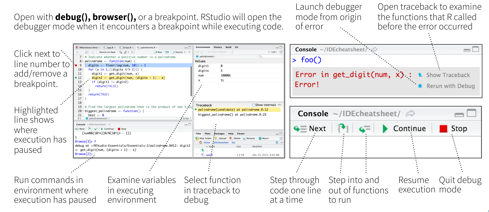

*Note: This is the second of three lectures on programming. Please take a look at the [first lecture](https://raw.githack.com/uo-ec607/lectures/master/10-funcs-intro/10-funcs-intro.html) if you haven't gone through it yet. Today, we'll build on that foundation by tackling some more advanced issues that arise when writing and working with functions in R. In particular, I'm going to focus on three issues: 1) function debugging, 2) catching user errors, and 3) caching results.*

## Software requirements

### R packages 

- New: **memoise**
- Already used: **tidyverse**, **here**

Install (if necessary) and load these packages now:


```r
if (!require("pacman")) install.packages("pacman")
pacman::p_load(memoise, tidyverse, here)
```

We will also be working with our simple `square()` function from the previous lecture. Let's create it again quickly.


```r
square <- 
  function(x = 1) {
    x_sq <- x^2 
    df <- tibble(value=x, value_squared=x_sq)
    return(df)
  }
```

## Debugging

Functions are incredibly powerful and helpful programming tools. They also tend to go wrong a lot. Sometimes this is because we (or someone else) made a mistake in writing up the code. Othertimes it is because of user error (e.g. invalid inputs). Regardless, this is where we have to begin debugging the code to figure out where and why things went wrong.

### Debugging tools in RStudio

R and the RStudio IDE provide a number of excellent tools for debugging. We'll walk through these together in a series of live coding examples in a minute. But, first here is a visual summary, cropped directly from the [RStudio IDE Cheat Sheet](https://www.rstudio.com/resources/cheatsheets/#ide).^[I mentioned this in an earlier lecture, but RStudio hosts a bunch of excellent [cheat sheets](https://www.rstudio.com/resources/cheatsheets/) that are all worth checking out.] 



### Debug mode

*<b>Note:</b> This section should be run interactively and I've set most of the below code chunks to `eval=F` in the R Markdown document. So don't be suprised if the knitted HTML document doesn't contain output correspoding to what I'm talking about in the text. My advice is to run the code chunks yourself and then follow along with the text.*

As the figure above suggests, there are various ways to enter so-called **debug mode**. This is where you "step inside" a function and evaluate objects *within that function environment*. In other words, it allows you to pause time and interact with internal function objects that are normally hidden from your global environment.^[Remember from our last lecture: Functions operate in semi-sandboxed [environments](http://adv-r.had.co.nz/Environments.html) determined by R's [lexical scoping](http://adv-r.had.co.nz/Functions.html#lexical-scoping) rules.] Let's practice with an example.

Suppose we feed some deliberately invalid input --- a character string --- to our `square()` function:


```r
square("one")
```

```
## Error in x^2: non-numeric argument to binary operator
```

Now, of course, we already knew that this function call would fail. (D'uh, you can't square a string.) In this case, R also produced an informative error message. However, notice that we don't actually get to see the point of failure --- i.e. the line of code where our function tried square the value "one". For this we need to enter debug mode. 

While there are several ways to do trigger the debugger, I recommend the **`debugonce()`** function. As the name suggests, running `debugonce(square)` will cause us to enter debug mode the next time we call `square()`, but only that one time.^[The generic `debug()` function works well too. However, there are some edge cases where running it inside the RStudio IDE can result in a recursive debugging loop (i.e. hell). So I advise avoiding `debug()` in favour of `debugonce()` unless you are running R (or calling R scripts) directly from the terminal.] Let's try it in a live session:


```r
## Run this next chunk yourself in a live session
debugonce(square)
square("one")
```

Here is a screenshot from my computer after I ran the above code chunk and explored a little.


Note the following changes to my RStudio IDE while I'm in debug mode:

- *Source (top-left).* A new "square" debugger script has popped up. The green arrow with highlighted text indicates which line of the function will be run next.
- *Environment (top-right).* I'm no longer in my Global Environment, but rather inside the "square()" function environment. 
  - There is one object inside my function environment: the variable `x` (i.e. my function argument) which has been assigned the value of "one".
  - Also note the new *Traceback*  window pane below that. The traceback (or "call stack") tells you where you are in the code and what you've done to get to this point. While the traceback stack does not add much value for simple functions like this, it can be very informative when you have longer and more complicated functions.
- *Console (bottom-right).* The prompt has changed from `>` to `Browse[2]>`, indicating that I am now in the R environment browser. The debugger console is fully functional and I have started exploring. 
  - There are several control buttons across the top ("Next", "Continue", "Stop", etc.), which allow me to walk through the code in different ways.
  - I've manually entered `x` into the console prompt and confirmed that R returns a value of "one". 
  - **Most importantly:** I then tried running the first line of the function (`x_sq <- x^2`) and was been met with an error message ("non-numeric argument to binary operator"). This is the exact point where the function actually fails.

Now, again, in this case particular case the problem was obvious and known ahead of time. But I think this simple example is useful for illustrating some general debugging principles and the power of being able to step inside functions via debugger mode. It gives you a chance to see what the functions "sees" and then work through to the root cause of the problem in a systematic way. Once you have identified the problem, then you can set about correcting your function (or inputs). Ultimately, you want to write robust functions that recognise errors early, fail with some acceptable level of tolerance, and provide helpful feedback to users. This will be the subject of the next section.

### Aside: Manual vs prompted debugging

First, an aside: We don't always have to manually invoke the debugger when a function fails. For example, with `debugonce()`. In fact, RStudio will often prompt you to "Rerun with Debug" automatically if something goes wrong. You will see something like the below screenshot in your console when this happens. (Ignore the specific function and error message and rather focus on the blue icons on the right.)


The automatic RStudio prompt will arise whenever there is something wrong with the way the R code in your function is being evaluated (i.e. it yields an R error). In contrast, you won't receive the automatic prompt if there is something wrong with your code logic (e.g. you try to square a character string).


## Catching user errors

In the previous lecture, we implicitly assumed that the user knows exactly how to use our function. However, this isn't always the case. A related, but more complicated, case is when we mistakenly input the wrong type of argument into a function. Let's return to our earlier example, where we "accidentally" entered a string into our `square()` function.


```r
square("one") 
```

```
## Error in x^2: non-numeric argument to binary operator
```

This may just seem like a case of particularly dumb user error. However --- trust me --- its very easy to run into this category of problem when you have a complex analysis that consists of, say, a series of nested functions. (One function calling another, calling another...) For whatever reason, a single function or iteration may produce slightly different output than expected and this can bring your entire analysis crashing to its knees, because the output can't be used in the next part of the chain. This is especially frustrating when you are running a multicore process (e.g. a parallel Monte Carlo simulation), since the program will first complete the *entire* run --- perhaps taking several hours --- before informing you right at the end that there was an error somewhere and no results (even for the valid iterations!) have been retained. 

Luckily, there are several approaches to guarding against these kind of mistakes. I'll briefly run through what I see as the three main options below. 

1. Function-specific control flow
2. Use `base::tryCatch()`
3. Use `purrr::safely()` and family

### Option 1: Function-specific control flow

We covered the basics of control flow in the previous lecture ([here](https://raw.githack.com/uo-ec607/lectures/master/10-funcs-intro/10-funcs-intro.html#control_flow)). Let's put the same concepts to use for debugging. In this particular function, for example, we know that our function requires a numeric input. So we can check whether the input argument is a numeric and use an `ifelse` statement to produce a warning/error message if it fails this test. Consider, then, a slightly modified version of our function, which I'll call `square_ifelse`.

```r
square_ifelse <- 
  function (x = 1) { 
    if (is.numeric(x)) { ## Check that this is a valid argument to our function.
      x_sq <- x^2 
      df <- tibble(value=x, value_squared=x_sq)
      return(df) 
    } else { ## Return a warning message if not.
      message("Sorry, you need to provide a numeric input variable.")
    }
  }
```

Test it.

```r
square_ifelse("one") ## Will trigger our warning message.
```

```
## Sorry, you need to provide a numeric input variable.
```

```r
square_ifelse(1) ## Works.
```

```
## # A tibble: 1 x 2
##   value value_squared
##   <dbl>         <dbl>
## 1     1             1
```

We can achieve a very similar result, but with less code, using the generic `stop()` function. 


```r
square_stop <- 
  function (x = 1) { 
    if (!is.numeric(x)) stop("Sorry, you need to provide a numeric input variable.")
    x_sq <- x^2 
    df <- tibble(value=x, value_squared=x_sq)
    return(df) 
  }
square_stop("one") ## Triggers a stop error and warning
```

```
## Error in square_stop("one"): Sorry, you need to provide a numeric input variable.
```

```r
square_stop(1) ## Works
```

```
## # A tibble: 1 x 2
##   value value_squared
##   <dbl>         <dbl>
## 1     1             1
```


### Option 2: Use `base::tryCatch()`

Another, more general option is to use the `base::tryCatch()` function for handling errors and warnings. Let me demonstrate its usefulness with two separate examples. 

#### 2.1) Wrap `tryCatch()` around an entire function

The first simply wraps a generic `tryCatch` statement *around* our existing `square` function. Note the invocation of R's in-built "error" class, which in turn is passed to another in-built function called `message`. Basically, we are telling R to produce a particular message whenever it recognizes that an error (any error!) has occurred while executing our bespoke function.

```r
tryCatch(
  square("three"), 
  error = function(e) message("Sorry, something went wrong. Did you try to square a string instead of a number?")
  )
```

```
## Sorry, something went wrong. Did you try to square a string instead of a number?
```

This first example works well, but it has the downside of throwing out everything that went into the function in favour of a single error message. Not only that, but it could throw out potentially valid input-output because of a single error. To see this more clearly, let's feed our function a vector of inputs, where only one input is invalid.


```r
tryCatch(
  square(c(1,2,"three")), 
  error = function(e) message("Sorry, something went wrong. Did you try to square a string instead of a number?")
  )
```

```
## Sorry, something went wrong. Did you try to square a string instead of a number?
```
So we simply get an error message, even though some (most) of our inputs were valid. In an ideal world, we would have retained the input-output from the valid parameters (i.e. 1 and 2) and only received an error message for the single invalid case (i.e. "three"). This leads us to our second example...

#### 2.2) Use `tryCatch()` inside a function

The second example avoids the above problem by invoking `tryCatch()` *inside* our user-defined function. The principle is very much the same as before: We're going to tell R what to give us whenever it encounters an error. However, we are going to be more explicit about where we expect that error to occur. Moreover, instead of simply producing an error message, this time we'll instruct R to return an explicit, alternative value (i.e. `NA`).


```r
square_trycatch <-
  function (x = 1) {
    x_sq <- tryCatch(x^2, error = function(e) NA_real_) ## tryCatch goes here now. Produce an NA value if we can't square the input.
    df <- tibble(value=x, value_squared=x_sq)
    return(df)
  }
```

Let's see that it works on our previous input vector, where only one input was invalid.


```r
square_trycatch(c(1,2,"three"))
```

```
##   value value_squared
## 1     1            NA
## 2     2            NA
## 3 three            NA
```

Huh? Looks like it half worked. We get the input values, but now all of the squared values have been converted to `NA`. Why do you think that is? **Challenge:** See if you can figure out the problem on your own using `debugonce(square_trycatch)` before continuing...

Let's take a deeper look at our input vector:


```r
str(c(1,2,"three"))
```

```
##  chr [1:3] "1" "2" "three"
```

*Ah-ha.* R has coerced every element in the input vector to a character string. (Remember: Vectors can only contain elements of the same type.) The solution is to use an input array that allows different element types --- i.e. a *list*. This, in turn, requires modifying the way that we invoke the function by putting it in a `base::lapply()` or `purrr::map()` call. As you'll hopefully remember from the last lecture, these two functions are syntactically identical, so I'll just use the latter:


```r
map(list(1,2,"three"),  square_trycatch) 
```

```
## [[1]]
## # A tibble: 1 x 2
##   value value_squared
##   <dbl>         <dbl>
## 1     1             1
## 
## [[2]]
## # A tibble: 1 x 2
##   value value_squared
##   <dbl>         <dbl>
## 1     2             4
## 
## [[3]]
## # A tibble: 1 x 2
##   value value_squared
##   <chr>         <dbl>
## 1 three            NA
```

As we practiced last lecture, we may wish to bind the resulting list of data frames into a single data frame using `dplyr::bind_rows()` or, more simply, `purrr::map_df()`. However, that actually produces errors of its own because all of the columns need to be the same. 


```r
map_df(list(1,2,"three"),  square_trycatch)
```

```
## Error in bind_rows_(x, .id): Column `value` can't be converted from numeric to character
```

The somewhat pedantic solution is to make sure that the offending input is coerced to a numeric within the function itself. Note that this will introduce coercion warnings of its own, but at least it won't fail. 


```r
square_trycatch2 <-
  function (x = 1) {
    x_sq <- tryCatch(x^2, error = function(e) NA_real_) 
    df <- tibble(value=as.numeric(x), value_squared=x_sq) ## Convert input to numeric
    return(df)
  }

map_df(list(1,2,"three"), square_trycatch2)
```

```
## Warning in eval_tidy(xs[[i]], unique_output): NAs introduced by coercion
```

```
## # A tibble: 3 x 2
##   value value_squared
##   <dbl>         <dbl>
## 1     1             1
## 2     2             4
## 3    NA            NA
```

### Option 3: Use `purrr::safely()` and family

Finally, for those of you who prefer a tidyverse equivalent of `tryCatch()`, you can use `purrr::safely()` and its related functions (including `purrr::possibly()` and other variants). I won't go through the entire rigmarole again, so here's a simple flavour of how they work:


```r
square_simple <-
  function (x = 1) {
    x_sq <- x^2
  }
square_safely <- safely(square_simple)
square_safely("three")
```

```
## $result
## NULL
## 
## $error
## <simpleError in x^2: non-numeric argument to binary operator>
```

You can also specify default behaviour in case of an error:


```r
square_safely <- safely(square_simple, otherwise = NA_real_)
square_safely("three")
```

```
## $result
## [1] NA
## 
## $error
## <simpleError in x^2: non-numeric argument to binary operator>
```


## Caching (memoisation)

We've already experienced the benefits (and occasional frustrations) of caching with R Markdown documents.^[Like all of my notes for the course, this lecture is written in R Markdown and then "knitted" to HTML. If you look at the .Rmd source file, you'll see a code chunk with `knitr::opts_chunk$set(echo=TRUE, cache=TRUE, dpi=300)` right at the top. The `cache=TRUE` bit causes each subsequent code chunk to be cached, so that they don't have to be re-run every time I recompile the document (unless something changes).] Caching can also be extremely useful for regular R scripts and analyses. For example, we may wish to save some computationally-expensive output so that we don't have to run it again. On a related but more sinister note, programs and functions can crash midway through completion. This can happen for a variety of reasons: invalid function arguments buried in iterated input, computer malfunction, memory limits, power outtages, timeouts, etc. Regardless, it can be a fairly soul-splintering experience to lose all of your work if you're working on a particularly lengthy simulation or computation problem. Lastly, we'll get to parallel computation in the next lecture, but the problem is *even worse* there. What typically happens with a parallelized program is that the entire run will complete (potentially taking many hours or days) and only reveal an error right at the end... with no saved output! 

Fortunately, R has our back with several caching tools. Here I'm going to focus on the [**memoise**](https://github.com/r-lib/memoise) package. Note that [memoisation/memoization](https://en.wikipedia.org/wiki/Memoization) refers to a particular form of caching where we save (i.e. "remember") the results of expensive functions calls, so that we don't have to repeat them in the future.

Let's start by creating a "slow" version of our simple square function --- that waits for two seconds before doing anything --- which I'll creatively call `slow_square()`. Of course, this is just meant to emulate a computationally-expensive operation, but the basic principles will carry through intact.


```r
## Emulate slow function
slow_square <- 
  function(x) {
    Sys.sleep(2)
    square(x)
    }
```

Enabling caching (i.e. memoisation) of our slow function is a simple matter of feeding it to `memoise::memoise()`.


```r
# library(memoise) ## Already loaded

mem_square <- memoise(slow_square)
```

*Note: I've assigned the memoised version as its own function here (i.e. `mem_square()`). However, it's no problem to recycle the original function name if you prefer (i.e. `slow_square < - memoise(slow_square)`).*

The first time we execute our memoised `slow_square_mem()` function, it won't be able to draw on any saved results. This means that it will have to run through all of the underlying computation. In the process of doing so, however, it will save both the inputs and results for immediate retrieval later on.

Let's run some examples and compare actual timings. For the first run, I'll iterate over our function using the numbers 1 through 10 and save the resulting data frame to an object called `m1`.


```r
system.time(
  m1 <- map_df(1:10, mem_square)
)
```

```
##    user  system elapsed 
##   0.091   0.003  20.114
```

As expected this took 20 seconds because of the enforced two second wait during each iteration. Now, we try calling the function a second time --- iterating over the exact same inputs and saving to a new `m2` object --- to see if caching makes a difference...


```r
system.time(
  m2 <- map_df(1:10, mem_square)
)
```

```
##    user  system elapsed 
##   0.000   0.003   0.003
```

And does it ever! We're down to a fraction of a second, since we didn't need to run at all again. Rather, we simply recalled the previously saved (i.e. memoised) results. And just to prove that we're really saving meaningful output, here is a comparison of the two data frames, as well as the printed output of `df2`.


```r
all.equal(m1, m2)
```

```
## [1] TRUE
```

```r
m2
```

```
## # A tibble: 10 x 2
##    value value_squared
##    <int>         <dbl>
##  1     1             1
##  2     2             4
##  3     3             9
##  4     4            16
##  5     5            25
##  6     6            36
##  7     7            49
##  8     8            64
##  9     9            81
## 10    10           100
```

Finally, note that our caching function is smart enough to disguish between previously cached and non-cached results. For example, consider what happens if I include five more numbers in the `x` input vector.


```r
system.time(
  m3 <- map_df(1:15, mem_square)
)
```

```
##    user  system elapsed 
##   0.016   0.000  10.027
```

As expected, this only took (5 $\times$ 2 = ) 10 seconds to generate the new results from scratch, with the previous results being called up from the cache. You can think of preceding example as approximating a real-life scenario, where your program crashes or halts midway through its run, yet you don't need to restart all the way at the beginning. These kinds of interuptions happen more frequently than you might expect, especially if you're working with complex analyses and high-performance computing tools (e.g. preemptible nodes or VM instances). Being smart about caching has saved me *many* lost hours and it could do the same for you.


### Aside 1: Caching across R sessions

The previous paragraph elides an important caveat: The default `memoise()` cache is only valid for the current R session. You can see this more clearly by exploring the help documentation of the function, where you will note the internal `cache = cache_memory()` argument. To enable caching that persists across sessions --- including when your computer crashes --- you need to specify a dedicated cache directory with `cache = cache_filesystem(PATH)`. This directory can be located anywhere on your system (or, indeed, on a linked cloud storage service) and you can even have multiple cache directories for different projects. My only modest recommendation is that you use a `.rcache/` naming pattern to keep things orderly. 

For example, we can specify a new, persistent memoise cache location for our `slow_square()` function within this lecture sub-directory as follows.


```r
## Cache directory path (which I've already created)
cache_dir <- here("11-funcs-adv/.rcache")

## (Re-)memoise our function with the persistent cache location
mem_square_persistent <- memoise(slow_square, cache = cache_filesystem(cache_dir))
```

Run our new memoised function and check that it saved the cached output to the specified directory.


```r
m4 <- map_df(1:7, mem_square_persistent)
list.files(cache_dir)
```

```
## [1] "0d9118eb4c2100ab" "2420ab9f806ae0bc" "5c801aa15f7f06d0" "6678f42ceacfa6ff"
## [5] "b2de53c69cdcc075" "dd812dbc4c2dc231" "ea8f81859aed374d"
```

**Bottom line:** Specify a dedicated cache directory for complex or time-consuming analyses that you want to be able to access across R sessions.

### Aside 2: Verbose output

It's possible (and often very helpful) to add verbose prompts to our memoised functions. Consider the code below, which which folds our `mem_square_persistent()` function into two sections:

1. Check for and load previously cached results. Print the results to screen.
2. Run our memoised function on any inputs that have not already been evaluated.( These results will be cached in turn for future use.) Again, print the results to screen.


```r
mem_square_verbose <- 
  function(x) {
    ## 1. Load cached data if already generated
    if (has_cache(mem_square_persistent)(x)) {
      cat("Loading cached data for x =", x, "\n")
      my_data <- mem_square_persistent(x)
      return(my_data)
    }
    
    ## 2. Generate new data if cache not available
    cat("Generating data from scratch for x =", x, "...")
    my_data <- mem_square_persistent(x)
    cat("ok\n")
    
    return(my_data)
  }
```

And here's an example of the vebose function in action. The output is probably less impressive in a knitted R Markdown document, but I find the real-time feedback to be very informative in a live session. (Try it yourself.)


```r
system.time(
  m5 <- map_df(1:10, mem_square_verbose)
)
```

```
## Loading cached data for x = 1 
## Loading cached data for x = 2 
## Loading cached data for x = 3 
## Loading cached data for x = 4 
## Loading cached data for x = 5 
## Loading cached data for x = 6 
## Loading cached data for x = 7 
## Generating data from scratch for x = 8 ...ok
## Generating data from scratch for x = 9 ...ok
## Generating data from scratch for x = 10 ...ok
```

```
##    user  system elapsed 
##   0.018   0.001   6.023
```


## Further resources

- RStudio have a number of great debugging resources. I recommend [*Debugging techniques in RStudio*](https://www.rstudio.com/resources/videos/debugging-techniques-in-rstudio/) (a recorded talk by Amanda Gadrow) and [Debugging with RStudio](https://support.rstudio.com/hc/en-us/articles/205612627-Debugging-with-RStudio) (Jonathan McPherson).
- The [Debugging](https://adv-r.hadley.nz/debugging.html) chapter of Hadley Wickham's [*Advanced R*](https://adv-r.hadley.nz) provides a very thorough treatment. In fact, the whole book is fantastic. If you're looking to scale up your understanding of how R works underneath the hood and implement some truly high-performance code, then I can think of no better reference.
