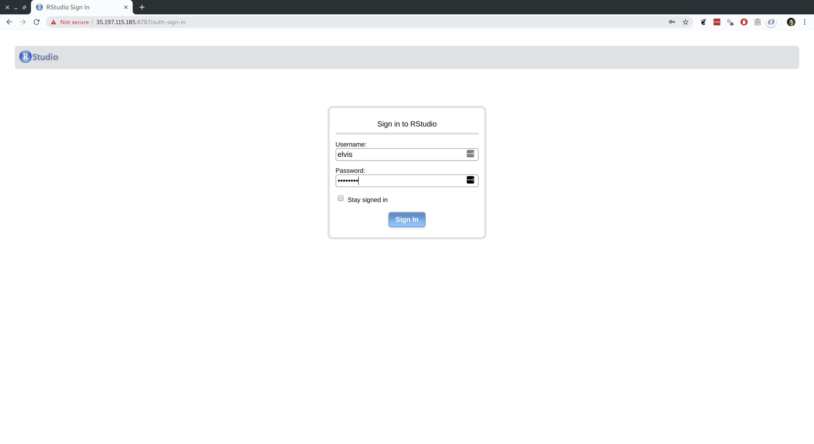

```{r setup, include=FALSE}
knitr::opts_chunk$set(echo = TRUE, cache = TRUE, dpi=300)
## Next hook based on this SO answer: https://stackoverflow.com/a/39025054
knitr::knit_hooks$set(
  prompt = function(before, options, envir) {
    options(
      prompt = if (options$engine %in% c('sh','bash')) '$ ' else 'R> ',
      continue = if (options$engine %in% c('sh','bash')) '$ ' else '+ '
      )
    })
```

Thus far in the course, we've spent quite a bit of time learning how to code efficiently. We've covered topics like functional programming, results caching, parallel programming, etc. All of these tools are designed to make the most of the computational resources at your disposal. Beyond some point, however, you simply need more power. Datasets become too big, simulations become too complex, and regressions take too damn long to run. The next few lectures are aimed at addressing this computational bottleneck. In particular, we're going to look at cloud-based options for working with big data. These will be based primarily on Google Cloud Platform, which means that they are available to anyone regardless of institutional affiliation (or lack thereof).

## Requirements

### Create a (free) account on Google Cloud Platform

These next instructions are important, so please read carefully.

1. Sign up for a [12-month ($300 credit) free trial](https://console.cloud.google.com/freetrial) with Google Cloud Platform. This requires an existing Google/Gmail acount.^[If you have multiple Gmail accounts, please pay attention to which one you are using. (E.g. You might have two Gmail accounts, where one is your personal Gmail and the other is linked to your university email.) Needless to say, you'll want to make sure that you use the *same* account when setting up the gloud utility in Step 2. This might all sound obvious, but it has been the primary sticking point during live tutorials, where people encounter a bunch of puzzling authentication errors simply because they aren't using a consistent account.] During the course of sign-up, you should [create a project](https://cloud.google.com/resource-manager/docs/creating-managing-projects) that will be associated with billing. This is purely ceremonial at present — we're using the free trial period after all — but a billable project ID is required before gaining access to the platform.
2. Download and follow the installation instructions for the Google Cloud SDK command line utility, `gcloud` [here](https://cloud.google.com/sdk/).

### R packages 

- **New:** `future.apply`
- **Already used:** `googleComputeEngineR`, `usethis`

```{r, cache=F, message=F}
## Load/install packages
if (!require("pacman")) install.packages("pacman")
pacman::p_load(future.apply, googleComputeEngineR, usethis)

# ## Set future::plan() resolution strategy
# plan(multiprocess)
```

## Introduction

At the risk of gross simplification, there are two ways to "brute force" your way through a computationally-intensive problem:

1. Use a single powerful machine that has a lot of memory and cores.
2. Use cluster of machines that, together, have a lot of memory and cores.

Today we're going to focus on cloud-based implementations of these two approaches using [**Google Compute Engine**](https://cloud.google.com/compute/) (GCE).^[FWIW, these lecture notes are adapted from a [tutorial](http://grantmcdermott.com/2017/05/30/rstudio-server-compute-engine/) available on my personal web page. There is a lot of overlap, but I've also made various changes based on knowledge specific to this course.] In particular, we're going to use GCE to spin up powerful "virtual machines" in the cloud that we can interact with from our local computers. Not only will these instances be extremely cheap (free even!) to run, but I'll show you how to set things up so that your user environment remains identical to that which you're already used to. We'll still be running R and RStudio (Server), but now with the full power of cloud-based computation at our disposal. Trust me, it will be awesome. 

**Aside:** Of course, you can also combine options 1 and 2 to get a *really* powerful system. That's what supercomputing services like the University of Oregon's [Talapas cluster](https://hpcf.uoregon.edu/content/talapas) provide. So-called HPC (high performance computing) clusters will be the topic of our next lecture.

### Virtual machines

So what is a [virtual machine](https://en.wikipedia.org/wiki/Virtual_machine) and why do I need one anyway? In the simplest sense, a VM is just an emulation of a computer running inside another (bigger) computer. It can potentially perform all or more of the operations that your physical laptop/desktop does, and it might have many of the same properties (from operating system to internal architecture.) The key advantage of a VM from our perspective is that very powerful machines can be "spun up" in the cloud almost effortlessly and then deployed to tackle jobs that are beyond the capabilities of your local computer. Got a big dataset that requires too much memory to analyse on your old laptop? Load it into a high-powered VM. Got some code that takes an age to run? Fire up a VM and let it chug away without consuming any local resources. Or, better yet, write code that [runs in parallel](https://raw.githack.com/uo-ec607/lectures/master/12-parallel/12-parallel.html) and then spin up a VM with lots of cores (CPUs) to get the analysis done in a fraction of the time. All you need is a working internet connection and a web browser.

Now, with that background knowledge in mind, GCE is part of the [Google Cloud Platform](https://cloud.google.com/) and delivers high-performance, rapidly scalable VMs. A new VM can be deployed or shut down within seconds, while existing VMs can easily be ramped up or down (cores added, RAM added, etc.) depending on a project's needs. In my experience, GCE is at least as good as [Amazon's AWS](https://aws.amazon.com/) — say nothing of the [other really cool products](https://cloud.google.com/products/) within the Cloud Platform suite — and most individual users would be really hard-pressed to spent more than a couple of dollars a month using it. (If that.) This is especially true for the researcher who only needs to crunch a particularly large dataset or run some intensive simulations on occasion, and can easily switch the machine off when it's not being used.

> **Tip:** While I very much stand by the above paragraph, it is ultimately *your* responsibility to keep track of your billing and utilisation rates. Take a look at [Google's Could Platform Pricing Calculator](https://cloud.google.com/products/calculator/) to see how much you can expect to be charged for a particular machine and level of usage. You can even [set a budget and create usage alerts](https://support.google.com/cloud/answer/6293540?hl=en) if you want to be extra cautious.

### Housekeeping

Two final housekeeping notes, before continuing.

First, it's possible to complete nearly all of the steps in this guide via the [GCE browser console](https://console.cloud.google.com/compute/instances). However, we'll stick to using the shell via the `gcloud` command-line interface (which you should have [installed](https://cloud.google.com/sdk/) already). Why? Well, because it will make it easier to document our steps and will also save us some headaches further down the road. (For example, when it comes to transferring files between your local computer and a GCE instance *en masse*.) Please refer to [my lecture on the bash shell](https://raw.githack.com/uo-ec607/lectures/master/03-shell/03-shell.html) if any of that sounds unfamiliar. 
Second, almost all VMs run on some variant of Linux. Since we'll be connecting directly to our VM instance via the shell, this only matters insofar as some of the commands might invoke slightly different syntax to what you'd normally use on a Mac or Windows PC. If you're brand new to Linux, then I'd recommend taking a quick look at [this website](https://linuxjourney.com/). It provides a step-by-step overview of some of the key concepts and commands. One thing that I'll briefly mention here is that Ubuntu — the Linux distribution that we'll be using below — uses the `apt` package-management system. (Much like macOS uses [Homebrew](https://brew.sh/).) So when you see commands like `apt install PACKAGENAME`, that's just a convenient way to install and manage packages.

Okay, introduction out of the way. Let's get up and running.

## GCE with RStudio Server

### Create a VM

You'll need to choose an operating system (OS) for your VM, as well as its designated zone. Let's quickly look at the available options, since this will also be a good time to confirm that you correctly installed `gcloud`. Open up the shell like we practiced in [lecture 3](https://raw.githack.com/uo-ec607/lectures/master/03-shell/03-shell.html) and enter (without the `$` command prompt):
```{bash eval=F, prompt=T}
gcloud compute images list
gcloud compute zones list
```

> **Tip:** If you get an error message with the above commands, try re-running them with [`sudo`](https://en.wikipedia.org/wiki/Sudo) at the beginning. If this works for you, then you will need to append "sudo" to the other shell commands in this lecture.

You'll know that everything is working properly if these these commands return a large range of options. If you get an error, please try [reinstalling](https://cloud.google.com/sdk/) `gcloud` again before continuing.

The key shell command for creating your VM is **`gcloud compute instances create`**.
You can specify the type of machine that you want and a range of other options by using the [appropriate flags](https://cloud.google.com/sdk/gcloud/reference/compute/instances/create). Let me first show you an example of the command and then walk through my (somewhat arbitrary) choices in more detail. Note that I am going to call my VM instance "my-vm", but you can call it whatever you want.

```{bash, eval=F, prompt=T}
gcloud compute instances create my-vm --image-family ubuntu-1804-lts --image-project ubuntu-os-cloud  --machine-type n1-standard-8 --zone us-west1-a
```

Here is a breakdown of the command and a quick explanation of my choices.

- `gcloud compute instances create my-vm`: Create a new VM called "my-vm". Yes, I am very creative.
- `--image-family ubuntu-1804-lts --image-project ubuntu-os-cloud`: Use Ubuntu 18.04 as the underlying operating system.
- `--machine-type n1-standard-8`: I've elected to go with the "N1 Standard 8" option, which means that I'm getting 8 CPUs and 30GB RAM. However, you can choose from a [range](https://cloud.google.com/compute/pricing) of machine/memory/pricing options. (Assuming a monthly usage rate of 20 hours, this particular VM will only [cost about](https://cloud.google.com/products/calculator/#id=efc1f1b1-175d-4860-ad99-9006ea39651b) $7.60 a month to maintain once our free trial ends.) You needn't worry too much about these initial specs now. New VMs are very easy to create and discard once you get the hang of it. It's also very simple to change the specs of an already-created VM. GCE will even suggest cheaper specifications if it thinks that you aren't using your resources efficiently down the line.
- `--zone us-west1-a`: My preferred zone. The zone choice shouldn't really matter, although you'll be prompted to choose one if you forget to include this flag. As a general rule, I advise picking whatever's closest to you.^[You can also set the default zone so that you don't need to specify it every time. See [here](https://cloud.google.com/compute/docs/gcloud-compute/#set_default_zone_and_region_in_your_local_client).] 

Assuming that you ran the above command (perhaps changing the zone to one nearest you), you should see something like the following:

```
Created [https://www.googleapis.com/compute/v1/projects/YOUR-PROJECT/zones/YOUR-ZONE/instances/YOUR-VM].
NAME   ZONE        MACHINE_TYPE  PREEMPTIBLE   INTERNAL_IP  EXTERNAL_IP    STATUS
my-vm  us-west1-a  n1-standard-8               10.138.0.2   104.198.7.157  RUNNING
```

Write down the External IP address, as we'll need it for running RStudio Server later.

> **Tip:** This IP address is "ephemeral" in the sense that it is only uniquely assigned to your VM while it is running continuously. This shouldn't create any significant problems, but if you prefer a static (i.e. non-ephemeral) IP address that is always going to be associated with a particular VM instance, then this is easily done. See [here](https://cloud.google.com/compute/docs/configure-instance-ip-addresses#assign_new_instance).

On a similar note, RStudio Server will run on port 8787 of the External IP, which we need to enable via the GCE firewall.^[While I don't cover it in this tutorial, anyone looking to install and run [Jupyter Notebooks](http://jupyter.org/) on their VM should follow a similar step. Just amend the above command to Jupyter's default port of 8888.]

```{bash, eval=F, prompt=T}
gcloud compute firewall-rules create allow-my-vm --allow=tcp:8787
```

Congratulations: Set-up for your GCE VM instance is complete.

Easy, wasn't it?

### Logging in

The next step is to log in via **SSH** (i.e. [**S**ecure **Sh**ell](https://en.wikipedia.org/wiki/Secure_Shell)). This is a simple matter of providing your VM's name and zone. (If you forget to specify the zone or haven't assigned a default, you'll be prompted.)

```{bash, eval=F, prompt=T}
gcloud compute ssh my-vm --zone us-west1-a
```

**IMPORTANT:** Upon logging into a GCE instance via SSH for the first time, you will be prompted to generate a key passphrase. Needless to say, you should *make a note of this passphrase* for future long-ins. Your passphrase will be required for all future remote log-ins to Google Cloud projects via `gcloud` and SSH from your local computer. This includes additional VMs that you create under the same project account.

Passphrase successfully created and entered, you should now be connected to your VM via SSH. That is, you should see something like the following, where "grant" and "my-vm" will obviously be replaced by your own username and hostname (i.e. VM).

```
grant@my-vm:~$
```

> **Tip:** For the remainder of this lecture, I'll explicitly use the full command line prompt for any shell instance connected to the VM via SHH (i.e. `grant@my-vm:~$ `). This is so that you don't get confused if we need to switch back to running commands in local-only shell instances (i.e. `$ ` only). 

Next, we'll install R.

### Install R on your VM

You can find the full set of instructions and recommendations for installing R on Ubuntu [here](https://cran.r-project.org/bin/linux/ubuntu/README). Or you can just follow my choices below, which should cover everything that you need. Note that you should be running these commands directly in the shell that is connected to your VM.

```{bash, eval=F}
grant@my-vm:~$ sudo sh -c 'echo "deb https://cloud.r-project.org/bin/linux/ubuntu bionic-cran35/" >> /etc/apt/sources.list'
grant@my-vm:~$ sudo apt-key adv --keyserver keyserver.ubuntu.com --recv-keys E298A3A825C0D65DFD57CBB651716619E084DAB9
grant@my-vm:~$ sudo apt update && sudo apt upgrade ## Hit "y" when prompted
grant@my-vm:~$ sudo apt install r-base r-base-dev ## Again, hit "y" when prompted
```

In addition to the above, a number of important R packages require external Linux libraries that must be installed separately on your VM first. For Ubuntu, we can install these packages with the following commands. Again, hit "y" whenever you are prompted to confirm installation.

1) For the "[tidyverse](http://tidyverse.org/)" suite of packages:
```{bash, eval=F}
grant@my-vm:~$ sudo apt install libcurl4-openssl-dev libssl-dev libxml2-dev
```
2) For the main spatial libraries (sf, sp, rgeos, etc.):
```{bash, eval=F}
grant@my-vm:~$ sudo add-apt-repository -y ppa:ubuntugis/ubuntugis-unstable
grant@my-vm:~$ sudo apt update && apt upgrade
grant@my-vm:~$ sudo apt install libgeos-dev libproj-dev libgdal-dev libudunits2-dev
```

R is now ready to go on our VMs directly from the shell.^[Enter "R" into your shell window to confirm for yourself. If you do, make sure to quit afterwards by typing in "q()".] However, we'd obviously prefer to use the awesome IDE interface provided by RStudio (Server). So that's what we'll install and configure next, making sure that we can run RStudio Server on our VM via a web browser like Chrome or Firefox from our local computer. 

### Install and configure RStudio Server

#### Download RStudio Server on your VM

You should check what the latest available version of Rstudio Server is [here](https://www.rstudio.com/products/rstudio/download-server/), but as of the time of writing the following is what you need:

```{bash, eval=F}
grant@my-vm:~$ sudo apt install gdebi-core
grant@my-vm:~$ sudo wget https://download2.rstudio.org/rstudio-server-1.1.463-amd64.deb
grant@my-vm:~$ sudo gdebi rstudio-server-1.1.463-amd64.deb ## Hit "y" when prompted
```

#### Add a user

Now that you're connected to your VM, you might notice that you never actually logged in as a specific user. (More discussion [here](https://groups.google.com/forum/#!msg/gce-discussion/DYfDOndtRTU/u_3kzNPqDAAJ).) This doesn't matter for most applications, but RStudio Server specifically requires a username/password combination. So we must first create a new user and give them a password before continuing. For example, we can create a new user called "elvis" like so:

```{bash, eval=F}
grant@my-vm:~$ sudo adduser elvis
```

You will then be prompted to specify a user password (and confirm various bits of biographical information which you can ignore). An optional, but recommended step is to add your new user to the `sudo` group. We'll cover this in more depth later in the tutorial, but being part of the `sudo` group will allow Elvis to temporarily invoke superuser priviledges when needed.

```{bash, eval=F}
grant@my-vm:~$ sudo usermod -aG sudo elvis
# grant@my-vm:~$ su - elvis ## Log in as elvis on SSH (optional)
```

> **Tip:** Once created, you can now log into a user's account on the VM directly via SSH, e.g. `gcloud compute ssh elvis@my-vm --zone us-west1-a`

#### Navigate to the RStudio Server instance in your browser

You are now ready to open up RStudio Server by navigating to the default 8787 port of your VM's External IP address. (You remember writing this down earlier, right?) If you forgot to write the IP address down, don't worry: You can find it by logging into your Google Cloud console and looking at your [VM instances](https://console.cloud.google.com/compute/instances), or by opening up a new shell window (**not** the one currently connected to your VM) and typing:

```{bash, eval=F, prompt=T}
gcloud compute instances describe my-vm  --zone us-west1-a
```

Either way, once you have the address, open up your preferred web browser and navigate to:

http://EXTERNAL-IP-ADDRESS:8787

You will be presented with the following web page. Log in using the username/password that you created earlier.



And we're all set. Here is RStudio Server running on my laptop via Google Chrome.


> **Tip:** Hit F11 to go full screen in your browser. The server version of RStudio is then virtually indistinguishable from the desktop version.

### Stopping and (re)starting your VM instance

Stopping and (re)starting your VM instance is a highly advisable, so you don't have to worry about getting billed for times when you aren't using it. In a new shell window (not the one currently synced to your VM instance):
```{bash, eval=F, prompt=T}
gcloud compute instances stop my-vm
gcloud compute instances start my-vm
```

### Summary

Assuming that you have gone through the initial set-up, here's the **tl;dr** summary of how to deploy an existing VM with RStudio Server:

1) Start-up a VM instance.
  ```{bash, eval=F, prompt=T}
  gcloud compute instances start YOUR-VM-INSTANCE-NAME
  ```
2) Take note of the External IP address if you need to (see step 4 below):
  ```{bash, eval=F, prompt=T}
  gcloud compute instances describe YOUR-VM-INSTANCE-NAME
  ```
3) Log-in via SSH.
  ```{bash, eval=F, prompt=T}
  gcloud compute ssh YOUR-VM-INSTANCE-NAME
  ```
4) Open up a web browser and navigate to RStudio Server via your VM's External IP address (enter your username/password as needed): http://EXTERNAL-IP-ADDRESS:8787

5) Stop your VM:
  ```{bash, eval=F, prompt=T}
  gcloud compute instances stop YOUR-VM-INSTANCE-NAME
  ```
And, remember, if you really want to avoid the command line, then you can always go through the [GCE browser console](https://console.cloud.google.com/home/dashboard).

In one sense, this tutorial could end right now. You have successfully installed all the programs and components that you'll need for high-performance statistical analysis and computing. Your VM will be ready to go with RStudio Server whenever you want it. However, there are still a few more tweaks and tips that we can use to really improve our user experience and reduce complications when interacting with these VMs from our local computers. The rest of this tutorial covers my main tips and recommendations.


## BONUS: Getting the most out of your GCE + RStudio Server setup

### Transfer and sync files between your VM and your local computer

You have three main options.

#### 1. Manually transfer files directly from RStudio Server

This is arguably the simplest option and works well for copying files from your VM to your local computer. However, I can't guarantee that it will work as well going the other way; you may need to adjust some user privileges first.


#### 2. Manually transfer files and folders using the command line or SCP

Manually transferring files or folders across systems is done fairly easily using the command line. Note that this next code chunk would be run in a new shell instance (i.e. not the one connected to your VM via SSH).

```{bash, eval=F, prompt=T}
gcloud compute scp my-vm:/home/elvis/Papers/MyAwesomePaper/amazingresults.csv ~/local-directory/amazingresults-copy.csv --zone us-west1-a
```
It's also possible to transfer files using your regular desktop file browser thanks to SCP. (On Linux and Mac OSX at least. Windows users first need to install a program call WinSCP.) See [here](https://cloud.google.com/compute/docs/instances/transfer-files).

> **Tip:** The file browser-based SCP solution is much more efficient when you have assigned a static IP address to your VM instance — otherwise you have to set it up each time you restart your VM instance and are assigned a new ephemeral IP address — so I'd advise doing that [first](https://cloud.google.com/compute/docs/configure-instance-ip-addresses#assign_new_instance).

#### 3. Sync with Git(Hub), Box, Dropbox, or Google Drive

This is my own preferred option. Ubuntu, like all virtually Linux distros, comes with Git preinstalled. You should thus be able to sync your results across systems using Git(Hub) in the [usual fashion](http://happygitwithr.com/). I tend to use the command line for all my Git operations (committing, pulling, pushing, etc.) and this works exactly as expected once you've SSH'd into your VM. However, Rstudio Server's built-in Git UI also works well and comes with some nice added functionality (highlighted diff. sections and so forth).

While I haven't tried it myself, you should also be able to install [Box](http://xmodulo.com/how-to-mount-box-com-cloud-storage-on-linux.html), [Dropbox](https://www.linuxbabe.com/cloud-storage/install-dropbox-ubuntu-16-04) or [Google Drive](http://www.techrepublic.com/article/how-to-mount-your-google-drive-on-linux-with-google-drive-ocamlfuse/) on your VM and sync across systems that way. If you go this route, then I'd advise installing these programs as sub-directories of the user's "home" directory. Even then you may run into problems related to user permissions. However, just follow the instructions for linking to the hypothetical "TeamProject" folder that I describe below (except that you must obviously point towards the relevant Box/Dropbox/GDrive folder location instead) and you should be fine.

> **Tip:** Remember that your VM lives on a server and doesn't have the usual graphical interface — including installation utilities — of a normal desktop. You'll thus need to follow command line installation instructions for these programs. Make sure you scroll down to the relevant sections of the links that I have provided above.

Last, but not least, Google themselves encourage data synchronisation on GCE VMs using another product within their Cloud Platform, i.e. [Google Storage](https://cloud.google.com/storage/). This is especially useful for really big data files and folders, but beyond the scope of this lecture. (If you're interested in learning more, see [here](https://cloud.google.com/solutions/filers-on-compute-engine) and [here](https://cloud.google.com/compute/docs/disks/gcs-buckets).)

### Share files and libraries between multiple users on the same VM

The default configuration that I have described above works perfectly well in cases where you are a single user and don't venture outside of your home directory (and its sub directories). Indeed, you can just add new folders within this user's home directory using [standard Linux commands](https://linuxjourney.com/lesson/make-directory-mkdir-command) and you will be able to access these from within RStudio Server when you log in as that user.

However, there's a slight wrinkle in cases where you want to share information between *multiple* users on the same VM. (Which may well be necessary on a big group project.) In particular, RStudio Server is only going to be able to look for files in each individual user's home directory (e.g. `/home/elvis`.) Similarly, by default on Linux, the R libraries that one user installs [won't necessarily](https://stackoverflow.com/a/44903158) be available to other users.

The reason has to do with user permissions; since Elvis is not an automatic "superuser", RStudio Server doesn't know that he is allowed to access other users' files and packages in our VM, and vice versa. Thankfully, there's a fairly easy workaround, involving standard Linux commands for adding user and group privileges (see [these slides](https://raw.githack.com/uo-ec607/lectures/master/03-shell/03-shell.html#81) from our shell lecture). Here's an example solution that should cover most cases:

#### Share files across users

Let's say that Elvis is working on a joint project together with a colleague called Priscilla. (Although, some say they are more than colleagues...) They have decided to keep all of their shared analysis in a new directory called `TeamProject`, located within Elvis's home directory. Start by creating this new shared directory:
```{bash, eval=F, prompt=T}
grant@my-vm:~$ sudo mkdir /home/elvis/TeamProject
```
Presumably, a real-life Priscilla would already have a user profile at this point. But let's quickly create one too for our fictional version.
```{bash, eval=F, prompt=T}
grant@my-vm:~$ sudo adduser priscilla
```
Next, we create a user group. I'm going to call it "projectgrp", but as you wish. The group setup is useful because once we assign a set of permissions to a group, any members of that group will automatically receive those permissions too. With that in mind, we should add Elvis and Priscilla to "projectgrp" once it is created:
```{bash, eval=F}
grant@my-vm:~$ sudo groupadd projectgrp
grant@my-vm:~$ sudo gpasswd -a elvis projectgrp
grant@my-vm:~$ sudo gpasswd -a priscilla projectgrp
```
Now we can set the necessary ownership permissions to the shared `TeamProject` directory. First, we use the `chown` command to assign ownership of this directory to a default user (in this case, "elvis") and the other "projectgrp" members. Second, we use the `chmod 770` command to grant them all read, write and execute access to the directory. In both both cases, we'll use the `-R` flag to recursively set permissions to all children directories of `TeamProject/` too.
```{bash, eval=F}
grant@my-vm:~$ sudo chown -R elvis:projectgrp /home/elvis/TeamProject
grant@my-vm:~$ sudo chmod -R 770 /home/elvis/TeamProject
```
The next two commands are optional, but advised if Priscilla is only going to be working on this VM through the `TeamProject` directory. First, you can change her primary group ID to "projectgrp", so that all the files she creates are automatically assigned to that group:
```{bash, eval=F}
grant@my-vm:~$ sudo usermod -g projectgrp priscilla
```
Second, you can add a symbolic link to the `TeamProject` directory in Priscilla's home directory, so that it is immediately visible when she logs into RStudio Server. (Making sure that you switch to her account before running this command):
```{bash, eval=F}
grant@my-vm:~$ sudo su - priscilla
priscilla@my-vm:~$ ln -s /home/elvis/TeamProject /home/priscilla/TeamProject
priscilla@my-vm:~$ exit
```

##### Share R libraries (packages) across users

Sharing R libraries across users is less critical than being able to share files. However, it's still annoying having to install, say, `ggplot2` when your colleague has already installed it under her user account. Luckily, the solution to this annoyance very closely mimics the solution to file sharing that we've just seen above: We're going to set a default system-wide R library path and give all of our users access to that library via a group. For convenience I'm just going to contine with the "projectgrp" group that we created above. However, you could also create a new group (say, "rusers"), add individual users to it, and proceed that way if you wanted to.

The first thing to do is determine where your exisiting system-wide R library is located. Open up your R console and type (without the ">" prompt):
```
> .libPaths()
```
This will likely return several library paths. The system-wide library path should hopefully be pretty obvious (e.g. no usernames) and will probably be one of `/usr/lib/R/library` or `/usr/local/lib/R/site-library`. In my case, it was the former, but adjust as necessary.

Once we have determined the location of our system-wide library directory, we can recursively assign read, write and execute permissions to it for all members of our group. Here, I'm actually using the parent directory (i.e. `.../R` rather than `.../R/library`), but it should work regardless. Go back to your shell and type:
```{bash, eval=F}
grant@my-vm:~$ sudo chown elvis:projectgrp -R /usr/lib/R/ ## Get location by typing ".libPaths()" in your R console
grant@my-vm:~$ sudo chmod -R 775 R/
```
Once that's done, tell R to make this shared library path the default for your user, by adding it to their `~/.Renviron` file:
```{bash, eval=F}
grant@my-vm:~$ su - elvis
elvis@my-vm:~$ sudo echo 'export PATH="R_LIBS_USER=/usr/lib/R/library"' >> ~/.Renviron
```
The R packages that Elvis installs should now be immediately available to Priscilla and vice versa.

> **Tip:** If you've already installed some packages in a local (i.e. this-user-only) library path before creating the system-wide setup, you can just move them across with the ['mv'](https://linuxjourney.com/lesson/move-mv-command) command. Something like the following should work, but you'll need to check the appropriate paths yourself: `elvis@my-vm:~$ sudo mv "/home/elvis/R/x86_64-pc-linux-gnu-library/3.5/*" /usr/lib/R/library`.

### Install the Intel Math Kernel Library (MKL) or OpenBLAS/LAPACK

As we discussed in the previous lecture on [parallel programming](https://raw.githack.com/uo-ec607/lectures/master/12-parallel/12-parallel.html), R ships with its own BLAS/LAPACK libraries by default. While this default works well enough, you can get *significant* speedups by switching to more optimized libraries such as the [Intel Math Kernel Library (MKL)](https://software.intel.com/en-us/mkl) or [OpenBLAS](https://www.openblas.net/). The former is slightly faster according to the benchmark tests that I've seen, but was historically harder to install. However, thanks to [Dirk Eddelbuettel](https://github.com/eddelbuettel/mkl4deb), this is now very easily done:

```{bash, eval=F}
grant@my-vm:~$ git clone https://github.com/eddelbuettel/mkl4deb.git
grant@my-vm:~$ sudo bash mkl4deb/script.sh
```

Wait for the script to finish running. Once it's done, your R session should automatically be configured to use MKL by default. You can check yourself by opening up R and checking the `sessionInfo()` output, which should return something like:
```
Matrix products: default
BLAS/LAPACK: /opt/intel/compilers_and_libraries_2018.2.199/linux/mkl/lib/intel64_lin/libmkl_rt.so
```
(Note: Dirk's script only works for Ubuntu and other Debian-based Linux distros. If you decided to spin up a different OS for your VM than we did in this tutorial, then you are probably better off [installing OpenBLAS](https://github.com/xianyi/OpenBLAS/wiki/Precompiled-installation-packages).)


### Other tips
Remember to keep your VM system up to date (just like you would a normal computer).
```{bash, eval=F}
grant@my-vm:~$ sudo apt update
grant@my-vm:~$ sudo apt upgrade
```
You can also update the `gcloud` utility components on your local computer (i.e. not your VM) with the following command:
```{bash, eval=F, prompt=T}
gcloud components update
```


## Further resources

I recommend consulting the official documentation if you ever get stuck. There's loads of useful advice and extra tips for getting the most out of your VM setup, including ways to integrate your system with other products within the Google Cloud platform like BigQuery, Storage, etc. etc.
- GCE documentation ([link](https://cloud.google.com/compute/docs/))
- RStudio Server documentation ([link](https://support.rstudio.com/hc/en-us/articles/234653607-Getting-Started-with-RStudio-Server))
- Linux Journey guide ([link](https://linuxjourney.com/))