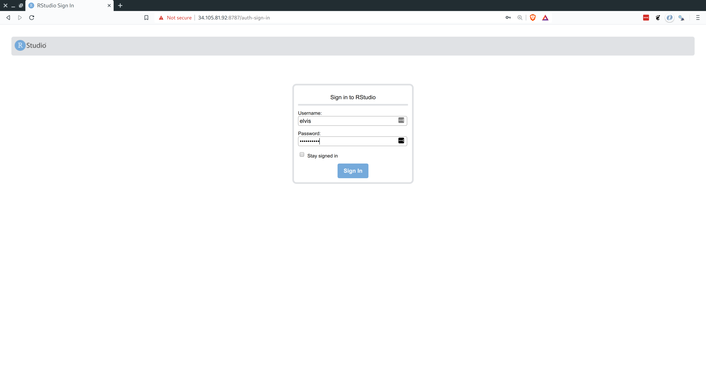
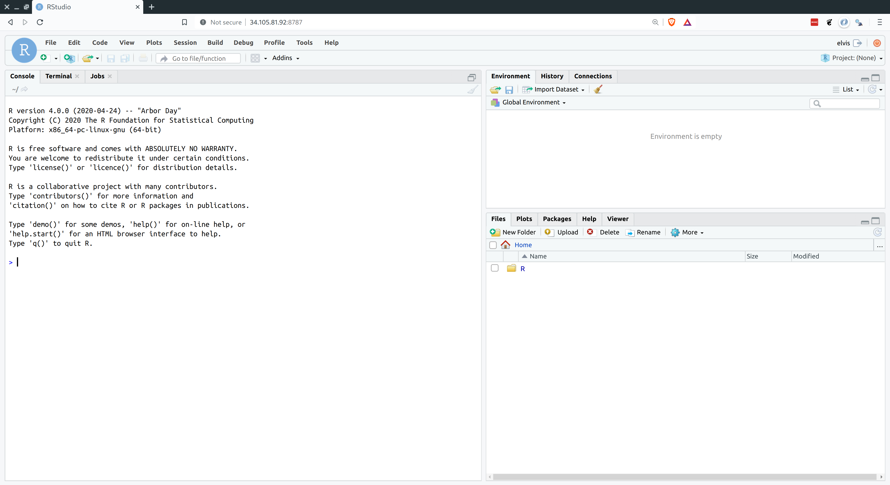
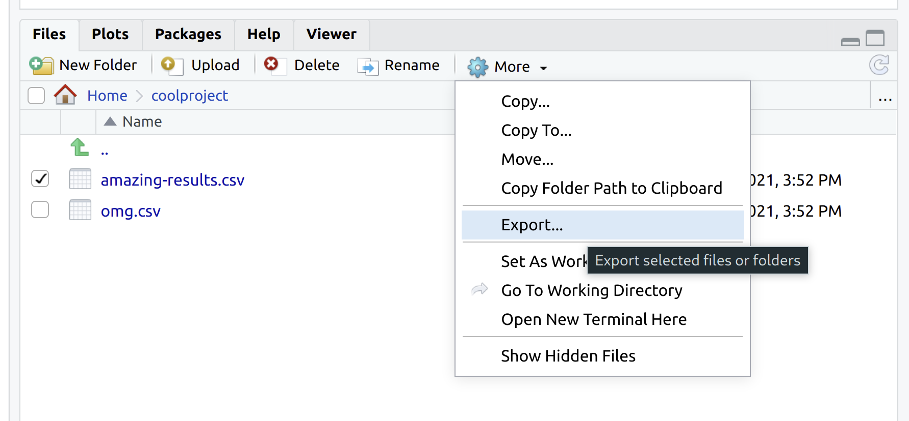

```{r setup, include=FALSE}
knitr::opts_chunk$set(echo = TRUE, cache = TRUE, eval = FALSE, prompt = FALSE, dpi=300)
## Next hook based on this SO answer: https://stackoverflow.com/a/39025054
# knitr::knit_hooks$set(
#   prompt = function(before, options, envir) {
#     options(
#       prompt = if (options$engine %in% c('sh','bash')) '$ ' else 'R> ',
#       continue = if (options$engine %in% c('sh','bash')) '$ ' else '+ '
#       )
#     })
```

*Today is the first of two lectures on Google Compute Engine. In these two lectures, I'm going to show you how to run R and RStudio Server on virtual machines (VMs) up on the cloud. This means that you'll be able to conduct your analysis in (almost) exactly the same user environment as you’re used to, but now with the full power of cloud-based computation at your disposal. Trust me, it will be awesome.*

## Requirements

### Create an account on Google Cloud Platform (free)

These next instructions are important, so please read carefully.

1. Sign up for a [12-month ($300 credit) free trial](https://console.cloud.google.com/freetrial) with Google Cloud Platform (GCP). This requires an existing Google/Gmail account.^[If you have multiple Gmail accounts, please pick one and stick to it consistently whenever you are prompted to authenticate a new GCP service API.] During the course of sign-up, you'll be prompted to enter credit card details for billing purposes. Don't worry, you won't be charged unless/until you actively request continued access to GCP after your free trial ends. But a billable project ID is required before gaining access to the platform.
2. Download and follow the installation instructions for the [Google Cloud SDK](https://cloud.google.com/sdk/) command line utility, `gcloud`. This is how we'll connect to GCP from our local computers via the shell.

## Introduction

### To the cloud!

Thus far in the course, we've spent quite a lot of time learning how to code efficiently. We've covered topics like [functional programming](https://raw.githack.com/uo-ec607/lectures/master/10-funcs-intro/10-funcs-intro.html#functional_programming), [caching](https://raw.githack.com/uo-ec607/lectures/master/11-funcs-adv/11-funcs-adv.html#caching_(memoisation)), [parallel programming](https://raw.githack.com/uo-ec607/lectures/master/12-parallel/12-parallel.html), and so on. All of these tools will help you make the most of the computational resources at your disposal. However, there's a limit to how far they can take you. At some point, datasets become too big, simulations become too complex, and regressions take too damn long to run to run on your laptop. The only solution beyond this point is ~~more power~~ MOAR POWA.

<p align="center">

</p>

The easiest and cheapest way to access more computational power these days is through the cloud.^[While the cloud is not the only game in town, it offers a variety benefits that, in my view, make it a no-brainer for most people: economies of scale make it much cheaper; maintenance and depreciation worries are taken care of; access does not hinge on institutional affiliation or faculty status; cloud providers offer a host of other useful services; etc.] While there are a number of excellent cloud service providers, I'm going to focus on [**Google Cloud Platform**](https://console.cloud.google.com/) (**GCP**).^[Alternatives to GCP include [AWS](https://aws.amazon.com/) and [Digital Ocean](https://www.digitalocean.com/). RStudio recently launched its own cloud service too: [RStudio Cloud](https://rstudio.cloud/) is more narrowly focused, but is great for teaching and is (currently) free to use. The good news is that these are all great options and the general principles of cloud computing carry over very easily. So use whatever you feel comfortable with.] GCP offers a range of incredibly useful services --- some of which we'll cover in later lectures --- and the 12-month free trial makes an ideal entry point for learning about cloud computation. 

The particular GCP product that we're going to use today is [**Google Compute Engine**](https://cloud.google.com/compute/) (**GCE**). GCE is a service that allows users to launch so-called *virtual machines* on demand in the cloud (i.e. on Google's data centers). There's a lot more that I can say --- and will say later --- about the benefits can bring to us. But right now, you may well be asking yourself: "What is a virtual machine and why do I need one anyway?" 

So, let's take a step back and quickly clear up some terminology. 

### Virtual machines (VMs)

A [virtual machine (VM)](https://en.wikipedia.org/wiki/Virtual_machine) is just an emulation of a computer running inside another (bigger) computer. It can potentially perform all and more of the operations that your physical laptop or desktop does. It might even share many of the same properties, from operating system to internal architecture. The key advantage of a VM from our perspective is that very powerful machines can be "spun up" in the cloud almost effortlessly and then deployed to tackle jobs that are beyond the capabilities of your local computer. Got a big dataset that requires too much memory to analyse on your old laptop? Load it into a high-powered VM. Got some code that takes an age to run? Fire up a VM and let it chug away without consuming any local resources. Or, better yet, write code that [runs in parallel](https://raw.githack.com/uo-ec607/lectures/master/12-parallel/12-parallel.html) and then spin up a VM with lots of cores to get the analysis done in a fraction of the time. All you need is a working internet connection and a web browser.

Now, with that background knowledge in mind, GCE delivers high-performance, rapidly scalable VMs. A new VM can be deployed or shut down within seconds, while existing VMs can easily be ramped up or down depending on a project's needs (cores added, RAM added, etc.) In my experience, most people would be hard-pressed to spent more than a couple of dollars a month using GCE once their free trial is over. This is especially true for researchers or data scientists who only need to fire up a VM, or VM cluster, occasionally for the most computationally-intensive part of a project, and then can easily switch it off when it is not being used.

**Disclaimer:** While I very much stand by the above paragraph, it is ultimately *your* responsibility to keep track of your billing and utilisation rates. Take a look at [GCP's Pricing Calculator](https://cloud.google.com/products/calculator/) to see how much you can expect to be charged for a particular machine and level of usage. You can even [set a budget and create usage alerts](https://support.google.com/cloud/answer/6293540?hl=en) if you want to be extra cautious.

### Roadmap

Our goal for the next two lectures is to set up a VM (or cluster of VMs) on GCE. What's more, we want to install R and RStudio (Server) on these VMs, so that we can interact with them in exactly the same way that we're used to on our own computers. I'm going to show you two approaches:

1. Manually configure GCE with RStudio Server (today)
2. Automate with **googleComputeEngineR** and friends (next lecture)

Both approaches have their merits, but I think it's important to start with the manual configuration so that you get a good understanding of what's happening underneath the hood. Let's get started.

## Install R and RStudio Server on GCE

*<b>Note:</b> It's possible to complete nearly all of the steps in this section via the [GCE browser console](https://console.cloud.google.com/compute/instances). However, we'll stick to using the [shell](https://raw.githack.com/uo-ec607/lectures/master/03-shell/03-shell.html), because that will make it easier to document our steps.*

*<b>Windows users:</b> You will need to run any multi-line commands (i.e. those that are chained with the [backslash](https://www.gnu.org/software/bash/manual/html_node/Escape-Character.html#Escape-Character) character) as single line commands. Basically, delete the trailing "`\`" characters at the end of any sub-lines and run it as one long command on a single line.*


### Confirm that you have installed `gcloud` correctly

You'll need to choose an operating system (OS) for your VM, as well as its designated zone. Let's quickly look at the available options, since this will also be a good time to confirm that you correctly installed the [`gcloud` command-line interface](https://cloud.google.com/sdk/). Open up your shell and enter:
```{bash}
## user@localhost:~$

gcloud compute images list
gcloud compute zones list
```

> **Tip:** If you get an error message with the above commands, try re-running them with [`sudo`](https://en.wikipedia.org/wiki/Sudo) at the beginning. If this works for you, then you will need to append "sudo" to the other shell commands in this lecture.

You'll know that everything is working properly if these these commands return a large range of options. If you get an error, please try [reinstalling](https://cloud.google.com/sdk/) `gcloud` again before continuing.

### Create a VM

The key shell command for creating your VM is **`gcloud compute instances create`**.
You can specify the type of machine that you want and a range of other options by using the [appropriate flags](https://cloud.google.com/sdk/gcloud/reference/compute/instances/create). Let me first show you an example of the command and then walk through my (somewhat arbitrary) choices in more detail. Note that I am going to call my VM instance "my-vm", but you can call it whatever you want.

```{bash}
## user@localhost:~$

gcloud compute instances create my-vm \
  --image-family ubuntu-2004-lts --image-project ubuntu-os-cloud \
  --machine-type n1-standard-8 \
  --zone us-west1-a
```

> **Tip:** Windows users, remember that you can't execute multi-line shell commands. Delete the trailing "`\`" characters above and run it as one long command on a single line.

Here is a breakdown of the command and a quick explanation of my choices.

- `gcloud compute instances create my-vm`: Create a new VM called "my-vm". Yes, I am very creative.
- `--image-family ubuntu-2004-lts --image-project ubuntu-os-cloud`: Use Ubuntu 20.04 as the underlying operating system.
- `--machine-type n1-standard-8`: I've elected to go with the "N1 Standard 8" option, which means that I'm getting 8 CPUs and 30GB RAM. However, you can choose from a [range](https://cloud.google.com/compute/pricing) of machine/memory/pricing options. (Assuming a monthly usage rate of 20 hours, this particular VM will only [cost about](https://cloud.google.com/products/calculator/#id=efc1f1b1-175d-4860-ad99-9006ea39651b) $7.60 a month to maintain once our free trial ends.) You needn't worry too much about these initial specs now. New VMs are very easy to create and discard once you get the hang of it. It's also very simple to change the specs of an already-created VM. GCE will even suggest cheaper specifications if it thinks that you aren't using your resources efficiently down the line.
- `--zone us-west1-a`: My preferred zone. The zone choice shouldn't really matter, although you'll be prompted to choose one if you forget to include this flag. As a general rule, I advise picking whatever's closest to you.^[You can also set the default zone so that you don't need to specify it every time. See [here](https://cloud.google.com/compute/docs/gcloud-compute/#set_default_zone_and_region_in_your_local_client).] 

Assuming that you ran the above command (perhaps changing the zone to one nearest you), you should see something like the following:

```
Created [https://www.googleapis.com/compute/v1/projects/YOUR-PROJECT/zones/YOUR-ZONE/instances/YOUR-VM].
NAME   ZONE        MACHINE_TYPE   PREEMPTIBLE  INTERNAL_IP    EXTERNAL_IP   STATUS
my-vm  us-west1-a  n1-standard-8               10.138.15.222  34.105.81.92  RUNNING
```

Write down the External IP address, as we'll need it for running RStudio Server later.^[This IP address is "ephemeral" in the sense that it is only uniquely assigned to your VM while it is running continuously. This shouldn't create any significant problems, but if you prefer a static (i.e. non-ephemeral) IP address that is always going to be associated with a particular VM instance, then this is easily done. See [here](https://cloud.google.com/compute/docs/configure-instance-ip-addresses#assign_new_instance).] 

#### Allow RStudio's 8787 port via a firewall rule (only once)

RStudio Server runs on port 8787 of an associated IP address. Because Google Cloud by default blocks external traffic on GCE VMs for security reasons, we first need to enable the 8787 port via a [firewall rule](https://cloud.google.com/vpc/docs/firewalls). The following command creates a firewall rule (which I'm calling "rstudio") that does exactly this.

```{bash}
## user@localhost:~$

gcloud compute firewall-rules create rstudio --allow=tcp:8787
```

Note that these firewall rules across every VM in a project. So you should only have to run the above command **once**. ^[While I don't cover it in this tutorial, anyone looking to install and run [Jupyter Notebooks](http://jupyter.org/) on their VM could simply amend the above command to Jupyter's default port of 8888.]

### Logging in

Congratulations: Set-up for your GCE VM instance is already complete.

(Easy, wasn't it?)

The next step is to log in via **SSH** (i.e. [**S**ecure **Sh**ell](https://en.wikipedia.org/wiki/Secure_Shell)). This is a simple matter of providing your VM's name and zone. If you forget to specify the zone or haven't assigned a default, you'll be prompted.

```{bash}
## user@localhost:~$

gcloud compute ssh my-vm --zone us-west1-a
```

**IMPORTANT:** Upon logging into a GCE instance via SSH for the first time, you will be prompted to generate a key passphrase. Needless to say, you should *make a note of this passphrase* for future long-ins. Your passphrase will be required for all future remote log-ins to Google Cloud projects via `gcloud` and SSH from your local computer. This includes additional VMs that you create under the same project account.

Passphrase successfully created and entered, you should now be connected to your VM via SSH. That is, you should see something like the following, where "grant" and "my-vm" will obviously be replaced by your own username and VM hostname.

```{bash}
grant@my-vm:~$
```

Next, we'll install R on our VM.

### Install R

You can find the full set of instructions and recommendations for installing R on Ubuntu [here](https://cran.r-project.org/bin/linux/ubuntu/README.html). Or you can just follow my choices below, which should cover everything that you need. Note that you should be running these commands directly in the shell that is connected to your VM.

```{bash}
## grant@my-vm:~$

sudo sh -c 'echo "deb https://cloud.r-project.org/bin/linux/ubuntu focal-cran40/" >> \
  /etc/apt/sources.list'
sudo apt-key adv --keyserver keyserver.ubuntu.com \
  --recv-keys E298A3A825C0D65DFD57CBB651716619E084DAB9
sudo apt update && sudo apt upgrade -y
sudo apt install -y r-base r-base-dev
```

**Aside:** Those `apt` commands are referring to the [Aptitude](https://wiki.debian.org/Aptitude) package management system. Think of it like of [Homebrew](https://brew.sh/) for Ubuntu (and other Debian-based Linux distributions).

Base R is now installed and ready to go on your VM. However, I'm going to walk you through a two extra steps, since this will avoid some common headaches down the road.

First, we're going to change where we get our R libraries from:

```{bash}
## grant@my-vm:~$

sudo sh -c 'echo "options(repos = c(RSPM = \"https://packagemanager.rstudio.com/all/__linux__/focal/latest\"))" \
  >> `R RHOME`/etc/Rprofile.site'
```

The above command sets our default library source to [RStudio Package Manager (**RSPM**)](https://packagemanager.rstudio.com/client/#/repos/1/overview), instead of the usual CRAN mirror(s). Why would we do this? Well, because RSPM provides precompiled R package _binaries_ for Linux, whereas CRAN requires us to install and build from source. I don't want you to worry too much about this.^[If you really want to know more about the difference between "binary" vs "compiled from source", here's a simple analogy. A package binary is like a cake that we bought from the supermarket, while compiling a package from source is like us baking the cake at home. Why would you want to buy the cake from a supermarket? Well, it's quicker and you might not have all the ingredients at home. Why would you make the cake yourself? Well, you might have better quality ingredients and know slightly better recipe.] Just trust me that the above command will allow us to install R packages much faster and with fewer hiccups.

Second, let's install some additional system libraries on our VM: 

```{bash}
## grant@my-vm:~$ 

sudo apt install -y libudunits2-dev libgdal-dev gdal-bin libgeos-dev libproj-dev \
  libcairo2-dev
```

The above system libraries are needed to power some common R packages under the hood. For example, we've just installed the underlying geospatial libraries that support the **sf** package.

### Install and configure RStudio Server

If you followed my steps above, then you could already launch directly into R from the shell.^[Enter "R" into your shell window to confirm for yourself. If you do, make sure to quit afterwards by typing in "q()".] However, we'd obviously prefer to use the awesome IDE interface provided by RStudio (Server). So that's what we'll install and configure next, making sure that we can run RStudio Server on our VM via a web browser from our local computer. 

#### Download RStudio Server on your VM

You should check what the latest available version of Rstudio Server is [here](https://rstudio.com/products/rstudio/download-server/debian-ubuntu/). At the time of writing, the following is what you need:

```{bash}
## grant@my-vm:~$

sudo apt install gdebi-core
wget https://download2.rstudio.org/server/bionic/amd64/rstudio-server-1.4.1106-amd64.deb
sudo gdebi rstudio-server-1.4.1106-amd64.deb ## Hit "y" when prompted
```

#### Add a user

Now that you're connected to your VM, you might notice that you never actually logged in as a specific user. (More discussion [here](https://groups.google.com/forum/#!msg/gce-discussion/DYfDOndtRTU/u_3kzNPqDAAJ).) This doesn't matter for most applications, but RStudio Server specifically requires a username/password combination. So we must first create a new user and give them a password before continuing. For example, we can create a new user called "elvis" like so:

```{bash}
## grant@my-vm:~$

sudo adduser elvis
```

You will then be prompted to specify a user password (and confirm various bits of biographical information which you can ignore). An optional, but recommended step is to add your new user to the `sudo` group. We'll cover this in more depth later in the tutorial, but being part of the `sudo` group will allow Elvis to temporarily invoke superuser priviledges when needed.

```{bash}
## grant@my-v m:~$ 

sudo usermod -aG sudo elvis
# grant@my-vm:~$ su - elvis ## Log in as elvis on SSH (optional)
```

> **Tip:** Once created, you can now log into a user's account on the VM directly via SSH, e.g. `gcloud compute ssh elvis@my-vm --zone us-west1-a`

#### Navigate to the RStudio Server instance in your browser

You are now ready to open up RStudio Server by navigating to the default 8787 port of your VM's External IP address. (You remember writing this down earlier, right?) If you forgot to write the IP address down, don't worry: You can find it by logging into your Google Cloud console and looking at your [VM instances](https://console.cloud.google.com/compute/instances), or by opening up a new shell window (**not** the one currently connected to your VM) and typing:

```{bash}
## user@localhost:~$

gcloud compute instances describe my-vm | grep 'natIP'
```

Either way, once you have the address, open up your preferred web browser and navigate to:

http://EXTERNAL-IP-ADDRESS:8787

You will be presented with the following web page. Log in using the username/password that you created earlier.



And we're all set. Here is RStudio Server running on my laptop via Google Chrome.



> **Tip:** Hit F11 to go full screen in your browser. The server version of RStudio is then virtually indistinguishable from the desktop version.

### Stopping and (re)starting your VM instance

Stopping and (re)starting your VM instance is a highly advisable, since you don't want to get billed for times when you aren't using it. In a new shell window (not the one currently synced to your VM instance):
```{bash}
## user@localhost:~$

gcloud compute instances stop my-vm
gcloud compute instances start my-vm
```

### Summary

Contratulations! You now have a fully-integrated VM running R and RStudio whenever you need it. Assuming that you have gone through the initial setup, here's the **tl;dr** summary of how to deploy an existing VM with RStudio Server:

1) Start up your VM instance.
  ```{bash}
  gcloud compute instances start YOUR-VM-INSTANCE-NAME
  ```
2) Take note of the External IP address for step 3 below.
  ```{bash}
  gcloud compute instances describe YOUR-VM-INSTANCE-NAME | grep 'natIP'
  ```
3) Open up a web browser and navigate to RStudio Server on your VM. Enter your username and password as needed. http://EXTERNAL-IP-ADDRESS:8787

4) Log-in via SSH. (Optional)
  ```{bash}
  gcloud compute ssh YOUR-VM-INSTANCE-NAME
  ```
5) Stop your VM.
  ```{bash}
  gcloud compute instances stop YOUR-VM-INSTANCE-NAME
  ```
And, remember, if you really want to avoid the command line, then you can always go through the [GCE browser console](https://console.cloud.google.com/home/dashboard).

## Getting the most out of R on your GCE setup

You have already completed all of the steps that you'll need for high-performance computing in the cloud. Any VM that you create on GCE using the above methods will be ready to go with RStudio Server whenever you want it. However, there are still a few more tweaks and tips that we can use to really improve our user experience and reduce complications when interacting with these VMs from our local computers. The rest of this tutorial covers my main tips and recommendations.

### Keep your system up to date

First things first: Remember to keep your VM up to date, just like you would a normal computer. I recommend that you run the following command (really: two commands) regularly:
```{bash}
## grant@my-vm:~$

sudo apt update && sudo apt upgrade
```

You can also update the `gcloud` utility components on your local computer (i.e. not your VM) with the following command:

```{bash}
## user@localhost:~

gcloud components update
```


### Transfer and sync files between your VM and your local computer

You have three main options.

#### 1. Manually transfer files directly from RStudio Server

RStudio's "Files" pane (at the bottom-right) provides various options for moving files and directories around. This includes *uploading* from your local computer to VM, or *exporting* the other way around --- see the screenshot below. This is arguably the simplest option and works especially well for quick or small jobs.



#### 2. Manually transfer files and folders using the command line or SCP

Manually transferring files or folders across systems is done fairly easily using the command line. Note that this next code chunk would be run in a new shell instance (i.e. not the one connected to your VM via SSH).

```{bash}
## user@localhost:~

gcloud compute scp \
  my-vm:/home/elvis/amazingresults.csv \
  ~/locdir/amazingresults-copy.csv \
  --zone us-west1-a
```

It's also possible to transfer files using your regular desktop file browser thanks to SCP. (On Linux and Mac OSX at least. Windows users first need to install a program call WinSCP.) See [here](https://cloud.google.com/compute/docs/instances/transfer-files).

> **Tip:** The file browser-based SCP solution is much more efficient when you have assigned a static IP address to your VM instance — otherwise you have to set it up each time you restart your VM instance and are assigned a new ephemeral IP address — so I'd advise doing that [first](https://cloud.google.com/compute/docs/configure-instance-ip-addresses#assign_new_instance).

#### 3. Sync with GitHub or other cloud service

This is my own preferred option. Ubuntu, like all virtually Linux distros, comes with Git preinstalled. You should thus be able to sync your results across systems using Git(Hub) in the [usual fashion](http://happygitwithr.com/). I tend to use the command line for all my Git operations (committing, pulling, pushing, etc.) and this works exactly as expected once you've SSH'd into your VM. However, Rstudio Server's built-in Git UI also works well and comes with some nice added functionality (highlighted diff. sections and so forth).

While I haven't tried it myself, you should also be able to install [Box](http://xmodulo.com/how-to-mount-box-com-cloud-storage-on-linux.html), [Dropbox](https://www.linuxbabe.com/ubuntu/install-dropbox-ubuntu-20-04) or [Google Drive](http://www.techrepublic.com/article/how-to-mount-your-google-drive-on-linux-with-google-drive-ocamlfuse/) on your VM and sync across systems that way. If you go this route, then I'd advise installing these programs as sub-directories of the user's "home" directory. Even then you may run into problems related to user permissions. However, just follow the instructions for linking to the hypothetical "TeamProject" folder that I describe below (except that you must obviously point towards the relevant Box/Dropbox/GDrive folder location instead) and you should be fine.

> **Tip:** Remember that your VM lives on a server and doesn't have the usual graphical interface — including installation utilities — of a normal desktop. You'll thus need to follow command line installation instructions for these programs. Make sure you scroll down to the relevant sections of the links that I have provided above.

Last, but not least, Google themselves encourage data synchronisation on GCE VMs using another product within their Cloud Platform, i.e. [Google Storage](https://cloud.google.com/storage/). This is especially useful for really big data files and folders, but beyond the scope of this lecture. (If you're interested in learning more, see [here](https://cloud.google.com/solutions/filers-on-compute-engine) and [here](https://cloud.google.com/compute/docs/disks/gcs-buckets).)

## Further resources

In the next lecture, I'll build on today's material by showing you how to automate a lot of steps with the **googleComputeEngineR** package and related tools. In the meantime, here are some further resources that you might find useful.

- I recommend consulting the official [GCE documentation](https://cloud.google.com/compute/docs/) if you ever get stuck. There's loads of useful advice and extra tips for getting the most out of your VM setup, including ways to integrate your system with other GCP products like Storage, BigQuery, etc. 
- Other useful links include the [RStudio Server documentation](https://support.rstudio.com/hc/en-us/articles/234653607-Getting-Started-with-RStudio-Server), and the [Linux Journey guide](https://linuxjourney.com/) for anyone who wants to learn more about Linux (yes, you!).

## Bonus material

### Install the Intel Math Kernel Library (MKL) or OpenBLAS/LAPACK

As we discussed in the previous lecture on [parallel programming](https://raw.githack.com/uo-ec607/lectures/master/12-parallel/12-parallel.html), R ships with its own BLAS/LAPACK libraries by default. While this default works well enough, you can get *significant* speedups by switching to more optimized libraries such as the [Intel Math Kernel Library (MKL)](https://software.intel.com/en-us/mkl) or [OpenBLAS](https://www.openblas.net/). The former is slightly faster according to the benchmark tests that I've seen, but was historically harder to install. However, thanks to [Dirk Eddelbuettel](https://github.com/eddelbuettel/mkl4deb), this is now very easily done:

```{bash}
## grant@my-vm:~$ 

git clone https://github.com/eddelbuettel/mkl4deb.git
sudo bash mkl4deb/script.sh
```

Wait for the script to finish running. Once it's done, your R session should automatically be configured to use MKL by default. You can check yourself by opening up R and checking the `sessionInfo()` output, which should return something like:
```
Matrix products: default
BLAS/LAPACK: /opt/intel/compilers_and_libraries_2018.2.199/linux/mkl/lib/intel64_lin/libmkl_rt.so
```
(Note: Dirk's script only works for Ubuntu and other Debian-based Linux distros. If you decided to spin up a different OS for your VM than we did in this tutorial, then you are probably better off [installing OpenBLAS](https://github.com/xianyi/OpenBLAS/wiki/Precompiled-installation-packages).)


### Share files and libraries between multiple users on the same VM

The default configuration that I have described above works perfectly well in cases where you are a single user and don't venture outside of your home directory (and its sub directories). Indeed, you can just add new folders within this user's home directory using [standard Linux commands](https://linuxjourney.com/lesson/make-directory-mkdir-command) and you will be able to access these from within RStudio Server when you log in as that user.

However, there's a slight wrinkle in cases where you want to share information between *multiple* users on the same VM. (Which may well be necessary on a big group project.) In particular, RStudio Server is only going to be able to look for files in each individual user's home directory (e.g. `/home/elvis`.) Similarly, by default on Linux, the R libraries that one user installs [won't necessarily](https://stackoverflow.com/a/44903158) be available to other users.

The reason has to do with user permissions; since Elvis is not an automatic "superuser", RStudio Server doesn't know that he is allowed to access other users' files and packages in our VM, and vice versa. Thankfully, there's a fairly easy workaround, involving standard Linux commands for adding user and group privileges (see [these slides](https://raw.githack.com/uo-ec607/lectures/master/03-shell/03-shell.html#permissions) from our shell lecture). Here's an example solution that should cover most cases:

#### Share files across users

Let's say that Elvis is working on a joint project together with a colleague called Priscilla. (Although, some say they are more than colleagues...) They have decided to keep all of their shared analysis in a new directory called `TeamProject`, located within Elvis's home directory. Start by creating this new shared directory:

```{bash}
## grant@my-vm:~$ 

sudo mkdir /home/elvis/TeamProject
```

Presumably, a real-life Priscilla would already have a user profile at this point. But let's quickly create one too for our fictional version.

```{bash}
## grant@my-vm:~$ 

sudo adduser priscilla
```

Next, we create a user group. I'm going to call it "projectgrp", but as you wish. The group setup is useful because once we assign a set of permissions to a group, any members of that group will automatically receive those permissions too. With that in mind, we should add Elvis and Priscilla to "projectgrp" once it is created:

```{bash}
# grant@my-vm:~$ 

sudo groupadd projectgrp
sudo gpasswd -a elvis projectgrp
sudo gpasswd -a priscilla projectgrp
```

Now we can set the necessary ownership permissions to the shared `TeamProject` directory. First, we use the `chown` command to assign ownership of this directory to a default user (in this case, "elvis") and the other "projectgrp" members. Second, we use the `chmod 770` command to grant them all read, write and execute access to the directory. In both both cases, we'll use the `-R` flag to recursively set permissions to all children directories of `TeamProject/` too.

```{bash}
##grant@my-vm:~$

sudo chown -R elvis:projectgrp /home/elvis/TeamProject
sudo chmod -R 770 /home/elvis/TeamProject
```

The next two commands are optional, but advised if Priscilla is only going to be working on this VM through the `TeamProject` directory. First, you can change her primary group ID to "projectgrp", so that all the files she creates are automatically assigned to that group:

```{bash}
## grant@my-vm:~$

sudo usermod -g projectgrp priscilla
```

Second, you can add a symbolic link to the `TeamProject` directory in Priscilla's home directory, so that it is immediately visible when she logs into RStudio Server. (Making sure that you switch to her account before running this command):

```{bash}
## grant@my-vm:~$ 

sudo su - priscilla

## priscilla@my-vm:~$ 

ln -s /home/elvis/TeamProject /home/priscilla/TeamProject
exit

## grant@my-vm:~$
```

##### Share R libraries (packages) across users

By default, each R package that a user installs will only be available to her.
Now, sharing R libraries across users is less critical than being able to share files. However, it's still potentially annoying having to install, say, **rstan** when your colleague has already installed it under her user account. Luckily, the solution here very closely mimics the solution to file sharing that we've just seen above: We're going to set a default system-wide R library path and give all of our users access to that library via a group. For convenience I'm just going to continue with the "projectgrp" group that we created above. However, you could also create a new group (say, "rusers"), add individual users to it, and proceed that way if you wanted to.

The first thing to do is change the permission on our system-wide R library (i.e. what you get if you type `R RHOME` in the shell). We're going to assign read, write, and execute permissions to all of the members of our group. I'll use the `-R` flag to do so recursively.

```{bash}
## grant@my-vm:~$

sudo chown elvis:projectgrp -R `R RHOME`
sudo chmod -R 775 `R RHOME`
```

Once that's done, tell R to make this shared library path the default for your user, by adding it to their `~/.Renviron` file. For example, here's how I'd do it for "elvis".

```{bash}
## grant@my-vm:~$ 

su - elvis

## elvis@my-vm:~$

`R RHOME`/library ## Check library path. Should be /usr/lib/R/library

echo 'export PATH="R_LIBS_USER=/usr/lib/R/library"' >> ~/.Renviron
```

The R packages that Elvis installs should now be immediately available to Priscilla and vice versa.

> **Tip:** If you've already installed some packages in a local (i.e. this-user-only) library path before creating the system-wide setup, you can just move them across with the ['mv'](https://linuxjourney.com/lesson/move-mv-command) command. Something like the following should work, but you'll need to check the appropriate paths yourself: `elvis@my-vm:~$ sudo mv "/home/elvis/R/x86_64-pc-linux-gnu-library/3.5/*" /usr/lib/R/library`.