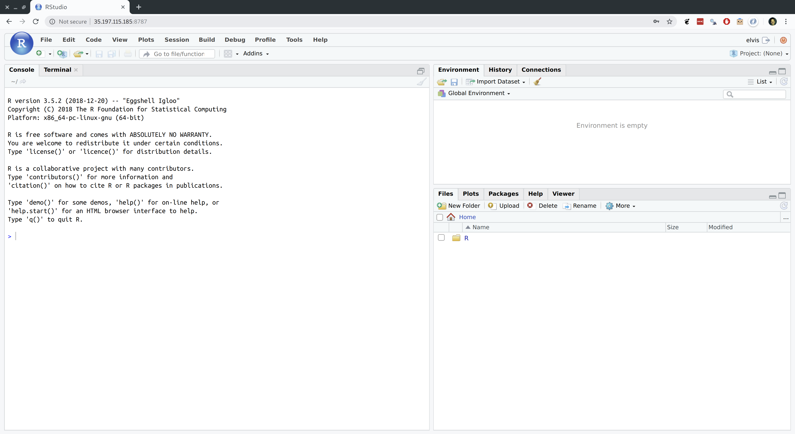

```{r setup, include=FALSE}
knitr::opts_chunk$set(echo = TRUE, cache = TRUE, dpi=300)
## Next hook based on this SO answer: https://stackoverflow.com/a/39025054
knitr::knit_hooks$set(
  prompt = function(before, options, envir) {
    options(
      prompt = if (options$engine %in% c('sh','bash')) '$ ' else 'R> ',
      continue = if (options$engine %in% c('sh','bash')) '$ ' else '+ '
      )
    })
```

This is the first of several lectures on cloud and high-performance computing. Today you'll learn how to run virtual machines (VMs) in the cloud with Google Compute Engine. In addition, I’ll show you how to install RStudio Server on your VMs, so that you can perform your analysis in exactly the same user environment as you’re used to, but now with the full power of cloud-based computation at your disposal. Trust me, it will be awesome.

## Requirements

### Create an account on Google Cloud Platform (free)

These next instructions are important, so please read carefully.

1. Sign up for a [12-month ($300 credit) free trial](https://console.cloud.google.com/freetrial) with Google Cloud Platform. This requires an existing Google/Gmail acount.^[If you have multiple Gmail accounts, please pay attention to which one you are using. (E.g. You might have two Gmail accounts, where one is your personal Gmail and the other is linked to your university email.) Needless to say, you'll want to make sure that you use the *same* account when setting up the gloud utility in Step 2. This might all sound obvious, but it has been the primary sticking point during live tutorials, where people encounter a bunch of puzzling authentication errors simply because they aren't using a consistent account.] During the course of sign-up, you should [create a project](https://cloud.google.com/resource-manager/docs/creating-managing-projects) that will be associated with billing. This is purely ceremonial at present — we're using the free trial period after all — but a billable project ID is required before gaining access to the platform.
2. Download and follow the installation instructions for the Google Cloud SDK command line utility, `gcloud` [here](https://cloud.google.com/sdk/).

### R packages 

- **New:** `googleComputeEngineR`, `usethis`
- **Already used:** `future.apply`, `data.table`, `tictoc`

I don't think it's strictly necessary, but I'm going to install the development version of `googleComputeEngineR`. I'm also going to hold off loading it until I've enabled auto-authentication later in the lecture. Don't worry about that now. Just run the following code chunk to get started.

```{r, cache=F, message=F}
## Load/install packages
if (!require("pacman")) install.packages("pacman")
pacman::p_install_gh("cloudyr/googleComputeEngineR") ## Use the development version of googleComputeEngineR
pacman::p_load(future.apply, tictoc, data.table, usethis)
```

## Introduction

### To the cloud!

Thus far in the course, we've spent quite a lot of time learning how to code efficiently. We've covered topics like [functional programming](https://raw.githack.com/uo-ec607/lectures/master/10-funcs-intro/10-funcs-intro.html#functional_programming), [results caching](https://raw.githack.com/uo-ec607/lectures/master/11-funcs-adv/11-funcs-adv.html#caching_(memoization)), [parallel programming](https://raw.githack.com/uo-ec607/lectures/master/12-parallel/12-parallel.html), and so on. All of these tools will help you make the most of the computational resources at your disposal. However, there's a limit to how far they can take you. At some point, datasets become too big, simulations become too complex, and regressions take too damn long to run to run on your laptop. The only solution beyond this point is ~~more power~~ MOAR POWA.

<p align="center">

</p>

The easiest and cheapest way to access more computational power these days is through the cloud.^[While the cloud is not the only game in town, it offers a variety benefits that, in my view, make it a no-brainer for most people: economies of scale make it much cheaper; maintenance and depreciation worries are taken care of; access does not hinge on institutional affiliation or faculty status; cloud providers offer a host of other useful services; etc.] While there are a number of excellent cloud service providers, I'm going to focus on [**Google Cloud Platform**](https://console.cloud.google.com/) (**GCP**).^[Alternatives to GCP include [AWS](https://aws.amazon.com/) and [Digital Ocean](https://www.digitalocean.com/). RStudio recently launched its own cloud service too: [RStudio Cloud](https://rstudio.cloud/) is more narrowly focused, but is great for teaching and is (currently) free to use. The good news is that these are all great options and the general principles of cloud computing carry over very easily. So use whatever you feel comfortable with.] GCP offers a range of incredibly useful services --- some of which we'll cover in later lectures --- and the 12-month free trial makes an ideal entry point for learning about cloud computation. 

The particular GCP product that we're going to use today is [**Google Compute Engine**](https://cloud.google.com/compute/) (**GCE**). GCE is a service that allows users to launch so-called *virtual machines* on demand in the cloud (i.e. on Google's data centers). There's a lot more that I can say --- and will say later --- about the benefits can bring to us. But right now, you may well be asking yourself: "What is a virtual machine and why do I need one anyway?" 

So, let's take a step back and quickly clear up some terminology. 

### Virtual machines (VMs)

A [virtual machine (VM)](https://en.wikipedia.org/wiki/Virtual_machine) is just an emulation of a computer running inside another (bigger) computer. It can potentially perform all and more of the operations that your physical laptop or desktop does. It might even share many of the same properties, from operating system to internal architecture. The key advantage of a VM from our perspective is that very powerful machines can be "spun up" in the cloud almost effortlessly and then deployed to tackle jobs that are beyond the capabilities of your local computer. Got a big dataset that requires too much memory to analyse on your old laptop? Load it into a high-powered VM. Got some code that takes an age to run? Fire up a VM and let it chug away without consuming any local resources. Or, better yet, write code that [runs in parallel](https://raw.githack.com/uo-ec607/lectures/master/12-parallel/12-parallel.html) and then spin up a VM with lots of cores to get the analysis done in a fraction of the time. All you need is a working internet connection and a web browser.

Now, with that background knowledge in mind, GCE delivers high-performance, rapidly scalable VMs. A new VM can be deployed or shut down within seconds, while existing VMs can easily be ramped up or down depending on a project's needs (cores added, RAM added, etc.) In my experience, most people would be hard-pressed to spent more than a couple of dollars a month using GCE once their free trial is over. This is especially true for researchers or data scientists who only need to fire up a VM, or VM cluster, occasionally for the most computationally-intensive part of a project, and then can easily switch it off when it is not being used.

**Disclaimer:** While I very much stand by the above paragraph, it is ultimately *your* responsibility to keep track of your billing and utilisation rates. Take a look at [GCP's Pricing Calculator](https://cloud.google.com/products/calculator/) to see how much you can expect to be charged for a particular machine and level of usage. You can even [set a budget and create usage alerts](https://support.google.com/cloud/answer/6293540?hl=en) if you want to be extra cautious.

### Roadmap

Our goal for today is to set up a VM (or cluster of VMs) on GCE. What's more, we want to install R and RStudio (Server) on these VMs, so that we can interact with them in exactly the same way that we're used to on our own computers. I'm going to show you two approaches:

1. Manually configure GCE with RStudio Server
2. Automate with `googleComputeEngineR` and friends

Both approaches have their merits, but I think it's important to start with the manual configuration so that you get a good understanding of what's happening underneath the hood.

## Option 1: Manually configure GCE with RStudio Server

*<b>Note:</b> It's possible to complete nearly all of the steps in this section via the [GCE browser console](https://console.cloud.google.com/compute/instances). However, we'll stick to using the [shell](https://raw.githack.com/uo-ec607/lectures/master/03-shell/03-shell.html), because that will make it easier to document our steps.*

### Confirm that you have installed `gcloud` correctly

You'll need to choose an operating system (OS) for your VM, as well as its designated zone. Let's quickly look at the available options, since this will also be a good time to confirm that you correctly installed the [`gcloud` command-line interface](https://cloud.google.com/sdk/). Open up your shell and enter (without the `$` command prompt):
```{bash eval=F, prompt=T}
gcloud compute images list
gcloud compute zones list
```

> **Tip:** If you get an error message with the above commands, try re-running them with [`sudo`](https://en.wikipedia.org/wiki/Sudo) at the beginning. If this works for you, then you will need to append "sudo" to the other shell commands in this lecture.

You'll know that everything is working properly if these these commands return a large range of options. If you get an error, please try [reinstalling](https://cloud.google.com/sdk/) `gcloud` again before continuing.

### Create a VM

The key shell command for creating your VM is **`gcloud compute instances create`**.
You can specify the type of machine that you want and a range of other options by using the [appropriate flags](https://cloud.google.com/sdk/gcloud/reference/compute/instances/create). Let me first show you an example of the command and then walk through my (somewhat arbitrary) choices in more detail. Note that I am going to call my VM instance "my-vm", but you can call it whatever you want.

```{bash, eval=F, prompt=T}
gcloud compute instances create my-vm --image-family ubuntu-1804-lts --image-project ubuntu-os-cloud  --machine-type n1-standard-8 --zone us-west1-a
```

Here is a breakdown of the command and a quick explanation of my choices.

- `gcloud compute instances create my-vm`: Create a new VM called "my-vm". Yes, I am very creative.
- `--image-family ubuntu-1804-lts --image-project ubuntu-os-cloud`: Use Ubuntu 18.04 as the underlying operating system.
- `--machine-type n1-standard-8`: I've elected to go with the "N1 Standard 8" option, which means that I'm getting 8 CPUs and 30GB RAM. However, you can choose from a [range](https://cloud.google.com/compute/pricing) of machine/memory/pricing options. (Assuming a monthly usage rate of 20 hours, this particular VM will only [cost about](https://cloud.google.com/products/calculator/#id=efc1f1b1-175d-4860-ad99-9006ea39651b) $7.60 a month to maintain once our free trial ends.) You needn't worry too much about these initial specs now. New VMs are very easy to create and discard once you get the hang of it. It's also very simple to change the specs of an already-created VM. GCE will even suggest cheaper specifications if it thinks that you aren't using your resources efficiently down the line.
- `--zone us-west1-a`: My preferred zone. The zone choice shouldn't really matter, although you'll be prompted to choose one if you forget to include this flag. As a general rule, I advise picking whatever's closest to you.^[You can also set the default zone so that you don't need to specify it every time. See [here](https://cloud.google.com/compute/docs/gcloud-compute/#set_default_zone_and_region_in_your_local_client).] 

Assuming that you ran the above command (perhaps changing the zone to one nearest you), you should see something like the following:

```
Created [https://www.googleapis.com/compute/v1/projects/YOUR-PROJECT/zones/YOUR-ZONE/instances/YOUR-VM].
NAME   ZONE        MACHINE_TYPE  PREEMPTIBLE   INTERNAL_IP  EXTERNAL_IP    STATUS
my-vm  us-west1-a  n1-standard-8               10.138.0.2   104.198.7.157  RUNNING
```

Write down the External IP address, as we'll need it for running RStudio Server later.^[This IP address is "ephemeral" in the sense that it is only uniquely assigned to your VM while it is running continuously. This shouldn't create any significant problems, but if you prefer a static (i.e. non-ephemeral) IP address that is always going to be associated with a particular VM instance, then this is easily done. See [here](https://cloud.google.com/compute/docs/configure-instance-ip-addresses#assign_new_instance).] On a similar note, RStudio Server will run on port 8787 of the External IP, which we need to enable via the GCE firewall.^[While I don't cover it in this tutorial, anyone looking to install and run [Jupyter Notebooks](http://jupyter.org/) on their VM could simply amend the above command to Jupyter's default port of 8888.]

```{bash, eval=F, prompt=T}
gcloud compute firewall-rules create allow-my-vm --allow=tcp:8787
```

Congratulations: Set-up for your GCE VM instance is complete.

Easy, wasn't it?

### Logging in

The next step is to log in via **SSH** (i.e. [**S**ecure **Sh**ell](https://en.wikipedia.org/wiki/Secure_Shell)). This is a simple matter of providing your VM's name and zone. (If you forget to specify the zone or haven't assigned a default, you'll be prompted.)

```{bash, eval=F, prompt=T}
gcloud compute ssh my-vm --zone us-west1-a
```

**IMPORTANT:** Upon logging into a GCE instance via SSH for the first time, you will be prompted to generate a key passphrase. Needless to say, you should *make a note of this passphrase* for future long-ins. Your passphrase will be required for all future remote log-ins to Google Cloud projects via `gcloud` and SSH from your local computer. This includes additional VMs that you create under the same project account.

Passphrase successfully created and entered, you should now be connected to your VM via SSH. That is, you should see something like the following, where "grant" and "my-vm" will obviously be replaced by your own username and VM hostname.

```{bash, eval=F}
grant@my-vm:~$
```

For the remainder of this lecture, I'll explicitly use the full command line prompt for any shell instance connected to the VM via SHH (i.e. `grant@my-vm:~$ `). This is so that you don't get confused if we need to switch back to running commands in local-only shell instances (i.e. `$ ` only). 

Next, we'll install R.

### Install R on your VM

You can find the full set of instructions and recommendations for installing R on Ubuntu [here](https://cran.r-project.org/bin/linux/ubuntu/README). Or you can just follow my choices below, which should cover everything that you need. Note that you should be running these commands directly in the shell that is connected to your VM.

```{bash, eval=F}
grant@my-vm:~$ sudo sh -c 'echo "deb https://cloud.r-project.org/bin/linux/ubuntu bionic-cran35/" >> /etc/apt/sources.list'
grant@my-vm:~$ sudo apt-key adv --keyserver keyserver.ubuntu.com --recv-keys E298A3A825C0D65DFD57CBB651716619E084DAB9
grant@my-vm:~$ sudo apt update && sudo apt upgrade ## Hit "y" when prompted
grant@my-vm:~$ sudo apt install r-base r-base-dev ## Again, hit "y" when prompted
```

**Aside:** Those `apt` commands are referring to the [Aptitude](https://wiki.debian.org/Aptitude) package management system. Think of it like of [Homebrew](https://brew.sh/) for Ubuntu (and other Debian Linux distributions).

In addition to the above, a number of important R packages require external Linux libraries that must be installed separately on your VM first. For Ubuntu, we can install these packages with the following commands. Again, hit "y" whenever you are prompted to confirm installation.

1) For the "[tidyverse](http://tidyverse.org/)" suite of packages:
```{bash, eval=F}
grant@my-vm:~$ sudo apt install libcurl4-openssl-dev libssl-dev libxml2-dev
```
2) For the main spatial libraries (sf, sp, rgeos, etc.):
```{bash, eval=F}
grant@my-vm:~$ sudo add-apt-repository -y ppa:ubuntugis/ubuntugis-unstable
grant@my-vm:~$ sudo apt update && apt upgrade
grant@my-vm:~$ sudo apt install libgeos-dev libproj-dev libgdal-dev libudunits2-dev
```

R is now ready to go on our VMs directly from the shell.^[Enter "R" into your shell window to confirm for yourself. If you do, make sure to quit afterwards by typing in "q()".] However, we'd obviously prefer to use the awesome IDE interface provided by RStudio (Server). So that's what we'll install and configure next, making sure that we can run RStudio Server on our VM via a web browser like Chrome or Firefox from our local computer. 

### Install and configure RStudio Server

#### Download RStudio Server on your VM

You should check what the latest available version of Rstudio Server is [here](https://www.rstudio.com/products/rstudio/download-server/), but as of the time of writing the following is what you need:

```{bash, eval=F}
grant@my-vm:~$ sudo apt install gdebi-core
grant@my-vm:~$ sudo wget https://download2.rstudio.org/rstudio-server-1.1.463-amd64.deb
grant@my-vm:~$ sudo gdebi rstudio-server-1.1.463-amd64.deb ## Hit "y" when prompted
```

#### Add a user

Now that you're connected to your VM, you might notice that you never actually logged in as a specific user. (More discussion [here](https://groups.google.com/forum/#!msg/gce-discussion/DYfDOndtRTU/u_3kzNPqDAAJ).) This doesn't matter for most applications, but RStudio Server specifically requires a username/password combination. So we must first create a new user and give them a password before continuing. For example, we can create a new user called "elvis" like so:

```{bash, eval=F}
grant@my-vm:~$ sudo adduser elvis
```

You will then be prompted to specify a user password (and confirm various bits of biographical information which you can ignore). An optional, but recommended step is to add your new user to the `sudo` group. We'll cover this in more depth later in the tutorial, but being part of the `sudo` group will allow Elvis to temporarily invoke superuser priviledges when needed.

```{bash, eval=F}
grant@my-vm:~$ sudo usermod -aG sudo elvis
# grant@my-vm:~$ su - elvis ## Log in as elvis on SSH (optional)
```

> **Tip:** Once created, you can now log into a user's account on the VM directly via SSH, e.g. `gcloud compute ssh elvis@my-vm --zone us-west1-a`

#### Navigate to the RStudio Server instance in your browser

You are now ready to open up RStudio Server by navigating to the default 8787 port of your VM's External IP address. (You remember writing this down earlier, right?) If you forgot to write the IP address down, don't worry: You can find it by logging into your Google Cloud console and looking at your [VM instances](https://console.cloud.google.com/compute/instances), or by opening up a new shell window (**not** the one currently connected to your VM) and typing:

```{bash, eval=F, prompt=T}
gcloud compute instances describe my-vm | grep 'natIP'
```

Either way, once you have the address, open up your preferred web browser and navigate to:

http://EXTERNAL-IP-ADDRESS:8787

You will be presented with the following web page. Log in using the username/password that you created earlier.


And we're all set. Here is RStudio Server running on my laptop via Google Chrome.



> **Tip:** Hit F11 to go full screen in your browser. The server version of RStudio is then virtually indistinguishable from the desktop version.

### Stopping and (re)starting your VM instance

Stopping and (re)starting your VM instance is a highly advisable, since you don't want to get billed for times when you aren't using it. In a new shell window (not the one currently synced to your VM instance):
```{bash, eval=F, prompt=T}
gcloud compute instances stop my-vm
gcloud compute instances start my-vm
```

### Summary

Contratulations! You now have a fully-integrated VM running R and RStudio whenever you need it. Assuming that you have gone through the initial setup, here's the **tl;dr** summary of how to deploy an existing VM with RStudio Server:

1) Start up your VM instance.
  ```{bash, eval=F, prompt=T}
  gcloud compute instances start YOUR-VM-INSTANCE-NAME
  ```
2) Take note of the External IP address for step 3 below.
  ```{bash, eval=F, prompt=T}
  gcloud compute instances describe YOUR-VM-INSTANCE-NAME | grep 'natIP'
  ```
3) Open up a web browser and navigate to RStudio Server on your VM. Enter your username and password as needed. http://EXTERNAL-IP-ADDRESS:8787

4) Log-in via SSH. (Optional)
  ```{bash, eval=F, prompt=T}
  gcloud compute ssh YOUR-VM-INSTANCE-NAME
  ```
5) Stop your VM.
  ```{bash, eval=F, prompt=T}
  gcloud compute instances stop YOUR-VM-INSTANCE-NAME
  ```
And, remember, if you really want to avoid the command line, then you can always go through the [GCE browser console](https://console.cloud.google.com/home/dashboard).


## Option 2: Automate with googleComputeEngineR and friends

I use the manual approach to creating VMs on GCE all the time. I feel that this works particularly well for projects that I'm going to be spending a lot of time (e.g. research papers), since it gives me a lot of flexibility and control. Spin up a dedicated VM for the duration of the project, install all of the libraries that I need, and sync the results to my local machine though GitHub (more [here](https://raw.githack.com/uo-ec607/lectures/master/13-gce/13-gce.html#3_sync_with_github_or_other_cloud_service)). Once the VM has been created, you switch it on and off as easily as you would any physical computer.

Yet, for some cases this is overkill. In particular, you may be wondering: "Why don't we just follow our [previous lesson](http://ropenscilabs.github.io/r-docker-tutorial/) and use a Docker image to install RStudio and all of the necessary libraries on our VM?" And the good news is... you can! There are actually several ways to do this, but I am going to focus on [Mark Edmondson's](http://code.markedmondson.me/) very cool [**googleComputeEngineR** package](https://cloudyr.github.io/googleComputeEngineR/index.html).

### Setup

I strongly recommend using `googleComputeEngineR` in conjunction with an API service account key. This will greatly reduce authentication overhead and follows exactly the same principles that I covered in the earlier [lecture on APIs](https://raw.githack.com/uo-ec607/lectures/master/07-web-apis/07-web-apis.html). 

You can click through to [this link](https://cloudyr.github.io/googleComputeEngineR/articles/installation-and-authentication.html) for a detailed description of how to access your service account key (including a helpful YouTube video walkthrough). Here is a quick summary, though:

1. Navigate to the [APIs and Services Dashboard](https://console.cloud.google.com/apis/dashboard) of your GCP project.
2. Click "Credentials" on the left-hand side of your screen. Then select `Create credentials` > `Service Account key`.
3. This will take you to a new page, where you should choose "Compute engine default service accout" (under `Service account`) and "JSON" (under `Key type`).
4. Hit `Create` to generate the key, which will then be downloaded to your computer. **Important:** This key will only be generated once, so make sure you download it to a safe location. Feel free to rename the file to something easier to type or recognize if you want.

Now, just like we practiced in the API lecture, we can enable auto-authentication from R by calling these credentials via our `~/.Renviron` file.^[You should already have this file in your home directory based on our previous API authentication examples. If not, you'll need to create it.] Open up this file in your preferred text editor (RStudio is fine) and add the following lines to it. Obviously, adjust the path and names as required. 

```bash
GCE_AUTH_FILE="/fullpath-to-your-service-key/filename.json"
GCE_DEFAULT_PROJECT_ID="your-project-id-here"
GCE_DEFAULT_ZONE="your-preferred-zone-here" ## E.g. us-west1-a
```

Now, auto-authentication will automatically be enabled when you load `googleComputeEngineR` in R.

```{r, cache=F, message=F}
library(googleComputeEngineR)
```
```
## Setting scopes to https://www.googleapis.com/auth/cloud-platform
## Successfully auto-authenticated via /fullpath-to-your-service-key/filename.json
## Set default project ID to 'your-project-id-here'
## Set default zone to 'your-preferred-zone-here'
```

Nice. With that taken care of, let's look at some examples to see how easy `googleComputeEngineR` is to work with.

### Single VM

The workhorse `googleComputeEngineR` function to remember is **`gce_vm()`**. This will fetch (i.e. start) an instance if it already exists, and create a new instance from scratch if it doesn't. Let's practice an example of the latter, since it will demonstrate the package's integration of Docker images via the [Rocker Project](https://www.rocker-project.org/).^[You can test the former by running `my_vm <- gce_vm("my-vm")` in your R console. You can also get a list of all existing instances by running `gce_list_instances()`.]

The below code chunk should hopefully be pretty self-explantory. Like we saw earlier, we can name our VM pretty much whatever we want and can choose from a list of predefined machine types. The key point that I want to draw your attention to here is the fact that we're using the `template = "rstudio"` option to automatically install [this Docker image](https://hub.docker.com/r/rocker/rstudio) on our VM. This means that the initial spin-up will take slightly longer (since the Docker image needs to be downloaded and installed), but RStudio Server will immediately be ready to go once that's done. You could also add your own Docker images to the `gve_vm()` call so that your entire environment is ready to go when the VM is instantiated (see [here](https://cloudyr.github.io/googleComputeEngineR/articles/docker.html). Finally, note that the `gce_vm` function provides convenient options for specifying a username and password that can be used to log into this RStudio instance.


```{r vm}
# library(googleComputeEngineR) ## Already loaded

## Create a new VM
vm <- 
  gce_vm(
    name = "new-vm", ## Name of the VM on GCE,
    predefined_type = "n1-standard-4",
    template = "rstudio", ## Use the rocker/rstudio docker image
    username = "oprah", password = "oprah1234" ## Username and password for RStudio Server login
    )

## Check the VM data (including default settings that we didn't specify)
vm
```

And that's really all you need. Just to prove that it worked, here's a screenshot of "Oprah" running RStudio Server on this VM.


It's also very easy to stop, (re)start, and delete a VM instance.

```{r vm_delete}
gce_vm_stop(vm) ## Stop the VM
# gce_vm_start(vm) ## If you wanted to restart
gce_vm_delete(vm) ## Delete the VM (optional)
```

### Cluster of VMs

At the risk of gross simplification, there are two approaches to "brute forcing" your way through a computationally-intensive problem.^[Of course, you can also combine a cluster of very power machines to get a *really* powerful system. That's what supercomputing services like the University of Oregon's [Talapas cluster](https://hpcf.uoregon.edu/content/talapas) provide, which is the subject of our next lecture.]

1. Use a single powerful machine that has a lot of memory and/or cores.
2. Use cluster of machines that, together, have a lot of memory/or and cores.

Thus far we've only explored approach no. 1. For this next example, I want to show you how to implement approach no. 2. In particular, I want to show you how to spin up a simple cluster of VMs that you can interact with directly from your *local* RStudio instance. Yes, you read that correctly. 

I'll demonstrate the effectiveness of this approach by calling a very slightly modified version of the `slow_func()` function that we saw in previous lectures. Essentially, this function is just meant to emulate some computationally-intensive process by imposing an enforced wait at the end of every run (here: five seconds). It is also a classic case of of a function that can be sped up in parallel.

```{r slow_func}
## Emulate slow function
slow_func <- 
  function(x = 1) {
    x_sq <- x^2 
    df <- data.frame(value=x, value_squared=x_sq)
    Sys.sleep(5)
    return(df)
    }
```

Okay, let's see how these GCE clusters work in practice. I'm going to walk you through several examples. The first example is going to keep things as simple as possible, to introduce you to the key concepts. We'll add complexity (although not too much) in the examples that follow thereafter.

#### Simple cluster

For this first cluster example, I'm going to spin up three "g1-small" VM instances. These are preemptible VMs that can each use 1 CPU during short bursts. So, not powerful machines by any stretch of the imagination. But they are very cheap to run and multiple g1-small instances be combined very easily to make a pretty powerful machine. You typically see these preemptible VMs used for quick, on-the-fly computation and then discarded.^[It is also possible to spin up preemptible versions of other, larger VMs using the `scheduling = list(preemptible = TRUE)` argument. We'll see an example of that shortly.]

First, we create (and start) three VMs using the `gce_vm_cluster()` convenience function. This will automatically take care of the SSH setup for us, as well as install the [rocker/r-parallel](https://hub.docker.com/r/rocker/r-parallel) Docker image on all the VMs by default. However, I'm going to install the (slightly smaller, quicker to install) [rocker/r-base](https://hub.docker.com/r/rocker/r-base/) image instead, since I'm only going to be using base R commands here. I also wanted to make you aware of the fact that you have options here.

```{r vms}
vms <- 
  gce_vm_cluster(
    vm_prefix = "simple-cluster",   ## All VMs in our cluster will have this prefix
    cluster_size = 3,               ## How many VMs in our cluster?
    docker_image = "rocker/r-base", ## Default is rocker/r-parallel
    predefined_type = "g1-small"    ## Cheap preemptible machine
    )
```

And that's all it takes. We are ready to use our remote cluster. For this simple example, I'm going to loop `slow_func()` over the vector `1:15`. As a reference point, recall that the loop would take (15*5=) **75 seconds** to run sequentially.

To run the parallelised version on our simple 3-CPU cluster, I'm going to use the amazing [future.apply package](https://github.com/HenrikBengtsson/future.apply) that we covered in the [lecture on parallel programming](https://raw.githack.com/uo-ec607/lectures/master/12-parallel/12-parallel.html). As you can see, all I need to do is specify `plan(cluster)` and provide the location of the workers (here: the `vms` cluster that we just created). Everything else stays *exactly* the same, as if we were running the code on our local computer. It Just Works.<sup>TM</sup>

```{r future_cluster, dependson=vms}
# library(tictoc) ## For timing. Already loaded.
# library(future.apply) ## Already loaded.

plan(cluster, workers = as.cluster(vms)) 

tic()
future_cluster <- future_lapply(1:15, slow_func)
toc()
```

And just look at that: **A three times speedup!** Of course, we could also have implemented this using `furrr::map()` instead of `future.apply::future_apply()`. (Feel free to prove this for yourself.) The key takeaways are that we were able to create a remote cluster on GCE with a few lines of code, and then interact with it directly from our local computer using future magic. Pretty sweet if you ask me.

Following good practice, let's stop and then delete this cluster of VMs so that we aren't billed for them.

```{r delete_cluster, dependson=future_cluster}
## shutdown instances when finished
gce_vm_stop(vms)
gce_vm_delete(vms)
```

#### Cluster with nested parallelization

In the simple cluster example above, each VM only had 1 CPU. A natural next step is think about spinning up a cluster of VMs that have *multiple* cores. Why not spin up, say, three machines with eight cores each to get a (3*8=) 24 times speed improvement? This is fairly easily done, although it requires a few extra tweaks. Our strategy here can be summarised as following two steps:

1. Parallelize across the remote VMs in our cluster
2. Parallelize within each VM, making sure we "chunk" the input data appropriately to avoid duplication.

Let's see how this works in practice with another example. We start off in exactly the same way as before, calling the `gce_vm_cluster()` function. The most material change in the below code chunk is that I'm now spinning up three "n1-highcpu-8" VM instances that each have eight cores. Note that I'm also installing the (default) rocker/r-parallel Docker image on each VM, since this comes preloaded with the future functions that we'll need to paralleize operations on the VMs themselves. Finally, I'm going to use an optional `scheduling` argument that instructs GCE to use cheaper, preemptible instances. This is entirely up to you, of course, but I wanted to show you the option since preemptible instances are ideally suited for this type of problem.

```{r, vms_nested}
vms_nested <- 
  gce_vm_cluster(
    vm_prefix = "nested-cluster",        
    cluster_size = 3,                    
    #docker_image = "rocker/r-parallel",  ## CHANGED: Use the (default) rocker/r-parallel Docker image 
    predefined_type = "n1-highcpu-8",     ## CHANGED: Each VM has eight CPUs,
    scheduling = list(preemptible = TRUE) ## OPTIONAL: Use cheaper, preemptible machines
    )
```

Now comes part where we need to tweak our cluster setup. Nesting in the future framework is operationalised by defining a series of so-called [future "topologies"](https://cran.r-project.org/web/packages/future/vignettes/future-3-topologies.html). You can click on the previous link for more details, but the gist is that we define a nested plan of futures using the `plan(list(tweak(...), tweak(...)))` syntax. In this case, we are going to define two topology layers:

- **Topology 1.** The "outer" plan, which tells `future` to use the cluster of three remote VMs.
- **Topology 2.** The "inner" plan, which tells future to use all eight cores on each VM via the `multiprocess` option. 

```{r plan_nested, dependson=vms_nested, message=FALSE, results=FALSE}
plan(list( 
  ## Topology 1: Use the cluster of remote VMs 
  tweak(cluster, workers = as.cluster(vms_nested)),  
  ## Topology 2: Use all CPUs on each VM
  tweak(multiprocess)  
  ))
```

That wasn't too complicated, was it? We are now ready to use our cluster by feeding it a parallel function that can take advange of the nested structure. Here is one potential implementation that seems like it should work. I haven't run it here, however, because there is something that we probably want to fix first. Can you guess what it is? (Try running the command yourself and then examining the output if you aren't sure.) The answer is underneath.

```{r, eval=FALSE}
## NOT RUN (Run it yourself to see why it yields the wrong answer)

## Outer future_lapply() loop over the two VMS
future_lapply(seq_along(vms_nested), function(v) {
    ## Inner future_lapply() loop: 24 asynchronous iterations of our slow function  
    future_lapply(1:24, slow_func)
  })
```

The problem with the above code is that it will duplicate (triplicate?) the exact same 24 iterations on *each* VM, instead of spliting up the job efficiently between them. What we want to do, then, is split the input data into distinct "chunks" for each VM to work on separately. There are various ways to do this chunking, but here's an option that I've borrowed from [StackOverflow](https://stackoverflow.com/a/16275428). I like this function because it uses only base R functions and is robust to complications like unequal chunk lengths and different input types (e.g. factors vs numeric).

```{r chunk_func}
chunk_func <- function(x, n) split(x, cut(seq_along(x), n, labels = FALSE)) 
## Examples (try them yoruself)
# chunk_func(1:24, 3)
# chunk_func(1:5, 2)
# chunk_func(as.factor(LETTERS[1:5]), 2)
```

Okay, now we're really ready to make full use our cluster. For this example, I'll even go ahead and run 120 iterations of our `slow_func()` function in total. Note that this would take 600 seconds to run sequentially. Based on the total number of cores available to us in this cluster, we would we hope to drop this computation time to around 25 seconds (i.e. a **24 times speedup**) by running everything in parallel. I've commented the code quite explicitly, so please read carefully to see what's happening. In words, though: first we parallelize over the three VMs; then we chunk the input data so that each VM works on a distinct part of problem; and finally we feed the chunked data to our `slow_func` function where it is run in parallel on each VM.

```{r future_nested_cluster, dependson=plan_nested, dependson=chunk_func}
## Input data (vector to be interated over by our function)
input_data <- 1:120

tic()
## Run the function in (nested) parallel on our cluster
future_nested_cluster <- 
  ## Outer future_lapply() loop over the three VMS
  future_lapply(seq_along(vms_nested), function(v) {
    ## Split the input data into distinct chunks for each VM
    input_chunk <- chunk_func(input_data, length(vms_nested))[[v]] 
    ## Inner future_lapply() loop within each of the VMs  
    future_lapply(input_chunk, slow_func)
    })
toc()
```

And it worked! There's a little bit of overhead, but we are very close to the maximum theoretical speedup. Note that this overhead time would increase if we were transferring large amounts of data around the cluster &mdash; which, again future will take care of automatically for us &mdash; but the same basic principles would apply. 

**Bottom line:** You can create can create a mini supercomputer up in the cloud using only a few lines of code, and then interact with it directly from your local R environment. Honestly, what's not to like?

Normally, I would remind you to shut down your VM instances now. But first, let's quickly using them again for one last example.

#### One final example

The final example that I'm going to show you is a slight adaptation of the nested cluster that we just covered.^[Indeed, we're going to be using the same three VMs. These should still be running in the background, unless you've taken a long time to get to this next section. Just spin them up again if you run into problems.] This time we're going to install and use an additional R package on our remote VMs that didn't come pre-installed on the "r-parallel" Docker image. (The package in question is going to be [data.table](http://rdatatable.gitlab.io/data.table/), but that's not really the point of the exercise.) I wanted to cover this kind of scenario because a) it's very likely that you'll want to do something similar if you start using remote clusters regularly, and b) the commands for doing so aren't obvious if you're not used to R scripting on Docker containers. The good news is that it's pretty easy once you've seen an example and that everything can be done through `plan()`. Let's proceed.

The [Rscript](https://linux.die.net/man/1/rscript) shell command is how we can install additional R packages on a remote VM (or cluster) that is busy running a Docker container. However, we first need to tell Docker to launch Rscript inside the container in question. That's what the `rscript = c(...)` line below is doing. Next we feed it the actual Rscript argument(s) to be run. In this case, it's going to be `Rscript -e install.packages(PACKAGE)`. Again, this looks a little abstruce here because it has to go through the `rscript_args = c(...)` argument, but hopefully you get the idea.

```{r plan_nested_DT, dependson=vms_nested, message=FALSE, results=FALSE}
plan(list( 
  ## Topology 1: Use the cluster of remote VMs 
  tweak(cluster, 
        workers = as.cluster(
        vms_nested,
        ## Launch Rscript inside the r-parallel Docker containers on each VM
        rscript = c(
          "docker", "run", "--net=host", "rocker/r-parallel",
          "Rscript"
          ),
          ## Install the data.table package on the R instances running in the containers 
          rscript_args = c("-e", shQuote("install.packages('data.table')"))
          )
        ),  
  ## Topology 2: Use all the CPUs on each VM
  tweak(multiprocess)  
))
```

(Note: I've hidden the output from the above code chunk, because takes up quite of vertical space with all of the installation messages, etc. You should see messages detailing data.table's installation progress across each of your VMs if you run this code on your own computer.)

Let's prove to ourselves that the installation of `data.table` worked by running a very slightly modified version of our earlier code. This time we'll use `data.table::rbindList()` to coerce the resulting list objects from each `future_lapply()` call into a data table. Note that we'll need to do this twice: once for our inner loop(s) and once for the outer loop.

```{r future_nested_cluster_DT, dependson=plan_nested_DT, dependson=chunk_func}
## Same as earlier, but this time binding the results into a data.table with
## data.table::rbindList()

## Run the function in (nested) parallel on our cluster
future_nested_cluster_DT <-
  ## Outer future_lapply() loop over the three VMs
  data.table::rbindlist(
    future_lapply(seq_along(vms_nested), function(v) {
      ## Split the input data into distinct chunks for each VM
      input_chunk <- chunk_func(input_data, length(vms_nested))[[v]]
      ## Inner future_lapply() loop within each of the VMs
      data.table::rbindlist(future_lapply(input_chunk, slow_func))
      })
    )

## Show that it worked
future_nested_cluster_DT
```

And would you just look at that. It worked like a charm. We're so awesome.

These, being preemptible VMs, will automatically be deleted within 24 hours. But there's no need to have them sitting around incurring charges now that we're done with them.

```{r delete_nested_cluster, dependson=future_nested_cluster}
## shutdown instances when finished
gce_vm_stop(vms_nested)
gce_vm_delete(vms_nested)
```


### Other topics

The `googleComputeEngineR` package offers a lot more functionality than I can cover here. However, I wanted to briefly mention the fact that GCE offers GPU instances that are production-ready for training hardcore deep learning models. In my view, this is one of the most exciting developments of cloud-based computation services, as it puts the infrastructure necessary for advanced machine learning in the hands of just about everyone. See Mark's [introductory GPU tutorial](https://cloudyr.github.io/googleComputeEngineR/articles/gpu.html) on the `googleComputeEngineR` website. **Note:** These GPU instances are not available during the GCP free trial period, although users can always upgrade their account if they want.

## BONUS: Getting the most out of your GCE + RStudio Server setup

You have already completed all of the steps that you'll need for high-performance computing in the cloud. Any VM that you create on GCE using the above methods will be ready to go with RStudio Server whenever you want it. However, there are still a few more tweaks and tips that we can use to really improve our user experience and reduce complications when interacting with these VMs from our local computers. The rest of this tutorial covers my main tips and recommendations.

### Transfer and sync files between your VM and your local computer

You have three main options.

#### 1. Manually transfer files directly from RStudio Server

This is arguably the simplest option and works well for copying files from your VM to your local computer. However, I can't guarantee that it will work as well going the other way; you may need to adjust some user privileges first.


#### 2. Manually transfer files and folders using the command line or SCP

Manually transferring files or folders across systems is done fairly easily using the command line. Note that this next code chunk would be run in a new shell instance (i.e. not the one connected to your VM via SSH).

```{bash, eval=F, prompt=T}
gcloud compute scp my-vm:/home/elvis/Papers/MyAwesomePaper/amazingresults.csv ~/local-directory/amazingresults-copy.csv --zone us-west1-a
```
It's also possible to transfer files using your regular desktop file browser thanks to SCP. (On Linux and Mac OSX at least. Windows users first need to install a program call WinSCP.) See [here](https://cloud.google.com/compute/docs/instances/transfer-files).

> **Tip:** The file browser-based SCP solution is much more efficient when you have assigned a static IP address to your VM instance — otherwise you have to set it up each time you restart your VM instance and are assigned a new ephemeral IP address — so I'd advise doing that [first](https://cloud.google.com/compute/docs/configure-instance-ip-addresses#assign_new_instance).

#### 3. Sync with GitHub or other cloud service

This is my own preferred option. Ubuntu, like all virtually Linux distros, comes with Git preinstalled. You should thus be able to sync your results across systems using Git(Hub) in the [usual fashion](http://happygitwithr.com/). I tend to use the command line for all my Git operations (committing, pulling, pushing, etc.) and this works exactly as expected once you've SSH'd into your VM. However, Rstudio Server's built-in Git UI also works well and comes with some nice added functionality (highlighted diff. sections and so forth).

While I haven't tried it myself, you should also be able to install [Box](http://xmodulo.com/how-to-mount-box-com-cloud-storage-on-linux.html), [Dropbox](https://www.linuxbabe.com/cloud-storage/install-dropbox-ubuntu-16-04) or [Google Drive](http://www.techrepublic.com/article/how-to-mount-your-google-drive-on-linux-with-google-drive-ocamlfuse/) on your VM and sync across systems that way. If you go this route, then I'd advise installing these programs as sub-directories of the user's "home" directory. Even then you may run into problems related to user permissions. However, just follow the instructions for linking to the hypothetical "TeamProject" folder that I describe below (except that you must obviously point towards the relevant Box/Dropbox/GDrive folder location instead) and you should be fine.

> **Tip:** Remember that your VM lives on a server and doesn't have the usual graphical interface — including installation utilities — of a normal desktop. You'll thus need to follow command line installation instructions for these programs. Make sure you scroll down to the relevant sections of the links that I have provided above.

Last, but not least, Google themselves encourage data synchronisation on GCE VMs using another product within their Cloud Platform, i.e. [Google Storage](https://cloud.google.com/storage/). This is especially useful for really big data files and folders, but beyond the scope of this lecture. (If you're interested in learning more, see [here](https://cloud.google.com/solutions/filers-on-compute-engine) and [here](https://cloud.google.com/compute/docs/disks/gcs-buckets).)

### Share files and libraries between multiple users on the same VM

The default configuration that I have described above works perfectly well in cases where you are a single user and don't venture outside of your home directory (and its sub directories). Indeed, you can just add new folders within this user's home directory using [standard Linux commands](https://linuxjourney.com/lesson/make-directory-mkdir-command) and you will be able to access these from within RStudio Server when you log in as that user.

However, there's a slight wrinkle in cases where you want to share information between *multiple* users on the same VM. (Which may well be necessary on a big group project.) In particular, RStudio Server is only going to be able to look for files in each individual user's home directory (e.g. `/home/elvis`.) Similarly, by default on Linux, the R libraries that one user installs [won't necessarily](https://stackoverflow.com/a/44903158) be available to other users.

The reason has to do with user permissions; since Elvis is not an automatic "superuser", RStudio Server doesn't know that he is allowed to access other users' files and packages in our VM, and vice versa. Thankfully, there's a fairly easy workaround, involving standard Linux commands for adding user and group privileges (see [these slides](https://raw.githack.com/uo-ec607/lectures/master/03-shell/03-shell.html#81) from our shell lecture). Here's an example solution that should cover most cases:

#### Share files across users

Let's say that Elvis is working on a joint project together with a colleague called Priscilla. (Although, some say they are more than colleagues...) They have decided to keep all of their shared analysis in a new directory called `TeamProject`, located within Elvis's home directory. Start by creating this new shared directory:
```{bash, eval=F, prompt=T}
grant@my-vm:~$ sudo mkdir /home/elvis/TeamProject
```
Presumably, a real-life Priscilla would already have a user profile at this point. But let's quickly create one too for our fictional version.
```{bash, eval=F, prompt=T}
grant@my-vm:~$ sudo adduser priscilla
```
Next, we create a user group. I'm going to call it "projectgrp", but as you wish. The group setup is useful because once we assign a set of permissions to a group, any members of that group will automatically receive those permissions too. With that in mind, we should add Elvis and Priscilla to "projectgrp" once it is created:
```{bash, eval=F}
grant@my-vm:~$ sudo groupadd projectgrp
grant@my-vm:~$ sudo gpasswd -a elvis projectgrp
grant@my-vm:~$ sudo gpasswd -a priscilla projectgrp
```
Now we can set the necessary ownership permissions to the shared `TeamProject` directory. First, we use the `chown` command to assign ownership of this directory to a default user (in this case, "elvis") and the other "projectgrp" members. Second, we use the `chmod 770` command to grant them all read, write and execute access to the directory. In both both cases, we'll use the `-R` flag to recursively set permissions to all children directories of `TeamProject/` too.
```{bash, eval=F}
grant@my-vm:~$ sudo chown -R elvis:projectgrp /home/elvis/TeamProject
grant@my-vm:~$ sudo chmod -R 770 /home/elvis/TeamProject
```
The next two commands are optional, but advised if Priscilla is only going to be working on this VM through the `TeamProject` directory. First, you can change her primary group ID to "projectgrp", so that all the files she creates are automatically assigned to that group:
```{bash, eval=F}
grant@my-vm:~$ sudo usermod -g projectgrp priscilla
```
Second, you can add a symbolic link to the `TeamProject` directory in Priscilla's home directory, so that it is immediately visible when she logs into RStudio Server. (Making sure that you switch to her account before running this command):
```{bash, eval=F}
grant@my-vm:~$ sudo su - priscilla
priscilla@my-vm:~$ ln -s /home/elvis/TeamProject /home/priscilla/TeamProject
priscilla@my-vm:~$ exit
```

##### Share R libraries (packages) across users

Sharing R libraries across users is less critical than being able to share files. However, it's still annoying having to install, say, `ggplot2` when your colleague has already installed it under her user account. Luckily, the solution to this annoyance very closely mimics the solution to file sharing that we've just seen above: We're going to set a default system-wide R library path and give all of our users access to that library via a group. For convenience I'm just going to contine with the "projectgrp" group that we created above. However, you could also create a new group (say, "rusers"), add individual users to it, and proceed that way if you wanted to.

The first thing to do is determine where your exisiting system-wide R library is located. Open up your R console and type (without the ">" prompt):
```
> .libPaths()
```
This will likely return several library paths. The system-wide library path should hopefully be pretty obvious (e.g. no usernames) and will probably be one of `/usr/lib/R/library` or `/usr/local/lib/R/site-library`. In my case, it was the former, but adjust as necessary.

Once we have determined the location of our system-wide library directory, we can recursively assign read, write and execute permissions to it for all members of our group. Here, I'm actually using the parent directory (i.e. `.../R` rather than `.../R/library`), but it should work regardless. Go back to your shell and type:
```{bash, eval=F}
grant@my-vm:~$ sudo chown elvis:projectgrp -R /usr/lib/R/ ## Get location by typing ".libPaths()" in your R console
grant@my-vm:~$ sudo chmod -R 775 R/
```
Once that's done, tell R to make this shared library path the default for your user, by adding it to their `~/.Renviron` file:
```{bash, eval=F}
grant@my-vm:~$ su - elvis
elvis@my-vm:~$ sudo echo 'export PATH="R_LIBS_USER=/usr/lib/R/library"' >> ~/.Renviron
```
The R packages that Elvis installs should now be immediately available to Priscilla and vice versa.

> **Tip:** If you've already installed some packages in a local (i.e. this-user-only) library path before creating the system-wide setup, you can just move them across with the ['mv'](https://linuxjourney.com/lesson/move-mv-command) command. Something like the following should work, but you'll need to check the appropriate paths yourself: `elvis@my-vm:~$ sudo mv "/home/elvis/R/x86_64-pc-linux-gnu-library/3.5/*" /usr/lib/R/library`.

### Install the Intel Math Kernel Library (MKL) or OpenBLAS/LAPACK

As we discussed in the previous lecture on [parallel programming](https://raw.githack.com/uo-ec607/lectures/master/12-parallel/12-parallel.html), R ships with its own BLAS/LAPACK libraries by default. While this default works well enough, you can get *significant* speedups by switching to more optimized libraries such as the [Intel Math Kernel Library (MKL)](https://software.intel.com/en-us/mkl) or [OpenBLAS](https://www.openblas.net/). The former is slightly faster according to the benchmark tests that I've seen, but was historically harder to install. However, thanks to [Dirk Eddelbuettel](https://github.com/eddelbuettel/mkl4deb), this is now very easily done:

```{bash, eval=F}
grant@my-vm:~$ git clone https://github.com/eddelbuettel/mkl4deb.git
grant@my-vm:~$ sudo bash mkl4deb/script.sh
```

Wait for the script to finish running. Once it's done, your R session should automatically be configured to use MKL by default. You can check yourself by opening up R and checking the `sessionInfo()` output, which should return something like:
```
Matrix products: default
BLAS/LAPACK: /opt/intel/compilers_and_libraries_2018.2.199/linux/mkl/lib/intel64_lin/libmkl_rt.so
```
(Note: Dirk's script only works for Ubuntu and other Debian-based Linux distros. If you decided to spin up a different OS for your VM than we did in this tutorial, then you are probably better off [installing OpenBLAS](https://github.com/xianyi/OpenBLAS/wiki/Precompiled-installation-packages).)


### Other tips
Remember to keep your VM system up to date (just like you would a normal computer).
```{bash, eval=F}
grant@my-vm:~$ sudo apt update
grant@my-vm:~$ sudo apt upgrade
```
You can also update the `gcloud` utility components on your local computer (i.e. not your VM) with the following command:
```{bash, eval=F, prompt=T}
gcloud components update
```


## Further resources

- I recommend consulting the official [GCE documentation](https://cloud.google.com/compute/docs/) if you ever get stuck. There's loads of useful advice and extra tips for getting the most out of your VM setup, including ways to integrate your system with other GCP products like Storage, BigQuery, etc. 
- The [googleComputeEngineR website](https://cloudyr.github.io/googleComputeEngineR/index.html) is also very good, with loads of helpful examples.
- Thinking about other cloud platforms with transferable ideas, [Davis Vaughan](https://blog.davisvaughan.com/) provides a concise [AWS example](https://davisvaughan.github.io/furrr/articles/advanced-furrr-remote-connections.html) using the `furrr` package (which treads a similar path to our nested `future_lapply()` example). [Andrew Heiss](https://www.andrewheiss.com/) has a very lucid [blog tutorial on his Digital Ocean setup](https://www.andrewheiss.com/blog/2018/07/30/disposable-supercomputer-future/) for those who want to try going that route.
- Other useful links include the [RStudio Server documentation](https://support.rstudio.com/hc/en-us/articles/234653607-Getting-Started-with-RStudio-Server), and the [Linux Journey guide](https://linuxjourney.com/) for anyone who wants to learn more about Linux (yes, you!).