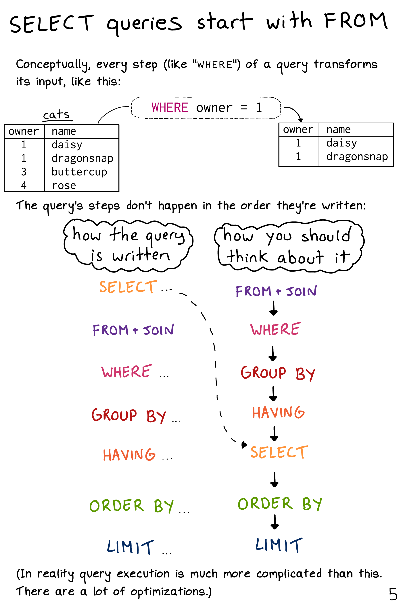

```{r setup, include=FALSE}
knitr::opts_chunk$set(echo = TRUE, cache = TRUE, dpi=300)
## Next hook based on this SO answer: https://stackoverflow.com/a/39025054
knitr::knit_hooks$set(
  prompt = function(before, options, envir) {
    options(
      prompt = if (options$engine %in% c('sh','bash')) '$ ' else 'R> ',
      continue = if (options$engine %in% c('sh','bash')) '$ ' else '+ '
      )
    })
```

## Requirements

### Create an account on Google Cloud Platform (free)

You should already have done this for the lecture on Google Compute Engine. See [here](https://raw.githack.com/uo-ec607/lectures/master/14-gce-i/14-gce-i.html#Create_an_account_on_Google_Cloud_Platform_(free)) if not. 

### R packages 

- New: **DBI**, **duckdb**, **bigrquery**, **glue**
- Already used: **tidyverse**, **hrbrthemes**, **nycflights13**

As per usual, the code chunk below will install (if necessary) and load all of these packages for you. I'm also going to set my preferred ggplot2 theme, but as you wish.

```{r, cache=F, message=F}
## Load/install packages
if (!require("pacman")) install.packages("pacman")
pacman::p_load(tidyverse, DBI, duckdb, bigrquery, hrbrthemes, nycflights13, glue)
## My preferred ggplot2 theme (optional)
theme_set(hrbrthemes::theme_ipsum())
```

## Databases 101

Many "big data" problems could be more accurately described as "small data problems in disguise". Which is to say, the data that we care about is only a subset or aggregation of some larger dataset. For example, we might want to access US Census data... but only for a handful of counties along the border of two contiguous states. Or, we might want to analyse climate data collected from a large number of weather stations... but aggregated up to the national or monthly level. In such cases, the underlying bottleneck is interacting with the original data, which is too big to fit into memory. How do we store data of this magnitude and and then access it effectively? The answer is through a **database**. 

Databases can exist either locally or remotely, as well as in-memory or on-disk. Regardless of where a database is located, the key point is that information is stored in a way that allows for very quick extraction and/or aggregation. Think back to our filing cabinet analogy from the **data.table** lecture:

> A filing cabinet arranges items by alphabetical order: Files starting "ABC" in the top drawer, "DEF" in the second drawer, etc. To find Alice's file, you'd only have to search the top draw. For Fred, the second draw, and so on.

This analogy, whilst slightly imperfect, captures the essence of what makes databases so efficient.^[In truth, most databases rely on [binary search trees](https://en.wikipedia.org/wiki/Binary_search_tree) ("b-trees"). A b-tree shares the spirit of the file cabinet ordering system, but takes it step further so that we eliminate at least half of the remaining data from our search at each step. E.g. We need to find a person's tax records in a million-row dataset. In the first step we immediately realise that it's somewhere in the first 500k rows. In the next step we immediately realise that it's somewhere in rows 250k-500k, etc.] They can very quickly identify the components that they need to focus on for a particular operation. Extracting the specific information that we want is a simple matter of submitting a **query** to the database. The query is where we tell the database how to manipulate or subset the data into a more manageable form, which we can then pull into our analysis environment (R, Python, etc.) 

At this point, you might be tempted to think of a database as the "thing" that you interact with directly. However, it's important to realise that the data are actually organised in one or more **tables** within the database. These tables are rectangular, consisting of rows and columns, where each row is identified by a unique key. In that sense, they are very much like the data frames that we're all used to working with. Continuing with the analogy, a database then is rather like a list of data frames of R. To access information from a specific table (data frame), we first have to index it from the database (list) and then execute our query functions. The only material difference being that databases can hold much more information and are extremely efficient at executing queries over their vast contents.

> **Tip:** A table in a database is like a data frame in an R list. 


## Databases and R 

Virtually every database in existence makes use of [**SQL**](https://en.wikipedia.org/wiki/SQL) (**S**tructured **Q**uery **L**anguage ). SQL is an extremely powerful tool and has become something of prerequisite for many data science jobs. ([Exhibit A](https://raw.githack.com/uo-ec607/lectures/master/01-intro/01-Intro.html#whyr).) However, it is also an archaic language that is much less intuitive than the R tools that we have using thus far in the course. We'll see several examples of this shortly, but first the good news: You already have all the programming skills you need to start working with databases. This is because the tidyverse --- through **dplyr** --- allows for direct communication with databases from your local R environment.

What does this mean? 

Simply that you can interact with the vast datasets that are stored in relational databases using the *same* tidyverse verbs and syntax that we already know. All of this is possible thanks to the **dbplyr** package ([link](https://dbplyr.tidyverse.org/)), which provides a database backend to **dplyr**. What's happening even further behind the scenes is that, upon installation, **dbplyr** suggests the **DBI** package ([link](https://db.rstudio.com/dbi)) as a dependency. **DBI** provides a common interface that allows **dplyr** to work with many different databases using exactly the same code. You don't even need to leave your RStudio session or learn SQL!

> **Aside:** Okay, you will probably want to learn SQL eventually. Luckily, **dplyr** and **dbplyr** come with several features that can really help to speed up the learning and translation process. We'll get to these later in the lecture.

While **DBI** is automatically bundled with **dbplyr**, you'll need to install a specific backend package for the type of database that you want to connect to. You can see a list of commonly used backends [here](https://db.rstudio.com/dplyr/#getting-started). For today, however, we'll focus on two: 
  
1. **duckdb** embeds a DuckDB database.
2. **bigrquery** connects to Google BigQuery.

The former is a lightweight --- but extremely powerful --- [database management system (DBMS)](https://en.wikipedia.org/wiki/Database#Database_management_system) that can exist on our local computers. It thus provides the simplest way of demonstrating the key concepts of this section without the additional overhead required by some other common other DBMSs. (No external dependencies, no need to connect to a remote server, etc.) The latter is the one that I use most frequently in my own work and also requires minimal overhead, seeing as we already set up a Google Cloud account in the previous lecture.

## Getting started: DuckDB

Our goal for this section is to create a makeshift database on our local computers --- using the excellent [DuckDB](https://duckdb.org/docs/api/r) backend --- and then connect to it from R. I'll use this to demonstrate the ease with which we can execute queries from R, as well as underscore some principles for working with databases in general. The lessons that we learn here will carry over to more complicated cases and much larger datasets.

### Connecting to a database

Start by opening an (empty) database connection via the `DBI::dbConnect()` function, which we'll call `con`. Note that we are calling the **duckdb** package in the background for the DuckDB backend and telling R that this is a local connection that exists in memory.


```{r con, cache = FALSE}
# library(DBI) ## Already loaded

con = dbConnect(duckdb::duckdb(), path = ":memory:")
```

The arguments to `DBI::dbConnect()` vary from database to database. However, the first argument is always the database backend, i.e. `duckdb::duckdb()` in this case since we're using DuckDB. Again, while this differs depending on the database type that you're connecting with, DuckDB only needs one other argument: the `path` to the database. Here we use the special string, ":memory:", which causes DuckDB to make a temporary in-memory database. We'll explore more complicated connections later on that will involve things like password prompts for remote databases.

Our makeshift database connection `con` is currently empty. So let's copy across the *flights* dataset that comes bundled together with the **nycflights13** package. There are a couple of ways to do this, but here I'll use the `dplyr::copy_to()` convenience function. Note that we are specifying the table name ("flights") that will exist within this database. You can also see that we're passing a list of indexes to the `copy_to()` function. Indexes are what enable efficient database performance, since they specify how the data should be laid out for very quick search and aggregation.^[Again, dDatabases rely on [binary search](https://en.wikipedia.org/wiki/Binary_search_algorithm), which is the same algorithmic approach that we used when we [set keys](https://raw.githack.com/uo-ec607/lectures/master/05-datatable/05-datatable.html#keys) back in the **data.table** lecture.] At the same time, I don't want you to worry too much about this right now. Indexes will be set by the database host platform or maintainer in normal applications.

```{r copy_to, cache = FALSE}
# library(dplyr)        ## Already loaded
# library(nycflights13) ## Already loaded

copy_to(
  dest = con, 
  df = nycflights13::flights, 
  name = "flights",
  temporary = FALSE, 
  indexes = list(
    c("year", "month", "day"), 
    "carrier", 
    "tailnum",
    "dest"
    )
  )
```

Now that we've copied over the data, we can reference it from R via the `dplyr::tbl()` function. This will allow us to treat it as a normal data frame that be manipulated with **dplyr** commands.

```{r flights_db, cache=FALSE}
## List tables in our DuckDB database connection (optional)
# dbListTables(con)

## Reference the table from R
flights_db = tbl(con, "flights")
flights_db
```

It worked! Everything looks pretty good, although you may notice something slightly strange about the output. We'll get to that in a minute.

### Generating queries

Again, one of the best things about **dplyr** is that it automatically translates tidyverse-style code into SQL for you. In fact, many of the key **dplyr** verbs are based on SQL equivalents.  With that in mind, let's try out a few queries using the typical **dplyr** syntax that we already know.

```{r flights_db_try_queries}
## Select some columns
flights_db %>% select(year:day, dep_delay, arr_delay)
## Filter according to some condition
flights_db %>% filter(dep_delay > 240) 
## Get the mean delay by destination (group and then summarise)
flights_db %>%
  group_by(dest) %>%
  summarise(mean_dep_delay = mean(dep_delay))
```

Again, everything seems to be working great with the minor exception being that our output looks a little different to normal. In particular, you might be wondering what `# Source:   lazy query` means.

### Laziness as a virtue

The *modus operandi* of **dplyr** is to be as lazy as possible. What this means in practice is that your R code is translated into SQL and executed in the database, not in R. This is a good thing, since:

- It never pulls data into R unless you explicitly ask for it.
- It delays doing any work until the last possible moment: it collects together everything you want to do and then sends it to the database in one step.

For example, consider an example where we are interested in the mean departure and arrival delays for each plane (i.e. by unique tail number). I'll also drop observations with less than 100 flights.

```{r tailnum_delay_db}
tailnum_delay_db = 
  flights_db %>% 
  group_by(tailnum) %>%
  summarise(
    mean_dep_delay = mean(dep_delay),
    mean_arr_delay = mean(arr_delay),
    n = n()
    ) %>%
  filter(n > 100) %>% 
  arrange(desc(mean_arr_delay))
```

Surprisingly, this sequence of operations never touches the database.^[It's a little hard to tell from this simple example, but an additional clue is that fact that this sequence of commands would execute instantaneously even it it was applied on a massive remote database.] It's not until you actually ask for the data (say, by printing `tailnum_delay_db`) that **dplyr** generates the SQL and requests the results from the database. Even then it tries to do as little work as possible and only pulls down a few rows.

```{r tailnum_delay_db_print}
tailnum_delay_db
```


### Collect the data into your local R environment

Typically, you'll iterate a few times before you figure out what data you need from the database. Once you've figured it out, use **`collect()`** to pull all the data into a local data frame. I'm going to assign this collected data frame to a new object (i.e. `tailnum_delay`), but only because I want to keep the queried data base object (`tailnum_delay_db`) separate for demonstrating some SQL translation principles in the next section.

```{r tailnum_delay}
tailnum_delay = 
  tailnum_delay_db %>% 
  collect()
tailnum_delay
```

Super. We have successfully pulled the queried database into our local R environment as a data frame. You can now proceed to use it in exactly the same way as you would any other data frame. For example, we could plot the data to see i) whether there is a relationship between mean departure and arrival delays (there is), and ii) whether planes manage to make up some time if they depart late (they do).

```{r tailnum_delay_ggplot}
tailnum_delay %>%
  ggplot(aes(x=mean_dep_delay, y=mean_arr_delay, size=n)) +
  geom_point(alpha=0.3) +
  geom_abline(intercept = 0, slope = 1, col="orange") +
  coord_fixed()
```

### Joins

One of the things that databases excel at are joins. At interesting touchpoint here is that **dplyr**'s collection of joining functions are based on their SQL equivalents (including names). You'll hence be relieved to know that the translation carries over rather nicely for joins too. Here is a simple example, using the exact same left join that [we saw](https://raw.githack.com/uo-ec607/lectures/master/05-tidyverse/05-tidyverse.html#joins) back in the **tidyverse** lecture. Note that I'm copying over the `planes` data frame to the same DuckDB connection that is housing the `flights` table. Again, I want to emphasise that databases are like lists, in the sense that they can hold multiple datasets (i.e. tables).

```{r planes_join, cache = FALSE}
## Copy over the "planes" dataset to the same "con" DuckDB connection.
copy_to(
    dest = con, 
    df = nycflights13::planes, 
    name = "planes",
    temporary = FALSE, 
    indexes = "tailnum"
    )

## List tables in our "con" database connection (i.e. now "flights" and "planes")
dbListTables(con)

## Reference from dplyr
planes_db = tbl(con, 'planes')

## Run the equivalent left join that we saw back in the tidyverse lecture
left_join(
    flights_db,
    planes_db %>% rename(year_built = year),
    by = "tailnum" ## Important: Be specific about the joining column
) %>%
    select(year, month, day, dep_time, arr_time, carrier, flight, tailnum,
           year_built, type, model) 
```

Assuming that we're finished querying our DuckDB database at this point, we'd normally disconnect from it by calling `DBI::dbDisconnect(con)`. However, I want to keep the connection open a bit longer, so that I can demonstrate how to execute raw (i.e. untranslated) SQL queries on a database from within R.

## Using SQL directly in R

### Translate with dplyr::show_query()

Behind the scenes, **dplyr** is translating your R code into SQL. You can use the **`show_query()`** function to display the SQL code that was used to generate a queried table.

```{r show_query_tailnum_delay_db}
tailnum_delay_db %>% show_query()
```

Note that the SQL call is much less appealing/intuitive our piped **dplyr** code. In part, this is an artefact of the translation steps involved. The **dplyr** translation engine includes various safeguards that are designed to ensure that the resulting SQL code works. But this comes at the expense of code concision (e.g. those repeated `SELECT` commands at the top of the SQL string are redundant). However, it also reflects the simple fact that SQL is not an elegant language to work with. In particular, SQL imposes a *lexical* order of operations that doesn't necessarily preserve the *logical* order of operations.^[Which stands in direct contrast to our piped **dplyr** code, i.e. "take this object, do this, then do this", etc. I even made a meme about it for you: https://www.captiongenerator.com/1325222/Dimitri-doesnt-need-SQL] This lexical ordering is also known as "order of execution" and is strict in the sense that every SQL query must follow the same hierarchy of commands. Here is how [Julia Evans](https://twitter.com/b0rk) lays it out in her wonderful zine, [*Become A Select Star*](https://wizardzines.com/zines/sql/) (which you should totally buy).

```{r b0rk_from, echo=FALSE, out.width='85%', fig.align='center', fig.cap='Credit: Julia Evans. ([Source](https://wizardzines.com/zines/sql/samples/from.png).)'}
if (knitr::is_html_output()){
  
} else {
  message("Sorry, this image is only available in the the HTML version of the notes.\nYou can see the original here:\nhttps://wizardzines.com/zines/sql/samples/from.png.")
}
```

I don't really want to get into all of this now. But I *do* want to make you aware of the fact that SQL queries are not written in a way that you would think about them logically. Still, while it can take a while to wrap your head around, the good news is that SQL's lexical ordering is certainly learnable. Again, I recommend Julia's [zine](https://wizardzines.com/zines/sql/) as a great starting point.^[More good resources [here](https://www.eversql.com/sql-order-of-operations-sql-query-order-of-execution/) and [here](https://blog.jooq.org/2016/12/09/a-beginners-guide-to-the-true-order-of-sql-operations/).]

Now, at this point, you may be wondering: Do we even need to learn SQL, given that it's a pain and that the **dplyr** translation works so well? 

That's a fair question. The short answer is that, "yes", at some point you will probably find yourself needing to write raw SQL code. Luckily, writing and submitting SQL queries directly from R and RStudio is easily done, thanks to the **DBI** package. In fact, I'm about to walk you through two different ways of doing so. But first, let's generate (translate) a simple SQL query that we can use as an orientating example. 

```{r sql_direct_translate}
## Show the equivalent SQL query for these dplyr commands
flights_db %>% 
  select(month, day, dep_time, sched_dep_time, dep_delay) %>% 
  filter(dep_delay > 240) %>% 
  head(5) %>% 
  show_query()
```

**Note:** In the SQL code chunks that follow, I'm going to simplify my queries quite a lot relative to the suggested translation above. Again, **dplyr** adds in various safeguards to ensure that its translation works across various edge cases and potential SQL backends. While these translations should always work --- confirm for yourself by running the suggested translation above --- they typically carry quite a bit excess verbiage and syntax. My goal here is to give you a sense of how we can "trim the fat", while still using **dplyr**'s suggestion as a good starting point.

### Option 1: Use R Markdown `sql` chunks

If you're writing up a report or paper in R Markdown, then you can include SQL chunks directly in your .Rmd file. All you need to do is specify your code chunk type as `sql` and R Markdown (via **knitr**) will automatically call the **DBI** package to execute the query. The [R Markdown book](https://bookdown.org/yihui/rmarkdown/language-engines.html#sql) provides a more detailed discussion of the different chunk options that power the `sql` engine output. However, to execute our simple query example from earlier (including specifying the connection), the following would suffice.

````markdown
`r ''````{sql, connection=con}
SELECT month, day, dep_time, sched_dep_time, dep_delay, origin, dest
FROM flights
WHERE dep_delay > 240
LIMIT 5
`r ''````
````

And, just to prove it, here's the same query / code chunk evaluated directly in these lecture notes.

```{sql sql_direct_rmd, connection=con, cache=FALSE}
SELECT month, day, dep_time, sched_dep_time, dep_delay, origin, dest
FROM flights
WHERE dep_delay > 240
LIMIT 5
```


### Option 2: Use DBI:dbGetQuery()

Of course, we don't want to be limited to running SQL queries from within R Markdown documents. To run SQL queries in regular R scripts, we can use the `DBI::dbGetQuery()` function. For no particular reason except to keep the SQL string short enough to fit on a single line, this time I'll return _all_ the variables from the dataset via `SELECT *`.

```{r sql_direct}
## Run the query using SQL directly on the connection.
dbGetQuery(con, "SELECT * FROM flights WHERE dep_delay > 240.0 LIMIT 5")
```

### Recommendation: Use glue::glue_sql()

While the above approach works perfectly fine --- i.e. just write out the full SQL query string in quotation marks inside `dbGetQuery()` --- I'm going to recommend that you consider the `glue_sql()` function from the **glue** package ([link](https://glue.tidyverse.org/)). This provides a more integrated approach that allows you to 1) use local R variables in your SQL queries, and 2) divide long queries into sub-queries. Here's a simple example of the former.

```{r sql_direct_glue}
# library(glue) ## Already loaded

## Some local R variables
tbl = "flights"
d_var = "dep_delay"
d_thresh = 240

## The "glued" SQL query string
sql_query =
  glue_sql("
  SELECT *
  FROM {`tbl`}
  WHERE ({`d_var`} > {d_thresh})
  LIMIT 5
  ",
  .con = con
  )

## Run the query
dbGetQuery(con, sql_query)
```

I know this seems like more work (undeniably so for this simple example). However, the `glue::glue_sql()` approach really pays off when you start working with bigger, nested queries. See the [documentation](https://glue.tidyverse.org/reference/glue_sql.html) for more examples and functionality, including how to match on or iterate over or multiple input values.

### Common Table Expressions

There's a _lot_ more to say about writing direct SQL queries. But I'm going to limit myself to one last topic, i.e. Common Table Expressions (CTEs). These are a popular way to write complex queries --- typically involving various subqueries --- since they allow you to name each component. We do this by using the `WITH` keyword and chain multiple subqueries with commas. An example may help to illustrate.

Suppose that we are interested in redoing (a slightly modified version of) our left join operation from earlier in pure SQL. One way to start thinking about this is that we are really joining two subqueries. I'll use the `glue_sql()` function to write and assign these two subqueries, since that will prove convenient for the comparison that I want to make below.^[CTEs have nothing to do with `glue_sql()` in particular --- the latter being an R-based construct --- but they do combine really nicely as we're about to see.]

The first subquery (the "left-hand" table) is really simple. It's just selecting all of the variables from the `flights` table.

```{r flights_subquery}
flights_subquery = 
  glue_sql(
    "
    SELECT * 
    FROM flights
    ", 
    .con = con)
```

The second query (the "right-hand" table) is only slightly more nuanced. This time we want to select only a few columns and rename one of them in the process to avoid duplicate column names (i.e. `year AS year_built`).^[Note that the renaming is not strictly necessary, since we have to specify the join columns in SQL. SQL will automatically prefix any duplicate columns with a table identifier, but we're getting ahead of ourselves here. I also think it's just good practice to avoid duplicate names that don't refer to the same things.] 

```{r planes_subquery}
planes_subquery = 
  glue_sql(
    "
    SELECT tailnum, year AS year_built, model 
    FROM planes
    ", 
    .con = con
    )
```

With our subqueries in hand, let's compare two equally valid approaches to joining the resulting tables. I'll let you decide which of the two you prefer and find more readable. 

::::: {.columns}
::: {.column width="48%" data-latex="{0.48\textwidth}"}
Here is the regular, non-CTE syntax for a SQL join.

```{r non_cte, cache=FALSE}
join_string =
  glue_sql(
    "
    SELECT year, dep_time, 
      a.tailnum AS tailnum,
      year_built, model
    FROM ({flights_subquery}) AS a
    LEFT JOIN ({planes_subquery}) AS b
    ON a.tailnum = b.tailnum
    LIMIT 4
    ",
    .con = con
  )

dbGetQuery(con, join_string)
```
:::

::: {.column width="4%" data-latex="{0.04\textwidth}"}
\ <!-- an empty Div (with a white space), serving as a column separator -->
:::

::: {.column width="48%" data-latex="{0.48\textwidth}"}
And here is the CTE equivalent.

```{r cte, cache=FALSE}
cte_join_string =
  glue_sql(
    "
    WITH 
    a AS ({flights_subquery}),
    b AS ({planes_subquery})
    SELECT year, dep_time, 
      a.tailnum AS tailnum,
      year_built, model
    FROM a
    LEFT JOIN b
    ON a.tailnum = b.tailnum
    LIMIT 4
    ",
    .con = con
  )

dbGetQuery(con, cte_join_string)
```
:::
::::::
\ <!-- an empty Div again to give some extra space before the next block -->

Before closing up this section, there are a couple of other things to note. The first is that, regardless of which approach we use, SQL joins work best if we name the intermediate tables. Here I have called them `a` and `b`, but you can use whatever you like. The reason is that we need to be explicit about which table a particular set of variables is coming from. For example, we have to specify `ON a.tailnum = b.tailnum` as the joining variables, even though they are called exactly the same thing.^[In contrast, both **dplyr** and **data.table** allow us to merge data frames by specifying a common joining variable once. E.g. `left_join(d1, d2, by = "id")` or `merge(DT1, DT2, by = "id").`] Similarly, note that in selecting the final set of return variables --- which, again, comes first because of SQL's confusing lexical ordering --- I actually have to specify *which* of the two identical joining columns I want (i.e. `a.tailnum` or `b.tailnum`).^[Actually, that's note quite true. I'd automatically get a duplicate "tailnum" column if I instead used, say, `SELECT *`. But that's not desirable either.] Here I have gone with the former and renamed it by dropping the now superfluous "a." prefix.

If this all sounds quite finicky and arcane... that's because it is. All of which is to say that you should be patient with yourself when learning SQL. It's an extremely powerful tool, but has some design features that have rightly been superseded or tweaked in modern data wrangling libraries.

### Disconnect

Finally, disconnect from the connection using the `DBI::dbDisconnect()` function.

```{r dbDisconnect, cache=FALSE}
dbDisconnect(con)
```


## Scaling up: Google BigQuery

Now that you've hopefully absorbed the key principles of database interaction from our demonstration example, let's move on to a more realistic use-case. In particular, the database service that I rely on most during my own daily workflow is [**Google BigQuery**](https://cloud.google.com/bigquery/). The advertising tagline is that BigQuery is a "serverless, highly scalable, enterprise data warehouse designed to make all your data analysts productive at an unmatched price-performance." Technical and marketing jargon notwithstanding, I think it's fair to say that BigQuery is a fantastic product. The salient features from our perspective are:

- **Accessibility.** BigQuery is part of the Google Cloud Platform (GCP) that we signed up for in the [cloud computing lecture](https://raw.githack.com/uo-ec607/lectures/master/14-gce/14-gce.html). So you should already have *gratis* access to it. Sign up for a GCP [12-month free trial](https://console.cloud.google.com/freetrial) now if you haven't done so yet.
- **Economy.** It is extremely fast and economical to use. (See: [Pricing](https://cloud.google.com/bigquery/pricing).) Even disregarding our free trial period, you are allowed to query 1 TB of data for free each month.^[That's "T" as in *terabytes*.] Each additional TB beyond that will only cost you $5 once your free trial ends. Storage is also very cheap, although you already have access to an array of public datasets. Speaking of which...
- **Data availability.** BigQuery hosts several [sample tables](https://cloud.google.com/bigquery/public-data/#sample_tables) to get you started. Beyond that, however, there are some incredible [public datasets](https://www.reddit.com/r/bigquery/wiki/datasets) available on the platform. You can find everything from NOAA's worldwide weather records... to Wikipedia data... to Facebook comments... to liquor sales in Iowa... to real estate transactions across Latin America. I daresay you could generate an effective research program simply by staring at these public datasets.

Most heavy BigQuery users tend to interact with the platform directly in the [web UI](https://console.cloud.google.com/bigquery). This has a bunch of nice features like automatic SQL query formatting and table previewing. I recommend you try the BigQuery web UI out after going through these lecture notes.^[[Here's](https://towardsdatascience.com/bigquery-without-a-credit-card-discover-learn-and-share-199e08d4a064) a neat example showing how to find the most popular "Alan" according to Wikipedia page views.] For now, however, I'll focus on interacting with BigQuery databases from R, with help from the very useful **bigrquery** package ([link](https://bigrquery.r-dbi.org/)).

The starting point for using the **bigrquery** package is to provide your GCP project billing ID. It's easy enough to specify this as a string directly in your R script. However, you may recall that we already stored our GCP credentials during the [cloud computing lecture](https://raw.githack.com/uo-ec607/lectures/master/14-gce-ii/14-gce-ii.html#Google_Cloud_API_Service_Account_key). In particular, your project ID should be saved as an environment variable in the `.Renviron` file in your home directory.^[We did this as part of the authentication process of the **googleComputeEngineR** package. If you aren't sure, you can confirm for yourself by running `usethis::edit_r_environ()` in your R console. If you don't see a variable called `GCE_DEFAULT_PROJECT_ID`, then you should rather specify your project ID directly.] In that case, we can just call it by using the `Sys.getenv()` command. I'm going to use this latter approach, since it provides a safe and convenient way for me to share these lecture notes without compromising security. But as you wish.

```{r billing_id}
# library(bigrquery) ## Already loaded

billing_id = Sys.getenv("GCE_DEFAULT_PROJECT_ID") ## Replace with your project ID if this doesn't work
```

Having set our project IDs, we are now ready to run queries and download BigQuery data into our R environment. I'll demonstrate using two examples: 1) US birth data from the samples data, and 2) Fishing effort data from the Global Fishing Watch project.

### Example 1) US birth data

The **bigquery** package supports various ways --- or "abstraction levels" --- of running queries from R, including interacting directly with the low-level API. In the interests of brevity, I'm only going to focus on the **dplyr** approach here.^[I encourage you to read the package documentation to see these other methods for yourself.] As with the the DuckDB example from earlier, we start by establishing a connection using `DBI::dbConnect()`. The only difference this time is that we need to specify that are using the BigQuery backend (via `bigrquery::bigquery()`) and provide our credentials (via our project billing ID). Let's proceed by connecting to the "publicdata.samples" dataset.

```{r bq_con, cache=F}
# library(DBI) ## Already loaded
# library(dplyr) ## Already loaded

bq_con =
  dbConnect(
    bigrquery::bigquery(),
    project = "publicdata",
    dataset = "samples",
    billing = billing_id
    )
```

One neat thing about this setup is that the connection holds for any tables within the specified database. We just need to specify the desired table using `dplyr::tbl()` and then execute our query as per usual. You can see a list of available tables within your connection by using `DBI::dbListTables()`.

> **Tip:** Make sure that you run the next line interactively if this is the first time you're ever connecting to BigQuery from R. You will be prompted to choose whether you want to cache credentials between R sessions (I recommend "Yes") and then to authorise access in your browser.

```{r bq_con_listtables}
dbListTables(bq_con)
```

For this example, we'll go with the [natality](https://console.cloud.google.com/bigquery?p=bigquery-public-data&d=samples&t=natality&page=table&_ga=2.108840194.-1488160368.1535579560) table, which contains registered birth records for all 50 US states (1969--2008).

```{r, bq_natality}
natality = tbl(bq_con, "natality")
```

As a reference point, the raw natality data on BigQuery is about 22 GB. Not gigantic, but enough to overwhelm most people's RAM. Here's a simple exercise where we collapse the data down to yearly means.

```{r bw}
bw =
  natality %>%
  filter(!is.na(state)) %>% ## optional to remove some outliers
  group_by(year) %>%
  summarise(weight_pounds = mean(weight_pounds, na.rm=TRUE)) %>%
  collect()
```

Plot it.

```{r bw_plot}
bw %>%
  ggplot(aes(year, weight_pounds)) +
  geom_line()
```

For the record, I don't know why birth weights have been falling recently, and whether that is a good (e.g. declining maternal obesity rates) or bad (e.g. maternal malutrition) thing.^[See [here](https://twitter.com/grant_mcdermott/status/1156260684126048256) for more discussion and help from some epidemiologists on Twitter.] One thing we can do, however, is provide a more disaggregated look at the data. This time, I'll query the natality table in a way that summarises mean bith weight by US state and gender.

```{r bw_st}
## Get mean yearly birth weight by state and gender
bw_st =
  natality %>%
  filter(!is.na(state)) %>%
  group_by(year, state, is_male) %>%
  summarise(weight_pounds = mean(weight_pounds, na.rm=TRUE)) %>%
  mutate(gender = ifelse(is_male, "Male", "Female")) %>%
  collect()
```

Now let's plot it. I'll highlight a few (arbitrary) states just for interest's sake. I'll also add a few more bells and whistles to the resulting plot.

```{r bw_st_plot}
## Select arbitrary states to highlight
states = c("CA","DC","OR","TX","VT")
## Rearranging the data will help with the legend ordering
bw_st = bw_st %>% arrange(gender, year)

## Plot it
bw_st %>%
  ggplot(aes(year, weight_pounds, group=state)) +
  geom_line(col="grey75", lwd = 0.25) +
  geom_line(
    data = bw_st %>% filter(state %in% states),
    aes(col=fct_reorder2(state, year, weight_pounds)),
    lwd=0.75
    ) +
  facet_wrap(~gender) +
  scale_color_brewer(palette = "Set1", name=element_blank()) +
  labs(
    title = "Mean birth weight, by US state over time",
    subtitle = "Selected states highlighted",
    x = NULL, y = "Pounds",
    caption = "Data sourced from Google BigQuery"
    ) +
  theme_ipsum(grid=FALSE)
```

Again, this is not my field of specialization and I don't want to take too strong of a stance on the observed trends. However, a clearer picture is beginning to emerge with the disaggregated data. I'll let you dig more into this with your own queries, which hopefully you've seen is very quick and easy to do.

As before, its best practice to disconnect from the server once you are finished.

```{r bq_dbDisconnect, cache=F}
dbDisconnect(bq_con)
```

### Example 2) Global Fishing Watch

I know that this lecture is running long now, but I wanted to show you one final example that is closest to my own research. [**Global Fishing Watch**](https://globalfishingwatch.org/) is an incredible initiative that aims to bring transparency to the world's oceans. I've presented on GFW in various forums and I highly encourage you to play around with their [interactive map](https://globalfishingwatch.org/map/) if you get a spare moment. For the moment, though we'll simply look at how to connect to the public GFW data on BigQuery and then extract some summary information about global fishing activity.

```{r gfw_con, cache=F}
gfw_con =
  dbConnect(
    bigrquery::bigquery(),
    project = "global-fishing-watch",
    dataset = "global_footprint_of_fisheries",
    billing = billing_id
    )
```

Again, we can look at the available tables within this connection using `DBI::dbListTables()`.

```{r gfw_con_listtables}
dbListTables(gfw_con)
```

All of these tables are interesting in their own right, but we're going to be querying the "fishing_effort" table. Let's link it to a local (lazy) data frame that we'll call `effort`.

```{r effort}
effort = tbl(gfw_con, "fishing_effort")
effort
```

Now, we can do things like find out who are the top fishing nations by total number of hours fished. As we can see, China is by far the dominant player on the world stage:

```{r top_fish}
effort %>%
  group_by(flag) %>%
  summarise(total_fishing_hours = sum(fishing_hours, na.rm=T)) %>%
  arrange(desc(total_fishing_hours)) %>%
  collect()
```

#### Aside on date partitioning

One thing I wanted to flag quickly is that many tables and databases in BigQuery are [date partitioned](https://cloud.google.com/bigquery/docs/best-practices-costs#partition_data_by_date), i.e. ordered according to timestamps of when the data were ingensted. The GFW data, for example, are date partitioned since this provides a more cost-effective way to query datasets. My reason for mentioning this is because it requires a minor tweak to the way we're going to query or manipulate the GFW data by date.^[You may have noticed that the "date" column in the `effort` table above is actually a character string. So you would need to convert this column to a date variable first, before using it to do any standard date filtering operations. Even then it's going to be less efficient than the partitioning approach that we're about to see.] The way this works in native SQL is to reference a special `_PARTITIONTIME` pseudo column if you want to, say, filter according to date. (See [here](https://globalfishingwatch.org/data-blog/our-data-in-bigquery/) for some examples.) There's no exact **dplyr** translation of this `_PARTITIONTIME` pseudo column. Fortunately, the very simple solution is to specify it as an SQL variable directly in our **dplyr** call using backticks. Here's an example that again identifies the world's top fishing nations, but this time limits the analysis to data from 2016 only.

```{r top_fish_2016}
effort %>%
  ## Here comes the filtering on partition time
  filter(
    `_PARTITIONTIME` >= "2016-01-01 00:00:00",
    `_PARTITIONTIME` <= "2016-12-31 00:00:00"
    ) %>%
  ## End of partition time filtering
  group_by(flag) %>%
  summarise(total_fishing_hours = sum(fishing_hours, na.rm=TRUE)) %>%
  arrange(desc(total_fishing_hours)) %>%
  collect()
```

Once again, China takes first place. There is some shuffling for the remaining places in the top 10, though.


#### One last query: Global fishing effort in 2016

Okay, here's a quick final query to get global fishing effort in 2016. I'm not going to comment my code much, but hopefully it's clear that that I'm creating 1 × 1 degree bins and then aggregating fishing effort up to that level.

```{r globe}
## Define the desired bin resolution in degrees
resolution = 1

globe =
  effort %>%
  filter(
    `_PARTITIONTIME` >= "2016-01-01 00:00:00",
    `_PARTITIONTIME` <= "2016-12-31 00:00:00"
    ) %>%
  filter(fishing_hours > 0) %>%
  mutate(
    lat_bin = lat_bin/100,
    lon_bin = lon_bin/100
    ) %>%
  mutate(
    lat_bin_center = floor(lat_bin/resolution)*resolution + 0.5*resolution,
    lon_bin_center = floor(lon_bin/resolution)*resolution + 0.5*resolution
    ) %>%
  group_by(lat_bin_center, lon_bin_center) %>%
  summarise(fishing_hours = sum(fishing_hours, na.rm=TRUE)) %>%
  collect()
```

Let's reward ourselves with a nice plot.

```{r globe_plot}
globe %>%
  filter(fishing_hours > 1) %>%
  ggplot() +
  geom_tile(aes(x=lon_bin_center, y=lat_bin_center, fill=fishing_hours))+
  scale_fill_viridis_c(
    name = "Fishing hours (log scale)",
    trans = "log",
    breaks = scales::log_breaks(n = 5, base = 10),
    labels = scales::comma
    ) +
  labs(
    title = "Global fishing effort in 2016",
    subtitle = paste0("Effort binned at the ", resolution, "° level."),
    y = NULL, x = NULL,
    caption = "Data from Global Fishing Watch"
    ) +
  theme_ipsum(grid=FALSE) +
  theme(axis.text=element_blank())
```


As always, remember to disconnect.

```{r gfw_dbDisconnect, cache=F}
dbDisconnect(gfw_con)
```


## Where to next: Learning and practicing SQL

While we did cover some SQL basics and syntax, my primary goal for this lecture has been to get you up running with databases as quickly and painlessly as possible. I really do think that you can get a great deal of mileage using the **dplyr** database integration that we've focused on here. However, learning SQL will make a big difference to your life once you start working with databases regularly. I expect that it will also boost your employment options significantly. The good news is that you are already well on your way to internalising the basic commands and structure of SQL queries. We've seen the `show_query()` function, which is a great way to get started if your coming from R and the tidyverse. Another helpful **dbplyr** resource is the "sql" vignette, so take a look:

```{r, eval=FALSE}
vignette('sql', package = 'dbplyr')
```

In my experience, though the best best way to learn SQL is simply to *start writing your own queries*. The [**BigQuery web UI**](https://console.cloud.google.com/bigquery) is especially helpful in this regard. Not only is it extremely cheap to use (free up to 1 TB), but it also comes with a bunch of useful features like in-built query formatting and preemptive error detection. A good way to start is by copying over someone else's SQL code --- e.g. [here](https://towardsdatascience.com/bigquery-without-a-credit-card-discover-learn-and-share-199e08d4a064) or [here](https://globalfishingwatch.org/data-blog/our-data-in-bigquery/) --- modifying it slightly, and then see if you can run it in the BigQuery web UI.


## Further resources

You are spoilt for choice here and I've already hyperlinked to many resources throughout this lecture. So here are some final suggestions to get you querying databases like a boss.

- RStudio's [Databases using R](https://db.rstudio.com) is a one-stop reference shop for much that we have covered today and more.
- [Juan Mayorga](https://twitter.com/juansmayorga) has a super tutorial on "[Getting Global Fishing Watch Data from Google Big Query using R](http://jsmayorga.com/post/getting-global-fishing-watch-from-google-bigquery-using-r)". He also dives into some of the reasons why you might want to learn SQL (i.e. beyond just using the **dplyr** translation).
- If you want a dedicated resource for learning SQL, then again I'm going to stump for [Julia Evans'](https://twitter.com/b0rk) [*Become A Select Star*](https://wizardzines.com/zines/sql/). It's a great, concise introduction to the major concepts and a steal at only $12.
- On the other end of the scale, the official BigQuery [documentation](https://cloud.google.com/bigquery/docs/) provides an exhaustive overview of the many functions and syntax for so-called standard SQL (including specialised operations on say, datetime and JSON objects).
- There are also loads of online tutorials (e.g. [W3Schools](https://www.w3schools.com/sql/default.asp)) and courses (e.g. [Codecademy](https://www.codecademy.com/learn/learn-sql)) that you can check out.