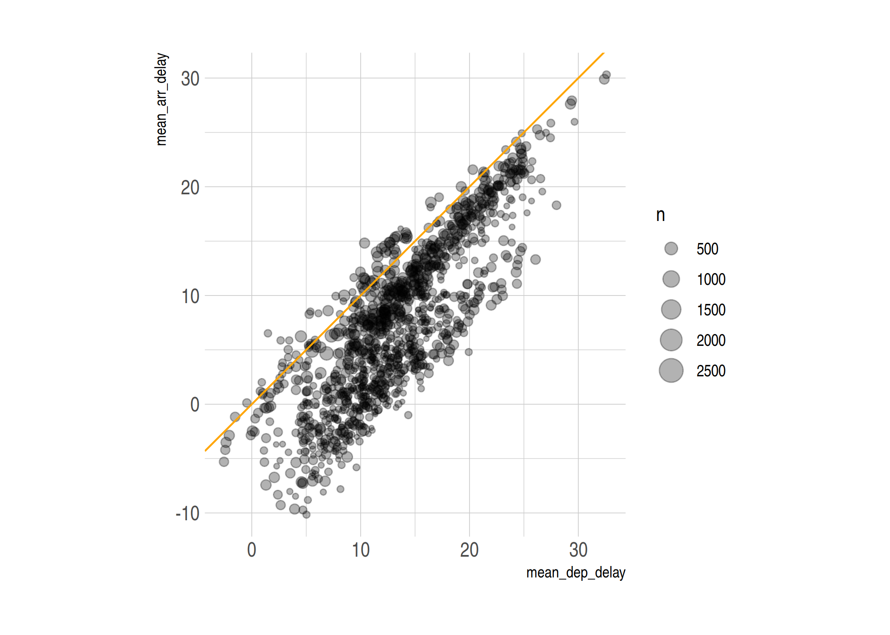
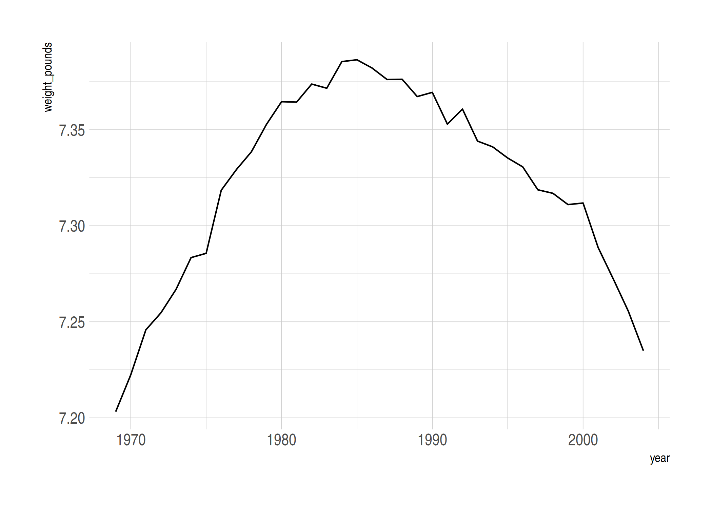
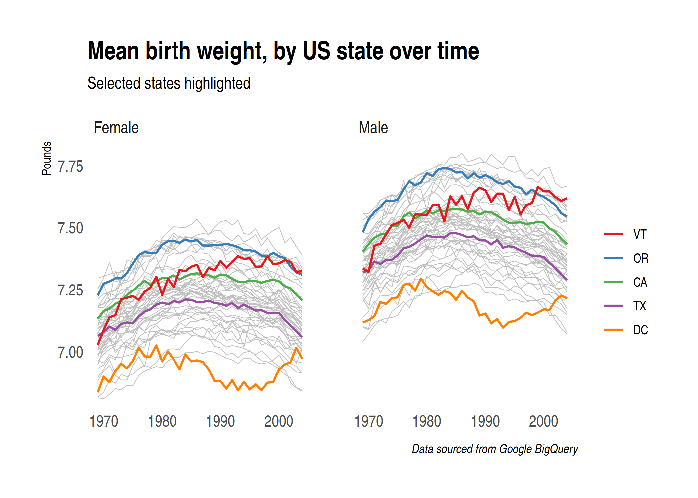
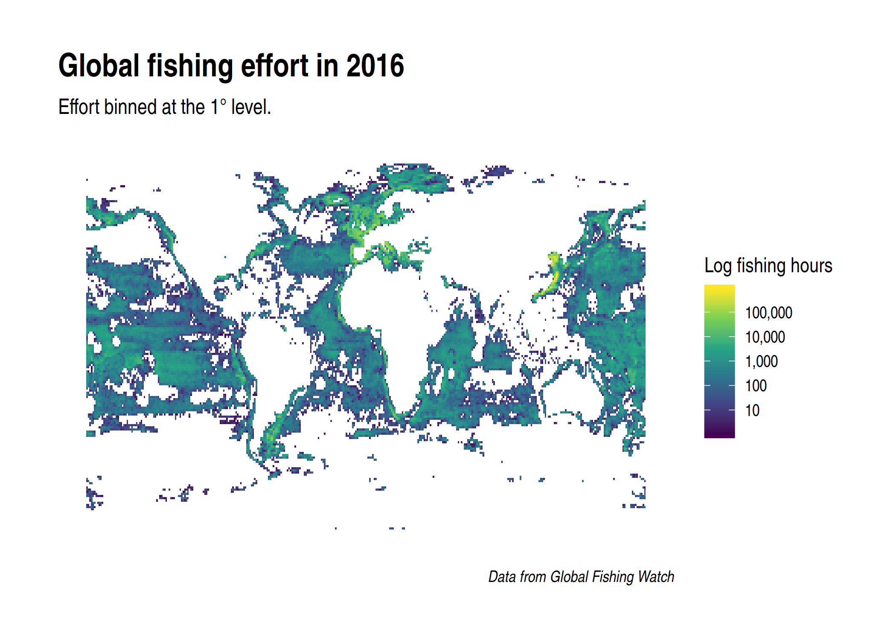

## Requirements

### Create an account on Google Cloud Platform (free)

You should already have done this for the lecture on Google Compute Engine. See [here](https://raw.githack.com/uo-ec607/lectures/master/14-gce/14-gce.html) if not. 

### R packages 

- **New:** `dbplyr`, `DBI`, `RSQLite`,`bigrquery`, `glue`
- **Already used:** `tidyverse`, `hrbrthemes`, `nycflights13`

As per usual, the code chunk below will install (if necessary) and load all of these packages for you. I'm also going to set my preferred ggplot2 theme, but as you wish.


```r
## Load/install packages
if (!require("pacman")) install.packages("pacman")
pacman::p_load(tidyverse, DBI, dbplyr, RSQLite, bigrquery, hrbrthemes, nycflights13, glue)
## My preferred ggplot2 theme (optional)
theme_set(hrbrthemes::theme_ipsum())
```

## Databases 101

Many "big data" problems could be accurately described as "small data problems in disguise". Which is to say, the data that we care about is only a subset or aggregation of some larger dataset. For example, we might want to access US Census data... but only for a handful of counties along the border of two contiguous states. Or, we might want to analyse climate data collected from a large number of weather stations... but aggregated up to the national or monthly level. In such cases, the underlying bottleneck is interacting with the original data, which is too big to fit into memory. How do we store data of this magnitude and and then access it effectively? The answer is through **relational databases**. 

Databases^[For the rest of this lecture, I'll be using "databases" and "relational databases" interchangeably, so don't be put off if I switch between them.] can exist either locally or remotely, though the latter is more common. The key point is that they are stored on-disk somewhere, rather than in-memory. Extracting the specific information that we want is a matter of submitting a **query** to the database. The query is where we tell the database how to manipulate or subset the data into a more manageable form, which we can then pull into our local environment (i.e. memory) and conduct analysis on. 

At this point, you might be tempted to think of a database as the "thing" that you interact with directly. However, it's important to realise that the data are actually organised in one or more **tables** within the database. These tables are rectangular, consisting of rows and columns, where each row is indentified by a unique key. In that sense, they are very much like the data frames that we're all used to working with. Continuing with the analogy, a database then is rather like a list of data frames of R. To access information from a specific table (cf. data frame), we first have to index it from the database (cf. list) and then execute our query functions. The only material difference being that databases can hold much more information and are extremely efficient at executing queries over their vast contents.

> **Tip:** A table in a database is like a data frame in an R list. 


## Databases and the tidyverse

Virtually relational database in existence makes use of [**SQL**](https://en.wikipedia.org/wiki/SQL) (**S**tructured **Q**uery **L**anguage ).  SQL is an extremely powerful tool and has become something of prerequisite for many data science jobs. ([Exhibit A](https://raw.githack.com/uo-ec607/lectures/master/01-intro/01-Intro.html#21).) However, it is also an archaic language that is much less intuitive than the tidyverse tools that we have using thus far in the course. We'll see several examples of this shortly, but first the good news: You already have all the programming skills you need to start working with databases. This is because the tidyverse --- through `dplyr` --- allows for direct communication with databases from your local R environment.

What does this mean? 

Simply that you can interact with the vast datasets that are stored in relational databases using the *same* tidyverse verbs and syntax that we already know. All of this is possible thanks to the [**dbplyr** package](https://dbplyr.tidyverse.org/), which provides a database backend to `dplyr`. What's happening even further behind the scenes is that, upon installation, `dbplyr` suggests the [**DBI** package](https://db.rstudio.com/dbi) as a dependency. `DBI` provides a common interface that allows `dplyr` to work with many different databases using exactly the same code. You don't even need to leave your RStudio session or learn SQL!

> **Aside:** Okay, you will probably want to learn SQL eventually. Luckily, `dplyr` and `dbplyr` come with several features that can really help to speed up the learning and translation process. We'll get to these later in the lecture.

While `DBI` is automatically bundled with `dbplyr`, you'll need to install a specific backend package for the type of database that you want to connect to. You can see a list of commonly used backends [here](https://db.rstudio.com/dplyr/#getting-started). For today, however, we'll focus on two: 
  
1. `RSQLite` embeds a SQLite database.
2. `bigrquery` connects to Google BigQuery.

The former is a lightweight SQL database engine that can exist on our local computers. It thus provides the simplest way of demonstrating the key concepts of this section without the additional overhead required by the other database types. (No need to connect to a remote server, for starters.) The latter is the one that I use most frequently in my own work and also requires minimal overhead, seeing as we already set up a Google Cloud account in the previous lecture.

## Getting started: SQLite

This next section is largely inspired by Hadley Wickham's excellent tutorial on [Databases using dplyr](https://db.rstudio.com/dplyr). Our goal is to create a makeshift database on our local computers using SQLite. We'll use this to execute some practice queries and illustrate some general principles about interacting with databases.

### Connecting to a database

Start by opening an (empty) database connection via the `DBI::dbConnect()` function, which we'll call `con`. Note that we are calling the `RSQLite` package in the background for the SQLite backend and telling R that this is a local connection that exists in memory.


```r
# library(DBI) ## Already loaded

con <- dbConnect(RSQLite::SQLite(), path = ":memory:")
```

As Hadley [describes](https://db.rstudio.com/dplyr/#connecting-to-the-database), the arguments to DBI::dbConnect() vary from database to database. However, the first argument is always the database backend, i.e. `RSQLite::SQLite()` in this case since we're using (R)SQLite. Again, while this differs depending on the database type that you're connecting with, SQLite only needs one other argument: the `path` to the database. Here we use the special string, ":memory:", which causes SQLite to make a temporary in-memory database. We'll explore more complicated connections later on that will involve things like password prompts for remote databases.

Our makeshift database, `con`, currently has no data in it. For this example, we'll use copy across the `nycflights13::flights` dataset using the `dplyr::copy_to()` convenience function. This just provides a simple way of getting data into our makeshift database, which can be used for demonstration purposes. Note that we are specifying the table name ("flights") that will exist within this database. You can also see that we're passing a list of indexes to the `copy_to()` function. Indexes enable efficient database performance, although you don't need to worry too much about that. These will be set by the database host platform or maintainer in normal applications.


```r
# if (!require("nycflights13")) install.packages("nycflights13") ## Already installed

copy_to(
  dest = con, 
  df = nycflights13::flights, 
  name = "flights",
  temporary = FALSE, 
  indexes = list(
    c("year", "month", "day"), 
    "carrier", 
    "tailnum",
    "dest"
    )
  )
```

Now that we’ve copied over the data, we can reference it from R via the `dplyr::tbl()` function:


```r
# library(dplyr) ## Already loaded
# library(dbplyr) ## Already loaded

flights_db <- tbl(con, "flights")
flights_db
```

```
## # Source:   table<flights> [?? x 19]
## # Database: sqlite 3.22.0 []
##     year month   day dep_time sched_dep_time dep_delay arr_time
##    <int> <int> <int>    <int>          <int>     <dbl>    <int>
##  1  2013     1     1      517            515         2      830
##  2  2013     1     1      533            529         4      850
##  3  2013     1     1      542            540         2      923
##  4  2013     1     1      544            545        -1     1004
##  5  2013     1     1      554            600        -6      812
##  6  2013     1     1      554            558        -4      740
##  7  2013     1     1      555            600        -5      913
##  8  2013     1     1      557            600        -3      709
##  9  2013     1     1      557            600        -3      838
## 10  2013     1     1      558            600        -2      753
## # … with more rows, and 12 more variables: sched_arr_time <int>,
## #   arr_delay <dbl>, carrier <chr>, flight <int>, tailnum <chr>,
## #   origin <chr>, dest <chr>, air_time <dbl>, distance <dbl>, hour <dbl>,
## #   minute <dbl>, time_hour <dbl>
```

It worked! Everything looks pretty good, although you may notice something slightly strange about the output. We'll get to that in a minute.

### Generating queries

Again, one of the best things about `dplyr` is that it automatically translates tidyverse-style code into SQL for you. In fact, many of the key `dplyr` verbs are based on SQL equivalents.  With that in mind, let's try out a few queries using the typical `dplyr` syntax that we already know.


```r
## Select some columns
flights_db %>% select(year:day, dep_delay, arr_delay)
```

```
## # Source:   lazy query [?? x 5]
## # Database: sqlite 3.22.0 []
##     year month   day dep_delay arr_delay
##    <int> <int> <int>     <dbl>     <dbl>
##  1  2013     1     1         2        11
##  2  2013     1     1         4        20
##  3  2013     1     1         2        33
##  4  2013     1     1        -1       -18
##  5  2013     1     1        -6       -25
##  6  2013     1     1        -4        12
##  7  2013     1     1        -5        19
##  8  2013     1     1        -3       -14
##  9  2013     1     1        -3        -8
## 10  2013     1     1        -2         8
## # … with more rows
```

```r
## Filter according to some condition
flights_db %>% filter(dep_delay > 240) 
```

```
## # Source:   lazy query [?? x 19]
## # Database: sqlite 3.22.0 []
##     year month   day dep_time sched_dep_time dep_delay arr_time
##    <int> <int> <int>    <int>          <int>     <dbl>    <int>
##  1  2013     1     1      848           1835       853     1001
##  2  2013     1     1     1815           1325       290     2120
##  3  2013     1     1     1842           1422       260     1958
##  4  2013     1     1     2115           1700       255     2330
##  5  2013     1     1     2205           1720       285       46
##  6  2013     1     1     2343           1724       379      314
##  7  2013     1     2     1332            904       268     1616
##  8  2013     1     2     1412            838       334     1710
##  9  2013     1     2     1607           1030       337     2003
## 10  2013     1     2     2131           1512       379     2340
## # … with more rows, and 12 more variables: sched_arr_time <int>,
## #   arr_delay <dbl>, carrier <chr>, flight <int>, tailnum <chr>,
## #   origin <chr>, dest <chr>, air_time <dbl>, distance <dbl>, hour <dbl>,
## #   minute <dbl>, time_hour <dbl>
```

```r
## Get the mean delay by destination (group and then summarise)
flights_db %>%
  group_by(dest) %>%
  summarise(delay = mean(dep_time))
```

```
## Warning: Missing values are always removed in SQL.
## Use `AVG(x, na.rm = TRUE)` to silence this warning
```

```
## # Source:   lazy query [?? x 2]
## # Database: sqlite 3.22.0 []
##    dest  delay
##    <chr> <dbl>
##  1 ABQ   2006.
##  2 ACK   1033.
##  3 ALB   1627.
##  4 ANC   1635.
##  5 ATL   1293.
##  6 AUS   1521.
##  7 AVL   1175.
##  8 BDL   1490.
##  9 BGR   1690.
## 10 BHM   1944.
## # … with more rows
```

Again, everything seems to be working great with the minor exception being that our output looks a little different to normal. In particular, you might be wondering what `# Source:   lazy query` means.

### Laziness as a virtue

The *modus operandi* of `dplyr` is to be as lazy as possible. What this means in practice is that your R code is translated into SQL and executed in the database, not in R. This is a good thing, since:

- It never pulls data into R unless you explicitly ask for it.
- It delays doing any work until the last possible moment: it collects together everything you want to do and then sends it to the database in one step.

For example, consider an example where we are interested in the mean departure and arrival delays for each plane (i.e. by unique tail number). I'll also drop observations with less than 100 flights.


```r
tailnum_delay_db <- 
  flights_db %>% 
  group_by(tailnum) %>%
  summarise(
    mean_dep_delay = mean(dep_delay),
    mean_arr_delay = mean(arr_delay),
    n = n()
    ) %>% 
  arrange(desc(mean_arr_delay)) %>%
  filter(n > 100)
```

Surprisingly, this sequence of operations never touches the database.^[It's a little hard to tell from this simple example, but an additional clue is that fact that this sequence of commands would execute instaneously even it it was applied on a massive remote database.] It’s not until you actually ask for the data (say, by printing `tailnum_delay_db`) that `dplyr` generates the SQL and requests the results from the database. Even then it tries to do as little work as possible and only pulls down a few rows.


```r
tailnum_delay_db
```

```
## Warning: Missing values are always removed in SQL.
## Use `AVG(x, na.rm = TRUE)` to silence this warning

## Warning: Missing values are always removed in SQL.
## Use `AVG(x, na.rm = TRUE)` to silence this warning
```

```
## # Source:     lazy query [?? x 4]
## # Database:   sqlite 3.22.0 []
## # Ordered by: desc(mean_arr_delay)
##    tailnum mean_dep_delay mean_arr_delay     n
##    <chr>            <dbl>          <dbl> <int>
##  1 N11119            32.6           30.3   148
##  2 N16919            32.4           29.9   251
##  3 N14998            29.4           27.9   230
##  4 N15910            29.3           27.6   280
##  5 N13123            29.6           26.0   121
##  6 N11192            27.5           25.9   154
##  7 N14950            26.2           25.3   219
##  8 N21130            27.0           25.0   126
##  9 N24128            24.8           24.9   129
## 10 N22971            26.5           24.7   230
## # … with more rows
```


### Collect the data into your local R environment

Typically, you’ll iterate a few times before you figure out what data you need from the database. Once you’ve figured it out, use **`collect()`** to pull all the data into a local data frame. I'm going to assign this collected data frame to a new object (i.e. `tailnum_delay`), but only because I want to keep the queried data base object (`tailnum_delay_db`) separate for demonstrating some SQL translation principles in the next section.


```r
tailnum_delay <- 
  tailnum_delay_db %>% 
  collect()
```

```
## Warning: Missing values are always removed in SQL.
## Use `AVG(x, na.rm = TRUE)` to silence this warning

## Warning: Missing values are always removed in SQL.
## Use `AVG(x, na.rm = TRUE)` to silence this warning
```

```r
tailnum_delay
```

```
## # A tibble: 1,201 x 4
##    tailnum mean_dep_delay mean_arr_delay     n
##    <chr>            <dbl>          <dbl> <int>
##  1 N11119            32.6           30.3   148
##  2 N16919            32.4           29.9   251
##  3 N14998            29.4           27.9   230
##  4 N15910            29.3           27.6   280
##  5 N13123            29.6           26.0   121
##  6 N11192            27.5           25.9   154
##  7 N14950            26.2           25.3   219
##  8 N21130            27.0           25.0   126
##  9 N24128            24.8           24.9   129
## 10 N22971            26.5           24.7   230
## # … with 1,191 more rows
```

Super. We have successfully pulled the queried database into our local R environment as a data frame. You can now proceed to use it in exactly the same way as you would any other data frame. For example, we could plot the data to see i) whether there is a relationship between mean departure and arrival delays (there is), and ii) whether planes manage to make up some time if they depart late (they do).


```r
tailnum_delay %>%
  ggplot(aes(x=mean_dep_delay, y=mean_arr_delay, size=n)) +
  geom_point(alpha=0.3) +
  geom_abline(intercept = 0, slope = 1, col="orange") +
  coord_fixed()
```

```
## Warning: Removed 1 rows containing missing values (geom_point).
```

<!-- -->

### Using SQL directly

Behind the scenes, `dplyr` is translating your R code into SQL. You can use the **`show_query()`** function to display the SQL code that was used to generate a queried table.


```r
tailnum_delay_db %>% show_query()
```

```
## Warning: Missing values are always removed in SQL.
## Use `AVG(x, na.rm = TRUE)` to silence this warning

## Warning: Missing values are always removed in SQL.
## Use `AVG(x, na.rm = TRUE)` to silence this warning
```

```
## <SQL>
## SELECT *
## FROM (SELECT *
## FROM (SELECT `tailnum`, AVG(`dep_delay`) AS `mean_dep_delay`, AVG(`arr_delay`) AS `mean_arr_delay`, COUNT() AS `n`
## FROM `flights`
## GROUP BY `tailnum`)
## ORDER BY `mean_arr_delay` DESC)
## WHERE (`n` > 100.0)
```

Note that the SQL call is much less appealing/intuitive our piped `dplyr` code. This results partly from the way that `dplyr` translated the code (e.g. those repeated `SELECT` commands at the top of the SQL string are redundant). However, it also reflects the simple fact that SQL is not an elegant language to work with. In particular, SQL imposes a **lexical** order of operations that doesn't necessarily preserve the **logical** order of operations.^[Which stands in direct contrast to our piped `dplyr` code, i.e. "take this object, do this, then do this", etc. I even made a meme about it for you: https://www.captiongenerator.com/1325222/Dimitri-doesnt-need-SQL] This lexical ordering is also known as "order of execution" and is strict in the sense that (nearly) every SQL query must follow the same hierarchy of commands. I don't want to go through this all now, but I did want to make you aware of it. While it can take a while to wrap your head around, the good news is that it is certainly learnable. ([Here](https://www.eversql.com/sql-order-of-operations-sql-query-order-of-execution/) and [here](https://blog.jooq.org/2016/12/09/a-beginners-guide-to-the-true-order-of-sql-operations/) are great places to start.) The even better news is that you may not even need SQL given how well the `dplyr` translation works. 

And yet... At some point you may still find yourself wanting or needing to use SQL code to query a database from R (or directly within a database for that matter). Thankfully, this is easily done with the `DBI` package. The same `DBI::dbGetQuery()` function that we used earlier to establish the original database connection (i.e. `con`) also accepts "raw" SQL code.


```r
## Show the equivalent SQL query for these dplyr commands
flights_db %>% filter(dep_delay > 240) %>% head(5) %>% show_query()
```

```
## <SQL>
## SELECT *
## FROM `flights`
## WHERE (`dep_delay` > 240.0)
## LIMIT 5
```

```r
## Run the query using SQL directly on the connnection.
dbGetQuery(con, "SELECT * FROM `flights` WHERE (`dep_delay` > 240.0) LIMIT 5")
```

```
##   year month day dep_time sched_dep_time dep_delay arr_time sched_arr_time
## 1 2013     1   1      848           1835       853     1001           1950
## 2 2013     1   1     1815           1325       290     2120           1542
## 3 2013     1   1     1842           1422       260     1958           1535
## 4 2013     1   1     2115           1700       255     2330           1920
## 5 2013     1   1     2205           1720       285       46           2040
##   arr_delay carrier flight tailnum origin dest air_time distance hour
## 1       851      MQ   3944  N942MQ    JFK  BWI       41      184   18
## 2       338      EV   4417  N17185    EWR  OMA      213     1134   13
## 3       263      EV   4633  N18120    EWR  BTV       46      266   14
## 4       250      9E   3347  N924XJ    JFK  CVG      115      589   17
## 5       246      AA   1999  N5DNAA    EWR  MIA      146     1085   17
##   minute  time_hour
## 1     35 1357081200
## 2     25 1357063200
## 3     22 1357066800
## 4      0 1357077600
## 5     20 1357077600
```

A safer and more integrated approach is to use the `glue::glue_sql()` function. This will allow you to 1) use local R variables in your SQL queries, and 2) divide long queries into sub-queries. Here's a simple example of the former.


```r
# library(glue) ## Already loaded

## Some local R variables
tbl <- "flights"
d_var <- "dep_delay"
d_thresh <- 240

## The "glued" SQL query string
sql_query <-
  glue_sql("
  SELECT *
  FROM {`tbl`}
  WHERE ({`d_var`} > {d_thresh})
  LIMIT 5
  ", 
  .con = con
  )

## Run the query
dbGetQuery(con, sql_query)
```

```
##   year month day dep_time sched_dep_time dep_delay arr_time sched_arr_time
## 1 2013     1   1      848           1835       853     1001           1950
## 2 2013     1   1     1815           1325       290     2120           1542
## 3 2013     1   1     1842           1422       260     1958           1535
## 4 2013     1   1     2115           1700       255     2330           1920
## 5 2013     1   1     2205           1720       285       46           2040
##   arr_delay carrier flight tailnum origin dest air_time distance hour
## 1       851      MQ   3944  N942MQ    JFK  BWI       41      184   18
## 2       338      EV   4417  N17185    EWR  OMA      213     1134   13
## 3       263      EV   4633  N18120    EWR  BTV       46      266   14
## 4       250      9E   3347  N924XJ    JFK  CVG      115      589   17
## 5       246      AA   1999  N5DNAA    EWR  MIA      146     1085   17
##   minute  time_hour
## 1     35 1357081200
## 2     25 1357063200
## 3     22 1357066800
## 4      0 1357077600
## 5     20 1357077600
```

I know this seems like more work (undeniably so for this simple example). However, the `glue::glue_sql()` approach really pays off when you start working with bigger, nested queries.

### Disconnect

Finally, disconnect from the connection using the `DBI::dbDisconnect()` function.


```r
dbDisconnect(con)
```


## Scaling up: Google BigQuery

Now that you've hopefully absorbed the key principles of database interaction from our demonstration example, let's move on to a more realistic use-case. In particular, the database service that I rely on most during my own daily workflow is [**Google BigQuery**](https://cloud.google.com/bigquery/). The advertising tagline is that BigQuery is a "serverless, highly scalable, enterprise data warehouse designed to make all your data analysts productive at an unmatched price-performance." Technical and marketing jargon notwithstanding, I think it's fair to say that BigQuery is a fantastic product. The salient features from our perspective are: 

- **Accessibility.** BigQuery is part of the Google Cloud Platform (GCP) that we signed up for in the [cloud computing lecture](https://raw.githack.com/uo-ec607/lectures/master/14-gce/14-gce.html). So you should already have *gratis* access to it. Sign up for a GCP [12-month free trial](https://console.cloud.google.com/freetrial) now if you haven't done so yet.
- **Economy.** It is extremely fast and economical to use. (See: [Pricing](https://cloud.google.com/bigquery/pricing).) Even disregarding our free trial period, you are allowed to query 1 TB of data for free each month.^[That's "T" as in *terabytes*.] Each addtional TB beyond that will only cost you $5 once your free trial ends. Storage is also very cheap, although you already have access to an array of public datasets. Speaking of which...
- **Data availability.** BigQuery hosts several [sample tables](https://cloud.google.com/bigquery/public-data/#sample_tables) to get you started. Beyond that, however, there are some incredible [public datasets](https://www.reddit.com/r/bigquery/wiki/datasets) available on the platform. You can find everything from NOAA's worldwide weather records... to Wikipedia data... to Facebook comments... to liquor sales in Iowa... to real estate transactions across Latin America. I daresay you could generate an effective research program simply by staring at these public datasets.

Most heavy BigQuery users tend to interact with the platform directly in the [web UI](https://console.cloud.google.com/bigquery). This has a bunch of nice features like automatic SQL query formatting and table previewing. I recommend you try the BigQuery web UI out after going through these lecture notes.^[[Here's](https://towardsdatascience.com/bigquery-without-a-credit-card-discover-learn-and-share-199e08d4a064) a neat example showing how to find the most popular "Alan" according to Wikipedia page views.] For now, however, I'll focus on interacting with BigQuery databases from R, with help from the very useful [**bigrquery** package](https://bigrquery.r-dbi.org/).

The starting point for using the `bigrquery` package is to provide your GCP project billing ID. It's easy enough to specify this as a string directly in your R script. However, you may recall that we already stored our GCP credentials during the [cloud computing lecture](https://raw.githack.com/uo-ec607/lectures/master/14-gce/14-gce.html). In particular, your project ID should be saved as an environment variable in the `.Renviron` file in your home directory.^[We did this as part of the authentication process of the `googleComputeEngineR` package. If you aren't sure, you can confirm for yourself by running `usethis::edit_r_environ()` in your R console. If you don't see a variable called `GCE_DEFAULT_PROJECT_ID`, then you should rather specify your project ID directly.] In that case, we can just call it by using the `Sys.getenv()` command. I'm going to use this latter approach, since it provides a safe and convenient way for me to share these lecture notes without compromising security. But as you wish.


```r
# library(bigrquery) ## Already loaded

billing_id <- Sys.getenv("GCE_DEFAULT_PROJECT_ID") ## Replace with your project ID if this doesn't work
```

Having set our project IDs, we are now ready to run queries and download BigQuery data into our R environment. I'll demonstrate using two examples: 1) US birth data from the samples data, and 2) Fishing effort data from the Global Fishing Watch project.

### Example 1) US birth data

The `bigrquery` package supports various ways --- or "abstraction levels" --- of running queries from R, including interacting directly with the low-level API. In the interests of brevity, I'm only going to focus on the `dplyr` approach here.^[I encourage you to read the package documentation to see these other methods for yourself.] As with the the SQLite example from earlier, we start by establishing a connection using `DBI::dbConnect()`. The only difference this time is that we need to specify that are using the BigQuery backend (via `bigrquery::bigquery()`) and provide our credentials (via our project billing ID). Let's proceed by connecting to the "publicdata.samples" dataset.


```r
# library(DBI) ## Already loaded
# library(dplyr) ## Already loaded

bq_con <- 
  dbConnect(
    bigrquery::bigquery(),
    project = "publicdata",
    dataset = "samples",
    billing = billing_id
    )
```

One neat thing about this setup is that the connection holds for any tables within the specified database. We just need to specify the desired table using `dplyr::tbl()` and then execute our query as per usual. You can see a list of available tables within your connection by using `DBI::dbListTables()`.

> **Tip:** Make sure that you run the next line interactively if this is the first time you're ever connecting to BigQuery from R. You will be prompted to choose whether you want to cache credentials between R sessions (I recommend "Yes") and then to authorise access in your browser.


```r
dbListTables(bq_con)
```

```
## Auto-refreshing stale OAuth token.
```

```
## [1] "github_nested"   "github_timeline" "gsod"            "natality"       
## [5] "shakespeare"     "trigrams"        "wikipedia"
```

For this example, we'll go with the [natality](https://console.cloud.google.com/bigquery?p=bigquery-public-data&d=samples&t=natality&page=table&_ga=2.108840194.-1488160368.1535579560) table, which contains registered birth records for all 50 US states (1969--2008). 


```r
natality <- tbl(bq_con, "natality")
```

As a reference point, the raw natality data on BigQuery is about 22 GB. Not gigantic, but enough to overwhelm most people's RAM. Here's a simple exercise where we collapse the data down to yearly means.


```r
bw <-
  natality %>%
  filter(!is.na(state)) %>% ## optional to remove some outliers
  group_by(year) %>%
  summarise(weight_pounds = mean(weight_pounds, na.rm=T)) %>% 
  collect()
```

Plot it.


```r
bw %>%
  ggplot(aes(year, weight_pounds)) + 
  geom_line()
```

<!-- -->

For the record, I have no idea why birth weights are falling over time and whether that is a good (e.g. declining maternal obesity rates) or bad (e.g. maternal malutrition) thing. One thing we can do, however, is provide a more disaggregated look at the data. This time, I'll query the natality table in a way that summarises mean bith weight by US state and gender. 


```r
## Get mean yearly birth weight by state and gender
bw_st <-
  natality %>%
  filter(!is.na(state)) %>%
  group_by(year, state, is_male) %>%
  summarise(weight_pounds = mean(weight_pounds, na.rm=T)) %>% 
  mutate(gender = ifelse(is_male, "Male", "Female")) %>% 
  collect()
```

Now let's plot it. I'll highlight a few (arbitrary) states just for interest's sake. I'll also add a few more bells and whistles to the resulting plot.


```r
## Select arbitrary states to highlight
states <- c("CA","DC","OR","TX","VT")
## Rearranging the data will help with the legend ordering
bw_st <- bw_st %>% arrange(gender, year)

## Plot it
bw_st %>%
  ggplot(aes(year, weight_pounds, group=state)) + 
  geom_line(col="grey75", lwd = 0.25) + 
  geom_line(
    data = bw_st %>% filter(state %in% states), 
    aes(col=fct_reorder2(state, year, weight_pounds)),
    lwd=0.75
    ) +
  facet_wrap(~gender) + 
  scale_color_brewer(palette = "Set1", name=element_blank()) +
  labs(
    title = "Mean birth weight, by US state over time",
    subtitle = "Selected states highlighted",
    x = NULL, y = "Pounds",
    caption = "Data sourced from Google BigQuery"
    ) + 
  theme_ipsum(grid=F)
```

<!-- -->

Again, this is not my field of specialization and I'm not entirely sure what to make of these trends. However, a clearer picture is beginning to emerge with the disaggregated data. I'll let you dig more into this with your own queries, which hopefully you've seen is very quick and easy to do. 

As before, its best practice to disconnect from the server once you are finished.


```r
dbDisconnect(bq_con)
```

### Example 2) Global Fishing Watch

I know that this lecture is running long now, but I wanted to show you one final example that is closest to my own research. [**Global Fishing Watch**](https://globalfishingwatch.org/) is an incredible initiative that aims to bring transparency to the world's oceans. I've presented on GFW in various forums and I highly encourage you to play around with their [interactive map](https://globalfishingwatch.org/map/) if you get a spare moment. For the moment, though we'll simply look at how to connect to the public GFW data on BigQuery and then extract some summary information about global fishing activity.


```r
gfw_con <- 
  dbConnect(
    bigrquery::bigquery(),
    project = "global-fishing-watch",
    dataset = "global_footprint_of_fisheries",
    billing = billing_id
    )
```

Again, we can look at the available tables within this connection using `DBI::dbListTables()`.


```r
dbListTables(gfw_con)
```

```
## [1] "fishing_effort"          "fishing_effort_byvessel"
## [3] "fishing_vessels"         "vessels"
```

All of these tables are interesting in their own right, but we're going to be querying the "fishing_effort" table. Let's link it to a local (lazy) data frame that we'll call `effort`.


```r
effort <- tbl(gfw_con, "fishing_effort")
effort
```

```
## # Source:   table<fishing_effort> [?? x 8]
## # Database: BigQueryConnection
##    date  lat_bin lon_bin flag  geartype vessel_hours fishing_hours
##    <chr>   <int>   <int> <chr> <chr>           <dbl>         <dbl>
##  1 2012…    -879    1324 AGO   purse_s…        5.76          0    
##  2 2012…   -5120   -6859 ARG   trawlers        1.57          1.57 
##  3 2012…   -5120   -6854 ARG   purse_s…        3.05          3.05 
##  4 2012…   -5119   -6858 ARG   purse_s…        2.40          2.40 
##  5 2012…   -5119   -6854 ARG   trawlers        1.52          1.52 
##  6 2012…   -5119   -6855 ARG   purse_s…        0.786         0.786
##  7 2012…   -5119   -6853 ARG   trawlers        4.60          4.60 
##  8 2012…   -5118   -6852 ARG   trawlers        1.56          1.56 
##  9 2012…   -5118   -6850 ARG   trawlers        1.61          1.61 
## 10 2012…   -5117   -6849 ARG   trawlers        0.797         0.797
## # … with more rows, and 1 more variable: mmsi_present <int>
```

Now, we can do things like find out who are the top fishing nations by total number of hours fished. As we can see, China is by far the dominant player on the world stage:


```r
effort %>%
  group_by(flag) %>%
  summarise(total_fishing_hours = sum(fishing_hours, na.rm=T)) %>%
  arrange(desc(total_fishing_hours)) %>%
  collect()
```

```
## Auto-refreshing stale OAuth token.
```

```
## # A tibble: 126 x 2
##    flag  total_fishing_hours
##    <chr>               <dbl>
##  1 CHN             57711389.
##  2 ESP              8806223.
##  3 ITA              6790417.
##  4 FRA              6122613.
##  5 RUS              5660001.
##  6 KOR              5585248.
##  7 TWN              5337054.
##  8 GBR              4383738.
##  9 JPN              4347252.
## 10 NOR              4128516.
## # … with 116 more rows
```

#### Aside on filtering GFW data by dates

One thing I wanted to flag quickly is that querying the GFW data with the `bigrquery` + `dplyr` framework is a little tricky if you want to manipulate or filter by dates. You may have noticed that the "date" column in the `effort` table is actually a character string. So you would need to convert it to a date variable before doing any filtering. However, it turns out that converting a character variable to a date variable using the `dplyr` approach here is difficult in of itself. Moreover, the preferred approach of the GFW team is to filter their data using [partition dates](https://cloud.google.com/bigquery/docs/best-practices-costs#partition_data_by_date) --- i.e. timestamps of when the data were ingested --- since this is generally a more cost-effective way of querying datasets. The way this works in native SQL is to reference a special `_PARTITIONTIME` pseudo column. See some examples [here](https://globalfishingwatch.org/data-blog/our-data-in-bigquery/). 

There's currently no direct translation of this `_PARTITIONTIME` pseudo column using the `dplyr` approach to querying a BigQuery table. However, we can incorporate SQL chunks directly into our `dplyr` call using `!!build_sql()`.^[The `!!` is referred to as "bang bang" and is generally used to unquote an input that you want to be evaluated. More information on that [here](https://dplyr.tidyverse.org/articles/programming.html).] Here's an example that again identifies the world's top fishing nations, but this time limits the analysis to data from 2016 only.


```r
effort %>%
  ## Here comes the filtering on partion time
  filter(
    !!build_sql("_PARTITIONTIME") >= "2016-01-01 00:00:00",
    !!build_sql("_PARTITIONTIME") <= "2016-12-31 00:00:00"
    ) %>%
  ## End of partition time filtering
  group_by(flag) %>%
  summarise(total_fishing_hours = sum(fishing_hours, na.rm=T)) %>%
  arrange(desc(total_fishing_hours)) %>%
  collect()
```

```
## Auto-refreshing stale OAuth token.
```

```
## # A tibble: 121 x 2
##    flag  total_fishing_hours
##    <chr>               <dbl>
##  1 CHN             16882037.
##  2 TWN              2227341.
##  3 ESP              2133990.
##  4 ITA              2103310.
##  5 FRA              1525454.
##  6 JPN              1404751.
##  7 RUS              1313683.
##  8 GBR              1248220.
##  9 USA              1235116.
## 10 KOR              1108384.
## # … with 111 more rows
```

Once again, China takes first place. There is some shuffling for the remaining places in the top 10, though.


#### One last query: Global fishing effort in 2016

Okay, here's a quick final query to get global fishing effort in 2016. I'm not going to comment my code much, but hopefully it's clear that that I'm creating 1 × 1 degree bins and then aggregating fishing effort up to that level.


```r
## Define the desired bin resolution in degrees
resolution <- 1

globe <-
  effort %>%
  filter(
    !!build_sql("_PARTITIONTIME") >= "2016-01-01 00:00:00",
    !!build_sql("_PARTITIONTIME") <= "2016-12-31 00:00:00"
    ) %>%
  filter(fishing_hours > 0) %>%
  mutate(
    lat_bin = lat_bin/100,
    lon_bin = lon_bin/100
    ) %>%
  mutate(
    lat_bin_center = floor(lat_bin/resolution)*resolution + 0.5*resolution,
    lon_bin_center = floor(lon_bin/resolution)*resolution + 0.5*resolution
    ) %>%
  group_by(lat_bin_center, lon_bin_center) %>%
  summarise(fishing_hours = sum(fishing_hours, na.rm=T)) %>%
  collect()
```

Let's reward ourselves with a nice plot.


```r
globe %>% 
  filter(fishing_hours > 1) %>% 
  ggplot() +
  geom_raster(aes(x=lon_bin_center, y=lat_bin_center, fill=fishing_hours))+
  scale_fill_viridis_c(
    name = "Fishing hours (log scale)",
    trans = "log",
    breaks = scales::log_breaks(n = 5, base = 10),
    labels = scales::comma
    ) +
  labs(
    title = "Global fishing effort in 2016",
    subtitle = paste0("Effort binned at the ", resolution, "° level."),
    y = NULL, x = NULL,
    caption = "Data from Global Fishing Watch"
    ) +
  theme_ipsum(grid=F) +
  theme(axis.text=element_blank())
```

<!-- -->


As always, remember to disconnect.


```r
dbDisconnect(gfw_con)
```


## Where to next: Learning and practicing SQL

I realise that I've been somewhat dismissive about SQL in these lecture notes. My goal has been to get you up running and running with databases as quickly and painlessly as possible. I also do think that you can get a great deal of mileage using the `dplyr` database integration that we've focused on here. However, learning SQL will make a big difference to your life once you start working with databases regularly. I expect that it will also boost your employment options significantly. The good news is that you are already well on your way to internalising the basic commands and structure of SQL queries. We've seen the `show_query()` function, which is a great way to get started if your coming from R and the tidyverse. Another helpful `dplyr` resource is the provided by the "sql-translation" vignette, so take a look:


```r
vignette("sql-translation")
```

In my experience, though the best best way to learn SQL is simply to *start writing your own queries*. The [**BigQuery web UI**](https://console.cloud.google.com/bigquery) is especially helpful in this regard. Not only is it extremely cheap to use (free up to 1 TB), but it also comes with a bunch of useful features like in-built query formatting and preemptive error detection. A good way to start is by copying over someone else's SQL code --- e.g. [here](https://towardsdatascience.com/bigquery-without-a-credit-card-discover-learn-and-share-199e08d4a064) or [here](https://globalfishingwatch.org/data-blog/our-data-in-bigquery/) --- modifying it slightly, and then see if you can run it in the BigQuery web UI.


## Further resources

You are spoilt for choice here and I've already hyperlinked to many resources throughout this lecture. So here are some final suggestions to get you querying databases like a boss.

- [Juan Mayorga](https://twitter.com/juansmayorga) has an outstanding tutorial on "[Getting Global Fishing Watch Data from Google Big Query using R](http://jsmayorga.com/post/getting-global-fishing-watch-from-google-bigquery-using-r)". He also dives into some reasons why you might want to learn SQL and provides several examples. Highly recommended.
- If you want a dedicated resource for learning SQL, then there are loads of online tutorials (e.g. [W3Schools](https://www.w3schools.com/sql/default.asp)) and courses (e.g. [DataCamp](https://www.datacamp.com/courses/intro-to-sql-for-data-science), [Codecademy](https://www.codecademy.com/learn/learn-sql)).
