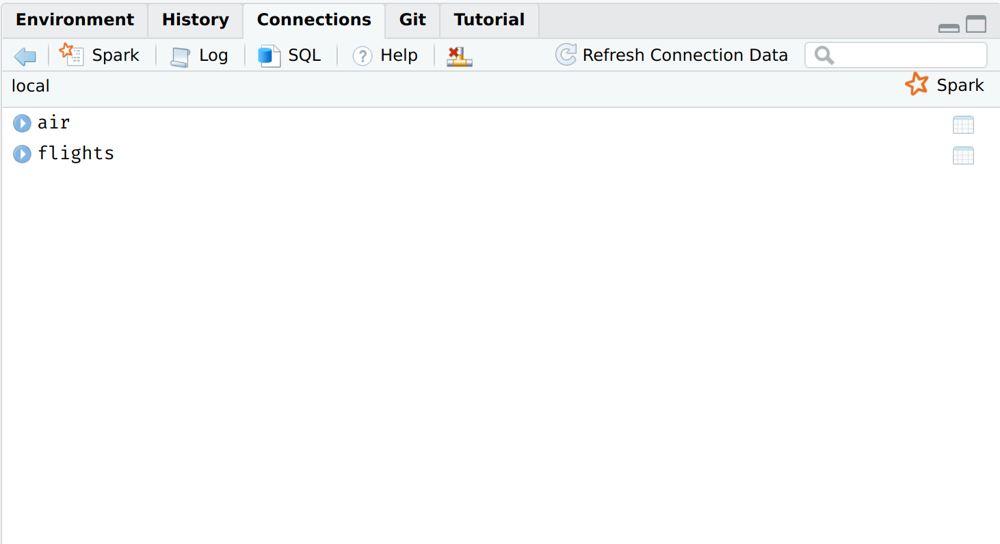

```{r setup, include=FALSE}
knitr::opts_chunk$set(echo = TRUE, cache = TRUE, dpi=300)
## Next hook based on this SO answer: https://stackoverflow.com/a/39025054
knitr::knit_hooks$set(
  prompt = function(before, options, envir) {
    options(
      prompt = if (options$engine %in% c('sh','bash')) '$ ' else 'R> ',
      continue = if (options$engine %in% c('sh','bash')) '$ ' else '+ '
      )
    })

## Spark only works with JAVA 8. 
## NOTE: Other users should change this path if they are trying to knit this 
## .Rmd file!
Sys.setenv(JAVA_HOME = "/usr/lib/jvm/java-8-openjdk")
```

<i>Note: Today's lecture is largely going to be focused on the [**sparklyr**](https://spark.rstudio.com/) package, which provides an R interface to the larger [Apache Spark](https://spark.apache.org/) ecosystem. I want to emphasize ahead of time that Spark is really designed for big data pipelines on an HPC cluster or network. These systems would normally be configured and maintained by your company or university's IT/software engineering team. We're going to emulate these big data pipelines by installing Spark on our local machines, and then explore some of the key concepts through a series of relatively simple examples. My goal is to give you a good sense of how Spark (and **sparklyr**) works and why it's so popular for big data work. The same ideas and functions that we explore today will work at much larger scale.</i>

## Requirements

A lot of work has gone into making a local Spark install as easy as possible. But we've still got quite a few steps to walk through, so please follow all of the below instructions carefully.

### Apache Spark

The **sparklyr** package provides a convenient way to install Spark on your system via the `sparklyr::spark_install()` command. Run this next code chunk interactively in your R session. Note that I am going to install a slightly older version of Spark itself (version 3.1.0 is available as of the time of writing), but that shouldn't matter here.

```{r spark_install, eval=FALSE}
if (!require("sparklyr")) install.packages("sparklyr")
# sparklyr::spark_available_versions() ## list all available versions
sparklyr::spark_install(version = "3.0.0")
```

Installation may take a few minutes to complete, depending on your internet connection and system.

### Java 8 

Spark explicitly requires Java 8. (Other versions of Java won't work!) This can be a bit finicky, so here are some platform-specific installation tips:

#### Windows 

Download the official installer [here](https://www.java.com/en/download/manual.jsp) and then follow the prompts. Please make sure that you download the 64 bit version if you are using a 64 bit machine (which is almost certainly the case). Otherwise, you will probably run into memory allocation errors when you try to use Spark.

I recommend that you allow it to install in the default location, which should be something like: `C:\Program Files\Java\jre1.8.0_241`. If you decide on a different install location, please take careful note of your new installation path since you will need that later.

#### Mac

I strongly recommend that you install Java 8 as a cask through [Homebrew](https://brew.sh/). From your terminal:

```{sh mac1, eval=FALSE, prompt=TRUE}
brew install --cask adoptopenjdk/openjdk/adoptopenjdk8
```

This should install Java 8 to the following location: `/Library/Java/JavaVirtualMachines/adoptopenjdk-8.jdk/Contents/Home`

You can check for all Java installations on your machine by typing in the following command in your terminal:

```{sh mac2, eval=FALSE, prompt=TRUE}
ls -lh /Library/Java/JavaVirtualMachines/
```

#### Linux

You probably know what you're doing, but I recommend that you install OpenJDK 8 using your distro's package manager. See [here](https://openjdk.java.net/install/). This should install to `/usr/lib/jvm/java-8-openjdk` by default. You can list all of the installed Java versions on your machine with the following command.^[For anyone else on Arch Linux like me --- and assuming that you installed Java OpenJDK or OpenJFX through the [official repos](https://wiki.archlinux.org/index.php/Java) --- you can can run `$ archlinux-java status`.]

```{sh linux1, eval=FALSE, prompt=TRUE}
ls -lh /usr/lib/jvm
```

#### Linking Java 8 to R

The Java 8 requirement is somewhat annoying, since you probably (might?) have a newer version of Java installed on your system already. One way to get around this problem is to [replace your current Java installation with Java 8](https://github.com/uc-cfss/Discussion/issues/71). This will automatically make it the default Java environment and is probably the simplest solution. However, I personally don't like the idea of uninstalling the most recent Java version on my computer just to run Spark. In my view, a better solution is to install Java 8 *alongside* your current version. You can then tell R which Java version it should use via an environment variable. This works exactly the same way as when we used environment variables to save secret API keys during our webscraping and cloud computing lectures. (See [here](https://raw.githack.com/uo-ec607/lectures/master/07-web-apis/07-web-apis.html#aside:_safely_store_and_use_api_keys_as_environment_variables) if you missed it.) For example, you can tell R to use Java 8 for the current session by setting a temporary environment variable with the following command.

```{r java8, eval=FALSE}
## NB: Change to the location path of your own Java 8 installation!
# Linux: /usr/lib/jvm/java-8-openjdk
# Mac: /Library/Java/JavaVirtualMachines/adoptopenjdk-8.jdk/Contents/Home
# Windows: C:/Program Files/Java/jre1.8.0_241 ## At time of writing
Sys.setenv(JAVA_HOME = "/path/to/your/java8/installation") 
```

Again, this will only last for the current R session. However, similarly to our approach for storing API keys across sessions, you can make Java 8 the permanent environment for your R work by adding `JAVA_HOME = "/path/to/your/java8/installation"` to your `~/.Renviron` file. 

<!-- You can confirm your Java installation by running the following command. -->

<!-- ```{r check_java} -->
<!-- system("java -version") -->
<!-- ``` -->

<!-- > **Tip:** If you're running Windows, the above command might give you a random number like "127" until you restart your system. -->

If you're having trouble with Java installation, then please consult the [*Mastering Spark with R*](https://therinspark.com/starting.html#starting-prerequisites) book.

### R packages 

- New: **sparklyr**, **dbplot**
- Already used: **dplyr**, **DBI**, **ggplot2**, **hrbrthemes**, **janitor**, **httr**, **here**

As per usual, the code chunk below will install (if necessary) and load all of these packages for you.

```{r packages, cache=FALSE, message=FALSE}
## Load/install packages
if (!require("pacman")) install.packages("pacman")
pacman::p_load(dplyr, DBI, ggplot2, hrbrthemes, lubridate, janitor, httr, 
               sparklyr, dbplot, here)
## My preferred ggplot2 theme (optional)
theme_set(hrbrthemes::theme_ipsum())
```

### Data

Finally, we'll be exploring Spark's capabilities using monthly air traffic data from 2012.^[This will look very familiar to the data that we've already seen in the **nycflights13** package, albeit from a different year and not limited to New York. Note that both of these datasets come from a much larger collection of flight information that is curated by the Research and Innovative Technology Administration (RITA) in the Bureau of Transportation Statistics. Similarly, Revolution Analytics also offer the possiblity of [downloading](https://packages.revolutionanalytics.com/datasets/AirOnTime87to12) monthly flight data from 1987 to 2012.] The data consist of 12 CSV files that first need to be downloaded from [Revolution Analytics](https://packages.revolutionanalytics.com/datasets/) and then saved to `data/` subdirectory of this lecture. You can do that manually if you like, but here are some commands to do everything from R.

```{r air_download1, message=FALSE, results='hide', eval=FALSE}
# library(here)    ## Already loaded
# library(httr)    ## Already loaded
# library(stringr) ## Already loaded (via tidyverse)

dir_path = here("17-spark/data/")

## Create data sub-directory if it doesn't already exist
if (!dir.exists(dir_path)) dir.create(dir_path)

## Next, we download the 2012 air traffic data from Revolution Analytics...
# First set the base URL
base_url = "https://packages.revolutionanalytics.com/datasets/AirOnTimeCSV2012/"
# Quick way to get a vector of the hosted CSV files
csvs = GET(base_url) %>% 
  content("text") %>% 
  str_extract_all("airOT2012...csv") %>% 
  unlist() %>% 
  unique()
# Loop over all the files and download to disk
lapply(
  csvs, 
  function(x) {
    out_path = paste0(dir_path, x)
    ## Only download the files if they don't already exist
    if (!file.exists(out_path)) {
      GET(
        url = paste0(base_url, x), 
        write_disk(paste0(dir_path, x)), 
        progress()
      )
    }
  }
) 
```

The downloads should take a few minutes. Once they're done, check that everything is in order.

```{r dir_path, include=FALSE}
dir_path = here("17-spark/data/")
```

```{r, air_download2}
list.files(dir_path)
```

## What is Spark?

The [Wikipedia page](https://en.wikipedia.org/wiki/Apache_Spark) is a good place to start.

Spark's tagline is that it provides a *unified analytics engine for large-scale data processing*. **Translation:** Spark provides a common platform for tackling all of the problems that we typically encounter in big data pipelines. This includes distributed data storage, data wrangling, and analytics (machine learning and co.) Spark achieves this by bringing together various sub-components:

- **Spark Core**. The foundation of the project, enabling things like distributed computing and memory-mapping.
- **Spark SQL**. A SQL implementation for efficiently querying and storing data in Spark.
- **MLlib**. An extensive machine learning library.
- etc.

Now, at this point you may be asking yourself: "Hang on a minute, haven't we been learning to do all these things in R? Why do we need this Spark stuff if R already provides a (quote unquote) 'unified framework' for our data science needs?" 

The short answer is that Spark can scale in ways that R simply can't. You can move your analysis from a test dataset living on your local computer, to a massive dataset running over a cluster of distributed machines with minimal changes to your code. But at a deeper level, asking yourself the above questions is to miss the point. We will be running all of our Spark functions and analysis from R, thanks to the **sparklyr** package. It will look like R code and it will return R outputs.

> **Aside:** You'll note that Spark is often compared to a predecessor framework for cluster computing and distributed data processing, i.e. [(Hadoop) MapReduce](https://en.wikipedia.org/wiki/MapReduce). The key difference between these two frameworks is that Spark allows for in-memory processing, whereas MapReduce relies solely on I/O to disk. (See [here](https://www.scnsoft.com/blog/spark-vs-hadoop-mapreduce) and [here](https://www.quora.com/What-is-the-difference-in-idea-design-and-code-between-Apache-Spark-and-Apache-Hadoop/answer/Shubham-Sinha-202).) You don't need to worry too much about all this now. It essentially means that Spark is faster and better suited to our present needs. Spark also comes with a bunch of really cool extension libraries, of which we'll barely scratch the surface today.

## Big data and Spark

A central limitation of working with big datasets in R (and Python and virtually every other statistical or programming language) is that everything needs to be loaded in memory.^[Julia is an important exception here, since it provides larger-than-RAM memory mapping as part of the core language. I should also say that R and Python offer external packages that support this kind of functionality. I'm hoping to have two student presentations on **disk.frame** ([link](https://diskframe.com/)) and **arrow** ([link](https://arrow.apache.org/docs/r/index.html)), for example.] By "memory" I'm talking about RAM, not disk storage. So if your laptop only has (say) 16 GB of RAM then --- disregarding the memory simply needed to run your operating system and any other applications --- you are limited to datasets smaller than this size.

We've already seen some methods to brute force our way passed this problem. These basically involve using a more powerful computer, by spinning up a VM on the cloud (e.g. Google Compute Engine) or using an HPC cluster (e.g. UO's Talapas cluster). We've also talked about "small data problems disguised as big data problems". You may only need a subset of a large dataset and so the trick is pulling that smaller subset into memory. Our lecture on databases was primarily aimed at addressing this issue, where we either needed to subset based on specified criteria, or simply use an effective sampling strategy. 

Spark provides another way to solve the "in-memory" bottleneck of large datasets. This reflects Spark's fundamental use case for working with distributed files systems and HPC clusters. However, in the examples that follow, I'll demonstrate these properties very simply, by instantiating a "local" Spark instance that allows us to map across multiple files. 

### Lazy evaluation redux

To preempt things somewhat, our **sparklyr** workflow is going to closely mimic the **DBI**/**dbplyr** workflow that we saw in the [databases lecture](https://raw.githack.com/uo-ec607/lectures/master/16-databases/16-databases.html). First we'll instantiate a *connection* that can be populated with one or more *tables*. Then we'll reference and perform operations on these tables from R (e.g. submit queries or run statistical models) using the *lazy* evaluation framework provided by the **dplyr** package and friends. 

## Instantiate a (local) Spark connection

Before getting started, we need to instantiate a Spark connection via the `sparklyr::spark_connect()` function. Again, this is going to look very familiar to the database connections that we saw in the previous lecture. Note that I am going to specify a "local" Spark instance because I'm working on my laptop, rather than a HPC cluster. (We'll get to some cluster examples at the very end of the lecture.) 

```{r sc, cache=FALSE}
# library(sparklyr) ## Already loaded

## Give our Spark instance a bit more memory (default is 2 GB)
config = spark_config()
config$spark.executor.memory = "4G"

## Instantiate a Spark connection
sc = spark_connect(master = "local", config = config, version = "3.0")
```

> **Tip:** Did you run into an error message to the effect of "Java X is currently unsupported in Spark distributions... Please consider uninstalling Java 9 and reinstalling Java 8"? If so, please see the software requirements discussion for Java 8 (above)[#java_8].

Assuming that you are running these commands in RStudio, you should have seen the "Connections" tab pop open. It is currently empty and should look like this:

</br>


We'll start copying over some tables to our empty connection shortly.

## Working with multiple (large) files

Every data scientist and applied social scientist has encountered a situation where they need to combine a collection of data files into a large, single dataset.A natural approach to this task is to read all of the files into your data analysis environment (e.g. R or Python) and then combine them within this environment. You may even use a sophisticated loop that does all the reading and merging programmatically in parallel. However, this approach often still runs up against the "in-memory" bottleneck that we spoke about above. 

Luckily, there's a better way. Two ways, in fact, and they both involve Spark (i.e. **sparklyr**). 

1. The first combines Spark and our old friend, the shell.
2. The second uses Spark for distributed analysis.

Let's demonstrate both approaches using the monthly air traffic data for 2012 that we downloaded earlier (see: [Data](#data)). While not "big data" by any conceivable modern definition, each of the 12 CSV files is reasonably meaty at around 100 MB. So we'd use at least ~1.2 GB of RAM to load and merge them all within R. 

### Option 1: Concatenate files in the shell and then use **sparklyr**

*Note: The next section is inspired by [this](http://www.brodrigues.co/blog/2018-02-16-importing_30gb_of_data/) blog post by Bruno Rodrigues. He actually uses a significantly larger dataset (~30 GB) than I'm going to use here. We won't have time for everyone to download the files during class, but the same general principles apply; with some minor exceptions related to additional tweaks that we can ignore.*

Regardless of where we combine the data (CSV) files, we first need to make sure that they have a consistent structure (same columns, etc.). Let's compare the top 2 lines of the first and last files using the `head` command.

```{bash head_files, prompt=TRUE}
head -2 data/airOT201201.csv data/airOT201212.csv
```

Looks good. Now we'll merge (i.e. concatenate) all the files using the same two-step approach that I showed you --- using a set of much smaller files --- back in the shell lecture (see [here](https://raw.githack.com/uo-ec607/lectures/master/03-shell/03-shell.html#combine_csvs)). 

  1. Extract the column headers (i.e. first row) from any of the CSV files and redirect them to a new `data/combined.csv` file.
  2. Loop over the remaining files and append everything (except the duplicate column headers) to the just-created `data/combined.csv` file.

```{bash combine, prompt=TRUE, continue=TRUE, cache=FALSE}
head -1 data/airOT201201.csv > data/combined.csv
for i in $(ls data/airOT*); do tail -n +2 $i >> data/combined.csv; done
```  

These two commands should run very quickly. The required memory usage should also be barely discernible, which again highlights some key advantages of the shell. 

Combined file duly created, we can now read the dataset into our R environment using Spark via the **sparklyr** package.

**Aside 1:** Right now, you might be wondering: "Why not just do this with a regular `fread()`/`read_csv()` call?" Yes, that would work perfectly well. But remember that this simple pedagogical example is only meant to *emulate* a case where we have a dataset that is bigger than memory. Spark provides the framework for working with these huge files, since it is efficiently splits operations between memory and disk. It uses memory (i.e. RAM) whenever it is available, otherwise it will switch to disk I/O. So, the same basic principles would apply if you were to actually start working with very large files.

**Aside 2:** Something else these examples don't demonstrate --- but I want to emphasise nonetheless --- is that Spark can also read compressed (.gzip and .bz2), as well as [parquet](https://parquet.apache.org/) file types. This is obviously important for efficient disk use when dealing with big data.

Okay, time to feed our empty `sc` connection some data by copying over the (pretend) big `combined.csv` file that we created just a few seconds ago. We'll do so using the `sparklyr::spark_read_csv()` function.^[A point of convenience is that **sparklyr** offers intuitive aliases for many base/tidyverse R functions.] In another similarity to our databases lecture, we should give the dataset a unique table name that distinguishes it in the Spark connection panel. I'll call this table "air" and then reference it from R by assigning it to a new object also called `air`.^[Remember from our databases lecture: The table and referenced R object don't have to be called the same thing. But you'll probably find it helpful to give them the same (or, at least, similar) names.] I'm also going to set `memory = FALSE` to avoid caching the table in RAM; we'll come back to this idea later.

```{r air_spark, cache=TRUE}
air = 
  spark_read_csv(
    sc, 
    name = "air",
    path = here("17-spark/data/combined.csv"),
    memory = FALSE
    )
```

The "Connections" tab of your RStudio IDE should now contain the "air" table that we just instantiated to our Spark connection. You can click on it to expand the various columns, or you could click on the spreadsheet icon to see a preview of the dataset in a new RStudio window.

</br>

</br>

> **Tip:** I won't go through it here. But you can open the (native) Spark web interface in your internet browser by clicking the Spark icon in your Connections pane, or by typing `spark_web(sc)` in your R console. See [Chapter 2.4.1](https://therinspark.com/starting.html#starting-spark-web-interface) of *Mastering Spark in R* for more details. 

You can also get a (lazy) preview of table by printing the `air` reference object in your R console. 

```{r air_print}
air
```

Since I keep referencing the databases lecture, the good news is that all of the **dplyr** verbs and tidyverse syntax carry over to a **sparklyr** table connection.^[In the background, these are getting translated to Spark SQL.] Let's create a new data frame that contains the mean departure delay for each day of our table.^[You might note that that I'm not using **lubridate** for the date conversions in the query that follows. That's because Spark relies on [Hive functions](https://spark.rstudio.com/dplyr/#hive-functions) for built-in aggregation, including datetime operations. Luckily, the base R `as.Date()` function works just fine.]

```{r mean_dep_delay}
# library(dplyr) ## Already loaded

mean_dep_delay = 
  air %>%
  group_by(YEAR, MONTH, DAY_OF_MONTH) %>%
  summarise(mean_delay = mean(DEP_DELAY)) %>%
  mutate(date = as.Date(paste(YEAR, MONTH, DAY_OF_MONTH, sep = "-"))) %>%
  arrange(date) 
```

The above code chunk completes almost instantly. But remember that we're dealing with a *lazy* query here. The `mean_dep_delay` object hasn't actually been created yet; it's just a pointer to a set of aspirational commands. To actually execute the query and pull the resulting object into our R environment, we'll use `dplyr::collect()`. At the risk of repeating myself, this is exactly the same approach that we adopted in the databases lecture. 

```{r collected_mean_dep_delay, message=FALSE}
# mean_dep_delay %>% show_query() ## Show the Spark SQL translation
mean_dep_delay = collect(mean_dep_delay)
mean_dep_delay
```

All that hard work deserves a nice plot, don't you think? Let's see how departure delays vary over the course of a year. 

```{r collected_mean_dep_delay_plot, dependson=mean_dep_delay, message=FALSE}
# library(ggplot2) ## Already loaded

mean_dep_delay %>%
  ggplot(aes(date, mean_delay)) + 
  geom_line() +
  geom_smooth(se = FALSE)
```

**Bottom line:** Looks like you want to avoid flying over the December and summer holidays. (This kind of deep analysis is what they pay us the big bucks for.)

We'd normally disconnect from our `sc` connection at this point using `spark_disconnect(sc)`, but I want to keep it open and copy over some new data.

### Option 2: Distributed mapping using **sparklyr**

While the above method is great for showing off the power of the shell and the basic functionality of **sparklyr**, it doesn't demonstrate the core *distributed* functionality of the Spark ecosystem. In particular, Spark is very efficient --- optimised, even --- for working with a distributed files. Our second example is intended to demonstrate this functionality. Note that, while it will involve a pretty simple distributed set of files on our local computer, the same ideas would apply to more complicated cluster setups. 

Let's start by removing that `combined.csv` file from earlier, just to convince ourselves that we're not somehow reading in the concatenated file. We want to make sure that we're working across a distributed set of files.

```{r rm_combined, cache=FALSE}
file.remove(here("17-spark/data/combined.csv"))
list.files(here("17-spark/data/"))
```

Good. We're only left with the individual monthly CSVs. 

Time to read in the distributed files. Note that we'll be using the same `spark_read_csv()` function as before. This time, however, we just need to specify the path for the whole `data/` directory, rather than any individual CSVs. I'll call this new (distributed) Spark object `flights`, but only to keep it clear that this is distinct from the "air" object that we already created.

```{r flights, cache=TRUE}
flights = 
  spark_read_csv(
  sc,
  name = "flights",
  path = here("17-spark/data/"),
  memory = FALSE
  )
```

You should now be able to see the "flights" table, alongside the original "air" table in your Connections pane.



We count prove to ourselves that all 6+ million rows across the 12 distributed CSV files have been mapped by quickly counting the data.

```{r}
count(flights)
```

Remembering that our "flights" table still only exists as pointers to the files on disk, here's something cool: We can run a query and/or then use the **dbplot** package ([link](https://db.rstudio.com/dbplot/)) to perform plot calculations *inside* the Spark connection (i.e. database). This is essentially like having a **ggplot2** backend for database connections.

```{r flights_plot}
# library(dbplot) ## Already loaded

flights %>% 
  mutate(FL_DATE = as.Date(FL_DATE)) %>%
  ## Plot the data, executing an aggregation function (i.e. mean) inside Spark
  dbplot_line(FL_DATE, mean(DEP_DELAY))
```

And there we have our same plot from before, but now executed from inside the Spark table --- which, in turn, was mapped over a directory of distributed files. Pretty cool and very powerful once you start working with big data proper.

## Memory management and caching

Recall that we used the `memory = FALSE` option when reading in our Spark tables via `spark_read_csv()`. This means that Spark just "mapped" the underlying files without loading everything into memory. The advantage of this approach is that the mapped reading happens very quickly, so we can inspect the first few rows without hammering our RAM. On the other hand, performing actual queries will take longer, because now the data has to read from disk before it can be manipulated.^[More details on the considerations for caching Spark tables [here](https://spark.rstudio.com/guides/caching/) and [here](https://therinspark.com/data.html#memory).]

I want to emphasise that setting `memory = FALSE` doesn't make much sense for a dataset of this moderate size.^[Well, unless you are working on a severely RAM-constrained machine.] Sticking with the (default!) `memory = TRUE` option is a perfectly sensible option, since we'd like to optimise performance and aren't pushing up against the memory bounds of most computers. However, I wanted to show you this functionality, so that you can invoke it if and when you *are* faced with a really large dataset that doesn't fit into your RAM.

To drive home the point, consider what happens to my RAM when I read in another copy of the air traffic data. First, to set a baseline, here is my current memory load.

```{bash free_1, prompt = TRUE}
free -h
```

Now, let's read in another copy of the data with the `memory` option again set to FALSE.

```{r flights2, cache=TRUE}
flights2 = 
  spark_read_csv(
  sc,
  name = "flights2",
  path = here("17-spark/data/"),
  memory = FALSE
  )
```

Unsurprisingly, my memory load hasn't changed at all:

```{bash free_2, prompt = TRUE}
free -h
```

Let's read in one last copy of the data. This time, however, we'll use the default option of `memory = TRUE`.

```{r flights3, cache=TRUE}
flights3 = 
  spark_read_csv(
  sc,
  name = "flights3",
  path = here("17-spark/data/"),
  memory = TRUE ## Changed (also: the default behaviour)
  )
```

Now we _do_ see an increase in memory usage. Again, this should be unsurprising since we've explicitly told Spark to load the table into RAM, rather than just mapping it out to pointers on disk.

```{bash free_3, prompt = TRUE}
free -h
```

> **Tip:** Open up the Spark web UI (`spark_web(sc)`) and click the "Storage" tab to see which of your tables are cached and held in memory.

### Cleaning up

We can remove Spark tables and free up any RAM that they might be taking up via the `DBI::dbRemoveTable()` function. Note that we have to remove the corresponding R objects separately --- a good idea too, since they will no longer be referencing a valid table. In the below code chunk, I'm going to remove everything except the "flights" table, which I want to use in the next section.

```{r cleanup, cache=TRUE}
## Remove tables from the Spark connection
dbRemoveTable(sc, "air"); dbRemoveTable(sc, "flights2"); dbRemoveTable(sc, "flights3")
## Remove the corresponding R objects (i.e. references)
rm(air, flights2, flights3)            
```

(You may need to refresh your Connections pane in Rstudio to confirm that these tables are no longer there.)

### Cache a queried (or existing) table

While `spark_read_*` provides the option to automatically, and sensibly, cache a table at read-time into memory, we can also cache existing tables using the `sparklyr::tbl_cache()` function. I'm going to hold off doing that for a moment, since we'll see an explicit example in the [next section](#Machine_Learning) on machine learning.

## Machine Learning

Some of the most exciting applications of Spark involve machine learning; both through its built-in [MLlib](http://spark.rstudio.com/mlib/) library and its (seamless) interface to external platforms like H2O's [Sparkling Water](https://www.h2o.ai/sparkling-water/). There's a lot to cover here and I'll only be able to scratch the surface. My goal for this section is to demonstrate Spark's basic ML functionality by running several different models (algorithms) on our `flights` dataset. In each case our task will be exactly the same: Predict whether a plane was late arriving at its destination based on when it departed.

### Prepare the data

First, I'm going to prepare the data. For this simple example, I'm not going to worry about scaling and any of the other feature engineering tricks that we'd normally heed in a real-life ML problem. Instead, I'm just going to create a binary (1/0) variable called "late", which records whether a flight arrived more than 15 minutes behind schedule. In other words, this is going to be a *classification* problem.

As ever with prediction algorithms, we also need to partition our data into random samples for training and validation (i.e. testing). This will help us avoid overfitting. In this case, I'm only going to use 10% of the data for model building and testing to reduce estimation time.^[Estimating models on random samples is very common practice in industries where you are working with extremely large datasets.] This 10% sample will then be split 30-70 between training and testing data, respectively.

```{r flights_sample, cache=TRUE}
flights_sample = 
  flights %>% 
  select(FL_DATE, ARR_DELAY, DEP_DELAY, SCHED_DEP_TIME = CRS_DEP_TIME) %>%
  filter(!is.na(ARR_DELAY)) %>%
  mutate(FL_DATE = as.Date(FL_DATE)) %>%
  ## Create our binary outcome variable: LATE 
  ## Measures whether arrival > 15 min delayed
  ft_binarizer(
      input_col = "ARR_DELAY", 
      output_col = "LATE", 
      threshold = 15
      ) %>%
  ## Create a new discretized predictor variable: DEP_BLOCK
  ## Divides departure times into six evenly-spaced "blocks" (i.e. 4 hours apart)
  ft_bucketizer(
      input_col = "SCHED_DEP_TIME", 
      output_col = "DEP_BLOCK", 
      splits = seq(0, 2400, by = 400)
      ) %>% 
  mutate(DEP_BLOCK = paste0(as.integer(DEP_BLOCK))) %>%
  ## Partition the data: Randomly sample 10% for training (3%) and testing (7%)
  sdf_random_split(train = 0.03, test = 0.07, other = 0.9, seed = 123)
```

The next thing we'll do is register these training and testing datasets in our Spark connection. We'll do this with the `sdf_register()` function, which will generate the resulting tables in our Connections pane.

```{r register, cache=TRUE}
## Register the resulting tables in our Spark connection
flights_train = sdf_register(flights_sample$train, "flights_train")
flights_test = sdf_register(flights_sample$test, "flights_test")
```

As a final data preparation step, we'll cache these two tables in memory using the aforementioned `tbl_cache()` function. This will enable improved performance, especially since we'll be running multiple algorithms over the same datasets and don't want to worry about relaying back and forth to data stored on disk.

```{r tbl_cache, cache=TRUE}
## Cache them (i.e. load into RAM for better performance)
tbl_cache(sc, "flights_train")
tbl_cache(sc, "flights_test")

## Quick check of how big these (sampled) datasets are
tally(flights_train)
tally(flights_test)
```

### Models

Data preparation out of the way, I'm going to compare three different models/algorithms: 

1. logistic regression
2. random forest
3. neural network

The point is simply to demonstrate the flexibility of Spark's MLlib and give you an idea of the required syntax. I am *not* trying to optimize model performance here. 

With the appropriate caveats out of the way, it will prove convenient to save the (very simple) formula that we'll be using for all three models as its own object. This will allow us to quickly recycle it quickly with minimal typing or typos... And is thus a good habit to get into for the more complex types of comparative analyses that you will confront in real-life.

```{r fml}
fml = LATE ~ DEP_DELAY + DEP_BLOCK
```


#### Logistic regression

We start with a simple logistic regression. For this first model/algorithm class I'll walk you through the individual modeling steps in more detail. The function of interest here is `sparklyr::ml_logistic_regression` and we can summarise it as we would a normal regression in R. Let's run it on our training data.

```{r lg_mod, dependson=fml}
lg_mod = 
  flights_train %>%
  ml_logistic_regression(fml)

summary(lg_mod)
```

Next, we turn to our "test" (i.e. holdout) sample to run predictions on data that the model has never seen. The key function here is `sparklyr::ml_predict()`.

```{r lg_pred}
lg_pred = ml_predict(lg_mod, flights_test)

## Preview the prediction results
lg_pred %>% 
  select(truth = LATE, prediction, probability) %>% 
  head(5)
```

How did we do?

```{r lg_pred_tally}
## Summary metrics:
ml_binary_classification_evaluator(lg_pred) ## area under ROC
ml_multiclass_classification_evaluator(lg_pred) ## F1 score

## We'll also create a confusion matrix for use later
lg_cmat =
  lg_pred %>%
  group_by(truth = LATE, prediction) %>%
  tally() %>%
  collect()
```

#### Random forest

Second, we have a random forest model. Conveniently, the steps will stay exactly the same as for the logistic regression model. The only change we need to make is to specify a different model type, i.e. `ml_random_forest()`.

```{r rf_mod, dependson=fml}
## Train the RF model
rf_mod = 
  flights_train %>%
  ml_random_forest(fml, type = "classification")  ## The only thing that changes!

## Run predictions on test (i.e. holdout) sample
rf_pred = ml_predict(rf_mod, flights_test)

## Preview the prediction results
# rf_pred %>% 
#   select(truth = LATE, prediction) %>% 
#   head(5)

## Summary metrics:
ml_binary_classification_evaluator(rf_pred) ## area under ROC
ml_multiclass_classification_evaluator(rf_pred) ## F1 score

## Create confusion matrix
rf_cmat =
  rf_pred %>%
  group_by(truth = LATE, prediction) %>%
  tally() %>%
  collect()
```

#### Neural network

Third, we'll train a (feedforward) neural network model with three layers. The relevant model function in this case is `ml_multilayer_perceptron_classifier()`.

*Note: The number in the first layer of the NN model must correspond to the number of input features; in this case 6 (i.e. 1 for DEP_DELAY plus 5 for the DEP_BLOCK dummies, so as to avoid the dummy variable trap). Similarly, the last layer must correspond to the number of output classes; in this case 2 (i.e. LATE or not LATE.) The intermediate layers are flexible.*

```{r nn_mod, dependson=fml}
## Train the neural net
nn_model = 
  flights_train %>%
  ml_multilayer_perceptron_classifier(fml, layers = c(6, 3, 2)) ## Only thing that changes!

## Run predictions on test (i.e. holdout) sample
nn_pred = ml_predict(nn_model, flights_test)

## Preview the prediction results
# nn_pred %>%
#   select(truth = LATE, prediction) %>%
#   head(5)

## Summary metrics:
ml_binary_classification_evaluator(nn_pred) ## area under ROC
ml_multiclass_classification_evaluator(nn_pred) ## F1 score

## Create confusion matrix
nn_cmat =
  nn_pred %>%
  group_by(truth = LATE, prediction) %>%
  tally() %>%
  collect()
```


#### Model comparison

With our three model groups now having been run, we can compare the resulting confusion matrices. The logistic model does (slightly) better on true positives, whilst the random forest does (slightly) better on true negatives. The neural net is somewhere in the middle. All three tend to underestimate the number of late arrivals.

```{r cmat}
bind_rows(
  lg_cmat %>% mutate(mod = "Logistic regression"), 
  rf_cmat %>% mutate(mod = "Random forest"),
  nn_cmat %>% mutate(mod = "Neural network")
  ) %>% 
  pivot_wider(names_from = mod, values_from = n)
```

And here's the same information in plot form.

```{r cmat_plot}
bind_rows(
  lg_cmat %>% mutate(mod = "Logistic regression"), 
  rf_cmat %>% mutate(mod = "Random forest"), 
  nn_cmat %>% mutate(mod = "Neural network")
  ) %>%
  mutate(mod = factor(mod, levels = c("Logistic regression", "Random forest", "Neural network"))) %>%
  mutate(across(c(truth, prediction), as.factor)) %>%
  ggplot(aes(x = truth, y = n, fill = prediction)) +
  geom_col(alpha = 0.5) + 
  scale_fill_brewer(palette = "Set1") +
  scale_y_continuous(labels = scales::comma) + 
  labs(title = "Predicting late arrivals: Model performance") +
  facet_wrap(~ mod) + 
  theme(
    axis.title.y = element_blank(),
    panel.grid.major.x = element_blank()
    )
```


## Disconnect

Finally, let's disconnect from our Spark connection.

```{r discon, cache=FALSE}
spark_disconnect(sc)
```

## Bonus: Spark in the cloud (GCP Dataproc)

This is a bonus section of live material that I've prepared if we have time.

## Further reading and resources

- [*Mastering Spark with R*](https://therinspark.com/) by Javier Luraschi, Kevin Kuo, and Edgar Ruiz.
- The [**sparklyr** website](https://spark.rstudio.com/).