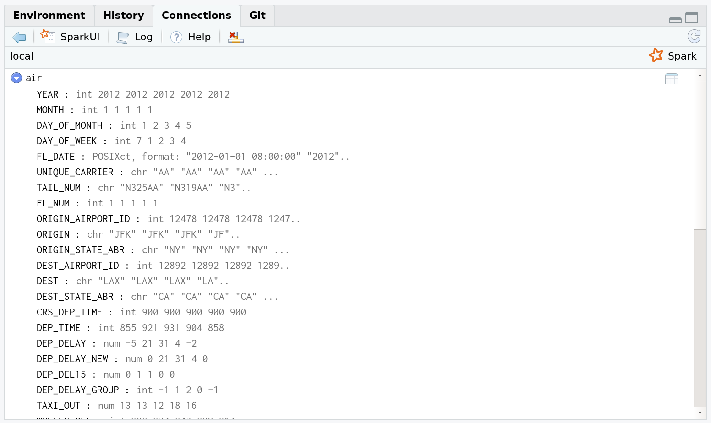

## Requirements

### Apache Spark

Today's lecture is largely going to be focused on the [**sparklyr**](https://spark.rstudio.com/) package, which provides a seemless interface to the larger [Apache Spark](https://spark.apache.org/) ecosystem. Among other things, **sparklyr** provides a convenient way to install Spark on your system via the `sparklyr::spark_install()` command. Run this next code chunk interactively in your R session. Note that I am going to install a slightly older version of Spark itself (version 2.4.0 is available as of the time of writing), but I don't think this matters all that much.


```r
if (!require("sparklyr")) install.packages("sparklyr")
# sparklyr::spark_available_versions() ## list all available versions
sparklyr::spark_install(version = "2.3.0")
```

Fair warning: Installation will take a while to complete.


### Java 8 

Spark requires Java 8. This is somewhat annoying, since you probably already have a newer version of Java installed on your system as the default.^[The method for checking which version(s) of Java you have varies by operating system. I therefore recommend that you Google it. On my linux system I can just use the following shell commands: `$ java --version` or `$ archlinux-java status` (Arch linux only).] One way to get around this problem is to [replace your current Java installation with Java 8](https://github.com/uc-cfss/Discussion/issues/71). This will automatically make it the default Java environment and is probably the simplest solution. However, I personally don't like the idea of uninstalling the most recent Java version on my computer just to run Spark. In my view, a better solution is to install Java 8 *alongside* your current version. You can then tell R which Java version it should use via an **environment variable**. This works exactly the same way as when we used environment variables to save secret API keys. (See [here](https://raw.githack.com/uo-ec607/lectures/master/07-web-apis/07-web-apis.html#aside:_safely_store_and_use_api_keys_as_environment_variables) if you missed it.) For example, you can tell R to use Java 8 for the current session by [setting a temporary environment variable](https://github.com/rstudio/sparklyr/issues/1383#issuecomment-381014611) with the following command.


```r
## Change to the location of your Java 8 installation
Sys.setenv(JAVA_HOME = "/path/to/your/java8/installation") 
```

Again, this will only last for the current R session. However, similarly to our approach for storing API keys across sessions, you can make Java 8 the permanent environment for your R work by adding `JAVA_HOME = "/path/to/your/java8/installation"` to your `~/.Renviron` file.


### R packages 

- New: **sparklyr**, **dbplot**
- Already used: **tidyverse**, **hrbrthemes**, **lubridate**, **janitor**, **httr**, **here**

As per usual, the code chunk below will install (if necessary) and load all of these packages for you. I'm also going to set my preferred ggplot2 theme, but as you wish.


```r
## Load/install packages
if (!require("pacman")) install.packages("pacman")
pacman::p_load(tidyverse, hrbrthemes, lubridate, janitor, httr, sparklyr, dbplot, here)
## My preferred ggplot2 theme (optional)
theme_set(hrbrthemes::theme_ipsum())
```


## What is Spark?

Student presentation time. 

If you're reading this after the fact, then the [Wikipedia page](https://en.wikipedia.org/wiki/Apache_Spark) is a good place to start. As the tagline goes, Spark is a *unified analytics engine for large-scale data processing*. Which is simply to say that Spark provides a common platform for tackling all of the problems that we typically encounter in big data pipelines. This includes distributed data storage, data wrangling, and analytics (machine learning and co.) Spark achieves this by bringing together various sub-components 

- Spark Core (the foundation of the project, enabling things like distributed computing. We'll get back to this in a second.)
- Spark SQL (exactly what it sounds like: a SQL implementation for querying and storing data in Spark)
- MLlib (an extensive machine learning library)
- etc.

Now, at this point you may be asking yourself: "Hang on a minute, haven't we been learning to do all these things in R? Why do we need this Spark stuff if R already provides a (quote unquote) 'unified framework' for our data science needs?" 

The short answer is that Spark can scale in ways that R simply can't. You can move your analysis from a test dataset living on your local computer, to a massive dataset running over a cluster of distributed machines with minimal changes to your code. But at a deeper level, asking yourself the above questions is to miss the point. We will be running all of our Spark functions and analysis from R, thanks to the **sparklyr** package. It will look like R code and it will return output that looks exactly like the tidy output we've come to expect. 

You'll note that Spark is often compared to a predecessor framework for cluster computing and distributed data processing called [(Hadoop) MapReduce](https://en.wikipedia.org/wiki/MapReduce). The key difference between these two frameworks is that Spark allows for in-memory processing, whereas MapReduce relies solely on I/O to disk. (See [here](https://www.scnsoft.com/blog/spark-vs-hadoop-mapreduce) and [here](https://www.quora.com/What-is-the-difference-in-idea-design-and-code-between-Apache-Spark-and-Apache-Hadoop/answer/Shubham-Sinha-202.)) You don't need to worry too much about all this now. It basically means that Spark is faster and better suited to our present needs. Spark also comes with a bunch of really cool extension libraries, which we'll barely scratch the surface of today.

## Working with big datasets

A central limitation of working with big datasets in R (and Stata and Python and virtually every other statistical or programming language) is that everything needs to be loaded in memory. By "memory" I'm talking about RAM, not disk storage. So if your laptop only has (say) 16 GB of RAM then --- even diregarding the memory simply needed to run my OS and other applications --- you are limited to datasets smaller than this size.^[The memory load of dataset doesn't scale perfectly with the disk space it occupies. Indeed, you will often find that a CSV file of X bytes is significantly larger than that when it is read into your R environment. (One reason: Your variables might get converted to special value types like factors or dates that take up more space than their string and numerical equivalents.) However, it's a useful approximation.] 

We've already seen some methods to brute force our way passed this problem. These basically involve using a more powerful computer by spinning up a VM on the cloud (e.g. Google Compute Engine) or using a HPC cluster (e.g. UO's Talapas cluster). We've also talked about "small data problems disguised as big data problems". Perhaps you only need a subset of a large dataset and so the trick is pulling that smaller subset into memory. Our previous lecture on databases was primarily aimed at addressing this issue, where we either need to subset based on specified criteria or simply use an effective sampling strategy.^[We're all trained as applied econometrians so we believe in the valid statistical properties of sampling, right?] 

Spark (and the **sparklyr** package) offer another approach to solving the "in-memory" bottleneck of large datasets. As we'll see, this has a familiar flavour to the "lazy" evaluation style that `dplyr` took to working with databases. Much of this relates to Spark's fundamental use case for working with distributed files systems and HPC clusters. However, I'll try to demonstrate these properties below by instantiating a "local" Spark instance and then working across multiple files.

## Working with multiple (large) files

A situation that will be familiar to many of you is where you have to merge a number of smaller datasets into a larger, composite dataset. These component data files can be pretty large in of themselves, as anyone who has ever worked with Census or weather data from multiple years can attest to. A natural approach to this task is to read all of the files into your data analysis environment (e.g. R) and then combine them within this environment. You may even use a relatively sophisticated loop or lapply call that does all the reading and merging programmatically. However, this approach still runs up against the "in-memory" bottleneck that we spoke about above. 

Luckily, there's a better way. Two ways, in fact, and they both involve Spark (i.e. **sparklyr**). 

1. The first combines Spark and our old friend, the shell.
2. The second uses Spark directly for distributed analysis (with some help from the `dbplot` package, which I'll introduce later).

Let's demonstrate both approaches using a bunch of large(ish) files from the [Revolution Analytics collection](https://packages.revolutionanalytics.com/datasets/) of big dataset examples. We'll be using monthly data on airline departures and arrivals from 2012. This will look very familiar to the data that we've already seen in the `nycflights13` package, albeit from a different year and not limited to New York. Note that both of these data collections come from a much larger collection of flight information that is curated by the Research and Innovative Technology Administration (RITA) in the Bureau of Transportation Statistics. Similarly, Revolution Analytics also offer the possiblity of [downloading](https://packages.revolutionanalytics.com/datasets/AirOnTime87to12/) monthly flight data from 1987 to 2012. Background information out of the way, let's download the 2012 files to a "data/" subdirectory of this lecture. Note that I am going to do this in the shell using the `wget` command


```bash
$ mkdir -p data ## Make the data folder if one doesn't already exist
```

```bash
$ wget -A csv -r -l 1 -N -nd --directory-prefix=./data/ https://packages.revolutionanalytics.com/datasets/AirOnTimeCSV2012/
```

**Aside:** that I'm specifying the `--directory-prefix=` flag mostly for reasons related to knitting this Rmarkdown document. Relative paths get complicated in Rmarkdown when we're using multiple bash code chunks; I'd probably just use `cd` if I were running this interactively. See [here](https://stackoverflow.com/a/23775416/4115816) if you're wondering about the various other flags that I used with the `wget` command.

The downloads should take a few minutes. Once they're done, check that everything is in order.


```bash
$ ls -lh data/airOT*
```

```
## -rw-r--r-- 1 grant users 104M Mar  2 16:51 data/airOT201201.csv
## -rw-r--r-- 1 grant users  99M Mar  2 16:51 data/airOT201202.csv
## -rw-r--r-- 1 grant users 112M Mar  2 16:52 data/airOT201203.csv
## -rw-r--r-- 1 grant users 108M Mar  2 16:52 data/airOT201204.csv
## -rw-r--r-- 1 grant users 111M Mar  2 16:52 data/airOT201205.csv
## -rw-r--r-- 1 grant users 113M Mar  2 16:52 data/airOT201206.csv
## -rw-r--r-- 1 grant users 117M Mar  2 16:53 data/airOT201207.csv
## -rw-r--r-- 1 grant users 116M Mar  2 16:53 data/airOT201208.csv
## -rw-r--r-- 1 grant users 105M Mar  2 16:53 data/airOT201209.csv
## -rw-r--r-- 1 grant users 110M Mar  2 16:53 data/airOT201210.csv
## -rw-r--r-- 1 grant users 105M Mar  2 16:54 data/airOT201211.csv
## -rw-r--r-- 1 grant users 107M Mar  2 16:54 data/airOT201212.csv
```

While not "big data" by any conceivable modern definition, these 12 files are all reasonably meaty at around 100 MB each. So we'd use at least ~1.2 GB of RAM to load and merge them all within R. Let's take a look

### Option 1: Concatenate files in the shell and then use **sparklyr**

*Note: The next section is inspired by [this](http://www.brodrigues.co/blog/2018-02-16-importing_30gb_of_data/) blog post by Bruno Rodrigues. Bruno actually uses a significantly larger dataset (~30 GB) than what I'm going to use here. We won't have time for everyone to download the files during class and, to be honest, the same general principles apply. Well, with the exception of some additional tweaks that he invokes to avoid memory limitation errors. Read his [blog post](http://www.brodrigues.co/blog/2018-02-16-importing_30gb_of_data/) for more details.*

Regardless of where we do it, however, we need to make sure that they have a consistent structure (same columns, etc.). Let's compare the top 2 lines of the first and last files using the `head` command.


```bash
$ head -2 data/airOT201201.csv
```

```
## "YEAR","MONTH","DAY_OF_MONTH","DAY_OF_WEEK","FL_DATE","UNIQUE_CARRIER","TAIL_NUM","FL_NUM","ORIGIN_AIRPORT_ID","ORIGIN","ORIGIN_STATE_ABR","DEST_AIRPORT_ID","DEST","DEST_STATE_ABR","CRS_DEP_TIME","DEP_TIME","DEP_DELAY","DEP_DELAY_NEW","DEP_DEL15","DEP_DELAY_GROUP","TAXI_OUT","WHEELS_OFF","WHEELS_ON","TAXI_IN","CRS_ARR_TIME","ARR_TIME","ARR_DELAY","ARR_DELAY_NEW","ARR_DEL15","ARR_DELAY_GROUP","CANCELLED","CANCELLATION_CODE","DIVERTED","CRS_ELAPSED_TIME","ACTUAL_ELAPSED_TIME","AIR_TIME","FLIGHTS","DISTANCE","DISTANCE_GROUP","CARRIER_DELAY","WEATHER_DELAY","NAS_DELAY","SECURITY_DELAY","LATE_AIRCRAFT_DELAY",
## 2012,1,1,7,2012-01-01,"AA","N325AA","1",12478,"JFK","NY",12892,"LAX","CA","0900","0855",-5.00,0.00,0.00,-1,13.00,"0908","1138",4.00,"1225","1142",-43.00,0.00,0.00,-2,0.00,"",0.00,385.00,347.00,330.00,1.00,2475.00,10,,,,,,
```

Looks good. Now we merge (i.e. concatenate) all the files in two steps: 

  1. Extract the column headers from one file using the `head` command as before. Export these headers to a new `data/combined.csv` file.
  2. Loop over the remaining files and copy across all their lines using the `cat` command, but making sure to remove the first line of (duplicate) column headers using an option of the `sed` command. Append each run of the loop to the `data/combined.csv` file.


```bash
$ head -1 data/airOT201201.csv > data/combined.csv
$ for file in $(ls data/airOT*); do cat $file | sed "1 d" >> data/combined.csv; done
```

These two commands should run pretty quickly. On my system, the increase in memory useage was barely discernable. Certainly, not even close the amount that would have been required in R.

Combined file duly created, we can now read the dataset into our R environment using Spark (via the **sparklyr** package).^[At this point you might be asking: "Why not just do this with a regular `read_csv()` call?" Well, remember that this simple example is only meant to *emulate* a case where we have a dataset that is bigger than memory. Spark provides the framework for working with these huge files, since it is efficiently splits operations between memory and disk. It uses memory (i.e. RAM) whenever it is available, otherwise it will switch to disk I/O. The same basic principles would apply if you were to actually start working with very large files.]

First, we need to instantiate a Spark connection via the **`sparklyr::spark_connect()`** function. This is going to follow a very similar path to the database connections that we saw in the previous lecture. Note that I am going to specify a "local" Spark instance because I'm working on my laptop, rather than a HPC cluster.^[Just about any HPC cluster that you work on should have Spark installed, so you should be able to follow exactly the same steps there. Just make sure that **sparklyr** is installed on the cluster too.]


```r
# library(sparklyr) ## Already loaded

## Instantiate a Spark connection
sc <- spark_connect(master = "local", version = "2.3", config = spark_config())
```

> **Tip: ** Did you run into an error message to the effect of "Java X is currently unsupported in Spark distributions... Please consider uninstalling Java 9 and reinstalling Java 8"? If so, please see the software requirements discussion for Java 8 (above)[#java8].

A point of convenience here is **sparklyr** offers intuitive aliases for regular R functions. So, we'll be using the **`sparklyr::spark_read_csv()`** function to pull in this (pretend) large CSV. 


```r
## Read in the file as a Spark object
air <- spark_read_csv(sc, name = "air", path = "data/combined.csv")
air
```

```
## # Source: spark<air> [?? x 45]
##     YEAR MONTH DAY_OF_MONTH DAY_OF_WEEK FL_DATE             UNIQUE_CARRIER
##    <int> <int>        <int>       <int> <dttm>              <chr>         
##  1  2012     1            1           7 2012-01-01 08:00:00 AA            
##  2  2012     1            2           1 2012-01-02 08:00:00 AA            
##  3  2012     1            3           2 2012-01-03 08:00:00 AA            
##  4  2012     1            4           3 2012-01-04 08:00:00 AA            
##  5  2012     1            5           4 2012-01-05 08:00:00 AA            
##  6  2012     1            6           5 2012-01-06 08:00:00 AA            
##  7  2012     1            7           6 2012-01-07 08:00:00 AA            
##  8  2012     1            8           7 2012-01-08 08:00:00 AA            
##  9  2012     1            9           1 2012-01-09 08:00:00 AA            
## 10  2012     1           10           2 2012-01-10 08:00:00 AA            
## # … with more rows, and 39 more variables: TAIL_NUM <chr>, FL_NUM <int>,
## #   ORIGIN_AIRPORT_ID <int>, ORIGIN <chr>, ORIGIN_STATE_ABR <chr>,
## #   DEST_AIRPORT_ID <int>, DEST <chr>, DEST_STATE_ABR <chr>,
## #   CRS_DEP_TIME <int>, DEP_TIME <int>, DEP_DELAY <dbl>, DEP_DELAY_NEW <dbl>,
## #   DEP_DEL15 <dbl>, DEP_DELAY_GROUP <int>, TAXI_OUT <dbl>, WHEELS_OFF <int>,
## #   WHEELS_ON <int>, TAXI_IN <dbl>, CRS_ARR_TIME <int>, ARR_TIME <int>,
## #   ARR_DELAY <dbl>, ARR_DELAY_NEW <dbl>, ARR_DEL15 <dbl>,
## #   ARR_DELAY_GROUP <int>, CANCELLED <dbl>, CANCELLATION_CODE <chr>,
## #   DIVERTED <dbl>, CRS_ELAPSED_TIME <dbl>, ACTUAL_ELAPSED_TIME <dbl>,
## #   AIR_TIME <dbl>, FLIGHTS <dbl>, DISTANCE <dbl>, DISTANCE_GROUP <int>,
## #   CARRIER_DELAY <dbl>, WEATHER_DELAY <dbl>, NAS_DELAY <dbl>,
## #   SECURITY_DELAY <dbl>, LATE_AIRCRAFT_DELAY <dbl>, `_c44` <chr>
```

Next, similar to the database connections that we saw in the previous lecture, we can create a spark connection to an object (i.e. dataset) via the `spark_connect()` function. Note that I specify a "local" Spark instance because I'm working on my laptop, rather than a HPC cluster.

At this point, you can click on the "Connections" tab of your RStudio IDE and it should show you that you are connected to a new table called "air". You can expand it to see the various columns, or you could click on the spreadsheet icon to see a preview of the dataset in a new RStudio window. While I won't go through it here, you can even click on the "SparkUI" tab, which will open open the native Spark connections pane in your internet browser.

</br>

</br>

The good news is that --- thanks once again to the folks at RStudio --- all of our favourite `dplyr` verbs and tidyverse syntax carry over to an **sparklyr** connection. Let's create a summary dataframe, showing the mean departure delay for each day of our dataset.


```r
# library(tidyverse) ## Already loaded

mean_dep_delay <- 
  air %>%
  group_by(YEAR, MONTH, DAY_OF_MONTH) %>%
  summarise(mean_delay = mean(DEP_DELAY))
```

This works incredibly quickly, but note that once again we are dealing with a **lazy** query. Just like we saw in our databases lecture, the `mean_dep_delay` object hasn't actually been created yet. At the moment it is just a pointer to a set of aspirational commands. Even if we printed the object name, then we'd only get a preview of the object. (Confirm this for yourself.)

So how to do actually pull this data into our R environment? Well, again just like in the databases lecture we can use the **`dplyr::collect()`** function to execute the full set of commands and load the resulting object into R.


```r
collected_mean_dep_delay <- collect(mean_dep_delay)
```

```
## Warning: Missing values are always removed in SQL.
## Use `mean(x, na.rm = TRUE)` to silence this warning
## This warning is displayed only once per session.
```

```r
collected_mean_dep_delay
```

```
## # A tibble: 366 x 4
##     YEAR MONTH DAY_OF_MONTH mean_delay
##    <int> <int>        <int>      <dbl>
##  1  2012     1            9      5.84 
##  2  2012     1           17      5.43 
##  3  2012     1           20     13.6  
##  4  2012     1           25      6.67 
##  5  2012     2            7      0.334
##  6  2012     2           29      7.74 
##  7  2012     3           11      9.37 
##  8  2012     4            1      6.58 
##  9  2012     4           11      2.48 
## 10  2012     4           16      5.69 
## # … with 356 more rows
```

All that hard work deserves a nice plot, don't you think? I'm going to use the lubridate package to get some sensible dates and then we can take a look at how departure delays vary by 


```r
# library(lubridate) ## Already loaded

collected_mean_dep_delay <- 
  collected_mean_dep_delay %>%
  arrange(YEAR, MONTH, DAY_OF_MONTH) %>%
  mutate(date = ymd(paste(YEAR, MONTH, DAY_OF_MONTH, sep = "-")))

collected_mean_dep_delay %>%
  ggplot(aes(date, mean_delay)) + 
  geom_line() +
  geom_smooth(se = F)
```

<!-- -->

**Bottom line:** Try to avoid flying over the December and summer holidays.

Let's disconnect from our Spark connection.


```r
spark_disconnect(sc)
```

### Option 2: Distributed analysis using **sparklyr** and **dbplot**

While the above method is great for showing off the power of the shell and the basic functionality of **sparklyr**, it doesn't demonstrate the core *distributed* functionality of the Spark ecosystem. In particular, Spark is very efficient --- optimised, even --- for working with a distributed files. Our second example is intended to demonstrate this functionality. Note that, while it will involve a pretty simple distributed set of files on our local computer, the same ideas would apply to more complicated cluster setups.

Let's start by removing that `combined.csv` file from earlier, just to convince ourselves that we're not somehow reading in the concatenated file. We want to make sure that we're working across a distributed set of files.


```r
file.remove("data/combined.csv")
```

```
## [1] TRUE
```

```r
list.files("data/")
```

```
##  [1] "airOT201201.csv" "airOT201202.csv" "airOT201203.csv" "airOT201204.csv"
##  [5] "airOT201205.csv" "airOT201206.csv" "airOT201207.csv" "airOT201208.csv"
##  [9] "airOT201209.csv" "airOT201210.csv" "airOT201211.csv" "airOT201212.csv"
```

Good. We're only left with the individual monthly CSVs. Now we instantiate a new spark connection. (which we'll again call "sc" but that doesn't matter). Similar to the earlier shell-based approach where we extracted the column names from the first file, we'll read this structure into a separate vector called `col_names`. I'll also use the `janitor` package to clean up the column names.


```r
# library(janitor) ## Already loaded

col_names <- 
  read.csv("data/airOT201201.csv", nrows = 1, stringsAsFactors = F) %>% 
  clean_names() %>%
  names()
```

Instantiate a new Spark connection.


```r
sc2 <- spark_connect(master = "local", version = "2.3")
```


Now, we read in the distributed files. We'll be using the same `spark_read_csv()` function as before, but now I'll just use the path for the whole `data/` directory rather than any individual CSVs. I'll call this new (distributed) Spark object `air_new`, but only to keep it clear that this is not the same object as before.


```r
air_new <- 
  spark_read_csv(
  sc2,
  name = "air_new",
  path = "./data/",
  memory = FALSE,
  columns = col_names,
  infer_schema = FALSE
  )

air_new %>% 
  count()
```

```
## # Source: spark<?> [?? x 1]
##         n
##     <dbl>
## 1 6096762
```

Next we cache the (distributed) Spark object to improve performace. There are various ways to do this and you can read more about the underlying idea [here](https://spark.rstudio.com/guides/caching/).


```r
air_new_cached <- 
  air_new %>% 
  select(fl_date, #month,
         dep_time,
         arr_time,
         arr_delay,
         dep_delay,
         distance) %>%
  # mutate_all(as.numeric) %>%
  mutate_at(vars(dep_time:distance), as.numeric) %>%
  compute("air_new_cached")

air_new_cached %>% 
  count()
```

```
## # Source: spark<?> [?? x 1]
##         n
##     <dbl>
## 1 6096762
```

```r
head(air_new_cached, 5)
```

```
## # Source: spark<?> [?? x 6]
##   fl_date    dep_time arr_time arr_delay dep_delay distance
##   <chr>         <dbl>    <dbl>     <dbl>     <dbl>    <dbl>
## 1 2012-06-01      855     1202       -13        -5     2475
## 2 2012-06-02      854     1150       -25        -6     2475
## 3 2012-06-03      851     1148       -27        -9     2475
## 4 2012-06-04      850     1213        -2       -10     2475
## 5 2012-06-05      849     1138       -37       -11     2475
```

Now we can plot using the [dbplot package](https://db.rstudio.com/dbplot/).


```r
# library(dbplot) ## Already loaded

air_new_cached %>%
  ## Can't use lubridate functions (e.g. ymd()), so h 
  # mutate(Date = as.Date(paste("2012", as.integer(month), "01", sep="-"))) %>% 
  mutate(Date = as.Date(fl_date)) %>%
  dbplot_line(Date, mean(dep_delay))
```

<!-- -->


Finally, let's disconnect from our Spark connection.

```r
spark_disconnect(sc2)
```


## Machine Learning and other Spark extensions

Some of the most exciting applications of Spark involve machine learning; both through its built-in [MLlib](http://spark.rstudio.com/mlib/) library and its (seemless) interface to external platforms like H2O's [Sparkling Water](https://www.h2o.ai/sparkling-water/). We won't have enough time to cover these in today's lecture, but will return to them in the machine learning lecture (lectures?) later in the course.
