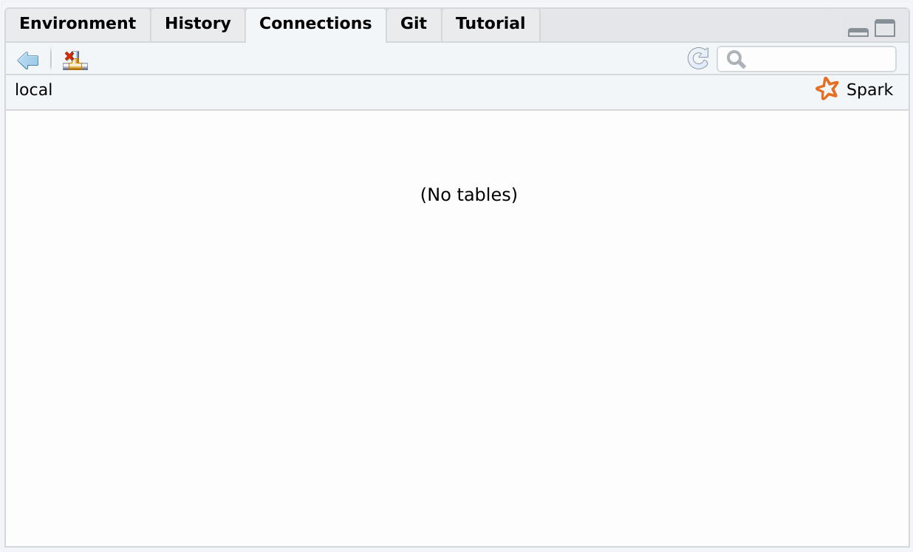
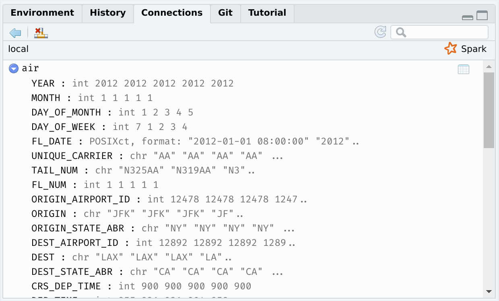
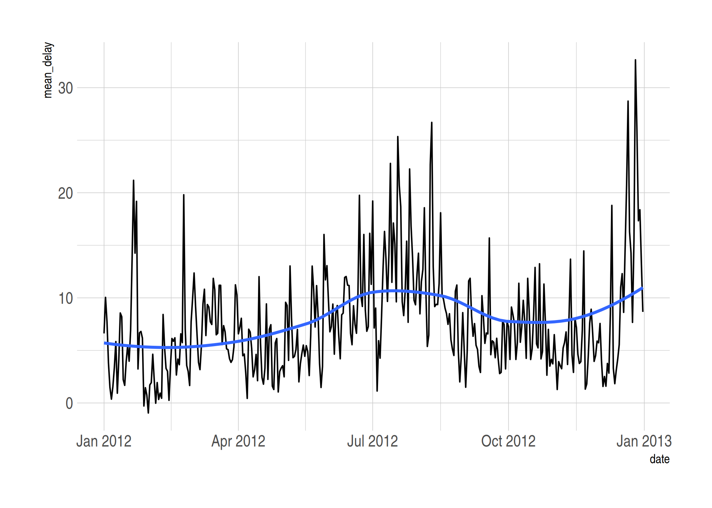
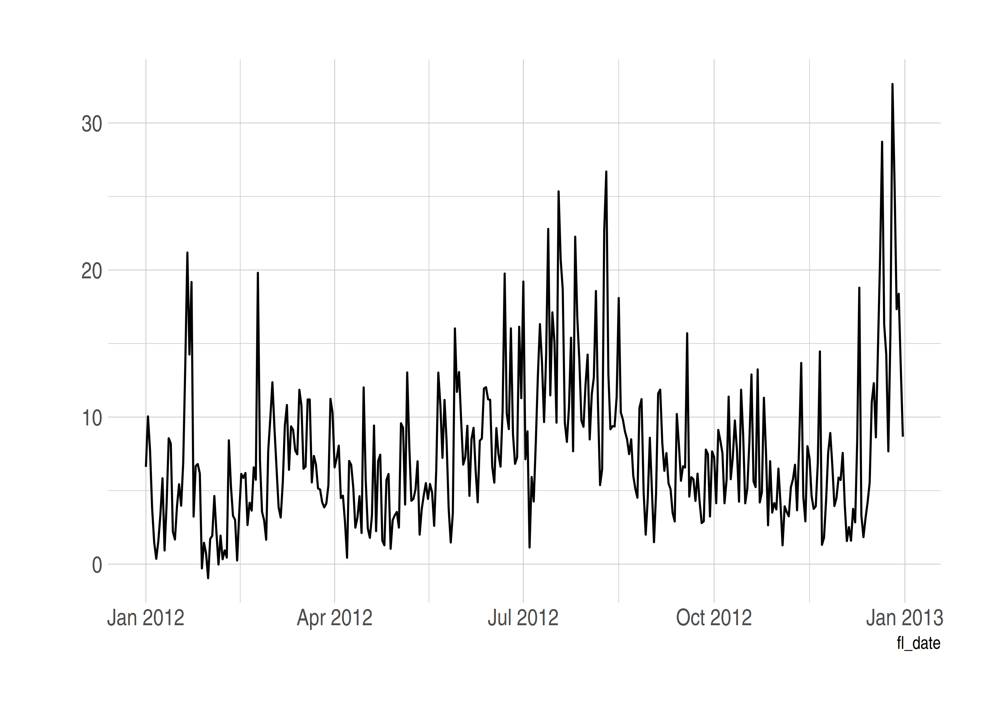
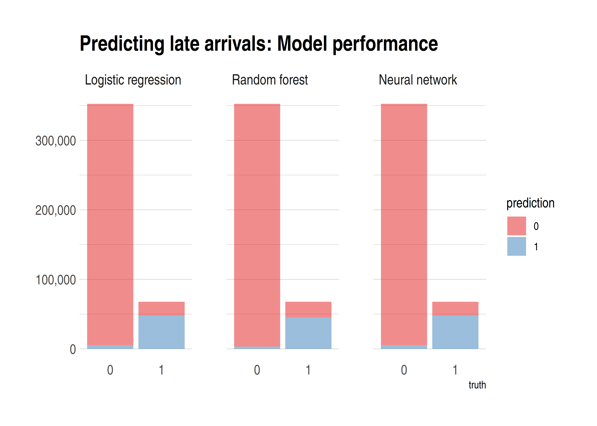

<i>Note: Today's lecture is largely going to be focused on the [**sparklyr**](https://spark.rstudio.com/) package, which provides an R interface to the larger [Apache Spark](https://spark.apache.org/) ecosystem. I want to emphasize ahead of time that Spark is really designed for big data pipelines on an HPC cluster or network. These systems would normally be configured and maintained by your company or university's IT/software engineering team. We're going to emulate these big data pipelines by installing Spark on our local machines, and then explore some of the key concepts through a series of relatively simple examples. My goal is to give you a good sense of how Spark (and **sparklyr**) works and why it's so popular for big data work. The same ideas and functions that we explore today will work at much larger scale.</i>

## Requirements

A lot of work has gone into making a local Spark install as easy as possible. But we've still got quite a few steps to walk through, so please follow all of the below instructions carefully.

### Apache Spark

The **sparklyr** package provides a convenient way to install Spark on your system via the `sparklyr::spark_install()` command. Run this next code chunk interactively in your R session. Note that I am going to install a slightly older version of Spark itself (version 2.4.0 is available as of the time of writing), but I don't think this matters all that much.


```r
if (!require("sparklyr")) install.packages("sparklyr")
# sparklyr::spark_available_versions() ## list all available versions
sparklyr::spark_install(version = "2.3.0")
```

Installation may take a few minutes to complete, depending on your internet connection and system.

### Java 8 

Spark specifically requires Java 8. (Other versions of Java won't work!) This can be a bit finicky, so here are some platform-specific installation tips:

#### Windows 

Download the official installer [here](https://www.java.com/en/download/manual.jsp) and then follow the prompts. Please make sure that you download the 64 bit version if you are using a 64 bit machine (which almost certainly the case). Otherwise you will probably run into memory allocation errors when you try to use Spark.

I recommend that you allow it to install in the default location, which should be something like: `C:\Program Files\Java\jre1.8.0_241`. If you decide on a different install location, please take careful note of your new installation path since you will need that later.

#### Mac

It's possible to download Java 8 [here](https://www.java.com/en/download/manual.jsp). However, this official link appears to causing problems on the latest versions of OSX. Consequently, I recommend that you instead install it using [Homebrew](https://brew.sh/). From your terminal:


```sh
$ brew cask install adoptopenjdk/openjdk/adoptopenjdk8
```

This should install Java 8 to the following location: `/Library/Java/JavaVirtualMachines/adoptopenjdk-8.jdk/Contents/Home`

You can check for all Java installations on your machine by typing in the following command in your terminal:


```sh
$ ls -lh /Library/Java/JavaVirtualMachines/
```

#### Linux

You probably know what you're doing, but I recommend that you install OpenJDK 8 using your distro's package manager. See [here](https://openjdk.java.net/install/). This should install to `/usr/lib/jvm/java-8-openjdk` by default. You can list all installed Java versions on your machine with:


```sh
$ ls -lh /usr/lib/jvm
```

(Those of you on Arch who installed Java OpenJDK --- or OpenJFX --- through the [official repos](https://wiki.archlinux.org/index.php/Java) can also run `$ archlinux-java status`.)

#### Linking Java 8 to R

The Java 8 requirement is somewhat annoying, since you probably (might?) have a newer version of Java installed on your system already. One way to get around this problem is to [replace your current Java installation with Java 8](https://github.com/uc-cfss/Discussion/issues/71). This will automatically make it the default Java environment and is probably the simplest solution. However, I personally don't like the idea of uninstalling the most recent Java version on my computer just to run Spark. In my view, a better solution is to install Java 8 *alongside* your current version. You can then tell R which Java version it should use via an environment variable. This works exactly the same way as when we used environment variables to save secret API keys during our webscraping and cloud computing lectures. (See [here](https://raw.githack.com/uo-ec607/lectures/master/07-web-apis/07-web-apis.html#aside:_safely_store_and_use_api_keys_as_environment_variables) if you missed it.) For example, you can tell R to use Java 8 for the current session by setting a temporary environment variable with the following command.


```r
## NB: Change to the location path of your own Java 8 installation!
# Linux: /usr/lib/jvm/java-8-openjdk
# Mac: /Library/Java/JavaVirtualMachines/adoptopenjdk-8.jdk/Contents/Home
# Windows: C:/Program Files/Java/jre1.8.0_241 ## At time of writing
Sys.setenv(JAVA_HOME = "/path/to/your/java8/installation") 
```

Again, this will only last for the current R session. However, similarly to our approach for storing API keys across sessions, you can make Java 8 the permanent environment for your R work by adding `JAVA_HOME = "/path/to/your/java8/installation"` to your `~/.Renviron` file. 

You can confirm your Java installation by running the following command.


```r
system("java -version")
```

> **Tip:** If you're running Windows, the above command might give you a random number like "127" until you restart your system.

If you're having trouble with Java installation, then please consult the [*Mastering Spark with R*](https://therinspark.com/starting.html#starting-prerequisites) book.

### R packages 

- New: **sparklyr**, **dbplot**
- Already used: **tidyverse**, **hrbrthemes**, **lubridate**, **janitor**, **httr**, **here**

As per usual, the code chunk below will install (if necessary) and load all of these packages for you.


```r
## Load/install packages
if (!require("pacman")) install.packages("pacman")
pacman::p_load(tidyverse, hrbrthemes, lubridate, janitor, httr, sparklyr, dbplot, here)
## My preferred ggplot2 theme (optional)
theme_set(hrbrthemes::theme_ipsum())
```

### Data

Finally, we'll be exploring Spark's capabilities using monthly air traffic data from 2012.^[This will look very familiar to the data that we've already seen in the **nycflights13** package, albeit from a different year and not limited to New York. Note that both of these datasets come from a much larger collection of flight information that is curated by the Research and Innovative Technology Administration (RITA) in the Bureau of Transportation Statistics. Siailrly, Revolution Analytics also offer the possiblity of [downloading](https://packages.revolutionanalytics.com/datasets/AirOnTime87to12) monthly flight data from 1987 to 2012.] The data consist of 12 CSV files that first need to be downloaded from [Revolution Analytics](https://packages.revolutionanalytics.com/datasets/) and then saved to `data/` subdirectory of this lecture. You can do that manually if you like, but here are some commands to do everything from R.


```r
# library(here) ## Already loaded
# library(httr) ## Already loaded
# library(stringr) ## Already loaded (via tidyverse)

dir_path <- here("17-spark/data/")

## Create data sub-directory if it doesn't already exist
if (!dir.exists(dir_path)) dir.create(dir_path)

## Next, we download the 2012 air traffic data from Revolution Analytics...
# First set the base URL
base_url <- "https://packages.revolutionanalytics.com/datasets/AirOnTimeCSV2012/"
# Quick way to get a vector of the hosted CSV files
csvs <- GET(base_url) %>% content("text") %>% str_extract_all("airOT2012...csv") %>% unlist() %>% unique()
# Loop over all the files and download to disk
lapply(
  csvs, 
  function(x) {
    out_path <- paste0(dir_path, x)
    ## Only download the files if they don't already exist
    if (!file.exists(out_path)) {
      GET(
        url = paste0(base_url, x), 
        write_disk(paste0(dir_path, x)), 
        progress()
      )
    }
  }
) 
```

The downloads should take a few minutes. Once they're done, check that everything is in order.


```r
list.files(dir_path)
```

```
##  [1] "airOT201201.csv" "airOT201202.csv" "airOT201203.csv" "airOT201204.csv"
##  [5] "airOT201205.csv" "airOT201206.csv" "airOT201207.csv" "airOT201208.csv"
##  [9] "airOT201209.csv" "airOT201210.csv" "airOT201211.csv" "airOT201212.csv"
## [13] "combined.csv"
```

## What is Spark?

Student presentation time. 

If you're reading this after the fact, then the [Wikipedia page](https://en.wikipedia.org/wiki/Apache_Spark) is a good place to start. As the tagline goes, Spark is a *unified analytics engine for large-scale data processing*. Which is simply to say that Spark provides a common platform for tackling all of the problems that we typically encounter in big data pipelines. This includes distributed data storage, data wrangling, and analytics (machine learning and co.) Spark achieves this by bringing together various sub-components 

- Spark Core (the foundation of the project, enabling things like distributed computing. We'll get back to this in a second.)
- Spark SQL (exactly what it sounds like: a SQL implementation for querying and storing data in Spark)
- MLlib (an extensive machine learning library)
- etc.

Now, at this point you may be asking yourself: "Hang on a minute, haven't we been learning to do all these things in R? Why do we need this Spark stuff if R already provides a (quote unquote) 'unified framework' for our data science needs?" 

The short answer is that Spark can scale in ways that R simply can't. You can move your analysis from a test dataset living on your local computer, to a massive dataset running over a cluster of distributed machines with minimal changes to your code. But at a deeper level, asking yourself the above questions is to miss the point. We will be running all of our Spark functions and analysis from R, thanks to the **sparklyr** package. It will look like R code and it will return output that looks exactly like the tidy output we've come to expect. 

You'll note that Spark is often compared to a predecessor framework for cluster computing and distributed data processing called [(Hadoop) MapReduce](https://en.wikipedia.org/wiki/MapReduce). The key difference between these two frameworks is that Spark allows for in-memory processing, whereas MapReduce relies solely on I/O to disk. (See [here](https://www.scnsoft.com/blog/spark-vs-hadoop-mapreduce) and [here](https://www.quora.com/What-is-the-difference-in-idea-design-and-code-between-Apache-Spark-and-Apache-Hadoop/answer/Shubham-Sinha-202.)) You don't need to worry too much about all this now. It basically means that Spark is faster and better suited to our present needs. Spark also comes with a bunch of really cool extension libraries, which we'll barely scratch the surface of today.

## Big data and Spark

A central limitation of working with big datasets in R (and Stata and Python and virtually every other statistical or programming language) is that everything needs to be loaded in memory. By "memory" I'm talking about RAM, not disk storage. So if your laptop only has (say) 16 GB of RAM then --- even diregarding the memory simply needed to run my OS and other applications --- you are limited to datasets smaller than this size.^[The memory load of dataset doesn't scale perfectly with the disk space it occupies. Indeed, you will often find that a CSV file of X bytes is significantly larger than that when it is read into your R environment. (One reason: Your variables might get converted to special value types like factors or dates that take up more space than their string and numerical equivalents.) However, it's a useful approximation.] 

We've already seen some methods to brute force our way passed this problem. These basically involve using a more powerful computer by spinning up a VM on the cloud (e.g. Google Compute Engine) or using a HPC cluster (e.g. UO's Talapas cluster). We've also talked about "small data problems disguised as big data problems". Perhaps you only need a subset of a large dataset and so the trick is pulling that smaller subset into memory. Our previous lecture on databases was primarily aimed at addressing this issue, where we either need to subset based on specified criteria or simply use an effective sampling strategy.^[We're all trained as applied econometrians so we believe in the valid statistical properties of sampling, right?] 

Spark offers another approach to solving the "in-memory" bottleneck of large datasets. This reflects Spark's fundamental use case for working with distributed files systems and HPC clusters. However, in the examples that follow, I'll demonstrate these properties by instantiating a "local" Spark instance and that allows us to map across multiple files. 

### Lazy evaluation redux

Just to preempt things somewhat, our **sparklyr** workflow is going to closely mimic the **DBI**/**dbplyr** workflow that we saw in the [databases lecture](https://raw.githack.com/uo-ec607/lectures/master/16-databases/16-databases.html). First we'll instantiate a *connection* that can be populated with one or more *tables*. Then we'll reference and perform operations on these tables from R (e.g. submit queries or run statistical models) using the *lazy* evaluation framework provided by the **dplyr** package and friends. 

## Instantiate a (local) Spark connection

Before getting started, we need to instantiate a Spark connection via the `sparklyr::spark_connect()` function. This is going to follow a very similar path to the database connections that we saw in the previous lecture. Note that I am going to specify a "local" Spark instance because I'm working on my laptop, rather than a HPC cluster. (We'll get to some cluster examples at the very end of the lecture.) 


```r
# library(sparklyr) ## Already loaded

## Give our Spark instance a bit more memory
config <- spark_config()
config$spark.executor.memory <- "4G"

## Instantiate a Spark connection
sc <- spark_connect(master = "local", config = config, version = "2.3")
```

> **Tip:** Did you run into an error message to the effect of "Java X is currently unsupported in Spark distributions... Please consider uninstalling Java 9 and reinstalling Java 8"? If so, please see the software requirements discussion for Java 8 (above)[#java_8].

Assuming that you are running these commands in RStudio, you should have seen the "Connections" tab pop open. It is currently empty and should look like this:

</br>


We'll start copying over some tables to our empty connection shortly.

## Working with multiple (large) files

Every data scientist (or applied social scientist) has encountered a situation where they need to combine a collection of data files into a single dataset. These component data files can be pretty large in of themselves, as anyone who has ever worked with Census or weather data from multiple years can attest to. A natural approach to this task is to read all of the files into your data analysis environment (e.g. R or Python) and then combine them within this environment. You may even use a sophisticated loop that does all the reading and merging programmatically in parallel. However, this approach often still runs up against the "in-memory" bottleneck that we spoke about above. 

Luckily, there's a better way. Two ways, in fact, and they both involve Spark (i.e. **sparklyr**). 

1. The first combines Spark and our old friend, the shell.
2. The second uses Spark for distributed analysis.

Let's demonstrate both approaches using the monthly air traffic data for 2012 that we downloaded earlier (see: [Data](#data)). While not "big data" by any conceivable modern definition, each of the 12 CSV files is reasonably meaty at around 100 MB. So we'd use at least ~1.2 GB of RAM to load and merge them all within R. 

### Option 1: Concatenate files in the shell and then use **sparklyr**

*Note: The next section is inspired by [this](http://www.brodrigues.co/blog/2018-02-16-importing_30gb_of_data/) blog post by Bruno Rodrigues. He actually uses a significantly larger dataset (~30 GB) than what I'm going to use here. We won't have time for everyone to download the files during class, but the same general principles apply. Well, with the exception of some additional tweaks that Bruno invokes to avoid memory limitation errors. Read his [blog post](http://www.brodrigues.co/blog/2018-02-16-importing_30gb_of_data/) for more details.*

Regardless of where we combine the data (CSV) files, we first need to make sure that they have a consistent structure (same columns, etc.). Let's compare the top 2 lines of the first and last files using the `head` command.


```bash
$ head -2 data/airOT201201.csv data/airOT201212.csv
```

```
## ==> data/airOT201201.csv <==
## "YEAR","MONTH","DAY_OF_MONTH","DAY_OF_WEEK","FL_DATE","UNIQUE_CARRIER","TAIL_NUM","FL_NUM","ORIGIN_AIRPORT_ID","ORIGIN","ORIGIN_STATE_ABR","DEST_AIRPORT_ID","DEST","DEST_STATE_ABR","CRS_DEP_TIME","DEP_TIME","DEP_DELAY","DEP_DELAY_NEW","DEP_DEL15","DEP_DELAY_GROUP","TAXI_OUT","WHEELS_OFF","WHEELS_ON","TAXI_IN","CRS_ARR_TIME","ARR_TIME","ARR_DELAY","ARR_DELAY_NEW","ARR_DEL15","ARR_DELAY_GROUP","CANCELLED","CANCELLATION_CODE","DIVERTED","CRS_ELAPSED_TIME","ACTUAL_ELAPSED_TIME","AIR_TIME","FLIGHTS","DISTANCE","DISTANCE_GROUP","CARRIER_DELAY","WEATHER_DELAY","NAS_DELAY","SECURITY_DELAY","LATE_AIRCRAFT_DELAY",
## 2012,1,1,7,2012-01-01,"AA","N325AA","1",12478,"JFK","NY",12892,"LAX","CA","0900","0855",-5.00,0.00,0.00,-1,13.00,"0908","1138",4.00,"1225","1142",-43.00,0.00,0.00,-2,0.00,"",0.00,385.00,347.00,330.00,1.00,2475.00,10,,,,,,
## 
## ==> data/airOT201212.csv <==
## "YEAR","MONTH","DAY_OF_MONTH","DAY_OF_WEEK","FL_DATE","UNIQUE_CARRIER","TAIL_NUM","FL_NUM","ORIGIN_AIRPORT_ID","ORIGIN","ORIGIN_STATE_ABR","DEST_AIRPORT_ID","DEST","DEST_STATE_ABR","CRS_DEP_TIME","DEP_TIME","DEP_DELAY","DEP_DELAY_NEW","DEP_DEL15","DEP_DELAY_GROUP","TAXI_OUT","WHEELS_OFF","WHEELS_ON","TAXI_IN","CRS_ARR_TIME","ARR_TIME","ARR_DELAY","ARR_DELAY_NEW","ARR_DEL15","ARR_DELAY_GROUP","CANCELLED","CANCELLATION_CODE","DIVERTED","CRS_ELAPSED_TIME","ACTUAL_ELAPSED_TIME","AIR_TIME","FLIGHTS","DISTANCE","DISTANCE_GROUP","CARRIER_DELAY","WEATHER_DELAY","NAS_DELAY","SECURITY_DELAY","LATE_AIRCRAFT_DELAY",
## 2012,12,1,6,2012-12-01,"AA","N322AA","1",12478,"JFK","NY",12892,"LAX","CA","0900","0852",-8.00,0.00,0.00,-1,20.00,"0912","1148",19.00,"1220","1207",-13.00,0.00,0.00,-1,0.00,"",0.00,380.00,375.00,336.00,1.00,2475.00,10,,,,,,
```

Looks good. Now we'll merge (i.e. concatenate) all the files using the same two-step approach that I showed you --- using a set of much smaller files --- back in the shell lecture (see [here](https://raw.githack.com/uo-ec607/lectures/master/03-shell/03-shell.html#101)). 

  1. Extract the column headers (i.e. first row) from any of the CSV files and redirect them to a new `data/combined.csv` file.
  2. Loop over the remaining files and append everything (except the duplicate column headers) to the just-created `data/combined.csv` file.


```bash
$ head -1 data/airOT201201.csv > data/combined.csv
$ for i in $(ls data/airOT*); do tail -n +2 $i >> data/combined.csv; done
```

These two commands should run pretty quickly (two seconds on my system). The required memory usage should also barely be discernible. Certainly, not even close the amount that would have been required in R. Combined file duly created, we can now read the dataset into our R environment using Spark via the **sparklyr** package.

**Aside 1:** Right now, you might be wondering: "Why not just do this with a regular `read_csv()` call?" Yes, that would work perfectly well. But remember that this simple pedagogical example is only meant to *emulate* a case where we have a dataset that is bigger than memory. Spark provides the framework for working with these huge files, since it is efficiently splits operations between memory and disk. It uses memory (i.e. RAM) whenever it is available, otherwise it will switch to disk I/O. So, the same basic principles would apply if you were to actually start working with very large files.

**Aside 2:** Something else these examples don't demonstrate --- but I want to emphasise nonetheless --- is that Spark can also read compressed files (.gzip, .bz2, etc.). This is obviously important for conserving disk space when dealing with big data.

Okay, time to feed our empty `sc` connection some data by copying over the (pretend) big `combined.csv` file that we created just a few seconds ago. We'll do so using the `sparklyr::spark_read_csv()` function.^[A point of convenience is that **sparklyr** offers intuitive aliases for many base/tidyverse R functions.] In another similarity to our databases lecture, we should give the dataset a unique table name that distinguishes it in the Spark connection panel. I'll call it "air" and then also reference it from R by assigning it to a new object called `air_spark`.^[I'm only giving the R object a different name to avoid confusion. You can certainly call them both "air" if you want.] The next command will take a few seconds to run.


```r
## Read in the file as a Spark object
air_spark <- spark_read_csv(sc, name = "air", path = here("17-spark/data/combined.csv"))
```

The "Connections" tab of your RStudio IDE should now contain the "air" table that we just instantiated to our Spark connection. You can click on it to expand the various columns, or you could click on the spreadsheet icon to see a preview of the dataset in a new RStudio window.

</br>

</br>

> **Tip:** I won't go through it here, but you can open the (native) Spark web interface in your internet browser by typing `spark_web(sc)` in your R console. See [Chapter 2.4.1](https://therinspark.com/starting.html#starting-spark-web-interface) of *Mastering Spark in R* for more details. 

You can also get a (lazy) preview of table by printing the `air_spark` reference object in your R console. 


```r
air_spark
```

```
## # Source: spark<air> [?? x 45]
##     YEAR MONTH DAY_OF_MONTH DAY_OF_WEEK FL_DATE             UNIQUE_CARRIER
##    <int> <int>        <int>       <int> <dttm>              <chr>         
##  1  2012     1            1           7 2012-01-01 08:00:00 AA            
##  2  2012     1            2           1 2012-01-02 08:00:00 AA            
##  3  2012     1            3           2 2012-01-03 08:00:00 AA            
##  4  2012     1            4           3 2012-01-04 08:00:00 AA            
##  5  2012     1            5           4 2012-01-05 08:00:00 AA            
##  6  2012     1            6           5 2012-01-06 08:00:00 AA            
##  7  2012     1            7           6 2012-01-07 08:00:00 AA            
##  8  2012     1            8           7 2012-01-08 08:00:00 AA            
##  9  2012     1            9           1 2012-01-09 08:00:00 AA            
## 10  2012     1           10           2 2012-01-10 08:00:00 AA            
## # … with more rows, and 39 more variables: TAIL_NUM <chr>, FL_NUM <int>,
## #   ORIGIN_AIRPORT_ID <int>, ORIGIN <chr>, ORIGIN_STATE_ABR <chr>,
## #   DEST_AIRPORT_ID <int>, DEST <chr>, DEST_STATE_ABR <chr>,
## #   CRS_DEP_TIME <int>, DEP_TIME <int>, DEP_DELAY <dbl>, DEP_DELAY_NEW <dbl>,
## #   DEP_DEL15 <dbl>, DEP_DELAY_GROUP <int>, TAXI_OUT <dbl>, WHEELS_OFF <int>,
## #   WHEELS_ON <int>, TAXI_IN <dbl>, CRS_ARR_TIME <int>, ARR_TIME <int>,
## #   ARR_DELAY <dbl>, ARR_DELAY_NEW <dbl>, ARR_DEL15 <dbl>,
## #   ARR_DELAY_GROUP <int>, CANCELLED <dbl>, CANCELLATION_CODE <chr>,
## #   DIVERTED <dbl>, CRS_ELAPSED_TIME <dbl>, ACTUAL_ELAPSED_TIME <dbl>,
## #   AIR_TIME <dbl>, FLIGHTS <dbl>, DISTANCE <dbl>, DISTANCE_GROUP <int>,
## #   CARRIER_DELAY <dbl>, WEATHER_DELAY <dbl>, NAS_DELAY <dbl>,
## #   SECURITY_DELAY <dbl>, LATE_AIRCRAFT_DELAY <dbl>, `_c44` <chr>
```

Since I keep referencing the databases lecture, the good news is that all of the **dplyr** verbs and tidyverse syntax carry over to a **sparklyr** table connection. (In the background, these are getting translated to Spark SQL.) Let's create a new data frame that contains the mean departure delay for each day of our table.


```r
# library(tidyverse) ## Already loaded

mean_dep_delay <- 
  air_spark %>%
  group_by(YEAR, MONTH, DAY_OF_MONTH) %>%
  summarise(mean_delay = mean(DEP_DELAY))
```

This works incredibly quickly, but remember that we're dealing with a *lazy* query here. The `mean_dep_delay` object hasn't actually been created yet; it's just a pointer to a set of aspirational commands. To actually execute the query and pull the resulting object into our R environment, we'll use `dplyr::collect()`. At the risk of repeating myself, this is exactly the same approach that we adopted in the databases lecture. 


```r
# mean_dep_delay %>% show_query() ## Show the Spark SQL translation
mean_dep_delay <- collect(mean_dep_delay)
```

```
## Warning: Missing values are always removed in SQL.
## Use `mean(x, na.rm = TRUE)` to silence this warning
## This warning is displayed only once per session.
```

```r
mean_dep_delay
```

```
## # A tibble: 366 x 4
##     YEAR MONTH DAY_OF_MONTH mean_delay
##    <int> <int>        <int>      <dbl>
##  1  2012     1            9      5.84 
##  2  2012     1           17      5.43 
##  3  2012     1           20     13.6  
##  4  2012     1           25      6.67 
##  5  2012     2            7      0.334
##  6  2012     2           29      7.74 
##  7  2012     3           11      9.37 
##  8  2012     4            1      6.58 
##  9  2012     4           11      2.48 
## 10  2012     4           16      5.69 
## # … with 356 more rows
```

All that hard work deserves a nice plot, don't you think? Let's see how departure delays vary over the course of a year. Note that I'm using the **lubridate** package to create some sensible dates.


```r
# library(lubridate) ## Already loaded

mean_dep_delay <- 
  mean_dep_delay %>%
  arrange(YEAR, MONTH, DAY_OF_MONTH) %>%
  mutate(date = ymd(paste(YEAR, MONTH, DAY_OF_MONTH, sep = "-")))

mean_dep_delay %>%
  ggplot(aes(date, mean_delay)) + 
  geom_line() +
  geom_smooth(se = FALSE)
```

<!-- -->

**Bottom line:** Looks like you want to avoid flying over the December and summer holidays. (This kind of deep analysis is what they pay us the big bucks for.)

We'd normally disconnect from our `sc` connection at this point using `spark_disconnect(sc)`, but I want to keep it open for the moment and copy over some new data.

### Option 2: Distributed analysis using **sparklyr**

While the above method is great for showing off the power of the shell and the basic functionality of **sparklyr**, it doesn't demonstrate the core *distributed* functionality of the Spark ecosystem. In particular, Spark is very efficient --- optimised, even --- for working with a distributed files. Our second example is intended to demonstrate this functionality. Note that, while it will involve a pretty simple distributed set of files on our local computer, the same ideas would apply to more complicated cluster setups. 

Let's start by removing that `combined.csv` file from earlier, just to convince ourselves that we're not somehow reading in the concatenated file. We want to make sure that we're working across a distributed set of files.


```r
file.remove(here("17-spark/data/combined.csv"))
```

```
## [1] TRUE
```

```r
list.files(here("17-spark/data/"))
```

```
##  [1] "airOT201201.csv" "airOT201202.csv" "airOT201203.csv" "airOT201204.csv"
##  [5] "airOT201205.csv" "airOT201206.csv" "airOT201207.csv" "airOT201208.csv"
##  [9] "airOT201209.csv" "airOT201210.csv" "airOT201211.csv" "airOT201212.csv"
```

Good. We're only left with the individual monthly CSVs. Now we instantiate a new spark connection. (which we'll again call "sc" but that doesn't matter). Similar to the earlier shell-based approach where we extracted the column names from the first file, we'll read this structure into a separate vector called `col_names`. I'll also use the `janitor` package to clean up the column names.


```r
# library(janitor) ## Already loaded

col_names <- 
  read.csv("data/airOT201201.csv", nrows = 1, stringsAsFactors = F) %>% 
  clean_names() %>%
  names()
```

Now, we read in the distributed files. We'll be using the same `spark_read_csv()` function as before, but now I'll just use the path for the whole `data/` directory rather than any individual CSVs. I'll call this new (distributed) Spark object `flights`, but only to keep it clear that this is not the same object as before.


```r
flights <- 
  spark_read_csv(
  sc,
  name = "flights",
  path = here("17-spark/data/"),
  memory = FALSE,
  columns = col_names,
  infer_schema = FALSE
  )

## Count rows to prove all 6+ million obs have been read in
count(flights)
```

```
## # Source: spark<?> [?? x 1]
##         n
##     <dbl>
## 1 6096762
```

You should now be able to see the second "flights" table in your connections tab. (Refresh the tab if not.) This next step is not strictly necessary, but since we'll no longer be using the original "air" table anymore, it's safe to remove it and conserve memory for other Spark objects. We can do this with the `dplyr::db_drop_table()` function.


```r
db_drop_table(sc, "air")
```

```
## [1] 0
```

Okay, let's query and mutate some columns from our new "flights" table.^[You might note that that I'm not using **lubridate** for the date conversions in the query that follows. That's because Spark relies on Hive functions for built-in aggregation, including datetime operations. See [here](https://spark.rstudio.com/dplyr/#hive-functions).] I'm also going to go ahead and cache the resulting table in Spark's memory allocation to improve performance. There are various configurations and considerations that we'd normally want to weigh before caching a Spark table --- see [here](https://spark.rstudio.com/guides/caching/) --- but the default settings will suffice for this simple example. In truth, the benefit from explicit caching is not clear for this particular example, since the whole dataset is small enough to be held in memory regardless.^[By default, local Spark instances only request 2 GB of memory for the Spark driver. However, you can easily change this by requesting a larger memory allocation (among other features) via the `config` argument. See the **sparklyr** [website](https://spark.rstudio.com/deployment/#configuration) or [Chapter 9](https://therinspark.com/tuning.html) of *Mastering Spark with R* for more details.] But I again just want to demonstrate some general principles that would apply when working with much bigger data too. 


```r
flights_cached <- 
  flights %>% 
  select(
    fl_date, month, dep_time, arr_time, arr_delay, dep_delay, distance,
    sched_dep_time = crs_dep_time, sched_arr_time = crs_arr_time
    ) %>%
  ## Can't use lubridate functions like ymd(), but as.Date() works for Spark SQL tables 
  mutate(fl_date = as.Date(fl_date)) %>%
  ## Convert all other variables to numeric
  mutate_at(vars(-fl_date), as.numeric) %>%
  ## Register resulting Spark SQL in Spark connection
  sdf_register("flights_cached")

## Cache it (i.e. load in memory for performance)
tbl_cache(sc, "flights_cached")

## Preview it
flights_cached
```

```
## # Source: spark<flights_cached> [?? x 9]
##    fl_date    month dep_time arr_time arr_delay dep_delay distance
##    <date>     <dbl>    <dbl>    <dbl>     <dbl>     <dbl>    <dbl>
##  1 2012-06-01     6      855     1202       -13        -5     2475
##  2 2012-06-02     6      854     1150       -25        -6     2475
##  3 2012-06-03     6      851     1148       -27        -9     2475
##  4 2012-06-04     6      850     1213        -2       -10     2475
##  5 2012-06-05     6      849     1138       -37       -11     2475
##  6 2012-06-06     6      857     1141       -34        -3     2475
##  7 2012-06-07     6      852     1138       -37        -8     2475
##  8 2012-06-08     6      849     1127       -48       -11     2475
##  9 2012-06-09     6      913     1155       -20        13     2475
## 10 2012-06-10     6      853     1147       -28        -7     2475
## # … with more rows, and 2 more variables: sched_dep_time <dbl>,
## #   sched_arr_time <dbl>
```

> **Tip:** Open the Spark web UI (`spark_web(sc)`) and click the "Storage" tab to see which of your tables are cached and held in memory.

Remembering that "flights_cached" still only exists as a Spark table, here's something cool: We can use the [**dbplot**](https://db.rstudio.com/dbplot/) package to perform plot calculations *inside* the Spark connection (i.e. database). While this might seem like overkill for this particular example --- it is --- this database plotting functionality is extremely useful extracting insights from large database connections.


```r
# library(dbplot) ## Already loaded

flights_cached %>%
  dbplot_line(fl_date, mean(dep_delay))
```

<!-- -->

And there we have our same plot from before, but now executed from inside the Spark table, which in turn was created from a directory of distributed files. Pretty cool and extremely powerful once you starting working with big data proper.

## Machine Learning

Some of the most exciting applications of Spark involve machine learning; both through its built-in [MLlib](http://spark.rstudio.com/mlib/) library and its (seemless) interface to external platforms like H2O's [Sparkling Water](https://www.h2o.ai/sparkling-water/). There's a lot to cover here and I'm not going to be able to explain everything in depth. (We'll have a dedicated intro-to-machine-learning lecture next week.) But here's a simple example that uses our cached flights data to predict arrival delays with different algorithms.

### Prepare and the data

First, I'm going to prepare the data. For this simple example, I'm not going to worry about scaling and any of the other feature engineering tricks that we'd normally heed in a real-life ML problem. Instead, I'm just going to create a binary (1/0) variable called "late", which records whether a flight arrived more than 15 minutes behind schedule. In other words, this is going to be a *classification* problem.

As ever with prediction algorithms, we also need to partition our data into random samples for testing and validation. This will help us avoid overfitting. In this case, I'm only going to use 10% of the data for model building and testing. This 10% sample will in turn be split 30-70 between training and testing data, respectively.


```r
flights_sample <- 
  flights_cached %>%
  filter(!is.na(arr_delay)) %>%
  ## Create our binary outcome variable: "late" 
  ## Measures whether arrival > 15 min delayed
  ft_binarizer(input_col = "arr_delay", 
               output_col = "late", 
               threshold = 15) %>%
  ## Create a new discretized predictor variable: dep_block
  ## Divides departure times into six evenly-spaced "blocks" (i.e. 4 hours apart)
  ft_bucketizer(input_col = "sched_dep_time", 
                output_col = "dep_block", 
                splits = seq(0, 2400, by = 400)) %>% 
  mutate(dep_block = paste0(as.integer(dep_block))) %>%
  ## Partition the data: Randomly sample 10% for training (7%) and testing (3%)
  sdf_random_split(train = 0.03, test = 0.07, other = 0.9,
                   seed = 123)
```

Register and then cache the sampled tables in our Spark instance.


```r
flights_train <- sdf_register(flights_sample$train, "flights_train")
tbl_cache(sc, "flights_train")

tally(flights_train)
```

```
## # Source: spark<?> [?? x 1]
##        n
##    <dbl>
## 1 180045
```

### Models

I'm going to compare three different models/algorithms: 1) logistic regression, 2) random forest, and 3) neural network. The point is simply to demonstrate the flexibility of Spark's MLlib and give you an idea of the required syntax. I am *not* trying to optimize model performance here. 

With the appropriate caveat out of the way, it will prove convenient to save the (very simple) formula that I'll be using for all three models as its own object. This will allow me to quickly recycle it quickly with minimal typing or typos... And is thus a good habit to get into for the more complex types of comparative analyses that you will confront in real-life.


```r
fml <- late ~ dep_delay + dep_block
```


#### Logistic regression

We start with a simple logistic regression. For this first model/algorithm class I'll walk you through the individual modeling steps in more detail. The function of interest here is `sparklyr::ml_logistic_regression`.


```r
log_mod <- 
  flights_train %>%
  ml_logistic_regression(fml)

summary(log_mod)
```

```
## Coefficients:
## (Intercept)   dep_delay dep_block_2 dep_block_3 dep_block_4 dep_block_1 
## -3.05239256  0.14941256 -0.15615644 -0.12356241 -0.09983516 -0.05681138 
## dep_block_5 
## -0.08468994
```

Now, we turn to our holdout "test" (i.e. holdout) sample to run predictions on data that the model has never seen, using the `sparklyr::ml_predict()` function.


```r
log_pred <- ml_predict(log_mod, flights_sample$test)

## Preview the prediction results
log_pred %>% 
  select(late, prediction, probability) %>% 
  head(5)
```

```
## # Source: spark<?> [?? x 3]
##    late prediction probability
##   <dbl>      <dbl> <list>     
## 1     0          0 <dbl [2]>  
## 2     0          0 <dbl [2]>  
## 3     1          1 <dbl [2]>  
## 4     0          0 <dbl [2]>  
## 5     1          1 <dbl [2]>
```

How did we do overall?


```r
## Summary metrics:
ml_binary_classification_evaluator(log_pred) ## area under ROC
```

```
## [1] 0.9289266
```

```r
ml_multiclass_classification_evaluator(log_pred) ## F1 score
```

```
## [1] 0.9368919
```

```r
## We'll also create a confusion matrix for use later
log_cmat <-
  log_pred %>%
  group_by(late, prediction) %>%
  tally() %>%
  collect()
```

#### Random forest

Second, we have a random forest model.


```r
## Train the RF model
rf_mod <- 
  flights_train %>%
  ml_random_forest(fml, type = "classification")

## Run predictions on test (i.e. holdout) sample
rf_pred <- ml_predict(rf_mod, flights_sample$test)

## Preview the prediction results
# rf_pred %>% 
#   select(late, dep_block, prediction) %>% 
#   head(5)

## Summary metrics:
ml_binary_classification_evaluator(rf_pred) ## area under ROC
```

```
## [1] 0.9149249
```

```r
ml_multiclass_classification_evaluator(rf_pred) ## F1 score
```

```
## [1] 0.9362383
```

```r
## Create confusion matrix
rf_cmat <-
  rf_pred %>%
  group_by(late, prediction) %>%
  tally() %>%
  collect()
```

#### Neural network

Third, we'll train a (feedforward) neural network model with three layers.


```r
## Train the neural net
## Note: The number in the first layer must correspond to the number of input 
## features; in this case 6 (i.e. 1 for dep_delay + 5 for the dep_block dummies
## so as to avoid the dummy variable trap). Similarly, the last layer must 
## correspond to the number of output classes; in this case 2 (i.e. late or not 
## late.) The intermediate layers are flexible.
nnet_model <- 
  flights_train %>%
  ml_multilayer_perceptron_classifier(fml, layers = c(6, 3, 2))

## Run predictions on test (i.e. holdout) sample
nnet_pred <- ml_predict(nnet_model, flights_sample$test)

## Preview the prediction results
# nnet_pred %>%
#   select(late, dep_block, prediction) %>%
#   head(5)

## Summary metrics:
ml_binary_classification_evaluator(nnet_pred) ## area under ROC
```

```
## [1] 0.9287666
```

```r
ml_multiclass_classification_evaluator(nnet_pred) ## F1 score
```

```
## [1] 0.9368939
```

```r
## Create confusion matrix
nnet_cmat <-
  nnet_pred %>%
  group_by(late, prediction) %>%
  tally() %>%
  collect()
```


#### Model comparison

We can compare our three confusion matrices now. The logistic model does (slightly) better on true positives, whilst the random forest does (slightly) better on true negatives. The neural net is somewhere in the middle. All three tend to underestimate the number of late arrivals.


```r
bind_rows(
  log_cmat %>% mutate(mod = "Logistic regression"), 
  rf_cmat %>% mutate(mod = "Random forest"),
  nnet_cmat %>% mutate(mod = "Neural network")
  ) %>% 
  pivot_wider(names_from = mod, values_from = n)
```

```
## # A tibble: 4 x 5
##    late prediction `Logistic regression` `Random forest` `Neural network`
##   <dbl>      <dbl>                 <dbl>           <dbl>            <dbl>
## 1     1          1                 48326           47284            48311
## 2     0          1                  5468            4494             5449
## 3     1          0                 19852           20894            19867
## 4     0          0                347219          348193           347238
```

And here's the same information in plot form.


```r
bind_rows(
  log_cmat %>% mutate(mod = "Logistic regression"), 
  rf_cmat %>% mutate(mod = "Random forest"), 
  nnet_cmat %>% mutate(mod = "Neural network")
  ) %>%
  mutate(mod = factor(mod, levels = c("Logistic regression", "Random forest", "Neural network"))) %>%
  mutate_at(vars(late, prediction), factor) %>%
  ggplot(aes(x = late, y = n, fill = prediction)) +
  geom_col(alpha = 0.5) + 
  scale_fill_brewer(palette = "Set1") +
  scale_y_continuous(labels = scales::comma) + 
  labs(
    title = "Predicting late arrivals: Model performance",
    x = "observation"
    ) +
  facet_wrap(~ mod) + 
  theme(
    axis.title.y = element_blank(),
    panel.grid.major.x = element_blank()
    )
```

<!-- -->


## Disconnect

Finally, let's disconnect from our Spark connection.


```r
spark_disconnect(sc)
```

## Bonus: Spark in the cloud (GCP Dataproc)

This is a bonus section of live material that I've prepared if we have time.

## Further reading and resources

- [*Mastering Spark with R*](https://therinspark.com/) by Javier Luraschi, Kevin Kuo, and Edgar Ruiz.
- The [**sparklyr** website](https://spark.rstudio.com/).
